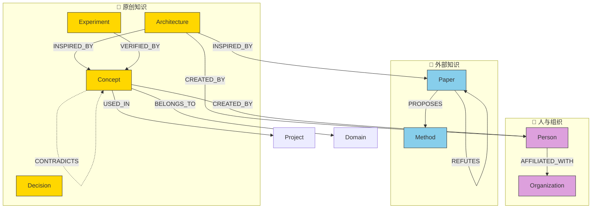

# ADR-001: 知识图谱 Schema 设计

**状态**: ✅ Confirmed
**确认日期**: 2026-04-14
**确认人**: Suhua  
**日期**: 2026-04-14  
**决策者**: Suhua  
**上下文**: PRD V1.1 已确认，需要定义知识图谱的实体类型、关系类型和存储格式  

---

## 1. 背景

PKGM 的核心能力是将离散的知识条目通过**图谱关系**连接起来。  
Schema 是图谱的骨架，决定了我们能表达什么知识、如何查询、如何扩展。

### 设计输入来源

| 来源 | 借鉴点 |
|------|--------|
| **CortiX/KnowledgeGraph** | 3W+3C Schema 原则、Paper/Method 实体、SURPASSES/REFUTES 关系、Agentic Graph-RAG 检索 |
| **Karpathy LLM-Wiki** | Code-first（可执行/可查询）、第一性原理（概念依赖链）、增量学习（知识版本演进） |
| **Graphify/Graphifyy** | 每个 Markdown 文件 = 图谱节点、`[[wikilink]]` = 隐式边、自动图可视化、双向链接 |
| **溯源体系（前序讨论）** | source_type/confidence 标注、知识血统追踪 |

### 核心设计原则（融合四条来源）

| 原则 | 来源 | 具体做法 |
|------|------|---------|
| **一图两用** | Graphifyy | `[[wikilink]]` 同时是人读的链接 + 机器解析的隐式边 |
| **显式关系** | KnowledgeGraph | 除了隐式边，还有 `DEPENDS_ON`/`INSPIRED_BY` 等**类型化边** |
| **Code-first** | Karpathy | Schema 必须是**机器可解析的 YAML**，不是文档描述 |
| **溯源内建** | 溯源体系 | 每个节点自带 provenance 属性，不是外挂 |
| **渐进扩展** | KnowledgeGraph 5步法 | 先定义核心类型，后续按需扩展，不一次性设计太多 |

---

## 2. 决策

### 2.1 实体类型 (Node Types)

PKGM 定义 **12 种实体类型**，分两个层次：

#### A. 核心类型（Phase 1 必须实现，8 种）

| ID | 实体类型 | 说明 | 主要来源目录 | 核心属性 |
|----|---------|------|------------|---------|
| N01 | **Concept** | 技术概念定义 | 04_Knowledge 各级目录 | `name`, `domain`, `definition`, `aliases[]`, `tags[]` |
| N02 | **Architecture** | 架构设计文档 | 04_Knowledge (各领域), 05_Project | `name`, `project`, `version`, `status`, `diagram` |
| N03 | **Decision** | 技术决策记录 (ADR) | 04_Knowledge, 05_Project | `id`, `context`, `decision`, `status`, `date` |
| N04 | **Experiment** | 实验/验证记录 | 04_Knowledge (各领域) | `name`, `hypothesis`, `result`, `date`, `evidence[]` |
| N05 | **Paper** | 外部学术论文 | 00_Raw_Sources/papers | `title`, `year`, `authors[]`, `doi`, `venue`, `abstract`, `status` |
| N06 | **Method** | 技术方法/算法 | 00+04 均可 | `name`, `category`, `description`, `source_paper` |
| N07 | **Person** | 人物 | 00+04 均可 | `name`, `role`, `affiliation`, `notable_work[]` |
| N08 | **Organization** | 组织/公司/实验室 | 00+04 均可 | `name`, `type`, `url`, `notable_projects[]` |

#### B. 扩展类型（Phase 2+ 按需添加，4 种）

| ID | 实体类型 | 说明 | 核心属性 |
|----|---------|------|---------|
| N09 | **CodePattern** | 代码模式/最佳实践 | `name`, `language`, `code_ref`, `complexity` |
| N10 | **Project** | 项目元数据 | `name`, `repo`, `status`, `tech_stack[]` |
| N11 | **Tool** | 工具/框架 | `name`, `category`, `url`, `alternatives[]` |
| N12 | **Question** | 待研究问题 | `question`, `priority`, `status`, `related_concepts[]` |

**实体属性通用字段**（所有实体自动拥有）：

```yaml
# 每个 Wiki 页面的 frontmatter 自动包含
source_type: original|primary|secondary|tertiary   # 知识来源类型
source_ref: "来源描述"                              # 具体来源
confidence: 1|2|3|4|5                              # 置信度
verified_by: "验证方式"                              # 如何验证的
created: 2026-04-14                                # 创建日期
updated: 2026-04-14                                # 最后更新日期
tags: [tag1, tag2]                                 # 标签
```

---

### 2.2 关系类型 (Edge Types)

PKGM 定义 **15 种关系类型**，分三个层次：

#### A. 知识连接关系（核心，8 种）

| ID | 关系类型 | 方向 | 说明 | 示例 | 属性 |
|----|---------|------|------|------|------|
| R01 | **DEPENDS_ON** | Concept → Concept | 概念依赖（理解 A 需要先理解 B） | CUDA Warp Divergence → SIMT Model | `strength: strong|weak` |
| R02 | **INSPIRED_BY** | Architecture → Paper\|Concept | 架构灵感来源 | AOS-Universal → Transformer | `aspect: "具体受启发的方面"` |
| R03 | **IMPLEMENTS** | CodePattern\|Architecture → Concept | 代码/架构实现了某个概念 | PTX-EMU → PTX 指令集仿真 | `completeness: 0-100%` |
| R04 | **VERIFIED_BY** | Concept → Experiment | 概念被实验验证 | 合并访问 → 性能测试报告 | `result: confirmed|refuted|partial` |
| R05 | **OBSOLETES** | Concept → Concept | 新知识淘汰旧知识 | Hopper 缓存策略 → Ampere 策略 | `reason: "淘汰原因"` |
| R06 | **REFINES** | Concept → Concept | 深化/细化已有概念 | Attention → Multi-Query Attention | `detail_level: higher` |
| R07 | **CONTRADICTS** | Concept ↔ Concept | 互相矛盾的知识 | 128-byte vs 64-byte 对齐 | `context: "矛盾的具体方面"` |
| R08 | **BELONGS_TO** | Concept → Domain\|Topic | 归类到某个知识领域/主题 | CUDA 概念 → GPU Architecture | - |

#### B. 学术引用关系（来自 KnowledgeGraph，4 种）

| ID | 关系类型 | 方向 | 说明 | 示例 | 属性 |
|----|---------|------|------|------|------|
| R09 | **CITES** | Paper → Paper | 引用关系 | Attention → Sequence-to-Sequence | `context: "引用上下文"` |
| R10 | **SURPASSES** | Paper → Paper | 性能超越 | LLaMA-3 → Mistral-7B | `metric`, `value_delta`, `dataset` |
| R11 | **REFUTES** | Paper → Paper | 结论反驳/证伪 | 论文A → 论文B 的核心假设 | `reason`, `evidence` |
| R12 | **PROPOSES** | Paper → Method | 论文提出方法 | Attention Is All You Need → Transformer | - |

#### C. 人与组织关系（3 种）

| ID | 关系类型 | 方向 | 说明 | 示例 |
|----|---------|------|------|------|
| R13 | **CREATED_BY** | Architecture\|Concept → Person | 谁创造/设计的 | AOS-Universal → Suhua |
| R14 | **AFFILIATED_WITH** | Person → Organization | 所属组织 | Karpathy → OpenAI |
| R15 | **USED_IN** | Concept\|Method → Project | 被哪个项目使用 | Transformer → CortiX |

---

### 2.3 存储格式（Obsidian 兼容）

这是本次 ADR 的核心决策。**融合 Graphifyy + KnowledgeGraph 理念**：

> **每个 Markdown 文件 = 图谱节点**  
> **每个 `[[wikilink]]` = 隐式无类型边**  
> **每个 frontmatter 中的 `relations` 字段 = 显式类型化边**

#### 页面结构模板

```markdown
---
title: "CUDA Warp Divergence"
type: concept                        # 实体类型（小写）
domain: "01_GPU_Architecture"        # 所属知识领域
source_type: primary                 # provenance
source_ref: "NVIDIA CUDA C Programming Guide, Ch.32"
source_url: "https://docs.nvidia.com/cuda/..."
confidence: 4                        # 1-5 星
tags: [cuda, gpu, performance, warp]
aliases: [warp divergence, branch divergence]
created: 2026-04-14
updated: 2026-04-14

# === 关系定义（Graphifyy 风格：机器解析的关键区） ===
relations:
  depends_on:
    - "[[SIMT Execution Model]]"
    - "[[CUDA Warp]]"
  verified_by:
    - "[[PTX-EMU: Warp Divergence 性能测试]]"
  contradicts:
    - target: "[[CUDA 合并访问策略 v1]]"
      context: "Hopper 架构行为已改变"
  belongs_to:
    - "[[01_GPU_Architecture]]"
---

# CUDA Warp Divergence

## 定义

当 warp 内的线程执行不同分支时，硬件会串行执行每个分支路径...

## 我的理解 🧠

这本质上是一个隐式的 barrier + predication 机制...

## 来源 📖

> 来源: [[primary]] NVIDIA CUDA C Programming Guide

## 关联

- 依赖: [[SIMT Execution Model]], [[CUDA Warp]]
- 验证: [[PTX-EMU: Warp Divergence 性能测试]]
- 冲突: [[CUDA 合并访问策略 v1]]
```

#### 格式设计说明

| 设计元素 | 作用 | 兼容性 |
|---------|------|--------|
| `type: concept` | 声明节点类型，机器解析用 | Obsidian 忽略，Agent 使用 |
| `relations:` 区 | **类型化边的定义**，YAML 格式，可程序解析 | Obsidian 忽略，Agent 解析建图 |
| 正文 `[[wikilink]]` | 隐式边 + 人读链接 | Obsidian 原生支持，Agent 提取为无类型边 |
| `source_type` / `confidence` | 溯源属性 | 机器可读，人也可看 |
| `aliases[]` | 概念别名，解决同名异义 | Graphifyy 节点消歧用 |
| `domain` | 知识领域归属，对应 04_Knowledge 一级目录 | 用于过滤和导航 |

#### 隐式边 vs 显式边

```
隐式边（自动）:
  页面A 中出现 [[页面B]] → 生成 A --(linked_to)--> B

显式边（人工/Agent 标注）:
  relations.depends_on: ["[[页面B]]"] → 生成 A --(DEPENDS_ON)--> B

关系优先级:
  显式边覆盖隐式边
  即：如果 relations 中声明了 DEPENDS_ON，就不再生成 linked_to
```

---

### 2.4 图谱构建规则

#### 规则 1: 文件 → 节点映射

```
mynotes/04_Knowledge/01_GPU_Architecture/generations/ampere.md
  → 节点: {id: "ampere", type: "concept", title: "Ampere GPU Architecture"}

mynotes/00_Raw_Sources/papers/attention-is-all-you-need.pdf
  → 节点: {id: "attention-is-all-you-need", type: "paper", title: "Attention Is All You Need"}

mynotes/01_Wiki/concepts/cuda-warp-divergence.md
  → 节点: {id: "cuda-warp-divergence", type: "concept", title: "CUDA Warp Divergence"}
```

#### 规则 2: 关系发现策略

| 发现方式 | 描述 | 置信度 |
|---------|------|--------|
| **显式声明** | `relations:` 区中明确定义 | ⭐⭐⭐⭐⭐ |
| **隐式链接** | 正文中出现 `[[wikilink]]` | ⭐⭐⭐ |
| **Agent 推断** | Agent 分析文本后建议的关系 | ⭐⭐（需人工确认） |

#### 规则 3: 双向链接（Graphifyy 风格）

```
页面A 的 relations.depends_on 包含 [[页面B]]
  → 页面B 自动获得 backlinks: [[页面A]] (DEPENDS_ON reverse)
  → Obsidian 的 Backlinks 面板自动显示

这不需要写入页面B 的文件，而是 Agent 在图谱构建时动态计算。
```

#### 规则 4: 关系属性

对于有属性的关系（如 SURPASSES 需要 metric, value_delta），使用扩展格式：

```yaml
relations:
  surpasses:
    - target: "[[Mistral-7B]]"
      metric: "MMLU Score"
      value_delta: "+5.2%"
      dataset: "MMLU-57"
  verified_by:
    - target: "[[PTX-EMU: Warp Divergence 性能测试]]"
      result: "confirmed"
      date: "2026-04-14"
```

---

### 2.5 扩展机制

#### 新增实体类型

```yaml
# 在 02_System/schema.yaml 中添加
entity_types:
  MyNewType:
    description: "..."
    attributes:
      - name: "attr1"
        type: string
        required: true
      - name: "attr2"
        type: number
        required: false
```

#### 新增关系类型

```yaml
# 在 02_System/schema.yaml 中添加
relation_types:
  MY_NEW_RELATION:
    description: "..."
    from: ["Concept", "Architecture"]    # 允许的源类型
    to: ["Concept", "Method"]             # 允许的目标类型
    directed: true                        # 是否有方向
    properties:                           # 关系属性（可选）
      - name: "weight"
        type: number
```

#### 扩展原则

1. **向后兼容**: 新增类型不影响已有页面
2. **Schema 版本化**: `schema.yaml` 带版本号，Agent 按版本解析
3. **不删除**: 废弃的类型标记为 `deprecated`，不物理删除

---

## 3. Schema 图谱可视化



---

## 4. 影响分析

### 正面影响

| 影响 | 说明 |
|------|------|
| **Obsidian 原生支持** | `[[wikilink]]` + frontmatter，Obsidian 完全兼容 |
| **Agent 可解析** | YAML frontmatter 是标准格式，任何 LLM/脚本都能读取 |
| **Graphifyy 兼容** | 文件=节点，链接=边，可直接用 Graphifyy 可视化 |
| **可演进** | Schema 可扩展，不影响已有数据 |
| **人机协同** | 人写 `[[wikilink]]` 就够了，Agent 可以推断更复杂的关系 |

### 负面影响 / 风险

| 风险 | 缓解措施 |
|------|---------|
| YAML frontmatter 写错导致解析失败 | Agent 写入时自动校验 Schema |
| 关系定义过多增加维护负担 | Phase 1 只实现核心 8 种关系 |
| `[[wikilink]]` 目标不存在（孤儿链接） | scan.py 定期检测并报告 |
| 不同人对同一概念用不同名字 | `aliases[]` 字段 + Agent 消歧 |

---

## 5. 替代方案

| 方案 | 优点 | 缺点 | 未选原因 |
|------|------|------|---------|
| JSON 侧边文件（.graph.json） | 结构更灵活 | 与 Markdown 文件分离，编辑时看不到关系 | Obsidian 不友好，维护成本高 |
| Neo4j 图数据库 | 查询能力强 | 引入外部依赖，不符合 Git-based 原则 | 过度设计，Phase 1 不需要 |
| Obsidian Dataview 查询 | 生态成熟 | 查询能力有限，不支持复杂图谱遍历 | 可以作为前端补充，但不能作为底层 |
| 纯 `[[wikilink]]` 无类型边 | 最简单 | 无法区分依赖/灵感/验证等不同关系 | 信息量不足，无法支持 Graph-RAG |

---

## 6. 下一步

| 任务 | 输出 | 负责人 |
|------|------|--------|
| 定义 `02_System/schema.yaml` | Schema 机器可读文件 | Agent |
| 创建 Wiki 页面模板 | `02_System/templates/` 目录 | Agent |
| 生成首批示例页面 | 3-5 个概念页面示例 | Agent |
| 验证 Obsidian 兼容性 | 在 Obsidian 中打开确认 | Suhua |

---

## 7. 修订历史

| 日期 | 版本 | 变更 |
|------|------|------|
| 2026-04-14 | V1.0 Draft | 初始版本，融合 KnowledgeGraph + Karpathy + Graphifyy 理念 |

---

`// -- CTO 输出，待老板评审 --`