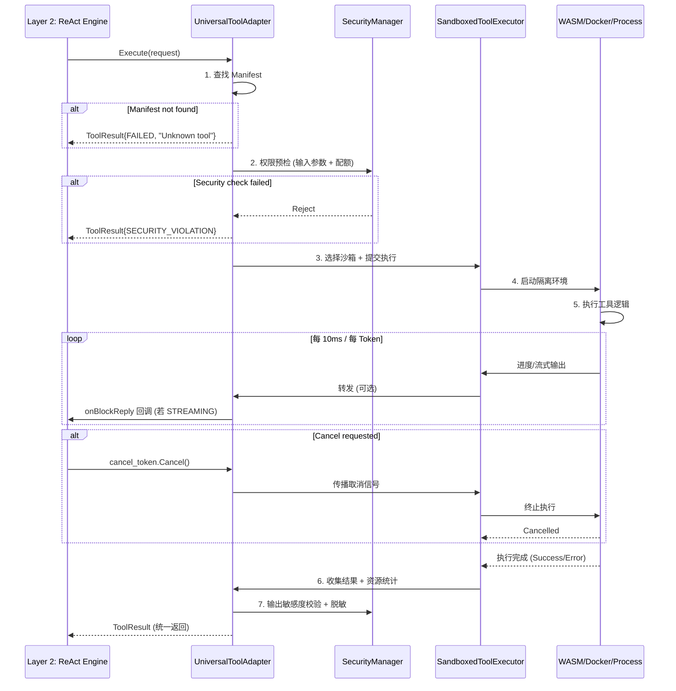

# AOS-Universal Tool Protocol Specification

> **文档版本**：v1.0  
> **适用架构**：AOS-Universal v3.0 (强内核 + 灵活外壳)  
> **生效日期**：2026-03-22  
> **约束前提**：仅本地部署，无云端依赖，完全离线可用

---

## 1. 文档概述

### 1.1 设计目标

本规范定义 AOS-Universal 架构中**通用工具接口协议**，实现：

| 目标 | 说明 |
|------|------|
| **统一抽象** | 将 Browser/Shell/File/API 等异构工具抽象为统一 `Tool` 接口 |
| **契约先行** | 通过 `ToolManifest` 声明式定义工具能力，支持静态分析与动态注册 |
| **安全隔离** | 明确沙箱边界、资源配额、权限策略，防止工具滥用 |
| **执行透明** | 同步/异步/流式执行模式对上层协程透明，统一返回 `Task<ToolResult>` |
| **向后兼容** | 保留 v1.0/v2.0 浏览器专用优化（KV Hint、DOM Hash），通用化不牺牲专用性能 |

### 1.2 适用范围

```
✅ 适用：
• 内置工具：BrowserTool, FileSystemTool, ShellTool, APITool
• 第三方插件：通过 Manifest 动态注册的自定义工具
• 工具链编排：DAG 工作流中的工具节点依赖分析

❌ 不适用：
• 纯内存函数调用（无副作用、无沙箱需求）
• 云端远程过程调用（违反离线约束）
```

### 1.3 术语定义

| 术语 | 定义 |
|------|------|
| `Tool` | 可被 Agent 调用的原子操作单元，具有明确输入/输出/副作用 |
| `ToolManifest` | 工具的元数据契约，描述能力、资源、安全策略 |
| `Sandbox` | 工具执行的隔离环境（WASM/Docker/Process/Chroot） |
| `ExecutionMode` | 工具执行模式：`SYNC`/`ASYNC`/`STREAMING` |
| `DataSensitivity` | 数据密级标签：`PUBLIC`/`INTERNAL`/`SECRET`/`RESTRICTED` |

---

## 2. 设计原则

### 2.1 核心原则

```yaml
# 1. 显式优于隐式
# 工具的所有能力、约束、风险必须通过 Manifest 显式声明
manifest:
  required_fields: [tool_id, version, input_schema, output_schema]
  optional_fields: [quota, sec_profile, optimization_hints]

# 2. 最小权限原则
# 工具默认无权限，必须通过 sec_profile 显式申请
security:
  default_deny: true
  allow_by_manifest: true

# 3. 资源声明式
# 工具必须声明资源需求，由调度器统一配额管理
resources:
  declare_before_execute: true
  enforce_at_runtime: true

# 4. 执行模式透明
# 上层协程无需关心工具是同步还是异步
execution:
  unified_return_type: Task<ToolResult>
  sync_wrapped_as_async: true

# 5. 专用优化保留
# 浏览器等专用工具的优化能力通过 optimization_hints 声明
compatibility:
  preserve_v1_optimizations: true
  route_by_tool_type: true
```

### 2.2 架构位置

```
┌─────────────────────────────────────┐
│ Layer 3: Meta-Cognition             │
│ • WorkflowOrchestrator (DAG 编排)    │
└─────────────┬───────────────────────┘
              │ 工具调用请求
┌─────────────▼───────────────────────┐
│ Layer 2: Cognitive Kernel           │
│ • UniversalToolAdapter (协议入口)    │
│ • SecurityManager (权限校验)         │
└─────────────┬───────────────────────┘
              │ 执行请求 + 沙箱配置
┌─────────────▼───────────────────────┐
│ Layer 0: Runtime & Sandbox          │
│ • SandboxedToolExecutor (执行引擎)   │
│ • WASM/Docker/Process 沙箱实现       │
└─────────────────────────────────────┘
```

---

## 3. Tool Manifest 完整定义

### 3.1 数据结构 (C++20)

```cpp
// layer0/tool_manifest.h
#pragma once

#include <string>
#include <vector>
#include <optional>
#include <nlohmann/json.hpp>

namespace aos::universal {

// ========== 基础标识 ==========
struct ToolIdentity {
    std::string tool_id;        // 唯一标识，格式: "namespace.name" (如 "browser.click")
    std::string version;        // 语义化版本: "1.2.3"
    std::string description;    // 人类可读描述
    std::string author;         // 工具作者/组织
};

// ========== 输入输出契约 ==========
// 采用 JSON Schema Draft 7 子集，支持运行时校验
struct JSONSchema {
    std::string type;                    // "object", "array", "string", etc.
    std::optional<std::string> format;   // "uri", "email", "date-time", etc.
    std::optional<std::vector<std::string>> required;  // 必填字段列表
    std::optional<nlohmann::json> properties;          // 对象属性定义
    std::optional<nlohmann::json> items;               // 数组元素定义
    
    // 校验接口
    bool Validate(const nlohmann::json& data) const;
    std::optional<std::string> GetValidationError(const nlohmann::json& data) const;
};

// ========== 资源配额 ==========
struct ResourceQuota {
    // CPU/时间
    uint32_t max_cpu_ms = 10000;        // 最大 CPU 时间 (毫秒)
    uint32_t max_wall_time_ms = 60000;  // 最大墙钟时间 (毫秒)
    
    // 内存
    uint32_t max_memory_mb = 512;       // 最大内存 (MB)
    uint32_t max_stack_kb = 1024;       // 最大栈空间 (KB)
    
    // IO
    uint32_t max_read_ops = 1000;       // 最大读操作次数
    uint32_t max_write_ops = 100;       // 最大写操作次数
    uint64_t max_io_bytes = 100 * 1024 * 1024;  // 最大 IO 字节数 (100MB)
    
    // 网络
    bool requires_network = false;      // 是否需要网络访问
    std::vector<std::string> allowed_domains;  // 允许访问的域名白名单
    
    // 并发
    uint32_t max_concurrent_instances = 1;  // 最大并发实例数
    
    // 序列化
    NLOHMANN_DEFINE_TYPE_INTRUSIVE(ResourceQuota, 
        max_cpu_ms, max_wall_time_ms, max_memory_mb, 
        max_read_ops, max_write_ops, max_io_bytes,
        requires_network, allowed_domains, max_concurrent_instances)
};

// ========== 安全策略 ==========
enum class SyscallClass {
    FILE_READ, FILE_WRITE, FILE_DELETE,
    PROCESS_SPAWN, NETWORK_CONNECT,
    MEMORY_ALLOC, SIGNAL_SEND,
    // ... 其他系统调用分类
};

struct SecurityProfile {
    // 文件系统权限
    std::vector<std::string> allowed_paths;      // 允许访问的路径白名单 (支持通配符)
    std::vector<std::string> readonly_paths;     // 只读路径列表
    bool allow_temp_files = true;                 // 是否允许创建临时文件
    
    // 网络权限
    bool allow_inbound = false;                   // 是否允许入站连接
    bool allow_outbound = false;                  // 是否允许出站连接
    std::vector<std::string> allowed_ports;       // 允许的端口列表
    
    // 系统调用白名单 (用于 Seccomp-BPF)
    std::vector<SyscallClass> allowed_syscalls;
    
    // 数据敏感度
    enum class DataSensitivity { PUBLIC, INTERNAL, SECRET, RESTRICTED };
    DataSensitivity input_sensitivity = DataSensitivity::INTERNAL;
    DataSensitivity output_sensitivity = DataSensitivity::INTERNAL;
    
    // 逃逸检测规则
    struct EscapeDetection {
        bool monitor_path_traversal = true;       // 监控路径遍历攻击
        bool monitor_privilege_escalation = true; // 监控提权尝试
        bool monitor_unexpected_syscalls = true;  // 监控未声明的系统调用
    } escape_detection;
    
    NLOHMANN_DEFINE_TYPE_INTRUSIVE(SecurityProfile,
        allowed_paths, readonly_paths, allow_temp_files,
        allow_inbound, allow_outbound, allowed_ports,
        allowed_syscalls, input_sensitivity, output_sensitivity,
        escape_detection)
};

// ========== 执行特征 ==========
enum class ExecutionMode {
    SYNC,       // 同步阻塞 (内部线程池封装)
    ASYNC,      // 异步回调 (事件驱动)
    STREAMING   // 流式输出 (如 LLM 生成)
};

enum class Idempotency {
    NONE,           // 非幂等，重试需人工确认
    READ_ONLY,      // 只读操作，可安全重试
    IDEMPOTENT      // 幂等操作，可自动重试
};

struct ExecutionCharacteristics {
    ExecutionMode mode = ExecutionMode::SYNC;
    Idempotency idempotency = Idempotency::NONE;
    bool is_side_effect_free = false;     // 是否无副作用 (用于 DAG 优化)
    bool supports_cancel = true;          // 是否支持协作式取消
    std::optional<uint32_t> typical_duration_ms;  // 典型耗时 (用于超时预估)
    std::optional<uint32_t> warmup_cost_ms;       // 冷启动开销 (用于调度预热)
    
    NLOHMANN_DEFINE_TYPE_INTRUSIVE(ExecutionCharacteristics,
        mode, idempotency, is_side_effect_free, 
        supports_cancel, typical_duration_ms, warmup_cost_ms)
};

// ========== 【关键】优化提示 (保留 v1/v2 专用能力) ==========
struct OptimizationHints {
    // 浏览器工具专用
    struct BrowserHints {
        bool supports_kv_hint = false;                    // 支持 KV Cache 摘要导出/导入
        bool supports_dom_hash = false;                   // 支持 critical_dom_hash 计算
        std::vector<std::string> critical_selectors;      // 关键 DOM 选择器列表
        bool supports_atomic_navigation_snapshot = true;  // 支持导航前原子快照
    } browser;
    
    // 文件系统工具专用
    struct FileSystemHints {
        bool supports_cow_snapshot = false;  // 支持写时复制快照 (OverlayFS)
        bool supports_incremental_backup = false;  // 支持增量备份
    } filesystem;
    
    // Shell 工具专用
    struct ShellHints {
        bool supports_seccomp_filter = true;   // 支持 Seccomp 系统调用过滤
        bool supports_cgroup_limits = true;    // 支持 cgroup 资源限制
    } shell;
    
    // 通用恢复策略
    enum class RecoveryStrategy {
        REPLAY,      // 重放操作序列
        CHECKPOINT,  // 从检查点恢复
        RESTART      // 重启工具实例
    };
    RecoveryStrategy recovery_strategy = RecoveryStrategy::REPLAY;
    
    NLOHMANN_DEFINE_TYPE_INTRUSIVE(OptimizationHints, browser, filesystem, shell, recovery_strategy)
};

// ========== 完整 Manifest ==========
struct ToolManifest {
    ToolIdentity identity;
    JSONSchema input_schema;
    JSONSchema output_schema;
    ResourceQuota quota;
    SecurityProfile sec_profile;
    ExecutionCharacteristics characteristics;
    OptimizationHints optimization_hints;
    
    // 序列化/反序列化
    nlohmann::json ToJson() const;
    static ToolManifest FromJson(const nlohmann::json& j);
    
    // 校验接口
    bool Validate() const;  // 检查必填字段、配额合理性等
    std::vector<std::string> GetValidationErrors() const;
};

}  // namespace aos::universal
```

### 3.2 JSON Schema 示例

```json
{
  "tool_id": "browser.click",
  "version": "1.0.0",
  "description": "Click a DOM element identified by CSS selector",
  "input_schema": {
    "type": "object",
    "required": ["selector"],
    "properties": {
      "selector": { "type": "string", "format": "css-selector" },
      "button": { "type": "string", "enum": ["left", "right", "middle"], "default": "left" },
      "modifiers": { 
        "type": "array", 
        "items": { "type": "string", "enum": ["Shift", "Control", "Alt", "Meta"] }
      },
      "timeout_ms": { "type": "integer", "minimum": 100, "maximum": 30000, "default": 5000 }
    }
  },
  "output_schema": {
    "type": "object",
    "properties": {
      "success": { "type": "boolean" },
      "element_info": {
        "type": "object",
        "properties": {
          "tag": { "type": "string" },
          "id": { "type": "string" },
          "class": { "type": "array", "items": { "type": "string" } }
        }
      },
      "error": { "type": "string" }
    }
  },
  "quota": {
    "max_cpu_ms": 500,
    "max_wall_time_ms": 5000,
    "max_memory_mb": 64,
    "requires_network": false
  },
  "sec_profile": {
    "allowed_paths": ["/tmp/browser-*"],
    "allow_temp_files": true,
    "input_sensitivity": "INTERNAL",
    "output_sensitivity": "INTERNAL"
  },
  "characteristics": {
    "mode": "ASYNC",
    "idempotency": "READ_ONLY",
    "is_side_effect_free": false,
    "supports_cancel": true,
    "typical_duration_ms": 200
  },
  "optimization_hints": {
    "browser": {
      "supports_kv_hint": false,
      "supports_dom_hash": true,
      "critical_selectors": ["#submit-btn", "input[name=submit]"],
      "supports_atomic_navigation_snapshot": true
    },
    "recovery_strategy": "CHECKPOINT"
  }
}
```

---

## 4. 统一工具接口规范

### 4.1 核心接口定义

```cpp
// layer2/universal_tool_adapter.h
#pragma once

#include "layer0/tool_manifest.h"
#include "layer0/tool_request.h"
#include "layer0/tool_result.h"
#include "common/coro/task.h"

namespace aos::universal {

// ========== 工具请求 ==========
struct ToolRequest {
    std::string task_id;           // 所属任务 ID (用于追踪/配额)
    std::string tool_id;           // 工具标识 (匹配 Manifest)
    nlohmann::json parameters;     // 输入参数 (需符合 input_schema)
    
    ExecutionMode execution_mode;  // 执行模式 (可覆盖 Manifest 默认值)
    uint32_t timeout_ms;           // 请求级超时 (可覆盖 Manifest 默认值)
    
    // 取消令牌 (协作式取消)
    std::shared_ptr<CancelToken> cancel_token;
    
    // 数据敏感度标签 (用于跨工具传播控制)
    DataSensitivity sensitivity_context = DataSensitivity::INTERNAL;
};

// ========== 工具结果 ==========
struct ToolResult {
    enum class Status {
        SUCCESS,
        FAILED,
        CANCELLED,
        TIMEOUT,
        QUOTA_EXCEEDED,
        SECURITY_VIOLATION
    };
    
    Status status;
    int exit_code;                          // 工具进程退出码 (若适用)
    nlohmann::json output;                  // 输出数据 (需符合 output_schema)
    std::string error_message;              // 错误详情 (若失败)
    
    // 执行元数据
    uint32_t cpu_time_ms;                   // 实际消耗 CPU 时间
    uint32_t wall_time_ms;                  // 实际消耗墙钟时间
    uint32_t memory_peak_mb;                // 内存峰值
    
    // 流式输出支持
    bool is_streaming = false;
    std::function<Task<std::optional<nlohmann::json>>()> stream_next;  // 获取下一个流片段
    
    // 敏感度标签 (输出数据继承/升级)
    DataSensitivity output_sensitivity;
};

// ========== 统一工具适配器 (核心接口) ==========
class UniversalToolAdapter {
public:
    virtual ~UniversalToolAdapter() = default;
    
    // 注册工具 (动态加载)
    virtual bool RegisterTool(const ToolManifest& manifest, 
                             std::unique_ptr<ToolExecutor> executor) = 0;
    
    // 注销工具
    virtual bool UnregisterTool(const std::string& tool_id) = 0;
    
    // 执行工具 (协程友好，统一返回类型)
    virtual Task<ToolResult> Execute(const ToolRequest& request) = 0;
    
    // 批量执行 (用于 DAG 并行节点)
    virtual Task<std::vector<ToolResult>> ExecuteBatch(
        const std::vector<ToolRequest>& requests) = 0;
    
    // 查询工具信息
    virtual std::optional<ToolManifest> GetManifest(const std::string& tool_id) const = 0;
    virtual std::vector<std::string> ListTools() const = 0;
    
    // 资源监控
    virtual ResourceUsage GetToolUsage(const std::string& tool_id) const = 0;
};

}  // namespace aos::universal
```

### 4.2 执行流程时序



---

## 5. 沙箱执行器协议

### 5.1 沙箱类型与选择策略

```cpp
// layer0/sandbox_selector.h
enum class SandboxType {
    WASM,           // 高性能，确定性执行，适合计算/逻辑类工具
    PROCESS,        // 轻量隔离，适合文件/简单脚本
    CHROOT,         // 文件系统隔离，适合中等风险工具
    DOCKER,         // 完整容器隔离，适合高风险/网络工具
    BROWSER         // 专用浏览器沙箱 (Playwright 实例)
};

class SandboxSelector {
public:
    // 根据 Manifest 自动选择沙箱类型
    static SandboxType Select(const ToolManifest& manifest) {
        // 优先级：专用 > 高风险 > 中风险 > 低风险
        if (manifest.identity.tool_id.starts_with("browser.")) {
            return SandboxType::BROWSER;
        }
        if (manifest.sec_profile.allowed_syscalls.contains(SyscallClass::PROCESS_SPAWN) ||
            manifest.sec_profile.allow_outbound) {
            return SandboxType::DOCKER;  // 高风险：需要完整隔离
        }
        if (!manifest.sec_profile.allowed_paths.empty()) {
            return SandboxType::CHROOT;  // 中风险：文件系统隔离
        }
        if (manifest.characteristics.is_side_effect_free) {
            return SandboxType::WASM;    // 低风险：高性能
        }
        return SandboxType::PROCESS;     // 默认：轻量进程隔离
    }
};
```

### 5.2 沙箱执行器接口

```cpp
// layer0/sandboxed_tool_executor.h
class SandboxedToolExecutor {
public:
    // 执行单个请求 (协程友好)
    virtual Task<ToolResult> Execute(const ToolRequest& request, 
                                    const ToolManifest& manifest) = 0;
    
    // 批量执行 (并行优化)
    virtual Task<std::vector<ToolResult>> ExecuteBatch(
        const std::vector<ToolRequest>& requests,
        const std::vector<ToolManifest>& manifests) = 0;
    
    // 资源配额检查 (执行前)
    virtual bool CheckQuotaAvailable(const std::string& task_id, 
                                    const ResourceQuota& quota) = 0;
    
    // 运行时资源监控 (执行中)
    virtual ResourceUsage MonitorUsage(const std::string& execution_id) = 0;
    
    // 紧急终止 (安全熔断)
    virtual void ForceTerminate(const std::string& execution_id) = 0;
};

// 默认实现：分层线程池 + 沙箱路由
class DefaultSandboxExecutor : public SandboxedToolExecutor {
private:
    // 分层线程池 (建议 4 隔离)
    IsolatedThreadPools thread_pools_{
        .io_bound = ThreadPool{.threads = 8, .priority = SCHED_BATCH},
        .cpu_bound = ThreadPool{.threads = 4, .priority = SCHED_OTHER},
        .browser_ui = ThreadPool{.threads = 2, .priority = SCHED_FIFO},  // 高优先级
        .background = ThreadPool{.threads = 2, .priority = SCHED_IDLE}
    };
    
    // 沙箱工厂
    std::unordered_map<SandboxType, std::unique_ptr<SandboxFactory>> sandbox_factories_;
    
public:
    Task<ToolResult> Execute(const ToolRequest& request, 
                            const ToolManifest& manifest) override {
        // 1. 选择沙箱类型
        auto sandbox_type = SandboxSelector::Select(manifest);
        auto& sandbox = sandbox_factories_.at(sandbox_type)->Create(manifest);
        
        // 2. 选择线程池 (基于执行特征)
        auto& pool = SelectThreadPool(manifest.characteristics);
        
        // 3. 封装执行 (同步工具自动转异步)
        co_return co_await pool.Submit([sandbox, request, manifest]() mutable {
            return sandbox->RunSync(request, manifest);  // 阻塞调用
        }, request.cancel_token, manifest.quota.max_wall_time_ms);
    }
};
```

### 5.3 沙箱安全边界

```yaml
# 各沙箱类型的安全保证级别
sandbox_security_matrix:
  WASM:
    isolation_level: "process-memory"  # 内存隔离
    syscall_filter: "none"             # WASM 无系统调用
    network_access: false
    filesystem_access: "virtual-only"  # 虚拟文件系统
    escape_risk: "very-low"
    
  PROCESS:
    isolation_level: "process"         # 进程隔离
    syscall_filter: "optional-seccomp" # 可选 Seccomp
    network_access: "configurable"
    filesystem_access: "path-restricted"
    escape_risk: "low"
    
  CHROOT:
    isolation_level: "filesystem"      # 文件系统隔离
    syscall_filter: "recommended-seccomp"
    network_access: "configurable"
    filesystem_access: "chroot-jail"
    escape_risk: "medium"
    
  DOCKER:
    isolation_level: "container"       # 完整容器隔离
    syscall_filter: "mandatory-seccomp"
    network_access: "network-namespace"
    filesystem_access: "overlayfs-readonly"
    escape_risk: "low-mitigated"  # 需正确配置 no-new-privileges
    
  BROWSER:
    isolation_level: "browser-context" # Playwright BrowserContext
    syscall_filter: "browser-sandbox"  # Chromium sandbox
    network_access: "page-origin-restricted"
    filesystem_access: "download-folder-only"
    escape_risk: "low"  # 依赖浏览器沙箱
```

---

## 6. 资源配额与安全策略

### 6.1 配额管理接口

```cpp
// layer1/resource_quota_manager.h
class ResourceQuotaManager {
public:
    // 任务级配额 (聚合所有工具调用)
    struct TaskQuota {
        std::string task_id;
        ResourceQuota aggregate;  // 累加所有工具的配额
        ResourceUsage current;    // 当前使用量
    };
    
    // 申请配额 (执行前检查)
    bool RequestQuota(const std::string& task_id, const ResourceQuota& request) {
        std::lock_guard lock(mutex_);
        auto& task = tasks_[task_id];
        
        // 检查聚合配额
        if (!WouldExceed(task.aggregate, task.current, request)) {
            task.current += request;  // 预占
            return true;
        }
        return false;  // 配额不足
    }
    
    // 释放配额 (执行后)
    void ReleaseQuota(const std::string& task_id, const ResourceQuota& released) {
        std::lock_guard lock(mutex_);
        tasks_[task_id].current -= released;
    }
    
    // 运行时监控 + 熔断
    void MonitorAndEnforce() {
        for (auto& [task_id, task] : tasks_) {
            if (task.current.cpu_time_ms > task.aggregate.max_cpu_ms * 1.2) {
                // 超限 20%：触发熔断
                LOG_WARN("Task {} exceeded CPU quota, throttling", task_id);
                ThrottleTask(task_id);
            }
        }
    }
    
private:
    std::unordered_map<std::string, TaskQuota> tasks_;
    std::mutex mutex_;
};
```
### 6.2 数据敏感度传播控制

```cpp
// layer2/data_lineage.h
class DataLineageTracker {
public:
    // 标记数据敏感度
    static TaintedValue Tag(const nlohmann::json& data, DataSensitivity level) {
        return TaintedValue{
            .data = data,
            .sensitivity = level,
            .source_tool = GetCurrentToolId(),
            .timestamp = std::chrono::steady_clock::now()
        };
    }
    
    // 传播检查：工具接收数据时自动校验
    static bool CanReceive(const TaintedValue& value, const SecurityProfile& profile) {
        // 规则 1: 敏感度不降级 (SECRET 不能传给 PUBLIC 工具)
        if (value.sensitivity > profile.input_sensitivity) {
            return false;
        }
        // 规则 2: 来源工具在白名单 (可选)
        if (!profile.allowed_source_tools.empty() &&
            !profile.allowed_source_tools.contains(value.source_tool)) {
            return false;
        }
        return true;
    }
    
    // 自动脱敏：传递给低权限工具时
    static TaintedValue Sanitize(const TaintedValue& value, const SecurityProfile& target) {
        if (value.sensitivity <= target.input_sensitivity) {
            return value;  // 无需脱敏
        }
        // 脱敏策略：掩码/哈希/移除
        return TaintedValue{
            .data = ApplyMasking(value.data, value.sensitivity),
            .sensitivity = target.input_sensitivity,  // 降级
            .source_tool = value.source_tool,
            .sanitized = true
        };
    }
};
```

---

## 7. 执行模式规范

### 7.1 模式对比与选择

| 模式 | 适用场景 | 实现方式 | 上层感知 |
|------|----------|----------|----------|
| `SYNC` | 文件读写、简单计算 | 线程池封装阻塞调用 | 协程 `co_await` 挂起 |
| `ASYNC` | 网络请求、浏览器操作 | 事件回调 + Promise | 协程 `co_await` 等待完成 |
| `STREAMING` | LLM 生成、大文件传输 | 流式迭代器 + 回调 | 协程循环 `co_await stream.Next()` |

### 7.2 流式执行接口

```cpp
// layer0/streaming_tool.h
class StreamingToolExecutor {
public:
    // 流式执行器接口
    class Stream {
    public:
        virtual ~Stream() = default;
        
        // 获取下一个流片段 (协程友好)
        virtual Task<std::optional<nlohmann::json>> Next() = 0;
        
        // 检查是否完成
        virtual bool IsDone() const = 0;
        
        // 获取最终结果 (流结束后调用)
        virtual Task<ToolResult> GetFinalResult() = 0;
    };
    
    // 创建流式执行器
    virtual std::unique_ptr<Stream> CreateStream(
        const ToolRequest& request,
        const ToolManifest& manifest) = 0;
};

// 使用示例：LLM 流式生成
Task<void> ReActEngine::CallLLMStreaming(const std::string& prompt) {
    ToolRequest req{
        .tool_id = "llm.generate",
        .parameters = {{"prompt", prompt}},
        .execution_mode = ExecutionMode::STREAMING
    };
    
    auto stream = tool_adapter_.CreateStream(req, manifest);
    std::string partial;
    
    while (auto chunk = co_await stream->Next()) {
        partial += chunk->at("token").get<std::string>();
        // 实时输出到 UI (Pie-Agent 风格)
        EmitEvent("onBlockReply", partial);
        
        // 检查取消 (每片段)
        if (req.cancel_token->IsCancelled()) {
            co_await stream->GetFinalResult();  // 清理资源
            co_return;
        }
    }
    
    auto result = co_await stream->GetFinalResult();
    ProcessLLMOutput(result.output);
}
```

---

## 8. 工具注册与生命周期

### 8.1 注册流程

```cpp
// layer2/tool_registry.h
class ToolRegistry {
public:
    // 静态注册 (编译时)
    template<typename ToolImpl>
    static void RegisterBuiltin() {
        auto manifest = ToolImpl::GetStaticManifest();
        auto executor = std::make_unique<ToolImpl>();
        GetInstance().adapter_->RegisterTool(manifest, std::move(executor));
    }
    
    // 动态注册 (运行时，插件使用)
    bool RegisterDynamic(const std::string& manifest_path, 
                        const std::string& binary_path) {
        // 1. 加载并校验 Manifest
        auto manifest = LoadManifest(manifest_path);
        if (!manifest.Validate()) {
            LOG_ERROR("Invalid manifest: {}", manifest_path);
            return false;
        }
        
        // 2. 加载二进制 (动态库/WASM)
        auto executor = LoadExecutor(binary_path, manifest);
        if (!executor) {
            LOG_ERROR("Failed to load executor: {}", binary_path);
            return false;
        }
        
        // 3. 注册到适配器
        return adapter_->RegisterTool(manifest, std::move(executor));
    }
    
    // 插件热重载 (开发调试)
    bool ReloadTool(const std::string& tool_id) {
        adapter_->UnregisterTool(tool_id);
        // 重新加载...
        return true;
    }
};
```

### 8.2 生命周期事件

```cpp
// 工具可实现的可选生命周期接口
class ToolLifecycle {
public:
    virtual ~ToolLifecycle() = default;
    
    // 初始化 (沙箱启动时调用)
    virtual Task<void> OnInit(const ToolManifest& manifest) { return {}; }
    
    // 预热 (可选，减少冷启动延迟)
    virtual Task<void> OnWarmup() { return {}; }
    
    // 执行前 Hook (可用于资源预分配)
    virtual Task<void> OnPreExecute(const ToolRequest& request) { return {}; }
    
    // 执行后 Hook (可用于资源清理/统计)
    virtual Task<void> OnPostExecute(const ToolResult& result) { return {}; }
    
    // 销毁 (沙箱关闭时调用)
    virtual Task<void> OnDestroy() { return {}; }
};
```

---

## 9. 浏览器工具兼容性规范

### 9.1 向后兼容策略

```cpp
// layer2/browser_tool_adapter.h
class BrowserToolAdapter : public UniversalToolAdapter {
public:
    // 重写 Execute，路由到专用优化路径
    Task<ToolResult> Execute(const ToolRequest& request) override {
        // 检测是否为浏览器工具
        if (request.tool_id.starts_with("browser.")) {
            // 路由到 v2.0 专用实现 (保留优化)
            return ExecuteBrowserOptimized(request);
        }
        // 其他工具走通用路径
        return UniversalToolAdapter::Execute(request);
    }
    
private:
    // 浏览器专用优化路径
    Task<ToolResult> ExecuteBrowserOptimized(const ToolRequest& request) {
        auto manifest = GetManifest(request.tool_id).value();
        
        // 1. 启用 KV Hint (若声明支持)
        if (manifest.optimization_hints.browser.supports_kv_hint &&
            config_.llm.enable_kv_hint) {
            llm_adapter_.EnableKVHintForTask(request.task_id);
        }
        
        // 2. 启用 DOM Hash 校验 (若声明支持)
        if (manifest.optimization_hints.browser.supports_dom_hash) {
            snapshot_manager_.EnableCriticalDOMHash(
                manifest.optimization_hints.browser.critical_selectors);
        }
        
        // 3. 执行 (复用 v2.0 BrowserSnapshotManager)
        auto result = co_await browser_executor_.Execute(request, manifest);
        
        // 4. 导航前自动快照 (若声明支持)
        if (manifest.optimization_hints.browser.supports_atomic_navigation_snapshot &&
            IsNavigationRequest(request)) {
            co_await snapshot_manager_.SaveAtomicSnapshot(request.task_id);
        }
        
        co_return result;
    }
};
```

### 9.2 浏览器工具 Manifest 模板

```json
{
  "tool_id": "browser.navigate",
  "version": "1.0.0",
  "input_schema": {
    "type": "object",
    "required": ["url"],
    "properties": {
      "url": { "type": "string", "format": "uri" },
      "wait_until": { "type": "string", "enum": ["load", "domcontentloaded", "networkidle"], "default": "load" },
      "timeout_ms": { "type": "integer", "default": 30000 }
    }
  },
  "optimization_hints": {
    "browser": {
      "supports_kv_hint": false,
      "supports_dom_hash": true,
      "critical_selectors": ["#main-content", ".product-list", "[data-testid=checkout]"],
      "supports_atomic_navigation_snapshot": true
    },
    "recovery_strategy": "CHECKPOINT"
  }
}
```

---

## 10. 示例与模板

### 10.1 内置工具清单 (v1.0)

```yaml
# tools/builtin_tools.yaml
browser:
  - tool_id: "browser.click"
    manifest_path: "manifests/browser/click.json"
    executor: "BrowserToolExecutor"
    
  - tool_id: "browser.type"
    manifest_path: "manifests/browser/type.json"
    executor: "BrowserToolExecutor"
    
  - tool_id: "browser.navigate"
    manifest_path: "manifests/browser/navigate.json"
    executor: "BrowserToolExecutor"
    
filesystem:
  - tool_id: "filesystem.read"
    manifest_path: "manifests/filesystem/read.json"
    executor: "FileSystemToolExecutor"
    sandbox: "CHROOT"
    
  - tool_id: "filesystem.write"
    manifest_path: "manifests/filesystem/write.json"
    executor: "FileSystemToolExecutor"
    sandbox: "CHROOT"
    
shell:
  - tool_id: "shell.exec"
    manifest_path: "manifests/shell/exec.json"
    executor: "ShellToolExecutor"
    sandbox: "DOCKER"  # 高风险，使用容器隔离
    
llm:
  - tool_id: "llm.generate"
    manifest_path: "manifests/llm/generate.json"
    executor: "LocalLLMToolExecutor"
    execution_mode: "STREAMING"
```

### 10.2 第三方插件开发模板

```cpp
// plugins/my_custom_tool/main.cpp
#include "aos/universal/tool_manifest.h"
#include "aos/universal/tool_executor.h"

using namespace aos::universal;

// 1. 定义工具实现
class MyCustomTool : public ToolExecutor, public ToolLifecycle {
public:
    static ToolManifest GetStaticManifest() {
        ToolManifest manifest;
        manifest.identity = {
            .tool_id = "myorg.custom_op",
            .version = "1.0.0",
            .description = "Custom operation for my workflow"
        };
        // ... 填充 schema, quota, sec_profile 等
        manifest.optimization_hints.recovery_strategy = 
            OptimizationHints::RecoveryStrategy::REPLAY;
        return manifest;
    }
    
    Task<ToolResult> Execute(const ToolRequest& request) override {
        // 实现业务逻辑
        co_return ToolResult{
            .status = ToolResult::Status::SUCCESS,
            .output = {{"result", "custom_value"}}
        };
    }
    
    // 可选：实现生命周期钩子
    Task<void> OnWarmup() override {
        // 预热逻辑，减少冷启动延迟
        co_return;
    }
};

// 2. 插件入口 (动态库导出)
extern "C" {
    AOS_PLUGIN_EXPORT ToolExecutor* CreateExecutor() {
        return new MyCustomTool();
    }
    
    AOS_PLUGIN_EXPORT void DestroyExecutor(ToolExecutor* exec) {
        delete exec;
    }
    
    AOS_PLUGIN_EXPORT const char* GetManifestJSON() {
        static std::string json = MyCustomTool::GetStaticManifest().ToJson().dump();
        return json.c_str();
    }
}
```

### 10.3 DAG 编排中的工具节点定义

```yaml
# workflows/example_dag.yaml
workflow_id: "price_monitor_and_notify"
nodes:
  - id: "fetch_amazon"
    tool: "browser.navigate"
    params:
      url: "https://amazon.com/product/xxx"
    output: "amazon_page"
    
  - id: "fetch_jd"
    tool: "browser.navigate"
    params:
      url: "https://jd.com/product/xxx"
    output: "jd_page"
    depends_on: []  # 并行执行
    
  - id: "extract_prices"
    tool: "llm.generate"
    params:
      prompt: "Extract prices from: {{amazon_page}}, {{jd_page}}"
    depends_on: ["fetch_amazon", "fetch_jd"]  # 等待两者完成
    
  - id: "compare_and_notify"
    tool: "shell.exec"
    params:
      command: "notify-send 'Price Alert' '{{comparison_result}}'"
    depends_on: ["extract_prices"]
    sec_profile:
      allowed_syscalls: ["PROCESS_SPAWN"]  # 显式申请执行权限
```

---

## 11. 附录：JSON Schema 定义

### 11.1 ToolManifest JSON Schema (Draft 7)

```json
{
  "$schema": "http://json-schema.org/draft-07/schema#",
  "$id": "https://aos.dev/schemas/tool_manifest_v1.json",
  "title": "AOS-Universal Tool Manifest",
  "type": "object",
  "required": ["tool_id", "version", "input_schema", "output_schema"],
  "properties": {
    "tool_id": {
      "type": "string",
      "pattern": "^[a-z][a-z0-9_.-]*\\.[a-z][a-z0-9_.-]*$",
      "description": "Unique identifier: namespace.name"
    },
    "version": {
      "type": "string",
      "pattern": "^(0|[1-9]\\d*)\\.(0|[1-9]\\d*)\\.(0|[1-9]\\d*)(?:-[-\\w.]+)?$",
      "description": "Semantic version"
    },
    "input_schema": { "$ref": "#/$defs/json_schema" },
    "output_schema": { "$ref": "#/$defs/json_schema" },
    "quota": { "$ref": "#/$defs/resource_quota" },
    "sec_profile": { "$ref": "#/$defs/security_profile" },
    "characteristics": { "$ref": "#/$defs/execution_characteristics" },
    "optimization_hints": { "$ref": "#/$defs/optimization_hints" }
  },
  "$defs": {
    "json_schema": {
      "type": "object",
      "properties": {
        "type": { "type": "string", "enum": ["object", "array", "string", "number", "integer", "boolean", "null"] },
        "format": { "type": "string" },
        "required": { "type": "array", "items": { "type": "string" } },
        "properties": { "type": "object", "additionalProperties": true },
        "items": { "type": "object", "additionalProperties": true }
      }
    },
    "resource_quota": {
      "type": "object",
      "properties": {
        "max_cpu_ms": { "type": "integer", "minimum": 1 },
        "max_wall_time_ms": { "type": "integer", "minimum": 1 },
        "max_memory_mb": { "type": "integer", "minimum": 1 },
        "requires_network": { "type": "boolean" },
        "allowed_domains": { "type": "array", "items": { "type": "string", "format": "hostname" } }
      }
    },
    "security_profile": {
      "type": "object",
      "properties": {
        "allowed_paths": { "type": "array", "items": { "type": "string" } },
        "input_sensitivity": { "type": "string", "enum": ["PUBLIC", "INTERNAL", "SECRET", "RESTRICTED"] },
        "output_sensitivity": { "type": "string", "enum": ["PUBLIC", "INTERNAL", "SECRET", "RESTRICTED"] }
      }
    },
    "execution_characteristics": {
      "type": "object",
      "properties": {
        "mode": { "type": "string", "enum": ["SYNC", "ASYNC", "STREAMING"] },
        "idempotency": { "type": "string", "enum": ["NONE", "READ_ONLY", "IDEMPOTENT"] },
        "supports_cancel": { "type": "boolean" }
      }
    },
    "optimization_hints": {
      "type": "object",
      "properties": {
        "browser": {
          "type": "object",
          "properties": {
            "supports_kv_hint": { "type": "boolean" },
            "supports_dom_hash": { "type": "boolean" },
            "critical_selectors": { "type": "array", "items": { "type": "string" } }
          }
        },
        "recovery_strategy": { "type": "string", "enum": ["REPLAY", "CHECKPOINT", "RESTART"] }
      }
    }
  }
}
```

### 11.2 校验工具 (命令行)

```bash
# 校验 Manifest 文件
$ aos-tool validate manifest.json
✓ Manifest valid: browser.click@1.0.0

# 校验工具二进制兼容性
$ aos-tool check-compat my_plugin.so manifest.json
✓ Binary compatible with manifest

# 生成工具文档 (Markdown)
$ aos-tool doc manifest.json > browser.click.md
```

---

## 12. 版本历史

| 版本 | 日期 | 变更说明 |
|------|------|----------|
| v1.0 | 2026-03-22 | 初始版本：定义 Tool Manifest、统一接口、沙箱协议、浏览器兼容规范 |
| v1.1 | (规划) | 增加工具依赖声明、DAG 静态分析支持、远程工具代理 (可选) |

---

> **下一步行动**：
> 1. 基于本规范实现 `UniversalToolAdapter` 默认实现
> 2. 迁移内置浏览器工具至新协议，验证 `optimization_hints` 路由
> 3. 开发插件开发套件 (SDK) 与 `aos-tool` CLI 工具
> 4. 编写 `AOS-Universal-Sandbox-Implementation.md` 定义各沙箱类型详细实现