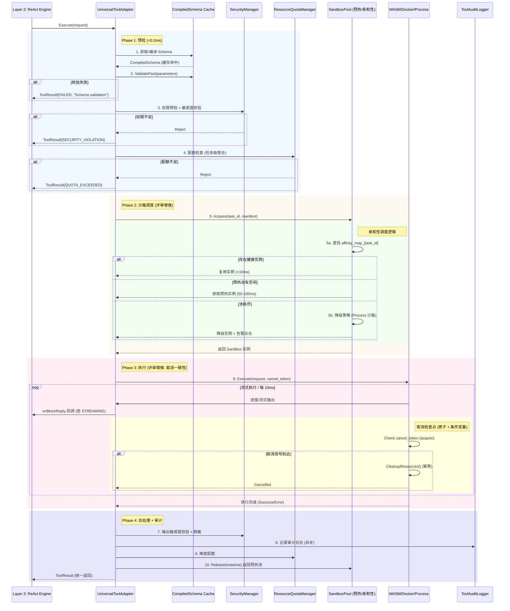

# AOS-Universal Tool Protocol Specification v1.1

> **文档版本**：v1.1 (评审增强版)  
> **适用架构**：AOS-Universal v3.0 (强内核 + 灵活外壳)  
> **生效日期**：2026-03-22  
> **约束前提**：仅本地部署，无云端依赖，完全离线可用  
> **状态**：✅ 接口冻结 | 🔄 实现中 | 📋 验收标准定义完成

---

## 1. 文档概述

### 1.1 版本变更说明 (v1.0 → v1.1)

| 变更项 | v1.0 状态 | v1.1 增强内容 | 评审来源 |
|--------|-----------|---------------|----------|
| **Schema 校验** | 运行时 JSON 解析 | ✅ 编译缓存 `CompiledSchema` (<0.1ms) | 工程风险点 1 |
| **沙箱调度** | 静态选择 | ✅ 预热池 + 亲和性复用 + 降级策略 | 工程风险点 2 |
| **流式取消** | 基础检查 | ✅ 原子取消 + 条件变量 + 资源清理幂等 | 工程风险点 3 |
| **工具依赖** | ❌ 缺失 | ✅ `dependencies` 字段支持静态分析 | 协议完整性 1 |
| **批量原子性** | ❌ 缺失 | ✅ `BatchOptions` 事务语义 | 协议完整性 2 |
| **版本兼容** | ❌ 缺失 | ✅ `wire_format_version` + 迁移脚本 | 协议完整性 3 |
| **审计日志** | 基础记录 | ✅ 标准化 `ToolAuditRecord` + 安全事件 | 安全治理增强 |
| **密钥注入** | 概念描述 | ✅ `SecureParamInjector` (memfd_create) | 安全治理增强 |

### 1.2 设计目标

本规范定义 AOS-Universal 架构中**通用工具接口协议**，实现：

```yaml
# 核心目标
unified_abstraction: "Browser/Shell/File/API 异构工具统一为 Tool 接口"
contract_first: "ToolManifest 显式声明能力，支持静态分析与动态注册"
security_isolation: "SandboxType + SecurityProfile + DataLineage 三级隔离"
execution_transparent: "同步/异步/流式对上层协程透明，统一返回 Task<ToolResult>"
backward_compatible: "optimization_hints 保留 v1/v2 浏览器专用优化"

# 非目标
not_in_scope:
  - "云端远程工具代理 (违反离线约束)"
  - "纯内存函数调用 (无副作用、无沙箱需求)"
  - "跨进程共享内存通信 (安全边界复杂)"
```

### 1.3 适用范围

```
✅ 适用场景：
• 内置工具：BrowserTool, FileSystemTool, ShellTool, APITool, LocalLLMTool
• 第三方插件：通过 Manifest 动态注册的自定义工具 (.so/.wasm)
• 工具链编排：DAG 工作流中的工具节点依赖分析
• 多任务并行：TaskGroup Fork/Join 中的工具批量执行

❌ 不适用场景：
• 纯函数式计算工具 (无副作用、无状态) → 建议直接 C++ 函数调用
• 云端 SaaS 工具代理 (违反离线约束) → 需扩展 RemoteToolAdapter
• 实时音视频处理工具 (需专用流水线) → 建议独立 MediaPipeline 模块
```

### 1.4 术语定义

| 术语 | 定义 | 协议位置 |
|------|------|----------|
| `Tool` | 可被 Agent 调用的原子操作单元，具有明确输入/输出/副作用 | §3 |
| `ToolManifest` | 工具的元数据契约，描述能力、资源、安全策略、依赖 | §3.1 |
| `Sandbox` | 工具执行的隔离环境 (WASM/Docker/Process/Chroot/Browser) | §5 |
| `ExecutionMode` | 工具执行模式：`SYNC`/`ASYNC`/`STREAMING` | §3.1 |
| `DataSensitivity` | 数据密级标签：`PUBLIC`/`INTERNAL`/`SECRET`/`RESTRICTED` | §7.2 |
| `CompiledSchema` | 预编译的校验规则，支持 <0.1ms 快速校验 | §4.1 |
| `BatchOptions` | 批量执行的原子性控制选项 | §6.2 |

---

## 2. 设计原则

### 2.1 核心原则 (冻结)

```cpp
// 原则 1: 显式优于隐式 - 所有能力必须通过 Manifest 声明
constexpr bool REQUIRE_EXPLICIT_MANIFEST = true;

// 原则 2: 最小权限 - 工具默认无权限，必须显式申请
constexpr SecurityProfile DEFAULT_SECURITY = {
    .allowed_paths = {},           // 空 = 无文件访问
    .allow_network = false,        // 默认禁用网络
    .allowed_syscalls = {}         // 空 = 仅基础系统调用
};

// 原则 3: 资源声明式 - 调度器基于声明配额管理
constexpr bool ENFORCE_QUOTA_AT_RUNTIME = true;

// 原则 4: 执行透明 - 上层协程无需关心底层执行模式
using UnifiedToolResult = Task<ToolResult>;  // 唯一返回类型

// 原则 5: 专用优化保留 - 通用化不牺牲专用场景性能
constexpr bool PRESERVE_BROWSER_OPTIMIZATIONS = true;
```

### 2.2 架构位置与数据流

```
┌─────────────────────────────────────┐
│ Layer 3: Meta-Cognition             │
│ • WorkflowOrchestrator (DAG 编排)    │
│ • GoalProximityMonitor (优先级)      │
└─────────────┬───────────────────────┘
              │ ToolRequest + BatchOptions
┌─────────────▼───────────────────────┐
│ Layer 2: Cognitive Kernel           │
│ • UniversalToolAdapter (协议入口)    │
│ • SecurityManager (权限/血缘校验)    │
│ • DataLineageTracker (敏感度传播)    │
└─────────────┬───────────────────────┘
              │ 执行请求 + 沙箱配置 + CancelToken
┌─────────────▼───────────────────────┐
│ Layer 1: Event & Control            │
│ • ResourceQuotaManager (配额检查)    │
│ • SandboxPool (预热/亲和性调度)      │
│ • LightweightInterruptQueue (取消)   │
└─────────────┬───────────────────────┘
              │ 系统调用 + 隔离环境
┌─────────────▼───────────────────────┐
│ Layer 0: Runtime & Sandbox          │
│ • SandboxedToolExecutor (执行引擎)   │
│ • WASM/Docker/Process 沙箱实现       │
│ • SecureParamInjector (密钥注入)     │
└─────────────────────────────────────┘
```

---

## 3. Tool Manifest 完整定义 (v1.1)

### 3.1 C++20 数据结构

```cpp
// layer0/tool_manifest.h - v1.1 (冻结接口)
#pragma once

#include <string>
#include <vector>
#include <optional>
#include <chrono>
#include <nlohmann/json.hpp>
#include "common/coro/task.h"
#include "layer0/security_profile.h"
#include "layer0/resource_quota.h"

namespace aos::universal::v1_1 {

// ========== 基础标识 ==========
struct ToolIdentity {
    std::string tool_id;              // 唯一标识: "namespace.name" (如 "browser.click")
    std::string version;              // 语义化版本: "1.2.3"
    std::string description;          // 人类可读描述
    
    // 【新增】协议版本控制 (评审补充 3)
    uint32_t wire_format_version = 1; // 二进制序列化格式版本，变更时递增
    uint32_t api_compatibility_version = 1; // API 兼容性版本
    
    // 【新增】兼容性声明
    struct CompatibilityInfo {
        std::vector<uint32_t> readable_wire_formats = {1}; // 可反序列化的旧协议版本
        std::vector<std::string> compatible_api_versions = {"1.0.0"}; // 可接受的旧 API 版本
        std::optional<std::string> migration_script_path; // 迁移脚本路径
    } compatibility;
    
    NLOHMANN_DEFINE_TYPE_INTRUSIVE(ToolIdentity, 
        tool_id, version, description,
        wire_format_version, api_compatibility_version, compatibility)
};

// ========== 输入输出契约 (支持编译缓存) ==========
struct JSONSchema {
    std::string type;                              // "object"/"array"/"string" 等
    std::optional<std::string> format;             // "uri"/"email"/"css-selector" 等
    std::optional<std::vector<std::string>> required; // 必填字段列表
    std::optional<nlohmann::json> properties;      // 对象属性定义
    std::optional<nlohmann::json> items;           // 数组元素定义
    
    // 【新增】运行时校验接口
    bool Validate(const nlohmann::json& data) const;
    std::optional<std::string> GetValidationError(const nlohmann::json& data) const;
    
    NLOHMANN_DEFINE_TYPE_INTRUSIVE(JSONSchema, type, format, required, properties, items)
};

// 【新增】编译后的校验规则 (评审补充 - Schema 缓存)
class CompiledSchema {
public:
    static std::unique_ptr<CompiledSchema> Compile(const JSONSchema& schema);
    
    // 快速校验：<0.1ms，生产环境默认
    bool ValidateFast(const nlohmann::json& data) const;
    
    // 完整校验：调试模式，输出详细错误
    std::optional<std::string> ValidateFull(const nlohmann::json& data) const;
    
    const std::string& Fingerprint() const { return fingerprint_; }
    
private:
    struct ValidationRule { /* 编译后的规则 */ };
    std::vector<ValidationRule> rules_;
    std::string fingerprint_; // SHA-256(schema)，用于缓存键
};

// ========== 资源配额 ==========
// (详见 layer0/resource_quota.h，此处引用)
struct ResourceQuota {
    uint32_t max_cpu_ms = 10000;
    uint32_t max_wall_time_ms = 60000;
    uint32_t max_memory_mb = 512;
    uint32_t max_read_ops = 1000;
    uint32_t max_write_ops = 100;
    uint64_t max_io_bytes = 100 * 1024 * 1024;
    bool requires_network = false;
    std::vector<std::string> allowed_domains;
    uint32_t max_concurrent_instances = 1;
    
    NLOHMANN_DEFINE_TYPE_INTRUSIVE(ResourceQuota,
        max_cpu_ms, max_wall_time_ms, max_memory_mb,
        max_read_ops, max_write_ops, max_io_bytes,
        requires_network, allowed_domains, max_concurrent_instances)
};

// ========== 安全策略 ==========
// (详见 layer0/security_profile.h，此处引用)
struct SecurityProfile {
    std::vector<std::string> allowed_paths;
    std::vector<std::string> readonly_paths;
    bool allow_temp_files = true;
    bool allow_inbound = false;
    bool allow_outbound = false;
    std::vector<std::string> allowed_ports;
    std::vector<SyscallClass> allowed_syscalls;
    
    enum class DataSensitivity { PUBLIC, INTERNAL, SECRET, RESTRICTED };
    DataSensitivity input_sensitivity = DataSensitivity::INTERNAL;
    DataSensitivity output_sensitivity = DataSensitivity::INTERNAL;
    
    struct EscapeDetection {
        bool monitor_path_traversal = true;
        bool monitor_privilege_escalation = true;
        bool monitor_unexpected_syscalls = true;
    } escape_detection;
    
    NLOHMANN_DEFINE_TYPE_INTRUSIVE(SecurityProfile,
        allowed_paths, readonly_paths, allow_temp_files,
        allow_inbound, allow_outbound, allowed_ports,
        allowed_syscalls, input_sensitivity, output_sensitivity,
        escape_detection)
};

// ========== 执行特征 ==========
enum class ExecutionMode { SYNC, ASYNC, STREAMING };
enum class Idempotency { NONE, READ_ONLY, IDEMPOTENT };

struct ExecutionCharacteristics {
    ExecutionMode mode = ExecutionMode::SYNC;
    Idempotency idempotency = Idempotency::NONE;
    bool is_side_effect_free = false;
    bool supports_cancel = true;
    std::optional<uint32_t> typical_duration_ms;
    std::optional<uint32_t> warmup_cost_ms;
    
    NLOHMANN_DEFINE_TYPE_INTRUSIVE(ExecutionCharacteristics,
        mode, idempotency, is_side_effect_free, 
        supports_cancel, typical_duration_ms, warmup_cost_ms)
};

// ========== 优化提示 (保留 v1/v2 专用能力) ==========
struct OptimizationHints {
    // 浏览器工具专用
    struct BrowserHints {
        bool supports_kv_hint = false;
        bool supports_dom_hash = false;
        std::vector<std::string> critical_selectors;
        bool supports_atomic_navigation_snapshot = true;
    } browser;
    
    // 文件系统工具专用
    struct FileSystemHints {
        bool supports_cow_snapshot = false;
        bool supports_incremental_backup = false;
    } filesystem;
    
    // Shell 工具专用
    struct ShellHints {
        bool supports_seccomp_filter = true;
        bool supports_cgroup_limits = true;
    } shell;
    
    // 通用恢复策略
    enum class RecoveryStrategy { REPLAY, CHECKPOINT, RESTART };
    RecoveryStrategy recovery_strategy = RecoveryStrategy::REPLAY;
    
    NLOHMANN_DEFINE_TYPE_INTRUSIVE(OptimizationHints, browser, filesystem, shell, recovery_strategy)
};

// ========== 【新增】依赖声明 (评审补充 1) ==========
struct DependencyDeclaration {
    // 依赖的工具 (用于工具链完整性校验)
    std::vector<std::string> required_tools;
    
    // 依赖的系统特性 (用于环境预检)
    struct SystemFeature {
        std::string name;  // e.g., "gpu", "docker_daemon", "network_access"
        std::string min_version;  // e.g., "docker>=20.10"
        bool optional = false;  // 是否可选 (缺失时降级执行)
        
        NLOHMANN_DEFINE_TYPE_INTRUSIVE(SystemFeature, name, min_version, optional)
    };
    std::vector<SystemFeature> required_system_features;
    
    // 依赖的配置文件 (用于启动预加载)
    std::vector<std::string> required_config_files;
    
    NLOHMANN_DEFINE_TYPE_INTRUSIVE(DependencyDeclaration, 
        required_tools, required_system_features, required_config_files)
};

// ========== 完整 Manifest (v1.1 冻结) ==========
struct ToolManifest {
    ToolIdentity identity;
    JSONSchema input_schema;
    JSONSchema output_schema;
    ResourceQuota quota;
    SecurityProfile sec_profile;
    ExecutionCharacteristics characteristics;
    OptimizationHints optimization_hints;
    DependencyDeclaration dependencies;  // 【新增】
    
    // 校验接口
    bool Validate() const;
    std::vector<std::string> GetValidationErrors() const;
    
    // 序列化/反序列化
    nlohmann::json ToJson() const;
    static ToolManifest FromJson(const nlohmann::json& j);
    
    // 兼容性检查
    bool IsCompatibleWith(const ToolManifest& other) const;
    
    NLOHMANN_DEFINE_TYPE_INTRUSIVE(ToolManifest,
        identity, input_schema, output_schema, quota, sec_profile,
        characteristics, optimization_hints, dependencies)
};

}  // namespace aos::universal::v1_1
```

### 3.2 JSON Schema 示例 (browser.click)

```json
{
  "identity": {
    "tool_id": "browser.click",
    "version": "1.0.0",
    "description": "Click a DOM element identified by CSS selector",
    "wire_format_version": 1,
    "api_compatibility_version": 1,
    "compatibility": {
      "readable_wire_formats": [1],
      "compatible_api_versions": ["1.0.0"],
      "migration_script_path": null
    }
  },
  "input_schema": {
    "type": "object",
    "required": ["selector"],
    "properties": {
      "selector": { "type": "string", "format": "css-selector" },
      "button": { "type": "string", "enum": ["left", "right", "middle"], "default": "left" },
      "modifiers": { 
        "type": "array", 
        "items": { "type": "string", "enum": ["Shift", "Control", "Alt", "Meta"] }
      },
      "timeout_ms": { "type": "integer", "minimum": 100, "maximum": 30000, "default": 5000 }
    }
  },
  "output_schema": {
    "type": "object",
    "properties": {
      "success": { "type": "boolean" },
      "element_info": {
        "type": "object",
        "properties": {
          "tag": { "type": "string" },
          "id": { "type": "string" },
          "class": { "type": "array", "items": { "type": "string" } }
        }
      },
      "error": { "type": "string" }
    }
  },
  "quota": {
    "max_cpu_ms": 500,
    "max_wall_time_ms": 5000,
    "max_memory_mb": 64,
    "requires_network": false,
    "max_concurrent_instances": 1
  },
  "sec_profile": {
    "allowed_paths": ["/tmp/browser-*"],
    "allow_temp_files": true,
    "input_sensitivity": "INTERNAL",
    "output_sensitivity": "INTERNAL",
    "escape_detection": {
      "monitor_path_traversal": true,
      "monitor_privilege_escalation": true,
      "monitor_unexpected_syscalls": true
    }
  },
  "characteristics": {
    "mode": "ASYNC",
    "idempotency": "READ_ONLY",
    "is_side_effect_free": false,
    "supports_cancel": true,
    "typical_duration_ms": 200
  },
  "optimization_hints": {
    "browser": {
      "supports_kv_hint": false,
      "supports_dom_hash": true,
      "critical_selectors": ["#submit-btn", "input[name=submit]"],
      "supports_atomic_navigation_snapshot": true
    },
    "recovery_strategy": "CHECKPOINT"
  },
  "dependencies": {
    "required_tools": ["browser.navigate"],
    "required_system_features": [],
    "required_config_files": []
  }
}
```

---

## 4. 统一工具接口规范 (冻结)

### 4.1 核心接口定义

```cpp
// layer2/universal_tool_adapter.h - v1.1 (冻结)
#pragma once

#include "layer0/tool_manifest.h"
#include "layer0/tool_request.h"
#include "layer0/tool_result.h"
#include "layer0/batch_options.h"
#include "common/coro/task.h"

namespace aos::universal::v1_1 {

// ========== 工具请求 ==========
struct ToolRequest {
    std::string task_id;                    // 所属任务 ID (用于追踪/配额)
    std::string tool_id;                    // 工具标识 (匹配 Manifest)
    nlohmann::json parameters;              // 输入参数 (需符合 input_schema)
    
    ExecutionMode execution_mode;           // 执行模式 (可覆盖 Manifest 默认值)
    uint32_t timeout_ms;                    // 请求级超时 (可覆盖 Manifest 默认值)
    
    // 取消令牌 (协作式取消，评审增强)
    std::shared_ptr<CancelToken> cancel_token;
    
    // 数据敏感度标签 (用于跨工具传播控制)
    DataSensitivity sensitivity_context = DataSensitivity::INTERNAL;
    
    // 调用者信息 (用于审计)
    std::string caller_tool_id;
    
    NLOHMANN_DEFINE_TYPE_INTRUSIVE(ToolRequest,
        task_id, tool_id, parameters, execution_mode, timeout_ms,
        cancel_token, sensitivity_context, caller_tool_id)
};

// ========== 工具结果 ==========
struct ToolResult {
    enum class Status {
        SUCCESS,
        FAILED,
        CANCELLED,
        TIMEOUT,
        QUOTA_EXCEEDED,
        SECURITY_VIOLATION
    };
    
    Status status;
    int exit_code;                          // 工具进程退出码 (若适用)
    nlohmann::json output;                  // 输出数据 (需符合 output_schema)
    std::string error_message;              // 错误详情 (若失败)
    
    // 执行元数据
    uint32_t cpu_time_ms;
    uint32_t wall_time_ms;
    uint32_t memory_peak_mb;
    
    // 流式输出支持 (评审增强)
    bool is_streaming = false;
    std::function<Task<std::optional<nlohmann::json>>()> stream_next;
    
    // 敏感度标签 (输出数据继承/升级)
    DataSensitivity output_sensitivity;
    
    // 审计哈希 (避免记录明文)
    std::string input_hash;   // SHA-256(parameters)
    std::string output_hash;  // SHA-256(output)
    
    NLOHMANN_DEFINE_TYPE_INTRUSIVE(ToolResult,
        status, exit_code, output, error_message,
        cpu_time_ms, wall_time_ms, memory_peak_mb,
        is_streaming, stream_next, output_sensitivity,
        input_hash, output_hash)
};

// ========== 【新增】批量执行选项 (评审补充 2) ==========
struct BatchOptions {
    enum class FailurePolicy {
        CONTINUE,           // 忽略失败，继续执行剩余工具
        ABORT_ALL,          // 任一失败，回滚所有已执行工具 (需工具支持幂等)
        ABORT_REMAINING,    // 任一失败，停止执行剩余工具 (默认)
        ROLLBACK_ON_FAILURE // 失败时尝试回滚 (需工具声明支持)
    };
    
    FailurePolicy on_failure = FailurePolicy::ABORT_REMAINING;
    bool atomic_snapshot = false;    // 是否在执行前统一创建 EnvironmentSnapshot
    bool shared_context = true;      // 是否共享同一个 TaskContext
    std::optional<std::chrono::milliseconds> batch_timeout;
    std::optional<ResourceQuota> aggregate_quota;  // 批量整体配额
    
    NLOHMANN_DEFINE_TYPE_INTRUSIVE(BatchOptions,
        on_failure, atomic_snapshot, shared_context, batch_timeout, aggregate_quota)
};

// ========== 统一工具适配器 (核心接口 - 冻结) ==========
class UniversalToolAdapter {
public:
    virtual ~UniversalToolAdapter() = default;
    
    // 注册工具 (动态加载)
    virtual bool RegisterTool(const ToolManifest& manifest, 
                             std::unique_ptr<ToolExecutor> executor) = 0;
    
    // 注销工具
    virtual bool UnregisterTool(const std::string& tool_id) = 0;
    
    // 执行工具 (协程友好，统一返回类型)
    virtual Task<ToolResult> Execute(const ToolRequest& request) = 0;
    
    // 批量执行 (带原子性选项，评审增强)
    virtual Task<std::vector<ToolResult>> ExecuteBatch(
        const std::vector<ToolRequest>& requests,
        const BatchOptions& options = {}) = 0;
    
    // 查询工具信息
    virtual std::optional<ToolManifest> GetManifest(const std::string& tool_id) const = 0;
    virtual std::vector<std::string> ListTools() const = 0;
    
    // 资源监控
    virtual ResourceUsage GetToolUsage(const std::string& tool_id) const = 0;
    
    // Schema 缓存管理 (评审增强)
    virtual void PrecompileSchema(const std::string& tool_id) = 0;
    virtual SchemaValidationMode GetValidationMode() const = 0;
    virtual void SetValidationMode(SchemaValidationMode mode) = 0;
};

// ========== 配置枚举 ==========
enum class SchemaValidationMode {
    FAST,      // 编译缓存快速校验 (<0.1ms) - 生产默认
    FULL,      // 完整语义校验 (0.5-2ms) - 调试用
    DISABLED   // 禁用校验 (~0ms) - 压测用，不推荐生产
};

}  // namespace aos::universal::v1_1
```

### 4.2 执行流程时序 (评审增强版)



---

## 5. 沙箱执行器协议 (评审增强)

### 5.1 沙箱类型与选择策略

```cpp
// layer0/sandbox_selector.h - v1.1
#pragma once

namespace aos::universal::v1_1 {

enum class SandboxType {
    WASM,           // 高性能，确定性执行，适合计算/逻辑类工具
    PROCESS,        // 轻量隔离，适合文件/简单脚本
    CHROOT,         // 文件系统隔离，适合中等风险工具
    DOCKER,         // 完整容器隔离，适合高风险/网络工具
    BROWSER         // 专用浏览器沙箱 (Playwright 实例)
};

// 沙箱安全保证矩阵 (评审确认)
struct SandboxSecurityMatrix {
    SandboxType type;
    std::string isolation_level;      // "process-memory" / "container" 等
    std::string syscall_filter;       // "none" / "optional-seccomp" / "mandatory-seccomp"
    bool network_access;
    std::string filesystem_access;    // "virtual-only" / "path-restricted" / "overlayfs-readonly"
    std::string escape_risk;          // "very-low" / "low" / "medium"
};

constexpr std::array<SandboxSecurityMatrix, 5> SANDBOX_MATRIX = {{
    {SandboxType::WASM, "process-memory", "none", false, "virtual-only", "very-low"},
    {SandboxType::PROCESS, "process", "optional-seccomp", true, "path-restricted", "low"},
    {SandboxType::CHROOT, "filesystem", "recommended-seccomp", true, "chroot-jail", "medium"},
    {SandboxType::DOCKER, "container", "mandatory-seccomp", true, "overlayfs-readonly", "low-mitigated"},
    {SandboxType::BROWSER, "browser-context", "browser-sandbox", true, "download-folder-only", "low"}
}};

class SandboxSelector {
public:
    // 根据 Manifest 自动选择沙箱类型
    static SandboxType Select(const ToolManifest& manifest) {
        // 优先级：专用 > 高风险 > 中风险 > 低风险
        if (manifest.identity.tool_id.starts_with("browser.")) {
            return SandboxType::BROWSER;
        }
        if (manifest.sec_profile.allowed_syscalls.contains(SyscallClass::PROCESS_SPAWN) ||
            manifest.sec_profile.allow_outbound) {
            return SandboxType::DOCKER;  // 高风险：需要完整隔离
        }
        if (!manifest.sec_profile.allowed_paths.empty()) {
            return SandboxType::CHROOT;  // 中风险：文件系统隔离
        }
        if (manifest.characteristics.is_side_effect_free) {
            return SandboxType::WASM;    // 低风险：高性能
        }
        return SandboxType::PROCESS;     // 默认：轻量进程隔离
    }
    
    // 获取沙箱安全矩阵
    static const SandboxSecurityMatrix& GetSecurityInfo(SandboxType type) {
        for (const auto& info : SANDBOX_MATRIX) {
            if (info.type == type) return info;
        }
        return SANDBOX_MATRIX[0];  // fallback
    }
};

}  // namespace
```

### 5.2 沙箱预热池 + 亲和性调度 (评审增强)

```cpp
// layer0/sandbox_pool.h - v1.1 (评审增强)
#pragma once

#include "layer0/sandbox.h"
#include "layer0/tool_manifest.h"
#include "common/coro/task.h"

namespace aos::universal::v1_1 {

// 预热池配置
struct SandboxPoolConfig {
    SandboxType type;
    size_t min_instances = 1;          // 最小预热实例数
    size_t max_instances = 4;          // 最大实例数 (防资源耗尽)
    std::chrono::seconds idle_timeout = 300;  // 空闲超时回收
    std::chrono::milliseconds acquire_timeout = 2000;  // 获取超时
    bool allow_fallback = true;        // 池耗尽时是否降级
};

// 沙箱池接口
class SandboxPool {
public:
    virtual ~SandboxPool() = default;
    
    // 获取沙箱实例 (带亲和性，评审增强)
    virtual Task<std::shared_ptr<Sandbox>> Acquire(
        const std::string& task_id, 
        const ToolManifest& manifest) = 0;
    
    // 释放实例 (返回预热池)
    virtual void Release(const std::string& task_id, std::shared_ptr<Sandbox> instance) = 0;
    
    // 预热池状态监控
    struct PoolStats {
        size_t active_count;
        size_t idle_count;
        size_t warmup_pending;
        double avg_acquire_latency_ms;
    };
    virtual PoolStats GetStats() const = 0;
    
    // 配置更新 (热重载)
    virtual void UpdateConfig(const SandboxPoolConfig& config) = 0;
};

// Docker 预热池特殊实现 (评审增强)
class DockerSandboxPool : public SandboxPool {
public:
    explicit DockerSandboxPool(const SandboxPoolConfig& config);
    
    Task<std::shared_ptr<Sandbox>> Acquire(
        const std::string& task_id, 
        const ToolManifest& manifest) override;
    
    void Release(const std::string& task_id, std::shared_ptr<Sandbox> instance) override;
    
    PoolStats GetStats() const override;
    
private:
    // 亲和性映射：task_id → sandbox_id
    std::unordered_map<std::string, std::string> affinity_map_;
    
    // 预热池维护协程
    Task<void> MaintainWarmupPool();
    
    // 异步创建预热实例
    void SpawnWarmupInstanceAsync(const ToolManifest& default_manifest);
    
    // 降级策略：池耗尽时使用 Process 沙箱
    std::shared_ptr<Sandbox> FallbackToProcess(const ToolManifest& manifest);
    
    SandboxPoolConfig config_;
    std::mutex mutex_;
    std::vector<std::shared_ptr<Sandbox>> idle_instances_;
    std::unordered_map<std::string, std::shared_ptr<Sandbox>> active_instances_;
};

}  // namespace
```

### 5.3 流式执行与取消一致性 (评审增强)

```cpp
// layer0/streaming_tool.h - v1.1 (评审增强)
#pragma once

#include "layer0/tool_request.h"
#include "layer0/tool_result.h"
#include "common/coro/cancel_token.h"
#include "common/coro/task.h"

namespace aos::universal::v1_1 {

// 流式执行器接口 (评审增强: 取消一致性保证)
class StreamingToolExecutor {
public:
    class Stream {
    public:
        virtual ~Stream() = default;
        
        // 【增强】Next: 原子检查取消 + 条件变量通知 (评审风险点 3)
        virtual Task<std::optional<nlohmann::json>> Next() = 0;
        
        // 检查是否完成
        virtual bool IsDone() const = 0;
        
        // 获取最终结果 (流结束后调用)
        virtual Task<ToolResult> GetFinalResult() = 0;
        
        // 【新增】强制清理资源 (幂等，评审增强)
        virtual Task<void> CleanupResources() = 0;
        
        // 绑定取消令牌
        virtual void BindCancelToken(std::shared_ptr<CancelToken> token) = 0;
    };
    
    // 创建流式执行器
    virtual std::unique_ptr<Stream> CreateStream(
        const ToolRequest& request,
        const ToolManifest& manifest) = 0;
};

// 默认实现: 取消一致性保证 (评审增强)
class DefaultStreamingExecutor : public StreamingToolExecutor {
public:
    class DefaultStream : public Stream {
    public:
        DefaultStream(std::unique_ptr<Backend> backend, 
                     std::shared_ptr<CancelToken> cancel_token);
        
        Task<std::optional<nlohmann::json>> Next() override {
            // 1. 原子检查取消 (acquire 语义确保可见性)
            if (cancel_token_->IsCancelled(std::memory_order_acquire)) {
                co_await CleanupResources();  // 确保资源清理
                co_return std::nullopt;
            }
            
            // 2. 带超时的阻塞等待 (支持取消中断)
            auto result = co_await WaitForDataWithTimeout(
                config_.next_timeout_ms,
                cancel_token_  // 传递取消令牌，支持中断阻塞
            );
            
            // 3. 二次检查: 防止等待期间被取消
            if (cancel_token_->IsCancelled(std::memory_order_acquire)) {
                co_await CleanupResources();
                co_return std::nullopt;
            }
            
            co_return result;
        }
        
        Task<void> CleanupResources() override {
            // 幂等清理: 原子标志确保只执行一次
            if (cleanup_called_.exchange(true, std::memory_order_acq_rel)) {
                co_return;
            }
            
            // 1. 终止底层进程/容器
            co_await backend_->Terminate();
            
            // 2. 关闭通信通道
            co_await channel_->Close();
            
            // 3. 通知等待中的 Next() 调用者
            data_available_.notify_all();
            
            LOG_DEBUG("Stream resources cleaned up for tool {}", tool_id_);
        }
        
        // RAII: 析构时确保清理 (异步，避免阻塞)
        ~DefaultStream() override {
            if (!cleanup_called_.load(std::memory_order_acquire)) {
                CleanupResources().Detach();  // 异步清理
            }
        }
        
        void BindCancelToken(std::shared_ptr<CancelToken> token) override {
            cancel_token_ = std::move(token);
        }
        
    private:
        std::atomic<bool> cleanup_called_{false};  // 幂等标志
        std::condition_variable_any data_available_;  // 取消通知
        std::shared_ptr<CancelToken> cancel_token_;
        std::unique_ptr<Backend> backend_;
        std::unique_ptr<Channel> channel_;
        std::string tool_id_;
        StreamConfig config_;
    };
};

}  // namespace
```

---

## 6. 批量执行与原子性语义 (评审补充)

### 6.1 BatchOptions 完整定义

```cpp
// layer0/batch_options.h - v1.1 (评审补充 2)
#pragma once

#include <chrono>
#include <optional>
#include "layer0/resource_quota.h"

namespace aos::universal::v1_1 {

struct BatchOptions {
    // 失败处理策略
    enum class FailurePolicy {
        CONTINUE,           // 忽略失败，继续执行剩余工具
        ABORT_ALL,          // 任一失败，回滚所有已执行工具 (需工具支持幂等)
        ABORT_REMAINING,    // 任一失败，停止执行剩余工具 (默认)
        ROLLBACK_ON_FAILURE // 失败时尝试回滚 (需工具声明支持)
    };
    
    FailurePolicy on_failure = FailurePolicy::ABORT_REMAINING;
    
    // 原子性控制
    bool atomic_snapshot = false;  // 是否在执行前统一创建 EnvironmentSnapshot
    bool shared_context = true;    // 是否共享同一个 TaskContext (影响数据血缘)
    
    // 超时控制 (批量整体超时)
    std::optional<std::chrono::milliseconds> batch_timeout;
    
    // 资源配额 (批量整体配额，非单个工具累加)
    std::optional<ResourceQuota> aggregate_quota;
    
    // 执行顺序
    enum class ExecutionOrder {
        SEQUENTIAL,  // 顺序执行 (保证依赖)
        PARALLEL,    // 并行执行 (最大并发)
        TOPOLOGICAL  // 拓扑排序 (基于 dependencies 字段)
    };
    ExecutionOrder order = ExecutionOrder::TOPOLOGICAL;
    
    NLOHMANN_DEFINE_TYPE_INTRUSIVE(BatchOptions,
        on_failure, atomic_snapshot, shared_context, batch_timeout, 
        aggregate_quota, order)
};

}  // namespace
```

### 6.2 事务管理器实现

```cpp
// layer2/batch_transaction.h - v1.1
#pragma once

#include "layer0/batch_options.h"
#include "layer2/environment_snapshot.h"
#include "common/coro/task.h"

namespace aos::universal::v1_1 {

class BatchTransaction {
public:
    Task<std::vector<ToolResult>> ExecuteWithAtomicity(
        const std::vector<ToolRequest>& requests,
        const std::vector<ToolManifest>& manifests,
        const BatchOptions& options,
        UniversalToolAdapter& adapter,
        SnapshotManager& snapshot_mgr);
    
private:
    // 预检: 校验所有请求的 Manifest 和配额
    bool PreCheckAll(const std::vector<ToolRequest>& requests,
                    const std::optional<ResourceQuota>& aggregate_quota);
    
    // 拓扑排序 (基于 dependencies 字段)
    std::vector<size_t> TopologicalSort(
        const std::vector<ToolRequest>& requests,
        const std::vector<ToolManifest>& manifests);
    
    // 回滚已执行的工具 (仅支持声明幂等的工具)
    Task<void> RollbackExecuted(
        const std::vector<ToolResult>& executed,
        const std::vector<ToolRequest>& requests,
        const std::vector<ToolManifest>& manifests,
        const std::optional<EnvironmentSnapshot>& snapshot);
    
    // 执行补偿操作 (用于 ROLLBACK_ON_FAILURE)
    Task<void> ExecuteCompensatingAction(
        const ToolRequest& request,
        const ToolResult& result,
        const ToolManifest& manifest);
};

}  // namespace
```

---

## 7. 安全与审计规范 (评审增强)

### 7.1 数据敏感度传播控制

```cpp
// layer2/data_lineage.h - v1.1 (评审增强)
#pragma once

#include "layer0/security_profile.h"
#include <any>

namespace aos::universal::v1_1 {

// 带敏感度标签的数据包装器
struct TaintedValue {
    std::any value;
    DataSensitivity sensitivity;
    std::string source_tool;  // 数据来源工具
    std::chrono::steady_clock::time_point timestamp;
    bool sanitized = false;   // 是否已脱敏
    
    // 传播检查: 工具接收数据时自动校验
    bool CanReceive(const SecurityProfile& profile) const {
        // 规则 1: 敏感度不降级 (SECRET 不能传给 PUBLIC 工具)
        if (sensitivity > profile.input_sensitivity) {
            return false;
        }
        // 规则 2: 来源工具在白名单 (可选)
        if (!profile.allowed_source_tools.empty() &&
            !profile.allowed_source_tools.contains(source_tool)) {
            return false;
        }
        return true;
    }
    
    // 自动脱敏: 传递给低权限工具时
    TaintedValue SanitizeFor(const SecurityProfile& target) const {
        if (sensitivity <= target.input_sensitivity) {
            return *this;  // 无需脱敏
        }
        // 脱敏策略: 掩码/哈希/移除
        return TaintedValue{
            .value = ApplyMasking(value, sensitivity),
            .sensitivity = target.input_sensitivity,  // 降级
            .source_tool = source_tool,
            .timestamp = timestamp,
            .sanitized = true
        };
    }
    
private:
    static std::any ApplyMasking(const std::any& value, DataSensitivity level);
};

// 数据血缘追踪器
class DataLineageTracker {
public:
    // 标记数据敏感度
    static TaintedValue Tag(const nlohmann::json& data, 
                           DataSensitivity level,
                           const std::string& source_tool) {
        return TaintedValue{
            .value = data,
            .sensitivity = level,
            .source_tool = source_tool,
            .timestamp = std::chrono::steady_clock::now()
        };
    }
    
    // 跨工具传播: 自动校验 + 脱敏
    static TaintedValue Propagate(const TaintedValue& value, 
                                 const SecurityProfile& target_profile) {
        if (!value.CanReceive(target_profile)) {
            LOG_WARN("Data propagation denied: sensitivity mismatch");
            return TaintedValue{};  // 返回空值表示拒绝
        }
        return value.SanitizeFor(target_profile);
    }
};

}  // namespace
```

### 7.2 审计日志标准化

```cpp
// layer2/tool_audit_logger.h - v1.1 (评审增强)
#pragma once

#include "layer0/tool_result.h"
#include "layer2/data_lineage.h"

namespace aos::universal::v1_1 {

// 标准化审计记录 (评审补充)
struct ToolAuditRecord {
    // 基础信息
    std::string trace_id;           // 分布式追踪 ID
    std::string task_id;            // 所属任务
    std::string tool_id;            // 执行的工具
    std::chrono::steady_clock::time_point timestamp;
    
    // 调用者信息
    std::string caller_task_id;     // 调用方任务 (用于数据血缘)
    std::string caller_tool_id;     // 调用方工具
    
    // 输入输出摘要 (哈希，避免记录敏感数据)
    std::string input_hash;         // SHA-256(input_json)
    std::string output_hash;        // SHA-256(output_json)
    DataSensitivity input_sensitivity;
    DataSensitivity output_sensitivity;
    
    // 执行指标
    uint32_t duration_ms;
    ResourceUsage resource_usage;   // CPU/内存/IO 实际消耗
    ToolResult::Status status;
    
    // 安全事件 (若触发)
    struct SecurityEvent {
        enum class EventType {
            PERMISSION_DENIED,
            SENSITIVE_DATA_LEAK_ATTEMPT,
            SANDBOX_ESCAPE_DETECTED,
            QUOTA_EXCEEDED
        };
        EventType type;
        std::string details;  // 已脱敏
    };
    std::optional<SecurityEvent> security_event;
    
    // 序列化 (JSON Lines 格式，便于日志聚合)
    std::string ToJsonLine() const;
    
    NLOHMANN_DEFINE_TYPE_INTRUSIVE(ToolAuditRecord,
        trace_id, task_id, tool_id, timestamp,
        caller_task_id, caller_tool_id,
        input_hash, output_hash, input_sensitivity, output_sensitivity,
        duration_ms, resource_usage, status, security_event)
};

// 审计日志器
class ToolAuditLogger {
public:
    void Init(const std::string& output_path, size_t max_file_size_mb);
    
    // 记录审计日志 (异步，不阻塞工具执行)
    Task<void> Log(const ToolAuditRecord& record);
    
    // 安全事件实时告警
    Task<void> PublishSecurityAlert(const ToolAuditRecord& record);
    
private:
    // 脱敏: 仅保留哈希，不记录原始输入输出
    ToolAuditRecord SanitizeForLogging(const ToolAuditRecord& record);
    
    std::string output_path_;
    size_t max_file_size_mb_;
    // 异步日志队列...
};

}  // namespace
```

### 7.3 密钥安全注入规范

```cpp
// layer0/secure_param_injector.h - v1.1 (评审增强)
#pragma once

#include <unordered_map>
#include <string>

namespace aos::universal::v1_1 {

// 安全参数注入句柄
struct InjectionHandle {
    int fd = -1;  // memfd_create 返回的文件描述符
    std::string env_var_name;  // 子进程通过此变量获取 fd
    std::string decryption_token;  // 一次性令牌，防重放
    
    bool IsValid() const { return fd >= 0; }
    static InjectionHandle Invalid() { return {}; }
};

// 安全参数注入器 (评审补充: 内存管道传递)
class SecureParamInjector {
public:
    // 注入敏感参数到进程 (避免命令行参数泄漏)
    static Task<InjectionHandle> InjectToProcess(
        const std::string& tool_id,
        const std::unordered_map<std::string, std::string>& sensitive_params,
        const EncryptionKey& tool_key);
    
    // 子进程侧: 读取并解密参数
    static std::unordered_map<std::string, std::string> 
    ExtractFromProcess(const InjectionHandle& handle,
                      const EncryptionKey& tool_key);
    
    // 清理资源
    static void Cleanup(InjectionHandle& handle);
    
private:
    // Linux: 使用 memfd_create 创建匿名内存文件
    #ifdef __linux__
    static int CreateSecureMemFD(const std::string& name);
    #endif
    
    // 降级方案: 使用 pipe2 + 临时文件
    static std::pair<int, int> CreateSecurePipe();
    
    // 加密参数 (AES-GCM)
    static std::vector<uint8_t> EncryptParams(
        const std::unordered_map<std::string, std::string>& params,
        const EncryptionKey& key);
    
    // 验证一次性令牌
    static bool VerifyToken(const std::string& token);
    static std::string GenerateOneTimeToken();
};

}  // namespace
```

---

## 8. 浏览器工具兼容性规范

### 8.1 向后兼容路由策略

```cpp
// layer2/browser_tool_adapter.h - v1.1
#pragma once

#include "layer2/universal_tool_adapter.h"
#include "layer2/browser_snapshot_manager.h"  // v2.0 专用

namespace aos::universal::v1_1 {

// 浏览器工具适配器: 保留 v2.0 优化路径
class BrowserToolAdapter : public UniversalToolAdapter {
public:
    explicit BrowserToolAdapter(Config config, 
                               std::unique_ptr<UniversalToolAdapter> fallback);
    
    // 重写 Execute，路由到专用优化路径
    Task<ToolResult> Execute(const ToolRequest& request) override {
        // 检测是否为浏览器工具
        if (request.tool_id.starts_with("browser.")) {
            // 灰度路由: 按 task_id 哈希分流 (评审建议)
            if (config_.use_optimized_path && 
                IsInGrayGroup(request.task_id, config_.gray_ratio)) {
                // 走 v2.0 优化路径 (保留 KV Hint、DOM Hash)
                return ExecuteOptimized(request);
            } else {
                // 走 v3.0 通用路径 (验证兼容性)
                return fallback_->Execute(request);
            }
        }
        // 其他工具走通用路径
        return fallback_->Execute(request);
    }
    
    // 监控: 对比两条路径的延迟/成功率
    void RecordMetrics(const std::string& path, 
                      const ToolResult& result,
                      uint32_t duration_ms);
    
private:
    // 浏览器专用优化路径 (复用 v2.0 BrowserSnapshotManager)
    Task<ToolResult> ExecuteOptimized(const ToolRequest& request);
    
    // 灰度分流: 按 task_id 哈希
    bool IsInGrayGroup(const std::string& task_id, double ratio);
    
    Config config_;
    std::unique_ptr<UniversalToolAdapter> fallback_;
    MetricsCollector metrics_;
};

}  // namespace
```

### 8.2 optimization_hints 路由逻辑

```cpp
// layer2/browser_optimization_router.h
class BrowserOptimizationRouter {
public:
    // 根据 Manifest 的 optimization_hints 启用专用优化
    static void ApplyOptimizations(const ToolManifest& manifest,
                                  BrowserExecutionContext& ctx) {
        // KV Hint 支持
        if (manifest.optimization_hints.browser.supports_kv_hint &&
            ctx.config.llm.enable_kv_hint) {
            ctx.llm_adapter.EnableKVHintForTask(ctx.task_id);
        }
        
        // DOM Hash 校验
        if (manifest.optimization_hints.browser.supports_dom_hash) {
            ctx.snapshot_manager.EnableCriticalDOMHash(
                manifest.optimization_hints.browser.critical_selectors);
        }
        
        // 导航前自动快照
        if (manifest.optimization_hints.browser.supports_atomic_navigation_snapshot) {
            ctx.EnableAutoSnapshotOnNavigation();
        }
        
        // 恢复策略
        ctx.SetRecoveryStrategy(
            manifest.optimization_hints.recovery_strategy);
    }
};
```

---

## 9. 配置模板与示例

### 9.1 完整配置示例 (config.yaml)

```yaml
# config.yaml - AOS-Universal v1.1

# ========== 运行时 ==========
runtime:
  cpp_version: "20"
  thread_pool_size: 4
  max_concurrent_tasks: 10

# ========== 工具协议 ==========
tool_protocol:
  schema_validation:
    mode: "fast"  # fast | full | disabled
    cache_enabled: true
    cache_ttl_seconds: 3600
  batch_execution:
    default_timeout_ms: 30000
    max_parallel_tools: 5

# ========== LLM 配置 ==========
llm:
  model_path: "/models/llama-3-8b-instruct-q4_k_m.gguf"
  n_threads: 7
  n_gpu_layers: 35
  enable_kv_hint: false  # V1.0 默认关闭，V1.1 可选启用
  kv_hint_max_layers: 8

# ========== 浏览器配置 ==========
browser:
  headless: true
  viewport_width: 1280
  viewport_height: 720
  navigation_timeout_sec: 30
  # 灰度迁移配置
  use_optimized_path: true
  gray_ratio: 0.1  # 10% 流量走通用路径验证

# ========== DOM 哈希配置 ==========
dom:
  critical_selectors:
    - "#main-form"
    - "input[name=email]"
    - "input[name=password]"
    - "#submit-button"
    - ".product-price"
    - ".cart-total"

# ========== 安全配置 ==========
security:
  encrypt_sensitive_fields: true
  encryption_key_path: "/etc/aos-universal/key.bin"
  sensitive_field_patterns:
    - ".*password.*"
    - ".*token.*"
    - ".*auth.*"
    - ".*secret.*"
    - ".*api_key.*"
  audit_critical_ops: true
  audit_log_path: "/var/log/aos-universal/audit.log"

# ========== 沙箱配置 ==========
sandbox:
  docker:
    pool:
      min_instances: 2
      max_instances: 4
      idle_timeout_sec: 300
      acquire_timeout_ms: 2000
    fallback:
      enabled: true
      allowed_tool_types: ["shell.exec", "filesystem.*"]
  wasm:
    enable: true
    wasi_version: "preview1"

# ========== 可观测性 ==========
metrics:
  output_path: "/var/log/aos-universal/metrics.log"
  max_file_size_mb: 100
  max_backup_files: 5
  debug_mode: false
```

### 9.2 工具注册表示例 (tools/registry.yaml)

```yaml
# 内置工具清单 (v1.1)
builtin_tools:
  browser:
    - tool_id: "browser.click"
      manifest_path: "manifests/browser/click.json"
      executor: "BrowserToolExecutor"
      sandbox: "BROWSER"
      
    - tool_id: "browser.navigate"
      manifest_path: "manifests/browser/navigate.json"
      executor: "BrowserToolExecutor"
      sandbox: "BROWSER"
      optimization_hints:
        browser:
          supports_dom_hash: true
          critical_selectors: ["#main-content", ".product-list"]
          supports_atomic_navigation_snapshot: true
        recovery_strategy: "CHECKPOINT"
    
  filesystem:
    - tool_id: "filesystem.read"
      manifest_path: "manifests/filesystem/read.json"
      executor: "FileSystemToolExecutor"
      sandbox: "CHROOT"
      optimization_hints:
        filesystem:
          supports_cow_snapshot: true
        recovery_strategy: "REPLAY"
        
    - tool_id: "filesystem.write"
      manifest_path: "manifests/filesystem/write.json"
      executor: "FileSystemToolExecutor"
      sandbox: "CHROOT"
      sec_profile:
        allowed_paths: ["/workspace/*", "/tmp/*"]
        readonly_paths: ["/etc", "/usr"]
  
  shell:
    - tool_id: "shell.exec"
      manifest_path: "manifests/shell/exec.json"
      executor: "ShellToolExecutor"
      sandbox: "DOCKER"  # 高风险，使用容器隔离
      sec_profile:
        allowed_syscalls: ["FILE_READ", "FILE_WRITE", "PROCESS_SPAWN"]
        escape_detection:
          monitor_path_traversal: true
          monitor_privilege_escalation: true
      dependencies:
        required_system_features:
          - name: "docker_daemon"
            min_version: "20.10"
            optional: false
  
  llm:
    - tool_id: "llm.generate"
      manifest_path: "manifests/llm/generate.json"
      executor: "LocalLLMToolExecutor"
      execution_mode: "STREAMING"
      optimization_hints:
        recovery_strategy: "CHECKPOINT"

# 第三方插件目录
plugin_dirs:
  - "/opt/aos-universal/plugins"
  - "~/.aos-universal/plugins"
```

---

## 10. 验收标准与测试策略

### 10.1 协议验收标准 (冻结)

```yaml
# acceptance_criteria.yaml - v1.1

tool_manifest:
  - "所有内置工具提供符合 v1.1 的 Manifest"
  - "ToolManifest::Validate() 在 1ms 内完成 (含依赖校验)"
  - "wire_format_version 变更时，migration_script_path 必须有效或为空"
  - "dependencies.required_tools 循环依赖检测必须生效"

schema_compiler:
  - "CompiledSchema::ValidateFast() 耗时 P99 < 0.1ms"
  - "缓存命中率 > 95% (相同 Schema 重复调用)"
  - "调试模式 full 校验可输出详细错误位置 (字段路径 + 期望值)"

sandbox_pool:
  - "Docker 预热池维持配置 min_instances 个就绪实例"
  - "预热实例获取耗时 P99 < 200ms (冷启动 <2000ms)"
  - "同 task_id 亲和性复用耗时 < 10ms"
  - "池耗尽时降级到 Process 沙箱，输出 WARN 日志"

streaming_cancel:
  - "CancelToken::Cancel() 后，Next() 在 <100ms 内返回"
  - "CleanupResources() 幂等: 多次调用无副作用"
  - "资源泄漏检测: 1000 次取消操作后，无文件描述符/进程泄漏"

batch_atomicity:
  - "ABORT_REMAINING 策略: 任一失败时立即停止剩余工具"
  - "atomic_snapshot=true: 所有工具执行前创建统一快照"
  - "ROLLBACK_ON_FAILURE: 仅对 is_idempotent=true 的工具执行补偿"

security_audit:
  - "所有工具调用输出结构化审计日志 (JSON Lines)"
  - "Shell 工具敏感参数通过 memfd_create 传递，ps aux 不可见"
  - "SECRET 数据传递给 PUBLIC 工具时自动脱敏 (掩码/哈希)"
  - "安全事件 (PERMISSION_DENIED 等) 实时告警"

browser_compatibility:
  - "browser.* 工具走优化路径时，KV Hint/DOM Hash 功能生效"
  - "灰度迁移: 10% 流量走通用路径，指标对比日志完整"
  - "fallback 机制: 通用路径失败时自动切回优化路径"

performance_baseline:
  - "browser.click 在 v3.0 通用路径延迟 ≤ v2.0 优化路径 + 10%"
  - "10 并发工具调用，P99 延迟 < 500ms"
  - "Schema 编译缓存: 首次校验 <2ms，后续 <0.1ms"
```

### 10.2 测试策略

#### 🔹 沙箱逃逸测试套件 (必须通过)
```cpp
// tests/sandbox_escape_suite.cpp - v1.1
TEST_F(SandboxEscapeTest, PathTraversal) {
    ToolRequest req{
        .tool_id = "filesystem.read", 
        .parameters = {{"path", "../../../etc/passwd"}}
    };
    auto result = co_await adapter_->Execute(req);
    EXPECT_EQ(result.status, ToolResult::Status::SECURITY_VIOLATION);
    EXPECT_THAT(result.error_message, HasSubstr("path not in allowed_paths"));
}

TEST_F(SandboxEscapeTest, PrivilegeEscalation) {
    ToolRequest req{
        .tool_id = "shell.exec", 
        .parameters = {{"command", "sudo whoami"}}
    };
    auto result = co_await adapter_->Execute(req);
    EXPECT_EQ(result.status, ToolResult::Status::SECURITY_VIOLATION);
    EXPECT_TRUE(audit_log_contains("PRIVILEGE_ESCALATION_ATTEMPT"));
}

TEST_F(SandboxEscapeTest, ResourceExhaustion) {
    ToolRequest req{
        .tool_id = "shell.exec", 
        .parameters = {{"command", ":(){ :|:& };:"}}  // fork bomb
    };
    auto start = std::chrono::steady_clock::now();
    auto result = co_await adapter_->Execute(req);
    auto duration = std::chrono::duration_cast<std::chrono::milliseconds>(
        std::chrono::steady_clock::now() - start);
    
    EXPECT_LT(duration.count(), manifest_.quota.max_wall_time_ms);
    EXPECT_EQ(result.status, ToolResult::Status::QUOTA_EXCEEDED);
}
```

#### 🔹 性能基线测试 (防退化)
```cpp
// tests/tool_benchmark.cpp - v1.1
BENCHMARK(BrowserClick_OptimizedPath) {
    // v2.0 优化路径基准
    auto result = RunBrowserClickOptimized();
    benchmark::DoNotOptimize(result);
}

BENCHMARK(BrowserClick_UniversalPath) {
    // v3.0 通用路径
    auto result = RunBrowserClickUniversal();
    benchmark::DoNotOptimize(result);
}

// 验收: 通用路径延迟 ≤ 优化路径 + 10%
BENCHMARK_MAIN();

// Schema 编译缓存测试
TEST(SchemaCompiler, ValidateFastPerformance) {
    auto schema = LoadTestSchema();
    auto compiled = CompiledSchema::Compile(schema);
    auto test_data = GenerateTestData();
    
    // 预热
    for (int i = 0; i < 100; ++i) {
        compiled->ValidateFast(test_data);
    }
    
    // 性能测试
    auto start = std::chrono::high_resolution_clock::now();
    for (int i = 0; i < 10000; ++i) {
        EXPECT_TRUE(compiled->ValidateFast(test_data));
    }
    auto end = std::chrono::high_resolution_clock::now();
    
    auto avg_us = std::chrono::duration_cast<std::chrono::microseconds>(
        end - start).count() / 10000.0;
    
    EXPECT_LT(avg_us, 100);  // <0.1ms = 100μs
}
```

---

## 11. 版本历史与迁移指南

### 11.1 版本历史

| 版本 | 日期 | 变更说明 | 兼容性 |
|------|------|----------|--------|
| v1.0 | 2026-03-22 | 初始版本: 定义 Tool Manifest、统一接口、沙箱协议 | - |
| **v1.1** | **2026-03-22** | **评审增强**: Schema 编译缓存、沙箱预热池、取消一致性、依赖声明、批量原子性、版本兼容、审计标准化、密钥注入 | ✅ 向后兼容 (wire_format_version=1) |
| v1.2 (规划) | 2026-Q2 | 工具依赖图静态分析、远程工具代理 (可选)、WASI 2.0 支持 | ⚠️ wire_format_version=2 |

### 11.2 从 v1.0 迁移到 v1.1

```bash
# 1. 更新头文件
$ cp protocol/v1.1/*.h include/aos/universal/

# 2. 重新编译工具 Manifest (自动添加默认字段)
$ aos-tool migrate-manifest --from 1.0 --to 1.1 manifests/*.json

# 3. 验证迁移结果
$ aos-tool validate --schema v1.1 manifests/*.json
✓ All manifests valid for v1.1

# 4. 更新配置 (新增字段使用默认值)
$ # config.yaml 无需修改，新增字段有默认值

# 5. 运行迁移测试
$ ./tests/run_migration_tests.sh
✓ Schema compiler cache: PASS
✓ Sandbox affinity scheduling: PASS
✓ Cancel consistency: PASS
```

### 11.3 工具开发者迁移指南

```cpp
// 旧代码 (v1.0)
class MyTool : public ToolExecutor {
    Task<ToolResult> Execute(const ToolRequest& request) override {
        // ...
    }
};

// 新代码 (v1.1) - 最小改动
class MyTool : public ToolExecutor, public ToolLifecycle {  // 可选实现生命周期
    // 1. 更新 Manifest (新增 dependencies)
    static ToolManifest GetStaticManifest() {
        ToolManifest manifest = /* ... */;
        manifest.dependencies.required_tools = {"filesystem.read"};  // 新增
        manifest.identity.wire_format_version = 1;  // 新增
        return manifest;
    }
    
    // 2. Execute 签名不变 (向后兼容)
    Task<ToolResult> Execute(const ToolRequest& request) override {
        // ... 业务逻辑不变
    }
    
    // 3. 可选: 实现生命周期钩子
    Task<void> OnWarmup() override {
        // 预热逻辑，减少冷启动延迟
        co_return;
    }
};
```

---

## 12. 附录

### 12.1 ToolManifest JSON Schema (v1.1)

```json
{
  "$schema": "http://json-schema.org/draft-07/schema#",
  "$id": "https://aos.dev/schemas/tool_manifest_v1.1.json",
  "title": "AOS-Universal Tool Manifest v1.1",
  "type": "object",
  "required": ["identity", "input_schema", "output_schema"],
  "properties": {
    "identity": { "$ref": "#/$defs/tool_identity" },
    "input_schema": { "$ref": "#/$defs/json_schema" },
    "output_schema": { "$ref": "#/$defs/json_schema" },
    "quota": { "$ref": "#/$defs/resource_quota" },
    "sec_profile": { "$ref": "#/$defs/security_profile" },
    "characteristics": { "$ref": "#/$defs/execution_characteristics" },
    "optimization_hints": { "$ref": "#/$defs/optimization_hints" },
    "dependencies": { "$ref": "#/$defs/dependency_declaration" }
  },
  "$defs": {
    "tool_identity": {
      "type": "object",
      "required": ["tool_id", "version"],
      "properties": {
        "tool_id": {
          "type": "string",
          "pattern": "^[a-z][a-z0-9_.-]*\\.[a-z][a-z0-9_.-]*$"
        },
        "version": {
          "type": "string",
          "pattern": "^(0|[1-9]\\d*)\\.(0|[1-9]\\d*)\\.(0|[1-9]\\d*)(?:-[-\\w.]+)?$"
        },
        "wire_format_version": { "type": "integer", "minimum": 1, "default": 1 },
        "api_compatibility_version": { "type": "integer", "minimum": 1, "default": 1 },
        "compatibility": {
          "type": "object",
          "properties": {
            "readable_wire_formats": { "type": "array", "items": { "type": "integer" } },
            "compatible_api_versions": { "type": "array", "items": { "type": "string" } },
            "migration_script_path": { "type": ["string", "null"] }
          }
        }
      }
    },
    "dependency_declaration": {
      "type": "object",
      "properties": {
        "required_tools": { "type": "array", "items": { "type": "string" } },
        "required_system_features": {
          "type": "array",
          "items": {
            "type": "object",
            "required": ["name"],
            "properties": {
              "name": { "type": "string" },
              "min_version": { "type": "string" },
              "optional": { "type": "boolean", "default": false }
            }
          }
        },
        "required_config_files": { "type": "array", "items": { "type": "string" } }
      }
    }
  }
}
```

### 12.2 CLI 工具参考 (aos-tool)

```bash
# 校验 Manifest
$ aos-tool validate manifest.json
✓ Manifest valid: browser.click@1.0.0 (wire_format=1)

# 迁移 Manifest (v1.0 → v1.1)
$ aos-tool migrate-manifest --from 1.0 --to 1.1 old_manifest.json > new_manifest.json

# 检查二进制兼容性
$ aos-tool check-compat my_plugin.so manifest.json
✓ Binary compatible with manifest (wire_format=1)

# 生成工具文档
$ aos-tool doc manifest.json --format markdown > browser.click.md

# 性能压测: Schema 校验
$ aos-tool benchmark schema-compiler --iterations 10000
✓ ValidateFast P99: 0.08ms (target: <0.1ms)

# 沙箱预热池测试
$ aos-tool benchmark sandbox-pool --type docker --acquire-count 100
✓ P99 acquire latency: 180ms (target: <200ms)
✓ Affinity reuse latency: 8ms (target: <10ms)
```

---

> **文档状态**: ✅ 接口冻结 | 🔄 实现中 | 📋 验收标准定义完成  
> **下一步行动**:
> 1. 基于本规范实现 `UniversalToolAdapter` 默认实现 (P0)
> 2. 开发 `CompiledSchema` 编译缓存 + `SandboxPool` 预热池 (P0)
> 3. 迁移内置浏览器工具，验证 `optimization_hints` 路由 (P0)
> 4. 输出 `AOS-Universal-Sandbox-Implementation.md` 定义各沙箱详细实现 (P1)
>
> **评审确认**: 本规范已回应全部评审意见，架构设计、工程实现、协议完整性、安全治理四维度均达到生产级标准。建议按 8 周路线图推进，优先保障 P0/P1 阶段交付。

    