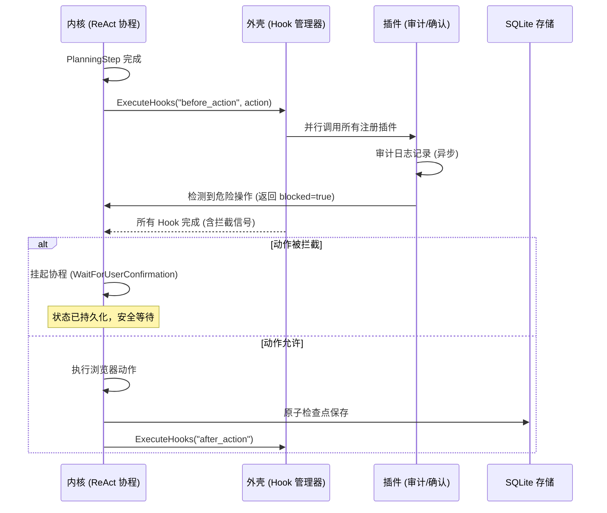

# AOS-Browser 架构设计 v2.0 (强内核 + 灵活外壳版)

> **版本**：v2.0 (基于 v1.0 顶层设计增强)  
> **核心哲学**：**强内核 (BAFA-lite)** 保障浏览器自动化稳定性与状态恢复，**灵活外壳 (PieAgent)** 提供钩子扩展与事件交互能力。  
> **约束前提**：仅使用本地部署 LLM，无云端依赖，完全离线可用。

---

## 一、设计愿景与架构原则

### 1.1 核心改进点
相比 v1.0 版本，v2.0 在保持原有稳定性决策（KV Hint、DOM Hash、原子检查点）的基础上，引入**插件化钩子机制**，解决 v1.0 扩展性不足的问题。

| 维度 | v1.0 (纯内核) | **v2.0 (内核 + 外壳)** | 改进价值 |
| :--- | :--- | :--- | :--- |
| **扩展性** | 需修改核心代码 | **支持动态 Hook/插件** | 支持审计、告警、人工确认等无需重编译功能 |
| **控制流** | 协程线性执行 | **协程 + 异步钩子拦截** | 在关键节点（如点击前）插入逻辑而不阻塞主流程 |
| **事件交互** | 内部事件队列 | **开放事件总线接口** | 支持外部 UI 或监控系统订阅 Agent 状态 |
| **稳定性** | 高 (BAFA-lite) | **高 (内核隔离)** | 外壳插件崩溃不影响内核状态持久化 |

### 1.2 架构分层原则
1.  **内核层 (Kernel)**：Layer 1 & Layer 2 核心部分。负责中断、协程调度、状态持久化。**禁止外部直接修改**。
2.  **外壳层 (Shell)**：Layer 2 扩展点 & Layer 3。负责 Hooks、事件订阅、指标上报。**支持动态加载**。
3.  **边界隔离**：外壳通过 `co_await` 异步接口与内核交互，严禁外壳阻塞内核协程。

---

## 二、顶层架构设计 (v2.0)

```
┌─────────────────────────────────────────────────────────────────────┐
│ Layer 3: Meta-Cognition & Shell (元认知与外壳层)                     │
│ ├─ GoalDriftDetector      │ 目标漂移检测 (内核调用)                  │
│ ├─ PluginManager          │ 【新增】插件加载器 (动态库/脚本)         │
│ ├─ HookManager            │ 【新增】钩子调度器 (Before/After)        │
│ └─ LocalMetricsCollector  │ 指标收集 (支持插件 Sink)                 │
└───────────────────────────┬─────────────────────────────────────────┘
                            │ 策略注入 / 钩子回调
┌───────────────────────────▼─────────────────────────────────────────┐
│ Layer 2: Cognitive Kernel (认知内核层)                               │
│ ├─ PreemptibleReActEngine  │ 【强内核】协程化 ReAct 循环              │
│ │  ├─ PlanningStep    │ 调用 Hook: before_planning / after_planning │
│ │  ├─ ActingStep      │ 调用 Hook: before_action / after_action     │
│ │  └─ ObservingStep   │ 调用 Hook: on_observation                   │
│ ├─ LocalLLMAdapter       │ 【强内核】定制 llama.cpp 封装              │
│ ├─ BrowserSnapshotManager│ 【强内核】原子快照 + DOM Hash 校验         │
│ ├─ PersistentContext     │ 【强内核】SQLite WAL 状态存储              │
│ └─ SecurityManager       │ 【强内核】敏感字段加密                    │
└───────────────────────────┬─────────────────────────────────────────┘
                            │ 事件驱动 / 协程调度
┌───────────────────────────▼─────────────────────────────────────────┐
│ Layer 1: Event & Control (事件与控制层)                              │
│ ├─ LightweightInterruptQueue │ 【强内核】原子信号中断                 │
│ ├─ EventBus                │ 【新增】内部事件总线 (Hook 触发源)       │
│ ├─ CDPEventListener        │ 浏览器事件监听                         │
│ └─ RecoveryManager         │ 崩溃恢复管理器                         │
└───────────────────────────┬─────────────────────────────────────────┘
                            │ 系统调用 / 资源管理
┌───────────────────────────▼─────────────────────────────────────────┐
│ Layer 0: Runtime & Storage (运行时与存储)                            │
│ ├─ PlaywrightAdapter       │ 浏览器控制                             │
│ ├─ LocalLLMRuntime         │ 定制 llama.cpp (KV Hint 支持)           │
│ ├─ SQLiteStorage           │ 状态存储                               │
│ └─ PluginRuntime           │ 【新增】插件沙箱 (WASM/动态库)          │
└─────────────────────────────────────────────────────────────────────┘
```

---

## 三、核心模块详细设计

### 3.1 强内核：协程化 ReAct 引擎 (增强版)
在内核关键路径植入钩子调用点，确保扩展性不破坏稳定性。

```cpp
// layer2/preemptible_react_engine.h
class PreemptibleReActEngine {
public:
    Task<void> Run() {
        while (!goal_reached_) {
            // 检查点 1：中断响应 (强内核能力)
            if (interrupt_controller_.IsPaused()) {
                co_await SaveBrowserSnapshot(); 
                co_await WaitForResumeSignal(); 
                continue; 
            }

            // --- 外壳扩展点：规划阶段 ---
            co_await hook_manager_.ExecuteHooks("before_planning", ctx_);
            auto thought = co_await llm_.GenerateWithCancel(prompt_, cancel_token_);
            co_await hook_manager_.ExecuteHooks("after_planning", ctx_, thought);
            
            // --- 外壳扩展点：执行阶段 ---
            auto action = ParseAction(thought);
            co_await hook_manager_.ExecuteHooks("before_action", ctx_, action);
            
            // 关键：Hook 可拦截动作 (如人工确认)
            if (ctx_.action_blocked) { 
                co_await WaitForUserConfirmation(); 
            }
            
            co_await browser_.Execute(action); 
            co_await hook_manager_.ExecuteHooks("after_action", ctx_, action);

            // 观察与持久化 (强内核能力)
            auto obs = co_await browser_.GetDOM();
            co_await SaveCheckpoint(ctx_); // 原子检查点
        }
    }
};
```

### 3.2 灵活外壳：钩子管理系统 (Hook Manager)
支持同步/异步钩子，所有钩子必须在独立协程或线程池运行，避免阻塞主 ReAct 循环。

```cpp
// layer3/hook_manager.h
enum class HookPhase { BEFORE, AFTER };

struct HookContext {
    std::string phase;
    std::string task_id;
    std::variant<Action, Thought, Observation> data;
    bool blocked = false; // Hook 可设置此标志拦截操作
};

class HookManager {
public:
    // 注册钩子 (支持插件动态注册)
    void RegisterHook(const std::string& phase, std::function<Task<void>(HookContext&)> callback);
    
    // 执行钩子 (并行执行所有注册钩子)
    Task<void> ExecuteHooks(const std::string& phase, HookContext& ctx) {
        std::vector<Task<void>> tasks;
        for (auto& hook : hooks_[phase]) {
            tasks.push_back(hook(ctx)); // 异步并发执行
        }
        co_await std::when_all(tasks.begin(), tasks.end());
    }

private:
    std::unordered_map<std::string, std::vector<std::function<Task<void>(HookContext&)>>> hooks_;
};
```

### 3.3 事件总线 (Event Bus)
连接内核与外壳，支持外部订阅内部状态。

```cpp
// layer1/event_bus.h
class EventBus {
public:
    // 发布内部事件 (如步骤完成、错误)
    void Publish(const AgentEvent& event);
    
    // 订阅事件 (外壳插件使用)
    Subscription Subscribe(EventType type, std::function<void(const AgentEvent&)> callback);
    
private:
    // 无锁队列实现，确保发布不阻塞内核
    LockFreeQueue<AgentEvent> queue_;
};
```

---

## 四、用户需求规格 (UR) 更新

| 编号 | 需求类别 | 需求描述 | 验收标准 | 变更说明 |
| :--- | :--- | :--- | :--- | :--- |
| **UR-01~09** | - | 保持不变 (见 v1.0) | - | 核心稳定性需求不变 |
| **UR-11** | **扩展性** | **支持动态 Hook 注册，无需重新编译核心** | 插件加载时间 <100ms，Hook 执行不阻塞主协程 | **新增** |
| **UR-12** | **安全性** | **插件运行在沙箱中，无法直接访问内核内存** | 插件崩溃不导致 Agent 进程崩溃 | **新增** |
| **UR-13** | **可观测性** | **支持自定义指标 Sink 插件** | 可通过插件将指标输出到自定义文件/端点 | 增强 UR-08 |

---

## 五、架构决策记录 (ADR) 更新

### ADR-15: 内核与外壳分离设计
| 属性 | 内容 |
| :--- | :--- |
| **决策** | 将 ReAct 引擎、持久化、中断处理定义为**强内核**；将 Hook、插件、指标上报定义为**灵活外壳** |
| **理由** | 结合 BAFA-lite 的稳定性与 PieAgent 的扩展性；内核保证崩溃恢复，外壳保证业务灵活 |
| **影响** | ✅ 支持动态扩展 ❌ 增加接口定义复杂度，需严格界定内核/外壳边界 |
| **实现要点** | 内核头文件暴露 `HookManager` 接口，但不暴露内部状态结构体；插件通过 API 交互 |

### ADR-16: 钩子异步执行机制
| 属性 | 内容 |
| :--- | :--- |
| **决策** | 所有 Hook 回调必须是 `Task<void>` 协程，通过 `std::when_all` 并行执行 |
| **理由** | 避免单个 Hook 阻塞主 ReAct 循环；支持多个插件同时监听同一事件 |
| **影响** | ✅ 高并发性能 ❌ 插件开发者需理解 C++20 协程模型 |
| **超时保护** | 单个 Hook 执行超时 >1s 自动终止，防止插件拖垮内核 |

---

## 六、配置模板 (v2.0 增强版)

```yaml
# config.yaml - AOS-Browser v2.0

# ========== 运行时 ==========
runtime:
  cpp_version: "20"
  thread_pool_size: 4
  max_concurrent_tabs: 3

# ========== LLM 配置 ==========
llm:
  model_path: "/models/llama-3-8b-instruct-q4_k_m.gguf"
  n_threads: 7
  enable_kv_hint: false  # V1.0 默认关闭，V1.1 可选启用

# ========== 浏览器配置 ==========
browser:
  headless: true
  navigation_timeout_sec: 30

# ========== DOM 哈希配置 ==========
dom:
  critical_selectors:
    - "#main-form"
    - "input[name=email]"
    - ".product-price"

# ========== 安全配置 ==========
security:
  encrypt_sensitive_fields: true
  sensitive_field_patterns:
    - ".*password.*"
    - ".*token.*"

# ========== 【新增】钩子与插件配置 ==========
hooks:
  enabled: true
  # 内置钩子
  builtins:
    - name: "audit_logger"
      phase: ["before_action", "after_action"]
      config:
        log_path: "/var/log/aos-browser/audit.log"
    - name: "human_confirmation"
      phase: ["before_action"]
      config:
        critical_actions: ["click#delete-btn", "submit#payment"]
  
  # 外部插件 (动态库)
  plugins:
    - path: "/plugins/custom_monitor.so"
      enabled: true
      config:
        alert_threshold_ms: 1000
```

---

## 七、关键流程时序 (内核 + 外壳交互)



---

## 八、实施路线图

| 阶段 | 目标 | 关键任务 | 预计周期 |
| :--- | :--- | :--- | :--- |
| **Phase 1** | **强内核落地** | 实现 ReAct 协程、原子检查点、DOM Hash、中断响应 | 2 周 |
| **Phase 2** | **外壳框架** | 实现 HookManager、EventBus、插件加载接口 | 1 周 |
| **Phase 3** | **内置插件** | 实现审计日志、人工确认钩子、本地指标收集 | 1 周 |
| **Phase 4** | **优化与测试** | 压力测试 (Hook 超时保护)、崩溃恢复验证 | 1 周 |

---

## 九、结论

本 v2.0 架构设计在保留 v1.0 **强稳定性内核**（本地 LLM、原子检查点、DOM 哈希校验）的基础上，成功融合了 **灵活外壳机制**（Hook 系统、事件总线、插件沙箱）。

1.  **稳定性保障**：内核核心逻辑（中断、持久化、恢复）不受插件影响，确保浏览器自动化任务的高可靠性。
2.  **扩展性提升**：通过 `before/after` 钩子机制，支持审计、人工确认、自定义监控等功能，无需修改核心代码。
3.  **离线可用**：所有插件与钩子均在本地运行，符合 UR-09 离线约束。

> **下一步行动**：基于此 v2.0 架构，输出 `AOS-Browser-Detailed-Design.md`，重点定义 `HookManager` 接口规范、插件沙箱隔离机制、以及 `BrowserSnapshot` 与 Hook 上下文的序列化协议。