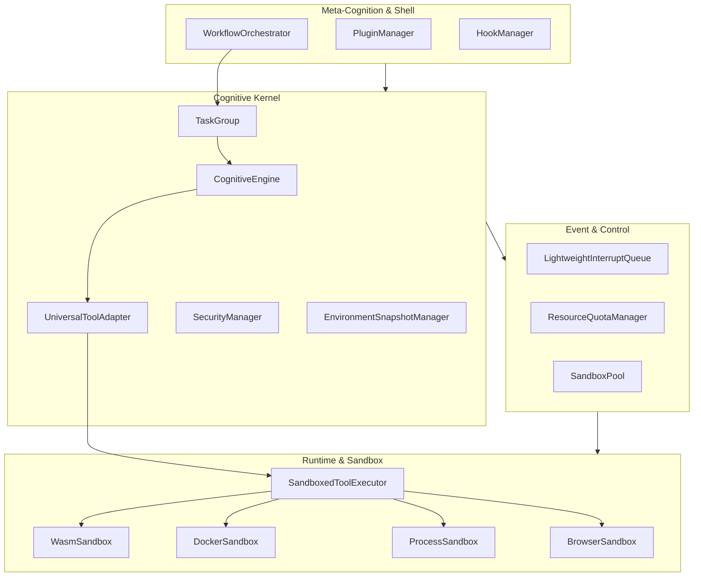

# AOS-Universal 详细设计文档

> **文档版本**: v1.0  
> **基线架构**: AOS-Universal v3.0  
> **最后更新**: 2026-03-23  
> **状态**: 设计稿  
> **约束前提**: 仅本地部署，无云端依赖，完全离线可用

---

## 1. 引言

### 1.1 编写目的
本文档基于《AOS-Universal 顶层设计 v3.0》编写，定义通用操作型智能体的模块内部结构、数据格式、接口规范，指导后续编码实现。

### 1.2 适用范围
适用于 AOS-Universal 核心开发团队、工具插件开发者。

### 1.3 参考文档
1. 《AOS-Browser 顶层设计 v1.0/v2.0/v3.0》
2. 《AOS-Browser 工具接口 v1.1》
3. 《浏览器智能体架构.md》(BAFA v1.0)

### 1.4 术语定义
| 术语 | 定义 |
|---|---|
| `TaskGroup` | 协程任务组，支持 Fork/Join 语义 |
| `WorkflowOrchestrator` | DAG 工作流编排器，管理任务依赖 |
| `SandboxedToolExecutor` | 沙箱化通用工具执行器 |
| `EnvironmentSnapshot` | 通用环境快照 (文件树/进程态/变量) |

---

## 2. 系统架构细化

### 2.1 模块依赖关系图


### 2.2 线程与协程模型
| 线程 | 职责 | 优先级 |
|---|---|---|
| **Main Thread** | 运行 CognitiveEngine 协程主循环 | SCHED_OTHER |
| **IO Thread** | 工具执行事件循环，沙箱通信 | SCHED_BATCH |
| **Background Thread** | 环境快照异步写入，日志轮转 | SCHED_IDLE |
| **ThreadPool** | 同步工具封装 (8 线程) | SCHED_OTHER |

---

## 3. 核心模块详细设计

### 3.1 Layer 3: WorkflowOrchestrator

```cpp
// layer3/workflow_orchestrator.h
#pragma once

#include <string>
#include <vector>
#include <unordered_map>
#include <functional>

namespace aos::universal {

enum class TaskState { PENDING, READY, RUNNING, COMPLETED, FAILED, CANCELLED };

struct TaskNode {
    std::string id;
    std::string goal;
    std::vector<std::string> dependencies;  // 前置任务 ID
    TaskState state = TaskState::PENDING;
    std::optional<std::string> result;
    uint32_t max_retries = 3;
    uint32_t retry_count = 0;
};

class WorkflowOrchestrator {
public:
    // 加载 DAG 定义
    void LoadDAG(const std::vector<TaskNode>& nodes);
    
    // 获取当前可执行的任务 (依赖已满足)
    std::vector<std::string> GetReadyTasks() const;
    
    // 通知任务完成，触发后续任务
    void OnTaskCompleted(const std::string& task_id, const std::string& result);
    
    // 通知任务失败
    void OnTaskFailed(const std::string& task_id, const std::string& error);
    
    // 取消工作流
    void Cancel();
    
    // 序列化/反序列化 (用于持久化)
    nlohmann::json ToJson() const;
    static WorkflowOrchestrator FromJson(const nlohmann::json& j);

private:
    bool AllDepsCompleted(const TaskNode& node) const;
    bool HasCyclicDependency() const;  // 检测循环依赖
    
    std::unordered_map<std::string, TaskNode> nodes_;
    std::string workflow_id_;
    bool cancelled_ = false;
};

}  // namespace aos::universal
```

### 3.2 Layer 2: TaskGroup

```cpp
// layer2/task_group.h
#pragma once

#include <memory>
#include <vector>
#include <coroutine>
#include "common/coro/task.h"
#include "layer2/cognitive_engine.h"

namespace aos::universal {

class TaskHandle {
public:
    std::string task_id() const { return task_id_; }
    Task<std::string> GetResult() const;  // 等待任务完成并返回结果
    void Cancel();  // 取消任务
    
private:
    friend class TaskGroup;
    std::string task_id_;
    std::weak_ptr<CognitiveEngine> engine_;
};

class TaskGroup {
public:
    explicit TaskGroup(std::string parent_task_id);
    ~TaskGroup();
    
    // Fork: 启动子任务 (不阻塞)
    TaskHandle Fork(std::string task_id, std::string goal);
    
    // Join: 等待所有子任务完成
    Task<std::vector<std::string>> Join();
    
    // JoinAny: 等待任一子任务完成
    Task<std::string> JoinAny();
    
    // WaitFor: 等待特定任务完成
    Task<std::string> WaitFor(const TaskHandle& handle);
    
    // 取消所有子任务
    void CancelAll();
    
    // 当前运行中的子任务数
    size_t RunningCount() const { return children_.size(); }

private:
    std::string parent_task_id_;
    std::vector<std::shared_ptr<CognitiveEngine>> children_;
    std::vector<TaskHandle> handles_;
};

}  // namespace aos::universal
```

### 3.3 Layer 2: EnvironmentSnapshotManager

```cpp
// layer2/environment_snapshot_manager.h
#pragma once

#include <string>
#include <vector>
#include <nlohmann/json.hpp>

namespace aos::universal {

// 泛化的环境快照 (支持浏览器/文件系统/进程状态)
struct EnvironmentSnapshot {
    std::string snapshot_id;
    std::chrono::system_clock::time_point captured_at;
    
    // 浏览器状态 (兼容 AOS-Browser)
    struct BrowserState {
        std::string url;
        std::vector<uint8_t> cookies;  // 加密存储
        std::string local_storage_json;
        std::string critical_dom_hash;
    } browser;
    
    // 文件系统状态
    struct FileSystemState {
        std::vector<std::string> modified_files;  // 文件路径列表
        std::string working_directory;
        std::unordered_map<std::string, std::string> file_hashes;  // 路径→SHA256
    } filesystem;
    
    // 进程状态
    struct ProcessState {
        std::vector<int> child_pids;
        std::unordered_map<std::string, std::string> env_vars;  // 环境变量 (脱敏)
    } process;
    
    // 变量状态 (Agent 内部)
    std::unordered_map<std::string, std::string> variables;
    
    // 序列化 (集成 SecurityManager 加密)
    nlohmann::json ToJson() const;
    static EnvironmentSnapshot FromJson(const nlohmann::json& j);
};

class EnvironmentSnapshotManager {
public:
    explicit EnvironmentSnapshotManager(const std::string& storage_path);
    
    // 创建快照 (原子写入：tmp + fsync + rename)
    Task<std::string> CreateSnapshot(const EnvironmentSnapshot& snapshot);
    
    // 加载快照
    Task<EnvironmentSnapshot> LoadSnapshot(const std::string& snapshot_id);
    
    // 删除快照
    Task<void> DeleteSnapshot(const std::string& snapshot_id);
    
    // 列出所有快照
    Task<std::vector<std::string>> ListSnapshots() const;
    
    // 清理过期快照 (保留最近 N 个)
    Task<void> CleanupOldSnapshots(size_t keep_count);

private:
    std::string storage_path_;
};

}  // namespace aos::universal
```

### 3.4 Layer 0: SandboxedToolExecutor (增强)

```cpp
// layer0/sandboxed_tool_executor.h - v3.0 增强版
#pragma once

#include "layer0/tool_manifest.h"
#include "layer0/sandbox.h"
#include "layer1/resource_quota_manager.h"

namespace aos::universal {

// 沙箱预热池配置
struct SandboxPoolConfig {
    size_t min_idle = 2;       // 最小空闲沙箱数
    size_t max_idle = 10;      // 最大空闲沙箱数
    std::chrono::milliseconds idle_timeout{30000};  // 空闲超时
    std::chrono::milliseconds warmup_timeout{5000}; // 预热超时
};

// 沙箱亲和性缓存 (复用同类型沙箱)
class SandboxAffinityCache {
public:
    void RecordAffinity(const std::string& tool_id, Sandbox* sandbox);
    Sandbox* GetAffinitySandbox(const std::string& tool_id);
    void ClearAffinity(const std::string& tool_id);
    
private:
    std::unordered_map<std::string, Sandbox*> affinity_map_;
};

class SandboxedToolExecutor {
public:
    explicit SandboxedToolExecutor(
        ResourceQuotaManager& quota_mgr,
        const SandboxPoolConfig& pool_config = {}
    );
    
    // 统一入口：协程友好
    Task<ToolResult> Execute(const ToolRequest& request, const ToolManifest& manifest);
    
    // 批量执行 (并行优化)
    Task<std::vector<ToolResult>> ExecuteBatch(
        const std::vector<ToolRequest>& requests,
        const std::vector<ToolManifest>& manifests
    );
    
    // 预热沙箱 (启动时调用)
    Task<void> WarmupSandboxes();
    
    // 强制终止执行
    void ForceTerminate(const std::string& execution_id);

private:
    // 选择沙箱 (考虑亲和性 + 预热池)
    Sandbox* SelectSandbox(const ToolManifest& manifest);
    
    // 沙箱工厂
    std::unique_ptr<Sandbox> CreateSandbox(SandboxType type, const ToolManifest& manifest);
    
    ResourceQuotaManager& quota_mgr_;
    SandboxPoolConfig pool_config_;
    SandboxAffinityCache affinity_cache_;
    
    // 预热池 (按沙箱类型隔离)
    std::unordered_map<SandboxType, std::vector<std::unique_ptr<Sandbox>>> sandbox_pools_;
};

}  // namespace aos::universal
```

---

## 4. 接口规范

### 4.1 Tool Manifest 扩展 (v3.0)

在 v1.1 基础上增加以下字段：

```cpp
// layer0/tool_manifest.h - v3.0 扩展
struct ToolManifestV3 {
    // ... v1.1 原有字段 ...
    
    // 【新增】工具依赖 (支持静态分析)
    struct Dependency {
        std::string tool_id;
        std::string version_constraint;  // 语义化版本约束，如 ">=1.0.0 <2.0.0"
    };
    std::vector<Dependency> dependencies;
    
    // 【新增】批量执行选项
    struct BatchOptions {
        bool atomic = false;          // 原子性：全部成功或全部失败
        bool ordered = false;         // 有序执行 (按请求顺序)
        size_t max_parallel = 4;      // 最大并行度
    } batch_options;
    
    // 【新增】DAG 执行提示
    struct DAGHints {
        bool is_parallelizable = true;    // 是否可并行执行
        std::vector<std::string> produces; // 产生的数据键
        std::vector<std::string> consumes; // 消费的数据键
    } dag_hints;
};
```

### 4.2 事件总线接口

```cpp
// layer1/event_bus.h
#pragma once

#include <string>
#include <functional>
#include <unordered_map>

namespace aos::universal {

enum class EventType {
    TASK_STARTED,
    TASK_COMPLETED,
    TASK_FAILED,
    TOOL_EXECUTING,
    TOOL_COMPLETED,
    HOOK_TRIGGERED,
    CHECKPOINT_SAVED,
    WORKFLOW_CANCELLED
};

struct AgentEvent {
    EventType type;
    std::string task_id;
    std::string payload_json;
    std::chrono::system_clock::time_point timestamp;
};

class EventBus {
public:
    // 发布事件 (非阻塞)
    void Publish(const AgentEvent& event);
    
    // 订阅事件
    using EventHandler = std::function<void(const AgentEvent&)>;
    struct Subscription {
        ~Subscription();  // 取消订阅
    };
    Subscription Subscribe(EventType type, EventHandler handler);
    
    // 广播事件到所有订阅者 (包括外部插件)
    void Broadcast(const AgentEvent& event);

private:
    std::unordered_map<EventType, std::vector<EventHandler>> handlers_;
    // 无锁队列实现，确保发布不阻塞
};

}  // namespace aos::universal
```

---

## 5. 配置模板

```yaml
# aos-universal-config.yaml
universal:
  version: "3.0"
  
  # 工具执行配置
  tool_executor:
    default_timeout_ms: 30000
    max_concurrent_tools: 8
    sandbox_pool:
      min_idle: 2
      max_idle: 10
      idle_timeout_ms: 30000
      
  # 工作流配置
  workflow:
    max_dag_depth: 10
    default_retry_count: 3
    checkpoint_interval_ms: 5000
    
  # 环境快照配置
  snapshot:
    storage_path: "/var/lib/aos-universal/snapshots"
    max_snapshots: 10
    compression: true  # 启用压缩
    
  # 安全配置
  security:
    default_sandbox_type: "process"  # wasm|process|chroot|docker
    seccomp_profile: "default"
    audit_log_path: "/var/log/aos-universal/audit.log"
    
  # 日志配置
  logging:
    level: "info"  # debug|info|warn|error
    format: "json"
    output_path: "/var/log/aos-universal/agent.log"
    max_size_mb: 100
    max_backups: 5
```

---

## 6. 构建与部署

### 6.1 依赖要求
| 依赖 | 版本 | 用途 |
|---|---|---|
| GCC/Clang | 12+ | C++20 协程支持 |
| CMake | 3.20+ | 构建系统 |
| nlohmann/json | 3.11+ | JSON 序列化 |
| libseccomp | 2.5+ | 系统调用过滤 |
| Docker API | 20.10+ | 容器沙箱 (可选) |

### 6.2 构建命令
```bash
mkdir build && cd build
cmake -DCMAKE_BUILD_TYPE=Release \
      -DAOS_ENABLE_DOCKER=ON \
      -DAOS_ENABLE_WASM=ON \
      ..
make -j$(nproc)
```

### 6.3 运行时要求
- Linux 内核 5.10+ (C++20 协程 + seccomp)
- 内存 ≥8GB (含模型)
- 磁盘 ≥50GB (模型 + 快照存储)

---

// -- 🦊 DevMate | AOS-Universal 详细设计 v1.0 --
