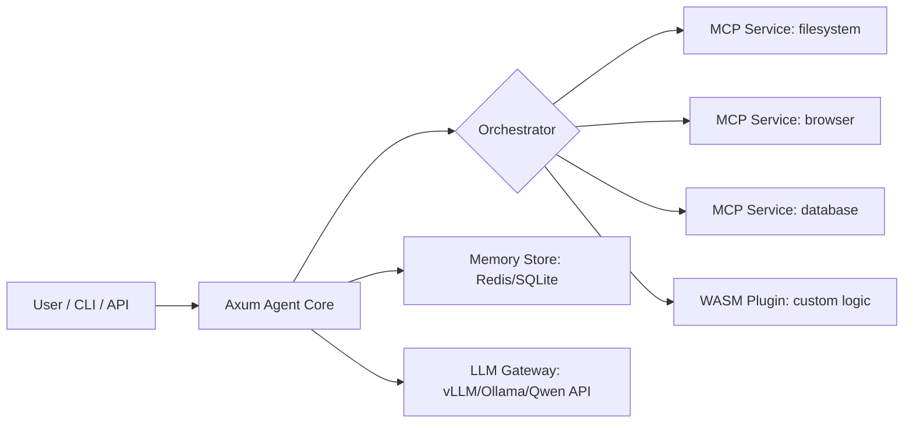

你提供的代码示例展示了一个典型的 **智能体（Agent）系统**，它结合了：
- 大语言模型（LLM，如 Qwen1.5-7B）
- **MCP（Model Context Protocol）服务**（如文件系统操作）
- 记忆机制（Memory）
- 多轮工具调用（Tool Use）

这类系统的核心需求是：
> **安全地协调 LLM 与外部工具（MCP 服务），支持复杂工作流、可扩展插件、可靠执行和可观测性。**

---

## ✅ 推荐软件栈：**Rust + Axum + MCP over gRPC/WASM + 轻量编排引擎**

在高性能边缘设备（>1GB 内存）或本地服务器上开发此类智能体，**不建议直接用 Python 原型长期运行**（性能、并发、部署、安全性受限）。应采用更工程化的架构。

---

### 🧩 推荐整体架构



---

## 🔧 分层推荐技术栈

### 1. **Agent 核心引擎：Rust + Axum**
- **为什么 Rust？**
  - 内存安全：避免 LLM 工具调用中的悬空指针、竞态条件
  - 高并发：Tokio 异步模型轻松处理多用户/多会话
  - 零成本抽象：适合长时间运行的 Agent 服务
- **Axum 作用**：
  - 提供 REST/gRPC API 接收用户请求
  - 管理会话状态、消息历史
  - 调度工具执行

✅ 示例能力：
```rust
// 处理一条用户消息，触发工具链
async fn handle_message(session_id: Uuid, msg: Message) -> Result<AgentResponse> {
    let mut executor = WorkflowExecutor::new(llm_client, mcp_registry);
    let plan = executor.plan(&msg.content).await?; // LLM 生成 CoT 计划
    let result = executor.execute(plan).await?;     // 安全执行工具链
    Ok(result)
}
```

---

### 2. **MCP 服务：独立进程 + gRPC（非 WASM）**
- **不要把 MCP 服务嵌入主进程！**
  - 文件系统、浏览器自动化等操作**高风险**，需强隔离
- **推荐方式**：
  - 每个 MCP 服务作为**独立微服务**（可用 Node.js/Python/Rust 编写）
  - 通过 **gRPC** 与 Agent Core 通信（比 HTTP 更高效、类型安全）
  - 使用 **Protocol Buffers** 定义标准 MCP 接口

```protobuf
// mcp.proto
service MCP {
  rpc CallTool(CallRequest) returns (CallResponse);
}

message CallRequest {
  string tool_name = 1;
  google.protobuf.Struct args = 2;
}
```

✅ 优势：
- 安全：崩溃不影响主 Agent
- 可复用：多个 Agent 共享同一个 `filesystem` MCP 服务
- 易调试：独立日志、监控、重启策略

> 💡 你示例中的 `npx @modelcontextprotocol/server-filesystem` 就是一个理想的独立 MCP 服务。

---

### 3. **自定义插件逻辑：WASM（可选）**
- 如果你需要**用户上传自定义业务逻辑**（如“当检测到发票时自动 OCR 并入库”）：
  - 用 **Rust/AssemblyScript 编写插件 → 编译为 WASM**
  - 通过 **Extism** 在 Agent Core 中安全执行
- **但注意**：WASM 不适合替代 MCP 服务（如文件 I/O），只适合**纯计算逻辑**（数据转换、规则判断）

---

### 4. **LLM 接入层：统一网关**
- 不要让 Agent 直连 LLM API
- 推荐部署 **vLLM** 或 **Ollama** 作为本地推理后端
- Agent Core 通过 **OpenAI 兼容 API** 调用（如你的 `http://localhost:8000/v1`）

✅ 好处：
- 支持多模型切换（Qwen、Llama、DeepSeek）
- 统一限流、缓存、日志
- 支持 `enable_thinking` 等扩展参数

---

### 5. **记忆与状态管理**
| 数据类型 | 推荐存储 |
|--------|--------|
| 会话消息历史 | **SQLite**（轻量、单文件、ACID） |
| 长期记忆（向量） | **Qdrant Lite** 或 **LanceDB**（嵌入式向量库） |
| 临时上下文 | 内存（Tokio 的 `Arc<Mutex<Session>>`） |

> 避免用 JSON 文件（如 `desktop_assistant_memory.json`）——并发写易损坏。

---

### 6. **工作流编排（复杂场景）**
对于多步骤、条件分支、循环的工作流（如“先查邮件 → 若有附件则下载 → 用 OCR 提取 → 存入数据库”）：
- **不要依赖 LLM 自由生成执行序列！**
- 推荐引入 **轻量工作流引擎**：
  - [Temporal](https://temporal.io/)（强大但重）
  - [Windmill](https://www.windmill.dev/)（开源低代码）
  - **自研 DAG 执行器**（Rust 实现，几十行代码即可）

```rust
// 伪代码：DAG 工作流
let workflow = Workflow::new()
  .step("check_email", email_mcp)
  .branch(|result| if result.has_attachment { "download" } else { "end" })
  .step("download", fs_mcp)
  .step("ocr", wasm_plugin);
```

---

## 📦 部署方案（边缘设备）

```bash
# 目录结构
/agent-system
├── agent-core        # Rust Axum binary
├── mcp-filesystem    # Node.js MCP 服务
├── mcp-browser       # Playwright-based MCP
├── llm-server        # vLLM container
└── data/
    ├── sessions.db   # SQLite
    └── vectors/      # 向量存储
```

- 用 **systemd** 或 **Docker Compose** 管理生命周期
- 通过 **cgroups** 限制每个 MCP 服务的内存/CPU
- 日志统一收集到 **Vector** 或 **Loki**

---

## ❌ 为什么不推荐纯 Python 方案？

| 问题 | 说明 |
|------|------|
| **GIL 限制并发** | 多用户 Agent 会阻塞 |
| **内存泄漏风险** | 长时间运行的 LLM 会话易累积对象 |
| **部署复杂** | 依赖 `npx`、`node_modules`，版本冲突常见 |
| **无强类型** | MCP 工具调用易出错（如传错参数类型） |
| **沙箱弱** | `subprocess` 调用 `npx` 有命令注入风险 |

> ✅ Python 适合**原型验证**，但**生产级智能体应走向工程化架构**。

---

## 🔚 最终推荐栈（2026 年最佳实践）

| 层级 | 技术选型 |
|------|--------|
| **主框架** | **Rust + Axum** |
| **异步运行时** | Tokio |
| **MCP 服务** | 独立进程 + **gRPC**（Node.js/Python/Rust） |
| **自定义插件** | **WASM + Extism**（仅计算逻辑） |
| **LLM 后端** | **vLLM**（支持 Qwen、Llama）或 **Ollama** |
| **记忆存储** | **SQLite**（结构化） + **LanceDB**（向量） |
| **工作流** | 自研 DAG 执行器 或 Temporal（复杂场景） |
| **部署** | Docker Compose + systemd + cgroups |

---

> 💡 **总结**：  
> 你的示例展示了智能体的“灵魂”（LLM + 工具使用），但要构建**可靠、可扩展、安全的生产系统**，必须用 **Rust/Axum 作为中枢**，将 MCP 服务**解耦为独立微服务**，并通过 **gRPC/WASM** 安全集成。  
> 这样既能保留 Qwen Agent 的灵活性，又能获得工业级的稳定性与性能。