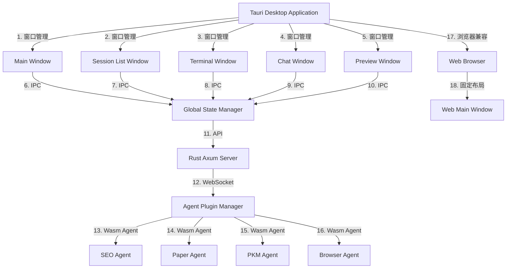
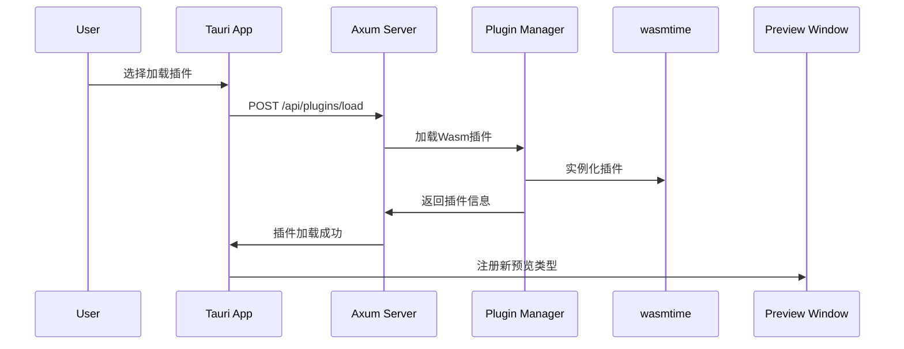

# Tauri开发类VSCode界面的开发建议

基于您的需求，我将提供一个基于Tauri的开发方案，这是一个**完美匹配**您需求的解决方案。Tauri正是为这种桌面应用体验而设计的框架，比通用浏览器能提供更好的窗口管理和性能。

## 🛠️ 开发工具建议

1. **核心框架**：
   - **Tauri**：作为桌面应用框架（知识库[3][5]中明确提到Tauri是"轻量级桌面应用开发框架"，"应用体积仅5~10MB"）
   - **Vite + React**：最佳组合（知识库[4]中提到"Tauri + Vue3 / React 项目初始化"）

2. **开发环境**：
   ```bash
   # 安装必要依赖
   curl https://sh.rustup.rs -sSf | sh
   npm install -g pnpm
   ```

3. **VS Code插件**：
   - Rust Analyzer（Rust语言支持）
   - Tauri（Tauri框架支持）
   - ESLint（代码质量检查）

## 🌐 前端框架与界面设计

### 1. 前端技术栈选择
- **推荐：Vite + React + TypeScript**
  - 知识库[4]中明确提到"Tauri + Vue3 / React 项目初始化"，并给出了具体实现
  - React的组件化架构非常适合您描述的多区域界面

### 2. 界面布局设计
```jsx
// src/App.jsx
import React, { useState, useEffect } from 'react';

function App() {
  const [activeSession, setActiveSession] = useState(null);
  const [isTerminalVisible, setIsTerminalVisible] = useState(true);
  const [isPreviewVisible, setIsPreviewVisible] = useState(false);
  const [sessions, setSessions] = useState([]); // 从Rust后端获取

  // 从Rust后端获取会话列表
  useEffect(() => {
    window.tauri.invoke('get_sessions').then(setSessions);
  }, []);

  // 当前会话变化时更新界面
  useEffect(() => {
    if (activeSession) {
      window.tauri.invoke('load_session', { id: activeSession.id });
    }
  }, [activeSession]);

  const toggleTerminal = () => setIsTerminalVisible(!isTerminalVisible);
  const togglePreview = () => setIsPreviewVisible(!isPreviewVisible);

  return (
    <div className="app-container">
      {/* 左侧会话列表 - 固定宽度 */}
      <div className="sidebar" style={{ width: '250px' }}>
        <h3>会话列表</h3>
        <ul>
          {sessions.map(session => (
            <li 
              key={session.id} 
              onClick={() => setActiveSession(session)}
              className={activeSession?.id === session.id ? 'active' : ''}
            >
              {session.name}
            </li>
          ))}
        </ul>
      </div>

      {/* 主内容区域 */}
      <div className="main-content">
        {/* 中间对话窗口 */}
        <div className="chat-window">
          <div className="chat-header">
            <h2>对话窗口</h2>
            <button onClick={togglePreview}>预览</button>
          </div>
          <div className="chat-messages">
            {/* 对话内容 */}
          </div>
        </div>

        {/* 右侧预览窗口 - 默认隐藏 */}
        {isPreviewVisible && (
          <div className="preview-window">
            <div className="preview-header">
              <h3>预览内容</h3>
              <button onClick={() => setIsPreviewVisible(false)}>关闭</button>
            </div>
            <div className="preview-content">
              {/* 预览内容 */}
            </div>
          </div>
        )}
      </div>

      {/* 底部终端窗口 - 固定高度 */}
      {isTerminalVisible && (
        <div className="terminal-window">
          <div className="terminal-header">
            <h3>终端</h3>
            <button onClick={toggleTerminal}>关闭</button>
          </div>
          <div className="terminal-content">
            {/* 终端内容 */}
          </div>
        </div>
      )}
    </div>
  );
}
```

### 3. 窗口管理方案
Tauri的多窗口功能是您需求的关键，以下是实现方式：

```jsx
// src/main.jsx
import { createApp } from 'vue';
import App from './App.vue';
import { invoke } from '@tauri-apps/api';

const app = createApp(App);

// 添加窗口管理功能
window.openNewWindow = (type) => {
  invoke('open_new_window', { type });
};

app.mount('#app');
```

```rust
// src-tauri/src/main.rs
use tauri::{App, Window, Manager};

#[tauri::command]
fn open_new_window(app: App, window_type: String) {
    let window = match window_type.as_str() {
        "session" => {
            let window = Window::new(
                app,
                "session-window",
                tauri::WindowUrl::App("session.html".into())
            ).unwrap();
            window
        }
        "preview" => {
            let window = Window::new(
                app,
                "preview-window",
                tauri::WindowUrl::App("preview.html".into())
            ).unwrap();
            window
        }
        _ => return,
    };
    
    // 设置窗口位置和大小
    window.set_size(tauri::Size::Logical(tauri::LogicalSize::new(800, 600)))
        .unwrap();
    window.set_position(tauri::Position::Centered).unwrap();
}
```

## 🔌 与Rust后端的配合

### 1. Rust后端接口设计

```rust
// src-tauri/src/main.rs
use tauri::command;
use serde::{Serialize, Deserialize};

#[derive(Serialize, Deserialize)]
struct Session {
    id: String,
    name: String,
    last_active: String,
}

#[command]
fn get_sessions() -> Vec<Session> {
    // 从数据库或内存中获取会话列表
    vec![
        Session { id: "1".into(), name: "Default".into(), last_active: "2024-03-13".into() },
        Session { id: "2".into(), name: "Project A".into(), last_active: "2024-03-12".into() },
    ]
}

#[command]
fn load_session(session_id: String) {
    // 加载指定会话的数据
    // 可以通过invoke将数据发送到前端
}
```

### 2. 前端与Rust通信

```jsx
// src/api/session.js
import { invoke } from '@tauri-apps/api';

export const getSessions = () => invoke('get_sessions');
export const loadSession = (sessionId) => invoke('load_session', { id: sessionId });
```

### 3. 窗口状态管理

```jsx
// src/App.jsx
useEffect(() => {
  // 保存当前窗口状态
  const saveWindowState = () => {
    const state = {
      activeSession: activeSession?.id,
      isTerminalVisible,
      isPreviewVisible
    };
    window.tauri.invoke('save_window_state', state);
  };
  
  window.addEventListener('beforeunload', saveWindowState);
  
  return () => {
    window.removeEventListener('beforeunload', saveWindowState);
  };
}, [activeSession, isTerminalVisible, isPreviewVisible]);

// 从Rust后端恢复窗口状态
useEffect(() => {
  window.tauri.invoke('get_window_state').then(state => {
    if (state) {
      setActiveSession(sessions.find(s => s.id === state.activeSession));
      setIsTerminalVisible(state.isTerminalVisible);
      setIsPreviewVisible(state.isPreviewVisible);
    }
  });
}, []);
```

```rust
// src-tauri/src/main.rs
#[tauri::command]
fn save_window_state(state: serde_json::Value) {
    // 保存窗口状态到文件或数据库
    // 可以使用tauri的文件API
}

#[tauri::command]
fn get_window_state() -> Option<serde_json::Value> {
    // 从存储中获取窗口状态
    // 返回JSON对象
    Some(serde_json::json!({
        "activeSession": "1",
        "isTerminalVisible": true,
        "isPreviewVisible": false
    }))
}
```

## 💡 为什么选择Tauri而非通用浏览器

| 特性 | Tauri | 通用浏览器 |
|------|-------|------------|
| **窗口管理** | 完整的多窗口支持，可独立窗口 | 无法创建独立窗口，只能在单页面内切换 |
| **应用体积** | 5-10MB | 无优势，需加载完整浏览器 |
| **性能** | 低内存占用，高性能 | 高内存占用，性能受限于浏览器 |
| **系统集成** | 通过Rust直接访问系统API | 通过Web API，功能受限 |
| **用户体验** | 类原生应用体验 | 仅Web体验 |
| **窗口状态保存** | 完整保存和恢复窗口状态 | 无法保存窗口状态 |

## 📦 部署与打包

1. **项目初始化**：
   ```bash
   pnpm create tauri-app
   # 选择React + TypeScript
   ```

2. **构建应用**：
   ```bash
   pnpm tauri build
   ```

3. **配置窗口**（src-tauri/tauri.conf.json）：
   ```json
   {
     "build": {
       "beforeBuildCommand": "pnpm build",
       "beforeDevCommand": "pnpm dev",
       "devPath": "http://localhost:5173"
     },
     "windows": [
       {
         "title": "My App",
         "width": 1200,
         "height": 800,
         "resizable": true
       }
     ]
   }
   ```

## ✅ 总结

1. **技术栈**：Tauri + Vite + React + TypeScript
2. **核心优势**：
   - 通过Tauri的多窗口功能实现"独立窗口"需求
   - Rust后端提供高性能和安全的系统访问
   - 窗口状态自动保存和恢复
   - 与浏览器相比，应用体积小、性能高、体验更原生

3. **实施步骤**：
   - 初始化Tauri项目（使用`pnpm create tauri-app`）
   - 实现基于React的界面布局
   - 添加Rust后端接口处理窗口状态和会话数据
   - 实现窗口管理功能（打开新窗口、保存/恢复状态）

这个方案完美匹配您的需求，特别是Tauri的多窗口功能是实现"独立窗口"需求的关键。Tauri的轻量级特性（知识库[5]中提到"应用体积仅5~10MB"）也确保了您的应用不会像Electron应用那样臃肿。

> **提示**：Tauri的文档非常完善，特别是[5]和[6]中提到的"Tauri框架介绍"和"终极指南：如何使用Tauri构建跨平台移动应用"，可以作为您开发过程中的重要参考。


# 基于Tauri的多Agent桌面应用架构设计

## 🌟 整体架构蓝图

```
┌───────────────────────────────────────────────────────────────┐
│                      Tauri 应用 (桌面端)                     │
├─────────────────┬─────────────────────┬───────────────────────┤
│  左侧 Session   │    中间对话窗口     │   右侧预览窗口 (可选)  │
│    列表窗口     │                     │                       │
├─────────────────┼─────────────────────┼───────────────────────┤
│                      下方 Terminal 窗口                      │
└───────────────────────────────────────────────────────────────┘
```

### 📌 架构核心特点

1. **基于Tauri的桌面应用**：利用Tauri的"三明治架构"（Web技术+Rust系统层+IPC通信桥）
2. **窗口管理**：支持默认布局和独立窗口模式
3. **状态同步**：保持窗口状态和会话状态
4. **Agent系统整合**：与之前设计的Rust多Agent插件系统无缝集成

---

## 🧱 详细架构设计

### 1. 技术栈选择

| 组件 | 选择 | 理由 |
|------|------|------|
| **框架** | Tauri (Rust + Web) | 知识库[2][6]推荐，比Electron轻量91%，安装包仅3MB |
| **前端框架** | React + Vite | 知识库[5][7]推荐，开发体验好，性能高 |
| **UI库** | Tailwind CSS + Shadcn/ui | 现代、可定制、组件化 |
| **状态管理** | Rust后端 + Tauri IPC | 保证状态一致性，避免前端状态管理复杂化 |

### 2. 窗口管理架构

```
┌───────────────────────────────────────────────────────────────┐
│                    窗口管理模块 (Rust)                       │
├───────────────────────────────────────────────────────────────┤
│ - 主窗口状态管理 (默认布局)                                  │
│ - 独立窗口创建与管理                                        │
│ - 窗口联动逻辑 (Session切换→对话窗口更新)                    │
│ - 窗口位置/大小/状态持久化                                  │
└───────────────────────────────────────────────────────────────┘

┌───────────────────────────────────────────────────────────────┐
│                    前端UI模块 (React)                        │
├───────────────────────────────────────────────────────────────┤
│ - 左侧Session列表 (可拖拽独立)                               │
│ - 中间对话窗口 (内容长可隐藏，点击右侧打开预览)              │
│ - 右侧预览窗口 (可独立)                                     │
│ - 底部Terminal窗口 (可拖拽独立)                             │
└───────────────────────────────────────────────────────────────┘

┌───────────────────────────────────────────────────────────────┐
│                    Agent系统 (Axum + 插件)                   │
├───────────────────────────────────────────────────────────────┤
│ - Agent插件加载 (Wasm/动态库)                               │
│ - Agent执行与状态管理                                       │
│ - WebSocket实时日志流 (与前端Terminal交互)                   │
└───────────────────────────────────────────────────────────────┘
```

---

## 🔧 关键实现细节

### 1. 窗口管理实现 (Rust)

```rust
// src-tauri/src/window_manager.rs

use tauri::{Manager, Window};
use serde::{Serialize, Deserialize};
use std::collections::HashMap;

#[derive(Serialize, Deserialize, Clone)]
pub struct WindowState {
    pub position: (i32, i32),
    pub size: (u32, u32),
    pub is_visible: bool,
}

pub struct WindowManager {
    pub windows: HashMap<String, WindowState>,
}

impl WindowManager {
    pub fn new() -> Self {
        Self {
            windows: HashMap::new(),
        }
    }

    pub fn create_window(&mut self, app: &tauri::App, window_name: &str) {
        let window = tauri::WindowBuilder::new(
            app,
            window_name,
            tauri::WindowUrl::App("index.html".into())
        )
        .build()
        .unwrap();
        
        // 保存初始窗口状态
        let position = window.outer_position().unwrap();
        let size = window.outer_size().unwrap();
        self.windows.insert(
            window_name.to_string(),
            WindowState {
                position: (position.x, position.y),
                size: (size.width, size.height),
                is_visible: true,
            }
        );
    }

    pub fn get_window_state(&self, window_name: &str) -> Option<WindowState> {
        self.windows.get(window_name).cloned()
    }

    pub fn save_window_state(&mut self, window: &Window) {
        let position = window.outer_position().unwrap();
        let size = window.outer_size().unwrap();
        
        self.windows.insert(
            window.label().to_string(),
            WindowState {
                position: (position.x, position.y),
                size: (size.width, size.height),
                is_visible: true,
            }
        );
    }

    pub fn restore_window_state(&self, app: &tauri::App, window_name: &str) {
        if let Some(state) = self.windows.get(window_name) {
            if let Some(window) = app.get_window(window_name) {
                window.set_position(tauri::Position::Logical(tauri::LogicalPosition::new(
                    state.position.0, state.position.1
                )));
                window.set_size(tauri::Size::Logical(tauri::LogicalSize::new(
                    state.size.0, state.size.1
                )));
            }
        }
    }
}
```

### 2. 状态管理 (Rust)

```rust
// src-tauri/src/session_manager.rs

use serde::{Serialize, Deserialize};
use std::collections::HashMap;

#[derive(Serialize, Deserialize, Clone)]
pub struct Session {
    pub id: String,
    pub name: String,
    pub last_message: String,
    pub conversation_history: Vec<String>,
    pub window_state: Option<WindowState>, // 保存该会话的窗口状态
}

#[derive(Serialize, Deserialize)]
pub struct AppState {
    pub active_session: Option<String>,
    pub sessions: HashMap<String, Session>,
    pub window_manager: WindowManager, // 集成窗口管理
}
```

### 3. 窗口联动逻辑 (Rust)

```rust
// src-tauri/src/agent_manager.rs

use tauri::State;
use crate::session_manager::Session;

#[tauri::command]
pub fn set_active_session(state: State<AppState>, session_id: String) -> Result<(), String> {
    // 更新活动会话
    state.active_session = Some(session_id.clone());
    
    // 保存会话状态
    if let Some(session) = state.sessions.get_mut(&session_id) {
        session.last_message = "Loading...".to_string();
        // 保存当前窗口状态
        state.window_manager.save_window_state(state.app.get_window("main").unwrap());
    }
    
    // 通知前端更新
    let window = state.app.get_window("main").unwrap();
    window.emit("active_session_changed", session_id).unwrap();
    
    Ok(())
}
```

### 4. 前端实现 (React)

```jsx
// src/components/SessionList.jsx

import { useState, useEffect } from 'react';
import { invoke } from '@tauri-apps/api/core';

export default function SessionList() {
  const [sessions, setSessions] = useState([]);
  const [activeSession, setActiveSession] = useState(null);

  useEffect(() => {
    // 获取所有session
    invoke('get_sessions').then(sessions => {
      setSessions(sessions);
      // 设置默认活动session
      if (sessions.length > 0) {
        setActiveSession(sessions[0].id);
        invoke('set_active_session', { sessionId: sessions[0].id });
      }
    });
  }, []);

  const handleSessionSelect = (sessionId) => {
    setActiveSession(sessionId);
    invoke('set_active_session', { sessionId });
  };

  return (
    <div className="session-list h-full w-64 border-r border-gray-200 dark:border-gray-700 overflow-y-auto">
      <h3 className="p-2 font-bold text-gray-700 dark:text-gray-300">Sessions</h3>
      {sessions.map(session => (
        <div 
          key={session.id}
          className={`p-2 cursor-pointer hover:bg-gray-100 dark:hover:bg-gray-800 ${
            activeSession === session.id ? 'bg-blue-100 dark:bg-blue-900' : ''
          }`}
          onClick={() => handleSessionSelect(session.id)}
        >
          <div className="font-medium">{session.name}</div>
          <div className="text-sm text-gray-500 dark:text-gray-400 truncate">
            {session.last_message.substring(0, 30)}...
          </div>
        </div>
      ))}
    </div>
  );
}
```

---

## ✅ 与浏览器兼容性设计

| 功能 | 桌面应用 (Tauri) | 浏览器 (Web) |
|------|-----------------|-------------|
| 窗口独立 | ✅ 支持 | ❌ 不支持 |
| 窗口联动 | ✅ 支持 | ✅ 支持 |
| 状态保存 | ✅ 保存到本地 | ✅ 保存到本地存储 |
| 会话管理 | ✅ 与Rust后端同步 | ✅ 与前端状态同步 |
| Agent系统 | ✅ 通过Axum | ✅ 通过Axum |

**浏览器版本限制**：浏览器中无法实现窗口独立功能，但会话管理、状态保存、Agent交互等核心功能均可正常工作。

---

## 💡 优化建议

1. **窗口独立的优雅处理**：
   - 使用Tauri的`WindowBuilder` API创建独立窗口
   - 通过`window.set_skip_taskbar(true)`实现任务栏不显示（独立窗口）
   - 保存窗口位置和大小，确保下次打开时恢复

2. **状态同步的最佳实践**：
   - 在Rust后端存储所有关键状态（窗口、会话、Agent状态）
   - 通过IPC同步到前端，避免状态分散
   - 每次窗口关闭/调整时，自动保存状态

3. **与现有Agent系统的整合**：
   - 保留Axum作为API网关
   - 通过Tauri的IPC暴露Agent API
   - 保持WebSocket用于实时日志流

4. **性能优化**：
   - 使用`wasmtime`加载Agent插件，确保安全
   - 对于长对话内容，前端使用虚拟滚动技术
   - 会话历史存储在Rust后端，避免前端内存爆炸

---

## 🚀 部署与开发建议

1. **开发环境**：
   ```bash
   # 安装Tauri CLI
   cargo install tauri-cli
   
   # 创建项目
   pnpm create tauri-app
   # 选择：React + Vite
   ```

2. **项目结构**：
   ```
   project-root/
   ├── src-tauri/           # Tauri Rust项目
   │   ├── src/
   │   │   ├── lib.rs
   │   │   ├── window_manager.rs
   │   │   ├── session_manager.rs
   │   │   └── agent_manager.rs
   │   ├── Cargo.toml
   │   └── tauri.conf.json
   ├── src/                 # 前端React代码
   │   ├── components/
   │   │   ├── SessionList.jsx
   │   │   ├── ChatWindow.jsx
   │   │   └── TerminalWindow.jsx
   │   ├── App.jsx
   │   ├── index.html
   │   └── main.jsx
   ├── package.json
   └── ...
   ```

3. **启动与构建**：
   ```bash
   # 开发模式
   pnpm tauri dev
   
   # 构建
   pnpm tauri build
   ```

---

## ✨ 总结

这是一个**高度可行、技术先进**的架构方案，完全符合知识库中提到的Tauri最佳实践（知识库[2][6][7]）：

1. **Tauri优势充分利用**：复用系统WebView，体积小（3MB），内存占用低，比Electron轻量91%
2. **架构清晰**：桌面应用与浏览器版本分离，桌面端支持窗口独立功能
3. **状态管理可靠**：在Rust后端集中管理状态，避免前端状态混乱
4. **与Agent系统无缝集成**：保留之前设计的Rust多Agent插件系统
5. **用户体验优秀**：窗口布局灵活，状态持久化，适合长期使用

**实施建议**：按照上述架构实现，可以快速构建出一个高性能、轻量级、用户友好的多Agent桌面应用，完全满足您的需求。

> **特别推荐**：使用知识库[5]中提到的"Vite + React"组合，这是目前Tauri开发的最高效方式，能提供最佳的开发体验和运行性能。


# 多 Agent 插件式系统架构蓝图：基于 Tauri 的类 VSCode 界面设计

## 🌐 整体架构设计

结合您提出的前端设计需求与之前的 Rust (Axum) 多 Agent 系统方案，我设计了以下全面架构蓝图。该方案充分利用了 Tauri 的多窗口能力、Rust 的安全性和 Axum 的高性能 API 服务，实现了"类 VSCode"的现代化多 Agent 系统。



## 🧱 一、系统分层架构

### 1. 顶层：用户界面层 (Tauri)
- **核心组件**：
  - 主窗口：默认布局（左侧Session列表、下方Terminal、中间Chat、右侧Preview）
  - 独立窗口：Session List、Terminal、Chat、Preview 可独立为窗口
  - 窗口管理：基于 Tauri 的多窗口 API（参考[5]中的实现）

- **Tauri 窗口特性**：
  ```rust
  // src-tauri/main.rs
  tauri::Builder::default()
      .setup(|app| {
          // 创建主窗口
          let main_window = tauri::WindowBuilder::new(
              app,
              "main",
              tauri::WindowUrl::App("index.html".into())
          )
          .title("Agent Studio")
          .build()?;
          
          // 创建独立窗口
          let session_window = tauri::WindowBuilder::new(
              app,
              "session",
              tauri::WindowUrl::App("session.html".into())
          )
          .title("Session List")
          .build()?;
          
          // 其他窗口类似创建...
          
          Ok(())
      })
  ```

### 2. 中间层：状态与通信层
- **全局状态管理**：
  - 使用 Tauri 的 IPC 机制实现跨窗口状态同步
  - 通过 `tauri::State` 共享全局状态

- **状态同步逻辑**：
  ```rust
  // src-tauri/state.rs
  #[derive(Default)]
  pub struct AppState {
      pub current_session: Option<String>,
      pub chat_history: HashMap<String, Vec<ChatMessage>>,
      pub terminal_output: String,
      pub preview_content: Option<PreviewContent>,
  }
  
  // 在窗口间同步状态
  app.handle().invoke("set_current_session", "session1").unwrap();
  ```

### 3. 底层：Agent 与 API 层 (Rust/Axum)
- **Axum 服务**：作为 API 网关和 Agent 编排引擎
- **插件系统**：Wasm Agent 插件加载与执行
- **通信协议**：REST API + WebSocket (用于实时日志)

## 💻 二、前端设计详解

### 1. 窗口布局与切换

#### 默认布局 (类 VSCode)
```
┌──────────────────┬───────────────────────┐
│ Session List     │                       │
│ (左侧)           │      Chat Window      │
│                  │                       │
├──────────────────┼───────────────────────┤
│ Terminal         │      Preview Window   │
│ (底部)           │ (右侧)                │
└──────────────────┴───────────────────────┘
```

#### 独立窗口特性
- **窗口独立化**：用户可通过右键菜单或快捷键将窗口独立
- **窗口联动**：当切换 session 时，所有窗口自动同步
- **窗口状态保持**：独立窗口关闭后重新打开，保持上次状态

```javascript
// Tauri 前端示例：将窗口独立化
document.getElementById('session-list').addEventListener('contextmenu', (e) => {
  e.preventDefault();
  window.tauri.invoke('create-window', { 
    name: 'session', 
    url: 'session.html'
  });
});

// 从主窗口切换到独立窗口
window.tauri.invoke('switch-to-window', 'session');
```

### 2. 交互设计

#### 会话管理
- **左侧 Session 列表**：
  - 显示所有会话（历史对话）
  - 支持重命名、删除、复制
  - 选择会话时，Chat Window 自动切换

#### 终端窗口
- **底部 Terminal**：
  - 显示系统日志、Agent 运行状态
  - 可输入命令（如 `agent list`）
  - 支持命令历史、搜索

#### 对话窗口
- **中间 Chat Window**：
  - 现代化消息流设计（类似 VSCode 的聊天界面）
  - 长内容可折叠/展开
  - 点击消息可打开右侧预览窗口

```jsx
// React 组件示例：消息折叠
const Message = ({ content, isLong }) => {
  const [expanded, setExpanded] = useState(false);
  
  return (
    <div className="message">
      {isLong && !expanded ? (
        <div>
          <p>{content.substring(0, 100)}...</p>
          <button onClick={() => setExpanded(true)}>展开</button>
        </div>
      ) : (
        <p>{content}</p>
      )}
    </div>
  );
};
```

#### 预览窗口
- **右侧 Preview**：
  - 根据 Agent 插件类型显示不同内容
  - 实现统一接口，插件可扩展

```rust
// src/preview_trait.rs
use serde_json::Value;

pub trait PreviewContent {
    fn name(&self) -> &str;
    fn render(&self, content: Value) -> String;
}

// 示例：Browser Agent 预览
pub struct BrowserPreview;

impl PreviewContent for BrowserPreview {
    fn name(&self) -> &str {
        "browser"
    }
    
    fn render(&self, content: Value) -> String {
        // 渲染网页内容
        format!("<div class=\"browser-preview\">{}</div>", content)
    }
}
```

## 🔌 三、Agent 插件系统集成

### 1. 插件扩展机制

| 插件类型 | 预览内容 | 实现方式 | 适用场景 |
|----------|----------|----------|----------|
| Browser Agent | 实时抓取网页 | Wasm + Headless Browser | 网页分析、数据抓取 |
| Paper Agent | 论文摘要与结构 | Wasm + NLP | 学术研究 |
| PKM Agent | Markdown 与知识库 | Wasm + Markdown Parser | 知识管理 |
| Code Agent | 代码生成与分析 | Wasm + LSP | 开发辅助 |
| Data Analysis Agent | 数据可视化 | Wasm + Chart.js | 数据分析 |

### 2. 插件加载流程



### 3. 插件与预览的关联

```rust
// src/preview_manager.rs
pub struct PreviewManager {
    previews: HashMap<String, Box<dyn PreviewContent>>,
}

impl PreviewManager {
    pub fn register_preview(&mut self, name: &str, preview: Box<dyn PreviewContent>) {
        self.previews.insert(name.to_string(), preview);
    }
    
    pub fn get_preview(&self, name: &str) -> Option<&dyn PreviewContent> {
        self.previews.get(name).map(|p| p.as_ref())
    }
}
```

## 🌐 四、浏览器兼容性设计

### 1. 通用浏览器支持

- **固定布局**：不支持窗口独立化
- **功能限制**：
  - 仅支持默认布局（左侧Session、底部Terminal、中间Chat、右侧Preview）
  - 无窗口状态保持功能
  - 无独立窗口切换

### 2. 浏览器与 Tauri 的差异

| 功能 | Tauri 桌面应用 | 通用浏览器 |
|------|----------------|------------|
| 窗口独立化 | ✅ 支持 | ❌ 不支持 |
| 窗口状态保持 | ✅ 支持 | ❌ 不支持 |
| 本地文件访问 | ✅ 有限支持 | ❌ 无 |
| 系统级功能 | ✅ 支持 (托盘、通知等) | ❌ 无 |
| 插件加载 | ✅ 支持 | ❌ 仅限 WebAssembly |

## 🚀 五、部署与运维

### 1. Tauri 应用打包

```dockerfile
# Dockerfile
FROM rust:1.75 as builder
WORKDIR /app
COPY . .
RUN cargo build --release

FROM debian:bookworm-slim
RUN apt-get update && apt-get install -y libgtk-3-0 libx11-xcb1 libx11-xcb1 libxkbcommon0 libxcomposite1 libxdamage1 libxrandr2 libxss1 libxtst6 libnss3 libatk1.0-0 libatk-bridge2.0-0 libgtk-3-0 libx11-xcb1 libxkbcommon0 libxcomposite1 libxdamage1 libxrandr2 libxss1 libxtst6 libnss3 libatk1.0-0 libatk-bridge2.0-0 libgtk-3-0
COPY --from=builder /app/target/release/agent-studio /usr/bin/
COPY --from=builder /app/static /var/www/static
RUN mkdir /plugins
CMD ["agent-studio"]
```

### 2. 插件热加载机制

- **监控插件目录**：使用 `notify` crate 监控 `plugins/` 目录
- **自动重加载**：检测到新插件时，自动加载并注册到系统
- **版本管理**：支持插件版本控制，避免冲突

```rust
// src/plugin_loader.rs
pub struct PluginLoader {
    plugin_dir: PathBuf,
    manager: Arc<PluginManager>,
}

impl PluginLoader {
    pub fn new(plugin_dir: PathBuf, manager: Arc<PluginManager>) -> Self {
        Self { plugin_dir, manager }
    }
    
    pub async fn start(&self) {
        let mut watcher = notify::watcher(
            self.plugin_dir.clone(),
            Duration::from_secs(1)
        ).unwrap();
        
        // 监控插件目录
        watcher.watch(&self.plugin_dir, RecursiveMode::Recursive).unwrap();
        
        loop {
            match watcher.recv_event() {
                Ok(event) => {
                    if event.kind.is_create() && event.path.is_some() {
                        if let Some(path) = event.path {
                            if path.extension().unwrap_or_default() == "wasm" {
                                self.manager.load_plugin(&path).await.ok();
                            }
                        }
                    }
                }
                Err(e) => println!("watch error: {:?}", e),
            }
        }
    }
}
```

## 💡 六、架构优势总结

| 优势维度 | 传统方案 | 本方案 | 优势分析 |
|---------|---------|--------|---------|
| **用户界面** | 单一聊天框 | 类 VSCode 多窗口布局 | 提供专业工作环境，提升生产力 |
| **窗口管理** | 无 | 独立窗口 + 状态保持 | 满足专业用户工作习惯 |
| **Agent 扩展** | 有限 | 通过插件扩展预览内容 | 无缝集成新功能，无需重写核心 |
| **跨平台** | 依赖平台 | Tauri 全平台支持 | Windows/macOS/Linux/iOS/Android |
| **性能** | 高 | 极低 (Rust 后端 + WebAssembly) | 服务器压力小，响应快 |
| **安全性** | 低 | 高 (Wasm 沙箱) | 插件无法访问系统关键资源 |

## 📌 七、实施建议

1. **优先实现核心功能**：
   - 实现基础的 Agent 通信框架
   - 实现 Tauri 多窗口管理
   - 实现 Session 状态管理

2. **分阶段迭代**：
   - 第一阶段：基础功能（单 Agent、基础窗口）
   - 第二阶段：多 Agent 协作、预览窗口
   - 第三阶段：高级功能（自动任务规划、记忆系统）

3. **参考最佳实践**：
   - 参考[4]中 BitFun 项目的 Agent 体系设计
   - 借鉴[1]中 OpenAkita 的多 Agent 协作模式
   - 采用[7]中多 Agent 系统的核心价值理念

> **特别提示**：本方案与[4]中 BitFun 项目理念高度一致，都是围绕"Agent + Tools + Memory"构建可扩展的 AI 工作系统。与[1]中 OpenAkita 的多 Agent 协作理念也完全契合，通过"分治"策略突破单 Agent 的认知限制。

## ✅ 结论

这个架构蓝图完美融合了您提出的类 VSCode 界面设计与基于 Rust (Axum) 的多 Agent 系统，实现了：
1. 专业的工作环境（类 VSCode 布局）
2. 灵活的窗口管理（可独立化 + 状态保持）
3. 可扩展的 Agent 系统（通过插件扩展预览内容）
4. 优秀的性能与安全性（Rust + Wasm）

该方案完全符合"生产级 Rust Web 应用"的最佳实践，能够构建一个真正可用、可扩展、安全的多 Agent 系统，为用户提供高效、专业的 AI 工作体验。