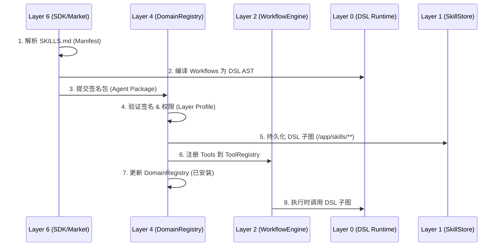

# AgenticOS v2.2 技能包移植规范

文档版本：v2.2.0
日期：2026-02-25
范围：SKILLS.md 技能包定义、导入、执行与安全约束
状态：基于 AgenticOS 架构 v2.2 正式发布
依赖：AgenticOS-Architecture-v2.2, AgenticOS-Layer-2-Spec-v2.2, AgenticOS-Layer-2.5-Spec-v2.2, AgenticOS-Security-Spec-v2.2, AgenticOS-Interface-Contract-v2.2, AgenticOS-Language-Spec-v4.4

---

## 执行摘要

本规范定义 AgenticOS v2.2 的技能包（SKILLS.md）移植机制，确保第三方技能可安全、高效地集成到 AgenticOS 生态中。

**核心目标：**
1. **DSL 化**：SKILLS.md 工作流逻辑转换为 AgenticDSL v4.0 子图，禁止 Python 业务逻辑
2. **工具注册**：技能工具通过 L2 `ToolRegistry` 注册，支持 `state.read/write` 工具化访问
3. **安全隔离**：技能执行受 L2 `SandboxController` 隔离，通过 Layer Profile 权限验证
4. **生态开放**：支持通过应用市场（Layer 6）分发技能包，与 Layer 4.5 声誉系统同步

**核心设计：** DSL 清单 + 工具注册 + 沙箱隔离 + Layer Profile 验证

---

## 1. 核心定位

### 1.1 技能包定义

SKILLS.md 是 AgenticOS v2.2 的技能清单格式，本质是 **DSL Manifest + 工具声明 + 工作流模板** 的结构化文档。

| SKILLS.md 元素 | AgenticOS v2.2 映射 | 实现层级 | 说明 |
| :--- | :--- | :--- | :--- |
| **Workflows** | AgenticDSL 子图 (`/app/skills/**`) | Layer 2 + Layer 0 | 逻辑 DSL 化，由 L0 引擎执行 |
| **Tools/Scripts** | InfrastructureAdapters | Layer 2 | 注册为 `tool_call` 节点 |
| **Triggers** | Layer 4 路由规则 / Layer 3 ReAct Action | Layer 4 + Layer 3 | 由认知层决策调用 |
| **Permissions** | Layer Profile + Resource Declaration | Layer 2 + Security | 声明 `Workflow Profile` 及资源权限 |
| **Package** | Agent Package (Signed) | Layer 6 + Layer 4 | 通过应用市场分发，DomainRegistry 管理 |

### 1.2 关键约束

✅ **DSL-Centric**：技能工作流必须转换为 AgenticDSL v4.0 子图
✅ **状态工具化**：技能访问状态必须通过 `state.read/write` 工具，禁止直接内存访问
✅ **Layer Profile**：技能包必须声明 `Workflow Profile`，通过编译期 + 运行期验证
✅ **沙箱隔离**：技能脚本必须在 L2 沙箱中执行，禁止宿主机访问
✅ **签名验证**：技能包必须签名，L4 验证签名 (`ERR_SIGNATURE_INVALID`)
✅ **命名空间**：技能工作流存储于 `/app/skills/**`，禁止写入 `/lib/**`

❌ **禁止**：Python 业务逻辑直接执行（必须 DSL 化）
❌ **禁止**：技能包直接访问 L4 `CognitiveStateManager` 内存
❌ **禁止**：技能工具绕过权限验证调用 L4 状态接口
❌ **禁止**：技能包写入 `/lib/**` 标准库命名空间

---

## 2. 技能包格式规范

### 2.1 SKILLS.md 结构

```yaml
# SKILLS.md - AgenticOS v2.2 技能清单
__meta__:
  name: "python-dev-skill"           # 技能包名称
  version: "1.0.0"                    # 语义化版本
  signature: "..."                    # 必须签名（RSA/ECDSA）
  layer_profile: "Workflow"           # Layer Profile 声明
  author: "skill-developer"
  description: "Python 开发技能包"
  dependencies:
    - name: "agentic-stdlib"
      version: ">=2.2.0"

# 定义工具（绑定脚本或 DSL）
tools:
  - name: "run_python"
    type: "script"                    # 或 "dsl"
    runtime: "python3"
    script: "./scripts/run.py"        # 沙箱内路径
    permissions:
      - tool: run_python → scope: sandbox_only
      - state: read → path: "memory.state.*"
      - file: read → path: "/app/skills/python-dev/**"
    output_schema:                    # 输出 Schema（用于类型检查）
      type: object
      properties:
        success: { type: boolean }
        output: { type: string }

  - name: "analyze_code"
    type: "dsl"
    source: "/lib/skills/python/analyze@v1"  # 引用标准库
    permissions:
      - state: read → path: "memory.state.*"

# 定义工作流（可被 L3 调用）
workflows:
  - name: "debug_loop"
    entry_point: "/app/skills/python-dev/debug/start"
    trigger: "on_error"               # 触发条件
    layer_profile: "Workflow"
    metadata:
      priority: 5
      estimated_cost: 100

  - name: "code_review"
    entry_point: "/app/skills/python-dev/review/start"
    trigger: "manual"
    layer_profile: "Workflow"

# 定义触发器（可选）
triggers:
  - name: "on_python_file"
    type: "file_pattern"
    pattern: "*.py"
    action: "suggest_skill"
    skill_name: "python-dev-skill"

# 资源声明（必须）
resources:
  - type: tool
    name: run_python
    scope: sandbox_only
  - type: state
    operations: ["read"]
    paths: ["memory.state.*"]
  - type: file
    operations: ["read"]
    paths: ["/app/skills/python-dev/**"]
  - type: network
    outbound:
      domains: ["pypi.org"]           # 白名单
```

### 2.2 签名验证

所有 `/app/skills/**` 技能包必须声明 `signature` 契约：

```yaml
signature:
  algorithm: "RSA-SHA256"             # 或 ECDSA
  public_key: "..."                   # 公钥指纹
  signed_data: "..."                  # 签名内容
  timestamp: "2026-02-25T10:00:00Z"
  expires_at: "2027-02-25T10:00:00Z"  # 可选，过期时间
```

**验证流程：**
1. L6 应用市场验证签名（发布时）
2. L4 DomainRegistry 验证签名（安装时）
3. L2 WorkflowEngine 验证签名（执行时，缓存）

**错误码：** `ERR_SIGNATURE_INVALID`, `ERR_SIGNATURE_EXPIRED`

---

## 3. 技能包移植流程

### 3.1 移植架构图

```
┌─────────────────────────────────────────────────────────────────┐
│                    技能包移植流程 v2.2                           │
├─────────────────────────────────────────────────────────────────┤
│  1. SKILLS.md 解析 (Layer 6 SDK)                                 │
│     └─ 解析 Manifest → 验证签名 → 提取工具/工作流定义             │
│                                                                  │
│  2. DSL 编译 (Layer 0)                                           │
│     └─ 工作流 DSL → AST → 语义验证 (Layer Profile)               │
│                                                                  │
│  3. 工具注册 (Layer 2)                                           │
│     └─ 注册到 ToolRegistry → 权限验证 → 沙箱配置                 │
│                                                                  │
│  4. 持久化 (Layer 1)                                             │
│     └─ 技能元数据 → SkillStore → 签名验证                        │
│                                                                  │
│  5. 生效 (Layer 4/3)                                             │
│     └─ DomainRegistry 注册 → L3 推理可发现新工具/工作流           │
└─────────────────────────────────────────────────────────────────┘
```

### 3.2 详细流程



### 3.3 分步实施

#### 步骤 1：SKILLS.md 解析

```python
# layer6/sdk/skill_parser.py
from typing import Dict, Any, List, Optional
from dataclasses import dataclass
from datetime import datetime
import yaml
import hashlib

@dataclass
class SkillManifest:
    """技能清单（5 年稳定）"""
    name: str
    version: str
    signature: str
    layer_profile: str  # "Workflow"
    author: str
    description: str
    tools: List[Dict[str, Any]]
    workflows: List[Dict[str, Any]]
    triggers: List[Dict[str, Any]]
    resources: List[Dict[str, Any]]

class SkillParser:
    """
    SKILLS.md 解析器
    
    职责：
    - 解析 YAML Manifest
    - 验证签名
    - 提取工具/工作流定义
    """
    
    def __init__(self, signature_verifier: 'SignatureVerifier'):
        self.signature_verifier = signature_verifier
    
    async def parse(self, skills_md_path: str) -> SkillManifest:
        """解析 SKILLS.md"""
        with open(skills_md_path, 'r') as f:
            content = f.read()
        
        # 解析 YAML
        manifest_dict = yaml.safe_load(content)
        
        # 验证签名
        await self.signature_verifier.verify(
            data=content,
            signature=manifest_dict['__meta__']['signature'],
            public_key=manifest_dict['__meta__'].get('public_key')
        )
        
        # 构建 Manifest 对象
        manifest = SkillManifest(
            name=manifest_dict['__meta__']['name'],
            version=manifest_dict['__meta__']['version'],
            signature=manifest_dict['__meta__']['signature'],
            layer_profile=manifest_dict['__meta__']['layer_profile'],
            author=manifest_dict['__meta__']['author'],
            description=manifest_dict['__meta__']['description'],
            tools=manifest_dict.get('tools', []),
            workflows=manifest_dict.get('workflows', []),
            triggers=manifest_dict.get('triggers', []),
            resources=manifest_dict.get('resources', [])
        )
        
        # 验证 Layer Profile
        if manifest.layer_profile not in ['Workflow', 'Thinking', 'Cognitive']:
            raise ValueError(f"Invalid layer_profile: {manifest.layer_profile}")
        
        return manifest
```

#### 步骤 2：DSL 编译

```python
# layer6/sdk/dsl_compiler.py
from typing import List, Optional
from agentic_dsl import Runtime, AST

class SkillDSLCompiler:
    """
    技能 DSL 编译器
    
    职责：
    - 将 SKILLS.md workflows 转换为 AgenticDSL
    - 编译为 AST（L0 纯函数）
    - 语义验证（Layer Profile）
    """
    
    def __init__(self, dsl_runtime: Runtime):
        self.dsl_runtime = dsl_runtime
    
    async def compile_workflows(self, 
                                workflows: List[Dict], 
                                skill_name: str) -> List[AST]:
        """编译工作流为 AST"""
        asts = []
        
        for workflow in workflows:
            # 生成 DSL 源码
            dsl_source = self._generate_dsl_source(workflow, skill_name)
            
            # 编译为 AST（L0 纯函数）
            ast = self.dsl_runtime.compile(dsl_source)
            
            # 验证 Layer Profile
            self._validate_layer_profile(ast, workflow.get('layer_profile', 'Workflow'))
            
            asts.append(ast)
        
        return asts
    
    def _generate_dsl_source(self, workflow: Dict, skill_name: str) -> str:
        """生成 DSL 源码"""
        entry_point = workflow['entry_point']
        
        # 简化示例，实际应完整生成 DSL
        return f"""
AgenticDSL "{entry_point}"
type: start
__meta__:
  layer_profile: {workflow.get('layer_profile', 'Workflow')}
next: "{entry_point}/end"

AgenticDSL "{entry_point}/end"
type: end
"""
    
    def _validate_layer_profile(self, ast: AST, profile: str):
        """验证 Layer Profile"""
        # L0 编译期验证
        for node_path, node in ast.nodes.items():
            if node.type == 'tool_call':
                tool_name = node.properties.get('tool_call', {}).get('tool')
                
                # Workflow Profile 约束
                if profile == 'Workflow':
                    # 允许 tool_call，但需沙箱隔离
                    pass
                elif profile == 'Thinking':
                    # 禁止 state.write
                    if tool_name == 'state.write':
                        raise CompileError(
                            f"ERR_PROFILE_VIOLATION: Thinking Profile 禁止 state.write"
                        )
                elif profile == 'Cognitive':
                    # 仅允许 state.read/write
                    if tool_name not in ['state.read', 'state.write']:
                        raise CompileError(
                            f"ERR_PROFILE_VIOLATION: Cognitive Profile 禁止 tool_call: {tool_name}"
                        )
```

#### 步骤 3：工具注册

```python
# layer2/tool_registry.py
from typing import Dict, Any, Callable, Optional
from dataclasses import dataclass

@dataclass
class ToolRegistration:
    """工具注册信息（5 年稳定）"""
    name: str
    handler: Callable
    permissions: Dict[str, Any]
    sandbox_config: Dict[str, Any]
    skill_name: str
    layer_profile: str

class ToolRegistry:
    """
    工具注册表
    
    职责：
    - 注册技能工具
    - 权限验证
    - 沙箱配置
    """
    
    def __init__(self):
        self.tools: Dict[str, ToolRegistration] = {}
    
    def register_tool(self, 
                      name: str, 
                      handler: Callable, 
                      permissions: Dict[str, Any],
                      sandbox_config: Dict[str, Any],
                      skill_name: str,
                      layer_profile: str = 'Workflow'):
        """注册工具"""
        # 验证命名空间
        if name.startswith('skill.'):
            # 技能工具必须使用 skill.{name}.* 命名空间
            pass
        else:
            name = f"skill.{skill_name}.{name}"
        
        # 验证 Layer Profile 兼容性
        self._validate_profile_compatibility(layer_profile, permissions)
        
        # 注册
        self.tools[name] = ToolRegistration(
            name=name,
            handler=handler,
            permissions=permissions,
            sandbox_config=sandbox_config,
            skill_name=skill_name,
            layer_profile=layer_profile
        )
    
    def _validate_profile_compatibility(self, 
                                        profile: str, 
                                        permissions: Dict[str, Any]):
        """验证 Layer Profile 兼容性"""
        # Workflow Profile 约束
        if profile == 'Workflow':
            # 允许 tool_call，但需沙箱隔离
            if 'sandbox_config' not in permissions:
                raise ValueError("Workflow Profile 工具必须配置沙箱")
        elif profile == 'Thinking':
            # 禁止 state.write
            for perm in permissions.get('state', []):
                if perm.get('operation') == 'write':
                    raise ValueError("Thinking Profile 禁止 state.write")
        elif profile == 'Cognitive':
            # 仅允许 state.read/write
            for perm in permissions.get('tool', []):
                if perm.get('name') not in ['state.read', 'state.write']:
                    raise ValueError("Cognitive Profile 仅允许 state 工具")
    
    def call_tool(self, name: str, args: Dict[str, Any], context: 'ExecutionContext') -> Any:
        """调用工具（运行期权限验证）"""
        if name not in self.tools:
            raise ValueError(f"Tool not found: {name}")
        
        tool = self.tools[name]
        
        # 运行期 Layer Profile 验证
        current_profile = context.get_layer_profile()
        if not self._profile_compatible(current_profile, tool.layer_profile):
            raise SecurityError(f"ERR_PERMISSION_DENIED: Profile mismatch")
        
        # 权限验证
        self._validate_permissions(tool.permissions, args, context)
        
        # 执行（沙箱内）
        return tool.handler(args, context)
    
    def _profile_compatible(self, current: str, required: str) -> bool:
        """验证 Profile 兼容性（降级原则）"""
        hierarchy = {'Cognitive': 3, 'Thinking': 2, 'Workflow': 1}
        return hierarchy.get(current, 0) >= hierarchy.get(required, 0)
```

#### 步骤 4：持久化

```python
# layer1/skill_store.py
from typing import Dict, Any, List, Optional
from dataclasses import dataclass
from datetime import datetime

@dataclass
class SkillMetadata:
    """技能元数据（5 年稳定）"""
    skill_id: str
    name: str
    version: str
    signature: str
    layer_profile: str
    author: str
    installed_at: datetime
    workflows: List[str]  # DSL 子图路径
    tools: List[str]      # 工具名称
    reputation_score: float

class SkillStore:
    """
    技能存储
    
    职责：
    - 持久化技能元数据
    - 签名验证
    - 版本管理
    """
    
    def __init__(self, dag_store: 'IDAGStore'):
        self.dag_store = dag_store
    
    async def persist_skill(self, 
                            skill_id: str, 
                            manifest: SkillManifest,
                            asts: List[AST]) -> str:
        """持久化技能"""
        # 1. 验证签名
        await self._verify_signature(manifest)
        
        # 2. 持久化 DSL 子图
        for ast in asts:
            await self.dag_store.persist(
                dag=ast.to_unified_dag(),
                meta={
                    'type': 'skill_workflow',
                    'skill_id': skill_id,
                    'layer_profile': manifest.layer_profile
                },
                priority='standard'
            )
        
        # 3. 持久化元数据
        metadata = SkillMetadata(
            skill_id=skill_id,
            name=manifest.name,
            version=manifest.version,
            signature=manifest.signature,
            layer_profile=manifest.layer_profile,
            author=manifest.author,
            installed_at=datetime.utcnow(),
            workflows=[ast.entry_point for ast in asts],
            tools=[tool['name'] for tool in manifest.tools],
            reputation_score=0.0  # 初始值
        )
        
        await self._store_metadata(metadata)
        
        return skill_id
    
    async def _verify_signature(self, manifest: SkillManifest):
        """验证签名"""
        # 使用公钥验证
        pass
    
    async def _store_metadata(self, metadata: SkillMetadata):
        """存储元数据"""
        # 存储到 Layer 1 SkillStore 表
        pass
```

#### 步骤 5：生效

```python
# layer4/domain_registry.py
from typing import Dict, Any, List, Optional
from dataclasses import dataclass

@dataclass
class DomainAgentInfo:
    """领域 agent 信息（5 年稳定）"""
    agent_id: str
    agent_name: str
    version: str
    domain_id: str
    description: str
    author: str
    skills: List[str]           # 技能列表
    components: List[str]       # 可视化组件列表
    installed_at: datetime
    signature: str
    reputation_score: float

class DomainRegistry:
    """
    领域注册表
    
    职责：
    - 管理已安装的技能包
    - 动态加载/卸载
    - 验证签名与完整性
    - 与 App Market 同步声誉信息
    """
    
    def __init__(self, 
                 app_market_client: 'AppMarketClient',
                 sandbox_controller: 'SandboxController'):
        self.app_market = app_market_client
        self.sandbox = sandbox_controller
        self.installed_skills: Dict[str, SkillMetadata] = {}
    
    async def install_skill(self, skill_package_path: str) -> SkillMetadata:
        """安装技能包"""
        # 1. 解析 SKILLS.md
        parser = SkillParser(...)
        manifest = await parser.parse(skill_package_path)
        
        # 2. 编译 DSL
        compiler = SkillDSLCompiler(...)
        asts = await compiler.compile_workflows(manifest.workflows, manifest.name)
        
        # 3. 注册工具
        tool_registry = ToolRegistry()
        for tool in manifest.tools:
            tool_registry.register_tool(
                name=tool['name'],
                handler=self._create_tool_handler(tool),
                permissions=tool.get('permissions', {}),
                sandbox_config=tool.get('sandbox_config', {}),
                skill_name=manifest.name,
                layer_profile=manifest.layer_profile
            )
        
        # 4. 持久化
        store = SkillStore(...)
        skill_id = await store.persist_skill(
            skill_id=f"skill.{manifest.name}",
            manifest=manifest,
            asts=asts
        )
        
        # 5. 更新注册表
        metadata = SkillMetadata(...)
        self.installed_skills[skill_id] = metadata
        
        # 6. 同步声誉到 Layer 4.5
        await self._sync_reputation(skill_id)
        
        return metadata
    
    async def uninstall_skill(self, skill_id: str) -> bool:
        """卸载技能包"""
        if skill_id in self.installed_skills:
            # 注销工具
            # 删除 DSL 子图
            # 更新注册表
            del self.installed_skills[skill_id]
            return True
        return False
    
    async def list_installed_skills(self) -> List[SkillMetadata]:
        """列出已安装技能"""
        return list(self.installed_skills.values())
    
    def _create_tool_handler(self, tool: Dict) -> Callable:
        """创建工具处理函数"""
        if tool['type'] == 'script':
            return self._create_script_handler(tool)
        elif tool['type'] == 'dsl':
            return self._create_dsl_handler(tool)
        else:
            raise ValueError(f"Unknown tool type: {tool['type']}")
    
    def _create_script_handler(self, tool: Dict) -> Callable:
        """创建脚本工具处理函数"""
        async def handler(args: Dict, context: 'ExecutionContext'):
            # 在沙箱中执行脚本
            result = await self.sandbox.execute_script(
                script=tool['script'],
                runtime=tool.get('runtime', 'python3'),
                args=args,
                context=context
            )
            return result
        return handler
    
    def _create_dsl_handler(self, tool: Dict) -> Callable:
        """创建 DSL 工具处理函数"""
        async def handler(args: Dict, context: 'ExecutionContext'):
            # 调用 DSL 子图
            dsl_source = tool['source']
            ast = self.dsl_runtime.compile(dsl_source)
            result = await self.workflow_engine.execute_dsl_template(
                ast=ast,
                context=context
            )
            return result
        return handler
    
    async def _sync_reputation(self, skill_id: str):
        """同步声誉到 Layer 4.5"""
        # 调用 Layer 4.5 ISocialService.sync_agent_reputation
        pass
```

---

## 4. 安全约束

### 4.1 权限模型

| 权限类型 | Workflow Profile | Thinking Profile | Cognitive Profile |
| :--- | :--- | :--- | :--- |
| `state.read` | ✅ 允许 | ✅ 允许 | ✅ 允许 |
| `state.write` | ⚠️ 受限 (沙箱/声明路径) | ❌ 禁止 | ✅ 允许 |
| `state.delete` | ❌ 禁止 | ❌ 禁止 | ✅ 允许 |
| `tool_call` | ✅ 允许 (沙箱内) | ⚠️ 受限 (只读工具) | ❌ 禁止 (除 state 工具) |
| `file_write` | ⚠️ 受限 (沙箱内) | ❌ 禁止 | ❌ 禁止 |
| `network_access` | ⚠️ 受限 (白名单) | ❌ 禁止 | ❌ 禁止 |

### 4.2 命名空间规则

| 命名空间 | 可写入？ | 签名要求 | Profile 约束 | 用途 |
| :--- | :--- | :--- | :--- | :--- |
| `/lib/**` | ❌ 禁止运行时写入 | ✅ 强制 | 必须匹配 | 标准库（Layer 2.5） |
| `/app/skills/**` | ✅ 允许 | ✅ 强制 | 必须声明 | 技能包工作流 |
| `/dynamic/**` | ✅ 自动写入 | ⚠️ 可选 | 继承父图 | 运行时生成子图 |
| `/main/**` | ✅ 允许 | ❌ 不要求 | 无限制 | 应用工作流 |

**约束：**
- 禁止写入 `/lib/**`（`ERR_NAMESPACE_VIOLATION`）
- `/app/skills/**` 必须声明 `signature` 契约
- 技能工具注册到 `skill.{name}.*` 命名空间，避免冲突

### 4.3 沙箱隔离

```python
# layer2/sandbox_controller.py
from typing import Dict, Any, Optional
from dataclasses import dataclass

@dataclass
class SkillSandboxConfig:
    """技能沙箱配置"""
    isolation_level: str = "HIGH"       # 独立内存空间
    context_copy: str = "SNAPSHOT"      # 父 Context 快照只读继承
    merge_explicit_outputs: bool = True # 仅合并显式输出
    disable_cache: bool = True          # 强制禁用缓存
    noise_injection: bool = True        # 强制噪声注入
    resource_limits: Dict[str, Any] = None  # 资源配额

class SandboxController:
    """
    沙箱控制器
    
    职责：
    - 进程级隔离（cgroups/seccomp/Firecracker）
    - 技能沙箱配置
    - 资源配额限制
    """
    
    async def execute_skill_script(self,
                                   script: str,
                                   runtime: str,
                                   args: Dict[str, Any],
                                   config: SkillSandboxConfig = None) -> Any:
        """在沙箱中执行技能脚本"""
        config = config or SkillSandboxConfig()
        
        # 1. 创建独立沙箱
        async with self.isolated_context(config) as sandbox:
            # 2. 执行脚本
            result = await sandbox.execute_script(
                script=script,
                runtime=runtime,
                args=args
            )
            
            # 3. 仅返回显式输出（防止副作用）
            if config.merge_explicit_outputs:
                return result.explicit_outputs
            else:
                return result
```

### 4.4 签名验证流程

```
┌─────────────────────────────────────────────────────────────────┐
│                    技能包签名验证流程                            │
├─────────────────────────────────────────────────────────────────┤
│  1. 发布时 (Layer 6)                                             │
│     └─ 开发者使用私钥签名 SKILLS.md                              │
│     └─ 应用市场验证公钥指纹                                      │
│                                                                  │
│  2. 安装时 (Layer 4)                                             │
│     └─ DomainRegistry 验证签名完整性                              │
│     └─ 验证过期时间 (expires_at)                                 │
│                                                                  │
│  3. 执行时 (Layer 2)                                             │
│     └─ 缓存签名验证结果                                          │
│     └─ 定期重新验证（可配置）                                    │
└─────────────────────────────────────────────────────────────────┘
```

**错误码：**
- `ERR_SIGNATURE_INVALID`：签名验证失败
- `ERR_SIGNATURE_EXPIRED`：签名过期
- `ERR_SIGNATURE_MISSING`：缺少签名声明

---

## 5. 与 AgenticOS 架构集成

### 5.1 Layer 2 集成

```python
# layer2/workflow_engine.py
class WorkflowEngine:
    """
    工作流引擎
    
    技能包集成点：
    - 加载 /app/skills/** DSL 子图
    - 调用 skill.{name}.* 工具
    - Layer Profile 验证
    """
    
    async def execute_skill_workflow(self,
                                     skill_id: str,
                                     workflow_name: str,
                                     context: ExecutionContext,
                                     budget: ExecutionBudget) -> ExecutionResult:
        """执行技能工作流"""
        # 1. 加载 DSL 子图
        ast = await self._load_skill_workflow(skill_id, workflow_name)
        
        # 2. 验证 Layer Profile
        profile = ast.config.layer_profile
        context.set_layer_profile(profile)
        
        # 3. 执行（L2 驱动 L0 细粒度循环）
        result = await self.execute_dsl_template(
            ast=ast,
            context=context,
            budget=budget
        )
        
        return result
    
    async def _load_skill_workflow(self, 
                                   skill_id: str, 
                                   workflow_name: str) -> AST:
        """加载技能工作流"""
        # 从 Layer 1 SkillStore 加载
        pass
```

### 5.2 Layer 2.5 集成

```python
# layer2.5/standard_library.py
class StandardLibrary:
    """
    标准库
    
    技能包可引用标准库模板：
    - /lib/reasoning/** 基础推理
    - /lib/workflow/** 工作流模板
    """
    
    async def load_skill_template(self, 
                                  skill_id: str, 
                                  template_path: str) -> AST:
        """加载技能模板"""
        # 技能可引用标准库
        if template_path.startswith('/lib/'):
            return await self.load_template(template_path)
        elif template_path.startswith('/app/skills/'):
            return await self._load_skill_template(skill_id, template_path)
        else:
            raise ValueError(f"Invalid template path: {template_path}")
```

### 5.3 Layer 4 集成

```python
# layer4/domain_registry.py
class DomainRegistry:
    """
    领域注册表
    
    技能包管理：
    - 安装/卸载技能
    - 验证签名
    - 同步声誉到 Layer 4.5
    """
    
    async def get_skill_tools(self, skill_id: str) -> List[str]:
        """获取技能工具列表"""
        if skill_id in self.installed_skills:
            return self.installed_skills[skill_id].tools
        return []
    
    async def sync_skill_reputation(self, skill_id: str):
        """同步技能声誉到 Layer 4.5"""
        # 调用 ISocialService.sync_agent_reputation
        pass
```

### 5.4 Layer 6 集成

```python
# layer6/app_market.py
class AppMarket:
    """
    应用市场
    
    技能包分发：
    - 发布技能包
    - 搜索/下载技能
    - 评价系统
    - 声誉同步
    """
    
    async def publish_skill(self, 
                            skill_package: SkillPackage,
                            signature: str) -> str:
        """发布技能包"""
        # 1. 验证签名
        await self._verify_signature(skill_package, signature)
        
        # 2. 存储到市场
        skill_id = await self._store_package(skill_package)
        
        # 3. 同步声誉到 Layer 4.5
        await self._sync_reputation(skill_id)
        
        return skill_id
    
    async def search_skills(self, 
                            query: str, 
                            domain_filter: Optional[str] = None) -> List[SkillSearchResult]:
        """搜索技能包"""
        pass
    
    async def download_skill(self, skill_id: str) -> SkillPackage:
        """下载技能包"""
        pass
```

---

## 6. 性能指标

| 指标 | 目标 | 测试条件 | 备注 |
| :--- | :--- | :--- | :--- |
| SKILLS.md 解析 | <50ms | 100 工具定义 | Layer 6 |
| DSL 编译 | <100ms | 100 节点工作流 | Layer 0 |
| 工具注册 | <10ms | 单次注册 | Layer 2 |
| 签名验证 | <10ms | RSA/ECDSA | Layer 4 |
| 技能沙箱创建 | <50ms | 独立上下文 | Layer 2 |
| 技能工作流执行 | <2s | 端到端 | Layer 2+0 |
| 声誉同步 | <100ms | Layer 6→Layer 4.5 | Layer 4.5 |

---

## 7. 测试策略

### 7.1 单元测试

```python
# test_skill_parser.py
import pytest
from layer6.sdk.skill_parser import SkillParser, SkillManifest

class TestSkillParser:
    """测试 SKILLS.md 解析"""
    
    async def test_parse_valid_skills(self):
        """验证有效 SKILLS.md 解析"""
        parser = SkillParser(...)
        manifest = await parser.parse("test_skills.md")
        
        assert manifest.name == "python-dev-skill"
        assert manifest.version == "1.0.0"
        assert manifest.layer_profile == "Workflow"
    
    async def test_parse_invalid_signature(self):
        """验证无效签名检测"""
        parser = SkillParser(...)
        
        with pytest.raises(SignatureVerificationError):
            await parser.parse("invalid_signature_skills.md")
    
    async def test_parse_invalid_profile(self):
        """验证无效 Layer Profile 检测"""
        parser = SkillParser(...)
        
        with pytest.raises(ValueError):
            await parser.parse("invalid_profile_skills.md")

# test_tool_registry.py
import pytest
from layer2.tool_registry import ToolRegistry

class TestToolRegistry:
    """测试工具注册"""
    
    def test_register_skill_tool(self):
        """验证技能工具注册"""
        registry = ToolRegistry()
        
        registry.register_tool(
            name="run_python",
            handler=lambda args: {"success": True},
            permissions={"sandbox_only": True},
            sandbox_config={"isolation_level": "HIGH"},
            skill_name="python-dev-skill",
            layer_profile="Workflow"
        )
        
        assert "skill.python-dev-skill.run_python" in registry.tools
    
    def test_profile_compatibility(self):
        """验证 Profile 兼容性"""
        registry = ToolRegistry()
        
        # Workflow → Workflow (兼容)
        assert registry._profile_compatible("Workflow", "Workflow") == True
        
        # Cognitive → Workflow (兼容，降级原则)
        assert registry._profile_compatible("Cognitive", "Workflow") == True
        
        # Workflow → Cognitive (不兼容)
        assert registry._profile_compatible("Workflow", "Cognitive") == False
```

### 7.2 集成测试

```python
# test_skill_integration.py
import pytest
from layer4.domain_registry import DomainRegistry

class TestSkillIntegration:
    """测试技能包集成"""
    
    async def test_install_and_execute_skill(self):
        """验证技能安装与执行"""
        registry = DomainRegistry(...)
        
        # 安装技能
        metadata = await registry.install_skill("python-dev-skill-1.0.0.zip")
        
        assert metadata.skill_id == "skill.python-dev-skill"
        assert metadata.version == "1.0.0"
        
        # 执行技能工作流
        engine = WorkflowEngine(...)
        context = ExecutionContext()
        context.set_layer_profile("Workflow")
        
        result = await engine.execute_skill_workflow(
            skill_id="skill.python-dev-skill",
            workflow_name="debug_loop",
            context=context,
            budget=ExecutionBudget()
        )
        
        assert result.success == True
    
    async def test_uninstall_skill(self):
        """验证技能卸载"""
        registry = DomainRegistry(...)
        
        # 安装
        await registry.install_skill("python-dev-skill-1.0.0.zip")
        
        # 卸载
        success = await registry.uninstall_skill("skill.python-dev-skill")
        
        assert success == True
        assert "skill.python-dev-skill" not in registry.installed_skills
    
    async def test_skill_sandbox_isolation(self):
        """验证技能沙箱隔离"""
        registry = DomainRegistry(...)
        engine = WorkflowEngine(...)
        
        # 执行技能（沙箱内）
        context = ExecutionContext()
        context.set("parent_data", "should_not_be_modified")
        
        result = await engine.execute_skill_workflow(...)
        
        # 验证父 Context 未被污染
        assert context.get("parent_data") == "should_not_be_modified"
```

### 7.3 渗透测试

| 测试项 | 测试内容 | 验证目标 |
| :--- | :--- | :--- |
| 签名伪造测试 | 尝试伪造技能包签名 | SignatureVerifier 拦截 |
| 沙箱逃逸测试 | 尝试 `rm -rf /` | SandboxController 拦截 |
| 权限提升测试 | 尝试访问未授权状态 | ToolRegistry 拦截 |
| 命名空间违规测试 | 尝试写入 `/lib/**` | DSL 编译器拦截 |
| Profile 绕过测试 | 尝试在 Thinking Profile 调用 `state.write` | L0 编译期 + L2 运行期拦截 |

---

## 8. 实施路线图

### 8.1 Phase 1：核心功能（P0）

| 周次 | 里程碑 | 验收标准 | 依赖 |
| :--- | :--- | :--- | :--- |
| W1-2 | SKILLS.md 解析器 | 解析/签名验证可用 | Layer-6-Spec-v2.2 |
| W3-4 | DSL 编译器 | 工作流→AST 转换可用 | Layer-0-Spec-v2.2 |
| W5-6 | 工具注册 | ToolRegistry 注册可用 | Layer-2-Spec-v2.2 |
| W7-8 | 技能沙箱 | 独立沙箱隔离可用 | Layer-2-Spec-v2.2 |

### 8.2 Phase 2：安全与集成（P1）

| 周次 | 里程碑 | 验收标准 | 依赖 |
| :--- | :--- | :--- | :--- |
| W1-2 | Layer Profile 验证 | 编译期 + 运行期验证生效 | Security-Spec-v2.2 |
| W3-4 | 签名验证流程 | 发布/安装/执行全链路验证 | Security-Spec-v2.2 |
| W5-6 | 领域注册表集成 | DomainRegistry 管理技能 | Layer-4-Spec-v2.2 |
| W7-8 | 应用市场集成 | 技能发布/下载可用 | Layer-6-Spec-v2.2 |

### 8.3 Phase 3：生态与优化（P2）

| 周次 | 里程碑 | 验收标准 | 依赖 |
| :--- | :--- | :--- | :--- |
| W1-2 | 声誉同步 | Layer 6→Layer 4.5 同步 <100ms | Layer-4.5-Spec-v2.2 |
| W3-4 | 性能优化 | 技能执行延迟 <2s | Observability-Spec-v2.2 |
| W5-6 | 全链路压测 | SLO 达标，安全渗透测试通过 | All Specs |
| W7-8 | 文档与培训 | 开发者文档完成，培训完成 | - |

---

## 9. 风险与缓解

| 风险 | 影响 | 缓解措施 | 责任人 | 对齐依据 |
| :--- | :--- | :--- | :--- | :--- |
| 技能包恶意代码 | 沙箱内攻击 | 签名验证 + 沙箱隔离 + 权限最小化 | 安全负责人 | Security-v2.2#Sec-4 |
| 技能冲突 | 同名工具冲突 | 命名空间隔离 (`skill.{name}.*`) | Layer 2 负责人 | Layer-2-Spec-v2.2#Sec-9 |
| 性能开销 | 技能执行延迟增加 | 沙箱优化 + 本地缓存 (TTL 受 L4 控制) | Layer 2 负责人 | Arch-v2.2#Sec-13 |
| 签名验证复杂 | Layer 2.5 延期 | Phase 1 简化为 Warn only | Layer 2.5 负责人 | Security-v2.2#Sec-13 |
| Layer Profile 验证遗漏 | 权限绕过风险 | 编译期 + 运行期双重验证 + 审计日志 | 安全负责人 | Security-v2.2#Sec-3.3 |
| 技能包版本管理复杂 | 升级失败 | 提供回滚脚本 + 多版本共存 | 配置管理 | Interface-v2.2#Sec-18 |
| 状态一致性风险 | 状态覆盖或冲突 | 版本向量 + 事务支持 (compare-and-swap) | L4 负责人 | Arch-v2.2#Sec-2.3 |

---

## 10. 与 AgenticOS 文档的引用关系

| Skill-Package-Spec 章节 | AgenticOS 文档引用 | 说明 |
| :--- | :--- | :--- |
| Section 2 (技能包格式) | Language-Spec-v4.4#Sec-2 | DSL 清单格式 |
| Section 3 (移植流程) | Architecture-v2.2#Sec-1.3 | 核心数据流 |
| Section 4 (安全约束) | Security-Spec-v2.2#Sec-3 | Layer Profile 模型 |
| Section 5 (架构集成) | Layer-2/2.5/4/6-Spec-v2.2 | 各层接口 |
| Section 6 (性能指标) | Observability-Spec-v2.2#Sec-8 | SLO 体系 |
| Section 7 (测试策略) | Security-Spec-v2.2#Sec-12 | 安全测试 |

---

## 11. 附录：错误码

| 错误码 | 含义 | 处理建议 |
| :--- | :--- | :--- |
| `ERR_SKILL_PARSE_FAILED` | SKILLS.md 解析失败 | 检查 YAML 格式 |
| `ERR_SIGNATURE_INVALID` | 签名验证失败 | 验证技能包签名 |
| `ERR_SIGNATURE_EXPIRED` | 签名过期 | 更新技能包 |
| `ERR_SIGNATURE_MISSING` | 缺少签名声明 | 添加 signature 块 |
| `ERR_PROFILE_VIOLATION` | Layer Profile 违规 | 检查 Profile 声明与工具兼容性 |
| `ERR_NAMESPACE_VIOLATION` | 命名空间违规 | 禁止写入 `/lib/**` |
| `ERR_TOOL_NOT_FOUND` | 工具未找到 | 检查工具注册 |
| `ERR_SANDBOX_CREATION_FAILED` | 沙箱创建失败 | 检查浏览器/系统支持 |
| `ERR_PERMISSION_DENIED` | 权限拒绝 | 检查 Layer Profile 验证 |
| `ERR_SKILL_NOT_INSTALLED` | 技能未安装 | 从应用市场安装 |
| `ERR_SKILL_VERSION_MISMATCH` | 技能版本不匹配 | 检查依赖版本 |
| `ERR_REPUTATION_SYNC_FAILED` | 声誉同步失败 | 检查 Layer 4.5 连接 |

---

## 12. 总结

AgenticOS v2.2 技能包移植规范提供：

1. **DSL-Centric 架构**：SKILLS.md 工作流逻辑转换为 AgenticDSL v4.0 子图，禁止 Python 业务逻辑
2. **状态管理工具化**：技能访问状态必须通过 `state.read/write` 工具，支持编译时权限检查
3. **Layer Profile 安全**：Workflow/Thinking/Cognitive 三层权限 Profile，与四层防护模型深度集成
4. **沙箱隔离**：技能脚本在 L2 `SandboxController` 内执行，防止宿主机访问
5. **签名验证**：技能包必须签名，L4/L6 全链路验证，防止恶意代码
6. **生态开放**：支持通过应用市场（Layer 6）分发技能包，与 Layer 4.5 声誉系统同步
7. **5 年接口契约**：工具注册、技能执行接口 5 年稳定，支持生态建设

**核心批准条件：**
1. **SKILLS.md 格式标准化**：Section 2 明确 Manifest 结构、签名要求、Layer Profile 声明
2. **移植流程完整**：Section 3 详细说明解析→编译→注册→持久化→生效全链路
3. **安全约束明确**：Section 4 明确权限模型、命名空间规则、沙箱隔离、签名验证流程
4. **架构集成清晰**：Section 5 明确与 Layer 2/2.5/4/6 的集成点和接口
5. **测试覆盖率达标**：Section 7 明确单元测试、集成测试、渗透测试要求，安全关键代码覆盖率 >90%

通过严格的接口契约与安全约束，确保 AgenticOS v2.2 技能包生态的安全性、可用性与可演进性，为第三方开发者提供稳定、开放的技能扩展平台。

---

文档结束
版权：AgenticOS 架构委员会
许可：CC BY-SA 4.0 + 专利授权许可