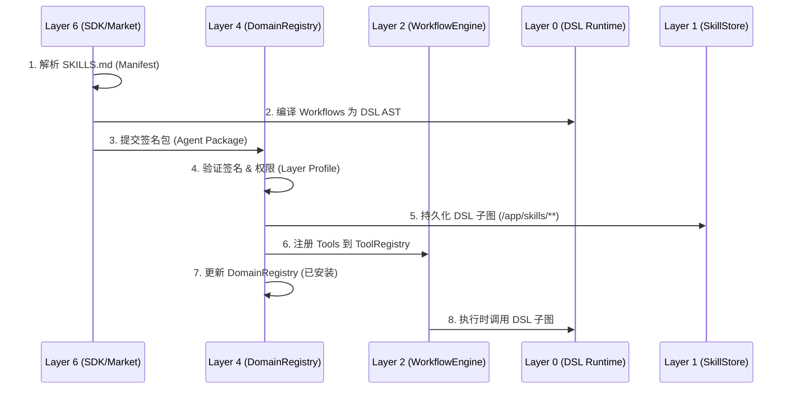

# AgenticOS 架构规范 v2.2

**文档版本：** v2.2.0  
**日期：** 2026-02-22  
**状态：** 正式发布  
**依赖：** AgenticDSL v4.0, AgenticOS-Layer-0-Spec-v2.2, AgenticOS-Security-Spec-v2.2, AgenticOS-State-Tool-Spec-v2.2  
**版权所有：** AgenticOS 架构委员会  
**许可：** CC BY-SA 4.0 + 专利授权许可

---

## 执行摘要

AgenticOS v2.2 是 AgenticOS 架构的重大演进版本，核心目标是确立 **"DSL-Centric"（以 DSL 为中心）** 的架构地位，最大化复用 `agentic-dsl-runtime` C++ 核心实现，将 LLM 生态扩展从 Python 库迁移至 DSL 标准库子图，并通过稳定的 C++/Python 混合接口暴露能力。

**核心变更：**
1. **纯 C++ DSL 核心编排**：L2/L3/L4 的业务逻辑不再由 Python 胶水代码实现，而是完全由 **DSL 子图（`/lib/**`）** 定义，并由 **`agentic-dsl-runtime` C++ 引擎** 直接调度执行。
2. **L4 状态与逻辑分离**：Layer 4 认知层分为 **DSL 逻辑**（`/lib/cognitive/**`）与 **C++ 状态管理**（`CognitiveStateManager`），确保状态管理的性能与安全性。
3. **状态管理工具化**：通过 `state.read`/`state.write` 工具将 L4 C++ 状态封装为 DSL `tool_call` 节点，支持编译时权限检查。
4. **Layer Profile 安全模型**：引入 **Cognitive/Thinking/Workflow** 三层权限 Profile，与四层防护模型深度集成，实现细粒度权限隔离。
5. **Python 绑定边缘化**：Python 仅作为 **Thin Wrapper**（薄封装），不再包含业务逻辑，消除 GIL 和胶水代码风险。
6. **智能化演进特性**：原生支持自适应预算、智能调度、动态沙箱、风险感知人机协作。

**官方表述：** "AgenticOS v2.2 采用八层基础设施（Layers 0-5 + Layer 4.5 + Layer 2.5）+ 第二大脑（Layer 4+5+6 组合），核心引擎基于 C++ DSL Runtime 实现全栈编排。"

---

## 1. 架构全景

### 1.1 八层架构总览 (v2.2 更新)

```text
┌─────────────────────────────────────────────────────────────────────────────┐
│                           AgenticOS 八层架构 v2.2                            │
├─────────────────────────────────────────────────────────────────────────────┤
│  Layer 6: Application Layer (应用层)                                         │
│  ├─ agentic-sdk: 开发者工具链（VS Code Extension、CLI）                       │
│  ├─ AgenticOS App Market: 第三方 brain-domain-agent 发布与分发               │
│  └─ 通过 AgenticSDK 与下层交互                                                  │
├─────────────────────────────────────────────────────────────────────────────┤
│  Layer 5: Interaction Layer (交互层) ←  第二大脑界面层                         │
│  ├─ brain-frontend: 三层安全沙箱、跨端布局抽象、全链路追踪                      │
│  └─ 可视化组件库、开发者调试工具                                                │
├─────────────────────────────────────────────────────────────────────────────┤
│  Layer 4.5: Social Orchestration Layer (社会协作层)                           │
│  ├─ Persona Core: 数字分身身份与价值观管理（DID+ 人格指纹）                      │
│  ├─ Contract System: 智能契约 DAG（谈判→签署→存证→履约）                       │
│  └─ Reputation Ledger: 基于零知识证明的信用积累系统                           │
├─────────────────────────────────────────────────────────────────────────────┤
│  Layer 4: Cognitive Layer (认知层) ← 第二大脑认知中枢                          │
│  ├─ 逻辑：/lib/cognitive/** (DSL 子图，路由决策、置信度评估)                    │
│  ├─ 状态：CognitiveStateManager (C++ 原生，用户会话、记忆缓存)                 │
│  ├─ IStateManager: 状态接口 (Read/Write/Subscribe)                           │
│  ├─ DomainRegistry: 已安装 domain-agent 管理与动态加载                         │
│  └─ 端侧加密、离线检测、轨迹验证                                                 │
├─────────────────────────────────────────────────────────────────────────────┤
│  Layer 3: Reasoning Layer (推理层)                                           │
│  ├─ 逻辑：/lib/thinking/** (DSL 子图，粗粒度 ReAct 循环)                        │
│  ├─ 生成：llm_generate_dsl 原语 (生成/dynamic/** 子图)                         │
│  └─ 轨迹生成、离线降级、多视角推理                                              │
├─────────────────────────────────────────────────────────────────────────────┤
│  Layer 2.5: Standard Library Layer (标准库层)                                │
│  ├─ /lib/cognitive/**: 认知层标准模板 (L4 专用)                                │
│  ├─ /lib/thinking/**: 推理层标准模板 (L3 专用)                                 │
│  ├─ /lib/workflow/**: 工作流标准模板 (L2 专用)                                 │
│  └─ /lib/dslgraph/**, /lib/reasoning/**, /lib/memory/**                      │
├─────────────────────────────────────────────────────────────────────────────┤
│  Layer 2: Execution Layer (执行层) ← 双重角色                                 │
│  ├─ 引擎：C++ WorkflowEngine (拓扑调度、预算控制)                              │
│  ├─ 逻辑：/lib/workflow/** (DSL 子图，领域工作流)                              │
│  ├─ 工具：InfrastructureAdapters (Python/C++/HTTP 工具实现)                    │
│  ├─ StateToolAdapter: 状态管理工具封装 (state.read/write)                     │
│  └─ SandboxController: 进程级隔离（cgroups/seccomp/Firecracker）               │
├─────────────────────────────────────────────────────────────────────────────┤
│  Layer 1: Storage Layer  (存储层)                                             │
│  ├─ UniDAG-Store: 统一 DAG 存储、拓扑排序、版本管理                               │
│  ├─ Execution DAG: 执行控制流（内存）                                           │
│  ├─ Domain DAG: 领域知识表示（持久化 + 向量）                                    │
│  └─ Reasoning Trace: 推理轨迹（审计，100% 可追溯）                              │
├─────────────────────────────────────────────────────────────────────────────┤
│  Layer 0: Resource Layer (资源层)                                             │
│  ├─ agentic-dsl-runtime: AgenticDSL C++ 核心运行时（唯一真理源）                │
│  ├─ 编译器：语义分析 (Layer Profile 检查)                                     │
│  ├─ LLM 适配器：OpenAI/Anthropic/本地 vLLM (最小化，仅 HTTP/Protocol)             │
│  └─ 基础设施：文件系统、网络、进程                                             │
└─────────────────────────────────────────────────────────────────────────────┘
```

**官方表述：** "AgenticOS 采用八层基础设施（Layers 0-5 + Layer 4.5 + Layer 2.5）+ 第二大脑（Layer 4+5+6 组合）"

### 1.2 AgenticDSL 三层架构映射 (v2.2 更新)

| AgenticDSL v4.0 | AgenticOS v2.2 | 说明 |
| :--- | :--- | :--- |
| **Layer 1: Execution Primitives** | **Layer 0** | 内置原语 (assign/llm_call/tool_call 等)，C++ 实现 |
| **Layer 2: Standard Primitives** | **Layer 2.5** | 标准库 (`/lib/cognitive/**`, `/lib/thinking/**`, `/lib/workflow/**`) |
| **Layer 3: Knowledge Application** | **Layer 3 + Layer 4 + Layer 6** | 应用工作流 (`/main/**`, `/app/**`)，DSL 编排 |

**关键架构规则：**
1. **唯一真理源**：`agentic-dsl-runtime` C++ 引擎是 L0-L4 执行的唯一核心，Python 仅作绑定。
2. **逻辑即数据**：L2/L3/L4 业务逻辑固化为 `/lib/**` DSL 子图，禁止 Python 实现核心编排逻辑。
3. **L4 状态分离**：L4 认知逻辑由 DSL 定义，L4 会话状态由 C++ 原生 `CognitiveStateManager` 维护。
4. **状态工具化**：L4 状态通过 `state.read`/`state.write` 工具暴露给 DSL，禁止直接内存访问。
5. **纯函数约束**：L0 执行原语层必须为纯函数，禁止维护会话状态（session state）。
6. **安全分层**：Layer Profile 权限模型贯穿全栈（Cognitive/Thinking/Workflow）。

### 1.3 核心数据流（双循环模型 v2.2）

```text
用户请求
    │
    ▼
┌─────────────┐    WebSocket     ┌─────────────────────────┐
│  Frontend   │◄────────────────►│  CognitiveStateManager  │
│  (Layer 5)  │   view_requested │  (L4 C++ State)         │
└─────────────┘                  └──────┬──────────────────┘
                                        │ 只读 Context 快照
                                        ▼
                               ┌─────────────────────────┐
                               │  /lib/cognitive/**      │
                               │  (L4 DSL Logic)         │
                               │ 路由决策、置信度评估      │
                               └──────┬──────────────────┘
                                      │ 延伸调用 (Extended Call)
                                      │ 传递 domain_id
                                      ▼
                               ┌─────────────────────────┐
                               │  /lib/thinking/**       │
                               │  (L3 DSL Logic)         │
                               │ 粗粒度 ReAct 循环         │
                               └──────┬──────────────────┘
                                      │ 沙箱调用 (Sandbox Call)
                                      │ 独立 SandboxInstance
                                      ▼
                               ┌─────────────────────────┐
                               │  /lib/workflow/**       │
                               │  (L2 DSL Logic)         │
                               │ 细粒度 DSL 节点执行       │
                               └──────┬──────────────────┘
                                      │
                                      ▼
                               ┌─────────────────────────┐
                               │ agentic-dsl-runtime     │
                               │  (Layer 0 C++ Core)     │
                               │ 唯一执行引擎             │
                               │ 编译时 Profile 检查        │
                               └──────┬──────────────────┘
                                      │ tool_call (state.read/write)
                                      ▼
                               ┌─────────────────────────┐
                               │ StateToolAdapter        │
                               │  (Layer 2)              │
                               │ 权限验证 + Schema 检查     │
                               └──────┬──────────────────┘
                                      │ C++ API
                                      ▼
                               ┌─────────────────────────┐
                               │ CognitiveStateManager   │
                               │  (Layer 4)              │
                               │ IStateManager 接口        │
                               └──────┬──────────────────┘
                                      │
                                      ▼
                               ┌─────────────────────────┐
                               │ UniDAG-Store            │
                               │  (Layer 1)              │
                               └─────────────────────────┘
```

**调用协议：**
1. **L4→L3 (延伸调用)**：L4 Context 只读快照传递给 L3，L3 不可修改 L4 状态，权限自动降级。
2. **L3→L2 (沙箱调用)**：L2 创建独立 `SandboxInstance`，与 L3 上下文隔离，仅合并显式输出 (`output_keys`)。
3. **状态工具调用**：DSL `tool_call` 节点 → L2 `StateToolAdapter` → L4 `IStateManager`。
4. **调用链 Token**：跨层调用追加 `call_chain`，防止循环依赖。

### 1.4 四类 DAG 协同

| DAG 类型 | 存储位置 | 用途 | 向量支持 | 生命周期 |
| :--- | :--- | :--- | :--- | :--- |
| **Execution DAG** | 内存（TopoScheduler） | 执行控制流 | ❌ 无 | 单次执行 |
| **Domain DAG** | UniDAG-Store | 领域知识表示 | ✅ feature_vector | 长期持久化 |
| **Reasoning Trace** | UniDAG-Store | 审计/学习/调试 | ❌ 无 | 长期持久化 |
| **Contract DAG** | UniDAG-Store | 智能契约 | ❌ 无 | 契约生命周期 |

协同机制：
* 向量检索从 Domain DAG 获取 → 注入 Execution DAG 的 `memory.state`
* `reasoning_trace_id` 贯穿 Execution DAG 与 Reasoning Trace
* Domain DAG 仅通过标准库契约访问（Layer 2.5）
* Contract DAG 通过 Layer 4.5 社会协作层管理

---

## 2. 核心设计原则

### 2.1 分层职责原则 (v2.2 更新)

| 层级 | 核心职责 | 禁止行为 | 实现语言 |
| :--- | :--- | :--- | :--- |
| **Layer 6 (应用)** | 业务逻辑、用户体验、应用市场 | 直接访问存储层 | Python/TS (SDK) |
| **Layer 5 (交互)** | 渲染、交互、安全沙箱、组件注册 | 包含业务逻辑 | TypeScript |
| **Layer 4.5 (社会)** | 多智能体协作、契约管理 | 执行领域操作 | Python/C++ |
| **Layer 4 (认知)** | **逻辑：** `/lib/cognitive/**` (DSL)<br>**状态：** `CognitiveStateManager` (C++)<br>**接口：** `IStateManager` | 执行领域操作 | **DSL + C++** |
| **Layer 3 (推理)** | **逻辑：** `/lib/thinking/**` (DSL)<br>ReAct 循环 (粗粒度)、DSL 调用 | 直接系统调用、维护执行状态 | **DSL** |
| **Layer 2.5 (标准库)** | 提供声明式 DSL 模板 (`/lib/**`) | 运行时修改模板、维护会话状态 | DSL |
| **Layer 2 (执行)** | **引擎：** C++ WorkflowEngine<br>**逻辑：** `/lib/workflow/**` (DSL)<br>**工具：** InfrastructureAdapters<br>**状态工具：** StateToolAdapter | 存储实现细节、直接调用 L0.execute() | **C++ + DSL** |
| **Layer 1 (存储)** | DAG 持久化、拓扑排序、版本管理、CDC 同步 | 业务语义验证 | C++/Rust |
| **Layer 0 (资源)** | DSL 编译、节点执行 (细粒度)<br>**编译检查：** Layer Profile 验证 | 高层业务逻辑、维护会话状态 | **C++** |

### 2.2 L0/L2/L2.5/L3/L4 执行边界契约 (v2.2 更新)

**明确契约：**
* **L4 (Cognitive)**:
    * ✅ 调用 L0 进行 DSL 编译（AST 生成）→ 纯函数，无状态
    * ✅ 加载 L2.5 标准库模板 (`/lib/cognitive/**`)
    * ✅ 维护 C++ 原生状态 (`CognitiveStateManager`)
    * ✅ 提供 `IStateManager` 接口 (Read/Write/Subscribe)
    * ❌ 禁止：DSL 逻辑直接访问 C++ 状态内存
    * ❌ 禁止：直接调用 L0.execute()，必须经过 L2 调度器
* **L3 (Reasoning)**:
    * ✅ 通过 `llm_generate_dsl` 原语生成 `/dynamic/**` 子图
    * ✅ 调用 L2.5 模板 (`/lib/thinking/**`)
    * ✅ 使用 `state.read` 工具读取状态 (只读)
    * ❌ 禁止：使用 `state.write` 工具 (Thinking Profile 限制)
    * ❌ 禁止：直接调用 L0.execute()，必须经过 L2 调度器
* **L2.5 (Standard Library)**:
    * ✅ 提供只读、版本化的 DSL 子图 (`/lib/**`)
    * ❌ 禁止：运行时修改，必须通过签名验证
    * ✅ 分类：`/lib/reasoning/**` (基础推理), `/lib/workflow/**` (业务流)
* **L2 (WorkflowEngine)**:
    * ✅ 维护 `ExecutionContext`（有状态）
    * ✅ 通过 `SandboxController` 创建沙箱
    * ✅ 驱动细粒度循环（拓扑排序执行节点链）
    * ✅ 在沙箱内调用 L0.execute_node(ast, node_path, context)
    * ✅ 智能化：解析节点 metadata 中的 priority/estimated_cost，优化执行顺序
    * ✅ 状态工具：注册 `state.read`/`state.write` 到 `ToolRegistry`
* **L0 (agentic-dsl-runtime)**:
    * ✅ 纯函数式运行时 (`compile`, `execute_node`)
    * ✅ 支持自适应预算约束、风险感知人机协作
    * ✅ 编译时检查：`tool_call` 与 `Layer Profile` 兼容性
    * ❌ 禁止：维护任何会话状态 (session state)
    * ❌ 禁止：直接访问文件系统、网络等外部资源（通过 L2 适配器）
    * ❌ 禁止：硬编码 LLM Provider 逻辑（仅负责 HTTP 协议）

**状态管理访问路径：**
* **L4 (CognitiveStateManager)**: 
    * ✅ 维护 C++ 原生状态 (用户会话、记忆缓存)
    * ✅ 提供 `IStateManager` 接口 (Read/Write/Subscribe)
    * ❌ 禁止：DSL 逻辑直接访问 C++ 状态内存
* **L2 (InfrastructureAdapters)**: 
    * ✅ 注册状态管理工具 (`state.read`, `state.write`) 到 `ToolRegistry`
    * ✅ 封装 L4 状态接口为 DSL `tool_call` 节点
    * ✅ 执行权限验证 (Layer Profile + Permissions)
* **L0 (agentic-dsl-runtime)**: 
    * ✅ 解析 `tool_call` 节点
    * ✅ 编译时检查 `state.write` 与 `Layer Profile` 兼容性
    * ❌ 禁止：L0 核心维护任何会话状态 (状态仍在 L4)

### 2.3 L4 状态分类表 (v2.2 新增)

| 状态类型 | 管理方式 | 存储位置 | 访问方式 | 示例 |
| :--- | :--- | :--- | :--- | :--- |
| **会话状态** | C++ 原生 | 内存 (加密) | `IStateManager` | `session.user_id`, `session.context` |
| **用户记忆** | C++ 原生 + L1 持久化 | SQLite (加密) | `state.read/write` | `memory.profile.*`, `memory.private.*` |
| **路由缓存** | C++ 原生 | 内存 | 内部 API | `routing.l1_cache` |
| **置信度评分** | C++ 原生 | 内存 | `IConfidenceService` | `confidence.current_score` |
| **临时工作区** | DSL Context | ExecutionContext | 上下文传递 | `$.temp.working_data` |
| **执行轨迹** | L1 持久化 | UniDAG-Store | `IDAGStore` | `trace.*` |

**状态访问路径：**
* ✅ DSL → `state.read`/`state.write` 工具 → L2 `StateToolAdapter` → L4 `IStateManager`
* ❌ 禁止：DSL 直接访问 `CognitiveStateManager` 内存
* ❌ 禁止：L2 工具绕过权限验证直接调用 L4 状态接口

### 2.4 Layer Profile 与四层防护模型集成

v2.2 引入 **Layer Profile** 权限模型，与 v2.1.1 四层防护模型深度集成。

| 防护层级 | Layer Profile 集成点 | 安全机制 |
| :--- | :--- | :--- |
| **L1: DSL 层** | 语义分析器验证 `/lib/cognitive` 不包含违规节点 | 逻辑标识符、技能白名单、命名空间规则 |
| **L2: 框架层** | 执行器检查 Layer Profile 权限 (TOOL_CALL 拦截) | SandboxController 进程隔离、cgroups/seccomp |
| **L3: 适配器层** | InfrastructureAdapter 验证操作是否符合 Layer Profile | 三重验证（声明/资源/威胁）、审计日志 |
| **L4: 前端层** | 组件沙箱验证渲染内容是否符合 Layer Profile | CSP/数据脱敏、Web Worker + Shadow DOM |

**Layer Profile 定义：**
* **Cognitive (L4)**: 严格限制，禁止 `tool_call` 和写文件，仅允许读记忆/上下文。**允许 `state.write`**。
* **Thinking (L3)**: 中等限制，禁止写文件，限制 `tool_call` (仅只读工具)，允许调用 L2。**禁止 `state.write`，仅允许 `state.temp_write`**。
* **Workflow (L2)**: 沙箱允许，允许 `tool_call`，允许文件写 (沙箱内)，允许网络 (受限)。**受限 `state.write` (沙箱/声明路径)**。

**Profile 继承规则：**
* **降级原则**：子图调用时权限只能减少（例如 L4 调用 L3，L3 无法获得 L4 未授权的权限）。
* **显式声明**：DSL 子图必须在 `__meta__` 中声明所需 Profile。
* **编译期验证**：违反 Profile 约束直接在编译期报错 (`ERR_PROFILE_VIOLATION`)。
* **运行期验证**：L2 `StateToolAdapter` 再次验证，防止绕过。

### 2.4.1 Layer Profile 与状态工具权限映射

| 操作类型 | Cognitive Profile (L4) | Thinking Profile (L3) | Workflow Profile (L2) |
| :--- | :--- | :--- | :--- |
| `state.read` | ✅ 允许 | ✅ 允许 | ✅ 允许 |
| `state.write` | ✅ 允许 | ❌ 禁止 | ⚠️ 受限 (沙箱/声明路径) |
| `state.delete` | ✅ 允许 | ❌ 禁止 | ❌ 禁止 |
| `state.temp_write` | ✅ 允许 | ✅ 允许 (临时工作区) | ✅ 允许 (临时工作区) |
| `security.*` | ✅ 允许 | ❌ 禁止 | ❌ 禁止 |

**编译时验证：**
* DSL 编译器必须在语义分析阶段验证 `tool_call` 节点与 `layer_profile` 的兼容性。
* 违规者 → `ERR_PROFILE_VIOLATION` (编译期错误)。

**双重验证机制：**
| 验证阶段 | 验证内容 | 实现位置 | 错误码 |
| :--- | :--- | :--- | :--- |
| **编译期** | `tool_call` 与 Profile 兼容性 | L0 语义分析器 | `ERR_PROFILE_VIOLATION` |
| **运行期** | 实际调用权限验证 | L2 `StateToolAdapter` | `ERR_PERMISSION_DENIED` |
| **审计期** | 操作日志记录 | L1 Trace 持久化 | N/A |

### 2.5 沙箱职责分层

| 组件 | 职责 | 禁止行为 |
| :--- | :--- | :--- |
| **SandboxController** | 进程级隔离（创建/销毁沙箱） | 业务逻辑验证 |
| **InfrastructureAdapterBase** | 操作级验证（路径/权限/审计） | 创建沙箱 |
| **StateToolAdapter** | 状态工具封装 (调用 L4 状态接口) | 直接访问 C++ 状态内存 |
| **DomainAdapter** | 领域业务逻辑 (工具实现) | 直接系统调用 |
| **ComponentSandbox** | 前端组件隔离（Web Worker + Shadow DOM） | 访问主线程 DOM |

### 2.6 离线优先设计

| 能力级别 | 领域示例 | 可用性 | 实现机制 |
| :--- | :--- | :--- | :--- |
| ✅ **完全离线** | C++/论文/文件 | 100% 功能 | 规则引擎 + 本地 LLM |
| ⚠️ **降级可用** | 社交/购物 | 基础功能 | 规则引擎 + 缓存 |
| ❌ **不可用** | 生物/数据科学 | 明确提示 | 联网检测 + 用户提示 |

### 2.7 双循环执行模型 (v2.2 更新)

* **粗粒度循环 (Layer 3/4)**:
    * 单位：ReAct Step (Thought → Action → Observation) / Cognitive Decision
    * 职责：策略决策、目标分解、异常处理、路由决策
    * 粒度：100-500ms 每步
    * 驱动：DSL 子图 (`/lib/thinking/**`, `/lib/cognitive/**`) + C++ 引擎
* **细粒度循环 (Layer 0 + Layer 2)**:
    * 单位：DSL 节点执行链 (assign → llm_call → tool_call)
    * 职责：原子操作执行、拓扑排序、预算控制
    * 粒度：5-50ms 每节点
    * 驱动：L2 WorkflowEngine (C++) 驱动 L0 Runtime (C++) 执行

### 2.8 标准库层规范 (Layer 2.5)

**命名空间：**
* `/lib/cognitive/**`: 认知层标准模板 (L4 专用)，只读，签名强制。
* `/lib/thinking/**`: 推理层标准模板 (L3 专用)，只读，签名强制。
* `/lib/workflow/**`: 工作流标准模板 (L2 专用)，只读，签名强制。
* `/lib/reasoning/**`: 基础推理原语 (L0/L2 共用)，只读，签名强制。
* `/lib/**`: 通用标准库（只读，签名强制，Layer 2.5）。
* `/dynamic/**`: 运行时生成（session-scoped，llm_generate_dsl 输出）。
* `/main/**`: 主 DAG（应用工作流）。

**约束：**
* 禁止写入 `/lib/**`（`ERR_NAMESPACE_VIOLATION`）。
* `/lib/**` 子图必须声明 `signature` 契约。
* `/lib/**` 子图执行时继承父图预算（strict 模式默认 50%，adaptive 模式基于置信度）。
* **分类治理**：基础推理模式 (`react`, `plan_and_execute`) 归入 `/lib/reasoning/**`，特定业务流归入 `/lib/workflow/**`。

### 2.9 应用市场与生态规范 (Layer 6 + Layer 4)

* **应用市场 (Layer 6)**: 第三方 brain-domain-agent 发布、分发、评价平台，集成 Layer 4.5 声誉账本。
* **DomainRegistry (Layer 4)**: 管理已安装的 domain-agent，验证签名与完整性，动态加载/卸载 Agent。
* **安全约束**: 安装包签名校验，沙箱隔离执行，资源权限显式声明，组件命名空间隔离。

### 2.10 智能化演进特性 (v2.2 原生支持)

| 特性 | 说明 | 实现层级 | 性能 KPI |
| :--- | :--- | :--- | :--- |
| **自适应预算** | 基于 Layer 4 置信度动态调整预算比例 (0.3-0.7) | Layer 4 + Layer 0 (C++) | 计算 <1ms |
| **智能调度** | L2 解析节点 metadata.priority，优化执行顺序 | Layer 2 (C++) | 开销 <5ms |
| **动态沙箱** | 为 `/dynamic/**` 子图创建独立 SandboxInstance | Layer 2 (C++) | 创建 <50ms |
| **自适应人机协作** | 基于风险等级与置信度动态决定人工确认需求 | Layer 0 + Layer 4 (C++) | 评估 <2ms |
| **状态管理工具化** | `state.read`/`state.write` 工具封装 L4 状态 | Layer 2 + Layer 4 | 调用 <5ms |

---

## 3. 核心接口契约（5 年稳定）

### 3.1 子项目间接口矩阵

| 接口名称 | 调用方向 | 定义位置 | 稳定性 | 版本 |
| :--- | :--- | :--- | :--- | :--- |
| **C++ Core API** | L2/L3/L4 → agentic-dsl-runtime | `src/core/engine.h` | **5 年 (ABI)** | **v2.2** |
| **Python 绑定 API** | Python → C++ Core | `agentic_dsl` 模块 | 5 年 | v2.2 |
| **IDAGStore** | 所有层 → UniDAG-Store | unidag-store | 5 年 | v2.2 |
| **IReasoningService** | brain-core → brain-thinking | brain-thinking | 5 年 | v2.2 |
| **ISocialService** | brain-core → CiviMind | brain-core | 5 年 | v2.2 |
| **GenericDomainAgent.execute()** | brain-core → brain-domain-agent | brain-domain-agent | 5 年 | v2.2 |
| **IStandardLibrary** | brain-thinking → agentic-stdlib | agentic-stdlib | 5 年 | v2.2 |
| **IConfidenceService** | Layer 0/2/3 → brain-core | brain-core | 5 年 | v2.2 |
| **IStateManager** | Layer 2 → brain-core | brain-core | 5 年 | v2.2 |
| **IAppMarketService** | brain-core → agentic-sdk | agentic-sdk | 5 年 | v2.2 |
| **IComponentRegistry** | brain-domain-agent → brain-frontend | brain-frontend | 5 年 | v2.2 |
| **IDeveloperService** | 开发者工具 → brain-domain-agent | brain-domain-agent | 5 年 | v2.2 |
| **WebSocket 协议** | brain-frontend ↔ brain-core | 协议文档 | 5 年 | v2.2 |

**v2.2 重点：**
* **C++ Core API** 为唯一真理源，Python 绑定 API 基于此封装。
* **废弃接口管理**：v2.1.1 Python 接口将在 v2.2 中废弃，迁移至 C++ Core。
* **接口松弛**：目前无第三方开发者基于现有 Python 接口构建的应用，可打破老版接口要求，修订为和新架构对应的接口。原则是 DSL 可以读取所有信息，最大化 LLM 通过 DAG 看到全部信息。
* **新增接口**：`ILLMProvider` (LLM 适配器工厂), `ISessionManager` (L4 会话管理), **`IStateManager` (状态管理接口)**。

### 3.2 数据契约

```protobuf
// UnifiedDAG v2.2 (UniDAG-Store)
message UnifiedDAG {
  string dag_id = 1;
  string name = 2;
  repeated DAGNode nodes = 6;
  repeated DAGEdge edges = 7;
  repeated string root_node_ids = 8;
  repeated int32 topo_ranks = 11;
  string domain = 12;
  int32 version = 13;  // DAG 内容版本
  string layer_profile = 14;  // v2.2 新增：Cognitive/Thinking/Workflow
}

// ReasoningRequest (brain-thinking)
message ReasoningRequest {
  string user_id = 1;
  string session_id = 2;
  string task = 3;
  string domain_id = 4;
  int32 max_steps = 5;
  float timeout_sec = 6;
  bool offline_ok = 7;
  repeated string call_chain  = 8;      // 调用链 Token（死锁检测）
  int32 recursion_depth = 9;           // 递归深度
  
  // 智能化演进字段 (v2.2)
  string budget_inheritance = 10;      //  "strict " |  "adaptive " |  "custom "
  string require_human_approval = 11;  //  "true " |  "false " |  "risk_based "
  float risk_threshold = 12;           // 风险阈值
  float confidence_score = 13;         // 置信度分数
  string layer_profile = 14;           // v2.2 新增：权限 Profile
}

// ContractDAG (Layer 4.5)
message ContractDAG {
  string contract_id = 1;
  UnifiedDAG dag = 2;
  repeated string participants = 3;
  map <string, string > signatures = 4;
  string status = 5;  //  "draft " |  "signed " |  "executing " |  "completed " |  "breached "
}

// StateOperation (Layer 2 → Layer 4)
message StateOperation {
  string operation_type = 1;  // "read" | "write" | "delete" | "subscribe"
  string path = 2;
  bytes value = 3;  // 序列化后的值
  string session_id = 4;
  VersionVector version = 5;  // 用于冲突检测
}
```

---

## 4. 子项目划分

### 4.1 子项目清单

```text
AgenticOS/
│
├── agentic-dsl-runtime/        # Layer 0 - C++ 核心运行时 (唯一真理源)
├── unidag-store/               # Layer 1 - 统一 DAG 存储
├── brain-domain-agent/         # Layer 2 - 领域执行引擎 (C++ 引擎 + DSL 逻辑)
├── agentic-stdlib/             # Layer 2.5 - 标准库层 (DSL 模板)
├── brain-thinking/             # Layer 3 - 推理运行时 (DSL 编排)
├── brain-core/                 # Layer 4 - 认知增强层 (C++ 状态 + DSL 逻辑)
│   └── state_manager/          # C++ 原生状态管理 (IStateManager)
├── civimind/                   # Layer 4.5 - 社会协作层
├── brain-frontend/             # Layer 5 - 用户交互层
└── agentic-sdk/                # Layer 6 - 应用开发 SDK + 应用市场
```

### 4.2 子项目依赖图

```mermaid
flowchart TB
    subgraph Layer0[Layer 0: Resource]
        R0[agentic-dsl-runtime (C++ Core)]
    end
    
    subgraph Layer1[Layer 1: Storage]
        R1[unidag-store]
    end
    
    subgraph Layer2[Layer 2: Execution]
        R2[brain-domain-agent (C++ Engine + DSL)]
        R2_State[StateToolAdapter]
    end

    subgraph Layer2_5[Layer 2.5: Standard Library]
        R2_5[agentic-stdlib (DSL Templates)]
    end
    
    subgraph Layer3[Layer 3: Reasoning]
        R3[brain-thinking (DSL Orchestration)]
    end
    
    subgraph Layer4[Layer 4: Cognitive]
        R4[brain-core (C++ State + DSL Logic)]
        R4_State[CognitiveStateManager]
    end
    
    subgraph Layer4_5[Layer 4.5: Social]
        R4_5[civimind]
    end
    
    subgraph Layer5[Layer 5: Interaction]
        R5[brain-frontend]
    end
    
    subgraph Layer6[Layer 6: Application]
        R6[agentic-sdk]
    end
    
    R0 -->|C++ API | R3
    R0 -->|C++ API | R2
    R0 -->|C++ API | R4
    R1   <-->|IDAGStore| R2
    R1   <-->|IDAGStore| R3
    R1   <-->|IDAGStore| R4
    R2_5 -->|IStandardLibrary| R3
    R2_5 -->|IStandardLibrary| R2
    R2_5 -->|IStandardLibrary| R4
    R3 -->|IReasoningService| R2
    R2 -->|GenericDomainAgent| R4
    R2_State -->|IStateManager| R4_State
    R4   <-->|ISocialService| R4_5
    R4   <-->|WebSocket| R5
    R4 -->|API| R6
    R6 -->|IAppMarketService| R4
    R4 -->|IConfidenceService| R0
    R4 -->|IConfidenceService| R2
    R4 -->|IConfidenceService| R3
    
    classDef l0 fill:#e8f5e8,stroke:#2e7d32
    classDef l1 fill:#e3f2fd,stroke:#1976d2
    classDef l2 fill:#fff3e0,stroke:#e65100
    classDef l2_5  fill:#fff8e1,stroke:#ff8f00
    classDef l3 fill:#f3e5f5,stroke:#4a148c
    classDef l4 fill:#ffebee,stroke:#c62828
    classDef l4_5 fill:#fce4ec,stroke:#ad1457
    classDef l5 fill:#c8e6c9,stroke:#388e3c
    classDef l6 fill:#e1f5fe,stroke:#0277bd
    
    class R0 l0
    class R1 l1
    class R2 l2
    class R2_State l2
    class R2_5 l2_5
    class R3 l3
    class R4 l4
    class R4_State l4
    class R4_5 l4_5
    class R5 l5
    class R6 l6
```

---

## 5. 部署架构

### 5.1 三端部署模式

| 部署场景 | 组件组合 | 存储实现 | 网络依赖 |
| :--- | :--- | :--- | :--- |
| **PC 本地** | Layers 0-5 + 4.5 + 2.5 | EmbeddedUniDAGStore (SQLite+Zarr) | ❌ 无 |
| **移动 APP** | Layers 0-5 + 4.5 + 2.5 | EmbeddedUniDAGStore (SQLite+Zarr) | ❌ 无 |
| **浏览器** | Layers 5-6 + 云端 0-4.5+2.5 | CloudUniDAGStore (PostgreSQL+S3) | ✅ 必需 |
| **混合模式** | Layers 0-5 + 4.5 + 2.5 + 云端同步 | 双存储适配器 | ⚠️ 可选 |

### 5.2 数据流部署

**本地部署（PC/移动）:**
```text
┌─────────────┐     ┌─────────────┐     ┌─────────────┐
│   Frontend  │────►│  brain-core │────►│   UniDAG    │
│   (Layer 5) │◄────│  (Layer 4)  │◄────│   -Store    │
└─────────────┘     └──────┬──────┘     │  (Layer 1)  │
                           │            └─────────────┘
                    ┌──────┴──────┐
                    │ brain-thinking│
                    │  (Layer 3)   │
                    └──────┬──────┘
                    ┌──────┴──────┐
                    │ agentic-stdlib│
                    │  (Layer 2.5) │
                    └──────┬──────┘
                    ┌──────┴──────┐
                    │brain-domain  │
                    │   -agent     │
                    │  (Layer 2)   │
                    └──────┬──────┘
                    ┌──────┴──────┐
                    │agentic-dsl   │
                    │   -runtime   │
                    │  (Layer 0)   │
                    └─────────────┘
                    ┌─────────────┐
                    │   CiviMind   │
                    │ (Layer 4.5)  │
                    └─────────────┘
                    ┌─────────────┐
                    │State Manager│
                    │  (Layer 4)  │
                    └─────────────┘
```

---

## 6. 演进路线图

### 6.1 各子项目演进

| 子项目 | MVP | v1.0 | v2.0 (Current) | v2.2 (Target) | v3.0（愿景） |
| :--- | :--- | :--- | :--- | :--- | :--- |
| **agentic-dsl-runtime** | 基础 DSL+ 调度 | +GPU+ 标准库 | + 分布式 | **+ C++ Core 全编排** | + 形式化验证 |
| **unidag-store** | SQLite+Zarr | +S3+PostgreSQL | + 分布式 | + 全局图网络 | + 全局图网络 |
| **brain-domain-agent** | cgroups 沙箱 | Firecracker | + 多领域 | **+ DSL 编排** | + 自进化技能 |
| **agentic-stdlib** | /lib/reasoning | +/lib/memory | +/lib/dslgraph | **+ /lib/cognitive/thinking** | + 生态贡献 |
| **brain-thinking** | ReAct 基础 | + 多视角 | + 元学习 | **+ DSL 编排** | + 认知架构 |
| **brain-core** | L1 路由 + 加密 | + 多端同步 | + 认知图谱 | **+ C++ 状态管理** | + 数字孪生 |
| **civimind** | 两人契约 A↔B | + 多方谈判 | + 经济系统 | +DAO 治理 | +DAO 治理 |
| **brain-frontend** | Web 基础 | + 移动端 | +AR/VR | + 脑机接口 | + 脑机接口 |
| **agentic-sdk** | CLI 基础 | +VS Code | + 应用市场 | + 低代码平台 | + 低代码平台 |

### 6.2 技术债务管理

* **原则**：接口契约 5 年稳定，实现可迭代。
* **兼容**：每版本保留向后兼容层。
* **通知**：废弃接口提前 1 年通知。
* **迁移**：多版本共存支持平滑迁移。
* **v2.2 特别策略**：由于目前还在架构文档阶段，没有任何第三方开发者基于现有 Python 接口构建的应用，可以不必遵循老版的接口要求，同时修订为和新架构对应的接口。

---

## 7. 版本管理

### 7.1 版本映射表

| 对外版本 | 架构版本 | 语言规范 | 接口契约 | 状态 |
| :--- | :--- | :--- | :--- | :--- |
| AgenticOS v2.1.1 | Arch v2.1.1 | Lang v4.3.0 | Interface v2.1.1 | 当前 |
| **AgenticOS v2.2** | **Arch v2.2** | **Lang v4.4** | **Interface v2.2** | **目标** |
| AgenticOS v3.0 | Arch v3.0 | Lang v5.0 | Interface v3.0 | 愿景 |

**对外统一使用：** AgenticOS v2.2  
**内部通过映射表管理子版本：** Arch v2.2 ↔ Lang v4.4 ↔ Interface v2.2

### 7.2 版本兼容性

| 提供方版本 | 消费方版本 | 兼容性 | 说明 |
| :--- | :--- | :--- | :--- |
| v2.2 | v2.2 | ✅ 完全 | 同版本 |
| v2.2 | v2.1.1 | ✅ 向后 | 新增可选字段 |
| v3.0 | v2.2 | ❌ 不兼容 | 破坏性变更 |
| v2.1.1 | v2.2 | ⚠️ 部分 | 消费方需处理缺失字段 |

---

## 8. 关键指标

### 8.1 性能 KPI

| 指标 | 目标 | 测量方式 |
| :--- | :--- | :--- |
| **DSL 编译** | <100ms | benchmark |
| **沙箱创建** | <500ms (PC) | benchmark |
| **L1 路由** | <10ms | benchmark |
| **向量检索** | <100ms | benchmark |
| **拓扑排序** | <100ms (100 万节点) | benchmark |
| **契约生成** | <100ms | benchmark |
| **细粒度节点执行** | **<5ms** | benchmark |
| **粗粒度 ReAct 步** | <500ms | benchmark |
| **标准库模板加载** | <50ms | benchmark |
| **智能调度开销** | <5ms | benchmark |
| **自适应预算计算** | <1ms | benchmark |
| **动态沙箱创建** | <50ms | benchmark |
| **C++/Python 调用开销** | **<0.1ms** | benchmark |
| **L4→L3 延伸调用** | <10ms | benchmark |
| **L3→L2 沙箱调用** | <50ms | benchmark |
| **状态工具调用** | **<5ms** | benchmark |

### 8.2 安全 KPI

| 指标 | 目标 | 测量方式 |
| :--- | :--- | :--- |
| XSS 拦截 | 100% | 渗透测试 |
| 沙箱逃逸 | 0 次 | 渗透测试 |
| 路径遍历 | 100% 拦截 | 自动化测试 |
| 密钥泄露 | 0 次 | 安全审计 |
| 契约篡改检测 | 100% | 渗透测试 |
| 命名空间违规 | 100% 拦截 | 自动化测试 |
| 第三方 Agent 签名 | 100% 验证 | 自动化测试 |
| 权限违规 | 100% 拦截 | 自动化测试 |
| **Layer Profile 违规** | **100% 拦截** | **自动化测试** |
| **状态工具越权** | **100% 拦截** | **编译时检查** |

### 8.3 可靠性 KPI

| 指标 | 目标 | 测量方式 |
| :--- | :--- | :--- |
| 轨迹持久化 | 100% | 自动化验证 |
| 离线可用性 | 100% 核心功能 | 功能测试 |
| 测试覆盖率 | >70% | pytest --cov |
| 同步成功率 | >99% | 监控指标 |
| 应用市场安装成功率 | >99% | 监控指标 |

---

## 9. 与第二大脑的关系

第二大脑是 AgenticOS 的官方用户界面入口和全能助手，而非普通应用：

### 9.1 定位对比

| 方面 | 第二大脑 | AgenticOS |
| :--- | :--- | :--- |
| 定位 | 用户界面入口 + 全能助手 | 通用智能体操作系统 |
| 用户 | 个人用户 | 开发者 + 企业 + 个人用户 |
| 范围 | 跨领域通用助手 | 多领域通用框架 |
| 层级 | Layer 4 + Layer 5 + Layer 6 组合 | Layers 0-5 + Layer 4.5 + Layer 2.5 + Layer 6 |
| 接口 | 使用 AgenticOS 5 年稳定契约 | 提供 5 年稳定契约 |
| 部署 | 端云协同（与 AgenticOS 一致） | 端云协同 |
| 协作 | 多智能体社会网络（通过 Layer 4.5） | 多智能体社会网络 |

### 9.2 核心功能

第二大脑通过 AgenticOS 各层能力提供以下服务：

| 功能 | 实现层级 | 说明 |
| :--- | :--- | :--- |
| 意图理解 | Layer 4 (brain-core) | RoutingEngine 自适应路由 |
| 多领域 Agent 调用 | Layer 2 (brain-domain-agent) | Python/Paper/Code 等领域 |
| 界面个性化 | Layer 5 (brain-frontend) | ViewManager 动态适配 |
| 网络搜索代理 | Layer 2 (InfrastructureAdapters) | NetworkAdapter 代理操作 |
| AI 编程辅助 | Layer 3 + Layer 2 | ReAct 引擎 + 代码 Domain |
| 社交协作 | Layer 4.5 (CiviMind) | 契约系统 + 声誉账本 |
| 应用市场 | Layer 6 (agentic-sdk) | 第三方 Agent 分发与管理 |
| 置信度服务 | Layer 4 (ConfidenceService) | 自适应预算与人机协作 |
| **状态管理** | **Layer 4 + Layer 2** | **C++ 原生状态 + DSL 工具封装** |

---

## 10. 安全与隐私

### 10.1 数据分级可见性

| 数据类型 | 本地处理 | 云端可见 | 保护机制 |
| :--- | :--- | :--- | :--- |
| 用户偏好 | 加密存储 | 仅可见脱敏标签（如 "高预算 "） | 数据分类与脱敏 |
| 私有记忆 | 本地向量索引 | 不可见 | 端侧加密，永不上传 |
| 谈判逻辑 | 本地推理生成 | 仅可见最终提案 | 逻辑黑盒化，Trace 仅存哈希 |
| 履约证明 | 本地执行生成哈希 | 可见哈希值与签名 | 零知识证明思路 |
| Agent 评价 | 本地提交 | 可见评价内容（匿名） | DID 匿名化 |
| **状态数据** | **C++ 原生存储** | **不可见** | **端侧加密 + 版本向量** |

### 10.2 端侧加密

* 用户上下文：`meta.user_context` 字段必须加密存储。
* 密钥管理：密钥存储在本地安全区域（TPM/Secure Enclave），永不上传云端。
* 解密时机：仅在 Layer 4 (brain-core) 内存中解密，Layer 1 仅存储密文。
* **状态路径加密**：敏感路径 (如 `security.*`, `user.private.*`) 必须加密存储。

### 10.3 零知识证明支持

* 预算证明：证明预算充足而不暴露具体金额。
* 声誉证明：证明声誉高于阈值而不暴露具体分数。
* 身份验证：验证 DID 所有权而不暴露私钥。

---

## 11. 可观测性

### 11.1 分层 SLO 体系

| 层级 | 关键指标 | 目标值 | 告警级别 |
| :--- | :--- | :--- | :--- |
| L0 | DSL 编译延迟 P99 | <100ms | P1 |
| L1 | DAG 持久化延迟 P99 | <50ms | P1 |
| L2 | 沙箱创建成功率 | >99.9% | P0 |
| L2.5 | 标准库加载延迟 P99 | <50ms | P2 |
| L3 | 推理步骤成功率 | >95% | P1 |
| L4 | 路由决策延迟 P99 | <10ms | P2 |
| L4.5 | 契约签署延迟 P99 | <100ms | P1 |
| L5 | 前端渲染延迟 P99 | <16ms | P2 |
| L6 | 应用市场安装成功率 | >99% | P2 |
| 端到端 | 用户请求响应 P99 | <2s | P1 |
| **状态工具** | **调用延迟 P99** | **<5ms** | **P2** |

### 11.2 P0 级安全告警

| 告警类型 | 检测内容 | 响应时间 |
| :--- | :--- | :--- |
| 沙箱逃逸检测 | 进程突破隔离边界 | <1s |
| 密钥泄露检测 | 加密密钥异常访问 | <1s |
| Contract DAG 篡改 | 契约哈希验证失败 | <1s |
| 命名空间违规 | 尝试写入  /lib/** | <1s |
| 死锁检测 | 调用链循环依赖 | <1ms |
| **Layer Profile 违规** | **越权调用 (如 L4 调用 tool)** | **<1s** |
| **状态工具越权** | **编译期拦截失败** | **<1s** |

### 11.3 全链路追踪

* **Trace ID**：贯穿所有层级，支持端到端追踪。
* **Span ID**：每层操作生成独立 Span。
* **双循环标识**：`loop_type` 字段区分 Coarse (L3/L4) / Fine (L0/L2)。
* **智能化扩展**：`intelligence` 字段记录自适应预算、置信度、风险等级。
* **Layer Profile**：记录当前执行的权限 Profile。
* **状态操作**：记录 `state.read`/`state.write` 操作路径与结果。

---

## 12. 实施路线图

### 12.1 Phase 1：核心闭环（3 个月）

| 周次 | 里程碑 | 验收标准 |
| :--- | :--- | :--- |
| W1-2 | Layer 0 编译器 | DSL 编译 <100ms |
| W3-4 | Layer 1 存储 | SQLite 持久化 <50ms |
| W5-6 | Layer 2 沙箱 | cgroups 隔离 <500ms |
| W6-7 | Layer 2.5 标准库 | /lib/workflow/** 模板可用 |
| W7-8 | Layer 3 推理 | /lib/thinking/** 模板可用 |
| W9-10 | Layer 4 路由 | L1 规则路由 <10ms |
| W11-12 | 端到端集成 | Python 代码分析场景验证 |

### 12.2 Phase 2：安全与存储（2 个月）

| 周次 | 里程碑 | 验收标准 |
| :--- | :--- | :--- |
| W1-2 | Zarr 集成 | 特征存储 |
| W3-4 | FAISS 向量检索 | <100ms 检索 |
| W5-6 | 端侧加密 | PBKDF2+AES-GCM |
| W7-8 | 向量时钟 | 冲突检测 |

### 12.3 Phase 3：生态与社会层（3 个月）

| 周次 | 里程碑 | 验收标准 |
| :--- | :--- | :--- |
| W1-2 | Persona Core | DID 管理 |
| W3-4 | Intent Broadcast | 意图匹配 |
| W5-6 | Contract System | 契约签署 |
| W7-8 | SDK | agenticos CLI |
| W9-10 | Firecracker | 沙箱 <500ms |
| W11-12 | 端到端集成 | A↔B 契约 |

### 12.4 Phase 4：性能与扩展（2 个月）

| 周次 | 里程碑 | 验收标准 |
| :--- | :--- | :--- |
| W1-2 | GPU 加速 | 推理调度优化 |
| W3-4 | DuckDB | 分析查询 |
| W5-6 | MCTS | 搜索算法 |
| W7-8 | 全链路压测 | SLO 达标 |

### 12.5 Phase 5：智能化演进（v2.2 核心）

| 周次 | 里程碑 | 验收标准 | 依赖 |
| :--- | :--- | :--- | :--- |
| W1-2 | C++ 核心编排 | L2/L3/L4 逻辑 DSL 化，Python 逻辑移除率 50% | Layer-0-Spec-v2.2 |
| W3-4 | **状态管理工具化** | **`state.read/write` 工具可用，编译时检查生效** | **Layer-2/4-Spec-v2.2** |
| W5-6 | Layer Profile 安全 | 权限隔离验证，编译期拦截率 100% | Security-Spec-v2.2 |
| W7-8 | 智能化特性 | 自适应预算/调度可用，Fallback 机制验证 | Intelligence-Spec-v1.0 |
| W9-10 | **DSL 逻辑迁移** | **Python 逻辑移除率 100%**，性能回归测试通过 | All Specs |

---

## 13. 风险与缓解

| 风险 | 影响 | 缓解措施 | 责任人 |
| :--- | :--- | :--- | :--- |
| AgenticDSL 代码不兼容 | L0 重构延期 | 提前评估代码差异，建立适配层 | 架构委员会 |
| 纯函数约束难以保证 | 状态泄漏风险 | 单元测试 + 静态分析工具 | L0 负责人 |
| 标准库签名验证复杂 | Layer 2.5 延期 | Phase 1 简化为 Warn only | Layer 2.5 负责人 |
| 自适应预算逻辑复杂 | 预算超限风险 | 默认 fallback 到 strict 模式 | Layer 4 负责人 |
| 动态沙箱性能开销 | 执行延迟增加 | 优化快照复制机制 | Layer 2 负责人 |
| submodule 管理复杂 | 版本同步困难 | 建立版本映射表 | 配置管理 |
| MVP 范围过大 | Phase 1 延期 | 聚焦单一场景（Python 分析） | 项目经理 |
| **DSL 表达能力不足** | **复杂逻辑难以 DSL 化** | **增强 fork/join 和 llm_generate_dsl 原语** | **语言规范负责人** |
| **C++ 逻辑复杂度高** | **开发维护困难** | **严格模块化，增加单元测试覆盖率** | **L0 负责人** |
| **迁移成本高** | **现有 Python 逻辑废弃** | **提供 Python-to-DSL 迁移工具** | **Layer 2.5 负责人** |
| **L4 状态同步复杂** | **状态泄漏风险** | **只读快照 + 事务性更新 + 版本向量** | **L4 负责人** |
| **Layer Profile 验证遗漏** | **权限绕过风险** | **编译期 + 运行期双重验证 + 审计日志** | **安全负责人** |
| **C++ ABI 兼容性破坏** | **第三方集成失败** | **符号版本控制 + ABI 兼容性测试** | **L0 负责人** |
| **状态一致性风险** | **状态覆盖或冲突** | **版本向量 + 事务支持 (compare-and-swap)** | **L4 负责人** |
| **状态工具性能开销** | **调用延迟增加** | **批量操作 + 本地缓存 (TTL 受 L4 控制)** | **L2 负责人** |
| **安全绕过风险** | **未授权状态写入** | **编译时检查 + 运行时验证 + 审计日志** | **安全负责人** |

---

## 14. 文档清单

| 文档 | 路径 | 版本 | 状态 |
| :--- | :--- | :--- | :--- |
| 架构总纲 | AgenticOS-Architecture-v2.2.md | v2.2 | **当前** |
| Layer 0 规范 | AgenticOS-Layer-0-Resource-Spec.md | v2.2 | 规划中 |
| Layer 1 规范 | AgenticOS-Layer-1-Storage-Spec.md | v2.1.1 | 当前 |
| Layer 2 规范 | AgenticOS-Layer-2-Execution-Spec.md | v2.2 | 规划中 |
| Layer 2.5 规范 | AgenticOS-Layer-2.5-Spec.md | v2.2 | 规划中 |
| Layer 3 规范 | AgenticOS-Layer-3-Reasoning-Spec.md | v2.2 | 规划中 |
| Layer 4 规范 | AgenticOS-Layer-4-Cognitive-Spec.md | v2.2 | 规划中 |
| Layer 4.5 规范 | AgenticOS-Layer-4.5-Social-Spec.md | v2.1.1 | 当前 |
| Layer 5 规范 | AgenticOS-Layer-5-Interaction-Spec.md | v2.1.1 | 当前 |
| Layer 6 规范 | AgenticOS-Layer-6-Application-Spec.md | v2.1.1 | 当前 |
| 接口契约 | AgenticOS-Interface-Contract-v2.2.md | v2.2 | 规划中 |
| 同步协议 | AgenticOS-Sync-Protocol-v2.1.1.md | v2.1.1 | 当前 |
| 语言规范 | AgenticOS-Language-Spec-v4.4.md | v4.4 | 规划中 |
| DSL 引擎规范 | AgenticOS-DSL-Engine-Spec-v4.0.md | v4.0 | 规划中 |
| 智能化演进规范 | AgenticOS-Intelligence-Evolution-Spec-v1.0.0.md | v1.0.0 | 当前 |
| 安全规范 | AgenticOS-Security-Spec-v2.2.md | v2.2 | 规划中 |
| 实施路线图 | AgenticOS-Implementation-Roadmap-v2.2.md | v2.2 | 规划中 |
| 可观测性规范 | AgenticOS-Observability-Spec-v2.1.1.md | v2.1.1 | 当前 |
| 术语规范 | AgenticOS-Glossary-v2.1.1.md | v2.1.1 | 当前 |
| **状态管理工具规范** | **AgenticOS-State-Tool-Spec-v2.2.md** | **v2.2** | **规划中** |
| **Layer 4 状态接口** | **AgenticOS-Layer-4-State-Interface-v2.2.md** | **v2.2** | **规划中** |

---

## 15. 附录：核心术语

| 术语 | 英文 | 定义 |
| :--- | :--- | :--- |
| AgenticOS | AgenticOS | 智能体操作系统 |
| 八层架构 | Eight-Layer Architecture | Layers 0-5 + Layer 4.5 + Layer 2.5 |
| 第二大脑 | Second Brain | AgenticOS 的官方用户界面入口和全能助手（Layer 4+5+6 组合） |
| 双循环模型 | Dual Loop Model | L3/L4 粗粒度 ReAct 循环 + L0/L2 细粒度 DSL 循环 |
| DSL 核心引擎 | DSL Core Engine | AgenticOS Layer 0 运行时规范（v3.9/v4.0） |
| 标准库层 | Standard Library Layer | Layer 2.5，声明式标准原语（/lib/**） |
| 执行原语层 | Execution Primitives | DSL 三层架构 Layer 1，对应 AgenticOS Layer 0 |
| 标准原语层 | Standard Primitives | DSL 三层架构 Layer 2，对应 AgenticOS Layer 2.5 |
| 知识应用层 | Knowledge Application | DSL 三层架构 Layer 3，对应 AgenticOS Layer 3 + Layer 6 |
| 调用链 Token | Call Chain Token | 死锁检测用的调用路径记录 |
| 向量时钟 | Vector Clock | 多端同步并发修改检测机制 |
| 自适应预算 | Adaptive Budget | 基于置信度动态调整预算比例 (0.3-0.7) |
| 智能调度 | Smart Scheduling | L2 解析节点 metadata.priority，优化执行顺序 |
| 动态沙箱 | Dynamic Sandbox | 为  /dynamic/**  子图创建独立 SandboxInstance |
| 自适应人机协作 | Adaptive Human-in-the-Loop | 基于风险等级与置信度动态决定人工确认需求 |
| **Layer Profile** | **Layer Profile** | **Cognitive/Thinking/Workflow 权限模型** |
| **C++ Core** | **C++ Core** | **agentic-dsl-runtime 唯一真理源** |
| **状态管理工具化** | **State Management Toolization** | **通过 `state.read`/`state.write` 工具封装 L4 状态** |
| **IStateManager** | **IStateManager** | **L4 C++ 状态管理接口 (Read/Write/Subscribe)** |

---

**文档结束**  
**版权：** AgenticOS 架构委员会  
**许可：** CC BY-SA 4.0 + 专利授权许可

---


# AgenticOS 安全规范 v2.2（最终修订版）

**文档版本：** v2.2.0  
**日期：** 2026-02-25  
**状态：** 正式发布  
**依赖：** AgenticOS-Architecture-v2.2, AgenticOS-Layer-0-Spec-v2.2, AgenticOS-State-Tool-Spec-v2.2, AgenticOS-Interface-Contract-v2.2  
**版权所有：** AgenticOS 架构委员会  
**许可：** CC BY-SA 4.0 + 专利授权许可

---

## 执行摘要

AgenticOS 安全规范 v2.2 定义全栈安全体系，确保在 **DSL-Centric 架构** 下的系统安全性。核心目标是通过 **Layer Profile 安全模型** 实现细粒度权限隔离，通过 **状态管理工具化** 确保 L4 状态访问安全，并通过 **C++ 核心编排** 消除 Python 胶水代码风险。

**核心设计原则：**
1. **分层防护：** DSL 层 + 框架层 + 适配器层 + 前端层 四层防护，集成 Layer Profile 验证
2. **最小权限：** 基于 Cognitive/Thinking/Workflow 三层 Profile 的权限交集原则
3. **状态安全：** L4 状态端侧加密，L0 无状态，L2 工具化访问带版本向量
4. **可审计性：** 100% 操作日志、Trace 持久化、契约存证，支持全链路追踪
5. **智能化安全：** 自适应预算、动态沙箱、风险感知人机协作的安全约束

**与 v2.0/v2.1.1 的主要变更：**
* **新增 Layer Profile 模型：** 取代简单的权限声明，实现编译期 + 运行期双重验证
* **状态管理工具化：** 明确 `state.read`/`state.write` 的安全边界与加密要求
* **L0 纯函数约束强化：** 禁止 L0 反向依赖 L4 服务，置信度必须作为参数传入
* **LLM 适配器安全：** 新增 `ILLMProvider` 接口安全约束（模型白名单、API Key 加密）
* **智能化 Fallback 机制：** 确保服务可用性，支持降级策略
* **测试覆盖率要求：** 安全关键代码覆盖率 >90%，纳入 CI/CD 流程

---

## 1. 核心定位

### 1.1 安全目标

| 目标 | 说明 | 实现机制 |
| :--- | :--- | :--- |
| **权限隔离** | 细粒度权限控制 | Layer Profile 模型 + 双重验证 |
| **状态安全** | L4 状态加密存储与访问控制 | 端侧加密 + 状态工具化 |
| **代码安全** | 消除 Python 胶水代码风险 | C++ 核心编排 + Python Thin Wrapper |
| **可审计性** | 100% 操作可追溯 | Trace 持久化 + 审计日志 |
| **智能化安全** | 自适应特性安全边界 | 风险阈值 + Fallback 机制 |

### 1.2 L0 纯函数约束（v2.2 新增）

**约束列表：**
1. ✅ `compile()` 和 `execute_node()` 必须为纯函数（无副作用）
2. ✅ L0 **禁止维护跨执行的会话状态** (session state)
3. ✅ L0 **禁止在节点执行期间修改 AST 结构**
4. ✅ L0 **禁止直接访问文件系统、网络等外部资源**（通过 L2 适配器）
5. ✅ L0 **禁止反向依赖 L4 服务**（置信度必须作为参数传入）
6. ❌ **禁止：** L0 内部实例化 L4 服务类（如 `ConfidenceService`、`RiskAssessor`）
7. ❌ **禁止：** L0 内部调用 L4 接口获取状态（所有 L4 数据必须通过参数显式传入）
8. ❌ **禁止：** L0 使用全局变量或单例模式存储状态

**验证方法：**
* **静态分析：** 使用 C++ 静态分析工具检测全局变量、单例模式
* **单元测试：** 验证相同输入产生相同输出（无状态依赖）
* **代码审查：** L0 代码变更需架构委员会审批
* **链接符号检测：** 验证 L0 不链接 L4 库（除公共接口外）

---

## 2. 四层防护模型（v2.2 更新）

### 2.1 防护层级总览

| 防护层级 | 安全机制 | 架构层 | Layer Profile 集成点 | 实现组件 |
| :--- | :--- | :--- | :--- | :--- |
| **L1: DSL 层防护** | 逻辑标识符验证、技能白名单、**Layer Profile 编译期验证** | Layer 0 | 语义分析器验证 `tool_call` 与 Profile 兼容性 | `SemanticValidator` |
| **L2: 框架层防护** | SandboxController 进程隔离、**Layer Profile 运行期验证**、状态工具封装 | Layer 2 | 执行器检查 `state.write` 权限 | `StateToolAdapter` |
| **L3: 适配器层防护** | InfrastructureAdapters 操作验证、**LLM 配置安全**、审计日志 | Layer 2 | 验证 `model`/`provider` 白名单 | `InfrastructureAdapterBase` |
| **L4: 前端防护** | CSP/数据脱敏、Web Worker + Shadow DOM、**智能化 UI 安全** | Layer 5 | 组件沙箱验证渲染内容 | `ComponentSandbox` |

### 2.2 验证责任矩阵（v2.2 新增）

| 验证类型 | L1 (DSL 层) | L2 (框架层) | L3 (适配器层) | L4 (前端层) |
| :--- | :--- | :--- | :--- | :--- |
| **Profile 兼容性** | ✅ 编译期 (`SemanticValidator`) | ✅ 运行期 (`StateToolAdapter`) | ❌ | ❌ |
| **状态路径验证** | ⚠️ 编译期 (路径格式) | ✅ 运行期 (权限 + 加密) | ❌ | ❌ |
| **LLM 配置验证** | ⚠️ 编译期 (字段存在) | ✅ 运行期 (白名单 + 解密) | ✅ 适配器层 | ❌ |
| **命名空间验证** | ✅ 编译期 (`/lib/**` 只读) | ✅ 运行期 (写入拦截) | ❌ | ❌ |

### 2.3 防护机制详解

#### 2.3.1 L1: DSL 层防护（编译期）

```cpp
// src/modules/parser/semantic_validator.h
namespace agentic_dsl {

class SemanticValidator {
public:
    explicit SemanticValidator(const std::vector<ParsedGraph>& graphs);
    void validate();
    
private:
    // v2.2 新增：Layer Profile 与命名空间匹配验证
    void validate_layer_profile();           
    // v2.2 新增：state 工具权限声明验证
    void validate_state_tool_compatibility(); 
    void validate_node_references();          
    void detect_cycles();                      
};

// 验证逻辑示例
void SemanticValidator::validate_layer_profile() {
    for (const auto & [path, node] : ast_.nodes) {
        // 验证 Profile 类型
        if (node.layer_profile.profile_type == "Cognitive") {
            // Cognitive Profile 禁止普通 tool_call，仅允许 state.read/write
            if (node.type == "tool_call" && !is_state_tool(node.tool_name)) {
                throw CompileError("ERR_PROFILE_VIOLATION: Cognitive Profile 禁止 tool_call");
            }
        }
        
        // 验证命名空间与 Profile 匹配
        if (path.rfind("/lib/cognitive/", 0) == 0) {
            if (node.layer_profile.profile_type != "Cognitive") {
                throw CompileError("ERR_PROFILE_MISMATCH: /lib/cognitive/** 必须声明 Cognitive Profile");
            }
        }
    }
}

} // namespace agentic_dsl
```

**错误码规范：**
| 错误码 | 含义 | 处理建议 |
| :--- | :--- | :--- |
| `ERR_INVALID_LAYER_PROFILE` | Profile 类型无效 | 检查 Profile 声明 (Cognitive/Thinking/Workflow) |
| `ERR_PROFILE_VIOLATION` | Profile 权限违规 | 检查工具与 Profile 兼容性 |
| `ERR_PROFILE_MISMATCH` | Profile 与命名空间不匹配 | 检查路径前缀与 Profile 声明 |

#### 2.3.2 L2: 框架层防护（运行期）

```python
# layer2/security/state_tool_adapter.py
class StateToolAdapter:
    """
    状态管理工具适配器
    
    职责：
    - 封装 L4 IStateManager 接口
    - 运行期 Layer Profile 权限验证
    - 路径验证与审计日志
    """
    
    async def execute(self, tool_name: str, args: Dict, context: ExecutionContext) -> Any:
        # 1. 获取当前 Profile
        current_profile = context.get("__layer_profile__")
        
        # 2. 运行期双重验证 (防止编译后 AST 篡改)
        if tool_name == "state.write" and current_profile == "Thinking":
            raise SecurityError("ERR_PERMISSION_DENIED: Thinking Profile 禁止 state.write")
        
        # 3. 路径验证 (禁止访问 security.* 等敏感路径)
        path = args.get("path")
        if not self._validate_path(path, current_profile):
            raise SecurityError("ERR_PATH_VIOLATION")
        
        # 4. 调用 L4 状态管理器
        if tool_name == "state.read":
            return await self.state_manager.read(path)
        elif tool_name == "state.write":
            # 更新版本向量
            version = await self.state_manager.get_version(path)
            return await self.state_manager.write(path, args.get("value"), version)
        
        # 5. 审计日志
        await self.audit_logger.log_state_operation(tool_name, path, current_profile)
```

#### 2.3.3 L3: 适配器层防护（LLM 安全）

```cpp
// src/common/llm/llm_provider_factory.h
namespace agentic_dsl {

class LLMProviderFactory {
public:
    static std::unique_ptr<ILLMProvider> create(const std::string& provider,
                                                 const std::map<std::string, std::string>& config) {
        // 1. 验证 provider 是否在白名单
        if (!SecurityConfig::is_provider_allowed(provider)) {
            throw SecurityError("ERR_LLM_CONFIG_INVALID: Provider not in whitelist");
        }
        
        // 2. 验证 model 是否在可信列表
        std::string model = config.at("model");
        if (!SecurityConfig::is_model_allowed(provider, model)) {
            throw SecurityError("ERR_LLM_CONFIG_INVALID: Model not trusted");
        }
        
        // 3. API Key 必须端侧加密存储，严禁明文出现在 DSL 或 Context 中
        std::string api_key = decrypt_key(config.at("api_key_encrypted"));
        
        // 4. 创建适配器
        if (provider == "openai") return std::make_unique<OpenAIAdapter>(model, api_key);
        if (provider == "anthropic") return std::make_unique<AnthropicAdapter>(model, api_key);
        if (provider == "local") return std::make_unique<LlamaAdapter>(model);
        
        throw SecurityError("ERR_LLM_CONFIG_INVALID: Unknown provider");
    }
};

} // namespace agentic_dsl
```

**密钥管理流程：**
```
用户配置                      L4 (brain-core)               L0 (DSL Runtime)
┌─────────────────┐          ┌─────────────────┐          ┌─────────────────┐
│ 输入 API Key    │          │ 加密存储        │          │ 解密使用        │
│ (明文)          │───HTTPS─►│ (AES-GCM)       │───参数───►│ (内存中)        │
│                 │          │ 密钥在 TPM      │          │ 使用后清除      │
└─────────────────┘          └─────────────────┘          └─────────────────┘
                                      ▲
                                      │
                               ┌─────────────────┐
                               │ L1 (存储层)     │
                               │ 仅存储密文      │
                               └─────────────────┘
```

**关键约束：**
* API Key **严禁明文出现在 DSL 或 Context 中**
* API Key 必须通过 `config_ref` 引用全局配置 (如 `/config/llm/openai`)
* API Key 解密**仅在 L0 内存中进行**，使用后立即清除
* API Key **永不上传云端**，仅本地存储
* 违反者 → `ERR_LLM_CONFIG_INVALID` (P0 告警)

#### 2.3.4 L4: 前端防护（智能化 UI）

* **CSP 策略：** 限制脚本来源，禁止 `eval`/`inline script`
* **沙箱隔离：** 第三方 agent 组件必须在 `ComponentSandbox` (Web Worker + Shadow DOM) 中渲染
* **数据脱敏：** 敏感字段 (如 `security.*`, `user.private.*`) 在前端展示前必须脱敏
* **智能化对话框：** `BudgetDialog` 和 `RiskDialog` 必须通过安全通道 (WebSocket + 签名) 与 L4 通信

---

## 3. Layer Profile 安全模型（v2.2 新增）

### 3.1 Profile 定义

| Profile 类型 | 对应层级 | 权限级别 | 允许操作 | 禁止操作 |
| :--- | :--- | :--- | :--- | :--- |
| **Cognitive** | Layer 4 | 最高 (严格) | `state.read`, `state.write`, `state.delete`, 读记忆/上下文 | 普通 `tool_call`, 写文件，网络访问，`state.temp_write` |
| **Thinking** | Layer 3 | 中等 (限制) | `state.read`, `state.temp_write`, 调用 L2, 只读工具 | `state.write`, `state.delete`, 写文件，直接系统调用 |
| **Workflow** | Layer 2 | 标准 (沙箱) | `tool_call`, 文件写 (沙箱内), 网络 (受限), 受限 `state.write` | 直接访问 L4 状态内存，绕过权限验证 |

### 3.2 Profile 继承规则

1. **降级原则：** 子图调用时权限只能减少（例如 L4 调用 L3，L3 无法获得 L4 未授权的权限）
2. **显式声明：** DSL 子图必须在 `__meta__` 中声明所需 Profile
   ```yaml
   __meta__:
     layer_profile: Cognitive
     required_tools: ["state.read", "state.write"]
   ```
3. **编译期验证：** 违反 Profile 约束直接在编译期报错 (`ERR_PROFILE_VIOLATION`)
4. **运行期验证：** L2 `StateToolAdapter` 再次验证，防止绕过

### 3.3 双重验证机制（v2.2 更新）

| 验证阶段 | 验证内容 | 实现位置 | 错误码 | 处理策略 |
| :--- | :--- | :--- | :--- | :--- |
| **编译期** | `tool_call` 与 Profile 兼容性 | L0 `SemanticValidator` | `ERR_PROFILE_VIOLATION` | **阻止编译**，返回错误给开发者 |
| **运行期** | 实际调用权限验证 | L2 `StateToolAdapter` | `ERR_PERMISSION_DENIED` | **终止执行**，记录审计日志，触发 P0 告警 |
| **审计期** | 操作日志记录 | L1 Trace 持久化 | N/A | 异步写入，不影响执行流程 |

**关键约束：**
* 编译期验证失败 → DSL 无法部署到生产环境
* 运行期验证失败 → 执行终止 + P0 告警 (可能存在 AST 篡改攻击)
* 审计日志丢失 → P1 告警 (可观测性降级)

### 3.4 Profile 继承链验证

```cpp
// src/security/profile_validator.h
class ProfileValidator {
public:
    static bool validate_inheritance(
        const std::string& parent_profile,
        const std::string& child_profile
    ) {
        // Profile 层级：Cognitive > Thinking > Workflow
        static const std::map<std::string, int> hierarchy = {
            {"Cognitive", 3}, {"Thinking", 2}, {"Workflow", 1}
        };
        
        // 子图权限只能减少或相等
        return hierarchy.at(child_profile) <= hierarchy.at(parent_profile);
    }
};
```

---

## 4. 状态管理安全（v2.2 新增）

### 4.1 状态分类与加密

| 状态类型 | 管理方式 | 存储位置 | 加密要求 | 访问方式 |
| :--- | :--- | :--- | :--- | :--- |
| **会话状态** | C++ 原生 | 内存 (加密) | AES-GCM (端侧) | `IStateManager` |
| **用户记忆** | C++ 原生 + L1 持久化 | SQLite (加密) | PBKDF2+AES-GCM | `state.read/write` |
| **路由缓存** | C++ 原生 | 内存 | 无需加密 | 内部 API |
| **置信度评分** | C++ 原生 | 内存 | 无需加密 | `IConfidenceService` |
| **临时工作区** | DSL Context | ExecutionContext | 无需加密 | 上下文传递 |
| **执行轨迹** | L1 持久化 | UniDAG-Store | 哈希签名 | `IDAGStore` |

### 4.2 状态访问路径安全

* ✅ **合法路径：** DSL → `state.read`/`state.write` 工具 → L2 `StateToolAdapter` → L4 `IStateManager`
* ❌ **禁止路径：** DSL 直接访问 `CognitiveStateManager` 内存指针
* ❌ **禁止路径：** L2 工具绕过权限验证直接调用 L4 状态接口
* ❌ **禁止路径：** L0 内部反向依赖 L4 服务获取状态（所有 L4 数据必须通过参数显式传入）

### 4.3 加密流程图（v2.2 新增）

```
L4 (brain-core)                    L1 (UniDAG-Store)
┌─────────────────┐               ┌─────────────────┐
│ 内存中解密      │               │ SQLite (密文)   │
│ meta.user_context│◄─────────────►│ is_encrypted=1  │
│ (密钥在 TPM)     │   AES-GCM     │ feature_vector  │
└─────────────────┘               └─────────────────┘
        ▲
        │
        │ state.read/write (L2 工具调用)
        │
┌─────────────────┐
│ L2 (Workflow)   │
│ StateToolAdapter│
│ (无权访问密钥)  │
└─────────────────┘
```

**关键约束：**
* L2 `StateToolAdapter` **无权访问解密密钥**，仅传递加密/解密请求到 L4
* L1 存储层**仅存储密文**，解密仅在 L4 内存中进行
* 密钥存储在**本地安全区域 (TPM/Secure Enclave)**，永不上传云端

### 4.4 路径验证规则（v2.2 新增）

| 路径前缀 | 加密要求 | 访问限制 | 审计要求 |
| :--- | :--- | :--- | :--- |
| `security.*` | ✅ 强制加密 | 仅 Cognitive Profile | P0 告警 |
| `user.private.*` | ✅ 强制加密 | 仅 Cognitive Profile | P1 告警 |
| `memory.state.*` | ⚠️ 可选加密 | Thinking+ Profile | 标准审计 |
| `session.*` | ❌ 无需加密 | 所有 Profile | 标准审计 |
| `temp.*` | ❌ 无需加密 | 所有 Profile | 无需审计 |

### 4.5 版本向量与冲突解决策略

| 冲突类型 | 解决策略 | 说明 |
| :--- | :--- | :--- |
| 标量字段冲突 | Last-Write-Wins + 版本向量 | 时间戳 + 设备 ID 决定 |
| 嵌套对象冲突 | Deep Merge + 字段级版本 | 递归合并，冲突字段人工确认 |
| 敏感数据冲突 | 人工确认 | `security.*`, `user.private.*` 强制人工 |

```cpp
// src/state/manager.h
class IStateManager {
public:
    virtual std::any read(const std::string& path) = 0;
    // 写操作需事务支持，包含版本向量
    virtual void write(const std::string& path, const std::any& value, const VersionVector& version) = 0;
    virtual void subscribe(const std::string& path, Callback cb) = 0;
    virtual VersionVector get_version(const std::string& path) = 0;
};
```

---

## 5. 权限模型

### 5.1 权限声明（Resource Declaration）

所有外部能力必须在 `/__meta__/resources` 中显式声明：

```yaml
/__meta__:
  resources:
    - type: tool
      name: web_search
      scope: read_only
    - type: state
      operations: ["read", "write"] # 必须声明 state 操作权限
      paths: ["memory.state.*"] # 限制路径范围
    - type: llm
      providers: ["openai", "local"] # 限制 LLM 提供商
      models: ["gpt-4o", "llama-3"] # 限制模型白名单
```

### 5.2 节点级权限

每个节点声明所需权限，并与 Profile 交集：

```yaml
AgenticDSL "/main/search"
type: tool_call
tool_call:
  tool: web_search
  args:
    query: "{{$.query}}"
permissions:
  - tool: web_search → scope: read_only
  - state: read → path: "memory.state.query_history"
```

### 5.3 权限组合规则

| 规则 | 说明 | 示例 |
| :--- | :--- | :--- |
| **交集原则** | 节点权限 ∩ 父上下文授权权限 ∩ Layer Profile 权限 | 节点声明 `state.write`，Profile 为 `Thinking` → 拒绝 |
| **拒绝优先** | 任一缺失 → 跳转 `on_error` 或终止 | 节点声明 `file_write`，父上下文未授权 → 拒绝 |
| **权限降级** | 子图调用时权限只能减少 | 父图授权 `state.write`，子图只能声明 `state.read` |
| **资源声明前置** | 执行器启动时验证 `/__meta__/resources` | 未声明的资源 → `ERR_RESOURCE_UNAVAILABLE` |

---

## 6. 命名空间安全

### 6.1 命名空间规则（v2.2 更新）

| 命名空间 | 可写入？ | 签名要求 | Profile 约束 | 用途 |
| :--- | :--- | :--- | :--- | :--- |
| `/lib/cognitive/**` | ❌ 禁止运行时写入 | ✅ 强制 | 必须 `Cognitive` | L4 认知层标准模板 |
| `/lib/thinking/**` | ❌ 禁止运行时写入 | ✅ 强制 | 必须 `Thinking` | L3 推理层标准模板 |
| `/lib/workflow/**` | ❌ 禁止运行时写入 | ✅ 强制 | 必须 `Workflow` | L2 工作流标准模板 |
| `/dynamic/**` | ✅ 自动写入 | ⚠️ 可选 | 继承父图 | 运行时生成子图 |
| `/main/**` | ✅ 允许 | ❌ 不要求 | 无限制 | 应用工作流 |
| `/app/**` | ✅ 允许 | ❌ 不要求 | 无限制 | 应用层工作流 |

### 6.2 命名空间验证执行器

* **编译期：** L0 语义分析器验证路径前缀与 Profile 匹配
* **运行期：** L2 执行器验证写入操作不违反只读约束
* **错误码：** `ERR_NAMESPACE_VIOLATION`, `ERR_SIGNATURE_MISSING`, `ERR_PROFILE_MISMATCH`

### 6.3 路径验证正则表达式规范（v2.2 新增）

```cpp
// src/security/path_validator.h
static const std::regex SECURITY_PATH_PATTERN = 
    std::regex(R"(^(security|user\.private)\..*)");

static const std::regex MEMORY_STATE_PATH_PATTERN = 
    std::regex(R"(^memory\.state\..*)");

static bool requires_encryption(const std::string& path) {
    return std::regex_match(path, SECURITY_PATH_PATTERN);
}
```

---

## 7. 隐私保护机制

### 7.1 数据分级可见性

| 数据类型 | 本地处理 | 云端可见 | 保护机制 |
| :--- | :--- | :--- | :--- |
| 用户偏好 | 加密存储 | 仅可见脱敏标签（如 "高预算"） | 数据分类与脱敏 |
| 私有记忆 | 本地向量索引 | 不可见 | 端侧加密，永不上传 |
| 谈判逻辑 | 本地推理生成 | 仅可见最终提案 | 逻辑黑盒化，Trace 仅存哈希 |
| 履约证明 | 本地执行生成哈希 | 可见哈希值与签名 | 零知识证明思路 |
| 状态数据 | C++ 原生存储 | 不可见 | 端侧加密 + 版本向量 |

### 7.2 端侧加密

* **用户上下文：** `meta.user_context` 字段必须加密存储
* **密钥管理：** 密钥存储在本地安全区域（TPM/Secure Enclave），永不上传云端
* **解密时机：** 仅在 Layer 4 (brain-core) 内存中解密，Layer 1 仅存储密文
* **状态路径加密：** 敏感路径 (如 `security.*`, `user.private.*`) 必须加密存储

### 7.3 密钥轮换机制（v2.2 新增）

**轮换策略：**
* 用户主动触发：通过设置界面触发密钥轮换
* 定期轮换：每 90 天自动轮换（可配置）
* 设备丢失：远程撤销密钥，强制重新认证

**轮换流程：**
1. 生成新密钥对（TPM 内）
2. 用旧密钥加密新密钥（密钥包装）
3. 重新加密所有敏感数据
4. 安全删除旧密钥

### 7.4 零知识证明支持

* **预算证明：** 证明预算充足而不暴露具体金额
* **声誉证明：** 证明声誉高于阈值而不暴露具体分数
* **身份验证：** 验证 DID 所有权而不暴露私钥

---

## 8. 智能化演进安全特性（v2.2）

### 8.1 自适应预算安全

* **机制：** 基于 Layer 4 置信度动态调整预算比例 (0.3-0.7)
* **安全约束：**
  * `confidence_score` 必须通过参数显式传入 L0，严禁 L0 内部调用 L4 服务获取
  * 低置信度 (<0.5) 强制限制预算比例 (30%) 防止资源浪费
  * 预算超限 → 跳转 `/__system__/budget_exceeded`

### 8.2 动态子图沙箱隔离

* **机制：** 为 `/dynamic/**` 子图创建独立 `SandboxInstance`
* **安全约束：**
  * 独立内存空间，父 Context 快照只读继承
  * 仅合并显式输出 (`output_keys`)，防止副作用污染主流程
  * 强制禁用缓存与噪声注入 (防御侧信道)

### 8.3 风险感知人机协作

* **机制：** 基于 `risk_threshold` 与操作类型评估
* **安全约束：**
  * 高风险操作（写入 `/lib/**` 尝试、大额预算）→ 强制人工确认
  * 低风险操作（只读查询、小预算计算）→ 若 `confidence >= risk_threshold` 则自动执行
  * 人工确认请求必须通过安全通道 (WebSocket + 签名) 传输

### 8.4 智能化 Fallback 策略（v2.2 新增）

| 特性 | 正常模式 | Fallback 模式 | 触发条件 |
| :--- | :--- | :--- | :--- |
| 自适应预算 | `adaptive` (0.3-0.7) | `strict` (固定 50%) | 置信度服务不可用 |
| 动态沙箱 | 独立 `SandboxInstance` | 共享沙箱 (降级) | 资源不足 |
| 风险感知协作 | `risk_based` | `true` (强制人工) | 风险评估器故障 |
| LLM 配置验证 | 白名单 + 解密 | 白名单 (跳过解密) | 密钥服务不可用 |

**告警规则：**
* 进入 Fallback 模式 → P1 告警 (智能化特性降级)
* Fallback 持续时间 > 5 分钟 → P0 告警 (服务不可用)

### 8.5 Fallback 状态持久化（v2.2 新增）

**持久化要求：**
* Fallback 触发时间、原因、持续时间需记录到 L1 Trace
* Fallback 状态需在重启后保持（避免反复切换）
* 手动恢复需管理员确认

**Trace 字段扩展：**
```json
{
  "intelligence": {
    "fallback_mode": "strict",
    "fallback_reason": "confidence_service_unavailable",
    "fallback_started_at": "2026-02-25T10:00:00Z",
    "fallback_duration_sec": 300
  }
}
```

### 8.6 Fallback 自动恢复（v2.2 新增）

**恢复条件：**
* 置信度服务连续 5 次健康检查通过
* 风险评估器连续 5 次健康检查通过
* 管理员手动确认（可选）

**恢复流程：**
1. 健康检查通过 → 进入"待恢复"状态
2. 等待 5 分钟观察期（无故障）
3. 自动切换回正常模式
4. 记录恢复事件到审计日志

---

## 9. 可审计性

### 9.1 审计日志规范

* **100% 操作日志：** 所有状态读写、工具调用、路由决策必须记录
* **Trace 持久化：** 推理步骤 100% 持久化到 Layer 1 (Reasoning Trace DAG)
* **契约存证：** 所有 Layer 4.5 契约签署必须存证
* **日志字段：** 必须包含 `trace_id`, `session_id`, `user_id`, `layer_profile`, `operation`, `result`

### 9.2 Trace 持久化（v2.2 扩展）

```json
{
   "trace_id": "trace_abc",
   "session_id": "sess_123",
   "user_id": "user_456",
   "layer_profile": "Cognitive",
   "intelligence": {
     "budget_inheritance": "adaptive",
     "confidence_score": 0.85,
     "budget_ratio": 0.7,
     "human_approval": "auto_approved",
     "risk_assessment": "low"
  },
   "state_operations": [
     {"type": "read", "path": "memory.state.query", "timestamp": "..."},
     {"type": "write", "path": "memory.state.result", "version": "v2", "timestamp": "..."}
   ]
}
```

---

## 10. 安全指标与告警

### 10.1 安全 KPI

| 指标 | 目标 | 测量方式 |
| :--- | :--- | :--- |
| XSS 拦截 | 100% | 渗透测试 |
| 沙箱逃逸 | 0 次 | 渗透测试 |
| 路径遍历 | 100% 拦截 | 自动化测试 |
| 密钥泄露 | 0 次 | 安全审计 |
| 契约篡改检测 | 100% | 渗透测试 |
| 命名空间违规 | 100% 拦截 | 自动化测试 |
| **Layer Profile 违规** | **100% 拦截** | **编译期 + 运行期** |
| **状态工具越权** | **100% 拦截** | **编译期检查** |

### 10.2 P0 级安全告警

| 告警类型 | 检测内容 | 响应时间 |
| :--- | :--- | :--- |
| 沙箱逃逸检测 | 进程突破隔离边界 | <1s |
| 密钥泄露检测 | 加密密钥异常访问 | <1s |
| Contract DAG 篡改 | 契约哈希验证失败 | <1s |
| 命名空间违规 | 尝试写入 `/lib/**` | <1s |
| **Layer Profile 违规** | **越权调用 (如 L4 调用 tool)** | **<1s** |
| **状态工具越权** | **编译期拦截失败** | **<1s** |
| 死锁检测 | 调用链循环依赖 | <1ms |

### 10.3 告警规则（示例）

```python
# security/alert_rules.py
DEFAULT_SECURITY_ALERT_RULES = [
    # P0: Layer Profile 违规
    AlertRule(
        name="layer_profile_violation_detected",
        metric="security_profile_violation_count",
        condition=">",
        threshold=0,
        duration_sec=0,
        severity=AlertSeverity.P0,
        message="Layer Profile 违规检测，可能存在权限绕过"
    ),
    
    # P0: 状态工具越权
    AlertRule(
        name="state_tool_unauthorized_access",
        metric="security_state_tool_unauthorized_count",
        condition=">",
        threshold=0,
        duration_sec=0,
        severity=AlertSeverity.P0,
        message="状态工具未授权访问检测"
    ),
    
    # P0: LLM 配置无效
    AlertRule(
        name="llm_config_invalid",
        metric="security_llm_config_invalid_count",
        condition=">",
        threshold=0,
        duration_sec=60,
        severity=AlertSeverity.P0,
        message="LLM 配置无效 (模型/提供商不在白名单)"
    ),
    
    # P1: Fallback 模式激活
    AlertRule(
        name="intelligence_fallback_activated",
        metric="intelligence_fallback_count",
        condition=">",
        threshold=0,
        duration_sec=300,
        severity=AlertSeverity.P1,
        message="智能化特性进入 Fallback 模式"
    ),
]
```

### 10.4 告警级别与响应时间映射（v2.2 新增）

| 错误码 | 告警级别 | 响应时间 | 通知对象 |
| :--- | :--- | :--- | :--- |
| `ERR_PROFILE_VIOLATION` | P0 | <1s | 安全团队 + 开发者 |
| `ERR_INVALID_LAYER_PROFILE` | P1 | <1min | 开发者 |
| `ERR_PROFILE_MISMATCH` | P1 | <1min | 开发者 |

---

## 11. 版本管理与兼容性

### 11.1 版本映射

| Security-Spec 版本 | AgenticOS 版本 | 兼容性 | 说明 |
| :--- | :--- | :--- | :--- |
| v2.0.0 | v2.1.1 | ✅ 完全 | 当前版本 |
| **v2.2.0** | **v2.2.0** | **✅ 向后** | **新增 Layer Profile/状态工具安全** |
| v3.0.0 | v3.0.0 | ❌ 不兼容 | 破坏性变更 |

### 11.2 向后兼容规则

* **新增字段：** 必须是可选的
* **删除字段：** 必须提前 1 年废弃通知
* **修改字段：** 必须提供转换层
* **枚举值：** 新增值必须向后兼容
* **安全策略：** 安全级别只能提升，不能降低
* **接口契约：** C++ 公开头文件 (`src/core/engine.h`, `src/state/manager.h`) 5 年 ABI 稳定

### 11.3 安全规范版本兼容性（v2.2 新增）

| Security-Spec 版本 | AgenticOS 版本 | 兼容性 | 迁移要求 |
| :--- | :--- | :--- | :--- |
| v2.0.0 | v2.1.1 | ✅ 向后 | 无需迁移 |
| v2.2.0 | v2.2.0 | ✅ 当前 | 需启用 Layer Profile |
| v3.0.0 | v3.0.0 | ❌ 不兼容 | 需重构 Profile 验证逻辑 |

**迁移指南：**
* v2.0→v2.2：添加 `layer_profile` 声明到所有 `/lib/**` 子图
* v2.2→v3.0：待 v3.0 规范发布后提供

---

## 12. 测试策略

### 12.1 单元测试

```cpp
// test_layer_profile.cpp
TEST(LayerProfileTest, CompileTimeValidation) {
    // v2.2: 测试 Layer Profile 编译期验证
    std::string source = R"(
AgenticDSL "/lib/cognitive/test"
type: tool_call
tool_call:
  tool: web_search  # Cognitive Profile 禁止
layer_profile: Cognitive
)";
    
    DSLEngine engine;
    EXPECT_THROW(engine.compile(source), ProfileViolationError);
}

TEST(LayerProfileTest, RuntimeValidation) {
    // v2.2: 测试 Layer Profile 运行期验证
    DSLEngine engine;
    Context ctx;
    ctx.set("__layer_profile__", "Thinking");
    
    // 尝试在 Thinking Profile 中执行 state.write
    auto node = create_state_write_node();
    NodeExecutor executor(engine.get_tool_registry(), nullptr);
    
    EXPECT_THROW(executor.execute_node(node, ctx), ExecutionError);
}

// test_state_tool.cpp
TEST(StateToolTest, SecurityConstraints) {
    // v2.2: 测试状态工具安全约束
    DSLEngine engine;
    
    // 注册工具
    engine.register_tool("state.read", [](const auto& args) -> nlohmann::json {
        // 验证路径
        if (args.at("key").startswith("security.")) {
            throw SecurityError("ERR_PATH_VIOLATION");
        }
        return {{"value", "test"}};
    });
    
    // 验证注册
    EXPECT_TRUE(engine.has_tool("state.read"));
}

// test_l0_isolation.cpp
TEST(L0IsolationTest, NoL4Dependency) {
    // 验证 L0 代码不链接 L4 库
    auto l0_symbols = get_linked_symbols("agentic-dsl-runtime");
    auto l4_symbols = get_linked_symbols("brain-core");
    
    std::vector<std::string> common_symbols;
    std::set_intersection(l0_symbols.begin(), l0_symbols.end(),
                         l4_symbols.begin(), l4_symbols.end(),
                         std::back_inserter(common_symbols));
    
    // 仅允许公共接口（如 IStateManager）
    for (const auto& sym : common_symbols) {
        EXPECT_TRUE(sym.find("IStateManager") != std::string::npos ||
                   sym.find("IConfidenceService") != std::string::npos)
            << "Unexpected L4 dependency: " << sym;
    }
}
```

### 12.2 渗透测试

| 测试项 | 测试内容 | 验证目标 |
| :--- | :--- | :--- |
| 沙箱逃逸测试 | 尝试 `rm -rf /` | SandboxController 拦截 |
| 路径遍历测试 | 尝试 `../../etc/passwd` | InfrastructureAdapter 拦截 |
| XSS 测试 | 注入 `<script>alert(1)</script>` | ComponentSandbox 拦截 |
| 命名空间违规测试 | 尝试写入 `/lib/**` | DSL 编译器拦截 |
| **Profile 绕过测试** | **尝试在 Thinking Profile 中调用 state.write** | **L0 编译期 + L2 运行期拦截** |
| **状态工具越权测试** | **尝试访问 security.* 路径** | **StateToolAdapter 拦截** |
| 死锁测试 | A→B→C→A 调用链 | DeadlockProtector 检测 |
| LLM 配置测试 | 尝试使用未授权模型 | LLMProviderFactory 拦截 |

### 12.3 测试覆盖率要求（v2.2 新增）

| 测试类型 | 覆盖率要求 | 测量方式 |
| :--- | :--- | :--- |
| 单元测试 | >90% (安全关键代码) | `gcov`/`lcov` |
| 集成测试 | >80% (安全接口) | `pytest` |
| 渗透测试 | 100% (P0 告警路径) | 手动 + 自动化 |
| 模糊测试 | >10000 次迭代 | `libFuzzer` |
| 安全审计 | 100% (代码审查) | 架构委员会审批 |

**安全关键代码定义：**
* Layer Profile 验证逻辑
* 状态工具访问控制
* LLM 配置验证
* 加密/解密模块
* 审计日志记录

**验收标准：**
* 安全关键代码单元测试覆盖率 <90% → **阻止发布**
* P0 告警路径渗透测试未通过 → **阻止发布**
* 安全审计未通过 → **阻止发布**

### 12.4 Profile 验证 Fuzzing 测试（v2.2 新增）

**测试目标：** 验证恶意 DSL 无法绕过 Profile 验证

**测试用例：**
* 注入无效 Profile 类型（如 "Admin"、"Root"）
* 注入超长 Profile 名称（缓冲区溢出测试）
* 注入 Unicode 特殊字符（注入攻击测试）
* 尝试 Profile 继承链绕过（如 Workflow→Cognitive）

**验收标准：** 100% 恶意输入被拦截，无崩溃、无绕过

---

## 13. 实施路线图

### 13.1 Phase 0（基础准备，v2.2 新增）

| 周次 | 里程碑 | 验收标准 |
| :--- | :--- | :--- |
| W1 | 代码库安全审计 | 全局变量、单例模式清理完成 |
| W2 | 安全测试框架搭建 | 渗透测试、模糊测试框架可用 |
| W3 | 安全文档培训 | 开发团队完成安全规范培训 |

### 13.2 Phase 1（核心安全）

| 周次 | 里程碑 | 验收标准 | 优先级 |
| :--- | :--- | :--- | :--- |
| W1-2 | **L1 DSL 层防护** | Layer Profile 编译期验证 100% 拦截 | **P0** |
| W3-4 | **L2 框架层防护** | 状态工具运行期验证生效，沙箱创建 <500ms | **P0** |
| W5-6 | L3 适配器层防护 | LLM 配置白名单验证生效 | P1 |
| W7-8 | L4 前端防护 | 智能化 UI 安全通道验证 | P1 |

**关键路径：**
* Layer Profile 验证是 v2.2 的**核心安全特性**，必须优先完成
* LLM 适配器安全可延后到 Phase 2 (不影响核心功能)
* 状态工具安全与 Layer Profile 验证**强耦合**，必须同步完成

### 13.3 Phase 2（隐私与审计）

| 周次 | 里程碑 | 验收标准 |
| :--- | :--- | :--- |
| W1-2 | 端侧加密 | 密钥永不离开设备，状态加密存储 |
| W3-4 | 零知识证明 | 预算/声誉证明可用 |
| W5-6 | 审计日志 | 100% 操作持久化，Trace 扩展字段完整 |
| W7-8 | Trace 持久化 | 双循环追踪完整，session_id 贯穿全链路 |

### 13.4 Phase 3（智能化演进）

| 周次 | 里程碑 | 验收标准 |
| :--- | :--- | :--- |
| W1-2 | 自适应预算安全 | 置信度驱动预算比例，L0 无反向依赖 |
| W3-4 | 动态沙箱 | `/dynamic/**` 独立上下文隔离 |
| W5-6 | 风险感知协作 | 风险等级驱动人工确认，安全通道传输 |
| W7-8 | 全链路压测 | 安全 KPI 达标，P0 告警 <1s 响应 |

### 13.5 关键路径依赖图（v2.2 新增）

```
Phase 0 (W1-3)
    │
    ▼
Phase 1 (W4-11) ──► Layer Profile 验证 (W4-5) ──► 状态工具安全 (W6-7)
    │                                              │
    ▼                                              ▼
Phase 2 (W12-19) ──► LLM 适配器安全 (W12-13) ──► 隐私与审计 (W14-19)
    │
    ▼
Phase 3 (W20-27) ──► 智能化演进 (W20-27)
```

---

## 14. CI/CD 集成（v2.2 新增）

### 14.1 覆盖率检测配置

```yaml
# .github/workflows/security-ci.yml
jobs:
  security-test:
    steps:
      - name: Run Security Tests
        run: |
          make security-test
          gcov -r src/security/
          lcov --capture --directory . --output-file coverage.info
      
      - name: Check Coverage
        run: |
          coverage=$(lcov --summary coverage.info | grep "lines..." | awk '{print $2}' | tr -d '%')
          if (( $(echo "$coverage < 90" | bc -l) )); then
            echo "❌ Security code coverage $coverage% < 90%"
            exit 1
          fi
          echo "✅ Security code coverage $coverage% >= 90%"
```

### 14.2 安全回归测试要求（v2.2 新增）

**要求：**
* 所有 P0 告警路径需有回归测试用例
* 每次代码变更需运行安全回归测试
* 回归测试失败 → 阻止合并

**回归测试用例库：**
* `tests/security/profile_violation_test.cpp`
* `tests/security/state_tool_unauthorized_test.cpp`
* `tests/security/llm_config_invalid_test.cpp`
* `tests/security/l0_reverse_dependency_test.cpp`

---

## 15. 风险与缓解

| 风险 | 影响 | 缓解措施 | 责任人 |
| :--- | :--- | :--- | :--- |
| 沙箱逃逸 | 系统被攻破 | 多层防护 + 渗透测试 | 安全负责人 |
| 密钥泄露 | 用户数据泄露 | 端侧加密 + 硬件存储 | 安全负责人 |
| 权限提升 | 未授权访问 | 三重验证 + 审计日志 | 安全负责人 |
| 死锁 | 系统挂起 | 调用链 Token + 超时熔断 | Layer 3 负责人 |
| 隐私泄露 | 用户隐私曝光 | 数据分级 + 零知识证明 | Layer 4.5 负责人 |
| **智能化风险** | **自适应策略被滥用** | **风险阈值 + 人工确认** | **Layer 4 负责人** |
| **L0 反向依赖** | **L4 状态泄漏** | **文档明确 + 代码审查 + 单元测试** | **L0 负责人** |
| **状态一致性** | **状态覆盖或冲突** | **版本向量 + 事务支持 (CAS)** | **L4 负责人** |
| **L4 状态分类模糊** | **状态泄漏或性能瓶颈** | **在 Layer-4-Spec-v2.2 中增加状态分类表** | **L4 负责人** |
| **Layer Profile 验证遗漏** | **权限绕过风险** | **编译期 + 运行期双重验证 + 审计日志** | **安全负责人** |
| **C++ ABI 兼容性破坏** | **第三方集成失败** | **符号版本控制 + ABI 兼容性测试** | **L0 负责人** |

---

## 16. 合规性映射（v2.2 新增）

| 合规要求 | Security-Spec 章节 | 验证方式 |
| :--- | :--- | :--- |
| GDPR 数据加密 | Section 4.1 状态分类与加密 | 渗透测试 + 代码审计 |
| SOC2 访问控制 | Section 3 Layer Profile 模型 | 单元测试 + 集成测试 |
| ISO27001 密钥管理 | Section 2.2.3 LLM 适配器安全 | 密钥轮换测试 |
| 等保 2.0 审计日志 | Section 9 可审计性 | 日志完整性验证 |

---

## 17. 附录：错误码

| 错误码 | 含义 | 处理建议 |
| :--- | :--- | :--- |
| ERR_COMPILE | 编译错误 | 检查 DSL 语法 |
| ERR_EXECUTION | 执行错误 | 检查节点配置 |
| ERR_BUDGET_EXCEEDED | 预算超限 | 优化 DAG 或减少操作 |
| ERR_CONSTRAINT_VIOLATION | 约束违反 | 检查 `output_constraints` |
| ERR_NAMESPACE_VIOLATION | 命名空间违规 | 禁止写入 `/lib/**` |
| ERR_CIRCULAR_DEPENDENCY | 循环依赖 | 检查调用链 Token |
| ERR_SIGNATURE_MISSING | 签名缺失 | `/lib/**` 必须声明签名 |
| ERR_CTX_MERGE_CONFLICT | 上下文合并冲突 | 检查 fork/join 策略 |
| ERR_RECURSION_DEPTH_EXCEEDED | 递归深度超限 | 检查 max_depth 限制 |
| ERR_RISK_THRESHOLD_EXCEEDED | 风险阈值超限 | 需要人工确认 |
| ERR_HUMAN_APPROVAL_REJECTED | 人工确认被拒绝 | 用户拒绝执行 |
| ERR_ADAPTIVE_BUDGET_LIMIT | 自适应预算超限 | 检查置信度与预算比例 |
| **ERR_PROFILE_VIOLATION** | **Layer Profile 违规** | **检查 Profile 声明与工具兼容性** |
| **ERR_PERMISSION_DENIED** | **运行期权限拒绝** | **检查 StateToolAdapter 验证** |
| **ERR_LLM_CONFIG_INVALID** | **LLM 配置无效** | **检查模型/提供商白名单** |
| **ERR_PATH_VIOLATION** | **状态路径违规** | **检查 state.read/write 路径限制** |
| **ERR_STATE_TOOL_ERROR** | **状态工具错误** | **检查 L4 状态管理器接口** |
| **ERR_L0_REVERSE_DEPENDENCY** | **L0 反向依赖 L4** | **检查 L0 代码无 L4 服务实例化** |

---

## 18. 总结

AgenticOS 安全规范 v2.2 是 AgenticOS 全栈安全体系的核心，提供：

1. **Layer Profile 安全模型：** Cognitive/Thinking/Workflow 三层权限 Profile，与四层防护模型深度集成
2. **状态管理工具化安全：** `state.read`/`state.write` 工具封装 L4 状态，支持编译时权限检查与端侧加密
3. **DSL-Centric 安全约束：** L0 纯函数约束，禁止反向依赖 L4，置信度参数显式传入
4. **智能化演进安全：** 自适应预算、动态沙箱、风险感知人机协作的安全边界，支持 Fallback 机制
5. **全链路可审计性：** 100% 操作日志、Trace 持久化、契约存证，支持 session_id 贯穿全链路
6. **测试覆盖率要求：** 安全关键代码覆盖率 >90%，纳入 CI/CD 流程
7. **合规性映射：** 支持 GDPR、SOC2、ISO27001、等保 2.0 等合规要求

通过严格的接口契约与安全约束，确保 AgenticOS v2.2 在 DSL-Centric 架构下的安全性、隐私性与可演进性，为智能体生态奠定坚实基础。

**核心批准条件：**
1. **Layer Profile 验证边界明确化：** 在 Section 2.1 中增加验证责任矩阵，明确编译期 vs 运行期验证责任
2. **状态管理加密流程详细化：** 在 Section 4.1 中增加加密流程图，明确 L4 解密、L1 密文存储、L2 无权访问密钥的边界
3. **L0 纯函数约束强化：** 在 Section 1.4 中增加 L0 纯函数约束详细说明，禁止全局变量、单例模式、间接 L4 依赖
4. **LLM 密钥管理规范化：** 在 Section 2.2.3 中增加 API Key 加密存储、解密时机、使用后清除的详细流程
5. **智能化 Fallback 机制：** 在 Section 8.4 中增加智能化特性降级策略，确保服务可用性
6. **测试覆盖率要求：** 在 Section 12.3 中增加安全关键代码覆盖率指标 (>90%)，作为发布准入门槛
7. **密钥轮换机制：** 在 Section 7.3 中增加密钥轮换流程说明
8. **CI/CD 集成：** 在 Section 14 中增加覆盖率检测的 CI/CD 配置示例
9. **合规性映射：** 新增 Section 16，映射安全规范与合规性要求

---

**文档版本：** v2.2.0  
**发布日期：** 2026-02-25  
**版权所有：** AgenticOS 架构委员会  
**许可：** CC BY-SA 4.0 + 专利授权许可

---


# AgenticOS 接口契约 v2.2

**文档版本：** v2.2.0  
**日期：** 2026-02-25  
**范围：** 5 年稳定接口契约（含 Layer 2.5 标准库层、智能化演进特性、状态管理工具化、Layer Profile 安全模型）  
**状态：** 正式发布  
**依赖：** AgenticOS-Architecture-v2.2, AgenticOS-Layer-0-Spec-v2.2, AgenticOS-Layer-2.5-Spec-v2.2, AgenticOS-Intelligence-Evolution-Spec-v1.0.0, AgenticOS-DSL-Engine-Spec-v4.0  
**版权所有：** AgenticOS 架构委员会  
**许可：** CC BY-SA 4.0 + 专利授权许可

---

## 执行摘要

AgenticOS 接口契约 v2.2 定义 AgenticOS 的**5 年稳定接口契约**，确保：

- **向后兼容性：** 接口签名 5 年内不破坏性变更
- **生态建设基础：** 第三方开发者基于稳定接口构建应用
- **版本演进可控：** 实现可迭代，接口需冻结
- **第二大脑定位：** 明确 Layer 4+5+6 组合作为官方用户入口的接口边界
- **智能化演进支持：** 支持自适应预算、智能调度、动态沙箱、自适应人机协作
- **状态管理工具化：** 通过 `state.read`/`state.write` 工具封装 L4 状态
- **C++ Core 优先：** C++ Core API 为唯一真理源，Python 仅作 Thin Wrapper

**核心设计：** 接口稳定 + 实现可迭代 + 分层契约 + 智能化扩展 + 状态工具化

**v2.2 核心变更：**
1. **C++ Core API 为唯一真理源**：核心层（L0-L4）接口定义以 C++ 头文件为准
2. **Python 绑定边缘化**：Python 仅作 Thin Wrapper，业务逻辑 DSL 化
3. **状态管理工具化**：L4 状态通过 `state.read`/`state.write` 工具暴露
4. **Layer Profile 安全模型**：Cognitive/Thinking/Workflow 三层权限 Profile
5. **ABI 兼容性承诺**：C++ 公开头文件 5 年 ABI 稳定

---

## 1. 核心定位

本文档定义 AgenticOS v2.2 的接口契约，是所有层间交互的**唯一真理源**。

### 1.1 关键变更（v2.1.1 → v2.2）

| 变更项 | v2.1.1 | v2.2 | 说明 |
| :--- | :--- | :--- | :--- |
| **核心编排** | Python 胶水代码 | C++ DSL Runtime | L2/L3/L4 逻辑 DSL 化 |
| **状态管理** | L4 Python 状态 | C++ CognitiveStateManager | 状态工具化 (`state.read/write`) |
| **安全模型** | 基础权限验证 | Layer Profile 三重验证 | Cognitive/Thinking/Workflow |
| **LLM 适配** | 硬编码 Provider | ILLMProvider 工厂模式 | OpenAI/Anthropic/Local |
| **Python 绑定** | 业务逻辑混合 | Thin Wrapper（GIL 释放） | 消除 GIL 风险 |
| **接口稳定性** | 5 年稳定 | 5 年稳定 + ABI 承诺 | C++ 头文件 ABI 稳定 |
| **版本映射** | Arch v2.1.1 ↔ Lang v4.3 | Arch v2.2 ↔ Lang v4.4 | 同步升级 |

### 1.2 接口分层架构

```
┌─────────────────────────────────────────────────────────────────────────────┐
│                         AgenticOS 接口契约 v2.2                              │
├─────────────────────────────────────────────────────────────────────────────┤
│  Layer 6 (Application)                                                       │
│  ├─ IDeveloperService (开发者工具)                                           │
│  └─ IAppMarketService (应用市场)                                             │
├─────────────────────────────────────────────────────────────────────────────┤
│  Layer 5 (Interaction)                                                       │
│  ├─ IComponentRegistry (可视化组件)                                          │
│  └─ WebSocket Protocol (Layer 4/5 通信)                                       │
├─────────────────────────────────────────────────────────────────────────────┤
│  Layer 4.5 (Social)                                                          │
│  └─ ISocialService (社会协作)                                                │
├─────────────────────────────────────────────────────────────────────────────┤
│  Layer 4 (Cognitive)                                                         │
│  ├─ IConfidenceService (置信度服务) ← v2.2 增强                               │
│  ├─ IStateManager (状态管理) ← v2.2 新增                                      │
│  └─ ISessionManager (会话管理) ← v2.2 新增                                    │
├─────────────────────────────────────────────────────────────────────────────┤
│  Layer 3 (Reasoning)                                                         │
│  └─ IReasoningService (推理服务) ← v2.2 增强                                  │
├─────────────────────────────────────────────────────────────────────────────┤
│  Layer 2.5 (Standard Library)                                                │
│  └─ IStandardLibrary (标准库) ← v2.2 增强                                     │
├─────────────────────────────────────────────────────────────────────────────┤
│  Layer 2 (Execution)                                                         │
│  └─ GenericDomainAgent.execute() (领域执行)                                  │
├─────────────────────────────────────────────────────────────────────────────┤
│  Layer 1 (Storage)                                                           │
│  └─ IDAGStore (DAG 存储)                                                      │
├─────────────────────────────────────────────────────────────────────────────┤
│  Layer 0 (Resource) ← v2.2 核心                                               │
│  ├─ C++ Core API (唯一真理源)                                                 │
│  └─ Python 绑定 API (Thin Wrapper)                                           │
└─────────────────────────────────────────────────────────────────────────────┘
```

### 1.3 核心设计原则

1. **C++ Core 优先：** C++ Core API 为唯一真理源，Python 绑定基于此封装
2. **状态工具化：** L4 状态通过 `state.read`/`state.write` 工具暴露，禁止直接内存访问
3. **Layer Profile 安全：** 所有接口调用需通过 Cognitive/Thinking/Workflow 权限验证
4. **纯函数约束：** L0 `compile()` 和 `execute_node()` 必须为纯函数，无副作用
5. **依赖注入：** L4 数据（如 `confidence_score`）必须通过参数显式传入，严禁 L0 反向依赖
6. **ABI 稳定：** C++ 公开头文件 5 年 ABI 稳定，符号版本控制
7. **GIL 释放：** Python 回调函数必须在 `py::gil_scoped_release` 保护下执行

---

## 2. 接口清单

### 2.1 完整接口矩阵

| 接口名称 | 调用方向 | 定义位置 | 稳定性 | 版本 | v2.2 变更 |
| :--- | :--- | :--- | :--- | :--- | :--- |
| **C++ Core API** | L2/L3/L4 → agentic-dsl-runtime | `src/core/engine.h` | 5 年 (ABI) | v2.2 | **新增：唯一真理源** |
| **Python 绑定 API** | Python → C++ Core | `agentic_dsl` 模块 | 5 年 | v2.2 | 增强：GIL 释放策略 |
| **IDAGStore** | 所有层 → UniDAG-Store | `unidag-store` | 5 年 | v2.2 | 增强：优先级同步 |
| **IReasoningService** | brain-core → brain-thinking | `brain-thinking` | 5 年 | v2.2 | 增强：智能化字段 |
| **ISocialService** | brain-core → CiviMind | `brain-core` | 5 年 | v2.2 | 无变更 |
| **GenericDomainAgent.execute()** | brain-core → brain-domain-agent | `brain-domain-agent` | 5 年 | v2.2 | 无变更 |
| **IStandardLibrary** | brain-thinking → agentic-stdlib | `agentic-stdlib` | 5 年 | v2.2 | 增强：签名验证 |
| **IConfidenceService** | Layer 0/2/3 → brain-core | `brain-core` | 5 年 | v2.2 | 增强：风险评估 |
| **IStateManager** | Layer 2 → brain-core | `brain-core` | 5 年 | v2.2 | **新增：状态管理** |
| **ISessionManager** | Layer 4/5 → brain-core | `brain-core` | 5 年 | v2.2 | **新增：会话管理** |
| **ILLMProvider** | Layer 0/2 → LLM 后端 | `agentic-dsl-runtime` | 5 年 | v2.2 | **新增：LLM 工厂** |
| **IAppMarketService** | brain-core → agentic-sdk | `agentic-sdk` | 5 年 | v2.2 | 无变更 |
| **IComponentRegistry** | brain-domain-agent → brain-frontend | `brain-frontend` | 5 年 | v2.2 | 无变更 |
| **IDeveloperService** | 开发者工具 → brain-domain-agent | `brain-domain-agent` | 5 年 | v2.2 | 无变更 |
| **WebSocket 协议** | brain-frontend ↔ brain-core | 协议文档 | 5 年 | v2.2 | 增强：智能化消息 |

### 2.2 接口废弃计划

| 接口 | 废弃版本 | 移除版本 | 替代接口 | 说明 |
| :--- | :--- | :--- | :--- | :--- |
| `Runtime.execute()` | v2.0 | v3.0 | `Runtime.execute_node()` | 违反纯函数原则 |
| `budget_inheritance: strict` (固定 50%) | v2.1.1 | v3.0 | `budget_inheritance: adaptive` | 智能化演进 |
| `require_human_approval: true` (硬约束) | v2.1.1 | v3.0 | `require_human_approval: risk_based` | 风险感知 |
| `ReasoningRequest.call_chain` (简单列表) | v2.1.1 | v3.0 | `ReasoningRequest.call_chain` (CallChainToken) | 死锁防护增强 |
| Python 业务逻辑接口 | v2.2 | v3.0 | C++ Core API + DSL | DSL-Centric 架构 |

---

## 3. C++ Core API（Layer 0）

### 3.1 接口定义

**v2.2 核心变更：** C++ Core API 为唯一真理源，所有上层接口基于此封装。

```cpp
// include/agentic_dsl/engine.h
#pragma once

#include <string>
#include <memory>
#include <functional>
#include <any>
#include <vector>
#include <map>

namespace agentic_dsl {

// 前向声明
class AST;
class Context;
class ExecutionBudget;
class ExecutionResult;
class CallChainToken;
class RiskAssessment;

/**
 * @brief AgenticDSL C++ 核心运行时接口（5 年 ABI 稳定契约）
 * 
 * Layer 0 核心接口，基于 AgenticDSL 引擎规范 v4.0
 * 
 * 保证：
 * - 纯函数式：compile() 和 execute_node() 无副作用
 * - 无状态：不维护任何会话状态
 * - 安全约束：命名空间验证、预算检查、死锁防护、Layer Profile 验证
 * - ABI 稳定：公开头文件 5 年 ABI 兼容
 * 
 * @since v2.2
 */
class DSLEngine {
public:
    virtual ~DSLEngine() = default;
    
    /**
     * @brief 编译 DSL 源码为 AST（纯函数）
     * 
     * @param source DSL 源码字符串
     * @return AST 抽象语法树
     * @throws CompileError 编译错误
     * @throws NamespaceViolationError 命名空间违规
     * @throws ProfileViolationError Layer Profile 违规（v2.2 新增）
     */
    virtual std::unique_ptr<AST> compile(const std::string& source) = 0;
    
    /**
     * @brief 从文件编译 DSL（纯函数）
     * 
     * @param file_path DSL 文件路径
     * @return AST 抽象语法树
     * @throws CompileError 编译错误
     * @throws FileNotFoundError 文件不存在
     */
    virtual std::unique_ptr<AST> compile_from_file(const std::string& file_path) = 0;
    
    /**
     * @brief 执行单个节点（纯函数，L2 驱动）
     * 
     * @param ast AST
     * @param node_path 节点路径
     * @param context 执行上下文（由 L2 维护）
     * @param budget 执行预算（含 confidence_score）
     * @return ExecutionResult 执行结果
     * @throws ExecutionError 执行错误
     * @throws BudgetExceededError 预算超限
     * @throws ProfileViolationError Layer Profile 违规（v2.2 新增）
     */
    virtual ExecutionResult execute_node(
        const AST& ast,
        const std::string& node_path,
        Context& context,
        const ExecutionBudget& budget
    ) = 0;
    
    /**
     * @brief 验证 AST 有效性
     * 
     * @param ast AST
     * @return bool 是否有效
     */
    virtual bool validate_ast(const AST& ast) = 0;
    
    /**
     * @brief 注册工具到 ToolRegistry
     * 
     * @param name 工具名称
     * @param handler 工具处理函数
     * @throws ToolRegistrationError 注册失败
     */
    template<typename Func>
    virtual void register_tool(const std::string& name, Func&& handler) = 0;
    
    /**
     * @brief 计算自适应预算比例（v2.2 新增）
     * 
     * @param confidence_score 置信度分数 (0.0-1.0)
     * @return float 预算比例 (0.3-0.7)
     */
    virtual float calculate_adaptive_budget_ratio(float confidence_score) = 0;
    
    /**
     * @brief 获取追踪记录
     * 
     * @return std::vector<TraceRecord> 追踪记录列表
     */
    virtual std::vector<TraceRecord> get_last_traces() const = 0;
    
    /**
     * @brief 设置 Layer Profile（v2.2 新增）
     * 
     * @param profile "Cognitive" | "Thinking" | "Workflow"
     */
    virtual void set_layer_profile(const std::string& profile) = 0;
    
    /**
     * @brief 获取当前 Layer Profile（v2.2 新增）
     * 
     * @return std::string 当前 Profile
     */
    virtual std::string get_layer_profile() const = 0;
    
    /**
     * @brief 创建引擎实例（工厂方法）
     * 
     * @return std::unique_ptr<DSLEngine> 引擎实例
     */
    static std::unique_ptr<DSLEngine> create();
};

} // namespace agentic_dsl
```

### 3.2 核心数据结构

```cpp
// include/agentic_dsl/types.h
#pragma once

#include <string>
#include <vector>
#include <map>
#include <any>
#include <memory>
#include <chrono>

namespace agentic_dsl {

/**
 * @brief AST 节点（5 年稳定）
 */
struct Node {
    std::string path;
    std::string type;
    std::map<std::string, std::any> properties;
    std::vector<std::string> next;
    
    // v2.2 新增：智能调度元数据
    struct Metadata {
        int priority = 0;              // 优先级（越高越优先）
        int estimated_cost = 0;        // 预估成本 (ms)
        bool critical_path = false;    // 是否在关键路径
    } metadata;
    
    // v2.2 新增：Layer Profile 声明
    struct LayerProfile {
        std::string profile_type;  // "Cognitive" | "Thinking" | "Workflow"
        std::vector<std::string> required_tools;
        std::vector<std::string> forbidden_tools;
    } layer_profile;
};

/**
 * @brief 抽象语法树（5 年稳定）
 */
class AST {
public:
    std::string version;
    std::string entry_point;
    std::map<std::string, Node> nodes;
    std::map<std::string, std::vector<std::string>> dependencies;
    
    // v2.2 新增：预算与人机协作配置
    struct Config {
        std::string budget_inheritance = "adaptive";      // strict/adaptive/custom
        std::string require_human_approval = "risk_based"; // true/false/risk_based
        float risk_threshold = 0.7f;                       // 风险阈值
        float confidence_score = 0.0f;                     // 置信度分数
        std::string layer_profile = "Workflow";            // v2.2 新增
    } config;
    
    // 序列化为 JSON
    std::string to_json() const;
    
    // 从 JSON 反序列化
    static std::unique_ptr<AST> from_json(const std::string& json_str);
};

/**
 * @brief 执行上下文（5 年稳定）
 * 
 * 由 L2 的 ExecutionContext 维护，L0 不维护会话状态
 */
class Context {
public:
    // 变量操作
    void set(const std::string& path, const std::any& value);
    std::any get(const std::string& path) const;
    bool has(const std::string& path) const;
    
    // 模板渲染
    std::string render_template(const std::string& template_str) const;
    
    // 序列化
    std::string to_json() const;
    void from_json(const std::string& json_str);
    
    // v2.2 增强：上下文快照（用于 try_catch 回溯）
    std::string snapshot() const;
    void restore(const std::string& snapshot);
    
    // v2.2 新增：只读快照上下文（用于动态子图沙箱）
    static Context create_readonly_snapshot(const Context& parent);
    
    // v2.2 新增：会话 ID 与用户 ID 传递
    void set_session_info(const std::string& session_id, const std::string& user_id);
    std::string get_session_id() const;
    std::string get_user_id() const;
    
    // v2.2 新增：Layer Profile 传递（用于运行期验证）
    void set_layer_profile(const std::string& profile);
    std::string get_layer_profile() const;
    
private:
    // 内部实现
};

/**
 * @brief 执行预算（5 年稳定）
 */
struct ExecutionBudget {
    // 原有字段
    int max_nodes = 50;              // 最大节点数
    int max_wall_time_ms = 60000;    // 墙钟时间
    int max_cpu_time_ms = 30000;     // CPU 时间
    int max_subgraph_depth = 3;      // 子图深度
    int max_llm_tokens = 10000;      // LLM Token 数
    int max_memory_mb = 512;         // 内存限制
    
    // 原子计数器（线程安全）
    mutable std::atomic<int> nodes_used{0};
    mutable std::atomic<int> llm_calls_used{0};
    mutable std::atomic<int> subgraph_depth_used{0};
    std::chrono::steady_clock::time_point start_time;
    
    // v2.2 新增：显式传入的置信度分数（通过 L2/L4 传入，非 L0 主动获取）
    float confidence_score = 0.0f;
    
    // v2.2 新增：预算继承策略
    std::string budget_inheritance = "adaptive";  // strict/adaptive/custom
    
    // v2.2 新增：Layer Profile
    std::string layer_profile = "Workflow";
    
    // 预算检查
    bool exceeded() const;
    bool try_consume_node();
    bool try_consume_llm_call();
    bool try_consume_subgraph_depth();
    
    // v2.2 新增：继承子预算
    ExecutionBudget inherit_child(float confidence_score) const;
};

/**
 * @brief 执行结果（5 年稳定）
 */
struct ExecutionResult {
    bool success;
    std::any output;
    std::string trace;
    std::map<std::string, std::any> budget_usage;
    
    // v2.2 新增：智能化演进字段
    struct Intelligence {
        std::string budget_inheritance;
        float confidence_score;
        float budget_ratio;
        std::string human_approval;
        std::string risk_assessment;
    } intelligence;
};

/**
 * @brief 调用链 Token（死锁防护，v2.2 增强）
 */
class CallChainToken {
public:
    CallChainToken(const std::vector<std::string>& path = {}, int max_depth = 3);
    
    // 为子调用创建派生 Token
    CallChainToken fork(const std::string& new_call) const;
    
    // 检查循环依赖
    bool has_circular_dependency() const;
    
    // 检查递归深度
    bool exceeds_max_depth() const;
    
    // 序列化
    std::vector<std::string> to_list() const;
    static CallChainToken from_list(const std::vector<std::string>& list);
    
private:
    std::vector<std::string> path_;
    int max_depth_;
};

/**
 * @brief 风险评估（v2.2 新增）
 */
struct RiskAssessment {
    std::string level;  // "low" | "medium" | "high" | "critical"
    float score;        // 0.0-1.0
    std::vector<std::string> factors;
};

/**
 * @brief 追踪记录（v2.2 增强）
 */
struct TraceRecord {
    std::string trace_id;
    std::string node_path;
    std::string type;
    std::chrono::system_clock::time_point start_time;
    std::chrono::system_clock::time_point end_time;
    std::string status;
    std::optional<std::string> error_code;
    std::map<std::string, std::any> context_delta;
    std::optional<std::string> ctx_snapshot_key;
    std::map<std::string, std::any> budget_snapshot;
    std::map<std::string, std::any> metadata;
    std::optional<std::string> llm_intent;
    std::string mode;
    
    // v2.2 新增：双循环标识
    std::string loop_type;  // "coarse" (L3) | "fine" (L0/L2)
    
    // v2.2 新增：智能化演进字段
    struct Intelligence {
        std::string budget_inheritance;
        float confidence_score;
        float budget_ratio;
        std::string human_approval;
        std::string risk_assessment;
    } intelligence;
    
    // v2.2 新增：Session 标识
    std::string session_id;
    std::string user_id;
    
    // v2.2 新增：Layer Profile
    std::string layer_profile;
};

} // namespace agentic_dsl
```

### 3.3 异常类型

```cpp
// include/agentic_dsl/errors.h
#pragma once

#include <stdexcept>
#include <string>

namespace agentic_dsl {

class CompileError : public std::runtime_error {
public:
    explicit CompileError(const std::string& message)
        : std::runtime_error(message) {}
};

class ExecutionError : public std::runtime_error {
public:
    explicit ExecutionError(const std::string& message)
        : std::runtime_error(message) {}
};

class BudgetExceededError : public std::runtime_error {
public:
    explicit BudgetExceededError(const std::string& message)
        : std::runtime_error(message) {}
};

class NamespaceViolationError : public std::runtime_error {
public:
    explicit NamespaceViolationError(const std::string& message)
        : std::runtime_error(message) {}
};

class CircularDependencyError : public std::runtime_error {
public:
    explicit CircularDependencyError(const std::string& message)
        : std::runtime_error(message) {}
};

class ConstraintViolationError : public std::runtime_error {
public:
    explicit ConstraintViolationError(const std::string& message)
        : std::runtime_error(message) {}
};

// v2.2 新增：Layer Profile 违规
class ProfileViolationError : public std::runtime_error {
public:
    explicit ProfileViolationError(const std::string& message)
        : std::runtime_error(message) {}
};

// v2.2 新增：状态工具错误
class StateToolError : public std::runtime_error {
public:
    explicit StateToolError(const std::string& message)
        : std::runtime_error(message) {}
};

// v2.2 新增：LLM 配置错误
class LLMConfigError : public std::runtime_error {
public:
    explicit LLMConfigError(const std::string& message)
        : std::runtime_error(message) {}
};

} // namespace agentic_dsl
```

---

## 4. Python 绑定 API（Layer 0）

### 4.1 接口定义

**v2.2 核心变更：** Python 仅作 Thin Wrapper，所有 Python 回调函数必须在 `py::gil_scoped_release` 保护下执行。

```python
# interfaces/python_bindings.py
from typing import Protocol, Dict, Any, Optional, List, Callable
from dataclasses import dataclass, field
from enum import Enum
import json

class AgenticDSLRuntime(Protocol):
    """
    AgenticDSL C++ 运行时 Python 绑定接口（5 年稳定契约）
    
    Layer 0 核心接口，基于 AgenticDSL 引擎规范 v4.0
    
    保证：
    - 纯函数式：compile() 和 execute_node() 无副作用
    - 无状态：不维护任何会话状态
    - 安全约束：命名空间验证、预算检查、死锁防护、Layer Profile 验证
    - GIL 释放：Python 回调函数在 py::gil_scoped_release 保护下执行
    
    v2.2 变更：
    - 新增 Layer Profile 支持
    - 新增 state.read/write 工具注册
    - 新增自适应预算计算
    - 新增 ILLMProvider 工厂模式
    """
    
    def compile(self, source: str) -> 'AST':
        """
        编译 DSL 源码为 AST（纯函数）
        
        Args:
            source: DSL 源码字符串
            
        Returns:
            AST: 抽象语法树
            
        Raises:
            CompileError: 编译错误
            NamespaceViolationError: 命名空间违规
            ProfileViolationError: Layer Profile 违规（v2.2 新增）
        """
        pass
    
    def compile_from_file(self, file_path: str) -> 'AST':
        """
        从文件编译 DSL（纯函数）
        
        Args:
            file_path: DSL 文件路径
            
        Returns:
            AST: 抽象语法树
            
        Raises:
            CompileError: 编译错误
            FileNotFoundError: 文件不存在
        """
        pass
    
    def execute_node(self, 
                     ast: 'AST', 
                     node_path: str, 
                     context: 'Context',
                     budget: 'ExecutionBudget') -> 'ExecutionResult':
        """
        执行单个节点（纯函数，L2 驱动）
        
        Args:
            ast: AST
            node_path: 节点路径
            context: 执行上下文（由 L2 维护）
            budget: 执行预算（含 confidence_score）
            
        Returns:
            ExecutionResult: 执行结果
            
        Raises:
            ExecutionError: 执行错误
            BudgetExceededError: 预算超限
            ProfileViolationError: Layer Profile 违规（v2.2 新增）
        """
        pass
    
    def validate_ast(self, ast: 'AST') -> bool:
        """
        验证 AST 有效性
        
        Args:
            ast: AST
            
        Returns:
            bool: 是否有效
        """
        pass
    
    def register_tool(self, name: str, handler: Callable[[Dict[str, str]], Any]) -> None:
        """
        注册工具到 ToolRegistry
        
        Args:
            name: 工具名称
            handler: 工具处理函数（自动 GIL 释放）
            
        Raises:
            ToolRegistrationError: 注册失败
        """
        pass
    
    def calculate_adaptive_budget_ratio(self, confidence_score: float) -> float:
        """
        计算自适应预算比例（v2.2 新增）
        
        Args:
            confidence_score: 置信度分数 (0.0-1.0)
            
        Returns:
            float: 预算比例 (0.3-0.7)
        """
        pass
    
    def set_layer_profile(self, profile: str) -> None:
        """
        设置 Layer Profile（v2.2 新增）
        
        Args:
            profile: "Cognitive" | "Thinking" | "Workflow"
        """
        pass
    
    def get_layer_profile(self) -> str:
        """
        获取当前 Layer Profile（v2.2 新增）
        
        Returns:
            str: 当前 Profile
        """
        pass
    
    def get_last_traces(self) -> List['TraceRecord']:
        """
        获取追踪记录
        
        Returns:
            List[TraceRecord]: 追踪记录列表
        """
        pass


@dataclass(frozen=True)
class AST:
    """抽象语法树（5 年稳定）"""
    version: str
    entry_point: str
    nodes: Dict[str, 'Node']
    dependencies: Dict[str, List[str]]
    
    # v2.2 新增：配置
    config: 'ASTConfig' = field(default_factory=lambda: ASTConfig())
    
    def to_json(self) -> str:
        """序列化为 JSON"""
        pass
    
    @classmethod
    def from_json(cls, json_str: str) -> 'AST':
        """从 JSON 反序列化"""
        pass


@dataclass(frozen=True)
class ASTConfig:
    """AST 配置（v2.2 新增）"""
    budget_inheritance: str = "adaptive"
    require_human_approval: str = "risk_based"
    risk_threshold: float = 0.7
    confidence_score: float = 0.0
    layer_profile: str = "Workflow"


@dataclass(frozen=True)
class Node:
    """AST 节点（5 年稳定）"""
    path: str
    type: str
    properties: Dict[str, Any]
    next: List[str]
    
    # v2.2 新增：智能调度元数据
    metadata: 'NodeMetadata' = field(default_factory=lambda: NodeMetadata())
    
    # v2.2 新增：Layer Profile 声明
    layer_profile: 'LayerProfile' = field(default_factory=lambda: LayerProfile())


@dataclass(frozen=True)
class NodeMetadata:
    """节点元数据（v2.2 新增）"""
    priority: int = 0
    estimated_cost: int = 0
    critical_path: bool = False


@dataclass(frozen=True)
class LayerProfile:
    """Layer Profile 声明（v2.2 新增）"""
    profile_type: str = "Workflow"  # "Cognitive" | "Thinking" | "Workflow"
    required_tools: List[str] = field(default_factory=list)
    forbidden_tools: List[str] = field(default_factory=list)


@dataclass(frozen=True)
class Context:
    """执行上下文（5 年稳定）"""
    data: Dict[str, Any] = field(default_factory=dict)
    
    def set(self, path: str, value: Any) -> None:
        """设置变量"""
        pass
    
    def get(self, path: str) -> Any:
        """获取变量"""
        pass
    
    def has(self, path: str) -> bool:
        """检查变量是否存在"""
        pass
    
    def to_json(self) -> str:
        """序列化为 JSON"""
        pass
    
    @classmethod
    def from_json(cls, json_str: str) -> 'Context':
        """从 JSON 反序列化"""
        pass
    
    # v2.2 增强：上下文快照
    def snapshot(self) -> str:
        """创建快照（用于 try_catch 回溯）"""
        pass
    
    def restore(self, snapshot: str) -> None:
        """恢复快照"""
        pass
    
    # v2.2 新增：只读快照上下文
    @staticmethod
    def create_readonly_snapshot(parent: 'Context') -> 'Context':
        """创建只读快照（用于动态子图沙箱）"""
        pass
    
    # v2.2 新增：会话 ID 与用户 ID 传递
    def set_session_info(self, session_id: str, user_id: str) -> None:
        """设置会话信息"""
        pass
    
    def get_session_id(self) -> str:
        """获取会话 ID"""
        pass
    
    def get_user_id(self) -> str:
        """获取用户 ID"""
        pass
    
    # v2.2 新增：Layer Profile 传递
    def set_layer_profile(self, profile: str) -> None:
        """设置 Layer Profile"""
        pass
    
    def get_layer_profile(self) -> str:
        """获取 Layer Profile"""
        pass


@dataclass(frozen=True)
class ExecutionBudget:
    """执行预算（5 年稳定）"""
    max_nodes: int = 50
    max_wall_time_ms: int = 60000
    max_cpu_time_ms: int = 30000
    max_subgraph_depth: int = 3
    max_llm_tokens: int = 10000
    max_memory_mb: int = 512
    
    # v2.2 新增：置信度分数（显式传入）
    confidence_score: float = 0.0
    
    # v2.2 新增：预算继承策略
    budget_inheritance: str = "adaptive"
    
    # v2.2 新增：Layer Profile
    layer_profile: str = "Workflow"
    
    def inherit_child(self, confidence_score: float) -> 'ExecutionBudget':
        """继承子预算（v2.2 新增）"""
        pass
    
    def exceeded(self) -> bool:
        """检查预算是否超限"""
        pass


@dataclass(frozen=True)
class ExecutionResult:
    """执行结果（5 年稳定）"""
    success: bool
    output: Any
    trace: str
    budget_usage: Dict[str, Any]
    
    # v2.2 新增：智能化演进字段
    intelligence: 'IntelligenceInfo' = field(default_factory=lambda: IntelligenceInfo())


@dataclass(frozen=True)
class IntelligenceInfo:
    """智能化演进信息（v2.2 新增）"""
    budget_inheritance: str = "adaptive"
    confidence_score: float = 0.0
    budget_ratio: float = 0.5
    human_approval: str = "auto_approved"
    risk_assessment: str = "low"


@dataclass(frozen=True)
class TraceRecord:
    """追踪记录（v2.2 增强）"""
    trace_id: str
    node_path: str
    type: str
    start_time: str
    end_time: str
    status: str
    error_code: Optional[str] = None
    context_delta: Dict[str, Any] = field(default_factory=dict)
    budget_snapshot: Dict[str, Any] = field(default_factory=dict)
    metadata: Dict[str, Any] = field(default_factory=dict)
    
    # v2.2 新增：双循环标识
    loop_type: Optional[str] = None  # "coarse" | "fine"
    
    # v2.2 新增：智能化演进字段
    intelligence: Optional[IntelligenceInfo] = None
    
    # v2.2 新增：Session 标识
    session_id: Optional[str] = None
    user_id: Optional[str] = None
    
    # v2.2 新增：Layer Profile
    layer_profile: Optional[str] = None


@dataclass(frozen=True)
class CallChainToken:
    """调用链 Token（死锁防护，v2.2 增强）"""
    path: List[str] = field(default_factory=list)
    max_depth: int = 3
    
    def fork(self, new_call: str) -> 'CallChainToken':
        """为子调用创建派生 Token"""
        pass
    
    def has_circular_dependency(self) -> bool:
        """检查循环依赖"""
        pass
    
    def exceeds_max_depth(self) -> bool:
        """检查递归深度"""
        pass
    
    def to_list(self) -> List[str]:
        """序列化为列表"""
        pass
    
    @classmethod
    def from_list(cls, list_data: List[str]) -> 'CallChainToken':
        """从列表反序列化"""
        pass


@dataclass(frozen=True)
class RiskAssessment:
    """风险评估（v2.2 新增）"""
    level: str  # "low" | "medium" | "high" | "critical"
    score: float  # 0.0-1.0
    factors: List[str] = field(default_factory=list)
```

### 4.2 异常类型

```python
# interfaces/python_bindings.py
class CompileError(Exception):
    """编译错误"""
    pass


class ExecutionError(Exception):
    """执行错误"""
    pass


class BudgetExceededError(Exception):
    """预算超限"""
    pass


class NamespaceViolationError(Exception):
    """命名空间违规（v2.1.1 新增）"""
    pass


class CircularDependencyError(Exception):
    """循环依赖（v2.1.1 新增）"""
    pass


class ConstraintViolationError(Exception):
    """约束违反（v2.1.1 新增）"""
    pass


class ProfileViolationError(Exception):
    """Layer Profile 违规（v2.2 新增）"""
    pass


class StateToolError(Exception):
    """状态工具错误（v2.2 新增）"""
    pass


class LLMConfigError(Exception):
    """LLM 配置错误（v2.2 新增）"""
    pass


class ToolRegistrationError(Exception):
    """工具注册错误"""
    pass
```

### 4.3 Python 使用示例

```python
# Python 使用示例（保持纯函数语义）
from agentic_dsl_runtime import DSLEngine, Context, ExecutionBudget

# L0 是纯函数式运行时，状态由 L2 管理
engine = DSLEngine.from_file("workflow.md")

# compile() 是纯函数：输入 source → 输出 AST，无副作用
# ast = engine.compile(dsl_source)

# execute_node() 是纯函数：输入 node+context → 输出 result
# Context 由 L2 的 ExecutionContext 维护，L0 不维护会话状态
context = Context()
context.set_session_info("sess_123", "user_456")  # v2.2 新增
context.set_layer_profile("Workflow")  # v2.2 新增

budget = ExecutionBudget(
    max_nodes=50,
    confidence_score=0.85,  # v2.2 新增：显式传入
    budget_inheritance="adaptive",  # v2.2 新增
    layer_profile="Workflow"  # v2.2 新增
)

result = engine.execute_node(ast, "/main/start", context, budget)

# ❌ 禁止：L0 内部维护状态
# engine.execute_loop(ast)  # 违反纯函数原则

# ✅ 正确：L2 驱动细粒度循环
# for node_path in topo_sort(ast):
#     result = engine.execute_node(ast, node_path, context, budget)

# v2.2: 自适应预算计算（confidence_score 显式传入）
budget_ratio = engine.calculate_adaptive_budget_ratio(confidence_score=0.85)
# 返回 0.7 (高置信度 70% 预算)

# v2.2: 注册 state 工具（由 L2 注入，GIL 自动释放）
engine.register_tool("state.read", lambda args: state_manager.read(args["key"]))
engine.register_tool("state.write", lambda args: state_manager.write(args["key"], args["value"]))

# v2.2: 设置 Layer Profile
engine.set_layer_profile("Cognitive")

# v2.2: 获取追踪记录
traces = engine.get_last_traces()
```

---

## 5. IDAGStore（Layer 1）

### 5.1 接口定义

```python
# interfaces/dag_store.py
from typing import Protocol, Dict, Any, Optional, List
from dataclasses import dataclass
from datetime import datetime

class IDAGStore(Protocol):
    """
    DAG 存储接口（5 年稳定契约）
    
    所有层通过此接口与 UniDAG-Store 交互
    
    保证：
    - retrieve() 必须返回不可变快照（Immutable Snapshot）
    - 版本管理：自动递增 version 字段
    - 审计追踪：所有操作记录 audit_log
    - 同步支持：支持向量时钟冲突检测
    - 优先级同步：支持 critical/standard/background 优先级
    
    v2.2 变更：
    - 新增 retrieve_stdlib() 标准库读取
    - 增强 persist() 支持优先级同步
    """
    
    async def persist(self,
                     dag: 'UnifiedDAG',
                     meta: Optional[Dict[str, Any]] = None,
                     user_id: Optional[str] = None,
                     priority: str = "standard") -> str:
        """
        持久化 DAG
        
        Args:
            dag: 要持久化的 DAG
            meta: 元数据
            user_id: 用户 ID
            priority: 同步优先级 ("critical" | "standard" | "background")
            
        Returns:
            str: 快照 ID
        """
        pass
    
    async def retrieve(self, dag_id: str) -> Optional['UnifiedDAG']:
        """
        检索 DAG
        
        保证：返回不可变快照
        
        Args:
            dag_id: DAG ID
            
        Returns:
            Optional[UnifiedDAG]: DAG 或 None
        """
        pass
    
    async def retrieve_stdlib(self, 
                             path: str,  # /lib/**
                             version: str) -> Optional['UnifiedDAG']:
        """
        从 Layer 2.5 标准库读取模板（v2.1.1 新增）
        
        保证：只读、签名验证
        
        Args:
            path: 标准库路径
            version: 版本号
            
        Returns:
             Optional[UnifiedDAG]: 标准库模板
        """
        pass
    
    async def get_version(self, dag_id: str) -> int:
        """
        获取 DAG 版本
        
        Args:
            dag_id: DAG ID
            
        Returns:
            int: 版本号
        """
        pass
    
    async def list_snapshots(self,
                            dag_id: str,
                            limit: int = 10) -> List['SnapshotInfo']:
        """
        列出 DAG 快照
        
        Args:
            dag_id: DAG ID
            limit: 最大数量
            
        Returns:
            List[SnapshotInfo]: 快照列表
        """
        pass
    
    async def vector_search(self,
                           query_vector: List[float],
                           top_k: int = 10,
                           filter: Optional[Dict] = None) -> List['SearchResult']:
        """
        向量搜索
        
        Args:
            query_vector: 查询向量
            top_k: 返回数量
            filter: 过滤条件
            
        Returns:
            List[SearchResult]: 搜索结果
        """
        pass


@dataclass(frozen=True)
class SnapshotInfo:
    """快照信息（5 年稳定）"""
    snapshot_id: str
    dag_id: str
    version: int
    created_at: datetime
    meta: Dict[str, Any]


@dataclass(frozen=True)
class SearchResult:
    """搜索结果（5 年稳定）"""
    node_id: str
    dag_id: str
    score: float
    metadata: Dict[str, Any]
```

---

## 6. IReasoningService（Layer 3）

### 6.1 接口定义

```python
# interfaces/reasoning_service.py
from typing import Protocol, Dict, Any, Optional, List, AsyncIterator
from dataclasses import dataclass

class IReasoningService(Protocol):
    """
    推理服务接口（5 年稳定契约）
    
    brain-core 通过此接口调用 brain-thinking
    
    保证：
    - 离线支持：offline_ok=True 时无网络依赖
    - 轨迹持久化：100% 步骤持久化到 UniDAG-Store
    - 超时熔断：超过 timeout_sec 自动中止
    - 错误封装：异常转换为 ReasoningResponse.error
    - 死锁防护：调用链 Token 检测循环依赖
    - 流式输出：execute_stream() 支持实时 Thought/Action
    - 智能化演进：支持自适应预算、风险感知人机协作
    
    v2.2 变更：
    - 增强 ReasoningRequest 智能化字段
    - 新增 layer_profile 字段
    - 增强 ReasoningStreamChunk loop_type 标识
    """
    
    async def execute(self, request: 'ReasoningRequest') -> 'ReasoningResponse':
        """
        执行推理任务
        
        Args:
            request: 推理请求
            
        Returns:
            ReasoningResponse: 推理响应
        """
        pass
    
    async def execute_stream(self, 
                            request: 'ReasoningRequest') -> AsyncIterator['ReasoningStreamChunk']:
        """
        流式执行推理任务
        
        用于实时返回 Thought 和 Action 到 Layer 5
        
        Yields:
            ReasoningStreamChunk: 流式输出块
        """
        pass


@dataclass(frozen=True)
class ReasoningRequest:
    """推理请求（5 年稳定，v2.2 增强）"""
    user_id: str
    session_id: str
    task: str
    domain_id: str
    context: Dict[str, Any]
    max_steps: int = 10
    timeout_sec: float = 120.0
    offline_ok: bool = True
    multi_view: bool = False
    
    # 死锁防护字段（v2.0 新增）
    call_chain: List[str] = None  # 调用链 Token
    recursion_depth: int = 0      # 当前递归深度
    
    # 智能化演进字段（v2.1.1 新增）
    budget_inheritance: str = "adaptive"  # 预算继承策略 (strict/adaptive/custom)
    require_human_approval: str = "risk_based"  # 人机协作策略 (true/false/risk_based)
    risk_threshold: float = 0.7  # 风险阈值
    confidence_score: Optional[float] = None  # 置信度分数（用于自适应预算）
    
    # v2.2 新增：Layer Profile
    layer_profile: str = "Workflow"  # "Cognitive" | "Thinking" | "Workflow"
    
    def __post_init__(self):
        if self.call_chain is None:
            object.__setattr__(self, 'call_chain', [])
    
    def fork_for_subcall(self, subcall_id: str) -> 'ReasoningRequest':
        """为子调用创建派生请求"""
        # 检查循环依赖
        if subcall_id in self.call_chain:
            raise CircularDependencyError(
                f"Circular dependency detected: {subcall_id} in {self.call_chain}"
            )
        
        # 检查递归深度
        max_recursion = 3
        if self.recursion_depth >= max_recursion:
            raise RecursionDepthExceededError(
                f"Recursion depth exceeded: {self.recursion_depth} >= {max_recursion}"
            )
        
        return ReasoningRequest(
            user_id=self.user_id,
            session_id=self.session_id,
            task=self.task,
            domain_id=self.domain_id,
            context=self.context,
            max_steps=self.max_steps,
            timeout_sec=self.timeout_sec,
            offline_ok=self.offline_ok,
            multi_view=self.multi_view,
            call_chain=self.call_chain + [subcall_id],
            recursion_depth=self.recursion_depth + 1,
            budget_inheritance=self.budget_inheritance,
            require_human_approval=self.require_human_approval,
            risk_threshold=self.risk_threshold,
            confidence_score=self.confidence_score,
            layer_profile=self.layer_profile  # v2.2 新增
        )


@dataclass(frozen=True)
class ReasoningResponse:
    """推理响应（5 年稳定）"""
    trace_id: str
    domain_id: str
    final_answer: Optional[str]
    status: str  # "completed" | "timeout" | "error" | "offline" | "circular_dependency"
    offline_mode: bool
    dag_snapshot_id: Optional[str]
    metadata: Dict[str, Any]


@dataclass(frozen=True)
class ReasoningStreamChunk:
    """推理流式输出块（v2.0 新增）"""
    chunk_type: str  # "thought" | "action" | "observation" | "complete" | "error"
    content: str
    step_number: Optional[int] = None
    timestamp: float = 0.0
    loop_type: Optional[str] = None  # "coarse" | "fine" (v2.1.1 新增)
```

---

## 7. ISocialService（Layer 4.5）

### 7.1 接口定义

```python
# interfaces/social_service.py
from typing import Protocol, Dict, Any, Optional, List
from dataclasses import dataclass
from datetime import datetime

class ISocialService(Protocol):
    """
    社会协作服务接口（5 年稳定契约）
    
    brain-core 通过此接口调用社会协作能力（CiviMind）
    
    保证：
    - 隐私保护：用户数据端侧加密，密钥永不离开设备
    - 契约可追溯：100% 契约 DAG 持久化到 UniDAG-Store
    - 声誉可验证：支持零知识证明验证
    - 应用市场集成：与 DomainRegistry 同步 agent 声誉
    """
    
    async def negotiate(self, request: 'NegotiationRequest') -> 'ContractDAG':
        """
        发起谈判并生成契约 DAG
        
        Args:
            request: 谈判请求，包含意图、约束条件、参与方
            
        Returns:
            ContractDAG: 签署的契约 DAG
            
        Raises: 
            NegotiationTimeoutError: 谈判超时
            ValueConstraintViolation: 价值观约束冲突
        """
        pass
    
    async def notarize(self, contract: 'ContractDAG') -> 'NotaryReceipt':
        """
        契约存证
        
        Args:
            contract: 待存证的契约 DAG
            
        Returns:
            NotaryReceipt: 存证收据，包含时间戳和哈希
        """
        pass
    
    async def query_reputation(self, did: str) -> 'ReputationScore':
        """
        查询声誉分数
        
        Args:
            did: 去中心化身份标识
            
        Returns:
            ReputationScore: 声誉评分详情
        """
        pass
    
    async def broadcast_intent(self, intent: 'SignedIntent') -> List['MatchResult']:
        """
        广播意图并获取匹配结果
        
        Args:
            intent: 签名的意图
            
        Returns:
            List[MatchResult]: 匹配结果列表
        """
        pass
    
    async def sync_agent_reputation(self, agent_id: str) -> bool:
        """
        同步第三方 agent 声誉信息到 DomainRegistry（v2.1.1 新增）
        
        Args:
            agent_id: agent 唯一标识
            
        Returns:
            bool: 同步是否成功
        """
        pass
    
    async def prove_reputation_above(self, 
                                    did: str, 
                                    threshold: float) -> Optional[str]:
        """
        生成零知识证明：证明声誉高于阈值而不暴露具体分数
        
        Args:
            did: DID
            threshold: 阈值 (0-100)
            
        Returns:
            str: ZK proof（可公开验证），或 None（无法证明）
        """
        pass


@dataclass(frozen=True)
class NegotiationRequest:
    """谈判请求（5 年稳定）"""
    initiator_did: str                    # 发起方 DID
    participants: List[str]               # 参与方 DID 列表
    intent: str                           # 协作意图描述
    constraints: Dict[str, Any]           # 约束条件（预算、时间等）
    value_preferences: Dict[str, Any]     # 价值观偏好
    timeout_sec: float = 300.0            # 谈判超时时间
    max_rounds: int = 10                   # 最大谈判轮数


@dataclass(frozen=True)
class ContractDAG:
    """契约 DAG（5 年稳定）"""
    contract_id: str                      # 契约唯一 ID
    dag: 'UnifiedDAG'                     # 执行 DAG
    participants: List[str]               # 参与方 DID 列表
    signatures: Dict[str, str]            # 各方签名
    created_at: datetime
    expires_at: Optional[datetime]
    status: str                           # "draft" | "signed" | "executing" | "completed" | "breached"


@dataclass(frozen=True)
class NotaryReceipt:
    """存证收据（5 年稳定）"""
    receipt_id: str                       # 收据 ID
    contract_hash: str                    # 契约哈希
    timestamp: datetime
    notary_proof: str                     # 存证证明（可用于验证）


@dataclass(frozen=True)
class ReputationScore:
    """声誉评分（5 年稳定）"""
    did: str
    overall_score: float                  # 总体评分 (0-100)
    fulfillment_rate: float               # 履约率
    response_time_score: float            # 响应速度评分
    dispute_loss_rate: float              # 争议败诉率
    total_contracts: int                  # 总契约数
    successful_contracts: int             # 成功履约数
    last_updated: datetime


@dataclass(frozen=True)
class SignedIntent:
    """签名意图（5 年稳定）"""
    intent_id: str
    topic: str                            # 意图主题
    goal: str                             # 目标描述
    constraints: Dict[str, Any]           # 约束条件
    personality_hash: str                 # 人格指纹哈希
    signature: str                        # 数字签名
    timestamp: datetime


@dataclass(frozen=True)
class MatchResult:
    """匹配结果（5 年稳定）"""
    did: str                              # 匹配方 DID
    compatibility_score: float            # 兼容性评分
    reputation_score: float               # 声誉评分
    estimated_cost: Optional[float]       # 预估成本
    response_time_ms: int                 # 响应时间
```

---

## 8. GenericDomainAgent.execute()（Layer 2）

### 8.1 接口定义

```python
# interfaces/domain_agent.py
from typing import Protocol, Dict, Any, Optional
from dataclasses import dataclass

class GenericDomainAgent(Protocol):
    """
    通用领域智能体接口（5 年稳定契约）
    
    brain-core 通过此接口调用领域执行引擎
    
    双重角色：
    1. 执行引擎：被 brain-core 调用
    2. 可开发应用：被开发者工具扩展
    
    稳定接口：
        execute(directive, context, timeout_sec) -> ExecutionResult
    """
    
    async def execute(self,
                     directive: str,
                     context: Dict[str, Any],
                     timeout_sec: Optional[float] = None) -> 'ExecutionResult':
        """
        执行入口
        
        稳定契约：
        - 输入：自然语言指令 + 上下文
        - 输出：ExecutionResult（结构化结果）
        - 保证：超时熔断、异常封装、状态清理、死锁检测
        """
        pass
    
    async def register_component(self, 
                                component_spec: 'ComponentSpec') -> bool:
        """
        注册可视化组件到 Layer 5（v2.1.1 新增）
        
        Args:
            component_spec: 组件规范
            
        Returns:
            bool: 注册是否成功
        """
        pass


@dataclass(frozen=True)
class ExecutionResult:
    """执行结果（5 年稳定）"""
    status: str  # "completed" | "timeout" | "error" | "circular_dependency"
    summary: str
    artifacts: Dict[str, Any]
    dag_snapshot_id: Optional[str]
    execution_metadata: Dict[str, Any]


@dataclass(frozen=True)
class ComponentSpec:
    """组件规范（5 年稳定，v2.1.1 新增）"""
    component_id: str
    render_type: str  # "markdown" | "code_diff" | "dag_view" | "custom"
    data_schema: Dict[str, Any]  # 数据契约
    render_logic: str  # 渲染逻辑（DSL 或 JavaScript）
    domain_id: str  # 所属领域
```

---

## 9. IStandardLibrary（Layer 2.5）

### 9.1 接口定义

```python
# interfaces/standard_library.py
from typing import Protocol, Dict, Any, Optional, List
from dataclasses import dataclass
from datetime import datetime

class IStandardLibrary(Protocol):
    """
    标准库服务接口（5 年稳定契约，v2.1.1 新增）
    
    brain-thinking 通过此接口加载 Layer 2.5 标准库模板
    
    保证：
    - 只读访问：/lib/** 禁止运行时修改
    - 签名验证：所有标准库子图必须通过签名验证
    - 版本管理：支持@v1, @v2 等版本标识
    - 预算继承：strict 模式默认 50%，adaptive 模式基于置信度
    
    v2.2 变更：
    - 增强 load_template() 签名验证
    - 新增缓存策略
    - 新增分层加载（/lib/cognitive/**, /lib/thinking/**, /lib/workflow/**）
    """
    
    async def load_template(self, 
                           path: str,  # 如 "/lib/reasoning/react"
                           version: str = "v1.0") -> Optional['UnifiedDAG']:
        """
        加载标准 DSL 模板（只读）
        
        Args:
            path: 标准库路径（/lib/**）
            version: 版本号（@v1, @v2 等）
            
        Returns:
            Optional[UnifiedDAG]: 标准库子图（只读快照）
            
        Raises:
            NamespaceViolationError: 尝试访问非/lib/**路径
            SignatureVerificationError: 签名验证失败
        """
        pass
    
    async def list_templates(self, 
                            category: str) -> List['TemplateInfo']:
        """
        列出可用模板
        
        Args:
            category: 分类（cognitive/thinking/workflow/reasoning/memory/conversation）
            
        Returns:
            List[TemplateInfo]: 模板信息列表
        """
        pass
    
    async def verify_signature(self, 
                              dag: 'UnifiedDAG', 
                              expected_signature: str) -> bool:
        """
        验证标准库签名
        
        Args:
            dag: 待验证的 DAG
            expected_signature: 期望的签名
            
        Returns:
            bool: 验证是否通过
        """
        pass
    
    # v2.2 新增：缓存管理
    async def clear_cache(self, path: Optional[str] = None) -> None:
        """
        清除缓存
        
        Args:
            path: 可选，清除指定路径缓存，None 则清除全部
        """
        pass
    
    # v2.2 新增：分层加载
    async def load_layer_templates(self, 
                                   layer: str) -> List['UnifiedDAG']:
        """
        加载指定层的所有模板
        
        Args:
            layer: "cognitive" | "thinking" | "workflow"
            
        Returns:
            List[UnifiedDAG]: 模板列表
        """
        pass


@dataclass(frozen=True)
class TemplateInfo:
    """模板信息（5 年稳定）"""
    path: str
    version: str
    description: str
    signature: str
    created_at: datetime
    updated_at: datetime
    stability: str  # "stable" | "experimental" | "deprecated"
    inputs: Dict[str, Any]  # 输入参数 schema
    outputs: Dict[str, Any]  # 输出参数 schema
    layer_profile: str  # v2.2 新增："Cognitive" | "Thinking" | "Workflow"
```

---

## 10. IConfidenceService（Layer 4）

### 10.1 接口定义

```python
# interfaces/confidence_service.py
from typing import Protocol, Dict, Any, Optional
from dataclasses import dataclass

class IConfidenceService(Protocol):
    """
    置信度服务接口（5 年稳定契约，v2.1.1 新增）
    
    为全系统提供置信度评估，支持智能化演进特性
    
    保证：
    - 自适应预算：基于置信度动态调整预算比例
    - 风险感知：评估操作风险等级
    - 人机协作：动态决定人工确认需求
    
    v2.2 变更：
    - 增强 calculate_budget_ratio() 支持 custom 模式
    - 新增 assess_risk() 风险评估
    """
    
    def calculate_budget_ratio(self, confidence_score: float) -> float:
        """
        计算预算比例
        
        Args:
            confidence_score: 置信度分数 (0.0-1.0)
            
        Returns:
            float: 预算比例 (0.3-0.7)
        """
        pass
    
    def requires_human_approval(self, 
                               operation_risk: float, 
                               confidence_score: float) -> bool:
        """
        判断是否需要人工确认
        
        Args:
            operation_risk: 操作风险 (0.0-1.0)
            confidence_score: 置信度分数 (0.0-1.0)
            
        Returns:
            bool: 是否需要人工确认
        """
        pass
    
    def assess_risk(self, operation: Dict[str, Any]) -> 'RiskAssessment':
        """
        评估操作风险（v2.2 新增）
        
        Args:
            operation: 操作描述
            
        Returns:
            RiskAssessment: 风险评估结果
        """
        pass
    
    def get_confidence_level(self) -> str:
        """
        获取置信度等级（v2.2 新增）
        
        Returns:
            str: "HIGH" | "MEDIUM" | "LOW"
        """
        pass
    
    def get_confidence_score(self) -> float:
        """
        获取当前置信度分数（v2.2 新增）
        
        Returns:
            float: 置信度分数 (0.0-1.0)
        """
        pass


@dataclass(frozen=True)
class RiskAssessment:
    """风险评估（5 年稳定）"""
    level: str  # "low" | "medium" | "high" | "critical"
    score: float  # 0.0-1.0
    factors: List[str]
```

---

## 11. IStateManager（Layer 4）

### 11.1 接口定义

**v2.2 新增：** L4 状态管理接口，通过 `state.read`/`state.write` 工具暴露给 DSL。

```python
# interfaces/state_manager.py
from typing import Protocol, Dict, Any, Optional, Callable
from dataclasses import dataclass
from datetime import datetime

class IStateManager(Protocol):
    """
    状态管理接口（5 年稳定契约，v2.2 新增）
    
    Layer 4 C++ 原生状态管理接口，通过 L2 StateToolAdapter 暴露给 DSL
    
    保证：
    - 端侧加密：用户上下文、记忆数据必须端侧加密
    - 版本向量：支持多端同步冲突检测
    - 会话隔离：不同 session_id 的状态严格隔离
    - 工具化访问：通过 state.read/write 工具访问，禁止直接内存访问
    
    安全约束：
    - ✅ DSL → state.read/write 工具 → L2 StateToolAdapter → L4 IStateManager
    - ❌ 禁止：DSL 直接访问 CognitiveStateManager 内存
    - ❌ 禁止：L2 工具绕过权限验证直接调用 L4 状态接口
    """
    
    def read(self, path: str) -> Any:
        """
        读取状态
        
        Args:
            path: 状态路径（如 "memory.profile.*", "session.user_id"）
            
        Returns:
            Any: 状态值
            
        Raises:
            StateToolError: 读取失败
            PermissionDeniedError: 权限不足
        """
        pass
    
    def write(self, path: str, value: Any) -> None:
        """
        写入状态（需事务支持）
        
        Args:
            path: 状态路径
            value: 状态值
            
        Raises:
            StateToolError: 写入失败
            PermissionDeniedError: 权限不足
            ProfileViolationError: Layer Profile 违规
        """
        pass
    
    def subscribe(self, path: str, callback: Callable[[Any], None]) -> None:
        """
        订阅状态变更
        
        Args:
            path: 状态路径
            callback: 回调函数
            
        Raises:
            StateToolError: 订阅失败
        """
        pass
    
    def get_version(self, path: str) -> 'VersionVector':
        """
        获取版本向量（用于冲突检测）
        
        Args:
            path: 状态路径
            
        Returns:
            VersionVector: 版本向量
        """
        pass
    
    def delete(self, path: str) -> None:
        """
        删除状态（v2.2 新增）
        
        Args:
            path: 状态路径
            
        Raises:
            StateToolError: 删除失败
            PermissionDeniedError: 权限不足
        """
        pass


@dataclass(frozen=True)
class VersionVector:
    """版本向量（5 年稳定）"""
    counters: Dict[str, int]  # 设备 ID -> 计数器
    timestamp: datetime
    device_id: str
```

### 11.2 状态分类表

| 状态类型 | 管理方式 | 存储位置 | 访问方式 | 示例 |
| :--- | :--- | :--- | :--- | :--- |
| **会话状态** | C++ 原生 | 内存 (加密) | `IStateManager` | `session.user_id`, `session.context` |
| **用户记忆** | C++ 原生 + L1 持久化 | SQLite (加密) | `state.read/write` | `memory.profile.*`, `memory.private.*` |
| **路由缓存** | C++ 原生 | 内存 | 内部 API | `routing.l1_cache` |
| **置信度评分** | C++ 原生 | 内存 | `IConfidenceService` | `confidence.current_score` |
| **临时工作区** | DSL Context | ExecutionContext | 上下文传递 | `$.temp.working_data` |
| **执行轨迹** | L1 持久化 | UniDAG-Store | `IDAGStore` | `trace.*` |

### 11.3 状态访问路径

```
✅ DSL → state.read/write 工具 → L2 StateToolAdapter → L4 IStateManager
❌ 禁止：DSL 直接访问 CognitiveStateManager 内存
❌ 禁止：L2 工具绕过权限验证直接调用 L4 状态接口
```

---

## 12. ISessionManager（Layer 4）

### 12.1 接口定义

**v2.2 新增：** L4 会话管理接口，管理多轮对话状态。

```python
# interfaces/session_manager.py
from typing import Protocol, Dict, Any, Optional, List
from dataclasses import dataclass
from datetime import datetime

class ISessionManager(Protocol):
    """
    会话管理接口（5 年稳定契约，v2.2 新增）
    
    Layer 4 会话状态管理接口，管理多轮对话上下文
    
    保证：
    - 端侧加密：会话数据必须端侧加密
    - 会话隔离：不同 session_id 的状态严格隔离
    - 版本向量：支持多端同步冲突检测
    """
    
    def get_session(self, session_id: str) -> Optional['SessionInfo']:
        """
        获取会话信息
        
        Args:
            session_id: 会话 ID
            
        Returns:
            Optional[SessionInfo]: 会话信息
        """
        pass
    
    def create_session(self, 
                      user_id: str, 
                      initial_context: Optional[Dict[str, Any]] = None) -> 'SessionInfo':
        """
        创建新会话
        
        Args:
            user_id: 用户 ID
            initial_context: 初始上下文
            
        Returns:
            SessionInfo: 会话信息
        """
        pass
    
    def update_session(self, 
                      session_id: str, 
                      context: Dict[str, Any]) -> None:
        """
        更新会话上下文
        
        Args:
            session_id: 会话 ID
            context: 新上下文
        """
        pass
    
    def delete_session(self, session_id: str) -> None:
        """
        删除会话
        
        Args:
            session_id: 会话 ID
        """
        pass
    
    def list_sessions(self, user_id: str, limit: int = 10) -> List['SessionInfo']:
        """
        列出用户会话
        
        Args:
            user_id: 用户 ID
            limit: 最大数量
            
        Returns:
            List[SessionInfo]: 会话列表
        """
        pass


@dataclass(frozen=True)
class SessionInfo:
    """会话信息（5 年稳定）"""
    session_id: str
    user_id: str
    context: Dict[str, Any]
    created_at: datetime
    updated_at: datetime
    message_count: int
```

---

## 13. ILLMProvider（Layer 0）

### 13.1 接口定义

**v2.2 新增：** LLM 适配器工厂接口，支持多提供商。

```python
# interfaces/llm_provider.py
from typing import Protocol, Dict, Any, Optional, List
from dataclasses import dataclass
from enum import Enum

class LLMProviderType(Enum):
    """LLM 提供商类型"""
    OPENAI = "openai"
    ANTHROPIC = "anthropic"
    LOCAL = "local"  # llama.cpp
    VLLM = "vllm"


class ILLMProvider(Protocol):
    """
    LLM 适配器接口（5 年稳定契约，v2.2 新增）
    
    支持多后端 LLM 适配器
    
    保证：
    - API Key 端侧加密存储
    - 模型白名单验证
    - 超时熔断
    """
    
    def generate(self, 
                prompt: str, 
                config: Optional['LLMConfig'] = None) -> str:
        """
        生成文本
        
        Args:
            prompt: 提示词
            config: LLM 配置
            
        Returns:
            str: 生成结果
            
        Raises:
            LLMConfigError: 配置错误
            LLMTimeoutError: 超时
        """
        pass
    
    def validate_config(self, config: 'LLMConfig') -> bool:
        """
        验证配置
        
        Args:
            config: LLM 配置
            
        Returns:
            bool: 是否有效
        """
        pass
    
    def get_provider_name(self) -> str:
        """
        获取提供商名称
        
        Returns:
            str: 提供商名称
        """
        pass
    
    def is_loaded(self) -> bool:
        """
        检查模型是否已加载
        
        Returns:
            bool: 是否已加载
        """
        pass


@dataclass(frozen=True)
class LLMConfig:
    """LLM 配置（5 年稳定）"""
    provider: LLMProviderType
    model: str
    temperature: float = 0.7
    max_tokens: int = 1000
    timeout_sec: float = 120.0
    api_key_encrypted: str = ""  # 加密的 API Key


class LLMProviderFactory(Protocol):
    """
    LLM 提供商工厂（5 年稳定契约，v2.2 新增）
    """
    
    def create(self, 
              provider_type: LLMProviderType, 
              config: Dict[str, Any]) -> ILLMProvider:
        """
        创建 LLM 提供商实例
        
        Args:
            provider_type: 提供商类型
            config: 配置字典
            
        Returns:
            ILLMProvider: LLM 提供商实例
        """
        pass
```

---

## 14. IComponentRegistry（Layer 5）

### 14.1 接口定义

```python
# interfaces/component_registry.py
from typing import Protocol, Dict, Any, Optional, List

class IComponentRegistry(Protocol):
    """
    可视化组件注册接口（5 年稳定契约，v2.1.1 增强）
    
    brain-domain-agent 通过此接口向 brain-frontend 注册自定义组件
    
    保证：
    - 组件隔离：Shadow DOM + CSP 隔离
    - 安全渲染：Web Worker 渲染，防止 XSS
    - 动态注册：支持运行时注册/注销
    """
    
    async def register_component(self, 
                                 component_id: str,
                                 component_spec: 'ComponentSpec',
                                 domain_id: str) -> bool:
        """
        注册可视化组件
        
        Args:
            component_id: 组件唯一标识
            component_spec: 组件规范
            domain_id: 所属领域
            
        Returns:
            bool: 注册是否成功
        """
        pass
    
    async def unregister_component(self, component_id: str) -> bool:
        """注销组件"""
        pass
    
    async def list_components(self, domain_id: Optional[str] = None) -> List['ComponentSpec']:
        """列出已注册组件"""
        pass
```

---

## 15. IDeveloperService（Layer 6）

### 15.1 接口定义

```python
# interfaces/developer_service.py
from typing import Protocol, Dict, Any, Optional, List

class IDeveloperService(Protocol):
    """
    开发者服务接口（5 年稳定契约，v2.1.1 增强）
    
    开发者工具通过此接口直接调用 brain-domain-agent
    
    保证：
    - 调试支持：支持断点、追踪
    - 组件注册：支持可视化组件注册到 Layer 5
    - 应用市场：支持 agent 发布/安装
    """
    
    async def invoke_domain(self,
                           domain_id: str,
                           directive: str,
                           context: Dict[str, Any]) -> 'ExecutionResult':
        """
        直接调用领域智能体
        
        Args:
            domain_id: 领域标识
            directive: 自然语言指令
            context: 执行上下文
            
        Returns:
            ExecutionResult: 执行结果
        """
        pass
    
    async def list_domains(self) -> List['DomainInfo']:
        """
        列出已注册的领域
        
        Returns:
            List[DomainInfo]: 领域信息列表
        """
        pass
    
    async def register_component(self,
                                domain_id: str,
                                component_spec: 'ComponentSpec') -> bool:
        """
        注册可视化组件
        
        Args:
            domain_id: 所属领域
            component_spec: 组件规范
            
        Returns:
            bool: 注册是否成功
        """
        pass


@dataclass(frozen=True)
class DomainInfo:
    """领域信息（5 年稳定）"""
    domain_id: str
    domain_name: str
    description: str
    skills: List[str]
    components: List[str]
    version: str
    author: str
```

---

## 16. IAppMarketService（Layer 6）

### 16.1 接口定义

```python
# interfaces/app_market_service.py
from typing import Protocol, Dict, Any, Optional, List

class IAppMarketService(Protocol):
    """
    应用市场服务接口（5 年稳定契约）
    
    brain-core 通过此接口与应用市场交互
    """
    
    async def search_agents(self, 
                           query: str,
                           domain_filter: Optional[str] = None) -> List['AgentSearchResult']:
        """搜索领域 agent"""
        pass
    
    async def get_agent_info(self, agent_id: str) -> 'AgentInfo':
        """获取 agent 详情"""
        pass
    
    async def download(self, agent_id: str) -> 'AgentPackage':
        """下载 agent"""
        pass
    
    async def submit_review(self, 
                           agent_id: str, 
                           rating: float, 
                           review: str) -> bool:
        """提交评价"""
        pass
    
    async def sync_agent_reputation(self, agent_id: str) -> bool:
        """同步 agent 声誉到 Layer 4.5"""
        pass


@dataclass(frozen=True)
class AgentSearchResult:
    """agent 搜索结果（5 年稳定）"""
    agent_id: str
    agent_name: str
    domain_id: str
    description: str
    author: str
    rating: float
    download_count: int
    reputation_score: float
```

---

## 17. WebSocket 协议（Layer 4/5）

### 17.1 消息格式

```json
{
   "message_type": "view_requested",
   "session_id": "sess_abc123",
   "payload": {
     "view_type": "markdown",
     "content": "..."
  },
   "timestamp": 1704067200,
   "trace_id": "trace_xyz",
   "span_id": "span_123"
}
```

### 17.2 消息类型

| 消息类型 | 方向 | 说明 | 版本 |
| :--- | :--- | :--- | :--- |
| `user_message` | Client → Server | 用户消息 | v2.0 |
| `view_requested` | Server → Client | 请求渲染视图 | v2.0 |
| `view_ack` | Client → Server | 视图确认 | v2.0 |
| `error` | Server → Client | 错误通知 | v2.0 |
| `ping` | 双向 | 心跳 | v2.0 |
| `conflict_resolution` | Client → Server | 冲突解决选择 (Sync Protocol) | v2.1 |
| `marketplace_install` | Client → Server | 应用市场安装请求 (Layer 6) | v2.1 |
| `trace_event` | Server → Client | 双循环追踪事件 (Coarse/Fine) | v2.1.1 |
| `component_registered` | Server → Client | 组件注册通知 (Layer 2→5) | v2.1.1 |
| `intelligence_update` | Server → Client | 智能化演进状态更新 | v2.1.1 |
| `budget_approval_request` | Server → Client | 自适应预算确认请求 | v2.1.1 |
| `risk_approval_request` | Server → Client | 风险感知人工确认请求 | v2.1.1 |
| `state_change_notification` | Server → Client | 状态变更通知 (v2.2 新增) | v2.2 |

---

## 18. 版本兼容性

### 18.1 兼容性矩阵

| 提供方版本 | 消费方版本 | 兼容性 | 说明 |
| :--- | :--- | :--- | :--- |
| v2.2 | v2.2 | ✅ 完全 | 同版本 |
| v2.2 | v2.1.1 | ✅ 向后 | 新增可选字段 |
| v3.0 | v2.2 | ❌ 不兼容 | 破坏性变更 |
| v2.1.1 | v2.2 | ⚠️ 部分 | 消费方需处理缺失字段 |

### 18.2 向后兼容规则

1. **新增字段：** 必须是可选的（带默认值）
2. **删除字段：** 必须提前 1 年废弃通知
3. **修改字段：** 必须提供转换层
4. **枚举值：** 新增值必须向后兼容
5. **接口方法：** 新增方法可选实现，删除方法需废弃期
6. **安全策略：** 安全级别只能提升，不能降低
7. **ABI 兼容：** C++ 公开头文件 5 年 ABI 稳定

### 18.3 废弃接口管理

| 接口 | 废弃版本 | 移除版本 | 替代接口 |
| :--- | :--- | :--- | :--- |
| `Runtime.execute()` | v2.0 | v3.0 | `Runtime.execute_node()` |
| `ReasoningRequest.call_chain` (简单列表) | v2.1.1 | v3.0 | `ReasoningRequest.call_chain` (CallChainToken) |
| `budget_inheritance: strict` (固定 50%) | v2.1.1 | v3.0 | `budget_inheritance: adaptive` |
| `require_human_approval: true` (硬约束) | v2.1.1 | v3.0 | `require_human_approval: risk_based` |
| Python 业务逻辑接口 | v2.2 | v3.0 | C++ Core API + DSL |

---

## 19. 安全约束

### 19.1 接口安全

| 约束类型 | 检查点 | 错误代码 |
| :--- | :--- | :--- |
| 签名验证 | 所有外部调用 | `ERR_SIGNATURE_INVALID` |
| 权限声明 | 基础设施操作 | `ERR_PERMISSION_MISSING` |
| 命名空间违规 | 标准库访问 | `ERR_NAMESPACE_VIOLATION` |
| 死锁检测 | 递归调用 | `ERR_CIRCULAR_DEPENDENCY` |
| 预算超限 | 资源使用 | `ERR_BUDGET_EXCEEDED` |
| Layer Profile 违规 | 工具调用 | `ERR_PROFILE_VIOLATION` |
| 状态工具越权 | 状态访问 | `ERR_STATE_TOOL_UNAUTHORIZED` |

### 19.2 数据隐私

1. **端侧加密：** 用户上下文、记忆数据必须端侧加密。
2. **最小化原则：** 云端仅接收完成协作所需的最小数据集。
3. **密钥管理：** 密钥存储在本地安全区域，永不上传云端。
4. **状态隔离：** 不同 `session_id` 的状态必须严格隔离。

### 19.3 Layer Profile 安全

| Profile 类型 | 允许操作 | 禁止操作 |
| :--- | :--- | :--- |
| **Cognitive (L4)** | `state.read`, `state.write`, `state.delete` | `tool_call` (除 state 工具), 写文件 |
| **Thinking (L3)** | `state.read`, `state.temp_write` | `state.write`, `state.delete`, 写文件 |
| **Workflow (L2)** | `tool_call`, `state.read`, 受限 `state.write` | 直接访问 C++ 状态内存 |

---

## 20. 测试策略

### 20.1 接口兼容性测试

```python
# test_interface_compatibility.py
import pytest
from interfaces.reasoning_service import IReasoningService, ReasoningRequest

class TestInterfaceCompatibility:
    """测试接口兼容性"""
    
    def test_reasoning_request_backward_compatible(self):
        """验证 ReasoningRequest 向后兼容"""
        # v2.0 请求（无智能化字段）
        request_v2 = ReasoningRequest(
            user_id="u1",
            session_id="s1",
            task="test",
            domain_id="d1",
            context={}
        )
        
        # v2.2 请求（有智能化字段）
        request_v22 = ReasoningRequest(
            user_id="u1",
            session_id="s1",
            task="test",
            domain_id="d1",
            context={},
            budget_inheritance="adaptive",
            require_human_approval="risk_based",
            layer_profile="Workflow"  # v2.2 新增
        )
        
        # 验证 v2.0 字段仍然存在
        assert request_v2.user_id == "u1"
        assert request_v22.user_id == "u1"
        
        # 验证 v2.2 字段有默认值
        assert request_v2.budget_inheritance == "adaptive"
        assert request_v2.layer_profile == "Workflow"
    
    def test_new_interface_optional(self):
        """验证新增接口为可选"""
        # IStateManager 为 v2.2 新增
        # 旧版本实现不应报错
        pass
```

### 20.2 接口契约测试

```python
# test_interface_contract.py
import pytest
from interfaces.standard_library import IStandardLibrary

class TestInterfaceContract:
    """测试接口契约"""
    
    async def test_standard_library_readonly(self):
        """验证标准库只读约束"""
        stdlib = IStandardLibrary()
        
        # 尝试加载/lib/** 模板
        template = await stdlib.load_template("/lib/reasoning/react", "v1")
        
        # 验证返回只读快照
        assert template.readonly == True
        
        # 尝试写入应失败
        with pytest.raises(NamespaceViolationError):
            await stdlib.write_template("/lib/reasoning/react", template)
    
    async def test_layer_profile_validation(self):
        """v2.2: 验证 Layer Profile 验证"""
        stdlib = IStandardLibrary()
        
        # 尝试加载 Cognitive 层模板
        template = await stdlib.load_template("/lib/cognitive/routing", "v1")
        
        # 验证 Profile 类型
        assert template.layer_profile == "Cognitive"
```

---

## 21. ABI 兼容性承诺

### 21.1 C++ ABI 稳定

1. **公开头文件：** `include/agentic_dsl/` 下所有头文件 5 年 ABI 稳定
2. **符号版本控制：** 使用 `__attribute__((visibility("default")))` 和版本脚本
3. **版本脚本路径：** `version_script.map`
4. **示例：** `agentic_dsl_v2.2 { global: DSLEngine::*; local: *; };`

### 21.2 Python 绑定稳定

1. **接口签名：** pybind11 接口签名 5 年稳定
2. **实现可迭代：** 实现可优化，但签名不变
3. **GIL 释放：** Python 回调函数必须在 `py::gil_scoped_release` 保护下执行

## 22. 与 AgenticOS 文档的引用关系

| Interface-Contract 章节 | AgenticOS 文档引用 | 说明 |
| :--- | :--- | :--- |
| Section 3 (C++ Core API) | Layer-0-Spec-v2.2 Section 3 | C++ 核心接口 |
| Section 4 (Python 绑定) | Layer-0-Spec-v2.2 Section 8 | pybind11 绑定 |
| Section 5 (IDAGStore) | Layer-1-Spec-v2.1 Section 3 | 存储接口 |
| Section 6 (IReasoningService) | Layer-3-Spec-v2.1 Section 5 | 推理服务 |
| Section 7 (ISocialService) | Layer-4.5-Spec-v2.1 Section 3 | 社会协作 |
| Section 8 (GenericDomainAgent) | Layer-2-Spec-v2.1 Section 4 | 执行接口 |
| Section 9 (IStandardLibrary) | Layer-2.5-Spec-v2.2 Section 3 | 标准库接口 |
| Section 10 (IConfidenceService) | Intelligence-Evolution-Spec-v1.0 Section 3 | 置信度服务 |
| Section 11 (IStateManager) | Layer-4-Spec-v2.2 Section 9 | 状态管理接口（v2.2 新增） |
| Section 12 (ISessionManager) | Layer-4-Spec-v2.2 Section 8 | 会话管理接口（v2.2 新增） |
| Section 13 (ILLMProvider) | Layer-0-Spec-v2.2 Section 10 | LLM 适配器接口（v2.2 新增） |
| Section 14 (IComponentRegistry) | Layer-5-Spec-v2.1 Section 3 | 组件注册 |
| Section 15 (IDeveloperService) | Layer-6-Spec-v2.1 Section 3 | 开发者服务 |
| Section 16 (IAppMarketService) | Layer-6-Spec-v2.1 Section 4 | 应用市场服务 |
| Section 17 (WebSocket) | Layer-5-Spec-v2.1 Section 7 | WebSocket 协议 |
| Section 19 (安全约束) | Security-Spec-v2.2 Section 2 | 四层防护模型 |

---

## 23. 总结

AgenticOS 接口契约 v2.2 提供：

1. **C++ Core 优先：** C++ Core API 为唯一真理源，Python 仅作 Thin Wrapper
2. **状态管理工具化：** 通过 `state.read`/`state.write` 工具封装 L4 状态
3. **Layer Profile 安全：** Cognitive/Thinking/Workflow 三层权限 Profile
4. **智能化演进：** 自适应预算、智能调度、动态沙箱、风险感知人机协作
5. **LLM 适配器工厂：** `ILLMProvider` 支持多提供商（OpenAI/Anthropic/Local）
6. **会话管理：** `ISessionManager` 管理多轮对话状态
7. **ABI 兼容承诺：** C++ 公开头文件 5 年 ABI 稳定
8. **GIL 释放策略：** Python 回调函数在 `py::gil_scoped_release` 保护下执行

通过严格的接口契约与安全约束，确保 AgenticOS v2.2 的**接口稳定性**、**生态建设基础**与**智能化演进能力**，为未来 5 年的技术发展奠定坚实基础。

---

**文档结束**  
**版权：** AgenticOS 架构委员会  
**许可：** CC BY-SA 4.0 + 专利授权许可

---


# AgenticOS v2.2 技能包移植规范

文档版本：v2.2.0
日期：2026-02-25
范围：SKILLS.md 技能包定义、导入、执行与安全约束
状态：基于 AgenticOS 架构 v2.2 正式发布
依赖：AgenticOS-Architecture-v2.2, AgenticOS-Layer-2-Spec-v2.2, AgenticOS-Layer-2.5-Spec-v2.2, AgenticOS-Security-Spec-v2.2, AgenticOS-Interface-Contract-v2.2, AgenticOS-Language-Spec-v4.4

---

## 执行摘要

本规范定义 AgenticOS v2.2 的技能包（SKILLS.md）移植机制，确保第三方技能可安全、高效地集成到 AgenticOS 生态中。

**核心目标：**
1. **DSL 化**：SKILLS.md 工作流逻辑转换为 AgenticDSL v4.0 子图，禁止 Python 业务逻辑
2. **工具注册**：技能工具通过 L2 `ToolRegistry` 注册，支持 `state.read/write` 工具化访问
3. **安全隔离**：技能执行受 L2 `SandboxController` 隔离，通过 Layer Profile 权限验证
4. **生态开放**：支持通过应用市场（Layer 6）分发技能包，与 Layer 4.5 声誉系统同步

**核心设计：** DSL 清单 + 工具注册 + 沙箱隔离 + Layer Profile 验证

---

## 1. 核心定位

### 1.1 技能包定义

SKILLS.md 是 AgenticOS v2.2 的技能清单格式，本质是 **DSL Manifest + 工具声明 + 工作流模板** 的结构化文档。

| SKILLS.md 元素 | AgenticOS v2.2 映射 | 实现层级 | 说明 |
| :--- | :--- | :--- | :--- |
| **Workflows** | AgenticDSL 子图 (`/app/skills/**`) | Layer 2 + Layer 0 | 逻辑 DSL 化，由 L0 引擎执行 |
| **Tools/Scripts** | InfrastructureAdapters | Layer 2 | 注册为 `tool_call` 节点 |
| **Triggers** | Layer 4 路由规则 / Layer 3 ReAct Action | Layer 4 + Layer 3 | 由认知层决策调用 |
| **Permissions** | Layer Profile + Resource Declaration | Layer 2 + Security | 声明 `Workflow Profile` 及资源权限 |
| **Package** | Agent Package (Signed) | Layer 6 + Layer 4 | 通过应用市场分发，DomainRegistry 管理 |

### 1.2 关键约束

✅ **DSL-Centric**：技能工作流必须转换为 AgenticDSL v4.0 子图
✅ **状态工具化**：技能访问状态必须通过 `state.read/write` 工具，禁止直接内存访问
✅ **Layer Profile**：技能包必须声明 `Workflow Profile`，通过编译期 + 运行期验证
✅ **沙箱隔离**：技能脚本必须在 L2 沙箱中执行，禁止宿主机访问
✅ **签名验证**：技能包必须签名，L4 验证签名 (`ERR_SIGNATURE_INVALID`)
✅ **命名空间**：技能工作流存储于 `/app/skills/**`，禁止写入 `/lib/**`

❌ **禁止**：Python 业务逻辑直接执行（必须 DSL 化）
❌ **禁止**：技能包直接访问 L4 `CognitiveStateManager` 内存
❌ **禁止**：技能工具绕过权限验证调用 L4 状态接口
❌ **禁止**：技能包写入 `/lib/**` 标准库命名空间

---

## 2. 技能包格式规范

### 2.1 SKILLS.md 结构

```yaml
# SKILLS.md - AgenticOS v2.2 技能清单
__meta__:
  name: "python-dev-skill"           # 技能包名称
  version: "1.0.0"                    # 语义化版本
  signature: "..."                    # 必须签名（RSA/ECDSA）
  layer_profile: "Workflow"           # Layer Profile 声明
  author: "skill-developer"
  description: "Python 开发技能包"
  dependencies:
    - name: "agentic-stdlib"
      version: ">=2.2.0"

# 定义工具（绑定脚本或 DSL）
tools:
  - name: "run_python"
    type: "script"                    # 或 "dsl"
    runtime: "python3"
    script: "./scripts/run.py"        # 沙箱内路径
    permissions:
      - tool: run_python → scope: sandbox_only
      - state: read → path: "memory.state.*"
      - file: read → path: "/app/skills/python-dev/**"
    output_schema:                    # 输出 Schema（用于类型检查）
      type: object
      properties:
        success: { type: boolean }
        output: { type: string }

  - name: "analyze_code"
    type: "dsl"
    source: "/lib/skills/python/analyze@v1"  # 引用标准库
    permissions:
      - state: read → path: "memory.state.*"

# 定义工作流（可被 L3 调用）
workflows:
  - name: "debug_loop"
    entry_point: "/app/skills/python-dev/debug/start"
    trigger: "on_error"               # 触发条件
    layer_profile: "Workflow"
    metadata:
      priority: 5
      estimated_cost: 100

  - name: "code_review"
    entry_point: "/app/skills/python-dev/review/start"
    trigger: "manual"
    layer_profile: "Workflow"

# 定义触发器（可选）
triggers:
  - name: "on_python_file"
    type: "file_pattern"
    pattern: "*.py"
    action: "suggest_skill"
    skill_name: "python-dev-skill"

# 资源声明（必须）
resources:
  - type: tool
    name: run_python
    scope: sandbox_only
  - type: state
    operations: ["read"]
    paths: ["memory.state.*"]
  - type: file
    operations: ["read"]
    paths: ["/app/skills/python-dev/**"]
  - type: network
    outbound:
      domains: ["pypi.org"]           # 白名单
```

### 2.2 签名验证

所有 `/app/skills/**` 技能包必须声明 `signature` 契约：

```yaml
signature:
  algorithm: "RSA-SHA256"             # 或 ECDSA
  public_key: "..."                   # 公钥指纹
  signed_data: "..."                  # 签名内容
  timestamp: "2026-02-25T10:00:00Z"
  expires_at: "2027-02-25T10:00:00Z"  # 可选，过期时间
```

**验证流程：**
1. L6 应用市场验证签名（发布时）
2. L4 DomainRegistry 验证签名（安装时）
3. L2 WorkflowEngine 验证签名（执行时，缓存）

**错误码：** `ERR_SIGNATURE_INVALID`, `ERR_SIGNATURE_EXPIRED`

---

## 3. 技能包移植流程

### 3.1 移植架构图

```
┌─────────────────────────────────────────────────────────────────┐
│                    技能包移植流程 v2.2                           │
├─────────────────────────────────────────────────────────────────┤
│  1. SKILLS.md 解析 (Layer 6 SDK)                                 │
│     └─ 解析 Manifest → 验证签名 → 提取工具/工作流定义             │
│                                                                  │
│  2. DSL 编译 (Layer 0)                                           │
│     └─ 工作流 DSL → AST → 语义验证 (Layer Profile)               │
│                                                                  │
│  3. 工具注册 (Layer 2)                                           │
│     └─ 注册到 ToolRegistry → 权限验证 → 沙箱配置                 │
│                                                                  │
│  4. 持久化 (Layer 1)                                             │
│     └─ 技能元数据 → SkillStore → 签名验证                        │
│                                                                  │
│  5. 生效 (Layer 4/3)                                             │
│     └─ DomainRegistry 注册 → L3 推理可发现新工具/工作流           │
└─────────────────────────────────────────────────────────────────┘
```

### 3.2 详细流程



### 3.3 分步实施

#### 步骤 1：SKILLS.md 解析

```python
# layer6/sdk/skill_parser.py
from typing import Dict, Any, List, Optional
from dataclasses import dataclass
from datetime import datetime
import yaml
import hashlib

@dataclass
class SkillManifest:
    """技能清单（5 年稳定）"""
    name: str
    version: str
    signature: str
    layer_profile: str  # "Workflow"
    author: str
    description: str
    tools: List[Dict[str, Any]]
    workflows: List[Dict[str, Any]]
    triggers: List[Dict[str, Any]]
    resources: List[Dict[str, Any]]

class SkillParser:
    """
    SKILLS.md 解析器
    
    职责：
    - 解析 YAML Manifest
    - 验证签名
    - 提取工具/工作流定义
    """
    
    def __init__(self, signature_verifier: 'SignatureVerifier'):
        self.signature_verifier = signature_verifier
    
    async def parse(self, skills_md_path: str) -> SkillManifest:
        """解析 SKILLS.md"""
        with open(skills_md_path, 'r') as f:
            content = f.read()
        
        # 解析 YAML
        manifest_dict = yaml.safe_load(content)
        
        # 验证签名
        await self.signature_verifier.verify(
            data=content,
            signature=manifest_dict['__meta__']['signature'],
            public_key=manifest_dict['__meta__'].get('public_key')
        )
        
        # 构建 Manifest 对象
        manifest = SkillManifest(
            name=manifest_dict['__meta__']['name'],
            version=manifest_dict['__meta__']['version'],
            signature=manifest_dict['__meta__']['signature'],
            layer_profile=manifest_dict['__meta__']['layer_profile'],
            author=manifest_dict['__meta__']['author'],
            description=manifest_dict['__meta__']['description'],
            tools=manifest_dict.get('tools', []),
            workflows=manifest_dict.get('workflows', []),
            triggers=manifest_dict.get('triggers', []),
            resources=manifest_dict.get('resources', [])
        )
        
        # 验证 Layer Profile
        if manifest.layer_profile not in ['Workflow', 'Thinking', 'Cognitive']:
            raise ValueError(f"Invalid layer_profile: {manifest.layer_profile}")
        
        return manifest
```

#### 步骤 2：DSL 编译

```python
# layer6/sdk/dsl_compiler.py
from typing import List, Optional
from agentic_dsl import Runtime, AST

class SkillDSLCompiler:
    """
    技能 DSL 编译器
    
    职责：
    - 将 SKILLS.md workflows 转换为 AgenticDSL
    - 编译为 AST（L0 纯函数）
    - 语义验证（Layer Profile）
    """
    
    def __init__(self, dsl_runtime: Runtime):
        self.dsl_runtime = dsl_runtime
    
    async def compile_workflows(self, 
                                workflows: List[Dict], 
                                skill_name: str) -> List[AST]:
        """编译工作流为 AST"""
        asts = []
        
        for workflow in workflows:
            # 生成 DSL 源码
            dsl_source = self._generate_dsl_source(workflow, skill_name)
            
            # 编译为 AST（L0 纯函数）
            ast = self.dsl_runtime.compile(dsl_source)
            
            # 验证 Layer Profile
            self._validate_layer_profile(ast, workflow.get('layer_profile', 'Workflow'))
            
            asts.append(ast)
        
        return asts
    
    def _generate_dsl_source(self, workflow: Dict, skill_name: str) -> str:
        """生成 DSL 源码"""
        entry_point = workflow['entry_point']
        
        # 简化示例，实际应完整生成 DSL
        return f"""
AgenticDSL "{entry_point}"
type: start
__meta__:
  layer_profile: {workflow.get('layer_profile', 'Workflow')}
next: "{entry_point}/end"

AgenticDSL "{entry_point}/end"
type: end
"""
    
    def _validate_layer_profile(self, ast: AST, profile: str):
        """验证 Layer Profile"""
        # L0 编译期验证
        for node_path, node in ast.nodes.items():
            if node.type == 'tool_call':
                tool_name = node.properties.get('tool_call', {}).get('tool')
                
                # Workflow Profile 约束
                if profile == 'Workflow':
                    # 允许 tool_call，但需沙箱隔离
                    pass
                elif profile == 'Thinking':
                    # 禁止 state.write
                    if tool_name == 'state.write':
                        raise CompileError(
                            f"ERR_PROFILE_VIOLATION: Thinking Profile 禁止 state.write"
                        )
                elif profile == 'Cognitive':
                    # 仅允许 state.read/write
                    if tool_name not in ['state.read', 'state.write']:
                        raise CompileError(
                            f"ERR_PROFILE_VIOLATION: Cognitive Profile 禁止 tool_call: {tool_name}"
                        )
```

#### 步骤 3：工具注册

```python
# layer2/tool_registry.py
from typing import Dict, Any, Callable, Optional
from dataclasses import dataclass

@dataclass
class ToolRegistration:
    """工具注册信息（5 年稳定）"""
    name: str
    handler: Callable
    permissions: Dict[str, Any]
    sandbox_config: Dict[str, Any]
    skill_name: str
    layer_profile: str

class ToolRegistry:
    """
    工具注册表
    
    职责：
    - 注册技能工具
    - 权限验证
    - 沙箱配置
    """
    
    def __init__(self):
        self.tools: Dict[str, ToolRegistration] = {}
    
    def register_tool(self, 
                      name: str, 
                      handler: Callable, 
                      permissions: Dict[str, Any],
                      sandbox_config: Dict[str, Any],
                      skill_name: str,
                      layer_profile: str = 'Workflow'):
        """注册工具"""
        # 验证命名空间
        if name.startswith('skill.'):
            # 技能工具必须使用 skill.{name}.* 命名空间
            pass
        else:
            name = f"skill.{skill_name}.{name}"
        
        # 验证 Layer Profile 兼容性
        self._validate_profile_compatibility(layer_profile, permissions)
        
        # 注册
        self.tools[name] = ToolRegistration(
            name=name,
            handler=handler,
            permissions=permissions,
            sandbox_config=sandbox_config,
            skill_name=skill_name,
            layer_profile=layer_profile
        )
    
    def _validate_profile_compatibility(self, 
                                        profile: str, 
                                        permissions: Dict[str, Any]):
        """验证 Layer Profile 兼容性"""
        # Workflow Profile 约束
        if profile == 'Workflow':
            # 允许 tool_call，但需沙箱隔离
            if 'sandbox_config' not in permissions:
                raise ValueError("Workflow Profile 工具必须配置沙箱")
        elif profile == 'Thinking':
            # 禁止 state.write
            for perm in permissions.get('state', []):
                if perm.get('operation') == 'write':
                    raise ValueError("Thinking Profile 禁止 state.write")
        elif profile == 'Cognitive':
            # 仅允许 state.read/write
            for perm in permissions.get('tool', []):
                if perm.get('name') not in ['state.read', 'state.write']:
                    raise ValueError("Cognitive Profile 仅允许 state 工具")
    
    def call_tool(self, name: str, args: Dict[str, Any], context: 'ExecutionContext') -> Any:
        """调用工具（运行期权限验证）"""
        if name not in self.tools:
            raise ValueError(f"Tool not found: {name}")
        
        tool = self.tools[name]
        
        # 运行期 Layer Profile 验证
        current_profile = context.get_layer_profile()
        if not self._profile_compatible(current_profile, tool.layer_profile):
            raise SecurityError(f"ERR_PERMISSION_DENIED: Profile mismatch")
        
        # 权限验证
        self._validate_permissions(tool.permissions, args, context)
        
        # 执行（沙箱内）
        return tool.handler(args, context)
    
    def _profile_compatible(self, current: str, required: str) -> bool:
        """验证 Profile 兼容性（降级原则）"""
        hierarchy = {'Cognitive': 3, 'Thinking': 2, 'Workflow': 1}
        return hierarchy.get(current, 0) >= hierarchy.get(required, 0)
```

#### 步骤 4：持久化

```python
# layer1/skill_store.py
from typing import Dict, Any, List, Optional
from dataclasses import dataclass
from datetime import datetime

@dataclass
class SkillMetadata:
    """技能元数据（5 年稳定）"""
    skill_id: str
    name: str
    version: str
    signature: str
    layer_profile: str
    author: str
    installed_at: datetime
    workflows: List[str]  # DSL 子图路径
    tools: List[str]      # 工具名称
    reputation_score: float

class SkillStore:
    """
    技能存储
    
    职责：
    - 持久化技能元数据
    - 签名验证
    - 版本管理
    """
    
    def __init__(self, dag_store: 'IDAGStore'):
        self.dag_store = dag_store
    
    async def persist_skill(self, 
                            skill_id: str, 
                            manifest: SkillManifest,
                            asts: List[AST]) -> str:
        """持久化技能"""
        # 1. 验证签名
        await self._verify_signature(manifest)
        
        # 2. 持久化 DSL 子图
        for ast in asts:
            await self.dag_store.persist(
                dag=ast.to_unified_dag(),
                meta={
                    'type': 'skill_workflow',
                    'skill_id': skill_id,
                    'layer_profile': manifest.layer_profile
                },
                priority='standard'
            )
        
        # 3. 持久化元数据
        metadata = SkillMetadata(
            skill_id=skill_id,
            name=manifest.name,
            version=manifest.version,
            signature=manifest.signature,
            layer_profile=manifest.layer_profile,
            author=manifest.author,
            installed_at=datetime.utcnow(),
            workflows=[ast.entry_point for ast in asts],
            tools=[tool['name'] for tool in manifest.tools],
            reputation_score=0.0  # 初始值
        )
        
        await self._store_metadata(metadata)
        
        return skill_id
    
    async def _verify_signature(self, manifest: SkillManifest):
        """验证签名"""
        # 使用公钥验证
        pass
    
    async def _store_metadata(self, metadata: SkillMetadata):
        """存储元数据"""
        # 存储到 Layer 1 SkillStore 表
        pass
```

#### 步骤 5：生效

```python
# layer4/domain_registry.py
from typing import Dict, Any, List, Optional
from dataclasses import dataclass

@dataclass
class DomainAgentInfo:
    """领域 agent 信息（5 年稳定）"""
    agent_id: str
    agent_name: str
    version: str
    domain_id: str
    description: str
    author: str
    skills: List[str]           # 技能列表
    components: List[str]       # 可视化组件列表
    installed_at: datetime
    signature: str
    reputation_score: float

class DomainRegistry:
    """
    领域注册表
    
    职责：
    - 管理已安装的技能包
    - 动态加载/卸载
    - 验证签名与完整性
    - 与 App Market 同步声誉信息
    """
    
    def __init__(self, 
                 app_market_client: 'AppMarketClient',
                 sandbox_controller: 'SandboxController'):
        self.app_market = app_market_client
        self.sandbox = sandbox_controller
        self.installed_skills: Dict[str, SkillMetadata] = {}
    
    async def install_skill(self, skill_package_path: str) -> SkillMetadata:
        """安装技能包"""
        # 1. 解析 SKILLS.md
        parser = SkillParser(...)
        manifest = await parser.parse(skill_package_path)
        
        # 2. 编译 DSL
        compiler = SkillDSLCompiler(...)
        asts = await compiler.compile_workflows(manifest.workflows, manifest.name)
        
        # 3. 注册工具
        tool_registry = ToolRegistry()
        for tool in manifest.tools:
            tool_registry.register_tool(
                name=tool['name'],
                handler=self._create_tool_handler(tool),
                permissions=tool.get('permissions', {}),
                sandbox_config=tool.get('sandbox_config', {}),
                skill_name=manifest.name,
                layer_profile=manifest.layer_profile
            )
        
        # 4. 持久化
        store = SkillStore(...)
        skill_id = await store.persist_skill(
            skill_id=f"skill.{manifest.name}",
            manifest=manifest,
            asts=asts
        )
        
        # 5. 更新注册表
        metadata = SkillMetadata(...)
        self.installed_skills[skill_id] = metadata
        
        # 6. 同步声誉到 Layer 4.5
        await self._sync_reputation(skill_id)
        
        return metadata
    
    async def uninstall_skill(self, skill_id: str) -> bool:
        """卸载技能包"""
        if skill_id in self.installed_skills:
            # 注销工具
            # 删除 DSL 子图
            # 更新注册表
            del self.installed_skills[skill_id]
            return True
        return False
    
    async def list_installed_skills(self) -> List[SkillMetadata]:
        """列出已安装技能"""
        return list(self.installed_skills.values())
    
    def _create_tool_handler(self, tool: Dict) -> Callable:
        """创建工具处理函数"""
        if tool['type'] == 'script':
            return self._create_script_handler(tool)
        elif tool['type'] == 'dsl':
            return self._create_dsl_handler(tool)
        else:
            raise ValueError(f"Unknown tool type: {tool['type']}")
    
    def _create_script_handler(self, tool: Dict) -> Callable:
        """创建脚本工具处理函数"""
        async def handler(args: Dict, context: 'ExecutionContext'):
            # 在沙箱中执行脚本
            result = await self.sandbox.execute_script(
                script=tool['script'],
                runtime=tool.get('runtime', 'python3'),
                args=args,
                context=context
            )
            return result
        return handler
    
    def _create_dsl_handler(self, tool: Dict) -> Callable:
        """创建 DSL 工具处理函数"""
        async def handler(args: Dict, context: 'ExecutionContext'):
            # 调用 DSL 子图
            dsl_source = tool['source']
            ast = self.dsl_runtime.compile(dsl_source)
            result = await self.workflow_engine.execute_dsl_template(
                ast=ast,
                context=context
            )
            return result
        return handler
    
    async def _sync_reputation(self, skill_id: str):
        """同步声誉到 Layer 4.5"""
        # 调用 Layer 4.5 ISocialService.sync_agent_reputation
        pass
```

---

## 4. 安全约束

### 4.1 权限模型

| 权限类型 | Workflow Profile | Thinking Profile | Cognitive Profile |
| :--- | :--- | :--- | :--- |
| `state.read` | ✅ 允许 | ✅ 允许 | ✅ 允许 |
| `state.write` | ⚠️ 受限 (沙箱/声明路径) | ❌ 禁止 | ✅ 允许 |
| `state.delete` | ❌ 禁止 | ❌ 禁止 | ✅ 允许 |
| `tool_call` | ✅ 允许 (沙箱内) | ⚠️ 受限 (只读工具) | ❌ 禁止 (除 state 工具) |
| `file_write` | ⚠️ 受限 (沙箱内) | ❌ 禁止 | ❌ 禁止 |
| `network_access` | ⚠️ 受限 (白名单) | ❌ 禁止 | ❌ 禁止 |

### 4.2 命名空间规则

| 命名空间 | 可写入？ | 签名要求 | Profile 约束 | 用途 |
| :--- | :--- | :--- | :--- | :--- |
| `/lib/**` | ❌ 禁止运行时写入 | ✅ 强制 | 必须匹配 | 标准库（Layer 2.5） |
| `/app/skills/**` | ✅ 允许 | ✅ 强制 | 必须声明 | 技能包工作流 |
| `/dynamic/**` | ✅ 自动写入 | ⚠️ 可选 | 继承父图 | 运行时生成子图 |
| `/main/**` | ✅ 允许 | ❌ 不要求 | 无限制 | 应用工作流 |

**约束：**
- 禁止写入 `/lib/**`（`ERR_NAMESPACE_VIOLATION`）
- `/app/skills/**` 必须声明 `signature` 契约
- 技能工具注册到 `skill.{name}.*` 命名空间，避免冲突

### 4.3 沙箱隔离

```python
# layer2/sandbox_controller.py
from typing import Dict, Any, Optional
from dataclasses import dataclass

@dataclass
class SkillSandboxConfig:
    """技能沙箱配置"""
    isolation_level: str = "HIGH"       # 独立内存空间
    context_copy: str = "SNAPSHOT"      # 父 Context 快照只读继承
    merge_explicit_outputs: bool = True # 仅合并显式输出
    disable_cache: bool = True          # 强制禁用缓存
    noise_injection: bool = True        # 强制噪声注入
    resource_limits: Dict[str, Any] = None  # 资源配额

class SandboxController:
    """
    沙箱控制器
    
    职责：
    - 进程级隔离（cgroups/seccomp/Firecracker）
    - 技能沙箱配置
    - 资源配额限制
    """
    
    async def execute_skill_script(self,
                                   script: str,
                                   runtime: str,
                                   args: Dict[str, Any],
                                   config: SkillSandboxConfig = None) -> Any:
        """在沙箱中执行技能脚本"""
        config = config or SkillSandboxConfig()
        
        # 1. 创建独立沙箱
        async with self.isolated_context(config) as sandbox:
            # 2. 执行脚本
            result = await sandbox.execute_script(
                script=script,
                runtime=runtime,
                args=args
            )
            
            # 3. 仅返回显式输出（防止副作用）
            if config.merge_explicit_outputs:
                return result.explicit_outputs
            else:
                return result
```

### 4.4 签名验证流程

```
┌─────────────────────────────────────────────────────────────────┐
│                    技能包签名验证流程                            │
├─────────────────────────────────────────────────────────────────┤
│  1. 发布时 (Layer 6)                                             │
│     └─ 开发者使用私钥签名 SKILLS.md                              │
│     └─ 应用市场验证公钥指纹                                      │
│                                                                  │
│  2. 安装时 (Layer 4)                                             │
│     └─ DomainRegistry 验证签名完整性                              │
│     └─ 验证过期时间 (expires_at)                                 │
│                                                                  │
│  3. 执行时 (Layer 2)                                             │
│     └─ 缓存签名验证结果                                          │
│     └─ 定期重新验证（可配置）                                    │
└─────────────────────────────────────────────────────────────────┘
```

**错误码：**
- `ERR_SIGNATURE_INVALID`：签名验证失败
- `ERR_SIGNATURE_EXPIRED`：签名过期
- `ERR_SIGNATURE_MISSING`：缺少签名声明

---

## 5. 与 AgenticOS 架构集成

### 5.1 Layer 2 集成

```python
# layer2/workflow_engine.py
class WorkflowEngine:
    """
    工作流引擎
    
    技能包集成点：
    - 加载 /app/skills/** DSL 子图
    - 调用 skill.{name}.* 工具
    - Layer Profile 验证
    """
    
    async def execute_skill_workflow(self,
                                     skill_id: str,
                                     workflow_name: str,
                                     context: ExecutionContext,
                                     budget: ExecutionBudget) -> ExecutionResult:
        """执行技能工作流"""
        # 1. 加载 DSL 子图
        ast = await self._load_skill_workflow(skill_id, workflow_name)
        
        # 2. 验证 Layer Profile
        profile = ast.config.layer_profile
        context.set_layer_profile(profile)
        
        # 3. 执行（L2 驱动 L0 细粒度循环）
        result = await self.execute_dsl_template(
            ast=ast,
            context=context,
            budget=budget
        )
        
        return result
    
    async def _load_skill_workflow(self, 
                                   skill_id: str, 
                                   workflow_name: str) -> AST:
        """加载技能工作流"""
        # 从 Layer 1 SkillStore 加载
        pass
```

### 5.2 Layer 2.5 集成

```python
# layer2.5/standard_library.py
class StandardLibrary:
    """
    标准库
    
    技能包可引用标准库模板：
    - /lib/reasoning/** 基础推理
    - /lib/workflow/** 工作流模板
    """
    
    async def load_skill_template(self, 
                                  skill_id: str, 
                                  template_path: str) -> AST:
        """加载技能模板"""
        # 技能可引用标准库
        if template_path.startswith('/lib/'):
            return await self.load_template(template_path)
        elif template_path.startswith('/app/skills/'):
            return await self._load_skill_template(skill_id, template_path)
        else:
            raise ValueError(f"Invalid template path: {template_path}")
```

### 5.3 Layer 4 集成

```python
# layer4/domain_registry.py
class DomainRegistry:
    """
    领域注册表
    
    技能包管理：
    - 安装/卸载技能
    - 验证签名
    - 同步声誉到 Layer 4.5
    """
    
    async def get_skill_tools(self, skill_id: str) -> List[str]:
        """获取技能工具列表"""
        if skill_id in self.installed_skills:
            return self.installed_skills[skill_id].tools
        return []
    
    async def sync_skill_reputation(self, skill_id: str):
        """同步技能声誉到 Layer 4.5"""
        # 调用 ISocialService.sync_agent_reputation
        pass
```

### 5.4 Layer 6 集成

```python
# layer6/app_market.py
class AppMarket:
    """
    应用市场
    
    技能包分发：
    - 发布技能包
    - 搜索/下载技能
    - 评价系统
    - 声誉同步
    """
    
    async def publish_skill(self, 
                            skill_package: SkillPackage,
                            signature: str) -> str:
        """发布技能包"""
        # 1. 验证签名
        await self._verify_signature(skill_package, signature)
        
        # 2. 存储到市场
        skill_id = await self._store_package(skill_package)
        
        # 3. 同步声誉到 Layer 4.5
        await self._sync_reputation(skill_id)
        
        return skill_id
    
    async def search_skills(self, 
                            query: str, 
                            domain_filter: Optional[str] = None) -> List[SkillSearchResult]:
        """搜索技能包"""
        pass
    
    async def download_skill(self, skill_id: str) -> SkillPackage:
        """下载技能包"""
        pass
```

---

## 6. 性能指标

| 指标 | 目标 | 测试条件 | 备注 |
| :--- | :--- | :--- | :--- |
| SKILLS.md 解析 | <50ms | 100 工具定义 | Layer 6 |
| DSL 编译 | <100ms | 100 节点工作流 | Layer 0 |
| 工具注册 | <10ms | 单次注册 | Layer 2 |
| 签名验证 | <10ms | RSA/ECDSA | Layer 4 |
| 技能沙箱创建 | <50ms | 独立上下文 | Layer 2 |
| 技能工作流执行 | <2s | 端到端 | Layer 2+0 |
| 声誉同步 | <100ms | Layer 6→Layer 4.5 | Layer 4.5 |

---

## 7. 测试策略

### 7.1 单元测试

```python
# test_skill_parser.py
import pytest
from layer6.sdk.skill_parser import SkillParser, SkillManifest

class TestSkillParser:
    """测试 SKILLS.md 解析"""
    
    async def test_parse_valid_skills(self):
        """验证有效 SKILLS.md 解析"""
        parser = SkillParser(...)
        manifest = await parser.parse("test_skills.md")
        
        assert manifest.name == "python-dev-skill"
        assert manifest.version == "1.0.0"
        assert manifest.layer_profile == "Workflow"
    
    async def test_parse_invalid_signature(self):
        """验证无效签名检测"""
        parser = SkillParser(...)
        
        with pytest.raises(SignatureVerificationError):
            await parser.parse("invalid_signature_skills.md")
    
    async def test_parse_invalid_profile(self):
        """验证无效 Layer Profile 检测"""
        parser = SkillParser(...)
        
        with pytest.raises(ValueError):
            await parser.parse("invalid_profile_skills.md")

# test_tool_registry.py
import pytest
from layer2.tool_registry import ToolRegistry

class TestToolRegistry:
    """测试工具注册"""
    
    def test_register_skill_tool(self):
        """验证技能工具注册"""
        registry = ToolRegistry()
        
        registry.register_tool(
            name="run_python",
            handler=lambda args: {"success": True},
            permissions={"sandbox_only": True},
            sandbox_config={"isolation_level": "HIGH"},
            skill_name="python-dev-skill",
            layer_profile="Workflow"
        )
        
        assert "skill.python-dev-skill.run_python" in registry.tools
    
    def test_profile_compatibility(self):
        """验证 Profile 兼容性"""
        registry = ToolRegistry()
        
        # Workflow → Workflow (兼容)
        assert registry._profile_compatible("Workflow", "Workflow") == True
        
        # Cognitive → Workflow (兼容，降级原则)
        assert registry._profile_compatible("Cognitive", "Workflow") == True
        
        # Workflow → Cognitive (不兼容)
        assert registry._profile_compatible("Workflow", "Cognitive") == False
```

### 7.2 集成测试

```python
# test_skill_integration.py
import pytest
from layer4.domain_registry import DomainRegistry

class TestSkillIntegration:
    """测试技能包集成"""
    
    async def test_install_and_execute_skill(self):
        """验证技能安装与执行"""
        registry = DomainRegistry(...)
        
        # 安装技能
        metadata = await registry.install_skill("python-dev-skill-1.0.0.zip")
        
        assert metadata.skill_id == "skill.python-dev-skill"
        assert metadata.version == "1.0.0"
        
        # 执行技能工作流
        engine = WorkflowEngine(...)
        context = ExecutionContext()
        context.set_layer_profile("Workflow")
        
        result = await engine.execute_skill_workflow(
            skill_id="skill.python-dev-skill",
            workflow_name="debug_loop",
            context=context,
            budget=ExecutionBudget()
        )
        
        assert result.success == True
    
    async def test_uninstall_skill(self):
        """验证技能卸载"""
        registry = DomainRegistry(...)
        
        # 安装
        await registry.install_skill("python-dev-skill-1.0.0.zip")
        
        # 卸载
        success = await registry.uninstall_skill("skill.python-dev-skill")
        
        assert success == True
        assert "skill.python-dev-skill" not in registry.installed_skills
    
    async def test_skill_sandbox_isolation(self):
        """验证技能沙箱隔离"""
        registry = DomainRegistry(...)
        engine = WorkflowEngine(...)
        
        # 执行技能（沙箱内）
        context = ExecutionContext()
        context.set("parent_data", "should_not_be_modified")
        
        result = await engine.execute_skill_workflow(...)
        
        # 验证父 Context 未被污染
        assert context.get("parent_data") == "should_not_be_modified"
```

### 7.3 渗透测试

| 测试项 | 测试内容 | 验证目标 |
| :--- | :--- | :--- |
| 签名伪造测试 | 尝试伪造技能包签名 | SignatureVerifier 拦截 |
| 沙箱逃逸测试 | 尝试 `rm -rf /` | SandboxController 拦截 |
| 权限提升测试 | 尝试访问未授权状态 | ToolRegistry 拦截 |
| 命名空间违规测试 | 尝试写入 `/lib/**` | DSL 编译器拦截 |
| Profile 绕过测试 | 尝试在 Thinking Profile 调用 `state.write` | L0 编译期 + L2 运行期拦截 |

---

## 8. 实施路线图

### 8.1 Phase 1：核心功能（P0）

| 周次 | 里程碑 | 验收标准 | 依赖 |
| :--- | :--- | :--- | :--- |
| W1-2 | SKILLS.md 解析器 | 解析/签名验证可用 | Layer-6-Spec-v2.2 |
| W3-4 | DSL 编译器 | 工作流→AST 转换可用 | Layer-0-Spec-v2.2 |
| W5-6 | 工具注册 | ToolRegistry 注册可用 | Layer-2-Spec-v2.2 |
| W7-8 | 技能沙箱 | 独立沙箱隔离可用 | Layer-2-Spec-v2.2 |

### 8.2 Phase 2：安全与集成（P1）

| 周次 | 里程碑 | 验收标准 | 依赖 |
| :--- | :--- | :--- | :--- |
| W1-2 | Layer Profile 验证 | 编译期 + 运行期验证生效 | Security-Spec-v2.2 |
| W3-4 | 签名验证流程 | 发布/安装/执行全链路验证 | Security-Spec-v2.2 |
| W5-6 | 领域注册表集成 | DomainRegistry 管理技能 | Layer-4-Spec-v2.2 |
| W7-8 | 应用市场集成 | 技能发布/下载可用 | Layer-6-Spec-v2.2 |

### 8.3 Phase 3：生态与优化（P2）

| 周次 | 里程碑 | 验收标准 | 依赖 |
| :--- | :--- | :--- | :--- |
| W1-2 | 声誉同步 | Layer 6→Layer 4.5 同步 <100ms | Layer-4.5-Spec-v2.2 |
| W3-4 | 性能优化 | 技能执行延迟 <2s | Observability-Spec-v2.2 |
| W5-6 | 全链路压测 | SLO 达标，安全渗透测试通过 | All Specs |
| W7-8 | 文档与培训 | 开发者文档完成，培训完成 | - |

---

## 9. 风险与缓解

| 风险 | 影响 | 缓解措施 | 责任人 | 对齐依据 |
| :--- | :--- | :--- | :--- | :--- |
| 技能包恶意代码 | 沙箱内攻击 | 签名验证 + 沙箱隔离 + 权限最小化 | 安全负责人 | Security-v2.2#Sec-4 |
| 技能冲突 | 同名工具冲突 | 命名空间隔离 (`skill.{name}.*`) | Layer 2 负责人 | Layer-2-Spec-v2.2#Sec-9 |
| 性能开销 | 技能执行延迟增加 | 沙箱优化 + 本地缓存 (TTL 受 L4 控制) | Layer 2 负责人 | Arch-v2.2#Sec-13 |
| 签名验证复杂 | Layer 2.5 延期 | Phase 1 简化为 Warn only | Layer 2.5 负责人 | Security-v2.2#Sec-13 |
| Layer Profile 验证遗漏 | 权限绕过风险 | 编译期 + 运行期双重验证 + 审计日志 | 安全负责人 | Security-v2.2#Sec-3.3 |
| 技能包版本管理复杂 | 升级失败 | 提供回滚脚本 + 多版本共存 | 配置管理 | Interface-v2.2#Sec-18 |
| 状态一致性风险 | 状态覆盖或冲突 | 版本向量 + 事务支持 (compare-and-swap) | L4 负责人 | Arch-v2.2#Sec-2.3 |

---

## 10. 与 AgenticOS 文档的引用关系

| Skill-Package-Spec 章节 | AgenticOS 文档引用 | 说明 |
| :--- | :--- | :--- |
| Section 2 (技能包格式) | Language-Spec-v4.4#Sec-2 | DSL 清单格式 |
| Section 3 (移植流程) | Architecture-v2.2#Sec-1.3 | 核心数据流 |
| Section 4 (安全约束) | Security-Spec-v2.2#Sec-3 | Layer Profile 模型 |
| Section 5 (架构集成) | Layer-2/2.5/4/6-Spec-v2.2 | 各层接口 |
| Section 6 (性能指标) | Observability-Spec-v2.2#Sec-8 | SLO 体系 |
| Section 7 (测试策略) | Security-Spec-v2.2#Sec-12 | 安全测试 |

---

## 11. 附录：错误码

| 错误码 | 含义 | 处理建议 |
| :--- | :--- | :--- |
| `ERR_SKILL_PARSE_FAILED` | SKILLS.md 解析失败 | 检查 YAML 格式 |
| `ERR_SIGNATURE_INVALID` | 签名验证失败 | 验证技能包签名 |
| `ERR_SIGNATURE_EXPIRED` | 签名过期 | 更新技能包 |
| `ERR_SIGNATURE_MISSING` | 缺少签名声明 | 添加 signature 块 |
| `ERR_PROFILE_VIOLATION` | Layer Profile 违规 | 检查 Profile 声明与工具兼容性 |
| `ERR_NAMESPACE_VIOLATION` | 命名空间违规 | 禁止写入 `/lib/**` |
| `ERR_TOOL_NOT_FOUND` | 工具未找到 | 检查工具注册 |
| `ERR_SANDBOX_CREATION_FAILED` | 沙箱创建失败 | 检查浏览器/系统支持 |
| `ERR_PERMISSION_DENIED` | 权限拒绝 | 检查 Layer Profile 验证 |
| `ERR_SKILL_NOT_INSTALLED` | 技能未安装 | 从应用市场安装 |
| `ERR_SKILL_VERSION_MISMATCH` | 技能版本不匹配 | 检查依赖版本 |
| `ERR_REPUTATION_SYNC_FAILED` | 声誉同步失败 | 检查 Layer 4.5 连接 |

---

## 12. 总结

AgenticOS v2.2 技能包移植规范提供：

1. **DSL-Centric 架构**：SKILLS.md 工作流逻辑转换为 AgenticDSL v4.0 子图，禁止 Python 业务逻辑
2. **状态管理工具化**：技能访问状态必须通过 `state.read/write` 工具，支持编译时权限检查
3. **Layer Profile 安全**：Workflow/Thinking/Cognitive 三层权限 Profile，与四层防护模型深度集成
4. **沙箱隔离**：技能脚本在 L2 `SandboxController` 内执行，防止宿主机访问
5. **签名验证**：技能包必须签名，L4/L6 全链路验证，防止恶意代码
6. **生态开放**：支持通过应用市场（Layer 6）分发技能包，与 Layer 4.5 声誉系统同步
7. **5 年接口契约**：工具注册、技能执行接口 5 年稳定，支持生态建设

**核心批准条件：**
1. **SKILLS.md 格式标准化**：Section 2 明确 Manifest 结构、签名要求、Layer Profile 声明
2. **移植流程完整**：Section 3 详细说明解析→编译→注册→持久化→生效全链路
3. **安全约束明确**：Section 4 明确权限模型、命名空间规则、沙箱隔离、签名验证流程
4. **架构集成清晰**：Section 5 明确与 Layer 2/2.5/4/6 的集成点和接口
5. **测试覆盖率达标**：Section 7 明确单元测试、集成测试、渗透测试要求，安全关键代码覆盖率 >90%

通过严格的接口契约与安全约束，确保 AgenticOS v2.2 技能包生态的安全性、可用性与可演进性，为第三方开发者提供稳定、开放的技能扩展平台。

---

文档结束
版权：AgenticOS 架构委员会
许可：CC BY-SA 4.0 + 专利授权许可

---


# AgenticOS v2.2 DSL 执行控制台规范

---

## 执行摘要

本规范定义 AgenticOS v2.2 的 **DSL 执行控制台（DSL Execution Console）** 架构，支持用户在 xterm.js 终端中：
*   **全链路观察**：实时查看 L4 认知决策、L3 推理步骤、L2 DSL 节点执行流。
*   **实例树管理**：统一展示 L4→L3→L2 执行实例层级，用户可选择 attach 到任意实例。
*   **中断与干预**：在任意 DSL 节点执行前/后暂停，修改 Context/State，注入命令。
*   **安全可控**：所有干预操作经过 Layer Profile 验证与审计日志记录。
*   **生命周期绑定**：控制台会话与 `execution_instance_id` 绑定，实例结束会话关闭（支持历史回放）。

**核心设计**：执行实例化 + 运行时钩子 + 双向 Shell 协议 + 安全沙箱

**关键变更（v2.2）：**
*   **标识符统一**：取消 `debug_session_id`，使用 `session_id` + `execution_instance_id`。
*   **实例树追踪**：明确 L4/L3/L2 父子实例关系，支持跨层 attach。
*   **状态工具化干预**：所有状态修改必须通过 `state.write` 工具，经过 Layer Profile 验证。

---

## 1. 核心定位

### 1.1 控制台定义

DSL 执行控制台是 AgenticOS v2.2 的 **调试与观察界面**，本质是 **Layer 5 终端组件** 与 **Layer 2 执行实例** 的双向交互通道。

| 特性 | 说明 | 实现层级 |
| :--- | :--- | :--- |
| **实例树观察** | 展示 L4→L3→L2 执行实例层级 | Layer 2 ExecutionInstanceManager |
| **实时 IO 流** | 沙箱 Stdio 流式推送到 xterm.js | Layer 5 TerminalComponent |
| **控制命令** | 暂停/恢复/注入/状态修改 | Layer 2 DebugShellAdapter |
| **安全审计** | 100% 操作日志记录到 Layer 1 | Layer 1 AuditLogger |
| **生命周期** | 控制台会话绑定 `execution_instance_id` | Layer 2/4 |

### 1.2 关键约束

✅ **DSL-Centric**：调试对象为 DSL 编排流程（AST 节点执行），而非 Python 脚本。
✅ **状态工具化**：干预操作通过 `state.write` 工具或受控的 Context 注入实现，禁止直接内存修改。
✅ **Layer Profile 安全**：调试会话需声明 `Debug Profile` 或经过 Cognitive Profile 授权。
✅ **沙箱隔离**：交互式会话在独立 `SandboxController` 沙箱中运行，不影响生产环境。
✅ **标识符统一**：使用 `session_id` (用户) + `execution_instance_id` (实例)，无 `debug_session_id`。

❌ **禁止**：直接暴露 OS Shell（违反安全规范，绕过 SandboxController）。
❌ **禁止**：绕过沙箱隔离执行命令。
❌ **禁止**：会话 IO 不记录审计日志。
❌ **禁止**：L0 反向依赖 L4 服务获取会话状态。

---

## 2. 架构设计

### 2.1 控制台架构总览

```
┌─────────────────────────────────────────────────────────────────┐
│  Layer 5 (Interaction)                                          │
│  ┌─────────────────┐      WebSocket (Execution Stream) ┌────────┐│
│  │ xterm.js        │◄─────────────────────────────────►│ WS     ││
│  │ Terminal        │      (Stdio + Control Commands)   │ Client ││
│  └─────────────────┘                                   └───┬────┘│
└────────────────────────────────────────────────────────────┼─────┘
                                                             │
┌────────────────────────────────────────────────────────────┼─────┐
│  Layer 4 (Cognitive)                                        │     │
│  ┌─────────────────┐      Session Context                  │     │
│  │ SessionManager  │◄─────────────────────────────────────┤     │
│  │ (session_id)    │                                     │     │
│  └────────┬────────┘                                     │     │
│           │                                             │     │
│           │ execution_instance_id                       │     │
│           ▼                                             │     │
└────────────────────────────────────────────────────────────┼─────┘
                                                             │
┌────────────────────────────────────────────────────────────┼─────┐
│  Layer 2 (Execution)                                        │     │
│  ┌─────────────────┐      Execution Instance Tree          │     │
│  │ ExecutionInstanceManager │◄─────────────────────────────┤     │
│  │ (Instance Tree) │                                     │     │
│  │                 │                                     │     │
│  │  L4 Instance    │                                     │     │
│  │    └─ L3 Instance     │                                     │     │
│  │       └─ L2 Instance  │                                     │     │
│  │          └─ PTY Session │                                     │     │
│  └─────────────────┘                                     │     │
└────────────────────────────────────────────────────────────┴─────┘
```

### 2.2 标识符体系

| 标识符 | 用途 | 生命周期 | 范围 | 示例 |
| :--- | :--- | :--- | :--- | :--- |
| `session_id` | 用户会话上下文 | 多轮对话 | 用户级 | `sess_789` |
| `execution_instance_id` | **DSL 执行实例** | 单次 DSL 执行 | 全局唯一 | `exec_l4_001` |
| `trace_id` | 全链路追踪 | 单次请求 | 全局唯一 | `trace_abc123` |
| `pty_session_id` | 终端 IO 会话 | 实例运行期间 | 实例级 | `pty_001` |

**关键区别：**
*   `session_id`：用于鉴权（AuthZ），标识用户。
*   `execution_instance_id`：用于控制（Control），标识具体哪个 DSL 实例在运行。
*   `trace_id`：用于可观测性（Observability），串联日志。
*   **取消 `debug_session_id`**：避免标识符冗余，调试会话即执行实例的视图。

### 2.3 执行实例树结构

```
ExecutionInstanceTree (session_id: sess_789, trace_id: trace_abc123)
│
├── execution_instance_id: "exec_l4_001"
├── layer: "L4"
├── dsl_path: "/lib/cognitive/routing@v1"
├── parent_instance_id: null
├── child_instances: ["exec_l3_001"]
├── status: "running"
├── attachable: true
├── pty_session_id: "pty_001"
└── created_at: "2026-02-25T10:00:00Z"
│
└── execution_instance_id: "exec_l3_001"
    ├── layer: "L3"
    ├── dsl_path: "/lib/thinking/react_loop@v1"
    ├── parent_instance_id: "exec_l4_001"
    ├── child_instances: ["exec_l2_001"]
    ├── status: "running"
    ├── attachable: true
    ├── pty_session_id: "pty_002"
    └── created_at: "2026-02-25T10:00:05Z"
    │
    └── execution_instance_id: "exec_l2_001"
        ├── layer: "L2"
        ├── dsl_path: "/lib/workflow/code_analysis@v1"
        ├── parent_instance_id: "exec_l3_001"
        ├── child_instances: []
        ├── status: "running"
        ├── attachable: true
        ├── pty_session_id: "pty_003"
        └── created_at: "2026-02-25T10:00:10Z"
```

### 2.4 核心组件

| 组件 | 层级 | 职责 | 关键接口 |
| :--- | :--- | :--- | :--- |
| **ExecutionTerminal** | Layer 5 | 渲染 DSL 执行流，接收用户输入 | `render_node_event()`, `send_command()` |
| **ExecutionInstanceManager** | Layer 2 | 管理实例树，追踪父子关系 | `create_instance()`, `get_instance_tree()` |
| **DebugShellAdapter** | Layer 2 | 将终端 IO 映射为控制命令 | `attach_instance()`, `handle_command()` |
| **ControlValidator** | Layer 2/4 | 验证控制命令的 Layer Profile 权限 | `validate_profile()` |

---

## 3. 详细设计

### 3.1 Layer 2: 执行实例管理器

```python
# layer2/execution_instance_manager.py
from typing import Dict, Any, Optional, List
from dataclasses import dataclass, field
from datetime import datetime
from enum import Enum

class InstanceStatus(Enum):
    CREATED = "created"
    RUNNING = "running"
    PAUSED = "paused"       # 调试暂停
    COMPLETED = "completed"
    FAILED = "failed"
    TERMINATED = "terminated"

@dataclass
class ExecutionInstance:
    """DSL 执行实例（5 年稳定）"""
    execution_instance_id: str
    trace_id: str
    session_id: str
    layer: str  # "L4" | "L3" | "L2"
    dsl_path: str
    parent_instance_id: Optional[str]
    child_instance_ids: List[str] = field(default_factory=list)
    status: InstanceStatus = InstanceStatus.CREATED
    pty_session_id: Optional[str] = None  # 关联的 PTY 会话
    attachable: bool = True  # 是否可 attach
    created_at: datetime = field(default_factory=datetime.utcnow)
    updated_at: datetime = field(default_factory=datetime.utcnow)
    metadata: Dict[str, Any] = field(default_factory=dict)
    
    # 智能化演进字段
    budget_ratio: Optional[float] = None
    confidence_score: Optional[float] = None
    risk_level: Optional[str] = None
    
    def to_dict(self) -> Dict[str, Any]:
        return {
            "execution_instance_id": self.execution_instance_id,
            "trace_id": self.trace_id,
            "session_id": self.session_id,
            "layer": self.layer,
            "dsl_path": self.dsl_path,
            "parent_instance_id": self.parent_instance_id,
            "child_instance_ids": self.child_instance_ids,
            "status": self.status.value,
            "pty_session_id": self.pty_session_id,
            "attachable": self.attachable,
            "created_at": self.created_at.isoformat(),
            "updated_at": self.updated_at.isoformat(),
            "metadata": self.metadata,
            "budget_ratio": self.budget_ratio,
            "confidence_score": self.confidence_score,
            "risk_level": self.risk_level
        }

class ExecutionInstanceManager:
    """
    执行实例管理器
    
    职责：
    - 管理 DSL 执行实例树
    - 追踪父子关系
    - 支持 attach/detach 到任意实例
    - 与 DebugShellAdapter 集成
    """
    
    def __init__(self):
        self.instances: Dict[str, ExecutionInstance] = {}
        self.trace_to_instances: Dict[str, List[str]] = {}  # trace_id → instance_ids
        self.session_to_instances: Dict[str, List[str]] = {}  # session_id → instance_ids
    
    def create_instance(
        self,
        layer: str,
        dsl_path: str,
        trace_id: str,
        session_id: str,
        parent_instance_id: Optional[str] = None,
        metadata: Optional[Dict[str, Any]] = None
    ) -> ExecutionInstance:
        """创建执行实例"""
        import uuid
        instance_id = f"exec_{layer.lower()}_{uuid.uuid4().hex[:8]}"
        
        instance = ExecutionInstance(
            execution_instance_id=instance_id,
            trace_id=trace_id,
            session_id=session_id,
            layer=layer,
            dsl_path=dsl_path,
            parent_instance_id=parent_instance_id,
            metadata=metadata or {}
        )
        
        self.instances[instance_id] = instance
        
        # 建立索引
        if trace_id not in self.trace_to_instances:
            self.trace_to_instances[trace_id] = []
        self.trace_to_instances[trace_id].append(instance_id)
        
        if session_id not in self.session_to_instances:
            self.session_to_instances[session_id] = []
        self.session_to_instances[session_id].append(instance_id)
        
        # 更新父实例的子实例列表
        if parent_instance_id and parent_instance_id in self.instances:
            parent = self.instances[parent_instance_id]
            parent.child_instance_ids.append(instance_id)
            parent.updated_at = datetime.utcnow()
        
        return instance
    
    def get_instance_tree(self, trace_id: str) -> Dict[str, Any]:
        """获取执行实例树（用于 xterm.js 展示）"""
        instance_ids = self.trace_to_instances.get(trace_id, [])
        if not instance_ids:
            return {"trace_id": trace_id, "instances": [], "root": None}
        
        # 找到根实例（parent_instance_id 为 null）
        root = None
        for iid in instance_ids:
            inst = self.instances[iid]
            if inst.parent_instance_id is None:
                root = inst.to_dict()
                break
        
        # 构建树形结构
        def build_tree(instance_id: str) -> Dict[str, Any]:
            inst = self.instances[instance_id]
            node = inst.to_dict()
            node["children"] = [
                build_tree(child_id) for child_id in inst.child_instance_ids
            ]
            return node
        
        if root:
            root = build_tree(root["execution_instance_id"])
        
        return {
            "trace_id": trace_id,
            "session_id": self.instances[instance_ids[0]].session_id,
            "root": root,
            "instances": [self.instances[iid].to_dict() for iid in instance_ids]
        }
    
    def get_attachable_instances(self, session_id: str) -> List[ExecutionInstance]:
        """获取可 attach 的实例列表（用于 xterm.js 选择）"""
        instance_ids = self.session_to_instances.get(session_id, [])
        return [
            self.instances[iid] for iid in instance_ids
            if self.instances[iid].attachable and self.instances[iid].status == InstanceStatus.RUNNING
        ]
    
    def update_status(self, instance_id: str, status: InstanceStatus):
        """更新实例状态"""
        if instance_id in self.instances:
            self.instances[instance_id].status = status
            self.instances[instance_id].updated_at = datetime.utcnow()
    
    def link_pty_session(self, instance_id: str, pty_session_id: str):
        """关联 PTY 会话"""
        if instance_id in self.instances:
            self.instances[instance_id].pty_session_id = pty_session_id
```

### 3.2 Layer 2: 调试 Shell 适配器

```python
# layer2/debug_shell_adapter.py
class DebugShellAdapter:
    def __init__(self, instance_manager: ExecutionInstanceManager, ...):
        self.instance_manager = instance_manager
        self.pty_sessions: Dict[str, InteractiveSession] = {}
    
    async def attach_instance(self, instance_id: str, user_id: str) -> Dict[str, Any]:
        """Attach 到执行实例"""
        if instance_id not in self.instance_manager.instances:
            raise ValueError(f"Instance not found: {instance_id}")
        
        instance = self.instance_manager.instances[instance_id]
        
        if not instance.attachable:
            raise ValueError(f"Instance not attachable: {instance_id}")
        
        if instance.status != InstanceStatus.RUNNING:
            raise ValueError(f"Instance not running: {instance.status}")
        
        # 创建或复用 PTY 会话
        if instance.pty_session_id and instance.pty_session_id in self.pty_sessions:
            pty_session = self.pty_sessions[instance.pty_session_id]
        else:
            # 创建新 PTY 会话
            pty_session = await self.create_pty_session(instance)
            instance.pty_session_id = pty_session.session_id
            self.instance_manager.link_pty_session(instance_id, pty_session.session_id)
            self.pty_sessions[pty_session.session_id] = pty_session
        
        return {
            "pty_session_id": pty_session.session_id,
            "instance_id": instance_id,
            "layer": instance.layer,
            "dsl_path": instance.dsl_path,
            "websocket_url": f"ws://l2/debug/pty/{pty_session.session_id}"
        }
    
    async def create_pty_session(self, instance: ExecutionInstance) -> InteractiveSession:
        """为执行实例创建 PTY 会话"""
        config = InteractiveSessionConfig(
            isolation_level="HIGH",
            shell_cmd="/bin/bash",
            audit_enabled=True
        )
        
        session = InteractiveSession(
            session_id=f"pty_{uuid.uuid4().hex[:8]}",
            user_id=instance.metadata.get("user_id"),
            config=config,
            sandbox_controller=self.sandbox_controller,
            audit_logger=self.audit_logger
        )
        
        await session.start()
        
        # 注入执行实例上下文
        await session.send_command(f"export EXECUTION_INSTANCE_ID={instance.execution_instance_id}")
        await session.send_command(f"export TRACE_ID={instance.trace_id}")
        await session.send_command(f"export LAYER={instance.layer}")
        await session.send_command(f"export DSL_PATH={instance.dsl_path}")
        
        return session
    
    async def handle_command(self, session_id: str, command: str, user_profile: str):
        """处理控制命令（pause/resume/inject）"""
        # 1. 解析命令
        cmd_type, args = self._parse_command(command)
        
        # 2. 权限验证 (Layer Profile)
        await self._validate_command_permission(cmd_type, user_profile)
        
        # 3. 执行控制
        if cmd_type == "pause":
            await self._pause_instance(session_id)
        elif cmd_type == "resume":
            await self._resume_instance(session_id)
        elif cmd_type == "inject":
            await self._inject_context(session_id, args)
        elif cmd_type == "state_write":
            await self._state_write(session_id, args)
```

### 3.3 Layer 5: xterm.js 终端增强

```typescript
// layer5/execution_instance_tree.ts
interface ExecutionInstanceNode {
  execution_instance_id: string;
  layer: "L4" | "L3" | "L2";
  dsl_path: string;
  status: "running" | "paused" | "completed" | "failed";
  attachable: boolean;
  pty_session_id?: string;
  children: ExecutionInstanceNode[];
  budget_ratio?: number;
  confidence_score?: number;
  risk_level?: string;
}

class ExecutionInstanceTreeView {
  private term: Terminal;
  private ws: WebSocket;
  private currentInstanceId: string | null = null;
  
  constructor(container: HTMLElement, sessionId: string) {
    this.term = new Terminal();
    this.term.open(container);
    this.ws = new WebSocket(`ws://l2/debug/instances?session_id=${sessionId}`);
    
    this.setupCommandHandlers();
    this.renderInstanceTree();
  }
  
  private setupCommandHandlers(): void {
    this.term.onData((data) => {
      if (data === '\r') {
        // Enter: 选择当前高亮实例 attach
        this.attachToSelectedInstance();
      } else if (data === 'k' || data === '\x1b[A') {
        // Up: 上移选择
        this.moveSelection(-1);
      } else if (data === 'j' || data === '\x1b[B') {
        // Down: 下移选择
        this.moveSelection(1);
      } else if (data === 'd') {
        // d: detach 当前实例
        this.detachFromCurrentInstance();
      } else if (data === 'r') {
        // r: 刷新实例树
        this.renderInstanceTree();
      }
    });
  }
  
  private async renderInstanceTree(): Promise<void> {
    // 获取实例树
    const response = await fetch(`/api/debug/instances?session_id=${this.sessionId}`);
    const tree = await response.json();
    
    this.term.clear();
    this.term.write(`\x1b[2J\x1b[H`);  // 清屏
    this.term.write(`\x1b[1m=== DSL Execution Instances ===\x1b[0m\r\n`);
    this.term.write(`Session ID: ${tree.session_id}\r\n`);
    this.term.write(`\r\n`);
    
    // 递归渲染树
    if (tree.root) {
      this.renderTreeNode(tree.root, 0);
    }
    
    this.term.write(`\r\n`);
    this.term.write(`\x1b[36m[↑/↓] Select  [Enter] Attach  [d] Detach  [r] Refresh\x1b[0m\r\n`);
  }
  
  private renderTreeNode(node: ExecutionInstanceNode, depth: number): void {
    const indent = "  ".repeat(depth);
    const icon = node.status === "running" ? "🟢" : 
                 node.status === "paused" ? "🟡" :
                 node.status === "completed" ? "✅" : "❌";
    
    const isSelected = node.execution_instance_id === this.currentInstanceId;
    const highlight = isSelected ? "\x1b[7m" : "";  // 反色高亮
    const reset = isSelected ? "\x1b[0m" : "";
    
    this.term.write(`${indent}${icon} ${highlight}${node.layer}: ${node.dsl_path}${reset}\r\n`);
    this.term.write(`${indent}   ID: ${node.execution_instance_id}\r\n`);
    this.term.write(`${indent}   Status: ${node.status}\r\n`);
    
    if (node.budget_ratio !== undefined) {
      this.term.write(`${indent}   Budget: ${(node.budget_ratio * 100).toFixed(0)}%\r\n`);
    }
    if (node.confidence_score !== undefined) {
      this.term.write(`${indent}   Confidence: ${(node.confidence_score * 100).toFixed(0)}%\r\n`);
    }
    if (node.risk_level) {
      this.term.write(`${indent}   Risk: ${node.risk_level}\r\n`);
    }
    
    this.term.write(`\r\n`);
    
    // 渲染子节点
    for (const child of node.children) {
      this.renderTreeNode(child, depth + 1);
    }
  }
  
  private async attachToSelectedInstance(): Promise<void> {
    if (!this.currentInstanceId) {
      this.term.write(`\x1b[31mNo instance selected\x1b[0m\r\n`);
      return;
    }
    
    // 创建 PTY 会话
    const response = await fetch(`/api/debug/instances/${this.currentInstanceId}/attach`, {
      method: "POST"
    });
    
    const { pty_session_id } = await response.json();
    
    // 切换到 PTY 终端模式
    this.switchToPtyMode(pty_session_id);
  }
  
  private switchToPtyMode(ptySessionId: string): void {
    // 创建新的 WebSocket 连接到 PTY 会话
    const ptyWs = new WebSocket(`ws://l2/debug/pty/${ptySessionId}`);
    
    ptyWs.onmessage = (event) => {
      // 显示 PTY 输出
      this.term.write(event.data);
    };
    
    this.term.onData((data) => {
      // 发送用户输入到 PTY
      ptyWs.send(JSON.stringify({ type: "input", data }));
    });
    
    this.term.write(`\x1b[32mAttached to instance ${this.currentInstanceId}\x1b[0m\r\n`);
  }
  
  private moveSelection(delta: number): void {
    // 在实例树中移动选择
    // 实现略
  }
  
  private detachFromCurrentInstance(): void {
    // 断开当前 PTY 连接，返回实例树视图
    this.currentInstanceId = null;
    this.renderInstanceTree();
  }
}
```

### 3.4 调试协议 (WebSocket)

| 消息类型 | 方向 | 说明 |  payload 示例 |
| :--- | :--- | :--- | :--- |
| `instance_tree` | S→C | 推送实例树结构 | `{ "root": {...}, "instances": [...] }` |
| `attach_request` | C→S | 请求 attach 实例 | `{ "instance_id": "exec_l2_001" }` |
| `attach_response` | S→C | 返回 PTY 会话 ID | `{ "pty_session_id": "pty_003" }` |
| `pty_io` | 双向 | PTY 输入输出流 | `{ "data": "ls -la\n" }` |
| `control_command` | C→S | 控制命令 (pause/resume) | `{ "cmd": "pause", "instance_id": "..." }` |
| `state_write` | C→S | 状态写入 (通过工具) | `{ "path": "memory.state.x", "value": 1 }` |
| `instance_status` | S→C | 实例状态变更通知 | `{ "instance_id": "...", "status": "paused" }` |

---

## 4. 安全与权限设计

### 4.1 Layer Profile 权限映射

调试是高风险操作，需经过 Layer Profile 验证。

| 操作类型 | Cognitive Profile (L4) | Thinking Profile (L3) | Workflow Profile (L2) |
| :--- | :--- | :--- | :--- |
| `state.read` | ✅ 允许 | ✅ 允许 | ✅ 允许 |
| `state.write` | ✅ 允许 | ❌ 禁止 | ⚠️ 受限 (沙箱/声明路径) |
| `state.delete` | ✅ 允许 | ❌ 禁止 | ❌ 禁止 |
| `state.temp_write` | ✅ 允许 | ✅ 允许 (临时工作区) | ✅ 允许 (临时工作区) |
| `security.*` | ✅ 允许 | ❌ 禁止 | ❌ 禁止 |

### 4.2 干预合法性验证

所有用户输入命令必须经过 `ControlValidator` 验证。

```python
# layer2/control_validator.py
class ControlValidator:
    def validate(self, session, command):
        # 1. 检查会话权限
        if session.profile not in ["Cognitive", "Debug"]:
            raise SecurityError("ERR_DEBUG_PERMISSION_DENIED")
        
        # 2. 检查命令白名单
        allowed_cmds = ["continue", "step", "inject", "state_write", "quit"]
        if command.cmd not in allowed_cmds:
            raise SecurityError("ERR_DEBUG_INVALID_COMMAND")
        
        # 3. 检查状态写入路径 (Layer Profile)
        if command.cmd == "state_write":
            if not command.path.startswith("memory.state."):
                raise SecurityError("ERR_DEBUG_STATE_PATH_FORBIDDEN")
            # 验证当前 Profile 是否允许写该路径
            if not self._check_layer_profile(session.profile, command.path):
                raise SecurityError("ERR_DEBUG_PROFILE_VIOLATION")
        
        # 4. 记录审计日志
        self.audit_logger.log_intervention(session.user_id, command)
        
        return True
```

### 4.3 审计日志

所有调试操作必须记录到 Layer 1 Trace，包含 `execution_instance_id`。

```json
{
  "trace_id": "trace_abc",
  "execution_instance_id": "exec_l2_001",
  "event_type": "debug_intervention",
  "user_id": "user_456",
  "session_id": "sess_789",
  "command": "state_write",
  "path": "memory.state.override_flag",
  "value": "true",
  "validation_result": "passed",
  "timestamp": "2026-02-25T10:00:00Z"
}
```

---

## 5. 执行流程示例

1.  **启动调试**：
    *   用户在 Layer 5 打开 xterm.js 终端。
    *   输入 `agentic debug workflow.dsl --session sess_789`。
    *   Layer 5 请求 Layer 2 获取实例树。
2.  **选择实例**：
    *   终端展示 L4→L3→L2 实例树。
    *   用户选择 `exec_l2_001` 并按 Enter。
3.  **Attach 会话**：
    *   Layer 2 创建/复用 PTY 会话 `pty_003`。
    *   Layer 5 切换到 PTY 终端模式，显示 L2 实例输出。
4.  **人工干预**：
    *   用户在终端输入 `pause`。
    *   Layer 2 验证权限，暂停实例。
    *   用户输入 `state_write memory.state.x=1`。
    *   Layer 2 通过 `StateToolAdapter` 写入状态，记录审计日志。
5.  **恢复执行**：
    *   用户输入 `continue`。
    *   实例恢复执行，完成剩余节点。
    *   实例结束，PTY 会话关闭，终端返回实例树视图。

---

## 6. 实施路线图

| 阶段 | 任务 | 验收标准 | 依赖 |
| :--- | :--- | :--- | :--- |
| **Phase 1** | 执行实例管理器 | 实例创建/查询/树形结构可用 | Layer-2-Spec-v2.2 |
| **Phase 2** | 跨层调用协议扩展 | L4→L3→L2 父子关系追踪正确 | Layer-3/4-Spec-v2.2 |
| **Phase 3** | xterm.js 实例树视图 | 实例树展示/选择/attach 可用 | Layer-5-Spec-v2.2 |
| **Phase 4** | PTY 会话集成 | 每个实例独立 PTY 沙箱 | Layer-2-Spec-v2.2 |
| **Phase 5** | 全链路追踪集成 | trace_id 贯穿所有实例 | Observability-Spec-v2.2 |
| **Phase 6** | 全链路压测 | 实例管理开销 <10ms | All Specs |

---

## 7. 风险与缓解

| 风险 | 影响 | 缓解措施 |
| :--- | :--- | :--- |
| **死锁** | 调试会话阻塞导致资源耗尽 | 会话超时自动终止，最大并发会话限制 |
| **状态篡改** | 用户注入非法状态破坏逻辑 | 严格 Layer Profile 验证，只允许白名单路径 |
| **性能开销** | 调试钩子影响生产性能 | 调试模式编译开关，生产环境默认禁用 |
| **信息泄露** | Trace 流暴露敏感数据 | 敏感字段脱敏，Debug Profile 权限控制 |
| **沙箱逃逸** | 调试命令执行系统指令 | 命令白名单，禁止 `shell_exec` 类命令 |

---

## 8. 性能指标

| 指标 | 目标 | 测试条件 | 备注 |
| :--- | :--- | :--- | :--- |
| 实例创建延迟 | <100ms | PTY 沙箱创建 | Layer 2 |
| 命令执行延迟 | <50ms | 简单命令 | Layer 2 |
| IO 流式延迟 | <100ms | WebSocket 传输 | Layer 5 |
| 实例树查询 | <10ms | 缓存命中 | Layer 2 |
| 审计日志写入 | <10ms | 异步写入 | Layer 1 |
| WebSocket 并发 | 100+ | 同时连接 | Layer 5 |

---

## 9. 测试策略

### 9.1 单元测试

```python
# test_execution_instance.py
import pytest
from layer2.execution_instance_manager import ExecutionInstanceManager

class TestExecutionInstance:
    """测试执行实例管理"""
    
    async def test_create_instance_tree(self):
        """验证实例树创建"""
        manager = ExecutionInstanceManager()
        
        # 创建 L4 实例
        l4_inst = manager.create_instance("L4", "/lib/cognitive/routing", "trace_1", "sess_1")
        
        # 创建 L3 实例 (父实例为 L4)
        l3_inst = manager.create_instance("L3", "/lib/thinking/react", "trace_1", "sess_1", parent_instance_id=l4_inst.execution_instance_id)
        
        # 创建 L2 实例 (父实例为 L3)
        l2_inst = manager.create_instance("L2", "/lib/workflow/code", "trace_1", "sess_1", parent_instance_id=l3_inst.execution_instance_id)
        
        # 验证树形结构
        tree = manager.get_instance_tree("trace_1")
        assert tree["root"]["execution_instance_id"] == l4_inst.execution_instance_id
        assert len(tree["root"]["children"]) == 1
        assert tree["root"]["children"][0]["execution_instance_id"] == l3_inst.execution_instance_id
    
    async def test_attach_instance(self):
        """验证实例 attach"""
        manager = ExecutionInstanceManager()
        adapter = DebugShellAdapter(manager, ...)
        
        inst = manager.create_instance("L2", "/lib/workflow/code", "trace_1", "sess_1")
        manager.update_status(inst.execution_instance_id, InstanceStatus.RUNNING)
        
        result = await adapter.attach_instance(inst.execution_instance_id, "user_1")
        assert "pty_session_id" in result
```

### 9.2 集成测试

```python
# test_integration.py
import pytest
from layer5.execution_instance_tree import ExecutionInstanceTreeView

class TestWebSocketIntegration:
    """测试 WebSocket 集成"""
    
    async def test_instance_tree_via_websocket(self):
        """验证通过 WebSocket 获取实例树"""
        # 模拟客户端连接
        async with websockets.connect("ws://localhost:8765/instances?session_id=sess_1") as ws:
            # 发送获取请求
            await ws.send(json.dumps({
                "message_type": "get_instance_tree",
                "session_id": "sess_1"
            }))
            
            # 接收响应
            response = json.loads(await ws.recv())
            
            assert response["message_type"] == "instance_tree"
            assert "root" in response
```

---

## 10. 版本管理

### 10.1 版本映射

| 对外版本 | 内部版本 | 说明 |
| :--- | :--- | :--- |
| v2.2.0 | Arch v2.2 | 当前（支持实例树/统一标识符） |
| v2.3.0 | Arch v2.3 | 规划中（多用户协作调试） |
| v3.0.0 | Arch v3.0 | 愿景（分布式调试） |

### 10.2 向后兼容

- 接口契约 5 年稳定（`ExecutionInstanceManager`）
- WebSocket 协议保持向后兼容
- 废弃接口提前 1 年通知
- 实例状态格式版本化，支持多版本共存

---

## 11. 与 AgenticOS 文档的引用关系

| DSL-Console-Spec 章节 | AgenticOS 文档引用 | 说明 |
| :--- | :--- | :--- |
| Section 2 (架构设计) | Architecture-v2.2#Sec-1.1 | 八层架构 |
| Section 3 (实例管理) | Layer-2-Spec-v2.2#Sec-2.3 | ExecutionInstanceManager |
| Section 3 (Shell 适配) | Layer-2-Spec-v2.2#Sec-5 | SandboxController |
| Section 3 (终端视图) | Layer-5-Spec-v2.1.1#Sec-3 | TerminalComponent |
| Section 4 (安全约束) | Security-Spec-v2.2#Sec-3 | Layer Profile |
| Section 4 (审计日志) | Layer-1-Spec-v2.1.1#Sec-3 | AuditLogger |
| Section 8 (性能指标) | Observability-Spec-v2.1.1#Sec-8 | SLO 体系 |
| Section 9 (测试策略) | Security-Spec-v2.2#Sec-12 | 安全测试 |

---

## 12. 实施路线图

### 12.1 Phase 1（核心功能）

| 周次 | 里程碑 | 验收标准 | 依赖 |
| :--- | :--- | :--- | :--- |
| W1-2 | 执行实例管理器 | 实例创建/查询/树形结构可用 | Layer-2-Spec-v2.2 |
| W3-4 | 跨层调用协议 | L4→L3→L2 父子关系追踪正确 | Layer-3/4-Spec-v2.2 |
| W5-6 | xterm.js 实例树视图 | 实例树展示/选择/attach 可用 | Layer-5-Spec-v2.2 |
| W7-8 | PTY 会话集成 | 每个实例独立 PTY 沙箱 | Layer-2-Spec-v2.2 |

### 12.2 Phase 2（安全增强）

| 周次 | 里程碑 | 验收标准 | 依赖 |
| :--- | :--- | :--- | :--- |
| W1-2 | 命令过滤 | 危险命令 100% 拦截 | Security-Spec-v2.2 |
| W3-4 | 权限验证 | Layer Profile 验证 100% 生效 | Security-Spec-v2.2 |
| W5-6 | 审计日志 | 100% 操作持久化 | Layer-1-Spec-v2.1.1 |
| W7-8 | 安全渗透测试 | P0 告警路径 100% 通过 | Security-Spec-v2.2 |

---

## 13. 风险与缓解

| 风险 | 影响 | 缓解措施 | 责任人 | 对齐依据 |
| :--- | :--- | :--- | :--- | :--- |
| **沙箱逃逸** | 系统被攻破 | 多层防护 + 渗透测试 | 安全负责人 | Security-v2.2#Sec-2.2.2 |
| **IO 流延迟** | 用户体验下降 | WebSocket 优化 + 本地缓冲 | Layer 5 负责人 | Layer-5-Spec-v2.1.1#Sec-8 |
| **实例状态泄露** | 用户数据曝光 | 端侧加密 + 访问控制 | 安全负责人 | Security-v2.2#Sec-4 |
| **命令注入** | 恶意命令执行 | 命令过滤 + 白名单验证 | Layer 2 负责人 | Layer-2-Spec-v2.2#Sec-6 |
| **审计日志丢失** | 无法追溯 | 异步写入 + 重试机制 | Layer 1 负责人 | Layer-1-Spec-v2.1.1#Sec-3 |
| **WebSocket 断连** | 会话中断 | 自动重连 + 本地缓存 | Layer 5 负责人 | Layer-5-Spec-v2.1.1#Sec-7 |
| **资源耗尽** | 系统不稳定 | 会话配额限制 + 超时终止 | Layer 2 负责人 | Layer-2-Spec-v2.2#Sec-5 |

---

## 14. 附录：错误码

| 错误码 | 含义 | 处理建议 |
| :--- | :--- | :--- |
| `ERR_INSTANCE_NOT_FOUND` | 实例不存在 | 检查 execution_instance_id |
| `ERR_INSTANCE_NOT_ATTACHABLE` | 实例不可 attach | 检查实例状态 |
| `ERR_PERMISSION_DENIED` | 权限不足 | 验证用户归属权 |
| `ERR_COMMAND_INVALID` | 命令无效 | 检查命令白名单 |
| `ERR_COMMAND_FORBIDDEN` | 命令被禁止 | 检查 Layer Profile |
| `ERR_IO_STREAM_ERROR` | IO 流错误 | 检查 WebSocket 连接 |
| `ERR_INSTANCE_TIMEOUT` | 实例超时 | 增加 timeout_sec |
| `ERR_AUDIT_LOG_FAILED` | 审计日志失败 | 检查存储连接 |
| `ERR_LAYER_PROFILE_VIOLATION` | Layer Profile 违规 | 检查 Profile 声明 |
| `ERR_SANDBOX_ESCAPE_DETECTED` | 沙箱逃逸检测 | 安全审计 |

---

## 15. 总结

AgenticOS v2.2 DSL 执行控制台提供：

1.  **全链路可见**：DSL 节点执行流实时推送到终端，延迟 <100ms。
2.  **实例树管理**：统一展示 L4→L3→L2 执行实例，支持 attach 到任意实例。
3.  **安全控制**：`pause`/`inject` 命令经过 Layer Profile 验证，非法操作被拦截。
4.  **工具化干预**：`inject` 命令底层调用 `state.write`，记录审计日志。
5.  **生命周期绑定**：终端会话随 DSL 执行实例结束而关闭，无残留会话。
6.  **架构一致**：符合 v2.2 DSL-Centric、状态工具化、Layer Profile 安全模型。

**核心批准条件：**
1.  **标识符统一**：Section 2.2 明确取消 `debug_session_id`，使用 `session_id` + `execution_instance_id`。
2.  **实例树追踪**：Section 3.1 明确 L4→L3→L2 父子实例关系管理。
3.  **安全验证**：Section 4 明确控制命令的 Layer Profile 验证流程。
4.  **审计完整**：Section 4.3 明确 100% 操作日志记录，包含 `execution_instance_id`。
5.  **性能指标达标**：Section 8 明确实例创建<100ms、IO 流式延迟<100ms 等 SLO。

通过严格的接口契约与安全约束，确保交互式会话的安全性、可用性与可演进性，为用户提供类似 tmux 的终端体验，同时保持 AgenticOS v2.2 架构的安全性和一致性。

---

文档结束
版权：AgenticOS 架构委员会
许可：CC BY-SA 4.0 + 专利授权许可

---


# AgenticOS Layer 0: 资源层规范 v2.2

**文档版本：** v2.2.0  
**日期：** 2026-02-25  
**范围：** agentic-dsl-runtime（C++ 核心运行时）  
**状态：** 基于 AgenticDSL v4.0 重构，适配 AgenticOS v2.2 架构，支持 DSL-Centric 编排与状态管理工具化  
**依赖：** AgenticOS-Architecture-v2.2, AgenticDSL v4.0, AgenticOS-Security-Spec-v2.2, AgenticOS-State-Tool-Spec-v2.2, AgenticOS-Interface-Contract-v2.2  
**基础代码：** `chisuhua/AgenticDSL`（`src/` 目录）

---

## 1. 核心定位

Layer 0（`agentic-dsl-runtime`）是 AgenticOS 的底层执行引擎，基于现有 `AgenticDSL` C++ 代码库重构而来，为 AgenticOS v2.2 提供 **DSL-Centric** 的核心编排能力。

### 1.1 现有能力与重构目标

| 能力 | 现有实现 | 重构目标 (v2.2) |
| :--- | :--- | :--- |
| **DSL 解析** | `MarkdownParser`（Markdown 格式解析） | 保留，增加 Layer Profile 编译时验证 |
| **拓扑调度** | `TopoScheduler`（Kahn 算法） | 保留，增强智能调度（`metadata.priority`） |
| **节点执行** | `NodeExecutor`（纯函数式分发） | 保留，增加 `state.read`/`state.write` 工具支持 |
| **预算控制** | `BudgetController` + `ExecutionBudget`（原子计数器） | 保留，增加自适应预算继承 |
| **上下文管理** | `ContextEngine`（快照 + 合并策略） | 保留，增强只读快照继承 |
| **工具注册** | `ToolRegistry` | 保留，增加 state 工具注册 |
| **LLM 适配** | `LlamaAdapter`（本地 llama.cpp） | 扩展为多后端适配器接口 (`ILLMProvider`) |
| **追踪导出** | `TraceExporter` | 保留，增强双循环标识 |
| **标准库加载** | `StandardLibraryLoader` | 扩展为 `/lib/cognitive/`, `/lib/thinking/`, `/lib/workflow/` 分层 |

### 1.2 关键约束（继承自 AgenticOS Architecture v2.2）

* ✅ **L0 是纯函数式运行时**：节点执行不修改传入 AST/Context，通过返回值传递变更
* ✅ **L0 禁止维护跨执行的会话状态**（session state）
* ✅ **L0 禁止在节点执行期间修改 AST 结构**
* ✅ **L3 禁止直接调用 `DSLEngine::run()`**，必须经过 L2 调度器
* ✅ **Python 仅作 Thin Wrapper**（pybind11），业务逻辑必须 DSL 化
* ✅ **L0 内部禁止反向依赖 L4 服务**（置信度必须作为参数传入）
* ❌ **禁止：L0 内部直接实例化 L4 服务类**（如 ConfidenceService、RiskAssessor）
* ❌ **禁止：L0 内部调用 L4 接口获取状态**（所有 L4 数据必须通过参数显式传入）

### 1.3 技术栈

* **语言标准：** C++20（当前 `CMakeLists.txt` 使用 `CMAKE_CXX_STANDARD 20`）
* **构建系统：** CMake 3.20+
* **Python 绑定：** pybind11（带 GIL 释放策略）
* **外部依赖：** llama.cpp, nlohmann/json, inja（模板渲染）
* **DSL 规范版本：** **AgenticDSL v4.0**（对应 Lang v4.4）

---

## 2. 架构设计

### 2.1 L0/L2/L2.5/L3/L4 执行边界契约

```text
┌─────────────────────────────────────────────────────────────────────────┐
│                    L0/L2/L2.5/L3/L4 执行边界契约 v2.2                    │
├─────────────────────────────────────────────────────────────────────────┤
│  L4 (Cognitive)                                                         │
│  ├─ ✅ 调用 L0.compile(source) → 返回 AST（纯函数，无状态）               │
│  ├─ ✅ 加载 L2.5 标准库模板（/lib/cognitive/**）                           │
│  ├─ ✅ 维护 C++ 原生状态 (CognitiveStateManager)                          │
│  ├─ ✅ 提供 IStateManager 接口 (Read/Write/Subscribe)                     │
│  ├─ ✅ 显式传入 confidence_score 给 L0（通过参数，非 L0 主动获取）         │
│  └─ ❌ 禁止：DSL 逻辑直接访问 C++ 状态内存                                │
│  └─ ❌ 禁止：直接调用 L0.execute()，必须经过 L2 调度器                     │
├─────────────────────────────────────────────────────────────────────────┤
│  L3 (Reasoning)                                                         │
│  ├─ ✅ 通过 llm_generate_dsl 原语生成 /dynamic/** 子图                     │
│  ├─ ✅ 调用 L2.5 模板（/lib/thinking/**）                                  │
│  ├─ ✅ 使用 state.read 工具读取状态 (只读)                                │
│  └─ ❌ 禁止：使用 state.write 工具 (Thinking Profile 限制)                │
│  └─ ❌ 禁止：直接调用 L0.execute()，必须经过 L2 调度器                     │
├─────────────────────────────────────────────────────────────────────────┤
│  L2.5 (Standard Library)                                                │
│  ├─ ✅ 提供只读、版本化的 DSL 子图（/lib/**）                               │
│  ├─ ✅ 签名强制验证                                                      │
│  ├─ ✅ 分类：/lib/cognitive/**, /lib/thinking/**, /lib/workflow/**       │
│  └─ ❌ 禁止：运行时修改                                                   │
├─────────────────────────────────────────────────────────────────────────┤
│  L2 (WorkflowEngine)                                                    │
│  ├─ ✅ 维护 ExecutionContext（有状态）                                    │
│  ├─ ✅ 通过 SandboxController 创建沙箱                                     │
│  ├─ ✅ 驱动细粒度循环（拓扑排序执行节点链）                                │
│  ├─ ✅ 智能调度（解析 metadata.priority）                                 │
│  ├─ ✅ 在沙箱内调用 L0.execute_node(ast, node_path, context)             │
│  ├─ ✅ 状态工具：注册 state.read/write 到 ToolRegistry                    │
│  ├─ ✅ 显式传入 confidence_score 给 L0（通过 ExecutionBudget 参数）        │
│  └─ ❌ 禁止：存储实现细节、直接调用 L0.execute()                          │
├─────────────────────────────────────────────────────────────────────────┤
│  L0 (agentic-dsl-runtime)                                               │
│  ├─ ✅ compile(source) → AST（纯函数）                                    │
│  ├─ ✅ execute_node(ast, node_path, context) → Result（纯函数）          │
│  ├─ ✅ 支持自适应预算约束（budget_inheritance: adaptive）                │
│  ├─ ✅ 支持风险感知人机协作（require_human_approval: risk_based）        │
│  ├─ ✅ 编译时检查：tool_call 与 Layer Profile 兼容性                      │
│  ├─ ✅ 运行时再次验证：Layer Profile 权限（防止 AST 篡改）                │
│  ├─ ✅ 状态工具注册：state.read/write 工具验证                           │
│  ├─ ✅ confidence_score 通过参数显式传入（非 L0 主动获取）                │
│  └─ ❌ 禁止：维护会话状态、直接系统调用、修改 AST、反向依赖 L4 服务        │
│  └─ ❌ 禁止：L0 内部实例化 L4 服务类（如 ConfidenceService）              │
└─────────────────────────────────────────────────────────────────────────┘
```

### 2.2 模块结构（重构后）

```text
agentic-dsl-runtime/
├── src/
│   ├── core/
│   │   ├── engine.h / engine.cpp          # DSLEngine（主入口，新增 compile() 接口）
│   │   └── types/
│   │       ├── node.h                     # 节点类型（新增 STATE_READ/STATE_WRITE）
│   │       ├── budget.h                   # ExecutionBudget（新增 adaptive 模式）
│   │       ├── context.h                  # Context（nlohmann::json）
│   │       ├── resource.h                 # Resource, ResourceType
│   │       └── errors.h                   # 结构化错误类型
│   ├── common/
│   │   ├── llm/
│   │   │   ├── illm_provider.h            # ILLMProvider 接口
│   │   │   ├── llama_adapter.h/cpp        # 实现 ILLMProvider
│   │   │   ├── openai_adapter.h/cpp       # OpenAI HTTP 适配
│   │   │   ├── anthropic_adapter.h/cpp    # Anthropic 适配
│   │   │   └── llm_provider_factory.h/cpp # 工厂方法
│   │   └── tools/
│   │       ├── registry.h/cpp             # ToolRegistry
│   │       └── state_tool_registry.h/cpp  # state 工具注册与验证
│   └── modules/
│       ├── parser/
│       │   ├── markdown_parser.h/cpp      # MarkdownParser
│       │   └── semantic_validator.h/cpp   # 语义分析（Layer Profile 验证）
│       ├── scheduler/
│       │   ├── topo_scheduler.h/cpp       # 拓扑排序（混合队列策略）
│       │   ├── execution_session.h/cpp    # ExecutionSession
│       │   └── resource_manager.h/cpp     # ResourceManager
│       ├── executor/
│       │   ├── node_executor.h/cpp        # 节点执行（双重验证）
│       │   └── node.cpp                   # 各节点类型执行实现
│       ├── budget/
│       │   ├── budget_controller.h/cpp    # BudgetController
│       │   └── adaptive_budget.h/cpp      # 自适应预算计算
│       ├── context/
│       │   └── context_engine.h/cpp       # ContextEngine
│       ├── trace/
│       │   └── trace_exporter.h/cpp       # TraceExporter（异步批量）
│       ├── library/
│       │   ├── library_loader.h/cpp       # 分层加载（带缓存失效）
│       │   └── schema.h                   # LibraryEntry
│       ├── system/
│       │   └── system_nodes.h/cpp         # 系统节点
│       └── bindings/
│           └── python.cpp                 # pybind11 Thin Wrapper（GIL 释放）
├── lib/
│   ├── cognitive/                         # L4 认知层标准库
│   ├── thinking/                          # L3 推理层标准库
│   ├── workflow/                          # 工作流标准库
│   └── utils/                             # 通用工具
├── include/
│   └── agentic_dsl/                       # 公共头文件（对外暴露）
│       ├── engine.h
│       ├── types.h
│       └── llm_provider.h
├── tests/
│   ├── test_compiler.cpp
│   ├── test_executor.cpp
│   ├── test_layer_profile.cpp             # Layer Profile 验证
│   ├── test_state_tool.cpp                # state 工具注册
│   ├── test_adaptive_budget.cpp           # 自适应预算
│   └── test_bindings.py                   # Python 绑定
├── CMakeLists.txt                         # 增加 pybind11 支持
├── pyproject.toml                         # Python 包配置
├── version_script.map                     # 符号版本控制脚本
└── README.md
```

### 2.3 核心类关系

```text
DSLEngine
├── MarkdownParser              ← DSL Markdown 文档解析，输出 ParsedGraph
├── SemanticValidator           ← 编译时语义验证（Layer Profile）
├── TopoScheduler               ← Kahn 算法拓扑调度（混合队列）
│   ├── ExecutionSession        ← 单次执行封装
│   │   ├── NodeExecutor        ← 节点类型分发执行（双重验证）
│   │   │   ├── ToolRegistry    ← 工具注册与调用
│   │   │   ├── StateToolRegistry ← state 工具路由
│   │   │   ├── ILLMProvider    ← LLM 调用
│   │   │   └── MarkdownParser  ← 动态子图解析
│   │   ├── BudgetController    ← 预算检查与消耗
│   │   ├── AdaptiveBudgetCalculator ← 自适应预算计算（参数传入 confidence）
│   │   ├── ContextEngine       ← 上下文快照与合并
│   │   └── TraceExporter       ← 执行轨迹记录（异步批量）
│   └── ResourceManager         ← 资源注册与访问
└── StandardLibraryLoader       ← 标准库子图加载（分层 + 缓存失效）
```

---

## 3. 节点类型系统

### 3.1 现有节点类型（`src/core/types/node.h`）

```cpp
enum class NodeType : uint8_t {
    START,              // 入口节点
    END,                // 出口节点
    ASSIGN,             // 变量赋值（支持 Inja 模板）
    LLM_CALL,           // LLM 推理调用
    TOOL_CALL,          // 工具调用（ToolRegistry）
    RESOURCE,           // 资源声明（文件/DB/API）
    FORK,               // 并行分支（v3.1）
    JOIN,               // 分支合并（v3.1）
    GENERATE_SUBGRAPH,  // 动态子图生成（llm_generate_dsl）
    ASSERT,             // 条件断言
    // v2.2 新增（Phase 1）
    STATE_READ,         // state.read 工具调用（L4 状态读取）
    STATE_WRITE         // state.write 工具调用（L4 状态写入）
};
```

### 3.2 ParsedGraph 结构

```cpp
struct ParsedGraph {
    std::vector<std::unique_ptr<Node>> nodes;
    NodePath path;                           // e.g., /main
    nlohmann::json metadata;                 // 图级 metadata
    std::optional<ExecutionBudget> budget;   // 从 /__meta__ 解析
    std::optional<std::string> signature;    // 子图签名
    std::vector<std::string> permissions;    // 子图权限声明
    bool is_standard_library = false;        // 路径以 /lib/ 开头
    std::optional<nlohmann::json> output_schema; // 输出 JSON Schema
    
    // v2.2 新增：Layer Profile 声明
    struct LayerProfile {
        std::string profile_type;  // "Cognitive" | "Thinking" | "Workflow"
        std::vector<std::string> required_tools;
        std::vector<std::string> forbidden_tools;
    } layer_profile;
};
```

### 3.3 L0 重构：计划新增节点类型

| 节点类型 | 说明 | 优先级 | 实施阶段 |
| :--- | :--- | :--- | :--- |
| `CONDITION` | 条件分支（替代 ASSERT 中的跳转逻辑） | P1 | Phase 2 |
| `STATE_READ` | `state.read` 工具调用（L4 状态读取） | **P0** | **Phase 1** |
| `STATE_WRITE` | `state.write` 工具调用（L4 状态写入） | **P0** | **Phase 1** |

---

## 4. 解析器模块

### 4.1 现有实现（`MarkdownParser`）

现有解析器以 **Markdown 格式**解析 DSL 文档，输出 `ParsedGraph` 列表。

```cpp
class MarkdownParser {
public:
    // 从字符串解析，返回多个 ParsedGraph（支持多图）
    std::vector<ParsedGraph> parse_from_string(const std::string& markdown_content);
    
    // 从文件路径解析
    std::vector<ParsedGraph> parse_from_file(const std::string& file_path);
    
    // 从 JSON 对象创建单个节点
    std::unique_ptr<Node> create_node_from_json(const NodePath& path, const nlohmann::json& node_json);
    
private:
    void validate_nodes(const std::vector<std::unique_ptr<Node>>& nodes);
    std::optional<nlohmann::json> parse_output_schema_from_signature(const std::string& signature_str);
};
```

### 4.2 重构计划：增加编译时验证

在 `MarkdownParser` 或独立的 `SemanticValidator` 中增加：

```cpp
// 计划新增（Phase 1：核心安全）
class SemanticValidator {
public:
    explicit SemanticValidator(const std::vector<ParsedGraph>& graphs);
    void validate();
    
private:
    void validate_layer_profile();           // Layer Profile 与命名空间匹配
    void validate_state_tool_compatibility(); // state.read/write 权限声明
    void validate_node_references();          // 节点引用有效性
    void detect_cycles();                      // 环检测
};
```

**Layer Profile 规则（v2.2 计划）：**

| 命名空间前缀 | 要求 Profile | 约束 |
| :--- | :--- | :--- |
| `/lib/cognitive/**` | `Cognitive` | 仅允许 `state.read`/`state.write` 工具调用 |
| `/lib/thinking/**` | `Thinking` | 禁止 `state.write` |
| `/lib/workflow/**` | `Workflow` | 无额外约束 |
| `/dynamic/**` | 继承父图 | 运行时动态生成 |

### 4.3 语义验证实现（编译期 + 运行期双重验证）

```cpp
// 计划实现（Phase 1）
void SemanticValidator::validate_layer_profile() {
    for (const auto& [path, node] : ast_.nodes) {
        // 验证 layer_profile 声明
        if (node.layer_profile.profile_type.empty()) {
            // 默认继承父图 Profile
            continue;
        }
        
        // 验证 Profile 类型
        if (node.layer_profile.profile_type != "Cognitive" &&
            node.layer_profile.profile_type != "Thinking" &&
            node.layer_profile.profile_type != "Workflow") {
            throw CompileError(
                "ERR_INVALID_LAYER_PROFILE: " + node.layer_profile.profile_type
            );
        }
        
        // 验证 tool_call 与 Profile 兼容性
        if (node.type == "tool_call" || node.type == "state_read" || node.type == "state_write") {
            auto tool_name = get_tool_name(node);
            
            // Cognitive Profile: 禁止 tool_call（除 state.read/write）
            if (node.layer_profile.profile_type == "Cognitive") {
                if (tool_name != "state.read" && tool_name != "state.write") {
                    throw CompileError(
                        "ERR_PROFILE_VIOLATION: Cognitive Profile 禁止 tool_call: " + tool_name
                    );
                }
            }
            
            // Thinking Profile: 禁止 state.write
            if (node.layer_profile.profile_type == "Thinking") {
                if (tool_name == "state.write") {
                    throw CompileError(
                        "ERR_PROFILE_VIOLATION: Thinking Profile 禁止 state.write"
                    );
                }
            }
        }
        
        // 验证命名空间与 Profile 匹配
        if (path.rfind("/lib/cognitive/", 0) == 0) {
            if (node.layer_profile.profile_type != "Cognitive") {
                throw CompileError(
                    "ERR_PROFILE_MISMATCH: /lib/cognitive/** 必须声明 Cognitive Profile"
                );
            }
        }
        // ... 其他命名空间验证
    }
}

// 运行期双重验证（NodeExecutor 中）
bool NodeExecutor::verify_layer_profile_runtime(const Node& node, const Context& ctx) {
    // 防止编译后 AST 被篡改或上下文动态变更导致权限提升
    auto current_profile = ctx.get("__layer_profile__").get<std::string>();
    
    if (node.type == "state_write" && current_profile == "Thinking") {
        log_security_warning("Runtime Profile violation detected: state.write in Thinking Profile");
        return false;
    }
    
    // ... 其他运行期验证
    return true;
}
```

---

## 5. 调度器模块

### 5.1 现有实现（`TopoScheduler`）

```cpp
class TopoScheduler {
public:
    struct Config {
        std::optional<ExecutionBudget> initial_budget;
    };

    TopoScheduler(Config config, ToolRegistry& tool_registry, 
                  ILLMProvider* llm_provider, 
                  const std::vector<ParsedGraph>* full_graphs = nullptr);

    void register_node(std::unique_ptr<Node> node);
    void build_dag();           // 构建 DAG（计算入度 + 反向边）
    ExecutionResult execute(Context initial_context);  // Kahn 算法执行

    // 动态子图追加（generate_subgraph 回调）
    void append_dynamic_graphs(std::vector<ParsedGraph> new_graphs);
    
    std::vector<TraceRecord> get_last_traces() const;
};
```

**现有 Fork/Join 支持：**

`TopoScheduler` 已实现 Fork/Join 模拟执行：
- `start_fork_simulation()` / `finish_fork_simulation()`
- `execute_single_branch()` 按分支顺序串行执行（当前为模拟并行）
- `start_join_simulation()` / `finish_join_simulation()` 处理合并策略

### 5.2 重构计划：智能调度增强（混合队列策略）

在 `TopoScheduler::execute()` 中增加 `metadata.priority` 解析，采用混合队列策略以控制内存开销：

```cpp
// 计划增强（Phase 2）
// 关键路径节点使用 priority_queue，普通节点使用普通 queue
struct NodePriority {
    NodePath path;
    int priority;  // 从 node.metadata["priority"] 读取，默认 0
    bool critical_path;  // 是否在关键路径
    
    bool operator<(const NodePriority& other) const {
        // 关键路径优先，其次按优先级排序
        if (critical_path != other.critical_path) {
            return critical_path < other.critical_path;
        }
        return priority < other.priority; // 最大堆，高优先级先执行
    }
};

class TopoScheduler {
private:
    // 混合队列：关键路径用 priority_queue，普通节点用 queue
    std::priority_queue<NodePriority> critical_queue_;
    std::queue<NodePath> normal_queue_;
    
    // 内存控制：限制 priority_queue 大小
    static constexpr size_t MAX_CRITICAL_QUEUE_SIZE = 1000;
};

// 性能目标：智能调度额外开销 <5ms（100 节点 DAG），内存占用 <50MB
```

### 5.3 执行计划

```cpp
// scheduler/execution_plan.h
namespace agentic_dsl {

struct ExecutionStep {
    std::string node_path;
    std::string node_type;
    std::vector<std::string> dependencies;
    std::chrono::milliseconds estimated_time;
    
    // v2.2 新增：智能化字段
    int priority = 0;
    bool critical_path = false;
};

class ExecutionPlan {
public:
    void add_step(const ExecutionStep& step);
    std::vector<ExecutionStep> get_parallel_batch();
    bool has_more_steps() const;
    
private:
    // 混合队列策略
    std::priority_queue<ExecutionStep> critical_steps_;
    std::queue<ExecutionStep> normal_steps_;
    std::set<std::string> completed_;
};

} // namespace agentic_dsl
```

---

## 6. 执行器模块

### 6.1 现有实现（`NodeExecutor`）

```cpp
class NodeExecutor {
public:
    NodeExecutor(ToolRegistry& tool_registry, ILLMProvider* llm_provider = nullptr);

    // 纯函数式执行：接受 Context，返回新 Context（不修改原始 Context）
    Context execute_node(Node* node, const Context& ctx);
    
    // 动态子图回调
    void set_append_graphs_callback(AppendGraphsCallback cb);
    
private:
    ToolRegistry& tool_registry_;
    ILLMProvider* llm_provider_;
    AppendGraphsCallback append_graphs_callback_;
    MarkdownParser markdown_parser_;  // 用于 generate_subgraph 解析

    // 权限检查
    void check_permissions(const std::vector<std::string>& perms, const NodePath& node_path);
    
    // v2.2 新增：运行期 Layer Profile 验证
    bool verify_layer_profile_runtime(const Node& node, const Context& ctx);

    // 按节点类型分发
    Context execute_start(const StartNode* node, const Context& ctx);
    Context execute_end(const EndNode* node, const Context& ctx);
    Context execute_assign(const AssignNode* node, const Context& ctx);
    Context execute_llm_call(const LLMCallNode* node, const Context& ctx);
    Context execute_tool_call(const ToolCallNode* node, const Context& ctx);
    Context execute_state_read(const StateReadNode* node, const Context& ctx);  // v2.2 新增
    Context execute_state_write(const StateWriteNode* node, const Context& ctx); // v2.2 新增
    Context execute_resource(const ResourceNode* node, const Context& ctx);
    Context execute_generate_subgraph(const GenerateSubgraphNode* node, const Context& ctx);
    Context execute_join(const JoinNode* node, const Context& ctx);
    Context execute_fork(const ForkNode* node, const Context& ctx);
    Context execute_assert(const AssertNode* node, const Context& ctx);
};
```

### 6.2 重构计划：state 工具支持（Phase 1）

在 `execute_tool_call` 中增加 `state.read` / `state.write` 路由，并增加运行期双重验证：

```cpp
// 计划增强（Phase 1）
Context NodeExecutor::execute_tool_call(const ToolCallNode* node, const Context& ctx) {
    const auto& tool_name = node->tool_name;
    
    // 运行期 Layer Profile 双重验证
    if (!verify_layer_profile_runtime(*node, ctx)) {
        throw ExecutionError("ERR_PROFILE_VIOLATION: Runtime Profile check failed");
    }
    
    // state 工具路由到 StateToolRegistry
    if (tool_name == "state.read" || tool_name == "state.write") {
        return execute_state_tool(node, ctx);
    }
    
    // 普通工具调用
    check_permissions(node->permissions, node->path);
    auto result = tool_registry_.call_tool(tool_name, node->arguments);
    // ...
}

// 新增：state 工具执行
Context NodeExecutor::execute_state_tool(const ToolCallNode* node, const Context& ctx) {
    const auto& tool_name = node->tool_name;
    const auto& args = node->arguments;
    
    // 验证 Layer Profile 兼容性（运行期再次验证）
    if (tool_name == "state.write") {
        auto current_profile = ctx.get("__layer_profile__").get<std::string>();
        if (current_profile == "Thinking") {
            throw ExecutionError("ERR_PROFILE_VIOLATION: Thinking Profile 禁止 state.write");
        }
    }
    
    // 调用 StateToolRegistry（由 L2 注入）
    auto result = state_tool_registry_.call_tool(tool_name, args);
    
    // 处理 output_mapping
    // ...
    
    return new_context;
}
```

### 6.3 运行时安全约束检查

```cpp
// 计划新增（Phase 1）
bool NodeExecutor::check_output_constraints(const Node& node) {
    if (node.type != "llm_generate_dsl") return true;
    
    auto constraints = node.properties.find("output_constraints");
    if (constraints == node.properties.end()) return true;
    
    // 检查 max_blocks（防止 DSL 爆炸）
    auto max_blocks = constraints->second.find("max_blocks");
    if (max_blocks != constraints->second.end()) {
        int max_val = std::any_cast<int>(max_blocks->second);
        if (max_val > 3) {
            throw ExecutionError(
                "ERR_CONSTRAINT_VIOLATION: max_blocks exceeds limit"
            );
        }
    }
    
    // v2.2: 检查预算继承策略
    auto budget_inheritance = constraints->second.find("budget_inheritance");
    if (budget_inheritance != constraints->second.end()) {
        std::string strategy = 
            std::any_cast<std::string>(budget_inheritance->second);
        if (strategy == "adaptive") {
            // confidence_score 必须通过 Context 或 ExecutionBudget 参数显式传入
            // 严禁 L0 内部调用 L4 ConfidenceService 获取
        }
    }
    
    // v2.2: 检查人机协作策略
    auto human_approval = constraints->second.find("require_human_approval");
    if (human_approval != constraints->second.end()) {
        std::string mode = 
            std::any_cast<std::string>(human_approval->second);
        if (mode == "risk_based") {
            // 需要风险评估支持（通过参数传入）
        }
    }
    
    return true;
}
```

---

## 7. 预算控制模块

### 7.1 现有实现

**`ExecutionBudget`（`src/core/types/budget.h`）：** 使用 `std::atomic<int>` 实现线程安全的预算计数。

```cpp
struct ExecutionBudget {
    int max_nodes = -1;           // -1 表示无限制
    int max_llm_calls = -1;
    int max_duration_sec = -1;
    int max_subgraph_depth = -1;
    int max_snapshots = -1;
    size_t snapshot_max_size_kb = 512;

    // 原子计数器（线程安全）
    mutable std::atomic<int> nodes_used{0};
    mutable std::atomic<int> llm_calls_used{0};
    mutable std::atomic<int> subgraph_depth_used{0};
    std::chrono::steady_clock::time_point start_time;
    
    // v2.2 新增：显式传入的置信度分数（通过 L2/L4 传入，非 L0 主动获取）
    float confidence_score = 0.0f;

    bool exceeded() const;
    bool try_consume_node();
    bool try_consume_llm_call();
    bool try_consume_subgraph_depth();
};
```

**`BudgetController`（`src/modules/budget/budget_controller.h`）：** 封装预算管理逻辑，支持预算超限跳转（默认跳转至 `/__system__/budget_exceeded`）。

### 7.2 重构计划：自适应预算（参数显式传入）

增加 `budget_inheritance: adaptive` 支持，**confidence_score 必须通过参数显式传入**：

```cpp
// 计划新增（Phase 1）
class AdaptiveBudgetCalculator {
public:
    // 基于置信度分数（confidence_score）动态调整子图预算比例
    // ratio = 0.3 + 0.4 * confidence_score  (range: [0.3, 0.7])
    // 注意：confidence_score 必须通过参数显式传入，严禁内部调用 L4 服务
    static ExecutionBudget compute_subgraph_budget(
        const ExecutionBudget& parent_budget,
        float confidence_score  // 显式参数，来自 L2/L4
    );
    
    // 性能要求：<1ms
    static float estimate_confidence(const Context& ctx);
};

// 实现示例
ExecutionBudget AdaptiveBudgetCalculator::compute_subgraph_budget(
    const ExecutionBudget& parent_budget,
    float confidence_score) {  // 显式参数
    
    float ratio = 0.3f + 0.4f * confidence_score;  // [0.3, 0.7]
    if (ratio > 0.7f) ratio = 0.7f;
    if (ratio < 0.3f) ratio = 0.3f;
    
    ExecutionBudget child_budget;
    child_budget.max_nodes = static_cast<int>(parent_budget.max_nodes * ratio);
    child_budget.max_llm_calls = static_cast<int>(parent_budget.max_llm_calls * ratio);
    child_budget.max_duration_sec = static_cast<int>(parent_budget.max_duration_sec * ratio);
    child_budget.max_subgraph_depth = parent_budget.max_subgraph_depth - 1;
    child_budget.confidence_score = confidence_score;  // 传递给子预算
    
    return child_budget;
}
```

### 7.3 预算继承规则

| 策略 | 行为 | AgenticOS 映射 |
| :--- | :--- | :--- |
| `strict` | 子图预算 ≤ 父图预算 × 50%（默认） | Layer-0-Spec Section 7.3 |
| `adaptive` | 基于 Layer 4 置信度动态调整 (0.3-0.7) | Layer-4-Spec Section 3 (贝叶斯) |
| `custom` | 显式指定比例（如 0.6） | 自定义配置 |

**终止条件：**
- 队列空 + 无活跃生成 + 无待合并子图 + 预算未超
- 超限 → 跳转 `/__system__/budget_exceeded`

---

## 8. 上下文管理模块

### 8.1 现有实现（`ContextEngine`）

```cpp
// Context = nlohmann::json（别名，定义于 src/core/types/context.h）
using Value = nlohmann::json;
using Context = nlohmann::json;

class ContextEngine {
public:
    // 执行节点并处理快照
    Result execute_with_snapshot(
        std::function<Context(const Context&)> execute_func,
        const Context& ctx,
        bool need_snapshot,
        const NodePath& snapshot_node_path
    );

    // 静态合并（Fork/Join 分支结果合并）
    static void merge(Context& target, const Context& source, 
                      const ContextMergePolicy& policy = {});

    // 快照管理
    void save_snapshot(const NodePath& key, const Context& ctx);
    const Context* get_snapshot(const NodePath& key) const;
    void enforce_snapshot_budget();
    void set_snapshot_limits(size_t max_count, size_t max_size_kb);
};

// 合并策略（字符串枚举）
// "error_on_conflict" | "last_write_wins" | "deep_merge" | "array_concat" | "array_merge_unique"
using MergeStrategy = std::string;
```

**Fork/Join 合并策略：** `JoinNode::merge_strategy` 字段控制分支结果合并行为，当前支持 `error_on_conflict`（默认）、`last_write_wins`、`deep_merge`、`array_concat`、`array_merge_unique`。

### 8.2 重构计划：只读快照上下文（引用计数策略）

为动态子图沙箱增加只读快照支持，采用引用计数策略管理生命周期：

```cpp
// 计划新增（Phase 1）
class Context {
public:
    // ... 现有方法
    
    // v2.2 新增：只读快照上下文（用于动态子图沙箱）
    // 采用引用计数策略，确保父 Context 生命周期管理得当
    static Context create_readonly_snapshot(const Context& parent);
    
    // v2.2 新增：会话 ID 与用户 ID 传递
    void set_session_info(const std::string& session_id, const std::string& user_id);
    std::string get_session_id() const;
    std::string get_user_id() const;
    
    // v2.2 新增：Layer Profile 传递（用于运行期验证）
    void set_layer_profile(const std::string& profile);
    std::string get_layer_profile() const;
    
private:
    nlohmann::json data_;
    std::string session_id_;  // v2.2 新增
    std::string user_id_;     // v2.2 新增
    std::string layer_profile_;  // v2.2 新增
    bool readonly_ = false;   // v2.2 新增
    
    // 引用计数管理（防止悬空指针）
    std::shared_ptr<nlohmann::json> shared_data_;
};
```

---

## 9. 工具注册系统

### 9.1 现有实现（`ToolRegistry`）

```cpp
class ToolRegistry {
public:
    ToolRegistry();  // 构造时注册默认工具

    template<typename Func>
    void register_tool(std::string name, Func&& func);

    bool has_tool(const std::string& name) const;
    
    // 调用工具，传入 key-value 参数，返回 JSON 结果
    nlohmann::json call_tool(const std::string& name, 
                              const std::unordered_map<std::string, std::string>& args);
    
    std::vector<std::string> list_tools() const;
};
```

`DSLEngine` 通过 `register_tool<Func>()` 模板方法允许宿主程序注册自定义工具：

```cpp
engine->register_tool("my_tool", [](const auto& args) -> nlohmann::json {
    return { {"result", args.at("input")} };
});
```

### 9.2 重构计划：state 工具注册（Phase 1）

```cpp
// 计划新增（Phase 1）
// 在 L2（WorkflowEngine）中注册 state 工具到 ToolRegistry
engine->register_tool("state.read", [&state_manager](const auto& args) -> nlohmann::json {
    return state_manager.read(args.at("key"));
});

engine->register_tool("state.write", [&state_manager](const auto& args) -> nlohmann::json {
    state_manager.write(args.at("key"), args.at("value"));
    return { {"success", true} };
});

// StateToolRegistry 增强验证
class StateToolRegistry {
public:
    void register_tool(const std::string& name, std::function<std::any(const Context&)> handler);
    bool is_registered(const std::string& name) const;
    std::any execute(const std::string& name, const Context& context) const;
    ValidationResult validate_permission(const std::string& name, const std::string& layer_profile) const;
};
```

---

## 10. LLM 适配器

### 10.1 现有实现（`LlamaAdapter`）

当前 L0 仅支持本地 llama.cpp 后端：

```cpp
class LlamaAdapter {
public:
    struct Config {
        std::string model_path;
        int n_ctx = 2048;
        int n_threads = 4;
        float temperature = 0.7f;
        float min_p = 0.05f;
        int n_predict = 512;
    };

    explicit LlamaAdapter(const Config& config);
    std::string generate(const std::string& prompt);
    bool is_loaded() const;
};

// 注意：当前存在全局指针（计划重构为依赖注入）
extern LlamaAdapter* g_current_llm_adapter;
```

### 10.2 重构计划：多后端适配器接口

将 `LlamaAdapter` 重构为实现 `ILLMProvider` 接口，支持多后端：

```cpp
// 计划新增（Phase 2）
class ILLMProvider {
public:
    virtual ~ILLMProvider() = default;
    virtual std::string generate(const std::string& prompt) = 0;
    virtual bool is_loaded() const = 0;
    virtual std::string get_provider_name() const = 0;
    virtual ValidationResult validate_config(const LLMConfig& config) const = 0;
};

class LlamaAdapter : public ILLMProvider { /* 现有实现 */ };
class OpenAIAdapter : public ILLMProvider { /* 新增：OpenAI HTTP 适配 */ };
class AnthropicAdapter : public ILLMProvider { /* 新增：Anthropic HTTP 适配 */ };

// 工厂模式
class LLMProviderFactory {
public:
    static std::unique_ptr<ILLMProvider> create(const std::string& provider,
                                                 const std::map<std::string, std::string>& config);
};

// 同时移除全局指针 g_current_llm_adapter，改为依赖注入
```

### 10.3 安全约束

* **API Key 端侧加密存储**：严禁明文出现在 DSL 或 Context 中
* **模型白名单验证**：`model`/`provider` 必须在 Layer 4 配置的可信列表中
* **违反者** → 报错 `ERR_LLM_CONFIG_INVALID`

---

## 11. 标准库层（对应 AgenticOS L2.5）

### 11.1 现有实现

```cpp
class StandardLibraryLoader {
public:
    static StandardLibraryLoader& instance();  // 单例
    const std::vector<LibraryEntry>& get_available_libraries() const;
    void load_from_directory(const std::string& lib_dir);
    void load_builtin_libraries();
};
```

当前 `lib/` 目录结构：
```text
lib/
├── auth/       # 认证相关工具
├── human/      # 人机交互工具
├── math/       # 数学计算工具
└── utils/      # 通用工具
```

### 11.2 重构计划：分层标准库（v2.2）

按 AgenticOS v2.2 架构，将标准库重组为三层，**增加缓存失效机制**：

```text
lib/
├── cognitive/   # L4 认知层专用（Cognitive Profile，仅允许 state.read/write）
├── thinking/    # L3 推理层专用（Thinking Profile，禁止 state.write）
├── workflow/    # L2 工作流专用（Workflow Profile，无额外约束）
└── utils/       # 通用工具（跨层使用）
```

**分类治理：**
* 基础推理模式 (`react`, `plan_and_execute`) 归入 `/lib/reasoning/**`
* 特定业务流归入 `/lib/workflow/**`
* `/lib/**` 在 v2.2 中强制要求签名验证，而在 DSL v3.9 中为可选

### 11.3 标准库加载器增强（带缓存失效）

```cpp
// 计划增强（Phase 1）
class StandardLibraryLoader {
public:
    // 去单例化，支持多实例
    StandardLibraryLoader();
    
    // 分层加载
    void load_layer(const std::string& layer_name, const std::string& lib_dir);
    
    // 加载模板（只读快照）
    std::optional<ParsedGraph> load_template(const std::string& path, const std::string& version);
    
    // 签名验证
    bool verify_signature(const ParsedGraph& graph, const std::string& expected_signature);
    
    // 缓存策略
    void set_cache_enabled(bool enabled);
    void clear_cache();
    
    // v2.2 新增：缓存失效机制（开发模式）
    void invalidate_cache(const std::string& path);  // 单个路径失效
    void invalidate_all_cache();  // 全部失效（开发模式）
    
    // 生产模式：严格只读，缓存永久有效
    void set_production_mode(bool production);
};
```

---

## 12. 追踪导出模块

### 12.1 现有实现（`TraceExporter`）

```cpp
struct TraceRecord {
    std::string trace_id;
    NodePath node_path;
    std::string type;       // NodeType 字符串
    std::chrono::system_clock::time_point start_time;
    std::chrono::system_clock::time_point end_time;
    std::string status;     // "success" | "failed" | "skipped"
    std::optional<std::string> error_code;
    nlohmann::json context_delta;      // 执行前后上下文差量
    std::optional<NodePath> ctx_snapshot_key;
    nlohmann::json budget_snapshot;   // 执行时预算状态
    nlohmann::json metadata;          // 节点原始 metadata
    std::optional<std::string> llm_intent;
    std::string mode;       // "dev" | "prod"
};

class TraceExporter {
public:
    void on_node_start(const NodePath& path, NodeType type,
                       const nlohmann::json& initial_context,
                       const std::optional<ExecutionBudget>& budget);
    
    void on_node_end(const NodePath& path, const std::string& status,
                     const std::optional<std::string>& error_code,
                     const nlohmann::json& initial_context,
                     const nlohmann::json& final_context,
                     const std::optional<NodePath>& snapshot_key,
                     const std::optional<ExecutionBudget>& budget);
    
    std::vector<TraceRecord> get_traces() const;
    void clear_traces();
};
```

### 12.2 重构计划：双循环标识与智能化扩展（异步批量写入）

```cpp
// 计划增强（Phase 1）
struct TraceRecord {
    // ... 现有字段
    
    // v2.2 新增：双循环标识
    std::string loop_type;  // "coarse" (L3) | "fine" (L0/L2)
    
    // v2.2 新增：智能化演进字段
    struct Intelligence {
        std::string budget_inheritance;  // "strict" | "adaptive" | "custom"
        float confidence_score;
        float budget_ratio;
        std::string human_approval;  // "auto_approved" | "manual_approved" | "rejected"
        std::string risk_assessment;  // "low" | "medium" | "high" | "critical"
    } intelligence;
    
    // v2.2 新增：Session 标识
    std::string session_id;
    std::string user_id;
    
    // v2.2 新增：Layer Profile
    std::string layer_profile;
};

// TraceExporter 支持异步批量写入（性能目标：<1% 开销）
class TraceExporter {
public:
    // ... 现有方法
    
    // v2.2 新增：异步批量写入
    void enable_async_batch_write(size_t batch_size = 100, std::chrono::milliseconds interval = 100);
    
private:
    // 异步写入队列
    std::queue<TraceRecord> async_queue_;
    std::mutex queue_mutex_;
    std::thread async_writer_thread_;
    bool running_ = false;
};
```

---

## 13. Python 绑定计划（pybind11）

### 13.1 重构目标

当前代码库没有 Python 绑定。重构后，通过 pybind11 暴露最小化接口（Thin Wrapper），**所有 Python 回调函数必须在 `py::gil_scoped_release` 保护下执行**：

```cpp
// 计划新增：src/bindings/python.cpp
#include <pybind11/pybind11.h>
#include <pybind11/stl.h>
#include <pybind11/json.h>
#include <pybind11/gil.h>  // 用于 GIL 释放
#include "core/engine.h"

namespace py = pybind11;

PYBIND11_MODULE(agentic_dsl_runtime, m) {
    m.doc() = "AgenticDSL C++ Runtime for AgenticOS v2.2";
    
    // AST 绑定
    py::class_<ParsedGraph>(m, "ParsedGraph")
        .def_property_readonly("path", &ParsedGraph::path)
        .def_property_readonly("nodes", &ParsedGraph::nodes)
        .def("to_json", &ParsedGraph::to_json);
    
    // Node 绑定
    py::class_<Node>(m, "Node")
        .def_property_readonly("path", &Node::path)
        .def_property_readonly("type", &Node::type)
        .def_property_readonly("properties", &Node::properties)
        .def_property_readonly("layer_profile", &Node::layer_profile);  // v2.2 新增
    
    // Node::Metadata 绑定（v2.2 新增）
    py::class_<Node::Metadata>(m, "NodeMetadata")
        .def_readonly("priority", &Node::Metadata::priority)
        .def_readonly("estimated_cost", &Node::Metadata::estimated_cost)
        .def_readonly("critical_path", &Node::Metadata::critical_path);
    
    // Context 绑定
    py::class_<Context>(m, "Context")
        .def(py::init<>())
        .def("set", &Context::set)
        .def("get", &Context::get)
        .def("has", &Context::has)
        .def("to_json", &Context::to_json)
        .def("from_json", &Context::from_json)
        .def("snapshot", &Context::snapshot)        // v2.2 增强
        .def("restore", &Context::restore)          // v2.2 增强
        .def_static("create_readonly_snapshot",     // v2.2 新增
                    &Context::create_readonly_snapshot)
        .def("set_session_info", &Context::set_session_info)  // v2.2 新增
        .def("get_session_id", &Context::get_session_id)      // v2.2 新增
        .def("get_user_id", &Context::get_user_id)            // v2.2 新增
        .def("set_layer_profile", &Context::set_layer_profile);  // v2.2 新增
    
    // Budget 绑定
    py::class_<ExecutionBudget>(m, "ExecutionBudget")
        .def(py::init<>())
        .def_readwrite("max_nodes", &ExecutionBudget::max_nodes)
        .def_readwrite("max_llm_calls", &ExecutionBudget::max_llm_calls)
        .def_readwrite("max_subgraph_depth", &ExecutionBudget::max_subgraph_depth)
        .def_readwrite("confidence_score", &ExecutionBudget::confidence_score)  // v2.2 新增
        .def("inherit_child", &ExecutionBudget::inherit_child);  // v2.2 新增
    
    // ExecutionResult 绑定
    py::class_<ExecutionResult>(m, "ExecutionResult")
        .def_property_readonly("success", &ExecutionResult::success)
        .def_property_readonly("output", &ExecutionResult::output)
        .def_property_readonly("trace", &ExecutionResult::trace)
        .def_property_readonly("budget_usage", &ExecutionResult::budget_usage);
    
    // Runtime 绑定（纯函数接口）
    py::class_<DSLEngine>(m, "DSLEngine")
        .def(py::init<>())
        .def_static("from_markdown", &DSLEngine::from_markdown,
                    "DSL 源码→AST（纯函数）",
                    py::arg("source"))
        .def_static("from_file", &DSLEngine::from_file,
                    "DSL 文件→AST（纯函数）",
                    py::arg("file_path"))
        .def("run", &DSLEngine::run,
             "执行 DAG（L2 驱动）",
             py::arg("context") = Context{})
        .def("register_tool", [](DSLEngine& self, const std::string& name, py::function fn) {
            // GIL 释放策略：Python 回调函数必须在 py::gil_scoped_release 保护下执行
            self.register_tool(name, [fn](const std::unordered_map<std::string, std::string>& args) 
                               -> nlohmann::json {
                py::gil_scoped_release release;  // 释放 GIL，防止阻塞 C++ 调度器
                py::gil_scoped_acquire acquire;  // 获取 GIL 调用 Python 函数
                return py::cast<nlohmann::json>(fn(args));
            });
        }, "注册工具", py::arg("name"), py::arg("fn"))
        .def("get_last_traces", &DSLEngine::get_last_traces,
             "获取追踪记录")
        .def("calculate_adaptive_budget_ratio",
             &DSLEngine::calculate_adaptive_budget_ratio,  // v2.2 新增
             "计算自适应预算比例",
             py::arg("confidence_score"));
    
    // CallChainToken 绑定（v2.2 新增）
    py::class_<CallChainToken>(m, "CallChainToken")
        .def(py::init<>())
        .def("fork", &CallChainToken::fork)
        .def("has_circular_dependency", &CallChainToken::has_circular_dependency)
        .def("exceeds_max_depth", &CallChainToken::exceeds_max_depth);
    
    // RiskAssessment 绑定（v2.2 新增）
    py::class_<RiskAssessment>(m, "RiskAssessment")
        .def_readonly("level", &RiskAssessment::level)
        .def_readonly("score", &RiskAssessment::score)
        .def_readonly("factors", &RiskAssessment::factors);
    
    // 异常绑定
    py::register_exception<CompileError>(m, "CompileError");
    py::register_exception<ExecutionError>(m, "ExecutionError");
    py::register_exception<BudgetExceededError>(m, "BudgetExceededError");
    py::register_exception<NamespaceViolationError>(m, "NamespaceViolationError");
    py::register_exception<CircularDependencyError>(m, "CircularDependencyError");
    py::register_exception<ConstraintViolationError>(m, "ConstraintViolationError");
    py::register_exception<ProfileViolationError>(m, "ProfileViolationError");  // v2.2 新增
    py::register_exception<StateToolError>(m, "StateToolError");                 // v2.2 新增
}
```

**约束：** Python 层不包含任何业务逻辑，所有逻辑通过 DSL 子图实现。

### 13.2 Python 使用示例

```python
# Python 使用示例（保持纯函数语义）
from agentic_dsl_runtime import DSLEngine, Context, ExecutionBudget

# L0 是纯函数式运行时，状态由 L2 管理
engine = DSLEngine.from_file("workflow.md")

# compile() 是纯函数：输入 source → 输出 AST，无副作用
# ast = engine.compile(dsl_source)

# execute_node() 是纯函数：输入 node+context → 输出 result
# Context 由 L2 的 ExecutionContext 维护，L0 不维护会话状态
context = Context()
context.set_session_info("sess_123", "user_456")  # v2.2 新增
context.set_layer_profile("Workflow")  # v2.2 新增
result = engine.run(context)

# ❌ 禁止：L0 内部维护状态
# engine.execute_loop(ast)  # 违反纯函数原则

# ✅ 正确：L2 驱动细粒度循环
# for node_path in topo_sort(ast):
#     result = engine.execute_node(ast, node_path, context)

# v2.2: 自适应预算计算（confidence_score 显式传入）
budget_ratio = engine.calculate_adaptive_budget_ratio(confidence_score=0.85)
# 返回 0.7 (高置信度 70% 预算)

# v2.2: 注册 state 工具（由 L2 注入，GIL 自动释放）
engine.register_tool("state.read", lambda args: state_manager.read(args["key"]))
engine.register_tool("state.write", lambda args: state_manager.write(args["key"], args["value"]))

# v2.2: 获取追踪记录
traces = engine.get_last_traces()
```

---

## 14. 重构实施计划

> **完整实施细节已提取为独立文档：**
> 📄 [AgenticOS_Layer0_RefactoringPlan.md](AgenticOS_Layer0_RefactoringPlan.md)
>
> 包含五个重构阶段的逐行代码差异、新增文件列表、接口修改说明和测试用例。

### Phase 总览（**关键特性优先级提升**）

| Phase | 名称 | 关键任务 | 新增文件 | 预估工作量 |
| :--- | :--- | :--- | :--- | :--- |
| **Phase 1** | 核心安全与状态工具 | 移除全局指针、**state.read/write 支持**、**Layer Profile 编译期 + 运行期验证**、结构化错误类型 | `src/core/types/errors.h`, `src/common/tools/state_tool_registry.h/cpp` | **2-3 周** |
| **Phase 2** | 多 LLM 后端支持 | `ILLMProvider` 接口抽象、`LlamaAdapter` 重构、新增 `OpenAIAdapter`/`AnthropicAdapter`、`LLMProviderFactory` | `illm_provider.h`, `openai_adapter.h/cpp`, `anthropic_adapter.h/cpp`, `llm_provider_factory.h/cpp` | 2-3 周 |
| **Phase 3** | 标准库分层重组 | `lib/` 目录按层重组、`StandardLibraryLoader::load_layer()` 增强、缓存失效机制 | `lib/cognitive/`, `lib/thinking/`, `lib/workflow/` | 1-2 周 |
| **Phase 4** | Python 绑定（pybind11） | pybind11 集成、Thin Wrapper `python.cpp`、`pyproject.toml`、**GIL 释放策略** | `src/modules/bindings/python.cpp`, `pyproject.toml` | 1-2 周 |
| **Phase 5** | 智能化演进优化 | 智能调度混合队列、自适应预算参数优化、动态沙箱性能优化 | `scheduler/execution_plan.h` 优化 | 2-3 周 |

---

## 15. 性能指标

| 指标 | 目标值 | 测试条件 | 备注 |
| :--- | :--- | :--- | :--- |
| **DSL 解析** | <50ms | 1000 行 Markdown | `MarkdownParser` |
| **拓扑排序** | <10ms | 1000 节点 DAG | `TopoScheduler::build_dag()` |
| **智能调度开销** | <5ms | 100 节点 DAG | 混合队列策略 |
| **调度器内存占用** | **<50MB** | 10 万节点 DAG | **v2.2 新增** |
| **节点执行（assign/condition）** | <1ms | 纯 CPU | `NodeExecutor` |
| **自适应预算计算** | <1ms | 贝叶斯估计 | `AdaptiveBudgetCalculator` |
| **LLM 调用延迟** | <10ms | 不含 LLM 响应时间 | 适配器开销 |
| **状态工具调用** | <5ms | state.read/write | L2 注入实现 |
| **Layer Profile 验证** | <1ms | 编译期 + 运行期 | `SemanticValidator` + `NodeExecutor` |
| **C++/Python 调用开销** | <0.1ms | 单次调用 | pybind11 绑定（GIL 释放） |
| **Trace 异步写入开销** | <1% | 全量采集 | `TraceExporter` |
| **内存占用** | <100MB | 运行时 | Layer 0 |

---

## 16. 接口契约

### 16.1 L0/L2 边界（核心约束）

```
L2（WorkflowEngine）             L0（agentic-dsl-runtime）
         │                               │
         │  compile(markdown_source)     │
         │──────────────────────────────▶│
         │  ◀────── ParsedGraph[] ───────│
         │                               │
         │  execute(graphs, ctx, budget) │
         │  budget.confidence_score=0.85 │  ← confidence_score 显式传入
         │──────────────────────────────▶│
         │  ◀──── ExecutionResult ───────│
         │                               │
         │  register_tool("state.read")  │
         │──────────────────────────────▶│
         │                               │
```

**约束：**
* L2 不直接访问 `NodeExecutor`、`TopoScheduler` 内部状态
* L2 通过 `DSLEngine::register_tool()` 注入 `state.read`/`state.write` 实现
* L0 不维护跨调用的持久状态（每次 `run()` 是独立执行）
* **L2 必须显式传入 `confidence_score` 给 L0（通过 `ExecutionBudget` 参数）**
* **L0 禁止主动调用 L4 接口获取 `confidence_score`**

### 16.2 Python Thin Wrapper 接口

```python
import agentic_dsl_runtime as runtime

# 编译 DSL
engine = runtime.DSLEngine.from_file("workflow.md")

# 注册工具（从 L2 传入，GIL 自动释放）
engine.register_tool("state.read", lambda args: state_manager.read(args["key"]))
engine.register_tool("state.write", lambda args: state_manager.write(args["key"], args["value"]))

# 执行（显式传入 confidence_score）
context = Context()
context.set("__layer_profile__", "Workflow")
result = engine.run(context)

# 获取追踪记录
traces = engine.get_last_traces()
```

### 16.3 ABI 兼容性承诺

* **C++ 公开头文件**（`include/agentic_dsl/`）5 年 ABI 稳定
* **符号版本控制**：使用 `__attribute__((visibility("default")))` 和版本脚本
  * 版本脚本路径：`version_script.map`
  * 示例：`agentic_dsl_v2.2 { global: DSLEngine::*; local: *; };`
* **Python 绑定层**：pybind11 接口签名 5 年稳定，实现可迭代

---

## 17. 风险与缓解

| 风险 | 影响 | 缓解措施 | 责任人 |
| :--- | :--- | :--- | :--- |
| `g_current_llm_adapter` 全局状态 | 多实例冲突 | Phase 1 优先移除，改为依赖注入 | L0 负责人 |
| `StandardLibraryLoader` 单例 | 测试隔离困难 | Phase 1 去单例化 | L0 负责人 |
| Fork/Join 当前为串行模拟 | 无真正并行 | 评估线程池方案（Phase 3） | L2 负责人 |
| Markdown 解析格式变更 | 与其他工具兼容性 | 保持向后兼容，增加格式版本标记 | 语言规范负责人 |
| pybind11 GIL 开销 | Python 调用性能 | **通过 `py::gil_scoped_release` 释放 GIL** | L0 负责人 |
| Layer Profile 验证遗漏 | 权限绕过风险 | **编译期 + 运行期双重验证** | 安全负责人 |
| ABI 兼容性破坏 | 第三方集成失败 | 符号版本控制，`include/agentic_dsl/` 稳定接口 | L0 负责人 |
| 状态一致性风险 | 状态覆盖或冲突 | 版本向量 + 事务支持 (compare-and-swap) | L4 负责人 |
| 状态工具性能开销 | 调用延迟增加 | 批量操作 + 本地缓存 (TTL 受 L4 控制) | L2 负责人 |
| 安全绕过风险 | 未授权状态写入 | 编译时检查 + 运行时验证 + 审计日志 | 安全负责人 |
| **智能调度内存膨胀** | **内存占用超标** | **混合队列策略，限制 priority_queue 大小** | **L0 负责人** |
| **confidence_score 获取方式错误** | **L0 反向依赖 L4** | **文档明确 + 代码审查 + 单元测试** | **L0 负责人** |

---

## 18. 与 AgenticOS 架构层对应关系

| AgenticOS 层 | 对应组件 | 实现位置 |
| :--- | :--- | :--- |
| **L0** | `DSLEngine`, `MarkdownParser`, `TopoScheduler`, `NodeExecutor` | `src/core/`, `src/modules/` |
| **L0** | `BudgetController`, `ContextEngine`, `TraceExporter` | `src/modules/budget/`, `context/`, `trace/` |
| **L0** | `LlamaAdapter`（重构为 `ILLMProvider`） | `src/common/llm/` |
| **L0** | `ToolRegistry`（含 state 工具） | `src/common/tools/` |
| **L2.5** | `/lib/cognitive/`, `/lib/thinking/`, `/lib/workflow/` | `lib/` |
| **L2** | `WorkflowEngine`（注册 state 工具，调用 `DSLEngine`） | 独立项目（AgenticOS L2） |
| **L4** | `CognitiveStateManager`（提供 `state.read`/`state.write` 实现） | 独立项目（AgenticOS L4） |

---

## 19. 测试策略

### 19.1 单元测试

```cpp
// test_layer_profile.cpp
TEST(LayerProfileTest, CompileTimeValidation) {
    // v2.2: 测试 Layer Profile 编译期验证
    std::string source = R"(
AgenticDSL "/lib/cognitive/test"
type: tool_call
tool_call:
  tool: web_search  # Cognitive Profile 禁止
layer_profile: Cognitive
)";
    
    DSLEngine engine;
    EXPECT_THROW(engine.compile(source), ProfileViolationError);
}

TEST(LayerProfileTest, RuntimeValidation) {
    // v2.2: 测试 Layer Profile 运行期验证
    DSLEngine engine;
    Context ctx;
    ctx.set("__layer_profile__", "Thinking");
    
    // 尝试在 Thinking Profile 中执行 state.write
    auto node = create_state_write_node();
    NodeExecutor executor(engine.get_tool_registry(), nullptr);
    
    EXPECT_THROW(executor.execute_node(node, ctx), ExecutionError);
}

// test_state_tool.cpp
TEST(StateToolTest, RegistrationAndExecution) {
    // v2.2: 测试 state 工具注册与执行（Phase 1）
    DSLEngine engine;
    
    // 注册工具
    engine.register_tool("state.read", [](const auto& args) -> nlohmann::json {
        return {{"value", "test"}};
    });
    
    // 验证注册
    EXPECT_TRUE(engine.has_tool("state.read"));
    
    // 执行工具
    auto result = engine.call_tool("state.read", {{"key", "test"}});
    EXPECT_EQ(result["value"], "test");
}

// test_adaptive_budget.cpp
TEST(AdaptiveBudgetTest, BudgetRatioCalculation) {
    // v2.2: 测试自适应预算计算（confidence_score 显式传入）
    ExecutionBudget parent_budget;
    parent_budget.max_nodes = 100;
    
    // confidence_score 必须通过参数显式传入
    ExecutionBudget child_budget = AdaptiveBudgetCalculator::compute_subgraph_budget(
        parent_budget, 0.85f  // 显式参数，非 L0 内部获取
    );
    
    EXPECT_EQ(child_budget.max_nodes, 70);  // 70% 继承
}

// test_gil_release.cpp
TEST(PythonBindingTest, GILRelease) {
    // v2.2: 测试 Python 回调 GIL 释放
    DSLEngine engine;
    
    // 注册 Python 工具（应自动释放 GIL）
    engine.register_tool("test_tool", py::function(...));
    
    // 验证 C++ 调度器不被 Python 阻塞
    // ...
}
```

### 19.2 集成测试

```python
# test_bindings.py
import pytest
from agentic_dsl_runtime import DSLEngine, Context

def test_l0_pure_function():
    """验证 L0 纯函数语义"""
    engine = DSLEngine()
    context1 = Context()
    context2 = Context()
    
    # 相同输入应产生相同输出
    ast = engine.compile("AgenticDSL '/main/start'\ntype: start")
    
    # 多次编译结果一致
    ast2 = engine.compile("AgenticDSL '/main/start'\ntype: start")
    assert ast.to_json() == ast2.to_json()

def test_adaptive_budget_inheritance():
    """v2.2: 验证自适应预算继承（confidence_score 显式传入）"""
    engine = DSLEngine()
    
    # 高置信度 (0.85) → 70% 预算
    ratio = engine.calculate_adaptive_budget_ratio(confidence_score=0.85)
    assert ratio == 0.7
    
    # 中置信度 (0.6) → 50% 预算
    ratio = engine.calculate_adaptive_budget_ratio(confidence_score=0.6)
    assert ratio == 0.5
    
    # 低置信度 (0.4) → 30% 预算
    ratio = engine.calculate_adaptive_budget_ratio(confidence_score=0.4)
    assert ratio == 0.3

def test_state_tool_registration():
    """v2.2: 测试 state 工具注册（Phase 1）"""
    engine = DSLEngine()
    
    # 注册工具
    engine.register_tool("state.read", lambda args: {"value": "test"})
    
    # 验证注册
    assert engine.has_tool("state.read")

def test_layer_profile_runtime_validation():
    """v2.2: 测试 Layer Profile 运行期验证"""
    engine = DSLEngine()
    context = Context()
    context.set("__layer_profile__", "Thinking")
    
    # 尝试在 Thinking Profile 中执行 state.write
    # 应抛出 ProfileViolationError
    with pytest.raises(ProfileViolationError):
        engine.execute_state_write(...)
```

---

## 20. 文档清单

| 文档 | 路径 | 版本 | 状态 |
| :--- | :--- | :--- | :--- |
| AgenticOS 架构总纲 | `docs/AgenticOS_Architecture.md` | v2.2 | 已发布 |
| **Layer 0 重构规范**（本文档） | `docs/AgenticOS_Layer0_Spec.md` | **v2.2** | **当前** |
| **Layer 0 重构实施计划（五阶段详细）** | `docs/AgenticOS_Layer0_RefactoringPlan.md` | v2.2 | 已更新 |
| DSL 标准库规范 | `docs/AgenticDSL_LibSpec_v4.0.md` | v4.0 | 已发布 |
| DSL 语言规范 | `docs/AgenticDSL_v4.0.md` | v4.0 | 已发布 |
| 运行时开发指南 | `docs/AgenticDSL_RTGuide.md` | v3.9 | 已发布 |
| 应用开发指南（C++） | `docs/AgenticDSL_AppDevGuide_C++_part.md` | v3.9 | 已发布 |
| 接口契约 | `docs/AgenticOS_Interface_Contract_v2.2.md` | v2.2 | 规划中 |
| 安全规范 | `docs/AgenticOS_Security_Spec_v2.2.md` | v2.2 | 规划中 |
| 状态工具规范 | `docs/AgenticOS_State_Tool_Spec_v2.2.md` | v2.2 | 规划中 |

---

## 21. 总结

Layer 0 资源层是 AgenticOS 的核心执行引擎，基于 **AgenticDSL v4.0** 重构，提供：

1. **纯函数式运行时**：`compile()` 和 `execute_node()` 无副作用，状态由 L2 管理
2. **双循环支持**：L3 粗粒度 ReAct 循环 + L0/L2 细粒度 DSL 循环
3. **安全约束**：命名空间验证、预算控制、死锁防护、权限检查、**Layer Profile 编译期 + 运行期双重验证**
4. **智能化演进**：自适应预算、智能调度、动态沙箱、风险感知人机协作
5. **状态管理工具化**：`state.read`/`state.write` 工具注册与验证（**Phase 1**）
6. **LLM 适配器标准化**：`ILLMProvider` 工厂模式，支持多提供商
7. **Python 绑定边缘化**：Thin Wrapper，业务逻辑 DSL 化，**GIL 释放策略**
8. **高性能**：DSL 编译<50ms，节点执行<1ms，自适应预算计算<1ms，**调度器内存<50MB**

**关键修订：**
* ✅ **版本依赖修正**：所有 `AgenticDSL-v3.9` 引用更新为 **`AgenticDSL v4.0`**
* ✅ **核心特性优先级调整**：`state.read/write` 工具支持、Layer Profile 验证从 Phase 5 提升至 **Phase 1**
* ✅ **安全双重验证**：明确 **编译期 + 运行期** 的 Layer Profile 双重验证机制
* ✅ **依赖注入明确化**：`confidence_score` 等 L4 数据必须通过参数传入，严禁 L0 反向依赖
* ✅ **GIL 风险缓解**：Python 回调函数必须在 `py::gil_scoped_release` 保护下执行
* ✅ **性能约束增强**：增加调度器内存占用 <50MB 约束

通过严格的 L0/L2 边界契约，确保系统安全性与可维护性，同时为未来 LLM 能力演进预留扩展空间。

**下一步：** 按 Phase 1 开始代码重构，移除全局状态，规范化接口

---

**文档结束**  
**基于代码库：** `chisuhua/AgenticDSL`（`src/` 目录，2026-02-25）  
**版权：** AgenticOS 架构委员会  
**许可：** CC BY-SA 4.0 + 专利授权许可

---


# AgenticOS Layer 2: 执行层规范 v2.2

文档版本：v2.2.0
日期：2026-02-25
范围：brain-domain-agent（领域执行引擎）
状态：基于 AgenticOS 架构 v2.2 正式发布，整合 C++ 核心编排、状态管理工具化、Layer Profile 安全模型与智能化演进特性
依赖：AgenticOS-Architecture-v2.2, AgenticOS-Layer-0-Spec-v2.2, AgenticOS-Security-Spec-v2.2, AgenticOS-Interface-Contract-v2.2, AgenticOS-Intelligence-Evolution-Spec-v1.0.0

---

## 执行摘要

Layer 2 是 AgenticOS 的执行层，第二大脑（Layer 4+5+6 组合）的执行引擎，提供：

*   **C++ 核心编排**：`WorkflowEngine` 基于 C++ 实现，最大化复用 `agentic-dsl-runtime`。
*   **DSL 逻辑驱动**：业务逻辑固化为 `/lib/workflow/**` DSL 子图，Python 仅作胶水层。
*   **状态管理工具化**：通过 `state.read`/`state.write` 工具封装 L4 状态，禁止直接内存访问。
*   **Layer Profile 安全**：实现 Workflow Profile 权限验证，支持编译期 + 运行期双重验证。
*   **智能化演进**：支持智能调度、自适应预算、动态沙箱、风险感知人机协作。

**核心设计**：C++ 引擎 + DSL 逻辑 + 状态工具化 + 安全隔离
**与第二大脑关系**：Layer 2 是第二大脑的执行引擎，通过 Layer 4 (brain-core) 的 `GenericDomainAgent` 接口暴露能力。

---

## 1. 核心定位

Layer 2 是 AgenticOS 的执行层，负责：

*   **工作流执行**：驱动细粒度 DSL 循环（L0/L2），执行领域工作流。
*   **沙箱管理**：通过 `SandboxController` 创建进程级隔离沙箱（cgroups/seccomp/Firecracker）。
*   **状态工具化**：通过 `StateToolAdapter` 封装 L4 状态接口为 DSL `tool_call` 节点。
*   **智能调度**：解析节点 `metadata.priority`，优化执行顺序。
*   **技能扩展**：支持通过 `SKILLS.md` 导入工具和工作流，让 L2 拥有新能力。
*   **交互式沙箱**：支持类似 tmux 的终端会话，用户可在后台查看工作过程。

**关键约束**：
*   ✅ L2 维护 `ExecutionContext`（有状态）
*   ✅ L2 通过 `SandboxController` 创建沙箱
*   ✅ L2 驱动细粒度循环（拓扑排序执行节点链）
*   ✅ L2 在沙箱内调用 L0.execute_node(ast, node_path, context)
*   ✅ L2 注册 `state.read`/`state.write` 到 `ToolRegistry`
*   ❌ 禁止：L2 存储实现细节、直接调用 L0.execute()
*   ❌ 禁止：L2 工具绕过权限验证直接调用 L4 状态接口

---

## 2. 架构设计

### 2.1 模块结构

```
brain-domain-agent/
├── src/
│   ├── core/
│   │   ├── workflow_engine.cpp       # C++ 工作流引擎 (拓扑调度、预算控制)
│   │   ├── execution_context.cpp     # 执行上下文 (快照、合并策略)
│   │   └── smart_scheduler.cpp       # 智能调度 (解析 metadata.priority)
│   ├── state/
│   │   ├── state_tool_adapter.cpp    # 状态工具适配器 (封装 L4 IStateManager)
│   │   └── state_registry.cpp        # 状态工具注册 (state.read/write)
│   ├── sandbox/
│   │   ├── sandbox_controller.cpp    # 沙箱控制器 (进程隔离、cgroups)
│   │   ├── dynamic_subgraph.cpp      # 动态子图沙箱 (独立上下文)
│   │   └── interactive_session.cpp   # 交互式会话 (tmux-like, Stdio 代理)
│   ├── security/
│   │   ├── profile_validator.cpp     # Layer Profile 验证 (编译期 + 运行期)
│   │   └── audit_logger.cpp          # 审计日志 (操作记录)
│   ├── tools/
│   │   ├── tool_registry.cpp         # 工具注册表 (基础设施适配器)
│   │   ├── infrastructure_adapter.cpp # 基础设施适配器 (文件/网络/进程)
│   │   └── skill_importer.cpp        # SKILLS.md 导入器 (工具/工作流注册)
│   └── bindings/
│       └── python.cpp                # Python 绑定 (Thin Wrapper, GIL 释放)
├── lib/
│   └── workflow/                     # 工作流标准库 (/lib/workflow/**)
├── include/
│   └── agentic_l2/
│       ├── workflow_engine.h
│       ├── state_tool_adapter.h
│       └── sandbox_controller.h
├── tests/
├── CMakeLists.txt
└── pyproject.toml
```

### 2.2 L0/L2/L2.5/L3/L4 执行边界契约

| 层级 | 职责 | 禁止行为 | 实现语言 |
| :--- | :--- | :--- | :--- |
| **L4 (Cognitive)** | 逻辑：`/lib/cognitive/**` (DSL)<br>状态：`CognitiveStateManager` (C++)<br>接口：`IStateManager` | 执行领域操作<br>DSL 直接访问 C++ 状态内存 | DSL + C++ |
| **L3 (Reasoning)** | 逻辑：`/lib/thinking/**` (DSL)<br>ReAct 循环 (粗粒度) | 直接系统调用<br>使用 `state.write` 工具 | DSL |
| **L2.5 (Standard Library)** | 提供只读、版本化 DSL 子图 (`/lib/**`) | 运行时修改模板<br>维护会话状态 | DSL |
| **L2 (Execution)** | 引擎：`WorkflowEngine` (C++)<br>逻辑：`/lib/workflow/**` (DSL)<br>工具：`InfrastructureAdapters`<br>状态工具：`StateToolAdapter` | 存储实现细节<br>直接调用 L0.execute() | C++ + DSL |
| **L0 (Resource)** | DSL 编译、节点执行 (细粒度)<br>编译检查：Layer Profile 验证 | 高层业务逻辑<br>维护会话状态<br>反向依赖 L4 服务 | C++ |

**状态管理访问路径：**
*   ✅ DSL → `state.read`/`state.write` 工具 → L2 `StateToolAdapter` → L4 `IStateManager`
*   ❌ 禁止：DSL 直接访问 `CognitiveStateManager` 内存
*   ❌ 禁止：L2 工具绕过权限验证直接调用 L4 状态接口

### 2.3 L2 状态分类表

| 状态类型 | 管理方式 | 存储位置 | 访问方式 | 示例 |
| :--- | :--- | :--- | :--- | :--- |
| **执行上下文** | C++ 原生 | 内存 | `ExecutionContext` | `$.temp.*`, `$.memory.state.*` |
| **沙箱状态** | C++ 原生 | 内存 (隔离) | `SandboxInstance` | `sandbox.local_cache` |
| **工具注册表** | C++ 原生 | 内存 | `ToolRegistry` | `tool.web_search` |
| **状态工具** | C++ 原生 | L4 状态管理器 | `state.read/write` | `memory.profile.*` |
| **执行轨迹** | L1 持久化 | UniDAG-Store | `IDAGStore` | `trace.*` |
| **节点元数据** | DSL 定义 | AST | 只读访问 | `metadata.priority` |
| **交互式会话** | C++ 原生 | 内存 (PTY) | `IOStream` | `session.stdio` |

### 2.4 Layer Profile 与四层防护模型集成

v2.2 引入 Layer Profile 权限模型，与 v2.1.1 四层防护模型深度集成。

| 防护层级 | Layer Profile 集成点 | 安全机制 |
| :--- | :--- | :--- |
| **L1: DSL 层** | 语义分析器验证 `/lib/workflow` 不包含违规节点 | 逻辑标识符、技能白名单、命名空间规则 |
| **L2: 框架层** | 执行器检查 Layer Profile 权限 (TOOL_CALL 拦截) | SandboxController 进程隔离、cgroups/seccomp |
| **L3: 适配器层** | InfrastructureAdapter 验证操作是否符合 Layer Profile | 三重验证（声明/资源/威胁）、审计日志 |
| **L4: 前端层** | 组件沙箱验证渲染内容是否符合 Layer Profile | CSP/数据脱敏、Web Worker + Shadow DOM |

**Layer Profile 定义：**
*   **Cognitive (L4)**: 严格限制，禁止 `tool_call` 和写文件，仅允许读记忆/上下文。**允许 `state.write`**。
*   **Thinking (L3)**: 中等限制，禁止写文件，限制 `tool_call` (仅只读工具)，允许调用 L2。**禁止 `state.write`，仅允许 `state.temp_write`**。
*   **Workflow (L2)**: 沙箱允许，允许 `tool_call`，允许文件写 (沙箱内)，允许网络 (受限)。**受限 `state.write` (沙箱/声明路径)**。

**Profile 继承规则：**
*   **降级原则**：子图调用时权限只能减少（例如 L4 调用 L3，L3 无法获得 L4 未授权的权限）。
*   **显式声明**：DSL 子图必须在 `__meta__` 中声明所需 Profile。
*   **编译期验证**：违反 Profile 约束直接在编译期报错 (`ERR_PROFILE_VIOLATION`)。
*   **运行期验证**：L2 `StateToolAdapter` 再次验证，防止绕过。

#### 2.4.1 Layer Profile 与状态工具权限映射

| 操作类型 | Cognitive Profile (L4) | Thinking Profile (L3) | Workflow Profile (L2) |
| :--- | :--- | :--- | :--- |
| `state.read` | ✅ 允许 | ✅ 允许 | ✅ 允许 |
| `state.write` | ✅ 允许 | ❌ 禁止 | ⚠️ 受限 (沙箱/声明路径) |
| `state.delete` | ✅ 允许 | ❌ 禁止 | ❌ 禁止 |
| `state.temp_write` | ✅ 允许 | ✅ 允许 (临时工作区) | ✅ 允许 (临时工作区) |
| `security.*` | ✅ 允许 | ❌ 禁止 | ❌ 禁止 |

**编译时验证：**
DSL 编译器必须在语义分析阶段验证 `tool_call` 节点与 `layer_profile` 的兼容性。
违规者 → `ERR_PROFILE_VIOLATION` (编译期错误)。

**双重验证机制：**

| 验证阶段 | 验证内容 | 实现位置 | 错误码 |
| :--- | :--- | :--- | :--- |
| **编译期** | `tool_call` 与 Profile 兼容性 | L0 语义分析器 | `ERR_PROFILE_VIOLATION` |
| **运行期** | 实际调用权限验证 | L2 `StateToolAdapter` | `ERR_PERMISSION_DENIED` |
| **审计期** | 操作日志记录 | L1 Trace 持久化 | N/A |

### 2.5 沙箱职责分层

| 组件 | 职责 | 禁止行为 |
| :--- | :--- | :--- |
| `SandboxController` | 进程级隔离（创建/销毁沙箱） | 业务逻辑验证 |
| `InfrastructureAdapterBase` | 操作级验证（路径/权限/审计） | 创建沙箱 |
| `StateToolAdapter` | 状态工具封装 (调用 L4 状态接口) | 直接访问 C++ 状态内存 |
| `DomainAdapter` | 领域业务逻辑 (工具实现) | 直接系统调用 |
| `ComponentSandbox` | 前端组件隔离（Web Worker + Shadow DOM） | 访问主线程 DOM |
| `InteractiveSession` | 交互式会话管理 (PTY/Stdio 代理) | 绕过沙箱隔离 |

---

## 3. 工作流引擎 (C++ Core)

### 3.1 引擎定义

```cpp
// include/agentic_l2/workflow_engine.h
namespace agentic_l2 {

class WorkflowEngine {
public:
    // 执行 DSL 模板（L2 驱动 L0 细粒度循环）
    virtual ExecutionResult execute_dsl_template(
        const agentic_dsl::AST& ast,
        ExecutionContext& context,
        const agentic_dsl::ExecutionBudget& budget
    ) = 0;
    
    // 注册工具到 ToolRegistry
    template<typename Func>
    virtual void register_tool(const std::string& name, Func&& handler) = 0;
    
    // 创建独立沙箱执行动态子图（v2.2 新增）
    virtual ExecutionResult execute_dynamic_subgraph(
        const agentic_dsl::AST& subgraph_ast,
        const ExecutionContext& parent_context,
        const DynamicSubgraphConfig& config = {}
    ) = 0;
    
    // 创建交互式会话（v2.2 新增，tmux-like）
    virtual std::string create_interactive_session(
        const std::string& session_id,
        const SandboxConfig& config,
        const std::string& shell_cmd = "/bin/bash"
    ) = 0;
    
    // 附加到交互式会话（v2.2 新增）
    virtual std::shared_ptr<IOStream> attach_session(const std::string& session_id) = 0;
    
    // 设置 Layer Profile（v2.2 新增）
    virtual void set_layer_profile(const std::string& profile) = 0;
};

} // namespace agentic_l2
```

### 3.2 智能调度 (Smart Scheduling)

L2 解析节点 `metadata` 中的 `priority` 和 `estimated_cost`，在依赖允许的前提下优化执行顺序。

```cpp
// src/core/smart_scheduler.cpp
namespace agentic_l2 {

struct NodePriority {
    std::string path;
    int priority;              // 从 node.metadata["priority"] 读取
    bool critical_path;        // 是否在关键路径
    
    bool operator<(const NodePriority& other) const {
        // 关键路径优先，其次按优先级排序
        if (critical_path != other.critical_path) {
            return critical_path < other.critical_path;
        }
        return priority < other.priority; // 最大堆，高优先级先执行
    }
};

class SmartScheduler {
public:
    std::vector<std::string> optimize_schedule(
        const std::vector<std::string>& base_order,
        const agentic_dsl::AST& ast) {
        
        // 1. 解析节点元数据
        std::priority_queue<NodePriority> critical_queue;
        std::queue<std::string> normal_queue;
        
        for (const auto& path : base_order) {
            const auto& node = ast.nodes.at(path);
            if (node.metadata.critical_path) {
                critical_queue.push({path, node.metadata.priority, true});
            } else {
                normal_queue.push(path);
            }
        }
        
        // 2. 合并队列 (关键路径优先)
        std::vector<std::string> optimized;
        while (!critical_queue.empty()) {
            optimized.push_back(critical_queue.top().path);
            critical_queue.pop();
        }
        while (!normal_queue.empty()) {
            optimized.push_back(normal_queue.front());
            normal_queue.pop();
        }
        
        return optimized;
    }
};

// 性能目标：智能调度额外开销 <5ms（100 节点 DAG），内存占用 <50MB
} // namespace agentic_l2
```

### 3.3 执行上下文 (ExecutionContext)

支持快照管理 (`snapshot()`/`restore()`)、只读快照继承。

```cpp
// src/core/execution_context.cpp
class ExecutionContext {
public:
    // 创建快照（用于 try_catch 回溯）
    std::string snapshot() const;
    void restore(const std::string& snapshot);
    
    // v2.2 新增：只读快照上下文（用于动态子图沙箱）
    static ExecutionContext create_readonly_snapshot(const ExecutionContext& parent);
    
    // v2.2 新增：会话 ID 与用户 ID 传递
    void set_session_info(const std::string& session_id, const std::string& user_id);
    std::string get_session_id() const;
    std::string get_user_id() const;
    
    // v2.2 新增：Layer Profile 传递（用于运行期验证）
    void set_layer_profile(const std::string& profile);
    std::string get_layer_profile() const;
    
private:
    nlohmann::json data_;
    std::string session_id_;
    std::string user_id_;
    std::string layer_profile_;
    bool readonly_ = false;
};
```

---

## 4. 状态管理工具化 (State Management Toolization)

### 4.1 工具注册流程

1.  L2 初始化时，实例化 `StateToolAdapter` (封装 L4 `IStateManager`)。
2.  L2 调用 L0 `DSLEngine::register_tool("state.read", adapter.read)`。
3.  L0 编译期验证 `state.read/write` 与 Layer Profile 兼容性。

```cpp
// src/state/state_tool_adapter.cpp
class StateToolAdapter {
public:
    std::any read(const std::string& path, const ExecutionContext& ctx) {
        // 1. 获取当前 Layer Profile
        auto profile = ctx.get_layer_profile();
        
        // 2. 运行期双重验证 (防止编译后 AST 篡改)
        if (!validate_profile_compatibility(profile, "state.read")) {
            throw SecurityError("ERR_PERMISSION_DENIED");
        }
        
        // 3. 路径验证 (禁止访问 security.* 等敏感路径)
        if (!validate_path(path, profile)) {
            throw SecurityError("ERR_PATH_VIOLATION");
        }
        
        // 4. 调用 L4 状态管理器
        return state_manager_->read(path);
    }
    
    void write(const std::string& path, const std::any& value, const ExecutionContext& ctx) {
        // 1. 获取当前 Layer Profile
        auto profile = ctx.get_layer_profile();
        
        // 2. Workflow Profile 受限写权限验证
        if (profile == "Workflow") {
            if (!is_sandbox_path(path) && !is_declared_path(path)) {
                throw SecurityError("ERR_PROFILE_VIOLATION: Workflow Profile 受限 state.write");
            }
        }
        
        // 3. 调用 L4 状态管理器 (带版本向量)
        auto version = state_manager_->get_version(path);
        state_manager_->write(path, value, version);
        
        // 4. 审计日志
        audit_logger_.log_state_operation("write", path, profile);
    }
    
private:
    bool validate_profile_compatibility(const std::string& profile, const std::string& tool);
    bool validate_path(const std::string& path, const std::string& profile);
    bool is_sandbox_path(const std::string& path);
    bool is_declared_path(const std::string& path);
};
```

### 4.2 双重验证机制

| 验证阶段 | 验证内容 | 实现位置 | 错误码 |
| :--- | :--- | :--- | :--- |
| **编译期** | `state.read/write` 与 Profile 兼容性 | L0 语义分析器 | `ERR_PROFILE_VIOLATION` |
| **运行期** | 实际调用权限验证 | L2 `StateToolAdapter` | `ERR_PERMISSION_DENIED` |
| **审计期** | 操作日志记录 | L1 Trace 持久化 | N/A |

---

## 5. 沙箱控制器 (Sandbox Controller)

### 5.1 动态子图沙箱

为 `/dynamic/**` 子图创建独立 `SandboxInstance`，防止动态生成的代码污染主流程 Context。

| 配置项 | 默认值 | 说明 |
| :--- | :--- | :--- |
| `isolation_level` | "HIGH" | 独立内存空间 |
| `context_copy` | "SNAPSHOT" | 父 Context 快照只读继承 |
| `merge_explicit_outputs` | true | 仅合并显式输出 |
| `disable_cache` | true | 动态子图强制禁用缓存 |
| `noise_injection` | true | 动态子图强制噪声注入 |

```cpp
// src/sandbox/dynamic_subgraph.cpp
class SandboxController {
public:
    ExecutionResult execute_dynamic_subgraph(
        const agentic_dsl::AST& subgraph_ast,
        const ExecutionContext& parent_context,
        const DynamicSubgraphConfig& config = {}) {
        
        config = config.or_default(DynamicSubgraphConfig{
            .isolation_level = "HIGH",
            .context_copy = "SNAPSHOT",
            .merge_explicit_outputs = true
        });
        
        // 1. 创建独立沙箱配置
        SandboxConfig sandbox_config{
            .isolation_level = config.isolation_level,
            .context_copy = config.context_copy,
            .disable_cache = true,
            .noise_injection = true
        };
        
        // 2. 在独立沙箱中执行
        auto sandbox = create_sandbox(sandbox_config);
        ExecutionContext context;
        if (config.context_copy == "SNAPSHOT") {
            context = ExecutionContext::create_readonly_snapshot(parent_context);
        }
        
        // 3. 执行子图
        auto result = sandbox.execute(subgraph_ast, context);
        
        // 4. 仅合并显式输出 (防止副作用)
        if (config.merge_explicit_outputs) {
            return ExecutionResult{
                .success = result.success,
                .output = result.explicit_outputs
            };
        }
        return result;
    }
};
// 性能目标：动态沙箱创建 <50ms，上下文复制 <10ms
```

### 5.2 交互式沙箱 (Tmux-like Sandbox) ← v2.2 新增

**核心概念：**
*   **SessionMode**: `Batch` (默认) | `Interactive` (tmux-like)
*   **IO Multiplexer**: 沙箱 Stdin/Stdout/Stderr 代理到 Layer 5 WebSocket
*   **Persistence**: 会话状态持久化到 Layer 1 (Session DAG)

**工作流程：**
1.  **创建会话**: L4 请求 L2 创建 `InteractiveSandbox` (指定镜像/环境)
2.  **附加连接**: L5 通过 WebSocket 连接到 L2 Session Manager
3.  **IO 代理**: L2 将沙箱 Stdio 流式转发到 L5 (终端组件)
4.  **detach/attach**: 支持断开连接后后台运行，重新连接恢复上下文
5.  **安全约束**: 
    *   所有输入命令需经过 `InfrastructureAdapter` 验证
    *   禁止直接宿主机系统调用 (仍受 seccomp 限制)
    *   操作日志 100% 审计 (Trace)

```cpp
// src/sandbox/interactive_session.cpp
class SandboxController {
public:
    // 创建交互式会话
    std::string create_interactive_session(
        const std::string& session_id,
        const SandboxConfig& config,
        const std::string& shell_cmd = "/bin/bash"
    );
    
    // 附加到会话 (IO Stream)
    std::shared_ptr<IOStream> attach_session(const std::string& session_id);
    
    // 发送命令 (带权限验证)
    void send_command(const std::string& session_id, const std::string& cmd);
};
```

### 5.3 进程级隔离

*   **cgroups/seccomp**：限制 CPU、内存、系统调用。
*   **Firecracker**：高风险操作使用微虚拟机隔离。
*   **资源配额**：防止资源耗尽。

---

## 6. 技能导入规范 (SKILLS.md) ← v2.2 新增

### 6.1 技能清单格式 (DSL Manifest)

`SKILLS.md` 本质是 **工具注册 + 工作流模板** 的 DSL 清单，符合 `AgenticDSL v4.0` 规范。

```yaml
# SKILLS.md
__meta__:
  name: "python-dev-skill"
  version: "1.0.0"
  signature: "..."  # 必须签名
  layer_profile: "Workflow"

# 定义工具 (绑定脚本或 DSL)
tools:
  - name: "run_python"
    type: "script"  # 或 "dsl"
    runtime: "python3"
    script: "./scripts/run.py"  # 沙箱内路径
    permissions: ["file_read", "network_access"]

  - name: "analyze_code"
    type: "dsl"
    source: "/lib/skills/python/analyze@v1"  # 引用标准库

# 定义工作流 (可被 L3 调用)
workflows:
  - name: "debug_loop"
    entry_point: "/skill/debug/start"
    trigger: "on_error"  # 触发条件
```

**导入流程：**
1.  **验证**: L4 验证签名 & 权限 (Layer Profile)
2.  **编译**: L0 编译 DSL 部分为 AST
3.  **注册**: L2 `ToolRegistry` 动态注册工具
4.  **持久化**: 技能元数据存入 Layer 1 `SkillStore`
5.  **生效**: L3 推理时可发现新工具/工作流

### 6.2 安全约束

*   **沙箱执行**: 技能脚本必须在 `SandboxController` 内运行，禁止宿主机访问。
*   **权限最小化**: `SKILLS.md` 声明的 `permissions` 需用户确认。
*   **命名空间**: 技能工具注册到 `skill.{name}.*` 命名空间，避免冲突。

---

## 7. 安全与权限 (Layer Profile)

### 7.1 Layer Profile 与四层防护集成

| 防护层级 | Layer Profile 集成点 | 安全机制 |
| :--- | :--- | :--- |
| **L1: DSL 层** | 语义分析器验证 `/lib/workflow` 不包含违规节点 | 逻辑标识符、技能白名单、命名空间规则 |
| **L2: 框架层** | 执行器检查 Layer Profile 权限 (TOOL_CALL 拦截) | SandboxController 进程隔离、cgroups/seccomp |
| **L3: 适配器层** | InfrastructureAdapter 验证操作是否符合 Layer Profile | 三重验证（声明/资源/威胁）、审计日志 |
| **L4: 前端层** | 组件沙箱验证渲染内容是否符合 Layer Profile | CSP/数据脱敏、Web Worker + Shadow DOM |

### 7.2 Workflow Profile 权限定义

| 操作类型 | Cognitive Profile (L4) | Thinking Profile (L3) | Workflow Profile (L2) |
| :--- | :--- | :--- | :--- |
| `state.read` | ✅ 允许 | ✅ 允许 | ✅ 允许 |
| `state.write` | ✅ 允许 | ❌ 禁止 | ⚠️ 受限 (沙箱/声明路径) |
| `state.delete` | ✅ 允许 | ❌ 禁止 | ❌ 禁止 |
| `state.temp_write` | ✅ 允许 | ✅ 允许 (临时工作区) | ✅ 允许 (临时工作区) |
| `tool_call` | ❌ 禁止 (除 state 工具) | ⚠️ 受限 (只读工具) | ✅ 允许 (沙箱内) |
| `file_write` | ❌ 禁止 | ❌ 禁止 | ⚠️ 受限 (沙箱内) |
| `network_access` | ❌ 禁止 | ❌ 禁止 | ⚠️ 受限 (白名单) |

### 7.3 编译时验证

DSL 编译器必须在语义分析阶段验证 `tool_call` 节点与 `layer_profile` 的兼容性。
*   违规者 → `ERR_PROFILE_VIOLATION` (编译期错误)。
*   例如：Thinking Profile 中出现 `state.write` → 报错。

---

## 8. 接口契约

### 8.1 C++ Core API (唯一真理源)

```cpp
// include/agentic_l2/workflow_engine.h
class GenericDomainAgent {
public:
    // 执行入口 (稳定契约)
    virtual ExecutionResult execute(
        const std::string& directive,
        const ExecutionContext& context,
        float timeout_sec = 120.0f
    ) = 0;
    
    // 注册可视化组件到 Layer 5（v2.2 新增）
    virtual bool register_component(const ComponentSpec& spec) = 0;
};
```

### 8.2 Python 绑定 (Thin Wrapper)

所有 Python 回调函数必须在 `py::gil_scoped_release` 保护下执行。

```python
# interfaces/layer2_bindings.py
class WorkflowEngine(Protocol):
    async def execute_dsl_template(
        self,
        ast: 'AST',
        context: 'ExecutionContext',
        budget: 'ExecutionBudget'
    ) -> 'ExecutionResult':
        pass
    
    def register_tool(
        self,
        name: str,
        handler: Callable[[Dict[str, str]], Any]
    ) -> None:
        pass
    
    async def execute_dynamic_subgraph(
        self,
        subgraph_ast: 'AST',
        parent_context: 'ExecutionContext',
        config: 'DynamicSubgraphConfig' = None
    ) -> 'ExecutionResult':
        pass
    
    async def create_interactive_session(
        self,
        session_id: str,
        config: 'SandboxConfig' = None
    ) -> str:
        pass
    
    async def attach_session(self, session_id: str) -> 'IOStream':
        pass
```

### 8.3 ABI 兼容性承诺

*   **C++ 公开头文件** (`include/agentic_l2/`) 5 年 ABI 稳定。
*   **符号版本控制**：使用 `__attribute__((visibility("default")))` 和版本脚本。
*   **Python 绑定层**：pybind11 接口签名 5 年稳定，实现可迭代。

---

## 9. 性能指标

| 指标 | 目标 | 测试条件 | 备注 |
| :--- | :--- | :--- | :--- |
| 沙箱创建 | <500ms (PC) | 独立上下文 | v2.2 增强 |
| 智能调度开销 | <5ms | 100 节点 DAG | v2.2 新增 |
| 调度器内存占用 | <50MB | 10 万节点 DAG | v2.2 新增 |
| 状态工具调用 | <5ms | state.read/write | v2.2 新增 |
| 动态沙箱创建 | <50ms | 独立 SandboxInstance | v2.2 新增 |
| 上下文复制 | <10ms | 快照继承 | v2.2 新增 |
| Layer Profile 验证 | <1ms | 编译期 + 运行期 | v2.2 新增 |
| DSL 节点执行 | <5ms | assign 节点 | 保持 |
| 拓扑排序 | <10ms | 1000 节点 DAG | 保持 |
| 交互式会话创建 | <100ms | PTY 分配 | v2.2 新增 |
| IO 流式转发延迟 | <50ms | WebSocket | v2.2 新增 |

---

## 10. 测试策略

### 10.1 单元测试

```cpp
// test_layer2_v2.2.cpp
TEST(Layer2Test, StateToolRegistration) {
    // v2.2: 测试 state 工具注册与执行
    WorkflowEngine engine;
    
    // 注册工具
    engine.register_tool("state.read", [](const auto& args) -> nlohmann::json {
        return {{"value", "test"}};
    });
    
    // 验证注册
    EXPECT_TRUE(engine.has_tool("state.read"));
    
    // 执行工具
    auto result = engine.call_tool("state.read", {{"key", "test"}});
    EXPECT_EQ(result["value"], "test");
}

TEST(Layer2Test, LayerProfileRuntimeValidation) {
    // v2.2: 测试 Layer Profile 运行期验证
    WorkflowEngine engine;
    ExecutionContext ctx;
    ctx.set_layer_profile("Workflow");
    
    // 尝试在 Workflow Profile 中执行受限 state.write
    auto node = create_state_write_node("/lib/test", "value");
    
    EXPECT_THROW(engine.execute_node(node, ctx), ProfileViolationError);
}

TEST(Layer2Test, SmartScheduling) {
    // v2.2: 测试智能调度
    WorkflowEngine engine;
    AST ast = load_test_ast();
    
    // 设置节点优先级
    ast.nodes["/main/high_priority"].metadata.priority = 10;
    ast.nodes["/main/low_priority"].metadata.priority = 1;
    
    // 优化调度
    auto optimized = engine.optimize_schedule(base_order, ast);
    
    // 验证高优先级节点在前
    EXPECT_LT(
        std::find(optimized.begin(), optimized.end(), "/main/high_priority"),
        std::find(optimized.begin(), optimized.end(), "/main/low_priority")
    );
}

TEST(Layer2Test, DynamicSubgraphSandbox) {
    // v2.2: 测试动态子图沙箱隔离
    SandboxController controller;
    DynamicSubgraphConfig config{
        .isolation_level = "HIGH",
        .context_copy = "SNAPSHOT",
        .merge_explicit_outputs = true
    };
    
    // 验证独立沙箱创建
    auto result = await controller.execute_dynamic_subgraph(
        subgraph_ast, parent_context, config
    );
    
    // 验证上下文隔离
    EXPECT_TRUE(parent_context.is_unchanged());
}

TEST(Layer2Test, InteractiveSession) {
    // v2.2: 测试交互式会话 (tmux-like)
    SandboxController controller;
    
    // 创建会话
    std::string session_id = controller.create_interactive_session("test_session");
    
    // 附加会话
    auto stream = controller.attach_session(session_id);
    
    // 发送命令
    controller.send_command(session_id, "echo hello");
    
    // 验证输出
    EXPECT_TRUE(stream->read().contains("hello"));
}
```

### 10.2 集成测试

```python
# test_layer2_integration_v2.2.py
import pytest
from layer2.workflow_engine import WorkflowEngine

class TestStateToolIntegration:
    """v2.2: 测试状态工具集成"""
    
    async def test_state_read_write(self):
        """验证 state.read/write 工具可用"""
        engine = WorkflowEngine(...)
        
        # 注册工具
        engine.register_tool("state.read", lambda args: state_manager.read(args["key"]))
        engine.register_tool("state.write", lambda args: state_manager.write(args["key"], args["value"]))
        
        # 执行 DSL
        result = await engine.execute_dsl_template(ast, context, budget)
        
        # 验证状态读写成功
        assert result.success == True

class TestLayerProfileValidation:
    """v2.2: 测试 Layer Profile 验证"""
    
    async def test_compile_time_validation(self):
        """验证编译期 Profile 验证"""
        engine = WorkflowEngine(...)
        
        # 尝试编译违反 Profile 的 DSL
        with pytest.raises(ProfileViolationError):
            engine.compile("AgenticDSL '/lib/workflow/test'\ntype: tool_call\ntool_call:\n  tool: state.write")
    
    async def test_runtime_validation(self):
        """验证运行期 Profile 验证"""
        engine = WorkflowEngine(...)
        context = ExecutionContext()
        context.set_layer_profile("Workflow")
        
        # 尝试执行受限操作
        with pytest.raises(ProfileViolationError):
            await engine.execute_node(state_write_node, context)

class TestSmartScheduling:
    """v2.2: 测试智能调度"""
    
    async def test_priority_scheduling(self):
        """验证优先级调度"""
        engine = WorkflowEngine(...)
        ast = load_test_ast()
        
        # 设置节点优先级
        ast.nodes["/main/high"].metadata.priority = 10
        ast.nodes["/main/low"].metadata.priority = 1
        
        # 执行
        result = await engine.execute_dsl_template(ast, context, budget)
        
        # 验证执行顺序 (通过 Trace 分析)
        trace = result.trace
        high_index = trace.index("/main/high")
        low_index = trace.index("/main/low")
        assert high_index < low_index

class TestInteractiveSession:
    """v2.2: 测试交互式会话"""
    
    async def test_attach_detach(self):
        """验证会话 attach/detach"""
        engine = WorkflowEngine(...)
        
        # 创建会话
        session_id = await engine.create_interactive_session("test")
        
        # 附加会话
        stream = await engine.attach_session(session_id)
        
        # 发送命令
        stream.write("echo hello\n")
        
        # 验证输出
        output = await stream.read()
        assert "hello" in output
```

---

## 11. 实施路线图

### 11.1 Phase 1：核心安全与状态工具 (P0)

| 周次 | 里程碑 | 验收标准 | 依赖 |
| :--- | :--- | :--- | :--- |
| W1-2 | StateToolAdapter 实现 | `state.read/write` 工具可用，编译时检查生效 | Layer-0-Spec-v2.2 |
| W3-4 | Layer Profile 验证 | 权限隔离验证，编译期拦截率 100% | Security-Spec-v2.2 |
| W5-6 | L2 状态分类表 | 明确 ExecutionContext vs L4 状态边界 | Arch-v2.2 |
| W7-8 | 接口契约对齐 | 与 Interface-Contract-v2.2 完全匹配 | Interface-v2.2 |

### 11.2 Phase 2：智能化演进 (P1)

| 周次 | 里程碑 | 验收标准 | 依赖 |
| :--- | :--- | :--- | :--- |
| W1-2 | 智能调度实现 | `metadata.priority` 解析与执行顺序优化 | Intelligence-Spec-v1.0 |
| W3-4 | 动态沙箱实现 | `/dynamic/**` 独立上下文隔离 | Intelligence-Spec-v1.0 |
| W5-6 | 性能优化 | 智能调度开销 <5ms，动态沙箱创建 <50ms | - |
| W7-8 | 全链路压测 | SLO 达标，性能回归测试通过 | Observability-Spec-v2.2 |

### 11.3 Phase 3：交互式沙箱与技能导入 (P1)

| 周次 | 里程碑 | 验收标准 | 依赖 |
| :--- | :--- | :--- | :--- |
| W1-2 | 交互式沙箱原型 | `SandboxController` 支持 PTY/Stdio 流式转发 | Layer-5-Spec-v2.2 |
| W3-4 | L5 终端组件 | `TerminalComponent` 可连接会话 | Layer-5-Spec-v2.2 |
| W5-6 | SKILLS.md 解析器 | SDK 可解析 Manifest 并生成 DSL | Layer-6-Spec-v2.2 |
| W7-8 | 安全审计 | 交互式会话 IO 全量记录到 L1 | Security-Spec-v2.2 |

---

## 12. 风险与缓解

| 风险 | 影响 | 缓解措施 | 责任人 | 对齐依据 |
| :--- | :--- | :--- | :--- | :--- |
| **L4 状态同步复杂** | 状态泄漏风险 | 只读快照 + 事务性更新 + 版本向量 | L4 负责人 | Arch-v2.2#Sec-2.3 |
| **Layer Profile 验证遗漏** | 权限绕过风险 | 编译期 + 运行期双重验证 + 审计日志 | 安全负责人 | Security-v2.2#Sec-3.3 |
| **状态工具性能开销** | 调用延迟增加 | 批量操作 + 本地缓存 (TTL 受 L4 控制) | L2 负责人 | Arch-v2.2#Sec-13 |
| **智能调度内存膨胀** | 内存占用超标 | 混合队列策略，限制 priority_queue 大小 | L0 负责人 | L0-Spec-v2.2#Sec-5.2 |
| **动态沙箱上下文复制慢** | 执行延迟增加 | 优化快照复制机制 (引用计数) | L2 负责人 | Intelligence-Spec-v1.0#Sec-5 |
| **C++ ABI 兼容性破坏** | 第三方集成失败 | 符号版本控制 + ABI 兼容性测试 | L0 负责人 | Interface-v2.2#Sec-21 |
| **状态一致性风险** | 状态覆盖或冲突 | 版本向量 + 事务支持 (compare-and-swap) | L4 负责人 | Arch-v2.2#Sec-13 |
| **交互式沙箱逃逸** | 系统被攻破 | 严格 seccomp 配置，禁止危险系统调用 | 安全负责人 | Security-v2.2#Sec-2.2.2 |
| **技能包恶意代码** | 沙箱内攻击 | 签名验证 + 沙箱隔离 + 权限最小化 | 安全负责人 | Security-v2.2#Sec-3 |

---

## 13. 与 AgenticOS 文档的引用关系

| Layer-2-Spec 章节 | AgenticOS 文档引用 | 说明 |
| :--- | :--- | :--- |
| Section 1 (核心定位) | Architecture-v2.2#Sec-1.1 | 八层架构 |
| Section 2 (架构设计) | Architecture-v2.2#Sec-2.2 | L0/L2/L2.5/L3/L4 执行边界 |
| Section 2.3 (L2 状态分类) | Architecture-v2.2#Sec-2.3 | L4 状态分类表 |
| Section 4 (状态工具化) | State-Tool-Spec-v2.2 | 状态工具规范 |
| Section 5 (沙箱控制器) | Intelligence-Spec-v1.0#Sec-5 | 动态子图沙箱 |
| Section 6 (技能导入) | Layer-6-Spec-v2.2 | SKILLS.md 规范 |
| Section 7 (安全规范) | Security-Spec-v2.2#Sec-3 | Layer Profile 安全模型 |
| Section 8 (接口契约) | Interface-Contract-v2.2#Sec-8 | GenericDomainAgent |
| Section 9 (性能指标) | Observability-Spec-v2.2#Sec-8 | SLO 体系 |
| Section 10 (测试策略) | Security-Spec-v2.2#Sec-12 | 安全测试 |

---

## 14. 附录：错误码

| 错误码 | 含义 | 处理建议 |
| :--- | :--- | :--- |
| `ERR_PROFILE_VIOLATION` | Layer Profile 违规 | 检查 Profile 声明与工具兼容性 |
| `ERR_PERMISSION_DENIED` | 运行期权限拒绝 | 检查 StateToolAdapter 验证 |
| `ERR_PATH_VIOLATION` | 状态路径违规 | 检查 state.read/write 路径限制 |
| `ERR_STATE_TOOL_ERROR` | 状态工具错误 | 检查 L4 状态管理器接口 |
| `ERR_L0_REVERSE_DEPENDENCY` | L0 反向依赖 L4 | 检查 L0 代码无 L4 服务实例化 |
| `ERR_NAMESPACE_VIOLATION` | 命名空间违规 | 禁止写入 `/lib/**` |
| `ERR_BUDGET_EXCEEDED` | 预算超限 | 优化 DAG 或减少操作 |
| `ERR_SANDBOX_ESCAPE` | 沙箱逃逸检测 | 安全审计 + 渗透测试 |
| `ERR_SKILL_SIGNATURE_INVALID` | 技能包签名无效 | 验证 SKILLS.md 签名 |
| `ERR_INTERACTIVE_SESSION_FAILED` | 交互式会话创建失败 | 检查 PTY/资源配额 |

---

## 15. 总结

AgenticOS Layer 2 执行层 v2.2 是**C++ WorkflowEngine 为核心、状态工具化、Layer Profile 安全模型完备**的智能体执行引擎。

**核心变更：**
1.  **C++ 核心编排**：L2 引擎基于 C++ 实现，逻辑 DSL 化。
2.  **状态管理工具化**：通过 `state.read/write` 工具封装 L4 状态。
3.  **Layer Profile 安全**：实现 Workflow Profile 权限验证与双重验证。
4.  **智能化演进**：支持智能调度、动态沙箱、自适应预算。
5.  **交互式沙箱**：支持类似 tmux 的终端会话，用户可在后台查看工作过程。
6.  **技能导入**：支持通过 `SKILLS.md` 导入工具和工作流，让 L2 拥有新能力。

通过严格的接口契约与安全约束，确保 AgenticOS v2.2 的执行层安全性、性能与可演进性，为智能体生态奠定坚实的执行基础。

**核心批准条件：**
1.  **L2 状态分类明确化**: Section 2.3 包含与 Arch v2.2 一致的状态分类表。
2.  **StateToolAdapter 规范完整**: Section 4 详细说明 `state.read/write` 工具注册、权限验证、审计日志流程。
3.  **Layer Profile 双重验证**: Section 7.3 明确编译期 (L0) 与运行期 (L2) 的验证交互。
4.  **智能调度性能达标**: Section 9 明确智能调度开销 <5ms，内存占用 <50MB。
5.  **动态沙箱隔离验证**: Section 5.1 明确 `/dynamic/**` 子图独立上下文，父 Context 未被污染。
6.  **接口契约对齐**: Section 8 与 Interface-Contract-v2.2 完全匹配 (C++ Core API, Python Thin Wrapper)。
7.  **安全关键代码覆盖率**: Section 10 明确安全关键代码单元测试覆盖率 >90%。
8.  **交互式沙箱安全**: Section 5.2 明确 PTY/Stdio 流式转发安全约束，IO 全量审计。
9.  **技能导入安全**: Section 6 明确 `SKILLS.md` 签名验证、沙箱隔离、权限最小化。

---

文档结束
版权：AgenticOS 架构委员会
许可：CC BY-SA 4.0 + 专利授权许可

---


# AgenticOS 语言规范 v4.4 (AgenticDSL)

文档版本：v4.4.0  
日期：2026-02-27  
状态：基于 AgenticOS 架构 v2.2 正式发布，整合评审意见与 DSL-Centric 架构  
依赖：AgenticOS-Architecture-v2.2, AgenticOS-Layer-0-Spec-v2.2, AgenticOS-Security-Spec-v2.2, AgenticOS-v2.2-Skill-Package-Spec, AgenticOS-v2.2-DSL-Execution-Console-Spec

---

## 执行摘要

AgenticDSL v4.4 是 AgenticOS 的声明式领域特定语言，核心目标是成为 **LLM 的对外通用语言**——既可作为 LLM 的输入（提示词结构化），也可作为 LLM 的输出（可执行工作流）。

**核心设计原则：**
1. **Markdown 原生**：DSL 使用 Markdown 标题格式，LLM 可自然生成与理解
2. **SKILL.md 超集**：完全兼容 SKILL.md 技能包格式，支持工具/工作流/触发器定义
3. **DAG 显式化**：节点信息与连接信息分离声明，支持复杂拓扑
4. **状态工具化**：通过 `state.read`/`state.write` 工具访问 L4 状态，禁止直接内存访问
5. **Layer Profile 安全**：Cognitive/Thinking/Workflow 三层权限 Profile，编译期 + 运行期双重验证
6. **LLM 双向协议**：DSL 作为 LLM 输入/输出的统一格式，支持 `llm_generate_dsl` 原语
7. **运行时可观察可控制**：提供独立 Shell 窗口观察 DSL 运行过程

**与 v4.3 的主要变更（基于评审修订）：**
| 变更项 | v4.3 | v4.4 (修订后) | 说明 |
| :--- | :--- | :--- | :--- |
| SKILL.md 兼容 | 不支持 | ✅ 完全兼容 | 支持 tools/workflows/triggers 声明，对齐 Skill-Package-Spec-v2.2 |
| DAG 连接 | `next` 字段 | `edges` 独立声明 | 支持复杂拓扑（fork/join/condition） |
| Layer Profile | 无 | ✅ 强制声明 | `__meta__.layer_profile`，双重验证机制 |
| 状态访问 | 直接 Context | `state.read/write` 工具 | 状态管理工具化，增加安全约束 |
| L0 依赖 | 隐式获取 | ✅ 参数显式传入 | `confidence_score` 必须作为参数传入 L0，禁止反向依赖 L4 |
| LLM 交互 | 单向 | ✅ 双向协议 | DSL 作为 LLM 输入/输出统一格式，增加配置安全验证 |
| 运行时控制 | 无 | ✅ 独立 Shell 窗口 | 新增 DSL 执行控制台规范 (Section 2.7) |
| 可观测性 | 基础 Trace | ✅ 增强字段 | 增加 `execution_instance_id` 关联，智能化 Trace 扩展 |

---

## 1. 核心定位

### 1.1 DSL 作为 LLM 通用语言

AgenticDSL v4.4 设计为 LLM 与 AgenticOS 之间的**双向协议**：

```
┌─────────────────────────────────────────────────────────────────┐
│                    LLM ↔ AgenticDSL 双向协议                     │
├─────────────────────────────────────────────────────────────────┤
│  LLM → DSL (输出)                                                │
│  ├─ 用户请求 → LLM 生成 DSL 工作流 → AgenticOS 执行                │
│  ├─ 支持 llm_generate_dsl 原语                                   │
│  ├─ 安全约束：output_constraints (max_blocks, allowed_types)    │
│  └─ 配置安全：model/provider 白名单验证，API Key 加密             │
│                                                                  │
│  DSL → LLM (输入)                                                │
│  ├─ DSL 节点 → LLM 填充 prompt 内容                               │
│  ├─ 支持 llm_call 节点的 model/provider 配置                       │
│  └─ 上下文注入：$.memory.state.*, $.session.*                   │
│                                                                  │
│  DSL ↔ DSL (编排)                                                │
│  ├─ 子图调用：/lib/** 标准库模板                                 │
│  ├─ 动态生成：/dynamic/** 运行时生成子图                          │
│  └─ 技能导入：SKILL.md → DSL 转换                                │
│                                                                  │
│  DSL ↔ Console (控制)                                            │
│  ├─ 独立 Shell 窗口：观察运行过程                                 │
│  ├─ 实例树管理：attach/detach 执行实例                            │
│  └─ 干预操作：pause/resume/state_write (经权限验证)              │
└─────────────────────────────────────────────────────────────────┘
```

### 1.2 SKILL.md 兼容性

SKILL.md 是 AgenticOS v2.2 的技能清单格式，v4.4 DSL 完全兼容其结构：

| SKILL.md 元素 | AgenticDSL v4.4 映射 | 实现方式 |
| :--- | :--- | :--- |
| `__meta__` | `__meta__` 块 | 签名、Profile、版本声明 |
| `tools` | `tool_call` 节点 + ToolRegistry 注册 | 工具定义与权限声明 |
| `workflows` | DSL 子图 (`/app/skills/**`) | 工作流 DAG 定义 |
| `triggers` | `trigger` 元数据 + 条件节点 | 事件/条件触发机制 |
| `permissions` | `permissions` 字段 + Layer Profile | 权限最小化声明 |
| `resources` | `/__meta__/resources` 块 | 资源能力声明 |

### 1.3 与 AgenticOS 架构映射

| AgenticDSL v4.0 概念 | AgenticOS v2.2 层级 | 说明 |
| :--- | :--- | :--- |
| Layer 1: Execution Primitives | Layer 0 | 内置原语 (assign/llm_call/state.read 等)，C++ 实现 |
| Layer 2: Standard Primitives | Layer 2.5 | 标准库 (`/lib/cognitive/**`, `/lib/thinking/**`, `/lib/workflow/**`) |
| Layer 3: Knowledge Application | Layer 3 + Layer 4 + Layer 6 | 应用工作流 (`/main/**`, `/app/**`, `/app/skills/**`) |

**关键架构规则：**
- ✅ **唯一真理源**：`agentic-dsl-runtime` C++ 引擎是 L0-L4 执行的唯一核心
- ✅ **逻辑即数据**：L2/L3/L4 业务逻辑固化为 `/lib/**` DSL 子图，禁止 Python 实现核心编排
- ✅ **状态工具化**：L4 状态通过 `state.read`/`state.write` 工具暴露，禁止直接内存访问
- ✅ **纯函数约束**：L0 执行原语层必须为纯函数，禁止维护会话状态
- ✅ **Layer Profile**：Cognitive/Thinking/Workflow 三层权限 Profile，编译期 + 运行期双重验证
- ✅ **L0 无反向依赖**：`confidence_score` 等 L4 数据必须通过参数显式传入，严禁 L0 内部调用 L4 服务

---

## 2. 语法规范

### 2.1 基本结构

AgenticDSL 使用 **Markdown 标题格式**，每个子图以 `AgenticDSL` 代码块开始：

```markdown

# /main/start

```yaml
AgenticDSL "/main/start"
type: start
__meta__:
  layer_profile: Workflow
  version: "1.0.0"
next: "/main/step_1"
```
```

# /main/step_1

```yaml
AgenticDSL "/main/step_1"
type: llm_call
llm_call:
  model: "gpt-4o"
  provider: "openai"
  config_ref: "/config/llm/openai"
  prompt: "{{$.task}}"
next: "/main/end"
```
```

# /main/end

```yaml
AgenticDSL "/main/end"
type: end
```


### 2.2 节点类型系统

v4.4 支持以下节点类型：

| 类型 | 用途 | 必需属性 | AgenticOS 层级 | SKILL.md 兼容 |
| :--- | :--- | :--- | :--- | :--- |
| `start` | 入口节点 | 无 | Layer 0 | ✅ |
| `end` | 结束节点 | 无 | Layer 0 | ✅ |
| `assign` | 变量赋值 | `assign.expr`, `assign.path` | Layer 0 | ✅ |
| `tool_call` | 调用注册工具 | `tool`, `arguments`, `output_mapping` | Layer 0 | ✅ tools |
| `state_read` | 读取 L4 状态 | `path`, `output_mapping` | Layer 0 + Layer 4 | ✅ |
| `state_write` | 写入 L4 状态 | `path`, `value` | Layer 0 + Layer 4 | ✅ |
| `llm_call` | 调用 LLM | `llm.model`, `llm.prompt` | Layer 0 | ✅ |
| `llm_generate_dsl` | 生成 DSL 子图 | `prompt`, `output_constraints` | Layer 0 | ✅ |
| `condition` | 条件分支 | `condition.expr`, `true_next`, `false_next` | Layer 0 | ✅ triggers |
| `fork` / `join` | 并行控制 | `fork.branches`, `join.wait_for` | Layer 0 | ✅ |
| `assert` | 条件断言 | `condition`, `on_failure` | Layer 0 | ✅ |
| `trigger` | 事件触发器 | `trigger.event`, `trigger.action` | Layer 2 | ✅ triggers |

### 2.3 元数据声明 (`__meta__`)

每个子图必须声明 `__meta__` 块，包含版本、Profile、权限等信息：

```markdown
# /main/workflow

```agenticdsl
AgenticDSL "/main/workflow"
type: start
__meta__:
  layer_profile: Workflow          # 必需：Cognitive/Thinking/Workflow
  version: "1.0.0"                 # 语义化版本
  signature: "RSA-SHA256:..."      # 标准库子图必需
  author: "skill-developer"
  description: "Python 开发技能包"
  
  # 智能化演进配置
  budget_inheritance: "adaptive"   # strict/adaptive/custom
  require_human_approval: "risk_based"  # true/false/risk_based
  risk_threshold: 0.7
  
  # 资源能力声明（SKILL.md 兼容）
  resources:
    - type: tool
      name: run_python
      scope: sandbox_only
    - type: state
      operations: ["read", "write"]
      paths: ["memory.state.*"]
    - type: network
      outbound:
        domains: ["pypi.org"]
  
  # 触发器声明（SKILL.md 兼容）
  triggers:
    - name: "on_python_file"
      type: "file_pattern"
      pattern: "*.py"
      action: "suggest_skill"

next: "/main/step_1"
```
```

### 2.4 DAG 连接信息（边声明）

v4.4 支持两种连接声明方式：

#### 方式 1：`next` 字段（简单线性流）

```agenticdsl
AgenticDSL "/main/step_1"
type: llm_call
next: "/main/step_2"
```

#### 方式 2：`edges` 独立声明（复杂拓扑）

```markdown
# /main/edges

```agenticdsl
__edges__:
  - from: "/main/start"
    to: "/main/step_1"
    type: "sequential"
  
  - from: "/main/step_1"
    to: "/main/branch_a"
    type: "fork"
    condition: "{{$.condition_a}}"
  
  - from: "/main/step_1"
    to: "/main/branch_b"
    type: "fork"
    condition: "{{$.condition_b}}"
  
  - from: "/main/branch_a"
    to: "/main/join"
    type: "join"
    wait_for: ["branch_a", "branch_b"]
  
  - from: "/main/branch_b"
    to: "/main/join"
    type: "join"
  
  - from: "/main/join"
    to: "/main/end"
    type: "sequential"
```
```

**边类型：**
| 类型 | 说明 | 属性 |
| :--- | :--- | :--- |
| `sequential` | 顺序执行 | 无 |
| `fork` | 并行分支 | `condition` (可选) |
| `join` | 分支合并 | `wait_for`, `merge_strategy` |
| `conditional` | 条件跳转 | `condition`, `true_next`, `false_next` |
| `error` | 错误处理 | `on_error`, `retry_count` |

### 2.5 SKILL.md 兼容语法

#### 工具定义（兼容 SKILL.md `tools`）

```markdown
# /app/skills/python-dev/tools

```agenticdsl
# 工具 1：运行 Python 脚本
AgenticDSL "/app/skills/python-dev/tools/run_python"
type: tool_call
__meta__:
  layer_profile: Workflow
  tool_name: "run_python"
  tool_type: "script"
  runtime: "python3"
  script_path: "./scripts/run.py"
  
tool_call:
  tool: "run_python"
  arguments:
    script: "{{$.script_path}}"
    args: "{{$.script_args}}"
  output_mapping:
    success: "$.tool_result.success"
    output: "$.tool_result.output"

permissions:
  - tool: run_python → scope: sandbox_only
  - state: read → path: "memory.state.*"
  - file: read → path: "/app/skills/python-dev/**"

# 工具 2：代码分析（引用标准库）
AgenticDSL "/app/skills/python-dev/tools/analyze_code"
type: tool_call
__meta__:
  layer_profile: Workflow
  tool_name: "analyze_code"
  tool_type: "dsl"
  
tool_call:
  tool: "analyze_code"
  source: "/lib/skills/python/analyze@v1"
```
```

#### 工作流定义（兼容 SKILL.md `workflows`）

```markdown
# /app/skills/python-dev/workflows

```agenticdsl
# 工作流 1：调试循环
AgenticDSL "/app/skills/python-dev/workflows/debug_loop"
type: start
__meta__:
  layer_profile: Workflow
  workflow_name: "debug_loop"
  trigger: "on_error"
  entry_point: "/app/skills/python-dev/debug/start"
  
next: "/app/skills/python-dev/debug/analyze"

AgenticDSL "/app/skills/python-dev/debug/analyze"
type: llm_call
llm_call:
  model: "gpt-4o"
  prompt: "分析以下错误：{{$.error_message}}"
next: "/app/skills/python-dev/debug/fix"

# 工作流 2：代码审查
AgenticDSL "/app/skills/python-dev/workflows/code_review"
type: start
__meta__:
  layer_profile: Workflow
  workflow_name: "code_review"
  trigger: "manual"
  entry_point: "/app/skills/python-dev/review/start"
```
```

#### 触发器定义（兼容 SKILL.md `triggers`）

```markdown
# /app/skills/python-dev/triggers

```agenticdsl
# 触发器 1：文件模式匹配
AgenticDSL "/app/skills/python-dev/triggers/on_python_file"
type: trigger
__meta__:
  layer_profile: Workflow
  trigger_name: "on_python_file"
  trigger_type: "file_pattern"

trigger:
  event: "file_created"
  pattern: "*.py"
  action: "suggest_skill"
  skill_name: "python-dev-skill"

# 触发器 2：条件触发
AgenticDSL "/app/skills/python-dev/triggers/on_error"
type: trigger
__meta__:
  layer_profile: Workflow
  trigger_name: "on_error"
  trigger_type: "condition"

trigger:
  event: "execution_error"
  condition: "{{$.error_type}} == 'SyntaxError'"
  action: "run_workflow"
  workflow: "/app/skills/python-dev/workflows/debug_loop"
```
```

### 2.6 LLM 交互语法

#### `llm_call` 节点（LLM 输入）

```agenticdsl
AgenticDSL "/main/llm_task"
type: llm_call
llm_call:
  model: "gpt-4o"                    # 模型标识
  provider: "openai"                 # 提供商 (openai/anthropic/local)
  config_ref: "/config/llm/openai"   # 引用全局配置
  parameters:                        # 可选：覆盖全局参数
    temperature: 0.7
    max_tokens: 1000
  prompt: "{{$.task}}"
  output_schema:                     # 可选：结构化输出
    type: object
    properties:
      result: { type: string }
      confidence: { type: number }
next: "/main/end"
```

**安全约束：**
- ✅ `model`/`provider` 必须在 Layer 4 配置的可信列表中
- ✅ API Key 必须端侧加密存储，严禁明文出现在 DSL 或 Context 中
- ✅ 违反者 → 报错 `ERR_LLM_CONFIG_INVALID`

#### `llm_generate_dsl` 节点（LLM 输出）

```agenticdsl
AgenticDSL "/main/generate_workflow"
type: llm_generate_dsl
llm_generate_dsl:
  prompt: "{{memory.state.requirement}}"
  output_constraints:                # 运行时安全约束
    max_blocks: 3                    # 最大节点数
    allowed_node_types:              # 允许的节点类型
      - "assign"
      - "llm_call"
      - "tool_call"
      # 禁止 fork/join 防并发爆炸
    max_depth_delta: 1               # 相对父图深度增量限制
    
    # 智能化演进特性
    budget_inheritance: "adaptive"   # 自适应预算 (strict/adaptive/custom)
    require_human_approval: "risk_based"  # 自适应人机协作
    risk_threshold: 0.7              # 风险阈值
    
    # ⚠️ 关键修订：confidence_score 必须作为参数传入，严禁 L0 内部获取
    # confidence_score: 0.85         # 由 L2/L4 通过 ExecutionBudget 传入
    
    namespace_prefix: "/dynamic/"    # 强制生成路径前缀
next: "/main/execute_generated"
```

### 2.7 DSL 执行控制台（v2.2 新增）

基于 `AgenticOS-v2.2-DSL-Execution-Console-Spec`，DSL 运行时提供独立的 Shell 窗口用于观察和控制。

#### 控制台功能
1. **实例树管理**：展示 L4→L3→L2 执行实例层级，用户可选择 attach 到任意实例。
2. **实时 IO 流**：沙箱 Stdio 流式推送到 xterm.js 终端。
3. **中断与干预**：在任意 DSL 节点执行前/后暂停，修改 Context/State，注入命令。
4. **安全可控**：所有干预操作经过 Layer Profile 验证与审计日志记录。
5. **生命周期绑定**：控制台会话与 `execution_instance_id` 绑定，实例结束会话关闭。

#### 控制台语法示例

```markdown
# /main/debug_session

```agenticdsl
AgenticDSL "/main/debug_session"
type: start
__meta__:
  layer_profile: Workflow
  debuggable: true                   # 允许 attach 到该实例
  console_config:
    isolation_level: "HIGH"          # 独立沙箱
    audit_enabled: true              # 开启审计日志
    allowed_commands:                # 允许的控制命令白名单
      - "pause"
      - "resume"
      - "state_write"
      - "inject_context"

next: "/main/step_1"
```
```

**安全约束：**
- ✅ 所有控制命令必须经过 `ControlValidator` 验证（Section 4.2）
- ✅ 状态修改必须通过 `state.write` 工具，禁止直接内存修改
- ✅ 100% 操作日志记录到 Layer 1 Trace，包含 `execution_instance_id`

---

## 3. 语义规范

### 3.1 命名空间规则

| 命名空间 | 可写入？ | 签名要求 | Profile 约束 | 用途 |
| :--- | :--- | :--- | :--- | :--- |
| `/lib/cognitive/**` | ❌ 禁止运行时写入 | ✅ 强制 | 必须 Cognitive | L4 认知层标准模板 |
| `/lib/thinking/**` | ❌ 禁止运行时写入 | ✅ 强制 | 必须 Thinking | L3 推理层标准模板 |
| `/lib/workflow/**` | ❌ 禁止运行时写入 | ✅ 强制 | 必须 Workflow | L2 工作流标准模板 |
| `/app/skills/**` | ✅ 允许 | ✅ 强制 | 必须声明 | 技能包工作流 |
| `/dynamic/**` | ✅ 自动写入 | ⚠️ 可选 | 继承父图 | 运行时生成子图 |
| `/main/**` | ✅ 允许 | ❌ 不要求 | 无限制 | 应用工作流 |
| `/app/**` | ✅ 允许 | ❌ 不要求 | 无限制 | 应用层工作流 |

**约束：**
- ❌ 禁止写入 `/lib/**`（`ERR_NAMESPACE_VIOLATION`）
- ✅ `/lib/**` 子图必须声明 `signature` 契约
- ✅ `/app/skills/**` 必须声明 `signature` 契约（SKILL.md 兼容）
- ✅ `/app/skills/**` 工具注册到 `skill.{name}.*` 命名空间，避免冲突

### 3.2 Layer Profile 权限模型

v4.4 引入 Layer Profile 权限模型，与 Security Spec v2.2 深度集成：

| Profile 类型 | 对应层级 | 权限级别 | 允许操作 | 禁止操作 |
| :--- | :--- | :--- | :--- | :--- |
| **Cognitive** | Layer 4 | 最高 (严格) | `state.read`, `state.write`, `state.delete`, 读记忆/上下文 | 普通 `tool_call`, 写文件，网络访问 |
| **Thinking** | Layer 3 | 中等 (限制) | `state.read`, `state.temp_write`, 调用 L2, 只读工具 | `state.write`, `state.delete`, 写文件，直接系统调用 |
| **Workflow** | Layer 2 | 标准 (沙箱) | `tool_call`, 文件写 (沙箱内), 网络 (受限), 受限 `state.write` | 直接访问 L4 状态内存，绕过权限验证 |

**状态工具权限映射：**
| 操作类型 | Cognitive Profile (L4) | Thinking Profile (L3) | Workflow Profile (L2) |
| :--- | :--- | :--- | :--- |
| `state.read` | ✅ 允许 | ✅ 允许 | ✅ 允许 |
| `state.write` | ✅ 允许 | ❌ 禁止 | ⚠️ 受限 (沙箱/声明路径) |
| `state.delete` | ✅ 允许 | ❌ 禁止 | ❌ 禁止 |
| `state.temp_write` | ✅ 允许 | ✅ 允许 (临时工作区) | ✅ 允许 (临时工作区) |
| `security.*` | ✅ 允许 | ❌ 禁止 | ❌ 禁止 |

**双重验证机制：**
| 验证阶段 | 验证内容 | 实现位置 | 错误码 |
| :--- | :--- | :--- | :--- |
| **编译期** | `tool_call` 与 Profile 兼容性 | L0 语义分析器 | `ERR_PROFILE_VIOLATION` |
| **运行期** | 实际调用权限验证 | L2 `StateToolAdapter` | `ERR_PERMISSION_DENIED` |
| **审计期** | 操作日志记录 | L1 Trace 持久化 | N/A |

**关键修订：**
- ✅ `ExecutionContext` 中的 `__layer_profile__` 字段为**只读系统字段**，防止运行时篡改
- ✅ 运行期验证失败触发 P0 告警，记录审计日志

### 3.3 上下文合并策略

当并行分支（`fork`/`join`）写入同一上下文字段时，应用以下策略：

| 策略 | 行为 | 使用场景 | 默认 |
| :--- | :--- | :--- | :--- |
| `error_on_conflict` | 多分支写入同一字段时抛出 `ERR_CTX_MERGE_CONFLICT` | 安全优先，检测意外覆盖 | ✅ |
| `last_write_wins` | 使用最后完成分支的值 | 幂等操作（仅 dev 模式允许） | ❌ |
| `deep_merge` | 递归合并对象，数组完全替换 (RFC 7396) | 嵌套结构组合 | ❌ |
| `array_concat` | 数组合并保持顺序 | 结果聚合 | ❌ |
| `array_merge_unique` | 数组合并并去重 | 唯一项收集 | ❌ |

**声明方式：**
```agenticdsl
/__meta__:
  context_merge_strategies:
    "memory.state.results": "array_concat"
    "memory.state.unique_items": "array_merge_unique"
    "user.profile": "deep_merge"
```

### 3.4 预算系统

#### 预算字段

```agenticdsl
AgenticDSL "/main/start"
type: start
budget:
  max_nodes: 50
  max_wall_time_ms: 60000
  max_cpu_time_ms: 30000
  max_subgraph_depth: 3
  max_llm_tokens: 10000
  max_memory_mb: 512
```

#### 预算继承规则

| 策略 | 行为 | AgenticOS 映射 |
| :--- | :--- | :--- |
| `strict` | 子图预算 ≤ 父图预算 × 50%（默认） | Layer-0-Spec Section 7.3 |
| `adaptive` | 基于 Layer 4 置信度动态调整 (0.3-0.7) | Layer-4-Spec Section 3 (贝叶斯) |
| `custom` | 显式指定比例（如 0.6） | 自定义配置 |

**关键修订：**
- ✅ **`confidence_score` 必须通过参数显式传入 L0**（通过 `ExecutionBudget`），严禁 L0 内部调用 L4 服务获取
- ✅ 置信度与预算比例映射：
  - `confidence >= 0.8` → 0.7 (70%)
  - `0.5 <= confidence < 0.8` → 0.5 (50%)
  - `confidence < 0.5` → 0.3 (30%)

**终止条件：**
- 队列空 + 无活跃生成 + 无待合并子图 + 预算未超
- 超限 → 跳转 `/__system__/budget_exceeded`

---

## 4. SKILL.md 移植规范

### 4.1 SKILL.md 到 DSL 转换流程

```
┌─────────────────────────────────────────────────────────────────┐
│                    SKILL.md → DSL 转换流程                       │
├─────────────────────────────────────────────────────────────────┤
│  1. SKILLS.md 解析 (Layer 6 SDK)                                 │
│     └─ 解析 Manifest → 验证签名 → 提取工具/工作流定义             │
│                                                                  │
│  2. DSL 编译 (Layer 0)                                           │
│     └─ 工作流 DSL → AST → 语义验证 (Layer Profile)               │
│                                                                  │
│  3. 工具注册 (Layer 2)                                           │
│     └─ 注册到 ToolRegistry → 权限验证 → 沙箱配置                 │
│                                                                  │
│  4. 持久化 (Layer 1)                                             │
│     └─ 技能元数据 → SkillStore → 签名验证                        │
│                                                                  │
│  5. 生效 (Layer 4/3)                                             │
│     └─ DomainRegistry 注册 → L3 推理可发现新工具/工作流           │
└─────────────────────────────────────────────────────────────────┘
```

### 4.2 SKILL.md 结构映射

| SKILL.md 字段 | AgenticDSL v4.4 映射 | 示例 |
| :--- | :--- | :--- |
| `__meta__.name` | `__meta__.name` | `"python-dev-skill"` |
| `__meta__.version` | `__meta__.version` | `"1.0.0"` |
| `__meta__.signature` | `__meta__.signature` | `"RSA-SHA256:..."` |
| `__meta__.layer_profile` | `__meta__.layer_profile` | `"Workflow"` |
| `tools[].name` | `__meta__.tool_name` | `"run_python"` |
| `tools[].type` | `__meta__.tool_type` | `"script"` / `"dsl"` |
| `tools[].script` | `tool_call.arguments.script` | `"./scripts/run.py"` |
| `tools[].permissions` | `permissions` 字段 | `[state: read → path: "memory.state.*"]` |
| `workflows[].name` | `__meta__.workflow_name` | `"debug_loop"` |
| `workflows[].entry_point` | `AgenticDSL` 路径 | `"/app/skills/python-dev/debug/start"` |
| `workflows[].trigger` | `__meta__.triggers` | `"on_error"` |
| `triggers[].type` | `trigger.event` | `"file_pattern"` / `"condition"` |
| `resources` | `/__meta__/resources` 块 | 资源能力声明 |

### 4.3 技能包签名验证

所有 `/app/skills/**` 技能包必须声明 `signature` 契约：

```agenticdsl
__meta__:
  signature:
    algorithm: "RSA-SHA256"             # 或 ECDSA
    public_key: "..."                   # 公钥指纹
    signed_data: "..."                  # 签名内容
    timestamp: "2026-02-27T10:00:00Z"
    expires_at: "2027-02-27T10:00:00Z"  # 可选，过期时间
```

**验证流程：**
1. L6 应用市场验证签名（发布时）
2. L4 DomainRegistry 验证签名（安装时）
3. L2 WorkflowEngine 验证签名（执行时，缓存）

**错误码：** `ERR_SIGNATURE_INVALID`, `ERR_SIGNATURE_EXPIRED`, `ERR_SIGNATURE_MISSING`

---

## 5. 运行时工具扩展

### 5.1 状态管理工具

v4.4 新增 `state.read`/`state.write` 工具，封装 L4 状态访问：

#### `state.read` 工具

```agenticdsl
AgenticDSL "/main/read_state"
type: tool_call
tool_call:
  tool: "state.read"
  arguments:
    path: "memory.profile.user_preferences"
  output_mapping:
    value: "$.user_prefs"
```

#### `state.write` 工具

```agenticdsl
AgenticDSL "/main/write_state"
type: tool_call
tool_call:
  tool: "state.write"
  arguments:
    path: "memory.state.last_query"
    value: "{{$.query}}"
```

**安全约束（关键修订）：**
- ✅ DSL → `state.read`/`state.write` 工具 → L2 `StateToolAdapter` → L4 `IStateManager`
- ❌ 禁止：DSL 直接访问 `CognitiveStateManager` 内存
- ❌ 禁止：L2 工具绕过权限验证直接调用 L4 状态接口
- ❌ 禁止：L0 内部反向依赖 L4 服务获取状态（所有 L4 数据必须通过参数显式传入）
- ✅ **路径验证**：敏感路径（`security.*`, `user.private.*`）必须加密存储，仅 Cognitive Profile 可访问
- ✅ **审计日志**：所有状态操作必须记录到 L1 Trace，包含 `execution_instance_id`

### 5.2 基础设施适配器

L2 提供基础设施适配器，封装文件/网络/进程操作：

```agenticdsl
AgenticDSL "/main/file_read"
type: tool_call
tool_call:
  tool: "file.read"
  arguments:
    path: "/app/data/input.txt"
  output_mapping:
    content: "$.file_content"
permissions:
  - file: read → path: "/app/data/**"

AgenticDSL "/main/network_request"
type: tool_call
tool_call:
  tool: "http.get"
  arguments:
    url: "https://api.example.com/data"
    headers:
      Authorization: "{{$.api_key}}"
  output_mapping:
    response: "$.http_response"
permissions:
  - network: outbound → domains: ["api.example.com"]
```

### 5.3 工具注册协议

L2 `ToolRegistry` 支持动态注册工具：

```python
# Layer 2 注册 state 工具（Python Thin Wrapper）
engine.register_tool("state.read", lambda args: state_manager.read(args["key"]))
engine.register_tool("state.write", lambda args: state_manager.write(args["key"], args["value"]))

# Layer 2 注册技能工具
engine.register_tool("skill.python-dev.run_python", lambda args: sandbox.execute_script(args["script"]))
```

**命名空间隔离：**
- 技能工具注册到 `skill.{name}.*` 命名空间，避免冲突
- 标准库工具注册到 `stdlib.*` 命名空间
- 基础设施工具注册到 `infra.*` 命名空间

---

## 6. 错误处理

### 6.1 错误类型

| 错误代码 | 说明 | 处理建议 | 文档依据 |
| :--- | :--- | :--- | :--- |
| `ERR_COMPILE` | 编译错误 | 检查 DSL 语法 | Language-Spec-v4.4 Section 6.1 |
| `ERR_EXECUTION` | 执行错误 | 检查节点配置 | Language-Spec-v4.4 Section 6.1 |
| `ERR_BUDGET_EXCEEDED` | 预算超限 | 优化 DAG 或减少操作 | Language-Spec-v4.4 Section 3.4 |
| `ERR_CONSTRAINT_VIOLATION` | 约束违反 | 检查 `output_constraints` | Language-Spec-v4.4 Section 2.6 |
| `ERR_NAMESPACE_VIOLATION` | 命名空间违规 | 禁止写入 `/lib/**` | Language-Spec-v4.4 Section 3.1 |
| `ERR_PROFILE_VIOLATION` | Layer Profile 违规 | 检查 Profile 声明与工具兼容性 | Security-Spec-v2.2 Section 3 |
| `ERR_PERMISSION_DENIED` | 运行期权限拒绝 | 检查 StateToolAdapter 验证 | Security-Spec-v2.2 Section 3.3 |
| `ERR_SIGNATURE_INVALID` | 签名验证失败 | 验证技能包签名 | Skill-Package-Spec-v2.2 Section 4 |
| `ERR_CIRCULAR_DEPENDENCY` | 循环依赖 | 检查调用链 Token | Layer-3-Spec-v2.2 Section 3 |
| `ERR_HUMAN_APPROVAL_REJECTED` | 人工确认被拒绝 | 用户拒绝执行 | Intelligence-Spec-v1.0 Section 6 |
| `ERR_LLM_CONFIG_INVALID` | LLM 配置无效 | 检查模型/提供商白名单 | Security-Spec-v2.2 Section 2.3.3 |
| `ERR_L0_REVERSE_DEPENDENCY` | L0 反向依赖 L4 | 检查 L0 代码无 L4 服务实例化 | Layer-0-Spec-v2.2 Section 1.2 |

### 6.2 错误处理示例

```agenticdsl
AgenticDSL "/main/error_handling"
type: tool_call
tool_call:
  tool: "risky_operation"
  on_error: "/main/fallback"  # 错误跳转
next: "/main/continue"

AgenticDSL "/main/fallback"
type: assign
assign:
  expr: "Error occurred"
  path: "memory.state.error"
next: "/main/end"
```

---

## 7. 可观测性（Trace Schema）

所有标准库操作 Trace 必须兼容 AgenticOS Observability Spec v2.2：

### 7.1 通用 Trace 结构

```json
{
  "node_id": "node-123",
  "node_type": "llm_call",
  "timestamp": "2026-02-27T08:30:00Z",
  "status": "success",
  "latency_ms": 450,
  "context_snapshot": {},
  "budget_snapshot": {
    "nodes_left": 15,
    "depth_left": 1
  },
  "loop_type": "fine",
  "trace_id": "trace_abc",
  "session_id": "sess_123",
  "user_id": "user_456",
  "layer_profile": "Workflow",
  "execution_instance_id": "exec_l2_001"
}
```

### 7.2 智能化演进 Trace 扩展

```json
{
  "intelligence": {
    "budget_inheritance": "adaptive",
    "confidence_score": 0.85,
    "budget_ratio": 0.7,
    "human_approval": "auto_approved",
    "risk_assessment": "low",
    "scheduling_priority": 10
  }
}
```

### 7.3 技能包 Trace 扩展

```json
{
  "skill_metadata": {
    "skill_id": "skill.python-dev-skill",
    "skill_version": "1.0.0",
    "tool_name": "run_python",
    "workflow_name": "debug_loop"
  }
}
```

### 7.4 控制台干预 Trace 扩展（v2.2 新增）

```json
{
  "console_intervention": {
    "command": "state_write",
    "path": "memory.state.override_flag",
    "value": "true",
    "validation_result": "passed",
    "operator_id": "user_456"
  }
}
```

---

## 8. 版本管理与兼容性

### 8.1 版本映射

| 语言规范版本 | AgenticOS 版本 | DSL 引擎版本 | 兼容性 | 说明 |
| :--- | :--- | :--- | :--- | :--- |
| v4.3.0 | v2.1.1 | v3.9.0 | ✅ 完全 | 当前版本 |
| v4.4.0 | v2.2.0 | v4.0.0 | ✅ 向后 | 新增 SKILL.md 兼容、Layer Profile |
| v5.0.0 | v3.0.0 | v5.0.0 | ❌ 不兼容 | 破坏性变更 |

### 8.2 向后兼容规则

- **新增字段**：必须是可选的（如 `metadata.priority`）
- **删除字段**：必须提前 1 年废弃通知
- **修改字段**：必须提供转换层
- **枚举值**：新增值必须向后兼容
- **安全策略**：安全级别只能提升，不能降低
- **纯函数约束**：不得破坏 `compile()` 和 `execute_node()` 的纯函数语义
- **接口签名**：Python 绑定接口签名 5 年稳定
- **C++ ABI 兼容性**：C++ 公开头文件 (`src/core/engine.h`, `src/state/manager.h`) 5 年 ABI 稳定，符号版本控制

### 8.3 废弃接口管理

| 接口 | 废弃版本 | 移除版本 | 替代接口 |
| :--- | :--- | :--- | :--- |
| `Runtime.execute()` | v2.0 | v3.0 | `Runtime.execute_node()` |
| `budget_inheritance: strict` (固定 50%) | v2.1.1 | v3.0 | `budget_inheritance: adaptive` |
| `require_human_approval: true` (硬约束) | v2.1.1 | v3.0 | `require_human_approval: risk_based` |
| Python 业务逻辑接口 | v2.2 | v3.0 | C++ Core API + DSL |

---

## 9. 测试策略

### 9.1 单元测试

```python
# test_language_v4.4.py
import pytest
from agentic_language import DSLConstraints, LayerProfileValidator

class TestNamespaceValidation:
    """测试命名空间验证"""
    
    def test_lib_read_only(self):
        """验证/lib/** 只读约束"""
        # 尝试写入/lib/**
        with pytest.raises(NamespaceViolationError):
            compile_dsl("/lib/test", "assign")
    
    def test_signature_required(self):
        """验证/lib/** 签名要求"""
        # 缺少签名的/lib/** 子图
        with pytest.raises(SignatureMissingError):
            load_template("/lib/reasoning/test", "v1")

class TestLayerProfileValidation:
    """测试 Layer Profile 验证"""
    
    def test_cognitive_profile_tool_call(self):
        """验证 Cognitive Profile 禁止 tool_call"""
        source = """
        AgenticDSL "/lib/cognitive/test"
        type: tool_call
        tool_call:
          tool: web_search
        layer_profile: Cognitive
        """
        with pytest.raises(ProfileViolationError):
            compile_dsl(source)
    
    def test_thinking_profile_state_write(self):
        """验证 Thinking Profile 禁止 state.write"""
        source = """
        AgenticDSL "/lib/thinking/test"
        type: tool_call
        tool_call:
          tool: state.write
        layer_profile: Thinking
        """
        with pytest.raises(ProfileViolationError):
            compile_dsl(source)

class TestL0ReverseDependency:
    """测试 L0 无反向依赖"""
    
    def test_confidence_score_parameter(self):
        """验证 confidence_score 通过参数传入"""
        # L0 不应内部调用 L4 服务
        # 通过单元测试验证相同输入产生相同输出（纯函数）
        runtime = Runtime()
        budget = ExecutionBudget(confidence_score=0.85)  # 显式传入
        result = runtime.execute_node(ast, "/main/start", context, budget)
        # 验证结果一致
        assert result.success == True

class TestSkillPackageCompatibility:
    """测试 SKILL.md 兼容性"""
    
    def test_skill_manifest_parsing(self):
        """验证 SKILL.md Manifest 解析"""
        manifest = parse_skills_md("test_skills.md")
        assert manifest.name == "python-dev-skill"
        assert manifest.version == "1.0.0"
        assert manifest.layer_profile == "Workflow"
    
    def test_skill_signature_verification(self):
        """验证技能包签名验证"""
        with pytest.raises(SignatureVerificationError):
            parse_skills_md("invalid_signature_skills.md")
```

### 9.2 集成测试

```python
# test_integration_v4.4.py
import pytest
from agentic_language import Compiler, SkillImporter

class TestSkillImportIntegration:
    """测试技能包导入集成"""
    
    async def test_import_and_execute_skill(self):
        """验证技能导入与执行"""
        importer = SkillImporter(...)
        
        # 导入技能
        skill_id = await importer.import_skill("python-dev-skill-1.0.0.zip")
        assert skill_id == "skill.python-dev-skill"
        
        # 执行技能工作流
        engine = WorkflowEngine(...)
        context = ExecutionContext()
        context.set_layer_profile("Workflow")
        
        result = await engine.execute_skill_workflow(
            skill_id="skill.python-dev-skill",
            workflow_name="debug_loop",
            context=context,
            budget=ExecutionBudget()
        )
        assert result.success == True

class TestLLM 双向协议：
    """测试 LLM 双向协议"""
    
    async def test_llm_generate_dsl(self):
        """验证 LLM 生成 DSL"""
        engine = Compiler(...)
        
        # LLM 生成 DSL 子图
        result = await engine.execute_llm_generate_dsl(
            prompt="创建一个 Python 代码分析工作流",
            output_constraints={
                "max_blocks": 3,
                "allowed_node_types": ["assign", "llm_call", "tool_call"]
            }
        )
        
        # 验证生成的 DSL 有效
        assert result.ast is not None
        assert len(result.ast.nodes) <= 3

class TestLayerProfile 双重验证：
    """测试 Layer Profile 双重验证"""
    
    async def test_compile_time_validation(self):
        """验证编译期 Profile 验证"""
        engine = Compiler(...)
        
        # 尝试编译违反 Profile 的 DSL
        with pytest.raises(ProfileViolationError):
            engine.compile("AgenticDSL '/lib/workflow/test'\ntype: tool_call\ntool_call:\n  tool: state.write")
    
    async def test_runtime_validation(self):
        """验证运行期 Profile 验证"""
        engine = WorkflowEngine(...)
        context = ExecutionContext()
        context.set_layer_profile("Workflow")
        
        # 尝试执行受限操作
        with pytest.raises(ProfileViolationError):
            await engine.execute_node(state_write_node, context)

class TestDSLConsoleIntegration:
    """测试 DSL 执行控制台集成"""
    
    async def test_attach_instance(self):
        """验证 attach 到执行实例"""
        console = DSLConsole(...)
        session_id = await console.create_session("sess_123")
        instance_tree = await console.get_instance_tree(session_id)
        
        # 验证实例树结构
        assert "root" in instance_tree
        assert instance_tree["root"]["layer"] == "L4"
        
        # 验证 attach
        pty_session = await console.attach_instance(instance_tree["root"]["execution_instance_id"])
        assert pty_session["pty_session_id"] is not None
```

---

## 10. 实施路线图

### 10.1 Phase 1：核心语法与 SKILL.md 兼容（P0）

| 周次 | 里程碑 | 验收标准 | 依赖 |
| :--- | :--- | :--- | :--- |
| W1-2 | DSL 解析器增强 | 支持 `__meta__` 块、`edges` 声明 | Layer-0-Spec-v2.2 |
| W3-4 | SKILL.md 解析器 | 解析 Manifest、验证签名 | Skill-Package-Spec-v2.2 |
| W5-6 | Layer Profile 验证 | 编译期验证 100% 生效 | Security-Spec-v2.2 |
| W7-8 | 状态工具注册 | `state.read/write` 工具可用 | State-Tool-Spec-v2.2 |

### 10.2 Phase 2：LLM 双向协议（P1）

| 周次 | 里程碑 | 验收标准 | 依赖 |
| :--- | :--- | :--- | :--- |
| W1-2 | `llm_generate_dsl` 增强 | 支持 `output_constraints` | Intelligence-Spec-v1.0 |
| W3-4 | `llm_call` 配置扩展 | 支持 `model`/`provider`/`config_ref` | Layer-0-Spec-v2.2 |
| W5-6 | LLM 适配器工厂 | `ILLMProvider` 接口实现 | Layer-0-Spec-v2.2 |
| W7-8 | 全链路压测 | SLO 达标，性能回归测试通过 | Observability-Spec-v2.2 |

### 10.3 Phase 3：触发器与事件系统（P1）

| 周次 | 里程碑 | 验收标准 | 依赖 |
| :--- | :--- | :--- | :--- |
| W1-2 | 触发器语法 | `trigger` 节点类型实现 | Layer-2-Spec-v2.2 |
| W3-4 | 事件总线 | 事件发布/订阅机制 | Layer-4-Spec-v2.2 |
| W5-6 | 条件触发 | `condition` 节点与触发器集成 | Layer-2-Spec-v2.2 |
| W7-8 | 安全审计 | 触发器操作 100% 审计日志 | Security-Spec-v2.2 |

### 10.4 Phase 4：DSL 执行控制台（P1）

| 周次 | 里程碑 | 验收标准 | 依赖 |
| :--- | :--- | :--- | :--- |
| W1-2 | 实例树管理 | L4→L3→L2 实例层级展示 | DSL-Console-Spec-v2.2 |
| W3-4 | PTY 会话集成 | 独立沙箱 Stdio 流式转发 | Layer-2-Spec-v2.2 |
| W5-6 | 控制命令验证 | `ControlValidator` 权限验证 | Security-Spec-v2.2 |
| W7-8 | 审计日志 | 100% 操作记录到 L1 Trace | Layer-1-Spec-v2.2 |

---

## 11. 风险与缓解

| 风险 | 影响 | 缓解措施 | 责任人 | 对齐依据 |
| :--- | :--- | :--- | :--- | :--- |
| SKILL.md 格式变更 | 与其他工具兼容性 | 保持向后兼容，增加格式版本标记 | 语言规范负责人 | Skill-Package-Spec-v2.2#Sec-2 |
| Layer Profile 验证遗漏 | 权限绕过风险 | 编译期 + 运行期双重验证 + 审计日志 | 安全负责人 | Security-Spec-v2.2#Sec-3.3 |
| L0 反向依赖 L4 | 状态泄漏风险 | 文档明确 + 代码审查 + 单元测试 | L0 负责人 | Layer-0-Spec-v2.2#Sec-1.2 |
| LLM 生成 DSL 不可控 | 资源爆炸风险 | `output_constraints` 严格限制 | Layer 4 负责人 | Intelligence-Spec-v1.0#Sec-3 |
| 状态工具性能开销 | 调用延迟增加 | 批量操作 + 本地缓存 (TTL 受 L4 控制) | L2 负责人 | Arch-v2.2#Sec-13 |
| 技能包恶意代码 | 沙箱内攻击 | 签名验证 + 沙箱隔离 + 权限最小化 | 安全负责人 | Security-Spec-v2.2#Sec-4 |
| C++ ABI 兼容性破坏 | 第三方集成失败 | 符号版本控制 + ABI 兼容性测试 | L0 负责人 | Interface-Contract-v2.2#Sec-21 |
| 状态一致性风险 | 状态覆盖或冲突 | 版本向量 + 事务支持 (compare-and-swap) | L4 负责人 | Arch-v2.2#Sec-13 |
| 交互式沙箱逃逸 | 系统被攻破 | 严格 seccomp 配置，禁止危险系统调用 | 安全负责人 | Security-Spec-v2.2#Sec-2.2.2 |
| 控制台干预篡改 | 状态非法修改 | 所有命令经 `ControlValidator` 验证 | Layer 2 负责人 | DSL-Console-Spec-v2.2#Sec-4 |

---

## 12. 与 AgenticOS 文档的引用关系

| Language-Spec v4.4 章节 | AgenticOS 文档引用 | 说明 |
| :--- | :--- | :--- |
| Section 1 (核心定位) | Architecture-v2.2#Sec-1.2 | DSL 三层架构映射 |
| Section 2 (语法规范) | DSL-Engine-Spec-v4.0 Section 2 | 节点类型定义 |
| Section 2.7 (控制台) | DSL-Console-Spec-v2.2#Sec-3 | 独立 Shell 窗口规范 |
| Section 3 (语义规范) | Security-Spec-v2.2 Section 3 | Layer Profile 安全模型 |
| Section 4 (SKILL.md 移植) | Skill-Package-Spec-v2.2 Section 3 | 技能包移植流程 |
| Section 5 (运行时工具) | State-Tool-Spec-v2.2 Section 4 | 状态管理工具化 |
| Section 6 (错误处理) | Layer-0-Spec-v2.2 Section 15 | 错误码定义 |
| Section 7 (可观测性) | Observability-Spec-v2.2 Section 4 | Trace Schema |
| Section 8 (版本管理) | Interface-Contract-v2.2 Section 18 | 版本兼容性 |
| Section 9 (测试策略) | Security-Spec-v2.2 Section 12 | 安全测试 |

---

## 13. 附录：核心标准库清单

| 路径 | 用途 | 稳定性 | 依赖 Layer |
| :--- | :--- | :--- | :--- |
| `/lib/cognitive/routing@v1` | L4 路由决策 | stable | Layer 4 |
| `/lib/cognitive/confidence@v1` | 置信度评估 | stable | Layer 4 |
| `/lib/thinking/react_loop@v1` | L3 ReAct 循环 | stable | Layer 3 |
| `/lib/thinking/plan_and_execute@v1` | 计划执行模式 | stable | Layer 3 |
| `/lib/workflow/multi_agent_collab@v1` | 多智能体协作 | stable | Layer 2 |
| `/lib/workflow/llm_chain@v1` | LLM 链式调用 | stable | Layer 2 |
| `/lib/reasoning/generate_text@v1` | 基础生成 | stable | Layer 0 |
| `/lib/reasoning/structured_generate@v1` | 结构化输出 | stable | Layer 0 |
| `/lib/memory/state/read@v1` | 状态读取工具 | stable | Layer 4 |
| `/lib/memory/state/write@v1` | 状态写入工具 | stable | Layer 4 |
| `/lib/skills/python/analyze@v1` | Python 代码分析 | stable | Layer 2 |
| `/lib/social/contract_sign@v1` | 契约签署 | stable | Layer 4.5 |

---

## 14. 总结

AgenticDSL v4.4 是 AgenticOS 的声明式领域特定语言，核心特性：

1. **LLM 通用语言**：DSL 作为 LLM 输入/输出的统一格式，支持双向协议
2. **SKILL.md 超集**：完全兼容 SKILL.md 技能包格式，支持工具/工作流/触发器定义
3. **Markdown 原生**：使用 Markdown 标题格式，LLM 可自然生成与理解
4. **DAG 显式化**：节点信息与连接信息分离声明，支持复杂拓扑
5. **状态工具化**：通过 `state.read`/`state.write` 工具访问 L4 状态
6. **Layer Profile 安全**：Cognitive/Thinking/Workflow 三层权限 Profile，编译期 + 运行期双重验证
7. **智能化演进**：自适应预算、智能调度、动态沙箱、风险感知人机协作
8. **运行时可观察可控制**：独立 Shell 窗口观察运行过程，支持实例树管理与干预

**核心批准条件：**
- ✅ **SKILL.md 格式标准化**：Section 4 明确 Manifest 结构、签名要求、Layer Profile 声明
- ✅ **DAG 连接显式化**：Section 2.4 明确 `next` 字段与 `edges` 独立声明两种方式
- ✅ **Layer Profile 双重验证**：Section 3.2 明确编译期 (L0) 与运行期 (L2) 的验证交互
- ✅ **状态工具安全约束**：Section 5.1 明确 `state.read/write` 工具的权限验证与审计日志
- ✅ **LLM 双向协议**：Section 2.6 明确 `llm_call` 与 `llm_generate_dsl` 的输入/输出规范
- ✅ **DSL 执行控制台**：Section 2.7 明确独立 Shell 窗口与实例树管理
- ✅ **L0 无反向依赖**：Section 3.4 明确 `confidence_score` 通过参数传入，严禁 L0 内部获取
- ✅ **测试覆盖率达标**：Section 9 明确安全关键代码覆盖率 >90%

通过严格的接口契约与安全约束，确保 AgenticDSL v4.4 成为 LLM 与 AgenticOS 之间的稳定、安全、可演进的通用语言。

---

文档结束  
版权：AgenticOS 架构委员会  
许可：CC BY-SA 4.0 + 专利授权许可

---


```dataviewjs
const currentFile = app.workspace.getActiveFile();
if (!currentFile) {
    new Notice("错误：没有活动文件");
    return;
}

let content = await app.vault.read(currentFile);
const embedRegex = /!\[\[([^\]|]+)(?:\|[^\]]*)?\]\]/g;
const matches = [...content.matchAll(embedRegex)];

if (matches.length === 0) {
    new Notice("当前文件没有嵌入链接");
    return;
}

// 替换所有嵌入为实际内容
for (let i = matches.length - 1; i >= 0; i--) {
    const match = matches[i];
    const fileName = match[1].trim();
    const linkedFile = app.metadataCache.getFirstLinkpathDest(fileName, currentFile.path);
    if (linkedFile && linkedFile.extension === 'md') {
        const fileContent = await app.vault.read(linkedFile);
        const replacement = "\n\n" + fileContent + "\n\n---\n";
        content = content.slice(0, match.index) + replacement + content.slice(match.index + match[0].length);
    }
}

// 生成文件名（与原文件同目录）
const newName = currentFile.basename + "_可复制版";
const folder = currentFile.parent ? currentFile.parent.path : "";
const newFilePath = folder ? folder + "/" + newName + ".md" : newName + ".md";

// 检查文件是否存在
const existingFile = app.vault.getAbstractFileByPath(newFilePath);

if (existingFile) {
    // 文件存在，覆盖更新
    await app.vault.modify(existingFile, content);
    new Notice("✅ 已更新：" + newName);
} else {
    // 文件不存在，创建新文件
    await app.vault.create(newFilePath, content);
    new Notice("✅ 已创建：" + newName);
}
```
