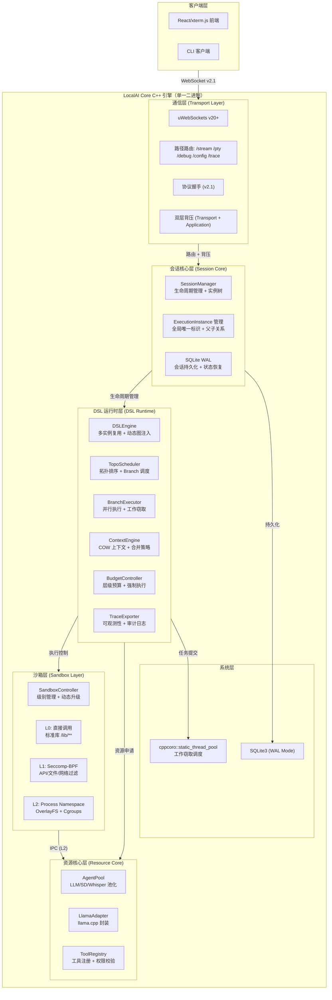
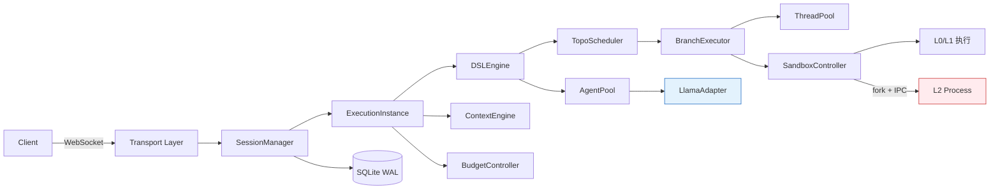
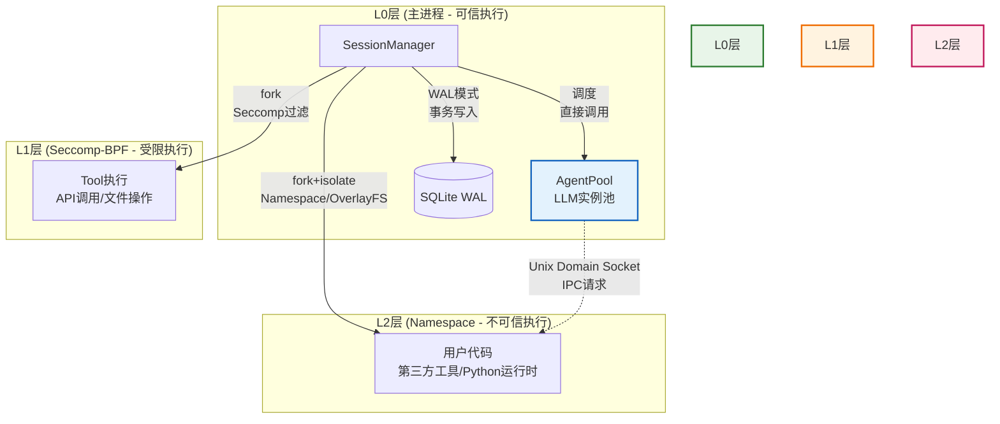
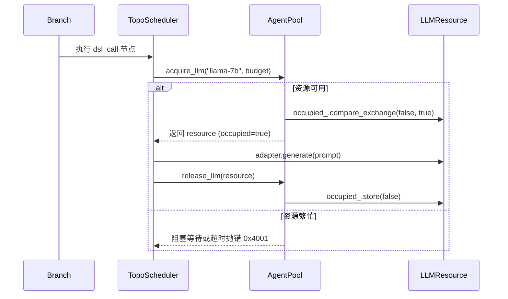

# 02_Architecture_&_Runtime.md

> **文档版本**: v1.0  
> **对应契约**: 01_Specification_&_Contract.md v1.0  
> **对应引擎**: LocalAI Core v2.1-P0+  
> **目标读者**: 核心开发者、架构师、技术负责人  
> **关键约束**: 本文档定义内部实现架构，所有设计必须满足 01 文档的契约要求，但允许实现细节优化

---

## 文档摘要

| 项目 | 内容 |
|------|------|
| **架构定位** | 单一二进制 C++20 引擎，集成 DSL 运行时、资源池化、分级沙箱、WebSocket 通信 |
| **核心创新** | Branch 级并行执行模型、L0-L2 沙箱动态升级、AgentPool 单实例单会话约束 |
| **并发模型** | 多 Branch 并行（ThreadPool）+ 单 Instance 单线程调度（确定性）+ Resource 级序列化（LLM 安全） |
| **安全模型** | 纵深防御：命名空间隔离 + 沙箱分级 + 权限交集 + 预算层级 |
| **性能目标** | L2 沙箱预热后启动延迟 <10ms，Branch 并行加速比 ≈ min(分支数, 物理核心数) |

---

## 1. 系统总体架构

### 1.1 架构拓扑图



### 1.2 模块依赖关系



### 1.3 关键设计原则

| 原则 | 实现策略 | 技术依据 |
|------|----------|----------|
| **确定性优先** | 单 ExecutionInstance 内 TopoScheduler 单线程执行，Branch 并行通过外部 ThreadPool | 避免调度器竞态，保证 DAG 执行顺序可复现 |
| **资源隔离** | AgentPool 通过 `occupied_` 原子标记实现单实例单会话，LLM 推理禁止在 L2 执行 | llama.cpp 上下文非线程安全，KV Cache 需隔离 |
| **沙箱分级** | L0 直接调用，L1 Seccomp 过滤，L2 Namespace + OverlayFS，动态升级不可逆 | 纵深防御，高风险操作强制隔离 |
| **零拷贝优化** | Branch COW 上下文，L0-L1 共享内存，L2 IPC 采用 Unix Domain Socket + 压缩 | 减少上下文切换与序列化开销 |
| **背压全链路** | Transport 层 `getBufferedAmount()` + Application 层 ACK 计数，双水位控制 | 防止内存溢出与网络拥塞 |

---

## 2. 会话与实例管理

### 2.1 SessionManager 架构

**职责**: 用户级会话生命周期管理、ExecutionInstance 树维护、跨实例状态共享

```cpp
// session_manager.hpp
class SessionManager {
public:
    struct Config {
        size_t max_concurrent_sessions = 1000;
        std::chrono::seconds session_ttl{1800};  // 30min
        size_t max_instances_per_session = 10;
    };

    explicit SessionManager(std::shared_ptr<AgenticRuntime> runtime, Config cfg);

    // 会话生命周期
    std::shared_ptr<Session> create_session(const SessionConfig& config);
    void terminate_session(const std::string& session_id);
    
    // ExecutionInstance 管理
    std::shared_ptr<ExecutionInstance> create_instance(
        const std::string& session_id,
        const InstanceConfig& config);
    
    std::shared_ptr<ExecutionInstance> create_child_instance(
        const std::string& parent_instance_id,
        const InstanceConfig& config);
    
    // 查询与索引
    std::shared_ptr<Session> get_session(const std::string& session_id);
    std::vector<std::shared_ptr<ExecutionInstance>> get_instances_by_session(
        const std::string& session_id);
    
    // 级联控制
    void terminate_instance_cascade(const std::string& instance_id);
    void pause_user_sessions(const std::string& user_id);

private:
    std::shared_ptr<AgenticRuntime> runtime_;
    
    // 线程安全存储
    std::unordered_map<std::string, std::shared_ptr<Session>> sessions_;
    std::unordered_map<std::string, std::shared_ptr<ExecutionInstance>> instances_;
    
    // 索引加速
    std::unordered_map<std::string, std::vector<std::string>> session_to_instances_;
    std::unordered_map<std::string, std::string> instance_to_session_;
    std::unordered_map<std::string, std::vector<std::string>> parent_child_index_;
    
    mutable std::shared_mutex mutex_;
    std::jthread maintenance_thread_;  // TTL 清理
};
```

### 2.2 ExecutionInstance 实现

**核心约束**: 全局唯一标识，与 session_id 解耦，支持父子级联

```cpp
// execution_instance.hpp
struct ExecutionInstance {
    // 标识体系
    std::string instance_id;          // format: exec_{layer}_{uuid}
    std::string session_id;           // 所属会话
    std::string trace_id;             // 请求级追踪
    
    // 层级与路径
    enum class Layer { L4_COGNITIVE, L3_THINKING, L2_WORKFLOW, L1_EXECUTION };
    Layer layer;
    std::string dsl_entry_path;       // 入口子图路径
    
    // 父子关系（实例树）
    std::optional<std::string> parent_instance_id;
    std::vector<std::string> child_instance_ids;
    
    // 执行状态
    enum class Status { CREATED, RUNNING, PAUSED, COMPLETED, FAILED };
    std::atomic<Status> status{Status::CREATED};
    
    // 核心组件（依赖注入）
    std::shared_ptr<DSLEngine> engine;           // DSL 运行时
    std::unique_ptr<BudgetController> budget;    // 实例级预算
    std::unique_ptr<ContextEngine> context;      // 上下文管理
    std::unique_ptr<TraceExporter> tracer;       // 可观测性
    
    // Branch 管理
    std::unordered_map<std::string, std::unique_ptr<Branch>> branches_;
    std::shared_mutex branches_mutex_;
    
    // 资源引用
    std::optional<std::string> acquired_llm_resource_id;  // AgentPool 占用标记
    
    // 元数据
    std::chrono::steady_clock::time_point created_at;
    std::chrono::steady_clock::time_point updated_at;
    
    // 方法
    std::shared_ptr<Branch> create_branch(const BranchConfig& config);
    void merge_branches(const std::vector<std::string>& branch_ids, 
                       const MergePolicy& policy);
    void persist_state();  // 异步写入 SQLite
};
```

### 2.3 会话树与级联终止

```cpp
// 级联终止实现示例
void SessionManager::terminate_instance_cascade(const std::string& instance_id) {
    auto instance = get_instance(instance_id);
    if (!instance) return;
    
    // 1. 终止当前实例
    instance->status = ExecutionInstance::Status::FAILED;
    if (instance->acquired_llm_resource_id) {
        runtime_->agent_pool()->release_llm(instance->acquired_llm_resource_id.value());
    }
    
    // 2. 递归终止子实例
    auto children = parent_child_index_[instance_id];
    for (const auto& child_id : children) {
        terminate_instance_cascade(child_id);  // 递归
    }
    
    // 3. 清理分支
    instance->branches_.clear();
    
    // 4. 持久化终止状态
    instance->persist_state();
}
```

---

## 3. 并发执行模型（Branch 体系）

### 3.1 Branch 抽象与生命周期

**核心约束**: Branch 是 DAG 内的轻量级执行单元，拥有独立 COW 上下文，但共享同一 ExecutionInstance 的预算与引擎

```cpp
// branch.hpp
struct Branch {
    std::string branch_id;            // UUID
    std::string instance_id;          // 所属 ExecutionInstance
    
    // 执行状态
    NodePath current_node;            // 当前执行节点
    Context local_overlay;            // COW 上下文覆盖层（写时复制）
    std::unique_ptr<TopoScheduler> scheduler;  // 独立调度队列（仅用于 Branch 内节点）
    
    // 沙箱
    SandboxLevel sandbox_level{L0};
    std::unique_ptr<Sandbox> sandbox; // 沙箱实例（L1/L2 时非空）
    
    // 并发控制
    std::atomic<bool> is_running{false};
    std::atomic<bool> is_cancelled{false};
    std::promise<ExecutionResult> completion_promise;
    
    // 方法
    void execute(const NodePath& entry);
    void cancel();  // 用于 Speculative 模式的早停
    Context get_merged_context() const;  // 获取合并后的上下文
};
```

### 3.2 Copy-On-Write 上下文机制

**实现策略**: 共享父 Branch 的上下文引用，写入时触发深拷贝

```cpp
// context_engine.hpp
class ContextEngine {
public:
    using Context = nlohmann::json;
    
    struct COWContext {
        std::shared_ptr<const Context> base;      // 父上下文（共享）
        std::unique_ptr<Context> overlay;          // 本地修改（独占）
        
        // 读取: 先查 overlay，再查 base
        // 写入: 若 overlay 为空，先深拷贝 base，再写入 overlay
    };
    
    // Fork 创建 COW 上下文
    static COWContext fork(const Context& parent);
    
    // Join 合并多个 Branch 上下文
    static Context join(const std::vector<COWContext>& branches,
                       const MergePolicy& policy);
    
private:
    static void merge_recursive(Context& target, const Context& source,
                               const std::string& path,
                               const MergePolicy& policy);
};
```

**性能优化**: 
- 读操作零拷贝（共享指针）
- 写操作延迟拷贝（第一次写入时才复制）
- Join 时按需合并（仅合并被修改的字段）

### 3.3 BranchExecutor 并行调度

**核心职责**: 管理 Branch 的并行执行，支持 Work Stealing 与 Speculative 模式

```cpp
// branch_executor.hpp
class BranchExecutor {
public:
    struct Config {
        size_t max_concurrent_branches = 10;
        bool enable_speculative = true;
        bool enable_work_stealing = true;
    };

    explicit BranchExecutor(cppcoro::static_thread_pool& thread_pool, Config cfg);
    
    // 并行执行（Fork/Join）
    std::vector<BranchResult> execute_parallel(
        const std::vector<std::shared_ptr<Branch>>& branches,
        const Context& shared_ctx,
        const MergePolicy& merge_policy);
    
    // 推测执行（取最快成功结果）
    SpeculativeResult execute_speculative(
        const std::vector<std::shared_ptr<Branch>>& candidates,
        std::function<bool(const Context&)> validator,
        std::chrono::milliseconds timeout);
    
    // Ensemble 执行（结果聚合）
    Context execute_ensemble(
        const std::vector<std::shared_ptr<Branch>>& branches,
        AggregationMode mode);  // majority_vote | weighted_avg | meta_judge

private:
    cppcoro::static_thread_pool& thread_pool_;
    Config config_;
    
    // 内部调度
    void execute_branch_async(std::shared_ptr<Branch> branch);
    void steal_work();  // 工作窃取实现
};
```

**执行流程**:
```cpp
// Fork 节点执行示例（TopoScheduler 内）
void TopoScheduler::execute_fork(const ForkNode* node, Context& ctx) {
    std::vector<std::shared_ptr<Branch>> branches;
    
    // 1. 创建 COW 上下文分支
    for (const auto& path : node->branches) {
        auto branch = std::make_shared<Branch>();
        branch->branch_id = generate_uuid();
        branch->instance_id = instance_->instance_id;
        branch->local_overlay = ContextEngine::fork(ctx);  // COW
        branch->current_node = path;
        branch->sandbox_level = select_sandbox_level(path);  // 根据路径选择沙箱
        branches.push_back(branch);
        
        // 注册到 ExecutionInstance
        instance_->branches_[branch->branch_id] = branch;
    }
    
    // 2. 提交到 BranchExecutor 并行执行
    auto results = branch_executor_->execute_parallel(
        branches, ctx, node->merge_policy);
    
    // 3. Join 合并结果（阻塞等待）
    ctx = ContextEngine::join(results, node->merge_policy);
}
```

### 3.4 与 AgentPool 的正交关系

**关键约束**: Branch 并发 ≠ LLM 并发，二者通过队列解耦

```cpp
// 资源获取序列化（防止 llama.cpp 上下文冲突）
void Branch::execute_llm_node(const DSLNode* node) {
    // 1. 检查是否已在 L2 沙箱（禁止直接 LLM 推理）
    if (sandbox_level == SandboxLevel::L2) {
        // L2 必须通过 IPC 请求主进程
        auto result = ipc_client_->request_llm(node->prompt_template, params);
        local_overlay[node->output_keys[0]] = result;
        return;
    }
    
    // 2. L0/L1: 直接获取 AgentPool 资源（可能阻塞等待）
    auto resource = instance_->runtime_->agent_pool()->acquire_llm(
        node->llm_tool_name, 
        instance_->budget->get_remaining());
    
    // 3. 标记占用（单实例单会话约束）
    instance_->acquired_llm_resource_id = resource->id;
    
    // 4. 执行推理（同步调用，阻塞当前 Branch）
    auto output = resource->adapter->generate(node->prompt_template, params);
    
    // 5. 写入 COW 上下文
    local_overlay[node->output_keys[0]] = output;
    
    // 6. 释放资源（其他 Branch 可获取）
    instance_->runtime_->agent_pool()->release_llm(resource);
    instance_->acquired_llm_resource_id = std::nullopt;
}
```

**并发模型总结**:
- **Branch 级**: 多 Branch 并行执行（ThreadPool），适合多假设验证
- **Instance 级**: 单 Instance 内 Branch 共享预算，但 LLM 资源串行访问（AgentPool 约束）
- **Resource 级**: AgentPool 通过 `occupied_` 标记确保单实例单会话，避免 KV Cache 污染

---

## 4. 分级沙箱系统（L0-L2）

### 4.1 沙箱架构概览

| 级别 | 技术实现 | 进程模型 | 通信机制 | 启动延迟 | 适用场景 |
|------|---------|----------|----------|----------|----------|
| **L0** | 直接函数调用 | 同进程 | 直接内存访问 | ~0μs | 标准库 `/lib/**` |
| **L1** | Seccomp-BPF + Cgroups | 同进程（过滤线程） | 直接内存访问 | ~1ms | API 调用、文件操作 |
| **L2** | Clone Namespace + OverlayFS | 独立进程 | Unix Domain Socket | ~50ms（预热 ~5ms） | 用户代码、Python 运行时 |

资源拓扑图



1. **L0 层（主进程）**：唯一可直接访问 `AgentPool` 和 `SQLite` 的区域
   - `SessionManager` 直接调度 `AgentPool` 获取 LLM 资源
   - 直接操作 SQLite WAL 进行会话持久化

2. **L1 层（Seccomp）**：同进程但系统调用受限
   - 通过 `fork()` 创建，继承进程空间但加载 BPF 过滤器
   - 可直接返回结果到 L0，无需 IPC 序列化开销

3. **L2 层（Namespace）**：完全隔离的独立进程
   - **禁止直接访问 `AgentPool`**（虚线表示 IPC 通信）
   - LLM 推理请求必须通过 Unix Domain Socket 发送给 L0 主进程代理执行
   - 文件系统通过 OverlayFS 隔离，网络通过 Namespace 隔离

> "如图所示，L2 沙箱内的用户代码（如 Python 运行时）禁止直接访问 `AgentPool` 中的 LLM 实例。所有推理请求必须通过 IPC 机制（Unix Domain Socket）代理到 L0 层执行，这是确保单实例单会话约束不被破坏的关键设计。"

### 4.2 SandboxController 实现

```cpp
// sandbox_controller.hpp
enum class SandboxLevel { NONE = 0, L0 = 0, L1 = 1, L2 = 2 };

struct SandboxProfile {
    std::vector<std::string> allowed_syscalls;  // L1: Seccomp 白名单
    std::vector<std::string> allowed_paths;     // L2: 文件系统白名单
    bool isolate_network;                       // L2: Network Namespace
    ResourceLimits cgroup_limits;               // CPU/内存/IO 限制
};

class SandboxController {
public:
    explicit SandboxController();
    
    // 为 Branch 选择沙箱级别（根据节点类型与权限声明）
    SandboxLevel select_level(const Node& node, const PermissionSet& perms);
    
    // 创建沙箱环境
    std::unique_ptr<Sandbox> create_sandbox(SandboxLevel level, 
                                           const SandboxProfile& profile);
    
    // 动态升级（L0→L1→L2）
    bool escalate(std::shared_ptr<Branch> branch, SandboxLevel new_level);
    
    // L2 进程池预热
    void warmup_l2_pool(size_t count);

private:
    std::queue<std::unique_ptr<L2Sandbox>> l2_pool_;  // 预 fork 进程池
    std::mutex pool_mutex_;
};

// 沙箱接口
class Sandbox {
public:
    virtual ~Sandbox() = default;
    virtual Context execute(const Node& node, const Context& input) = 0;
    virtual SandboxLevel level() const = 0;
};
```

### 4.3 L0 实现（直接调用）

```cpp
// l0_sandbox.hpp（实际无沙箱，直接执行）
class L0Sandbox : public Sandbox {
public:
    Context execute(const Node& node, const Context& input) override {
        // 直接调用 NodeExecutor，无隔离开销
        return node_executor_->execute(node, input);
    }
    SandboxLevel level() const override { return SandboxLevel::L0; }
};
```

### 4.4 L1 实现（Seccomp-BPF）

```cpp
// l1_sandbox.hpp
class L1Sandbox : public Sandbox {
public:
    Context execute(const Node& node, const Context& input) override {
        // 1. 加载 Seccomp 过滤器（白名单模式）
        scmp_filter_ctx ctx = seccomp_init(SCMP_ACT_ERRNO(EPERM));
        for (const auto& syscall : allowed_syscalls_) {
            seccomp_rule_add(ctx, SCMP_ACT_ALLOW, 
                           seccomp_syscall_resolve_name(syscall.c_str()), 0);
        }
        seccomp_load(ctx);
        
        // 2. 应用 Cgroups 限制（可选）
        apply_cgroups_limit(cgroup_limits_);
        
        // 3. 执行节点
        auto result = node_executor_->execute(node, input);
        
        // 4. 清理（Seccomp 过滤器随进程终止）
        seccomp_release(ctx);
        return result;
    }
    
private:
    std::vector<std::string> allowed_syscalls_;
    ResourceLimits cgroup_limits_;
};
```

### 4.5 L2 实现（Process Namespace + OverlayFS）

**核心机制**: 预 fork 进程池，减少启动延迟

```cpp
// l2_sandbox.hpp
class L2Sandbox : public Sandbox {
public:
    // 从进程池获取（或创建新进程）
    static std::unique_ptr<L2Sandbox> acquire(SandboxController* controller);
    
    Context execute(const Node& node, const Context& input) override {
        // 1. 序列化输入（压缩）
        auto payload = zlib_compress(input.dump());
        
        // 2. 通过 Unix Domain Socket 发送给子进程
        send(socket_fd_, payload.data(), payload.size(), MSG_DONTWAIT);
        
        // 3. 等待结果（带超时）
        auto result = recv_with_timeout(socket_fd_, timeout_);
        
        // 4. 反序列化
        return Context::parse(zlib_decompress(result));
    }
    
    void recycle();  // 返回进程池而非销毁

private:
    pid_t child_pid_;
    int socket_fd_;  // Unix Domain Socket
    std::string overlay_upper_;  // OverlayFS 上层目录
    std::string overlay_work_;   // OverlayFS workdir
};

// L2 子进程主循环
void l2_child_process(int parent_socket) {
    // 1. 设置 Namespace（已在外部设置，此处确认）
    // 2. 挂载 OverlayFS（只读底层 + tmpfs 上层）
    mount_overlay();
    
    // 3. 进入 Seccomp（更严格的过滤）
    setup_strict_seccomp();
    
    // 4. 等待父进程命令
    while (true) {
        auto cmd = recv(parent_socket);
        auto node = deserialize_node(cmd);
        
        // 5. 执行（限制在沙箱内）
        auto result = execute_in_sandbox(node);
        
        // 6. 返回结果（禁止直接访问 AgentPool）
        send(parent_socket, serialize(result));
        
        // 7. 重置状态（tmpfs 清理）
        reset_overlay_upper();
    }
}
```

### 4.6 L2 进程池预热机制

```cpp
void SandboxController::warmup_l2_pool(size_t count) {
    for (size_t i = 0; i < count; ++i) {
        // 预 fork 进程，创建 Namespace 和 OverlayFS 挂载点
        auto sandbox = std::make_unique<L2Sandbox>();
        sandbox->prepare_namespaces();  // unshare(CLONE_NEWNS | CLONE_NEWPID | ...)
        sandbox->setup_overlayfs();      // 创建 upper/work 目录
        
        // 加入空闲池
        std::lock_guard<std::mutex> lock(pool_mutex_);
        l2_pool_.push(std::move(sandbox));
    }
}

std::unique_ptr<L2Sandbox> L2Sandbox::acquire(SandboxController* controller) {
    std::lock_guard<std::mutex> lock(controller->pool_mutex_);
    if (!controller->l2_pool_.empty()) {
        auto sb = std::move(controller->l2_pool_.front());
        controller->l2_pool_.pop();
        return sb;  // ~5ms 启动延迟
    }
    // 池耗尽，创建新进程（~50ms）
    return std::make_unique<L2Sandbox>();
}
```

### 4.7 跨边界通信（L2 IPC）

**协议**: Unix Domain Socket + 自定义序列化  
**优化**: 大上下文（>64KB）启用 zlib 压缩

```cpp
// IPC 消息格式
struct IPCMessage {
    uint32_t magic{0x4147};      // 'AG'
    uint32_t type;               // EXEC | LLM_REQUEST | FS_ACCESS
    uint32_t payload_size;
    std::vector<uint8_t> payload;
};

// L2 内请求 LLM（禁止直接访问）
void l2_request_llm(const std::string& prompt, LLMParams params) {
    IPCMessage msg;
    msg.type = MSG_LLM_REQUEST;
    msg.payload = serialize({prompt, params});
    
    send(parent_socket_, &msg, sizeof(msg), 0);
    
    // 等待父进程（L0）通过 AgentPool 执行并返回结果
    auto response = recv(parent_socket_);
    return deserialize(response);
}
```

---

## 5. DSL 运行时核心

### 5.1 DSLEngine 生命周期

```cpp
// engine.hpp
class DSLEngine {
public:
    // 工厂方法
    static std::shared_ptr<DSLEngine> from_markdown(
        const std::string& markdown,
        const EngineConfig& config);
    
    // 执行入口（创建 ExecutionInstance）
    ExecutionResult run(const Context& initial_context);
    
    // 动态图注入（供 generate_subgraph 使用）
    void append_dynamic_graphs(std::vector<ParsedGraph> graphs);
    
    // 工具注册
    void register_tool(const std::string& name, ToolCallable func);
    void register_llm_tool(const std::string& name, 
                          std::unique_ptr<ILLMTool> tool);

private:
    std::vector<ParsedGraph> static_graphs_;   // /lib/**, /main/**
    std::vector<ParsedGraph> dynamic_graphs_;  // /dynamic/**
    ToolRegistry tool_registry_;
    std::shared_ptr<AgentPool> agent_pool_;    // 依赖注入
};
```

### 5.2 TopoScheduler 与 Branch 集成

```cpp
// topo_scheduler.hpp
class TopoScheduler {
public:
    explicit TopoScheduler(ExecutionInstance* instance);
    
    // 执行入口
    ExecutionResult execute(const NodePath& entry, Context& ctx);
    
    // Fork/Join 处理
    void handle_fork(const ForkNode* node, Context& ctx);
    void handle_join(const JoinNode* node, Context& ctx);
    
private:
    ExecutionInstance* instance_;  // 反向引用获取 Budget/Tracer
    
    // DAG 状态
    std::unordered_map<NodePath, std::unique_ptr<Node>> nodes_;
    std::unordered_map<NodePath, int> in_degree_;
    std::queue<NodePath> ready_queue_;
    
    // Branch 管理（仅当前 Instance）
    std::vector<std::shared_ptr<Branch>> active_branches_;
};
```

### 5.3 BudgetController 层级实现

```cpp
// budget_controller.hpp
class BudgetController {
public:
    struct Budget {
        int max_nodes;
        int max_llm_calls;
        int max_subgraph_depth;
        int max_branches;  // v3.10-PE 新增
        std::chrono::seconds max_duration;
    };

    BudgetController(const Budget& budget);
    
    // 消费接口（原子操作）
    bool try_consume_node();
    bool try_consume_llm_call();
    bool try_consume_subgraph_depth();
    bool try_consume_branch();  // Fork 时检查
    
    // 查询
    bool exceeded() const;
    BudgetSnapshot snapshot() const;

private:
    std::atomic<int> nodes_used_{0};
    std::atomic<int> llm_calls_used_{0};
    std::atomic<int> branches_used_{0};
    std::chrono::steady_clock::time_point start_time_;
    Budget budget_;
};
```

---

## 6. 资源管理（AgentPool）

### 6.1 AgentPool 单实例单会话约束

**核心机制**: `occupied_` 原子标记 + RAII 资源包装器

```cpp
// agent_pool.hpp
class AgentPool {
public:
    struct LLMResource {
        std::string id;
        std::unique_ptr<LlamaAdapter> adapter;
        std::atomic<bool> occupied_{false};
        std::mutex mutex_;
        
        // RAII 获取
        struct Guard {
            LLMResource* res;
            Guard(LLMResource* r) : res(r) { 
                bool expected = false;
                if (!res->occupied_.compare_exchange_strong(expected, true)) {
                    throw ResourceBusyException();
                }
            }
            ~Guard() { res->occupied_.store(false); }
        };
    };

    // 获取资源（阻塞直到可用或超时）
    std::shared_ptr<LLMResource> acquire_llm(
        const std::string& model_hint,
        const ResourceBudget& budget,
        std::chrono::milliseconds timeout = 5s);
    
    void release_llm(std::shared_ptr<LLMResource> resource);

private:
    std::unordered_map<std::string, std::vector<std::shared_ptr<LLMResource>>> pools_;
    // key: model_hint, value: resource list
};
```

### 6.2 与 Branch 的协作流程




---

### 6.3 多模态资源管理（Multimodal Resource Management）

#### 6.3.1 资源类型扩展

AgentPool 通过 `std::variant` 统一支持异构推理资源，复用既有的单实例单会话约束：

```cpp
// agent_pool.hpp
enum class ModalityType { Text, Image, Audio, Video, StructuredData };

struct MultimodalResource {
    std::string id;
    ModalityType modality;
    
    // 类型抹除的适配器包装
    std::variant<
        std::shared_ptr<LlamaAdapter>,           // Text
        std::shared_ptr<StableDiffusionAdapter>, // Image generation
        std::shared_ptr<WhisperAdapter>,         // Audio transcription
        std::shared_ptr<CLAPAdapter>             // Audio-text alignment (可选)
    > adapter;
    
    // 复用 v3.0 的并发约束机制
    std::atomic<bool> occupied_{false};
    std::mutex mutex_;
    
    // 多模态特有：显存预算跟踪（当 GPU 共享时）
    struct VRAMBudget {
        size_t peak_usage_mb;
        size_t current_context_mb;
    } vram_status;
};

class AgentPool {
public:
    // 统一获取接口，根据 modality 路由
    std::shared_ptr<MultimodalResource> acquire(
        ModalityType modality,
        const std::string& model_hint,
        const ResourceBudget& budget);
    
    // 特化 Convenience 方法（向后兼容）
    std::shared_ptr<MultimodalResource> acquire_llm(...) {
        return acquire(ModalityType::Text, ...);
    }
    
    void release(std::shared_ptr<MultimodalResource> resource);

private:
    // 分模态存储，避免类型混淆
    std::unordered_map<ModalityType, 
        std::vector<std::shared_ptr<MultimodalResource>>> modality_pools_;
};
```

#### 6.3.2 DSL 运行时路由

DSLEngine 根据节点 `modality` 自动路由到对应资源：
```cpp
// dsl/engine.cpp
void DSLEngine::execute_dsl_call(const DSLNode& node, Context& ctx) {
    // 1. 解析模态需求
    auto modality = parse_modality(node["modality"]);
    
    // 2. 组装 content_parts（处理文件路径→内存加载）
    auto content = assemble_content_parts(node["content_parts"], ctx);
    
    // 3. 获取资源（受 occupied_ 约束）
    auto resource = agent_pool_->acquire(modality, 
                                        node["llm_tool_name"], 
                                        current_budget_);
    
    // 4. 模态特化执行
    std::visit(overloaded{
        [&](std::shared_ptr<LlamaAdapter>& adapter) {
            // 文本模式：复用原有逻辑
            auto result = adapter->generate(content.text_prompt, params);
            ctx[node["output_keys"][0]] = result;
        },
        [&](std::shared_ptr<StableDiffusionAdapter>& adapter) {
            // 图像模式：处理 image_url → latent → 生成
            auto result = adapter->generate_from_text(
                content.text_prompt, 
                content.reference_images
            );
            // 存储生成的图像路径到上下文
            ctx[node["output_keys"][0]] = result.output_path;
        },
        [&](std::shared_ptr<WhisperAdapter>& adapter) {
            // 音频模式：转录
            auto result = adapter->transcribe(content.audio_path);
            ctx[node["output_keys"][0]] = result.text;
        }
    }, resource->adapter);
    
    // 5. 释放资源（ occupied_ = false ）
    agent_pool_->release(resource);
}
```

#### 6.2.3 工具链执行（跨模态流水线）

当 `dsl_call` 声明 `tool_chain` 时，BranchExecutor 顺序执行链式转换：
```cpp
void BranchExecutor::execute_tool_chain(
    const std::vector<std::string>& chain,
    const Context& input_ctx,
    Context& output_ctx) 
{
    Context pipeline_ctx = input_ctx;
    
    for (const auto& tool_name : chain) {
        // 每个工具可能是不同模态
        auto tool = tool_registry_.get(tool_name);
        auto modality = tool->output_modality();
        
        auto resource = agent_pool_->acquire(modality, tool->model_hint(), budget_);
        
        // 执行并传递上下文
        auto intermediate = tool->execute(pipeline_ctx, resource);
        pipeline_ctx.merge(intermediate);
        
        agent_pool_->release(resource);
    }
    
    output_ctx = pipeline_ctx;
}
```

---

## 7. 通信层实现

### 7.1 WebSocket 处理器（P0 线程安全）

**关键约束**: 所有 `ws->send()` 必须通过 `uWS::Loop::defer()` 抛回主线程

```cpp
// stream_handler.hpp
struct PerSocketData {
    std::string session_id;
    std::string instance_id;
    bool handshake_completed{false};
    
    // 背压状态
    uint32_t pending_tokens{0};
    uint32_t ack_batch_size{10};
};

inline auto create_handlers(std::shared_ptr<SessionManager> session_mgr) {
    return uWS::App::WebSocketBehavior<PerSocketData>{
        .open = [](auto* ws) {
            // 初始化连接数据
        },
        
        .message = [session_mgr](auto* ws, std::string_view msg, uWS::OpCode) {
            auto* data = ws->getUserData();
            
            // P0: 协议握手检查
            if (!data->handshake_completed) {
                handle_handshake(ws, msg);
                return;
            }
            
            // 解析消息并提交到 SessionManager
            auto cmd = parse_command(msg);
            auto instance = session_mgr->get_instance(data->instance_id);
            
            // 提交到工作线程（避免阻塞 WebSocket 线程）
            thread_pool.submit([instance, cmd]() {
                auto result = instance->engine->execute_node(cmd);
                
                // P0: 通过 defer 抛回主线程发送
                uWS::Loop::get()->defer([ws, result]() {
                    ws->send(result.serialize(), uWS::OpCode::TEXT);
                });
            });
        }
    };
}
```

### 7.2 双层背压实现

```cpp
// 传输层背压（uWebSockets）
void check_transport_backpressure(auto* ws) {
    if (ws->getBufferedAmount() > transport_high_water_) {
        ws->pause();  // 暂停读取
    } else if (ws->getBufferedAmount() < transport_low_water_) {
        ws->resume(); // 恢复读取
    }
}

// 应用层背压（ACK 驱动）
void on_ack_received(auto* ws, uint32_t count) {
    auto* data = ws->getUserData();
    data->pending_tokens -= count;
    
    if (data->pending_tokens < app_high_water_) {
        resume_generation(data->instance_id);  // 恢复生成
    }
}
```

---

## 8. 持久化（SQLite WAL）

### 8.1 架构集成

```cpp
// session_manager.cpp (持久化部分)
void ExecutionInstance::persist_state() {
    auto json_state = serialize();
    
    // WAL 模式写入（非阻塞）
    db_->async_exec(
        "INSERT OR REPLACE INTO instance_states (instance_id, state, updated_at) "
        "VALUES (?, ?, ?)",
        {instance_id_, json_state, now()}
    );
}

// 恢复逻辑
std::shared_ptr<ExecutionInstance> SessionManager::restore_instance(
    const std::string& instance_id) {
    
    auto row = db_->query(
        "SELECT state FROM instance_states WHERE instance_id = ?",
        {instance_id}
    );
    
    if (row.empty()) return nullptr;
    
    auto instance = std::make_shared<ExecutionInstance>();
    instance->deserialize(row[0]["state"]);
    return instance;
}
```

### 8.2 WAL 配置

```cpp
void init_sqlite() {
    sqlite3* db;
    sqlite3_open("~/.localai/data.db", &db);
    
    // 启用 WAL 模式（读写并发）
    sqlite3_exec(db, "PRAGMA journal_mode=WAL;", nullptr, nullptr, nullptr);
    sqlite3_exec(db, "PRAGMA synchronous=NORMAL;", nullptr, nullptr, nullptr);
    sqlite3_exec(db, "PRAGMA busy_timeout=5000;", nullptr, nullptr, nullptr);  // 5s 重试
    sqlite3_exec(db, "PRAGMA wal_autocheckpoint=1000;", nullptr, nullptr, nullptr);
}
```

---

## 9. 演进路线与技术债务

### 9.1 v1.0 基线能力（Phase 1.1）

- ✅ **Branch 顺序模拟**: Fork/Join 语法支持，但默认顺序执行（确定性优先）
- ✅ **L0/L1 沙箱**: 标准库与 API 调用隔离
- ✅ **L2 基础实现**: 进程池 + Namespace，延迟 ~50ms（未预热）
- ✅ **AgentPool 约束**: 单实例单会话，序列化 LLM 访问
- ✅ **P0 修复**: 线程安全、协议握手、预算控制

### 9.2 v1.1 优化目标（Phase 1.2）

- 🚧 **Branch 真并发**: 启用 ThreadPool 并行执行（需验证 llama.cpp 多实例稳定性）
- 🚧 **L2 预热优化**: 目标延迟 <10ms，进程池 LRU 管理
- 🚧 **Cgroups v2**: 统一资源控制（CPU/内存/IO）
- 🚧 **Speculative 执行**: 多 Branch 结果竞争与早停

### 9.3 技术债务清单

| 债务 | 影响 | 解决计划 |
|------|------|----------|
| `StandardLibraryLoader` 单例 | 测试困难 | v1.1 重构为依赖注入 |
| L2 IPC 序列化开销 | 大上下文传输延迟 | v1.1 引入共享内存（memfd）|
| SQLite 单点写入 | 高并发瓶颈 | v1.2 考虑 WAL 并发读写分离 |

---

**本文档为内部实现蓝图，所有接口设计必须满足 01_Specification_&_Contract.md 的契约要求，但允许优化实现细节以提升性能。**