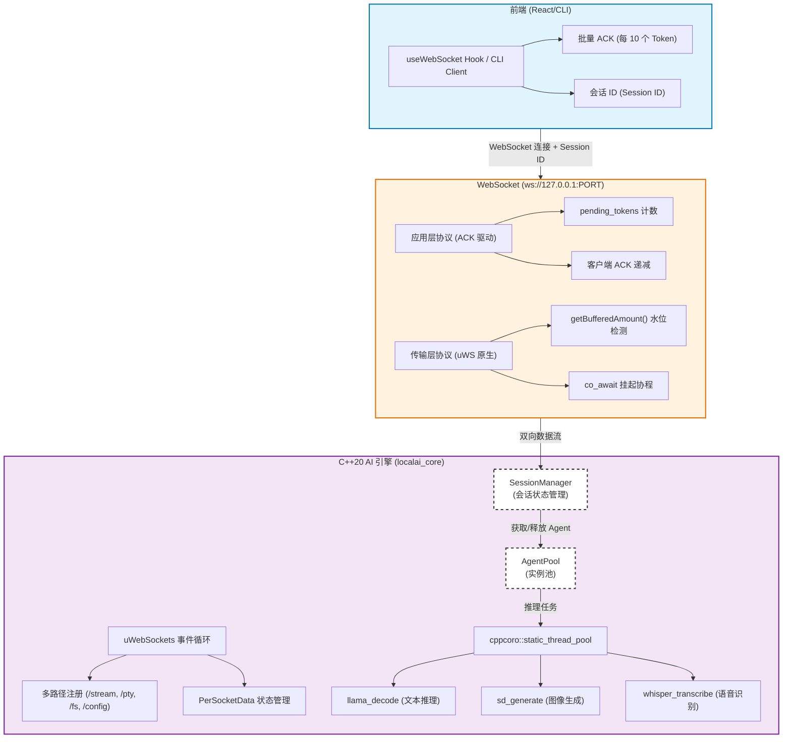
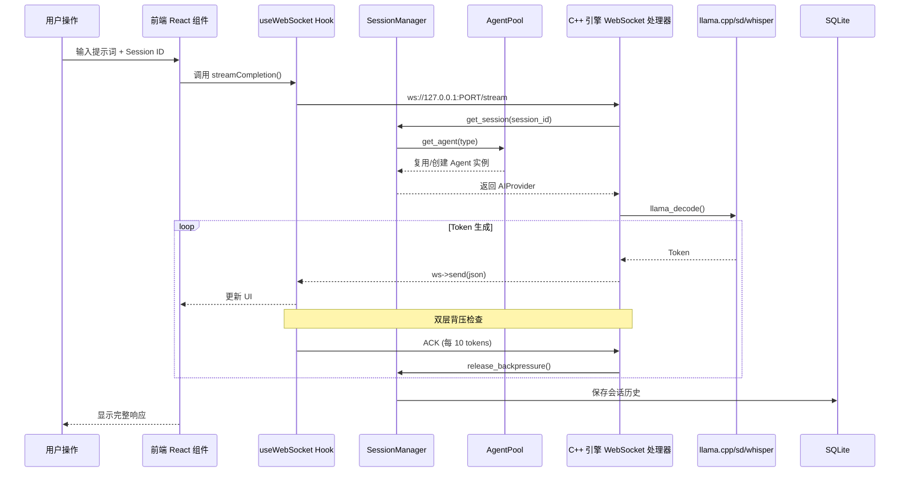
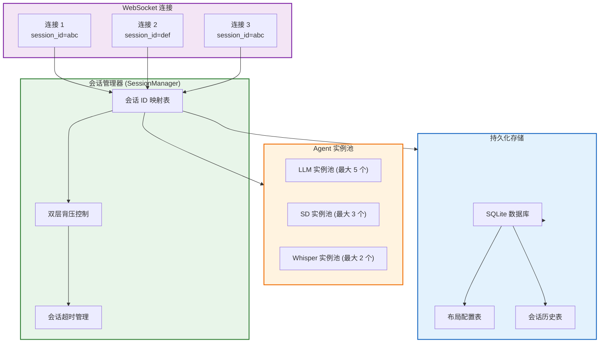
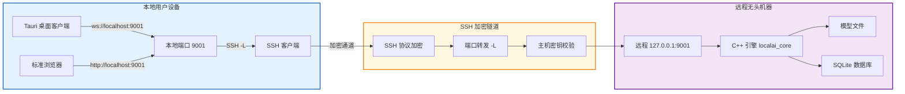
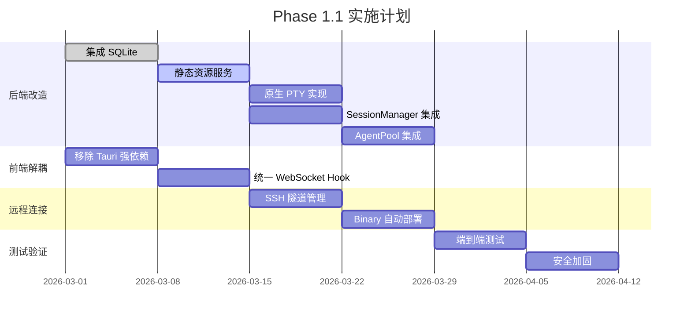

# LocalAI 统一架构设计方案

## 第一阶段架构设计文档 v2.0（正式版）

**—— 单一二进制交付 × 统一前端体验 × 本地优先安全 × 双层背压优化 × Agent 池化会话管理**

---

## 📋 文档摘要

| 项目 | 内容 |
| :--- | :--- |
| **文档版本** | v2.0 (统一架构版) |
| **文档状态** | Phase 1 正式提案 |
| **适用场景** | 个人用户本地桌面应用 + 无头机器远程访问（统一架构） |
| **设计原则** | 任何技术结论均依据开源仓库接口规范与内核行为推导，拒绝主观臆想 |
| **演进约束** | 前端代码 100% 复用，后端核心逻辑零重构，仅通过编译配置区分交付形态 |
| **交付目标** | 单一二进制文件（含前端资源）+ 可选 Tauri 壳（桌面体验增强） |
| **安全边界** | 强制绑定 `127.0.0.1`，远程访问依赖 SSH 隧道，无应用层认证 |
| **核心特性** | 聊天/多模态推理/终端代理/文件操作/会话持久化/灵活布局配置/Agent 池化 |

---

## 🎯 一、核心设计理念

### 1.1 设计原则矩阵

| 原则 | 内涵 | Phase 1 实现方案 | 技术依据 |
| :--- | :--- | :--- | :--- |
| **Unified Frontend** | 前端代码完全统一，无环境耦合 | React 组件通过环境检测适配 Tauri/浏览器，统一 WebSocket 连接 | 基于 `window.__TAURI__` 检测 + `Adapter-First` 接口抽象 |
| **Single Binary** | 后端引擎直接托管前端静态资源 | C++ 引擎编译时嵌入前端构建产物，或启动时加载同目录资源 | 基于 `uWebSockets` `res->endFromFile()` 静态文件服务能力 |
| **Local-First Security** | 默认本地信任边界，远程需显式隧道 | 后端强制绑定 `127.0.0.1`，远程访问通过 `ssh -L` 端口转发 | 基于 `uSockets bind` 约束及 SSH 协议加密特性 |
| **Zero Bloat** | 无冗余运行时依赖 (Node/Docker/Python) | 移除 `node-pty` 依赖，改用 C++ 原生 PTY；移除 Docker 部署 | 基于 `pty.h` 系统调用及 CMake 静态链接配置 |
| **Double Backpressure** | 传输层与应用层双重流控 | 复用 `uWS::getBufferedAmount()` 及应用层 ACK 协议 | 基于 `uWebSockets Backpressure` 示例及文档双层背压设计 |
| **Persistent State** | 会话与配置持久化 | 使用 SQLite 单文件数据库替代 JSON 文件散列存储 | 基于 SQLite 服务器less 特性及文件级锁机制 |
| **Agent Pooling** | 单进程内高效管理大量 Agent 会话 | 新增 `SessionManager` 与 `AgentPool`，复用 Agent 实例 | 基于《Agent 系统终端 + 可视化前端使用指南》池化设计 |
| **100% Code Reuse** | 核心逻辑零重复 | `#ifdef DESKTOP_BUILD` 隔离桌面特有逻辑，远程模式为增量扩展 | 基于 `llama.cpp` 条件编译实践 |

### 1.2 双层背压设计原理

**为什么需要双层背压？**

| 维度 | 问题 | 解决方案 |
| :--- | :--- | :--- |
| 浏览器限制 | 浏览器 WebSocket 无接收端背压反馈 | 应用层 ACK 协议（Token 级别流控） |
| 传输层优化 | uWS 缓冲区水位可感知 | `ws->getBufferedAmount()` + 协程挂起 |
| 多路径统一 | `/stream` + `/pty` + `/fs` 需统一流控 | 应用层协议可跨路径复用 |
| 远程演进 | 网络延迟 + 带宽波动 | 应用层协议天然适应远程模式 |
| 会话管理 | 多客户端共享会话需状态同步 | 会话管理器统一调度背压状态 |

### 1.3 双层背压与会话管理架构图



---

## 🏗️ 二、系统架构总览

### 2.1 系统架构拓扑图

```mermaid
flowchart TB
    subgraph Client["统一 Tauri 桌面客户端（本地运行）"]
        ModeSelect["连接模式选择"]
        ModeSelect --> LocalMode["本地模式：直接启动本地 sidecar"]
        ModeSelect --> RemoteMode["远程模式：通过 SSH 连接远程主机"]
        
        RemoteMgr["远程连接管理模块"]
        RemoteMgr --> Detect["检测远程 ~/.localai/"]
        RemoteMgr --> Upload["自动上传 localai_core 二进制"]
        RemoteMgr --> Start["在远程执行 ./localai_core"]
        
        Tunnel["SSH 隧道管理"]
        Tunnel --> PortMap["本地 9001 ↔ 远程 127.0.0.1:9001"]
        
        WebView["前端 WebView（代码 100% 复用）"]
        WebView --> WS["始终连接 ws://127.0.0.1:${PORT}"]
        
        Business["统一业务逻辑"]
        Business --> Chat["聊天"]
        Business --> Terminal["终端"]
        Business --> Files["文件"]
        Business --> Layout["布局配置"]
    end

    subgraph Local["本地环境"]
        LocalEngine["本地 C++ 引擎 @127.0.0.1:9001"]
        LocalDB["SQLite 数据库 ~/.localai/data.db"]
        LocalModels["模型目录 ~/.localai/models"]
    end

    subgraph Remote["远程无头机器"]
        RemoteEngine["远程 C++ 引擎 @127.0.0.1:9001"]
        RemoteDB["SQLite 数据库 ~/.localai/data.db"]
        RemoteModels["模型目录 ~/.localai/models"]
    end

    Client -->|"本地模式直连"| Local
    Client -->|"远程模式经 SSH 隧道"| Remote
    Tunnel -.->|"端口转发"| RemoteEngine

    style Client fill:#e8f5e9,stroke:#2e7d32,stroke-width:2px
    style Local fill:#fff3e0,stroke:#ef6c00,stroke-width:2px
    style Remote fill:#fce4ec,stroke:#c2185b,stroke-width:2px
```



### 2.2 架构层次说明

| 层次 | 职责 | 技术栈 | 演进保障 |
| :--- | :--- | :--- | :--- |
| **访问层** | 系统托盘、自动启动、窗口管理、远程连接 | Tauri v2 (Optional) | 仅作为 Shell，不参与业务逻辑，可随时替换 |
| **前端层** | 用户交互、流式渲染、布局配置、组件管理 | React 18 + TypeScript + Vite + Zustand | 组件仅依赖 WebSocket 接口，环境无关 |
| **通信层** | 统一 WebSocket 协议，背压控制，多路径路由 | uWebSockets v20+ | 全双工通信，支持 `/stream`, `/pty`, `/fs`, `/config` |
| **引擎层** | 推理执行、**会话管理**、**Agent 池化**、原生 PTY | C++20 + SQLite + llama.cpp + cppcoro | 核心逻辑封装，支持条件编译裁剪 |
| **资源层** | 模型存储、硬件加速、文件系统 | ggml-backend + OS API | 硬件探测自动适配，文件权限由 OS 控制 |

### 2.3 核心数据流图



### 2.4 会话与 Agent 池化架构图



### 2.5 远程访问架构（SSH 隧道）



---

## 🧱 三、分层详细设计

### 3.1 前端层：统一 Web Components

#### 3.1.1 环境适配与连接工厂

```typescript
// src/utils/env.ts
export const isTauri = (): boolean => 
  typeof window !== 'undefined' && !!(window as any).__TAURI__;

// src/providers/factory.ts
export interface ConnectionConfig {
  mode: 'local' | 'remote';
  remoteHost?: string;   // 远程模式：主机地址（用于显示，实际连接仍用 localhost）
  remoteUser?: string;   // 远程模式：SSH 用户名
  tunnelPort?: number;   // 远程模式：SSH 隧道映射的本地端口
  localPort?: number;    // 本地模式：sidecar 动态端口
  sessionId?: string;    // 会话 ID（用于 SessionManager 复用）
}

export async function createAIProvider(config: ConnectionConfig): Promise<AIProvider> {
  if (config.mode === 'local') {
    if (isTauri()) {
      const port = await (window as any).__TAURI__.invoke('get_server_port');
      return new LocalCxxProvider(port, config.sessionId);
    }
    return new LocalCxxProvider(config.localPort || 9001, config.sessionId);
  } else {
    // 远程模式：使用隧道映射的本地端口
    const port = config.tunnelPort || 9001;
    return new LocalCxxProvider(port, config.sessionId); // 复用同一 Provider 实现！
  }
}
```

#### 3.1.2 核心组件：聊天面板（支持多模态）

```typescript
// src/components/ChatPanel.tsx
export function ChatPanel({ config, initialModel }: ChatPanelProps) {
  const [messages, setMessages] = useState<Message[]>([]);
  const [input, setInput] = useState('');
  const [aiProvider, setAiProvider] = useState<AIProvider | null>(null);
  const [isGenerating, setIsGenerating] = useState(false);

  // 初始化 AI Provider（模式无关）
  useEffect(() => {
    const init = async () => {
      const provider = await createAIProvider(config);
      setAiProvider(provider);
    };
    init();
  }, [config]);

  // 流式推理（统一消费 AsyncIterable<TokenChunk>）
  const handleSend = async () => {
    if (!aiProvider || !input.trim()) return;

    const userMessage: Message = { role: 'user', content: input };
    setMessages(prev => [...prev, userMessage]);
    setInput('');
    setIsGenerating(true);

    try {
      const type = detectContentType(input);
      
      for await (const chunk of aiProvider.streamCompletion({
        type,
        prompt: input,
        model: initialModel,
        stream: true,
        parameters: { temperature: 0.7, max_tokens: 500 }
      })) {
        setMessages(prev => {
          const last = prev[prev.length - 1];
          if (last?.role === 'assistant') {
            return [...prev.slice(0, -1), { ...last, content: last.content + chunk.content }];
          }
          return [...prev, { role: 'assistant', content: chunk.content }];
        });
      }
    } catch (error) {
      handleError(error);
    } finally {
      setIsGenerating(false);
    }
  };

  return (
    <div className="chat-panel">
      <MessageList messages={messages} />
      <InputArea value={input} onChange={setInput} onSend={handleSend} disabled={isGenerating} />
    </div>
  );
}
```

### 3.2 后端引擎层：统一 C++ 服务

#### 3.2.1 主入口与资源托管

```cpp
// engine-cpp/src/main_dp.cpp
int main(int argc, char** argv) {
    // 解析 CLI 参数
    auto args = parse_args(argc, argv);
    
    // 硬件探测
    auto hardware = probe_hardware();
    std::cout << "[INFO] Detected " << hardware.cpu_cores << " CPU cores" << std::endl;
    
    // 初始化推理引擎
    auto llama_ctx = llama_init(args.models_dir, args.gpu_layers);
    auto sd_ctx = stablediffusion_init(args.models_dir);
    auto whisper_ctx = whisper_init(args.models_dir);
    
    // 创建会话管理器（集成 SQLite 持久化）
    auto db = std::make_shared<SQLiteDB>("~/.localai/data.db");
    auto session_manager = std::make_shared<SessionManager>(db);
    
    // 创建 Agent 池
    auto agent_pool = std::make_shared<AgentPool>(llama_ctx, sd_ctx, whisper_ctx);
    
    // 关联 SessionManager 与 AgentPool
    session_manager->set_agent_pool(agent_pool);
    
    uWS::App app;
    
    // === 路径 1: 静态资源托管（前端）===
    app.get("/*", [](auto* res, auto* req) {
        std::string path = req->getUrl();
        if (path == "/" || path.empty()) path = "/index.html";
        if (!serve_embedded_file(res, path) && !serve_local_file(res, "./frontend" + path)) {
            res->writeStatus("404")->end("Not found");
        }
    });
    
    // === 路径 2-5: WebSocket 路径 ===
    // 传入 session_manager 以实现会话复用
    app.ws<PerSocketData>("/stream", StreamHandler::create_handlers(session_manager));
    app.ws<PerPtySocketData>("/pty", PtyHandler::create_handlers());
    app.ws<PerSocketData>("/fs", FSHandler::create_handlers({"~/.localai", "~/Documents"}));
    app.ws<PerSocketData>("/config", ConfigHandler::create_handlers(db));
    
    // 强制绑定 127.0.0.1，维持 Local Trust Boundary
    uint16_t bound_port = bind_dynamic_port(app, "127.0.0.1", args.port);
    
    std::cout << "SYSTEM_READY:PORT=" << bound_port << std::endl;
    app.run();
    
    return 0;
}
```

#### 3.2.2 会话管理器（SessionManager）

```cpp
// engine-cpp/src/session/session_manager.hpp
#pragma once
#include <unordered_map>
#include <string>
#include <memory>
#include "ai_provider.hpp"
#include "agent_pool.hpp"
#include "utils/sqlite_db.hpp"

class SessionManager {
public:
    explicit SessionManager(std::shared_ptr<SQLiteDB> db) : db_(std::move(db)) {
        init_schema();
    }
    
    void set_agent_pool(std::shared_ptr<AgentPool> pool) {
        agent_pool_ = pool;
    }

    // 获取/创建会话（复用 Agent 实例）
    std::shared_ptr<AIProvider> get_session(
        const std::string& session_id,
        const std::string& agent_type = "default"
    ) {
        // 1. 检查会话映射
        auto it = session_map_.find(session_id);
        if (it != session_map_.end()) {
            last_access_[session_id] = std::chrono::steady_clock::now();
            return it->second;
        }
        
        // 2. 从 Agent 池获取实例
        auto agent = agent_pool_->get_agent(agent_type);
        
        // 3. 注册会话
        session_map_[session_id] = agent;
        last_access_[session_id] = std::chrono::steady_clock::now();
        
        // 4. 加载历史 (SQLite)
        load_session_history(session_id, agent);
        
        return agent;
    }
    
    // 释放会话（回收资源）
    void release_session(const std::string& session_id) {
        auto it = session_map_.find(session_id);
        if (it != session_map_.end()) {
            agent_pool_->release_agent("default", it->second);
            session_map_.erase(it);
            save_session_history(session_id, it->second);
        }
    }
    
    // 保存/加载布局配置
    void save_layout_config(const std::string& user_id, const Json& config);
    Json load_layout_config(const std::string& user_id);
    
    // 保存/加载会话历史
    void save_session_history(const std::string& session_id, std::shared_ptr<AIProvider> agent);
    void load_session_history(const std::string& session_id, std::shared_ptr<AIProvider> agent);
    
    // 背压状态查询
    BackpressureStatus get_backpressure_status(const std::string& session_id) const;
    void release_backpressure(const std::string& session_id);
    
private:
    void init_schema() {
        db_->exec(R"(
            CREATE TABLE IF NOT EXISTS layout_configs (
                user_id TEXT PRIMARY KEY,
                config TEXT NOT NULL,
                updated_at INTEGER DEFAULT (strftime('%s', 'now'))
            );
            CREATE TABLE IF NOT EXISTS session_histories (
                session_id TEXT PRIMARY KEY,
                history TEXT NOT NULL,
                updated_at INTEGER DEFAULT (strftime('%s', 'now'))
            );
        )");
    }
    
    std::shared_ptr<SQLiteDB> db_;
    std::shared_ptr<AgentPool> agent_pool_;
    std::unordered_map<std::string, std::shared_ptr<AIProvider>> session_map_;
    std::unordered_map<std::string, std::chrono::time_point<std::chrono::steady_clock>> last_access_;
    
    static constexpr auto SESSION_TIMEOUT = std::chrono::minutes(30);
};
```

#### 3.2.3 Agent 实例池（AgentPool）

```cpp
// engine-cpp/src/session/agent_pool.hpp
#pragma once
#include <unordered_map>
#include <vector>
#include <memory>
#include "ai_provider.hpp"

class AgentPool {
public:
    AgentPool(
        std::shared_ptr<llama_context> llama_ctx,
        std::shared_ptr<stablediffusion_context> sd_ctx,
        std::shared_ptr<whisper_context> whisper_ctx
    ) : llama_ctx_(llama_ctx), sd_ctx_(sd_ctx), whisper_ctx_(whisper_ctx) {}

    // 获取 Agent 实例（从池中复用或创建新实例）
    std::shared_ptr<AIProvider> get_agent(const std::string& agent_type) {
        std::lock_guard<std::mutex> lock(mutex_);
        auto& pool = pools_[agent_type];
        
        if (!pool.empty()) {
            auto agent = pool.back();
            pool.pop_back();
            return agent;
        }
        
        // 池为空，创建新实例（限制最大数量）
        if (get_total_count() < MAX_TOTAL_AGENTS) {
            return create_new_agent(agent_type);
        }
        
        throw std::runtime_error("Agent pool exhausted");
    }

    // 释放 Agent 实例（归还到池中）
    void release_agent(const std::string& agent_type, std::shared_ptr<AIProvider> agent) {
        std::lock_guard<std::mutex> lock(mutex_);
        pools_[agent_type].push_back(agent);
    }

private:
    std::shared_ptr<AIProvider> create_new_agent(const std::string& type) {
        // 根据类型创建不同的 Provider
        return std::make_shared<LocalCxxProvider>(llama_ctx_, sd_ctx_, whisper_ctx_);
    }
    
    size_t get_total_count() {
        size_t count = 0;
        for (const auto& [type, pool] : pools_) {
            count += pool.size();
        }
        return count;
    }

    std::unordered_map<std::string, std::vector<std::shared_ptr<AIProvider>>> pools_;
    std::shared_ptr<llama_context> llama_ctx_;
    std::shared_ptr<stablediffusion_context> sd_ctx_;
    std::shared_ptr<whisper_context> whisper_ctx_;
    std::mutex mutex_;
    
    static constexpr size_t MAX_TOTAL_AGENTS = 10;
};
```

#### 3.2.4 双层背压集成（流式推理处理器）

```cpp
// engine-cpp/src/handlers/stream_handler.hpp (关键片段)
namespace StreamHandler {

inline auto create_handlers(std::shared_ptr<SessionManager> session_manager) {
    return uWS::App::WebSocketBehavior<PerSocketData>{
        .open = [session_manager](auto* ws) {
            auto* data = ws->getUserData();
            data->connection_id = generate_uuid();
            // 从 WebSocket 参数或握手头获取 session_id
            data->session_id = get_session_id_from_req(ws); 
            data->session = session_manager->get_session(data->session_id);
        },
        
        .message = [session_manager](auto* ws, std::string_view message, uWS::OpCode opCode) {
            auto* data = ws->getUserData();
            auto doc = simdjson::parse(message);
            
            // ========== ACK 消息处理 ==========
            if (doc["type"].get_string().value_or("") == "ack") {
                auto count = doc["count"].get_uint64().value_or(0);
                // 通过会话管理器释放背压
                session_manager->release_backpressure(data->session_id);
                return;
            }
            
            // ========== 推理请求处理 ==========
            CompletionParams params;
            params.connection_id = data->connection_id;
            params.session_id = data->session_id;
            // ... 解析其他参数 ...
            
            // 提交到工作线程池
            thread_pool::get().submit([ws, params, session_manager]() mutable {
                // 通过会话管理器获取 Agent 实例
                auto agent = session_manager->get_session(params.session_id);
                
                agent->stream_completion(
                    params,
                    // Token 回调
                    [ws, session_manager, session_id = params.session_id](const TokenChunk& chunk) {
                        auto* data = ws->getUserData();
                        
                        // ========== 双层背压控制 ==========
                        
                        // 层 1: 传输层背压 (uWS 原生)
                        if (ws->getBufferedAmount() > TRANSPORT_HIGH_WATER) {
                            if (!data->transport_backpressured) {
                                data->transport_backpressured = true;
                                ws->pause();
                            }
                            return;
                        }
                        if (data->transport_backpressured) {
                            data->transport_backpressured = false;
                            ws->resume();
                        }
                        
                        // 层 2: 应用层背压 (ACK 协议)
                        if (data->pending_tokens > APP_HIGH_WATER) {
                            if (!data->paused) {
                                data->paused = true;
                            }
                            return;
                        }
                        
                        // ========== 序列化并发送 Token ==========
                        auto json = build_response_json(chunk, params.model);
                        ws->send(simdjson::minify(json), uWS::OpCode::TEXT);
                        data->pending_tokens++;
                        
                        // 通知会话管理器更新背压状态
                        session_manager->apply_backpressure(session_id);
                    },
                    // 错误回调
                    [ws](const Error& err) {
                        ws->send(err.to_json(), uWS::OpCode::TEXT);
                    }
                );
            });
        },
        
        .close = [session_manager](auto* ws, int code, std::string_view message) {
            auto* data = ws->getUserData();
            // 释放会话（归还 Agent 到池）
            session_manager->release_session(data->session_id);
        }
    };
}
} // namespace StreamHandler
```

### 3.3 通信协议：纯 WebSocket

#### 3.3.1 路径定义与消息格式

| 路径 | 功能 | 请求示例 | 响应示例 |
| :--- | :--- | :--- | :--- |
| `/stream` | AI 推理 (文本/图像/语音) | `{"type":"completion","prompt":"...", "session_id":"abc"}` | `{"id":"req_1","delta":"量","object":"chat.completion.chunk"}` |
| `/pty` | 终端代理 | `{"type":"spawn","shell":"/bin/bash"}` | `{"type":"output","content":"$ "}` |
| `/fs` | 文件操作 | `{"type":"list","path":"~/.localai"}` | `{"type":"entries",[{"name":"models","type":"directory"}]}` |
| `/config` | 布局与配置管理 | `{"type":"get_layout_config"}` | `{"type":"layout_config","config":{...}}` |

#### 3.3.2 应用层 ACK 协议

```json
// 客户端发送 ACK（批量确认，控制应用层背压）
{
  "type": "ack",
  "count": 10
}
```

### 3.4 Tauri Rust 层：远程连接管理

```rust
// src-tauri/src/remote_manager.rs
pub struct RemoteConnection {
    pub host: String,
    pub user: String,
    pub ssh_port: u16,
    pub tunnel_port: u16,
    pub ssh_process: Option<tokio::process::Child>,
}

impl RemoteConnection {
    // 自动部署远程 binary
    pub async fn deploy_remote_binary(&self, local_binary: PathBuf) -> Result<(), String> {
        self.ssh_exec("mkdir -p ~/.localai/bin").await?;
        let remote_path = format!("{}@{}:~/.localai/bin/localai_core", self.user, self.host);
        self.scp_upload(&local_binary, &remote_path).await?;
        self.ssh_exec("chmod +x ~/.localai/bin/localai_core").await?;
        
        // 校验 SHA256 (安全)
        let local_hash = sha256::digest(&std::fs::read(local_binary)?);
        let remote_hash = self.ssh_exec("sha256sum ~/.localai/bin/localai_core | cut -d' ' -f1").await?;
        if local_hash.trim() != remote_hash.trim() {
            return Err("Binary checksum mismatch".to_string());
        }
        
        Ok(())
    }
    
    // 启动远程引擎并建立隧道
    pub async fn start_remote_engine(&mut self) -> Result<u16, String> {
        let tunnel_process = TokioCommand::new("ssh")
            .args(&[
                "-o", "ServerAliveInterval=60",
                "-o", "StrictHostKeyChecking=accept-new",
                "-L", &format!("{}:{}:{}", self.tunnel_port, "127.0.0.1", 9001),
                "-N", &format!("{}@{}", self.user, self.host)
            ])
            .spawn()
            .map_err(|e| format!("Failed to start SSH tunnel: {}", e))?;
        
        self.ssh_process = Some(tunnel_process);
        Ok(self.tunnel_port)
    }
    
    async fn ssh_exec(&self, cmd: &str) -> Result<String, String> {
        let output = TokioCommand::new("ssh")
            .args(&[&format!("{}@{}", self.user, self.host), cmd])
            .output()
            .await
            .map_err(|e| format!("SSH exec failed: {}", e))?;
        
        if output.status.success() {
            Ok(String::from_utf8_lossy(&output.stdout).to_string())
        } else {
            Err(String::from_utf8_lossy(&output.stderr).to_string())
        }
    }
    
    async fn scp_upload(&self, local: &PathBuf, remote: &str) -> Result<(), String> {
        let status = TokioCommand::new("scp")
            .args(&[local.to_str().unwrap(), &format!("{}@{}:{}", self.user, self.host, remote)])
            .status()
            .await
            .map_err(|e| format!("SCP upload failed: {}", e))?;
        
        if status.success() { Ok(()) } else { Err("SCP upload failed".to_string()) }
    }
}
```

---

## ⚙️ 四、构建与交付

### 4.1 CMake 配置

```cmake
# CMakeLists.txt
cmake_minimum_required(VERSION 3.20)
project(localai_core LANGUAGES CXX)

set(CMAKE_CXX_STANDARD 20)

option(ENABLE_STATIC_SERVE "Embed frontend static files" ON)
option(DESKTOP_BUILD "Build for desktop sidecar" ON)
option(ENABLE_SESSION_MANAGER "Enable SessionManager and AgentPool" ON)

set(SOURCES
    src/main_dp.cpp
    src/handlers/stream_handler.cpp
    src/handlers/pty_handler.cpp
    src/handlers/fs_handler.cpp
    src/handlers/config_handler.cpp
    src/providers/local_cxx_provider.cpp
    src/session/session_manager.cpp
    src/session/agent_pool.cpp
    src/utils/thread_pool.cpp
    src/utils/sqlite_db.cpp
)

add_executable(localai_core ${SOURCES})

target_link_libraries(localai_core PRIVATE
    uWebSockets llama stablediffusion whisper simdjson cppcoro SQLite3::SQLite3 Threads::Threads
)

if(ENABLE_STATIC_SERVE)
    target_compile_definitions(localai_core PRIVATE ENABLE_STATIC_SERVE)
    add_custom_command(OUTPUT frontend_assets.hpp
        COMMAND ${CMAKE_SOURCE_DIR}/scripts/bin2h ${CMAKE_SOURCE_DIR}/frontend/dist ${CMAKE_BINARY_DIR}/frontend_assets.hpp
        DEPENDS build_frontend
    )
    target_sources(localai_core PRIVATE ${CMAKE_BINARY_DIR}/frontend_assets.hpp)
endif()

add_custom_target(build_frontend
    COMMAND npm ci && npm run build
    WORKING_DIRECTORY ${CMAKE_SOURCE_DIR}/frontend
)
add_dependencies(localai_core build_frontend)
```

### 4.2 交付形态

| 形态 | 交付物 | 适用场景 | 启动方式 |
| :--- | :--- | :--- | :--- |
| **桌面版** | `LocalAISetup.msi/dmg/appimage` (含 Tauri 壳) | 本地桌面用户 | 双击图标，自动启动引擎 + WebView |
| **无头版** | `localai_core` 二进制 (+ 可选 `frontend/` 目录) | 远程服务器/无头机器 | `./localai_core` + SSH 隧道访问 |

### 4.3 远程访问方案（SSH 隧道）

```bash
# === 远程无头机器 ===
./localai_core --port 9001 --models-dir ~/.localai/models

# === 本地用户 ===
# 建立 SSH 隧道
ssh -o ServerAliveInterval=60 -L 9001:127.0.0.1:9001 user@remote-host

# 访问方式（二选一）：
# A) 使用 Tauri 桌面客户端：选择"远程模式"输入主机信息
# B) 使用浏览器：访问 http://localhost:9001
```

---

## 🔐 五、安全与错误处理

### 5.1 安全设计

| 风险 | 防御措施 | 技术依据 |
| :--- | :--- | :--- |
| **数据外泄** | 强制绑定 `127.0.0.1` + SSH 隧道加密 | `uSockets bind` 约束 + SSH 协议 |
| **文件越权** | 后端校验路径是否在 `allowed_dirs` 配置内 | 配置文件白名单控制 |
| **模型篡改** | 模型加载前校验 SHA256（用户可选） | `llama.cpp model loading` |
| **二进制篡改** | 远程部署时校验上传 binary 的 SHA256 | `tauri::api::digest::sha256` |
| **SSH 凭据泄露** | 仅使用系统 SSH agent，不存储密码 | 借鉴 VS Code Remote SSH 凭据管理 |
| **隧道劫持** | SSH 协议内置加密 + 主机密钥校验 | `ssh -o StrictHostKeyChecking=accept-new` |
| **会话劫持** | 会话 ID 随机生成 + SQLite 权限控制 | `SessionManager` 内部映射 |

### 5.2 错误码空间

```cpp
enum class ErrorCode : uint32_t {
    UNKNOWN = 0x0000,
    BACKPRESSURE_TIMEOUT = 0x0001,
    AI_OOM = 0x1001,
    AI_MODEL_LOAD_FAILED = 0x1002,
    PTY_SPAWN_FAILED = 0x2001,
    FS_PERMISSION_DENIED = 0x3002,
    CONFIG_NOT_FOUND = 0x4001,
    AGENT_POOL_EXHAUSTED = 0x5001,
};
```

---

## 🗺️ 六、实施路线图

### Phase 1.1: 核心统一（3-4 周）



### Phase 1.2: 体验优化（可选，1-2 周）

- [ ] 远程连接配置持久化（保存常用主机列表）
- [ ] 进度条显示 binary 上传进度
- [ ] 远程引擎日志实时回传到本地 UI
- [ ] 多远程主机并发支持（类似 VS Code 多窗口）

---

## ✅ 七、验证清单

```bash
# 1. 单二进制验证
./localai_core --help

# 2. 安全绑定验证
netstat -an | grep 9001  # 应仅显示 127.0.0.1:9001

# 3. 前端环境适配验证
# 浏览器打开 http://localhost:9001，应能加载前端并连接 WebSocket

# 4. 会话持久化验证
sqlite3 ~/.localai/data.db "SELECT * FROM session_histories;"

# 5. 背压压力测试
wrk -t4 -c100 -d60s --latency http://localhost:9001/stream

# 6. 体积验证
strip localai_core
du -h localai_core  # 目标 < 50MB

# 7. 远程模式验证
ssh -L 9001:127.0.0.1:9001 user@remote
curl http://localhost:9001/health

# 8. PTY 功能验证
websocat ws://localhost:9001/pty

# 9. Agent 池化验证
# 创建 10 个并发会话，观察进程数是否保持为 1
ps aux | grep localai_core | wc -l  # 应为 1
```

---

## 📌 八、总结

### 8.1 设计优势

| 维度 | 优势 | 技术依据 |
| :--- | :--- | :--- |
| **架构一致性** | 桌面与无头模式使用完全相同的二进制与前端代码 | 统一 C++ 引擎 + 标准 Web 前端 |
| **安全性** | 依赖操作系统 `127.0.0.1` 绑定与 SSH 隧道，而非应用层认证 | 最小权限原则 |
| **轻量级** | 移除 Node.js/Python/Docker 运行时依赖，单二进制交付 | `Zero Bloat` 原则 |
| **可维护性** | 消除 Rust 胶水层业务逻辑，降低技术栈复杂度 | 核心逻辑下沉至 C++ |
| **灵活性** | 支持 Web Component 灵活布局与配置持久化 | React 组件模型 + SQLite |
| **用户体验** | 与 VS Code Remote SSH 一致的学习曲线 | 用户已熟悉"连接远程主机→自动部署→透明使用"范式 |
| **资源效率** | Agent 池化复用实例，避免进程爆炸 | `SessionManager` + `AgentPool` 设计 |

### 8.2 关键技术决策

1. **后端托管前端**：利用 `uWebSockets` 静态服务能力，实现单文件交付
2. **SSH 隧道远程访问**：避免应用层实现复杂认证，复用操作系统安全通道
3. **SQLite 持久化**：替代 JSON 文件，提升并发安全性与查询能力
4. **纯 WebSocket 协议**：简化网络配置，便于 SSH 隧道单一端口转发
5. **原生 PTY 实现**：移除 `node-pty` 依赖，直接调用 `openpty`/`fork`/`exec`
6. **统一前端代码**：通过 `isTauri()` 检测 + `Adapter-First` 接口，实现 100% 代码复用
7. **Agent 池化**：单进程内管理多会话，复用推理实例，降低内存占用

### 8.3 最终定位

本方案是面向个人用户的**统一自包含式 AI 代理系统**：

- ✅ **前端统一**：同一套 React 代码支持本地/远程
- ✅ **后端统一**：同一 C++ 二进制支持本地启动/远程部署
- ✅ **安全统一**：始终绑定 `127.0.0.1`，远程访问强制依赖 SSH 隧道
- ✅ **交付统一**：桌面版与无头版源自同一构建流程
- ✅ **会话统一**：`SessionManager` 统一管理 CLI/Web/Tauri 会话状态

---

## 📚 附录：关键 Repo 与接口引用

| 组件 | Repo | 关键文件/接口 | 用途 |
| :--- | :--- | :--- | :--- |
| **uWebSockets** | [uNetworking/uWebSockets](https://github.com/uNetworking/uWebSockets) | `src/WebSocket.h#L1150` | 多路径注册 + `getBufferedAmount()` + `res->endFromFile()` |
| **llama.cpp** | [ggerganov/llama.cpp](https://github.com/ggerganov/llama.cpp) | `include/llama.h#L450` | `llama_decode` 线程安全约束 + 模型加载 |
| **SQLite** | [sqlite/sqlite](https://github.com/sqlite/sqlite) | `sqlite3.h` | 会话与配置持久化，单文件数据库 |
| **Tauri v2** | [tauri-apps/tauri](https://github.com/tauri-apps/tauri) | `crates/tauri/src/api/process.rs` | Sidecar 进程管理 + Capabilities 权限控制 |
| **xterm.js** | [xtermjs/xterm.js](https://github.com/xtermjs/xterm.js) | `src/Terminal.ts` | 终端仿真 Web Component |
| **React** | [facebook/react](https://github.com/facebook/react) | `packages/react` | 前端组件框架 + Hooks |

---

**文档版本**: v2.0 (统一架构版)  
**最后更新**: 2026-03-09  
**状态**: Phase 1 正式提案  
**维护者**: LocalAI Architecture Team