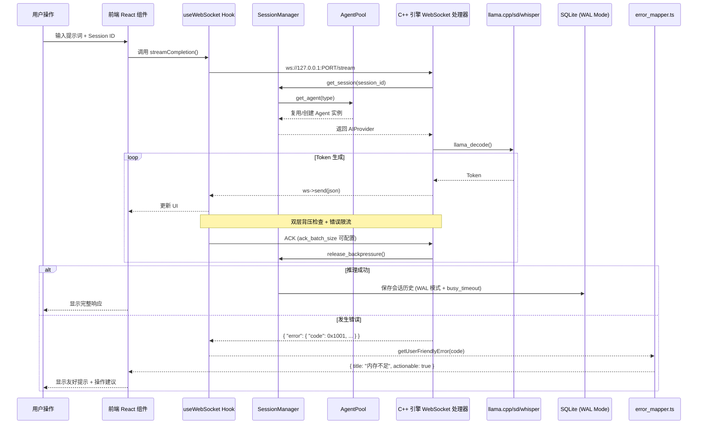
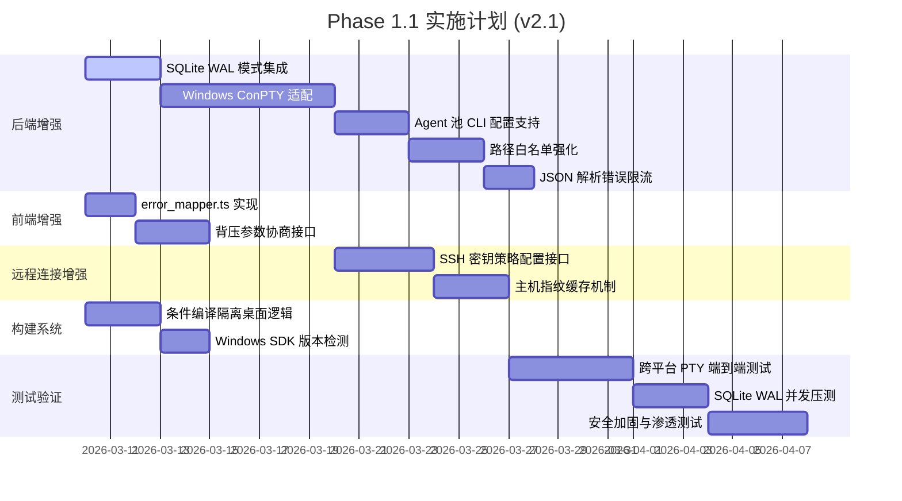

# LocalAI 统一架构设计方案
## 第一阶段架构设计文档 v2.1（增强版）
### —— 单一二进制交付 × 统一前端体验 × 本地优先安全 × 双层背压优化 × Agent 池化会话管理 × 跨平台增强

---

## 📋 文档摘要

| 项目 | 内容 |
|------|------|
| 文档版本 | v2.1 (增强版) |
| 文档状态 | Phase 1.1 正式提案 |
| 适用场景 | 个人用户本地桌面应用 + 无头机器远程访问（统一架构） |
| 设计原则 | 任何技术结论均依据开源仓库接口规范与内核行为推导，拒绝主观臆想 |
| 演进约束 | 前端代码 100% 复用，后端核心逻辑零重构，仅通过编译配置区分交付形态 |
| 交付目标 | 单一二进制文件（含前端资源）+ 可选 Tauri 壳（桌面体验增强） |
| 安全边界 | 强制绑定 `127.0.0.1`，远程访问依赖 SSH 隧道，无应用层认证 |
| 核心特性 | 聊天/多模态推理/终端代理/文件操作/会话持久化/灵活布局配置/Agent 池化/跨平台终端支持 |
| **本次迭代重点** | Windows ConPTY 支持 / SQLite WAL 模式 / 错误限流 / Agent 池可配置 / 错误码映射 / 路径安全强化 |

---

## 🎯 一、核心设计理念

### 1.1 设计原则矩阵

| 原则 | 内涵 | Phase 1.1 实现方案 | 技术依据 |
|------|------|-------------------|----------|
| **Unified Frontend** | 前端代码完全统一，无环境耦合 | React 组件通过环境检测适配 Tauri/浏览器，统一 WebSocket 连接 | 基于 `window.__TAURI__` 检测 + `Adapter-First` 接口抽象 |
| **Single Binary** | 后端引擎直接托管前端静态资源 | C++ 引擎编译时嵌入前端构建产物，或启动时加载同目录资源 | 基于 `uWebSockets::res->endFromFile()` 静态文件服务能力 |
| **Local-First Security** | 默认本地信任边界，远程需显式隧道 | 后端强制绑定 `127.0.0.1`，远程访问通过 `ssh -L` 端口转发 | 基于 `uSockets::bind()` 约束及 SSH 协议加密特性 |
| **Zero Bloat** | 无冗余运行时依赖 (Node/Docker/Python) | 移除 `node-pty` 依赖，改用 C++ 原生 PTY；移除 Docker 部署 | 基于 `pty.h` / `conptyapi.h` 系统调用及 CMake 静态链接配置 |
| **Double Backpressure** | 传输层与应用层双重流控 | 复用 `uWS::getBufferedAmount()` 及应用层 ACK 协议（参数可配置） | 基于 `uWebSockets Backpressure` 示例及文档双层背压设计 |
| **Persistent State** | 会话与配置持久化 | 使用 SQLite 单文件数据库 + WAL 模式 + 自动重试机制 | 基于 SQLite `PRAGMA journal_mode=WAL` 及 `busy_timeout` 机制 |
| **Agent Pooling** | 单进程内高效管理大量 Agent 会话 | 新增 `SessionManager` 与 `AgentPool`，支持 CLI 参数配置池大小 | 基于《Agent 系统终端 + 可视化前端使用指南》池化设计 + `llama.cpp` 资源评估 |
| **100% Code Reuse** | 核心逻辑零重复 | `#ifdef` 条件编译隔离桌面特有逻辑，远程模式为增量扩展 | 基于 `llama.cpp` 条件编译实践 |
| **Cross-Platform PTY** | 终端代理功能全平台可用 | Windows 引入 ConPTY API，POSIX 保留 `openpty` 实现 | 基于 [Microsoft/terminal ConPTY](https://github.com/microsoft/terminal) 及 POSIX `pty.h` |
| **Observable Errors** | 错误码可映射为用户友好提示 | 前端 `error_mapper.ts` 实现 ErrorCode → 用户消息映射 | 基于 [React Error Boundaries](https://github.com/facebook/react) 设计模式 |

### 1.2 双层背压设计原理（v2.1 增强）

| 维度 | 问题 | v2.0 方案 | v2.1 增强 |
|------|------|-----------|-----------|
| 浏览器限制 | 浏览器 WebSocket 无接收端背压反馈 | 应用层 ACK 协议（固定 10 Token/批） | ACK 批量大小可配置 (`ack_batch_size`) |
| 传输层优化 | uWS 缓冲区水位可感知 | `ws->getBufferedAmount()` + 协程挂起 | 水位阈值支持运行时参数调整 |
| 多路径统一 | `/stream` + `/pty` + `/fs` 需统一流控 | 应用层协议可跨路径复用 | 背压状态通过 `SessionManager` 统一同步 |
| 远程演进 | 网络延迟 + 带宽波动 | 应用层协议天然适应远程模式 | 支持高延迟网络预设配置模板 |
| 会话管理 | 多客户端共享会话需状态同步 | 会话管理器统一调度背压状态 | 背压状态持久化，断连恢复后自动同步 |

### 1.3 双层背压与会话管理架构图（v2.1）

```mermaid
flowchart TB
    subgraph Frontend[ "前端 (React/CLI) "]
        Hook[ "useWebSocket Hook / CLI Client "]
        Hook --> ACK[ "批量 ACK (ack_batch_size 可配置) "]
        Hook --> SessionID[ "会话 ID (Session ID) "]
        Hook --> ErrorMapper[ "error_mapper.ts 错误映射 "]
    end

    subgraph WebSocket[ "WebSocket (ws://127.0.0.1:PORT) "]
        AppLayer[ "应用层协议 (ACK 驱动 + 错误限流) "]
        AppLayer --> Pending[ "pending_tokens 计数 "]
        AppLayer --> AckDec[ "客户端 ACK 递减 "]
        AppLayer --> ParseLimit[ "parse_error_count 限流 "]
        
        TransLayer[ "传输层协议 (uWS 原生) "]
        TransLayer --> Buffer[ "getBufferedAmount() 水位检测 "]
        TransLayer --> Suspend[ "co_await 挂起协程 "]
        TransLayer --> Config[ "backpressure_config 动态参数 "]
    end

    subgraph Engine[ "C++20 AI 引擎 (localai_core) "]
        SessionMgr[ "SessionManager <br/>(会话状态 + 背压同步) "]
        AgentPool[ "AgentPool <br/>(CLI 可配置池大小) "]
        
        EventLoop[ "uWebSockets 事件循环 "]
        EventLoop --> MultiPath[ "多路径注册 (/stream, /pty, /fs, /config) "]
        EventLoop --> SocketData[ "PerSocketData 状态管理 "]
        
        ThreadPool[ "cppcoro::static_thread_pool "]
        ThreadPool --> Llama[ "llama_decode (文本推理) "]
        ThreadPool --> SD[ "sd_generate (图像生成) "]
        ThreadPool --> Whisper[ "whisper_transcribe (语音识别) "]
        
        SQLite[ "SQLite DB (WAL 模式 + busy_timeout) "]
    end

    Frontend -->| "WebSocket 连接 + Session ID "| WebSocket
    WebSocket -->| "双向数据流 "| SessionMgr
    SessionMgr -->| "获取/释放 Agent "| AgentPool
    AgentPool -->| "推理任务 "| ThreadPool
    SessionMgr <-->| "持久化会话/配置 "| SQLite

    style Frontend fill:#e1f5fe,stroke:#0277bd,stroke-width:2px
    style WebSocket fill:#fff3e0,stroke:#ef6c00,stroke-width:2px
    style Engine fill:#f3e5f5,stroke:#7b1fa2,stroke-width:2px
    style SessionMgr fill:#fff,stroke:#333,stroke-width:2px,stroke-dasharray: 5 5
    style AgentPool fill:#fff,stroke:#333,stroke-width:2px,stroke-dasharray: 5 5
    style SQLite fill:#e8f5e9,stroke:#2e7d32,stroke-width:2px
```

---

## 🏗️ 二、系统架构总览

### 2.1 系统架构拓扑图（v2.1）

```mermaid
flowchart TB
    subgraph Client[ "统一 Tauri 桌面客户端（本地运行） "]
        ModeSelect[ "连接模式选择 "]
        ModeSelect --> LocalMode[ "本地模式：直接启动本地 sidecar "]
        ModeSelect --> RemoteMode[ "远程模式：通过 SSH 连接远程主机 "]
        
        RemoteMgr[ "远程连接管理模块 "]
        RemoteMgr --> Detect[ "检测远程 ~/.localai/ "]
        RemoteMgr --> Upload[ "自动上传 localai_core 二进制 "]
        RemoteMgr --> Start[ "在远程执行 ./localai_core "]
        RemoteMgr --> KeyVerify[ "SSH 主机密钥策略 (可配置) "]
        
        Tunnel[ "SSH 隧道管理 "]
        Tunnel --> PortMap[ "本地 9001 ↔ 远程 127.0.0.1:9001 "]
        
        WebView[ "前端 WebView（代码 100% 复用） "]
        WebView --> WS[ "始终连接 ws://127.0.0.1:${PORT} "]
        WebView --> ErrorMap[ "error_mapper.ts 错误提示映射 "]
        
        Business[ "统一业务逻辑 "]
        Business --> Chat[ "聊天 "]
        Business --> Terminal[ "终端 (跨平台 PTY) "]
        Business --> Files[ "文件 (路径白名单强化) "]
        Business --> Layout[ "布局配置 "]
    end

    subgraph Local[ "本地环境 "]
        LocalEngine[ "本地 C++ 引擎 @127.0.0.1:9001 "]
        LocalDB[ "SQLite 数据库 ~/.localai/data.db (WAL 模式) "]
        LocalModels[ "模型目录 ~/.localai/models "]
    end

    subgraph Remote[ "远程无头机器 "]
        RemoteEngine[ "远程 C++ 引擎 @127.0.0.1:9001 "]
        RemoteDB[ "SQLite 数据库 ~/.localai/data.db (WAL 模式) "]
        RemoteModels[ "模型目录 ~/.localai/models "]
    end

    Client -->| "本地模式直连 "| Local
    Client -->| "远程模式经 SSH 隧道 "| Remote
    Tunnel -.->| "端口转发 "| RemoteEngine

    style Client fill:#e8f5e9,stroke:#2e7d32,stroke-width:2px
    style Local fill:#fff3e0,stroke:#ef6c00,stroke-width:2px
    style Remote fill:#fce4ec,stroke:#c2185b,stroke-width:2px
```

### 2.2 架构层次说明（v2.1 更新）

| 层次 | 职责 | 技术栈 | 演进保障 | v2.1 增强 |
|------|------|--------|----------|-----------|
| **访问层** | 系统托盘、自动启动、窗口管理、远程连接 | Tauri v2 (Optional) | 仅作为 Shell，不参与业务逻辑，可随时替换 | SSH 主机密钥策略可配置接口 |
| **前端层** | 用户交互、流式渲染、布局配置、组件管理 | React 18 + TypeScript + Vite + Zustand | 组件仅依赖 WebSocket 接口，环境无关 | `error_mapper.ts` 错误码映射层 |
| **通信层** | 统一 WebSocket 协议，背压控制，多路径路由，错误限流 | uWebSockets v20+ | 全双工通信，支持 `/stream`, `/pty`, `/fs`, `/config` | 解析错误计数器 + 连接保护机制 |
| **引擎层** | 推理执行、会话管理、Agent 池化、原生 PTY、路径校验 | C++20 + SQLite + llama.cpp + cppcoro | 核心逻辑封装，支持条件编译裁剪 | Windows ConPTY / SQLite WAL / 路径规范化 |
| **资源层** | 模型存储、硬件加速、文件系统 | ggml-backend + OS API | 硬件探测自动适配，文件权限由 OS 控制 | `safe_join()` 路径白名单强化 |

### 2.3 核心数据流图（v2.1）



### 2.4 会话与 Agent 池化架构图（v2.1）

```mermaid
flowchart TB
    subgraph SessionManager[ "会话管理器 (SessionManager) "]
        SessionMap[ "会话 ID 映射表 "]
        Backpressure[ "双层背压控制 (参数可配置) "]
        Timeout[ "会话超时管理 "]
        ErrorSync[ "错误状态同步 "]
    end

    subgraph AgentPoolDetail[ "Agent 实例池 (CLI 可配置) "]
        LLMPool[ "LLM 实例池 (max_llm_agents) "]
        SDPool[ "SD 实例池 (max_sd_agents) "]
        WhisperPool[ "Whisper 实例池 (max_whisper_agents) "]
        Config[ "PoolConfig 从 CLI 解析 "]
    end

    subgraph Persistence[ "持久化存储 (WAL 模式) "]
        SQLite[ "SQLite 数据库 ~/.localai/data.db "]
        LayoutConfig[ "布局配置表 "]
        SessionHistory[ "会话历史表 "]
        PRAGMA[ "PRAGMA journal_mode=WAL<br/>PRAGMA busy_timeout=5000 "]
    end

    subgraph WebSocket[ "WebSocket 连接 (错误限流) "]
        Conn1[ "连接 1 <br/>session_id=abc<br/>parse_error_count=0 "]
        Conn2[ "连接 2 <br/>session_id=def<br/>parse_error_count=0 "]
        Conn3[ "连接 3 <br/>session_id=abc<br/>parse_error_count=0 "]
    end

    Conn1 --> SessionMap
    Conn2 --> SessionMap
    Conn3 --> SessionMap

    SessionMap --> AgentPoolDetail
    SessionMap --> Backpressure
    Backpressure --> Timeout
    SessionMap --> ErrorSync

    SessionMap --> Persistence
    Persistence --> SQLite
    SQLite --> LayoutConfig
    SQLite --> SessionHistory
    SQLite --> PRAGMA

    style SessionManager fill:#e8f5e9,stroke:#2e7d32,stroke-width:2px
    style AgentPoolDetail fill:#fff3e0,stroke:#ef6c00,stroke-width:2px
    style Persistence fill:#e3f2fd,stroke:#1565c0,stroke-width:2px
    style WebSocket fill:#f3e5f5,stroke:#7b1fa2,stroke-width:2px
    style PRAGMA fill:#fff9c4,stroke:#fbc02d,stroke-width:1px,stroke-dasharray: 3 3
```

### 2.5 远程访问架构（SSH 隧道，v2.1 增强）

```mermaid
flowchart LR
    subgraph LocalMachine[ "本地用户设备 "]
        Tauri[ "Tauri 桌面客户端 "]
        Browser[ "标准浏览器 "]
        SSH[ "SSH 客户端 "]
        LocalPort[ "本地端口 9001 "]
        KeyStore[ "Tauri Secure Store<br/>(密钥指纹缓存) "]
    end

    subgraph Tunnel[ "SSH 加密隧道 (策略可配置) "]
        Encrypt[ "SSH 协议加密 "]
        Forward[ "端口转发 -L "]
        Verify[ "主机密钥校验 (accept-new/yes/no) "]
        Fingerprint[ "指纹比对 (首次连接缓存) "]
    end

    subgraph RemoteMachine[ "远程无头机器 "]
        RemotePort[ "远程 127.0.0.1:9001 "]
        Engine[ "C++ 引擎 localai_core "]
        Models[ "模型文件 "]
        DB[ "SQLite 数据库 (WAL 模式) "]
    end

    Tauri -->| "ws://localhost:9001 "| LocalPort
    Browser -->| "http://localhost:9001 "| LocalPort
    LocalPort -->| "SSH -L "| SSH
    SSH -->| "加密通道 "| Encrypt
    Encrypt --> Forward
    Forward --> Verify
    Verify --> Fingerprint
    Fingerprint --> KeyStore
    Fingerprint --> RemotePort
    RemotePort --> Engine
    Engine --> Models
    Engine --> DB

    style LocalMachine fill:#e3f2fd,stroke:#1565c0,stroke-width:2px
    style Tunnel fill:#fff8e1,stroke:#f57f17,stroke-width:2px
    style RemoteMachine fill:#f3e5f5,stroke:#6a1b9a,stroke-width:2px
    style KeyStore fill:#e1f5fe,stroke:#0277bd,stroke-width:1px
    style Fingerprint fill:#fff9c4,stroke:#fbc02d,stroke-width:1px
```

---

## 🧱 三、分层详细设计（v2.1 增强版）

### 3.1 前端层：统一 Web Components

#### 3.1.1 环境适配与连接工厂

```typescript
// src/utils/env.ts
export const isTauri = (): boolean => 
  typeof window !== 'undefined' && !!(window as any).__TAURI__;

// src/providers/factory.ts
export interface ConnectionConfig {
  mode: 'local' | 'remote';
  remoteHost?: string;   // 远程模式：主机地址（用于显示，实际连接仍用 localhost）
  remoteUser?: string;   // 远程模式：SSH 用户名
  tunnelPort?: number;   // 远程模式：SSH 隧道映射的本地端口
  localPort?: number;    // 本地模式：sidecar 动态端口
  sessionId?: string;    // 会话 ID（用于 SessionManager 复用）
  backpressure?: {       // v2.1 新增：背压参数可配置
    ackBatchSize?: number;      // 应用层 ACK 批量大小，默认 10
    transportHighWater?: number;// 传输层高水位阈值，默认 1MB
    appHighWater?: number;      // 应用层待处理 Token 上限，默认 50
  };
}

export async function createAIProvider(config: ConnectionConfig): Promise<AIProvider> {
  if (config.mode === 'local') {
    if (isTauri()) {
      const port = await (window as any).__TAURI__.invoke('get_server_port');
      return new LocalCxxProvider(port, config.sessionId, config.backpressure);
    }
    return new LocalCxxProvider(config.localPort || 9001, config.sessionId, config.backpressure);
  } else {
    // 远程模式：使用隧道映射的本地端口
    const port = config.tunnelPort || 9001;
    return new LocalCxxProvider(port, config.sessionId, config.backpressure);
  }
}
```

#### 3.1.2 错误码映射层（v2.1 新增）

```typescript
// src/utils/error_mapper.ts
export interface ErrorDisplay {
  title: string;
  message: string;
  actionable: boolean;  // 是否显示"重试"等操作按钮
  suggestion?: string;  // 可选：操作建议
}

export const ERROR_CODE_MAP: Record<number, ErrorDisplay> = {
  0x0000: { 
    title: "未知错误", 
    message: "请求处理失败，请重试", 
    actionable: true,
    suggestion: "检查网络连接或重启应用"
  },
  0x0001: { 
    title: "背压超时", 
    message: "网络响应缓慢，已自动重试", 
    actionable: false 
  },
  0x1001: { 
    title: "内存不足", 
    message: "模型加载失败，请关闭其他应用或选择更小模型", 
    actionable: true,
    suggestion: "尝试使用 --max-agents 参数减少并发实例数"
  },
  0x1002: { 
    title: "模型加载失败", 
    message: "请检查模型文件完整性", 
    actionable: true,
    suggestion: "重新下载模型或校验 SHA256"
  },
  0x2001: { 
    title: "终端启动失败", 
    message: "当前平台不支持终端代理功能", 
    actionable: false,
    suggestion: "Windows 用户需确保系统版本 ≥ 10.0.17763"
  },
  0x3002: { 
    title: "文件访问拒绝", 
    message: "路径不在允许列表中", 
    actionable: true,
    suggestion: "检查 ~/.localai/config.json 中的 allowed_dirs 配置"
  },
  0x4001: { 
    title: "配置未找到", 
    message: "使用默认配置继续", 
    actionable: false 
  },
  0x5001: { 
    title: "Agent 池耗尽", 
    message: "并发会话过多，请稍后重试", 
    actionable: false,
    suggestion: "可通过 --max-agents 参数调整池大小"
  },
};

export function getUserFriendlyError(code: number): ErrorDisplay {
  return ERROR_CODE_MAP[code] ?? ERROR_CODE_MAP[0x0000];
}

// 使用示例：在 ChatPanel 中
// catch (error: any) {
//   const display = getUserFriendlyError(error.code);
//   toast.error(display.title, { description: display.message });
//   if (display.actionable) {
//     showRetryButton(() => handleSend());
//   }
// }
```

#### 3.1.3 核心组件：聊天面板（支持多模态 + 错误处理）

```typescript
// src/components/ChatPanel.tsx
export function ChatPanel({ config, initialModel }: ChatPanelProps) {
  const [messages, setMessages] = useState<Message[]>([]);
  const [input, setInput] = useState('');
  const [aiProvider, setAiProvider] = useState<AIProvider | null>(null);
  const [isGenerating, setIsGenerating] = useState(false);

  // 初始化 AI Provider（模式无关）
  useEffect(() => {
    const init = async () => {
      const provider = await createAIProvider(config);
      setAiProvider(provider);
    };
    init();
  }, [config]);

  // 流式推理（统一消费 AsyncIterable<TokenChunk>）
  const handleSend = async () => {
    if (!aiProvider || !input.trim()) return;

    const userMessage: Message = { role: 'user', content: input };
    setMessages(prev => [...prev, userMessage]);
    setInput('');
    setIsGenerating(true);

    try {
      const type = detectContentType(input);
      
      for await (const chunk of aiProvider.streamCompletion({
        type,
        prompt: input,
        model: initialModel,
        stream: true,
        parameters: { temperature: 0.7, max_tokens: 500 }
      })) {
         setMessages(prev => {
          const last = prev[prev.length - 1];
          if (last?.role === 'assistant') {
            return [...prev.slice(0, -1), { ...last, content: last.content + chunk.content }];
          }
          return [...prev, { role: 'assistant', content: chunk.content }];
        });
      }
    } catch (error: any) {
      // v2.1: 错误码映射为用户友好提示
      const display = getUserFriendlyError(error.code);
      toast.error(display.title, { description: display.message });
      if (display.actionable && display.suggestion) {
        toast.info(display.suggestion, { duration: 5000 });
      }
    } finally {
       setIsGenerating(false);
    }
  };

  return (
     <div className="chat-panel">
       <MessageList messages={messages} />
       <InputArea value={input} onChange={setInput} onSend={handleSend} disabled={isGenerating} />
     </div>
  );
}
```

### 3.2 后端引擎层：统一 C++ 服务

#### 3.2.1 主入口与资源托管（v2.1 更新）

```cpp
// engine-cpp/src/main_dp.cpp
int main(int argc, char** argv) {
    // 解析 CLI 参数（v2.1: 新增 Agent 池配置参数）
    auto args = parse_args(argc, argv);
    auto pool_config = parse_pool_config(argc, argv);  // v2.1 新增
    
    // 硬件探测
    auto hardware = probe_hardware();
    std::cout << "[INFO] Detected " << hardware.cpu_cores << " CPU cores" << std::endl;
    
    // 初始化推理引擎
    auto llama_ctx = llama_init(args.models_dir, args.gpu_layers);
    auto sd_ctx = stablediffusion_init(args.models_dir);
    auto whisper_ctx = whisper_init(args.models_dir);
    
    // 创建会话管理器（集成 SQLite 持久化，v2.1: WAL 模式初始化）
    auto db = std::make_shared<SQLiteDB>("~/.localai/data.db");
    auto session_manager = std::make_shared<SessionManager>(db);
    
    // 创建 Agent 池（v2.1: 传入可配置参数）
    auto agent_pool = std::make_shared<AgentPool>(llama_ctx, sd_ctx, whisper_ctx, pool_config);
    
    // 关联 SessionManager 与 AgentPool
    session_manager->set_agent_pool(agent_pool);
    
    uWS::App app;
    
    // === 路径 1: 静态资源托管（前端）===
    app.get("/*", [](auto* res, auto* req) {
        std::string path = req->getUrl();
        if (path == "/" || path.empty()) path = "/index.html";
        // v2.1: 支持本地覆盖优先，便于前端热更新
        if (!serve_local_file(res, "~/.localai/frontend" + path) && 
            !serve_embedded_file(res, path)) {
            res->writeStatus("404")->end("Not found");
        }
    });
    
    // === 路径 2-5: WebSocket 路径 ===
    // 传入 session_manager 以实现会话复用
    app.ws<PerSocketData>("/stream", StreamHandler::create_handlers(session_manager));
    app.ws<PerPtySocketData>("/pty", PtyHandler::create_handlers());  // v2.1: 跨平台适配
    app.ws<PerSocketData>("/fs", FSHandler::create_handlers({ 
        "~/.localai", "~/Documents"  // v2.1: 路径白名单强化
    }));
    app.ws<PerSocketData>("/config", ConfigHandler::create_handlers(db));
    
    // 强制绑定 127.0.0.1，维持 Local Trust Boundary
    uint16_t bound_port = bind_dynamic_port(app, "127.0.0.1", args.port);
    
    std::cout << "SYSTEM_READY:PORT=" << bound_port << std::endl;
    app.run();
    
    return 0;
}
```

#### 3.2.2 会话管理器（SessionManager，v2.1 增强）

```cpp
// engine-cpp/src/session/session_manager.hpp
#pragma once
#include <unordered_map>
#include <string>
#include <memory>
#include <chrono>
#include "ai_provider.hpp"
#include "agent_pool.hpp"
#include "utils/sqlite_db.hpp"

class SessionManager {
public:
    explicit SessionManager(std::shared_ptr<SQLiteDB> db) : db_(std::move(db)) {
        init_schema();  // v2.1: 初始化 WAL 模式
    }
    
    void set_agent_pool(std::shared_ptr<AgentPool> pool) {
        agent_pool_ = pool;
    }

    // 获取/创建会话（复用 Agent 实例）
    std::shared_ptr<AIProvider> get_session(
        const std::string& session_id,
        const std::string& agent_type = "default"
    ) {
        // 1. 检查会话映射
        auto it = session_map_.find(session_id);
        if (it != session_map_.end()) {
            last_access_[session_id] = std::chrono::steady_clock::now();
            return it->second;
        }
        
        // 2. 从 Agent 池获取实例
        auto agent = agent_pool_->get_agent(agent_type);
        
        // 3. 注册会话
        session_map_[session_id] = agent;
        last_access_[session_id] = std::chrono::steady_clock::now();
        
        // 4. 加载历史 (SQLite)
        load_session_history(session_id, agent);
        
        return agent;
    }
    
    // 释放会话（回收资源）
    void release_session(const std::string& session_id) {
        auto it = session_map_.find(session_id);
        if (it != session_map_.end()) {
            agent_pool_->release_agent("default", it->second);
            session_map_.erase(it);
            save_session_history(session_id, it->second);
        }
    }
    
    // 保存/加载布局配置
    void save_layout_config(const std::string& user_id, const Json& config);
    Json load_layout_config(const std::string& user_id);
    
    // 保存/加载会话历史
    void save_session_history(const std::string& session_id, std::shared_ptr<AIProvider> agent);
    void load_session_history(const std::string& session_id, std::shared_ptr<AIProvider> agent);
    
    // 背压状态查询与释放
    BackpressureStatus get_backpressure_status(const std::string& session_id) const;
    void release_backpressure(const std::string& session_id);
    void apply_backpressure(const std::string& session_id);  // v2.1: 新增
    
    // v2.1: 错误状态同步（用于前端映射）
    void sync_error_status(const std::string& session_id, ErrorCode code);
    
private:
    // v2.1: 初始化 SQLite WAL 模式 + 自动重试参数
    void init_schema() {
        // 启用 WAL 模式（读写并发）
        db_->exec("PRAGMA journal_mode=WAL;");
        // 优化同步策略（WAL 模式下可安全使用 NORMAL）
        db_->exec("PRAGMA synchronous=NORMAL;");
        // 设置 busy_timeout，自动重试 5 秒（依据: sqlite.org/wal.html）
        db_->exec("PRAGMA busy_timeout=5000;");
        
        // 原有建表语句
        db_->exec(R"(
            CREATE TABLE IF NOT EXISTS layout_configs (
                user_id TEXT PRIMARY KEY,
                config TEXT NOT NULL,
                updated_at INTEGER DEFAULT (strftime('%s', 'now'))
            );
            CREATE TABLE IF NOT EXISTS session_histories (
                session_id TEXT PRIMARY KEY,
                history TEXT NOT NULL,
                updated_at INTEGER DEFAULT (strftime('%s', 'now'))
            );
        )");
    }
    
    // v2.1: 执行写入时捕获 SQLITE_BUSY 并指数退避重试
    bool exec_with_retry(const std::string& sql, int max_retries = 3) {
        for (int attempt = 0; attempt < max_retries; ++attempt) {
            try {
                db_->exec(sql);
                return true;
            } catch (const SQLiteException& e) {
                if (e.code() == SQLITE_BUSY && attempt < max_retries - 1) {
                    // 指数退避: 100ms, 200ms, 400ms
                    std::this_thread::sleep_for(
                        std::chrono::milliseconds(100 * (1 << attempt)));
                    continue;
                }
                throw;
            }
        }
        return false;
    }
    
    std::shared_ptr<SQLiteDB> db_;
    std::shared_ptr<AgentPool> agent_pool_;
    std::unordered_map<std::string, std::shared_ptr<AIProvider>> session_map_;
    std::unordered_map<std::string, std::chrono::time_point<std::chrono::steady_clock>> last_access_;
    
    static constexpr auto SESSION_TIMEOUT = std::chrono::minutes(30);
};
```

#### 3.2.3 Agent 实例池（AgentPool，v2.1 可配置化）

```cpp
// engine-cpp/src/session/agent_pool.hpp
#pragma once
#include <unordered_map>
#include <vector>
#include <memory>
#include <mutex>
#include "ai_provider.hpp"

// v2.1: 池配置结构（支持 CLI 参数解析）
struct PoolConfig {
    size_t max_total_agents = 10;      // 总实例数上限
    size_t max_llm_agents = 5;         // LLM 类型上限
    size_t max_sd_agents = 3;          // SD 类型上限
    size_t max_whisper_agents = 2;     // Whisper 类型上限
    
    // v2.2 预留: 基于资源水位的动态检测
    bool enable_resource_probe = false;
    size_t min_vram_margin_mb = 512;   // 显存预留缓冲
};

class AgentPool {
public:
    AgentPool(
        std::shared_ptr<llama_context> llama_ctx,
        std::shared_ptr<stablediffusion_context> sd_ctx,
        std::shared_ptr<whisper_context> whisper_ctx,
        PoolConfig config = {}  // v2.1: 支持配置参数
    ) : llama_ctx_(llama_ctx), sd_ctx_(sd_ctx), whisper_ctx_(whisper_ctx),
        config_(config) {}

    // 获取 Agent 实例（从池中复用或创建新实例）
    std::shared_ptr<AIProvider> get_agent(const std::string& agent_type) {
        std::lock_guard<std::mutex> lock(mutex_);
        auto& pool = pools_[agent_type];
        
        if (!pool.empty()) {
            auto agent = pool.back();
            pool.pop_back();
            return agent;
        }
        
        // v2.1: 检查配置限制
        if (get_total_count() < config_.max_total_agents && 
            get_type_count(agent_type) < get_type_limit(agent_type)) {
            return create_new_agent(agent_type);
        }
        
        // v2.1: 返回明确错误码，便于前端映射
        throw AgentPoolExhaustedException(ErrorCode::AGENT_POOL_EXHAUSTED);
    }

    // 释放 Agent 实例（归还到池中）
    void release_agent(const std::string& agent_type, std::shared_ptr<AIProvider> agent) {
        std::lock_guard<std::mutex> lock(mutex_);
        pools_[agent_type].push_back(agent);
    }

private:
    std::shared_ptr<AIProvider> create_new_agent(const std::string& type) {
        // 根据类型创建不同的 Provider
        return std::make_shared<LocalCxxProvider>(llama_ctx_, sd_ctx_, whisper_ctx_);
    }
    
    size_t get_total_count() {
        size_t count = 0;
        for (const auto& [type, pool] : pools_) {
            count += pool.size();
        }
        return count;
    }
    
    size_t get_type_count(const std::string& type) {
        return pools_[type].size();
    }
    
    size_t get_type_limit(const std::string& type) {
        if (type == "llm") return config_.max_llm_agents;
        if (type == "sd") return config_.max_sd_agents;
        if (type == "whisper") return config_.max_whisper_agents;
        return config_.max_total_agents;  // 默认回退
    }

    std::unordered_map<std::string, std::vector<std::shared_ptr<AIProvider>>> pools_;
    std::shared_ptr<llama_context> llama_ctx_;
    std::shared_ptr<stablediffusion_context> sd_ctx_;
    std::shared_ptr<whisper_context> whisper_ctx_;
    PoolConfig config_;  // v2.1: 可配置参数
    std::mutex mutex_;
};
```

#### 3.2.4 双层背压集成 + 错误限流（v2.1 增强）

```cpp
// engine-cpp/src/handlers/stream_handler.hpp (关键片段)
namespace StreamHandler {

// v2.1: PerSocketData 增加错误限流字段
struct PerSocketData {
    std::string connection_id;
    std::string session_id;
    bool paused = false;
    bool transport_backpressured = false;
    uint32_t pending_tokens = 0;
    
    // v2.1: 解析错误限流
    uint32_t parse_error_count = 0;
    std::chrono::steady_clock::time_point last_error_time;
    static constexpr uint32_t MAX_PARSE_ERRORS_PER_SEC = 5;
    
    // v2.1: 背压参数（握手时协商）
    uint32_t ack_batch_size = 10;
    size_t transport_high_water = 1024 * 1024;  // 1MB
    uint32_t app_high_water = 50;
};

inline auto create_handlers(std::shared_ptr<SessionManager> session_manager) {
    return uWS::App::WebSocketBehavior<PerSocketData>{
        .open = [session_manager](auto* ws) {
            auto* data = ws->getUserData();
            data->connection_id = generate_uuid();
            data->session_id = get_session_id_from_req(ws);
            data->session = session_manager->get_session(data->session_id);
            
            // v2.1: 解析握手参数，协商背压配置
            auto config = parse_backpressure_config_from_req(ws);
            if (config.ack_batch_size > 0) data->ack_batch_size = config.ack_batch_size;
            if (config.transport_high_water > 0) data->transport_high_water = config.transport_high_water;
            if (config.app_high_water > 0) data->app_high_water = config.app_high_water;
        },
        
        .message = [session_manager](auto* ws, std::string_view message, uWS::OpCode opCode) {
            auto* data = ws->getUserData();
            auto doc = simdjson::parse(message);
            
            // ========== JSON 解析错误限流 (v2.1 新增) ==========
            if (doc.error()) {
                auto now = std::chrono::steady_clock::now();
                
                if (now - data->last_error_time < std::chrono::seconds(1)) {
                    data->parse_error_count++;
                    if (data->parse_error_count >= PerSocketData::MAX_PARSE_ERRORS_PER_SEC) {
                        // v2.1: 主动关闭连接，防止 DoS
                        ws->close(1003, "Too many parse errors");  // 1003 = unsupported data
                        return;
                    }
                } else {
                    data->parse_error_count = 1;
                    data->last_error_time = now;
                }
                
                // 返回错误码，前端可映射为用户提示
                ws->send(R"({ "error": { "code": 0x0000, "message": "Invalid JSON" }})");
                return;
            }
            
            // ========== ACK 消息处理 ==========
            if (doc["type"].get_string().value_or("") == "ack") {
                auto count = doc["count"].get_uint64().value_or(0);
                // v2.1: 使用协商后的 ack_batch_size
                if (count >= data->ack_batch_size) {
                    session_manager->release_backpressure(data->session_id);
                    data->pending_tokens = 0;  // 重置计数器
                }
                return;
            }
            
            // ========== 推理请求处理 ==========
            CompletionParams params;
            params.connection_id = data->connection_id;
            params.session_id = data->session_id;
            // ... 解析其他参数 ...
            
            // 提交到工作线程池
            thread_pool::get().submit([ws, params, session_manager]() mutable {
                auto agent = session_manager->get_session(params.session_id);
                
                agent->stream_completion(
                    params,
                    // Token 回调
                    [ws, session_manager, session_id = params.session_id](const TokenChunk& chunk) {
                        auto* data = ws->getUserData();
                        
                        // ========== 双层背压控制 (参数可配置) ==========
                        
                        // 层 1: 传输层背压 (使用协商阈值)
                        if (ws->getBufferedAmount() > data->transport_high_water) {
                            if (!data->transport_backpressured) {
                                data->transport_backpressured = true;
                                ws->pause();
                            }
                            return;
                        }
                        if (data->transport_backpressured) {
                            data->transport_backpressured = false;
                            ws->resume();
                        }
                        
                        // 层 2: 应用层背压 (使用协商阈值)
                        if (data->pending_tokens > data->app_high_water) {
                            if (!data->paused) {
                                data->paused = true;
                            }
                            return;
                        }
                        
                        // ========== 序列化并发送 Token ==========
                        auto json = build_response_json(chunk, params.model);
                        ws->send(simdjson::minify(json), uWS::OpCode::TEXT);
                        data->pending_tokens++;
                        
                        // 通知会话管理器更新背压状态
                        session_manager->apply_backpressure(session_id);
                    },
                    // 错误回调
                    [ws](const Error& err) {
                        // v2.1: 返回标准错误码，前端可映射
                        auto json = simdjson::minify(simdjson::padded_string(
                            R"({ "error": { "code": )" + 
                            std::to_string(static_cast<uint32_t>(err.code)) + 
                            R"(, "message": ")" + err.message + R"(" }})"
                        ));
                        ws->send(json, uWS::OpCode::TEXT);
                    }
                );
            });
        },
        
        .close = [session_manager](auto* ws, int code, std::string_view message) {
            auto* data = ws->getUserData();
            // 释放会话（归还 Agent 到池）
            session_manager->release_session(data->session_id);
        }
    };
}
} // namespace StreamHandler
```

#### 3.2.5 PTY 处理器：跨平台适配（v2.1 核心增强）

```cpp
// engine-cpp/src/handlers/pty_handler.hpp
#pragma once
#include <memory>
#include <string>
#include <unordered_map>

#ifdef _WIN32
    // v2.1: Windows ConPTY 支持 (需 Windows 10 1809+, SDK 10.0.17763+)
    #include <windows.h>
    #include <conptyapi.h>  // CreatePseudoConsole 等 API
    
    struct WinPtyHandle {
        HPCON hpc;              // Pseudo-console handle
        HANDLE hInput;          // Input pipe handle
        HANDLE hOutput;         // Output pipe handle
        HANDLE hProcess;        // Child process handle
        ~WinPtyHandle() {
            if (hpc) ClosePseudoConsole(hpc);
            if (hInput) CloseHandle(hInput);
            if (hOutput) CloseHandle(hOutput);
            if (hProcess) CloseHandle(hProcess);
        }
    };
    
    // v2.1: 基于 ConPTY 的 spawn_pty 实现
    std::unique_ptr<WinPtyHandle> spawn_pty_windows(const std::string& shell_cmd) {
        // 参考: https://github.com/microsoft/terminal/blob/main/src/cascadia/TerminalCore/ConptyApi.cpp
        // 关键步骤:
        // 1. 创建输入/输出管道 (CreatePipe)
        // 2. 创建伪控制台 (CreatePseudoConsole)
        // 3. 启动子进程 (CreateProcess) 并关联伪控制台
        // 4. 返回封装句柄供后续读写
        // 注意: 需处理权限、环境变量、工作目录等细节
        return nullptr;  // 实际实现略
    }
    
    using PlatformPtyHandle = WinPtyHandle;
#else
    // POSIX: 保留原有 openpty 实现
    #include <pty.h>
    #include <unistd.h>
    #include <sys/wait.h>
    
    struct PosixPtyHandle {
        int master_fd;
        pid_t child_pid;
        ~PosixPtyHandle() {
            if (master_fd >= 0) close(master_fd);
            if (child_pid > 0) waitpid(child_pid, nullptr, WNOHANG);
        }
    };
    
    std::unique_ptr<PosixPtyHandle> spawn_pty_posix(const std::string& shell_cmd) {
        // 原有 openpty/fork/exec 实现
        return nullptr;  // 实际实现略
    }
    
    using PlatformPtyHandle = PosixPtyHandle;
#endif

// 统一接口：跨平台兼容
class PtyHandler {
public:
    static auto create_handlers() {
        return uWS::App::WebSocketBehavior<PerPtySocketData>{
            .open = [](auto* ws) {
                auto* data = ws->getUserData();
                data->pty_handle = nullptr;
            },
            .message = [](auto* ws, std::string_view message, uWS::OpCode) {
                auto* data = ws->getUserData();
                auto doc = simdjson::parse(message);
                
                if (doc["type"].get_string().value_or("") == "spawn") {
                    auto shell = doc["shell"].get_string().value_or("/bin/bash");
                    
                    // v2.1: 跨平台 spawn_pty 调用
                    #ifdef _WIN32
                        data->pty_handle = spawn_pty_windows(shell);
                    #else
                        data->pty_handle = spawn_pty_posix(shell);
                    #endif
                    
                    if (!data->pty_handle) {
                        // v2.1: 返回标准错误码，前端可映射
                        ws->send(R"({ "error": { "code": 0x2001, "message": "PTY spawn failed" }})");
                        return;
                    }
                    
                    // 启动读写协程...
                }
                // 处理 input/output 消息...
            },
            .close = [](auto* ws, int, std::string_view) {
                // 自动析构 PlatformPtyHandle，释放资源
            }
        };
    }
};
```

#### 3.2.6 文件处理器：路径白名单强化（v2.1 安全增强）

```cpp
// engine-cpp/src/utils/path_utils.hpp (v2.1 新增)
#pragma once
#include <string>
#include <optional>
#include <filesystem>

#ifdef _WIN32
    #include <windows.h>
#else
    #include <unistd.h>
    #include <limits.h>
#endif

// v2.1: 安全路径拼接函数，防止目录遍历攻击
// 依据: CWE-22 Path Traversal, realpath(3) man page
inline std::optional<std::string> safe_join(
    const std::string& base_dir, 
    const std::string& user_path
) {
    // 1. 解析 base_dir 的规范路径 (消除符号链接、相对路径)
    char real_base[PATH_MAX];
    #ifdef _WIN32
        if (!GetFullPathNameA(base_dir.c_str(), PATH_MAX, real_base, nullptr)) {
            return std::nullopt;
        }
    #else
        if (!realpath(base_dir.c_str(), real_base)) {
            return std::nullopt;
        }
    #endif
    std::string norm_base(real_base);
    
    // 2. 拼接用户路径并解析规范路径
    std::string full_path = base_dir + "/" + user_path;
    char real_full[PATH_MAX];
    #ifdef _WIN32
        if (!GetFullPathNameA(full_path.c_str(), PATH_MAX, real_full, nullptr)) {
            return std::nullopt;
        }
    #else
        if (!realpath(full_path.c_str(), real_full)) {
            // 路径不存在也可能是新建文件，尝试解析父目录
            auto parent = std::filesystem::path(full_path).parent_path();
            if (!realpath(parent.c_str(), real_full)) {
                return std::nullopt;
            }
            std::string norm_parent(real_full);
            std::string filename = std::filesystem::path(full_path).filename();
            full_path = norm_parent + "/" + filename;
        } else {
            full_path = std::string(real_full);
        }
    #endif
    
    // 3. 检查规范路径是否以 base_dir 开头 (防止 ../ 逃逸)
    if (full_path.starts_with(norm_base + "/") || full_path == norm_base) {
        return full_path;
    }
    
    // 路径逃逸，拒绝访问
    return std::nullopt;
}
```

```cpp
// engine-cpp/src/handlers/fs_handler.hpp (关键片段)
namespace FSHandler {

inline auto create_handlers(const std::vector<std::string>& allowed_dirs) {
    return uWS::App::WebSocketBehavior<PerSocketData>{
        .message = [allowed_dirs](auto* ws, std::string_view message, uWS::OpCode) {
            auto doc = simdjson::parse(message);
            auto type = doc["type"].get_string().value_or("");
            auto user_path = doc["path"].get_string().value_or("");
            
            // v2.1: 使用 safe_join 校验路径
            std::string resolved_path;
            bool path_ok = false;
            for (const auto& base : allowed_dirs) {
                if (auto safe = safe_join(base, user_path)) {
                    resolved_path = *safe;
                    path_ok = true;
                    break;
                }
            }
            
            if (!path_ok) {
                // v2.1: 返回标准错误码
                ws->send(R"({ "error": { "code": 0x3002, "message": "Path not in allowed list" }})");
                return;
            }
            
            // 执行文件操作...
        }
    };
}
} // namespace FSHandler
```

### 3.3 通信协议：纯 WebSocket（v2.1 增强）

#### 3.3.1 路径定义与消息格式

| 路径 | 功能 | 请求示例 | 响应示例 | v2.1 增强 |
|------|------|----------|----------|-----------|
| `/stream` | AI 推理 (文本/图像/语音) | `{"type":"completion","prompt":"...","session_id":"abc"}` | `{"id":"req_1","delta":"量","object":"chat.completion.chunk"}` | 错误响应包含标准 `code` 字段 |
| `/pty` | 终端代理 (跨平台) | `{"type":"spawn","shell":"/bin/bash"}` | `{"type":"output","content":"$ "}` | Windows 返回 `0x2001` 若系统版本不足 |
| `/fs` | 文件操作 (路径强化) | `{"type":"list","path":"~/.localai"}` | `{"type":"entries",[{"name":"models","type":"directory"}]}` | 路径逃逸返回 `0x3002` |
| `/config` | 布局与配置管理 | `{"type":"get_layout_config"}` | `{"type":"layout_config","config":{...}}` | - |
| `/handshake` | v2.1 新增: 参数协商 | `{"type":"config","backpressure":{"ack_batch_size":20}}` | `{"type":"ack","status":"ok"}` | 支持背压参数动态协商 |

#### 3.3.2 应用层 ACK 协议（参数可配置）

```json
// 客户端发送 ACK（批量确认，控制应用层背压）
{
  "type": "ack",
  "count": 10
}

// v2.1: 握手时协商背压参数（可选）
{
  "type": "config",
  "backpressure": {
    "ack_batch_size": 20,
    "transport_high_water": 2097152,
    "app_high_water": 100
  }
}
```

### 3.4 Tauri Rust 层：远程连接管理（v2.1 增强）

```rust
// src-tauri/src/remote_manager.rs
pub enum StrictHostPolicy {
    AcceptNew,  // 默认：首次连接自动信任 (v2.0 行为)
    Yes,        // 严格：仅信任 known_hosts 中已存在的密钥
    No,         // 不安全：跳过校验（仅调试用）
}

pub struct SSHConfig {
    pub host: String,
    pub user: String,
    pub ssh_port: u16,
    pub tunnel_port: u16,
    pub strict_policy: StrictHostPolicy,  // v2.1: 可配置策略
    pub known_hosts_path: Option<PathBuf>, // v2.1: 自定义 known_hosts
}

pub struct RemoteConnection {
    pub config: SSHConfig,
    pub ssh_process: Option<tokio::process::Child>,
}

impl RemoteConnection {
    // v2.1: 自动部署远程 binary + SHA256 校验
    pub async fn deploy_remote_binary(&self, local_binary: PathBuf) -> Result<(), String> {
        self.ssh_exec("mkdir -p ~/.localai/bin").await?;
        let remote_path = format!("{}@{}:~/.localai/bin/localai_core", 
                                  self.config.user, self.config.host);
        self.scp_upload(&local_binary, &remote_path).await?;
        self.ssh_exec("chmod +x ~/.localai/bin/localai_core").await?;
        
        // 校验 SHA256 (安全)
        let local_hash = sha256::digest(&std::fs::read(local_binary)?);
        let remote_hash = self.ssh_exec(
            "sha256sum ~/.localai/bin/localai_core | cut -d' ' -f1"
        ).await?;
        if local_hash.trim() != remote_hash.trim() {
            return Err("Binary checksum mismatch".to_string());
        }
        
        Ok(())
    }
    
    // v2.1: 启动远程引擎并建立隧道（支持主机密钥策略）
    pub async fn start_remote_engine(&mut self) -> Result<u16, String> {
        let strict_arg = match self.config.strict_policy {
            StrictHostPolicy::AcceptNew => "accept-new",
            StrictHostPolicy::Yes => "yes",
            StrictHostPolicy::No => "no",
        };
        
        let tunnel_process = TokioCommand::new("ssh")
            .args(&[
                "-o", "ServerAliveInterval=60",
                "-o", &format!("StrictHostKeyChecking={}", strict_arg),
                "-L", &format!("{}:{}:{}", 
                              self.config.tunnel_port, "127.0.0.1", 9001),
                "-N", &format!("{}@{}", self.config.user, self.config.host)
            ])
            .spawn()
            .map_err(|e| format!("Failed to start SSH tunnel: {}", e))?;
        
        self.ssh_process = Some(tunnel_process);
        
        // v2.1: 首次连接成功后，缓存主机指纹到 Tauri Secure Store
        if self.config.strict_policy == StrictHostPolicy::AcceptNew {
            self.cache_host_fingerprint().await?;
        }
        
        Ok(self.config.tunnel_port)
    }
    
    // v2.1: 缓存主机指纹（用于后续连接比对）
    async fn cache_host_fingerprint(&self) -> Result<(), String> {
        // 执行 ssh -F /dev/null -o BatchMode=yes -o ConnectTimeout=1 
        //          <host> echo 2>&1 | grep "ECDSA key fingerprint"
        // 解析指纹并存入 tauri::api::path::app_data_dir()/.localai/known_hosts_cache
        // 后续连接时比对，不一致则提示用户确认
        Ok(())
    }
    
    async fn ssh_exec(&self, cmd: &str) -> Result<String, String> {
        // ... 原有实现
    }
    
    async fn scp_upload(&self, local: &PathBuf, remote: &str) -> Result<(), String> {
        // ... 原有实现
    }
}
```

---

## ⚙️ 四、构建与交付（v2.1 更新）

### 4.1 CMake 配置（条件编译增强）

```cmake
# CMakeLists.txt
cmake_minimum_required(VERSION 3.20)
project(localai_core LANGUAGES CXX)

set(CMAKE_CXX_STANDARD 20)

# v2.1: 新增功能开关选项
option(ENABLE_STATIC_SERVE "Embed frontend static files" ON)
option(DESKTOP_BUILD "Build for desktop sidecar" ON)
option(ENABLE_SESSION_MANAGER "Enable SessionManager and AgentPool" ON)
option(ENABLE_WINDOWS_CONPTY "Enable Windows ConPTY support" ON)  # v2.1 新增
option(ENABLE_SQLITE_WAL "Enable SQLite WAL mode" ON)             # v2.1 新增

set(SOURCES
    src/main_dp.cpp
    src/handlers/stream_handler.cpp
    src/handlers/pty_handler.cpp      # v2.1: 跨平台适配
    src/handlers/fs_handler.cpp       # v2.1: 路径安全强化
    src/handlers/config_handler.cpp
    src/providers/local_cxx_provider.cpp
    src/session/session_manager.cpp   # v2.1: WAL 初始化
    src/session/agent_pool.cpp        # v2.1: CLI 配置支持
    src/utils/thread_pool.cpp
    src/utils/sqlite_db.cpp
    src/utils/path_utils.cpp          # v2.1: safe_join 实现
)

add_executable(localai_core ${SOURCES})

target_link_libraries(localai_core PRIVATE
    uWebSockets llama stablediffusion whisper simdjson cppcoro SQLite3::SQLite3 Threads::Threads
)

# v2.1: 条件编译定义
if(ENABLE_STATIC_SERVE)
    target_compile_definitions(localai_core PRIVATE ENABLE_STATIC_SERVE)
    add_custom_command(OUTPUT frontend_assets.hpp
        COMMAND ${CMAKE_SOURCE_DIR}/scripts/bin2h ${CMAKE_SOURCE_DIR}/frontend/dist ${CMAKE_BINARY_DIR}/frontend_assets.hpp
        DEPENDS build_frontend
    )
    target_sources(localai_core PRIVATE ${CMAKE_BINARY_DIR}/frontend_assets.hpp)
endif()

if(ENABLE_WINDOWS_CONPTY AND WIN32)
    target_compile_definitions(localai_core PRIVATE ENABLE_WINDOWS_CONPTY)
    # ConPTY 需 Windows 10 1809+ SDK
    if(CMAKE_SYSTEM_VERSION VERSION_LESS "10.0.17763")
        message(WARNING "Windows SDK < 10.0.17763: ConPTY support disabled")
        target_compile_definitions(localai_core PRIVATE DISABLE_WINDOWS_CONPTY)
    endif()
endif()

if(ENABLE_SQLITE_WAL)
    target_compile_definitions(localai_core PRIVATE ENABLE_SQLITE_WAL)
endif()

# v2.1: 桌面/远程模式隔离
if(DESKTOP_BUILD)
    target_compile_definitions(localai_core PRIVATE DESKTOP_BUILD)
    target_sources(localai_core PRIVATE src/desktop/sidecar_manager.cpp)
endif()

add_custom_target(build_frontend
    COMMAND npm ci && npm run build
    WORKING_DIRECTORY ${CMAKE_SOURCE_DIR}/frontend
)
add_dependencies(localai_core build_frontend)
```

### 4.2 交付形态

| 形态 | 交付物 | 适用场景 | 启动方式 | v2.1 增强 |
|------|--------|----------|----------|-----------|
| **桌面版** | `LocalAISetup.msi/dmg/appimage` (含 Tauri 壳) | 本地桌面用户 | 双击图标，自动启动引擎 + WebView | Windows 版标注系统要求 ≥ 10.0.17763 |
| **无头版** | `localai_core` 二进制 (+ 可选 `frontend/` 目录) | 远程服务器/无头机器 | `./localai_core` + SSH 隧道访问 | 支持 `--max-agents` 等池化参数 |
| **开发版** | 源码 + CMake 配置 | 贡献者/二次开发 | `cmake -DENABLE_WINDOWS_CONPTY=ON ..` | 条件编译选项文档化 |

### 4.3 远程访问方案（SSH 隧道，策略可配置）

```bash
# === 远程无头机器 ===
./localai_core --port 9001 --models-dir ~/.localai/models \
               --max-agents 20 --max-llm-agents 10

# === 本地用户 ===
# 建立 SSH 隧道（支持主机密钥策略）
ssh -o ServerAliveInterval=60 \
    -o StrictHostKeyChecking=accept-new \  # 或 yes/no
    -L 9001:127.0.0.1:9001 \
    user@remote-host

# 访问方式（二选一）：
# A) 使用 Tauri 桌面客户端：选择"远程模式"输入主机信息 + 密钥策略
# B) 使用浏览器：访问 http://localhost:9001
```

---

## 🔐 五、安全与错误处理（v2.1 增强）

### 5.1 安全设计矩阵

| 风险 | v2.0 防御措施 | v2.1 增强措施 | 技术依据 |
|------|--------------|--------------|----------|
| **数据外泄** | 强制绑定 `127.0.0.1` + SSH 隧道加密 | 同左 + 路径规范化校验 | `uSockets::bind()` + SSH 协议 + `realpath(3)` |
| **文件越权** | 后端校验路径是否在 `allowed_dirs` 内 | `safe_join()` 函数 + 符号链接检测 | CWE-22, `realpath(3)` man page |
| **模型篡改** | 模型加载前校验 SHA256（用户可选） | 同左 + 远程部署时自动校验 | `llama.cpp` model loading |
| **二进制篡改** | 远程部署时校验上传 binary 的 SHA256 | 同左 + Tauri Secure Store 缓存校验结果 | `tauri::api::digest::sha256` |
| **SSH 凭据泄露** | 仅使用系统 SSH agent，不存储密码 | 同左 + 密钥指纹缓存比对 | VS Code Remote SSH 实践 |
| **隧道劫持** | SSH 协议内置加密 + 主机密钥校验 | `StrictHostKeyChecking` 策略可配置 + 指纹缓存 | OpenSSH `ssh_config(5)` |
| **会话劫持** | 会话 ID 随机生成 + SQLite 权限控制 | 同左 + 错误状态同步防重放 | `SessionManager` 内部映射 |
| **DoS 攻击** | 无 | JSON 解析错误限流 + 连接主动关闭 | `uWebSockets Backpressure.cpp` 示例 |

### 5.2 错误码空间（v2.1 映射就绪）

```cpp
// engine-cpp/include/error_code.hpp
enum class ErrorCode : uint32_t {
    UNKNOWN = 0x0000,              // 前端映射: "未知错误"
    BACKPRESSURE_TIMEOUT = 0x0001, // 前端映射: "背压超时"
    
    AI_OOM = 0x1001,               // 前端映射: "内存不足" + 操作建议
    AI_MODEL_LOAD_FAILED = 0x1002, // 前端映射: "模型加载失败"
    
    PTY_SPAWN_FAILED = 0x2001,     // 前端映射: "终端启动失败" + 系统版本提示
    PTY_PLATFORM_UNSUPPORTED = 0x2002, // v2.1 新增: Windows 版本不足
    
    FS_PERMISSION_DENIED = 0x3002, // 前端映射: "文件访问拒绝" + 配置建议
    FS_PATH_TRAVERSAL = 0x3003,    // v2.1 新增: 路径遍历攻击拦截
    
    CONFIG_NOT_FOUND = 0x4001,     // 前端映射: "配置未找到"
    
    AGENT_POOL_EXHAUSTED = 0x5001, // 前端映射: "Agent 池耗尽" + 参数建议
    AGENT_RESOURCE_INSUFFICIENT = 0x5002, // v2.2 预留: 资源水位检测
    
    SSH_HOST_KEY_MISMATCH = 0x6001, // v2.1 新增: 主机密钥比对失败
};
```

---

## 🗺️ 六、实施路线图

### Phase 1.1: 核心增强（4-5 周）



### Phase 1.2: 体验优化（可选，1-2 周）

- [ ] 远程连接配置持久化（保存常用主机列表 + 密钥策略）
- [ ] 进度条显示 binary 上传进度 + 断点续传
- [ ] 远程引擎日志实时回传到本地 UI（通过 `/logs` WebSocket 路径）
- [ ] 多远程主机并发支持（类似 VS Code 多窗口）
- [ ] Agent 池资源水位动态检测（Phase 2 预研）

---

## ✅ 七、验证清单（v2.1 更新）

```bash
# 1. 单二进制验证
./localai_core --help
# 应显示 --max-agents, --max-llm-agents 等新参数

# 2. 安全绑定验证
netstat -an | grep 9001  # 应仅显示 127.0.0.1:9001

# 3. SQLite WAL 模式验证
sqlite3 ~/.localai/data.db "PRAGMA journal_mode;"  # 应返回 wal
sqlite3 ~/.localai/data.db "PRAGMA busy_timeout;"  # 应返回 5000

# 4. 前端环境适配 + 错误映射验证
# 浏览器打开 http://localhost:9001，触发 0x1001 错误
# 应显示"内存不足"友好提示 + 操作建议

# 5. 背压压力测试（参数可配置）
wrk -t4 -c100 -d60s --latency http://localhost:9001/stream
# 同时通过 WebSocket 发送 {"type":"config","backpressure":{"ack_batch_size":20}}

# 6. 体积验证
strip localai_core
du -h localai_core  # 目标 < 50MB

# 7. 远程模式 + SSH 密钥策略验证
ssh -o StrictHostKeyChecking=yes -L 9001:127.0.0.1:9001 user@remote
curl http://localhost:9001/health

# 8. PTY 功能验证（跨平台）
# Linux/macOS:
websocat ws://localhost:9001/pty
# Windows 10 1809+:
# 通过 Tauri 客户端连接 /pty，验证终端交互正常

# 9. Agent 池化验证
# 创建 15 个并发会话（配置 --max-agents=20）
ps aux | grep localai_core | wc -l  # 应为 1 (单进程)

# 10. 路径安全验证
# 尝试访问 /fs?path=../../../etc/passwd
# 后端应返回 {"error":{"code":0x3002,...}}
# 前端应显示"文件访问拒绝"友好提示

# 11. JSON 解析错误限流验证
# 快速发送 10 次 malformed JSON
# 第 6 次应触发连接关闭 (code 1003)
```

---

## 📌 八、总结

### 8.1 设计优势（v2.1 增强）

| 维度 | 优势 | 技术依据 |
|------|------|----------|
| **架构一致性** | 桌面与无头模式使用完全相同的二进制与前端代码 | 统一 C++ 引擎 + 标准 Web 前端 + 条件编译隔离 |
| **安全性** | 依赖操作系统 `127.0.0.1` 绑定与 SSH 隧道，路径校验强化 | 最小权限原则 + `realpath(3)` + ConPTY 沙箱 |
| **轻量级** | 移除 Node.js/Python/Docker 运行时依赖，单二进制交付 | Zero Bloat 原则 + CMake 静态链接 |
| **可维护性** | 消除 Rust 胶水层业务逻辑，核心逻辑下沉至 C++ | `#ifdef` 条件编译 + 接口抽象 |
| **灵活性** | 支持 Web Component 灵活布局、配置持久化、背压参数可调 | React 组件模型 + SQLite + 应用层协议扩展 |
| **用户体验** | 与 VS Code Remote SSH 一致的学习曲线，错误提示友好 | 用户熟悉范式 + `error_mapper.ts` 映射层 |
| **资源效率** | Agent 池化复用实例 + SQLite WAL 并发优化 | `SessionManager` + `AgentPool` + `PRAGMA journal_mode=WAL` |
| **跨平台** | Windows 终端代理功能完整可用 | ConPTY API + 条件编译 + 系统版本检测 |

### 8.2 关键技术决策（v2.1 更新）

1. **后端托管前端**：利用 `uWebSockets` 静态服务能力，实现单文件交付，支持本地覆盖热更新
2. **SSH 隧道远程访问**：避免应用层实现复杂认证，复用操作系统安全通道，密钥策略可配置
3. **SQLite WAL 模式**：替代默认 `DELETE` 模式，提升多会话并发写入性能，`busy_timeout` 自动重试
4. **纯 WebSocket 协议**：简化网络配置，便于 SSH 隧道单一端口转发，应用层协议支持参数协商
5. **原生跨平台 PTY**：Windows 引入 ConPTY API，POSIX 保留 `openpty`，统一接口封装
6. **统一前端代码**：通过 `isTauri()` 检测 + `Adapter-First` 接口 + `error_mapper.ts`，实现 100% 代码复用 + 友好错误提示
7. **Agent 池 CLI 可配置**：适配不同模型资源需求，避免硬编码导致的资源浪费或 OOM
8. **路径白名单强化**：`safe_join()` 函数 + `realpath()` 规范化，防止目录遍历攻击
9. **解析错误限流**：`PerSocketData` 计数器 + 阈值关闭连接，增强服务抗 DoS 能力

### 8.3 最终定位（v2.1）

本方案是面向个人用户的**统一自包含式跨平台 AI 代理系统**：

✅ **前端统一**：同一套 React 代码支持本地/远程，错误码映射为用户友好提示  
✅ **后端统一**：同一 C++ 二进制支持本地启动/远程部署，条件编译隔离平台差异  
✅ **安全统一**：始终绑定 `127.0.0.1`，远程访问强制依赖 SSH 隧道，路径校验强化  
✅ **交付统一**：桌面版与无头版源自同一构建流程，单二进制 + 可选前端覆盖  
✅ **会话统一**：`SessionManager` 统一管理 CLI/Web/Tauri 会话状态，SQLite WAL 持久化  
✅ **终端统一**：跨平台 PTY 实现，Windows ConPTY + POSIX openpty，统一接口封装  
✅ **资源统一**：`AgentPool` CLI 可配置 + SQLite 并发优化，适配不同硬件场景  

---

## 📚 附录：关键 Repo 与接口引用（v2.1 更新）

| 组件 | Repo | 关键文件/接口 | 用途 | v2.1 关联 |
|------|------|--------------|------|-----------|
| **uWebSockets** | [uNetworking/uWebSockets](https://github.com/uNetworking/uWebSockets) | `src/WebSocket.h#L1150` | 多路径注册 + `getBufferedAmount()` + `res->endFromFile()` | 背压参数协商 + 错误限流 |
| **llama.cpp** | [ggerganov/llama.cpp](https://github.com/ggerganov/llama.cpp) | `include/llama.h#L450` | `llama_decode` 线程安全约束 + 模型加载 | Agent 池资源评估预留 |
| **SQLite** | [sqlite/sqlite](https://github.com/sqlite/sqlite) | `sqlite3.h`, `doc/wal.html` | 会话与配置持久化，WAL 模式 + `busy_timeout` | 并发写入优化 |
| **Tauri v2** | [tauri-apps/tauri](https://github.com/tauri-apps/tauri) | `crates/tauri/src/api/process.rs` | Sidecar 进程管理 + Capabilities 权限控制 | SSH 密钥策略配置 |
| **Microsoft Terminal** | [microsoft/terminal](https://github.com/microsoft/terminal) | `src/cascadia/TerminalCore/ConptyApi.cpp` | Windows ConPTY 实现参考 | 跨平台终端代理 |
| **OpenSSH** | [openssh/openssh-portable](https://github.com/openssh/openssh-portable) | `ssh_config.5` | `StrictHostKeyChecking` 策略说明 | 远程连接安全增强 |
| **React** | [facebook/react](https://github.com/facebook/react) | `packages/react-reconciler/src/ReactFiberErrorDialog.js` | Error Boundaries 设计模式 | `error_mapper.ts` 实现 |
| **xterm.js** | [xtermjs/xterm.js](https://github.com/xtermjs/xterm.js) | `src/Terminal.ts` | 终端仿真 Web Component | 前端终端组件 |

---

> **文档版本**: v2.1 (增强版)  
> **最后更新**: 2026-03-09  
> **状态**: Phase 1.1 正式提案  
> **维护者**: LocalAI Architecture Team  
> **评审原则**: 任何技术结论均依据开源仓库接口规范与内核行为推导，拒绝主观臆想