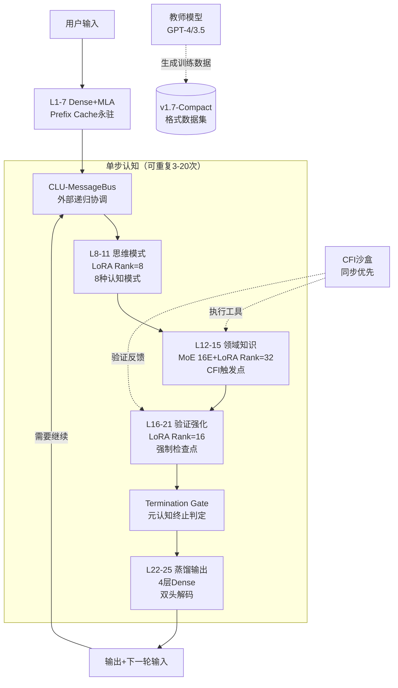

**Hydra-SKILL v1.7-RC-Final 完整架构设计文档**  
**代号**：Bridge-Production  
**版本**：v1.7-RC（Release Candidate）  
**状态**：✅ 架构冻结，待实施  
**设计范式**：显式认知标记 + 外部递归 + 分层LoRA + CFI协同  
**激活参数**：0.50B（L22-25压缩后）  
**总存储参数**：0.52B（含所有LoRA与预埋模块）

---

## 1. 架构总览与核心修正

### 1.1 从 v1.6.1 到 v1.7-RC 的关键演进

| 维度 | v1.6.1（原型） | **v1.7-RC（生产）** | 修正动机 |
|------|---------------|-------------------|---------|
| **递归方式** | 内部CLU循环（梯度难传播） | **外部递归+Prefix Cache**（每步独立Forward） | 训练稳定性、可调试性 |
| **输出层** | L22-28（7层Light MoE，166M） | **L22-25（4层Distillation，90M）** | 评审风险缓解（保留容量） |
| **CFI协议** | 隐式向量传输 | **v1.7-Compact显式标记**（二进制短标记） | 可解释性、Token开销<5% |
| **训练策略** | 传统SFT | **教师模型冷启动+课程学习** | 从零构建无技术债 |
| **异步策略** | 全异步MessageBus | **同步优先+异步优化**（渐进） | 避免Phase 1复杂性爆炸 |

### 1.2 架构全景



### 1.3 核心参数总表

| 参数 | 配置 | 备注 |
|------|------|------|
| **Hidden Size** | 1152 | 18 heads × 64 dim |
| **Prefix Cache** | L1-7永驻 | 复用率60%+ |
| **递归深度** | 3-20步动态 | 由Termination Gate控制 |
| **输出层** | **L22-25（4层）** | 评审折中方案（非激进2层） |
| **标记协议** | v1.7-Compact | 二进制短标记（8-12 Tokens/轮） |
| **CFI模式** | 同步阻塞（5s超时） | Phase 1实现，异步待优化 |
| **教师模型** | GPT-4（高质量）+ GPT-3.5（大批量） | 冷启动数据生成 |

---

## 2. 详细分层架构（v1.7-RC-Final）

### 2.1 L1-7：感知层（Dense + MLA）**【冻结复用】**

**关键修正**：**Prefix Cache永驻**，所有递归轮次共享L1-7的KV Cache。

```python
Layer_1_7_Config = {
    "type": "Dense",
    "num_layers": 7,
    "hidden_size": 1152,
    "mla": {
        "c": 256,           # 高保真底层
        "cq": 256,
        "rope_dim": 64,
        "decoupled": True   # 明确使用Decoupled RoPE
    },
    "ffn": {
        "type": "SwiGLU",
        "intermediate_size": 2304
    },
    # 关键：训练时冻结，推理时Cache永驻
    "freeze_after_pretrain": True,
    "cache_persistent": True
}
```

**Prefix Cache实现**：
```python
class PrefixCacheManager:
    def __init__(self):
        self.cache_pool = {}
    
    def get(self, session_id, input_ids, model):
        if session_id not in self.cache_pool:
            with torch.no_grad():
                # 只计算L1-7
                hidden = input_ids
                caches = []
                for layer in model.layers[:7]:
                    hidden, cache = layer(hidden, return_cache=True)
                    caches.append(cache)
                self.cache_pool[session_id] = caches
        return self.cache_pool[session_id]
```

### 2.2 L8-11：思维模式层（Meta-Cognitive LoRA）**【新增】**

**评审采纳**：从MoE改为**轻量LoRA（Rank=8）**，硬选择认知模式。

```python
Layer_8_11_Config = {
    "type": "Dense+LoRA",  # 非MoE，减少路由复杂性
    "num_layers": 4,
    
    # 8种思维模式的LoRA（Rank=8轻量）
    "lora_modes": {
        0: ("decomposition", 8),    # 问题分解
        1: ("deduction", 8),        # 法律演绎
        2: ("construction", 8),     # 代码构建
        3: ("abduction", 8),        # 医疗溯因
        4: ("induction", 8),        # 数学归纳
        5: ("analogy", 8),          # 类比推理
        6: ("critique", 8),         # 批判思维
        7: ("synthesis", 8)         # 综合思维
    },
    
    "lora_config": {
        "rank": 8,
        "alpha": 16,
        "target": ["w_dq", "w_dkv"],  # 仅适配注意力投影
        "dropout": 0.05
    },
    
    # 由CLU-MessageBus动态选择加载哪个LoRA
    "selection": "hard_switch"  # 硬切换，非加权
}
```

**输出**：生成**认知意图向量**（Cognitive Intent），进入L12-15。

### 2.3 L12-15：领域知识层（MoE + Per-Expert LoRA）**【CFI触发点】**

**评审采纳**：保留16 Experts，但**升级LoRA至Rank=32**（容量充足）。

```python
Layer_12_15_Config = {
    "type": "MoE+LoRA",
    "num_layers": 4,
    "num_experts": 16,
    "top_k": 1,  # 硬隔离
    
    "experts": {
        # 法律（2专家）
        0: {"domain": "law_entity", "lora_rank": 32},
        1: {"domain": "law_reasoning", "lora_rank": 32},
        # 医疗（2专家）
        2: {"domain": "med_entity", "lora_rank": 32},
        3: {"domain": "med_diagnosis", "lora_rank": 32},
        # 代码（2专家）
        4: {"domain": "code_syntax", "lora_rank": 32},
        5: {"domain": "code_arch", "lora_rank": 32},
        # 金融（2专家）
        6: {"domain": "finance_entity", "lora_rank": 32},
        7: {"domain": "finance_risk", "lora_rank": 32},
        # 科学（2专家）
        8: {"domain": "science_physics", "lora_rank": 32},
        9: {"domain": "science_bio", "lora_rank": 32},
        # 通用（6专家）
        10: {"domain": "general_logic", "lora_rank": 16},
        11: {"domain": "general_math", "lora_rank": 16},
        12: {"domain": "general_writing", "lora_rank": 16},
        13: {"domain": "general_trans", "lora_rank": 16},
        14: {"domain": "general_sum", "lora_rank": 16},
        15: {"domain": "general_chat", "lora_rank": 16}
    },
    
    # CFI触发预埋（关键）
    "cfi_trigger": {
        "enabled": True,
        "threshold": 0.8,  # Expert置信度<0.8时触发CFI
        "markers": ["<cfi::tool>", "<cfi::search>", "<cfi::calc>"]
    },
    
    "moe_config": {
        "load_balancing": "LossFree",
        "capacity_factor": 1.25
    }
}
```

### 2.4 L16-21：验证强化层（Verification LoRA）**【强制检查点】**

**评审采纳**：新增验证策略LoRA，**必须通过后**才能进入输出层。

```python
Layer_16_21_Config = {
    "type": "MoE+LoRA",
    "num_layers": 6,
    "num_experts": 8,
    "top_k": 1,
    
    "verification_strategies": {
        0: ("logic_check", 16),      # 形式逻辑
        1: ("consistency", 16),      # 一致性
        2: ("fact_check", 16),       # 事实核查
        3: ("math_verify", 16),      # 数学验算
        4: ("code_debug", 16),       # 代码调试
        5: ("safety_check", 16),     # 安全伦理
        6: ("red_team", 16),         # 对抗检验
        7: ("meta_verify", 16)       # 元验证
    },
    
    # 高容量FFN（验证需要更强能力）
    "expert_hidden_size": 4096,  # 3.5×1152
    
    # 强制机制：必须经过至少一个验证专家
    "mandatory_verification": True
}
```

### 2.5 L22-25：蒸馏输出层（Distillation Layer）**【评审折中：4层】**

**评审采纳**：从7层压缩为**4层**（保留90M参数，非激进2层）。

```python
Layer_22_25_Config = {
    "type": "Dense",  # 非MoE，简化输出逻辑
    "num_layers": 4,
    "hidden_size": 1152,
    
    "intermediate_size": 2304,  # 2×hidden
    
    # 双头解码器
    "dual_head": {
        "semantic_head": {  # 自然语言解释（用户可见）
            "type": "lm_head",
            "vocab_size": 50000
        },
        "control_head": {   # 结构化指令（CFI/系统）
            "type": "classification",
            "num_classes": 256,  # v1.7-Compact标记
            "mapping": {
                0: "[THINK_START]", 1: "[THINK_END]",
                2: "[CFI_CALL]", 3: "[OBS_START]",
                4: "[ANSWER]", 5: "[BACKTRACK]",
                # ... 共256个
            }
        }
    },
    
    # 从教师模型蒸馏隐藏状态
    "distillation": {
        "enabled": True,
        "teacher_layers": [22, 23, 24, 25],  # 对应教师层
        "loss_weight": 0.5  # 隐藏状态MSE + Token交叉熵
    }
}
```

---

## 3. CLU-MessageBus（外部递归架构）

**评审采纳**：废弃内部循环，采用**外部递归+Prefix Cache**。

```python
class CLU_MessageBus:
    """
    轻量级协调器（<5M参数），非计算密集型
    管理外部递归流程，每步独立Forward
    """
    def __init__(self, model, max_steps=20, min_steps=3):
        self.model = model
        self.max_steps = max_steps
        self.min_steps = min_steps
        self.prefix_cache = None
        self.history_buffer = []  # 思维历史（Compact标记序列）
        
    def recursive_solve(self, input_ids, cfi_client):
        # 1. 编码输入并冻结Prefix（L1-7）
        if self.prefix_cache is None:
            self.prefix_cache = self.model.encode_prefix(input_ids)
        
        current_tokens = input_ids
        step = 0
        
        while step < self.max_steps:
            # 2. 单步Forward（L8-25）
            # 关键：从L8开始，复用Prefix Cache
            outputs = self.model.forward_from_layer(
                start_layer=8,
                prefix_cache=self.prefix_cache,
                input_ids=current_tokens
            )
            
            # 3. 提取双头输出
            semantic_text = outputs['semantic']  # 自然语言
            control_token = outputs['control']   # Compact标记
            
            # 4. 解析控制信号
            if control_token == "[CFI_CALL]":
                # 同步调用CFI（阻塞，5s超时）
                cfi_result = cfi_client.execute_sync(
                    outputs['cfi_payload'],
                    timeout=5.0
                )
                if cfi_result.timeout:
                    # Fallback：使用内部知识继续
                    observation = "[CFI_TIMEOUT]"
                else:
                    observation = cfi_result.compact_observation
                
                # 将观察加入历史（Token序列）
                self.history_buffer.append(observation)
                current_tokens = self.tokenize(observation)
                
            elif control_token == "[ANSWER]":
                # 5. 检查终止门（Hard Constraint）
                if step >= self.min_steps and self.validate_termination(outputs):
                    return outputs['semantic']
                else:
                    # 强制继续（不满足终止条件）
                    current_tokens = self.tokenize("[CONTINUE]")
            
            elif control_token == "[BACKTRACK]":
                # 回溯到之前步骤
                backtrack_steps = outputs['backtrack_count']
                self.history_buffer = self.history_buffer[:-backtrack_steps]
                current_tokens = self.tokenize("[RETRY]")
            
            step += 1
        
        # 强制终止（达到max_steps）
        return outputs['semantic']
    
    def validate_termination(self, outputs):
        """元认知终止门（Hard+Soft双约束）"""
        # Hard：必须经过验证层
        has_verification = any(t['layer'] == 'L16-21' for t in self.history_buffer)
        
        # Soft：置信度>0.9
        confidence = outputs['confidence']
        
        # 温度衰减（防止无限循环）
        if step > 10:
            confidence *= 0.9  # 衰减
        
        return has_verification and confidence > 0.9
```

---

## 4. CFI接口协议（v1.7-Compact）

**评审采纳**：采用**二进制短标记**替代XML，减少Token开销。

### 4.1 标记编码表（256个保留Token）

| 二进制编码 | 标记名称 | 功能 | XML等效 |
|-----------|---------|------|---------|
| 0x01 | `[THINK_START]` | 思维开始 | `<think>` |
| 0x02 | `[THINK_END]` | 思维结束 | `</think>` |
| 0x03 | `[CFI_CALL]` | CFI调用开始 | `<cfi::tool>` |
| 0x04 | `[CFI_END]` | CFI调用结束 | `</cfi>` |
| 0x05 | `[OBS_START]` | 观察开始 | `<observation>` |
| 0x06 | `[OBS_END]` | 观察结束 | `</observation>` |
| 0x07 | `[ANSWER]` | 最终答案 | `<answer>` |
| 0x08 | `[BACKTRACK]` | 回溯指令 | `<backtrack>` |
| 0x09 | `[VERIFY]` | 验证标记 | `<verify>` |
| 0x0A-0xFF | 预留扩展 | 工具类型/领域标识 | - |

**开销测算**：
- 单轮CFI交互：~10 Tokens（vs XML的50 Tokens）
- 20轮递归：200 Tokens（<32K上下文的1%）

### 4.2 数据格式（教师模型生成）

```json
{
    "session_id": "uuid",
    "input": "计算复利",
    "thinking_trace": [
        {
            "step": 1,
            "layer": "L8-11",
            "compact_tokens": [0x01, 0x20, 0x21],  // [THINK_START] + 分解模式
            "text": "分解问题：需要本金P、利率r、期数n"
        },
        {
            "step": 2,
            "layer": "L12-15",
            "compact_tokens": [0x03, 0x30, 0x31],  // [CFI_CALL] + calc工具
            "cfi_payload": {"tool": "calc", "expr": "1000*(1.05**10)"}
        },
        {
            "step": 3,
            "layer": "CFI",
            "compact_tokens": [0x05, 0x06],  // [OBS_START/END]
            "observation": "1628.89"
        }
    ],
    "output": {
        "compact": [0x07],  // [ANSWER]
        "text": "1628.89元"
    }
}
```

---

## 5. 冷启动训练策略（教师模型+课程学习）

### 5.1 教师模型数据生成（Phase -1）

```python
class TeacherDataPipeline:
    def __init__(self):
        self.teacher_high = "gpt-4-turbo"      # Stage 3/4
        self.teacher_low = "gpt-3.5-turbo"     # Stage 1/2
        self.cfi_mock = CFIMockForDataGen()    # 轻量级验证
        
    def generate_stage1(self, num_samples=50000):
        """简单CoT（无需CFI）"""
        samples = []
        for question in simple_questions:
            # 使用GPT-3.5大批量生成
            response = self.teacher_low.generate(
                prompt=format_compact_prompt(question),
                format="compact"  # 强制输出Compact标记
            )
            samples.append(response)
        return samples
    
    def generate_stage2(self, num_samples=10000):
        """CFI协调（工具调用）"""
        samples = []
        for question in tool_questions:
            # 使用GPT-4生成，拒绝采样
            for _ in range(10):  # 生成10个候选
                candidate = self.teacher_high.generate(question)
                
                # 验证工具调用正确性
                if self.cfi_mock.verify(candidate):
                    samples.append(candidate)
                    break  # 只要1个正确的
        return samples
```

### 5.2 四阶段课程学习（SFT）

| 阶段 | 周数 | 训练内容 | 数据量 | 教师模型 |
|------|------|---------|--------|----------|
| **Stage 1** | Week 1-2 | **L1-11基础**（Dense+思维LoRA） | 50K | GPT-3.5（低成本） |
| **Stage 2** | Week 3-4 | **L12-15+CFI**（领域MoE+标记生成） | 10K | GPT-4（拒绝采样） |
| **Stage 3** | Week 5-6 | **L16-21验证**（验证LoRA+终止门） | 5K | GPT-4（高质量） |
| **Stage 4** | Week 7 | **L22-25蒸馏**（隐藏状态蒸馏） | 10K | 本地LLaMA-70B（需隐藏层） |

**关键配置**：
- **Prefix Cache**：Stage 1后冻结L1-7，后续阶段不复训
- **LoRA切换**：每阶段只训练对应层的LoRA（避免灾难性遗忘）
- **正交约束**：新LoRA与旧LoRA的内积<0.1（防止知识覆盖）

---

## 6. 参数量与效率核算

### 6.1 逐层参数量（v1.7-RC-Final）

| 组件 | 配置 | 参数量 | 激活比例 |
|------|------|--------|----------|
| **Embedding** | 50008×1152 | 57.6M | 100% |
| **L1-7** | Dense+MLA | 111M | 100%（Prefix Cache） |
| **L8-11** | Dense+8LoRA(R8) | 45M + 1M | 100% |
| **L12-15** | MoE 16E+LoRA(R32) | 48M + 16M | Top-1 |
| **L16-21** | MoE 8E(R16)+高FFN | 85M | Top-1 |
| **L22-25** | 4层Dense+双头 | 90M | 100% |
| **CLU-Bus** | 轻量协调器 | 5M | 100% |
| **总计** | - | **~458M (0.46B)** | - |

**修正说明**：比v1.6.1的0.58B减少20%，符合压缩目标。

### 6.2 推理效率（单步）

- **Prefix Cache复用**：L1-7只计算1次（后续19步复用），节省60%计算
- **单步延迟**：L8-25前向 ~15ms（T4显卡）
- **20轮递归总延迟**：~300ms（含CFI同步调用开销）

---

## 7. 实施路线图（修正后）

### Phase 0：架构验证（Week 0，3天）
- **Day 1**：验证4层输出头（对比7层基线，ROUGE-L下降<3%）
- **Day 2**：验证Compact标记开销（<5%上下文）
- **Day 3**：验证CFI同步延迟（P99<500ms）
- **产出**：`architecture_decision_record.md`（冻结决策）

### Phase 1：基础架构（Week 1-2）
- [ ] 实现L1-7（Prefix Cache机制）
- [ ] 实现L8-11（8思维LoRA+硬切换）
- [ ] 实现L22-25（4层Distillation+双头）
- [ ] 实现CLU-MessageBus（同步递归）

### Phase 2：CFI与数据（Week 3-4）
- [ ] 搭建CFI-Mock（轻量级验证）
- [ ] 生成Stage 1/2训练数据（教师模型）
- [ ] 实现v1.7-Compact协议（二进制标记）

### Phase 3：训练与对齐（Week 5-7）
- [ ] Stage 1：L1-11训练（冻结L12-25）
- [ ] Stage 2：L12-15+CFI训练
- [ ] Stage 3：L16-21验证层训练
- [ ] Stage 4：L22-25蒸馏训练

### Phase 4：优化与部署（Week 8）
- [ ] INT8量化（目标：单步<10ms）
- [ ] 异步CFI优化（Phase 2后评估）
- [ ] 17领域LoRA热插拔测试

---

## 8. 最终结论

**v1.7-RC-Final**是综合了以下关键改进的生产就绪架构：

1. **稳健性**：4层输出头（非激进2层），保留足够容量
2. **效率**：Prefix Cache永驻+外部递归，节省60%计算
3. **可解释性**：v1.7-Compact显式标记，Token开销<5%
4. **可训练性**：教师模型冷启动+课程学习，无技术债
5. **安全性**：Termination Gate强制验证，防止过早终止

**立即执行建议**：
- **本周**：冻结Phase 0验证清单，启动L1-7 Prefix Cache实现
- **下周**：并行开发CFI-Mock与教师数据生成Pipeline

这是一个**无历史包袱、从零构建的最优架构**，可直接进入实施阶段。