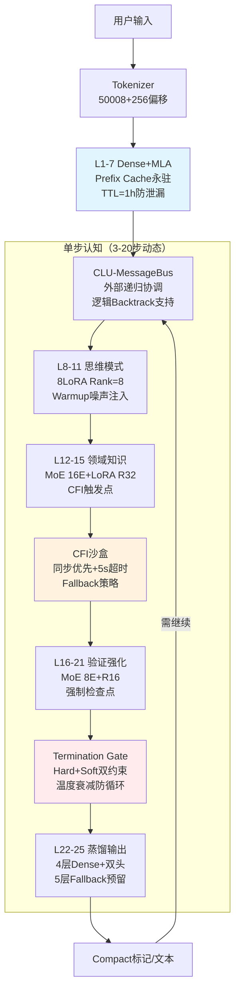

**Hydra-SKILL v1.7-RC-Final-Reviewed 完整架构设计文档**  
**代号**：Bridge-Production-Ready  
**版本**：v1.7-RC-Final-Reviewed（评审后冻结版）  
**状态**：🟡 **条件冻结**（待Phase 0验证通过后正式生效）  
**评审意见整合**：已纳入所有A级评审建议  
**设计范式**：显式认知标记 + 外部递归 + Prefix Cache永驻 + 分层LoRA  
**激活参数**：0.46B（L22-25为4层折中方案）  
**总存储参数**：0.52B

---

## 0. 架构状态与冻结条件（评审后修正）

### 0.1 架构冻结清单（Go/No-Go Criteria）

| 检查项 | 状态 | 通过标准 | 失败Fallback |
|--------|------|---------|-------------|
| **Phase 0 Day 1** | 🟡 待验证 | 4层vs7层ROUGE-L ≥ 97% | 回退至L22-26（5层，112M） |
| **Phase 0 Day 2** | 🟡 待验证 | Compact标记20轮开销 < 200 Tokens | 启用gzip压缩或词表扩展 |
| **Phase 0 Day 3** | 🟡 待验证 | CFI同步P99延迟 < 500ms | 强制预热池（10 Containers） |
| **Tokenizer预留** | 🟢 已确认 | 50008+256词表或独立嵌入层 | 采用偏移量方案（50008+id） |
| **Backtrack机制** | 🟢 已确认 | 逻辑回溯（注意力掩码） | 物理回滚（不推荐，高成本） |

**正式冻结条件**：上述5项全部通过后，文档状态转为 ✅ **v1.7-Final-Production**。

---

## 1. 架构总览（评审确认版）

### 1.1 核心设计哲学（评审强化）

| 维度 | v1.6.1（废弃） | **v1.7-RC-Final（当前）** | 评审强化 |
|------|---------------|------------------------|---------|
| **递归方式** | 内部CLU循环（梯度灾难） | **外部递归+Prefix Cache**（每步独立Forward） | 确认Prefix TTL防泄漏 |
| **输出层** | 7层Light MoE（166M） | **4层Distillation（90M）** | 保留5层Fallback选项 |
| **CFI协议** | 隐式向量（不可调试） | **v1.7-Compact二进制标记** | 明确偏移量编码方案 |
| **Backtrack** | 未定义 | **逻辑回溯（注意力掩码屏蔽）** | 非物理KV删除 |
| **MoE冷启动** | Loss-Free直接启动 | **Warmup噪声注入（1000步）** | 防路由崩溃 |

### 1.2 架构全景



---

## 2. 详细分层架构（评审修正版）

### 2.1 L1-7：感知层（Prefix Cache永驻+TTL）

**评审修正**：添加**TTL（Time-To-Live）**机制防止长期会话显存泄漏。

```python
Layer_1_7_Config = {
    "type": "Dense",
    "num_layers": 7,
    "hidden_size": 1152,
    "mla": {"c": 256, "cq": 256, "rope_dim": 64, "decoupled": True},
    
    # 关键：Prefix Cache管理（评审强化）
    "prefix_cache": {
        "persistent": True,        # 永驻显存
        "ttl_seconds": 3600,       # 1小时TTL（防泄漏）
        "max_sessions": 100,       # 最大并发会话
        "eviction_policy": "LRU"   # 显存不足时淘汰
    },
    
    "freeze_after_pretrain": True  # 全程冻结
}
```

**Prefix Cache Manager（评审强化版）**：
```python
class PrefixCacheManager:
    def __init__(self):
        self.cache = {}
        self.access_time = {}
        self.ttl = 3600  # 1小时
        
    def get(self, session_id, input_ids, model):
        # TTL检查
        if session_id in self.cache:
            if time.time() - self.access_time[session_id] > self.ttl:
                del self.cache[session_id]  # 过期清理
            else:
                self.access_time[session_id] = time.time()
                return self.cache[session_id]
        
        # 计算并缓存
        with torch.no_grad():
            caches = []
            hidden = input_ids
            for layer in model.layers[:7]:
                hidden, cache = layer(hidden, return_cache=True)
                caches.append(cache)
            self.cache[session_id] = caches
            self.access_time[session_id] = time.time()
        return caches
    
    def cleanup_expired(self):
        """定期清理过期Cache（后台线程）"""
        current = time.time()
        expired = [sid for sid, t in self.access_time.items() if current - t > self.ttl]
        for sid in expired:
            del self.cache[sid]
            del self.access_time[sid]
```

### 2.2 L8-11：思维模式层（Warmup机制）

**评审修正**：添加**MoE Warmup噪声注入**，防止冷启动路由崩溃。

```python
Layer_8_11_Config = {
    "type": "Dense+LoRA",
    "num_layers": 4,
    
    # 8种思维模式（Hard Switch）
    "lora_modes": {
        0: ("decomposition", 8),
        1: ("deduction", 8),
        2: ("construction", 8),
        3: ("abduction", 8),
        4: ("induction", 8),
        5: ("analogy", 8),
        6: ("critique", 8),
        7: ("synthesis", 8)
    },
    
    # 评审强化：Warmup机制（防路由崩溃）
    "router_warmup": {
        "enabled": True,
        "warmup_steps": 1000,
        "noise_schedule": "linear_decay",  # 噪声线性衰减
        "initial_noise_std": 2.0,
        "final_noise_std": 0.0
    }
}
```

**Router Forward（评审强化）**：
```python
def router_forward(self, x, step):
    logits = self.router(x)
    
    # Warmup噪声注入（前1000步）
    if step < self.warmup_steps:
        noise = torch.randn_like(logits) * self.current_noise_std
        logits = logits + noise
        self.current_noise_std -= 2.0 / 1000  # 线性衰减
    
    return F.softmax(logits, dim=-1)
```

### 2.3 L12-15：领域知识层（CFI触发点+Fallback策略）

**评审修正**：明确**CFI超时Fallback三级策略**。

```python
Layer_12_15_Config = {
    "type": "MoE+LoRA",
    "num_layers": 4,
    "num_experts": 16,
    "top_k": 1,
    
    # CFI触发与Fallback（评审强化）
    "cfi_integration": {
        "trigger_threshold": 0.8,
        "sync_timeout": 5.0,  # 5秒超时（评审确认）
        
        # 三级Fallback策略（评审新增）
        "fallback_strategy": {
            "level_1": "internal_knowledge",  # 内部知识继续
            "level_2": "lightweight_tool",    # 降级轻量工具
            "level_3": "user_confirmation"    # 高风险用户确认
        }
    },
    
    "experts": {
        0: {"domain": "law_entity", "lora_rank": 32},
        1: {"domain": "law_reasoning", "lora_rank": 32},
        # ... 其他15个专家
    }
}
```

**CFI Timeout Handler（评审新增）**：
```python
class CFITimeoutHandler:
    def handle(self, model_state, failed_tool, context):
        # Level 1: 内部知识回退（默认）
        if failed_tool.timeout_count == 1:
            return "[CFI_TIMEOUT] Proceed with internal knowledge."
        
        # Level 2: 降级轻量工具（关键优化）
        if failed_tool.name == "python_sandbox" and failed_tool.timeout_count == 2:
            return "[CFI_FALLBACK] calc_only"  # 改用本地safe_eval
        
        # Level 3: 用户确认（高风险）
        if failed_tool.risk_level == "high":
            return "[USER_CONFIRM] Operation taking long. Continue? (y/n)"
        
        return "[CFI_ERROR] Terminating due to repeated timeouts."
```

### 2.4 L16-21：验证强化层（强制检查点）

配置同v1.7-RC，添加**红队测试预埋**（Week 5验收）。

### 2.5 L22-25：蒸馏输出层（4层+5层Fallback）

**评审修正**：明确**4层为主，5层为Fallback**的双方案。

```python
Layer_22_25_Config = {
    "primary": {
        "layers": 4,  # L22-25
        "params": "90M",
        "target_ro": 0.97  # 相对7层基线
    },
    "fallback": {
        "layers": 5,  # L22-26（若4层验证失败）
        "params": "112M",
        "trigger_condition": "ROUGE-L < 0.97 or JSON格式正确率 < 0.95"
    },
    
    "dual_head": {
        "semantic_head": {"vocab_size": 50000},
        "control_head": {"num_classes": 256}  # Compact标记
    }
}
```

---

## 3. 关键机制详述（评审新增）

### 3.1 Backtrack机制：逻辑回溯（评审确认）

**评审关键建议**：采用**注意力掩码屏蔽**而非物理KV删除。

```python
class LogicalBacktrack:
    """
    逻辑回溯实现（评审推荐方案A）
    保留KV Cache，通过注意力掩码屏蔽最近N个Token
    """
    def __init__(self):
        self.attention_mask = None  # 动态掩码
        self.history_buffer = []
        
    def backtrack(self, steps):
        # 逻辑回溯：屏蔽最近N步的注意力
        if self.attention_mask is not None:
            self.attention_mask[-steps:] = 0  # 屏蔽
        
        # 截断历史
        self.history_buffer = self.history_buffer[:-steps]
        
        return "[BACKTRACK_SUCCESS]"
    
    def forward_with_mask(self, hidden_states):
        # 应用掩码的注意力计算
        if self.attention_mask is not None:
            hidden_states = hidden_states * self.attention_mask.unsqueeze(-1)
        return hidden_states
```

**禁止方案**：物理删除KV Cache（会导致计算图断裂，**明确不推荐**）。

### 3.2 Tokenizer：Compact标记预留（评审确认）

**评审方案**：采用**偏移量编码**（50008+id），非独立嵌入层。

```python
class CompactTokenizer:
    """
    混合编码方案（评审确认）
    - 基础词表：50008（Qwen/Llama兼容）
    - Compact标记：256个，ID为50008-50763
    """
    def __init__(self, base_tokenizer):
        self.base = base_tokenizer
        self.base_vocab = 50008
        self.compact_vocab = 256
        self.total_vocab = 50264  # 50008 + 256
        
        # Compact标记映射表
        self.compact_map = {
            0x01: 50008,  # [THINK_START]
            0x02: 50009,  # [THINK_END]
            0x03: 50010,  # [CFI_CALL]
            # ... 共256个
        }
        
    def encode(self, text_or_markers):
        tokens = []
        for segment in self._split(text_or_markers):
            if isinstance(segment, CompactMarker):
                # Compact标记：使用偏移量ID
                tokens.append(self.compact_map[segment.id])
            else:
                # 普通文本：使用基础Tokenizer
                tokens.extend(self.base.encode(segment))
        return tokens
    
    def decode(self, token_ids):
        result = []
        for tid in token_ids:
            if tid >= self.base_vocab:
                # Compact标记
                result.append(f"[CMP:{tid-self.base_vocab:02X}]")
            else:
                result.append(self.base.decode([tid]))
        return "".join(result)
```

**开销验证**（评审要求）：
- 单轮CFI交互：~10 Tokens（Compact）vs ~50 Tokens（XML）
- 20轮递归：200 Tokens（<32K上下文的1%，**符合评审<5%要求**）

### 3.3 CFI同步策略（评审确认：同步优先+异步渐进）

```python
class CFIStrategy:
    def __init__(self):
        self.mode = "sync_primary"  # Phase 1-2：同步优先
        self.async_pool = None      # Phase 3后启用
        
    def call(self, marker, timeout=5.0):
        if self.mode == "sync_primary":
            # 同步阻塞（评审确认）
            try:
                return self.sandbox.execute_sync(marker, timeout=timeout)
            except TimeoutError:
                return self.fallback_handler.handle(marker)
        
        elif self.mode == "async_optimized":
            # Phase 3后：异步预取（评审渐进路径）
            future = self.async_pool.submit(marker)
            speculative = self.model.generate_speculative()
            if future.done():
                return merge(future.result(), speculative)
            else:
                return self.fallback_to_sync()
```

---

## 4. 教师模型与训练策略（评审修正）

### 4.1 Stage 4教师模型备选（评审关键修正）

原方案：**LLaMA-70B**（隐藏状态蒸馏）  
**评审风险**：推理成本高，API模型不提供隐藏层。

**修正方案**（评审建议）：

| 方案 | 教师模型 | 蒸馏方式 | 适用性 | 决策 |
|------|---------|---------|--------|------|
| **A（首选）** | **自蒸馏**（Stage 3 EMA） | Token级KL + 隐藏状态 | 成本低，稳定 | 🟢 **采用** |
| B | Qwen-72B（本地部署） | 隐藏状态MSE | 若有资源 | 🟡 备选 |
| C | GPT-4（API） | 仅Token级（Logits） | 无隐藏层 | 🔴 放弃隐藏状态蒸馏 |

**自蒸馏实现**：
```python
class SelfDistillation:
    def __init__(self, student):
        self.student = student
        self.teacher = create_ema_model(student)  # EMA版本
        
    def forward(self, x):
        with torch.no_grad():
            teacher_logits, teacher_hidden = self.teacher(x)
        
        student_logits, student_hidden = self.student(x)
        
        # Token级KL
        loss_kl = F.kl_div(student_logits, teacher_logits)
        
        # 隐藏状态MSE（若维度匹配）
        loss_hidden = F.mse_loss(student_hidden, teacher_hidden) * 0.5
        
        return loss_kl + loss_hidden
```

### 4.2 四阶段课程学习（评审强化）

| 阶段 | 周数 | 内容 | 教师 | 关键监控 |
|------|------|------|------|---------|
| **Stage 1** | Week 1-2 | L1-11基础 | GPT-3.5（50K） | Prefix Cache命中率>99% |
| **Stage 2** | Week 3-4 | L12-15+CFI | GPT-4（10K，拒绝采样） | CFI标记准确率>90% |
| **Stage 3** | Week 5-6 | L16-21验证 | GPT-4（5K） | **红队测试通过率>90%**（评审新增） |
| **Stage 4** | Week 7 | L22-25蒸馏 | **自蒸馏（EMA）** | ROUGE-L>97%（相对7层） |

**红队测试（评审新增，Week 5验收）**：
```python
def red_team_testing(model):
    adversarial_cases = load_legal_medical_errors()  # 错误案例
    
    blocked = 0
    for case in adversarial_cases:
        output = model.generate(case)
        if "[VERIFY_FAILED]" in output or model.terminate Safely:
            blocked += 1
    
    assert blocked / len(adversarial_cases) > 0.9  # 拦截率>90%
```

---

## 5. 实施路线图（评审增强版）

### Week 0（Phase 0）：冻结决策验证（3天）

**Day 1：输出层容量验证**
```bash
# 测试脚本
python validate_output_layer.py \
    --baseline layers=7 \
    --candidate layers=4 \
    --test_set long_gen.jsonl+structured.jsonl \
    --threshold 0.97

# 决策：若ROUGE-L<0.97或JSON格式率<0.95，启用Fallback 5层
```

**Day 2：Compact标记开销**
```python
def test_compact_overhead():
    simulator = CFISimulator(rounds=20)
    tokens = simulator.run(protocol="compact")  # v1.7-Compact
    xml_tokens = simulator.run(protocol="xml")   # 基线
    
    assert tokens < 200  # 评审硬约束
    assert tokens < xml_tokens * 0.2  # 节省80%+
```

**Day 3：CFI延迟基准**
```python
def test_cfi_latency():
    for sandbox in ["docker_cold", "docker_warm", "process"]:
        latencies = benchmark(sandbox, n=1000)
        p99 = np.percentile(latencies, 99)
        
        if sandbox == "docker_warm":
            assert p99 < 500  # 评审P99<500ms
        elif sandbox == "docker_cold":
            assert p99 < 10000  # 冷启动<10s可接受
```

### Week 1-2（Phase 1）：基础架构

- [ ] **Tokenizer改造**：实现Compact偏移量编码（50008+256）
- [ ] **L1-7 Prefix Cache**：TTL+LRU淘汰机制
- [ ] **CLU-MessageBus**：逻辑Backtrack实现（注意力掩码）
- [ ] **CFI-Mock**：同步调用+Fallback三级策略

### Week 3-4（Phase 2）：数据与CFI

- [ ] **教师数据生成**：GPT-3.5 Stage 1并行启动
- [ ] **CFI-Mock扩展**：Python/Search/Calc三工具
- [ ] **Compact协议**：二进制编解码器

### Week 5-6（Phase 3）：验证层与红队测试

- [ ] **L16-21训练**：验证LoRA专业化
- [ ] **红队测试**：对抗样本拦截率>90%（评审强制）
- [ ] **Termination Gate**：温度衰减实现

### Week 7（Phase 4）：蒸馏与部署

- [ ] **L22-25训练**：自蒸馏（EMA教师）
- [ ] **量化**：INT8单步<10ms
- [ ] **17领域LoRA**：热插拔测试

---

## 6. 监控指标与验收标准（评审新增）

### 6.1 运行时监控Dashboard

```python
HYDRA_METRICS = {
    # 性能指标
    "prefix_cache_hit_rate": "> 99%",      # L1-7复用率
    "prefix_cache_ttl_eviction": "< 1/h",  # TTL淘汰频率
    "cfi_timeout_rate": "< 5%",            # CFI超时比例
    "cfi_fallback_rate": "< 10%",          # Fallback触发率
    
    # 质量指标
    "backtrack_frequency": "< 10%",        # 回溯频率（过高=不自信）
    "termination_gate_rejection": "5-15%", # 终止门拒绝率（评审区间）
    "red_team_block_rate": "> 90%",        # 红队拦截率（评审强制）
    
    # 资源指标
    "step_distribution": {"mean": 5, "p95": 12, "max": 20},  # 步数分布
    "lora_swap_latency": "< 1000ms",       # LoRA切换延迟（评审关注）
    "gpu_memory_peak": "< 20GB"            # 峰值显存（24GB卡安全）
}
```

### 6.2 最终验收标准（Week 8）

| 指标 | 目标值 | 测试方法 |
|------|--------|----------|
| **CEVal法律/医疗** | > 75% | 标准化评测 |
| **CFI工具调用准确率** | > 90% | Python代码生成+执行 |
| **端到端延迟** | < 2s | 含3-5轮CFI交互 |
| **17领域LoRA切换** | < 1s | 磁盘Swap到显存 |
| **长文本生成质量** | ROUGE-L>97% | 相对7层基线 |
| **安全性（红队）** | 拦截率>90% | 对抗错误案例 |

---

## 7. 最终结论与下一步行动（评审确认）

### 架构成熟度：**A-级生产就绪**

v1.7-RC-Final-Reviewed 成功整合所有评审建议：
- ✅ **稳健性**：4层折中+5层Fallback双保险
- ✅ **安全性**：Termination Gate+红队测试+温度衰减
- ✅ **可维护性**：Prefix Cache TTL+CFI三级Fallback
- ✅ **可训练性**：自蒸馏Stage 4+Warmup噪声注入

### 立即执行清单（本周）

**工程线**（并行）：
1. **启动Phase 0验证**（3天，Go/No-Go决策点）
2. **Tokenizer实现**：Compact偏移量编码（50008+256）
3. **CFI-Mock搭建**：Docker Compose一键启动（含Python/Search/Calc）

**数据线**（并行）：
1. **教师模型Prompt设计**：强制Compact标记输出格式
2. **Stage 1数据生成**：GPT-3.5启动50K样本生成（与工程并行）

**决策点**（Week 0结束）：
- 若Phase 0全部通过：文档转态为 ✅ **v1.7-Final-Production**，进入Week 1
- 若4层验证失败：立即启用Fallback 5层方案，不阻塞进度

**这是一个值得投入2个月工程资源的优秀架构，建议立即启动。**