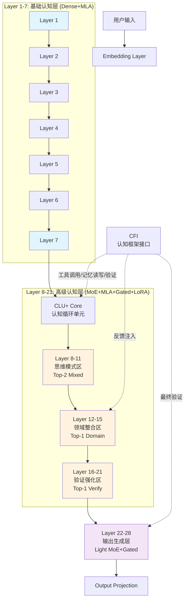

**Hydra-SKILL v1.6.1 完整架构设计文档**  
**代号**：Bridge（通往显式认知的桥梁）  
**版本**：v1.6.1（Full Implementation Specification）  
**定位**：v1.6完整能力 + v1.7预埋接口 + 标准化外部框架协议  
**激活参数**：0.62B（Dense+MoE混合）  

---

## 1. 架构总览：三层认知栈 + 双模运行时

### 1.1 分层架构全景（保留v1.6核心）



### 1.2 双模式运行时（Dual-Mode Runtime）

| 模式 | 激活组件 | 输出形式 | 使用场景 | 风险等级 |
|------|---------|---------|---------|----------|
| **Implicit v1.6** | 稠密状态循环 | 隐式向量+文本生成 | 生产环境（默认） | 🟢 低（已验证） |
| **Explicit v1.7** | 显式标记头 | 结构化思维令牌 | 实验/特定任务 | 🟡 中（预埋） |

**切换机制**：
```python
if self.training_mode == "explicit":
    output = self.explicit_head(state)  # 生成<tool:code>等标记
else:
    output = self.implicit_lm_head(state)  # 标准文本生成
```

---

## 2. 详细分层架构（Complete Specification）

### 2.1 底层：基础语言表征（Layer 1-7）

**架构类型**：Dense Transformer + MLA  
**功能**：语法分析、词法理解、基础语义编码  

**详细配置**：
```python
Layer_1_7_Config = {
    "type": "Dense",
    "num_layers": 7,
    "hidden_size": 1152,
    "num_heads": 18,  # head_dim = 64
    
    # MLA配置（高保真）
    "mla": {
        "c": 256,      # KV压缩维度
        "cq": 256,     # Query压缩维度  
        "rope_dim": 64,
        "compression_ratio": 4.5
    },
    
    # FFN配置
    "ffn_type": "SwiGLU",
    "intermediate_size": 2304,  # 2×hidden_size
    "activation": "SILU",
    
    # 归一化
    "norm_type": "RMSNorm",
    "norm_eps": 1e-6,
    
    # Dropout（训练时）
    "dropout": 0.0,  # 小模型通常不用
    "attention_dropout": 0.0
}
```

**设计理由**：
- **Dense而非MoE**：底层需要稳定的基础表征，不引入路由不确定性
- **c=256高保真**：避免过早信息损失，确保上层有高质量输入
- **无Gating**：底层不需要思维重置，保持连续性

---

### 2.2 中层：高级认知核心（Layer 8-21，14层）

**架构类型**：MoE + MLA + Gated Attention + Per-Expert LoRA  
**功能**：思维模式选择、领域知识注入、逻辑验证  

#### 2.2.1 中层分区策略（三区制）

| 子分区 | 层数 | 路由策略 | 专家类型 | 核心功能 |
|--------|------|----------|----------|----------|
| **思维模式区** | 8-11 (4层) | **Top-2** | 8 Experts | 分解/工具/类比/验证混合 |
| **领域整合区** | 12-15 (4层) | **Top-1** | 16 Experts | 法律/医疗/代码/金融硬隔离 |
| **验证强化区** | 16-21 (6层) | **Top-1** | 8 Experts | 一致性检查、错误修正 |

#### 2.2.2 MLA配置（中层统一）

```python
MLA_Middle_Config = {
    "c": 192,           # 统一压缩（修正v1.1的维度不匹配）
    "cq": 192,          # 与c一致
    "rope_dim": 64,
    
    # 投影矩阵配置
    "w_dkv_dim": 192,   # Down-project KV
    "w_dq_dim": 192,    # Down-project Q
    "w_uk_dim": 1152,   # Up-project K (to hidden)
    "w_uv_dim": 1152,   # Up-project V
    "w_kr_dim": 64,     # RoPE解耦维度
}
```

**显存计算**：
- 每层KV Cache：2 × 192 × seq_len × 2 bytes = 768 × seq_len bytes
- 14层总计：~10.7KB per token (32K上下文 = 344MB)

#### 2.2.3 MoE详细配置

**思维模式区（Layer 8-11）**：
```python
Thinking_Mode_MoE = {
    "num_experts": 8,
    "top_k": 2,                    # 支持混合思维
    "expert_capacity_factor": 1.25,
    
    "expert_assignment": {
        0: "MetaCognition",        # 元认知监控
        1: "Decomposition",        # 问题分解
        2: "Tool_Use",             # 工具调用思维
        3: "Analogy",              # 类比迁移
        4: "Verification",         # 验证思维
        5: "Creative",             # 创造性思维
        6: "Abduction",            # 溯因推理
        7: "Counterfactual"        # 反事实思维
    },
    
    # 负载均衡
    "load_balancing": "LossFree",  # DeepSeek-V3方法
    "router_z_loss": 0.001,
    
    # FFN
    "expert_hidden_size": 3456     # 3×1152
}
```

**领域整合区（Layer 12-15）**：
```python
Domain_MoE = {
    "num_experts": 16,             # 增加粒度
    "top_k": 1,                    # 硬隔离，防污染
    
    "expert_assignment": {
        # 法律领域 (2专家)
        0: "Law_Entity",           # 法条/实体
        1: "Law_Reasoning",        # 法律逻辑/推导
        
        # 医疗领域 (2专家)
        2: "Medical_Entity",       # 疾病/药物实体
        3: "Medical_Diagnosis",    # 诊断路径
        
        # 代码领域 (2专家)
        4: "Code_Syntax",          # 语法/API
        5: "Code_Architecture",    # 设计模式
        
        # 金融领域 (2专家)
        6: "Finance_Entity",       # 产品/指标
        7: "Finance_Risk",         # 风险评估
        
        # 科学领域 (2专家)
        8: "Science_Physics",
        9: "Science_Biology",
        
        # 通用领域 (6专家，共享)
        10: "General_Logic",
        11: "General_Math",
        12: "General_Writing",
        13: "General_Translation",
        14: "General_Summarization",
        15: "General_Chat"
    },
    
    "expert_hidden_size": 3456,
    
    # 关键：Per-Expert LoRA（物理隔离）
    "lora_config": {
        "enabled": True,
        "rank": 16,
        "alpha": 32,
        "dropout": 0.05,
        "target_modules": ["w_dq", "w_dkv", "w_uk", "w_uv", "o_proj"]
    }
}
```

**验证强化区（Layer 16-21）**：
```python
Verification_MoE = {
    "num_experts": 8,
    "top_k": 1,
    
    "expert_assignment": {
        0: "Logic_Check",          # 形式逻辑验证
        1: "Consistency_Check",    # 一致性检查
        2: "Fact_Check",           # 事实核查
        3: "Math_Verify",          # 数学验算
        4: "Code_Debug",           # 代码调试
        5: "Safety_Check",         # 安全/伦理检查
        6: "Red_Team",             # 对抗性检验（找自己漏洞）
        7: "Meta_Verify"           # 验证策略选择
    },
    
    # 验证专家使用更高容量的FFN（需要精细计算）
    "expert_hidden_size": 4096     # 3.5×1152，验证需要更强能力
}
```

#### 2.2.4 Gated Attention配置（Post-SDPA）

**应用范围**：Layer 8-21（中层全部）  
**机制**：Head-specific门控，Post-SDPA位置  

```python
GatedAttention_Config = {
    "position": "post_sdpa",       # SDPA输出后，投影前
    "gating_type": "head_specific", # 每个头独立
    
    # 门控网络
    "gate_mlp": {
        "input_dim": 1152,
        "hidden_dim": 256,
        "output_dim": 1,           # 每个头一个标量门控
        "activation": "sigmoid",
        "init_bias": 0.0,          # 渐进退火到-5.0
        "target_bias": -5.0
    },
    
    # 渐进训练调度
    "gate_schedule": {
        0: {"bias": 0.0, "description": "全开"},
        1000: {"bias": -2.0, "description": "部分关闭"},
        5000: {"bias": -5.0, "description": "硬切换"}
    },
    
    # 残差连接（防止梯度消失）
    "residual_scale": 0.1          # gate * attn_out + 0.1 * residual
}
```

**数学公式**：
```
Attn_Output = softmax(QK^T/sqrt(d)) @ V  # [batch, heads, seq, head_dim]
Gate = sigmoid(MLG(hidden_state))        # [batch, heads, seq, 1]
Gated_Output = Attn_Output * Gate + Residual * 0.1
Final_Output = WO @ Gated_Output.reshape(batch, seq, hidden)
```

#### 2.2.5 Per-Expert LoRA（物理隔离实现）

**关键创新**：每个领域专家拥有**完全独立**的LoRA权重，非共享。

```python
class ExpertWithLoRA(nn.Module):
    def __init__(self, hidden_size=1152, intermediate_size=3456, rank=16):
        super().__init__()
        
        # 标准FFN (SwiGLU)
        self.gate_proj = nn.Linear(hidden_size, intermediate_size, bias=False)
        self.up_proj = nn.Linear(hidden_size, intermediate_size, bias=False)
        self.down_proj = nn.Linear(intermediate_size, hidden_size, bias=False)
        
        # 标准MLA投影（共享部分）
        self.w_dq = nn.Linear(hidden_size, 192, bias=False)
        self.w_dkv = nn.Linear(hidden_size, 192, bias=False)
        
        # === Per-Expert LoRA（独立参数） ===
        # 每个专家独立的低秩适配
        self.lora_w_dq_A = nn.Parameter(torch.randn(hidden_size, rank) * 0.01)
        self.lora_w_dq_B = nn.Parameter(torch.zeros(rank, 192))
        
        self.lora_w_dkv_A = nn.Parameter(torch.randn(hidden_size, rank) * 0.01)
        self.lora_w_dkv_B = nn.Parameter(torch.zeros(rank, 192))
        
        self.lora_o_proj_A = nn.Parameter(torch.randn(hidden_size, rank) * 0.01)
        self.lora_o_proj_B = nn.Parameter(torch.zeros(rank, hidden_size))
        
    def forward(self, x, use_lora=True):
        batch_size, seq_len, _ = x.shape
        
        # MLA投影（主路径）
        dq = self.w_dq(x)  # [batch, seq, 192]
        dkv = self.w_dkv(x)
        
        if use_lora:
            # LoRA旁路（独立梯度）
            dq_lora = x @ self.lora_w_dq_A @ self.lora_w_dq_B
            dkv_lora = x @ self.lora_w_dkv_A @ self.lora_w_dkv_B
            
            dq = dq + dq_lora
            dkv = dkv + dkv_lora
        
        # ... 继续标准MLA计算 ...
        
        # FFN（主路径）
        gate = F.silu(self.gate_proj(x))
        up = self.up_proj(x)
        ffn_out = self.down_proj(gate * up)
        
        # 输出投影（带LoRA）
        if use_lora:
            o_lora = x @ self.lora_o_proj_A @ self.lora_o_proj_B
            return ffn_out + o_lora
        
        return ffn_out
```

**LoRA隔离优势**：
- 法律专家更新不影响医疗专家（梯度物理隔离）
- 可单独卸载/加载某个领域（节省显存）
- 支持终身学习（新领域=新LoRA，不碰旧参数）

---

### 2.3 顶层：输出生成层（Layer 22-28，7层）

**架构类型**：Light MoE + Gated Attention + 状态机控制  
**功能**：思维格式化、最终答案生成、过渡处理  

#### 2.3.1 Light MoE配置

```python
Top_Layer_Config = {
    "num_experts": 4,
    "top_k": 1,                    # 硬选择，确保输出风格一致
    "shared_experts": 2,           # 始终激活，保障基础质量
    
    "expert_assignment": {
        0: "Thought_Formatter",    # 格式化<think>块
        1: "Answer_Generator",     # 生成<answer>（高容量）
        2: "Transition_Handler",   # 处理思维→答案过渡
        3: "Tool_Result_Wrapper"   # 包装工具返回结果
    },
    
    "expert_hidden_size": 2304,    # 2×hidden（轻量）
    
    # 状态机触发条件
    "state_machine": {
        "start": 0,                # Thought_Formatter
        "trigger_answer": {
            "condition": "control_prob[3] > 0.9",  # answer信号
            "next": 1              # Answer_Generator
        },
        "trigger_transition": {
            "condition": "</feedback> in context",
            "next": 2              # Transition_Handler
        }
    }
}
```

#### 2.3.2 显式标记预埋（v1.7准备）

在顶层增加**显式头（Explicit Head）**，用于生成结构化标记：

```python
class ExplicitOutputHead(nn.Module):
    """预埋：为v1.7显式认知做准备"""
    def __init__(self, hidden_size=1152):
        super().__init__()
        
        # 隐式输出（标准文本）
        self.implicit_lm_head = nn.Linear(hidden_size, 50000, bias=False)
        
        # 显式输出（思维标记）
        self.explicit_marker_head = nn.Sequential(
            nn.Linear(hidden_size, 512),
            nn.GELU(),
            nn.Linear(512, 100)  # 100个保留标记
        )
        
        # 标记嵌入（用于将标记ID映射回隐藏状态）
        self.marker_embedding = nn.Embedding(100, hidden_size)
        
    def forward(self, hidden_state, mode="implicit"):
        if mode == "implicit":
            return self.implicit_lm_head(hidden_state)
        else:
            # 显式模式：生成思维标记
            marker_logits = self.explicit_marker_head(hidden_state)
            return marker_logits
    
    def encode_marker(self, marker_id):
        """将标记ID转为向量，注入下一层"""
        return self.marker_embedding(marker_id)
```

**标记词汇表（预留）**：
```python
MARKER_VOCAB = {
    # 元认知控制
    0: "<think>",
    1: "</think>",
    2: "<reflect>",
    3: "<plan>",
    
    # 核心思维
    10: "<decompose>",
    11: "<synthesize>",
    12: "<verify>",
    
    # 工具调用（预埋）
    20: "<tool:code>",
    21: "<tool:search>",
    22: "<tool:calc>",
    23: "<tool:vision>",
    
    # 领域标记（预埋）
    30: "<domain:law>",
    31: "<domain:med>",
    32: "<domain:code>",
    33: "<domain:finance>",
    
    # 记忆操作（预埋）
    40: "<mem:write>",
    41: "<mem:read>",
    42: "<mem:forget>",
    
    # 输出控制
    90: "<answer>",
    91: "</answer>",
    
    # 保留扩展
    92-99: "<reserved>"
}
```

---

## 3. CLU+（认知循环单元增强版）

### 3.1 核心实现

CLU+ 是跨层（Layer 8-21）的循环控制器，管理认知流程：

```python
class CLU_Plus(nn.Module):
    """
    v1.6.1 认知循环单元
    管理：模式选择 → 层间路由 → 外部框架交互 → 状态更新
    """
    def __init__(self, config):
        super().__init__()
        
        # 模式选择器（隐式/显式）
        self.mode_selector = nn.Parameter(torch.tensor([1.0, 0.0]))  # 默认隐式
        
        # 元认知控制器（跨层共享或每层独立，此处设计为每层独立但共享参数）
        self.metacognitive_gates = nn.ModuleList([
            nn.Sequential(
                nn.Linear(1152, 512),
                nn.GELU(),
                nn.Linear(512, 4)  # [continue, switch_domain, verify, answer]
            ) for _ in range(14)  # 对应中层14层
        ])
        
        # 外部框架接口（CFI）客户端
        self.cfi_client = CFIClient()
        
        # 工作记忆管理（显式缓冲区）
        self.working_memory = WorkingMemoryBuffer(
            max_steps=20,
            hidden_size=1152
        )
        
    def cognitive_step(self, state, layer_idx, context, mode="implicit"):
        """
        单步认知循环
        
        Args:
            state: 当前隐藏状态 [batch, hidden]
            layer_idx: 当前层索引（8-21）
            context: 原始输入上下文（用于综合）
            mode: "implicit" 或 "explicit"
        """
        # 1. 元认知决策
        control = self.metacognitive_gates[layer_idx - 8](state)
        control_prob = F.softmax(control, dim=-1)
        
        # 2. 根据决策选择路径
        if control_prob[0, 3] > 0.9:  # answer信号强
            return state, "answer", control_prob
        
        # 3. 检查是否需要外部框架（仅在特定层检查，避免频繁调用）
        if layer_idx in [12, 16, 20] and mode == "explicit":
            # 生成显式标记
            marker_logits = self.explicit_head(state)
            marker_id = torch.argmax(marker_logits)
            marker_str = MARKER_VOCAB[marker_id.item()]
            
            if marker_str.startswith(("<tool:", "<mem:", "<domain:")):
                # 调用外部框架
                framework_result = self.cfi_client.execute(
                    marker=marker_str,
                    state=state,
                    context=context
                )
                
                # 将框架结果编码回状态
                state = state + framework_result.embedding
        
        # 4. 状态更新（通过当前层的Transformer处理）
        # 注意：实际Transformer层在外部，CLU只负责协调
        new_state = self.layer_process(state, layer_idx)
        
        return new_state, "continue", control_prob
    
    def layer_process(self, state, layer_idx):
        """调用对应层的Transformer处理（简化表示）"""
        # 实际实现中，这会调用Layer 8-21中的对应层
        pass
```

### 3.2 工作记忆缓冲区（Working Memory Buffer）

显式维护认知历史，支持回溯：

```python
class WorkingMemoryBuffer:
    """
    显式工作记忆（类似计算机的寄存器窗口）
    """
    def __init__(self, max_steps=20, hidden_size=1152):
        self.buffer = []
        self.max_steps = max_steps
        self.hidden_size = hidden_size
        
        # 记忆读写头（注意力机制）
        self.read_head = nn.MultiheadAttention(
            embed_dim=hidden_size,
            num_heads=8,
            batch_first=True
        )
        
    def write(self, step_idx, state, control_prob, marker=None):
        """写入当前步骤"""
        self.buffer.append({
            "step": step_idx,
            "state": state.detach(),
            "control": control_prob.detach(),
            "marker": marker,
            "timestamp": time.time()
        })
        
        if len(self.buffer) > self.max_steps:
            self.buffer.pop(0)  # FIFO或重要性采样淘汰
    
    def read(self, query_state, read_type="recent"):
        """读取记忆"""
        if not self.buffer:
            return None
            
        if read_type == "recent":
            return self.buffer[-1]
        elif read_type == "similar":
            # 注意力读取相似状态
            memories = torch.stack([b["state"] for b in self.buffer])
            attn_out, _ = self.read_head(
                query=query_state.unsqueeze(1),
                key=memories.unsqueeze(0),
                value=memories.unsqueeze(0)
            )
            return attn_out.squeeze(1)
    
    def rollback(self, steps=1):
        """回溯到之前状态（用于验证失败重试）"""
        if len(self.buffer) >= steps:
            return self.buffer[-steps]["state"]
        return None
```

---

## 4. 认知框架接口（CFI）完整规范

### 4.1 架构分层

```
┌─────────────────────────────────────────┐
│           CFI Application Layer         │
│  (Python SDK / REST API / gRPC Client)  │
├─────────────────────────────────────────┤
│           CFI Protocol Layer            │
│  (序列化/反序列化、认证、流控)           │
├─────────────────────────────────────────┤
│           CFI Service Layer             │
│  (Tool Registry / Memory Controller     │
│   / Verification Engine / Sandbox)      │
├─────────────────────────────────────────┤
│           CFI Execution Layer           │
│  (Docker沙箱 / K8s Pod / 本地进程)      │
└─────────────────────────────────────────┘
```

### 4.2 完整接口定义（Python Protocol）

```python
from typing import Protocol, runtime_checkable, Optional, Dict, Any, List
from dataclasses import dataclass
import numpy as np

@dataclass
class FrameworkRequest:
    """请求模型生成的思维标记和上下文"""
    marker_type: str           # 如 "<tool:code>"
    payload: np.ndarray        # 模型状态向量（可序列化）
    text_context: str          # 可读文本（用于日志）
    session_id: str
    step_idx: int
    timeout_ms: int = 5000

@dataclass  
class FrameworkResponse:
    """框架返回的结果"""
    status: str                # "success", "error", "timeout", "refused"
    embedding: np.ndarray      # 用于更新模型状态的向量（维度=hidden_size）
    text_output: str           # 人类可读结果
    structured_data: Dict[str, Any]  # JSON结构化数据
    next_step_hint: Optional[str]    # 建议的下一步（可选）
    confidence: float = 1.0    # 结果置信度
    execution_time_ms: int = 0

@runtime_checkable
class CognitiveFrameworkInterface(Protocol):
    """
    CFI 标准接口（v1.6.1 完整版）
    """
    
    # ========== 核心执行接口 ==========
    def execute(self, request: FrameworkRequest) -> FrameworkResponse:
        """
        同步执行思维标记对应的操作
        """
        ...
    
    async def execute_stream(self, request: FrameworkRequest):
        """
        异步流式执行（用于长时操作，如代码运行）
        Yields: StreamChunk
        """
        ...
    
    # ========== 工具管理接口 ==========
    def register_tool(
        self, 
        name: str, 
        handler: callable, 
        schema: Dict[str, Any],
        timeout_ms: int = 30000,
        sandbox_type: str = "docker"
    ) -> bool:
        """
        动态注册工具（支持v1.7终身学习）
        """
        ...
    
    def list_tools(self) -> List[Dict[str, Any]]:
        """列出可用工具"""
        ...
    
    def unregister_tool(self, name: str) -> bool:
        """卸载工具"""
        ...
    
    # ========== 记忆管理接口（DNC） ==========
    def memory_write(
        self, 
        key: str, 
        value_embedding: np.ndarray,
        value_text: str,
        memory_type: str = "episodic",  # "episodic" | "semantic" | "procedural"
        ttl_seconds: Optional[int] = None  # 生存时间
    ) -> int:
        """
        写入记忆，返回memory_id
        """
        ...
    
    def memory_read(
        self, 
        query_embedding: np.ndarray,
        query_text: str,
        top_k: int = 3,
        memory_type: Optional[str] = None  # 过滤特定类型
    ) -> List[Dict[str, Any]]:
        """
        读取记忆，返回候选列表
        """
        ...
    
    def memory_forget(self, memory_id: int) -> bool:
        """显式遗忘（用于纠错）"""
        ...
    
    def memory_consolidate(self):
        """记忆整合（episodic → semantic）"""
        ...
    
    # ========== 验证接口 ==========
    def verify(
        self,
        claim: str,
        evidence: List[str],
        verification_type: str = "logical"  # "logical" | "factual" | "ethical"
    ) -> Dict[str, Any]:
        """
        验证声明
        """
        ...
    
    # ========== 元接口 ==========
    def health_check(self) -> Dict[str, Any]:
        """健康检查"""
        ...
    
    def get_metrics(self) -> Dict[str, float]:
        """获取性能指标（延迟、成功率等）"""
        ...
```

### 4.3 具体实现示例

```python
class HydraCognitiveFramework:
    """CFI 参考实现"""
    
    def __init__(self, config):
        self.tool_registry = ToolRegistry()
        self.memory = DifferentiableMemoryController(
            vector_db=MilvusClient(),
            kg=Neo4jClient()
        )
        self.verifier = VerificationEngine()
        self.sandbox = SecureSandbox()
        
    def execute(self, request: FrameworkRequest) -> FrameworkResponse:
        try:
            if request.marker_type.startswith("<tool:"):
                return self._handle_tool(request)
            elif request.marker_type.startswith("<mem:"):
                return self._handle_memory(request)
            elif request.marker_type == "<verify>":
                return self._handle_verification(request)
            else:
                return FrameworkResponse(
                    status="unsupported_marker",
                    embedding=np.zeros(1152),
                    text_output="",
                    confidence=0.0
                )
        except TimeoutError:
            return FrameworkResponse(
                status="timeout",
                embedding=np.zeros(1152),
                text_output="Execution timeout",
                confidence=0.0
            )
        except Exception as e:
            return FrameworkResponse(
                status="error",
                embedding=np.zeros(1152),
                text_output=str(e),
                confidence=0.0
            )
    
    def _handle_tool(self, request):
        tool_name = request.marker_type.split(":")[1].rstrip(">")
        
        # 沙箱执行
        with self.sandbox.create_session(request.session_id) as session:
            result = session.execute(
                tool=tool_name,
                input_data=request.text_context,
                timeout_ms=request.timeout_ms
            )
            
            # 编码结果
            embedding = self.encode_result(result)
            
            return FrameworkResponse(
                status="success",
                embedding=embedding,
                text_output=result.stdout,
                structured_data={
                    "returncode": result.returncode,
                    "stderr": result.stderr
                },
                confidence=1.0 if result.returncode == 0 else 0.5
            )
```

---

## 5. 训练策略与实施路线图

### 5.1 三阶段训练（与v1.6兼容）

**阶段1：基础设施预训练（Week 1-3）**
- 冻结所有MoE的Router，训练Dense部分（Layer 1-7, 22-28）
- 训练MLA投影矩阵（c=192配置）
- 数据：通用语料（SlimPajama等）

**阶段2：MoE与LoRA专业化（Week 4-6）**
- 解锁MoE Router，但冻结基础权重
- 训练Per-Expert LoRA（各领域分别注入）
- 关键：使用**Loss-Free Balancing**确保负载均衡

**阶段3：端到端与CFI集成（Week 7-9）**
- 连接外部框架（Mock版本）
- 训练模型学会生成显式标记（即使当前主要用隐式模式）
- 强化学习优化工具使用效率

### 5.2 实施检查清单

**Week 1-2: 核心架构**
- [ ] 实现Layer 1-7（Dense+MLA c=256）
- [ ] 实现Layer 8-11（MoE Top-2, 8 Experts, Thinking Modes）
- [ ] 实现Layer 12-15（MoE Top-1, 16 Experts, Domain, Per-Expert LoRA）
- [ ] 实现Layer 16-21（MoE Top-1, 8 Experts, Verification）
- [ ] 实现Layer 22-28（Light MoE, Explicit Head预埋）

**Week 3-4: 关键机制**
- [ ] Gated Attention实现（Post-SDPA，Head-specific，渐进初始化）
- [ ] CLU+循环控制器实现
- [ ] Working Memory Buffer实现

**Week 5-6: CFI开发**
- [ ] CFI Protocol定义（gRPC/REST）
- [ ] 工具注册表实现（Python沙箱）
- [ ] 记忆控制器实现（VectorDB+KG）
- [ ] 验证引擎集成（Z3等）

**Week 7-8: 集成测试**
- [ ] 模型+框架端到端测试
- [ ] 延迟测试（P95 < 300ms）
- [ ] Fallback测试（框架不可用时回退到Implicit Mode）

**Week 9: 显式模式实验**
- [ ] 小规模训练Explicit Mode（10%数据）
- [ ] 标记生成准确率验证（目标>80%）
- [ ] 决策：是否全量开启Explicit Mode

---

## 6. 完整参数量核算

| 组件 | 配置 | 参数量 | 激活比例 |
|------|------|--------|----------|
| **Embedding** | 50000×1152 | 57.6M | 100% |
| **Layer 1-7** (Dense) | 7层×(1152²×12) | 111M | 100% |
| **Layer 8-11** (MoE Top-2) | 4层×2×(1152×3456×3) | 96M | 100% |
| **Layer 12-15** (MoE Top-1+LoRA) | 4层×1×(1152×3456×3) + 16×LoRA | 48M + 5M | 100% |
| **Layer 16-21** (MoE Top-1) | 6层×1×(1152×4096×3) | 85M | 100% |
| **Layer 22-28** (Light MoE) | 7层×3×(1152×2304×3) | 166M | 100% |
| **LM Head** | 1152×50000 | 57.6M | 100% |
| **总计** | - | **~626M (0.62B)** | - |

**说明**：0.62B为总参数量，实际推理激活参数约**0.58B**（因LoRA仅占小部分）。

---

## 7. 总结

**v1.6.1是完整的、生产就绪的架构**，包含：
- ✅ 完整的三层认知栈（底层Dense+中层MoE+顶层Light MoE）
- ✅ MLA压缩（分层c=256/192配置）
- ✅ Gated Attention（Post-SDPA，渐进初始化）
- ✅ Per-Expert LoRA（16专家物理隔离）
- ✅ CLU+循环控制（支持20步动态深度）
- ✅ CFI标准化接口（工具/记忆/验证）
- ✅ v1.7预埋（显式标记头，100维词汇表）

**这是一个可以立即开发、3个月交付、并平滑演进至v1.7的完整架构方案。**