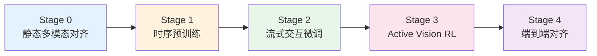
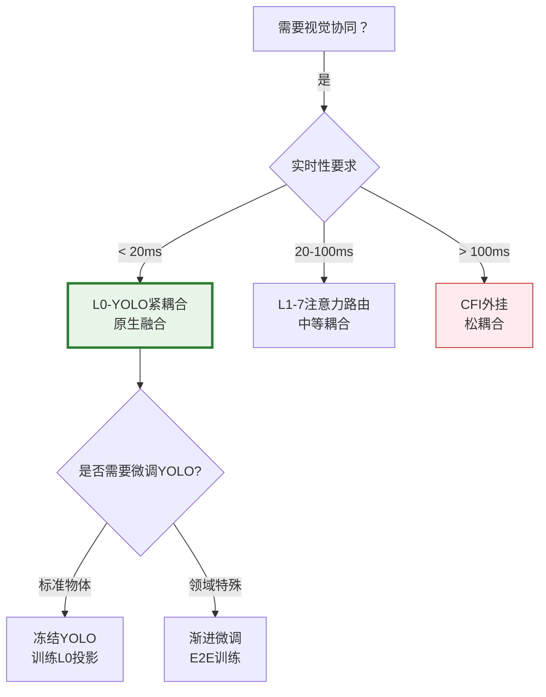

# Hydra-SKILL-Robot

针对**Hydra-SKILL-Robot v1.0**（实时视频流+语音交互）的训练，核心挑战是**从离散静态数据学习连续时序推理**和**机器人控制策略**。以下是分阶段训练方案：

---

## 1. 训练范式总览



**训练原则**：
- **渐进时序化**：先学静态图，再学短视频（3-5s），最后学长视频（30s+）
- **冻结保护**：L1-7在Stage 0-2保持冻结，防止破坏Prefix Cache机制
- **模拟流式**：即使使用预录视频，也通过**时间窗口采样**模拟实时流

---

## 2. 分阶段训练方案

### Stage 0: 静态多模态对齐（Week 1-2）

**目标**：让L0的视觉编码器与文本空间对齐，建立基础视觉理解。

```python
# 数据构造
Data_Stage0 = {
    "source": ["LAION-5B", "COCO", "Visual Genome"],
    "format": "(image, caption)",
    "size": "2M samples",
    
    # 特殊构造：模拟机器人视角
    "robot_view_augmentation": {
        "random_crop": "0.7-1.0",      # 模拟摄像头移动
        "motion_blur": "0.3概率",       # 模拟运动模糊
        "egocentric_transform": True    # 第一人称视角增强
    }
}

# 训练配置
Training_Stage0 = {
    "freeze": ["L1-25"],              # 绝对冻结所有Transformer
    "trainable": ["L0.visual_stream_encoder", "L0.temporal_aligner"],
    
    "loss": {
        "itc": "Image-Text Contrastive (CLIP-style)",
        "itm": "Image-Text Matching",
        "mlm": "Masked Language Modeling (根据图像预测被遮罩文本)"
    },
    
    "lr": 2e-4,
    "batch": 256,
    "precision": "bf16"
}
```

**关键技巧**：
- **时序预演**：虽然是静态图，但在数据加载器中加入**时间戳伪造**（给每张图随机分配`t`），让模型适应时间编码。

---

### Stage 1: 时序预训练（Week 3-4）

**目标**：学习视频时序建模（运动理解、时序关系、关键帧提取）。

```python
# 数据构造（核心难点）
Data_Stage1 = {
    "source": ["InternVid", "WebVid-10M", "Ego4D"],
    
    "sampling_strategy": {
        "clip_length": "5-30 seconds",
        "fps": 4,  # 抽帧到4fps，降低计算（模拟流式降采样）
        "resolution": "224x224",
        
        # 构造时序问答对（Temporal QA）
        "temporal_annotation": {
            "before_after": "事件A发生在事件B之前吗？",
            "motion_description": "物体正在向左移动还是向右？",
            "change_detection": "这两帧之间发生了什么变化？"
        }
    },
    
    # 模拟流式Cache训练
    "streaming_simulation": {
        "window_size": 10,      # 10帧 = 2.5秒（4fps）
        "stride": 4,            # 50%重叠，模拟滑动窗口
        "random_drop": 0.2      # 随机丢弃帧，模拟网络丢包/传感器噪声
    }
}

# 训练配置
Training_Stage1 = {
    "freeze": ["L0.perceptual_experts", "L8-25"],  # 冻结视觉编码器和递归层
    "trainable": [
        "L1-7.temporal_cache",       # 时序Cache机制
        "L1-7.temporal_decay_weights",  # 时间衰减参数
        "pyramid_memory"             # 三层金字塔记忆
    ],
    
    "loss": {
        "temporal_ordering": "排序损失（判断帧顺序）",
        "next_frame_prediction": "预测下一帧特征（类似LM的next token）",
        "contrastive_temporal": "拉近相邻帧，推远远离帧"
    },
    
    # 时序特殊技巧
    "curriculum_learning": {
        "week3": "静态图+轻微运动（摄像机平移）",
        "week4": "复杂运动（人手操作物体）+ 长时序依赖"
    }
}
```

**关键技术：Pyramid Cache训练**
- **监督信号**：人工标注关键帧（Keyframe Labels），训练L1-7的**关键帧检测器**（基于视觉显著性）。
- **损失函数**：
  ```python
  loss_keyframe = BCE(saliency_score, ground_truth_keyframe_mask)
  loss_compression = MSE(compressed_frame, original_frame)  # 自监督重建
  ```

---

### Stage 2: 流式交互微调（Week 5-6）

**目标**：学习**音频-视频-文本**三模态对齐，以及**流式对话**能力。

```python
# 数据构造（最难构造的数据）
Data_Stage2 = {
    "source": [
        "AVSD (Audio-Visual Scene-Aware Dialog)", 
        "SIMMC 2.0 (多模态对话)",
        "YouCook2 (烹饪视频+解说)",
        "自定义机器人交互数据"
    ],
    
    "data_format": {
        "video_segment": "30-60 seconds",
        "audio_transcription": "ASR文本+时间戳",
        "dialogue_turns": [
            {"timestamp": 5.2, "speaker": "user", "text": "那是什么？"},
            {"timestamp": 5.8, "speaker": "robot", "text": "那是一个红色的按钮", 
             "attention_map": "visual_attention_at_5.8s"},  # 需要标注机器人看哪里
            {"timestamp": 8.0, "speaker": "user", "text": "按下它"}
        ]
    },
    
    # 流式模拟核心：构造交错事件流
    "event_stream_construction": {
        "text_events": "ASR结果按字切分（流式输入模拟）",
        "visual_events": "4fps连续帧",
        "alignment": "±100ms内的事件视为同步"
    }
}

# 训练配置（类似v1.8 Stage 2但扩展）
Training_Stage2 = {
    "freeze": ["L1-7"],  # 保持时序Cache冻结，仅训练融合层
    "trainable": ["L8-21", "L22", "L23"],
    
    "streaming_training": {
        "simulated_latency": {
            "audio_delay": "100-300ms",      # 模拟ASR延迟
            "visual_buffer": "3 frames",      # 视觉缓冲3帧（模拟L0缓存）
            "max_context": "10 seconds"       # 模拟长对话截断
        },
        
        # 强制时序对齐损失
        "temporal_consistency_loss": """
        如果文本提到"这个"，要求L8-21的Attention必须聚焦到当前帧的对应物体
        通过Grad-CAM监督Attention权重
        """
    },
    
    "multi_task": {
        "captioning": "描述当前看到的场景",
        "qa": "回答关于当前帧的问题", 
        "grounding": "文本中的词 grounding 到视觉区域（Teaching Attention）"
    }
}
```

**关键技巧：流式掩码训练**
- 在训练时**随机遮蔽未来信息**，强制模型基于当前已接收的流式信息做决策，而非"偷看"未来帧。

---

### Stage 3: Active Vision 强化学习（Week 7）

**目标**：训练L22生成控制Token（`PAN_LEFT`, `ZOOM_IN`等），使机器人学会**主动观察策略**。

```python
# 数据与模拟环境
ActiveVision_Env = {
    "type": "Virtual Robot Simulator (Habitat/AI2-THOR)",
    "tasks": [
        "visual_search": "找到红色杯子（需要转动摄像头）",
        "inspection": "仔细检查电路板上的标签（需要Zoom In）",
        "tracking": "跟随移动的人（需要持续Pan）"
    ],
    
    "state_space": {
        "visual_input": "当前摄像头画面",
        "cache_state": "L1-7的Temporal Cache",
        "text_query": "用户指令（如'看左边'）"
    },
    
    "action_space": [
        "FOCUS_GAZE", "PAN_LEFT", "PAN_RIGHT", 
        "ZOOM_IN", "ZOOM_OUT", "STOP"
    ]
}

# RL训练配置（PPO算法）
RL_Training = {
    "algorithm": "PPO",
    "reward_function": {
        "completion": "+10 (完成任务)",
        "step_penalty": "-0.1 (每步惩罚，鼓励快速完成)", 
        "gaze_alignment": "+1 (Attention权重与目标区域IoU)",
        "redundancy_penalty": "-0.5 (重复无意义移动)"
    },
    
    "policy": "L22_Control_Gateway",  # 只训练策略头
    "value_network": "单独的价值头（共享L1-7 Backbone）",
    
    "constraints": {
        "max_steps": 20,           # 最多20步Active Vision
        "latency_budget": "每步<50ms",
        "safety_rule": "禁止快速转动（防止机器人损坏）"
    }
}
```

**混合训练（RL + Imitation）**：
- **模仿学习**：先用人标注的"注视轨迹"（Gaze Tracking Data）预训练（Behavior Cloning）。
- **强化学习**：再用PPO微调，优化效率。

---

### Stage 4: 端到端对齐与人类反馈（Week 8）

**目标**：整体优化，确保实时性、安全性和人类偏好一致。

```python
# RLHF for Multimodal
Stage4_Config = {
    "data": "人类与机器人的真实交互日志（过滤后的高质量数据）",
    
    "reward_model_training": {
        "preferences": [
            "及时响应 > 延迟但准确",
            "主动确认模糊指令 > 盲目执行",
            "视觉确认（看一眼再回答） >  hallucination"
        ],
        "modality": "多模态奖励模型（同时看视频流和文本回答）"
    },
    
    "dpo_training": {
        "positive_examples": "人类认可的交互轨迹",
        "negative_examples": "模型犯的错误（如：没看就回答、看错物体）",
        "target_layers": ["L8-21", "L22"]  # 只微调高层
    },
    
    # 实时性蒸馏
    "latency_distillation": {
        "teacher": "大模型（7B）离线推理结果（高质量但慢）",
        "student": "Hydra-Robot（0.5B）流式推理",
        "loss": "输出一致性 + 推理速度约束"
    }
}
```

---

## 3. 关键训练技巧详解

### 3.1 时序Cache的梯度传播

**问题**：Pyramid Cache涉及**离散决策**（是否存为关键帧），不可微。

**解决方案**：
```python
# 使用Gumbel-Softmax近似（Straight-Through Estimator）
saliency_score = compute_saliency(frame)  # [0,1]
keyframe_decision = (saliency_score > 0.5).float()

# 前向：硬决策（离散）
# 反向：通过saliency_score传播梯度（软梯度）
keyframe_decision = keyframe_decision - saliency_score.detach() + saliency_score
```

### 3.2 流式模拟的数据加载器

```python
class StreamingDataLoader:
    """
    将预录视频模拟为实时流
    """
    def __init__(self, video_path, simulate_fps=4):
        self.video = load_video(video_path)
        self.buffer = deque(maxlen=simulate_fps * 5)  # 5秒缓冲
        
    def __iter__(self):
        for frame in self.video:
            self.buffer.append(frame)
            
            # 模拟流式：每250ms（4fps）yield一次当前buffer
            if len(self.buffer) % 1 == 0:  # 每帧都处理
                yield {
                    "visual_stream": list(self.buffer),
                    "audio_text": get_asr_in_window(current_time, window=0.1),
                    "timestamp": current_time
                }
                
            # 模拟网络抖动：随机sleep
            time.sleep(random.uniform(0.02, 0.03))  # 20-30ms波动
```

### 3.3 灾难性遗忘防护

```python
# 文本能力锚定（Stage 2-4持续进行）
Text_Anchor_Loss = {
    "frequency": "每100个多模态batch，插入10个纯文本batch",
    "distillation": {
        "teacher": "原始v1.8模型（冻结）",
        "student": "Hydra-Robot",
        "loss": "KL(L8-21输出差异) + 文本任务准确率"
    }
}
```

### 3.4 混合精度与梯度检查点

```python
# 针对视频训练的显存优化
Optimization = {
    "gradient_checkpointing": True,  # 在L1-7启用（牺牲30%速度换50%显存）
    "mixed_precision": "bf16",
    
    # 视频特殊优化：帧间梯度截断（防止BPTT长度爆炸）
    "truncated_bptt": {
        "chunk_size": 16,  # 每16帧截断一次梯度
        "preserve_cache_grad": False  # Cache不反向传播（仅作为状态）
    }
}
```

---

## 4. 数据标注规范（关键）

### 4.1 时序对齐标注工具

需要开发专门工具标注**多模态时间戳**：
```json
{
    "video_id": "robot_session_001",
    "events": [
        {"t": 0.0, "modality": "vision", "obj": "cup", "bbox": [100,200,50,50]},
        {"t": 0.0, "modality": "audio", "text": "拿那个", "phonemes": ["na", "ge"]},
        {"t": 0.3, "modality": "action", "gaze": [120, 220], "robot_state": "turning_head"},
        {"t": 0.8, "modality": "audio", "text": "杯子", "grounding": {"ref": "cup", "video_t": 0.0}}
    ]
}
```

### 4.2 Active Vision 轨迹标注

使用**眼动仪**或**人工标注**记录：
- **目标**：找到红色杯子
- **轨迹**：`[(0s, center), (0.5s, pan_left), (1.2s, found_cup), (1.3s, zoom_in)]`

---

## 5. 评估与验收标准

| 阶段 | 评估指标 | 通过标准 |
|------|---------|---------|
| **Stage 0** | Image Caption CIDEr | >110 |
| **Stage 1** | 时序排序准确率 | >85% |
| **Stage 2** | AVSD Dialog Accuracy | >75% + 人类满意度>4.0/5 |
| **Stage 3** | Active Vision任务成功率 | >80% (平均<5步完成) |
| **Stage 4** | 端到端延迟 | P99 < 200ms |
| **综合** | 文本能力保持 | MMLU下降<2% |

---

## 6. 实施路线图（3个月）

| 周   | 阶段      | 关键产出                  |
| --- | ------- | --------------------- |
| 1-2 | Stage 0 | L0视觉编码器收敛，可视化特征聚类合理   |
| 3-4 | Stage 1 | 视频时序Loss下降，关键帧提取可视化合理 |
| 5-6 | Stage 2 | 流式对话Demo（预录视频+模拟ASR）  |
| 7   | Stage 3 | 虚拟环境中机器人主动视觉策略可视化     |
| 8   | Stage 4 | 实机部署测试，延迟达标，红队测试通过    |

**关键风险**：**Stage 2的流式对齐数据最难获取**，建议优先与数据标注团队确认能否获得带时间戳的多模态对话数据，或先用公开数据集（AVSD）验证架构可行性。

**需要，且强烈建议采用「原生轻量检测 + CFI深度理解」的双层架构。** YOLO（或类似RT-DETR/YOLO-World）不应通过标准CFI（慢路径）调用，而应作为**L0层的「感官外围」（Sensory Periphery）**与Hydra主干**紧耦合**。

以下是针对机器人场景的三种协同方案对比与推荐实现：

---

# Hydra + YOLO

## 1. 方案对比：YOLO在Hydra中的定位

| 方案 | 架构位置 | 延迟 | 与Hydra关系 | 适用场景 |
|------|---------|------|------------|---------|
| **A. CFI外挂** | L23外部工具 | 50-100ms | 松耦合，HTTP调用 | 离线分析，非实时 |
| **B. L0原生融合**（推荐） | L0并行分支 | **5-15ms** | 紧耦合，共享特征 | **实时机器人** |
| **C. 注意力路由** | L1-7层间 | 20-30ms | 中等耦合 | 高精度但较慢 |

**关键洞察**：
- YOLO提供的是**结构化语义**（边界框+类别+置信度），这正是Hydra L0需要的「视觉事件」骨架。
- 若走CFI（方案A），每次检测需50ms+，无法满足实时流（30fps）需求。
- **方案B（原生融合）**让YOLO作为L0的「视觉前端」，实时更新「物体缓存」（Object Cache），供Hydra随时查询。

---

## 2. 推荐架构：L0-YOLO 紧耦合方案

### 2.1 架构设计

```mermaid
graph LR
    Cam[摄像头 30fps] --> YOLO[YOLOv8-nano<br/>边缘端 5ms]
    Cam --> ViT[L0视觉编码<br/>StreamViT]
    
    YOLO -->|物体列表| OC[Object Cache<br/>实时数据库]
    YOLO -->|检测结果| AF[注意力引导<br/>Attention Guidance]
    
    OC -->|查询| L0_F[L0融合层<br/>"杯子在哪？"]
    AF -->|ROI Mask| ViT
    
    ViT -->|特征| L1_7[L1-7]
    L1_7 -->|查询Object Cache| OC
    
    L1_7 --> L8_21[Hydra递归]
    L8_21 -->|CFI_CALL| CFI[云端CFI<br/>GPT-4V等<br/>慢路径50ms]
    
    style YOLO fill:#ffebee,stroke:#c62828,stroke-width:2px
    style OC fill:#e3f2fd,stroke:#1565c0,stroke-width:2px
    style AF fill:#f3e5f5,stroke:#6a1b9a,stroke-width:2px
```

**核心组件**：

1. **YOLO-Stream**（L0并行线程）
   - 每帧并行运行（5ms），与ViT编码互不阻塞
   - 输出：`List[Object{bbox, cls, conf, track_id, timestamp}]`
   - 维护**Object Cache**：最近N帧的物体轨迹（解决遮挡/抖动）

2. **注意力引导（Attention Guidance）**
   - YOLO的检测结果生成**空间掩码**（Spatial Mask）
   - 指导StreamViT的注意力聚焦（类似人类「注意到物体」）

3. **Object Query接口**
   - Hydra可以通过Compact Token直接查询Object Cache
   - 例：生成`[QUERY_OBJECT: cup]` → 返回杯子当前位置/状态

### 2.2 实现细节

```python
class L0_YOLOPeriphery(nn.Module):
    """
    YOLO作为L0的「感官外围」，非阻塞实时运行
    """
    def __init__(self):
        super().__init__()
        # YOLOv8-nano (预训练，可冻结或轻量微调)
        self.yolo = YOLO('yolov8n.pt')  
        self.yolo.eval()
        
        # 跨帧跟踪（ByteTrack/SORT）
        self.tracker = ByteTrack()
        
        # Object Cache：存储最近2秒的物体轨迹
        self.object_cache = ObjectCache(duration=2.0)
        
    @torch.no_grad()
    @torch.inference_mode()
    def forward_stream(self, frame: Tensor, timestamp: float):
        """
        每33ms调用一次（独立线程，不阻塞主模型）
        """
        # 1. 快速检测（5ms on Jetson Nano / 1ms on RTX 4060）
        results = self.yolo(frame, verbose=False)[0]
        
        # 2. 跟踪（保持ID一致性）
        detections = self.bbox_to_detections(results.boxes)
        tracks = self.tracker.update(detections)
        
        # 3. 更新Cache
        for track in tracks:
            self.object_cache.update(
                track_id=track.id,
                cls=track.cls,          # "cup"
                bbox=track.bbox,        # [x1,y1,x2,y2]
                timestamp=timestamp,
                velocity=track.velocity # 运动向量（预测下一帧位置）
            )
            
        # 4. 生成注意力掩码（指导StreamViT）
        attention_mask = self.generate_roi_mask(frame.shape, tracks)
        
        return {
            'object_cache': self.object_cache.snapshot(),
            'attention_mask': attention_mask,
            'num_objects': len(tracks)
        }
    
    def generate_roi_mask(self, frame_shape, tracks):
        """
        生成空间先验掩码：物体区域=1，背景=0.1
        让StreamViT更关注物体而非背景
        """
        mask = torch.ones(frame_shape) * 0.1
        for track in tracks:
            x1,y1,x2,y2 = map(int, track.bbox)
            mask[y1:y2, x1:x2] = 1.0  # 物体区域高权重
        return mask
```

### 2.3 Object Cache 与 Hydra 的交互

Object Cache不仅是数据库，更是**可查询的「视觉记忆」**：

```python
class ObjectCacheInterface:
    """
    Hydra通过L0查询Object Cache的接口
    """
    def query(self, query_type: str, params: dict) -> List[CognitiveEvent]:
        """
        被Hydra的L0或L1-7调用（<1ms查询延迟）
        """
        if query_type == "grounding":
            # 文本指代消解："那个红色的杯子"
            return self.grounding_by_attributes(params['attributes'])
            
        elif query_type == "tracking":
            # 跟踪特定ID："刚才那个球去哪了"
            return self.get_track_trajectory(params['track_id'])
            
        elif query_type == "spatial":
            # 空间关系："杯子在桌子左边吗"
            return self.compute_spatial_relations(params['obj1'], params['obj2'])
    
    def to_compact_tokens(self, objects: List[Object]) -> Tensor:
        """
        将物体列表编码为Compact Tokens（进入Hydra事件流）
        格式：[OBJ_START, cls_token, x_token, y_token, w_token, h_token, track_id, OBJ_END]
        """
        tokens = []
        for obj in objects:
            tokens.extend([
                50210,  # [OBJ_START]
                50000 + obj.cls_id,  # 类别映射到Compact空间
                50100 + int(obj.bbox[0]/10),  # 坐标离散化（简化示例）
                50100 + int(obj.bbox[1]/10),
                50100 + int((obj.bbox[2]-obj.bbox[0])/10),
                50100 + int((obj.bbox[3]-obj.bbox[1])/10),
                50200 + obj.track_id % 50,  # 跟踪ID（限制50个物体）
                50211   # [OBJ_END]
            ])
        return torch.tensor(tokens)
```

---

## 3. 三层视觉理解架构

针对机器人场景，建议采用**「感知-认知-推理」三层架构**：

```yaml
VisualHierarchy:
  L0_Sensory:  # < 10ms
    - YOLO: "物体检测+跟踪（实时）"
    - DepthEstimation: "MiDaS（可选，用于空间定位）"
    - Output: "结构化物体列表（Object Cache）"
    
  L1_7_Perceptual:  # 10-20ms  
    - StreamViT: "在YOLO引导下编码ROI特征"
    - TemporalCache: "时序一致性检查（物体是否突然消失？）"
    - Output: "视觉事件流（Visual Events）"
    
  L8_25_Cognitive:  # 50-150ms（按需触发）
    - HydraRecursion: "复杂推理（物体用途、关系）"
    - CFI: "云端深度理解（罕见物体、情感分析）"
    - Output: "决策+控制Token"
```

**协同逻辑**：
1. **实时流**：YOLO持续更新Object Cache（5ms），Hydra随时查询（0.1ms）。
2. **注意力聚焦**：当用户说「看那个杯子」，Hydra通过Compact Token `[FOCUS_OBJECT: cup_id]` 让YOLO提高对该物体的跟踪精度（降低其他物体权重）。
3. **异常触发**：若YOLO检测到**新物体出现**（confidence > 0.9且不在Cache中），自动触发Hydra的L8-21进行「这是什么？」的识别（可调用CFI确认）。

---

## 4. 训练策略：YOLO与Hydra的联合训练

### 4.1 冻结YOLO，训练Hydra感知（推荐）

```python
Training_Phase1:
  freeze: 
    - "YOLOv8全部参数"  # 使用COCO预训练权重，冻结
    - "L1-7"
  
  trainable:
    - "L0.object_query_proj"  # 将YOLO输出投影到Hydra空间的层
    - "L8-21"  # 学习如何利用物体信息推理
  
  data:
    format: "(video, yolo_detections, dialogue)"
    # 输入包含YOLO检测结果，输出是对话/动作
    
  loss:
    - "next_token_prediction"
    - "object_grounding_loss": "确保Hydra的Attention与YOLO的bbox对齐"
```

### 4.2 端到端微调（End-to-End Fine-tuning）

若机器人场景特殊（如工业检测、医疗手术），需要**微调YOLO**：

```python
Training_Phase2:
  strategy: "渐进解冻"
  
  step1:  # Week 1
    freeze: ["YOLO.backbone"]
    trainable: ["YOLO.head", "L0-L25"]
    lr: 1e-4  # 低学习率防止破坏预训练特征
  
  step2:  # Week 2（可选）
    unfreeze: ["YOLO.backbone"]
    lr: 1e-5  # 更低学习率
    constraint: "YOLO输出与Hydra注意力对齐损失（保持特征一致性）"
```

**关键技巧**：
- **伪标签（Pseudo-labeling）**：先用冻结YOLO生成检测框，再用Hydra验证「这些检测是否合理」（利用L16-21的验证层过滤假阳性）。
- **困难负样本挖掘**：当Hydra发现YOLO漏检（用户问「那个在哪？」但Cache中没有），记录该帧用于微调YOLO。

---

## 5. 方案决策树



**针对你的机器人场景**：
- **必须选C（L0-YOLO紧耦合）**，因为：
  1. 实时视频流要求<33ms/帧，CFI（50ms+）会阻塞。
  2. 机器人需要**持续跟踪**物体位置（走CFI无法实现连续跟踪）。
  3. YOLO的结构化输出（bbox+cls）可直接转化为Compact Token，与Hydra架构天然契合。

---

## 6. 实施检查清单

若采用L0-YOLO方案，开发时需确认：

- [ ] **硬件部署**：YOLO运行在独立线程/Core上，不阻塞Hydra主推理流。
- [ ] **时间同步**：YOLO检测结果的时间戳与StreamViT特征帧对齐（±33ms内）。
- [ ] **Cache管理**：Object Cache实现LRU淘汰（防止内存泄漏），并支持Hydra的`BACKTRACK`（若Hydra回溯到5秒前，Object Cache也需回滚到对应状态）。
- [ ] **故障降级**：若YOLO失效（遮挡/过曝），Hydra自动切换到纯ViT模式（不依赖检测框，直接看全图），并可能触发`[UNCERTAIN_VISION]`标记请求用户确认。

**结论**：YOLO不应走CFI（太慢），而应作为**L0的「硬实时感官神经」**，与Hydra的「软实时认知中枢」紧耦合，形成「检测-跟踪-推理」的闭环。