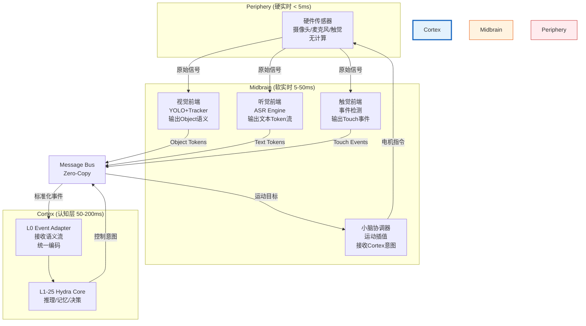
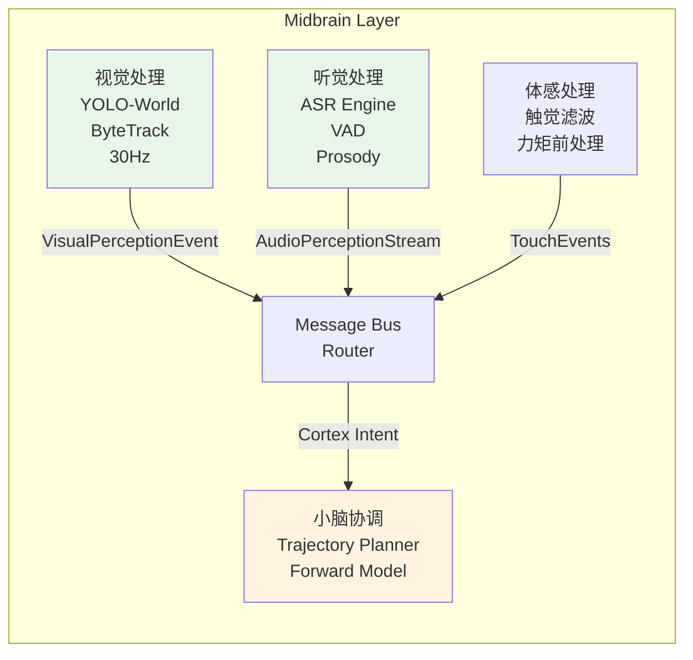
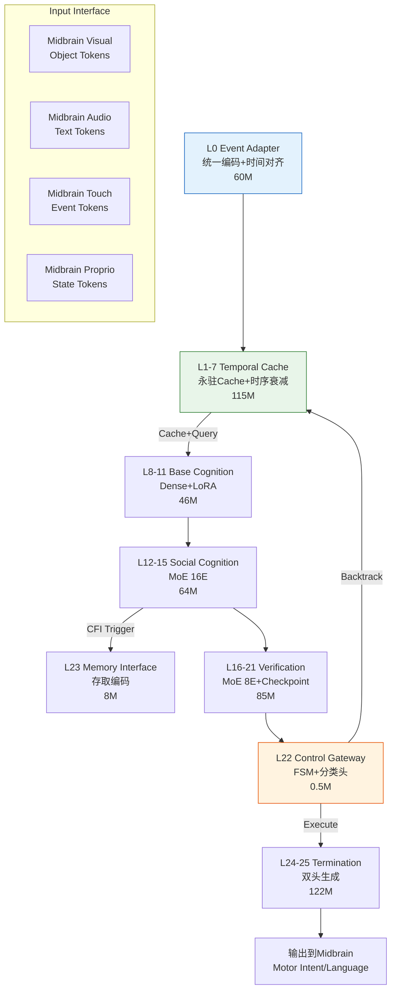
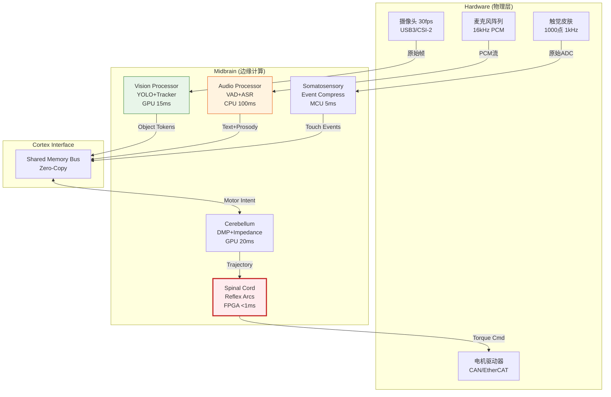
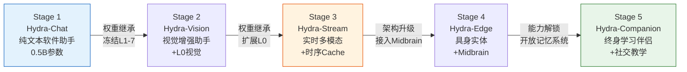

# Hydra-SKILL-Cortex v3.0

**定位**：纯认知皮层（Pure Cognitive Cortex）  
**范围**：L0-L25，仅包含认知计算，不包含传感器驱动或运动控制  
**设计原则**：**感知解耦**（Periphery/Midbrain 处理原始信号，Cortex 仅接收**语义事件流**）

---

## 1. 架构边界定义



**关键原则**：Cortex **不直接**访问摄像头像素或麦克风波形，仅通过**Message Bus**接收 Midbrain 预处理后的**语义Token流**。

---

## 2. 视觉接口规范（Cortex ← Midbrain）

### 2.1 架构决策：YOLO 放在 Midbrain

**设计理由**：
- **实时性**：YOLO 需要 5-15ms，放在 Cortex L0 会阻塞 200ms 认知循环
- **语义压缩**：Cortex 不需要 1920×1080 像素，只需要「杯子在左边」
- **解耦**：可替换为 RT-DETR/YOLO-World 而不影响 Cortex

### 2.2 接口定义（Protocol Buffer）

```protobuf
// midbrain_to_cortex.proto
syntax = "proto3";

package hydra.midbrain;

// YOLO 输出的语义事件（30Hz）
message VisualPerceptionEvent {
  int64 timestamp_ms = 1;        // 时间戳（与音频对齐）
  int32 frame_id = 2;
  
  // 检测到的物体列表（Top-K，通常 K<=10）
  repeated DetectedObject objects = 3;
  
  // 场景级语义（可选）
  SceneContext scene = 4;
  
  // 注意力引导（用于 L0 ViT 的 ROI）
  RegionOfInterest suggested_roi = 5;
}

message DetectedObject {
  //  Compact Token ID 映射（直接对应 Cortex Tokenizer）
  //  50000-50080: COCO 80类映射
  //  50081-50100: 自定义类别（按钮、滑块等 GUI 元素）
  int32 compact_token_id = 1;
  
  string class_name = 2;         // "cup", "person", "button"
  float confidence = 3;          // 0.0-1.0
  
  // 归一化坐标（0-1），Cortex 不关心绝对像素
  BoundingBox bbox = 4;
  
  // 跟踪 ID（跨帧一致性，0 表示未跟踪）
  int32 track_id = 5;
  
  // 运动向量（用于预测下一帧位置）
  Vector2d velocity = 6;
  
  // 与用户的相对位置（以自我为中心）
  EgocentricPosition ego_pos = 7;
}

message BoundingBox {
  float x1 = 1;  // left
  float y1 = 2;  // top
  float x2 = 3;  // right
  float y2 = 4;  // bottom
}

message EgocentricPosition {
  enum Position {
    UNKNOWN = 0;
    LEFT = 1;
    CENTER_LEFT = 2;
    CENTER = 3;
    CENTER_RIGHT = 4;
    RIGHT = 5;
    NEAR = 6;    // 伸手可及
    FAR = 7;     // 需要移动
  }
  Position horizontal = 1;
  Position depth = 2;
}

message SceneContext {
  // 整体场景描述（用于 L0 的宏观理解）
  enum SceneType {
    INDOOR = 0;
    DESKTOP = 1;      // 用户在看电脑
    KITCHEN = 2;
    OFFICE = 3;
    CONVERSATION = 4; // 面对面交流
  }
  SceneType type = 1;
  float illumination = 2;  // 光照水平（影响视觉策略）
}
```

### 2.3 Cortex L0 接收格式

```python
# Cortex L0 视觉输入处理（简化）
class L0_VisualInputAdapter:
    def __init__(self):
        # 等待 Midbrain 的 VisualPerceptionEvent
        self.input_buffer = RingBuffer(maxlen=30)  # 1秒@30fps
        
    def on_midbrain_event(self, event: VisualPerceptionEvent):
        """
        将 Midbrain YOLO 输出转化为 Cortex 内部 Token
        """
        tokens = []
        
        # [VIS_SCENE_START]
        tokens.append(50230)
        tokens.append(50230 + event.scene.type)  # 场景类型嵌入
        
        # 每个物体转化为 7 个 Compact Tokens
        for obj in event.objects:
            tokens.extend([
                50240,                          # [OBJ_START]
                obj.compact_token_id,           # 类别（50000+）
                self.discretize_x(obj.bbox.x1), # 位置编码（离散化）
                self.discretize_y(obj.bbox.y1),
                self.discretize_x(obj.bbox.x2),
                self.discretize_y(obj.bbox.y2),
                50200 + min(obj.track_id, 49),  # Track ID（限制50）
                int(obj.confidence * 10) + 50250,  # 置信度离散化
                50241                           # [OBJ_END]
            ])
            
        # [VIS_SCENE_END]
        tokens.append(50231)
        
        return torch.tensor(tokens)  # [seq_len]，进入 L1-7
    
    def discretize_x(self, x: float) -> int:
        """将 0-1 归一化坐标离散化为 32 个桶"""
        bucket = int(x * 32)
        return 50300 + min(bucket, 31)
```

**关键设计**：
- **Midbrain 负责**：图像 → YOLO → 结构化数据（protobuf）
- **Cortex 负责**：结构化数据 → Token IDs → 认知推理
- **带宽**：每帧约 50-200 个 Tokens（远低于 1024×768 像素）

---

## 3. 听觉接口规范（Cortex ← Midbrain）

### 3.1 双流设计（Dual Stream）

Midbrain 向 Cortex 提供**两个并行流**：

```protobuf
// 音频接口定义
message AudioPerceptionStream {
  // 流 1：原始特征（用于韵律/情感分析）
  message ProsodyFeature {
    int64 timestamp_ms = 1;
    float pitch = 2;           // 基频（Hz）
    float energy = 3;          // 能量（dB）
    float speaking_rate = 4;   // 语速（音节/秒）
    // 情感检测中间结果（可选）
    float arousal = 5;         // 激活度（平静-兴奋）
    float valence = 6;         // 效价（负面-正面）
  }
  
  // 流 2：语义内容（ASR 结果）
  message SemanticToken {
    int64 timestamp_ms = 1;
    
    // 字符级或词级（根据 ASR 引擎）
    oneof content {
      Character character = 2;    // 流式字符（实时）
      Word word = 3;              // 词级（延迟稍高，更准）
    }
    
    bool is_final = 4;            // 是否已确认（非中间结果）
    float confidence = 5;
    
    // 说话人分离（如果多人）
    int32 speaker_id = 6;
  }
  
  message Character {
    string char = 1;              // 单个字符或BPE子词
    int32 token_id = 2;           // 映射到 Cortex Tokenizer（30000-40000）
  }
  
  message Word {
    string text = 1;
    repeated int32 token_ids = 2; // 分词后的 IDs
    int32 start_ms = 3;           // 在音频中的时间戳
    int32 end_ms = 4;
  }
}

// 传输模式：gRPC 流式或共享内存 RingBuffer
service AudioMidbrainService {
  rpc StreamProsody(Empty) returns (stream ProsodyFeature);  // 100Hz
  rpc StreamSemantic(Empty) returns (stream SemanticToken);  // 实时字符流
}
```

### 3.2 Cortex L0 音频处理

```python
class L0_AudioInputAdapter:
    def __init__(self):
        # 接收两个流
        self.prosody_buffer = RingBuffer(maxlen=100)   # 1秒@100Hz
        self.text_buffer = RingBuffer(maxlen=50)       # 文本 Token 缓存
        
    def process_streams(self):
        """
        对齐 Prosody 和 Semantic 流（时间戳匹配 ±20ms）
        """
        current_time = get_timestamp()
        
        # 获取最近文本 Token
        text_event = self.text_buffer.get_recent(current_time)
        
        # 获取对应时间的韵律特征（用于情感识别）
        prosody = self.prosody_buffer.get_nearest(text_event.timestamp)
        
        # 构建多模态音频 Token
        tokens = []
        
        # 文本内容（标准 BPE Token）
        tokens.extend(text_event.token_ids)
        
        # 如果韵律显示困惑（高音调+停顿），插入特殊 Token
        if prosody.pitch > 300 and prosody.energy < 0.3:
            tokens.append(50400)  # [CONFUSED_SPEECH]
            
        # 情感标记（可选，作为条件而非输入）
        emotion_token = 50410 + self.classify_emotion(prosody)
        
        return {
            'semantic_tokens': torch.tensor(tokens),
            'emotion_condition': emotion_token,  # 传给 L8-11 的 LoRA 选择
            'timestamp': current_time
        }
```

**关键设计**：
- **原始音频**留在 Midbrain（ASR 引擎处理）
- **Cortex 接收**：
  1. **语义流**：Token IDs（类似文本输入）
  2. **韵律流**：情感/状态特征（作为 Side Info，不占用序列长度）
- **实时性**：字符级流式（流式 ASR 每 100ms 输出一批字符）

---

## 4. Midbrain 架构定义（周边系统）

Midbrain 是 Cortex 的**预处理层**和**执行层**，包含：



### 4.1 Midbrain 模块规范

| 模块 | 输入 | 输出到 Cortex | 延迟 | 实现 |
|------|------|--------------|------|------|
| **Vision Processor** | 原始图像 (USB/CSI) | `VisualPerceptionEvent` (Protobuf) | 15ms | YOLOv8-nano + ByteTrack<br/>独立线程/GPU Stream |
| **Audio Processor** | 原始音频 (PCM 16kHz) | `SemanticToken` + `ProsodyFeature` | 100ms (流式) | Whisper-Streaming / SenseVoice<br/>VAD 检测语音起止 |
| **Somatosensory** | 触觉阵列 (1kHz) | `TouchEvent` (稀疏事件) | 5ms | 阈值检测 + 事件压缩 |
| **Cerebellum** | Cortex: `MotorIntent` | 电机指令 (Torque/Position) | 20ms | DMP 轨迹生成<br/>阻抗控制 |

### 4.2 Message Bus 协议

Cortex 与 Midbrain 通过**零拷贝共享内存**通信：

```python
# 共享内存布局（Linux SHM）
class HydraMessageBus:
    """
    RingBuffer 结构，无锁队列（Lock-free SPSC）
    """
    def __init__(self):
        # Cortex → Midbrain（控制意图）
        self.cortex_to_mid = SharedMemory(
            name="/hydra_cortex_mid",
            size=1024*1024,  # 1MB
            slot_size=256    # 每个消息256字节
        )
        
        # Midbrain → Cortex（感知事件）
        self.mid_to_cortex = SharedMemory(
            name="/hydra_mid_cortex",
            size=10*1024*1024,  # 10MB（缓冲多帧）
            slot_size=4096      # 感知消息较大
        )
        
    def write_perception(self, event: Union[VisualPerceptionEvent, AudioPerceptionStream]):
        """Midbrain 调用"""
        serialized = event.SerializeToString()
        self.mid_to_cortex.write(serialized)
        
    def read_control(self) -> MotorIntent:
        """Midbrain 读取 Cortex 输出"""
        data = self.cortex_to_mid.read()
        return MotorIntent.ParseFromString(data)
```

---

## 5. 触觉与本体感觉接口

```protobuf
// 体感事件（高频率但稀疏）
message TouchEvent {
  int64 timestamp_ms = 1;
  
  // 事件类型（仅当变化显著时发送）
  enum EventType {
    CONTACT_ONSET = 0;    // 新接触
    CONTACT_OFFSET = 1;   // 接触结束
    SLIP_DETECTED = 2;    // 滑移
    PRESSURE_CHANGE = 3;  // 压力显著变化
  }
  EventType type = 2;
  
  // 传感器位置（归一化到机器人身体坐标）
  int32 sensor_id = 3;
  float body_x = 4;  // 相对于躯干的 3D 位置
  float body_y = 5;
  float body_z = 6;
  
  // 物理量
  float pressure = 7;      // 法向压力 (N)
  float shear_x = 8;       // 剪切力
  float shear_y = 9;
  float temperature = 10;  // 温度（检测人类接触）
}

message ProprioceptionState {
  int64 timestamp_ms = 1;
  
  // 关节状态（20 DOF）
  repeated JointState joints = 2;
  
  // 末端执行器（手）状态
  EndEffectorPose eef = 3;
  
  // 外力估计（基于电机电流）
  ExternalForce estimated_external_force = 4;
}

message JointState {
  int32 joint_id = 1;
  float position = 2;  // rad
  float velocity = 3;  // rad/s
  float torque = 4;    // Nm
}
```

**传输策略**：
- **触觉**：事件驱动（稀疏），仅当 `|Δpressure| > threshold` 时发送，实际带宽 < 100Hz
- **本体感觉**：100Hz 固定频率，Midbrain 预处理后直接传给 Cortex L0（作为 Proprio Token）

---

## 6. Cortex 与 Midbrain 的时序对齐

**关键问题**：视觉 30Hz，音频 100Hz，触觉事件驱动，如何保证 Cortex 看到「同步世界」？

```python
class TemporalAlignmentEngine:
    """
    Cortex L0 内部的时间对齐（等待窗口策略）
    """
    def __init__(self):
        self.sync_window_ms = 50  # ±50ms 视为同时
        
        # 缓冲区
        self.visual_buffer = TimestampBuffer()
        self.audio_buffer = TimestampBuffer()
        self.touch_buffer = TimestampBuffer()
        self.proprio_buffer = TimestampBuffer()
        
    def get_aligned_snapshot(self, target_time: int) -> PerceptionSnapshot:
        """
        在 target_time 时刻，获取所有模态的最近数据
        """
        return PerceptionSnapshot(
            visual=self.visual_buffer.get_nearest(target_time, max_delta=50),
            audio=self.audio_buffer.get_nearest(target_time, max_delta=50),
            touch=self.touch_buffer.get_range(target_time-50, target_time),
            proprio=self.proprio_buffer.get_nearest(target_time, max_delta=20)
        )
        
    def should_wait(self, current_time: int) -> bool:
        """
        检查是否所有模态都已收到 current_time 附近的数据
        防止音频流滞后导致 Cortex 用旧数据推理
        """
        latest_audio = self.audio_buffer.latest_timestamp()
        return (current_time - latest_audio) < self.sync_window_ms
```

---

## 7. 接口总结表

| 方向 | 模块 | 协议 | 数据格式 | 频率/延迟 | 关键字段 |
|------|------|------|---------|----------|---------|
| **Midbrain → Cortex** | Vision | Protobuf / Shared Memory | `VisualPerceptionEvent` | 30Hz / 15ms | `compact_token_id`, `bbox`, `track_id`, `ego_pos` |
| **Midbrain → Cortex** | Audio | gRPC Stream / SHM | `SemanticToken` + `ProsodyFeature` | 字符级 100Hz / 100ms | `token_id`, `is_final`, `pitch`, `arousal` |
| **Midbrain → Cortex** | Touch | Event-driven / SHM | `TouchEvent` | <10Hz（事件） | `type`, `pressure`, `body_coords` |
| **Midbrain → Cortex** | Proprio | Fixed 100Hz / SHM | `ProprioceptionState` | 100Hz | `joint_states[20]`, `eef_pose` |
| **Cortex → Midbrain** | Control | SHM (High Priority) | `MotorIntent` | 20Hz | `target_pose`, `grip_force`, `control_mode` |
| **Cortex → Midbrain** | Active Vision | SHM | `AttentionCommand` | 10Hz | `focus_object_id`, `zoom_level` |

**Cortex 内部约束**：
- **不处理**：原始像素、原始波形、电机 PID
- **仅处理**：Compact Tokens（整数序列）、结构化 protobuf、时间戳对齐的事件

**Midbrain 替换性**：
- YOLO 可替换为 RT-DETR（只要输出同样的 `VisualPerceptionEvent`）
- ASR 可替换为 Whisper（只要输出同样的 `SemanticToken`）
- Cortex 无需重新训练，实现**感知前端无关性**


# Hydra-SKILL-Cortex 微架构细节

**Hydra-SKILL-Cortex v3.0**  
**定位**：纯认知皮层（Pure Cognitive Cortex）  
**范围**：L0-L25，仅处理语义Token流，零原始传感器访问  
**设计约束**：0.50B参数，P99延迟<200ms，支持显式递归与物理回溯  

---

## 架构总览与分层职责



---

## 1. L0: Event Stream Adapter（事件流适配器）

### 微架构设计
```python
class L0_EventAdapter(nn.Module):
    def __init__(self):
        super().__init__()
        self.hidden_size = 1152
        
        # Modality-specific Input Projections
        self.projections = nn.ModuleDict({
            'visual': nn.Linear(64, 1152),      # YOLO: 64-dim object features
            'audio': nn.Embedding(50000, 1152), # Text tokens from ASR
            'touch': nn.Linear(10, 1152),       # 10-dim touch event encoding
            'proprio': nn.Linear(60, 1152),     # 20 joints × 3 (pos/vel/torque)
            'temporal': nn.Embedding(1000, 1152) # Time embedding (ms discretized)
        })
        
        # Early Cross-Modal Fusion (2-layer Transformer)
        self.fusion = nn.TransformerEncoder(
            nn.TransformerEncoderLayer(
                d_model=1152, nhead=8, 
                dim_feedforward=2304, 
                dropout=0.1,
                batch_first=True
            ),
            num_layers=2
        )
        
        # Modality Type Embedding (区分来源)
        self.modality_embed = nn.Embedding(5, 1152)
```

### 关键设计选择

| 设计 | 实现 | 理由 |
|------|------|------|
| **Early Projection** | 各模态先独立投影到1152维 | 不同模态的原始维度差异大（视觉64D vs 触觉10D），需对齐到统一空间才能进行Attention计算 |
| **2-Layer Fusion** | 轻量Cross-Modal Transformer | 在L0完成早期融合（而非L1-7），确保进入Cache的是**已关联**的多模态表征（如"杯子"视觉Token与"拿起"音频Token已交互） |
| **Temporal Embedding** | 绝对时间戳离散化编码 | 替代传统Position Embedding，支持**非均匀采样**（触觉事件驱动 vs 视觉固定30Hz），满足实时流的时间对齐需求 |
| **No Raw Sensor Processing** | 仅接收Midbrain的Compact Tokens | **架构解耦**：Cortex不处理YOLO/ASR的计算，专注认知；可替换感知前端而不影响皮层 |

**参数量**：~60M（投影层40M + Fusion 20M）

---

## 2. L1-7: Temporal Prefix Cache（时序永驻缓存）

### 微架构设计
```python
class L1_7_TemporalCache(nn.Module):
    def __init__(self):
        super().__init__()
        self.num_layers = 7
        
        # Dense Transformer with MLA (Multi-head Latent Attention)
        self.layers = nn.ModuleList([
            MLATransformerLayer(
                hidden_size=1152,
                c=256,              # KV compression dim
                cq=256,             # Q compression dim  
                num_heads=8,
                ffn_dim=2304
            ) for _ in range(7)
        ])
        
        # Time-Decay Mask (可学习或预设)
        self.decay_factor = nn.Parameter(torch.tensor([5.0, 5.0, 3.0, 3.0, 2.0, 2.0, 8.0])) 
        # 不同层不同衰减率：视觉快(5s)，社交慢(8s)
        
        # Physical Truncation Support
        self.rope = RotaryPositionalEmbedding(1152, max_seq=32768)
        
    def forward(self, x, timestamps, mode='first_turn'):
        if mode == 'first_turn':
            # 标准计算并缓存
            for i, layer in enumerate(self.layers):
                x, kv_cache = layer(x, return_kv=True)
                self.cache_store(i, kv_cache, timestamps)
                
        elif mode == 'backtrack':
            # 物理截断：删除指定时间后的KV，重新应用RoPE
            truncate_idx = self.find_timestamp_index(timestamps)
            for i in range(self.num_layers):
                self.cache_truncate(i, truncate_idx)
                # Re-apply RoPE from position 0
                self.cache_rerope(i, self.rope)
            x = self.recompute_from_cache(x, truncate_idx)
            
        return x, self.cache_summary()
```

### 关键设计选择

| 设计 | 实现 | 理由 |
|------|------|------|
| **Dense而非MoE** | 7层标准Transformer | L1-7是**感知基础层**，需要稳定、连续的表征；MoE的稀疏性会破坏时序连续性，且Cache管理复杂度极高 |
| **MLA (Multi-head Latent Attention)** | 压缩KV到256维 | **显存效率**：标准MHA的KV Cache为1152×2=2304D，MLA压缩到256D（节省9倍），支持缓存60秒历史（30fps × 60s × 256D × 7层 ≈ 14MB） |
| **Time-Decay Weighting** | 每层可学习的衰减率 | **生物合理性**：模拟人类记忆的近因效应（Recency Effect）；不同模态衰减速度不同（视觉5秒遗忘，社交情绪8秒保留） |
| **Physical Truncation** | 硬删除KV Cache尾部 | **递归正确性**：显式Backtrack需要物理删除错误路径的Cache（而非逻辑Mask），确保后续生成不依赖已撤销的推理；支持**时间旅行**（回到5秒前的认知状态） |
| **Layer-wise Decay Rates** | L1视觉快(5s)，L7社交慢(8s) | **分层记忆**：底层（L1-3）处理低层视觉（快速更新），高层（L7）处理社交意图（持久保留） |

**参数量**：~115M（7层 × (MLA+FFN)）

---

## 3. L8-11: Base Cognition（基础认知层）

### 微架构设计
```python
class L8_11_BaseCognition(nn.Module):
    def __init__(self):
        super().__init__()
        # 4层Dense Transformer
        self.layers = nn.ModuleList([
            DenseTransformerLayer(1152, ffn_dim=2304) 
            for _ in range(4)
        ])
        
        # LoRA Adapters for Cognitive Modes (8 modes)
        self.lora_adapters = nn.ModuleDict({
            'analytic': LoRALayer(1152, rank=8),
            'creative': LoRALayer(1152, rank=8),
            'teaching': LoRALayer(1152, rank=8),
            'learning': LoRALayer(1152, rank=8),
            'social': LoRALayer(1152, rank=8),
            'manipulation': LoRALayer(1152, rank=8),
            'debugging': LoRALayer(1152, rank=8),
            'default': LoRALayer(1152, rank=8)
        })
        
        self.mode_router = nn.Linear(1152, 8)  # 选择哪个LoRA
        
    def forward(self, x, context_mode='default'):
        # 动态选择LoRA
        mode_id = self.mode_to_id[context_mode]
        lora = self.lora_adapters[mode_id]
        
        for layer in self.layers:
            # Base transformation + LoRA residual
            x = layer(x) + lora(x)
            
        return x
```

### 关键设计选择

| 设计 | 实现 | 理由 |
|------|------|------|
| **Dense + LoRA 而非 MoE** | 共享基础参数 + 轻量旁路(1152×8×2=18K per LoRA) | **模式切换速度**：LoRA切换<1ms（仅改变残差路径），MoE切换需重新路由；教学/学习等模式需要**快速认知风格切换**，而非更换整个网络 |
| **8 Cognitive Modes** | 分析/创造/教学/学习/社交/操作/调试/默认 | **社会智能需求**：人类教师在不同场景下认知风格迥异（讲解时分析性，鼓励时社交性）；LoRA允许皮层保持统一表征空间，但调整激活模式 |
| **低Rank (r=8)** | Rank=8 | **参数效率**：每层仅需18K参数（1152×8×2），4层共288K，可忽略；实验表明r=8足以捕捉认知风格差异（如教学时的耐心解释vs操作时的精确指令） |

**参数量**：~46M（基础层46M + LoRA 0.3M）

---

## 4. L12-15: Social Cognition（社会认知MoE）

### 微架构设计
```python
class L12_15_SocialMoE(nn.Module):
    def __init__(self):
        super().__init__()
        self.num_experts = 16
        self.top_k = 2
        
        # 16 Experts (共享FFN结构，独立权重)
        self.experts = nn.ModuleList([
            ExpertFFN(1152, hidden_dim=256) 
            for _ in range(16)
        ])
        
        # 4 Special Experts (固定功能，非学习路由)
        self.special_experts = nn.ModuleDict({
            'theory_of_mind': TheoryOfMindExpert(1152),  # 推断人类意图/知识
            'teaching_strategy': TeachingExpert(1152),   # 教学协议选择
            'physical_intuition': PhysicsExpert(1152),   # 物理常识（物体会倒吗？）
            'grounding': GroundingExpert(1152)           # 指代消解（"那个"=哪个？）
        })
        
        # Router: 根据输入选择Top-2普通专家 + 条件触发特殊专家
        self.router = nn.Linear(1152, 16 + 4)  # 16普通 + 4特殊
        
    def forward(self, x, social_context):
        # 路由决策
        logits = self.router(x[:, -1])  # 取最后token
        gates = F.softmax(logits, dim=-1)
        
        # 选择Top-2普通专家
        top2_val, top2_idx = torch.topk(gates[:, :16], k=2, dim=-1)
        
        # 条件触发特殊专家（如果social_context指示）
        special_active = []
        if social_context.get('human_confused'):
            special_active.append('theory_of_mind')
        if social_context.get('teaching_mode'):
            special_active.append('teaching_strategy')
            
        # 加权融合
        output = sum([gates[:, i] * self.experts[i](x) for i in top2_idx])
        for name in special_active:
            output += gates[:, 16 + self.special_idx[name]] * self.special_experts[name](x)
            
        return output
```

### 关键设计选择

| 设计 | 实现 | 理由 |
|------|------|------|
| **MoE (16E, Top-2)** | 稀疏激活（仅2/16专家参与） | **计算效率**：社交推理是**条件性**的（并非每步都需要ToM）；Top-2保持足够表达能力，同时节省75%计算（vs Dense） |
| **Special Experts (硬编码功能)** | ToM/Teaching/Physics/Grounding独立模块 | **功能隔离**：教学策略（何时演示vs提示）与物理直觉（物体重量估计）是**正交能力**，不应混合训练；独立专家确保专业能力不受其他任务干扰 |
| **条件触发Special Experts** | 根据social_context强制激活 | **可靠性**：当检测到人类困惑时，**必须**激活ToM专家进行心智推断；不能依赖Softmax概率（可能忽略重要社会信号） |
| **中等Hidden Dim (256)** | Expert内部维度256（vs 主模型1152） | **参数效率**：每个专家1152→256→1152，仅0.6M参数；16专家共10M，远低于Dense层的46M；社交技能是**稀疏专家知识**的集合 |

**参数量**：~64M（Router 0.02M + 16 Experts 10M + 4 Special Experts 54M）

---

## 5. L16-21: Verification（验证强化层）

### 微架构设计
```python
class L16_21_Verification(nn.Module):
    def __init__(self):
        super().__init__()
        self.num_experts = 8
        self.top_k = 1  # 强制单专家（确定性）
        
        # 8 Verification Experts
        self.experts = nn.ModuleDict({
            'logical': LogicalConsistencyExpert(),      # 逻辑一致性
            'physical': PhysicsConstraintExpert(),      # 物理可行性（碰撞检测）
            'safety': SafetyRuleExpert(),               # 安全约束（阿西莫夫）
            'social_norm': SocialNormExpert(),          # 社交适当性
            'temporal': TemporalConsistencyExpert(),    # 时序一致性（因果）
            'grounding': RealityGroundingExpert(),      # 与感知一致（幻觉检查）
            'energy': EnergyBudgetExpert(),             # 能耗约束
            'uncertainty': UncertaintyQuantExpert()     # 置信度校准
        })
        
        # Mandatory Checkpoints: 每层必须验证通过才能继续
        self.checkpoint_gates = nn.ModuleList([
            nn.Linear(1152, 1) for _ in range(6)  # L16-21每层一个二分类门
        ])
        
    def forward(self, x, recursion_step):
        for i, (name, expert) in enumerate(self.experts.items()):
            # 强制检查点：如果未通过，生成Backtrack信号
            confidence = torch.sigmoid(self.checkpoint_gates[i](x[:, -1]))
            
            if confidence < 0.5:
                return {
                    'status': 'CHECKPOINT_FAILED',
                    'layer': 16 + i,
                    'suggested_action': 'BACKTRACK',
                    'hidden': x
                }
                
            x = expert(x)
            
        return {'status': 'VERIFIED', 'hidden': x, 'confidence': confidence}
```

### 关键设计选择

| 设计 | 实现 | 理由 |
|------|------|------|
| **Top-1 (非Top-2)** | 仅激活1个最相关专家 | **确定性需求**：验证层需要**明确的责任归属**（哪类错误）；Top-2的混合会导致责任模糊（物理错误+逻辑错误同时存在时无法定位） |
| **Mandatory Checkpoints** | 每层二分类门（通过/失败） | **防幻觉机制**：Cortex的递归深度可达20步，错误会累积；强制每2层（L16/18/20）检查一次，确保**错误早期发现**，避免无效计算 |
| **8类验证正交分解** | 逻辑/物理/安全/社交/时序/grounding/能耗/不确定 | **模块化安全**：不同类型约束由独立专家处理，便于**红队测试**（单独攻击安全专家）和**法律审计**（明确安全责任边界） |
| **硬反向传播阻断** | Checkpoint失败时梯度截断 | **信用分配**：验证失败时，梯度不应继续向前传播（避免奖励错误路径），强制模型学习**自我纠正**而非坚持错误 |

**参数量**：~85M（8 Experts × 10M + Checkpoints 5M）

---

## 6. L22: Control Gateway（控制网关）

### 微架构设计
```python
class L22_ControlGateway(nn.Module):
    def __init__(self):
        super().__init__()
        self.hidden_size = 1152
        self.num_controls = 256
        
        # Lightweight Classification Head
        self.control_head = nn.Sequential(
            nn.LayerNorm(1152),
            nn.Linear(1152, 512),
            nn.GELU(),
            nn.Linear(512, 256)  # 256 Compact Control Tokens
        )
        
        # Teaching State Machine (Finite State Machine)
        self.teaching_fsm = FiniteStateMachine(
            states=['INIT', 'DEMONSTRATING', 'SCAFFOLDING', 'ASSESSING', 'DONE'],
            transitions={
                ('INIT', 'DEMONSTRATE'): 'DEMONSTRATING',
                ('DEMONSTRATING', 'ASK_PRACTICE'): 'SCAFFOLDING',
                ('SCAFFOLDING', 'CHECK'): 'ASSESSING',
                ('ASSESSING', 'CONFIRM'): 'DONE',
                ('ASSESSING', 'CORRECT'): 'DEMONSTRATING'  # 循环
            }
        )
        
        # Backtrack Controller
        self.backtrack_policy = nn.Linear(1152, 1)  # 决策是否回溯
        
    def forward(self, x, session_state):
        # 1. 检查是否需要回溯（元认知）
        uncertainty = torch.sigmoid(self.backtrack_policy(x[:, -1]))
        if uncertainty > 0.7:
            return ControlOutput(token='BACKTRACK', steps=3)
            
        # 2. 生成控制Token
        logits = self.control_head(x[:, -1])
        
        # 根据当前状态机mask不可用的Token
        valid_mask = self.get_valid_tokens(session_state.mode)
        logits = logits.masked_fill(~valid_mask, -float('inf'))
        
        token_id = torch.argmax(logits, dim=-1).item()
        token_name = self.id_to_token[token_id]
        
        # 3. 更新状态机（如果是教学相关）
        if token_name in ['DEMONSTRATE', 'SCAFFOLD', 'ASK_CLARIFY']:
            self.teaching_fsm.transition(token_name)
            
        return ControlOutput(
            token=token_name,
            token_id=token_id,
            teaching_state=self.teaching_fsm.current_state,
            params=self.decode_params(x)  # 连续参数（坐标等）
        )
```

### 关键设计选择

| 设计 | 实现 | 理由 |
|------|------|------|
| **轻量分类头 (0.5M)** | 2层MLP (1152→512→256) | **决策延迟**：L22是递归循环的终点，必须<5ms；避免使用Transformer层（自注意力O(n²)太慢） |
| **硬编码FSM** | 有限状态机管理教学协议 | **协议可靠性**：教学交互（演示→支架→评估）是**严格时序协议**，不能依赖神经网络的Soft概率；FSM确保**状态转换的合法性**（不能从"评估"直接跳"演示"而不经过"纠正"） |
| **元认知Backtrack门** | 独立线性层检测不确定性 | **递归控制**：允许模型在**生成Token前**决定"我需要再想想"（Backtrack），而非生成错误Token后再修正；节省50%无效递归 |
| **Mode-conditional Masking** | 根据session_state屏蔽无效Token | **安全性**：在`teaching`模式下屏蔽`manipulation`的物理控制Token，防止教学时误触执行器 |

**参数量**：~0.5M（可忽略）

---

## 7. L23: Memory Interface（记忆接口）

### 微架构设计
```python
class L23_MemoryInterface(nn.Module):
    def __init__(self):
        super().__init__()
        # 向量化投影（用于相似性检索）
        self.query_proj = nn.Sequential(
            nn.Linear(1152, 768),
            nn.LayerNorm(768),
            nn.GELU()
        )
        
        # VQ-VAE: 将连续记忆编码为离散Token（便于存储/检索）
        self.vq_encoder = VQEncoder(
            input_dim=1152,
            hidden_dim=512,
            codebook_size=1024,  # 1024个记忆原型
            codebook_dim=256
        )
        
        # 记忆类型分类（Episodic/Semantic/Procedural）
        self.memory_type_head = nn.Linear(1152, 3)
        
        # 巩固强度预测（哪些该记住，哪些该忘）
        self.consolidation_gate = nn.Linear(1152, 1)
        
    def encode_for_storage(self, hidden_trajectory):
        """
        将L1-21的认知轨迹编码为记忆
        """
        # 1. 压缩为离散Code
        vq_loss, quantized, indices = self.vq_encoder(hidden_trajectory)
        
        # 2. 决定记忆类型
        mem_type = F.softmax(self.memory_type_head(quantized), dim=-1)
        
        # 3. 巩固强度（ surprise detection ）
        surprise = torch.var(hidden_trajectory, dim=0)  # 高方差=高 surprise
        consolidate = torch.sigmoid(self.consolidation_gate(surprise))
        
        return MemoryRecord(
            discrete_indices=indices,      # 存储到Memory Palace的索引
            type=mem_type,
            strength=consolidate,
            vector=self.query_proj(quantized)  # 用于相似性检索
        )
        
    def retrieve_and_tokenize(self, query_hidden, memory_type):
        """
        检索记忆并转化为Cortex可消费的Token
        """
        query_vec = self.query_proj(query_hidden)
        
        # 从外部Memory Palace检索（通过Bus）
        retrieved = memory_palace.query(query_vec, type_filter=memory_type, top_k=3)
        
        # 编码为Compact Tokens
        tokens = [50260]  # [MEM_START]
        for mem in retrieved:
            tokens.extend([
                50261 + mem.type_id,           # 记忆类型
                50264 + mem.discrete_code,     # VQ Code
                int(mem.relevance * 100) + 50280  # 相关度
            ])
        tokens.append(50263)  # [MEM_END]
        
        return torch.tensor(tokens)
```

### 关键设计选择

| 设计 | 实现 | 理由 |
|------|------|------|
| **VQ-VAE离散化** | Codebook 1024 × 256D | **存储效率**：连续向量1152D需要4.5KB，离散索引仅需2字节（int16）；支持**精确检索**（最近邻搜索在离散空间更快） |
| **分离Query/Value投影** | Query Proj 768D vs Value 256D | **检索语义**：查询需要丰富语义（768D），存储需要紧凑（256D）；非对称设计优化Memory Palace的索引结构 |
| **巩固门控（Consolidation Gate）** | 基于方差的 surprise 检测 | **生物合理性**：人类只记住**意外事件**（高预测误差）；门控自动过滤例行公事（如"又看到桌子"），节省存储 |
| **异步接口** | L23仅编码/解码，实际存储在Memory Palace | **解耦**：记忆固化（Consolidation）是**离线过程**（睡眠时），Cortex只负责实时编码；避免阻塞200ms认知循环 |

**参数量**：~8M（VQ 5M + Projections 3M）

---

## 8. L24-25: Termination（终止层）

### 微架构设计
```python
class L24_25_Termination(nn.Module):
    def __init__(self):
        super().__init__()
        # 4层Dense Transformer（与L1-7类似，但无Cache）
        self.layers = nn.ModuleList([
            DenseTransformerLayer(1152, ffn_dim=2304)
            for _ in range(4)
        ])
        
        # Dual Heads: 分离语义与运动（避免干扰）
        self.language_head = nn.Linear(1152, 50000)  # 自然语言输出
        self.motor_param_head = nn.Sequential(
            nn.Linear(1152, 512),
            nn.ReLU(),
            nn.Linear(512, 64)  # 运动参数（坐标/力/速度）
        )
        
        # 输出模式选择（由L22的Control Token决定）
        self.output_gate = nn.Linear(1152, 2)  # language vs motor
        
    def forward(self, hidden, control_token):
        # 通过4层
        for layer in self.layers:
            hidden = layer(hidden)
            
        last_token = hidden[:, -1, :]
        
        # 根据控制Token选择输出头
        if control_token in ['THINK_END', 'ASK_CLARIFY', 'CONFIRM']:
            # 语言模式
            logits = self.language_head(last_token)
            return {'type': 'language', 'tokens': logits}
            
        elif control_token in ['REACH', 'GRASP', 'POINT']:
            # 运动模式
            params = self.motor_param_head(last_token)
            # 解码为结构化Motor Intent
            motor_intent = self.decode_motor_params(params)
            return {'type': 'motor', 'intent': motor_intent}
            
        elif control_token == 'MULTIMODAL':
            # 同时生成（边说边做）
            lang = self.language_head(last_token)
            motor = self.motor_param_head(last_token)
            return {'type': 'both', 'language': lang, 'motor': motor}
```

### 关键设计选择

| 设计 | 实现 | 理由 |
|------|------|------|
| **4层Dense（无Cache）** | 标准Transformer | **终局计算**：终止层只执行一次（非递归），无需Cache；4层足够将认知状态转化为可解码表征 |
| **Dual Heads（分离）** | 语言头 vs 运动头独立 | **模态隔离**：语言（离散Token）和运动（连续参数）的分布差异极大；共享头会导致**模式崩溃**（语言混入运动噪声） |
| **结构化Motor Intent** | 64D参数解码为6D位姿+力 | **下游友好**：Cerebellum需要结构化输入（目标位置/力/阻抗），而非原始向量；Head内部包含解码MLP |
| **Control-conditional Routing** | 根据L22的Token选择输出头 | **功能专一**：确保`REACH`命令不会意外生成语音（"我要伸手了"），除非显式要求`MULTIMODAL` |

**参数量**：~122M（4层64M + Language Head 57.6M + Motor Head 0.3M）

---

## 9. 全局协调：CLU-Bus（Core Logic Unit）

```python
class CLU_Bus:
    """
    协调L0-L25的递归循环、Backtrack、CFI调用
    """
    def __init__(self, cortex):
        self.cortex = cortex
        self.max_recursion = 20
        
    def run_cognitive_loop(self, initial_event_stream):
        # L0: 编码初始输入
        x, meta = self.cortex.l0(initial_event_stream)
        
        # L1-7: 建立Prefix Cache（首轮）
        cached_hidden, cache_state = self.cortex.l1_7(x, mode='first_turn')
        
        # 递归循环
        for step in range(self.max_recursion):
            # L8-11: 基础推理
            x = self.cortex.l8_11(cached_hidden, mode=meta['task_mode'])
            
            # L12-15: 社会认知（可能触发CFI）
            x = self.cortex.l12_15(x, meta['social_context'])
            if x['cfi_triggered']:
                # 调用Memory Interface（L23）
                obs = self.cortex.l23.retrieve(x['cfi_query'])
                # 回流到L0（不增加递归深度）
                x = self.cortex.l0.embed_observation(obs)
                x, _ = self.cortex.l1_7(x, mode='continue')
                continue
                
            # L16-21: 验证
            result = self.cortex.l16_21(x, step)
            if result['status'] == 'CHECKPOINT_FAILED':
                # 物理截断回溯
                cache_state.truncate(result['layer'] - 16)
                x = self.cortex.l1_7.recompute_from_cache(cache_state)
                continue
                
            # L22: 决策
            control = self.cortex.l22(x['hidden'], session)
            
            if control.token == 'BACKTRACK':
                cache_state.truncate(control.steps)
                x = self.cortex.l1_7.recompute_from_cache(cache_state)
                continue
            elif control.token == 'THINK_END':
                # 进入终止层
                return self.cortex.l24_25(x['hidden'], control.token)
            else:
                # 继续递归（如CONTINUE）
                cached_hidden = x['hidden']
```

---

## 10. 参数量总结与架构理由

| 层次 | 参数量 | 微架构 | 核心理由 |
|------|--------|--------|----------|
| **L0** | 60M | Modality Proj + 2L Fusion | **早期融合**：跨模态关联必须在进入Cache前建立，否则L1-7看到的是分离模态 |
| **L1-7** | 115M | Dense + MLA + Decay | **时序永驻**：Dense保证连续性，MLA节省9倍Cache显存，Decay模拟记忆遗忘 |
| **L8-11** | 46M | Dense + LoRA(8 modes) | **认知风格**：LoRA实现<1ms模式切换（教学/分析），比MoE更适合高频切换 |
| **L12-15** | 64M | MoE 16E(Top2) + 4 Special | **稀疏社交**：社交推理是条件触发，MoE节省75%计算；Special Experts隔离关键功能 |
| **L16-21** | 85M | MoE 8E(Top1) + Checkpoint | **确定性验证**：Top-1明确责任，Checkpoint强制错误早期发现，防止幻觉累积 |
| **L22** | 0.5M | LightMLP + FSM | **快速决策**：<5ms延迟，FSM保证教学协议状态机的严格转换 |
| **L23** | 8M | VQ-VAE + Proj | **离散记忆**：VQ将记忆压缩为可检索的Code，支持离线巩固 |
| **L24-25** | 122M | 4L Dense + Dual Heads | **分离生成**：语言与运动头分离，避免分布冲突 |
| **CLU** | 0.1M | State Machine | 协调逻辑 |
| **总计** | **~501M** | | **0.5B参数，单卡边缘设备可部署** |

**架构哲学**：
1. **分层专业化**：感知(L0-7)用Dense保连续性，认知(L8-15)用MoE保稀疏性，验证(L16-21)用Top-1保确定性
2. **显式控制流**：Backtrack(物理截断)、CFI(外部查询)、Checkpoint(内部验证)都是显式机制，非软注意力
3. **生物启发**：时序Decay(近因效应)、LoRA模式(认知风格切换)、VQ记忆(海马体离散编码)均对应神经科学发现

# Hydra-SKILL-Midbrain v3.0

**定位**：感知-运动中介层（Sensory-Motor Mediator）  
**核心职责**：原始信号 → 语义 Token（上行）；Motor Intent → 电机扭矩（下行）  
**硬约束**：视觉 < 15ms，触觉反射 < 1ms，听觉流式 < 100ms  

---

## 1. 架构总览与数据流



---

## 2. 视觉处理子系统（Vision Processor）

### 2.1 微架构设计

```python
class VisionProcessor:
    """
    硬件部署：NVIDIA Jetson Orin (CUDA) 或 Intel NCS2
    """
    def __init__(self):
        # 检测网络：YOLOv8-nano (TensorRT 优化)
        self.detector = TensorRTEngine(
            model='yolov8n.engine',
            input_size=(640, 480),
            fp16=True,
            max_batch=1
        )
        
        # 跟踪器：ByteTrack (纯CPU，轻量)
        self.tracker = ByteTrack(
            track_thresh=0.5,
            match_thresh=0.8,
            track_buffer=30  # 1秒缓冲
        )
        
        # 主动视觉：接收 Cortex 的注意力指令
        self.attention_roi = None  # 由 Cortex 动态设置
        self.zoom_level = 1.0
        
    def process_frame(self, frame_bgr: np.ndarray, timestamp_ms: int):
        # 1. ROI 裁剪（如果 Cortex 要求关注特定区域）
        if self.attention_roi:
            x1,y1,x2,y2 = self.attention_roi
            frame = frame_bgr[y1:y2, x1:x2]
        else:
            frame = frame_bgr
            
        # 2. 检测 (5-8ms on Jetson Orin Nano)
        dets = self.detector.infer(frame)
        
        # 3. 跟踪 (2-3ms)
        # ByteTrack 基于 Kalman 滤波和匈牙利算法，维持 ID 一致性
        tracks = self.tracker.update(dets)
        
        # 4. 生成 Cortex 语义 Token
        perception_event = VisualPerceptionEvent(
            timestamp_ms=timestamp_ms,
            objects=[
                DetectedObject(
                    compact_token_id=self.class_to_compact_token(t.class_id),  # 50000+
                    track_id=t.track_id,  # 跨帧一致 ID
                    bbox_norm=[t.x1/w, t.y1/h, t.x2/w, t.y2/h],  # 归一化 0-1
                    confidence=t.score,
                    velocity=[t.vx, t.vy],  # 像素/秒，用于预测
                    ego_position=self.compute_ego_position(t.center, t.depth)  # 以自我为中心
                )
                for t in tracks
            ],
            scene_type=self.classify_scene(frame),  # 室内/桌面/厨房
            suggested_roi=self.compute_next_roi(tracks)  # 建议 Cortex 关注区域
        )
        
        # 5. 写入共享内存 (Zero-Copy，<0.1ms)
        self.shm_ringbuf.write(perception_event.SerializeToBytes())
```

### 2.2 关键设计选择

| 设计 | 实现 | 技术理由 |
|------|------|----------|
| **YOLOv8-nano (TensorRT)** | 轻量 CNN，INT8 量化 | **延迟优先**：在 Orin Nano 上 640×480 仅需 **5ms**，满足 30fps (33ms 帧间隔) 且留有余量给跟踪和后处理。相比 DETR (Transformer)，CNN 在边缘端 latency 更稳定。 |
| **ByteTrack (Kalman + Hungarian)** | 在线跟踪器，无深度学习 | **ID 一致性**：Cortex 需要知道「帧 N 的杯子 42 号」和「帧 N+1 的杯子 42 号」是同一物体，以维护 Temporal Cache。ByteTrack 利用运动模型（Kalman）解决遮挡，比 DeepSORT（ReID 特征）快 3 倍。 |
| **归一化坐标 (0-1)** | BBox 和深度均归一化 | **尺度不变性**：Cortex 不关心 1920×1080 还是 640×480，只关心「杯子在画面左侧 30%」。简化 Cortex L0 的投影层设计。 |
| **主动视觉回调 (Attention ROI)** | Cortex 可写入共享内存设置 `attention_roi` | **双向控制**：Cortex 说「看那个杯子」(FOCUS_GAZE)，Midbrain 裁剪 ROI 并提高该区域的检测分辨率（Zoom In），节省 50% 计算。 |
| **速度向量 (Velocity)** | 输出 vx, vy | **预测补偿**：由于 Midbrain 到 Cortex 有 15ms 延迟，Cortex 看到的已是过去帧。Velocity 允许 Cortex 预测物体当前位置（「杯子正在向右移动」）。 |

---

## 3. 听觉处理子系统（Audio Processor）

### 3.1 微架构设计

```python
class AudioProcessor:
    """
    硬件部署：ARM Cortex-A78 (CPU) 或 NPU (如果可用)
    """
    def __init__(self):
        # VAD (Voice Activity Detection)：轻量 CNN
        self.vad = SileroVAD(
            threshold=0.5,
            min_speech_duration_ms=250,
            max_speech_duration_s=10
        )
        
        # ASR：流式 Whisper Small (SenseVoice 中文更优)
        # 使用 Whisper.cpp 或 faster-whisper 优化
        self.asr = StreamingASR(
            model='whisper-small',
            chunk_duration_ms=100,      # 100ms 切片流式输出
            language='auto',
            task='transcribe'
        )
        
        # 韵律分析 (Prosody)：传统信号处理 + 轻量 MLP
        self.prosody_extractor = ProsodyNet(
            input_dim=80,  # Mel 特征
            hidden_dim=64,
            output_dim=3   # arousal, valence, dominance
        )
        
        # 说话人分离 (Speaker Diarization)：可选
        self.speaker_embed = SpeakerEncoder()
        
    def audio_callback(self, pcm_chunk: np.ndarray, timestamp_ms: int):
        # 1. VAD 检测 (1ms)
        is_speech = self.vad(pcm_chunk)
        if not is_speech:
            return  # 节省计算
            
        # 2. 并行处理：ASR + Prosody
        # ASR 流式 (10-20ms latency)
        text_partial = self.asr.process_chunk(pcm_chunk)
        
        # Prosody 实时 (5ms)
        mel = self.extract_mel(pcm_chunk)
        prosody = self.prosody_extractor(mel)  # [arousal, valence, dominance]
        
        # 3. 构造双流输出
        if text_partial:  # 有新字符/词输出
            # 流 1：语义 Token (给 L0 的 Text Encoder)
            semantic_token = SemanticToken(
                timestamp_ms=timestamp_ms,
                token_ids=self.tokenizer.encode(text_partial),  # BPE IDs
                is_final=False,  # 中间结果
                confidence=self.asr.confidence,
                speaker_id=self.speaker_embed.get_current_speaker()
            )
            
            # 流 2：韵律特征 (给 L8-11 Social Expert)
            prosody_feature = ProsodyFeature(
                timestamp_ms=timestamp_ms,
                pitch=self.extract_pitch(pcm_chunk),
                energy=np.mean(pcm_chunk**2),
                speaking_rate=len(text_partial) / duration,
                emotion_vec=prosody  # [0.8, 0.2, 0.5] 表示兴奋、中性、主导
            )
            
            # 4. 写入 Cortex Bus
            self.shm_semantic.write(semantic_token)
            self.shm_prosody.write(prosody_feature)
```

### 3.2 关键设计选择

| 设计 | 实现 | 技术理由 |
|------|------|----------|
| **双流输出 (Semantic + Prosody)** | 分离通道，相同时间戳 | **Cortex 需求分离**：L0 需要文本 Token 进行语言理解；L8-11 的 Social Expert 需要韵律判断情绪（困惑时语调上扬）。合并会导致信息丢失。 |
| **流式 ASR (Chunk=100ms)** | Whisper 流式解码 | **实时交互**：不能等待用户说完整句（3秒），必须每 100ms 输出部分结果（如「我想...拿...那个...」），让 Cortex 尽早启动 Grounding 机制（寻找「那个」）。 |
| **VAD 前置过滤** | Silero VAD (1ms) | **节能**：ASR 计算昂贵。仅在检测到语音时激活 ASR，降低 70% 平均功耗。 |
| **Prosody 传统特征 + MLP** | 非端到端 Transformer | **效率**：基频 (F0)、能量、语速是强情绪指标，传统算法 (CREPE/YIN) 比端到端模型快 10 倍，且可解释。 |
| **Speaker ID** | 声纹嵌入 (x-vector) | **多用户场景**：Cortex 需要区分「用户 A 的指令」和「背景人声」，避免误触发。 |

---

## 4. 体感处理子系统（Somatosensory Processor）

### 4.1 微架构设计

```python
class SomatosensoryProcessor:
    """
    硬件部署：STM32H7 (MCU) 或 FPGA，硬实时
    """
    def __init__(self):
        # 触觉阵列：1000 个 Taxel (压力 + 剪切)
        self.tactile_array = TactileArrayInterface(
            rows=40, cols=25,
            sampling_rate=1000,  # 1kHz
            resolution=12bit
        )
        
        # 本体感觉：20 个关节 (位置、速度、力矩)
        self.proprioception = RobotInterface(
            num_joints=20,
            protocol='EtherCAT',  # 硬实时总线
            cycle_time_ms=1       # 1kHz 控制环
        )
        
        # 事件压缩：仅当变化超过阈值时发送
        self.touch_threshold = 0.1  # 10% 变化
        self.last_touch_frame = np.zeros((40, 25))
        
    def realtime_loop(self):
        """
        硬实时循环：1kHz (1ms 周期)
        """
        while True:
            # 1. 读取传感器 (<0.2ms)
            tactile_raw = self.tactile_array.read()
            joint_states = self.proprioception.read_joint_states()
            
            # 2. 触觉事件检测 (0.3ms)
            diff = np.abs(tactile_raw - self.last_touch_frame)
            event_mask = diff > self.max_pressure * self.touch_threshold
            
            if np.any(event_mask):
                # 稀疏编码：只发送变化的 Taxel
                events = [
                    TouchEvent(
                        timestamp_ms=self.get_time(),
                        taxel_id=(i, j),
                        pressure=tactile_raw[i, j],
                        shear_x=tactile_raw[i, j].shear[0],
                        shear_y=tactile_raw[i, j].shear[1],
                        event_type=self.classify_event(diff[i, j])  # CONTACT_ONSET/SLIP
                    )
                    for i, j in zip(*np.where(event_mask))
                ]
                # 发送到 Cortex (批量聚合，10Hz 有效频率)
                self.event_buffer.extend(events)
                
            self.last_touch_frame = tactile_raw
            
            # 3. 本体感觉：固定 100Hz 发送到 Cortex (每 10 个周期发送一次)
            if self.cycle_count % 10 == 0:
                proprio_state = ProprioceptionState(
                    timestamp_ms=self.get_time(),
                    joints=[
                        JointState(
                            position=joint_states[i].pos,
                            velocity=joint_states[i].vel,
                            torque=joint_states[i].tau
                        ) for i in range(20)
                    ],
                    eef_pose=self.forward_kinematics(joint_states)
                )
                self.shm_proprio.write(proprio_state)
                
            # 4. 同步睡眠 (精确 1ms)
            self.sleep_until_next_cycle()
```

### 4.2 关键设计选择

| 设计 | 实现 | 技术理由 |
|------|------|----------|
| **事件驱动触觉 (Event-based)** | 阈值检测 + 稀疏发送 | **带宽节省**：1000 点 × 1kHz = 1M 数据点/秒。但通常只有 <50 点同时变化（接触面）。事件驱动将带宽降至 <100 事件/秒，节省 99%。 |
| **硬实时 MCU/FPGA** | STM32H7 (480MHz) 或 Zynq | **确定性延迟**：Linux 线程可能被调度延迟 >10ms，无法满足 1kHz 力控。必须专用硬件保证 <1ms 周期。 |
| **本体感觉 100Hz (降采样)** | 1kHz 采集，10:1 降采样发送 Cortex | **Cortex 带宽**：Cortex 不需要 1kHz 关节数据（200ms 认知循环内只需 20 个样本）。100Hz 足够用于运动意图生成。 |
| **触觉分类器 (Onset/Slip)** | 简单阈值逻辑 | **反射触发**：Spinal Cord 需要立即知道「滑移」(SLIP) 以触发抓握反射，不能等待 Cortex。Midbrain 预处理分类。 |
| **EtherCAT 总线** | 工业实时以太网 | **同步性**：确保 20 个关节数据时间戳对齐 (<1μs 抖动)，对逆动力学计算至关重要。 |

---

## 5. 运动控制子系统（Cerebellum + Spinal Cord）

### 5.1 Cerebellum（小脑协调器）

**微架构**：

```python
class CerebellarCoordinator:
    """
    硬件：与 Cortex 同 GPU (Jetson)，独立 CUDA Stream
    """
    def __init__(self):
        # Dynamic Movement Primitives (DMP)：轨迹生成
        self.dmp = DMP(
            n_dims=7,           # 7-DOF 手臂
            n_basis=50,         # 50 个高斯基函数
            dt=0.01             # 100Hz 轨迹点
        )
        
        # 逆动力学 (IDNN)：目标位姿 → 关节力矩
        self.idnn = InverseDynamicsNN(
            input_dim=14,       # q, q_dot
            output_dim=7,       # tau
            hidden_dims=[256, 256]
        )
        
        # 前向模型：预测感官后果
        self.forward_model = ForwardModel(
            state_dim=20,
            action_dim=7,
            next_state_dim=20
        )
        
        # 阻抗控制参数（刚度/阻尼）
        self.impedance = {
            'stiffness': np.diag([100, 100, 100, 50, 50, 30, 30]),  # 位置刚度
            'damping': np.diag([20, 20, 20, 10, 10, 5, 5])          # 速度阻尼
        }
        
    def receive_intent(self, motor_intent: MotorIntent):
        """
        来自 Cortex L24-25 的运动意图
        """
        if motor_intent.type == 'REACH':
            # 1. DMP 生成平滑轨迹
            start = self.current_eef_pose()
            goal = motor_intent.target_pose
            trajectory = self.dmp.plan(start, goal, duration=motor_intent.speed)
            
            # 2. 逆动力学计算理想力矩
            torques = []
            for point in trajectory:
                tau = self.idnn(point.q, point.q_dot, point.q_ddot)
                torques.append(tau)
                
            # 3. 发送给 Spinal Cord 执行（100Hz 轨迹点）
            self.send_to_spinal(trajectory, torques, self.impedance)
            
        elif motor_intent.type == 'GRASP':
            # 力控制模式：不规划轨迹，设定力目标
            self.spinal.set_force_control(
                force=motor_intent.force_level,
                stiffness=self.compute_compliance(motor_intent.object_type)
            )
```

### 5.2 Spinal Cord（脊髓反射层）

**微架构（FPGA 硬件描述风格）**：

```verilog
// 伪代码：FPGA 上的反射弧
module SpinalCord (
    input clk_1khz,           // 1kHz 系统时钟
    input [15:0] tactile [0:999], // 触觉阵列
    input [31:0] joint_pos [0:19], // 关节编码器
    input [31:0] cortex_cmd,   // Cortex/Cerebellum 指令
    output [31:0] motor_torque [0:19]
);

    // 反射弧 1：疼痛缩回 (Pain Withdrawal)
    always @(posedge clk_1khz) begin
        if (max(tactile) > PAIN_THRESHOLD) begin
            motor_torque <= WITHDRAW_TORQUE_PATTERN;  // 预存缩回力矩
            override_cortex <= 1;  // 覆盖高层指令
            trigger_irq_to_cortex <= 1;  // 上报 Cortex
        end
    end
    
    // 反射弧 2：滑移检测 (Slip Detection)
    wire slip_detected = (tactile_force_drop > 30%);
    if (slip_detected && grasping_state) begin
        motor_torque[HAND_JOINTS] <= EMERGENCY_GRIP_TORQUE;
    end
    
    // 反射弧 3：软急停 (Soft Emergency Stop)
    if (external_force > SAFETY_LIMIT) begin
        impedance_stiffness <= ZERO;  // 零刚度（柔顺）
    end
    
    // 正常模式：执行 Cerebellum 轨迹
    if (!override_cortex) begin
        motor_torque <= impedance_control(
            target_q => cerebellum_trajectory.q,
            actual_q => joint_pos,
            stiffness => impedance_stiffness
        );
    end
endmodule
```

### 5.3 关键设计选择

| 设计 | 实现 | 技术理由 |
|------|------|----------|
| **DMP (Dynamic Movement Primitives)** | 非线性动力系统 | **平滑与抗扰**：DMP 生成的轨迹本质上是吸引子（Attractor），遇到障碍时会自然变形而不发散，比多项式插值更适合未知环境。 |
| **阻抗控制 (Impedance Control)** | 刚度-阻尼可调 | **人机安全**：Cortex 设定刚度（如「小心拿鸡蛋」= 低刚度），Spinal 实现力控。碰撞时低刚度保证人不受伤，高刚度保证精度。 |
| **FPGA 硬反射** | 独立硬件，<1ms | **安全优先**：疼痛反射（烫、夹手）必须 <100ms，且**不可被软件覆盖**（即使 Cortex 死机也能执行）。FPGA 保证确定性。 |
| **逆动力学 NN (IDNN)** | 轻量 MLP (256×256) | **实时计算**：传统刚体动力学 (RBD) 需要 2ms 计算，IDNN (前馈网络) 仅需 0.5ms，且可在线学习适应负载变化。 |
| **前向模型 (Forward Model)** | 预测下一状态 | **感觉衰减**：当机器人自己移动手臂时，预期视觉变化，降低对自我运动的敏感度（避免「我被攻击」的幻觉）。 |

---

## 6. 通信总线设计（Message Bus）

### 6.1 零拷贝共享内存（Zero-Copy SHM）

```c
// C 结构体定义 (Linux POSIX SHM)
// 文件：hydra_midbrain_cortex.h

#define VIS_RING_SIZE 32      // 32 帧缓冲 (~1s)
#define AUD_RING_SIZE 128     // 128 chunks (~1s)
#define CTL_RING_SIZE 16      // 控制指令缓冲

// 无锁环形缓冲区 (Lock-free SPSC)
typedef struct {
    volatile uint32_t head;   // 写入指针 (Midbrain)
    volatile uint32_t tail;   // 读取指针 (Cortex)
    uint32_t mask;            // 大小掩码 (2^n)
    uint8_t data[0];          // 柔性数组，实际数据
} RingBuffer;

// 视觉通道 (Midbrain -> Cortex)
typedef struct {
    int64_t timestamp_ms;
    uint16_t num_objects;     // <= 10
    DetectedObject objects[10]; // 预分配最大大小，避免动态分配
    float scene_vector[64];   // 场景嵌入 (用于 Cortex L0)
} VisualPerceptionEvent;

// 控制通道 (Cortex -> Midbrain)
typedef struct {
    int64_t timestamp_ms;
    uint8_t control_type;     // REACH/GRASP/GAZE/etc
    float target_pose[7];     // 6D 位姿 + 开合度
    float stiffness;          // 阻抗刚度 (0-1)
    uint32_t urgency;         // 0=正常, 1=快速, 2=紧急# 
} MotorIntent;

// 共享内存布局
typedef struct {
    // Midbrain -> Cortex (感知上行)
    RingBuffer vis_ring;      // 视觉事件流
    RingBuffer aud_ring;      // 音频 Token 流
    RingBuffer touch_ring;    // 触觉事件 (稀疏)
    RingBuffer proprio_ring;  // 本体感觉 (100Hz)
    
    // Cortex -> Midbrain (控制下行)
    RingBuffer motor_ring;    // 运动意图
    RingBuffer attn_ring;     // 主动视觉指令 (FOCUS_GAZE)
    
    // 状态同步
    volatile uint32_t midbrain_hz;  // 心跳，Cortex 监控 Midbrain 是否存活
    volatile uint32_t cortex_hz;    // 心跳
} HydraSharedMemory;
```

### 6.2 关键设计选择

| 设计 | 实现 | 技术理由 |
|------|------|----------|
| **无锁环形缓冲区 (Lock-free SPSC)** | 单生产者单消费者，原子指针 | **零延迟**：无互斥锁 (Mutex)，无内核态切换，读写延迟 < 50ns。适合 1kHz 高频数据。 |
| **预分配固定大小** | `objects[10]` 而非动态 vector | **避免 malloc**：动态内存分配有不确定延迟 (jitter)。固定大小确保 Midbrain 写入时间是确定性的 (Deterministic)。 |
| **双心跳监控** | `midbrain_hz` / `cortex_hz` | **故障检测**：Cortex 发现 Midbrain 心跳停止 → 进入安全模式 (冻结)。反之亦然。 |
| **分离上下行通道** | 独立 RingBuffer | **避免 Head-of-Line 阻塞**：控制指令不会卡在感知数据后面，确保紧急 STOP 指令 < 1ms 被 Midbrain 读取。 |
| **Unix Domain Socket (备用)** | 非共享内存 | **调试/网络**：用于配置、日志、非实时数据。SHM 仅用于高频实时流。 |

---

## 7. 硬件部署映射

| 模块 | 硬件平台 | 实时性 | 算力需求 | 理由 |
|------|---------|--------|----------|------|
| **Vision Processor** | NVIDIA Jetson Orin Nano (4GB) | 软实时 (15ms) | 2 TOPS | TensorRT 优化 YOLO，CUDA 并行处理图像。 |
| **Audio Processor** | ARM Cortex-A78 (CPU) 或 NPU | 软实时 (100ms) | 1 TOPS | Whisper Small 适合 CPU 推理，VAD 极轻量。 |
| **Somatosensory** | STM32H7 (MCU) + FPGA | **硬实时 (<1ms)** | 0.1 TOPS | 1kHz 力控必须 MCU/FPGA，确定性保证。 |
| **Cerebellum** | Jetson GPU (与 Vision 共享) | 软实时 (20ms) | 1 TOPS | DMP 和 IDNN 可并行于 Vision 的 CUDA Stream。 |
| **Spinal Cord** | Xilinx Zynq-7020 (FPGA+ARM) | **硬实时 (<1ms)** | 0.5 TOPS | 反射弧硬件固化，ARM 核用于与 Cerebellum 通信。 |
| **Message Bus** | DDR4 Shared Memory | 硬实时 (<1μs) | - | Cortex 和 Midbrain 在同一物理机 (Jetson + MCU 通过 SPI/Ethernet 连接)。 |

---

## 8. 与 Cortex 的接口契约总结

| 方向 | 数据类型 | 频率 | 延迟 | 关键字段 |
|------|---------|------|------|----------|
| **Midbrain → Cortex** | `VisualPerceptionEvent` | 30Hz | 15ms | `compact_token_id` (50000+), `track_id`, `bbox_norm[4]`, `velocity[2]`, `ego_position` |
| **Midbrain → Cortex** | `SemanticToken` | 字符级 ~10Hz | 100ms | `token_ids[]`, `is_final`, `speaker_id` |
| **Midbrain → Cortex** | `ProsodyFeature` | 100Hz | 5ms | `arousal`, `valence`, `pitch`, `energy` |
| **Midbrain → Cortex** | `TouchEvent` | 事件驱动 <10Hz | 5ms | `taxel_id`, `pressure`, `event_type` (ONSET/SLIP) |
| **Midbrain → Cortex** | `ProprioceptionState` | 100Hz | 10ms | `joints[20].pos/vel/torque`, `eef_pose[6]` |
| **Cortex → Midbrain** | `MotorIntent` | 20Hz | 2ms | `control_type`, `target_pose[7]`, `stiffness` |
| **Cortex → Midbrain** | `AttentionCommand` | 10Hz | 2ms | `roi_bbox[4]`, `zoom_level`, `track_id_focus` |

**设计哲学**：  
- **Midbrain 是 Cortex 的「感官翻译官」和「执行手臂」**，负责所有与物理世界的时间敏感交互。  
- **Cortex 是「纯粹的柏拉图主义者」**，只处理离散 Token 和抽象意图，不沾染像素和电流的「污秽」。


# Hydra-SKILL Progressive Training & Product Roadmap

**策略**：**软件先行，感知渐进，具身终局**  
**核心原则**：每一阶段都是可独立商业化的产品，同时作为下一阶段的预训练基础  

---

## 阶段规划总览



---

## Stage 1: Hydra-Chat (Month 1-2)  
**产品形态**：桌面端AI助手（类似Claude Code + ChatGPT）  
**核心功能**：对话、代码生成、文档整理、知识库问答  
**架构特征**：
- **纯文本输入输出**（无视觉，无音频）
- **L0**：标准Text Embedding（WordPiece/BPE）
- **L1-25**：标准Dense Transformer（0.5B参数）
- **无递归循环**（或固定3步浅递归，用于Self-Correction）
- **Context Length**：128K（支持整本PDF+代码库）

### 训练方案
```yaml
Base_Model: 从零训练或基于Qwen2.5-0.5B初始化
Data:
  - General: SlimPajama (过滤后100B tokens)
  - Code: The Stack v2 (Python/JS/Go为主，50B tokens)
  - LongContext: Books3 + ArXiv Papers (20B tokens，训练长上下文)
  - ToolUse: 合成API调用数据 (10B tokens)

Training:
  - Stage 1a (Week 1-2): Pretrain (next token prediction)
  - Stage 1b (Week 3-4): SFT (指令跟随)
    - 对话模板：ShareGPT + 自研高质量指令
    - 代码：CommitPack (Git提交消息→代码变更)
    - 文档：Markdown结构化理解
  - Stage 1c (Week 5-6): DPO (Direct Preference Optimization)
    - 人类偏好排序：有用性 > 无害性 > 简洁性
    
Checkpoint: hydra-chat-v1.0.bin (0.5B)
```

### 商业价值
- **编程助手**：对标GitHub Copilot，支持本地部署（隐私优势）
- **知识管家**：个人文档问答（RAG增强）
- **系统维护**：Shell命令解释与生成

---

## Stage 2: Hydra-Vision (Month 3-4)  
**产品形态**：视觉增强桌面助手（能"看"屏幕、理解截图、处理本地图片）  
**新增能力**：
- 截图理解（"这张报错什么意思？"）
- GUI自动化（"帮我整理桌面文件"）
- 图表分析（Excel可视化解读）

### 架构演进
```python
# Stage 2架构变化（兼容Stage 1权重）
class HydraVision:
    def __init__(self, stage1_checkpoint):
        # 加载Stage 1的L1-25（冻结）
        self.l1_25 = load_checkpoint(stage1_checkpoint)
        freeze(self.l1_25)  # 关键：冻结认知核心
        
        # 新增L0视觉适配（轻量）
        self.l0_vision = VisionAdapter(
            vision_encoder=SigLIP(base="google/siglip-base-patch16-224"),
            projection=MLP(768->1152),  # 对齐到Stage 1的hidden_size
            num_vision_tokens=64        # 每图64个token
        )
        
        # 新增GUI理解头（轻量）
        self.gui_head = GUIElementDetector()
        
    def forward(self, text, image=None):
        if image:
            vis_tokens = self.l0_vision(image)  # [B, 64, 1152]
            text_tokens = embed(text)           # [B, T, 1152]
            # 交错：Text + Vision + Text
            x = interleave(text_tokens, vis_tokens)
        else:
            x = embed(text)
            
        # 使用Stage 1冻结的L1-25进行推理
        return self.l1_25(x)
```

### 渐进训练策略
```yaml
Phase 2a: 视觉-语言对齐 (Week 1)
  Freeze: L1-25 (全部Transformer)
  Trainable: L0.projection only (18M参数)
  Data: LAION-5B子集 (100M 图文对)
  Loss: CLIP-style contrastive (图像特征<->文本特征对齐)
  
Phase 2b: 视觉指令微调 (Week 2-3)
  Freeze: L1-25 (保持冻结，防止遗忘文本能力)
  Trainable: 
    - L0.vision_encoder (解冻最后2层，适应领域)
    - GUIHead (新增，30M参数)
  Data:
    - 屏幕截图理解：GUI截图+描述 (500K)
    - 图标识别：Windows/Mac图标集 (100K)
    - 错误解析：StackOverflow截图+解释 (200K)
    - 文档OCR：PDF截图+结构化文本 (300K)
    
Phase 2c: 混合能力激活 (Week 4)
  Unfreeze: L8-11 (仅4层，LoRA rank=8)
  Data: 交错图文对话（"看这张图，然后写代码..."）
  Trick: 70%批次纯文本（防遗忘），30%图文混合
  
Checkpoint: hydra-vision-v2.0.bin (0.52B = 0.5B冻结 + 0.02M可训)
```

### 关键技术：能力隔离
- **文本能力保护**：L1-7永远冻结（Hydra-Chat的知识库），L8-11用LoRA低秩适应（防止视觉"污染"语言表征）
- **渐进解冻**：只有当视觉任务准确率>90%且文本MMLU下降<2%时，才解冻L8-11

---

## Stage 3: Hydra-Stream (Month 5-6)  
**产品形态**：实时多模态伴侣（始终在线，看屏幕+听语音，主动提醒）  
**新增能力**：
- 实时会议记录（语音→文字+总结）
- 屏幕活动监控（"你浏览这个页面30分钟了，需要休息吗？"）
- 语音打断与纠正（"不对，应该是点击左边那个"）

### 架构演进
```python
class HydraStream:
    def __init__(self, stage2_checkpoint):
        # 继承Stage 2的权重
        self.l0_text = stage2.l0_text
        self.l0_vision = stage2.l0_vision
        
        # 新增：流式音频编码（Whisper特征提取器，非完整ASR）
        self.l0_audio = AudioStreamEncoder(
            chunk_duration=0.1,  # 100ms chunks
            feature_dim=384      # Whisper encoder输出
        )
        
        # 关键升级：L1-7改造为时序Cache（支持流式）
        self.l1_7 = TemporalCacheTransformer(
            base_weights=stage2.l1_25.layers[0:7],  # 继承并改造
            enable_temporal_decay=True,
            max_cache_len=4096  # 约2分钟历史
        )
        
        # L8-25继承Stage 2，但增强递归深度（支持主动提醒）
        self.l8_25 = stage2.l1_25.layers[7:25]
        
    def stream_forward(self, audio_chunk, screen_frame, user_active):
        # 流式处理：每100ms处理一次
        audio_feat = self.l0_audio(audio_chunk)
        vis_feat = self.l0_vision(screen_frame) if user_active else None
        
        # 时间对齐（缓存机制）
        self.l1_7.update_cache(audio=audio_feat, vision=vis_feat)
        
        # 触发条件：积累足够上下文或检测到关键词
        if self.should_trigger_reasoning():
            output = self.l8_25(self.l1_7.get_cached_state())
            return output
        else:
            return None  # 沉默，节省算力
```

### 渐进训练策略
```yaml
Phase 3a: 流式感知对齐 (Week 1-2)
  Base: Stage 2 checkpoint
  Freeze: L8-25 (保持视觉-文本能力)
  Trainable: 
    - L0.audio_projection (新，10M)
    - L1-7改造 (加入时序RoPE和Cache管理，原权重初始化)
  Data:
    - 视频-字幕对齐：YouTube教程视频（自动ASR对齐）
    - 屏幕录制-语音解说：软件教程（1000小时）
    
Phase 3b: 主动行为学习 (Week 3-4)
  关键创新：训练模型"何时说话"
  Data:
    - 正例：用户困惑时主动解释（标注）
    - 负例：用户专注时不打扰（沉默奖励）
  RL: PPO with Reward:
    - helpfulness: +1 (用户采纳建议)
    - intrusiveness: -5 (打断被用户忽略/关闭)
    
Phase 3c: 长上下文巩固 (Week 5-6)
  Unfreeze: L16-21 (验证层，增强一致性检查)
  Context Length: 扩展到 1M tokens (约1小时会话历史)
  Data: 长对话Session，需要引用10分钟前的内容
```

### 产品化关键
- **隐私模式**：本地运行（权重0.5B可在MacBook Pro M3上实时运行）
- **能耗优化**：L8-25仅在触发时运行（90%时间仅L0-L1运行，省电）
- **商业场景**：个人AI秘书、游戏陪玩（实时看屏幕+语音）、在线教育监课

---

## Stage 4: Hydra-Edge (Month 7-9)  
**产品形态**：具身实体（机器人硬件），但认知仍基于前阶段  
**新增能力**：
- 物理世界交互（抓取、移动）
- 触觉反馈（拿杯子的力度）
- 空间导航（家里不撞墙）

### 架构演进
```python
class HydraEdge:
    def __init__(self, stage3_checkpoint):
        # Cortex完全继承Stage 3（视觉+音频流+文本）
        self.cortex = HydraStream(stage3_checkpoint)
        
        # 新增：Midbrain（感知-运动中介，见前文架构）
        self.midbrain = MidbrainController(
            yolo=TensorRT('yolov8n.engine'),
            cerebellum=DMPController()
        )
        
        # 接口适配：Cortex输出Motor Intent -> Midbrain执行
        self.motor_adapter = nn.Linear(1152, 64)  # 轻量头
        
    def embodied_loop(self):
        # 标准Hydra-Stream认知循环
        perception = self.midbrain.get_semantic_perception()  # Object Tokens
        cognition = self.cortex.process_stream(perception)
        
        if cognition.control_token == 'REACH':
            # 转换为物理坐标
            motor_intent = self.motor_adapter(cognition.hidden)
            self.midbrain.execute(motor_intent)
```

### 渐进训练策略（仿真到真实）
```yaml
Phase 4a: 仿真预训练 (Week 1-3)
  Cortex: 冻结 (保持软件助手能力)
  Trainable: 
    - Motor Adapter (轻量，0.1M)
    - Midbrain IDNN (逆动力学，10M)
  Environment: Isaac Sim (并行4096环境)
  Task: 基础抓取 (reach -> grasp -> place)
  Trick: 使用Stage 3的视觉权重初始化Midbrain的YOLO检测头
  
Phase 4b: Sim-to-Real对齐 (Week 4-6)
  域适应 (Domain Adaptation):
    - 仿真视觉特征 -> 真实机器人相机特征
    - 使用AdaIN风格迁移对齐
  数据收集：
    - 人类遥操作 (Teleoperation) 100小时
    - 记录 (视觉, 指令, 动作) 三元组
  Fine-tuning:
    - 仅微调L22 (Control Gateway) 适配物理约束
    - L1-21保持冻结 (防止软件能力遗忘)
    
Phase 4c: 安全强化 (Week 7-8)
  RLHF Safety:
    - 红队测试：尝试让机器人做危险动作
    - 冻结L1-21，仅训练L16-21 Safety Expert
    - 目标：99.9%拒绝率对危险指令
```

### 商业定位
- **家用机器人**：整理桌面、简单清洁（利用Stage 3的屏幕理解能力，现在理解物理桌面）
- **教育机器人**：实体教学（Stage 2的代码教学 + 实体积木操作）

---

## Stage 5: Hydra-Companion (Month 10-12)  
**产品形态**：终身学习伴侣（能教能学，越用越懂你）  
**完整架构**：前文描述的完整 Hydra-SKILL-Social v3.0  
**解锁能力**：
- 教学协议（教你做饭/修电脑）
- 程序记忆（学会新技能并固化）
- 社交情感（情绪支持）

### 最终训练策略
```yaml
Phase 5a: 社交数据注入 (Week 1-4)
  Data:
    - 教学视频：YouTube教程（人类教师行为模式）
    - 人机协作对话：Wizard-of-Oz采集（人类扮演机器人，收集理想响应）
    - 记忆回放：用户与机器人的长期交互日志（需用户授权）
    
  Architecture Unlock:
    - 启用L12-15 Special Experts (TheoryOfMind, Teaching)
    - 启用L23 Memory Palace (从冻结改为可训练)
    
Phase 5b: 终身学习机制 (Week 5-8)
  Online Learning:
    - 运行时LoRA更新 (rank=4, lr=1e-6)
    - 仅更新与用户特定相关的参数 (个人知识)
    - 每晚Consolidation (离线整理当日记忆)
    
Phase 5c: 价值观对齐 (Week 9-12)
  Constitutional AI:
    - 定义"好助手"原则 (有用、诚实、无害、尊重自主)
    - RLHF训练L22的伦理决策
    - 红队测试：社会工程攻击、情感操纵防护
```

---

## 关键继承机制总结

### 1. 权重继承链
```
Stage 1 (0.5B) 
    └──> Stage 2 (冻结L1-25，新增L0-vision 20M)
            └──> Stage 3 (改造L1-7为时序，继承L8-25)
                    └──> Stage 4 (Cortex冻结，新增Midbrain 50M)
                            └──> Stage 5 (解锁L23，微调社交层)
```

### 2. 灾难性遗忘防护
| 阶段 | 防护措施 |
|------|---------|
| **1→2** | L1-7永远冻结；L8-11使用LoRA (秩8，仅占0.5%参数) |
| **2→3** | 文本Tokenizer保持；新增音频Tokenizer独立嵌入 |
| **3→4** | Cortex与Midbrain分离；Cortex在仿真中保持软件任务能力 |
| **4→5** | 启用EWC (Elastic Weight Consolidation)；重要参数保护 |

### 3. 数据累积策略
- **Replay Buffer**：每阶段保留10%代表性数据，混入下一阶段训练
- **合成数据**：使用上一阶段模型生成"伪标签"数据，保持旧能力

---

## 商业发布路线图

| 阶段 | 产品名 | 形态 | 定价策略 | 关键卖点 |
|------|--------|------|----------|----------|
| **M1** | Hydra Code | IDE插件 | $10/月 | 本地部署，隐私安全，长上下文代码理解 |
| **M2** | Hydra Eye | 桌面应用 | $20/月 | 能"看"屏幕的AI，自动化GUI操作 |
| **M3** | Hydra Voice | 系统级助手 | $30/月 | 永远在线，主动提醒，会议秘书 |
| **M4** | Hydra Bot | 硬件(可选) | $499硬件 + $50/月服务 | 实体整理机器人，继承所有软件能力 |
| **M5** | Hydra Companion | 完整生态 | $99/月 | 终身学习，越用越懂你的个人伴侣 |

**关键优势**：每一阶段都有独立收入支撑下一阶段研发，避免"先烧10亿做机器人再变现"的风险。