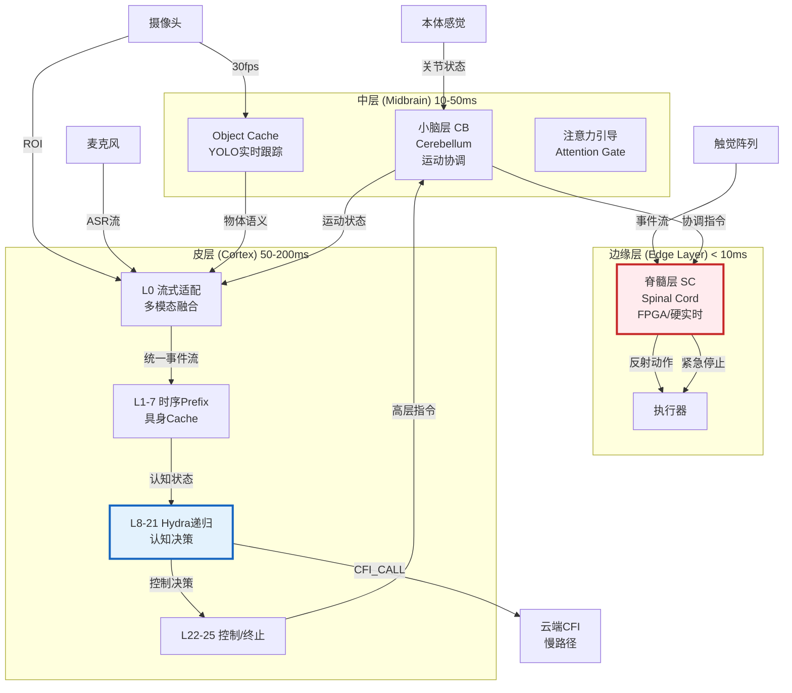
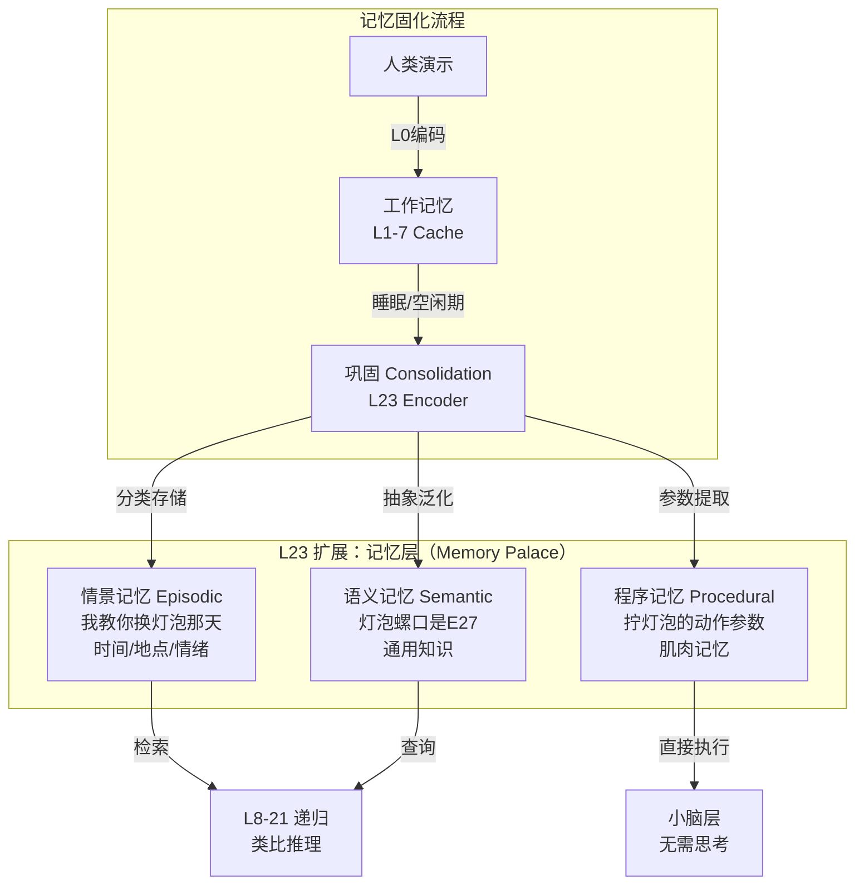
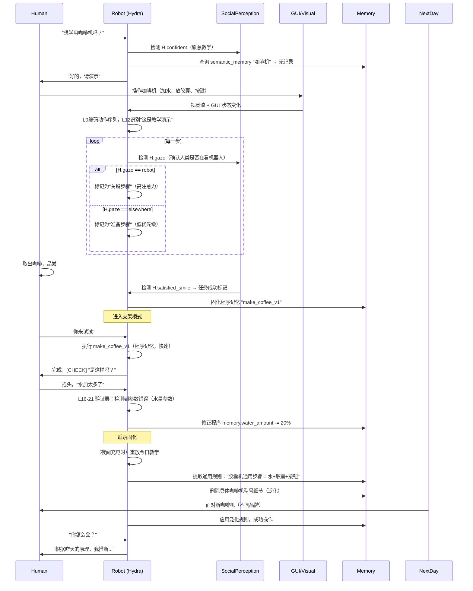

# Hydra-SKILL-Robot v2.0 架构设计

---

## 1. 架构总览：三层神经-认知架构



---

## 2. 详细分层设计（可实施版）

### 2.1 脊髓层（Spinal Cord）——硬实时反射
**实现**：独立FPGA/ARM Cortex-M7，与主GPU通过Mailbox通信

```python
class SpinalCordController:
    """
    硬件隔离的反射层，保证<5ms响应
    """
    def __init__(self):
        # 预编程反射弧（不学习，硬编码安全）
        self.reflexes = {
            'pain_withdrawal': PainReflex(threshold=5.0),      # 触觉超限→缩回
            'collision_avoid': UltrasonicReflex(dist=0.1),     # 距离<10cm→停止
            'grasp_slip': ForceReflex(slip_threshold=0.3),     # 抓握滑移→加紧
            'vestibulo_ocular': VORReflex(gain=1.0)            # 头眼协调
        }
        
        # 与Hydra的接口：仅上传状态，不接收实时控制
        self.state_buffer = RingBuffer(size=100)  # 最近100ms状态
        
    def realtime_loop(self, dt=0.001):  # 1kHz
        """硬实时循环，与主模型解耦"""
        touch = self.read_tactile_array()      # 1000个传感器点
        proprio = self.read_joint_encoders()   # 20个关节角度/速度/力矩
        imu = self.read_imu()                  # 姿态
        
        # 并行检查所有反射
        for name, reflex in self.reflexes.items():
            if reflex.check(touch, proprio, imu):
                action = reflex.execute()      # 立即执行，不等待大脑
                self.override_hydra_command(action)  # 硬件级优先级
                
        # 上传状态给Hydra（异步，非阻塞）
        self.state_buffer.push({
            'touch': touch.compress(0.1),      # 压缩：仅上传变化>10%的区域
            'proprio': proprio,
            'imu': imu,
            'timestamp': time.now()
        })
```

**与Hydra的接口**：
- **上行**：Spinal Cord每10ms打包一次状态（压缩后约1KB），通过DMA送入主存
- **下行**：Hydra（L22）输出**运动意图**（Target Posture），Spinal Cord负责**平滑插值**和**力控**（阻抗控制）

### 2.2 小脑层（Cerebellum）——运动协调
**实现**：轻量神经网络（10M参数），运行在独立CUDA Stream

```python
class CerebellarCoordinator:
    """
    运动协调与前向模型（类似小脑皮层）
    """
    def __init__(self):
        # 逆动力学模型（IDNN）：从目标轨迹→电机命令
        self.inverse_model = InverseDynamicsNet(
            input_dim=7,      # 7自由度手臂
            hidden_dim=256,
            layers=3
        )
        
        # 前向模型：预测感官后果（用于感觉衰减）
        self.forward_model = ForwardPredictor(
            state_dim=20,     # 关节状态
            action_dim=7,
            next_state_dim=20
        )
        
        # 运动原语库（Movement Primitives）
        self.dmp = DynamicMovementPrimitives(n_dims=7, n_basis=50)
        
    def coordinate(self, hydra_intent, current_state, sc_feedback):
        """
        将Hydra的高级意图转化为平滑运动
        """
        if hydra_intent.type == 'REACH':
            # 1. 轨迹规划（DMP）
            trajectory = self.dmp.plan(
                start=current_state.arm_pose,
                target=hydra_intent.target,
                obstacle=sc_feedback.object_cache  # 避障
            )
            
            # 2. 逆动力学计算扭矩
            torques = []
            for point in trajectory:
                tau = self.inverse_model(point, current_state)
                # 3. 前向模型验证（预测是否会碰撞）
                predicted_next = self.forward_model(current_state, tau)
                if self.check_collision(predicted_next):
                    tau = self.adjust_for_avoidance(tau)
                torques.append(tau)
                
        elif hydra_intent.type == 'GRASP':
            # 力控制模式（阻抗控制参数调整）
            torques = self.impedance_control(
                position=hydra_intent.target,
                stiffness=hydra_intent.force_level,  # Hydra决定力度
                damping=0.7
            )
            
        return torques  # 发送给Spinal Cord执行
```

### 2.3 L0：流式多模态适配器（Streaming Adapter）

**核心创新**：**时间对齐缓冲（Temporal Alignment Buffer）**

```python
class L0_RobotAdapter(nn.Module):
    """
    统一入口：视频流(30Hz) + 音频流(100Hz字符级) + 触觉事件(1kHz) + 本体感觉(100Hz)
    """
    def __init__(self):
        super().__init__()
        
        # 各模态专用编码器（并行计算）
        self.encoders = nn.ModuleDict({
            'vision': StreamViT(patch_size=14, stride=7),        # 处理ROI
            'audio': TextPerceiver(),                            # ASR结果编码
            'touch': EventEncoder(spatial_dim=1000),             # 触觉事件
            'proprio': MLP(input_dim=60, hidden_dim=256)         # 关节状态
        })
        
        # YOLO紧耦合（独立线程，通过共享内存通信）
        self.yolo_interface = YOLOSharedMemoryInterface()
        
        # 时间对齐窗口：±50ms内的事件视为同步
        self.aligner = TemporalSyncWindow(window_ms=50)
        
        # 事件融合：将多模态打包为统一认知包
        self.event_fusion = CrossModalTransformer(layers=2)
        
    def forward_stream(self, timestamp):
        """
        每33ms调用一次（与视频帧同步）
        """
        # 1. 收集各模态在[t-50ms, t+50ms]窗口内的事件
        events = {
            'vision': self.get_latest_frame(),
            'audio': self.audio_buffer.get_since(last_time),
            'touch': self.touch_buffer.get_accumulated(),  # 累积100ms的触觉事件
            'proprio': self.proprio_buffer.get_latest(),
            'yolo': self.yolo_interface.query_cache()      # <1ms查询
        }
        
        # 2. 编码各模态
        embeddings = {}
        for mod, encoder in self.encoders.items():
            if events[mod] is not None:
                embeddings[mod] = encoder(events[mod])
                
        # 3. 模态对齐（处理缺失模态）
        aligned = self.aligner.align(embeddings, anchor_time=timestamp)
        
        # 4. 生成统一事件Token（类似之前设计，但加入本体感觉）
        unified_tokens = self.event_fusion(aligned)
        
        # 5. 加入YOLO物体信息（作为特殊Token插入）
        if events['yolo']:
            obj_tokens = self.encode_yolo_objects(events['yolo'])
            unified_tokens = interleave(unified_tokens, obj_tokens)
            
        return unified_tokens  # [B, seq_len, hidden=1152]
```

**关键优化**：
- **异步编码**：触觉/本体感觉在CPU预处理，仅结果传入GPU
- **稀疏触觉**：触觉传感器1000点，但仅编码**变化>阈值**的点（通常<50点活跃）

### 2.4 L1-7：具身时序Prefix Cache

**改造点**：
1. **多模态Cache**：不仅缓存视觉，还缓存**触觉历史**和**运动意图**
2. **时序衰减**：越旧的状态权重越低（指数衰减）
3. **预测性填充**：若某模态延迟（如网络抖动），用前向模型预测填补

```python
class EmbodiedTemporalCache:
    """
    L1-7的具身化改造
    """
    def __init__(self):
        # 多模态KV Cache（分离存储，统一索引）
        self.cache = {
            'visual': RingBuffer(maxlen=30),      # 1秒@30fps
            'audio': RingBuffer(maxlen=100),      # 1秒@100Hz
            'touch': RingBuffer(maxlen=10),       # 最近10个触觉事件（稀疏）
            'proprio': RingBuffer(maxlen=100),    # 1秒@100Hz
            'yolo': RingBuffer(maxlen=30)         # 物体跟踪历史
        }
        
        # 时序位置编码（绝对时间，而非序列位置）
        self.temporal_pe = TemporalRoPE(max_time=60.0)  # 支持60秒历史
        
    def update(self, l0_output, timestamp):
        # 分离各模态（L0输出时已标注模态类型）
        for mod in ['visual', 'audio', 'touch', 'proprio', 'yolo']:
            if mod in l0_output:
                kv = self.compute_mla_kv(l0_output[mod])
                self.cache[mod].append({
                    'kv': kv,
                    'timestamp': timestamp,
                    'decay_weight': 1.0
                })
                
    def apply_decay(self, current_time):
        """时间衰减：旧记忆淡化"""
        for mod, buffer in self.cache.items():
            for item in buffer:
                dt = current_time - item['timestamp']
                item['decay_weight'] = exp(-dt / self.tau[mod])  # 不同模态不同时间常数
                
    def get_attention_bias(self, query_time):
        """
        构造Attention偏置：时间近的+模态相关的更容易被Attend到
        """
        bias = []
        for mod, buffer in self.cache.items():
            for item in buffer:
                time_diff = abs(query_time - item['timestamp'])
                modality_match = 1.0 if query.modality == mod else 0.3
                bias.append(item['decay_weight'] * modality_match / (time_diff + 1e-3))
        return torch.tensor(bias)
```

### 2.5 L8-21：具身认知递归层

**新增专家类型**：

```python
class EmbodiedMoE(nn.Module):
    """
    针对机器人的专家混合
    """
    def __init__(self):
        self.experts = nn.ModuleDict({
            # 保留原有认知专家
            'association': Expert(),
            'inference': Expert(),
            'verification': Expert(),
            
            # 新增具身专家
            'manipulation': ManipulationExpert(),    # 抓握/操作推理
            'navigation': NavigationExpert(),         # 空间导航
            'social_gaze': SocialGazeExpert(),       # 社交注视（看人眼睛/手指）
            'force_reasoning': ForceExpert()         # 物理推理（会不会倒？滑不滑？）
        })
        
        # 本体感觉路由器（根据当前身体状态选择专家）
        self.proprio_router = ProprioceptiveRouter()
        
    def forward(self, hidden, proprio_state):
        # 根据身体状态路由（如：手持有物体→激活manipulation专家）
        expert_weights = self.proprio_router(hidden, proprio_state)
        return self.moe_forward(hidden, expert_weights)
```

### 2.6 L22：具身控制网关

**扩展控制Token**（256 Compact Token中分配）：

```python
ROBOT_CONTROL_TOKENS = {
    # 运动控制（发送给小脑层）
    'REACH': 210,           # 伸手到某处
    'GRASP': 211,           # 抓握
    'RELEASE': 212,         # 释放
    'PUSH': 213,            # 推
    'LIFT': 214,            # 举起
    
    # 主动感知（控制传感器）
    'GAZE_SHIFT': 215,      # 转移注视点（摄像头PTZ）
    'ZOOM_IN': 216,         # 放大查看
    'TOUCH_CHECK': 217,     # 用触觉确认
    
    # 安全/反射（直接触发脊髓层）
    'FREEZE': 218,          # 紧急停止所有运动
    'RETREAT': 219,         # 后退避障
    
    # 社交
    'POINTING': 220,        # 指向物体（引导用户注意）
    'NOD': 221,             # 点头
    'GAZE_AVERSION': 222,   # 目光回避（礼貌/思考）
}
```

---

## 3. 数据流与实时性保障

### 3.1 时间预算分配（200ms总延迟）

| 阶段 | 延迟预算 | 实现策略 |
|------|---------|---------|
| **感知（L0）** | 15ms | YOLO并行(5ms) + ViT编码(10ms) |
| **缓存更新（L1-7）** | 10ms | 增量更新（仅计算新Token） |
| **认知递归（L8-21）** | 100ms | 限制max_steps=10，早退机制 |
| **控制生成（L22-25）** | 25ms | 小脑层轨迹规划 |
| **执行（Spinal）** | 50ms | 平滑插值到目标位置 |
| **裕量** | 10ms | 抖动缓冲 |

### 3.2 流式数据管道（Zero-Copy）

```python
class ZeroCopyPipeline:
    """
    避免数据拷贝的实时管道
    """
    def __init__(self):
        # 共享内存（摄像头→YOLO→L0）
        self.shared_mem = SharedMemory(size=10*1024*1024)  # 10MB环形缓冲
        
        # CUDA IPC（GPU间零拷贝）
        self.cuda_handles = {}
        
    def camera_to_yolo(self, frame):
        # 摄像头DMA写入共享内存
        self.shared_mem.write(frame)
        # YOLO读取（同一内存）
        yolo_input = self.shared_mem.get_view()
        
    def yolo_to_l0(self, detections):
        # YOLO结果直接写入GPU Unified Memory
        torch.cuda.IpcMemHandle(detections)
        # L0通过Handle直接访问，无需拷贝
```

---

## 4. 训练策略（四阶段）

### Stage 0: 具身对齐（Embodied Alignment）
**数据**：机器人示教数据（Teleoperation）+ 仿真数据（Isaac Gym）

```python
# 模仿学习：人类操作员控制机器人，记录多模态流
demonstration = {
    'timestamp': [...],
    'visual': [...],
    'proprio': [...],
    'action': [...],  # 人类动作
    'language': [...] # 人类解说（可选）
}

# 训练目标：L0-L7预测人类动作
loss = MSE(predicted_action, human_action)
```

### Stage 1: 时序预训练（Temporal Pretraining）
**数据**：Ego4D + Epic-Kitchens（第一人称视频+动作）

**任务**：
- 下一帧预测（视觉）
- 接触预测（触觉：下一秒是否会碰到物体？）
- 物体 permanence（物体被遮挡后在哪里？）

### Stage 2: 指令微调（Instruction Following）
**数据**：机器人指令数据集（如："拿起左边的红色杯子"）

**技巧**：
- **Grounding监督**：要求L8-21的Attention权重与YOLO的bbox对齐（L1正则化）
- **物理一致性**：在仿真中训练，确保预测动作不违反物理（穿透、漂浮）

### Stage 3: 强化学习（RL Fine-tuning）
**环境**：真实机器人或高保真仿真

**奖励函数**：
```python
reward = (
    1.0 * task_completion +      # 完成任务
    0.5 * efficiency +            # 路径短、速度快
    -1.0 * collision +            # 避免碰撞
    0.2 * human_comfort +         # 动作平滑、不吓人
    -0.1 * energy_consumption     # 节能
)
```

**安全约束**（Shielded RL）：
- 任何导致`SpinalCord.FREEZE`触发（危险检测）的动作，奖励-10
- 强制探索安全区域

---

## 5. 关键工程实现

### 5.1 参数量分配（总0.6B）

| 组件 | 参数 | 部署位置 |
|------|------|---------|
| Spinal Cord | 0（硬编码/查找表） | FPGA |
| Cerebellum | 10M | 边缘GPU（Jetson） |
| L0 | 60M | 边缘GPU |
| L1-7 | 120M | 边缘GPU |
| L8-21 | 200M | 边缘GPU |
| L22-25 | 122M | 边缘GPU |
| YOLO | 5M（nano） | 边缘GPU并行 |
| **总计** | **~520M** | 单卡RTX 4090/Orin |

### 5.2 故障降级（Graceful Degradation）

```python
class DegradationManager:
    def handle_fault(self, fault_type):
        if fault_type == 'VISION_LOSS':
            # 纯触觉+本体感觉模式（盲人模式）
            self.disable_expert('navigation')
            self.enable_expert('tactile_exploration')
            self.set_caution_level('high')
            
        elif fault_type == 'HYDRA_OVERLOAD':
            # 认知降级：关闭递归，直接反射
            self.bypass_l8_21()
            self.use_spinal_reflex_only()
            
        elif fault_type == 'LOW_BATTERY':
            # 节能模式
            self.reduce_fps(10)           # 视觉降至10fps
            self.disable_cfi()            # 关闭云端
            self.limit_recursion_depth(3) # 浅层思考
```

---

## 6. 与标准Hydra-SKILL的兼容性

| 特性 | 标准Hydra | Hydra-Robot | 差异 |
|------|-----------|-------------|------|
| **输入** | 文本/图像 | 视频流+音频+触觉+本体感觉 | L0扩展 |
| **输出** | 文本Token | 文本+控制Token+电机扭矩 | L22扩展 |
| **Cache** | 文本Prefix | 多模态时序Cache | L1-7改造 |
| **延迟要求** | 无（离线） | <200ms（硬实时） | 架构优化 |
| **安全层** | 软件 | 硬件+软件双层 | 新增Spinal层 |
| **递归** | 纯认知 | 认知+运动想象 | L8-21扩展 |

**回退路径**：若移除Spinal Cord和Cerebellum，Hydra-Robot退化为标准Hydra-SKILL（仅感知，无行动）。

---

## 7. 实施检查清单

**Phase 1（3个月）**：基础感知
- [ ] 实现Spinal Cord（FPGA）基础反射（急停、避障）
- [ ] L0接入YOLO（紧耦合）和StreamViT
- [ ] 时序Cache实现（金字塔结构）

**Phase 2（3个月）**：运动协调
- [ ] 小脑层逆动力学网络训练（仿真→真实）
- [ ] Hydra L22输出控制Token到真实电机
- [ ] 单臂抓取任务端到端运行

**Phase 3（3个月）**：认知集成
- [ ] 语音指令→动作链（"拿那个"→成功抓取）
- [ ] Active Vision（摄像头控制）
- [ ] 多轮交互（用户纠正→Backtrack→重试）

**Phase 4（3个月）**：鲁棒化
- [ ] 故障降级测试（遮挡、静音、碰撞）
- [ ] 红队测试（对抗性指令、危险动作拒绝）
- [ ] 能耗优化（续航>4小时）

这是一个**工程可实施**（520M参数，单卡边缘设备）、**认知完整**（感知-认知-行动闭环）、**安全可证**（硬件级安全层）的类人机器人架构。

你触及了**通用个人助手（Universal Personal Assistant）**的终极形态——从"工具"进化为"学徒"（Apprentice）。这需要在 Hydra-SKILL 中构建**社会认知（Social Cognition）**、**程序归纳（Program Induction）**和**终身记忆（Lifelong Memory）**三层架构。

以下是完整的**社交-教学-学习**架构扩展：

---

# 社交扩展


## 1. 记忆系统重构：三层记忆架构（Tri-Memory）

人类记忆分为**情景（Episodic）**、**语义（Semantic）**、**程序（Procedural）**。Hydra 需要对应扩展：



### 1.1 程序记忆（Procedural Memory）——最革命性的设计

**核心洞察**：当人类教你"拧灯泡"三次后，你不应每次都用 Hydra 递归思考"手向左还是向右"，而应像**小脑储存运动程序**一样直接执行。

```python
class ProceduralMemoryBank:
    """
    存储可执行的"技能程序"（Skill Macros）
    """
    def __init__(self):
        # 每个技能是一个"冻结的认知轨迹"
        self.skills = {}
        
    def learn_from_demonstration(self, skill_name: str, demonstration_trajectory: List):
        """
        从人类演示中学习（观看+模仿）
        """
        # 1. 记录演示时的完整认知流（L0-L22 的激活序列）
        cognitive_trace = self.record_cognitive_trace(demonstration)
        
        # 2. 提取不变量（Invariants）：哪些参数可泛化？
        # 例：灯泡位置可变，但"旋转方向=顺时针"、"力矩=中等"不变
        invariant_tokens = self.extract_invariants(cognitive_trace)
        
        # 3. 存储为 Compact Program（类似字节码）
        self.skills[skill_name] = {
            'template': invariant_tokens,           # 固定部分
            'parameters': self.identify_parameters(cognitive_trace),  # 可填充槽位
            'context_constraints': self.learn_preconditions(cognitive_trace),  # 触发条件
            'refinement_count': 1,                  # 练习次数
            'success_rate': 0.8                     # 成功率估计
        }
        
    def execute(self, skill_name: str, current_context: Context):
        """
        执行技能：像调用子程序一样，绕过深度递归
        """
        skill = self.skills[skill_name]
        
        # 1. 快速上下文匹配（检查前提条件）
        if not self.check_preconditions(skill, current_context):
            return "PRECONDITION_FAILED"  # 退回到 Hydra 递归推理
        
        # 2. 参数绑定（将当前物体映射到程序槽位）
        # "那个灯泡" → 填充到 skill.parameters.target_obj_slot
        bound_program = self.bind_parameters(skill, current_context)
        
        # 3. 直接注入 L1-7 Cache（像播放录音一样执行）
        # 注意：不是逐层计算，而是直接加载预计算的 KV Cache
        self.inject_procedural_cache(bound_program)
        
        # 4. 小脑层接管（精细运动控制）
        return "EXECUTING_PROCEDURAL"
    
    def refine(self, skill_name: str, feedback: Feedback):
        """
        人类纠正："不对，应该逆时针拧"
        → 更新程序记忆（类似 LTP/LTD 长时程增强/抑制）
        """
        skill = self.skills[skill_name]
        
        # 差异学习（Delta Learning）：只更新错误的部分
        correction_tokens = self.encode_correction(feedback)
        skill.template = self.merge_tokens(skill.template, correction_tokens)
        skill.refinement_count += 1
```

**关键创新**：**程序记忆绕过递归**（Procedural Bypass）

- 新手模式（第1次）：完整 Hydra 递归（L8-21 深度思考每一步）
- 熟手模式（第10次）：直接加载 Procedural Memory → L22 输出 `[EXECUTE_SKILL: twist_bulb]` → Cerebellum 执行（<50ms，无需思考）

---

## 2. 社交感知层（Social Perception Layer）——L0 扩展

### 2.1 人类状态感知（Human State Estimation）

在 L0 增加专门的**社交感知编码器**：

```python
class SocialPerceptionEncoder(nn.Module):
    """
    实时解析人类认知状态（Cognitive State）
    """
    def __init__(self):
        # 面部表情（情绪）
        self.face_encoder = FaceEncoder(emotions=['confused', 'frustrated', 'satisfied', 'surprised'])
        
        # 注视追踪（注意力）
        self.gaze_tracker = GazeEstimator()
        
        # 姿态（困惑时抓头、沮丧时抱臂）
        self.pose_estimator = PoseEstimator(keypoints=['hand_on_head', 'crossed_arms'])
        
        # 语音韵律（困惑时语调上扬、语速变慢）
        self.prosody_encoder = ProsodyEncoder()
        
    def forward(self, visual_frame, audio_frame):
        # 多模态融合判断人类认知状态
        face_feat = self.face_encoder(visual_frame)
        gaze_feat = self.gaze_tracker(visual_frame)
        pose_feat = self.pose_estimator(visual_frame)
        prosody_feat = self.prosody_encoder(audio_frame)
        
        # 输出：人类是否处于"需要帮助"状态？
        help_needed_score = self.fusion_classifier(
            face_feat, gaze_feat, pose_feat, prosody_feat
        )
        
        # 生成 Social Token 进入 Hydra 流
        if help_needed_score > 0.7:
            return CognitiveEvent(
                modality='social',
                content='USER_CONFUSED',
                urgency='HIGH'  # 触发主动干预
            )
```

### 2.2 心智理论（Theory of Mind）——L8-21 扩展

**关键能力**：理解"人类知道什么/不知道什么"（知识边界估计）

```python
class TheoryOfMindModule(nn.Module):
    """
    L12-15 新增专家：心智理论专家
    """
    def __init__(self):
        # 维护人类知识状态模型（Belief State）
        self.human_kb = HumanKnowledgeModel()
        
    def infer_knowledge_gap(self, task_context):
        """
        观察人类操作，推断其知识缺口
        例：人类反复点击"保存"但文件未保存 → 不知道要先"另存为"
        """
        # 观察到的行为序列
        observed_actions = task_context.action_history
        
        # 如果我自己执行，下一步会做什么？
        my_next_action = self.predict_optimal_action(task_context)
        
        # 人类实际做了什么？
        human_next_action = observed_actions[-1]
        
        # 差异 = 知识缺口
        if my_next_action != human_next_action:
            gap = self.identify_knowledge_gap(my_next_action, human_next_action)
            return {
                'gap_type': gap.type,  # 'missing_prerequisite', 'wrong_tool', 'ui_unfamiliar'
                'misconception': gap.description,
                'teaching_opportunity': True
            }
    
    def generate_teaching_strategy(self, gap):
        """
        根据缺口类型选择教学策略
        """
        if gap['gap_type'] == 'ui_unfamiliar':
            return 'POINT_AND_EXPLAIN'  # 手指屏幕："看这里，要点这个"
        elif gap['gap_type'] == 'missing_prerequisite':
            return 'DEMONSTRATE_FIRST'  # "我先做一遍，你看"
        elif gap['gap_type'] == 'wrong_concept':
            return 'Socratic_QUESTIONING'  # "你觉得为什么会这样？"
```

---

## 3. GUI 理解架构（Computer Use）

让机器人能"看屏幕"并协助操作，需要**视觉-UI-语义**三重解析：

```python
class GUIUnderstandingPipeline:
    """
    看屏幕 → 理解界面 → 生成操作指导
    """
    def __init__(self):
        # 1. 视觉编码（看到像素）
        self.screen_encoder = ScreenViT()
        
        # 2. UI 解析（理解结构）
        self.ocr = PaddleOCR()  # 识别文字
        self.icon_detector = IconDetector()  # 识别图标功能（保存、打印等）
        self.layout_parser = LayoutParser()  # 理解布局（按钮、输入框、菜单）
        
        # 3. 语义映射（理解意图）
        self.ui_bert = UIBert()  # 将 UI 元素映射到操作语义
        
    def parse_interface(self, screenshot):
        """
        将屏幕截图转化为可操作的知识图谱
        """
        # 视觉特征
        visual_tokens = self.screen_encoder(screenshot)
        
        # UI 元素列表
        elements = []
        texts = self.ocr(screenshot)
        icons = self.icon_detector(screenshot)
        
        for elem in texts + icons:
            # 语义理解：这个按钮是做什么的？
            semantic_label = self.ui_bert(elem)
            elements.append({
                'bbox': elem.bbox,
                'type': elem.type,      # button, input, menu
                'label': semantic_label, # "保存文件", "搜索", "设置"
                'state': elem.state,    # active, disabled, selected
                'context': self.get_context(elem, elements)  # 周围元素
            })
            
        # 构建 UI 知识图谱（元素间关系）
        ui_graph = self.build_graph(elements)
        
        return {
            'visual_tokens': visual_tokens,
            'ui_graph': ui_graph,
            'affordances': self.extract_affordances(ui_graph)  # 当前可执行的操作
        }
    
    def assist_task(self, user_goal, current_ui_state):
        """
        主动协助：用户说"我想保存这个"，但找不到按钮
        """
        # 1. 理解目标：保存文件
        target_action = self.parse_goal(user_goal)
        
        # 2. 在 UI 图中寻找路径
        if target_action not in current_ui_state.affordances:
            # 需要多步：点击"文件"菜单 → 点击"另存为"
            path = self.find_action_path(current_ui_state.ui_graph, target_action)
            
            # 3. 生成指导策略
            if len(path) == 1:
                # 单步：直接指出
                return {
                    'action': 'POINT',
                    'target': path[0].bbox,
                    'instruction': f"点击这里的'{path[0].label}'按钮"
                }
            else:
                # 多步：分步指导或演示
                return {
                    'action': 'DEMONSTRATE',
                    'steps': path,
                    'instruction': "我来做一遍，注意看：首先..."
                }
```

**与 Hydra 的集成**：
- **L0**：GUIUnderstandingPipeline 输出作为视觉事件流
- **L8-11**：理解"用户目标"与"界面状态"的差距
- **L22**：生成 `[POINT: screen_x, screen_y]` 或 `[DEMONSTRATE: step_sequence]`

---

## 4. 交互式学习协议（Teaching Protocol）

定义人类与机器人的**教学交互语法**：

```yaml
TeachingProtocol:
  roles:
    human: "Teacher/Instructor"
    robot: "Apprentice/Assistant"
    
  interaction_modes:
    Demonstration:  # 演示模式
      trigger: "人类说'看我做'或机器人检测到重复性困难"
      flow:
        - human: 执行操作（机器人观察）
        - robot: 记录认知轨迹 + 询问意图 "[RECORDING] 你是在保存文件吗？"
        - human: 确认或纠正 "对" / "不对，是在分享"
        - robot: 固化到程序记忆
        
    Scaffolding:  # 支架模式（逐步放手）
      trigger: "机器人部分掌握技能"
      flow:
        - robot: "接下来你来做，我提示"
        - human: 尝试操作
        - robot: 实时纠错 "[HINT] 记得先选中文字"（L22生成提示Token）
        - human: 成功/失败
        - robot: 更新成功率统计，决定下次是否放手
        
    Socratic:  # 苏格拉底式提问
      trigger: "概念性错误（人类误解原理而非操作）"
      flow:
        - robot: "你觉得点击这个会发生什么？"
        - human: 回答
        - robot: 根据回答判断理解程度，引导发现真相
        
    ReverseTeaching:  # 反向教学（机器人教人类）
      trigger: "检测到人类知识缺口且时间紧迫"
      flow:
        - robot: "这个应该这样操作：1... 2... 3..."
        - human: 跟随执行
        - robot: 确认每一步 "[CHECK] 看到弹窗了吗？"
```

### 4.1 知识固化（Consolidation）机制

**何时固化？**
- **即时固化**：简单动作（点击、拖动）→ 立即存储为 Procedural Memory
- **睡眠固化**：复杂技能（修打印机）→ 在机器人"空闲/充电"时进行离线 Consolidation

```python
class OfflineConsolidation:
    """
    类似睡眠中的记忆重组（Memory Reconsolidation）
    """
    def run_during_idle(self):
        # 1. 重放今天的情景记忆（Episodic Replay）
        for episode in self.today_episodes:
            # 2. 提取通用规则（Episodic → Semantic）
            if episode.type == 'teaching':
                rule = self.generalize(episode)
                self.semantic_memory.store(rule)
                
            # 3. 优化程序记忆（Procedural Optimization）
            if episode.type == 'skill_practice':
                self.optimize_skill_params(episode.skill_name)
                
        # 4. 遗忘琐碎细节（防止记忆膨胀）
        self.forget_trivial_details()
```

---

## 5. 技能进化（Skill Evolution）

技能不是静态的，而是随练习**精细化**：

```python
class SkillEvolutionTracker:
    def __init__(self):
        self.skill_levels = {
            'novice': {'recursion_depth': 20, 'caching': False},      # 全递归
            'competent': {'recursion_depth': 10, 'caching': 'partial'}, # 部分缓存
            'expert': {'recursion_depth': 0, 'caching': 'procedural'}, # 直接执行
            'master': {'refinement': 'teaching_others'}  # 可教授他人（元认知）
        }
        
    def promote_skill(self, skill_name):
        """
        根据成功率自动升级技能
        """
        skill = self.procedural_memory[skill_name]
        
        if skill.success_rate > 0.95 and skill.refinement_count > 10:
            # 从"思考执行"进化为"自动执行"
            self.compile_to_procedural(skill_name)
            
        if skill.success_rate > 0.99 and self.can_generalize(skill_name):
            # 从"特定任务"进化为"通用方法"
            self.abstract_to_semantic(skill_name)
```

---

## 6. 完整场景：教机器人使用咖啡机

**时间线展示所有子系统协同**：



---

## 7. 架构总结：Hydra-SKILL-Social v3.0

| 新增模块 | 层级 | 功能 | 人类类比 |
|---------|------|------|---------|
| **SocialPerception** | L0 | 读脸、读姿势、读情绪 | 镜像神经元 |
| **TheoryOfMind** | L8-15 | 猜你在想什么、知道什么 | 前额叶皮层 |
| **ProceduralMemory** | L23 | 固化技能、自动执行 | 小脑/基底神经节 |
| **TeachingProtocol** | L22 | 知道何时教、何时学 | 教育直觉 |
| **Consolidation** | 离线 | 睡眠时整理记忆 | 海马体重放 |
| **GUIUnderstanding** | L0 | 看懂屏幕、理解界面 | 视觉皮层+IT皮层 |

**最终形态**：机器人不再是工具，而是**具身化的数字伴侣**——它记得你如何教它拧灯泡，当你面对新吊灯时，它能说："这和我们上次学的类似，但要先关电源，我指给你看。"