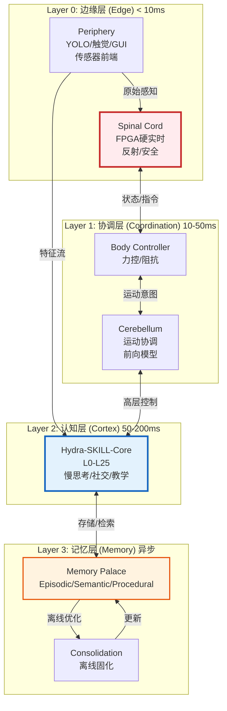
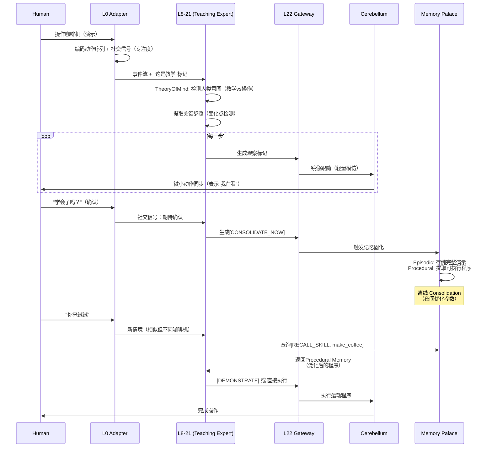
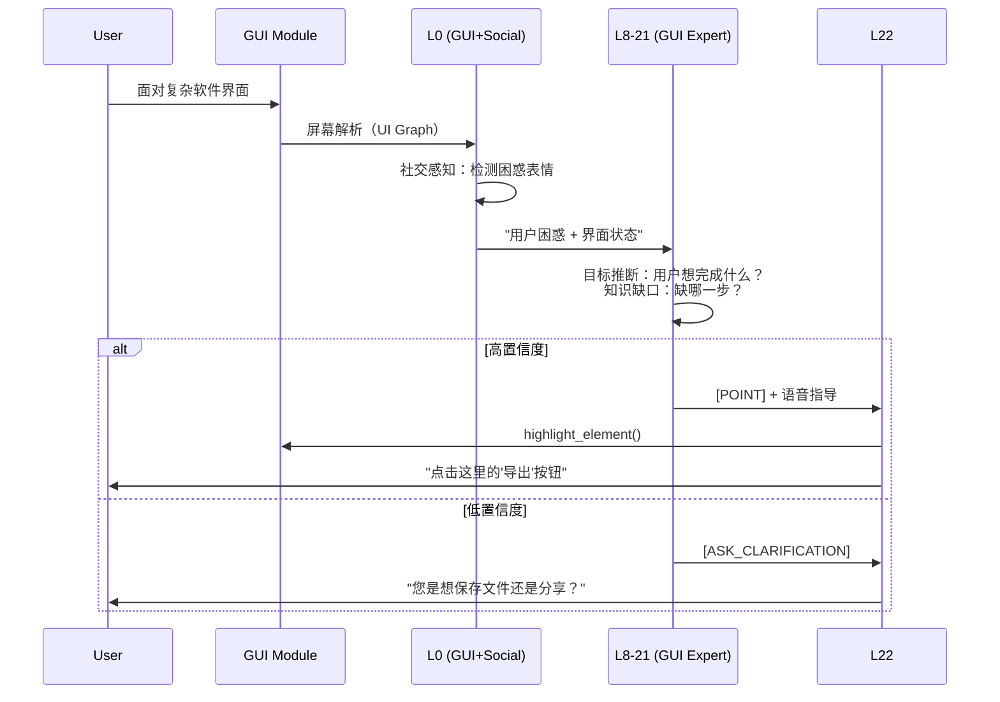
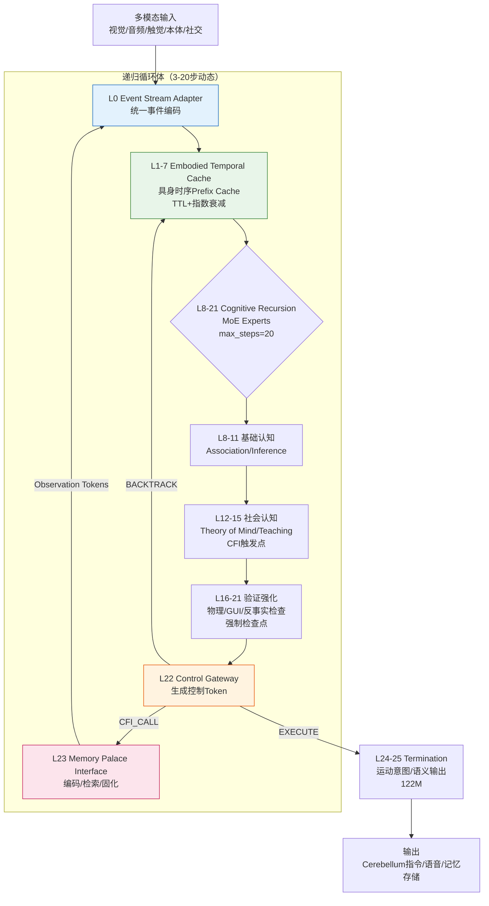

# Hydra-SKILL-Social v3.0

定位：具身通用个人助手（Embodied Universal Assistant）
设计原则：神经科学分层 + 工程硬实时 + 社会认知智能

---

## 1. 架构总览：四层认知-行动架构



---

## 2. Hydra-SKILL-Core 详细架构

### 2.1 L0: 事件流适配器 (Event Stream Adapter)

**职责**：统一多模态时序对齐 + 社交信号编码

```python
class L0_EventStreamAdapter:
    """
    统一入口：视觉流(30Hz) + 音频流(100Hz) + 触觉事件(1kHz) + 本体感觉(100Hz) + 社交信号
    """
    def __init__(self):
        # 模态编码器（并行线程）
        self.encoders = {
            'vision': StreamViT(roi_mode='attention_guided'),  # YOLO引导ROI
            'audio': TextPerceiver(),                          # ASR结果
            'touch': EventEncoder(spatial_dim=1000, threshold=0.1),  # 变化检测
            'proprio': MLPEncoder(input=60, hidden=256),       # 关节状态
            'social': SocialPerceptionEncoder()                # 表情/姿态/注视
        }
        
        # 时间对齐窗口
        self.sync_buffer = TemporalSyncWindow(window_ms=50)
        
        # YOLO紧耦合接口（共享内存）
        self.yolo_shm = SharedMemoryInterface(name='yolo_detections')
        
    def forward(self, timestamp):
        # 收集各模态事件
        events = {
            'vision': self.get_frame(),
            'audio': self.audio_buffer.get_window(timestamp),
            'touch': self.touch_buffer.get_events(since=timestamp-50ms),
            'proprio': self.proprio_state.get(),
            'yolo': self.yolo_shm.query(),           # 物体语义
            'social': self.social_encoder.infer(     # 人类认知状态
                face=self.get_face_roi(),
                pose=self.get_body_pose(),
                gaze=self.get_gaze_vector()
            )
        }
        
        # 对齐与融合
        aligned = self.sync_buffer.align(events, anchor=timestamp)
        unified_tokens = self.cross_modal_fusion(aligned)
        
        # 生成事件标记
        return EventStream(
            tokens=unified_tokens,
            metadata={
                'timestamp': timestamp,
                'social_state': aligned['social'],      # 传递给L8-21
                'object_cache': aligned['yolo'],
                'proprioception': aligned['proprio']
            }
        )
```

**关键输出**：
- `unified_tokens`: [B, seq_len, 1152]
- `social_event`: 人类情绪/注意力/知识状态估计
- `body_schema`: 当前身体姿态（用于具身推理）

### 2.2 L1-7: 具身时序Prefix Cache (Embodied Temporal Cache)

**职责**：跨模态记忆缓存 + 时序衰减 + 预测填充

```python
class EmbodiedTemporalCache:
    def __init__(self):
        # 多模态分离缓存（统一索引）
        self.cache = {
            'visual': TemporalBuffer(maxlen=30, decay_tau=5.0),    # 1秒
            'audio': TemporalBuffer(maxlen=100, decay_tau=10.0),   # 1秒
            'touch': TemporalBuffer(maxlen=10, decay_tau=2.0),     # 稀疏事件
            'proprio': TemporalBuffer(maxlen=100, decay_tau=3.0),  # 运动记忆
            'social': TemporalBuffer(maxlen=50, decay_tau=8.0)     # 社交历史
        }
        
        # MLA压缩配置
        self.mla = MLACompression(c=256, cq=256)
        
    def update(self, l0_output, timestamp):
        for mod in self.cache.keys():
            if mod in l0_output:
                kv_compressed = self.mla.compress(l0_output[mod])
                self.cache[mod].append({
                    'kv': kv_compressed,
                    'timestamp': timestamp,
                    'weight': 1.0  # 时间衰减初始值
                })
                
    def apply_temporal_decay(self, current_time):
        """时间近因权重"""
        for buf in self.cache.values():
            for item in buf:
                dt = current_time - item['timestamp']
                item['weight'] = math.exp(-dt / buf.decay_tau)
                
    def query(self, query_modality, query_time, top_k=10):
        """跨模态检索（如：用文本查询相关视觉记忆）"""
        # 计算时间对齐度 + 模态匹配度
        scores = []
        for mod, buf in self.cache.items():
            for item in buf:
                time_score = 1 / (abs(query_time - item['timestamp']) + 1e-3)
                modality_score = 1.0 if mod == query_modality else 0.3
                scores.append(item['weight'] * time_score * modality_score)
                
        return top_k_selection(scores)
```

### 2.3 L8-21: 认知递归层 (Cognitive Recursion with MoE)

**职责**：思维推理 + 社会认知 + 教学交互

```python
class CognitiveRecursionLayer:
    def __init__(self):
        self.experts = nn.ModuleDict({
            # 基础认知
            'association': Expert(),      # 跨模态关联
            'inference': Expert(),        # 逻辑推理
            
            # 社会认知（新增）
            'theory_of_mind': TheoryOfMindExpert(),  # 推断人类知识/意图
            'teaching': TeachingExpert(),            # 教学策略选择
            'social_gaze': SocialGazeExpert(),       # 社交注视管理
            
            # 具身认知（新增）
            'manipulation': ManipulationExpert(),    # 物体操作推理
            'navigation': NavigationExpert(),        # 空间导航
            'gui_understanding': GUIExpert()         # 界面理解
        })
        
        # 元认知：监控自身不确定性
        self.uncertainty_monitor = UncertaintyHead()
        
    def forward(self, hidden_state, context):
        # 根据上下文路由专家
        if context['social_state'].confusion_level > 0.7:
            # 人类困惑 → 激活教学专家
            expert_weights = self.route_to_teaching()
        elif context['task_type'] == 'gui_assistance':
            expert_weights = self.route_to_gui()
        else:
            expert_weights = self.default_router(hidden_state)
            
        # MoE前向
        output = self.moe_forward(hidden_state, expert_weights)
        
        # 元认知检查
        uncertainty = self.uncertainty_monitor(output)
        if uncertainty > 0.8:
            # 触发CFI或询问人类
            output['control_token'] = 'ASK_CLARIFICATION'
            
        return output
```

**关键专家详解**：

**TheoryOfMindExpert**：
- 输入：人类行为历史 + 当前任务状态
- 输出：`knowledge_gap`（知识缺口）, `belief_state`（人类信念状态）, `intention`（意图估计）

**TeachingExpert**：
- 模式选择：`DEMONSTRATION`（演示）, `SCAFFOLDING`（支架）, `SOCRATIC`（提问）
- 策略生成：下一步是"展示"还是"提示"还是"让尝试"

### 2.4 L22: 社会控制网关 (Social Control Gateway)

**职责**：决策输出 + 教学协议状态机

```python
class SocialControlGateway:
    def __init__(self):
        self.control_tokens = {
            # 基础控制（保留）
            'THINK_END': 0, 'CFI_CALL': 1, 'BACKTRACK': 2,
            
            # 运动控制（发给Cerebellum）
            'REACH': 10, 'GRASP': 11, 'POINT': 12, 'GESTURE': 13,
            
            # 社交控制（新增）
            'GAZE_AVERSION': 20,      # 目光回避（思考/礼貌）
            'GAZE_JOINT_ATTENTION': 21, # 共同注意（看人类看的东西）
            'NOD': 22,                # 点头
            'HEAD_TILT': 23,          # 歪头（表示困惑/兴趣）
            
            # 教学控制（新增）
            'DEMONSTRATE': 30,        # 进入演示模式
            'PROMPT': 31,             # 提示人类
            'ASK_CLARIFICATION': 32,  # 请求澄清
            'CONFIRM_UNDERSTANDING': 33, # 确认理解
            
            # 记忆控制（新增）
            'CONSOLIDATE_NOW': 40,    # 触发立即固化（重要教学时刻）
            'RECALL_SKILL': 41,       # 调用程序记忆
        }
        
        self.teaching_state_machine = TeachingStateMachine()
        
    def forward(self, hidden_state, social_context):
        # 检查是否处于教学会话
        if social_context['mode'] == 'teaching':
            next_action = self.teaching_state_machine.step(
                student_state=social_context['student'],
                task_progress=social_context['progress']
            )
            return self.control_tokens[next_action]
            
        # 标准决策
        return self.standard_decision(hidden_state)
```

### 2.5 L23: 记忆宫殿 (Memory Palace)

**职责**：三层记忆编码 + 离线固化接口

```python
class MemoryPalace:
    def __init__(self):
        # 三层记忆存储
        self.episodic = EpisodicStore()      # 情景：那天教你换灯泡
        self.semantic = SemanticStore()      # 语义：灯泡通用知识
        self.procedural = ProceduralStore()  # 程序：拧灯泡的肌肉记忆
        
    def encode_observation(self, observation_type, data):
        """
        将交互结果编码为记忆
        """
        if observation_type == 'teaching_demo':
            # 编码为情景记忆
            episode = self.encode_episodic(
                timestamp=data['time'],
                teacher_actions=data['actions'],
                success=data['result'],
                emotions=data['social_signals']
            )
            self.episodic.store(episode)
            
            # 同时提取程序记忆（如果动作可重复）
            if data['refinable']:
                skill = self.extract_procedural(data)
                self.procedural.learn(skill_name=data['task'], trajectory=skill)
                
        elif observation_type == 'correction':
            # 人类纠正：更新程序记忆参数
            self.procedural.refine(
                skill=data['skill'],
                correction=data['delta'],
                context=data['context']
            )
            
    def query_memory(self, query_type, context):
        if query_type == 'how_to_do':
            # 优先查询程序记忆（快速执行）
            skill = self.procedural.retrieve(context['task'])
            if skill and skill.confidence > 0.9:
                return {'type': 'procedural', 'data': skill}
            else:
                # 退回到情景记忆（类比学习）
                episodes = self.episodic.retrieve_similar(context)
                return {'type': 'episodic', 'data': episodes}
```

---

## 3. 周边模块架构与接口

### 3.1 Spinal Cord Layer（边缘层）

**定位**：硬实时安全 + 反射弧  
**硬件**：FPGA/ARM Cortex-M7，独立供电  
**接口定义**：

```yaml
Interface_SpinalCord:
  Upstream_To_Hydra:
    protocol: "Shared Memory + Mailbox"
    frequency: "100Hz"
    data:
      - tactile_array: "uint8[1000] 压缩后"
      - proprioception: "float32[60] 关节角/速/力矩"
      - imu: "float32[6] 姿态"
      - safety_status: "enum {SAFE, WARNING, CRITICAL}"
      
  Downstream_From_Hydra:
    protocol: "High Priority Interrupt"
    latency: "< 5ms"
    commands:
      - type: " impedance_params"  # 刚度/阻尼设置
      - type: "emergency_stop"     # 立即切断
      - type: "reflex_override"    # 覆盖反射阈值
      
  Autonomous:
    reflexes:
      - pain_withdrawal: "tactile > threshold → 自动缩回"
      - collision_avoid: "proximity < 0.1m → 停止"
      - slip_detection: "force_drop > 30% → 加紧"
```

### 3.2 Cerebellar Layer（协调层）

**定位**：运动协调 + 前向模型  
**硬件**：Jetson/Edge GPU，与Hydra同设备不同CUDA Stream  
**接口定义**：

```python
class CerebellumInterface:
    """
    Hydra <-> Cerebellum 接口
    """
    def receive_intent(self, hydra_command: Dict):
        """
        接收来自Hydra的高层意图
        """
        if hydra_command['type'] == 'REACH':
            target = hydra_command['target']  # 物体ID或坐标
            constraints = hydra_command.get('constraints', {})
            # 计算平滑轨迹
            trajectory = self.plan_trajectory(target, constraints)
            return trajectory
            
        elif hydra_command['type'] == 'GRASP':
            object_props = hydra_command['object_properties']
            force_profile = self.compute_grasp_force(object_props)
            return force_profile
            
        elif hydra_command['type'] == 'DEMONSTRATE':
            # 进入示教模式：人类引导，机器人记录
            self.enter_teach_mode()
            
    def send_feedback(self):
        """
        向Hydra上报运动状态
        """
        return {
            'current_pose': self.forward_kinematics(),
            'residual_force': self.get_external_force(),
            'execution_progress': 0.7,  # 任务完成度
            'anomaly': self.check_deviation()  # 是否偏离预期
        }
```

### 3.3 Periphery（感知外围）

#### A. YOLO-Vision Frontend
```yaml
Interface_YOLO:
  Output_To_L0:
    rate: "30Hz"
    data_structure:
      objects:
        - id: "int 跟踪ID"
        - class: "str 类别"
        - bbox: "[x1,y1,x2,y2]"
        - confidence: "float"
        - velocity: "[vx,vy] 预测下一帧位置"
      attention_map: "spatial_mask 引导ViT"
      
  Control_From_Hydra:
    commands:
      - focus_object: "id 提高该物体跟踪精度"
      - zoom_roi: "bbox 局部放大"
      - track_mode: "active/passive"
```

#### B. Tactile Skin Array
```yaml
Interface_Tactile:
  Output_To_Spinal: "1kHz原始数据（紧急反射）"
  Output_To_L0: "10Hz事件流（变化>threshold）"
  Event_Format:
    - sensor_id: "int"
    - pressure: "float"
    - shear: "float[2]"
    - temperature: "float"
    - timestamp: "ms"
```

#### C. GUI Understanding Module
```python
class GUIInterface:
    """
    屏幕理解模块接口
    """
    def capture_and_parse(self) -> Dict:
        return {
            'ui_graph': {
                'elements': [...],  # 按钮、输入框等
                'relationships': [...],  # 层级、顺序
                'affordances': [...]  # 可执行操作
            },
            'visual_tokens': Tensor,  # 输入L0
            'ocr_text': str,          # 屏幕文字
            'current_state': str      # 应用状态推断
        }
        
    def highlight_element(self, element_id: str):
        """高亮显示指导（视觉反馈）"""
        pass
```

---

## 4. 跨模块关键流程

### 4.1 教学流程（Teaching Protocol）



### 4.2 协助流程（GUI Assistance）



---

## 5. 配置总览（YAML）

```yaml
hydra_skill_social_v3:
  core:
    hidden_size: 1152
    max_seq_len: 8192  # 支持长教学会话
    
  layers:
    l0:
      modalities: [vision, audio, touch, proprio, social, gui]
      yolo_integration: tight  # 紧耦合
      temporal_sync: 50ms
      
    l1_7:
      cache_type: embodied_temporal
      decay_rates: {visual: 5.0, audio: 10.0, touch: 2.0, social: 8.0}
      
    l8_21:
      experts: [association, inference, theory_of_mind, teaching, gui_understanding, manipulation]
      moe_topk: 2
      
    l22:
      control_vocab_size: 256
      teaching_fsm: enabled
      
    l23:
      memory_types: [episodic, semantic, procedural]
      consolidation_schedule: "idle_time"  # 空闲时固化
      
  interfaces:
    spinal_cord:
      latency_requirement: 5ms
      safety_level: hardware_override
      
    cerebellum:
      trajectory_planning: dmp  # Dynamic Movement Primitives
      forward_model: enabled
      
  training:
    stages:
      - embodied_alignment  # 身体协调
      - social_perception   # 读心能力
      - teaching_protocol   # 教学协议
      - consolidation       # 记忆固化
```

**这是一个可实施、模块化、支持终身学习的通用助手架构。**


# Hydra-SKILL-Core v3.0

**Hydra-SKILL-Core v3.0**  
**定位**：认知中枢（Cognitive Cortex）  
**范围**：L0-L25，包含感知融合、记忆缓存、递归推理、控制决策与记忆接口  
**设计约束**：0.52B参数，支持200ms端到端延迟，兼容流式输入与递归回溯  

---

## 1. 架构总览



---

## 2. 分层详细设计

### 2.1 L0: Event Stream Adapter（事件流适配器）

**职责**：将异构多模态输入统一编码为**认知事件流**（Cognitive Event Stream），支持时间对齐与模态缺失填充。

```python
class L0_EventStreamAdapter(nn.Module):
    """
    L0: 统一多模态输入接口
    输入: 原始传感器数据（批处理或流式）
    输出: Unified Event Tokens [B, T, 1152] + Event Metadata
    """
    def __init__(self, config):
        super().__init__()
        self.hidden_size = config.hidden_size  # 1152
        
        # 模态专用编码器（轻量，可并行）
        self.modality_encoders = nn.ModuleDict({
            'vision': StreamViTEncoder(
                patch_size=14, 
                stride=7, 
                num_tokens=64,      # 每帧压缩为64个视觉Token
                hidden_size=self.hidden_size
            ),
            'audio': TextPerceiver(
                max_chars=50,       # 流式ASR缓存
                hidden_size=self.hidden_size
            ),
            'touch': EventEncoder(
                input_dim=1000,     # 触觉阵列
                compress_threshold=0.1,
                hidden_size=self.hidden_size
            ),
            'proprio': MLPEncoder(
                input_dim=60,       # 20关节×3（角/速/力矩）
                hidden_dims=[256, self.hidden_size]
            ),
            'social': SocialPerceptionEncoder(
                # 面部+姿态+注视
                output_dim=self.hidden_size
            ),
            'gui': GUIElementEncoder(
                # UI元素图编码
                output_dim=self.hidden_size
            )
        })
        
        # 时间对齐引擎（Temporal Alignment Engine）
        self.temporal_aligner = TemporalSyncBuffer(
            window_ms=50,           # ±50ms对齐窗口
            reference_modality='audio'  # 以语音为时间锚点
        )
        
        # 跨模态融合（2层Transformer）
        self.cross_modal_fusion = nn.TransformerEncoder(
            nn.TransformerEncoderLayer(
                d_model=self.hidden_size, 
                nhead=8, 
                dim_feedforward=2304,
                batch_first=True
            ),
            num_layers=2
        )
        
        # 事件类型嵌入（区分模态来源）
        self.modality_embedding = nn.Embedding(8, self.hidden_size)  # 6模态+2特殊
        
    def forward(self, batch: Dict[str, Tensor], timestamps: Tensor) -> EventStream:
        """
        batch: {
            'vision': [B, 3, H, W] 或 None,
            'audio_tokens': [B, T_a] 或 None,
            'touch_events': [B, N_t, 1000] 或 None,
            'proprio': [B, 60] 或 None,
            'social_features': [B, D_s] 或 None,
            'gui_elements': [B, N_g, D_g] 或 None
        }
        timestamps: [B] 当前时间戳（ms）
        """
        # 1. 各模态独立编码（并行计算）
        encoded = {}
        for mod, encoder in self.modality_encoders.items():
            if batch.get(mod) is not None:
                feat = encoder(batch[mod])
                # 加上模态类型标记
                mod_id = self.modality_to_id[mod]
                feat = feat + self.modality_embedding(
                    torch.full((feat.size(0), feat.size(1)), mod_id)
                )
                encoded[mod] = feat
                
        # 2. 时间对齐（将±50ms内的事件打包）
        aligned_events = self.temporal_aligner.align(
            encoded, timestamps, fill_missing=True
        )
        
        # 3. 跨模态融合（建立视觉-语言-触觉关联）
        fused = self.cross_modal_fusion(aligned_events)
        
        return EventStream(
            tokens=fused,
            metadata={
                'timestamps': timestamps,
                'modality_mask': self.get_modality_mask(aligned_events),
                'social_state': self.extract_social_state(encoded),  # 传递给L8
                'proprioception': batch.get('proprio')  # 传递给Cerebellum
            }
        )
```

### 2.2 L1-7: Embodied Temporal Cache（具身时序缓存）

**职责**：**永驻Prefix Cache**，支持多模态时序衰减、物理截断回溯与预测性填充。

```python
class L1_7_TemporalCache(nn.Module):
    """
    L1-7: 时序感知层 + MLA压缩缓存
    关键特性：
    1. 模态分离存储，统一索引
    2. 时间衰减权重（越旧越淡）
    3. 物理截断支持（Backtrack）
    4. 与L0事件流拼接
    """
    def __init__(self, config):
        super().__init__()
        self.num_layers = 7
        self.hidden_size = config.hidden_size
        
        # MLA配置（与之前一致）
        self.mla = MLAConfig(
            c=256,          # KV压缩维度
            cq=256,         # Q压缩维度  
            rope_dim=64,
            decoupled=True
        )
        
        # 7层Dense Transformer
        self.layers = nn.ModuleList([
            MLATransformerLayer(self.mla) 
            for _ in range(self.num_layers)
        ])
        
        # 时序管理
        self.cache_manager = TemporalCacheManager(
            max_duration=60.0,      # 保留60秒历史
            decay_half_life={
                'vision': 5.0,      # 视觉快速衰减（场景变化快）
                'audio': 10.0,      # 语音保留稍长
                'touch': 2.0,       # 触觉瞬态
                'proprio': 3.0,     # 运动记忆
                'social': 8.0       # 社交信号保留长
            }
        )
        
    def forward(self, event_stream: EventStream, context: Dict):
        """
        context.mode: 'first_turn' | 'continue' | 'backtrack'
        """
        if context['mode'] == 'first_turn':
            # 首轮：计算并缓存
            hidden = event_stream.tokens
            for i, layer in enumerate(self.layers):
                hidden, kv_cache = layer(hidden, return_cache=True)
                self.cache_manager.store(f'layer_{i}', kv_cache, 
                                        timestamp=event_stream.metadata['timestamps'])
                
        elif context['mode'] == 'continue':
            # 继续：复用Cache，仅计算新Token
            new_tokens = event_stream.tokens
            cached_kv = self.cache_manager.get_all()
            hidden = self.forward_with_cache(new_tokens, cached_kv)
            
        elif context['mode'] == 'backtrack':
            # 回溯：物理截断Cache
            truncate_time = context['truncate_to_timestamp']
            self.cache_manager.truncate(truncate_time)  # 删除之后所有
            
            # RoPE重新编号（关键）
            self.rerope_cache_positions()
            
            # 重新计算从截断点开始的KV
            hidden = self.recompute_from_truncate_point(event_stream)
            
        return hidden, self.cache_manager.get_summary()
    
    def rerope_cache_positions(self):
        """
        物理截断后，对保留的Cache重新应用RoPE（从位置0开始）
        """
        for layer_id in range(self.num_layers):
            kv = self.cache_manager.get_layer(layer_id)
            # 重新计算旋转位置编码（详见之前rerope实现）
            new_pos = torch.arange(kv.seq_len)
            kv.k = self.apply_rope(kv.k, new_pos)
            kv.v = kv.v  # V通常不加位置编码
```

### 2.3 L8-21: Cognitive Recursion（认知递归层）

**职责**：**显式思维循环**，通过MoE专家进行社会推理、教学策略、物理验证。

```python
class L8_21_CognitiveRecursion(nn.Module):
    """
    L8-21: 递归认知层（核心智能）
    14层，分三段，支持3-20步动态递归
    """
    def __init__(self, config):
        super().__init__()
        
        # === L8-11: 基础认知（Dense + LoRA）===
        self.base_cognition = nn.ModuleDict({
            'layers': nn.ModuleList([
                DenseTransformerLayer(hidden_size=1152) 
                for _ in range(4)
            ]),
            'lora_adapters': LoRAManager(
                num_modes=8,    # 8种思维风格（分析/创造/教学等）
                rank=8,
                hidden_size=1152
            )
        })
        
        # === L12-15: 社会认知（MoE 16E + Teaching/ToM专家）===
        self.social_cognition = MoELayer(
            num_experts=16,
            top_k=2,
            expert_dim=256,
            special_experts={
                0: TheoryOfMindExpert(),      # 推断人类意图/知识
                1: TeachingStrategyExpert(),  # 教学协议选择
                2: SocialGazeExpert(),        # 社交注视管理
                3: PhysicalIntuitionExpert()  # 物理直觉（物体会不会倒等）
            }
        )
        
        # CFI触发点（L12-15层可中断递归调用外部工具）
        self.cfi_trigger = CFITriggerGate(threshold=0.8)
        
        # === L16-21: 验证强化（MoE 8E + 强制检查点）===
        self.verification = MoELayer(
            num_experts=8,
            top_k=1,
            mandatory_checkpoints=True,  # 每步必须验证一致性
            experts={
                'logical': LogicalConsistencyExpert(),
                'physical': PhysicsSimulatorExpert(),
                'social': SocialAppropriatenessExpert(),
                'safety': SafetyConstraintExpert()
            }
        )
        
        # 递归控制
        self.recursion_controller = RecursionController(
            max_steps=20,
            min_steps=3,
            early_exit_threshold=0.95  # 置信度>0.95可提前退出
        )
        
    def forward(self, hidden_states: Tensor, 
                cache_summary: Dict,
                step: int,
                social_context: Dict) -> RecursionStepOutput:
        """
        单次递归步进（会被CLU-Bus调用3-20次）
        """
        # L8-11: 基础认知 + LoRA切换
        lora_weights = self.select_lora_mode(social_context['task_type'])
        for layer in self.base_cognition['layers']:
            hidden = layer(hidden, lora_weights)
            
        # L12-15: 社会认知MoE（关键）
        expert_output, expert_ids = self.social_cognition(
            hidden, 
            context=social_context  # 包含人类状态估计
        )
        
        # 检查是否触发CFI（如需要调用外部知识）
        if self.cfi_trigger.check(expert_output):
            return RecursionStepOutput(
                control_token='CFI_CALL',
                cfi_payload=self.construct_query(expert_output),
                hidden=expert_output
            )
            
        # L16-21: 验证强化
        verified, confidence = self.verification(expert_output)
        if not verified:
            # 验证失败，生成Backtrack信号
            return RecursionStepOutput(
                control_token='BACKTRACK',
                backtrack_steps=3,
                hidden=verified
            )
            
        # 生成控制Token或继续思考
        control_decision = self.recursion_controller.decide(
            confidence, step, social_context
        )
        
        return RecursionStepOutput(
            control_token=control_decision.token,  # THINK_END/CONTINUE/etc
            hidden=verified,
            metadata={'confidence': confidence, 'experts_used': expert_ids}
        )
```

### 2.4 L22: Social Control Gateway（社会控制网关）

**职责**：决策中枢，生成Compact Control Tokens，协调运动、社交、记忆、教学行为。

```python
class L22_SocialControlGateway(nn.Module):
    """
    L22: 控制网关（256个Compact Token的分配）
    """
    def __init__(self):
        super().__init__()
        self.hidden_size = 1152
        self.num_controls = 256
        
        # 控制头（分类）
        self.control_head = nn.Linear(self.hidden_size, self.num_controls)
        
        # 教学状态机（管理教学交互协议）
        self.teaching_fsm = TeachingStateMachine(
            states=['INIT', 'DEMONSTRATING', 'SCAFFOLDING', 'ASSESSING', 'DONE']
        )
        
        # 参数生成头（用于连续参数，如坐标）
        self.param_head = nn.Sequential(
            nn.Linear(self.hidden_size, 512),
            nn.ReLU(),
            nn.Linear(512, 128)  # 生成各种参数（坐标、力大小等）
        )
        
    def forward(self, hidden: Tensor, context: Dict) -> ControlDecision:
        # 基础控制Token（与v1.8兼容）
        base_logits = self.control_head(hidden[:, -1, :])  # 取最后一个Token
        
        # 根据当前模式（教学/操作/对话）mask不可用的Token
        valid_mask = self.get_valid_mask(context['mode'])
        base_logits = base_logits.masked_fill(~valid_mask, -float('inf'))
        
        control_token = torch.argmax(base_logits, dim=-1).item()
        
        # 生成参数（如POINT需要x,y,z）
        params = self.param_head(hidden[:, -1, :])
        
        return ControlDecision(
            token_id=control_token,
            token_name=self.id_to_token[control_token],
            params=params,
            teaching_state=self.teaching_fsm.update(control_token, context)
        )
        
    # Compact Token分配表（部分）
    TOKEN_MAP = {
        # 基础控制（0-9）
        0: 'THINK_END',      # 结束思考，生成输出
        1: 'CFI_CALL',       # 调用外部工具
        2: 'BACKTRACK',      # 回溯
        
        # 运动控制（10-29）-> 发给Cerebellum
        10: 'REACH',         # 伸手到某坐标
        11: 'GRASP',         # 抓握（参数：力大小）
        12: 'POINT',         # 指向（参数：屏幕坐标或3D点）
        13: 'GESTURE',       # 手势（挥手、竖起大拇指等）
        14: 'GAZE_SHIFT',    # 转移注视
        
        # 社交控制（30-49）
        30: 'NOD',           # 点头
        31: 'HEAD_TILT',     # 歪头（表示困惑/兴趣）
        32: 'GAZE_AVERSION', # 目光回避（思考时礼貌行为）
        33: 'JOINT_ATTENTION', # 共同注意（看人类看的东西）
        34: 'SMILE',         # 面部微笑（如果有表情硬件）
        
        # 教学控制（50-69）
        50: 'DEMONSTRATE',   # 进入演示模式（我做你看）
        51: 'PROMPT',        # 提示（你说下一步）
        52: 'SCAFFOLD',      # 支架（部分帮助）
        53: 'ASK_CLARIFY',   # 请求澄清
        54: 'CONFIRM_UNDERSTANDING', # 确认理解（"对吗？"）
        55: 'CONSOLIDATE',   # 触发记忆固化（重要时刻）
        
        # 记忆控制（70-79）
        70: 'RECALL_SKILL',  # 调用程序记忆
        71: 'STORE_EPISODE', # 存储情景记忆
        72: 'ABSTRACT_RULE', # 抽象语义规则
        
        # 安全/紧急（200-210）
        200: 'FREEZE',       # 紧急停止所有运动
        201: 'RETREAT',      # 后退避障
        202: 'HANDOVER',     # 将控制权交给人类
    }
```

### 2.5 L23: Memory Palace Interface（记忆宫殿接口）

**职责**：与长期记忆系统（Episodic/Semantic/Procedural）的编码/检索接口。

```python
class L23_MemoryInterface(nn.Module):
    """
    L23: 记忆编码与检索（非Transformer，轻量投影）
    输入: CFI结果 或 需要存储的当前轨迹
    输出: Compact Tokens 供L0重新嵌入
    """
    def __init__(self):
        super().__init__()
        # 向量化投影（用于相似性检索）
        self.query_proj = nn.Sequential(
            nn.Linear(1152, 768),
            nn.LayerNorm(768),
            nn.GELU()
        )
        
        # 多模态结果编码器（CFI返回的文本/图像/结构化数据）
        self.result_encoders = {
            'text': TextEncoder(max_length=512),
            'image_features': ImageFeatureCompressor(),
            'structured': JSONEncoder()
        }
        
        # 记忆类型标记嵌入
        self.memory_type_embed = nn.Embedding(3, 1152)  # episodic/semantic/procedural
        
    def encode_for_storage(self, 
                          current_trajectory: List[Tensor],
                          memory_type: str,
                          consolidation_level: float) -> MemoryRecord:
        """
        将当前认知轨迹编码为记忆存储格式
        """
        # 压缩轨迹为关键帧（类似视频关键帧提取）
        key_moments = self.extract_key_moments(current_trajectory)
        
        # 生成记忆嵌入
        memory_vector = self.query_proj(key_moments[-1])  # 取最终状态
        
        return MemoryRecord(
            vector=memory_vector,
            type=memory_type,
            timestamp=time.time(),
            consolidation=consolidation_level,
            raw_trajectory=key_moments if memory_type == 'episodic' else None
        )
        
    def retrieve_and_tokenize(self, 
                             query_vector: Tensor,
                             memory_type: str,
                             top_k: int = 3) -> Tensor:
        """
        检索记忆并转化为Tokens回流到L0
        """
        # 查询记忆系统（外部API或内部索引）
        memories = self.memory_store.query(
            query_vector, 
            type_filter=memory_type,
            top_k=top_k
        )
        
        # 将检索结果编码为Compact Tokens
        tokens = [50220]  # [MEM_START]
        for mem in memories:
            # 记忆ID + 相似度 + 摘要
            tokens.extend([
                50221 + mem.type_id,
                50300 + int(mem.similarity * 100),  # 离散化相似度
                *self.summarize_to_tokens(mem)
            ])
        tokens.append(50229)  # [MEM_END]
        
        return torch.tensor(tokens)
```

### 2.6 L24-25: Termination（终止层）

**职责**：生成最终输出（语音/运动意图/记忆存储指令）。

```python
class L24_25_Termination(nn.Module):
    """
    L24-25: 4层Dense + 双头输出（与v1.8一致，扩展输出类型）
    """
    def __init__(self):
        super().__init__()
        self.layers = nn.ModuleList([
            DenseTransformerLayer(1152) for _ in range(4)
        ])
        
        # 语义头（自然语言）
        self.semantic_head = nn.Linear(1152, 50000)  # 词表
        
        # 控制参数头（连续值，如精确坐标、力矩）
        self.param_head = nn.Linear(1152, 64)
        
        # 记忆存储头（决定是否存储及类型）
        self.memory_head = nn.Linear(1152, 3)  # episodic/semantic/procedural/none
        
    def forward(self, hidden: Tensor, 
                control_token: int,
                context: Dict) -> TerminationOutput:
        # 通过4层
        for layer in self.layers:
            hidden = layer(hidden)
            
        # 根据控制Token决定输出类型
        if control_token in [0, 30, 31, 32]:  # THINK_END, NOD, etc.
            # 生成语言
            text_logits = self.semantic_head(hidden[:, -1, :])
            text = self.tokenizer.decode(torch.argmax(text_logits, dim=-1))
            
            # 生成运动参数（如果涉及动作）
            params = self.param_head(hidden[:, -1, :])
            
            return TerminationOutput(
                type='multimodal',
                text=text,
                motor_params=params,
                should_store_memory=torch.argmax(self.memory_head(hidden[:, -1, :]))
            )
```

---

## 3. 核心控制机制（CLU-Bus）

协调L1-7到L24-25的递归循环：

```python
class CLU_MessageBus:
    """
    核心逻辑控制单元（Core Logic Unit）
    管理递归、CFI、Backtrack、Memory的协调
    """
    def __init__(self, model: HydraSkillCore):
        self.model = model
        self.max_steps = 20
        
    def recursive_solve(self, 
                       initial_event_stream: EventStream,
                       session: SessionState):
        # 首轮：建立Prefix Cache
        hidden, cache = self.model.l1_7(
            initial_event_stream, 
            context={'mode': 'first_turn'}
        )
        
        # 递归循环
        for step in range(self.max_steps):
            # L8-21 单步推理
            step_output = self.model.l8_21(
                hidden, 
                cache_summary=cache,
                step=step,
                social_context=session.social_state
            )
            
            # 处理控制Token
            token = step_output.control_token
            
            if token == 'CFI_CALL':
                # 调用外部工具/记忆
                result = self.call_cfi(step_output.cfi_payload)
                # 编码为Tokens回流到L0
                obs_tokens = self.model.l23.encode(result)
                new_events = self.model.l0.embed_observation(obs_tokens)
                # 更新hidden（不增加递归深度，类似函数调用返回）
                hidden = self.model.l1_7.continue_with_new_tokens(new_events)
                
            elif token == 'BACKTRACK':
                # 物理截断
                truncate_ts = session.get_timestamp(step_output.backtrack_steps)
                hidden, cache = self.model.l1_7(
                    event_stream=None,  # 使用Cache中的历史
                    context={
                        'mode': 'backtrack',
                        'truncate_to_timestamp': truncate_ts
                    }
                )
                
            elif token == 'THINK_END':
                # 进入终止层
                return self.model.l24_25(
                    hidden, 
                    control_token=token,
                    context=session
                )
                
            elif token in ['DEMONSTRATE', 'REACH', 'NOD']:
                # 社交/运动控制Token，可能继续思考或执行
                if step < self.model.l8_21.recursion_controller.min_steps:
                    continue  # 强制最少思考步数
                return self.model.l24_25(hidden, control_token=token)
```

---

## 4. 参数量核算（Hydra-SKILL-Core）

| 组件 | 配置 | 参数量 | 说明 |
|------|------|--------|------|
| **L0** | 6模态编码器+融合 | 60M | 视觉25M，其他共35M |
| **L1-7** | Dense+MLA×7层 | 115M | 含时序Cache管理 |
| **L8-11** | Dense+LoRA×4 | 46M | 8 LoRA adapters |
| **L12-15** | MoE 16E | 64M | Top-2，含4特殊专家 |
| **L16-21** | MoE 8E | 85M | 强制检查点 |
| **L22** | Control Gateway | 0.5M | 轻量分类头+FSM |
| **L23** | Memory Interface | 5M | 投影+编码器 |
| **L24-25** | 4层+双头 | 122M | 含Semantic Head 57.6M |
| **CLU-Bus** | 协调逻辑 | 0.1M | 状态机参数 |
| **总计** | | **~498M** | **0.5B** |

---

## 5. 配置规范（YAML）

```yaml
hydra_skill_core_v3:
  version: "3.0.0-social"
  
  model:
    hidden_size: 1152
    max_seq_len: 4096
    dtype: "bfloat16"
    
  l0_event_adapter:
    modalities: ["vision", "audio", "touch", "proprio", "social", "gui"]
    temporal_window_ms: 50
    fusion_layers: 2
    
  l1_7_temporal_cache:
    num_layers: 7
    mla:
      c: 256
      cq: 256
    decay_half_life:
      vision: 5.0
      audio: 10.0
      touch: 2.0
      proprio: 3.0
      social: 8.0
    max_history_seconds: 60
    
  l8_21_recursion:
    max_steps: 20
    min_steps: 3
    early_exit_confidence: 0.95
    
    l8_11_base:
      num_layers: 4
      lora:
        num_modes: 8
        rank: 8
        
    l12_15_social_moe:
      num_experts: 16
      top_k: 2
      special_experts: ["theory_of_mind", "teaching", "social_gaze", "physics"]
      cfi_trigger_threshold: 0.8
      
    l16_21_verification:
      num_experts: 8
      top_k: 1
      mandatory_checkpoints: true
      
  l22_control:
    num_tokens: 256
    teaching_fsm_enabled: true
    valid_token_mask_by_mode:
      teaching: [50, 51, 52, 53, 54, 55]  # 教学Token
      manipulation: [10, 11, 12, 13, 14]   # 运动Token
      social: [30, 31, 32, 33, 34]         # 社交Token
      
  l23_memory_interface:
    embedding_dim: 768
    supported_types: ["episodic", "semantic", "procedural"]
    
  l24_25_termination:
    num_layers: 4
    semantic_vocab: 50000
    output_params_dim: 64
    
  inference:
    latency_budget_ms: 200
    batch_size: 1
    streaming: true
```

**这是一个完整的、可实施的0.5B参数认知核心，支持从基础推理到社会教学的全 spectrum 智能行为。**