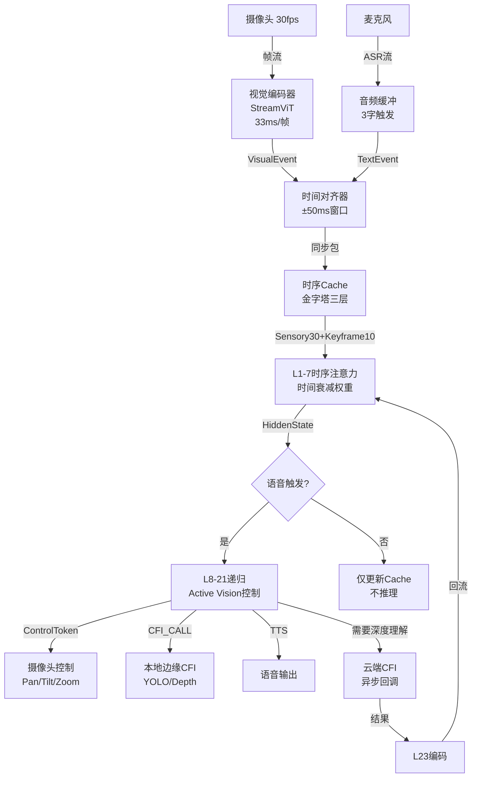
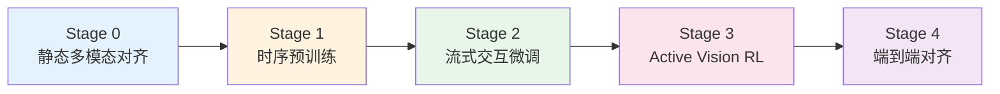

# 流式认知架构

针对**实时视频流+语音交互**的机器人场景，核心挑战是**时序连续性**和**实时性约束**（<200ms延迟）。这需要将Hydra从"离散请求-响应"模式改造为**流式认知架构（Streaming Cognitive Architecture）**。

以下是专门的架构设计方案：

---

## 1. 范式转换：从"帧"到"流"（Frame → Stream）

### 1.1 视频流的事件化抽象

不再将视频视为"一张张图片"，而是**连续视觉事件流**：

```python
class VisualStreamEvent(CognitiveEvent):
    """
    摄像头视频流的基本单元（30fps → 每33ms一个事件）
    """
    timestamp: float          # 精确时间戳（ms级）
    frame_id: int            
    visual_tokens: Tensor     # 当前帧编码（64 tokens，类似之前设计）
    motion_vector: Tensor     # 光流/运动特征（用于检测显著变化）
    saliency_score: float     # 显著性分数（由L0实时计算）
    
    # 与语音的时间对齐
    aligned_audio_text: Optional[str]  # 同时间戳的ASR文本（±50ms内）
```

**关键设计**：**时间感知的Prefix Cache**（Temporal Prefix Cache）

```python
class TemporalPrefixCache:
    """
    支持时序衰减的视觉Cache（区别于静态图像Cache）
    """
    def __init__(self, max_duration=10.0):  # 保留最近10秒
        self.event_buffer = []  # 时序环形缓冲区
        self.decay_factor = 0.9  # 时间衰减系数
        
    def add_event(self, event: VisualStreamEvent):
        # 1. 空间压缩：保留关键帧，丢弃冗余
        if self.is_redundant(event):
            return  # 跳过相似帧（节省计算）
            
        # 2. 时间权重：新帧权重高，旧帧指数衰减
        current_time = time.time()
        for old_event in self.event_buffer:
            dt = current_time - old_event.timestamp
            old_event.temporal_weight = self.decay_factor ** (dt / 0.1)  # 每100ms衰减
            
        self.event_buffer.append(event)
        self.evict_old_events()
    
    def is_redundant(self, new_event) -> bool:
        """
        基于光流/特征相似度判断是否为冗余帧
        """
        if not self.event_buffer:
            return False
        last_event = self.event_buffer[-1]
        # 计算特征相似度
        sim = F.cosine_similarity(new_event.visual_tokens, last_event.visual_tokens)
        motion_magnitude = torch.norm(new_event.motion_vector)
        
        # 相似度高且运动小 → 冗余（降低采样率）
        return sim > 0.95 and motion_magnitude < 0.1
```

---

## 2. L0层：流式多模态适配器（Streaming L0）

### 2.1 双缓冲架构（Double Buffering）

为了处理**连续视频流+流式语音**的并发输入：

```python
class StreamingL0_Adapter(nn.Module):
    def __init__(self):
        super().__init__()
        # 视觉流编码器（轻量，支持在线处理）
        self.visual_stream_encoder = StreamVisionTransformer(
            patch_size=14,
            stride=7,  # 重叠Patch，保证时序连续性
            fps=30
        )
        
        # 语音流（ASR结果缓冲）
        self.audio_buffer = StreamingTextBuffer(chunk_size=3)  # 每3个字触发一次
        
        # 时间对齐器：将视觉和语音对齐到统一时间轴
        self.temporal_aligner = TemporalAligner(window_ms=100)
        
    def stream_forward(self, 
                      video_frame: Optional[Tensor], 
                      audio_chunk: Optional[str],
                      current_time: float):
        """
        实时流式处理入口（每33ms调用一次）
        """
        events = []
        
        # 处理视频帧（如果有）
        if video_frame is not None:
            vis_event = self.process_video_frame(video_frame, current_time)
            events.append(vis_event)
            
        # 处理语音文本（如果有新ASR结果）
        if audio_chunk is not None:
            text_event = self.process_audio_text(audio_chunk, current_time)
            events.append(text_event)
            
        # 时间对齐：将±50ms内的事件打包为"同步认知包"
        synchronized_packet = self.temporal_aligner.align(events)
        
        # 生成统一事件流（保持Hydra格式）
        return self.encode_to_unified_stream(synchronized_packet)
```

### 2.2 主动视觉机制（Active Vision）

**关键创新**：机器人可以**主动控制摄像头**（类似人类"转头看"），与Hydra的L22控制层联动：

```python
# 扩展L22控制标记（支持机器人控制）
ROBOT_CONTROL_TOKENS = {
    'FOCUS_GAZE': 210,        # 聚焦视野中心
    'PAN_LEFT': 211,          # 摄像头左转
    'PAN_RIGHT': 212,         # 摄像头右转
    'ZOOM_IN': 213,           # 放大查看细节
    'TRACK_OBJECT': 214,      # 跟踪特定物体（需要object ID）
    'STOP_STREAM': 215,       # 暂时关闭视觉流（省电/隐私）
}

class ActiveVisionController:
    """
    连接Hydra递归决策与摄像头硬件
    """
    def __init__(self):
        self.camera = RobotCamera()
        self.current_attention_map = None  # 当前注意力热力图
        
    def on_control_token(self, token_id: int, context: Tensor):
        if token_id == ROBOT_CONTROL_TOKENS['FOCUS_GAZE']:
            # 根据L8-21的Attention Weight计算聚焦点
            attention_weights = self.extract_attention(context)
            target_point = self.compute_saliency_center(attention_weights)
            self.camera.move_gaze(target_point)  # PTZ摄像头控制
            
        elif token_id == ROBOT_CONTROL_TOKENS['TRACK_OBJECT']:
            # L12-15的MoE识别出需要跟踪的物体
            object_embedding = self.extract_object_query(context)
            self.camera.enable_tracking(object_embedding)
            
        elif token_id == ROBOT_CONTROL_TOKENS['ZOOM_IN']:
            # 类似"仔细看"的物理动作
            self.camera.zoom(2.0)  # 2倍放大
            # 触发L0重新编码高分辨率ROI
            return "REENCODE_REQUEST"
```

---

## 3. 时序感知的递归机制（L1-7改造）

### 3.1 时间衰减的Prefix Cache

静态图像的Cache是**等权重**的，但视频流需要**时间衰减**（越近的帧越重要）：

```python
class StreamingPrefixCache:
    """
    支持时序权重的KV Cache（L1-7改造）
    """
    def __init__(self):
        self.cache = []
        self.temporal_weights = []
        
    def update_with_decay(self, new_kv, timestamp):
        # 对历史Cache应用时间衰减
        for i in range(len(self.temporal_weights)):
            dt = timestamp - self.cache[i].timestamp
            self.temporal_weights[i] *= math.exp(-dt / 5.0)  # 5秒半衰期
            
        self.cache.append(new_kv)
        self.temporal_weights.append(1.0)  # 新帧权重为1
        
    def apply_to_attention(self, query):
        """
        在Attention计算中融入时间权重
        """
        # 标准Attention: softmax(Q @ K^T / sqrt(d))
        # 时序Attention: softmax(Q @ K^T / sqrt(d) + log(temporal_weights))
        
        attn_scores = torch.matmul(query, self.cache.transpose(-2, -1))
        attn_scores = attn_scores / math.sqrt(query.size(-1))
        
        # 加入时间偏置（Temporal Bias）
        time_bias = torch.log(torch.tensor(self.temporal_weights))
        attn_scores += time_bias.unsqueeze(0).unsqueeze(0)
        
        return F.softmax(attn_scores, dim=-1)
```

### 3.2 关键帧记忆（Keyframe Memory）

视频流太长（10秒 = 300帧），全部缓存会导致：
- **显存爆炸**：300帧 × 64 tokens × 1152 dim × 2 bytes ≈ **44MB/秒**
- **注意力稀释**：早期帧淹没当前帧

**解决方案**：**金字塔Cache结构**

```python
class PyramidTemporalCache:
    """
    三层时序Cache（类似人类记忆：感觉记忆→工作记忆→长期记忆）
    """
    def __init__(self):
        # L1：感觉缓存（最近1秒，30帧，全精度）
        self.sensory_buffer = deque(maxlen=30)
        
        # L2：工作记忆（最近10秒，关键帧，10帧，压缩存储）
        self.working_memory = []
        
        # L3：长期记忆（通过L23编码为Compact Token，进入标准Prefix Cache）
        self.long_term_token = None
        
    def process_frame(self, frame_event):
        # L1：直接缓存最新帧
        self.sensory_buffer.append(frame_event)
        
        # 检测关键帧（场景变化、显著物体出现）
        if self.is_keyframe(frame_event):
            compressed = self.compress_frame(frame_event)
            self.working_memory.append(compressed)
            
            # 若工作记忆满，摘要到长期记忆（触发L23 Observation Encoding）
            if len(self.working_memory) > 10:
                summary = self.summarize_working_memory()
                self.long_term_token = summary  # 进入标准Hydra Cache
                
    def get_cache_for_attention(self):
        """
        返回给L1-7的Cache：L1全量 + L2压缩 + L3 Token
        总长度控制在 30 + 10 + 1 = 41个"事件"，而非300帧
        """
        return (
            list(self.sensory_buffer) + 
            self.working_memory + 
            ([self.long_term_token] if self.long_term_token else [])
        )
```

---

## 4. 实时性保障机制（<200ms延迟）

### 4.1 流式推理流水线（Pipeline Parallelism）

```python
class StreamingInferencePipeline:
    """
    流水线：编码 → 缓存 → 推理 → 输出
    重叠计算以隐藏延迟
    """
    def __init__(self):
        self.l0_stage = L0_Streaming()
        self.l1_7_stage = L1_7_TemporalCache()
        self.l8_25_stage = HydraRecursion()
        
        # 使用CUDA Stream重叠
        self.streams = {
            'vision': torch.cuda.Stream(),
            'inference': torch.cuda.Stream(),
            'output': torch.cuda.Stream()
        }
        
    def run_async(self, video_stream, audio_stream):
        """
        异步流水线：
        T时刻：处理帧N的视觉编码
        T+33ms：帧N进入L1-7，同时处理帧N+1的视觉编码
        """
        with torch.cuda.stream(self.streams['vision']):
            visual_event = self.l0_stage.encode_video(frame_n)
            
        with torch.cuda.stream(self.streams['inference']):
            # 与视觉编码并行
            self.l1_7_stage.update_cache(visual_event)
            hidden = self.l1_7_stage.forward()
            
            # 检查是否需要立即响应（语音触发）
            if self.detect_speech_trigger(audio_stream):
                output = self.l8_25_stage.quick_response(hidden)
                return output
```

### 4.2 语音触发机制（Speech-Driven Attention）

机器人不需要每帧都"思考"，而是**由语音事件触发深度推理**：

```python
def should_trigger_recursion(self, audio_buffer, visual_salient_change):
    """
    判断是否需要触发昂贵的L8-25递归
    节省90%计算量（仅当需要回答问题时才思考）
    """
    # 条件1：用户说完一句话（ASR检测到停顿）
    if audio_buffer.detect_utterance_end():
        return True, "USER_QUERY"
        
    # 条件2：视觉显著变化（物体移动/出现）且用户正在看
    if visual_salient_change and self.user_gaze_following():
        return True, "VISUAL_ALERT"
        
    # 条件3：定期维护（每5秒一次轻量递归，保持上下文）
    if self.time_since_last_think > 5.0:
        return True, "MAINTENANCE"
        
    return False, None
```

---

## 5. 与CFI的整合：实时工具调用

### 5.1 视觉CFI的流式化

标准CFI（如GPT-4V）有**5秒超时**，不适合实时流。需要**预加载+流式返回**：

```python
class StreamingVisualCFI:
    """
    持续维护与视觉API的连接，支持快速查询
    """
    def __init__(self):
        self.connection = PersistentWebSocket(url="wss://api.vision.com/stream")
        self.current_scene_description = None  # 持续更新的场景描述
        
    def async_update(self, keyframe):
        """
        后台线程：持续发送关键帧，获取场景理解（无需等待）
        """
        self.connection.send(keyframe)
        # 异步接收，不阻塞主循环
        
    def on_query(self, question: str) -> str:
        """
        当L22触发CFI_CALL时，立即返回已缓存的最新理解（<100ms）
        而非等待API响应
        """
        return self.current_scene_description
```

### 5.2 硬件级CFI（边缘计算）

对于机器人场景，视觉处理应在**本地GPU/TPU**完成（避免网络延迟）：

```yaml
CFI_Hierarchy:
  local_edge:
    - object_detection: "YOLOv8-nano (5ms)"
    - depth_estimation: "MiDaS-small (10ms)"
    - face_recognition: "Local FaceNet (8ms)"
    
  cloud_backup:
    - scene_understanding: "GPT-4V (500ms)"
    - complex_reasoning: "Cloud Hydra (1s)"
    
  trigger_logic:
    - "简单问题（'那是什么？'）→ 本地YOLO直接回答"
    - "复杂问题（'为什么那个会动？'）→ 触发云端CFI"
```

---

## 6. 架构总览（Hydra-SKILL-Robot v1.0）



---

## 7. 实施关键与风险控制

### 7.1 关键参数配置

```yaml
StreamingConfig:
  video:
    fps: 30
    resolution: [640, 480]  # 低分辨率快速处理
    keyframe_interval: 10   # 每10帧选1个关键帧
    
  temporal_cache:
    sensory_duration: 1.0    # 1秒感觉记忆（30帧）
    working_memory_size: 10  # 10个关键帧
    decay_half_life: 5.0     # 5秒半衰期
    
  latency_budget:
    total_p99: 200ms
    breakdown:
      vision_encode: 30ms
      l1_7_update: 20ms
      trigger_decision: 5ms
      l8_25_inference: 100ms
      tts_first_byte: 45ms
      
  active_vision:
    enabled: true
    gaze_update_freq: 10Hz   # 摄像头控制10fps（低于视频30fps）
    track_latency: 50ms
```

### 7.2 风险控制

| 风险 | 现象 | 缓解方案 |
|------|------|---------|
| **时序错乱** | 语音回答与画面不同步（延迟） | 时间戳强制对齐，延迟>200ms的帧丢弃 |
| **注意力漂移** | 机器人"发呆"看无关物体 | Active Vision的L22控制加入**用户意图跟踪**（优先看用户看的方向） |
| **计算过载** | 30fps导致GPU 100%占用 | 动态降采样：静止场景降至5fps，运动场景恢复30fps |
| **隐私泄露** | 视频持续上传云端 | 本地CFI优先，视频流不离开边缘设备，仅提取的Compact Token上传 |

### 7.3 与v1.8的兼容性

- **Fallback模式**：如果视觉流中断，自动退化为**纯文本Hydra**（L0跳过视觉编码）。
- **Cache清理**：当机器人"转头"（FOCUS_GAZE触发）时，**清空Sensory Buffer**（旧视野不再相关），但保留Working Memory中的物体语义（防止"转头就忘"）。

---

**总结**：实时视频流机器人场景需要将Hydra改造为**流式事件驱动架构**，核心是在L0引入**时间对齐器**、在L1-7引入**金字塔时序Cache**、在L22引入**Active Vision控制**。这样既能保持Hydra的递归、回溯、CFI能力，又能满足实时性要求。


针对**Hydra-SKILL-Robot v1.0**（实时视频流+语音交互）的训练，核心挑战是**从离散静态数据学习连续时序推理**和**机器人控制策略**。以下是分阶段训练方案：

---

# 流式认知训练

## 1. 训练范式总览



**训练原则**：
- **渐进时序化**：先学静态图，再学短视频（3-5s），最后学长视频（30s+）
- **冻结保护**：L1-7在Stage 0-2保持冻结，防止破坏Prefix Cache机制
- **模拟流式**：即使使用预录视频，也通过**时间窗口采样**模拟实时流

---

## 2. 分阶段训练方案

### Stage 0: 静态多模态对齐（Week 1-2）

**目标**：让L0的视觉编码器与文本空间对齐，建立基础视觉理解。

```python
# 数据构造
Data_Stage0 = {
    "source": ["LAION-5B", "COCO", "Visual Genome"],
    "format": "(image, caption)",
    "size": "2M samples",
    
    # 特殊构造：模拟机器人视角
    "robot_view_augmentation": {
        "random_crop": "0.7-1.0",      # 模拟摄像头移动
        "motion_blur": "0.3概率",       # 模拟运动模糊
        "egocentric_transform": True    # 第一人称视角增强
    }
}

# 训练配置
Training_Stage0 = {
    "freeze": ["L1-25"],              # 绝对冻结所有Transformer
    "trainable": ["L0.visual_stream_encoder", "L0.temporal_aligner"],
    
    "loss": {
        "itc": "Image-Text Contrastive (CLIP-style)",
        "itm": "Image-Text Matching",
        "mlm": "Masked Language Modeling (根据图像预测被遮罩文本)"
    },
    
    "lr": 2e-4,
    "batch": 256,
    "precision": "bf16"
}
```

**关键技巧**：
- **时序预演**：虽然是静态图，但在数据加载器中加入**时间戳伪造**（给每张图随机分配`t`），让模型适应时间编码。

---

### Stage 1: 时序预训练（Week 3-4）

**目标**：学习视频时序建模（运动理解、时序关系、关键帧提取）。

```python
# 数据构造（核心难点）
Data_Stage1 = {
    "source": ["InternVid", "WebVid-10M", "Ego4D"],
    
    "sampling_strategy": {
        "clip_length": "5-30 seconds",
        "fps": 4,  # 抽帧到4fps，降低计算（模拟流式降采样）
        "resolution": "224x224",
        
        # 构造时序问答对（Temporal QA）
        "temporal_annotation": {
            "before_after": "事件A发生在事件B之前吗？",
            "motion_description": "物体正在向左移动还是向右？",
            "change_detection": "这两帧之间发生了什么变化？"
        }
    },
    
    # 模拟流式Cache训练
    "streaming_simulation": {
        "window_size": 10,      # 10帧 = 2.5秒（4fps）
        "stride": 4,            # 50%重叠，模拟滑动窗口
        "random_drop": 0.2      # 随机丢弃帧，模拟网络丢包/传感器噪声
    }
}

# 训练配置
Training_Stage1 = {
    "freeze": ["L0.perceptual_experts", "L8-25"],  # 冻结视觉编码器和递归层
    "trainable": [
        "L1-7.temporal_cache",       # 时序Cache机制
        "L1-7.temporal_decay_weights",  # 时间衰减参数
        "pyramid_memory"             # 三层金字塔记忆
    ],
    
    "loss": {
        "temporal_ordering": "排序损失（判断帧顺序）",
        "next_frame_prediction": "预测下一帧特征（类似LM的next token）",
        "contrastive_temporal": "拉近相邻帧，推远远离帧"
    },
    
    # 时序特殊技巧
    "curriculum_learning": {
        "week3": "静态图+轻微运动（摄像机平移）",
        "week4": "复杂运动（人手操作物体）+ 长时序依赖"
    }
}
```

**关键技术：Pyramid Cache训练**
- **监督信号**：人工标注关键帧（Keyframe Labels），训练L1-7的**关键帧检测器**（基于视觉显著性）。
- **损失函数**：
  ```python
  loss_keyframe = BCE(saliency_score, ground_truth_keyframe_mask)
  loss_compression = MSE(compressed_frame, original_frame)  # 自监督重建
  ```

---

### Stage 2: 流式交互微调（Week 5-6）

**目标**：学习**音频-视频-文本**三模态对齐，以及**流式对话**能力。

```python
# 数据构造（最难构造的数据）
Data_Stage2 = {
    "source": [
        "AVSD (Audio-Visual Scene-Aware Dialog)", 
        "SIMMC 2.0 (多模态对话)",
        "YouCook2 (烹饪视频+解说)",
        "自定义机器人交互数据"
    ],
    
    "data_format": {
        "video_segment": "30-60 seconds",
        "audio_transcription": "ASR文本+时间戳",
        "dialogue_turns": [
            {"timestamp": 5.2, "speaker": "user", "text": "那是什么？"},
            {"timestamp": 5.8, "speaker": "robot", "text": "那是一个红色的按钮", 
             "attention_map": "visual_attention_at_5.8s"},  # 需要标注机器人看哪里
            {"timestamp": 8.0, "speaker": "user", "text": "按下它"}
        ]
    },
    
    # 流式模拟核心：构造交错事件流
    "event_stream_construction": {
        "text_events": "ASR结果按字切分（流式输入模拟）",
        "visual_events": "4fps连续帧",
        "alignment": "±100ms内的事件视为同步"
    }
}

# 训练配置（类似v1.8 Stage 2但扩展）
Training_Stage2 = {
    "freeze": ["L1-7"],  # 保持时序Cache冻结，仅训练融合层
    "trainable": ["L8-21", "L22", "L23"],
    
    "streaming_training": {
        "simulated_latency": {
            "audio_delay": "100-300ms",      # 模拟ASR延迟
            "visual_buffer": "3 frames",      # 视觉缓冲3帧（模拟L0缓存）
            "max_context": "10 seconds"       # 模拟长对话截断
        },
        
        # 强制时序对齐损失
        "temporal_consistency_loss": """
        如果文本提到"这个"，要求L8-21的Attention必须聚焦到当前帧的对应物体
        通过Grad-CAM监督Attention权重
        """
    },
    
    "multi_task": {
        "captioning": "描述当前看到的场景",
        "qa": "回答关于当前帧的问题", 
        "grounding": "文本中的词 grounding 到视觉区域（Teaching Attention）"
    }
}
```

**关键技巧：流式掩码训练**
- 在训练时**随机遮蔽未来信息**，强制模型基于当前已接收的流式信息做决策，而非"偷看"未来帧。

---

### Stage 3: Active Vision 强化学习（Week 7）

**目标**：训练L22生成控制Token（`PAN_LEFT`, `ZOOM_IN`等），使机器人学会**主动观察策略**。

```python
# 数据与模拟环境
ActiveVision_Env = {
    "type": "Virtual Robot Simulator (Habitat/AI2-THOR)",
    "tasks": [
        "visual_search": "找到红色杯子（需要转动摄像头）",
        "inspection": "仔细检查电路板上的标签（需要Zoom In）",
        "tracking": "跟随移动的人（需要持续Pan）"
    ],
    
    "state_space": {
        "visual_input": "当前摄像头画面",
        "cache_state": "L1-7的Temporal Cache",
        "text_query": "用户指令（如'看左边'）"
    },
    
    "action_space": [
        "FOCUS_GAZE", "PAN_LEFT", "PAN_RIGHT", 
        "ZOOM_IN", "ZOOM_OUT", "STOP"
    ]
}

# RL训练配置（PPO算法）
RL_Training = {
    "algorithm": "PPO",
    "reward_function": {
        "completion": "+10 (完成任务)",
        "step_penalty": "-0.1 (每步惩罚，鼓励快速完成)", 
        "gaze_alignment": "+1 (Attention权重与目标区域IoU)",
        "redundancy_penalty": "-0.5 (重复无意义移动)"
    },
    
    "policy": "L22_Control_Gateway",  # 只训练策略头
    "value_network": "单独的价值头（共享L1-7 Backbone）",
    
    "constraints": {
        "max_steps": 20,           # 最多20步Active Vision
        "latency_budget": "每步<50ms",
        "safety_rule": "禁止快速转动（防止机器人损坏）"
    }
}
```

**混合训练（RL + Imitation）**：
- **模仿学习**：先用人标注的"注视轨迹"（Gaze Tracking Data）预训练（Behavior Cloning）。
- **强化学习**：再用PPO微调，优化效率。

---

### Stage 4: 端到端对齐与人类反馈（Week 8）

**目标**：整体优化，确保实时性、安全性和人类偏好一致。

```python
# RLHF for Multimodal
Stage4_Config = {
    "data": "人类与机器人的真实交互日志（过滤后的高质量数据）",
    
    "reward_model_training": {
        "preferences": [
            "及时响应 > 延迟但准确",
            "主动确认模糊指令 > 盲目执行",
            "视觉确认（看一眼再回答） >  hallucination"
        ],
        "modality": "多模态奖励模型（同时看视频流和文本回答）"
    },
    
    "dpo_training": {
        "positive_examples": "人类认可的交互轨迹",
        "negative_examples": "模型犯的错误（如：没看就回答、看错物体）",
        "target_layers": ["L8-21", "L22"]  # 只微调高层
    },
    
    # 实时性蒸馏
    "latency_distillation": {
        "teacher": "大模型（7B）离线推理结果（高质量但慢）",
        "student": "Hydra-Robot（0.5B）流式推理",
        "loss": "输出一致性 + 推理速度约束"
    }
}
```

---

## 3. 关键训练技巧详解

### 3.1 时序Cache的梯度传播

**问题**：Pyramid Cache涉及**离散决策**（是否存为关键帧），不可微。

**解决方案**：
```python
# 使用Gumbel-Softmax近似（Straight-Through Estimator）
saliency_score = compute_saliency(frame)  # [0,1]
keyframe_decision = (saliency_score > 0.5).float()

# 前向：硬决策（离散）
# 反向：通过saliency_score传播梯度（软梯度）
keyframe_decision = keyframe_decision - saliency_score.detach() + saliency_score
```

### 3.2 流式模拟的数据加载器

```python
class StreamingDataLoader:
    """
    将预录视频模拟为实时流
    """
    def __init__(self, video_path, simulate_fps=4):
        self.video = load_video(video_path)
        self.buffer = deque(maxlen=simulate_fps * 5)  # 5秒缓冲
        
    def __iter__(self):
        for frame in self.video:
            self.buffer.append(frame)
            
            # 模拟流式：每250ms（4fps）yield一次当前buffer
            if len(self.buffer) % 1 == 0:  # 每帧都处理
                yield {
                    "visual_stream": list(self.buffer),
                    "audio_text": get_asr_in_window(current_time, window=0.1),
                    "timestamp": current_time
                }
                
            # 模拟网络抖动：随机sleep
            time.sleep(random.uniform(0.02, 0.03))  # 20-30ms波动
```

### 3.3 灾难性遗忘防护

```python
# 文本能力锚定（Stage 2-4持续进行）
Text_Anchor_Loss = {
    "frequency": "每100个多模态batch，插入10个纯文本batch",
    "distillation": {
        "teacher": "原始v1.8模型（冻结）",
        "student": "Hydra-Robot",
        "loss": "KL(L8-21输出差异) + 文本任务准确率"
    }
}
```

### 3.4 混合精度与梯度检查点

```python
# 针对视频训练的显存优化
Optimization = {
    "gradient_checkpointing": True,  # 在L1-7启用（牺牲30%速度换50%显存）
    "mixed_precision": "bf16",
    
    # 视频特殊优化：帧间梯度截断（防止BPTT长度爆炸）
    "truncated_bptt": {
        "chunk_size": 16,  # 每16帧截断一次梯度
        "preserve_cache_grad": False  # Cache不反向传播（仅作为状态）
    }
}
```

---

## 4. 数据标注规范（关键）

### 4.1 时序对齐标注工具

需要开发专门工具标注**多模态时间戳**：
```json
{
    "video_id": "robot_session_001",
    "events": [
        {"t": 0.0, "modality": "vision", "obj": "cup", "bbox": [100,200,50,50]},
        {"t": 0.0, "modality": "audio", "text": "拿那个", "phonemes": ["na", "ge"]},
        {"t": 0.3, "modality": "action", "gaze": [120, 220], "robot_state": "turning_head"},
        {"t": 0.8, "modality": "audio", "text": "杯子", "grounding": {"ref": "cup", "video_t": 0.0}}
    ]
}
```

### 4.2 Active Vision 轨迹标注

使用**眼动仪**或**人工标注**记录：
- **目标**：找到红色杯子
- **轨迹**：`[(0s, center), (0.5s, pan_left), (1.2s, found_cup), (1.3s, zoom_in)]`

---

## 5. 评估与验收标准

| 阶段 | 评估指标 | 通过标准 |
|------|---------|---------|
| **Stage 0** | Image Caption CIDEr | >110 |
| **Stage 1** | 时序排序准确率 | >85% |
| **Stage 2** | AVSD Dialog Accuracy | >75% + 人类满意度>4.0/5 |
| **Stage 3** | Active Vision任务成功率 | >80% (平均<5步完成) |
| **Stage 4** | 端到端延迟 | P99 < 200ms |
| **综合** | 文本能力保持 | MMLU下降<2% |

---

## 6. 实施路线图（3个月）

| 周 | 阶段 | 关键产出 |
|----|------|---------|
| 1-2 | Stage 0 | L0视觉编码器收敛，可视化特征聚类合理 |
| 3-4 | Stage 1 | 视频时序Loss下降，关键帧提取可视化合理 |
| 5-6 | Stage 2 | 流式对话Demo（预录视频+模拟ASR） |
| 7 | Stage 3 | 虚拟环境中机器人主动视觉策略可视化 |
| 8 | Stage 4 | 实机部署测试，延迟达标，红队测试通过 |

**关键风险**：**Stage 2的流式对齐数据最难获取**，建议优先与数据标注团队确认能否获得带时间戳的多模态对话数据，或先用公开数据集（AVSD）验证架构可行性。