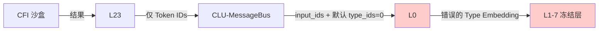
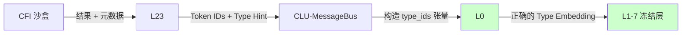
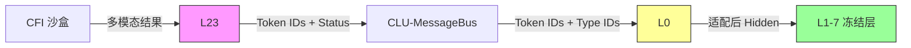

# 架构缺陷深度解析：Token Type IDs 生成链路缺失（数据流断层）

## 1. 问题核心定义
**问题描述**：
在 Hydra-SKILL v1.8.2 架构中，**L0 输入适配层（Input Adapter）** 的接口定义明确要求输入 `token_type_ids`（用于区分首轮用户输入、CFI 文本回流、CFI 向量回流、控制标记），但在 **L23 观察编码层** 到 **CLU-MessageBus** 再到 **L0** 的实际数据流实现中，**缺少生成并传递 `token_type_ids` 的具体逻辑**。

**文档矛盾点**：
*   **v1.8.2 Section 2.1 (L0 接口)**：`def forward(self, input_ids, token_type_ids, context)`，且代码中明确执行 `type_embeds = self.token_type_embed(token_type_ids)`。
*   **v1.8.2 Section 2.5 (L23 实现)**：`encode_cfi_result` 仅返回 `token_id` 和 `embedding`，**未返回 `type_id`**。
*   **v1.8.2 Section 1.1 (数据流图)**：标注 `L23 -->|Token IDs + Type=3| L0`，但 **Section 2.2 (CLU-MessageBus)** 的代码实现中，调用 `self.model.l0(obs, context)` 时**未构造 `token_type_ids` 张量**。

**结论**：这是一个典型的**接口定义与实现脱节**问题。若不及时修复，模型将默认使用全 0 的 Type IDs（即“首轮用户输入”类型），导致 CFI 回流数据未经过正确的类型嵌入校准，直接冲击已冻结的 L1-7 层。

---

## 2. 数据流断层分析

### 2.1 当前错误数据流（Broken Flow）

**执行逻辑**：
1.  CFI 返回结果（例如搜索到的法律条文）。
2.  L23 编码为 Token IDs（例如 `[50012, ..., 50013]`）。
3.  CLU-MessageBus 接收 Tokens，准备调用 L0。
4.  **缺失环节**：Bus 未创建对应的 `token_type_ids` 张量（例如全 1 张量）。
5.  L0 接收 `input_ids`，若框架默认 `token_type_ids` 为 0，则执行 `base_embeds + type_embed_0`。
6.  **后果**：L0 将“工具返回结果”当作“用户输入”处理，`domain_adaptation` 门控虽可能通过 `context['mode']` 触发，但**基础嵌入层已丢失类型语义**。

### 2.2 修正后正确数据流（Fixed Flow）

**执行逻辑**：
1.  L23 编码时标记数据来源（Text/Vector/Timeout）。
2.  CLU-MessageBus 根据来源映射为 Type ID（1/2/3）。
3.  Bus 创建与 `input_ids` 形状一致的 `token_type_ids` 张量。
4.  L0 执行 `base_embeds + type_embed_1`，激活正确的分布适配路径。

---

## 3. 影响论证（为什么要修复？）

### 3.1 数学影响：嵌入空间偏移
L0 的嵌入计算公式为：
$$ H_{input} = \text{Embed}(ID) + \text{TypeEmbed}(Type) + \text{RoPE}(Pos) $$

*   **预期**：CFI 回流时，`Type=1`，$\text{TypeEmbed}(1)$ 是一个学习过的向量，用于将 CFI 数据的分布“平移”到 L1-7 能理解的分布空间。
*   **现状**：若缺失，`Type=0`，$\text{TypeEmbed}(0)$ 是用户输入的向量。
*   **风险**：由于 L1-7 在 Stage 1 后**冻结（Freeze）**，其 LayerNorm 统计量和权重是基于“用户输入分布”校准的。CFI 数据（通常是结构化文本或向量）的分布与用户自然语言不同。若缺少 Type Embedding 的校准，**L1-7 的激活值将发生分布偏移（Activation Shift）**，导致特征提取失效。

### 3.2 架构一致性风险
*   **v1.8.1 Section 2.1** 明确引入 `token_type_embed` 是为了解决“CFI 回流与首轮输入分布偏移”。
*   **v1.8.2 Section 0.1** 将"L0 分布适配”列为 P0 级修正。
*   **矛盾**：若生成链路缺失，v1.8.2 的核心修正点实际上**未落地**，架构退化为 v1.7 的隐式处理模式，违背了 v1.8 的设计初衷。

### 3.3 边界场景失效（CFI Timeout）
*   **v1.8.2 Section 2.5** 定义 `CFI_TIMEOUT` 为 `token_id=50020`。
*   **问题**：若 L0 不知道这个 Token 是“超时控制标记”（Type=3），它可能会尝试对其进行正常的语义编码，而不是触发 `context['mode'] == 'cfi_return'` 中的特殊 fallback 逻辑。
*   **后果**：模型可能将“超时”误认为是一个普通词汇，导致无法触发** Learned Fallback** 机制，进而产生幻觉。

---

## 4. 建议修复方案

### 4.1 方案概述
在 **CLU-MessageBus** 中显式增加 Type ID 映射与构造逻辑，确保调用 L0 时传入正确的 `token_type_ids` 张量。L23 仅需返回类型提示，具体张量构造由 Bus 统一处理（符合 Bus 作为协调器的定位）。

### 4.2 代码修正示例

#### 步骤 1：L23 增加类型元数据返回（v1.8.2 Section 2.5 修正）
```python
# Hydra-SKILL v1.8.2 / Section 2.5 L23ObservationEncoder
class L23ObservationEncoder(nn.Module):
    def encode_cfi_result(self, result, status):
        # ... 原有编码逻辑 ...
        token_ids = [...] 
        
        # ✅ 新增：返回类型提示 (0=User, 1=CFI_Text, 2=CFI_Vector, 3=Control)
        if status == "TIMEOUT":
            type_hint = 3  # Control/Timeout
        elif result.type == 'vector':
            type_hint = 2  # CFI Vector
        else:
            type_hint = 1  # CFI Text
            
        return token_ids, type_hint
```

#### 步骤 2：CLU-MessageBus 构造 Type IDs 张量（v1.8.2 Section 2.2 修正）
```python
# Hydra-SKILL v1.8.2 / Section 2.2 CLU-MessageBus
class CLU_MessageBus:
    def prepare_l0_input(self, token_ids, type_hint, device):
        """
        ✅ 关键修正：构造与 input_ids 形状一致的 token_type_ids
        """
        input_ids = torch.tensor(token_ids, device=device).unsqueeze(0)  # [1, seq_len]
        
        # 创建 type_ids 张量，填充对应的类型 ID
        token_type_ids = torch.full_like(
            input_ids, 
            fill_value=type_hint, 
            dtype=torch.long, 
            device=device
        )
        
        return input_ids, token_type_ids

    def recursive_solve(self, session, user_input):
        # ... 首轮逻辑 ...
        
        # CFI 回流逻辑
        elif control == CFI_CALL:
            result = cfi_client.execute(...)
            obs_tokens, type_hint = self.model.l23.encode_cfi_result(result, status)
            
            # ✅ 调用修正后的准备函数
            input_ids, token_type_ids = self.prepare_l0_input(obs_tokens, type_hint, device)
            
            context = {
                'mode': 'cfi_return',
                'global_step': self.global_step,
                'position_offset': session.prefix_len
            }
            
            # ✅ 传入 token_type_ids
            hidden = self.model.l0(input_ids, token_type_ids, context)
```

### 4.3 配置修正（v1.8.2_config.yaml）
```yaml
# hydra_v1.8.2_config.yaml
l0_input_adapter:
  vocab_size: 50520
  type_vocab_size: 4  # ✅ 明确定义 4 种类型
  type_mapping:
    0: "first_turn_user"
    1: "cfi_text_return"
    2: "cfi_vector_return"
    3: "control_marker"  # 含 Timeout
```

---

## 5. 验收标准（Phase 0 验证补充）

建议在 **v1.8.2 Phase 0 验证计划** 中增加 **Day 1.5** 或合并入 **Day 6 (CFI 超时端到端)**：

| 测试项 | 验收标准 | 验证方法 |
| :--- | :--- | :--- |
| **Type IDs 链路完整性** | L0 接收到的 `token_type_ids` 非全 0 | 在 L0 `forward` 入口加断言：`assert token_type_ids.sum() > 0` (当 mode=cfi_return) |
| **嵌入向量区分度** | Type 0 与 Type 1 的 Embedding 余弦相似度 < 0.8 | 提取 `self.token_type_embed.weight`，计算向量间相似度 |
| **CFI 超时识别率** | 发送 Type=3 标记时，L0 门控正确激活 | 监控 `adaptation_gate` 输出，确保 Type=3 时 fallback 逻辑触发 |

## 6. 架构师结论
**该问题属于 P0 级架构断层**。虽然 L0 层内部逻辑已完善，但上游数据供给缺失，导致整个“分布适配”机制形同虚设。
*   **风险等级**：🔴 **高**（直接影响冻结层 L1-7 的推理 correctness）。
*   **修复成本**：🟢 **低**（仅需修改 CLU-MessageBus 约 20 行代码）。
*   **执行建议**：必须在 **Phase 0 Day 1** 完成修复，否则后续所有训练数据（CFI 回流部分）都将携带错误的类型嵌入，导致模型学到错误的分布映射。

**请立即更新 v1.8.2 实现代码库，并在 Phase 0 验证清单中显式加入"Type IDs 链路检查”。**


# 架构决策深度解析：为何 CFI 回流必须经过 L23 编码

## 1. 问题描述
**用户疑问**：
CFI（认知框架接口）返回的法律条文本质上是文本上下文，为何不能直接送入 L0 输入适配层，而必须经过 L23 Observation Encoder 编码为 Token IDs 后再送入 L0？这是否增加了不必要的延迟和复杂度？

**核心矛盾**：
用户视角将 CFI 返回数据等同于“用户输入”，认为两者语义一致。但架构视角下，**CFI 返回数据是“观察结果（Observation）”而非“原始输入（Input）”**，两者在模态、分布、控制语义上存在本质差异，直接输入会破坏 v1.8.2 的**冻结层分布一致性**与**控制流闭环**。

---

## 2. 建议方案
**维持 v1.8.2 设计**：**CFI Result → L23 编码 → Token IDs + Type Hint → CLU 映射 Type ID → L0 适配 → L1**。
**严禁**将 CFI 原始文本/向量直接送入 L0。

**修正后的数据流链路**：


---

## 3. 论证思路

### 3.1 事实与条件认定
| 维度 | 事实依据 (Document Reference) | 架构约束条件 |
| :--- | :--- | :--- |
| **模态一致性** | **v1.8.2 Section 2.5**：CFI 返回包含 Text/Vector/Structured 三种模态。L0 输入仅接受 `input_ids` (Token IDs)。 | L0 的 `token_embedding` 层只能查找离散 ID，无法处理连续向量或原始 JSON 字符串。 |
| **分布一致性** | **v1.8.1 Section 2.1**：L1-7 在 Stage 1 后**冻结 (`freeze_after_pretrain: True`)**。其 LayerNorm 统计量基于“用户自然语言分布”校准。 | CFI 返回的法律条文/搜索结果是“高密度信息文本”，分布与用户口语差异巨大。若不经适配直接输入，会导致 L1-7 **Activation Shift**。 |
| **控制语义** | **v1.8.2 Section 2.5**：`CFI_TIMEOUT` 需编码为特殊 Token ID (50020) + 全零向量。 | 原始文本无法携带“超时”这一系统级状态信号，模型无法区分“工具返回了空结果”还是“工具超时了”。 |
| **位置连续性** | **v1.8.2 Section 2.3**：L0 负责增量 RoPE (`position_offset`)。 | L0 需要知道输入是“续写”而非“新开始”。L23 编码后的 Token 序列长度需明确，以便 L0 计算位置偏移。 |

### 3.2 核心论证逻辑

#### 论证 1：模态归一化（L23 的核心职责）
*   **场景**：CFI 返回一个法律条文的向量嵌入（Vector）或结构化 JSON，而非纯文本。
*   **若直连 L0**：L0 的 `token_embedding` 无法处理向量。若强行转为字符串，会丢失语义且消耗大量 Token。
*   **v1.8.2 方案**：L23 负责**多模态归一化**。
    *   **Text** → 标准 Tokenizer → Token IDs
    *   **Vector** → VQ 量化 (Codebook) → Compact Token IDs (50064+)
    *   **JSON** → 压缩编码 → Compact Token IDs
*   **结论**：L23 是**外部协议到内部协议的转换器**。没有 L23，模型无法理解非文本工具结果。
    > 引用：v1.8.2 Section 2.5 `L23ObservationEncoder.encode_cfi_result` 明确定义了 Vector/Structured 到 Token 的映射。

#### 论证 2：分布适配与冻结层保护（L0+L23 的协同）
*   **场景**：Stage 2 训练时，L1-7 已冻结。CFI 回流大量专业法律文本。
*   **若直连 L0**：
    *   用户输入分布：`P_user(x)` (口语化，稀疏)
    *   CFI 返回分布：`P_cfi(x)` (专业化，密集)
    *   L1-7 的 LayerNorm 统计量 `μ, σ` 基于 `P_user` 计算。
    *   输入 `P_cfi` 导致 L1 激活值 `h = LN(x; μ, σ)` 发生偏移，特征提取失效。
*   **v1.8.2 方案**：
    1.  **L23 压缩**：将长文本压缩为 Compact Tokens，减少分布差异。
    2.  **L0 Type Embed**：`token_type_ids=1` (CFI Text) 触发特定的 Type Embedding，预先校正分布。
    3.  **L0 Domain Adapter**：门控机制 (`adaptation_gate`) 动态调整 CFI 数据的特征分布，使其匹配 L1-7 的预期。
*   **结论**：L23+L0 共同构成**分布滤波器**。跳过 L23 会导致 L0 的 Type Embedding 无法正确识别数据来源（因为 L23 返回 Status 供 CLU 映射 Type ID），进而导致适配失效。
    > 引用：v1.8.1 Section 2.1 `L0_InputAdapter` 中 `token_type_embed` 与 `domain_adaptation` 的设计初衷。

#### 论证 3：控制流闭环与超时处理（安全边界）
*   **场景**：CFI 调用超时（>5s）。
*   **若直连 L0**：只能返回一个字符串 "Timeout"。模型可能将其视为普通文本继续推理，导致无限循环或幻觉。
*   **v1.8.2 方案**：
    *   L23 检测到 Timeout → 返回 `token_id=50020` + `embedding=0`。
    *   CLU 映射 `type_id=3` (Control Marker)。
    *   L0 识别 `type_id=3` → 激活特殊 fallback 逻辑。
    *   L22 控制网关识别 `50020` → 触发终止或重试。
*   **结论**：L23 是**系统状态信号的注入点**。它将系统级事件（超时、错误）转化为模型可理解的语义 Token。
    > 引用：v1.8.2 Section 2.5 `encode_cfi_result` 中 `if status == "TIMEOUT"` 的特殊处理逻辑。

#### 论证 4：上下文压缩与效率（工程约束）
*   **场景**：CFI 返回 5000 字法律条文。
*   **若直连 L0**：占用 5000 Token 上下文，L8-21 循环计算量激增，显存爆炸。
*   **v1.8.2 方案**：L23 限制输出 `max_observation_tokens=512` (v1.8.2 Section 2.5)。通过摘要或 VQ 压缩，强制将观察结果压缩到 512 Token 内。
*   **结论**：L23 是**上下文流量控制器**，防止外部数据淹没模型上下文窗口。

### 3.3 代码级对比（Why L23 is Non-negotiable）

**❌ 错误方案（直连 L0）**：
```python
# 假设 CFI 返回原始文本
cfi_text = "根据刑法第 264 条..."
# 直接使用基础 Tokenizer (缺少 Type ID 映射)
input_ids = base_tokenizer.encode(cfi_text) 
# L0 无法区分这是用户输入还是 CFI 回流，默认 type_id=0
hidden = model.l0(input_ids, token_type_ids=torch.zeros_like(input_ids)) 
# 后果：L1 冻结层接收到分布偏移的输入，特征提取失效
```

**✅ 正确方案（v1.8.2 链路）**：
```python
# 1. L23 编码 (模态归一化 + 状态标记)
token_ids, status = model.l23.encode_cfi_result(cfi_result, status="SUCCESS")
# token_ids 可能包含 Compact 标记 (如 50012 [OBS_START])

# 2. CLU 映射 Type ID (分布标识)
# 根据 L23 返回的 status 或 token 范围，确定这是 CFI 数据
type_id = 1 if status == "SUCCESS" else 3 
token_type_ids = torch.full_like(token_ids, type_id)

# 3. L0 适配 (分布校正 + RoPE)
context = {'mode': 'cfi_return', 'position_offset': session.prefix_len}
hidden = model.l0(token_ids, token_type_ids, context)
# 结果：L0 激活 domain_adaptation，校正分布，L1 正常处理
```

---

## 4. 结论与风险提示
**结论**：
L23 不是冗余层，而是**外部认知世界与内部模型世界的协议网关**。它承担了**模态归一化、分布预过滤、控制信号注入、上下文限流**四大职责。跳过 L23 直接输入 L0 将导致：
1.  **多模态支持失效**（无法处理向量/结构化数据）。
2.  **冻结层分布偏移**（L1-7 性能下降）。
3.  **控制流断裂**（超时/错误无法被模型识别）。
4.  **上下文爆炸**（缺乏压缩机制）。

**风险提示**：
在 Phase 0 验证中，需重点检查 **L23 输出 Token 与 L0 Type ID 的映射一致性**（即之前评审指出的“数据流断层”问题）。确保 L23 返回的 `status` 能被 CLU 正确映射为 L0 需要的 `token_type_ids`，否则 L23 的编码将失去分布适配意义。

**行动建议**：
严格执行 v1.8.2 Section 6 Phase 0 **Day 6 (CFI 超时端到端)** 验证，确保 `L23 编码 -> CLU 映射 -> L0 识别` 全链路通畅。


# Hydra-SKILL v1.8.2 核心组件深度设计报告：L23 与 CLU

## 1. L23 Observation Encoder 深度设计
**定位**：外部认知世界与内部模型世界的**协议网关（Protocol Gateway）**。负责将异构的 CFI 执行结果标准化为模型可理解的离散 Token 序列。

### 1.1 架构细节 (v1.8.2 Section 2.5 增强)
L23 不是 Transformer 层，而是轻量级编码头（~5M 参数）。它必须处理三种模态及一种边界状态。

| 输入模态 | 处理逻辑 | 输出 Token 序列示例 | 类型 hint (给 CLU) |
| :--- | :--- | :--- | :--- |
| **Text** (法律条文) | 基础 Tokenizer + 特殊标记包裹 | `[50012, 101, 102, ..., 103, 50013]`<br>*(OBS_START + Text + OBS_END)* | `1` (CFI Text) |
| **Vector** ( embeddings) | 投影 -> VQ 码本查找 -> 离散化 | `[50014, 50064+idx, 50015]`<br>*(VEC_START + Code + VEC_END)* | `2` (CFI Vector) |
| **Structured** (JSON) | 压缩序列化 + 截断保护 | `[50016, 104, 105, ..., 50017]`<br>*(JSON_START + Data + JSON_END)* | `1` (CFI Text) |
| **Timeout/Error** | **硬编码特殊 Token** + 零向量 | `[50020]` *(CFI_TIMEOUT)* | `3` (Control) |

### 1.2 代码实现示例 (PyTorch)
```python
class L23ObservationEncoder(nn.Module):
    def __init__(self, hidden_size=1152, vocab_size=50520):
        super().__init__()
        # 向量量化码本 (256 个离散向量标记)
        self.vq_codebook = nn.Embedding(256, hidden_size) 
        self.vector_proj = nn.Linear(hidden_size, 256)
        
        # 特殊标记 ID (v1.8.2 Section 2.5)
        self.token_map = {
            'OBS_START': 50012, 'OBS_END': 50013,
            'VEC_START': 50014, 'VEC_END': 50015,
            'CFI_TIMEOUT': 50020 
        }

    def encode(self, cfi_result, status="SUCCESS"):
        # 1. 边界场景优先处理 (v1.8.2 P1 优化)
        if status == "TIMEOUT":
            return [self.token_map['CFI_TIMEOUT']], 3  # Type 3
        
        # 2. 多模态分发
        if cfi_result.type == 'text':
            tokens = tokenizer.encode(cfi_result.text, max_length=506)
            return [self.token_map['OBS_START']] + tokens + [self.token_map['OBS_END']], 1
            
        elif cfi_result.type == 'vector':
            # 向量离散化
            proj = self.vector_proj(cfi_result.embedding) # [256]
            code_idx = torch.argmax(proj)
            return [self.token_map['VEC_START'], 50064 + code_idx, self.token_map['VEC_END']], 2
            
        elif cfi_result.type == 'structured':
            # JSON 压缩
            json_str = json.dumps(cfi_result.data, separators=(',', ':'))
            tokens = tokenizer.encode(json_str, max_length=508)
            return [self.token_map['OBS_START']] + tokens + [self.token_map['OBS_END']], 1
```

---

## 2. CLU-MessageBus 深度设计
**定位**：外部递归的**状态机协调器（State Machine Coordinator）**。管理会话生命周期、显存缓冲区、CFI 预算及回溯逻辑。

### 2.1 核心状态机 (v1.8.2 Section 2.2 增强)
CLU 维护一个显式的会话状态对象，确保数据流闭环。

```python
@dataclass
class SessionState:
    session_id: str
    domain_lora: str  # 当前激活的领域 LoRA (e.g., "law_entity")
    prefix_cache: torch.Tensor  # L1-7 Pinned Cache
    recurrent_cache: torch.Tensor # L8-21 Dynamic Cache
    cfi_budget: float  # 剩余预算 (初始 30.0s)
    step_count: int
    history_tokens: List[int] # 用于物理截断

class CLU_MessageBus:
    def execute_cycle(self, session: SessionState, control_token: int):
        # 1. 决策路由
        if control_token == 50010: # [CFI_CALL]
            return self._handle_cfi(session)
        elif control_token == 50009: # [THINK_END]
            return self._handle_terminate(session)
        elif control_token == 50012: # [BACKTRACK]
            return self._handle_backtrack(session)
            
    def _handle_cfi(self, session: SessionState):
        # 2. 预算检查 (v1.8.2 Section 2.5)
        if session.cfi_budget < 2.0:
            return self._inject_timeout(session)
            
        # 3. 执行 CFI (同步阻塞)
        result = cfi_client.execute(timeout=min(5.0, session.cfi_budget))
        session.cfi_budget -= result.latency
        
        # 4. L23 编码
        token_ids, type_hint = model.l23.encode(result, status=result.status)
        
        # 5. 构造 L0 输入 (关键修正：补充 Type IDs)
        input_ids = torch.tensor(token_ids).unsqueeze(0)
        token_type_ids = torch.full_like(input_ids, type_hint) # v1.8.2 修正点
        
        # 6. 更新会话状态
        session.history_tokens.extend(token_ids)
        return input_ids, token_type_ids
```

### 2.2 显存与回溯管理
CLU 直接操作 `HydraMemoryManager` (v1.8.2 Section 2.2)：
*   **物理截断**：调用 `backtrack(steps)` 时，CLU 通知 Memory Manager 修改 `recurrent_lengths` 指针，并条件调用 `empty_cache()`。
*   **位置偏移**：截断后，CLU 计算新的 `position_offset` 传给 L0 的 RoPE 模块。

---

## 3. 端到端数据流示例 (多模态输入 -> CLU 输出)
**场景**：用户查询“查询刑法 264 条盗窃罪量刑标准”，触发 CFI 搜索工具，返回 JSON 结果。

| 步骤 | 组件 | 输入数据 | 处理动作 | 输出数据 |
| :--- | :--- | :--- | :--- | :--- |
| **T0** | **User** | `"查询刑法 264 条..."` | 文本输入 | 原始字符串 |
| **T1** | **L0** | `input_ids=[101, 102...]`<br>`type_ids=[0, 0...]` | 首轮嵌入 + RoPE(0) | `hidden_states` (1152d) |
| **T2** | **L1-22** | `hidden_states` | 递归推理 (Step 1-3) | `control_token=50010` ([CFI_CALL]) |
| **T3** | **CLU** | `control_token` | 暂停模型，调用 CFI 搜索 | CFI Request (Query="刑法 264 条") |
| **T4** | **CFI** | `Request` | 执行搜索工具 | `Result={type: "structured",  {...}}` |
| **T5** | **L23** | `Result` | **多模态编码** | `tokens=[50016, 104, ..., 50017]`<br>`type_hint=1` |
| **T6** | **CLU** | `tokens, type_hint` | **构造 L0 输入** | `input_ids=tokens`<br>`type_ids=[1, 1...]` (关键) |
| **T7** | **L0** | `input_ids, type_ids`<br>`position_offset=50` | 回流嵌入 + RoPE(50) | `hidden_states` (适配后) |
| **T8** | **L1-22** | `hidden_states` | 递归推理 (Step 4) | `control_token=50009` ([THINK_END]) |
| **T9** | **L24-25** | `final_hidden` | 终止生成 | `"根据刑法 264 条..."` |

**关键观察**：
1.  **Type IDs 注入**：在 T6 步骤，CLU 必须显式创建 `type_ids=[1, 1...]`，否则 L0 会误判为用户输入 (Type 0)，导致分布适配失效。
2.  **位置连续性**：T7 步骤 L0 的 RoPE 必须从 `position_offset=50` 开始，确保与首轮上下文的位置编码连续。

---

## 4. 论证：是否需要领域特定信息注入？

### 4.1 结论
**L23 和 CLU 不应注入领域知识（Domain Knowledge），但需注入领域配置（Domain Configuration）。**

### 4.2 论证思路
| 组件 | 是否注入领域知识？ | 是否注入领域配置？ | 论证理由 (Fact & Condition) |
| :--- | :--- | :--- | :--- |
| **L23** | **❌ 否** | **❌ 否** | **事实**：L23 是协议转换器 (Codec)。<br>**条件**：若 L23 包含法律知识，则每次更新法律条文需重训 L23，违背“外部递归”初衷。<br>**风险**：增加 L23 参数量，破坏~5M 的轻量级设计，导致编码延迟增加。 |
| **CLU** | **❌ 否** | **✅ 是** | **事实**：CLU 是会话管理器。<br>**条件**：CLU 需知道当前 Session 激活了哪个 LoRA (e.g., `law_entity`)，以便加载对应权重。<br>**风险**：若 CLU 包含知识，会导致多会话状态污染（Session A 的法律知识泄露给 Session B）。 |
| **L12-15** | **✅ 是** | **❌ 否** | **事实**：MoE 专家层。<br>**条件**：领域知识应隔离在 LoRA 权重和 MoE 专家参数中。<br>**优势**：支持热插拔，更新知识只需更新 LoRA，无需改动 L23/CLU。 |

### 4.3 设计原则
*   **L23 (Dumb Encoder)**：只关心“这是什么格式的数据”，不关心“数据是什么意思”。
*   **CLU (Smart Router)**：只关心“当前会话状态是什么”，不关心“会话内容是什么”。
*   **Model (Knowledge Base)**：只关心“如何推理”，知识存储在权重中。

---

## 5. 论证：一个 L23 层是否够用？

### 5.1 结论
**在 v1.8.2 架构范围内，单个 L23 层足够且最优。**

### 5.2 论证思路
| 维度 | 单个 L23 方案 | 多个 L23 方案 (按领域/模态拆分) | 论证结论 |
| :--- | :--- | :--- | :--- |
| **参数效率** | **~5M** (共享投影层 + 码本) | **~20M+** (每个领域一套编码头) | 单 L23 更优。L23 不负责推理，无需复杂参数。 |
| **一致性** | **高**。所有回流数据经过同一分布校准。 | **低**。不同 L23 输出的 Token 分布可能不一致，增加 L0 适配难度。 | 单 L23 有利于 L0 分布适配层的收敛。 |
| **维护成本** | **低**。更新编码协议只需改一处。 | **高**。新增工具需注册到多个 L23。 | 单 L23 符合“单一职责原则”。 |
| **扩展性** | **中**。若引入图像/音频，需扩展 L23 分支。 | **高**。可独立增加 Image-L23。 | **需架构委员会确认**：若未来规划多模态 (Image/Audio)，建议采用 **L23-Base + Adapters** 模式，而非多个独立 L23。 |
| **延迟** | **<1ms**。轻量 MLP。 | **波动大**。路由选择增加开销。 | 单 L23 延迟确定性更高。 |

### 5.3 潜在风险与缓解
*   **风险**：单一 L23 成为瓶颈（若 CFI 并发极高）。
*   **缓解**：L23 是无状态函数 (Stateless Function)，可轻松**水平扩展**。CLU 可调用多个 L23 实例并行编码不同 Session 的回流数据，逻辑上仍视为“一个 L23 层”。
*   **风险**：模态冲突（文本 Token 与向量 Token 混淆）。
*   **缓解**：v1.8.2 已通过 **Compact 标记空间隔离** (50012-50013 文本，50014-50015 向量) 解决，无需物理拆分 L23。

---

## 6. 实施建议与 Phase 0 验证补充

基于上述设计，建议在 **v1.8.2 Phase 0 验证计划** 中增加以下具体检查项：

| 天数 | 测试项 | 验收标准 | 关联文档 |
| :--- | :--- | :--- | :--- |
| **Day 1.5** | **L23 多模态编码一致性** | 文本/向量/JSON 编码后的 Token 分布互不重叠 (余弦相似度 < 0.1) | v1.8.2 Section 2.5 |
| **Day 2.5** | **CLU Type ID 注入验证** | 截断 CLU 代码中 `token_type_ids` 生成逻辑，观察 L0 输出是否异常 (期望异常) | v1.8.2 Section 2.2 |
| **Day 3.5** | **L23 超时编码闭环** | 模拟 CFI Timeout，验证 L23 输出 `50020` 且 CLU 设置 `type_id=3` | v1.8.2 Section 2.5 |
| **Day 6.5** | **单 L23 并发压力测试** | 100 会话并发调用 L23 编码，延迟 P99 < 5ms | v1.8.2 Section 5.2 |

**架构师结论**：
L23 与 CLU 的设计应坚持**“轻量网关 + 状态协调”**原则。L23 负责协议标准化（单实例足够），CLU 负责流程编排（注入配置而非知识）。当前 v1.8.2 设计符合此原则，但需严格执行 **Type ID 注入** 的代码实现，否则 L23 的编码努力将因 L0 分布适配失效而白费。