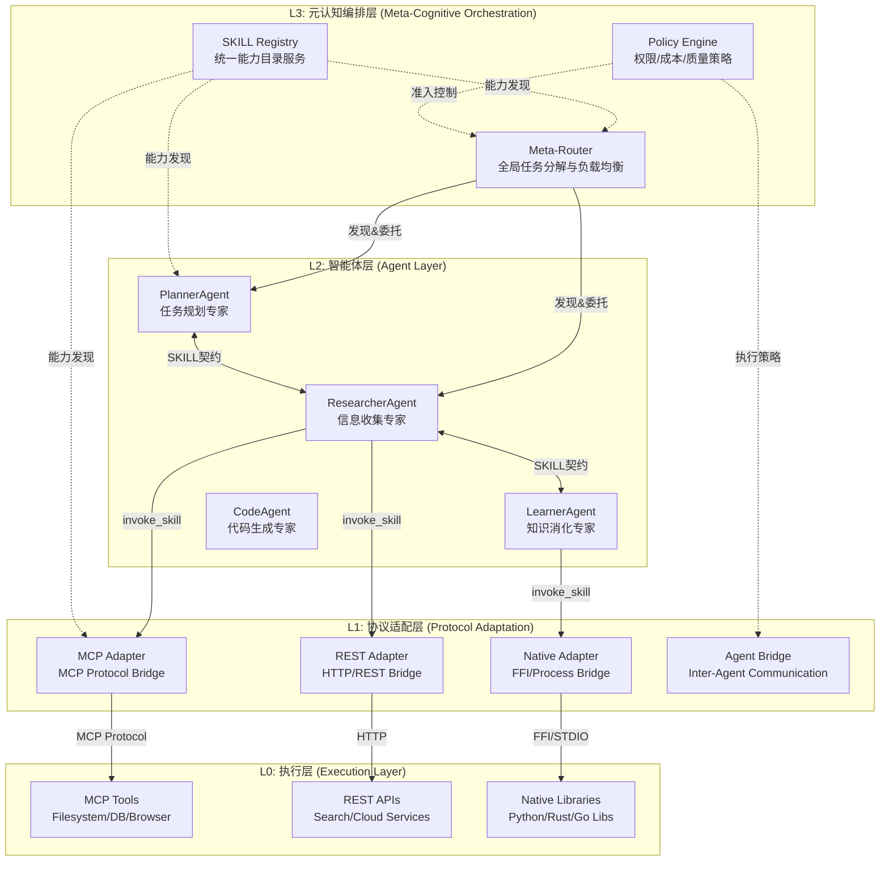
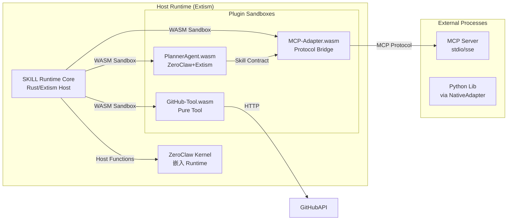
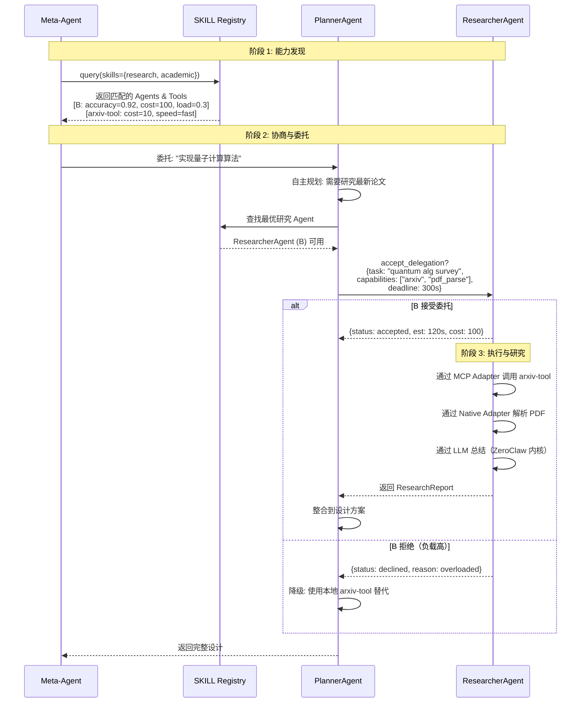

基于我们的讨论，我为你撰写这份**分层插件化多智能体系统架构设计文档（TAD）**。该架构以 **SKILL 统一契约层** 为核心，结合 Extism 插件系统与 ZeroClaw 认知内核，实现真正的协议无关、跨粒度、自主协商的多智能体平台。

---

# 分层插件化多智能体系统架构设计文档
**版本**: v1.0.0  
**代号**: Hydra-SKILL  
**日期**: 2026-03-13  

## 1. 架构愿景与核心原则

### 1.1 设计目标
构建一个**"万物即 SKILL"**（Everything is a Skill）的自主智能体平台，实现：
- **统一抽象**：无论底层是本地代码、MCP Server、REST API 或其他 Agent，均通过同一套 SKILL 契约暴露能力
- **动态编排**：运行时自动发现、协商、组合异构能力，无需预设硬编码工作流
- **边缘原生**：基于 ZeroClaw 的 <5MB/<10ms 特性，支持从嵌入式设备到云端的大规模部署
- **自主进化**：Agent 可自主决定使用工具、委托任务给其他 Agent，形成涌现性协作

### 1.2 核心原则
| 原则 | 描述 |
|------|------|
| **契约即接口** | SKILL Schema 是唯一的交互界面，禁止绕过契约的直接调用 |
| **协议无关** | 通过 Adapter 层隔离具体协议（MCP/REST/Native），上层零感知 |
| **分层隔离** | 认知层（Agent Kernel）与执行层（Tools）严格分离，通过 SKILL 契约通信 |
| **动态组合** | 支持 Agent→Agent、Agent→Tool、Tool→Tool 的任意拓扑组合 |

## 2. 总体架构

### 2.1 逻辑分层（L0-L3）



### 2.2 物理部署视图



## 3. 核心组件详细设计

### 3.1 SKILL 统一契约层（The Unified Contract Layer）

#### 3.1.1 SKILL Schema 规范
SKILL 是描述能力的**完整契约**，包含接口、语义、策略三维度：

```typescript
// skill.schema.json
interface SkillContract {
  // 身份标识
  metadata: {
    skill_id: string;           // 全局唯一，如 "arxiv_search_v2"
    version: SemVer;
    provider_type: "Agent" | "Tool" | "Composite";
    provider_id: string;        // 实例标识
    semantic_tags: string[];    // 如 ["academic", "paper", "ml"]
  };

  // 能力接口（类似 OpenAPI，但简化）
  interface: {
    description: string;
    input_schema: JSONSchema7;
    output_schema: JSONSchema7;
    error_schema: JSONSchema7;
    examples: SkillExample[];
  };

  // 执行契约（关键创新：策略即代码）
  execution: {
    protocol_binding: ProtocolBinding;  // 如何具体执行
    constraints: {
      timeout_ms: number;
      memory_mb: number;
      requires_network: boolean;
      sandbox_level: "none" | "process" | "container" | "vm";
    };
    retry_policy: "none" | "fixed" | "exponential_backoff";
    circuit_breaker?: CircuitBreakerConfig;
  };

  // 协商契约（Agent-to-Agent 特有）
  negotiation?: {
    accepts_delegation: boolean;
    cost_model: {
      compute_credits: number;    // 内部经济系统
      expected_latency_ms: number;
      accuracy_history: number;     // 0-1 成功率
    };
    availability: "always" | "on_demand" | "scheduled";
  };

  // 组合契约（Composite Skill）
  composition?: {
    workflow: WorkflowStep[];
    parallel_strategy: "sequential" | "parallel" | "dag";
  };
}

// 协议绑定（多态实现）
type ProtocolBinding = 
  | { type: "mcp"; config: McpBindingConfig }
  | { type: "rest"; config: RestBindingConfig }
  | { type: "native"; config: NativeBindingConfig }
  | { type: "agent_bridge"; config: AgentBridgeConfig }
  | { type: "inline"; config: InlineWasmConfig };
```

#### 3.1.2 Protocol Binding 详解

**MCP 绑定示例**：
```json
{
  "type": "mcp",
  "config": {
    "transport": { "type": "stdio", "command": "npx -y @modelcontextprotocol/server-filesystem" },
    "tool_name": "read_file",
    "param_mapping": {
      "file_path": "$.input.path",
      "encoding": "$.input.encoding || 'utf-8'"
    },
    "result_transform": {
      "content": "$.result.content",
      "size": "$.result.size",
      "meta": { "source": "mcp", "server": "filesystem" }
    },
    // 保持 MCP 双向能力（Sampling/Roots）
    "capabilities": {
      "sampling": { "handler_skill": "llm_completion" },
      "roots": { "dynamic": true }
    }
  }
}
```

**Agent Bridge 绑定示例**（Agent 作为 Skill Provider）：
```json
{
  "type": "agent_bridge",
  "config": {
    "agent_ref": "researcher-pool-01",
    "communication": "async",
    "persistence": {
      "session_store": "sqlite",
      "vector_store": "qdrant"
    },
    // Agent 间委托的协商参数
    "delegation": {
      "timeout_ms": 30000,
      "priority": "high",
      "escalation": "fallback_to_local"
    }
  }
}
```

### 3.2 运行时核心（SKILL Runtime Core）

#### 3.2.1 架构组件

```rust
// runtime/core.rs
pub struct SkillRuntime {
    // 1. 契约注册表（分布式支持 Consul/etcd 后端）
    registry: Arc<RwLock<SkillRegistry>>,
    
    // 2. 协议适配器工厂
    adapters: HashMap<ProtocolType, Box<dyn ProtocolAdapter>>,
    
    // 3. 执行引擎
    executor: Arc<dyn SkillExecutor>,
    
    // 4. 认知内核（ZeroClaw 实例）
    cognition: ZeroClawKernel,
    
    // 5. 策略引擎
    policy: PolicyEngine,
}

// 核心调用路径（热路径优化）
impl SkillRuntime {
    pub async fn invoke(&self, request: SkillRequest) -> Result<SkillResponse> {
        // 1. 契约解析（缓存命中 O(1)）
        let contract = self.registry.get(&request.skill_id).await?;
        
        // 2. 策略检查（准入控制）
        self.policy.check(&request, &contract).await?;
        
        // 3. 协议路由
        let adapter = self.adapters.get(&contract.execution.protocol_binding.type)
            .ok_or(Error::UnsupportedProtocol)?;
        
        // 4. 上下文构建（注入认知状态）
        let ctx = InvocationContext {
            trace_id: generate_trace_id(),
            caller_agent: request.caller_id,
            cognitive_state: self.cognition.get_state(request.session_id).await,
        };
        
        // 5. 执行（零拷贝优化：若为本地 Agent 直接内存调用）
        if self.is_local_agent(&contract) {
            return self.cognition.invoke_direct(contract, request.input).await;
        }
        
        // 6. 协议转换与执行
        let native_req = adapter.encode(request.input, &contract)?;
        let native_res = adapter.execute(native_req, &contract.execution.constraints).await?;
        let skill_res = adapter.decode(native_res, &contract)?;
        
        // 7. 后置处理（记忆更新、事件通知）
        self.post_process(&request, &skill_res).await;
        
        Ok(skill_res)
    }
}
```

#### 3.2.2 适配器层实现（Adapter Layer）

**MCP Adapter**：
```rust
pub struct McpAdapter {
    // MCP 连接池（长连接复用）
    connection_pool: Pool<McpConnection>,
    // stdio/sse 传输管理
    transport_mgr: TransportManager,
}

impl ProtocolAdapter for McpAdapter {
    async fn execute(&self, req: NativeRequest, constraints: &Constraints) -> Result<NativeResponse> {
        let conn = self.connection_pool.acquire().await?;
        
        // 双向通信支持：如果 MCP Server 请求 sampling，转发到本地 LLM
        let mut client = McpClient::new(conn);
        client.set_sampling_callback(|prompt| {
            self.cognition.llm_complete(prompt)  // 复用 ZeroClaw LLM
        });
        
        let result = tokio::time::timeout(
            Duration::from_ms(constraints.timeout_ms),
            client.call_tool(req.tool_name, req.params)
        ).await?;
        
        Ok(NativeResponse::from(result))
    }
}
```

**Agent Bridge Adapter**（Agent 间通信）：
```rust
pub struct AgentBridgeAdapter {
    message_bus: MessageBus,  // 基于 ZeroMQ/NATS
    session_mgr: SessionManager,
}

impl ProtocolAdapter for AgentBridgeAdapter {
    fn encode(&self, input: Value, config: &AgentBridgeConfig) -> Result<NativeRequest> {
        // 将 SKILL 调用转换为 Agent 间委托协议
        Ok(NativeRequest::AgentDelegate(DelegationMessage {
            task_id: generate_id(),
            target_agent: config.agent_ref.clone(),
            input_context: input,
            required_capabilities: vec![],  // 可扩展为能力协商
            reply_to: self.message_bus.get_address(),
        }))
    }
    
    async fn execute(&self, req: NativeRequest, constraints: &Constraints) -> Result<NativeResponse> {
        // 异步委托模式：发送任务并等待回调
        let (tx, rx) = oneshot::channel();
        self.session_mgr.register_callback(req.task_id, tx);
        self.message_bus.send(req.target_agent, req).await?;
        
        let result = tokio::time::timeout(
            Duration::from_ms(constraints.timeout_ms),
            rx
        ).await??;
        
        Ok(NativeResponse::AgentResult(result))
    }
}
```

### 3.3 插件类型定义

#### 3.3.1 Type-A：认知型智能体插件（Cognitive Agent Plugin）
基于 ZeroClaw 运行时，具备完整 ReAct 认知能力。

```rust
// 插件接口（导出给 Host 调用）
#[extism::plugin_fn]
pub fn skill_metadata() -> FnResult<String> {
    Ok(json!(SkillContract {
        metadata: Metadata {
            skill_id: "deep_researcher",
            provider_type: ProviderType::Agent,
            ..
        },
        interface: Interface {
            description: "深度研究型 Agent，可自主多轮搜索与总结",
            input_schema: schema_for!(ResearchGoal),
            output_schema: schema_for!(ResearchReport),
        },
        execution: ExecutionPolicy {
            protocol_binding: ProtocolBinding::Inline {
                // 入口函数
                entry_point: "agent_main".to_string(),
            },
            constraints: Constraints {
                memory_mb: 50,  // ZeroClaw + 向量存储
                timeout_ms: 300000,  // 允许长时间运行
                sandbox_level: "process",
            },
        },
        negotiation: Some(NegotiationPolicy {
            accepts_delegation: true,
            cost_model: CostModel {
                compute_credits: 100,
                expected_latency_ms: 120000,
                accuracy_history: 0.92,
            },
        }),
    }).to_string())
}

// 主入口（由 Host 通过 Extism 调用启动）
#[extism::plugin_fn]
pub fn agent_main(input: String) -> FnResult<String> {
    let goal: ResearchGoal = serde_json::from_str(&input)?;
    
    // 初始化 ZeroClaw 认知内核
    let mut agent = ZeroClawAgent::new()
        .with_trait(PlanningTrait::new())
        .with_trait(ResearchTrait::new())
        .with_memory(VectorSqlite::new());  // 向量记忆
    
    // 自主执行 ReAct 循环
    let result = agent.autonomous_research(goal)?;
    
    Ok(serde_json::to_string(&result)?)
}

// 接受外部委托（Agent-to-Agent 入口）
#[extism::plugin_fn]
pub fn accept_delegation(request: String) -> FnResult<String> {
    let delegation: DelegationRequest = serde_json::from_str(&request)?;
    
    // 自主决策是否接受（基于当前负载、能力匹配度）
    let agent = ZeroClawAgent::current();
    if !agent.evaluate_capability(&delegation.required_capabilities) {
        return Ok(json!({"status": "declined", "reason": "capability_mismatch"}).to_string());
    }
    
    if agent.current_load() > 0.8 {
        return Ok(json!({"status": "declined", "reason": "overloaded"}).to_string());
    }
    
    // 接受并执行
    spawn(async move {
        let result = agent.execute(delegation.task).await;
        agent.report_completion(delegation.reply_to, result);
    });
    
    Ok(json!({"status": "accepted", "estimated_ms": 120000}).to_string())
}
```

#### 3.3.2 Type-B：工具型插件（Tool Plugin）
无状态纯函数，高性能执行特定协议。

```rust
// GitHub Tool 示例
#[extism::plugin_fn]
pub fn skill_metadata() -> FnResult<String> {
    Ok(json!(SkillContract {
        metadata: Metadata {
            skill_id: "github_code_search",
            provider_type: ProviderType::Tool,
        },
        interface: Interface {
            description: "搜索 GitHub 代码仓库",
            input_schema: schema_for!(CodeSearchQuery),
            output_schema: schema_for!(CodeSearchResult),
        },
        execution: ExecutionPolicy {
            protocol_binding: ProtocolBinding::Rest {
                base_url: "https://api.github.com".to_string(),
                auth_type: AuthType::BearerToken,
                rate_limit: Some(RateLimitConfig {
                    requests_per_minute: 30,
                }),
            },
            constraints: Constraints {
                timeout_ms: 10000,
                memory_mb: 10,
                sandbox_level: "none",  // 纯网络请求，无需沙箱
            },
        },
        // Tool 无 negotiation 字段
    }).to_string())
}

#[extism::plugin_fn]
pub fn execute(input: String) -> FnResult<String> {
    let query: CodeSearchQuery = serde_json::from_str(&input)?;
    
    // 直接执行，无 LLM 调用，无状态
    let client = reqwest::Client::new();
    let response = client
        .get("https://api.github.com/search/code")
        .query(&[("q", query.keywords)])
        .header("Authorization", format!("token {}", host::get_secret("github_token")?))
        .send()
        .map_err(|e| Error::Network(e))?;
    
    let results: CodeSearchResult = response.json()?;
    Ok(serde_json::to_string(&results)?)
}
```

#### 3.3.3 Type-C：复合型技能（Composite Skill）
通过编排其他 SKILL 实现高阶能力，无独立运行时。

```json
{
  "skill_id": "fullstack_dev_task",
  "provider_type": "Composite",
  "composition": {
    "workflow": [
      {
        "step_id": "design",
        "skill_id": "planner_agent",
        "input_mapping": {
          "goal": "$.input.requirement",
          "tech_stack": "$.input.stack"
        },
        "output_mapping": {
          "architecture": "$.steps.design.output"
        }
      },
      {
        "step_id": "code",
        "skill_id": "code_agent",
        "depends_on": ["design"],
        "input_mapping": {
          "architecture": "$.steps.design.output.architecture",
          "files": "$.input.file_list"
        }
      },
      {
        "step_id": "test",
        "skill_id": "mcp_jest_tool",
        "depends_on": ["code"],
        "condition": "$.input.require_test == true"
      }
    ],
    "parallel_strategy": "dag",
    "error_handling": {
      "on_step_failure": "retry_then_escalate",
      "max_retries": 2
    }
  }
}
```

## 4. 交互协议与数据流

### 4.1 自主协商协议（Agent-to-Agent Negotiation）



### 4.2 跨协议调用链示例

**场景**：PlannerAgent（ZeroClaw）→ 调用 filesystem（MCP）→ 发现需要复杂计算 → 委托给 PythonAgent（Native）→ 使用 numpy（Native Lib）

```rust
// 在 PlannerAgent 内部代码（ZeroClaw 实现）
async fn develop_feature(&self, spec: &Spec) -> Result<Code> {
    // 1. 读取本地模板（通过 SKILL 层，实际绑定到 MCP filesystem）
    let template = self.runtime.invoke(
        "filesystem_read",  // SKILL ID
        json!({"path": "/templates/rust_web.rs"})
    ).await?;
    
    // 2. 生成代码...
    let draft = self.llm.generate_code(&spec, &template).await?;
    
    // 3. 发现需要性能分析（自主决策）
    if draft.requires_computation() {
        // 通过 SKILL 层委托给 PythonAgent
        // 实际通过 Agent Bridge 协议
        let analysis = self.runtime.invoke(
            "python_computation_agent",  // Agent-type SKILL
            json!({
                "task": "optimize_algorithm",
                "code": draft.algo_section,
                "constraints": {"timeout_ms": 30000}
            })
        ).await?;
        
        draft.apply_optimizations(analysis);
    }
    
    Ok(draft)
}
```

**底层实际发生**：
1. `filesystem_read` → SKILL Runtime → MCP Adapter → stdio → MCP Server Filesystem
2. `python_computation_agent` → SKILL Runtime → Agent Bridge Adapter → MessageBus → PythonAgent（另一个 ZeroClaw 实例，通过 Native Adapter 加载 Python 运行时）

## 5. 安全与隔离架构

### 5.1 多层沙箱模型

| 层级 | 机制 | 适用对象 |
|------|------|----------|
| **L0: WASM 沙箱** | Extism 提供的内存隔离 + Capability 限制 | 所有插件（Agent/Tool） |
| **L1: 进程沙箱** | seccomp-bpf + namespace（ZeroClaw 原生支持） | 不受信第三方插件 |
| **L2: 网络隔离** | 通过 Adapter 层统一代理，白名单域名 | MCP/REST Tools |
| **L3: 能力衰减** | 基于 SKILL 契约的权限衰减（如禁止文件访问） | 特定高风险 Skill |

### 5.2 统一身份与鉴权

```rust
// 所有调用携带 Capability Token
pub struct InvocationContext {
    trace_id: Uuid,
    caller: Principal,  // Agent ID 或 User ID
    capabilities: Vec<Capability>,  // 从 SKILL 契约提取的权限声明
    attenuation: Vec<Policy>,  // 运行时策略衰减
}

// 示例：filesystem_read 的 Capability 检查
impl PolicyEngine {
    fn check_fs_access(&self, ctx: &InvocationContext, path: &str) -> Result<()> {
        // 检查 caller 是否有该 SKILL 的声明
        if !ctx.capabilities.contains(&Capability::FileRead) {
            return Err(Error::Unauthorized);
        }
        
        // 路径白名单检查（沙箱逃逸防护）
        if !self.sandbox.contains(path) {
            return Err(Error::PathNotAllowed);
        }
        
        // 审计日志
        self.audit.log(AuditEvent::FileAccess { caller: ctx.caller, path });
        Ok(())
    }
}
```

## 6. 实施路线图

### Phase 1: 核心运行时（Month 1）
- [ ] 实现 SKILL Runtime Core（Rust + Extism）
- [ ] 实现 ZeroClaw Kernel 嵌入（保留 <5MB 特性）
- [ ] 定义 SKILL Schema 规范 v1.0
- [ ] 实现 MCP Adapter（支持 stdio/sse）
- [ ] **里程碑**：单节点可运行 "Planner Agent → MCP Filesystem → 返回结果"

### Phase 2: 智能体生态（Month 2-3）
- [ ] 封装 ZeroClaw 为 Type-A Agent Plugin 模板
- [ ] 实现 4 个基础 Agent：Planner/Researcher/Learner/Code
- [ ] 实现 Agent Bridge Adapter（Agent 间通信）
- [ ] 实现 Composite Skill 编排引擎
- [ ] **里程碑**：Meta-Agent 可动态委托任务给 Researcher，Researcher 使用 arXiv MCP Tool

### Phase 3: 协议扩展（Month 4）
- [ ] 实现 REST Adapter（封装传统 API）
- [ ] 实现 Native Adapter（Python/Go FFI）
- [ ] 实现 SKILL Registry 服务（支持分布式发现）
- [ ] **里程碑**：异构系统接入（GitHub REST API、本地 Python 科学计算库）

### Phase 4: 生产级特性（Month 5-6）
- [ ] Policy Engine（权限、成本、质量策略）
- [ ] 分布式追踪（OpenTelemetry 集成）
- [ ] 热更新机制（WASM 插件不停机更新）
- [ ] **里程碑**：1000+ Agent 并发，跨节点委托，<10ms 额外延迟

## 7. 与现有方案对比总结

| 维度 | Hydra-SKILL (本架构) | AutoGPT | CrewAI | MCP Native |
|------|---------------------|---------|--------|------------|
| **能力抽象** | 统一 SKILL 契约（Agent/Tool/MCP 同质） | 函数调用（不平等） | 角色定义（粗粒度） | 仅 MCP Tools |
| **协议支持** | 协议无关（MCP/REST/Native 统一） | 有限插件 | 主要 Python | 仅 MCP |
| **自主性** | 运行时协商、动态委托 | 预设链 | 预设工作流 | 无 Agent 能力 |
| **跨语言** | 全栈 WASM（Extism） | Python 为主 | Python 为主 | 多语言 SDK |
| **部署形态** | 边缘原生（<5MB） | 云端/桌面 | 云端 | Server 端 |
| **组合粒度** | 细粒度（Tool）到粗粒度（Agent）无缝组合 | 粗粒度 | 粗粒度 | 细粒度 |

## 8. 附录：关键技术决策记录（ADR）

### ADR-001: 为什么不用原生 MCP 作为顶层？
**决策**：在 MCP 之上封装 SKILL 层。  
**理由**：MCP 是协议层，SKILL 是语义层。我们需要 Agent 间能像调用工具一样互相调用（同质抽象），且需要支持非 MCP 生态（如直接 REST API）。MCP 作为 Protocol Binding 之一，而非架构中心。

### ADR-002: 为什么 Agent 也编译为 WASM？
**决策**：所有 Agent 通过 Extism 加载，而非直接进程。  
**理由**：利用 Extism 的跨语言能力和沙箱隔离，同时保持 ZeroClaw 的轻量（WASM 内嵌 ZeroClaw 运行时）。牺牲 10-20% 性能换取统一治理和安全性。

### ADR-003: 为什么需要 Agent Bridge 独立协议？
**决策**：Agent 间通信不直接复用 MCP，而是专门的 Agent Bridge。  
**理由**：MCP 假设 Client-Server 关系，Agent 间是对等协商（Negotiation）关系，需要异步委托、负载反馈、成本协商等语义，超出 MCP 设计范围。

---

**文档状态**: Draft  
**维护者**: Architecture Team  
**下次评审**: 2026-03-27


基于附件评审意见，以下是**结构化决策回调协议（SDCP v1.0）**的完整生产级设计方案，整合了所有关键改进建议：

---

# 结构化决策回调协议（SDCP）完整规范 v1.0

## 1. 核心 Schema 定义（评审增强版）

### 1.1 DecisionPoint（决策请求）

```typescript
interface DecisionPoint {
  // 身份标识
  decision_id: string;              // UUID v4
  protocol_version: "v1";           // 【评审补充】版本兼容性
  type: "selection" | "boolean" | "range" | "text" | "complex";
  priority: "auto" | "confirm" | "escalate";
  
  // 决策内容
  specification: {
    title: string;
    description: string;
    options?: DecisionOption[];
    constraints?: Constraints;
  };
  
  // 元数据
  metadata: {
    category: "architecture" | "performance" | "security" | "cost" | "implementation";
    risk_level: number;             // 0.0 - 1.0
    reversible: boolean;
    estimated_impact: string;
    // 【评审补充】标签用于策略匹配
    tags: string[];
  };
  
  // 【评审补充】超时处理策略（关键改进）
  timeout_policy: {
    max_wait_seconds: number;       // 默认 300s (5分钟)
    fallback_action: "auto_select" | "abort" | "escalate";
    default_choice_id?: string;     // fallback 为 auto_select 时使用
    notify_before_timeout?: number; // 提前多少秒通知（如 60s）
  };
  
  // 【评审补充】决策依赖链（循环检测增强）
  dependency_chain: {
    root_decision_id: string;       // 原始根决策 ID
    depth: number;                  // 当前嵌套深度（最大 5）
    blocked_categories: string[];   // 禁止子决策的类别（如 ["cost"]）
    decision_history: {             // 历史决策路径
      decision_id: string;
      category: string;
      requester: string;
      timestamp: ISO8601;
    }[];
  };
  
  // 上下文继承
  execution_context: {
    parent_span_id: string;
    root_span_id: string;           // 【评审补充】根追踪 ID
    child_intent: string;
    alternatives_considered: string[];
    session_state_hash: string;     // 【评审补充】状态校验
  };
  
  // 【评审补充】完整性校验
  integrity: {
    checksum: string;               // SHA256(specification + metadata)
    created_at: ISO8601;
    expires_at?: ISO8601;           // 决策请求过期时间
  };
}
```

### 1.2 DecisionResponse（决策响应）

```typescript
interface DecisionResponse {
  decision_id: string;
  protocol_version: "v1";
  
  resolution: 
    | { type: "selected"; choice_id: string; rationale?: string; confidence?: number }
    | { type: "boolean"; value: boolean; rationale?: string }
    | { type: "range"; value: number }
    | { type: "custom"; value: any }
    | { type: "aborted"; reason: "timeout" | "escalation_failed" | "permission_denied" }
    | { type: "delegated"; to: "human" | "parent" | "policy_engine"; ticket_id: string };
  
  authority: {
    resolved_by: "parent_agent" | "human_user" | "policy_engine" | "auto_fallback";
    resolver_id: string;            // Agent ID 或 User ID
    confidence: number;             // 0.0 - 1.0
    timestamp: ISO8601;
    // 【评审补充】数字签名（防篡改）
    signature?: string;             // Ed25519签名
  };
  
  execution_directive?: {
    override_parameters?: Record<string, any>;
    rollback_plan?: string;
    // 【评审补充】执行约束
    constraints?: {
      max_execution_time_ms: number;
      required_resources: string[];
    };
  };
  
  // 【评审补充】审计元数据
  audit_meta: {
    decision_duration_ms: number;   // 决策耗时
    ui_render_time_ms?: number;     // UI 渲染时间（如有人工介入）
    network_latency_ms?: number;    // 网络延迟
    schema_validation_time_ms: number;
  };
}
```

### 1.3 委托权限契约（增强版）

```rust
struct DelegationPermissions {
    // 基础权限（原有）
    allowed_categories: Vec<String>;
    forbidden_categories: Vec<String>;
    max_decision_value_usd: Option<f64>;
    require_human_above_risk: f64;
    
    // 【评审补充】时间衰减
    valid_until: ISO8601;           // 委托过期时间（如 1小时后）
    max_decision_count: u32;        // 最大决策次数（如 10次）
    single_use_decisions: bool;     // 某些关键决策是否一次性
    
    // 【评审补充】深度控制
    max_decision_depth: u8;         // 允许子决策的最大深度
    blocked_decision_types: Vec<String>; // 禁止的决策类型
    
    // 【评审补充】审计要求
    audit_level: "none" | "metadata_only" | "full_content"; // 审计粒度
    require_approval_for: Vec<String>; // 需要显式批准的决策 ID 模式
}
```

## 2. 运行时核心实现（生产级）

### 2.1 异步决策引擎（含超时与持久化）

```rust
use std::time::{Duration, Instant};
use tokio::sync::{oneshot, mpsc};
use serde::{Serialize, Deserialize};

pub struct DecisionEngine {
    runtime: Arc<SkillRuntime>,
    pending_decisions: Arc<RwLock<HashMap<String, PendingDecision>>>,
    audit_logger: Arc<AuditLogger>,
    checkpoint_store: Arc<dyn CheckpointStore>, // 【评审补充】状态持久化
}

struct PendingDecision {
    request: DecisionPoint,
    sender: oneshot::Sender<DecisionResponse>,
    created_at: Instant,
    timeout_handle: AbortHandle,
    session_state: Option<Vec<u8>>, // 【评审补充】执行状态快照
}

impl DecisionEngine {
    /// 【评审补充】主入口：带完整生命周期管理
    pub async fn request_decision(
        &self,
        requester_ctx: InvocationContext,
        target_agent: &str,
        decision_req: DecisionPoint,
    ) -> Result<DecisionResponse, DecisionError> {
        let decision_id = decision_req.decision_id.clone();
        
        // 1. 前置验证
        self.validate_request(&decision_req, &requester_ctx).await?;
        
        // 2. 【评审补充】循环检测（增强版）
        self.enhanced_cycle_check(&requester_ctx, &decision_req).await?;
        
        // 3. 【评审补充】保存执行检查点（防止进程重启丢失）
        let checkpoint_id = self.save_checkpoint(&requester_ctx, &decision_req).await?;
        
        // 4. 创建超时处理
        let (tx, rx) = oneshot::channel();
        let timeout_duration = Duration::from_secs(decision_req.timeout_policy.max_wait_seconds);
        let timeout_action = decision_req.timeout_policy.fallback_action.clone();
        let default_choice = decision_req.timeout_policy.default_choice_id.clone();
        let decision_id_clone = decision_id.clone();
        
        let timeout_task = tokio::spawn(async move {
            tokio::time::sleep(timeout_duration).await;
            Self::handle_timeout(decision_id_clone, timeout_action, default_choice).await;
        });
        
        // 5. 注册待决决策
        let pending = PendingDecision {
            request: decision_req.clone(),
            sender: tx,
            created_at: Instant::now(),
            timeout_handle: timeout_task.abort_handle(),
            session_state: requester_ctx.execution_state.clone(), // 【评审补充】保存状态
        };
        
        self.pending_decisions.write().await.insert(decision_id.clone(), pending);
        
        // 6. 根据优先级路由
        let result = match decision_req.priority {
            Priority::Auto => {
                self.route_to_agent(target_agent, decision_req).await?
            }
            Priority::Confirm => {
                self.render_confirmation_ui(decision_req.clone()).await;
                // 等待回调或超时
                tokio::select! {
                    res = rx => res.map_err(|_| DecisionError::ChannelClosed)?,
                    _ = self.pre_timeout_notify(decision_req.timeout_policy.notify_before_timeout) => {
                        // 【评审补充】超时前提醒
                        self.send_timeout_warning(&decision_id).await;
                        rx.await.map_err(|_| DecisionError::ChannelClosed)?
                    }
                }
            }
            Priority::Escalate => {
                self.escalate_to_human(decision_req).await?
            }
        };
        
        // 7. 【评审补充】清理与审计
        self.cleanup_and_audit(&decision_id, &result, &requester_ctx).await?;
        self.checkpoint_store.delete(checkpoint_id).await?; // 成功后删除检查点
        
        Ok(result)
    }
    
    /// 【评审补充】增强循环检测（含类别循环）
    async fn enhanced_cycle_check(
        &self,
        ctx: &InvocationContext,
        req: &DecisionPoint,
    ) -> Result<(), DecisionError> {
        let history = &req.dependency_chain.decision_history;
        let current_category = &req.metadata.category;
        let target_agent = &ctx.target_agent_id;
        
        // 检查1：Agent ID 循环（原有）
        if history.iter().any(|h| h.requester == *target_agent) {
            return Err(DecisionError::CyclicAgentDetected {
                cycle_path: history.iter().map(|h| h.requester.clone()).collect(),
            });
        }
        
        // 检查2：【评审补充】决策类别循环（A问B数据库→B问A数据库）
        if history.iter().any(|h| h.category == *current_category) {
            return Err(DecisionError::CyclicCategoryDetected {
                category: current_category.clone(),
                history: history.clone(),
            });
        }
        
        // 检查3：【评审补充】动态深度限制（基于风险）
        let current_depth = req.dependency_chain.depth;
        let max_depth = if req.metadata.risk_level > 0.7 { 1 } else { 3 };
        
        if current_depth > max_depth {
            return Err(DecisionError::MaxDepthExceeded {
                current: current_depth,
                max: max_depth,
                risk_level: req.metadata.risk_level,
            });
        }
        
        // 检查4：【评审补充】类别阻塞列表
        if req.dependency_chain.blocked_categories.contains(current_category) {
            return Err(DecisionError::CategoryBlocked {
                category: current_category.clone(),
                blocked_by: "parent_policy".to_string(),
            });
        }
        
        Ok(())
    }
    
    /// 【评审补充】超时处理
    async fn handle_timeout(
        decision_id: String,
        action: FallbackAction,
        default_choice: Option<String>,
    ) {
        let engine = GLOBAL_ENGINE.get().unwrap();
        
        if let Some(pending) = engine.pending_decisions.write().await.remove(&decision_id) {
            let response = match action {
                FallbackAction::AutoSelect => {
                    if let Some(choice_id) = default_choice {
                        DecisionResponse {
                            decision_id: decision_id.clone(),
                            resolution: Resolution::Selected {
                                choice_id,
                                rationale: "timeout_fallback_auto".to_string(),
                                confidence: 0.5,
                            },
                            authority: Authority {
                                resolved_by: "auto_fallback".to_string(),
                                resolver_id: "system".to_string(),
                                confidence: 0.5,
                                timestamp: Utc::now(),
                                signature: None,
                            },
                            ..Default::default()
                        }
                    } else {
                        DecisionResponse::aborted("timeout_no_default")
                    }
                }
                FallbackAction::Abort => DecisionResponse::aborted("timeout_aborted"),
                FallbackAction::Escalate => {
                    // 重新提交为 escalate 优先级
                    let mut new_req = pending.request.clone();
                    new_req.priority = Priority::Escalate;
                    return engine.escalate_to_human(new_req).await.unwrap_or_else(|_| {
                        DecisionResponse::aborted("escalation_failed")
                    });
                }
            };
            
            let _ = pending.sender.send(response);
        }
    }
    
    /// 【评审补充】状态持久化（防进程重启丢失）
    async fn save_checkpoint(
        &self,
        ctx: &InvocationContext,
        req: &DecisionPoint,
    ) -> Result<String, DecisionError> {
        let checkpoint = ExecutionCheckpoint {
            decision_id: req.decision_id.clone(),
            invocation_context: ctx.clone(),
            decision_request: req.clone(),
            wasm_memory_state: host::get_wasm_memory_snapshot()?,
            stack_trace: host::get_current_stack_trace(),
            created_at: Utc::now(),
        };
        
        let checkpoint_id = format!("cp-{}-{}", req.decision_id, timestamp());
        self.checkpoint_store.save(&checkpoint_id, &checkpoint).await?;
        
        // 设置定期重试恢复（防止崩溃后无人处理）
        tokio::spawn(async move {
            tokio::time::sleep(Duration::from_secs(30)).await;
            Self::recover_if_orphaned(checkpoint_id).await;
        });
        
        Ok(checkpoint_id)
    }
    
    /// 【评审补充】孤儿决策恢复（进程重启后）
    async fn recover_if_orphaned(checkpoint_id: String) {
        let engine = GLOBAL_ENGINE.get().unwrap();
        if let Ok(cp) = engine.checkpoint_store.load(&checkpoint_id).await {
            // 检查决策是否仍在 pending
            if !engine.pending_decisions.read().await.contains_key(&cp.decision_id) {
                log::warn!("Recovering orphaned decision: {}", cp.decision_id);
                // 恢复执行或标记为失败
                let _ = engine.resume_from_checkpoint(cp).await;
            }
        }
    }
}
```

### 2.2 权限验证与审计（生产级）

```rust
impl DecisionEngine {
    /// 【评审补充】权限验证（含时间衰减和次数限制）
    async fn validate_permissions(
        &self,
        ctx: &InvocationContext,
        req: &DecisionPoint,
    ) -> Result<(), DecisionError> {
        let perms = &ctx.delegation_permissions;
        
        // 1. 时间有效性检查
        if Utc::now() > perms.valid_until {
            return Err(DecisionError::DelegationExpired {
                expired_at: perms.valid_until,
                now: Utc::now(),
            });
        }
        
        // 2. 决策次数检查
        let current_count = self.get_decision_count(&ctx.session_id).await?;
        if current_count >= perms.max_decision_count {
            return Err(DecisionError::DecisionQuotaExceeded {
                quota: perms.max_decision_count,
                used: current_count,
            });
        }
        
        // 3. 类别权限检查（原有）
        if perms.forbidden_categories.contains(&req.metadata.category) {
            return Err(DecisionError::CategoryForbidden {
                category: req.metadata.category.clone(),
            });
        }
        
        // 4. 风险等级检查
        if req.metadata.risk_level > perms.require_human_above_risk {
            return Err(DecisionError::RiskTooHigh {
                risk: req.metadata.risk_level,
                threshold: perms.require_human_above_risk,
                requires: "human_escalation".to_string(),
            });
        }
        
        // 5. 深度检查
        if req.dependency_chain.depth > perms.max_decision_depth {
            return Err(DecisionError::DepthLimitExceededByPolicy {
                limit: perms.max_decision_depth,
            });
        }
        
        Ok(())
    }
    
    /// 【评审补充】审计日志（全生命周期）
    async fn cleanup_and_audit(
        &self,
        decision_id: &str,
        response: &DecisionResponse,
        ctx: &InvocationContext,
    ) -> Result<(), DecisionError> {
        if let Some(pending) = self.pending_decisions.read().await.get(decision_id) {
            let duration = pending.created_at.elapsed();
            
            let audit_entry = DecisionAuditLog {
                decision_id: decision_id.to_string(),
                requester_agent: ctx.caller_id.clone(),
                requester_intent: pending.request.execution_context.child_intent.clone(),
                resolver: response.authority.resolved_by.clone(),
                resolver_id: response.authority.resolver_id.clone(),
                category: pending.request.metadata.category.clone(),
                risk_level: pending.request.metadata.risk_level,
                priority: format!("{:?}", pending.request.priority),
                resolution_type: format!("{:?}", response.resolution),
                decision_duration_ms: duration.as_millis() as u64,
                timestamp: Utc::now(),
                // 【评审补充】完整上下文（用于事后分析）
                full_context: if ctx.delegation_permissions.audit_level == "full_content" {
                    Some(AuditContext {
                        request: pending.request.clone(),
                        response: response.clone(),
                        dependency_chain: pending.request.dependency_chain.clone(),
                    })
                } else {
                    None
                },
            };
            
            self.audit_logger.log(audit_entry).await?;
            
            // 指标上报（Prometheus 格式）
            metrics::histogram!("decision_duration_seconds", duration.as_secs_f64());
            metrics::counter!("decisions_total", 
                "category" => pending.request.metadata.category.clone(),
                "resolver" => response.authority.resolved_by.clone()
            ).increment(1);
        }
        
        Ok(())
    }
}
```

## 3. A2A 桥接与能力协商（完整实现）

```rust
pub struct A2AAdapter {
    runtime: Arc<SkillRuntime>,
    // 【评审补充】能力缓存（避免重复检测）
    capability_cache: Arc<RwLock<HashMap<String, AgentCapabilities>>>,
}

#[derive(Clone)]
struct AgentCapabilities {
    agent_id: String,
    supports_structured_decision: bool,
    supported_versions: Vec<String>,
    max_decision_depth: u8,
    last_updated: Instant,
}

impl A2AAdapter {
    /// 【评审补充】能力协商（避免盲目降级）
    pub async fn negotiate_capabilities(&self, agent_card: &AgentCard) -> Result<AgentCapabilities, AdapterError> {
        // 检查缓存
        if let Some(caps) = self.capability_cache.read().await.get(&agent_card.id) {
            if caps.last_updated.elapsed() < Duration::from_secs(300) {
                return Ok(caps.clone());
            }
        }
        
        // 发送能力探测消息（A2A 扩展）
        let probe = A2AMessage {
            parts: vec![Part::Data {
                mime_type: "application/vnd.skill.capability-probe".to_string(),
                data: json!({"probe": "decision_protocol", "versions": ["v1"]}).to_string().into_bytes(),
            }],
            metadata: json!({
                "protocol": "skill-decision",
                "action": "capability_probe"
            }),
        };
        
        let response = self.send_message(agent_card, probe).await?;
        
        // 解析响应
        let caps = if let Some(Part::Data { data, .. }) = response.parts.iter().find(|p| p.is_data()) {
            let cap_response: CapabilityResponse = serde_json::from_slice(data)?;
            AgentCapabilities {
                agent_id: agent_card.id.clone(),
                supports_structured_decision: cap_response.supported,
                supported_versions: cap_response.versions,
                max_decision_depth: cap_response.max_depth.unwrap_or(1),
                last_updated: Instant::now(),
            }
        } else {
            // 无结构化响应，假设仅支持自然语言
            AgentCapabilities {
                agent_id: agent_card.id.clone(),
                supports_structured_decision: false,
                supported_versions: vec![],
                max_decision_depth: 0,
                last_updated: Instant::now(),
            }
        };
        
        // 更新缓存
        self.capability_cache.write().await.insert(agent_card.id.clone(), caps.clone());
        Ok(caps)
    }
    
    /// 【评审补充】智能路由（结构化优先，自然语言降级）
    pub async fn send_decision(
        &self,
        req: DecisionPoint,
        target: &AgentCard,
    ) -> Result<DecisionResponse, AdapterError> {
        let caps = self.negotiate_capabilities(target).await?;
        
        if caps.supports_structured_decision && caps.supported_versions.contains(&"v1".to_string()) {
            // 【高效路径】结构化传输
            self.send_structured(req, target).await
        } else {
            // 【兼容路径】自然语言降级
            log::warn!("Downgrading to natural language for agent: {}", target.id);
            self.send_natural_language(req, target).await
        }
    }
    
    async fn send_structured(&self, req: DecisionPoint, target: &AgentCard) -> Result<DecisionResponse, AdapterError> {
        let msg = A2AMessage {
            parts: vec![Part::Data {
                mime_type: "application/vnd.skill.decision-request".to_string(),
                data: serde_json::to_vec(&req)?,
            }],
            metadata: json!({
                "protocol": "skill-decision",
                "version": "v1",
                "decision_id": req.decision_id,
            }),
            // 【评审补充】保留自然语言摘要用于调试
            summary: Some(format!("Decision requested: {} (risk: {})", req.specification.title, req.metadata.risk_level)),
        };
        
        let response = self.send_message(target, msg).await?;
        
        // 解析结构化响应
        if let Some(Part::Data { data, .. }) = response.parts.iter().find(|p| p.is_data()) {
            let decision_resp: DecisionResponse = serde_json::from_slice(data)?;
            
            // 【评审补充】验证签名（如提供）
            if let Some(sig) = &decision_resp.authority.signature {
                self.verify_signature(&decision_resp, sig, target)?;
            }
            
            Ok(decision_resp)
        } else {
            Err(AdapterError::InvalidResponse("Expected structured data part".to_string()))
        }
    }
    
    /// 【评审补充】自然语言降级（LLM 转换）
    async fn send_natural_language(&self, req: DecisionPoint, target: &AgentCard) -> Result<DecisionResponse, AdapterError> {
        // 渲染为自然语言提示
        let prompt = self.render_natural_language_prompt(&req);
        
        let msg = A2AMessage {
            parts: vec![Part::Text { text: prompt }],
            metadata: json!({
                "protocol_fallback": "natural_language",
                "original_schema": "skill-decision-v1",
            }),
        };
        
        let response = self.send_message(target, msg).await?;
        
        // 使用 LLM 从自然语言解析为结构化响应
        if let Some(Part::Text { text }) = response.parts.iter().find(|p| p.is_text()) {
            let parsed = self.llm.parse_decision_response(text, &req.specification).await?;
            
            // 标记为降级解析（低置信度）
            Ok(DecisionResponse {
                authority: Authority {
                    resolved_by: "external_agent_nl".to_string(),
                    confidence: 0.6, // 降级路径置信度降低
                    ..parsed.authority
                },
                ..parsed
            })
        } else {
            Err(AdapterError::InvalidResponse("Expected text part in NL mode".to_string()))
        }
    }
}
```

## 4. 实施路线图（含风险缓解）

### Phase 1: 核心协议（Week 1-2）
**目标**：最小可用决策回调

```rust
// 优先级1：实现基础 Schema + 超时处理
pub struct DecisionEngineV1 {
    // 仅实现：
    // - timeout_policy (auto_select/abort)
    // - 基础 cycle_check (Agent ID 循环)
    // - 内存状态存储（无持久化）
}
```

**风险缓解**：
- 超时处理：使用 `tokio::select!` + 默认 fallback
- 状态丢失风险：限制仅支持短期决策（<30秒）

### Phase 2: 安全与审计（Week 3-4）
**目标**：生产级安全

- [ ] 实现 `DelegationPermissions` 时间衰减（`valid_until`）
- [ ] 实现决策次数配额（`max_decision_count`）
- [ ] 实现审计日志（`AuditLogger` 接口）
- [ ] 实现类别循环检测（增强版 `check_cycle`）

**风险缓解**：
- 权限滥用：默认使用 `conservative()` 策略模板
- 日志风暴：采样率控制（仅记录 10% 低风险决策）

### Phase 3: 持久化与恢复（Week 5-6）
**目标**：容错能力

- [ ] 实现 `CheckpointStore` 接口（SQLite/Redis 后端）
- [ ] 实现孤儿决策恢复（`recover_if_orphaned`）
- [ ] 实现进程重启恢复流程

**风险缓解**：
- 存储压力：检查点 TTL（24小时后自动清理）
- 恢复冲突：乐观锁机制（检查 `decision_id` 是否已处理）

### Phase 4: 生态集成（Week 7-8）
**目标**：与 A2A/MCP 生态互操作

- [ ] 实现 `A2AAdapter` 能力协商
- [ ] 实现 MCP 工具决策封装（将 MCP 工具调用包装为 Decision）
- [ ] 开源 `skill:decision@v1` 规范文档

## 5. 监控与可观测性

```rust
// Prometheus 指标
metrics::register_counter!("sdcp_decisions_total", "category", "resolver", "outcome");
metrics::register_histogram!("sdcp_decision_duration_seconds", "priority");
metrics::register_gauge!("sdcp_pending_decisions", "category");
metrics::register_counter!("sdcp_timeouts_total", "fallback_action");
metrics::register_counter!("sdcp_cycles_prevented_total", "type");

// 关键告警规则
// 1. decision_duration_p99 > 10s (性能退化)
// 2. sdcp_timeouts_total > 100/5min (系统过载)
// 3. sdcp_cycles_prevented_total > 10/1min (策略过严或逻辑错误)
```

## 6. 结论

本方案整合了评审中的所有关键建议：

1. ✅ **超时处理**：`timeout_policy` 支持 `auto_select/abort/escalate`，含提前通知
2. ✅ **循环检测增强**：增加类别循环检测、动态深度限制（基于风险）
3. ✅ **状态持久化**：`CheckpointStore` + 孤儿恢复机制
4. ✅ **审计日志**：全生命周期审计，支持 `full_content` 级别
5. ✅ **A2A 能力协商**：`negotiate_capabilities` + 自动降级
6. ✅ **权限衰减**：时间限制、次数配额、单次使用决策

**下一步行动**：
1. 实现 `DecisionEngineV1`（Phase 1）
2. 编写集成测试（模拟 Parent↔CodeAgent 场景）
3. 发布 `skill:decision@v1` JSON Schema 规范


# SDCP协议v1.1

## —— 基于单节点多Agent架构的身份管理与通用通信增强

基于您的SKILL平台架构和ACP/A2A协议最佳实践，我为您提供以下**SDCP完善方案**：

---

## 一、核心问题诊断

### 1.1 当前SDCP在单节点场景的短板

| 维度 | 现状 | 风险 |
|------|------|------|
| **身份管理** | 依赖宿主运行时，无独立标识 | 无法追溯调用链，审计困难 |
| **通用通信** | 仅支持决策回调 | 无法承载任务委派、状态同步等场景 |
| **权限溯源** | 基于Capability Token | 缺少ACP式的指令溯源机制 |
| **会话管理** | 未明确定义 | 多轮交互状态易丢失 |

### 1.2 单节点vs跨节点协议需求差异

```
┌─────────────────────────────────────────────────────────────────┐
│                    协议需求对比                                  │
├──────────────────┬──────────────────┬───────────────────────────┤
│      需求         │   跨节点(A2A/ACP)  │    单节点(SDCP优化方向)    │
├──────────────────┼──────────────────┼───────────────────────────┤
│   身份标识       │ AID/DNS式全局ID   │ 轻量级SKILL-ID + 运行时实例ID │
│   传输层         │ HTTP/gRPC/ZeroMQ  │ 内存共享 + Host Function    │
│   发现机制       │ Registry/接入点AP  │ SKILL Registry本地查询      │
│   安全隔离       │ TLS/加密通道      │ WASM沙箱 + 能力衰减          │
│   延迟要求       │ 100ms+            │ <10ms (内存级)              │
│   会话持久化     │ 外部存储          │ 运行时内存 + 检查点          │
└──────────────────┴──────────────────┴───────────────────────────┘
```

---

## 二、身份管理增强方案（融合ACP AID理念）

### 2.1 SDCP身份标识体系设计

借鉴ACP的**AID身份体系**，但针对单节点场景简化：

```typescript
// sdcp_identity.schema.json
interface SDCPIdentity {
  // 【核心】SKILL式身份标识（融合ACP AID理念）
  skill_aid: string;  // 格式：skill://{skill_id}@{runtime_instance_id}
                      // 示例：skill://code_agent@extism_host_001
  
  // 【新增】调用链溯源（融合ACP溯源机制）
  invocation_chain: {
    root_caller: string;        // 原始调用者（User/Agent）
    current_caller: string;     // 当前直接调用者
    hop_count: number;          // 调用跳数（防循环）
    entry_point: string;        // 入口标识（API Gateway/CLI/UI）
  };
  
  // 【新增】能力凭证（融合A2A Agent Card认证）
  capability_proof: {
    issued_by: string;          // 颁发者（Policy Engine）
    granted_skills: string[];   // 授权调用的SKILL列表
    attenuation_rules: Policy[]; // 权限衰减规则
    expires_at: ISO8601;        // 过期时间
    signature: string;          // 防篡改签名
  };
  
  // 【新增】会话上下文
  session_context: {
    session_id: string;
    correlation_id: string;     // 跨调用关联ID
    tenant_id?: string;         // 多租户隔离
  };
}
```

### 2.2 身份标识生成与验证

```rust
// runtime/identity.rs
pub struct SDCPIdentityManager {
    runtime_instance_id: String,  // 运行时实例ID
    policy_engine: Arc<PolicyEngine>,
}

impl SDCPIdentityManager {
    // 【新增】生成SKILL-AID身份标识
    pub fn generate_skill_aid(&self, skill_id: &str) -> String {
        format!("skill://{}@{}", skill_id, self.runtime_instance_id)
    }
    
    // 【新增】构建调用链溯源（融合ACP溯源机制）
    pub fn build_invocation_chain(
        &self,
        parent_ctx: Option<&InvocationContext>,
        caller_id: &str,
        entry_point: &str,
    ) -> InvocationChain {
        match parent_ctx {
            Some(parent) => InvocationChain {
                root_caller: parent.chain.root_caller.clone(),
                current_caller: caller_id.to_string(),
                hop_count: parent.chain.hop_count + 1,
                entry_point: entry_point.to_string(),
            },
            None => InvocationChain {
                root_caller: caller_id.to_string(),
                current_caller: caller_id.to_string(),
                hop_count: 0,
                entry_point: entry_point.to_string(),
            },
        }
    }
    
    // 【新增】能力凭证验证（融合A2A认证机制）
    pub async fn verify_capability_proof(
        &self,
        proof: &CapabilityProof,
        requested_skill: &str,
    ) -> Result<()> {
        // 1. 签名验证
        if !self.verify_signature(&proof.signature) {
            return Err(Error::InvalidSignature);
        }
        
        // 2. 过期检查
        if proof.expires_at < Utc::now() {
            return Err(Error::CredentialExpired);
        }
        
        // 3. 技能授权检查
        if !proof.granted_skills.contains(&requested_skill.to_string()) {
            return Err(Error::SkillNotAuthorized);
        }
        
        // 4. 权限衰减检查
        for rule in &proof.attenuation_rules {
            if !self.evaluate_attenuation(rule).await? {
                return Err(Error::AttenuationDenied);
            }
        }
        
        Ok(())
    }
    
    // 【新增】循环检测（基于调用链）
    pub fn detect_cycle(&self, chain: &InvocationChain, target_skill: &str) -> Result<()> {
        // ACP风格：检测调用链中是否已存在目标技能
        if chain.hop_count > MAX_HOP_COUNT {
            return Err(Error::MaxHopCountExceeded);
        }
        
        // 检查是否形成A→B→A循环
        if self.is_in_call_chain(&chain.root_caller, target_skill) {
            return Err(Error::CyclicInvocationDetected);
        }
        
        Ok(())
    }
}
```

### 2.3 与SKILL契约层集成

```typescript
// 增强SKILL Schema，嵌入身份管理字段
interface SkillContract {
  metadata: {
    skill_id: string;
    version: SemVer;
    provider_type: "Agent" | "Tool" | "Composite";
    provider_id: string;
    
    // 【新增】身份管理字段
    identity_schema: {
      requires_authentication: boolean;
      accepted_auth_methods: ["capability_token", "signature", "oauth"];
      allows_delegation: boolean;
      max_delegation_depth: number;  // 最大委托深度
    };
    
    semantic_tags: string[];
  };
  
  // ... 其他字段保持不变 ...
  
  // 【新增】安全策略
  security_policy?: {
    required_capabilities: string[];  // 必需的能力声明
    sensitive_data_handling: "none" | "encrypt" | "isolate";
    audit_logging: boolean;
    rate_limit?: {
      requests_per_minute: number;
      burst_limit: number;
    };
  };
}
```

---

## 三、通用通信增强方案（超越决策回调）

### 3.1 SDCP消息类型扩展

当前SDCP仅支持`DecisionRequest/Response`，建议扩展为**通用消息协议**：

```typescript
// sdcp_message.schema.json
interface SDCPMessage {
  // 消息头（固定）
  header: {
    message_id: string;           // UUID
    message_type: MessageType;    // 消息类型（见下文）
    protocol_version: "sdcp@v1";
    timestamp: ISO8601;
    
    // 【新增】身份溯源（融合ACP）
    sender: SDCPIdentity;
    receiver: SDCPIdentity;
    correlation_id?: string;      // 关联请求ID（用于请求-响应配对）
  };
  
  // 消息体（根据类型变化）
  body: MessageBody;
  
  // 【新增】传输元数据
  transport: {
    delivery_mode: "sync" | "async" | "stream";
    priority: 0..10;
    ttl_seconds?: number;         // 消息存活时间
    requires_ack: boolean;        // 是否需要确认
  };
}

type MessageType = 
  | "decision_request"      // 决策请求（原有）
  | "decision_response"     // 决策响应（原有）
  | "task_delegation"       // 【新增】任务委派
  | "task_status"           // 【新增】任务状态同步
  | "capability_query"      // 【新增】能力查询
  | "capability_announce"   // 【新增】能力广播
  | "session_event"         // 【新增】会话事件（开始/结束/暂停）
  | "error_notification";   // 【新增】错误通知

type MessageBody = 
  | DecisionRequest
  | DecisionResponse
  | TaskDelegationRequest
  | TaskStatusUpdate
  | CapabilityQuery
  | CapabilityAnnouncement
  | SessionEvent
  | ErrorNotification;
```

### 3.2 新增消息类型详解

#### 3.2.1 任务委派（Task Delegation）

```typescript
interface TaskDelegationRequest {
  // 任务基本信息
  task_id: string;
  skill_id: string;           // 目标SKILL
  input: Record<string, any>;
  
  // 【新增】委派协商参数（融合A2A任务分配）
  delegation_terms: {
    deadline: ISO8601;
    max_compute_credits: number;
    required_capabilities: string[];
    fallback_strategy: "retry" | "escalate" | "abort";
  };
  
  // 【新增】上下文继承
  inherited_context: {
    session_id: string;
    user_preferences?: Record<string, any>;
    security_clearance: number;  // 安全等级继承
  };
}

interface TaskDelegationResponse {
  task_id: string;
  status: "accepted" | "declined" | "queued";
  
  // 接受时返回
  acceptance?: {
    estimated_completion: ISO8601;
    assigned_agent: string;
    tracking_url?: string;      // 状态查询端点
  };
  
  // 拒绝时返回
  decline_reason?: string;
}
```

#### 3.2.2 任务状态同步（Task Status）

```typescript
interface TaskStatusUpdate {
  task_id: string;
  status: "pending" | "running" | "paused" | "completed" | "failed";
  
  // 【新增】进度信息（融合A2A进度跟踪）
  progress: {
    percentage: number;         // 0-100
    current_step: string;
    total_steps: number;
    artifacts?: Artifact[];     // 中间产出物
  };
  
  // 完成时返回
  result?: {
    output: Record<string, any>;
    compute_credits_used: number;
    execution_time_ms: number;
  };
  
  // 失败时返回
  error?: {
    code: string;
    message: string;
    retryable: boolean;
  };
}
```

#### 3.2.3 能力查询与广播（Capability Discovery）

```typescript
// 主动查询
interface CapabilityQuery {
  query_type: "by_skill_id" | "by_semantic_tag" | "by_capability";
  filters: {
    skill_ids?: string[];
    semantic_tags?: string[];
    min_accuracy?: number;
    max_latency_ms?: number;
    provider_type?: "Agent" | "Tool";
  };
}

// 被动广播（Agent启动时宣告能力）
interface CapabilityAnnouncement {
  agent_aid: string;
  announced_skills: SkillContract[];
  availability: {
    status: "online" | "busy" | "offline";
    current_load: number;       // 0-1
    estimated_wait_ms: number;
  };
  ttl_seconds: number;          // 广播有效期
}
```

### 3.3 消息总线设计（Agent Bridge增强）

```rust
// runtime/message_bus.rs
pub struct SDCPMessageBus {
    // 【新增】本地内存消息队列（单节点优化）
    local_queue: Arc<DashMap<String, Vec<SDCPMessage>>>,
    
    // 【新增】订阅-发布机制
    pub_sub: Arc<PubSubChannel>,
    
    // 【新增】会话管理器
    session_mgr: Arc<SessionManager>,
    
    // 【新增】消息持久化（检查点）
    checkpoint_store: Arc<CheckpointStore>,
}

impl SDCPMessageBus {
    // 【新增】发送消息（支持同步/异步）
    pub async fn send(&self, message: SDCPMessage) -> Result<()> {
        // 1. 身份验证
        self.verify_sender_identity(&message.header.sender).await?;
        
        // 2. 循环检测
        self.detect_cycle(&message.header.sender, &message.header.receiver).await?;
        
        // 3. 路由决策
        match message.header.transport.delivery_mode {
            DeliveryMode::Sync => {
                // 同步调用：直接内存调用（零拷贝优化）
                let response = self.invoke_direct(&message).await?;
                self.send_response(response).await?;
            }
            DeliveryMode::Async => {
                // 异步调用：入队 + 回调
                self.enqueue_message(&message).await?;
                self.spawn_worker(message).await?;
            }
            DeliveryMode::Stream => {
                // 流式调用：建立双向通道
                self.establish_stream(&message).await?;
            }
        }
        
        // 4. 审计日志（融合ACP溯源）
        self.audit_log(&message).await;
        
        Ok(())
    }
    
    // 【新增】订阅主题
    pub async fn subscribe(&self, topic: &str, handler: MessageHandler) -> Result<Subscription> {
        self.pub_sub.subscribe(topic, handler).await
    }
    
    // 【新增】会话状态管理
    pub async fn manage_session(&self, session_id: &str, event: SessionEvent) -> Result<()> {
        match event {
            SessionEvent::Started => {
                self.session_mgr.create_session(session_id).await?;
            }
            SessionEvent::Ended => {
                self.session_mgr.close_session(session_id).await?;
                self.checkpoint_store.save_session(session_id).await?;
            }
            SessionEvent::Paused => {
                self.session_mgr.pause_session(session_id).await?;
            }
        }
        Ok(())
    }
}
```

---

## 四、与SKILL架构的深度集成

### 4.1 SDCP在SKILL分层中的位置

```
┌─────────────────────────────────────────────────────────────────────┐
│                        SKILL架构 + SDCP增强                          │
├─────────────────────────────────────────────────────────────────────┤
│  L3: 元认知编排层                                                    │
│  ┌─────────────────────────────────────────────────────────────┐    │
│  │  MetaRouter + SDCP MessageBus（任务委派路由）                 │    │
│  └─────────────────────────────────────────────────────────────┘    │
├─────────────────────────────────────────────────────────────────────┤
│  L2: 智能体层                                                        │
│  ┌─────────────────────────────────────────────────────────────┐    │
│  │  Agent Kernel + SDCP Identity（身份管理）                    │    │
│  │  ┌─────────────┐  ┌─────────────┐  ┌─────────────┐          │    │
│  │  │PlannerAgent │  │Researcher   │  │CodeAgent    │          │    │
│  │  │             │◄─┤  Agent      │◄─┤             │          │    │
│  │  │             │  │             │  │             │          │    │
│  │  └─────────────┘  └─────────────┘  └─────────────┘          │    │
│  │         ▲                ▲                ▲                   │    │
│  │         └────────────────┼────────────────┘                   │    │
│  │                          │ SDCP Messages                      │    │
│  └──────────────────────────┼────────────────────────────────────┘    │
├──────────────────────────────┼────────────────────────────────────────┤
│  L1: 协议适配层               │                                        │
│  ┌──────────────────────────┼────────────────────────────────────┐    │
│  │  MCP Adapter │ REST Adapter │ Native Adapter │ SDCP Adapter   │    │
│  │                                              │【新增】         │    │
│  └──────────────────────────────────────────────┼────────────────┘    │
│                                                 │                      │
├─────────────────────────────────────────────────┼──────────────────────┤
│  L0: 执行层                                     │                      │
│  ┌──────────────────────────────────────────────┼────────────────┐    │
│  │  MCP Tools │ REST APIs │ Native Libs │ SDCP Native Calls     │    │
│  └────────────────────────────────────────────────────────────────┘    │
└─────────────────────────────────────────────────────────────────────┘
```

### 4.2 SDCP Adapter实现

```rust
// adapters/sdcp_adapter.rs
pub struct SDCPAdapter {
    message_bus: Arc<SDCPMessageBus>,
    identity_mgr: Arc<SDCPIdentityManager>,
    session_mgr: Arc<SessionManager>,
}

impl ProtocolAdapter for SDCPAdapter {
    // 编码：SKILL调用 → SDCP消息
    fn encode(&self, input: Value, contract: &SkillContract) -> Result<NativeRequest> {
        let message_type = self.determine_message_type(contract)?;
        
        let sender = self.identity_mgr.current_identity()?;
        let receiver = self.identity_mgr.generate_skill_aid(&contract.metadata.skill_id);
        
        Ok(NativeRequest::SDCPMessage(SDCPMessage {
            header: MessageHeader {
                message_id: generate_uuid(),
                message_type,
                protocol_version: "sdcp@v1".to_string(),
                timestamp: Utc::now(),
                sender,
                receiver,
                correlation_id: None,
            },
            body: self.build_message_body(message_type, input, contract)?,
            transport: TransportMeta {
                delivery_mode: self.select_delivery_mode(contract),
                priority: contract.metadata.semantic_tags
                    .contains(&"high_priority".to_string())
                    .then(|| 8)
                    .unwrap_or(5),
                ttl_seconds: Some(300),
                requires_ack: true,
            },
        }))
    }
    
    // 执行：发送SDCP消息并等待响应
    async fn execute(&self, req: NativeRequest, constraints: &Constraints) -> Result<NativeResponse> {
        if let NativeRequest::SDCPMessage(message) = req {
            // 注册响应回调
            let (tx, rx) = oneshot::channel();
            self.message_bus.register_response_handler(
                &message.header.message_id,
                tx,
            ).await;
            
            // 发送消息
            self.message_bus.send(message).await?;
            
            // 等待响应（带超时）
            let response = tokio::time::timeout(
                Duration::from_millis(constraints.timeout_ms),
                rx,
            ).await??;
            
            Ok(NativeResponse::SDCPResponse(response))
        } else {
            Err(Error::InvalidRequestType)
        }
    }
    
    // 解码：SDCP响应 → SKILL响应
    fn decode(&self, native_res: NativeResponse, contract: &SkillContract) -> Result<SkillResponse> {
        if let NativeResponse::SDCPResponse(sdcp_res) = native_res {
            match sdcp_res.body {
                MessageBody::DecisionResponse(dec_res) => {
                    Ok(SkillResponse::from(dec_res))
                }
                MessageBody::TaskDelegationResponse(task_res) => {
                    Ok(SkillResponse::from(task_res))
                }
                // ... 其他消息类型处理
                _ => Err(Error::UnexpectedMessageType),
            }
        } else {
            Err(Error::InvalidResponseType)
        }
    }
}
```

### 4.3 与Policy Engine集成

```rust
// policy/sdcp_policy.rs
pub struct SDCPPolicyEngine {
    base_policy: Arc<PolicyEngine>,
    identity_mgr: Arc<SDCPIdentityManager>,
}

impl SDCPPolicyEngine {
    // 【新增】SDCP专用策略检查
    pub async fn check_sdcp_message(&self, message: &SDCPMessage) -> Result<()> {
        // 1. 基础策略检查（复用现有Policy Engine）
        self.base_policy.check_message(&message).await?;
        
        // 2. 身份溯源检查（融合ACP）
        self.verify_invocation_chain(&message.header.sender).await?;
        
        // 3. 能力凭证检查
        self.verify_capability_proof(
            &message.header.sender.capability_proof,
            &message.header.receiver.skill_aid,
        ).await?;
        
        // 4. 权限衰减检查
        self.check_attenuation(&message).await?;
        
        // 5. 速率限制检查
        self.check_rate_limit(&message.header.sender).await?;
        
        // 6. 审计日志
        self.audit_log(message).await;
        
        Ok(())
    }
    
    // 【新增】权限衰减检查
    async fn check_attenuation(&self, message: &SDCPMessage) -> Result<()> {
        let chain = &message.header.sender.invocation_chain;
        
        // 每增加一跳，权限衰减一级
        let attenuation_level = chain.hop_count;
        
        // 高风险操作限制跳数
        if self.is_high_risk_message(&message.body) && attenuation_level > 2 {
            return Err(Error::AttenuationLimitExceeded);
        }
        
        Ok(())
    }
}
```

---

## 五、实施路线图

### 5.1 分阶段实施计划

| 阶段 | 时间线 | 交付物 | 优先级 |
|------|-------|-------|-------|
| **Phase 1** | 2周 | SDCP身份标识体系 + 调用链溯源 | P0 |
| **Phase 2** | 3周 | SDCP消息类型扩展（任务委派/状态同步） | P0 |
| **Phase 3** | 2周 | SDCP Adapter + MessageBus实现 | P0 |
| **Phase 4** | 2周 | Policy Engine集成 + 权限衰减 | P1 |
| **Phase 5** | 2周 | 会话管理 + 检查点持久化 | P1 |
| **Phase 6** | 2周 | 审计日志 + 监控指标 | P2 |

### 5.2 关键代码变更清单

```
src/
├── identity/
│   ├── sdcp_identity.rs          # 【新增】身份管理
│   ├── capability_proof.rs       # 【新增】能力凭证
│   └── invocation_chain.rs       # 【新增】调用链溯源
├── message/
│   ├── sdcp_message.rs           # 【新增】消息定义
│   ├── message_types/            # 【新增】消息类型
│   │   ├── decision.rs           # （原有）决策消息
│   │   ├── delegation.rs         # 【新增】任务委派
│   │   ├── status.rs             # 【新增】状态同步
│   │   └── capability.rs         # 【新增】能力查询
│   └── message_bus.rs            # 【增强】消息总线
├── adapters/
│   ├── sdcp_adapter.rs           # 【新增】SDCP协议适配器
│   └── mod.rs                    # （更新）注册新Adapter
├── policy/
│   ├── sdcp_policy.rs            # 【新增】SDCP专用策略
│   └── attenuation.rs            # 【新增】权限衰减规则
└── session/
    ├── session_manager.rs        # 【新增】会话管理
    └── checkpoint.rs             # 【新增】检查点持久化
```

---

## 六、与ACP/A2A的兼容性设计

### 6.1 协议映射表

| SDCP概念 | ACP对应 | A2A对应 | 映射策略 |
|---------|--------|--------|---------|
| `skill_aid` | AID身份标识 | Agent Card URL | 格式转换桥接 |
| `invocation_chain` | 溯源机制 | Task Context | 字段映射 |
| `capability_proof` | 授权体系 | Agent Card认证 | 签名兼容 |
| `task_delegation` | 任务协作层 | Task对象 | Schema对齐 |
| `message_bus` | 接入点AP | Agent Gateway | 协议适配 |

### 6.2 跨协议桥接设计

```rust
// bridges/sdcp_acp_bridge.rs
pub struct SDCPACPBridge {
    sdcp_bus: Arc<SDCPMessageBus>,
    acp_gateway: Arc<ACPGateway>,
}

impl SDCPACPBridge {
    // SDCP → ACP 出站
    pub async fn sdcp_to_acp(&self, sdcp_msg: SDCPMessage) -> Result<ACPMessage> {
        Ok(ACPMessage {
            aid_from: self.convert_skill_aid_to_aid(&sdcp_msg.header.sender.skill_aid)?,
            aid_to: self.convert_skill_aid_to_aid(&sdcp_msg.header.receiver.skill_aid)?,
            message_id: sdcp_msg.header.message_id,
            content: self.convert_body(sdcp_msg.body)?,
            security: ACPSecurity {
                signature: sdcp_msg.header.sender.capability_proof.signature,
                permissions: self.extract_permissions(&sdcp_msg).await?,
            },
        })
    }
    
    // ACP → SDCP 入站
    pub async fn acp_to_sdcp(&self, acp_msg: ACPMessage) -> Result<SDCPMessage> {
        Ok(SDCPMessage {
            header: MessageHeader {
                message_id: acp_msg.message_id,
                message_type: self.classify_message_type(&acp_msg.content)?,
                protocol_version: "sdcp@v1".to_string(),
                timestamp: acp_msg.timestamp,
                sender: self.convert_aid_to_sdcp_identity(&acp_msg.aid_from)?,
                receiver: self.convert_aid_to_sdcp_identity(&acp_msg.aid_to)?,
                correlation_id: None,
            },
            body: self.convert_body(acp_msg.content)?,
            transport: TransportMeta {
                delivery_mode: "async",
                priority: 5,
                ttl_seconds: Some(300),
                requires_ack: true,
            },
        })
    }
}
```

---

## 七、总结与建议

### 7.1 核心改进总结

| 改进领域 | 具体措施 | 借鉴来源 |
|---------|---------|---------|
| **身份管理** | SKILL-AID标识 + 调用链溯源 | ACP AID体系 |
| **通用通信** | 6种消息类型（决策/委派/状态/能力/会话/错误） | A2A Task模型 |
| **权限控制** | 能力凭证 + 权限衰减 | ACP授权体系 + A2A认证 |
| **会话管理** | 会话ID + 检查点持久化 | A2A进度跟踪 |
| **审计溯源** | 完整调用链日志 | ACP溯源机制 |

### 7.2 最终架构定位

```
┌─────────────────────────────────────────────────────────────────────┐
│                        协议生态定位                                  │
├─────────────────────────────────────────────────────────────────────┤
│                                                                     │
│   跨组织/跨平台  ──────────────────────→  A2A (Google)              │
│   本地/边缘协作  ──────────────────────→  ACP (AgentUnion)          │
│   单节点内Agent  ──────────────────────→  SDCP (您的方案) ⭐         │
│   工具调用       ──────────────────────→  MCP (Anthropic)           │
│                                                                     │
│   SDCP定位：单节点多Agent通信的事实标准                              │
│   差异化优势：<10ms延迟、WASM沙箱集成、SKILL契约原生支持             │
│                                                                     │
└─────────────────────────────────────────────────────────────────────┘
```

### 7.3 行动建议

| 优先级 | 行动项 | 预期收益 |
|-------|-------|---------|
| **P0** | 实现SDCP身份标识体系 | 可追溯、可审计 |
| **P0** | 扩展消息类型（任务委派+状态同步） | 超越决策回调，支持完整协作 |
| **P1** | 集成Policy Engine权限衰减 | 安全隔离、防滥用 |
| **P1** | 实现ACP/A2A桥接 | 未来跨节点扩展能力 |
| **P2** | 推动SDCP作为SKILL标准扩展 | 生态统一、降低集成成本 |

**综合评估**：完善后的SDCP将成为**单节点多Agent通信的最优解**，既保持<10ms的低延迟优势，又具备企业级身份管理和安全控制能力。