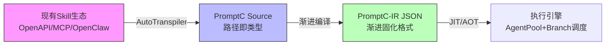

我将基于 AgenticDSL 的成熟架构与 PromptC 的编译期优化思想，设计**PromptC v2.0**的融合方案。这是一个从"实验室语言"迈向"生产级系统"的关键演进。

---

## 一、总体架构：双模式连续谱



**核心创新**：**渐进固化（Progressive Solidification）**——Skill 可以从动态解释（类似 AgenticDSL 的 `/dynamic/**`）逐步编译为静态优化节点（`/lib/**`），IR 格式保持统一，仅在元数据中标记固化程度。

---

## 二、迁移工具：Skill Transpiler

### 2.1 输入适配器（Multi-Source Ingestion）

```typescript
// transpiler.config.yaml
sources:
  - type: "mcp"  // Model Context Protocol
    endpoint: "stdio://python mcpserver.py"
    namespace: "/lib/mcp/"
    
  - type: "openclaw"  // Markdown Skill
    glob: "./skills/**/*.md"
    namespace: "/lib/openclaw/"
    
  - type: "openapi"  // REST API
    spec: "./api.yaml"
    namespace: "/lib/api/"

mapping_rules:
  # 权限映射：OpenClaw permissions -> PromptC 沙箱级别
  permission_to_sandbox:
    "network": "L1"      // 需要网络 = L1 沙箱
    "code_execution": "L2"  // 代码执行 = L2 沙箱
    "file_read": "L0"    // 只读文件 = L0
    
  # 描述匹配保留
  description_matching:
    preserve_semantic_keys: true  // 保留 OpenClaw 的 semantic keys 用于路由
```

### 2.2 自动迁移流程

```python
# 迁移示例：OpenClaw Skill -> PromptC
def transpile_skill(source: OpenClawSkill) -> PromptCSkill:
    return {
        "path": f"/lib/openclaw/{source.name}",  # 路径即类型
        "sandbox_level": map_permission_to_sandbox(source.permissions),
        "comptime_params": extract_schema(source.inputSchema),  # 编译期：JSON Schema
        "runtime_params": ["user_query", "context"],  # 运行期：动态数据
        
        # 描述匹配机制保留
        "description": source.description,
        "semantic_keys": source.semanticKeys,  # 用于增量加载的上下文路由
        
        # 渐进固化标记
        "solidification_stage": "interpreted",  # interpreted | jitted | solidified
        "source_hash": hash(source)
    }
```

---

## 三、路径即类型（Path-as-Type System）

借鉴 AgenticDSL 的命名空间，将**文件路径提升为类型系统的核心**：

### 3.1 路径命名空间规范

| 路径前缀 | 类型角色 | 沙箱默认 | 编译策略 | 生命周期 |
|---------|---------|---------|---------|---------|
| `/lib/**` | 标准库类型 | L0（信任） | AOT 全优化 | 全局持久 |
| `/app/**` | 应用类型 | L0 | JIT + 缓存 | 会话级 |
| `/main/**` | 主流程入口 | L0 | 解释执行 | 实例级 |
| `/dynamic/**` | 运行时生成 | L1 | 解释 + 验证 | 动态 |
| `/tmp/**` | 临时子图 | L2（隔离） | 无优化 | 单次执行 |

### 3.2 路径类型语法

```promptc
// 路径即类型：路径本身就是类型的唯一标识
skill AnalyzePaper<doc: /lib/pdf/Document> -> /lib/analysis/Report 
    @sandbox(L1)  // 显式覆盖，否则从路径前缀推断
{
    // 类型系统从 /lib/pdf/Document 的签名自动加载
    node extract: /lib/openclaw/ExtractContent = ...;
    node summarize: /lib/mcp/Summarize = ...;
}
```

**类型检查**：
- `/lib/pdf/Document` 对应 `/lib/pdf/Document.sig` 或 IR 中的 `signature` 字段
- 跨路径赋值自动检查兼容性（基于结构子类型）

---

## 四、沙箱级别替代效应系统

简化认知模型：**用运行时隔离级别代替复杂的效应注解**。

### 4.1 沙箱级别定义（继承 AgenticDSL）

| 级别 | 能力 | 触发条件 | 编译期行为 |
|------|------|---------|-----------|
| **L0** | 纯计算、内存操作 | 默认 | 允许内联、常量折叠、激进优化 |
| **L1** | 网络、文件读写、系统调用 | `io` 标记或工具调用 | 允许缓存，但禁止跨节点状态共享 |
| **L2** | 任意代码执行、第三方运行时 | `unsafe` 标记或动态代码 | 禁止内联，强制进程隔离，序列化通信 |

### 4.2 语法映射

```promptc
// 原 PromptC 的效应系统（复杂）
skill WebSearch @emits(Network + LLMCall) { ... }

// 新语法：沙箱级别（简洁，直接对应执行隔离）
skill WebSearch @sandbox(L1) { 
    // 自动推断：包含 HTTP 调用 -> L1
    // 编译器仍知道这里有副作用，但用沙箱边界管理而非效应代数
}

// L2 示例：Python 代码执行（高危）
skill CodeExecutor @sandbox(L2) {
    node run: tool_call("python3", code) 
        @timeout(30) 
        @resource_limit(memory="512mb");
}
```

**优势**：
- 对 LLM 生成更友好：沙箱级别是**可枚举的枚举值**（L0/L1/L2），而非**开放的效应代数**
- 安全与优化策略直接关联：L0 = 可安全内联，L2 = 必须隔离

---

## 五、统一路径图节点（Unified Graph Nodes）

集成 AgenticDSL 的并行与动态生成能力，扩展 PromptC 的控制流。

### 5.1 节点类型全集（兼容 PromptC-IR）

```typescript
// PromptC-IR v2.0 节点类型
type Node = 
  // 原 PromptC 基础节点
  | { type: "llm_call", skill_path: Path, inputs: Record<string, Value> }
  | { type: "assign", template: string }  // Inja 模板
  
  // 来自 AgenticDSL 的并行控制
  | { 
      type: "fork", 
      branches: Path[],  // 指向 /main/hypothesis_a 等
      mode: "parallel" | "speculative" | "ensemble",
      validator?: string  // 推测模式验证条件
    }
  | { 
      type: "join", 
      wait_for: "@all" | "@any" | string[],
      merge_strategy: "error_on_conflict" | "last_write_wins" | "array_concat",
      field_policies?: Record<string, MergePolicy>
    }
    
  // 来自 AgenticDSL 的动态生成
  | {
      type: "generate_subgraph",
      prompt_template: string,
      target_namespace: "/dynamic/**",  // 强制前缀
      signature_validation: "strict" | "warn" | "ignore",
      budget_consumption: { max_nodes: number, max_depth: number }
    }
    
  // 渐进编译专用节点
  | {
      type: "solidify",  // 编译期执行，固化子图
      source_path: "/dynamic/**",
      target_path: "/lib/auto/",
      optimization_level: 3
    };
```

### 5.2 并行模式示例

```promptc
skill ParallelResearch @sandbox(L1) {
    // Fork：创建 Branch 并行执行
    fork @mode("parallel") @branches(3) {
        "/main/search_academic",
        "/main/search_industry", 
        "/main/search_news"
    };
    
    // Join：结果合并
    join @wait_for("@all") @strategy("array_concat") {
        "results": "array_concat",  // 数组合并
        "confidence": "max"         // 取最大值
    };
    
    node synthesize: /lib/Synthesize = ...;
}
```

---

## 六、渐进编译与固化（Progressive Solidification）

核心机制：**同一个 IR 格式，支持从解释执行到 AOT 编译的连续谱**。

### 6.1 固化阶段（Solidification Stages）

| 阶段 | IR 特征 | 执行方式 | 适用场景 |
|------|---------|---------|---------|
| **Interpreted** | `body: { prompt_template: "...", model: "gpt-4" }` | VM 解释执行 | 快速迭代、动态生成 |
| **JITted** | `body: { fused_chain: ["step1", "step2"], batchable: true }` | JIT 编译为 DAG | 稳定工作流、性能敏感 |
| **Solidified** | `body: { wasm_bytecode: "...", native_deps: [] }` | AOT 编译为 WASM/Native | 高频调用、库函数 |

### 6.2 渐进固化语法

```promptc
// 阶段 1：动态解释（/dynamic/ 命名空间）
skill DynamicSolver @path("/dynamic/math/solver") @stage("interpreted") {
    generate_subgraph {
        prompt: "生成求解 {{equation}} 的步骤",
        max_depth: 2
    }
}

// 阶段 2：JIT 优化（执行历史 > 100 次后自动提升）
// 编译器分析：该 Skill 总是生成相同结构（Parse->Solve->Verify）
// 自动转为 JIT 模板，融合为单次 LLM 调用
@stage("jitted") 
@fusion_hints(["Parse", "Solve", "Verify"])
skill SemiOptimizedSolver @path("/app/math/solver") { ... }

// 阶段 3：完全固化（编译期生成 WASM，无 LLM 调用）
// 适用于模式固定的问题（如特定格式解析）
@stage("solidified")
@comptime_eval(true)  // 强制编译期执行
skill StaticParser @path("/lib/parser/csv") { ... }
```

### 6.3 固化触发策略

```yaml
# solidification_policy.yaml
auto_promote:
  from: "interpreted"
  to: "jitted"
  conditions:
    - execution_count: 100
    - success_rate: 0.95
    - structure_variance: 0.1  # 结构变化率 < 10%
    
  from: "jitted"
  to: "solidified"
  conditions:
    - llm_call_eliminable: true  # 编译器证明可完全消除 LLM 调用
    - input_schema_stable: 30d   # 输入 Schema 30天未变
```

---

## 七、JSON-like IR 规范（PromptC-IR v2.0）

专为 LLM 生成和渐进固化设计的 IR 格式。

### 7.1 顶层结构

```json
{
  "ir_version": "2.0.0-progressive",
  "module": "ResearchAssistant",
  "path": "/app/research/main",  // 路径即身份
  
  "solidification": {
    "stage": "jitted",  // interpreted | jitted | solidified
    "confidence": 0.92,   // 编译器对固化正确性的信心
    "derived_from": "/dynamic/research/main",  // 源路径
    "compilation_unit": "wasm_base64..."
  },
  
  "sandbox": {
    "level": "L1",
    "resources": ["network", "llm_gpt4"],
    "budget": {
      "max_nodes": 20,
      "max_llm_calls": 5,
      "max_duration_sec": 30
    }
  },
  
  "signature": {
    "inputs": [{"name": "topic", "type": "string", "required": true}],
    "outputs": [{"name": "report", "type": "/lib/types/Report"}],
    "description": "深度研究助手，适合学术主题",  // 用于语义匹配
    "semantic_keys": ["research", "academic", "analysis"]  // 增量加载索引
  },
  
  "graph": {
    "entry": "n1",
    "nodes": {...},
    "edges": [...]
  }
}
```

### 7.2 渐进固化的节点演变

**Interpreted 阶段**（LLM 友好，高灵活性）：
```json
"n1": {
  "type": "llm_call",
  "skill_path": "/lib/openai/gpt4",
  "prompt_template": "研究主题：{{topic}}\n请搜索相关资料...",
  "sandbox_level": "L1",
  "solidification_hints": {
    "extractable_schema": true,  // 提示编译器可提取 Schema
    "deterministic_output": false
  }
}
```

**JITted 阶段**（优化后，保留结构）：
```json
"n1": {
  "type": "fused_llm_call",
  "fused_chain": ["search", "summarize", "translate"],
  "prompt_template": "步骤1搜索{{topic}}；步骤2总结；步骤3翻译",
  "batchable": true,
  "cache_policy": "ttl:3600"
}
```

**Solidified 阶段**（完全编译，LLM 无关）：
```json
"n1": {
  "type": "native_call",
  "wasm_func": "research_pipeline_v2",
  "imports": ["/lib/search/academic", "/lib/nlp/summarize"],
  "no_llm": true
}
```

---

## 八、描述匹配与增量加载（Context Pruning）

保留 OpenClaw 的渐进披露思想，用**路径前缀**控制上下文长度。

### 8.1 语义路由机制

```promptc
// Skill 注册时附带描述向量（用于语义相似度匹配）
skill AcademicSearch 
    @path("/lib/search/academic")
    @description("搜索学术论文，适合科研场景")
    @semantic_keys(["arxiv", "paper", "research", "citation"])
    @context_budget(2000)  // 仅保留 2000 tokens 上下文
{
    // 实现
}

// 运行时路由：根据用户查询自动选择
node search: auto_route = SemanticRouter(
    query: user_input,
    candidate_prefixes: ["/lib/search/*", "/lib/tools/*"],
    threshold: 0.8
);
```

### 8.2 增量加载策略（基于路径）

借鉴 AgenticDSL 的 `AgentPool` 和权限检查，实现上下文按需加载：

```yaml
# context_loading_policy.yaml
loading_strategy: "path_prefix"

# 规则：匹配路径时动态加载，未匹配的技能描述不进入上下文
rules:
  - prefix: "/lib/search/**"
    load_when: "router_confidence > 0.7"
    context_slots: 5  # 最多加载 5 个相关技能
    
  - prefix: "/lib/dangerous/**"  # L2 沙箱技能
    load_when: "explicit_permission"  # 必须显式授权
    context_slots: 1
    
  - prefix: "/dynamic/**"
    load_when: "generate_subgraph_triggered"  # 生成后才加载
    ephemeral: true  # 会话结束即卸载
```

**优势**：
- **避免上下文爆炸**：不同于 OpenClaw 的渐进披露（每次披露一个 Skill），路径前缀允许**批量管理**相关 Skill 的可见性
- **编译器可利用**：编译期已知路径前缀，可静态分析哪些 Skill 可能被调用，预加载到编译上下文

---

## 九、实施路线图

### Phase 1：基础迁移（MVP）
1. 实现 **Skill Transpiler**（OpenAPI/MCP → PromptC IR）
2. 支持 **路径即类型**（`/lib/**` 作为标准库）
3. **沙箱级别**替代效应系统（L0/L1/L2）

### Phase 2：并行与动态（v2.1）
1. 引入 **Fork/Join** 并行节点（AgenticDSL 集成）
2. **GenerateSubgraph** 支持运行时动态生成
3. **渐进固化**自动化（Interpreted → JITted）

### Phase 3：高级优化（v2.2）
1. **Solidified** 阶段 AOT 编译（WASM 后端）
2. **语义路由**与增量加载优化
3. **跨路径优化**（跨 `/lib/**` 的融合编译）

---

## 十、与现有方案对比

| 特性 | PromptC v2.0 (本设计) | AgenticDSL | OpenClaw | 原 PromptC |
|------|---------------------|------------|----------|-----------|
| **Skill 迁移** | 自动 Transpiler | 手动编写 | 手动 Markdown | 手动编写 |
| **类型系统** | 路径即类型 | 动态类型 | 无（JSON Schema） | 阶段化类型 |
| **安全模型** | 沙箱级别（L0-L2） | 沙箱级别（L0-L2） | 权限检查 | 效应系统 |
| **并行能力** | Fork/Join/Ensemble | Fork/Join/Ensemble | 无 | 需外部实现 |
| **动态生成** | GenerateSubgraph（原生） | GenerateSubgraph（原生） | 无 | 需扩展 |
| **编译策略** | 渐进固化（连续谱） | 解释执行 | 无编译 | 两阶段（硬性分割） |
| **上下文管理** | 路径前缀增量加载 | 预算控制 | 渐进披露 | 无特定优化 |

这个设计保留了 PromptC 的**编译期优化潜力**和 AgenticDSL 的**工程鲁棒性**，同时通过**渐进固化**解决了"动态灵活性与静态性能"的矛盾，通过**路径即类型**解决了"Skill 生态组织与类型安全"的矛盾。