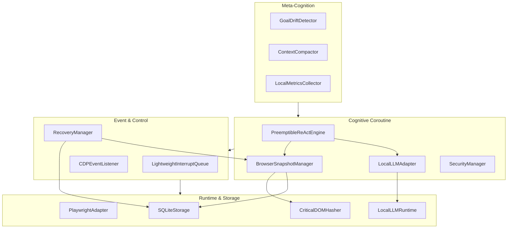
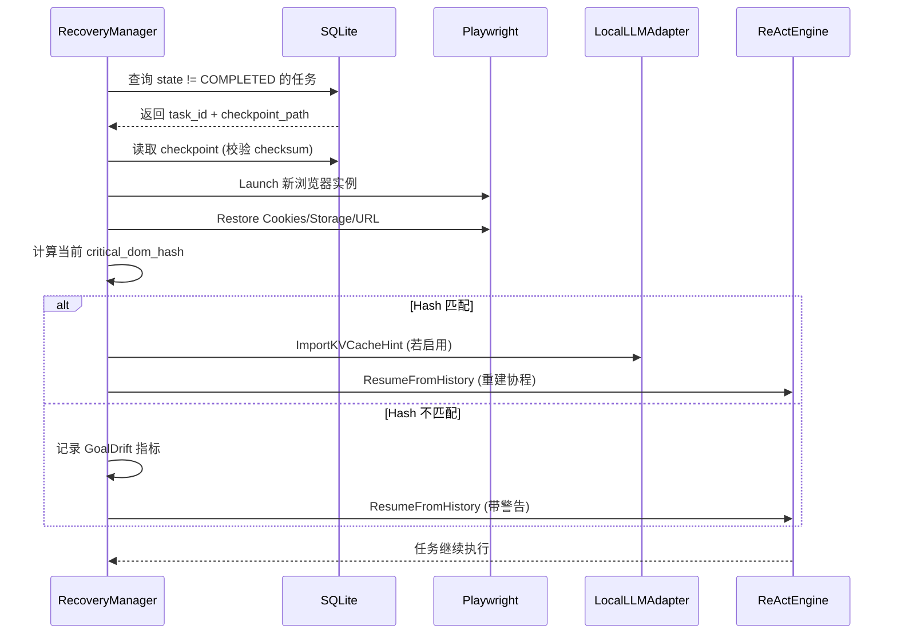

# AOS-Browser 详细设计文档 (AOS-Browser-Detailed-Design.md)

| 文档属性 | 内容 |
| :--- | :--- |
| **项目名称** | AOS-Browser (本地 LLM 专用版) |
| **版本号** | v1.0 |
| **架构版本** | BAFA-Lite (基于浏览器智能体融合架构裁剪) |
| **密级** | 内部公开 |
| **最后更新** | 2024-05-20 |
| **状态** | 详细设计评审稿 |

---

## 1. 引言

### 1.1 编写目的
本文档基于《AOS-Browser 架构评审与顶层设计（决策落地版）》编写，旨在定义 AOS-Browser 系统的模块内部结构、数据格式、接口规范及构建部署细节，指导后续编码实现与测试验收。

### 1.2 适用范围
适用于 AOS-Browser 核心开发团队、测试团队及运维部署人员。

### 1.3 参考文档
1.  《浏览器智能体架构.md》(BAFA v1.0)
2.  《AOS-Gateway.md》(六项关键技术指标)
3.  《AOS-Browser 架构评审与顶层设计（决策落地版）》
4.  《用户需求规格 (UR) 与架构决策记录 (ADR) 确认版》

### 1.4 术语定义
| 术语 | 定义 |
| :--- | :--- |
| **KV Cache Summary** | 定制 llama.cpp 导出的轻量级注意力模式摘要，用于加速推理恢复 |
| **Critical DOM Hash** | 基于配置选择器计算的页面关键区域指纹，用于恢复校验 |
| **Atomic Checkpoint** | 采用 tmp+fsync+rename 机制保障的原子状态保存点 |
| **BAFA-Lite** | 针对浏览器场景裁剪的 BAFA 三层架构，移除工业总线依赖 |

---

## 2. 系统架构细化

### 2.1 模块依赖关系图


### 2.2 线程与协程模型
*   **主线程 (Main Thread)**：运行 `PreemptibleReActEngine` 协程主循环，处理业务逻辑。
*   **IO 线程 (IO Thread)**：运行 `PlaywrightAdapter` 事件循环，处理 CDP WebSocket 消息，投递事件至 L1 队列。
*   **后台线程 (Background Thread)**：运行 `SQLiteStorage` 异步写入任务，处理原子检查点落盘，避免阻塞主协程。
*   **协程 (Coroutines)**：所有 ReAct 步骤 (`Planning`, `Acting`, `Observing`) 均为 C++20 协程，支持挂起/恢复。

---

## 3. 模块详细设计

### 3.1 Layer 1: 事件与控制层

#### 3.1.1 LightweightInterruptQueue
基于原子信号的轻量级中断队列，替代 BAFA 原设计的无锁环缓冲，满足 UR-03 (<100ms 响应)。

```cpp
// layer1/lightweight_interrupt_queue.h
class LightweightInterruptQueue {
public:
    enum class Priority { USER_PAUSE = 0, CRASH = 1, SYSTEM = 2, BACKGROUND = 3 };
    
    // 提交用户暂停信号 (O(1), 无锁)
    void PostUserPause() {
        pause_flag_.store(true, std::memory_order_release);
        timestamp_.store(GetTimestampUs(), std::memory_order_relaxed);
    }
    
    // 协程检查点调用 (O(1), <100ns)
    bool ShouldPause() const {
        return pause_flag_.load(std::memory_order_acquire);
    }
    
    // 重置暂停信号
    void ResetPause() {
        pause_flag_.store(false, std::memory_order_release);
    }

private:
    std::atomic<bool> pause_flag_{false};
    std::atomic<uint64_t> timestamp_{0};
};
```

#### 3.1.2 CDPEventListener
监听 Chrome DevTools Protocol 事件，映射为内部 `BrowserEvent`。

| CDP 事件 | 内部事件类型 | 优先级 | 处理动作 |
| :--- | :--- | :--- | :--- |
| `Page.crashed` | `BROWSER_CRASH` | CRITICAL | 触发紧急保存，通知 RecoveryManager |
| `Page.javascriptDialogOpening` | `ALERT_POPUP` | SYSTEM | 暂停当前 Action，等待用户/策略处理 |
| `Page.loadEventFired` | `NAVIGATION_COMPLETE` | SYSTEM | 触发 BrowserSnapshot 保存 |
| `Network.requestFailed` | `NETWORK_ERROR` | BACKGROUND | 记录日志，重试逻辑由 ReAct 引擎处理 |

### 3.2 Layer 2: 认知协程层

#### 3.2.1 LocalLLMAdapter (定制 llama.cpp 封装)
实现 UR-05 (可抢占) 及 ADR-11 (KV Cache 摘要)。

```cpp
// layer2/local_llm_adapter.h
class LocalLLMAdapter {
public:
    // 推理结果结构
    struct LLMResult {
        std::string partial;
        bool preempted;
        std::optional<KVCacheSummary> kv_hint; // 仅当 enable_kv_hint=true 时有效
    };

    // 可取消的流式生成
    Task<LLMResult> GenerateWithCancel(
        const std::string& prompt, 
        CancelToken& cancel_token
    );

    // 导出 KV 摘要 (调用定制 llama.cpp 接口)
    std::optional<KVCacheSummary> ExportKVCacheHint();

    // 导入 KV 摘要 (加速恢复)
    void ImportKVCacheHint(const KVCacheSummary& summary);

private:
    llama_context* ctx_;
    bool enable_kv_hint_;
};

// 定制 llama.cpp FFI 接口声明 (extern "C")
extern "C" {
    typedef struct llama_kv_summary* llama_kv_summary_t;
    llama_kv_summary_t llama_export_kv_summary(llama_context* ctx, uint32_t max_layers);
    void llama_import_kv_summary(llama_context* ctx, llama_kv_summary_t summary);
    void llama_free_kv_summary(llama_kv_summary_t summary);
}
```

#### 3.2.2 BrowserSnapshotManager
实现 UR-04 (状态持久化) 及 ADR-12 (DOM Hash 校验)。

```cpp
// layer2/browser_snapshot_manager.h
struct EnhancedBrowserSnapshot {
    std::string url;
    std::vector<Cookie> cookies;
    std::string local_storage_json;
    std::vector<FilledForm> forms;
    ViewportState viewport;
    
    // 关键校验字段
    std::string critical_dom_hash;  // SHA-256
    uint64_t snapshot_checksum;     // 防止脏恢复
    std::chrono::steady_clock::time_point captured_at;
    
    // 序列化 (集成 SecurityManager 加密)
    nlohmann::json ToJson(const SecurityManager& sec_mgr) const;
    static EnhancedBrowserSnapshot FromJson(const nlohmann::json& j, const SecurityManager& sec_mgr);
};

class BrowserSnapshotManager {
public:
    // 原子保存 (tmp + fsync + rename)
    Task<void> SaveAtomic(const EnhancedBrowserSnapshot& snapshot, const std::string& task_id);
    
    // 计算 DOM 哈希 (调用 CriticalDOMHasher)
    std::string ComputeCriticalDOMHash(const BrowserContext& ctx);
    
    // 恢复校验
    bool VerifyRestoration(const EnhancedBrowserSnapshot& snapshot, const BrowserContext& current_ctx);
};
```

#### 3.2.3 SecurityManager
实现 UR-07 (安全审计) 及 ADR-13 (正则匹配加密)。

```cpp
// layer2/security_manager.h
class SecurityManager {
public:
    void Init(const SecurityConfig& config);
    
    // 加密敏感字段 (序列化前调用)
    nlohmann::json EncryptSensitiveFields(const nlohmann::json& data);
    
    // 解密敏感字段 (反序列化后调用)
    nlohmann::json DecryptSensitiveFields(const nlohmann::json& data);
    
    // 记录审计日志
    void Audit(const std::string& event_type, const std::string& details);

private:
    std::vector<std::regex> sensitive_patterns_;
    EncryptionKey key_;
    std::ofstream audit_log_;
};
```

### 3.3 Layer 3: 元认知层

#### 3.3.1 LocalMetricsCollector
实现 UR-08 (可观测性) 及 ADR-14 (本地日志)。

*   **输出格式**: JSON Lines (每行一个 JSON 对象)
*   **轮转策略**: 文件大小 > 100MB 或 每日凌晨 0 点
*   **指标字段**:
    ```json
    {
      "timestamp": 1716182400000,
      "task_id": "task_001",
      "interrupt_count": 5,
      "pause_latency_ms": 12.5,
      "recovery_success": true,
      "steps_completed": 15
    }
    ```

---

## 4. 数据设计

### 4.1 SQLite 数据库 Schema
采用 WAL 模式，支持并发读写与崩溃安全。

```sql
-- 启用 WAL 模式
PRAGMA journal_mode=WAL;
PRAGMA synchronous=FULL;

-- 任务主表
CREATE TABLE tasks (
    task_id TEXT PRIMARY KEY,
    goal TEXT NOT NULL,
    current_state TEXT CHECK(current_state IN ('PLANNING', 'ACTING', 'OBSERVING', 'PAUSED', 'COMPLETED', 'FAILED')),
    created_at INTEGER NOT NULL,
    updated_at INTEGER NOT NULL,
    browser_snapshot_json TEXT,  -- 加密后的 JSON
    priority INTEGER DEFAULT 1
);

-- 历史步骤表 (支持分片加载)
CREATE TABLE react_steps (
    step_id INTEGER PRIMARY KEY AUTOINCREMENT,
    task_id TEXT NOT NULL,
    step_number INTEGER NOT NULL,
    state TEXT NOT NULL,
    thought TEXT,
    action_type TEXT,
    action_params TEXT,  -- JSON
    observation_summary TEXT,
    timestamp INTEGER NOT NULL,
    FOREIGN KEY (task_id) REFERENCES tasks(task_id)
);
CREATE INDEX idx_steps_task ON react_steps(task_id);

-- 原子检查点表 (保障恢复可靠性)
CREATE TABLE checkpoints (
    task_id TEXT PRIMARY KEY,
    tmp_path TEXT NOT NULL,
    final_path TEXT NOT NULL,
    checksum TEXT NOT NULL,
    created_at INTEGER NOT NULL
);

-- 审计日志表 (敏感操作记录)
CREATE TABLE audit_log (
    log_id INTEGER PRIMARY KEY AUTOINCREMENT,
    task_id TEXT,
    event_type TEXT NOT NULL,  -- FORM_SUBMIT, LOGIN_ATTEMPT, etc.
    details TEXT,  -- 加密或脱敏
    timestamp INTEGER NOT NULL
);
```

### 4.2 KV Cache Summary 二进制结构
定制 llama.cpp 导出的摘要格式 (草案)。

| 偏移量 | 字段 | 类型 | 说明 |
| :--- | :--- | :--- | :--- |
| 0 | Magic | uint32 | 0x4B565355 ("KVSU") |
| 4 | Version | uint32 | 摘要格式版本 |
| 8 | LayerCount | uint32 | 保存的层数 (配置项 `kv_hint_max_layers`) |
| 12 | TokenCount | uint32 | 对应的 Token 数量 |
| 16 | Data | byte[] | 压缩后的注意力模式数据 |
| N | Checksum | uint32 | CRC32 校验 |

---

## 5. 接口与流程设计

### 5.1 崩溃恢复流程 (Sequence)


### 5.2 可抢占推理流程
1.  **Start**: `ReActEngine` 调用 `LLMAdapter.GenerateWithCancel(prompt, cancel_token)`。
2.  **Loop**: `LLMAdapter` 内部循环调用 `llama_decode` 获取 Token。
3.  **Check**: 每生成 1 个 Token，检查 `cancel_token.IsCancelled()`。
4.  **Cancel**:
    *   若为 `true`，调用 `llama_export_kv_summary` 保存摘要。
    *   返回 `LLMResult{preempted=true, kv_hint=...}`。
    *   协程挂起，等待用户恢复。
5.  **Resume**:
    *   用户恢复信号到达。
    *   `LLMAdapter` 调用 `llama_import_kv_summary`。
    *   继续生成剩余 Token。

---

## 6. 构建与部署规范

### 6.1 定制 llama.cpp 管理
*   **仓库策略**: 使用 Git Submodule 指向官方 `llama.cpp` 特定 Commit。
*   **补丁管理**: 在 `patches/llama_kv_summary.patch` 存放定制代码。
*   **构建脚本**:
    ```bash
    # build_llama.sh
    git submodule update --init
    cd llama.cpp
    git apply ../patches/llama_kv_summary.patch
    cmake -B build -DGGML_CUDA=ON -DLLAMA_BUILD_TESTS=OFF
    cmake --build build --config Release
    ```
*   **版本锁定**: 必须锁定 `llama.cpp`  commit hash，避免 ABI 不兼容。

### 6.2 配置密钥安全注入
*   **禁止硬编码**: 加密密钥不得出现在代码或 Git 仓库中。
*   **注入方式**:
    *   **Systemd 服务**: 使用 `EnvironmentFile=/etc/aos-browser/env` (权限 600)。
    *   **Docker**: 使用 `docker secret` 或挂载 Volume。
*   **配置文件示例** (`/etc/aos-browser/config.yaml`):
    ```yaml
    security:
      encryption_key_path: "/etc/aos-browser/key.bin"  # 运行时读取
      sensitive_field_patterns:
        - ".*password.*"
        - ".*token.*"
    ```

### 6.3 日志轮转脚本 (Logrotate)
配置 `/etc/logrotate.d/aos-browser`:
```
/var/log/aos-browser/*.log {
    daily
    rotate 5
    compress
    delaycompress
    missingok
    notifempty
    create 0640 root root
}
```

---

## 7. 测试与验收标准

### 7.1 功能测试用例
| 用例 ID | 测试项 | 操作步骤 | 预期结果 | 对应 UR |
| :--- | :--- | :--- | :--- | :--- |
| **TC-01** | 用户暂停响应 | 任务执行中按下 Ctrl+C | 协程在≤2 个 Token 内停止，状态保存成功 | UR-03 |
| **TC-02** | 崩溃恢复 | 执行 `kill -9` 杀死浏览器进程 | 重启后自动恢复页面状态 (URL/Cookie/Form) | UR-04 |
| **TC-03** | DOM 哈希校验 | 恢复前手动修改页面 DOM 结构 | 日志记录 `DOM hash mismatch` 警告，任务继续 | UR-04 |
| **TC-04** | 敏感字段加密 | 检查 SQLite 中 `cookies` 表内容 | 密码/Token 字段为密文，非敏感字段明文 | UR-07 |
| **TC-05** | 离线运行 | 断开外部网络 (除目标网页) | 系统正常启动，模型加载成功，无报错 | UR-09 |

### 7.2 性能验收标准
| 指标 | 目标值 | 测试方法 |
| :--- | :--- | :--- |
| **暂停响应延迟** | P99 < 100ms | 高频触发暂停信号，统计 `ShouldPause` 到协程挂起时间 |
| **崩溃恢复时间** | < 5s (冷启动) | 模拟崩溃，计时从进程重启到恢复第一个 Action |
| **内存占用** | < 16GB (峰值) | 长时间运行 (24h)，监控 RSS 内存 |
| **KV  hint 加速比** | ≥ 30% | 对比启用/禁用 KV hint 的恢复后推理速度 |

### 7.3 安全验收标准
1.  **密钥权限**: 验证 `key.bin` 文件权限必须为 600。
2.  **日志脱敏**: 验证 `audit.log` 中不包含明文密码。
3.  **域名白名单**: 配置 `allowed_domains` 后，验证访问非白名单域名被拦截。

---

## 8. 风险与缓解措施

| 风险项 | 可能性 | 影响 | 缓解措施 |
| :--- | :--- | :--- | :--- |
| **llama.cpp 定制维护成本高** | 中 | 高 | 1. 尽量上游化补丁；2. 锁定稳定版本分支；3. 提供禁用 KV hint 的降级开关 |
| **DOM 选择器失效导致恢复校验失败** | 中 | 中 | 1. 配置多个冗余选择器；2. 校验失败仅记录警告，不阻断恢复 |
| **SQLite  WAL 文件过大** | 低 | 低 | 1. 定期执行 `PRAGMA wal_checkpoint(TRUNCATE)`；2. 监控磁盘空间 |
| **加密密钥丢失导致数据不可读** | 低 | 极高 | 1. 密钥备份流程文档化；2. 提供密钥轮换工具 |

---

## 9. 附录

### 9.1 配置项完整列表
参见《AOS-Browser 架构评审与顶层设计（决策落地版）》第六章配置模板。

### 9.2 错误码定义
| 错误码 | 含义 | 处理建议 |
| :--- | :--- | :--- |
| `ERR_SNAPSHOT_INVALID` | 快照校验和失败 | 尝试加载上一个检查点 |
| `ERR_DOM_HASH_MISMATCH` | 页面 DOM 指纹不匹配 | 记录警告，继续执行 |
| `ERR_LLM_PREEMPTED` | LLM 推理被取消 | 保存 KV hint，等待恢复 |
| `ERR_SECURITY_KEY_MISSING` | 加密密钥未找到 | 终止启动，检查配置文件 |

---
**文档结束**