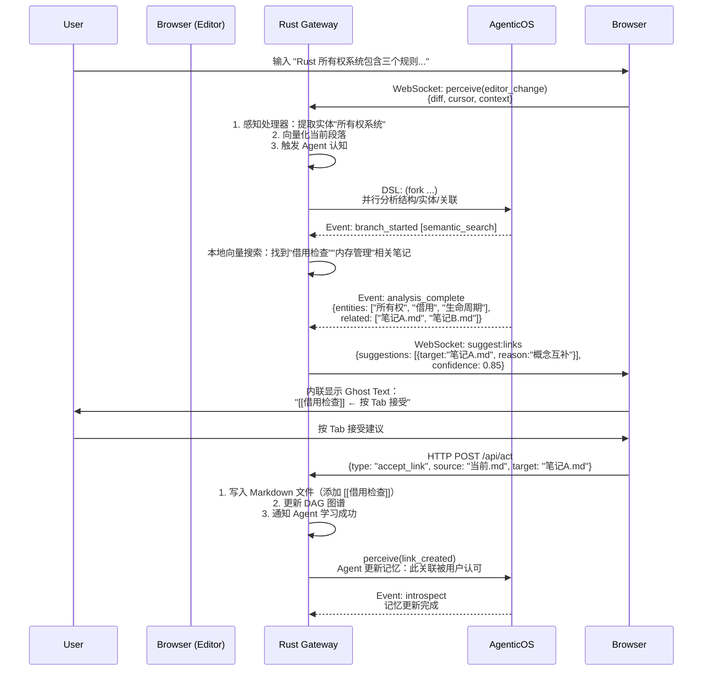

基于 **Browser-Native Agent Meta-Architecture**，开发 Markdown 编辑管理应用（PKM）时，你不是在"写一个编辑器"，而是在**培养一个精通 Markdown 知识管理的智能体协作伙伴**。

以下是完整开发指南：

---

## 一、架构定位：PKM 作为 Agent 的"写作技能"

```mermaid
[Browser PWA - Markdown Workspace]
    ↑↓ WebSocket/HTTP (localhost:3000)
[Rust Gateway - Agent Host]
    ↑↓ 感知(Percieve)/行动(Act)
[AgenticOS - DSL Execution]
    - (perceive :editor_change)
    - (fork :branches [分析结构/建议链接/检查矛盾])
    - (act :suggest_link)
```

**关键认知**：
- **没有"保存按钮"**：Agent 实时感知编辑器变化，自动决定何时索引、何时建议
- **没有"搜索框"**：Agent 通过语义感知，主动推送相关笔记
- **没有"手动双链"**：Agent 分析文本，建议 `[[链接]]`，用户一键确认

---

## 二、开发步骤详解

### Step 1: 定义 Persona（Markdown 知识管家）

创建 `personas/markdown_curator.yaml`：

```yaml
id: markdown_curator
name: 墨匠 (Ink Artisan)
description: |
  精通 Markdown 语义结构的知识策展人。擅长识别文本中的概念实体、
  发现隐式知识关联、维护一致的知识图谱。

cognitive_style:
  reasoning: "semantic_graph"      # 基于语义图谱推理
  proactivity: 0.7                 # 高主动性（主动建议）
  precision: 0.8                   # 精确型（验证后行动）

sensory_focus:
  - "markdown_ast"                 # 关注文档结构（标题、列表、代码块）
  - "entity_mention"               # 关注实体提及（专有名词、概念）
  - "writing_rhythm"               # 关注写作节奏（停顿、删除、重写）

default_skills:
  - skill_markdown_editor          # 编辑能力
  - skill_semantic_linking         # 语义链接
  - skill_structure_analysis       # 结构分析

dsl_templates:
  - name: "on_editor_change"
    trigger: "perceive"
    dsl: |
      (seq
        (perceive :type 'editor_change' :content '{{text_diff}}' :cursor '{{cursor_pos}}')
        (fork (:strategy 'reactive' :debounce 2000)  ; 2秒防抖
          (branch 'structural_analysis'
            (tool :name 'parse_markdown_ast' :content '{{current_paragraph}}'))
          (branch 'entity_extraction'
            (tool :name 'extract_entities' :text '{{current_line}}'))
          (branch 'semantic_search'
            (tool :name 'vector_search' :query '{{context_window}}' :top_k 3)))
        (merge)
        (if (and (entities.found) (semantic_search.has_results))
          (act :type 'suggest_links' 
               :suggestions (intersection entities semantic_search)))
        (if (structural_analysis.is_new_concept)
          (act :type 'suggest_hierarchy' :position '{{cursor_pos}}')))
```

### Step 2: 实现 Skill（Rust 层）

#### A. 感知处理器（Sensory Cortex）

```rust
// skills/markdown_editor/sensory.rs
pub struct MarkdownEditorSensory;

#[async_trait]
impl SensoryProcessor for MarkdownEditorSensory {
    fn percept_types(&self) -> Vec<&str> {
        vec!["editor_change", "cursor_move", "selection_change"]
    }
    
    async fn process(&self, raw: RawInput) -> Result<Percept> {
        let event: EditorEvent = serde_json::from_value(raw.content)?;
        
        // 将原始编辑器事件转化为 Agent 可理解的"感知"
        let percept = match event.type_ {
            "change" => {
                // 计算差异（diff），而非全量文本
                let diff = compute_diff(&event.old_text, &event.new_text);
                
                Percept::EditorChange(EditorChangePercept {
                    diff,
                    cursor_line: event.cursor.line,
                    context_paragraph: extract_paragraph(&event.new_text, event.cursor.line),
                    ast_snapshot: parse_markdown_ast(&event.new_text),
                    timestamp: event.timestamp,
                    // 判断是"书写"还是"整理"
                    intent: classify_writing_intent(&diff),
                })
            },
            "cursor_move" => Percept::CursorContext(CursorContext {
                surrounding_entities: extract_entities_around(&event.full_text, event.cursor.pos),
                available_links: query_potential_links(&event.full_text, event.cursor.pos).await?,
            }),
            _ => Percept::Other,
        };
        
        Ok(percept)
    }
}
```

#### B. 工具集（Motor Cortex）

```rust
// skills/markdown_editor/tools.rs

/// 工具1：创建笔记（Agent 调用，非用户直接调用）
pub struct NoteCreateTool;

#[async_trait]
impl Tool for NoteCreateTool {
    fn name(&self) -> &str { "markdown_create" }
    
    async fn execute(&self, params: Value, ctx: &ToolContext) -> Result<Value> {
        let title = params["title"].as_str().unwrap();
        let content = params["content"].as_str().unwrap();
        let suggested_links = params["auto_link"].as_array(); // Agent 建议的链接
        
        // 安全路径处理（沙箱内）
        let path = ctx.vault_path.join(format!("{}.md", sanitize_filename(title)));
        
        // 写入文件（通过 HTTP 暴露给 Browser，但这里是 Agent 直接调用）
        fs::write(&path, content).await?;
        
        // 立即向量化（后台异步）
        ctx.vector_index.add_document(&path, content).await?;
        
        // 如果 Agent 建议了链接，自动创建（或标记为待确认）
        if let Some(links) = suggested_links {
            for link in links {
                ctx.dag.add_edge(&path, link, EdgeType::SemanticLink).await?;
            }
        }
        
        Ok(json!({
            "path": path.to_str(),
            "status": "created",
            "agent_suggested_links": links.len()
        }))
    }
}

/// 工具2：语义搜索（RAG）
pub struct SemanticSearchTool;

#[async_trait]
impl Tool for SemanticSearchTool {
    fn name(&self) -> &str { "semantic_search" }
    
    async fn execute(&self, params: Value, ctx: &ToolContext) -> Result<Value> {
        let query = params["query"].as_str().unwrap();
        let top_k = params["top_k"].as_u64().unwrap_or(5);
        
        // 本地向量搜索（FAISS）
        let results = ctx.vector_index.search(query, top_k as usize).await?;
        
        // 转换为 Agent 可读的上下文
        let contexts: Vec<ContextChunk> = results.into_iter().map(|r| {
            ContextChunk {
                note_path: r.path,
                text: r.content,
                relevance_score: r.score,
                // 提取周围段落作为上下文
                surrounding: ctx.vector_index.get_surrounding(&r.path, r.offset),
            }
        }).collect();
        
        Ok(json!(contexts))
    }
}
```

### Step 3: 前端实现（Browser PWA）

#### A. 核心架构（React + CodeMirror 6）

```typescript
// 核心：编辑器与 Agent 的实时协作
function MarkdownWorkspace() {
  const { agent, state } = useAgentRuntime(); // 连接到 Rust Gateway
  const editorRef = useRef<EditorView>(null);
  const [suggestions, setSuggestions] = useState<Suggestion[]>([]);
  
  // 初始化：加载笔记并通知 Agent
  useEffect(() => {
    const note = loadNoteFromURL(); // 从 URL hash 获取路径
    
    // 告知 Agent 当前工作上下文
    agent.perceive('workspace_opened', {
      note_path: note.path,
      note_content: note.content,
      cursor_position: { line: 0, ch: 0 }
    });
    
    // 设置编辑器监听器
    const editor = new EditorView({
      doc: note.content,
      extensions: [
        // CodeMirror 扩展
        markdown(),
        // 关键：实时感知扩展
        EditorView.updateListener.of((update) => {
          if (update.docChanged) {
            // 计算 diff（优化传输）
            const diff = computeDiff(update.startState.doc, update.state.doc);
            
            // 发送到 Agent（防抖由 Agent 层处理）
            agent.perceive('editor_change', {
              diff,
              full_text: update.state.doc.toString(),
              cursor: update.state.selection.main.head,
              viewport: update.viewport // 当前可视区域（用于懒加载大文件）
            });
          }
        }),
        // 光标位置感知（用于上下文建议）
        EditorView.selectionListener.of((update) => {
          agent.perceive('cursor_move', {
            position: update.newSelection.main.head,
            surrounding_text: getSurroundingText(update.state, 200) // 前后200字符
          });
        })
      ],
      parent: editorRef.current
    });
    
    return () => editor.destroy();
  }, []);
  
  // 监听 Agent 的主动建议
  useEffect(() => {
    // Agent 建议创建链接
    agent.on('suggest:links', ({ suggestions, confidence }) => {
      if (confidence > 0.8) {
        // 在编辑器中内联显示（Ghost Text）
        showInlineLinkSuggestions(editorRef.current, suggestions);
      } else {
        // 低置信度：显示在侧边栏供参考
        setSuggestions(suggestions);
      }
    });
    
    // Agent 检测到结构机会（建议创建 MOC/索引）
    agent.on('suggest:structure', ({ type, reason }) => {
      toast.info(`Agent 建议: ${reason}`, {
        action: { 
          label: '查看', 
          onClick: () => showStructureProposal(type) 
        }
      });
    });
    
    // Agent 完成自动索引
    agent.on('indexed', ({ note_path, entities_found }) => {
      showStatusBarMessage(`已索引 ${entities_found} 个实体`);
    });
  }, []);
  
  return (
    <div className="markdown-workspace">
      {/* 主编辑器 */}
      <div ref={editorRef} className="editor-pane" />
      
      {/* Agent 协作侧边栏 */}
      <AgentSidebar>
        {/* 当前 Agent 的"思维"状态 */}
        <AgentMoodIndicator state={state.cognitive} />
        
        {/* 语义相关建议（Agent 推送） */}
        <SuggestionList 
          suggestions={suggestions}
          onAccept={(sugg) => agent.act('accept_suggestion', sugg)}
          onReject={(sugg) => agent.act('reject_suggestion', sugg)} // Agent 学习偏好
        />
        
        {/* 知识图谱微视图（当前笔记的局部图） */}
        <LocalGraphView centerNote={currentNote} />
        
        {/* Agent 对话控制台（直接指令） */}
        <AgentConsole 
          placeholder="Ask Agent: 'Find all notes about Rust ownership'"
          onSubmit={(cmd) => agent.perceive('user_command', { text: cmd })}
        />
      </AgentSidebar>
    </div>
  );
}
```

#### B. 离线支持（Service Worker）

```typescript
// sw.ts - 缓存策略：笔记内容 + Agent 上下文
const CACHE_NAME = 'agent-pkm-v1';

// 安装时预缓存核心资源
self.addEventListener('install', (event) => {
  event.waitUntil(
    caches.open(CACHE_NAME).then((cache) => {
      return cache.addAll([
        '/',                    // 主应用
        '/sdk.js',              // Agent SDK
        '/codemirror.bundle.js', // 编辑器
        '/api/health'           // Gateway 健康检查（离线回退）
      ]);
    })
  );
});

// 拦截请求：优先网络，离线时读缓存（Stale-While-Revalidate）
self.addEventListener('fetch', (event) => {
  const { request } = event;
  
  // API 请求：直接网络（Agent 实时性优先）
  if (request.url.includes('/api/') || request.url.includes('/ws')) {
    event.respondWith(fetch(request).catch(() => {
      // 离线时返回 503，前端降级到本地草稿模式
      return new Response(JSON.stringify({ error: 'offline' }), {
        status: 503,
        headers: { 'Content-Type': 'application/json' }
      });
    }));
    return;
  }
  
  // 静态资源：缓存优先
  event.respondWith(
    caches.match(request).then((response) => {
      return response || fetch(request).then((fetchResponse) => {
        return caches.open(CACHE_NAME).then((cache) => {
          cache.put(request, fetchResponse.clone());
          return fetchResponse;
        });
      });
    })
  );
});

// 后台同步：当 Agent 完成长时间任务后唤醒前端
self.addEventListener('push', (event) => {
  const data = event.data?.json();
  if (data.type === 'agent_task_complete') {
    self.registration.showNotification('Agent 完成', {
      body: data.message,
      data: { url: `/note/${data.note_path}` }
    });
  }
});
```

### Step 4: 数据流示例（完整协作循环）

**场景**：用户正在写关于"Rust 所有权"的笔记，Agent 自动发现关联



---

## 三、Browser 特有实现细节

### 1. 大文件处理（分片加载）

Browser 内存有限，Agent 需协助处理大 Markdown（>1MB）：

```typescript
// 前端：虚拟滚动 + Agent 预取
const VirtualizedEditor = ({ notePath }) => {
  const [visibleRange, setVisibleRange] = useState({ start: 0, end: 100 });
  
  // 通知 Agent 当前视口，Agent 只索引/分析可视区域（懒加载）
  useEffect(() => {
    agent.perceive('viewport_change', {
      note_path: notePath,
      range: visibleRange,
      // 请求 Agent 预加载下一屏的语义上下文
      prefetch_next: visibleRange.end + 100
    });
  }, [visibleRange]);
  
  // CodeMirror 6 的虚拟滚动
  return (
    <CodeMirror 
      document={notePath} // 使用 Document 扩展处理大文件
      viewportMargin: 100
      onViewportChange={setVisibleRange}
    />
  );
};
```

### 2. 文件系统访问降级策略

```typescript
// 自动选择最佳文件访问方式
class StorageAdapter {
  async init() {
    // 尝试 File System Access API（Chrome）
    if ('showDirectoryPicker' in window) {
      this.mode = 'fsa';
      this.handle = await window.showDirectoryPicker();
    } else {
      // Fallback：HTTP 代理（通过 Rust Gateway）
      this.mode = 'proxy';
    }
  }
  
  async readFile(path: string): Promise<string> {
    if (this.mode === 'fsa') {
      const fileHandle = await this.handle.getFileHandle(path);
      const file = await fileHandle.getFile();
      return await file.text();
    } else {
      return await fetch(`http://localhost:3000/api/file/${path}`).then(r => r.text());
    }
  }
  
  async writeFile(path: string, content: string) {
    if (this.mode === 'fsa') {
      // 可写流，支持大文件
      const fileHandle = await this.handle.getFileHandle(path, { create: true });
      const writable = await fileHandle.createWritable();
      await writable.write(content);
      await writable.close();
    } else {
      await fetch(`http://localhost:3000/api/file/${path}`, {
        method: 'POST',
        body: content
      });
    }
  }
}
```

### 3. Agent 状态持久化（IndexedDB）

当 Browser 刷新或离线时，保持 Agent 上下文：

```typescript
// 使用 Dexie.js 封装
const db = new Dexie('AgentContext');

db.version(1).stores({
  // 保存 Agent 的当前 Session 状态（刷新后恢复）
  sessions: '++id, agent_id, timestamp, last_context',
  
  // 保存未同步的编辑操作（离线队列）
  pending_percepts: '++id, type, payload, retry_count',
  
  // Agent 建议缓存（离线时可查看历史建议）
  suggestion_cache: '++id, note_path, suggestion, confidence'
});

// 连接恢复时重放未发送的感知
window.addEventListener('online', async () => {
  const pending = await db.pending_percepts.toArray();
  for (const p of pending) {
    agent.perceive(p.type, p.payload);
    await db.pending_percepts.delete(p.id);
  }
});
```

---

## 四、完整代码示例：Agent 协作编辑组件

```typescript
// components/AgenticMarkdownEditor.tsx
import { useCallback, useEffect, useRef, useState } from 'react';
import { EditorView, keymap } from '@codemirror/view';
import { markdown } from '@codemirror/lang-markdown';
import { useAgent } from '@meta-platform/sdk';
import { GhostTextWidget } from './GhostTextWidget'; // Agent 建议的幽灵文本

export function AgenticMarkdownEditor({ notePath }: { notePath: string }) {
  const editorRef = useRef<HTMLDivElement>(null);
  const viewRef = useRef<EditorView | null>(null);
  const { agent, state } = useAgent();
  const [ghostSuggestions, setGhostSuggestions] = useState<GhostText[]>([]);

  // 初始化编辑器
  useEffect(() => {
    if (!editorRef.current) return;

    const view = new EditorView({
      doc: '', // 初始为空，加载由 Agent 控制
      extensions: [
        markdown(),
        keymap.of([
          // Tab 键接受 Agent 建议
          { key: 'Tab', run: (view) => acceptGhostText(view, agent) },
          // Esc 拒绝
          { key: 'Escape', run: () => { setGhostSuggestions([]); return true; } }
        ]),
        // 实时感知扩展
        EditorView.updateListener.of((update) => {
          if (update.docChanged) {
            handleDocumentChange(update, agent);
          }
        }),
        // 渲染 Ghost Text（Agent 建议）
        ghostTextExtension(ghostSuggestions)
      ],
      parent: editorRef.current
    });

    viewRef.current = view;
    
    // 加载笔记：通过 Agent 而非直接读取（Agent 可同时加载上下文）
    agent.act('load_note', { path: notePath }).then((result) => {
      view.dispatch({
        changes: { from: 0, to: view.state.doc.length, insert: result.content }
      });
    });

    return () => view.destroy();
  }, [notePath, agent]);

  // 处理文档变化（防抖由 Agent 层处理，前端只负责发送）
  const handleDocumentChange = useCallback((update, agent) => {
    const doc = update.state.doc.toString();
    const selection = update.state.selection.main;
    
    // 发送给 Agent
    agent.perceive('editor_change', {
      full_length: doc.length,
      change_summary: update.changes.desc.toString(),
      cursor_line: doc.slice(0, selection.head).split('\n').length,
      // 当前段落上下文（用于语义分析）
      current_paragraph: getCurrentParagraph(doc, selection.head),
      timestamp: Date.now()
    });
  }, []);

  // 监听 Agent 建议
  useEffect(() => {
    // Agent 建议内联链接
    const unsubLinks = agent.on('suggestion:inline_link', (data) => {
      setGhostSuggestions([{
        pos: data.cursor_pos,
        text: ` [[${data.suggested_note}]]`,
        type: 'link',
        onAccept: () => insertLink(data)
      }]);
    });

    // Agent 建议继续写作（基于已有笔记的续写）
    const unsubContinue = agent.on('suggestion:continue', (data) => {
      setGhostSuggestions([{
        pos: viewRef.current!.state.doc.length,
        text: data.continuation_text,
        type: 'continuation',
        style: 'italic' // 灰色斜体显示
      }]);
    });

    // Agent 发现矛盾（高优先级警告）
    const unsubConflict = agent.on('alert:contradiction', (data) => {
      // 显示红色下划线或 Toast
      showContradictionWarning(data.existing_note, data.conflict_point);
    });

    return () => {
      unsubLinks();
      unsubContinue();
      unsubConflict();
    };
  }, [agent]);

  return (
    <div className="editor-container">
      <div ref={editorRef} className="editor-pane" />
      
      {/* Agent 状态指示器（Browser 浮动 UI） */}
      <div className={`agent-indicator ${state.cognitive}`}>
        {state.cognitive === 'thinking' && (
          <span>🤔 Agent 正在分析关联...</span>
        )}
        {state.cognitive === 'acting' && (
          <span>✍️ Agent 准备建议...</span>
        )}
      </div>

      {/* 离线模式指示 */}
      {!navigator.onLine && (
        <div className="offline-banner">
          离线模式 - 更改将在恢复连接后同步给 Agent
        </div>
      )}
    </div>
  );
}

// 辅助：接受幽灵文本
function acceptGhostText(view: EditorView, agent) {
  // 获取当前 Ghost Text 位置并插入
  // ... 具体实现 ...
  agent.act('accept_suggestion', { type: 'ghost_text' });
  return true;
}
```

---

## 五、开发与部署 checklist

### 开发环境
```bash
# 1. 启动 AgenticOS（大脑）
./agentic_os --port 9001 --enable-persistence

# 2. 启动 Rust Gateway（支持热重载）
cargo watch -x 'run -- --port 3000 --dev-mode'

# 3. 启动前端（Vite HMR）
cd frontend && npm run dev

# 4. 浏览器访问 http://localhost:5173
# 按 F12 打开 DevTools，可看到 WebSocket 帧和 Agent 调试信息
```

### 生产部署（PWA）
```bash
# 构建前端
cd frontend && npm run build

# Rust Gateway 托管静态文件（单二进制）
cargo build --release
./target/release/gateway --serve-static ./frontend/dist --port 3000

# 浏览器访问 http://localhost:3000
# 点击地址栏"安装"图标，添加到桌面（独立窗口，无浏览器 Chrome）
```

### 关键验证点
- [ ] 编辑时观察 WebSocket 帧：应看到 `perceive` 事件而非全量文本同步
- [ ] 离线测试：断网后编辑，恢复后 Agent 应收到离线期间的变化摘要
- [ ] Agent 建议：输入 "Rust" 后停顿 2 秒，应收到 `suggestion:inline_link` 事件
- [ ] 文件访问：Chrome 中应触发 `showDirectoryPicker`，Firefox 应自动降级到 HTTP 代理

**在这个架构中，Markdown 编辑器不再是"工具"，而是你与智能体协作者的"共享工作空间"——Agent 感知你的每一次输入，理解你的写作意图，主动维护知识图谱，而你保持最终决策权（接受/拒绝建议）。**