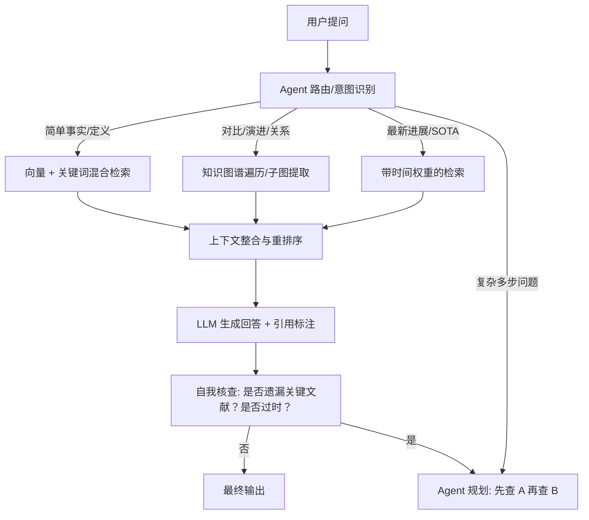

利用知识图谱分析 **SOTA (State-of-the-Art，最先进)** 的演进路径，是将静态文献库转化为**动态科研情报系统**的关键。这不仅仅是画一张图，而是要通过算法识别出**“谁超越了谁”**、**“技术路线如何分叉”**以及**“当前的制高点在哪里”**。

以下是基于 OpenClaw + 知识图谱的完整分析方案：

---

### 🧠 核心逻辑：从“引用关系”到“超越关系”

普通的引用图谱只展示 $A \to B$ (A 引用了 B)，但 SOTA 演进需要识别 $A \succ B$ (A 在性能/方法上超越了 B)。

#### 1. 数据层：构建“超越边” (Supersession Edges)
在 OpenClaw 解析文献时，不能只提取引用，必须提取**比较性陈述**。

*   **传统边**：`cites` (中性)
*   **SOTA 边**：`surpasses`, `outperforms`, `breaks_record_of` (有方向性的超越)

**OpenClaw 提取策略 (Prompt 设计)：**
> “阅读论文的‘实验结果’和‘相关工作’部分，寻找以下模式的句子：
> - 'Our method achieves X% accuracy, surpassing the previous SOTA [Ref] by Y%.'
> - 'Unlike [Ref], our approach solves the limitation of...'
> - 'We set a new record on [Dataset] compared to [Ref].'
> 提取出 `{Source_Paper, Target_Paper, Metric_Name, Improvement_Value}` 三元组。”

**生成的图谱数据结构示例：**
```json
{
  "source": "LLaMA-3-2024",
  "target": "Mistral-7B-2023",
  "relation": "surpasses",
  "metric": "MMLU Score",
  "value_change": "+5.2%",
  "dataset": "MMLU-57"
}
```

---

### 🗺️ 分析方法论：四种关键视角

#### 1. 时间切片演进 (Temporal Slicing)
**目的**：观察 SOTA 宝座随时间的转移。
*   **操作**：在图谱上设置时间滑块 ($T_{start} \to T_{end}$)。
*   **可视化**：
    *   **高亮节点**：仅显示当前时间段内指标最高的节点（SOTA Node）。
    *   **动态箭头**：动画展示 SOTA 头衔如何从节点 A 流向节点 B，再流向 C。
    *   **断代识别**：如果某段时间没有新节点超越旧节点，说明该领域进入**平台期 (Plateau)**。

#### 2. 指标多维雷达 (Multi-Metric Ranking)
**目的**：解决“没有绝对的 SOTA，只有特定任务下的 SOTA"的问题。
*   **操作**：为图谱节点添加多个属性权重 (Accuracy, Speed, Memory, Cost)。
*   **分析**：
    *   **帕累托前沿 (Pareto Frontier)**：在图谱中高亮那些“在某项指标上最优且未被全面超越”的节点集合。
    *   **场景筛选**：用户选择“低资源场景”，图谱自动重排，突出轻量化模型的演进路径（如：MobileBERT $\to$ TinyLLaMA $\to$ Qwen-1.8B）。

#### 3. 技术路线分叉树 (Lineage Tree)
**目的**：识别主流路线与旁支路线。
*   **操作**：将图谱转换为**有向无环图 (DAG)**，以最早的奠基性论文为根。
*   **分析**：
    *   **主干识别**：被引用次数最多且持续产生 SOTA 子节点的分支为主干（如：Transformer $\to$ BERT $\to$ RoBERTa $\to$ LLaMA）。
    *   **旁支发现**：某些节点虽然短期未成为 SOTA，但开启了新的技术范式（如：MoE 架构早期只是旁支，后来成为主流）。
    *   **死胡同标记**：那些引用了它们但没有后续改进节点的分支，标记为“技术死胡同”。

#### 4. 性能跃迁检测 (Performance Leap Detection)
**目的**：发现突破性创新 vs 渐进式改进。
*   **算法**：计算边上的 `value_change` 权重。
*   **可视化**：
    *   **细线**：渐进式改进 (< 2%)。
    *   **粗红线**：突破性跃迁 (> 10% 或 数量级提升)。
    *   **洞察**：快速定位历史上那些“一夜之间改变游戏规则”的论文（如 AlphaGo, Transformer, Diffusion Models）。

---

### 🛠️ 技术实现：OpenClaw + 前端可视化

#### 第一步：OpenClaw 技能开发 (`analyze-sota-path`)

创建一个专门的分析技能，输出结构化的演进数据。

```python
# 伪代码逻辑
def analyze_sota_evolution(graph_data):
    sota_chains = []
    
    # 1. 按数据集/任务分组
    tasks = group_by_task(graph_data.nodes)
    
    for task, nodes in tasks.items():
        # 2. 排序：先按时间，再按指标
        sorted_nodes = sort(nodes, key=lambda x: (x.year, x.metrics[task]))
        
        # 3. 构建链条：寻找连续的超越关系
        current_sota = sorted_nodes[0]
        chain = [current_sota]
        
        for node in sorted_nodes[1:]:
            if has_supersession_edge(current_sota, node):
                chain.append(node)
                current_sota = node
            elif node.metrics[task] > current_sota.metrics[task]:
                # 发现隐式超越（即使没明确写 supersede，但数值更高）
                chain.append(node)
                current_sota = node
        
        sota_chains.append({
            "task": task,
            "path": chain,
            "max_improvement": calculate_max_jump(chain)
        })
    
    return sota_chains
```

**输出格式 (供前端使用)：**
```json
{
  "task": "ImageNet Classification",
  "evolution_path": [
    {"id": "ResNet-50", "year": 2015, "acc": 76.0, "type": "milestone"},
    {"id": "EfficientNet-B7", "year": 2019, "acc": 84.4, "type": "sota"},
    {"id": "ViT-L/16", "year": 2020, "acc": 85.0, "type": "paradigm_shift"},
    {"id": "ConvNeXt", "year": 2022, "acc": 87.8, "type": "sota"}
  ]
}
```

#### 第二步：前端可视化设计 (G6 / React Flow)

在网页上实现以下交互组件：

1.  **SOTA 时间轴 (Timeline Slider)**
    *   底部放置时间轴，拖动时，图谱中非 SOTA 节点变灰，仅保留当前的“王者”及其直接挑战者。
    *   显示当前 SOTA 的关键指标卡片。

2.  **演进路径高亮 (Path Highlighting)**
    *   用户点击任意两个节点（如 "BERT" 和 "LLaMA-3"），自动计算并高亮它们之间的**最优演进路径**。
    *   路径上的每条边显示具体的提升幅度（如 "+3.5% Accuracy"）。

3.  **对比视图 (Split View)**
    *   左侧显示“精度演进树”，右侧显示“效率演进树”。
    *   直观展示某些模型为了精度牺牲了速度，或者反之。

4.  **预警气泡 (Alert Bubbles)**
    *   如果某篇经典 SOTA 文献被标记为 `deprecated`（结论被推翻），在图谱上用红色闪烁边框警示，并指向新的替代者。

---

### 📊 实战案例：分析 LLM 上下文窗口演进

假设我们要分析 **Context Window** 的 SOTA 演进：

1.  **数据输入**：OpenClaw 抓取了从 Transformer (2017) 到 RingAttention (2024) 的 50 篇论文。
2.  **关系提取**：
    *   Transformer $\xrightarrow{2k}$ BERT
    *   Longformer $\xrightarrow{4k}$ Reformer $\xrightarrow{linear}$ RetNet
    *   FlashAttention $\xrightarrow{optimization}$ ...
    *   RingAttention $\xrightarrow{infinite}$ ...
3.  **图谱分析结果**：
    *   **主干路径**：识别出从 $O(N^2)$ 复杂度到 $O(N)$ 再到无限长度的清晰技术路线。
    *   **关键转折点**：高亮 **FlashAttention** (2022)，标记为“效率突破点”，因为它虽未改变理论上限，但大幅提升了实际可用长度。
    *   **当前 SOTA**：自动锁定 **RingAttention** 或 **Hybrid Attention** 系列，显示其支持的最大 Token 数。
    *   **预测**：基于曲线斜率，提示“线性注意力机制可能是下一阶段的主流”。

---

### 💡 高级功能：自动化 SOTA 报告

结合 OpenClaw 的生成能力，每次图谱更新后，自动生成一份 **《SOTA 演进分析报告》**：

> **📊 [任务名称] SOTA 演进简报 (2026-03-20)**
>
> 1.  **当前王者**：**Model-X (2025)**，在 [Dataset] 上达到 **92.5%**，超越前任 **Model-Y** 达 **3.2%**。
> 2.  **演进趋势**：
>     *   过去 2 年，技术路线从 **[架构 A]** 转向 **[架构 B]**。
>     *   性能提升主要来源于 **[具体技术点，如 MoE]** 而非单纯增加参数量。
> 3.  **潜在挑战者**：**Model-Z (Preprint)** 声称达到了 93.0%，但尚未复现，需关注。
> 4.  **过时警告**：**Old-Model (2019)** 的核心假设已被最新研究证伪，建议不再作为基线。
>
> *[查看交互式演进图谱]*

### 总结

用图谱分析 SOTA 演进，核心在于**把“引用”升级为“超越”**，把“静态网络”升级为“动态时间序列”。

**实施步骤：**
1.  **OpenClaw 提取**：精准抽取 `surpass` 关系和具体指标数值。
2.  **图算法处理**：构建 DAG，计算最长路径（演进链），识别 Pareto 前沿。
3.  **前端交互**：提供时间轴、多指标切换、路径高亮功能。
4.  **自动报告**：让 AI 解读图谱，生成人类可读的结论。

这样，你的文献库就不再是故纸堆，而是一张**实时的科研作战地图**，让你一眼看清“我们在哪里”、“前人走了哪些弯路”以及“下一个突破口可能在哪”。


这是一个非常关键的问题，直接决定了你系统的**智能上限**。

简单的回答是：**绝对不能只做向量数据库搜索（Vector Search）**。
对于文献知识库，尤其是涉及 SOTA 演进、结论对比、时效性判断的场景，**单纯的向量搜索是远远不够的**。

你的系统应该采用 **Agentic RAG (智能体检索增强生成)** 架构，并融合 **混合检索 (Hybrid Search)** + **知识图谱检索 (Graph RAG)**。

以下是详细的架构对比和针对你系统的最佳实践方案：

---

### 1. 四种检索模式的对比

| 模式 | 原理 | 优点 | 缺点 | 适用场景 | 你的系统需要吗？ |
| :--- | :--- | :--- | :--- :--- | :--- |
| **纯向量搜索**(Naive RAG) | 将用户问题向量化，在数据库中找语义最相似的文本块。 | 实现简单，能处理模糊提问。 | **无法处理逻辑推理**；容易丢失全局信息；**无法理解引用关系**；难以区分新旧观点。 | 简单的 FAQ 问答。 | ❌ **不够**(只能做基础层) |
| **混合检索**(Hybrid Search) | **向量相似度** + **关键词匹配 (BM25)** + **元数据过滤**。 | 兼顾语义理解和精确匹配（如专有名词、年份、DOI）；可通过过滤解决时效性问题。 | 仍然基于局部文本块，难以回答“整个领域的发展脉络”类问题。 | 精确查找某篇论文、特定年份的研究。 | ✅ **必须**(作为第一道防线) |
| **图谱检索**(Graph RAG) | 利用知识图谱中的**实体关系**（引用、超越、作者共现）进行遍历搜索。 | 能回答**关系型问题**（"A 是如何改进 B 的？”）；能发现隐性关联；支持多跳推理。 | 构建成本高；对非结构化文本的覆盖不如向量全。 | 分析技术演进、寻找对立观点、追踪引用链。 | ✅ **核心亮点**(解决复杂推理) |
| **Agentic RAG**(智能体检索) | **LLM 作为大脑**，自主决定调用哪些工具（搜向量、查图谱、滤时间、读全文），并进行多轮迭代。 | **最灵活**；能拆解复杂问题；能自我纠错；能根据上下文动态调整策略。 | 延迟稍高；需要精心设计 Agent 的工具链和 Prompt。 | **所有复杂场景**，特别是需要综合判断的问题。 | ✅ **终极形态**(系统的核心大脑) |

---

### 2. 你的系统应该采用的架构：Agentic Graph-RAG

建议采用 **“用户意图识别 -> 动态路由 -> 多路召回 -> 图谱增强 -> 综合生成”** 的流程。

#### 核心工作流图解



---

### 3. 具体场景的检索策略详解

#### 场景 A：用户问“什么是 Transformer？”
*   **策略**：**混合检索 (Hybrid Search)**
*   **逻辑**：
    1.  关键词匹配 "Transformer"。
    2.  向量匹配语义解释。
    3.  **元数据过滤**：优先选取高被引的综述或原始论文 (Vaswani et al. 2017)。
    4.  **结果**：直接给出定义和原始出处。

#### 场景 B：用户问"LLM 量化技术的最新 SOTA 是什么？比两年前好多少？”
*   **策略**：**Agentic RAG + 时间过滤 + 图谱跳跃**
*   **Agent 执行步骤**：
    1.  **意图识别**：识别出关键词“最新 SOTA"、“量化”、“对比”。
    2.  **工具调用 1 (时间过滤)**：在向量库中搜索 `tags:quantization` AND `year >= 2024`。
    3.  **工具调用 2 (图谱查询)**：在图谱中查找 `Node: Quantization` 的 `superseded_by` 边，找到最新的 SOTA 节点。
    4.  **工具调用 3 (细节提取)**：读取最新节点和 2022 年节点的 `metrics` 属性，计算差值。
    5.  **生成**：组合信息，回答"2024 年的 X 模型是 SOTA，比 2022 年的 Y 模型提升了 Z%..."。

#### 场景 C：用户问"A 论文的观点被哪些后续研究反驳了？”
*   **策略**：**纯图谱检索 (Graph Traversal)**
*   **逻辑**：
    1.  定位节点 "Paper A"。
    2.  遍历出边，寻找关系类型为 `refutes`, `contradicts`, `limitations_of` 的边。
    3.  返回目标节点列表及其反驳的具体论点。
    4.  **优势**：这种**关系型查询**是向量搜索完全做不到的（向量只能找到语义相似的，找不到逻辑相反的）。

#### 场景 D：用户问“帮我制定一个从入门到精通 MoE 架构的学习路径。”
*   **策略**：**Agentic 规划 (Planning)**
*   **逻辑**：
    1.  Agent 拆解任务：基础概念 -> 早期经典 -> 关键突破 -> 最新应用。
    2.  **迭代检索**：
        *   Step 1: 搜 "Mixture of Experts basic concept" (向量)。
        *   Step 2: 搜 "MoE seminal paper" (图谱/关键词)。
        *   Step 3: 搜 "MoE recent improvements 2024-2026" (时间过滤)。
    3.  **排序与整合**：按时间线和难度排序，生成路径列表。

---

### 4. 为什么必须是 Agentic RAG？

因为文献库的查询往往不是单一的，而是**动态变化**的。

*   **传统 RAG**：不管用户问什么，都机械地搜 Top-5 相似片段。如果用户问“有没有人反对这个观点？”，它可能还是搜出一堆支持该观点的片段（因为语义相似），导致**确认偏误 (Confirmation Bias)**。
*   **Agentic RAG**：
    *   它能**理解**“反对”这个词意味着需要找逻辑相反的内容。
    *   它能**决定**去查图谱里的 `contradicts` 关系，而不是去查向量相似度。
    *   它能**反思**：“我找到的都是 2020 年前的，用户问的是最新，我需要重新搜索并限制时间。”

### 5. 如何在 OpenClaw 中实现？

你需要定义一组丰富的 **Tools** 供 Agent 调用：

1.  `search_vector(query, filters)`: 混合检索工具。
2.  `query_graph(entity, relation_type)`: 图谱查询工具（支持 Cypher 或自定义 API）。
3.  `get_paper_details(doi)`: 获取单篇文献详情。
4.  `find_citation_chain(paper_id, direction)`: 查找引用链（向前/向后）。
5.  `compare_papers(list_of_ids)`: 对比多篇文献的指标。
6.  `check_recency(topic)`: 专门检查某主题的最新文献。

**Agent 的 System Prompt 示例：**
> “你是一个学术科研助手。当用户提问时：
> 1. 首先分析问题类型：是事实查询、关系推理、还是趋势分析？
> 2. 如果是关系推理（如‘谁改进了谁’、‘谁反驳了谁’），**必须**优先调用 `query_graph` 工具。
> 3. 如果涉及‘最新’、'SOTA'，**必须**在检索中加入时间过滤 (`year >= current_year - 2`)。
> 4. 如果初步搜索结果不足以回答问题，请规划下一步检索（例如：‘找到了 A 论文，现在需要查找引用了 A 的后续论文’）。
> 5. 最终回答必须包含明确的文献引用，并指出文献的年份和状态（是否被推翻）。”

### 总结建议

*   **底层存储**：向量数据库 (Chroma/Milvus) + 图数据库 (Neo4j/Nebula) 或 基于 JSON 的轻量图谱。
*   **检索核心**：**Agentic RAG**。让 LLM 充当调度员，根据问题语义动态选择是用向量搜、用图谱查、还是用时间滤。
*   **用户体验**：在前端展示时，不仅展示答案，还要展示**“思考过程”**（例如：“我首先检索了...发现...然后我去查了图谱发现..."），增加可信度。

只有这样，你的系统才能真正做到**“懂问题”**而不仅仅是**“搜文字”**，从而在复杂的学术场景中提供真正有价值的洞察。