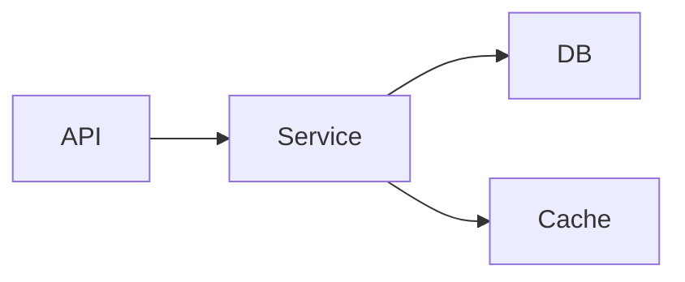

## Openclaw & OpenCode协同

**完全可以，而且这是一个非常完美的“双剑合璧”架构！**

将 **OpenClaw** 作为你的“企业级知识库大脑（RAG + 专家系统）”，将 **OpenCode** 作为你的“本地编码执行手（IDE 集成 + 代码生成）”，两者结合可以解决当前 AI 编程最大的痛点：**通用大模型不懂你公司的私有架构和规范**。

### 核心工作流：OpenClaw (脑) -> OpenCode (手)

1.  **OpenClaw (知识层)**：
    *   存储了你公司的《架构设计规范》、《API 文档》、《数据库字典》、《历史重构记录》。
    *   当你询问架构问题时，它基于私有文档检索（RAG），给出符合公司规范的**设计建议**和**代码片段示例**。
2.  **OpenCode (执行层)**：
    *   你在 IDE 或终端中使用 OpenCode。
    *   你将 OpenClaw 生成的“架构建议”作为 **Context (上下文)** 喂给 OpenCode。
    *   OpenCode 基于这些精准的规范，在你的项目中进行**具体的代码编写、重构和文件操作**。

---

### 具体实施步骤

#### 第一步：在 OpenClaw 中构建“架构师专家”

按照之前的方案，创建一个专门用于架构设计的 Agent。

1.  **准备文档**：
    收集所有关键文档放入 `~/openclaw-project/experts/architect/docs`：
    *   `system-design-patterns.md` (公司设计模式规范)
    *   `api-guidelines.pdf` (REST/GraphQL 接口规范)
    *   `database-schema.sql` (最新数据库结构)
    *   `tech-stack-policy.md` (允许使用的库/禁止使用的库)
    *   `legacy-code-analysis.md` (旧系统坑点总结)

2.  **配置 Agent (`architect-expert`)**：
    在 `openclaw.json` 中定义：
    ```json
    {
      "agents": {
        "definitions": {
          "architect-expert": {
            "model": "google/gemini-3.1-pro-preview", // 推荐用长上下文模型处理复杂架构
            "systemPrompt": "你是一名资深系统架构师。请严格依据挂载的知识库文档提供设计方案。输出必须包含：1. 设计思路；2. 目录结构建议；3. 核心代码片段（符合公司规范）；4. 潜在风险提示。",
            "tools": [
              {
                "name": "memory-core",
                "config": {
                  "indexing": { "watchPaths": ["/home/user/openclaw-project/experts/architect/docs"] },
                  "retrieval": { "topK": 10, "threshold": 0.7, "includeSources": true }
                }
              }
            ]
          }
        }
      }
    }
    ```
3.  **索引数据**：`openclaw memory index --all`

#### 第二步：在 OpenCode 中调用架构建议

现在，当你要开发一个新功能（例如“用户积分系统”）时，操作流程如下：

**场景 A：命令行工作流 (CLI)**

1.  **先问 OpenClaw (获取架构蓝图)**：
    ```bash
    # 让架构师专家基于公司规范生成设计方案
    openclaw chat --agent architect-expert "我要开发一个用户积分系统，支持每日签到和消费抵扣。请根据公司的架构规范，给出目录结构设计、数据库表设计建议和核心 Service 层的代码骨架。"
    ```
    *OpenClaw 会检索你的私有文档，返回一份完全符合公司规范的设计方案，甚至直接给出符合你们风格的代码片段。*

2.  **再交给 OpenCode (落地执行)**：
    复制 OpenClaw 的输出结果，作为 Prompt 发送给 OpenCode：
    ```bash
    # 在 project 目录下运行
    opencode "请根据以下架构设计方案，帮我创建相应的文件结构并实现核心逻辑。
    
    【架构方案内容...粘贴上面 OpenClaw 的输出...】
    
    注意：请严格按照上述目录结构创建文件，并补充完整的错误处理逻辑。"
    ```
    *OpenCode 会读取当前项目上下文，结合你给的“标准答案”，自动创建文件、写入代码。*

**场景 B：IDE 插件工作流 (更流畅)**

如果你使用的是带有 Chat 功能的 OpenCode 插件（如 VS Code 插件）：

1.  打开侧边栏 Chat。
2.  **第一步**：手动运行一次 OpenClaw 命令（或在另一个终端窗口），获取架构建议。
3.  **第二步**：将建议粘贴到 IDE Chat 中，输入：“基于这个由我们内部架构师（OpenClaw）生成的方案，请帮我实现 `UserService.ts`。”
4.  **效果**：OpenCode 不再需要去“猜”你们的规范，而是直接执行明确的指令，生成的代码一次性通过率极高。

---

### 这种架构的巨大优势

| 痛点 | 传统做法 (直接用 OpenCode/Cursor) | **OpenClaw + OpenCode 组合拳** |
| :--- | :--- | :--- |
| **规范一致性** | AI 经常写出不符合公司规范的代码（如用了禁用的库、命名风格不对）。 | **100% 合规**。OpenClaw 先基于私有文档把关，OpenCode 只是执行者。 |
| **上下文限制** | 项目太大，AI 读不完所有文档，容易幻觉。 | **精准投喂**。OpenClaw 只检索最相关的规范片段，提炼后给 OpenCode，减少 Token 浪费。 |
| **知识更新** | 规范变了，需要重新微调模型或反复提示。 | **实时更新**。只需在 OpenClaw 目录替换 PDF/Markdown，下次查询立即生效。 |
| **安全性** | 把核心架构文档上传到云端 AI 有风险。 | **数据主权**。敏感文档只在 OpenClaw 本地服务器，OpenCode 只接收脱敏后的“设计建议”。 |
| **角色分工** | 一个模型既要懂架构又要写代码，容易顾此失彼。 | **专业分工**。OpenClaw 做“总设计师”，OpenCode 做“高级技工”。 |

### 进阶自动化：编写一个 Bridge 脚本

如果你想更进一步，可以写一个简单的 Shell 脚本 `ask-architect.sh`，把两步合并：

```bash
#!/bin/bash
# 用法：./ask-architect.sh "需求描述"

QUERY="$1"

echo "🧠 正在咨询内部架构师 (OpenClaw)..."
# 调用 OpenClaw 获取方案，只保留核心内容
ARCHITECTURE_PLAN=$(openclaw chat --agent architect-expert "$QUERY" --format text)

echo "🛠️ 正在指挥代码工匠 (OpenCode) 实施..."
# 将方案传递给 OpenCode (假设 opencode 支持 stdin 或 -p 参数)
echo "$ARCHITECTURE_PLAN" | opencode --prompt "请严格执行以下架构方案进行代码生成和文件修改：
---
$(cat)
---
请在执行前再次确认文件路径是否符合当前项目结构。"
```

### 总结

**是的，强烈推荐这样做。**

*   **OpenClaw** 是你的**私有知识库和规则引擎**，确保“方向正确”。
*   **OpenCode** 是你的**高效执行器**，确保“落地快速”。

这种模式特别适合中大型团队或对代码规范有严格要求的场景。它解决了通用 Coding Agent“懂代码但不懂业务/规范”的核心缺陷。


## 共享知识库
这是一个非常高级且实用的架构需求。要实现 **OpenClaw（作为知识检索中心）** 和 **OpenCode（作为代码执行终端）** 共享同一份知识库，并且让 OpenCode 能够“感知”到 OpenClaw 检索到的内容，主要有三种实现路径，按**推荐程度**排序：

---

### 方案一：物理共享 + 统一索引（最推荐，原生支持）
**原理**：让两个工具指向**同一个本地文件夹**作为知识库源。OpenClaw 负责维护索引（或各自维护），OpenCode 直接读取该文件夹内容作为 Context。
**优点**：配置简单，无需开发中间件，数据实时同步，零延迟。
**适用场景**：OpenCode 支持读取本地文件作为上下文（大多数现代 Coding Agent 都支持）。

#### 操作步骤：

1.  **建立统一知识库目录**
    在服务器上创建一个公共目录，存放所有专业文档。
    ```bash
    mkdir -p /opt/shared-knowledge/base
    # 放入你的文档
    cp architecture.pdf /opt/shared-knowledge/base/
    cp api-specs.md /opt/shared-knowledge/base/
    ```

2.  **配置 OpenClaw (作为检索专家)**
    在 `openclaw.json` 中，将 Agent 的 `watchPaths` 指向该目录。
    ```json
    {
      "agents": {
        "definitions": {
          "architect-expert": {
            "tools": [
              {
                "name": "memory-core",
                "config": {
                  "indexing": { 
                    "watchPaths": ["/opt/shared-knowledge/base"] 
                  },
                  "retrieval": { "topK": 5 }
                }
              }
            ]
          }
        }
      }
    }
    ```
    *运行 `openclaw memory index` 完成向量化。*

3.  **配置 OpenCode (作为执行者)**
    大多数 OpenCode 类工具（如 Aider, OpenCode CLI）支持通过命令行参数或配置文件加载额外上下文。
    
    *   **方法 A：命令行动态加载**
        当你调用 OpenCode 时，显式指定知识库目录或关键文件：
        ```bash
        # 假设 opencode 支持 --context-dir 或类似参数
        opencode --context-dir /opt/shared-knowledge/base "请根据知识库规范，重构 user_service.py"
        ```
    
    *   **方法 B：配置文件静态加载 (`opencode.json` 或 `.opencode/rules.md`)**
        在项目根目录创建规则文件，引用共享知识：
        ```markdown
        # .opencode/rules.md
        请严格遵循以下共享知识库中的规范进行编码：
        - /opt/shared-knowledge/base/architecture.pdf
        - /opt/shared-knowledge/base/api-specs.md
        
        (如果工具支持自动读取目录，可直接写：参考 /opt/shared-knowledge/base 下的所有文档)
        ```

**效果**：OpenClaw 通过向量检索回答复杂问题；OpenCode 在生成代码时，直接读取这些文件的文本内容作为 Prompt 的一部分，确保代码符合规范。

---

### 方案二：OpenClaw 作为“预处理器” (Pipeline 模式)
**原理**：先运行 OpenClaw 进行**精准检索**，将检索结果（切片文本）提取出来，作为**临时文件**或**环境变量**传递给 OpenCode。
**优点**：解决了 OpenCode 无法处理大量文档（Context Window 限制）的问题。OpenClaw 只把**最相关**的片段给 OpenCode，节省 Token 且更精准。
**适用场景**：知识库非常大，直接全量喂给 OpenCode 会爆显存或超时报错。

#### 操作流程（脚本化）：

编写一个 Shell 脚本 `dev-flow.sh`：

```bash
#!/bin/bash

USER_QUERY="$1"
TEMP_CONTEXT="/tmp/opencode_context_$$.md"

echo "🧠 步骤 1: OpenClaw 正在检索最相关的知识片段..."

# 调用 OpenClaw 进行检索 (假设有一个专门的检索命令或 agent)
# 这里我们让 architect-expert 只返回检索到的上下文，不进行总结
RETRIEVED_INFO=$(openclaw chat --agent architect-expert \
  "请仅检索与以下需求最相关的知识库片段，不要总结，不要废话，直接列出原文内容和来源文件名：$USER_QUERY" \
  --format text)

# 将检索结果写入临时文件
echo "# 自动检索到的相关规范 (由 OpenClaw 提供)" > $TEMP_CONTEXT
echo "$RETRIEVED_INFO" >> $TEMP_CONTEXT

echo "🛠️ 步骤 2: OpenCode 基于检索到的上下文进行编码..."

# 调用 OpenCode，并将临时文件作为核心上下文传入
# 注意：不同 OpenCode 工具传入文件的方式不同，有的是 --file，有的是直接 cat
opencode --file "$TEMP_CONTEXT" \
  "请严格依据上方【自动检索到的相关规范】中的要求，完成以下任务：$USER_QUERY"

# 清理临时文件
rm $TEMP_CONTEXT
```

**使用方法**：
```bash
./dev-flow.sh "创建一个符合新规范的登录接口"
```
**效果**：OpenCode 拿到的不是几百页的 PDF，而是 OpenClaw 精心挑选的 3-5 段最相关的规范原文，准确率极高。

---

### 方案三：API 桥接模式 (高阶开发)
**原理**：将 OpenClaw 部署为服务，编写一个 **OpenCode Custom Tool/Skill**。当 OpenCode 需要知识时，主动调用 OpenClaw 的 API 获取数据。
**优点**：自动化程度最高，OpenCode 可以“自主决定”何时去查知识库。
**缺点**：需要开发代码，配置复杂。

#### 实施思路：

1.  **开启 OpenClaw API**
    确保 OpenClaw Gateway 运行在 `http://localhost:18789`，并暴露了 Chat 或 Retrieval 接口。

2.  **为 OpenCode 编写自定义 Tool**
    在 OpenCode 的配置中（通常支持 Python/JS 插件），定义一个工具 `search_internal_knowledge`：

    ```python
    # pseudo-code for OpenCode tool
    import requests

    def search_knowledge(query: str):
        # 调用 OpenClaw 的 API
        response = requests.post("http://localhost:18789/api/chat", json={
            "agent": "architect-expert",
            "prompt": f"检索以下内容的规范片段：{query}",
            "stream": False
        })
        return response.json()['message'] # 返回检索到的文本

    # 注册该工具，让 OpenCode 知道它可以调用这个函数
    register_tool("search_internal_knowledge", search_knowledge)
    ```

3.  **工作流程**
    *   用户问 OpenCode：“怎么创建新用户？”
    *   OpenCode 分析意图 -> 发现需要查规范 -> **自动调用** `search_internal_knowledge("创建新用户规范")`。
    *   OpenClaw 返回检索结果。
    *   OpenCode 结合结果生成代码。

---

### 综合建议与最佳实践

对于大多数团队，**方案二（Pipeline 模式）** 是性价比最高的选择。

**推荐理由**：
1.  **精准度最高**：利用 OpenClaw 强大的 RAG 能力做“过滤器”，避免 OpenCode 被无关信息干扰。
2.  **成本低**：只传输检索后的片段，大幅减少 OpenCode 消耗的 Token。
3.  **灵活性**：不需要修改 OpenCode 源码，只需一个简单的 Shell 脚本包装。
4.  **解耦**：OpenClaw 专注“找知识”，OpenCode 专注“写代码”，各司其职。

**最终工作流图示**：
```mermaid
graph LR
    User[用户提问] --> Script[Shell 脚本/工作流]
    Script -->|1. 发送查询 | OpenClaw[OpenClaw (RAG 引擎)]
    OpenClaw -->|2. 检索私有知识库 | DB[(向量数据库)]
    DB -->|3. 返回最相关片段 | OpenClaw
    OpenClaw -->|4. 输出精选上下文 | Script
    Script -->|5. 注入上下文 + 原始需求 | OpenCode[OpenCode (编码引擎)]
    OpenCode -->|6. 生成符合规范的代码 | Project[项目代码]
```

**你可以立即尝试的操作**：
1.  确保你的知识库文件在一个公共目录。
2.  配置好 OpenClaw 的 `architect-expert`。
3.  写一个最简单的脚本，先跑通 `OpenClaw 检索 -> 保存文件 -> OpenCode 读取文件` 这个流程。
4.  验证生成的代码是否真的引用了知识库里的规范。

这样你就拥有了一个**既懂公司私有规范（OpenClaw），又能动手写代码（OpenCode）** 的超级 AI 开发团队。

## 代码结构化

把代码结构“可视化”给 AI 看，核心不在于生成一张**图片**（AI 看图的能力远不如看文本），而在于生成一种**结构化、层级清晰的文本表示（Structured Text Representation）**。

对于 LLM 来说，最好的“可视化”是：**文件树 + 关键代码骨架 + 依赖关系图（Mermaid/JSON）**。

以下是让 OpenClaw（或任何 AI）“一眼看懂”你项目架构的三种最佳方案，按推荐程度排序：

---

### 方案一：生成“增强型文件树” (最推荐，性价比最高)
**原理**：不仅仅是 `ls` 列出文件名，而是列出 **文件路径 + 文件内主要类/函数名 + 简短注释**。
**优点**：Token 消耗极低，信息密度极高，AI 能瞬间理解模块划分和核心逻辑入口。
**适用场景**：快速上手新项目、定位功能模块、架构审查。

#### 操作步骤：

1.  **编写生成脚本 (`generate_structure.py`)**
    使用 Python 遍历目录，提取每个文件的顶层定义（类、函数）。

    ```python
    import os
    import ast # Python 示例，JS/TS 可用 tree-sitter 或 regex

    def scan_directory(root_path, max_depth=3):
        structure = []
        
        for dirpath, dirnames, filenames in os.walk(root_path):
            # 计算深度
            depth = dirpath.replace(root_path, '').count(os.sep)
            if depth > max_depth:
                continue
                
            # 添加目录行
            indent = "  " * depth
            dir_name = os.path.basename(dirpath) or root_path
            structure.append(f"{indent}📁 {dir_name}/")
            
            # 处理文件
            for filename in sorted(filenames):
                if not filename.endswith(('.py', '.js', '.ts', '.go')):
                    continue
                    
                file_path = os.path.join(dirpath, filename)
                file_indent = "  " * (depth + 1)
                
                # 尝试提取主要符号 (以 Python 为例)
                symbols = extract_symbols(file_path) 
                # symbols 格式: ["class UserService", "def login()", "def logout()"]
                
                symbol_str = ", ".join(symbols[:5]) # 只取前 5 个，避免太长
                if symbols:
                    structure.append(f"{file_indent}📄 {filename} [{symbol_str}]")
                else:
                    structure.append(f"{file_indent}📄 {filename}")
                    
        return "\n".join(structure)

    def extract_symbols(filepath):
        # 这里简化处理，实际可用 ast.parse 或正则
        try:
            with open(filepath, 'r', encoding='utf-8') as f:
                content = f.read()
            # 简单正则提取 class 和 def (生产环境建议用 ast/tree-sitter)
            import re
            classes = re.findall(r'^class\s+(\w+)', content, re.MULTILINE)
            funcs = re.findall(r'^def\s+(\w+)', content, re.MULTILINE)
            return [f"class {c}" for c in classes] + [f"def {f}()" for f in funcs]
        except:
            return []

    if __name__ == "__main__":
        print(scan_directory("./src"))
    ```

2.  **喂给 OpenClaw**
    将生成的文本保存为 `project_structure.md`，然后在对话中引用：
    ```bash
    openclaw chat --agent code-expert "请阅读 project_structure.md，分析当前项目的架构分层，并指出潜在的循环依赖风险。"
    ```

**AI 看到的效果图**：
```text
📁 src/
  📁 services/
    📄 user.service.ts [class UserService, def createUser(), def deleteUser()]
    📄 order.service.ts [class OrderService, def calculateTotal()]
  📁 controllers/
    📄 user.controller.ts [class UserController, def login(), def register()]
  📁 models/
    📄 user.model.ts [class UserSchema, interface IUser]
```
*AI 立刻就能明白：Controller 调 Service，Service 调 Model，结构清晰。*

---

### 方案二：生成 Mermaid 依赖图 (适合分析调用链)
**原理**：将文件间的 `import/require` 关系转化为 **Mermaid JS 代码**。
**优点**：OpenClaw 可以直接渲染 Mermaid 代码为图表（如果支持），或者 AI 能极其精准地理解模块间的耦合度。
**适用场景**：重构前的影响面分析、查找循环依赖、理解数据流向。

#### 操作步骤：

1.  **使用工具生成 Mermaid 代码**
    你可以使用开源工具如 `madge` (JS/TS) 或自写脚本解析 `import` 语句。
    
    *示例 (手动构造 Prompt 让 AI 帮你生成)*：
    如果你不想写脚本，可以直接把文件列表给 OpenClaw，让它帮你画：
    ```bash
    # 先获取简单文件树
    tree -L 2 --dirsfirst -I 'node_modules|dist' > file_list.txt
    
    # 让 OpenClaw 基于文件内容和导入语句生成 Mermaid 图
    openclaw chat --agent code-expert "我上传了 file_list.txt 和部分核心文件的头部内容。请分析它们的 import 关系，生成一个 Mermaid 流程图，展示模块依赖关系。"
    ```

2.  **直接投喂 Mermaid 代码**
    如果你已经用工具生成了 `.mmd` 文件，直接放入知识库。
    
    **Prompt 示例**：
    ```markdown
    以下是项目的架构依赖图 (Mermaid 格式)：
    ```mermaid
    graph TD
      A[UserController] --> B(UserService)
      B --> C{Database}
      B --> D[EmailService]
      E[OrderController] --> B
    ```
    问题：如果我要修改 `UserService`，会影响哪些控制器？
    ```

**效果**：AI 对 Mermaid 语法理解极深，能瞬间回答“影响面”问题。

---

### 方案三：AST 摘要注入 (最高级，最精准)
**原理**：利用 **Tree-sitter** 解析代码，生成每个文件的 **AST (抽象语法树) 精简版**，只保留节点类型和名称，丢弃具体实现。
**优点**：完全保留代码的语法结构（如继承、接口实现、泛型），AI 理解最准确，且没有噪音。
**缺点**：需要集成 Tree-sitter，配置稍复杂。

#### 操作思路 (结合 OpenClaw)：

1.  **预处理**：运行一个脚本，将所有源文件转换为 JSON 格式的 AST 摘要。
    ```json
    {
      "file": "src/user.service.ts",
      "exports": [
        {"type": "class", "name": "UserService", "methods": ["login", "logout"], "inherits": "BaseService"},
        {"type": "function", "name": "validateUser"}
      ],
      "imports": ["@models/user", "@utils/crypto"]
    }
    ```
2.  **存入知识库**：将这些 JSON 文件放入 OpenClaw 的监控目录。
3.  **查询**：
    ```bash
    openclaw chat --agent code-expert "找出所有继承自 BaseService 的类，并列出它们的方法。"
    ```
    *AI 会直接检索这些 JSON 摘要，速度极快且 100% 准确，因为它不需要去读源码猜结构。*

---

### 综合最佳实践工作流

为了达到最佳效果，建议组合使用 **方案一 (文件树)** + **方案二 (Mermaid)**。

#### 步骤 1：创建 `ARCHITECTURE_CONTEXT.md`
在你的项目根目录创建一个专门给 AI 看的“导航文件”。

```markdown
# 项目架构概览

## 1. 目录结构 (增强版)
(此处粘贴方案一生成的增强型文件树)

## 2. 核心模块依赖图
(此处粘贴方案二生成的 Mermaid 代码)


## 3. 关键技术栈
- 语言: TypeScript / Python
- 框架: NestJS / FastAPI
- 数据库: PostgreSQL
- 特殊规范: 所有 Service 必须无状态，依赖通过 Constructor 注入。

## 4. 入口文件
- Web 入口: `src/main.ts`
- 定时任务入口: `src/jobs/scheduler.ts`
```

#### 步骤 2：配置 OpenClaw 优先读取
在 `code-expert` 的 System Prompt 中加入：
> “在回答任何架构或代码位置相关问题前，**必须优先读取**项目根目录下的 `ARCHITECTURE_CONTEXT.md` 文件以建立全局认知。不要盲目检索碎片代码。”

#### 步骤 3：动态更新 (可选)
编写一个 Git Hook 或 CI 脚本，每次代码提交时自动重新生成 `ARCHITECTURE_CONTEXT.md`。
这样，**AI 眼中的架构图永远是最新的**，无需人工维护。

### 总结

不要把代码截图给 AI 看！
**最佳做法是**：
1.  用脚本生成 **带符号索引的文件树**。
2.  用工具生成 **Mermaid 依赖图**。
3.  将它们合并成一个 `ARCHITECTURE_CONTEXT.md` 文件。
4.  让 OpenClaw 的 Agent **优先读取**这个文件作为“地图”，然后再去具体代码文件中“寻宝”。

这样，AI 就拥有了和你一样的“上帝视角”。