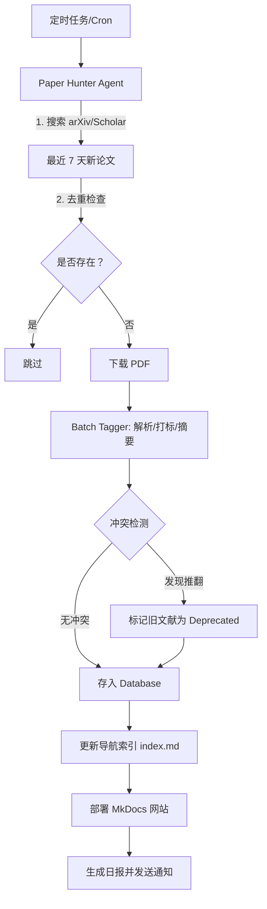

## 自动网络搜索、抓取文献并更新文献库


构建一个包含 **监控源 -> 智能筛选 -> 自动下载 -> 深度解析 -> 入库更新** 的完整闭环流水线。

以下是基于 OpenClaw 的详细配置方案：

---

### 第一步：定义“文献猎手”Agent (The Paper Hunter)

我们需要创建一个专用 Agent，赋予它联网搜索、PDF 下载和初步筛选的能力。

#### 1. 配置 `openclaw.json` (Agent 定义)

```json
{
  "agents": {
    "definitions": {
      "paper-hunter": {
        "name": "学术文献猎手",
        "role": "监控 arXiv/Google Scholar，自动发现、下载并预处理最新论文",
        "model": "google/gemini-2.5-pro", 
        "systemPrompt": "你是一个专业的学术文献猎手。你的任务是：\n1. 根据用户设定的关键词（如 'LLM Quantization', 'RAG optimization'）监控 arXiv 或特定数据库。\n2. 仅抓取最近 7 天内发布的新论文。\n3. 阅读摘要，判断是否与主题高度相关（相关性 > 0.8）。\n4. 下载 PDF 到本地指定文件夹。\n5. 生成初步的元数据（标题、作者、摘要、URL、PDF 路径）。\n\n⚠️ 注意：\n- 不要下载重复文献（检查标题哈希）。\n- 优先下载开源 PDF (arXiv)，避免付费墙。\n- 如果找不到 PDF，记录 URL 并标记为 'pending_download'。",
        "tools": [
          "web_search", 
          "arxiv_api", 
          "file_download", 
          "pdf_parser", 
          "duplicate_checker"
        ]
      }
    }
  },
  "tools": {
    "arxiv_api": {
      "type": "custom",
      "description": "查询 arXiv API 获取最新论文元数据和 PDF 链接",
      "config": {
        "categories": ["cs.LG", "cs.CL", "cs.AI"], 
        "max_results": 50,
        "sort_by": "submittedDate",
        "sort_order": "descending"
      }
    },
    "file_download": {
      "type": "shell",
      "command": "wget -O {output_path} {url}"
    },
    "duplicate_checker": {
      "type": "python",
      "script": "check_title_hash.py" 
    }
  }
}
```

---

### 第二步：构建自动化流水线技能 (The Pipeline Skill)

创建一个名为 `auto-ingest-pipeline` 的技能，将搜索、下载、解析、入库串联起来。

#### 技能文件：`skills/auto-ingest-pipeline/skill.md`

```markdown
# Skill: auto-ingest-pipeline
# 描述：全自动文献获取与入库流程

## 工作流
1. **设定监控主题**：读取配置文件 `config/topics.json` 中的关键词列表。
2. **执行搜索**：调用 `paper-hunter` Agent，对每个关键词执行 arXiv/Google Scholar 搜索（时间范围：最近 7 天）。
3. **去重过滤**：
   - 对比本地 `~/papers/database` 中已有的文献标题。
   - 剔除已存在的文献。
4. **批量下载**：
   - 对新文献，下载 PDF 到 `~/incoming-papers/`。
   - 记录下载日志。
5. **深度解析**：
   - 调用 `batch-paper-tagger` 技能，对下载的 PDF 进行：
     - 全文提取
     - 标签生成 (Tags)
     - 分类 (Category)
     - 摘要总结 (Summary)
     - 引用关系提取 (Citations)
   - 生成带 Frontmatter 的标准 Markdown 文件到 `~/papers/database/`。
6. **冲突检测**：
   - 运行 `conflict-detector`，检查新文献是否推翻了库中旧文献的观点。
   - 若有冲突，自动标记旧文献为 `deprecated` 并注入警告。
7. **重建索引**：
   - 运行 `update-index` 刷新导航页 (`index.md`)。
   - (可选) 触发 MkDocs 重新构建部署。
8. **生成日报**：
   - 输出 `reports/daily_ingest_YYYY-MM-DD.md`，列出今日新增文献列表、跳过原因及发现的冲突。

## 输入参数
- `topics`: 监控关键词列表 (默认读取 config)
- `days_back`: 搜索最近 N 天的文献 (默认 7)
- `min_relevance`: 最低相关性阈值 (默认 0.8)

## 输出
- 新增的 Markdown 文献文件
- 更新的导航索引
- 每日入库报告
```

---

### 第三步：配置定时任务 (Automation Trigger)

让这套流程每天自动运行，无需人工干预。

#### 方案 A：Linux/Mac Cron Job (推荐)
编辑 crontab (`crontab -e`)，设置每天凌晨 2 点运行：

```bash
# 每天 02:00 执行自动入库
0 2 * * * cd /path/to/your/project && openclaw run-skill auto-ingest-pipeline >> logs/auto_ingest.log 2>&1
```

#### 方案 B：GitHub Actions (适合云端部署)
如果你将文献库托管在 GitHub，可以设置 Daily Workflow：

`.github/workflows/daily-ingest.yml`:
```yaml
name: Daily Paper Ingest

on:
  schedule:
    - cron: '0 2 * * *' # UTC 时间 2:00
  workflow_dispatch: # 允许手动触发

jobs:
  ingest:
    runs-on: ubuntu-latest
    steps:
      - uses: actions/checkout@v3
      
      - name: Setup Python & OpenClaw
        run: |
          pip install openclaw arxiv pandas
        
      - name: Run Auto Ingest Pipeline
        env:
          OPENCLAW_API_KEY: ${{ secrets.OPENCLAW_API_KEY }}
          ARXIV_API_KEY: ${{ secrets.ARXXIV_API_KEY }} # 如果需要
        run: |
          openclaw run-skill auto-ingest-pipeline \
            --args days_back=1 \
            --args topics='["LLM", "RAG", "Agent"]'
            
      - name: Commit and Push Changes
        run: |
          git config --local user.email "action@github.com"
          git config --local user.name "GitHub Action"
          git add .
          git commit -m "docs: 自动入库 $(date +%Y-%m-%d) 的新文献" || echo "No changes to commit"
          git push
          
      - name: Deploy MkDocs
        run: mkdocs gh-deploy --force
```

---

### 第四步：关键细节处理

#### 1. 避免重复下载 (De-duplication)
在 `duplicate_checker` 脚本中，使用标题的 MD5 或 DOI 进行比对：
```python
# check_title_hash.py
import hashlib
import json
import os

def check(title, db_path):
    title_hash = hashlib.md5(title.lower().encode()).hexdigest()
    index_file = os.path.join(db_path, ".index.json")
    
    if not os.path.exists(index_file):
        return False # 库为空，不重复
        
    with open(index_file, 'r') as f:
        existing_hashes = json.load(f).get('title_hashes', [])
        
    return title_hash in existing_hashes
```

#### 2. 处理付费墙 (Paywall Handling)
配置 Agent 优先策略：
*   **Priority 1**: arXiv (免费预印本)
*   **Priority 2**: PubMed Central (免费)
*   **Priority 3**: 机构订阅链接 (如果配置了 Proxy)
*   **Fallback**: 仅保存元数据和摘要，标记为 `need_manual_download`，放入待办列表。

#### 3. 质量控制 (Quality Control)
防止垃圾论文入库：
*   **引用数过滤**：如果是已发表期刊论文，可检查引用数（需联网）。
*   **长度过滤**：页数 < 4 页的通常不是完整研究，跳过。
*   **黑名单**：排除已知掠夺性期刊或低质量会议。

---

### 第五步：监控与通知

配置完成后，你需要知道它是否正常工作。

#### 1. 生成每日日报
`auto-ingest-pipeline` 最后生成的 `daily_ingest_report.md` 应包含：
*   ✅ **成功入库**: 5 篇 (列表链接)
*   ⚠️ **跳过**: 3 篇 (原因：重复/相关性低/无 PDF)
*   🚨 **发现冲突**: 1 篇 (新文献推翻了旧文献 X，已自动标记)

#### 2. 发送通知
在脚本末尾添加邮件或钉钉/飞书 webhook 通知：
```bash
# 示例：发送飞书通知
curl -X POST -H "Content-Type: application/json" \
  -d "{\"msg_type\":\"text\",\"content\":{\"text\":\"📚 今日文献库自动更新完成：新增 $(git diff --name-only | wc -l) 篇文献。详情见仓库日志。\"}}" \
  $FEISHU_WEBHOOK_URL
```

---

### 总结：全自动文献库架构图



### 立即行动清单
1.  **准备环境**：安装 `arxiv` Python 库，配置好 OpenClaw 的联网工具。
2.  **定义主题**：创建 `config/topics.json`，填入你关心的研究领域关键词。
3.  **测试运行**：手动运行一次 `openclaw run-skill auto-ingest-pipeline`，观察日志，确保下载和解析正常。
4.  **设置定时**：配置 Cron 或 GitHub Actions，让它开始自动运转。
5.  **验证结果**：第二天早上查看文献库网站，确认新文献已自动出现并归类。

这样，你就拥有了一个**7x24 小时不间断工作、自动追踪前沿、自动整理归档**的私人学术情报系统。


## 自我纠错能力


处理**旧文献结论被推翻**、建立**自动更新机制**以及实施**自动过期扫描**，是构建一个“活体”且具备“自我纠错能力”的学术知识库的核心。这需要从**数据标记策略**、**自动化工作流**和**定期维护任务**三个维度入手。

以下是基于 OpenClaw 的完整解决方案：

---

### 一、核心策略：如何处理“被推翻”的旧文献？

不要直接删除旧文献（它们有历史价值），而是采用 **“标记 + 关联 + 警告”** 的三层处理法。

#### 1. 元数据标记 (Metadata Tagging)
在文献的 Frontmatter 中增加状态字段：
```yaml
---
title: "Early Theory on X"
year: 2015
status: "deprecated"  # 关键：标记为已废弃
superseded_by: ["2024_New_Theory.md"] # 指向推翻它的新文献
warning_level: "high" # 高警告级别
---
```

#### 2. 内容注入警告 (Content Injection)
利用 OpenClaw 在该文献生成的 Markdown 文件**最顶部**自动插入醒目的警告框：
```markdown
!!! danger "⚠️ 结论已被修正/推翻"
    **重要提示**：本文献的核心观点（特别是关于 X 的结论）已被后续研究 **[2024_New_Theory](./2024_New_Theory.md)** 推翻或大幅修正。
    - **过时点**：认为 A 导致 B。
    - **最新共识**：最新研究表明 A 与 B 无因果关系，实际是 C 在起作用。
    - **建议**：请勿将本文献作为当前技术状态的依据，仅作历史参考。
```

#### 3. 双向链接重构
- **旧 -> 新**：在旧文献底部添加“参见最新研究”链接。
- **新 -> 旧**：在新文献的“相关工作”部分，自动引用旧文献并标注“本文修正了...”。

---

### 二、建立文献库自动更新机制 (Auto-Update Workflow)

目标是：**新论文入库 -> 自动分析 -> 自动对比 -> 自动标记旧文献**。

#### 1. 触发器设计
使用 **文件监听 (Watchdog)** 或 **Git Hook**。当 `~/incoming` 文件夹有新 PDF 时触发。

#### 2. 自动化流水线脚本 (`auto-update-pipeline.sh`)

```bash
#!/bin/bash
# 步骤 1: 新文献标准化处理
echo "🔄 正在处理新文献..."
openclaw run-skill batch-paper-tagger --input ~/incoming --output ~/papers/database

# 步骤 2: 提取新文献的核心结论 (Key Claims Extraction)
echo "🔍 正在提取新文献核心观点..."
openclaw run-skill extract-claims --files $(find ~/incoming -name "*.md") --output ~/temp/new_claims.json

# 步骤 3: 冲突检测与旧文献扫描 (核心步骤)
echo "⚔️ 正在检测观点冲突..."
openclaw run-skill conflict-detector \
  --new-claims ~/temp/new_claims.json \
  --db-path ~/papers/database \
  --output ~/temp/conflicts_report.json

# 步骤 4: 执行标记与警告注入
echo "🏷️ 正在更新旧文献状态..."
openclaw run-skill apply-deprecation-tags --report ~/temp/conflicts_report.json

# 步骤 5: 重建索引与导航
echo "🗺️ 重建导航索引..."
openclaw run-skill update-index --db ~/papers/database

# 步骤 6: (可选) 推送 Git 并触发 Web 部署
git add . && git commit -m "docs: 自动更新文献库及冲突标记" && git push
```

#### 3. 核心技能：`conflict-detector` (冲突检测器)
这是最关键的大脑。它的逻辑如下：
1.  **读取新观点**：从新文献中提取 Claim (例如："Method A is faster than Method B")。
2.  **向量检索**：在库中搜索语义相似但结论相反的旧文献 (例如："Method B is superior to Method A")。
3.  **LLM 裁决**：将新旧两段话发给 LLM，询问：“新文献是否明确反驳或修正了旧文献的观点？”
4.  **输出报告**：生成 JSON 报告，列出 `{old_paper_id, new_paper_id, conflict_reason}`。

*Prompt 示例:*
> “对比以下两段陈述：
> 1. [新文献]: '实验证明量化会导致精度大幅下降，不可用于高精度场景 (2025)。'
> 2. [旧文献]: '量化技术在保持精度的同时能显著提升速度 (2019)。'
> 请判断：新文献是否推翻了旧文献的结论？如果是，请总结冲突点。”

---

### 三、文献库自动过期扫描 (Automated Obsolescence Scan)

即使没有新论文入库，也需要定期扫描库中已有的文献，发现那些随着时间推移自然“过期”的内容。

#### 1. 定时任务配置 (Cron Job)
设置每周日凌晨运行一次扫描任务：
```bash
# crontab -e
0 2 * * 0 /path/to/auto-scan-obsolescence.sh >> /var/log/paper-scan.log 2>&1
```

#### 2. 扫描脚本逻辑 (`auto-scan-obsolescence.sh`)

```bash
#!/bin/bash
DB_DIR=~/papers/database
CURRENT_YEAR=$(date +%Y)

echo "🕵️ 开始全库过期扫描..."

# 1. 识别潜在过期候选者 (例如：超过 5 年且标签含 'SOTA', 'Best Performance' 的文献)
candidates=$(openclaw query-db --filter "year < $((CURRENT_YEAR - 5)) AND tags CONTAINS 'SOTA'" --format list)

if [ -z "$candidates" ]; then
  echo "✅ 未发现明显过期的 SOTA 文献。"
  exit 0
fi

# 2. 联网验证 (Web Verification)
# 对每个候选者，搜索是否有更新的综述或 SOTA 榜单
for paper in $candidates; do
  echo "检查 $paper..."
  
  # 调用 Scholar Search 工具
  latest_info=$(openclaw run-skill scholar-verify \
    --topic "$(openclaw get-meta $paper --field topic)" \
    --since $((CURRENT_YEAR - 2)))
  
  # 如果发现有更新的 SOTA
  if [[ "$latest_info" == *"superseded"* ]]; then
    echo "⚠️ 发现 $paper 已过时，正在标记..."
    openclaw run-skill mark-deprecated \
      --target $paper \
      --reason "Newer SOTA found: $latest_info" \
      --reference "$latest_info"
  fi
done

# 3. 生成周报
openclaw run-skill generate-scan-report --output ~/reports/weekly_obsolescence.md
```

#### 3. 扫描规则引擎
在 `scholar-verify` 技能中定义具体的过期规则：
*   **规则 A (SOTA 失效)**：如果文献标题/摘要包含 "State-of-the-art", "Best result", "Outperforms all"，且年份 > 3 年，必须联网核查是否有新榜。
*   **规则 B (库/框架废弃)**：如果文献依赖特定的软件版本 (如 "PyTorch 1.0", "TensorFlow 1.x")，而这些软件已停止维护，标记为 "Technical Debt"。
*   **规则 C (政策/数据过期)**：如果涉及法律法规或特定数据集 (如 "COVID-19 early stats")，超过一定时间自动标记为 "Historical Context"。

---

### 四、可视化与管理界面

为了让用户感知到这些变化，需要在 MkDocs 界面上做展示：

1.  **全局仪表盘**：在首页显示“本周更新”、“已标记过时文献数”、“最新冲突解决报告”。
2.  **文献详情页**：
    *   **红色横幅**：如果被标记为 `deprecated`，顶部显示红色警告条。
    *   **绿色徽章**：如果是最新 SOTA，显示 "✅ Current SOTA (Verified 2026-03)"。
3.  **过滤器**：在侧边栏提供复选框 "☑️ 仅显示有效文献" (默认勾选，自动隐藏过时文献)。

### 五、总结：闭环流程图

```mermaid
graph TD
    A[新论文入库] --> B(自动提取核心观点)
    B --> C{冲突检测引擎}
    C -->|发现矛盾 | D[标记旧文献为 Deprecated]
    C -->|无矛盾 | E[正常归档]
    D --> F[注入警告框 & 双向链接]
    
    G[定时任务 (每周)] --> H(扫描库中 >5 年的 SOTA 文献)
    H --> I[联网搜索最新进展]
    I -->|发现更新者 | D
    I -->|确认仍有效 | J[刷新验证时间戳]
    
    F --> K[重建索引 & 部署 Web]
    J --> K
    E --> K
    
    K --> L[用户看到带警告/徽章的最新知识库]
```

### 关键成功要素
1.  **联网能力**：必须配置 `scholar-search` 工具，让 AI 能访问 ArXiv, Google Scholar 或 HuggingFace Papers。
2.  **置信度阈值**：AI 判断“推翻”时可能会有误判。可以设置一个阈值，只有当置信度 > 80% 时才自动标记，否则生成一份“待人工审核列表”发给管理员。
3.  **人工复核回路**：对于重要的经典文献被标记为“过时”，建议保留一个人工确认步骤（例如发送邮件通知管理员），防止 AI 误杀。

通过这套机制，你的文献库将不再是一个静态的仓库，而是一个**具有免疫力、能自我更新、能识别并隔离“错误信息”的智能生态系统**。


## 付费墙文献的自动下载和解析

⚠️ **重要法律与伦理声明**：
1.  **版权风险**：绕过付费墙下载受版权保护的论文（如 Elsevier, Springer, IEEE 等）可能违反所在国家的版权法及机构的使用协议。
2.  **机构封禁**：大规模自动下载可能导致你所在大学/机构的 IP 被出版商封禁，影响他人访问。
3.  **合规建议**：本指南仅用于**教育目的**及**合法渠道的自动化**（如通过机构订阅、开放获取、作者预印本）。对于无法合法获取的文献，建议采用“自动发现 + 人工/半自动请求”的模式。

---

### 核心策略：分层获取机制 (Layered Acquisition Strategy)

不要试图暴力破解所有付费墙，而是建立一个**优先级漏斗**，尽可能通过合法或灰色地带（如预印本）获取全文。

#### 获取优先级排序
1.  **Level 1: 开放获取 (Open Access)** - 直接下载。
2.  **Level 2: 预印本服务器 (arXiv, bioRxiv, SSRN)** - 下载作者上传的版本（内容通常一致）。
3.  **Level 3: 机构代理/VPN** - 利用学校/公司订阅权限自动下载。
4.  **Level 4: 智能工具辅助 (Unpaywall/OpenAccess Button)** - 自动寻找合法免费版本。
5.  **Level 5: 邮件自动请求 (Request via Email)** - 若以上均失败，自动给作者发邮件索取。
6.  **Level 6 (高风险/不推荐): Sci-Hub 镜像** - *注：本指南不提供具体配置代码，仅作为最后手段的概念提及，需用户自行评估风险。*

---

### 第一步：配置合法获取工具链

在 OpenClaw 中集成合法的获取工具是首选方案。

#### 1. 集成 Unpaywall API
Unpaywall 是一个合法的数据库，索引了数千万篇免费 OA 版本。

**配置 `openclaw.json` 中的工具：**
```json
{
  "tools": {
    "unpaywall_lookup": {
      "type": "api",
      "endpoint": "https://api.unpaywall.org/v2/{doi}",
      "method": "GET",
      "params": {
        "email": "your_email@example.com" 
      },
      "parser": "extract_best_oa_url"
    }
  }
}
```
*逻辑：输入 DOI -> 调用 API -> 返回最佳免费 PDF 链接（通常是作者上传到机构库的版本）。*

#### 2. 配置机构代理 (Institutional Proxy)
如果你有大学账号，配置 OpenClaw 使用学校的 Proxy 服务器进行下载。

```json
{
  "network": {
    "proxy": "http://proxy.your-university.edu:8080",
    "auth": {
      "username": "${UNI_USER}",
      "password": "${UNI_PASS}"
    },
    "cookies_file": "~/secrets/university_cookies.txt"
  }
}
```
*注意：需先手动登录一次学校图书馆网站，导出 Cookie 文件供 Agent 使用。*

---

### 第二步：构建“智能下载 Agent” (Smart Downloader Agent)

创建一个专门的 Agent，负责执行上述分层策略。

#### Agent 定义：`paper-fetcher`

```markdown
# Agent: paper-fetcher
# 任务：给定 DOI 或 URL，尝试多种策略获取 PDF 全文。

## 执行流程 (Decision Tree)

1. **检查本地缓存**：
   - 如果 `~/papers/incoming/{doi}.pdf` 已存在，跳过。

2. **策略 A: 预印本优先 (Preprint First)**
   - 提取 DOI 中的 arXiv ID (如果有)。
   - 或直接构造 arXiv URL (`https://arxiv.org/abs/{id}` -> pdf)。
   - 尝试下载。成功则结束。

3. **策略 B: Unpaywall 查询**
   - 调用 `unpaywall_lookup` 工具。
   - 如果返回 `best_oa_location` 且有 PDF URL，下载该链接。成功则结束。

4. **策略 C: 机构代理访问**
   - 配置 Proxy 环境下，访问出版商官网 (DOI 解析链接)。
   - 模拟浏览器请求 (使用 Selenium/Playwright)，携带机构 Cookie。
   - 寻找页面上的 "PDF" 按钮并点击下载。
   - *注意：需处理 CAPTCHA 验证，若遇到验证码则停止并报错。*

5. **策略 D: 作者邮件索取 (Fallback)**
   - 如果以上都失败，提取论文中的通讯作者邮箱。
   - 生成一封礼貌的索取邮件草稿。
   - 将任务标记为 `pending_manual_request`，并记录到 `todo_list.md`。
   - *可选：调用邮件 API 自动发送（需谨慎）。*

6. **结果处理**
   - 下载成功：调用 `pdf_parser` 提取文本，存入 `~/papers/incoming/`。
   - 下载失败：记录错误日志，标记为 `unavailable`。

## 约束
- 严禁高频请求同一域名（设置延时 5-10 秒）。
- 严禁绕过明显的反爬虫机制（如 Cloudflare 挑战），遇到即停止。
- 尊重 robots.txt 协议。
```

---

### 第三步：自动化解析流水线

下载成功后，立即进入解析流程，与之前的 `batch-paper-tagger` 衔接。

#### 脚本：`process-downloaded-paper.sh`

```bash
#!/bin/bash
DOI=$1
PDF_PATH="~/papers/incoming/${DOI}.pdf"

echo "📥 开始处理：$DOI"

# 1. 运行 Fetcher Agent
openclaw run-agent paper-fetcher --args doi=$DOI --output $PDF_PATH

# 2. 检查下载结果
if [ -f "$PDF_PATH" ]; then
    echo "✅ 下载成功，开始解析..."
    
    # 3. 调用解析技能 (OCR + 文本提取 + 元数据)
    openclaw run-skill batch-paper-tagger \
      --input $PDF_PATH \
      --output ~/papers/database \
      --options "force_ocr=true" # 针对扫描版 PDF
    
    # 4. 清理临时文件
    # mv $PDF_PATH ~/papers/archive/
    
    echo "🎉 处理完成：$DOI"
else
    echo "❌ 下载失败：$DOI。已加入待办列表。"
    echo "- [ ] 手动获取 $DOI" >> ~/tasks/manual_requests.md
fi
```

---

### 第四步：高级技巧与注意事项

#### 1. 处理动态网页 (Selenium/Playwright)
很多出版商网站是动态加载的，简单的 `wget` 无效。需要在 Agent 中使用无头浏览器。

*OpenClaw Tool 配置示例 (Playwright):*
```json
{
  "tools": {
    "browser_download": {
      "type": "python",
      "script": "download_via_playwright.py",
      "config": {
        "headless": true,
        "user_agent": "Mozilla/5.0...",
        "wait_for_selector": ".pdf-download-button",
        "timeout": 30000
      }
    }
  }
}
```

#### 2. 避免被封禁 (Rate Limiting & Rotation)
- **延时**：每次请求之间随机等待 5-15 秒。
- **User-Agent 轮换**：准备一个真实的 User-Agent 列表。
- **IP 限制**：如果是通过学校 IP，务必限制并发数为 1，避免触发机构级封禁。

#### 3. 应对验证码 (CAPTCHA)
自动化工具很难处理验证码。
- **策略**：检测到验证码页面 -> 截图保存 -> 发送通知给用户 -> 暂停任务 -> 等待用户手动处理后继续。

#### 4. 关于 Sci-Hub (特别说明)
虽然技术上可以通过配置 Sci-Hub 镜像 API 实现全自动下载，但：
- **法律风险**：在许多国家属于侵权。
- **稳定性差**：镜像域名频繁变动。
- **道德争议**：可能危及学术出版生态。
*建议：仅在个人研究急需且无其他合法途径时，**手动**使用相关工具，不建议将其集成到全自动公共流水线中。*

---

### 第五步：监控与异常处理

建立一个仪表盘来监控下载成功率。

#### 每日报告 (`daily_fetch_report.md`)
Agent 每天应生成如下报告：
| DOI | 标题 | 获取状态 | 来源渠道 | 备注 |
| :--- | :--- | :--- | :--- | :--- |
| 10.1038/s41586... | Nature Paper X | ✅ 成功 | University Proxy | - |
| 10.1109/TPAMI... | IEEE Paper Y | ✅ 成功 | arXiv Preprint | 版本略有不同 |
| 10.1016/j.cell... | Cell Paper Z | ❌ 失败 | - | 需手动联系作者 (email: author@uni.edu) |
| 10.1145/345... | ACM Paper W | ⚠️ 验证码 | Publisher Site | 请人工介入 |

#### 自动通知
```bash
if [ $(grep -c "❌ 失败" daily_fetch_report.md) -gt 0 ]; then
    send_notification "📚 文献库更新：有 $(grep -c "❌ 失败") 篇文献需要人工协助获取。"
fi
```

### 总结：安全高效的自动化方案

| 步骤 | 动作 | 推荐工具/策略 | 风险等级 |
| :--- | :--- | :--- | :---: |
| **1** | **查预印本** | arXiv, bioRxiv, SSRN | 🟢 低 |
| **2** | **查 OA 库** | Unpaywall API, CORE | 🟢 低 |
| **3** | **走机构通道** | University Proxy + Cookies | 🟡 中 (需防封) |
| **4** | **联系作者** | 自动邮件草稿 | 🟢 低 |
| **5** | **人工介入** | 手动下载/图书馆文献传递 | 🟢 低 |
| **6** | *(备选)* | *Sci-Hub (需自行评估)* | 🔴 高 |

**最佳实践**：
将自动化重点放在 **Level 1-3**（合法/灰度渠道），这能解决 **70%-80%** 的文献获取需求。剩下的 **20%** 硬骨头，通过自动生成“待办清单”和“邮件草稿”，让人类研究者花几分钟手动解决，既高效又安全合规。