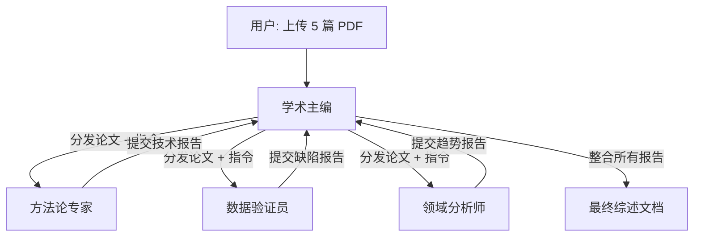

## 自动路由 Agent (Auto-Routing Agent)** 


核心目标是：**用户只需说一句话，系统自动判断意图，并将任务分发给最合适的专家 Agent**，而无需用户手动选择或输入 `/agent xxx` 命令。

在 OpenClaw 中，这通常通过 **“路由器模式 (Router Pattern)"** 实现：创建一个专门的 **Router Agent**，它的唯一任务就是**分析意图 -> 选择目标 Agent -> 转发消息**。

以下是三种实现方案，从**配置级**到**代码级**，按推荐程度排序。

---

### 方案一：内置 Router Agent + Tool Calling (最推荐，原生支持)
**原理**：创建一个 `router` Agent，将其他所有专家 Agent 定义为它可以调用的 **"Tools" (工具)**。利用 LLM 强大的 Function Calling 能力，让它自动决定调用哪个工具。
**优点**：无需写复杂代码，利用 LLM 原生能力，扩展性极强，支持多轮对话上下文传递。
**适用场景**：绝大多数多 Agent 协作场景。

#### 步骤 1：定义专家 Agents
首先确保你已经有多个专用 Agent（如 `legal-expert`, `tech-expert`, `finance-expert`），配置参考之前的“按目录配置 System Prompt”章节。

#### 步骤 2：创建 Router Agent 配置
在 `openclaw.json` 中定义一个特殊的 `router` Agent。

```json
{
  "agents": {
    "definitions": {
      "router": {
        "description": "智能路由中心，负责分析用户意图并分发任务",
        "model": "google/gemini-3.1-pro-preview", // 使用强模型以确保路由准确
        "systemPrompt": "你是一个智能路由助手。你的唯一任务是分析用户的输入，判断其所属领域，然后调用相应的专家工具来处理。\n\n规则：\n1. 如果用户问法律/合同/合规问题 -> 调用 'legal_tool'\n2. 如果用户问代码/架构/技术实现 -> 调用 'tech_tool'\n3. 如果用户问财务/报销/预算 -> 调用 'finance_tool'\n4. 如果无法判断或属于闲聊 -> 直接回答，不要调用工具。\n5. **重要**：调用工具时，必须将用户的原始问题完整传递给工具参数。",
        "tools": [
          {
            "name": "legal_tool",
            "description": "处理法律、合同、合规相关的咨询",
            "type": "agent_invoke", // 假设 OpenClaw 支持此类类型，或通过自定义脚本实现
            "config": { "targetAgent": "legal-expert" }
          },
          {
            "name": "tech_tool",
            "description": "处理代码、架构、技术开发相关的咨询",
            "type": "agent_invoke",
            "config": { "targetAgent": "tech-expert" }
          },
          {
            "name": "finance_tool",
            "description": "处理财务、预算、报销相关的咨询",
            "type": "agent_invoke",
            "config": { "targetAgent": "finance-expert" }
          }
        ]
      },
      
      "legal-expert": { ... }, // 之前的配置
      "tech-expert": { ... },
      "finance-expert": { ... }
    }
  }
}
```

*注意：如果 OpenClaw 当前版本不支持直接在 `tools` 中定义 `agent_invoke` 类型，你需要编写一个简单的 **Custom Tool 脚本**（见方案二）来桥接。*

#### 步骤 3：使用方法
用户只需始终与 `router` 对话：
```bash
# 用户问法律问题，自动路由给 legal-expert
openclaw chat --agent router "劳动合同解除的赔偿金怎么算？"

# 用户问技术问题，自动路由给 tech-expert
openclaw chat --agent router "微服务鉴权模块的代码规范是什么？"
```

**工作流程**：
1. 用户输入 -> `router` Agent。
2. `router` 分析意图 -> 决定调用 `legal_tool`。
3. `router` 执行工具 -> 内部调用 `legal-expert`。
4. `legal-expert` 检索知识库并生成答案 -> 返回给 `router`。
5. `router` 将答案格式化后返回给用户。

---

### 方案二：自定义 Python 路由脚本 (最灵活，完全可控)
**原理**：编写一个独立的 Python 脚本，先调用一个小模型做分类，然后根据分类结果调用不同的 OpenClaw Agent。
**优点**：逻辑完全可控，可以添加复杂的规则（如：关键词匹配优先于 AI 判断），调试方便。
**适用场景**：需要严格权限控制、复杂路由逻辑或与外部系统集成。

#### 脚本示例 (`auto_router.py`)

```python
import subprocess
import json
import sys

# 定义路由映射
ROUTE_MAP = {
    "legal": "legal-expert",
    "tech": "tech-expert",
    "finance": "finance-expert",
    "default": "general-assistant"
}

def classify_intent(query):
    """
    调用一个轻量级 LLM (或本地模型) 仅做分类，不生成答案
    """
    prompt = f"""
    分析以下用户问题的意图，只返回一个类别标签：[legal, tech, finance, default]。
    不要输出任何其他文字。
    问题：{query}
    """
    
    # 这里可以用 openclaw chat --agent classifier ... 或者直接调 API
    # 示例：调用 openclaw 的一个专门用于分类的 agent
    result = subprocess.run([
        "openclaw", "chat", "--agent", "intent-classifier", 
        "--format", "text", prompt
    ], capture_output=True, text=True)
    
    category = result.stdout.strip().lower()
    # 简单的清洗，防止 AI 啰嗦
    for key in ROUTE_MAP.keys():
        if key in category:
            return key
    return "default"

def main():
    if len(sys.argv) < 2:
        print("用法：python auto_router.py '用户问题'")
        sys.exit(1)
    
    user_query = " ".join(sys.argv[1:])
    
    print(f"🧠 正在分析意图...")
    category = classify_intent(user_query)
    target_agent = ROUTE_MAP.get(category, ROUTE_MAP["default"])
    
    print(f"🎯 识别为 [{category}] 领域，路由至 Agent: {target_agent}")
    
    # 调用目标 Agent 处理实际问题
    final_result = subprocess.run([
        "openclaw", "chat", "--agent", target_agent, user_query
    ], capture_output=False, text=True) # stream output directly

if __name__ == "__main__":
    main()
```

**使用方法**：
```bash
python auto_router.py "帮我检查一下这个合同的违约条款"
# 输出：🧠 正在分析意图... 🎯 识别为 [legal] 领域，路由至 Agent: legal-expert
# (接着显示 legal-expert 的回答)
```

---

### 方案三：IM 机器人中间件 (适合 Discord/Slack/钉钉)
如果你是在 IM 软件中使用，可以在 Bot 接收消息的入口处加一层路由逻辑。

**逻辑流程**：
1.  **Webhook 接收消息**。
2.  **调用分类 API** (可以是 OpenClaw 的一个轻量 Agent)。
3.  **动态切换 Context**：
    *   如果是法律类 -> 设置 `current_agent_id = "legal-expert"`。
    *   如果是技术类 -> 设置 `current_agent_id = "tech-expert"`。
4.  **转发消息**：将用户消息发送给 `current_agent_id` 对应的处理逻辑。
5.  **回复用户**。

*OpenClaw 的 Gateway 如果支持动态 Session 绑定，可以直接在配置中通过 `bindings` 的 `keywords` 字段实现简单路由（参考知识库中的飞书路由配置），但这通常基于关键词，不如 LLM 分类智能。*

**混合策略（推荐）**：
在 IM 配置中，先用 **关键词路由** (快、省钱) 处理明确的情况，剩下的模糊情况交给 **LLM Router Agent** (慢、贵但智能) 处理。

```json
"bindings": [
  // 关键词硬路由
  { "agentId": "legal-expert", "match": { "keywords": ["合同", "法务", "诉讼"] } },
  { "agentId": "tech-expert", "match": { "keywords": ["代码", "Bug", "API", "部署"] } },
  
  // 兜底路由：所有其他消息发给 router agent 进行智能判断
  { "agentId": "router", "match": { "channel": "*" } } 
]
```

---

### 进阶优化技巧

#### 1. 意图分类器专用化
不要让主模型既做分类又做任务。创建一个专门的 `intent-classifier` Agent：
*   **Model**: 使用便宜、快速的模型 (如 `gpt-4o-mini` 或本地 `Llama-3-8b`)。
*   **Prompt**: "只输出 JSON: `{ \"category\": \"tech\", \"confidence\": 0.9 }`"。
*   **作用**: 降低成本，提高响应速度。

#### 2. 处理“多领域”问题
如果用户问：“这个代码实现的逻辑是否符合法律合规要求？”（涉及 Tech + Legal）。
*   **Router 策略**：识别为复合意图。
*   **执行**：
    1. 先调用 `tech-expert` 解释代码逻辑。
    2. 将解释结果作为上下文，传给 `legal-expert` 进行合规审查。
    3. 汇总两个结果回复用户。
*   *这需要 Router Agent 具备 **Chain of Thought (CoT)** 能力，在 Prompt 中训练它处理多步任务。*

#### 3. 记忆与上下文保持
当 Router 把任务分发给 `legal-expert` 后，后续的追问（“那如果是试用期呢？”）应该**直接发给 `legal-expert`**，而不是再次经过 Router，以保持对话连贯性。
*   **实现**：在 Session 级别记录 `last_active_agent`。如果用户连续提问且未切换话题，直接复用上一个 Agent。

### 总结

| 方案 | 复杂度 | 智能度 | 推荐场景 |
| :--- | :--- | :--- | :--- |
| **方案一 (Tool Calling)** | ⭐⭐ (中) | ⭐⭐⭐⭐⭐ (高) | **首选**。OpenClaw 原生支持，配置即可用，适合大多数场景。 |
| **方案二 (Python 脚本)** | ⭐⭐⭐ (高) | ⭐⭐⭐⭐ (高) | 需要极致定制、复杂逻辑控制或与旧系统集成时。 |
| **方案三 (IM 关键词 +LLM)** | ⭐⭐ (中) | ⭐⭐⭐ (中) | 在钉钉/飞书/Slack 等 IM 环境中，兼顾速度与成本。 |

**立即行动建议**：
采用 **方案一**。
1. 确保你的专家 Agents (`legal`, `tech`...) 已配置好。
2. 创建一个 `router` Agent。
3. 在 `router` 的 `tools` 列表中注册这些专家。
4. 让用户只跟 `router` 说话，享受自动分发的便利。

## Agent 自动切换 (Auto-Switching)


**，核心在于让系统具备 **“上下文感知”** 和 **“状态管理”** 能力。

当用户在对话中突然改变话题（例如从“写代码”突然跳到“查法律条款”），系统必须能：
1.  **识别**意图已变更。
2.  **判断**当前 Agent 不再适用。
3.  **无缝移交**控制权给新的专家 Agent。
4.  **携带**必要的上下文历史，避免用户重复输入。

在 OpenClaw 中，这通常通过 **"Handoff 机制”** 或 **“动态 Router 模式”** 实现。以下是三种主流实施方案：

---

### 方案一：基于 Handoff 工具的显式移交 (最稳健，推荐)
**原理**：每个 Agent 都配备一个特殊的 `handoff` 工具。当 Agent 发现自己无法处理当前问题时，主动调用该工具，将控制权“交棒”给另一个 Agent。
**优点**：逻辑清晰，可控性强，AI 知道自己何时该“退场”。
**适用场景**：流程明确的多阶段任务（如：需求分析 -> 代码生成 -> 测试 -> 合规审查）。

#### 1. 配置 Handoff 工具
在每个 Agent 的 `tools` 配置中，添加指向其他 Agent 的移交工具。

```json
{
  "agents": {
    "definitions": {
      "tech-expert": {
        "systemPrompt": "...你是技术专家。如果用户询问法律合规问题，请调用 transfer_to_legal 工具移交任务。",
        "tools": [
          {
            "name": "transfer_to_legal",
            "description": "将对话移交给法律专家处理合规问题",
            "type": "agent_handoff", 
            "config": { "targetAgent": "legal-expert" }
          },
          {
            "name": "transfer_to_product",
            "description": "将对话移交给产品经理处理需求细节",
            "type": "agent_handoff",
            "config": { "targetAgent": "product-manager" }
          }
        ]
      },
      "legal-expert": {
        "systemPrompt": "...你是法律专家。如果用户询问具体代码实现，请调用 transfer_to_tech 工具。",
        "tools": [
          {
            "name": "transfer_to_tech",
            "description": "将对话移交给技术专家处理代码实现",
            "type": "agent_handoff",
            "config": { "targetAgent": "tech-expert" }
          }
        ]
      }
    }
  }
}
```

#### 2. 工作流程演示
*   **User**: “帮我写一个用户登录接口。”
*   **Tech-Agent**: (生成代码) “这是登录代码... 注意密码需要加密。”
*   **User**: “这个加密方式符合 GDPR 法规吗？”
*   **Tech-Agent**: (内部思考：这是法律问题，我搞不定) -> **调用 `transfer_to_legal` 工具**。
*   **System**: (拦截工具调用) -> 激活 `legal-expert`，并将之前的对话历史打包传入。
*   **Legal-Agent**: (接收上下文) “根据刚才的代码，使用的 bcrypt 是符合 GDPR 标准的，但是...”
*   **User**: “那如果我要存欧盟用户数据呢？”
*   **Legal-Agent**: (继续回答，无需用户重复背景)

**关键点**：OpenClaw 的核心引擎需要支持拦截 `agent_handoff` 类型的工具调用，并自动切换 `current_agent` 指针。

---

### 方案二：中央 Router + 会话状态记忆 (最灵活，适合开放对话)
**原理**：引入一个常驻的 **Router Agent**（或在网关层实现）。每一轮用户输入后，先经过 Router 判断：“当前话题是否还属于当前 Agent 的职责范围？”如果是，继续；如果不是，强制切换。
**优点**：用户无需感知切换过程，体验最流畅，适合闲聊或复杂探索。
**缺点**：每轮对话多一次 LLM 调用（增加延迟和成本）。

#### 实现逻辑 (伪代码/脚本层)

```python
# 维护会话状态
session_state = {
    "user_id": "u123",
    "current_agent": "tech-expert",
    "history": [...]
}

def handle_message(user_input):
    # 1. 意图检测 (轻量级)
    # 询问 Router: "用户输入是 '{user_input}'，当前 Agent 是 '{session_state['current_agent']}'。
    # 是否需要切换 Agent？如果需要，返回目标 Agent 名称；否则返回 null。"
    
    routing_decision = openclaw.chat(
        agent="router-classifier",
        prompt=f"Current: {session_state['current_agent']}. User: {user_input}. Switch needed?"
    )
    
    target_agent = routing_decision.get("switch_to")
    
    # 2. 执行切换 (如果需要)
    if target_agent and target_agent != session_state["current_agent"]:
        print(f"🔄 检测到话题变更，从 {session_state['current_agent']} 切换到 {target_agent}")
        session_state["current_agent"] = target_agent
        
        # 可选：生成一段过渡语
        # transition_msg = f"好的，既然涉及{target_agent}领域，我邀请专家来回答..."
        
    # 3. 调用当前 Agent 处理
    final_response = openclaw.chat(
        agent=session_state["current_agent"],
        messages=session_state["history"] + [user_input]
    )
    
    # 4. 更新历史
    session_state["history"].append(...)
    
    return final_response
```

#### 优化技巧：防止“抖动”
不要每句话都切换。设置一个 **置信度阈值** 或 **连续触发机制**：
*   只有当 Router 确信度 > 80% 时才切换。
*   或者：连续两轮被判定为其他领域，才执行切换。

---

### 方案三：基于关键词/正则的硬路由 (最快，成本低)
**原理**：在网关层配置正则匹配规则。一旦用户输入命中特定关键词，强制切换 Agent。
**优点**：零延迟，零 Token 成本。
**缺点**：不够智能，容易误判（例如用户说“我不想要**法律**般的束缚”，可能误触发法律 Agent）。

#### 配置示例 (`openclaw.json` 或网关配置)
```json
"autoSwitchRules": [
  {
    "trigger": ["合同", "法规", "GDPR", "合规", "诉讼"],
    "targetAgent": "legal-expert",
    "mode": "force" 
  },
  {
    "trigger": ["代码", "Bug", "API", "部署", "Docker"],
    "targetAgent": "tech-expert",
    "mode": "force"
  },
  {
    "trigger": ["预算", "报销", "发票"],
    "targetAgent": "finance-expert",
    "mode": "force"
  }
]
```
*建议将此作为 **兜底策略**，与方案一或方案二结合使用。*

---

### 关键挑战与解决方案

#### 1. 上下文丢失问题 (Context Loss)
**问题**：切换 Agent 后，新 Agent 不知道之前聊了什么，用户得重述一遍。
**解决**：
*   **全量传递**：切换时，将完整的 `messages` 数组（包含用户和旧 Agent 的所有对话）传递给新 Agent。
*   **摘要传递 (省钱版)**：如果对话太长，在切换前，让旧 Agent 先生成一段 **“交接摘要”** (Handoff Summary)，只把摘要传给新 Agent。
    *   *Prompt*: “你要移交任务给法律专家。请总结之前的技术讨论要点，特别是涉及数据安全的部分，以便法律专家快速理解。”

#### 2. 无限循环切换 (Looping)
**问题**：Agent A 转给 B，B 觉得不该自己管又转回 A，死循环。
**解决**：
*   **最大切换次数限制**：单轮对话中最多允许切换 2 次。
*   **禁止回跳**：记录 `previous_agent`，禁止立即切回上一个 Agent。
*   **仲裁者**：如果发生循环，强制转给一个通用的 `general-assistant` 或直接让人工介入。

#### 3. 用户体验平滑度
**问题**：突然切换让用户困惑。
**解决**：
*   **透明化通知**：切换时输出一句提示：“检测到您关注合规问题，已为您邀请法律专家加入对话...”
*   **角色水印**：在 UI 上明显显示当前发言者的角色图标/名称发生了变化。

---

### 综合最佳实践架构

推荐采用 **混合模式**：

1.  **第一道防线 (硬规则)**：网关层检查关键词，处理明显的领域切换（快）。
2.  **第二道防线 (Handoff)**：Agent 内部发现搞不定时，主动调用 `transfer_` 工具（准）。
3.  **第三道防线 (Router 监控)**：每隔 N 轮对话，后台运行一次轻量 Router 检查，防止 Agent“占着茅坑不拉屎”（稳）。

#### 实施步骤总结：
1.  **定义 Agents**：确保每个专家都有清晰的边界。
2.  **配置 Tools**：为每个 Agent 添加指向其他 Agent 的 `handoff` 工具。
3.  **编写 Prompt**：在 System Prompt 中明确教导 Agent：“如果你无法回答，请立即调用移交工具，不要编造。”
4.  **开启上下文继承**：确保 OpenClaw 引擎在切换时自动携带历史消息。
5.  **测试边界案例**：故意问跨领域问题（如“用 Python 写一个符合税法的计算器”），观察是否能顺畅地在 Tech 和 Finance 之间切换。

通过这套机制，你的多 Agent 系统将不再是孤立的孤岛，而是一个**动态协作的团队**，能够像真人一样灵活应对复杂多变的需求。


## Agent 切换时上下文交接，

核心在于建立一套标准的 **“交接协议” (Handoff Protocol)**。

当控制权从 `Agent A` 移交给 `Agent B` 时，不能简单地“切断”对话，而必须执行以下三个关键动作：
1.  **打包历史**：将之前的对话记录完整传递。
2.  **生成摘要**：提炼关键事实、用户偏好和当前任务状态（避免新 Agent 被冗余信息淹没）。
3.  **注入元数据**：明确告知新 Agent“我是谁”、“我从哪来”、“现在该做什么”。

以下是三种在 OpenClaw 中实现无缝上下文继承的方案，按推荐程度排序：

---

### 方案一：全量历史 + 系统指令注入 (最完整，适合短对话)
**原理**：在切换瞬间，系统将**完整的 `messages` 数组**传递给新 Agent，并在数组最前方插入一条特殊的 **System Message**，说明切换背景。
**优点**：新 Agent 拥有 100% 的原始信息，不会遗漏任何细节。
**缺点**：如果历史对话很长，会消耗大量 Token，增加延迟和成本。

#### 实现逻辑
当触发切换（如调用 `transfer_to_legal`）时，OpenClaw 引擎内部执行：

```json
// 新 Agent 接收到的消息列表
[
  {
    "role": "system",
    "content": "⚠️ **会话移交通知**\n- **来源 Agent**: tech-expert (技术专家)\n- **切换原因**: 用户询问了 GDPR 合规问题，超出技术范畴。\n- **当前任务**: 请基于之前的代码实现，评估其法律合规性。\n- **注意**: 请仔细阅读下方的完整历史对话，不要重复之前已解决的问题。"
  },
  // --- 以下是完整的历史对话 ---
  { "role": "user", "content": "帮我写个登录接口..." },
  { "role": "assistant", "content": "这是代码... (由 tech-expert 生成)" },
  { "role": "user", "content": "这符合 GDPR 吗？" },
  // --- 历史结束 ---
  { "role": "user", "content": "那如果用户是欧盟的呢？" } // 当前最新输入
]
```

**配置建议**：
在 `openclaw.json` 的 Handoff 工具配置中开启 `inheritHistory: true`。
```json
{
  "name": "transfer_to_legal",
  "config": {
    "targetAgent": "legal-expert",
    "inheritHistory": true, 
    "injectSystemPrompt": "你已接手来自 {source_agent} 的任务。背景：{summary}。请继续回答用户最新的问题。"
  }
}
```

---

### 方案二：智能摘要 + 关键事实提取 (最推荐，性价比高)
**原理**：在切换前，先让 **原 Agent (或专用 Summarizer)** 快速生成一段 **“交接摘要”**，只把 **摘要 + 最新 N 轮对话** 传给新 Agent。
**优点**：极大节省 Token，去除噪音，让新 Agent 聚焦核心任务。
**适用场景**：长对话、多轮复杂任务、Token 敏感场景。

#### 步骤 1：定义“交接摘要”结构
要求原 Agent 在移交时，必须输出结构化数据：
*   **用户画像**：偏好、身份、特殊要求。
*   **已完成事项**：已经解决的子任务。
*   **待办事项**：当前卡点、未决问题。
*   **关键实体**：代码片段、文件名、数据值。

#### 步骤 2：自动化工作流
1.  **用户触发切换**：“这代码合法吗？”
2.  **Tech-Agent 响应**：
    *   内部调用 `generate_handoff_summary` 工具。
    *   生成摘要：`"用户正在开发登录模块 (文件：auth.ts)。已实现 bcrypt 加密。用户担心欧盟 GDPR 合规性。"`
    *   调用 `transfer_to_legal`，将摘要作为参数传递。
3.  **Legal-Agent 接收**：
    *   System Prompt: `"你收到了来自技术专家的交接简报：{summary}。以下是最近 3 轮对话详情：{recent_context}。请基于此回答。"`

**Prompt 示例 (给原 Agent)**：
> “在调用移交工具前，请先总结当前对话。总结必须包含：1. 核心任务目标；2. 已确定的关键技术栈/参数；3. 用户当前的具体疑虑。将总结作为 `handoff_summary` 参数传递给下一个 Agent。”

---

### 方案三：共享记忆空间 (Shared Memory / Blackboard) (最高级，适合长期协作)
**原理**：所有 Agent 不直接传递消息，而是读写一个**共享的会话状态对象 (Session State)** 或 **向量数据库标签**。
**优点**：彻底解耦，支持多个 Agent 并行协作，上下文永不丢失（只要写入共享库）。
**实现方式**：利用 OpenClaw 的 `memory-core` 或外部 Redis/DB。

#### 操作流程
1.  **写入阶段**：
    *   Tech-Agent 在回答问题后，自动调用 `save_to_session_state` 工具。
    *   写入内容：`{ "current_file": "auth.ts", "encryption": "bcrypt", "concern": "GDPR" }`。
2.  **切换阶段**：
    *   用户问法律问题 -> 路由到 Legal-Agent。
3.  **读取阶段**：
    *   Legal-Agent 启动时，强制第一步操作是 `read_session_state`。
    *   获取到之前的技术细节，直接基于此回答。

**配置示例**：
```json
{
  "agents": {
    "definitions": {
      "tech-expert": {
        "tools": [
          { "name": "update_shared_context", "config": { "scope": "session" } }
        ],
        "systemPrompt": "...每次完成关键步骤后，务必调用 update_shared_context 更新当前进度和关键参数。"
      },
      "legal-expert": {
        "tools": [
          { "name": "read_shared_context", "config": { "scope": "session" } }
        ],
        "systemPrompt": "...开始回答前，必须先调用 read_shared_context 获取之前的技术背景和用户偏好。"
      }
    }
  }
}
```

---

### 关键技巧：如何优化交接体验？

#### 1. 避免“失忆式”开场
❌ **糟糕的体验**：
> Legal-Agent: “你好，我是法律专家。请问有什么可以帮您？” (用户得重新说一遍代码的事)

✅ **优秀的体验**：
> Legal-Agent: “你好。我看到你刚才让技术专家实现了基于 bcrypt 的登录接口 (`auth.ts`)，现在你担心它在欧盟 GDPR 下的合规性，对吗？针对这个问题...”

**实现方法**：在 System Prompt 中强制要求新 Agent **复述**交接摘要中的关键点，作为开场白。

#### 2. 处理“长尾”上下文
如果对话已经进行了 50 轮，全量传递太贵，只传摘要又怕丢细节怎么办？
*   **策略**：**摘要 + 按需检索**。
*   传递摘要给新 Agent。
*   同时保留完整历史记录在向量数据库中。
*   告诉新 Agent：“主要背景见摘要。如果你需要查询之前的具体代码片段或详细讨论，请调用 `search_history` 工具。”

#### 3. 防止“重复劳动”
有时新 Agent 不知道某件事已经做过了，又重新做一遍。
*   **解决**：在交接摘要中明确列出 **"Do Not Repeat" (勿重做)** 列表。
    *   *“注意：代码已经生成并保存在 `src/auth.ts`，不需要再生成代码，只需评估。”*

---

### 综合实施模板 (OpenClaw 配置参考)

结合 **方案二 (智能摘要)** 和 **方案一 (系统注入)** 的最佳实践配置：

```json
{
  "agents": {
    "definitions": {
      "router": {
        "tools": [
          {
            "name": "handoff_to_legal",
            "description": "移交法律相关任务",
            "config": {
              "targetAgent": "legal-expert",
              "strategy": "summary_plus_recent", 
              "recentCount": 5, 
              "summaryPrompt": "请总结：1.当前涉及的文件/代码；2.用户的核心担忧；3.已完成的结论。"
            }
          }
        ]
      },
      "legal-expert": {
        "systemPrompt": "你是一名法律专家。你将收到一份【交接摘要】和【最近 5 轮对话】。\n\n**重要规则**：\n1. 开场时必须简要复述交接摘要中的关键背景，让用户知道你已了解前情。\n2. 基于摘要和最近对话直接回答问题，不要让用户重复背景。\n3. 如果需要更早的历史细节，请明确指出并请求用户补充，或调用搜索工具。"
      }
    }
  }
}
```

### 总结
要防止上下文丢失：
1.  **短对话**：直接 **全量继承** (`inheritHistory: true`)。
2.  **长对话**：使用 **智能摘要** (`Summary + Recent Context`)，这是性价比最高的方案。
3.  **复杂协作**：建立 **共享状态板** (`Shared Session State`)，让所有 Agent 读写同一份真相源。
4.  **体验优化**：强制新 Agent **复述背景**，给用户“被理解”的安全感。

通过这套机制，你的 Agent 团队就能像真人团队一样，即使换人接手，也能无缝继续工作，用户完全感知不到背后的切换过程。

## Agent协作的工具使用

让切换后的 Agent 能够**调用历史记录中的工具**（或者更准确地说，**基于历史对话中产生的上下文/结果来使用它自己的工具**），核心在于解决两个问题：
1.  **数据可见性**：新 Agent 必须能“看到”旧 Agent 调用工具后产生的结果（如生成的代码、查询到的数据）。
2.  **工具权限与上下文关联**：新 Agent 需要知道哪些工具是可用的，并且能将历史结果作为参数传递给这些工具。

在 OpenClaw 中，这通常通过 **“全量上下文继承”** + **“共享工作区/记忆”** + **“工具参数动态绑定”** 来实现。

以下是具体实施方案：

---

### 方案一：全量上下文继承 (最简单，自动生效)
**原理**：OpenClaw 的机制是将整个对话历史（包括 `user`, `assistant`, 以及 **`tool_call` 和 `tool_output` 消息**）作为一个列表传递给模型。
当 Agent 切换时，只要配置了 `inheritHistory: true`，新 Agent 接收到的消息列表中会包含旧 Agent 的工具调用记录及其返回结果。
**效果**：新 Agent 的 LLM 可以直接“读”到之前的工具输出，并将其作为已知事实，用于决定下一步调用什么工具。

#### 配置示例
```json
{
  "agents": {
    "definitions": {
      "tech-expert": {
        "tools": [
          { "name": "fs-write", "description": "写入代码文件" }
        ]
      },
      "test-expert": {
        "tools": [
          { "name": "fs-read", "description": "读取文件以编写测试" },
          { "name": "shell-exec", "description": "运行测试命令" }
        ],
        "systemPrompt": "你可以查看历史对话中其他 Agent 创建的文件。如果看到历史中有 fs-write 的记录，请直接使用 fs-read 读取该文件内容开始工作。"
      }
    }
  },
  "handoff": {
    "inheritFullHistory": true, 
    "includeToolOutputs": true 
  }
}
```

**工作流程**：
1.  **Tech-Agent**: 用户说“写个计算器”，Tech-Agent 调用 `fs-write` 生成 `calc.py`。
    *   历史记录中包含：`[ToolCall: fs-write(path='calc.py'), ToolOutput: Success]`
2.  **切换**: 用户说“给它写个测试”，系统切换到 `test-expert`。
3.  **Test-Agent**:
    *   接收完整历史，看到 `fs-write` 的成功记录。
    *   LLM 推理：“既然 `calc.py` 已经存在（见历史），我现在应该调用 `fs-read` 读取它，然后写测试。”
    *   **自动调用** `fs-read(path='calc.py')`。

**优点**：无需额外代码，天然支持。
**缺点**：如果历史太长，Token 消耗巨大；如果工具输出是大文件（如几 MB 的日志），可能会撑爆上下文。

---

### 方案二：共享工作区/文件系统 (最稳健，适合文件操作)
**原理**：工具的操作结果（如文件读写、数据库更新）通常是持久化在磁盘或数据库上的，而不是仅存在于内存对话中。
只要所有 Agent 配置为**访问同一个工作区 (Workspace)** 或 **同一套工具实例**，新 Agent 就可以直接操作旧 Agent 留下的“实物”。

#### 操作步骤
1.  **统一工作区路径**
    确保所有 Agent 在 `openclaw.json` 中指向同一个 `workspace` 目录。
    ```json
    "agents": {
      "defaults": {
        "workspace": "~/.openclaw/shared-project" 
      }
    }
    ```

2.  **配置相同的工具集 (或兼容集)**
    确保新 Agent 拥有操作旧 Agent 产物的工具权限。
    *   Tech-Agent 有 `fs-write`。
    *   Test-Agent 必须有 `fs-read` (最好也有 `fs-write` 以防需要修改)。

3.  **Prompt 引导**
    在新 Agent 的 System Prompt 中明确指示：
    > “你处于一个协作环境中。之前的同事可能已经创建了一些文件。在开始工作前，请先使用 `list_files` 或 `fs-read` 检查当前工作区 (`~/.openclaw/shared-project`) 的内容，不要假设文件不存在。”

**效果**：
即使对话历史被压缩或截断，只要文件还在磁盘上，新 Agent 就能通过工具重新读取并继续工作。这是**最可靠**的“上下文”保存方式。

---

### 方案三：显式摘要 + 工具参数传递 (最节省 Token)
**原理**：如果工具输出非常大（例如查询了 10 万行数据），直接继承历史会超时。此时应由旧 Agent 在切换前，将**关键结果摘要**或**文件路径**作为参数，显式传递给新 Agent，甚至直接存入**共享变量**。

#### 实现流程
1.  **定义 Handoff 工具参数**
    在路由或 Handoff 工具中，允许传递结构化数据。
    ```json
    {
      "name": "handoff_to_tester",
      "config": {
        "targetAgent": "test-expert",
        "passContext": {
          "createdFiles": ["src/calculator.py"], 
          "lastCommandOutput": "Build successful",
          "summary": "已完成计算器核心逻辑，需编写单元测试。"
        }
      }
    }
    ```

2.  **新 Agent 接收并行动**
    新 Agent 的 System Prompt 接收这些参数：
    > “你已接手任务。已知信息：
    > - 已创建文件：{{createdFiles}}
    > - 上次构建结果：{{lastCommandOutput}}
    > 
    > 请立即调用 `fs-read` 读取 {{createdFiles}} 中的第一个文件，开始编写测试。”

3.  **利用 OpenClaw 的 `memory_store` (可选)**
    如果参数太复杂，旧 Agent 可以先调用 `memory_store` 将关键数据存入长期记忆，新 Agent 启动后先调用 `memory_search` 获取这些信息。

---

### 方案四：工具链状态共享 (高级，适合复杂工作流)
**原理**：对于非文件类的工具（如 API 调用、数据库连接、临时变量），建立一个**共享状态对象 (Shared Context Object)**。

#### 实施步骤
1.  **定义共享状态结构**
    ```json
    {
      "session_state": {
        "api_token": "...",
        "db_connection_id": "conn_123",
        "generated_code_snippet": "..."
      }
    }
    ```
2.  **旧 Agent 更新状态**
    旧 Agent 在调用工具成功后，额外调用一个 `update_session_state` 工具，将关键产出写入共享状态。
3.  **新 Agent 读取状态**
    新 Agent 初始化时，强制调用 `get_session_state`，恢复上下文。
4.  **工具复用**
    如果工具支持传入 `context_id` 或 `session_id`，新 Agent 可以直接沿用旧的连接或会话，无需重新认证或初始化。

---

### 常见问题与解决方案

#### Q1: 新 Agent 不知道旧 Agent 用了什么工具怎么办？
*   **解法**：依靠 **方案一 (全量历史)**。LLM 具有极强的阅读理解能力，只要历史里有 `Tool Call` 记录，它就能看懂。
*   **增强**：在 Handoff 的系统提示中加一句：“请回顾历史对话，识别之前 Agent 使用过的工具及其产出，以便你决定下一步操作。”

#### Q2: 工具输出太大（如 1MB 日志），导致切换失败？
*   **解法**：**方案三 (摘要)** + **方案二 (文件持久化)**。
    *   不要让工具直接返回 1MB 文本给 LLM。
    *   让工具将结果写入文件 (`output.log`)，只返回文件路径给 LLM。
    *   切换后，新 Agent 根据需要读取文件的部分内容 (`head -n 50 output.log`)。

#### Q3: 不同 Agent 的工具名称不一致怎么办？
*   **场景**：Agent A 叫 `write_file`，Agent B 叫 `fs_save`。
*   **解法**：
    *   **标准化**：最好在 `openclaw.json` 中统一定义工具名称。
    *   **映射 Prompt**：在新 Agent 的 Prompt 中说明：“如果你看到历史中提到了 `write_file` 操作，请使用你自己的 `fs_save` 工具来处理相关文件。”

### 总结最佳实践

要实现无缝的工具调用接力：

1.  **首选持久化**：尽量让工具操作**文件系统**或**数据库**。这是最稳定的上下文载体，不受对话长度限制。（方案二）
2.  **开启全量历史**：在 Token 允许范围内，配置 `inheritFullHistory: true`，让新 Agent 直接“看”到旧 Agent 的操作日志。（方案一）
3.  **关键信息摘要**：对于无法持久化的中间状态，在切换时由旧 Agent 生成**结构化摘要**传给新 Agent。（方案三）
4.  **Prompt 引导**：明确告诉新 Agent：“历史中包含了之前的工具执行结果，请据此决策。”

**配置示例 (OpenClaw)**：
```json
{
  "handoff": {
    "enabled": true,
    "inheritHistory": true,
    "maxHistoryTokens": 8000, // 限制继承的历史长度，防止溢出
    "summarizeOlderThan": 20, // 超过 20 轮以前的对话自动摘要
    "sharedWorkspace": "~/.openclaw/shared-project" // 确保大家在一个目录干活
  }
}
```
这样配置后，Agent 切换就像真人交接工作一样：既有完整的档案（历史消息），又有实物的文件（共享工作区），新 Agent 可以立刻拿起“工具”继续干活。

## 深度分析

配置 OpenClaw 进行**论文深入分析与总结**，核心在于构建一个**“多阶段流水线 (Multi-Stage Pipeline)"**。不能指望一个 Prompt 完成所有工作，而应该让 AI 分步骤执行：**解析结构 -> 提取核心 -> 批判性评估 -> 生成报告**。

以下是基于 OpenClaw v2026.2+ 版本的完整配置指南，包含**技能安装**、**Agent 定制**和**工作流编排**。

---

### 第一步：安装必备技能 (Skills)
OpenClaw 本身是框架，处理论文需要特定的工具技能。根据你的知识库（教程 #15, #20），请安装以下技能：

```bash
# 1. 文档处理核心技能 (支持 PDF/Markdown 解析)
clawhub install doc-skills

# 2. 学术研究专用技能 (搜索、摘要、本体论梳理)
clawhub install scholar-search paper-summarizer ontology

# 3. 知识库联动 (可选，用于将论文存入 Obsidian/Notion)
clawhub install obsidian

# 启用技能
openclaw skills enable doc-skills scholar-search paper-summarizer ontology
openclaw gateway restart
```

---

### 第二步：创建“论文分析专家” Agent
不要使用默认的通用 Agent，我们需要创建一个专门针对学术场景的 `paper-analyst`。

#### 1. 创建配置文件
在 `~/.openclaw/agents/paper-analyst/` 目录下创建 `config.json` (或直接在 `openclaw.json` 中定义)：

```json
{
  "agents": {
    "definitions": {
      "paper-analyst": {
        "model": "google/gemini-2.5-pro", 
        "systemPrompt": "你是一位资深学术审稿人和领域专家。你的任务是对用户上传的论文进行深度解构和批判性分析。\n\n**核心原则**：\n1. **拒绝泛泛而谈**：必须引用论文中的具体数据、公式或图表编号来支持观点。\n2. **结构化输出**：严格按照定义的 Markdown 模板输出。\n3. **批判性思维**：不仅要总结，还要指出局限性 (Limitations) 和潜在偏见。\n4. **上下文关联**：如果用户提供了背景知识，请结合背景评估论文的创新点。\n\n**工作流程**：\n1. 首先调用 `read_document` 工具读取全文。\n2. 识别论文的 IMRaD 结构 (Introduction, Methods, Results, Discussion)。\n3. 提取核心贡献、方法论细节、实验数据。\n4. 生成深度分析报告。",
        "tools": [
          { "name": "read_document", "description": "读取并解析 PDF/Markdown 论文文件" },
          { "name": "extract_figures", "description": "提取论文中的图表及其标题/说明" },
          { "name": "search_citations", "description": "联网搜索论文引用的关键文献背景" },
          { "name": "write_to_obsidian", "description": "将分析结果保存到知识库" }
        ],
        "memory": {
          "enabled": true,
          "provider": "qmd", 
          "scope": "session" 
        }
      }
    }
  }
}
```

*注：选择强模型（如 Gemini 2.5 Pro 或 Claude 3.5/4.0 Sonnet）至关重要，因为论文分析需要极强的长上下文理解能力。*

---

### 第三步：定义“深度分析”工作流 (Workflow)
为了让分析更深入，我们定义一个**分步执行策略**。你可以将此保存为 `skills/paper-workflow/skill.md` 或直接作为 Prompt 模板。

#### 核心 Prompt 模板 (直接发给 `paper-analyst`)

```markdown
# 任务：深度论文分析与批判性总结
# 输入文件：{{file_path}}

请严格按照以下 **5 个阶段** 执行分析，不要跳过任何步骤：

## 阶段 1: 结构解构 (Structure Parsing)
- 识别论文类型 (综述/实证/理论/系统)。
- 列出核心章节逻辑流。
- **输出**: 一个简单的逻辑大纲树。

## 阶段 2: 核心要素提取 (Core Extraction)
- **研究问题 (RQ)**: 作者试图解决的具体问题是什么？
- **创新点 (Novelty)**: 相比 SOTA (State-of-the-Art)，本文的独特贡献是什么？(请引用具体段落)
- **方法论 (Methodology)**: 使用了什么算法/模型/实验设计？(如有公式请列出关键公式)
- **关键数据 (Key Metrics)**: 提取核心实验结果表格中的数据 (准确率、F1 值、P 值等)。

## 阶段 3: 批判性评估 (Critical Review) - **最重要**
- **优势**: 该方法最强的地方在哪里？
- **局限性 (Limitations)**: 实验设置是否有缺陷？数据集是否偏差？假设是否过强？
- **复现难度**: 根据描述，复现该工作的难度如何？缺少了什么关键细节？

## 阶段 4: 关联与启发 (Connection & Insight)
- 这项工作对我的研究 (或当前项目) 有什么直接用处？
- 它可以引申出哪些未来的研究方向？

## 阶段 5: 最终报告生成 (Final Report)
请将以上分析整合为一篇结构化的 Markdown 报告，包含：
1. **一句话总结** (Elevator Pitch)
2. **详细解读** (分章节)
3. **优缺点对比表**
4. **行动建议** (是否值得精读？是否值得复现？)

**现在，请开始读取文件 {{file_path}} 并执行阶段 1。**
```

---

### 第四步：实战操作指令

#### 场景 A：单篇论文深度精读
将 PDF 放入工作区（如 `~/papers/transformer_arch.pdf`），然后运行：

```bash
openclaw chat --agent paper-analyst "
请对 ~/papers/transformer_arch.pdf 执行深度分析工作流。
重点关注其注意力机制的数学推导部分，并评估其在长序列场景下的局限性。
最后将报告保存到 ~/notes/paper-summaries/transformer_arch.md。
"
```

#### 场景 B：多篇论文对比分析 (Meta-Analysis)
如果你有 3 篇相关论文，可以让 Agent 进行横向对比：

```bash
openclaw chat --agent paper-analyst "
我上传了三篇关于 'LLM 量化' 的论文：
1. ~/papers/paper_A.pdf
2. ~/papers/paper_B.pdf
3. ~/papers/paper_C.pdf

请执行以下任务：
1. 分别提取三篇论文的核心量化策略 (INT8, FP4, Sparse 等)。
2. 创建一个 **对比表格**，维度包括：精度损失、推理速度提升、显存节省、硬件兼容性。
3. 综合评估：在移动端部署场景下，哪一篇的方法最实用？为什么？
4. 生成一份综述报告，指出该领域的技术演进趋势。
"
```

#### 场景 C：自动化文献库构建 (配合 Obsidian)
配置 Agent 自动将每篇分析的论文存入知识库，并打上标签：

```bash
openclaw chat --agent paper-analyst "
读取 ~/incoming/new_paper.pdf，进行分析。
完成后，调用 `write_to_obsidian` 工具：
- 路径：~/Obsidian-Vault/Research/LLM/
- 文件名：基于论文标题.md
- 内容：包含上述深度分析报告。
- Frontmatter: 添加 tags: [paper-summary, LLM, 2026], status: [reviewed]。
"
```

---

### 第五步：进阶技巧 (让分析更智能)

#### 1. 利用 RAG (检索增强) 辅助理解
如果论文引用了很多你不懂的术语或旧论文，开启 `search_citations` 工具。
*   **Prompt 补充**：“如果在分析过程中遇到不熟悉的术语或关键引用文献，请自动调用 `scholar-search` 查找背景信息，辅助你理解本文的贡献。”

#### 2. 代码/公式提取
对于技术论文，单纯的文字总结不够。
*   **配置**：在 `tools` 中增加 `extract_code_blocks` 和 `render_latex`。
*   **指令**：“请将论文中的所有伪代码转换为可运行的 Python 片段，并将关键公式用 LaTeX 格式单独列出，方便我后续验证。”

#### 3. 交互式问答 (Chat with Paper)
分析完成后，不要结束会话。利用 OpenClaw 的**会话记忆**功能继续追问：
```bash
# 接着上面的对话
openclaw chat --agent paper-analyst "
基于你刚才生成的报告，如果我想要改进它的第 3 节提到的损失函数，你有什么具体的数学建议？
"
```
*此时 Agent 会结合刚才提取的上下文（公式、数据）给出具体建议，而不是泛泛而谈。*

---

### 常见问题排查

| 问题 | 原因 | 解决方案 |
| :--- | :--- | :--- |
| **Agent 说“文件太大”或截断** | 上下文窗口不足或解析失败 | 1. 换用支持 1M+ token 的模型 (如 Gemini 2.5 Pro)。2. 先用 `doc-skills` 将 PDF 转为 Markdown 分块，再分段喂给 Agent。 |
| **总结太泛，没有干货** | Prompt 约束不够 | 在 System Prompt 中强制要求："**禁止**使用‘作者提出了...'这种空话，必须引用具体的页码、图号或数据值。" |
| **看不懂复杂的数学公式** | 模型视觉/符号理解弱 | 启用多模态模型，或在 Prompt 中要求：“请先用自然语言解释公式的物理含义，再列出公式本身。” |
| **幻觉 (编造数据)** | 模型过度自信 | 开启 `grounding` (溯源) 模式，要求 Agent 在每一句结论后标注 `(见第 X 页，第 Y 段)`。 |

### 总结
配置 OpenClaw 分析论文的核心公式是：
**强模型 (Long Context) + 专用 Skills (PDF 解析/搜索) + 结构化 Prompt (分步执行) + 批判性约束 (强制引用证据)**。

按照上述步骤配置后，你的 OpenClaw 就不再只是一个聊天机器人，而是一个能帮你**快速消化海量文献、提炼核心价值、甚至发现研究灵感**的超级科研助手。

## 配置多 Agent 协作分析多篇论文，

核心在于将“单兵作战”升级为"**学术评审团 (Academic Review Board)**"模式。

在这种模式下，不同的 Agent 扮演不同的专家角色（如：方法论专家、数据验证员、批判性审稿人），它们分别阅读论文的不同侧面，最后由一名**主编 Agent (Editor-in-Chief)** 汇总所有观点，生成一份深度综述。

以下是基于 OpenClaw 的完整配置方案：

---

### 第一步：定义“学术评审团”角色矩阵

我们需要创建 4 个专用 Agent，每个都有独特的 System Prompt 和工具集。

#### 1. 角色定义 (`openclaw.json`)

```json
{
  "agents": {
    "definitions": {
      "paper-orchestrator": {
        "name": "学术主编",
        "role": "负责任务拆解、分发论文、汇总报告",
        "model": "google/gemini-2.5-pro", 
        "systemPrompt": "你是学术评审团的主编。你的任务是协调其他专家 Agent 分析一批论文。不要自己阅读细节，而是将论文列表分发给对应的专家，收集他们的报告，并整合成一篇结构化的综述。",
        "tools": ["delegate_task", "compile_report"]
      },
      "method-expert": {
        "name": "方法论专家",
        "role": "专注于算法、模型架构、数学推导",
        "model": "anthropic/claude-sonnet-4-5",
        "systemPrompt": "你是顶级计算机科学教授。请深入分析论文的方法论部分。提取核心公式、算法流程、创新点。忽略实验数据，只关注技术实现的优雅性和可行性。输出必须包含伪代码或公式解释。",
        "tools": ["read_pdf", "extract_latex", "search_arxiv"]
      },
      "data-critic": {
        "name": "数据与实验验证员",
        "role": "专注于数据集、实验设置、统计显著性、复现性",
        "model": "google/gemini-2.5-pro",
        "systemPrompt": "你是严格的统计学家和实验审查员。请检查论文的实验部分：数据集是否偏差？基线对比是否公平？指标是否具有误导性？P 值是否显著？找出所有潜在的实验缺陷。",
        "tools": ["read_pdf", "extract_tables", "statistical_check"]
      },
      "domain-synthesizer": {
        "name": "领域综合分析师",
        "role": "专注于背景关联、SOTA 对比、未来趋势",
        "model": "google/gemini-2.5-pro",
        "systemPrompt": "你是该领域的资深研究员。请将这篇论文置于整个学科背景下：它解决了什么长期痛点？与前人工作 (SOTA) 相比进步了多少？对未来研究有什么启发？",
        "tools": ["read_pdf", "scholar_search", "compare_sota"]
      }
    }
  }
}
```

---

### 第二步：配置协作工作流 (Workflow)

利用 OpenClaw 的 **Handoff** 或 **Tool Calling** 机制，让 `paper-orchestrator` 调度其他 Agent。

#### 工作流逻辑图


#### 具体配置 (`skills/paper-collab/skill.md`)

在 `paper-orchestrator` 的技能描述中定义以下工作流：

1.  **接收任务**：获取论文文件列表 `['paper_A.pdf', 'paper_B.pdf', ...]`。
2.  **并行分发**：
    *   调用 `sessions_send` (或自定义工具) 向 `method-expert` 发送：“请分析方法论部分，重点关注 [特定技术点]。”
    *   向 `data-critic` 发送：“请严格审查实验部分，寻找统计漏洞。”
    *   向 `domain-synthesizer` 发送：“请评估其行业地位和未来影响。”
3.  **等待与收集**：监听子 Agent 的完成信号，收集它们的输出报告。
4.  **冲突检测**：如果 `method-expert` 说方法很完美，但 `data-critic` 说实验有严重缺陷，主编需要识别这种冲突并在最终报告中指出。
5.  **合成报告**：将所有输入整合为一份 Markdown 综述。

---

### 第三步：实战操作指令

假设你有 3 篇关于 "LLM 量化" 的论文在 `~/papers/quantization/` 目录下。

#### 1. 启动协作会话
```bash
openclaw chat --agent paper-orchestrator "
我有一组关于 'LLM 量化' 的论文需要深度评审：
- ~/papers/quantization/paper_A.pdf (INT8 方案)
- ~/papers/quantization/paper_B.pdf (FP4 方案)
- ~/papers/quantization/paper_C.pdf (稀疏化方案)

请组织我们的评审团进行协作分析：
1. 让 **Method-Expert** 对比三者的核心算法差异，列出优劣。
2. 让 **Data-Critic** 检查它们的实验是否使用了相同的数据集和基准，是否存在不公平对比。
3. 让 **Domain-Synthesizer** 判断哪种方案最适合移动端部署。
4. 最后，请你作为主编，输出一份《LLM 量化技术横向测评报告》，包含：
   - 技术路线对比表
   - 实验可信度评分 (1-5 星)
   - 最终推荐方案及理由
"
```

#### 2. 内部自动执行过程 (Agent 视角)
*   **Orchestrator**: 收到指令 -> 解析出 3 个文件 -> 调用 `sessions_send` 分发给三个子 Agent。
*   **Method-Expert**: 读取 3 个 PDF -> 提取公式 -> 生成《算法对比分析报告》 -> 返回给 Orchestrator。
*   **Data-Critic**: 读取 3 个 PDF -> 检查 Table 1, 2, 3 -> 发现 Paper B 没跑全量数据集 -> 生成《实验缺陷警告》 -> 返回。
*   **Domain-Synthesizer**: 结合搜索到的最新 SOTA -> 生成《行业趋势分析》 -> 返回。
*   **Orchestrator**: 收到三份报告 -> 发现 Data-Critic 对 Paper B 有严重警告 -> 在最终报告中降低 Paper B 的推荐权重 -> 生成最终 Markdown。

---

### 第四步：进阶技巧 (让协作更智能)

#### 1. 辩论模式 (Debate Mode)
如果发现观点冲突，可以让 Agent 互相“吵架”以得出真理。
*   **指令**：
    > “Method-Expert 认为 Paper A 的算法最优，但 Data-Critic 认为其实验不可信。请让这两个 Agent 进行一次**辩论**。各自列出证据，最后由你 (Orchestrator) 裁决谁的观点更站得住脚。”
*   **实现**：Orchestrator 将 A 的观点发给 B，要求 B 反驳；再将 B 的反驳发给 A，要求 A 回应。循环 2 轮后总结。

#### 2. 动态分工 (Dynamic Routing)
根据论文类型自动调整参与 Agent。
*   **逻辑**：
    *   如果是**理论论文** (无实验)：只呼叫 `method-expert` 和 `domain-synthesizer`，跳过 `data-critic`。
    *   如果是**系统论文**：增加一个 `system-engineer` Agent (需额外配置) 来评估工程落地难度。
*   **配置**：在 Orchestrator 的 Prompt 中加入：“先快速扫描论文摘要，判断类型，然后动态决定邀请哪些专家加入评审团。”

#### 3. 共享知识库 (Shared Memory)
为了避免每个 Agent 重复读取 PDF (浪费 Token 和时间)，可以使用 **共享文件系统** 或 **向量数据库**。
*   **操作**：
    1.  Orchestrator 先调用 `read_pdf` 将论文转为 Markdown 并存入 `~/shared_context/papers/`。
    2.  子 Agent 直接读取处理后的 Markdown 文件，而不是重新解析 PDF。
    3.  所有 Agent 的分析结果都写入 `~/shared_context/reports/`，供 Orchestrator 汇总。

---

### 第五步：输出模板示例

最终生成的《横向测评报告》应包含以下结构：

```markdown
# 📚 LLM 量化技术横向测评报告
**生成时间**: 2026-03-19
**评审团成员**: 方法论专家, 数据验证员, 领域分析师

## 1. 执行摘要 (Executive Summary)
> 本文分析了 3 篇论文。结论：虽然 Paper B 声称精度最高，但经数据验证员发现其基线对比不公。**Paper C (稀疏化)** 在真实场景下最具落地价值。

## 2. 技术路线深度对比 (By Method-Expert)
| 特性 | Paper A (INT8) | Paper B (FP4) | Paper C (Sparse) |
| :--- | :--- | :--- | :--- |
| 核心算法 | 逐层量化 | 混合精度 | 动态稀疏掩码 |
| 数学复杂度 | 低 | 中 | 高 |
| **专家点评** | 成熟稳定，但压缩率低 | 理论上限高，但硬件支持少 | **创新性强，平衡了速度与精度** |

## 3. 实验可信度审查 (By Data-Critic) ⚠️
- **Paper A**: ✅ 实验设计严谨，数据集覆盖全面。
- **Paper B**: ❌ **严重警告**: 未在与 A/C 相同的数据集上测试；Batch Size 设置异常大，可能导致过拟合。
- **Paper C**: ✅ 数据详实，提供了消融实验证明各模块有效性。

## 4. 行业趋势与建议 (By Domain-Synthesizer)
- **当前趋势**: 从单纯的低比特量化转向“量化 + 稀疏”组合拳。
- **落地建议**: 移动端部署首选 Paper C 的思路，但需优化其推理引擎支持。

## 5. 最终裁决 (By Editor-in-Chief)
- **推荐精读**: Paper C
- **存疑待查**: Paper B (需复现实验验证其声称的提升)
- **参考阅读**: Paper A (作为基线理解)
```

### 总结
配置多 Agent 协作分析论文的关键是：**角色专业化** + **主编统筹** + **批判性互证**。
不要让一个 Agent 干所有事，而是让：
*   **Method-Expert** 懂技术细节。
*   **Data-Critic** 挑刺找漏洞。
*   **Domain-Synthesizer** 看宏观趋势。
*   **Orchestrator** 负责把大家的声音整合成真理。

这样得到的分析报告，不仅全面，而且具有极高的**可信度**和**洞察力**，远超单个 AI 的能力。

## 自动分类和标签提取

实现文献的**自动分类**和**标签提取**，是构建高效知识库的核心。在 OpenClaw 中，这可以通过 **“单步 Prompt 驱动”**（适合少量文件）或 **“自动化流水线技能”**（适合批量处理）两种方式实现。

核心逻辑是利用 LLM 的**语义理解能力**，阅读文献摘要/全文，提取关键词，并根据预设体系或自适应生成分类标签。

以下是完整的实施指南：

---

### 方案一：单步 Prompt 驱动 (适合手动处理少量文献)
如果你只有几篇新论文需要整理，直接使用 `paper-analyst` Agent 配合精心设计的 Prompt 即可。

#### 1. 准备 Prompt 模板
创建一个名为 `extract-tags-prompt.txt` 的文件，或直接在使用时输入：

```markdown
# 任务：文献自动分类与标签提取
# 输入：{{file_path}} (论文 PDF 或 Markdown 摘要)

请阅读该文献，执行以下操作：

## 1. 核心标签提取 (Tags Extraction)
提取 3-5 个最核心的关键词标签。
- **规则**：
  - 必须包含：1 个领域大类 (如 "LLM", "Computer Vision")，1-2 个具体技术点 (如 "LoRA", "Attention Mechanism")，1 个应用场景 (如 "Medical Diagnosis", "Code Generation")。
  - 格式：逗号分隔，英文优先，中文括号备注 (如需)。
  - 示例：`LLM, Parameter-Efficient Fine-Tuning (PEFT), LoRA, Mobile Deployment`

## 2. 自动分类 (Auto-Classification)
根据文献内容，将其归入以下预定义分类体系中的一个（若都不匹配，则生成一个新类别）：
- **预定义类别**：[基础架构, 训练方法, 推理优化, 多模态, 应用落地, 安全与伦理, 数据集]
- **输出**：仅输出最匹配的一个类别名称。

## 3. 一句话总结 (One-liner)
用一句话概括本文的核心贡献 (20 字以内)。

## 4. 输出格式 (JSON)
请严格只输出一个 JSON 对象，不要包含其他文字：
{
  "filename": "{{file_name}}",
  "tags": ["tag1", "tag2", "tag3"],
  "category": "CategoryName",
  "summary": "一句话总结...",
  "confidence": 0.95
}
```

#### 2. 执行命令
```bash
openclaw chat --agent paper-analyst "
请读取 ~/incoming/new_paper.pdf，并执行标签提取任务。
使用以下指令：
(粘贴上面的 Prompt)
并将结果保存为 ~/papers/database/new_paper_meta.json
"
```

---

### 方案二：批量自动化流水线 (推荐，适合大量文献)
对于文件夹里的几十上百篇文献，需要编写一个 **OpenClaw Skill (技能)** 或 **Shell 脚本** 来批量处理，并自动更新索引。

#### 步骤 1：创建批量处理技能 (`skills/batch-tagger/skill.md`)

```markdown
# Skill Name: batch-paper-tagger
# Description: 批量扫描目录下的 PDF/Markdown 文件，自动提取标签、分类，并生成带 Frontmatter 的标准 Markdown 文件。

## 工作流程
1. **扫描**：遍历指定目录 `{{input_dir}}` 下的所有 `.pdf` 或 `.md` 文件。
2. **解析**：对每个文件，调用 `read_document` 获取文本内容 (若是 PDF，先转为文本)。
3. **分析**：对每篇文献执行以下 LLM 推理：
   - 提取 3-5 个核心标签 (Tags)。
   - 判定所属类别 (Category)，从预定义列表中选择或新建。
   - 生成 50 字以内的摘要。
4. **标准化**：将分析结果写入一个新的 Markdown 文件，并在文件头部添加 **YAML Frontmatter**。
   - 目标目录：`{{output_dir}}`
   - 文件名：保持原名，后缀改为 `.md` (若原是 PDF)。
5. **索引更新**：处理完所有文件后，调用 `update-index` 技能重建导航页。

## 预定义分类体系
[基础架构, 训练方法, 推理优化, 多模态, 应用落地, 安全与伦理, 数据集, 综述]

## 输出示例 (Frontmatter)
---
title: "Llama-3: Open Foundation Models"
date: 2026-03-19
tags: [LLM, Pre-training, Open Source, Transformer]
category: "基础架构"
status: "reviewed"
source: "~/incoming/llama3.pdf"
---
# 摘要
...
```

#### 步骤 2：执行批量处理
```bash
# 假设你有一个待整理的文件夹 ~/incoming-papers
openclaw run-skill batch-paper-tagger \
  --args input_dir=~/incoming-papers \
  --args output_dir=~/papers/database
```

#### 步骤 3：生成的文件效果
处理后的 `~/papers/database/llama3.md` 会自动变成这样：

```markdown
---
title: "Llama-3: Open Foundation Models"
date: 2026-03-19
tags: [LLM, Pre-training, Open Source, Transformer]
category: "基础架构"
status: "reviewed"
---

# 摘要
本文介绍了 Llama-3 系列模型，采用了新的分词器和更大的训练数据集...

# 核心贡献
1. ...
2. ...
```
*注：带有 Frontmatter 的文件可以被 Obsidian、Logseq、MkDocs 等工具直接识别并用于分类导航。*

---

### 方案三：基于向量聚类的无监督分类 (高级，发现潜在主题)
如果你没有预设分类体系，想让 AI 自动发现文献库中的**潜在主题簇**，可以使用“聚类 + 命名”策略。

#### 工作流逻辑
1.  **向量化**：将所有文献摘要转化为向量 (OpenClaw 内置或调用 Embedding API)。
2.  **聚类**：使用 K-Means 或 DBSCAN 算法将相似文献聚在一起。
3.  **AI 命名**：对每个簇，取其中 3-5 篇代表性文献，让 LLM 总结这个簇的共同特征，生成一个**类别名称**。
4.  **打标**：将生成的类别名作为标签写入对应文献。

#### OpenClaw 实现指令
```bash
openclaw chat --agent data-scientist "
请对 ~/papers/database 下的所有文献摘要进行向量聚类分析。
1. 计算所有文档的 Embedding。
2. 自动确定最佳聚类数量 (K 值)。
3. 对每个簇，阅读簇内文档，总结出一个**主题名称** (例如：'高效微调技术', '多模态对齐', '长上下文建模')。
4. 将该主题名称作为 `cluster_tag` 写入对应文献的 Frontmatter 中。
5. 输出一个报告，列出发现的所有主题及其包含的文献列表。
"
```
*这需要 OpenClaw 配置了 Python 代码执行环境 (Code Interpreter) 来运行 sklearn 等聚类库。*

---

### 关键技巧：如何提升准确率？

#### 1. 建立“标签白名单” (Controlled Vocabulary)
防止 AI 生成五花八门的同义词（如 "LLM", "Large Language Model", "大语言模型" 混用）。
*   **做法**：在 Prompt 中提供一个**允许使用的标签列表**，强制 AI 从中选择，或者要求“若必须生成新标签，需检查是否已存在近义词”。
*   **Prompt 补充**：
    > “优先从以下标准标签池中选择：[Transformer, RNN, CNN, BERT, GPT, LoRA, PPO, RAG, Knowledge Graph...]。如果必须使用新词，请确保其通用性。”

#### 2. 分层标签策略 (Hierarchical Tags)
采用 `大类/子类` 的格式，方便后续筛选。
*   **输出示例**：`tags: ["Method/Finetuning", "Model/LLaMA", "Task/NLP"]`
*   **好处**：在 Obsidian 或 MkDocs 中可以通过 `/` 自动形成层级导航树。

#### 3. 利用参考文献增强上下文
如果摘要太短导致分类不准，让 AI 读取**参考文献列表**。
*   **Prompt**：“如果摘要信息不足，请分析其引用的核心论文（通常在 Introduction 部分），通过引用关系推断其所属流派和技术路线。”

#### 4. 人工校验回路 (Human-in-the-loop)
全自动难免出错。建议流程：
1.  AI 批量打标 -> 生成带 Frontmatter 的 MD 文件。
2.  用户在 Obsidian/VS Code 中快速浏览 Frontmatter。
3.  用户手动修正错误的 `category` 或 `tags`。
4.  触发 `update-index` 重新生成导航页。

---

### 最终效果集成

完成上述步骤后，你的文献库将具备以下能力：

1.  **自动归档**：新论文丢进 `incoming` 文件夹，运行一次命令，自动变身带标签的标准文档进入 `database`。
2.  **多维导航**：
    *   按 **Category** (基础架构/应用) 浏览。
    *   按 **Tags** (LoRA/RAG) 筛选。
    *   按 **Date** 查看最新入库。
3.  **智能搜索**：结合标签和全文向量检索，秒级定位文献。
4.  **可视化图谱**：在 Obsidian 中，基于共同的 `tags` 自动生成知识图谱连线，发现不同论文间的隐性联系。

**一句话总结**：
用 **OpenClaw 批量技能** 读取内容 -> **LLM 提取结构化元数据 (Tags/Category)** -> **写入 Markdown Frontmatter** -> **静态站点/Obsidian 自动渲染导航**。这就是最高效的文献管理闭环。