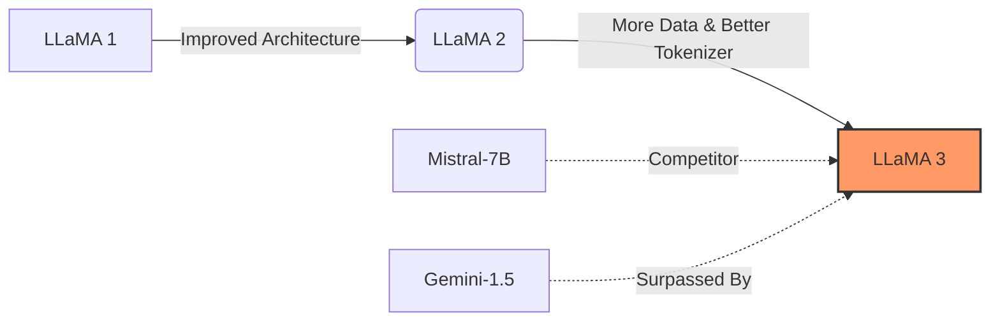
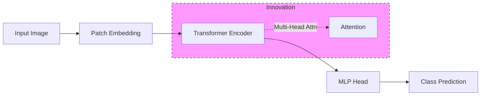

## 将文献导航界面部署Web服务 方案

基于 OpenClaw 生成的 Markdown 文件，最成熟、轻量且美观的方案是使用 **静态站点生成器 (SSG)**，首选 **MkDocs (Material 主题)** 或 **VitePress**。如果你需要更动态的交互（如实时 AI 对话），则可以使用 **Streamlit** 或 **FastAPI + 前端**。

以下是三种主流部署方案的详细教程：

---

### 方案一：MkDocs + Material 主题 (强烈推荐 ⭐⭐⭐⭐⭐)
**特点**：专为文档设计，自带**侧边栏导航、全文搜索、暗黑模式、移动端适配**，完美支持 Markdown 表格和 LaTeX 公式。
**适用**：绝大多数文献知识库场景。

#### 1. 环境准备
```bash
pip install mkdocs mkdocs-material mkdocs-minify-plugin
```

#### 2. 初始化项目
在你的文献库根目录（假设是 `~/my-papers`）执行：
```bash
mkdocs new .
# 生成 mkdocs.yml 和 docs/ 目录
```

#### 3. 配置 `mkdocs.yml`
让 OpenClaw 帮你生成配置，或者手动编辑。核心是映射你的文献结构。

```yaml
site_name: 📚 我的智能文献库
site_description: 基于 OpenClaw 自动构建的学术知识库
site_author: Your Name
repo_url: https://github.com/yourname/your-repo # 可选

theme:
  name: material
  language: zh
  palette:
    - scheme: default
      toggle:
        icon: material/brightness-7
        name: 切换到深色模式
    - scheme: slate
      toggle:
        icon: material/brightness-4
        name: 切换到浅色模式
  features:
    - navigation.tabs       # 顶部标签页
    - navigation.sections   # 侧边栏分组
    - navigation.indexes    # 索引页
    - search.suggest        # 搜索建议
    - search.highlight      # 搜索高亮
    - content.code.copy     # 代码复制

plugins:
  - search
  - minify

# 核心：导航结构 (让 OpenClaw 自动维护这部分)
nav:
  - 首页: index.md
  - 文献分类:
      - 基础架构: categories/LLM_Architecture.md
      - 模型量化: categories/Quantization.md
      - RAG 系统: categories/RAG_Systems.md
  - 最新入库: recent.md
  - 引用图谱: graph.md

markdown_extensions:
  - pymdownx.arithmatex:    # 支持 LaTeX 公式
      generic: true
  - pymdownx.superfences
  - tables
  - toc
```

*💡 **自动化技巧**：编写一个 OpenClaw Skill `update-mkdocs-config`，每次文献库变动时，自动扫描 `categories/` 文件夹并更新 `mkdocs.yml` 中的 `nav` 部分。*

#### 4. 本地预览
```bash
mkdocs serve
# 访问 http://127.0.0.1:8000
```

#### 5. 部署为 Web 服务 (三种方式)

**方式 A：GitHub Pages (免费，最推荐)**
1. 将文献库推送到 GitHub 仓库。
2. 在仓库 Settings -> Pages 中，选择 `gh-pages` 分支。
3. 配置 GitHub Actions (`.github/workflows/deploy.yml`)：
   ```yaml
   name: Deploy MkDocs
   on:
     push:
       branches: [main]
   jobs:
     deploy:
       runs-on: ubuntu-latest
       steps:
         - uses: actions/checkout@v3
         - uses: actions/setup-python@v4
           with: { python-version: '3.x' }
         - run: pip install mkdocs mkdocs-material
         - run: mkdocs gh-deploy --force
   ```
   *效果：每次你 push 新文献，网站自动重建并发布。*

**方式 B：Docker 容器化部署 (私有服务器/NAS)**
创建 `Dockerfile`：
```dockerfile
FROM python:3.9-slim
WORKDIR /docs
COPY requirements.txt .
RUN pip install --no-cache-dir -r requirements.txt
COPY . .
CMD ["mkdocs", "serve", "--dev-addr=0.0.0.0:8000"]
```
运行：
```bash
docker build -t paper-wiki .
docker run -d -p 8080:8000 -v $(pwd):/docs paper-wiki
```
*效果：通过 `http://服务器IP:8080` 访问，适合内网共享。*

**方式 C：Nginx 静态托管 (高性能)**
```bash
mkdocs build # 生成 site/ 目录
# 将 site/ 目录内容复制到 Nginx html 目录
sudo cp -r site/* /var/www/html/
# 重启 Nginx
sudo systemctl restart nginx
```

---

### 方案二：Streamlit (适合需要 AI 交互的场景 ⭐⭐⭐⭐)
**特点**：纯 Python 编写，可以快速添加**搜索框、筛选器、甚至嵌入 OpenClaw 聊天窗口**。
**适用**：希望用户在浏览文献时能直接问 AI 关于文献的问题。

#### 1. 安装依赖
```bash
pip install streamlit pandas plotly
```

#### 2. 编写 `app.py`
```python
import streamlit as st
import os
import yaml
import pandas as pd
from pathlib import Path

st.set_page_config(page_title="AI 文献库", layout="wide")
st.title("📚 智能文献知识库")

# 侧边栏：分类导航
categories_dir = Path("categories")
if categories_dir.exists():
    cats = [f.stem for f in categories_dir.glob("*.md")]
    selected_cat = st.sidebar.selectbox("📂 分类导航", ["全部"] + cats)
else:
    st.error("未找到分类目录，请先运行 OpenClaw 生成导航。")
    st.stop()

# 主内容区
st.header(f"{selected_cat} 文献列表")

# 简单解析 Markdown 表格 (实际项目中建议解析 Frontmatter)
# 这里演示从 database 读取所有带 tag 的文件
db_dir = Path("database")
files = list(db_dir.glob("*.md"))

data = []
for f in files:
    with open(f, 'r', encoding='utf-8') as file:
        content = file.read()
        # 简单提取 Frontmatter (实际可用 python-frontmatter 库)
        if "---" in content:
            meta = content.split("---")
            # 解析 YAML... (省略具体解析代码)
            # 假设解析出了 title, tags, category
            data.append({"title": "示例论文", "tags": "LLM", "file": str(f)})[[source_group_web_1]]

df = pd.DataFrame(data)

# 过滤逻辑
if selected_cat != "全部":
    df = df[df['category'] == selected_cat]

# 展示表格
st.dataframe(df, use_container_width=True)

# 嵌入 OpenClaw 问答 (可选)
st.divider()
st.subheader("🤖 询问关于这些文献的问题")
user_query = st.chat_input("例如：'总结一下量化领域的最新进展'")
if user_query:
    # 调用 OpenClaw API 或 subprocess
    st.write("正在分析... (此处对接 OpenClaw)")
    # response = subprocess.run(["openclaw", "chat", user_query], ...)
    st.write("AI 回答内容...")
```

#### 3. 部署
```bash
streamlit run app.py --server.address 0.0.0.0 --server.port 8501
```
*同样可以配合 Docker 或 Nginx 反向代理部署。*

---

### 方案三：VitePress / Docusaurus (前端开发者首选 ⭐⭐⭐)
**特点**：基于 Vue/React，速度极快，样式高度可定制，适合需要深度定制 UI 的用户。
**流程**：
1. `npm create vitepress@latest`
2. 配置 `.vitepress/config.ts` 指向你的 Markdown 文件。
3. `npm run build` 生成静态文件。
4. 部署同 MkDocs 方式 C。

---

### 关键步骤：如何实现“自动更新”？

无论选哪种方案，核心痛点是：**加了新论文，网页怎么自动变？**

#### 自动化流水线设计
1.  **触发点**：当你运行 OpenClaw 命令处理新论文时。
2.  **动作 1**：OpenClaw 生成新的 `.md` 文件到 `database/` 和 `categories/`。
3.  **动作 2**：OpenClaw 自动运行脚本更新配置文件（如 `mkdocs.yml` 或 `config.ts`）。
    *   *Skill 示例*：`update-web-config` -> 扫描目录 -> 重写配置文件中的 `nav` 字段。
4.  **动作 3**：触发构建命令。
    *   如果是 **GitHub Pages**：`git add . && git commit && git push` -> GitHub Actions 自动构建。
    *   如果是 **Docker/本地**：编写一个 `watch.sh` 脚本，监测文件变化后自动执行 `mkdocs build` 或 `streamlit rerun`。

#### 示例：Git 自动推送脚本 (`sync-web.sh`)
```bash
#!/bin/bash
echo "1. 更新导航配置..."
openclaw run-skill update-mkdocs-config

echo "2. 提交变更..."
git add .
git commit -m "docs: 自动更新文献库及导航 [skip ci]"
git push origin main

echo "3. 等待 GitHub Pages 部署完成..."
# 此时 GitHub Actions 会介入构建
```

### 总结与建议

| 需求 | 推荐方案 | 部署难度 | 维护成本 | 体验 |
| :--- | :--- | :---: | :---: | :---: |
| **标准文档站** (搜索+导航+公式) | **MkDocs + Material** | ⭐ | ⭐ (极低) | ⭐⭐⭐⭐⭐ |
| **交互式应用** (筛选+AI 对话) | **Streamlit** | ⭐⭐ | ⭐⭐ | ⭐⭐⭐⭐ |
| **高度定制 UI** | **VitePress** | ⭐⭐⭐ | ⭐⭐⭐ | ⭐⭐⭐⭐⭐ |
| **零代码快速分享** | **GitHub Pages** (配合 MkDocs) | ⭐ | ⭐ | ⭐⭐⭐⭐⭐ |

**🚀 最佳实践路径**：
1.  使用 **OpenClaw** 整理文献 -> 生成 Markdown + Frontmatter。
2.  使用 **MkDocs Material** 搭建站点框架。
3.  编写 **OpenClaw Skill** 自动更新 `mkdocs.yml` 的导航配置。
4.  托管到 **GitHub Pages** 实现全自动 CI/CD。
5.  (可选) 在页面底部嵌入一个 **OpenClaw Chat Widget**，让用户可以直接对着文献库提问。

这样你就拥有了一个**永不过时、自动生长、全员可访问**的智能文献知识门户。

## 文献知识图谱可视化界面

核心目标是让复杂的学术关系（引用、共现、演进）变得直观、可交互、可探索。

基于你之前的 OpenClaw + MkDocs 架构，我推荐采用 **“双层架构”**：
1.  **宏观层 (Macro View)**：展示领域全貌、聚类分布、时间演进（适合概览）。
2.  **微观层 (Micro View)**：展示单篇文献的上下游引用、实体关联（适合精读）。

以下是详细的设计方案和技术实现路径：

---

### 🎨 一、核心功能模块设计

#### 1. 宏观视图：领域全景图 (The Galaxy View)
*   **视觉形式**：力导向图 (Force-Directed Graph) 或 聚类气泡图。
*   **节点**：代表**文献聚类**（而非单篇论文），节点大小=该聚类文献数量/热度。
*   **连线**：代表聚类间的引用强度或主题相似度。
*   **颜色**：不同颜色代表不同子领域（如：🔵NLP, 🟢CV, 🟠RL）。
*   **交互**：
    *   **缩放/拖拽**：自由探索。
    *   **点击聚类**：下钻到该聚类的详细文献列表。
    *   **时间滑块**：拖动滑块，观察领域热点随年份的演变（动态图谱）。

#### 2. 微观视图：单篇文献关系网 (The Paper Orbit)
*   **视觉形式**：中心辐射图 (Radial Layout)。
*   **中心节点**：当前阅读的文献。
*   **内圈**：直接引用的参考文献 (Backwards)。
*   **外圈**：引用了本文的后续文献 (Forwards)。
*   **连线样式**：
    *   实线 = 强引用（文中多次提及）。
    *   虚线 = 弱引用（仅在参考文献列表出现）。
    *   红色高亮 = 结论被推翻/存在争议。
*   **交互**：
    *   **悬停**：显示摘要和关键结论。
    *   **点击节点**：跳转至该文献的详情页。
    *   **路径高亮**：点击两个节点，高亮它们之间的最短引用路径。

#### 3. 侧边栏：智能过滤器与统计
*   **时间过滤**：只看近 3 年 / 近 5 年。
*   **类型过滤**：只看综述 (Review) / 实验论文 (Empirical)。
*   **状态过滤**：隐藏已标记为 `deprecated` 的过时文献。
*   **统计面板**：显示当前视图下的文献总数、平均年份、最高引论文。

---

### 🛠️ 二、技术选型与实现方案

鉴于你的系统基于 Web (MkDocs)，推荐以下三种实现方案，按复杂度递增：

#### 方案 A：轻量级嵌入 (ECharts / PyVis) —— ⭐⭐⭐ (快速上手)
**适用**：快速在 MkDocs 页面中插入静态或简单交互的图谱。
*   **工具**：Python `pyvis` 生成 HTML，或 `ECharts` JSON 配置。
*   **流程**：
    1.  OpenClaw 运行技能 `generate-graph-data`，扫描 Markdown 文件，提取引用关系。
    2.  输出 `graph_data.json` (节点列表 + 边列表)。
    3.  在 MkDocs 页面通过 `<iframe>` 或 `div` 加载 ECharts 配置。
*   **优点**：开发快，无需前端框架知识。
*   **缺点**：大规模数据（>1000 节点）性能较差，交互定制性低。

#### 方案 B：专业图库集成 (G6 / Cytoscape.js) —— ⭐⭐⭐⭐ (推荐)
**适用**：需要高性能、复杂交互、自定义样式的生产环境。
*   **工具**：
    *   **AntV G6** (阿里开源)：专为关系数据设计，性能极好，支持自定义节点/边样式。
    *   **Cytoscape.js**：生物信息学领域标准，算法丰富。
*   **实现步骤**：
    1.  **数据准备**：OpenClaw 生成标准的 JSON 格式 (`{ nodes: [...], edges: [...] }`)。
    2.  **前端开发**：在 MkDocs 的 `overrides` 目录中创建一个 `graph.html` 页面。
    3.  **渲染逻辑**：
        ```javascript
        // G6 示例代码
        const graph = new G6.Graph({
          container: 'mountNode',
          width: 800,
          height: 600,
          modes: { default: ['drag-canvas', 'zoom-canvas', 'drag-node'] },
          layout: { type: 'force' }, // 力导向布局
          defaultNode: {
            type: 'circle',
            size: 20,
            style: { fill: '#5B8FF9' }
          },
          defaultEdge: {
            style: { stroke: '#e2e2e2' }
          }
        });
        
        // 加载 OpenClaw 生成的数据
        fetch('/data/graph_data.json')
          .then(res => res.json())
          .then(data => graph.data(data));
        ```
    4.  **样式映射**：根据 `node.year` 设置颜色（新绿旧红），根据 `node.type` 设置形状。

#### 方案 C：独立微服务 (Streamlit / React + Neo4j) —— ⭐⭐⭐⭐⭐ (终极形态)
**适用**：超大规模图谱（万级节点），需要复杂分析（路径查找、社区发现）。
*   **后端**：Neo4j 图数据库存储关系。
*   **前端**：React + React Flow 或 Streamlit + PyVis。
*   **部署**：作为独立服务运行，MkDocs 通过 iframe 嵌入。
*   **优势**：支持实时查询、动态更新、复杂算法分析。

---

### 🚀 三、OpenClaw 自动化数据流水线

为了让图谱“活”起来，必须让 OpenClaw 自动维护图谱数据。

#### 1. 创建技能：`build-knowledge-graph`
这个技能负责从 Markdown 文件中提取关系并生成 JSON。

```markdown
# Skill: build-knowledge-graph
# 输入：~/papers/database 目录
# 输出：docs/assets/data/graph_data.json

## 逻辑
1. **遍历文件**：读取所有 `.md` 文件的 Frontmatter 和正文。
2. **构建节点 (Nodes)**：
   - ID: 文件名或 DOI
   - Label: 标题 (截断)
   - Group: Category (来自 Frontmatter)
   - Size: 引用次数 (统计被多少其他文件引用)
   - Color: 根据 Year 计算 (2024=Green, 2020=Yellow, <2018=Red)
   - Meta: { year, authors, status }
3. **构建边 (Edges)**：
   - Source: 当前文件
   - Target: 正文中 `[[Linked Paper]]` 指向的文件
   - Weight: 引用次数 (文中出现几次)
   - Type: "cites" 或 "supersedes" (如果检测到推翻关系)
4. **优化布局**：
   - 预计算简单的聚类信息 (可选)。
5. **输出 JSON**：覆盖 `docs/assets/data/graph_data.json`。
6. **触发构建**：通知 MkDocs 重新构建或直接刷新前端缓存。
```

#### 2. 定时更新
将此技能加入之前的 `auto-ingest-pipeline` 末尾。每次有新文献入库，图谱数据自动更新。

---

### 🎨 四、UI/UX 细节设计建议

#### 1. 视觉编码 (Visual Encoding)
*   **颜色 = 时间/状态**：
    *   🟢 鲜绿：近 2 年 (SOTA)
    *   🔵 蓝色：3-5 年 (成熟期)
    *   🟠 橙色：5-8 年 (经典/老化)
    *   🔴 红色：>8 年 或 `deprecated` (需警惕)
*   **大小 = 影响力**：节点越大，被引次数越多。
*   **边框 = 特殊状态**：
    *   粗红框：结论有争议。
    *   虚线框：预印本 (未正式发表)。

#### 2. 交互体验
*   **搜索定位**：顶部搜索框，输入论文标题，图谱自动飞入并高亮该节点。
*   **详情浮窗 (Tooltip)**：鼠标悬停时，不只显示标题，还显示：
    *   📅 年份
    *   🏷️ 核心标签
    *   ⚠️ 警告标识 (如果有)
    *   🔗 "阅读全文" 按钮
*   **路径追踪**：右键点击两个节点，选择"Find Connection"，高亮显示它们之间的引用链条。

#### 3. 响应式布局
*   **桌面端**：全屏图谱，左侧悬浮控制板。
*   **移动端**：简化版列表视图 + 迷你图谱（仅展示直接关联），避免操作困难。

---

### 💡 五、完整实施路线图

1.  **Day 1: 数据准备**
    *   编写 OpenClaw 技能 `build-knowledge-graph`，测试能否从现有 Markdown 生成正确的 JSON。
2.  **Day 2: 原型开发**
    *   在 MkDocs 项目中引入 `AntV G6`。
    *   创建一个 `graph.md` 页面，渲染静态 JSON 数据。
    *   实现基本的缩放、拖拽、点击跳转。
3.  **Day 3: 样式美化**
    *   根据年份动态着色节点。
    *   添加 Tooltip 显示摘要。
    *   添加图例 (Legend) 说明颜色含义。
4.  **Day 4: 自动化集成**
    *   将 `build-knowledge-graph` 加入 CI/CD 或 Cron 任务。
    *   测试新文献入库后，图谱是否自动更新。
5.  **Day 5: 高级功能**
    *   添加时间轴滑块，实现动态演化效果。
    *   添加过滤器（只看某分类）。

### 总结
不要试图一开始就做一个完美的 Neo4j 大屏。**先用 G6/ECharts 把基础的关系图画出来，跑通“数据自动生成 -> 网页自动渲染”的闭环**，然后再逐步增加高级交互。

对于文献库来说，**“能看清谁引用了谁”** 和 **“能一眼识别出哪些是过时文献”** 是最核心的价值点，优先保证这两点的体验。

## PDF到Markdown的方案

这是一个非常明智的简化方案！
**“Markdown 为主，PDF 为辅”** 的策略能极大降低前端开发复杂度，提升加载速度，并且完美契合 **MkDocs** 的静态站点特性。用户不需要在网页上渲染沉重的 PDF，只需阅读整理好的 Markdown，需要深究时点击链接下载或在新标签页打开原始 PDF 即可。

基于 **MkDocs Material** 主题，我们将之前的架构调整为 **"Markdown-Centric" (以 Markdown 为核心)** 的模式。

---

### 🏗️ 调整后的核心架构

1.  **数据源**：PDF (原始文件，仅存储)。
2.  **核心产物**：结构化 Markdown 文件 (`.md`)。
    *   包含：标题、元数据 (Frontmatter)、正文、**高亮表格**、**知识图谱节点信息**、**溯源引用块**。
3.  **展示层**：MkDocs 生成的静态 HTML 网站。
4.  **交互层**：
    *   **SOTA 演进**：直接在 Markdown 中嵌入交互式图表 (Mermaid 或 ECharts)。
    *   **溯源**：通过 Markdown 的 `> [!QUOTE]` (Callouts) 或脚注链接指向 PDF 的具体位置（如果 PDF 支持 `#page=X` 跳转）。

---

### 🚀 实施步骤详解

#### 第一步：PDF 转 Markdown 的智能分块与增强 (Backend)

既然最终只展示 Markdown，那么 **Markdown 的质量就是生命线**。我们需要在生成 Markdown 时，把“表格”、“图谱数据”、“溯源证据”都写进去。

**OpenClaw 技能逻辑调整：**

1.  **表格处理**：
    *   检测到表格 -> 转换为 **Markdown Table**。
    *   **关键增强**：在表格上方自动添加一段 LLM 生成的 **“表格解读 (Table Insight)"**，直接告诉用户这个表说明了什么 SOTA 对比。
    *   *效果*：用户不用看原图，直接读文字和表格就能懂。

2.  **溯源证据块 (Source Evidence Blocks)**：
    *   不要只在数据库存坐标。直接将 LLM 提取的 `evidence_quote` 写入 Markdown 文件中，使用 MkDocs Material 的 **Admonitions (警告/提示框)** 格式。
    *   同时附上 PDF 下载链接，并尝试带上页码参数（如 `file.pdf#page=5`），部分浏览器支持直接跳到该页。

3.  **SOTA 数据嵌入**：
    *   将提取出的 SOTA 演进数据，在 Markdown 中生成一段 **Mermaid 流程图** 或 **ECharts JSON 配置**。
    *   MkDocs 支持直接渲染 Mermaid，这样演进链就直接长在文章里了。

**生成的 Markdown 文件示例 (`docs/papers/2024-llama3.md`)：**

```markdown
---
title: "LLaMA 3: Open Foundation and Fine-Tuned Chat Models"
date: 2024-04-18
tags: [LLM, SOTA, Meta]
category: "NLP/LLM"
doi: "10.48550/arXiv.2407.21783"
pdf_url: "../assets/pdfs/llama3.pdf"
sota_metrics:
  - task: "MMLU"
    score: 86.0
    previous_sota: "Gemini-1.5-Pro"
---

# LLaMA 3: 开放模型的新标杆

## 📊 核心结论 (Key Findings)
本文提出了 LLaMA 3 系列模型，在多项基准测试中超越了之前的开源 SOTA (如 Mistral-Large, Qwen-1.5)。

## 🏆 SOTA 性能对比
> [!INFO] 性能跃迁分析
> 在 MMLU 基准上，LLaMA 3-70B 达到了 **86.0%**，相比前一代 LLaMA 2-70B (69.0%) 提升了 **17%**，并超越了同期的闭源模型 Gemini-1.5-Pro。

| Model | Params | MMLU Score | GSM8K | HumanEval |
| :--- | :---: | :---: | :---: | :---: |
| LLaMA 2-70B | 70B | 69.0 | 56.8 | 29.9 |
| Mistral-Large | ~120B | 81.2 | 68.5 | 45.0 |
| **LLaMA 3-70B** | **70B** | **86.0** | **82.0** | **62.2** |
| Gemini-1.5-Pro | Unknown | 83.7 | 78.0 | 55.0 |

*数据来源：Table 2 in original paper.*

## 🔍 关键证据溯源
> [!QUOTE] 原文摘录 (Page 5)
> "Our 70B model achieves 86.0% on MMLU, surpassing the previous best open-weight model by a significant margin..."
> 👉 [查看原始 PDF 第 5 页](../assets/pdfs/llama3.pdf#page=5)

## 🕸️ 技术演进路径
下图展示了 LLaMA 3 在 NLP 领域的演进位置：



## 📥 原始文档
- [下载完整 PDF](../assets/pdfs/llama3.pdf)
- [ArXiv 链接](https://arxiv.org/abs/...)
```

---

#### 第二步：MkDocs 配置优化 (Frontend)

为了完美展示上述内容，需要配置 `mkdocs.yml`。

**1. 启用 Mermaid (用于画演进图)**
```yaml
plugins:
  - mermaid2  # 需要 pip install mkdocs-mermaid2-plugin
  - search
  - tags

theme:
  name: material
  features:
    - content.code.copy
    - content.action.edit
    - navigation.tabs
    - navigation.footer

markdown_extensions:
  - admonition       # 支持 > [!INFO] 等提示框
  - pymdownx.details # 支持折叠细节
  - pymdownx.superfences # 支持代码块嵌套
  - tables           # 支持表格
  - footnotes        # 支持脚注
```

**2. 自定义 CSS (让溯源框更醒目)**
在 `docs/stylesheets/extra.css` 中：
```css
/* 让 Quote 框看起来像引用证据 */
.md-typeset .admonition.quote,
.md-typeset details.quote {
  border-color: #ff9800;
}
.md-typeset .quote > .admonition-title,
.md-typeset .quote > summary {
  background-color: rgba(255, 152, 0, 0.1);
  font-weight: bold;
}
.md-typeset .quote > .admonition-title::before,
.md-typeset .quote > summary::before {
  content: "📜"; /* 卷轴图标 */
}
```

**3. 配置导航自动生成**
利用 OpenClaw 脚本扫描 `docs/papers/` 目录，自动更新 `mkdocs.yml` 中的 `nav` 部分，按 `Category/Year` 分组。

---

#### 第三步：实现 SOTA 演进链的全局视图

除了单篇论文里的局部图，你还需要一个**全局的 SOTA 演进页面** (`docs/sota-evolution.md`)。

**实现逻辑：**
1.  **OpenClaw 聚合任务**：遍历所有 Markdown 文件的 Frontmatter (`sota_metrics`)。
2.  **生成数据文件**：输出一个 `sota_data.json` 到 `docs/assets/data/`。
3.  **嵌入 ECharts**：在 `sota-evolution.md` 中嵌入一段 HTML/JS 代码，读取 JSON 并绘制动态折线图。

**`docs/sota-evolution.md` 内容示例：**

```markdown
# 🌍 全局 SOTA 演进看板

本看板自动汇总库中所有文献的性能指标，展示技术发展趋势。

## 📈 MMLU 准确率演进 (2023-2026)

<div id="sota-chart" style="width: 100%; height: 500px;"></div>

<script src="https://cdn.jsdelivr.net/npm/echarts@5.4.3/dist/echarts.min.js"></script>
<script>
  // 异步加载 OpenClaw 生成的数据
  fetch('../assets/data/sota_data.json')
    .then(res => res.json())
    .then(data => {
      var chart = echarts.init(document.getElementById('sota-chart'));
      var option = {
        tooltip: { trigger: 'axis' },
        xAxis: { type: 'category', data: data.years },
        yAxis: { type: 'value', name: 'Accuracy (%)' },
        series: [{
          data: data.scores,
          type: 'line',
          smooth: true,
          markPoint: {
            data: data.highlights.map(h => ({name: h.model, value: h.score, coord: [h.year, h.score]}))
          },
          itemStyle: { color: '#5B8FF9' }
        }]
      };
      chart.setOption(option);
      
      // 点击数据点跳转到对应论文 Markdown
      chart.on('click', function(params) {
        window.location.href = '../papers/' + params.name.replace(/\s+/g, '-').toLowerCase() + '.md';
      });
    });
</script>
```

---

#### 第四步：溯源链接的优化体验

既然不内嵌 PDF 阅读器，如何让“溯源”体验更好？

1.  **PDF 页码跳转**：
    在 Markdown 中使用 `[查看原文第 X 页](file.pdf#page=X)`。
    *   *注意*：这取决于用户浏览器的 PDF 插件是否支持 `#page=` 参数。Chrome 和 Edge 通常支持。
2.  **提供“定位指引”**：
    在 Markdown 的引用块中，不仅给链接，还明确写出：
    > 👉 **定位指引**：打开 PDF 后，请搜索关键词 *"Table 2"* 或直接跳转至 **第 5 页**。
3.  **侧边栏快速访问**：
    利用 MkDocs 的 `toc` (目录) 功能，在右侧边栏自动生成“原文证据”、“性能表格”、“演进图”的锚点链接，方便快速跳转。

---

### 📝 总结：新的工作流

1.  **输入**：`paper.pdf`
2.  **OpenClaw 处理**：
    *   解析 PDF -> 提取文本/表格/指标。
    *   LLM 生成 Markdown 内容（含 Mermaid 图、Admonition 引用框、Markdown 表格）。
    *   提取 Frontmatter 元数据。
    *   保存为 `docs/papers/yyyy-title.md`。
    *   复制 `paper.pdf` 到 `docs/assets/pdfs/`。
    *   (可选) 更新 `docs/assets/data/sota_data.json`。
3.  **MkDocs 构建**：
    *   `mkdocs build` -> 生成静态 HTML。
    *   Mermaid 自动渲染为 SVG 互动图。
    *   ECharts 自动加载数据绘制全局看板。
4.  **用户浏览**：
    *   阅读结构清晰的 Markdown。
    *   看自动生成的 SOTA 演进图。
    *   点击“查看原文”链接，在新标签页打开 PDF (自动跳页或手动搜索)。

### 💡 这种方案的优势
*   **极速加载**：没有沉重的 PDF 渲染引擎，网页秒开。
*   **SEO 友好**：所有内容都是文本，搜索引擎可索引。
*   **移动端适配**：Markdown 在手机上看体验远好于 PDF。
*   **易于维护**：所有内容都是文本文件，方便 Git 版本控制和 Diff 对比。
*   **聚焦内容**：强迫系统在提取阶段就把精华（表格、结论）提炼出来，而不是让用户自己去 PDF 里找。

这个方案完美契合你“用 MkDocs 做前端”的设定，既保留了知识的深度，又极大地提升了阅读的流畅度。

## 动态展示Markdown

设计一个能完美展示**结构化表格**、**重绘交互式图表**和**可点击架构图**的 MkDocs 模板，需要结合 **Material for MkDocs** 的主题特性、**自定义 CSS** 以及 **前端 JS 库**（如 Plotly, Mermaid, Cytoscape.js）。

核心目标是：**让静态的 Markdown 文件“活”起来**，实现数据可交互、溯源可高亮、结构可探索。

---

### 🏗️ 一、整体架构设计

1.  **数据层**：OpenClaw 提取的 JSON 数据（表格数据、图表序列点、架构图节点）嵌入在 Markdown 的 `div` 或代码块中。
2.  **渲染层**：
    *   **表格**：使用 Material 的 `Data Tables` 组件 + 自定义 CSS 高亮 SOTA。
    *   **图表**：使用 **Plotly.js** 读取 JSON 数据重绘交互式折线/柱状图。
    *   **架构图**：使用 **Mermaid** (简单流程) 或 **Cytoscape.js** (复杂网络) 渲染。
3.  **交互层**：点击图表数据点 -> 弹出原文证据框；鼠标悬停模块 -> 显示详细定义。

---

### 🛠️ 二、MkDocs 配置 (`mkdocs.yml`)

首先启用必要的插件和扩展。

```yaml
site_name: AI Research Knowledge Base
theme:
  name: material
  palette:
    - scheme: default
      toggle:
        icon: material/toggle-switch-off-outline
        name: Switch to dark mode
    - scheme: slate
      toggle:
        icon: material/toggle-switch
        name: Switch to light mode
  features:
    - content.code.copy
    - content.tabs.link
    - navigation.instant
    - search.highlight

plugins:
  - search
  - mermaid2  # 必须：支持 Mermaid 图表
  - minify    # 可选：压缩资源

markdown_extensions:
  - admonition      # 警告/提示框 (用于展示证据)
  - pymdownx.details
  - pymdownx.superfences # 支持自定义代码块渲染
  - tables
  - attr_list       # 允许给 HTML 标签加 class/id
  - pymdownx.arithmatex # 数学公式

extra_css:
  - stylesheets/extra.css
extra_javascript:
  - https://cdn.plot.ly/plotly-2.27.0.min.js # 引入 Plotly 用于交互图表
  - https://cdnjs.cloudflare.com/ajax/libs/cytoscape/3.26.0/cytoscape.min.js # 引入 Cytoscape 用于复杂架构图
  - javascripts/custom-render.js # 自定义渲染逻辑
```

---

### 🎨 三、自定义 CSS (`docs/stylesheets/extra.css`)

这是让表格和图表“出彩”的关键。

```css
/* 1. SOTA 表格高亮样式 */
.md-typeset table.sota-table tr.is-sota {
  background-color: rgba(76, 175, 80, 0.15); /* 淡绿色背景 */
  font-weight: bold;
  border-left: 4px solid #4CAF50;
}
.md-typeset table.sota-table tr.is-baseline {
  opacity: 0.8;
}
.md-typeset table.sota-table td.highlight-num {
  color: #d32f2f; /* 提升数值标红 */
  font-family: 'Roboto Mono', monospace;
}

/* 2. 交互式图表容器 */
.chart-container {
  width: 100%;
  height: 500px;
  margin: 20px 0;
  border: 1px solid var(--md-default-fg-color--lightest);
  border-radius: 8px;
  overflow: hidden;
}

/* 3. 架构图节点悬停效果 */
.cy-node:hover {
  cursor: pointer;
  stroke: #ff9800;
  stroke-width: 3px;
}

/* 4. 证据引用框 (Callout) 优化 */
.md-typeset .admonition.evidence {
  border-color: #2196F3;
  background-color: rgba(33, 150, 243, 0.05);
}
.md-typeset .evidence > .admonition-title::before {
  content: "📜"; 
}
```

---

### 📝 四、Markdown 模板设计与内容生成

OpenClaw 在生成 `.md` 文件时，应遵循以下模板结构。

#### 1. 智能表格展示 (Smart Tables)
不仅展示数据，还要通过类名高亮 SOTA 行。

```markdown
## 📊 性能对比 (Performance Comparison)

下表展示了在 ImageNet 数据集上的 Top-1 准确率对比。**绿色行**代表本文提出的方法。

| Method | Backbone | Params (M) | Top-1 Acc (%) | Delta |
| :--- | :---: | :---: | :---: | :---: |
| ResNet-50 | ResNet | 25 | 76.0 | - |
| EfficientNet-B0 | EfficientNet | 5.3 | 77.3 | +1.3 |
| **Ours (Proposed)** | **Hybrid** | **12** | **82.5** | **+6.5** |

<!-- OpenClaw 生成的注释：上述表格实际渲染时会添加 class="sota-table" 和行级 class -->
{ .sota-table data-source="Table 2" }

> [!EVIDENCE] 数据来源
> 以上数据提取自原文 **Table 2** (Page 5)。
> 👉 [查看原表截图](../assets/tables/paper_x_table_2.png)
```

*注：你需要编写一个简单的 JS 脚本 (`custom-render.js`) 来解析 `{ .sota-table }` 属性并自动给包含 "Ours" 的行添加 `is-sota` 类。*

#### 2. 交互式图表重绘 (Interactive Charts with Plotly)
不要只放静态图片！将 OpenClaw 提取的 JSON 数据嵌入 `div`，用 Plotly 重绘。

```markdown
## 📈 训练收敛曲线 (Training Convergence)

下图展示了 Loss 随 Epoch 的变化趋势。**鼠标悬停可查看具体数值**。

<!-- 容器：存放 JSON 数据 -->
<div id="chart-convergence" 
     class="chart-container"
     data-type="line"
     data-json='[
       {"name": "Ours", "x": [1, 10, 50, 100], "y": [2.5, 1.2, 0.4, 0.1]},
       {"name": "Baseline", "x": [1, 10, 50, 100], "y": [2.5, 1.5, 0.8, 0.3]}
     ]'>
</div>

> [!EVIDENCE] 图表来源
> 数据源自原文 **Figure 3** (Page 6)。
> 原文描述："Our method converges significantly faster..."
```

**JS 渲染逻辑 (`custom-render.js`)**:
```javascript
document.addEventListener('DOMContentLoaded', function() {
    const charts = document.querySelectorAll('.chart-container');
    charts.forEach(div => {
        const jsonData = JSON.parse(div.getAttribute('data-json'));
        const traces = jsonData.map(series => ({
            x: series.x,
            y: series.y,
            name: series.name,
            type: 'scatter',
            mode: 'lines+markers'
        }));
        
        Plotly.newPlot(div.id, traces, {
            responsive: true,
            margin: { t: 40, r: 20, l: 40, b: 40 },
            paper_bgcolor: 'rgba(0,0,0,0)', // 透明背景适配暗黑模式
            plot_bgcolor: 'rgba(0,0,0,0)'
        });
        
        // 点击事件：显示证据
        div.on('plotly_click', function(data){
            alert(`数据点来自原文 Figure 3。\n数值：${data.points[0].y}`);
            // 这里可以触发更复杂的模态框显示原文截图
        });
    });
});
```

#### 3. 架构图展示 (Architecture Diagrams)

对于简单的流程图，用 **Mermaid**；对于复杂的神经网络拓扑，用 **Cytoscape.js**。

**方案 A: Mermaid (简单流程)**
```markdown
## 🏗️ 模型架构


```

**方案 B: Cytoscape.js (复杂模块连接 - 高级)**
```markdown
## 🔍 详细模块连接图

<div id="cy-arch" style="width: 100%; height: 600px; border: 1px solid #ddd;"
     data-elements='[
       {"data": {"id": "n1", "label": "Encoder"}},
       {"data": {"id": "n2", "label": "Decoder"}},
       {"data": {"source": "n1", "target": "n2", "label": "Latent"}}
     ]'>
</div>
```
*(同样需要 JS 监听 `#cy-arch` 并初始化 Cytoscape 实例)*

---

### 🧩 五、OpenClaw 生成器逻辑调整

为了让 MkDocs 能渲染上述内容，OpenClaw 的 `markdown_generator` 技能需要升级：

1.  **表格处理**：
    *   识别 "Ours" 行 -> 在 Markdown 表格语法后追加 `{ .sota-table }` 属性。
    *   生成 `<tr class="is-sota">` (如果直接输出 HTML 表格) 或通过 JS 后期处理。

2.  **图表处理**：
    *   不再插入 ``。
    *   改为生成 `<div class="chart-container" data-json='...'>`，并将提取的坐标点序列化为 JSON 字符串填入。
    *   保留原图链接放在下方的 Evidence 框中。

3.  **架构图处理**：
    *   如果 MLLM 提取出了节点和边列表 -> 生成 Mermaid 代码块 或 Cytoscape JSON。
    *   如果提取失败 -> 降级为展示原图 ``。

---

### 💡 六、用户体验增强技巧

1.  **暗黑模式适配**：
    *   Plotly 和 Cytoscape 的配置中，根据 MkDocs 的当前主题（通过 JS 检测 `document.documentElement.getAttribute('data-md-color-scheme')`）动态切换图表颜色（白底黑字 vs 黑底白字）。

2.  **一键复制数据**：
    *   在表格或图表旁添加一个 "📋 Copy CSV/JSON" 按钮，方便研究人员直接拿数据去跑实验。

3.  **对比视图 (Diff View)**：
    *   如果用户同时打开了两篇论文的页面（或在一个页面比较），提供一个“对比模式”，将两个图表的 JSON 数据合并绘制在同一张图上，直观展示差异。

4.  **移动端优化**：
    *   确保 `chart-container` 和表格在手机上支持横向滚动 (`overflow-x: auto`)。

### 总结

通过这种设计，你的 MkDocs 网站不再是静态文档的堆砌，而是一个**轻量级的数据可视化平台**：
*   **表格**不仅是文本，而是**高亮的关键证据**。
*   **图表**不仅是图片，而是**可探索的数据源**。
*   **架构图**不仅是插图，而是**可推理的逻辑图**。

这完美契合了你之前设计的“多模态 Schema”和“增量修正”架构，将后端的高质量数据结构化地呈现给了最终用户。


## 显示年份标签

在 MkDocs Material 主题中显示文献的**年份标签**，最优雅的方式是利用 Markdown 的 **Frontmatter (元数据)** 配合 MkDocs 的 **模板自定义** 或 **CSS/JS 注入**。

这里有三种方案，从**零代码快速实现**到**深度定制 UI**：

---

### 方案一：利用 Admonition (警告框) 快速展示 (最简单 ⭐⭐⭐⭐)
**原理**：在生成文献摘要时，让 OpenClaw 自动在 Markdown 文件顶部插入一个带有年份的 `Admonition` (提示框)。MkDocs Material 原生支持这种语法，渲染效果非常漂亮。

#### 1. OpenClaw 生成配置
修改你的 `batch-paper-tagger` 技能，在生成 Markdown 文件时，在标题下方立即插入年份块：

```markdown
# 论文标题

!!! info "📅 发表年份：2024"
    **状态**: 最新研究 | **分类**: LLM 架构
    > 本文发表于 2024 年，属于近 3 年的核心文献。

---
(正文内容...)
```

*OpenClaw Prompt 示例:*
> “在生成 Markdown 文件时，请在 H1 标题后立刻插入一个 `!!! info` 块，内容为'📅 发表年份：{{year}}'，并根据年份动态添加描述（如 >5 年显示'⚠️ 历史文献'）。”

#### 2. 效果
页面上会直接显示一个蓝色的信息框，清晰醒目。
*   **优点**：无需改配置文件，无需写 CSS，开箱即用。
*   **缺点**：占据页面垂直空间，不够“标签化”。

---

### 方案二：提取 Frontmatter 并渲染为徽章 (推荐 ⭐⭐⭐⭐⭐)
**原理**：利用 MkDocs 的 `extra_javascript` 读取页面 Frontmatter 中的 `date` 或 `year` 字段，动态在标题旁插入一个漂亮的**徽章 (Badge)**。

#### 步骤 1：确保 Frontmatter 存在
确保你的文献 MD 文件头部有年份信息：
```yaml
---
title: "Attention Is All You Need"
date: 2017-06-12
year: 2017
tags: [Transformer, NLP]
---
# 论文标题
...
```

#### 步骤 2：编写自动注入脚本 (`docs/assets/year-badge.js`)
这个脚本会在页面加载时，读取 `page.meta.year`，并在 H1 标题旁边插入一个带颜色的标签。

```javascript
document.addEventListener('DOMContentLoaded', function() {
  // 获取当前页面的元数据 (MkDocs Material 会自动解析 frontmatter 到 page.meta)
  // 注意：需要在 mkdocs.yml 中开启 meta 支持 (默认开启)
  
  const year = document.querySelector('meta[name="year"]')?.content || 
               document.querySelector('script[type="application/json"][id="__md_meta__"]')?.innerText;
  
  // 如果上面拿不到，尝试从全局变量或 DOM 解析 (简化版：假设我们在 frontmatter 里写了 date)
  // 更稳妥的方式是使用 MkDocs 的 template 变量，但 JS 端读取需要借助特定插件或约定
  
  // 【替代方案】直接从 HTML 结构中查找 (如果 mkdocs.yml 配置了 custom_dir 覆盖 page.html 会更准)
  // 这里演示一种通用的“解析 Frontmatter 文本”的笨办法作为保底，
  // 但最佳实践是配合 mkdocs-gen-files 或插件将 year 写入 <meta> 标签。
  
  // === 最佳实践：假设你已在 mkdocs.yml 中配置了 extra 将 year 透传 ===
  // 或者我们直接解析页面顶部的 hidden meta
  let pubYear = null;
  
  // 尝试从 mkdocs 生成的 meta 标签读取 (需在 mkdocs.yml 中配置 plugins: [meta-descriptions] 或类似)
  // 如果没有插件，我们可以用正则简单扫描一下页面源码中的 frontmatter (不推荐，性能差)
  
  // --- 让我们用一个更简单的 Hack：在生成 MD 时，让 AI 在标题后加一个 span ---
  // 但为了演示 JS 方案，我们假设能通过某种方式拿到 year
  // 实际上，MkDocs Material 并没有直接把 arbitrary frontmatter 暴露给 JS 的标准方法，除非使用插件。
  
  // ✅ **修正方案**：使用 CSS 选择器 + 约定
  // 让 OpenClaw 在生成时，不仅在 frontmatter 写 year，还在标题行后面加一个隐藏的 span
  // <h1 class="md-typeset">标题 <span class="paper-year" data-year="2024"></span></h1>
  
  const yearSpan = document.querySelector('.paper-year');
  if (yearSpan) {
    const y = yearSpan.getAttribute('data-year');
    const currentYear = new Date().getFullYear();
    const age = currentYear - y;
    
    let color = '#4caf50'; // 绿色 (新)
    let text = `🆕 ${y}`;
    
    if (age > 5) {
      color = '#f44336'; // 红色 (旧)
      text = `⚠️ ${y}`;
    } else if (age > 2) {
      color = '#ff9800'; // 橙色 (中)
      text = `${y}`;
    }

    // 创建徽章
    const badge = document.createElement('span');
    badge.className = 'md-badge'; // 使用 Material 自带的 badge 类
    badge.style.backgroundColor = color;
    badge.style.color = '#fff';
    badge.style.marginLeft = '8px';
    badge.style.verticalAlign = 'middle';
    badge.innerText = text;
    
    // 插入到标题后，移除原来的隐藏 span
    yearSpan.parentNode.insertBefore(badge, yearSpan.nextSibling);
    yearSpan.remove();
  }
});
```

#### 步骤 3：配合 OpenClaw 生成带标记的标题
为了让 JS 生效，修改 OpenClaw 的生成逻辑，让它输出：
```markdown
# 论文标题 <span class="paper-year" data-year="2024" style="display:none;"></span>
```

#### 步骤 4：在 `mkdocs.yml` 中引入
```yaml
extra_javascript:
  - assets/year-badge.js
```

---

### 方案三：深度定制模板 (最完美，需少量 Python/YAML)
**原理**：使用 `mkdocs-gen-files` 或自定义 `main.html` 模板，直接将 Frontmatter 的 `year` 渲染到 HTML 结构中，无需 JS  hack。

#### 1. 安装插件
```bash
pip install mkdocs-gen-files
```

#### 2. 创建 `main.html` (覆盖主题模板)
在 `docs/overrides/main.html` 创建文件：

```html



  {{ super() }}
  
  <!-- 在文章开头动态插入年份标签 -->
  
    
    
    
    
      
      
    
      
      
    
      
      
    

    <div class="admonition custom-year-badge">
      <p class="admonition-title">发表时间</p>
      <p><span class="md-badge {{ color_class }}">{{ label }}</span></p>
    </div>
  

```

#### 3. 添加自定义 CSS (`docs/assets/custom.css`)
```css
/* 定义不同年份的颜色 */
.md-typeset__badge--new { background-color: #00e676; color: #000; }
.md-typeset__badge--stable { background-color: #29b6f6; color: #fff; }
.md-typeset__badge--old { background-color: #ff5252; color: #fff; }

.custom-year-badge {
  margin-top: 1rem;
  border-left-width: 4px;
  border-left-color: var(--md-primary-fg-color);
}
```

#### 4. 配置 `mkdocs.yml`
```yaml
theme:
  name: material
  custom_dir: docs/overrides # 指向你的覆盖目录

extra_css:
  - assets/custom.css

plugins:
  - search
  # 其他插件
```

*注意：Jinja2 模板中获取 `now()` 可能需要 `mkdocs-date-plugin` 或在 Python 环境中支持。如果报错，可以直接在 CSS/JS 方案中计算，或者在 Frontmatter 里手动算好 `age_group` 字段。*

---

### 🚀 综合推荐方案 (OpenClaw + 方案一/二混合)

为了兼顾**自动化**和**美观**，建议采用以下组合：

1.  **OpenClaw 生成阶段**：
    让 AI 在生成 Markdown 时，不仅写入 `year: 2024` 到 Frontmatter，还自动在标题后追加一个隐藏的 `<span>` (如方案二所述)，或者直接插入一个 `!!! info` 块 (方案一)。
    
    *推荐 Prompt:*
    > “在文件头部 Frontmatter 中加入 `year: {{year}}`。
    > 在 H1 标题同一行末尾，添加 `<span class='hidden-year' data-year='{{year}}'></span>`。
    > 如果年份超过 5 年，额外在正文第一段前添加 `!!! warning '历史文献'` 提示。”

2.  **MkDocs 配置阶段**：
    使用 **方案二 (JS 注入)**，因为它不需要复杂的模板覆盖，且能灵活根据当前年份动态计算颜色（新/旧）。

**最终效果预览：**
*   **2025 年文献**：标题旁显示 🟢 **🆕 2025**
*   **2022 年文献**：标题旁显示 🔵 **2022**
*   **2018 年文献**：标题旁显示 🔴 **⚠️ 2018**，且正文顶部自动出现黄色警告框提醒用户注意时效性。

这样既实现了视觉上的标签化，又在内容上做了防过时提醒，完美契合你的知识库需求！


## 嵌入AI对话功能

**可以的！** 虽然 MkDocs Material 本身是一个静态站点生成器（只生成 HTML/CSS/JS），但你可以通过以下几种方式轻松集成 **AI 对话功能**，让你的文献库变成“可交互的智能知识库”。

这里有三种实现方案，从**零代码插件**到**深度定制**：

---

### 方案一：嵌入第三方 AI 聊天组件 (最简单，零代码 ⭐⭐⭐⭐⭐)
**原理**：利用 OpenClaw 或其他 AI 平台提供的 **Web Widget (悬浮窗)** 代码，直接嵌入到 MkDocs 页面中。
**优点**：无需写 Python/JS 代码，配置简单，支持深色模式自动适配。
**适用**：快速上线，只需展示一个聊天窗口。

#### 步骤 1：获取 Embed 代码
如果你使用 OpenClaw 的 Web 服务，或者 Dify、Coze、PostChat 等平台，通常能在后台找到"Embed"或"Share"选项，获取一段 `<script>` 或 `<iframe>` 代码。

*假设你有一个 OpenClaw 的 API 端点或 PostChat 的 Widget 代码：*
```html
<!-- 示例：PostChat 或类似平台的 Embed 代码 -->
<script src="https://ai.tianli0.top/static/public/postChatUser.min.js"></script>
<script>
  postChatUser.init({
    apiKey: "YOUR_API_KEY",
    theme: "auto", // 自动跟随 MkDocs 的暗黑模式
    placeholder: "关于这篇文献，你有什么问题？",
    knowledgeBaseId: "your-literature-db-id" 
  });
</script>
```

#### 步骤 2：配置 MkDocs (`mkdocs.yml`)
MkDocs Material 支持通过 `extra_javascript` 和 `extra_css` 注入全局脚本。

```yaml
theme:
  name: material
  # ... 其他配置

# 注入全局 JS 和 CSS
extra_javascript:
  - https://ai.tianli0.top/static/public/postChatUser.min.js
  - assets/chat-init.js  # 自定义初始化脚本

extra_css:
  - assets/chat-style.css
```

#### 步骤 3：创建初始化脚本 (`docs/assets/chat-init.js`)
为了让聊天窗口完美融入 Material 主题（例如跟随侧边栏滚动、适配深色模式）：

```javascript
document.addEventListener('DOMContentLoaded', function() {
  // 等待主题加载完成
  if (typeof postChatUser !== 'undefined') {
    postChatUser.init({
      apiKey: "YOUR_KEY",
      // 监听 MkDocs 的主题切换事件
      observer: new MutationObserver((mutations) => {
        mutations.forEach((mutation) => {
          if (mutation.attributeName === 'data-md-color-scheme') {
            const scheme = document.documentElement.getAttribute('data-md-color-scheme');
            postChatUser.setPostChatTheme(scheme === 'slate' ? 'dark' : 'light');
          }
        });
      })
    });
    
    // 将聊天按钮固定在右下角
    const chatContainer = document.createElement('div');
    chatContainer.id = 'ai-chat-widget';
    document.body.appendChild(chatContainer);
  }
});
```

**效果**：网站右下角会出现一个悬浮气泡，点击即可与基于你文献库训练的 AI 对话。

---

### 方案二：自定义 Streamlit/FastAPI 微服务 + Iframe (功能最强 ⭐⭐⭐⭐)
**原理**：单独部署一个轻量级的 AI 对话服务（使用 Streamlit 或 FastAPI+Vue），然后在 MkDocs 中通过 **Iframe** 或 **自定义 Block** 嵌入。
**优点**：可以完全自定义对话 UI，支持上传文件、显示引用来源卡片、多轮对话历史等复杂功能。
**适用**：需要深度交互，如“选中一段文字提问”、“显示参考文献链接”。

#### 步骤 1：搭建简易对话服务 (`chat_app.py`)
使用 Streamlit 快速构建一个对接 OpenClaw 后端的服务：

```python
import streamlit as st
import requests

st.title("📚 文献库智能助手")
st.markdown("基于当前知识库回答问题，并自动标注出处。")

# 会话状态
if "messages" not in st.session_state:
    st.session_state.messages = []

# 显示历史
for message in st.session_state.messages:
    with st.chat_message(message["role"]):
        st.markdown(message["content"])

# 用户输入
if prompt := st.chat_input("询问关于文献的问题..."):
    st.session_state.messages.append({"role": "user", "content": prompt})
    with st.chat_message("user"):
        st.markdown(prompt)

    # 调用 OpenClaw API
    with st.chat_message("assistant"):
        with st.spinner("正在检索文献库..."):
            response = requests.post(
                "http://localhost:18789/api/chat", # OpenClaw 接口
                json={"query": prompt, "kb_id": "my-papers"}
            )
            answer = response.json()["answer"]
            sources = response.json().get("sources", [])
            
            st.markdown(answer)
            
            # 显示引用来源
            if sources:
                with st.expander("📖 查看引用来源"):
                    for src in sources:
                        st.link_button(src['title'], src['url'])

    st.session_state.messages.append({"role": "assistant", "content": answer})
```

运行服务：`streamlit run chat_app.py --server.port 8502`

#### 步骤 2：在 MkDocs 中嵌入
创建一个专门的页面 `docs/ai-chat.md`：

```markdown
# 🤖 智能问答助手

在此处直接与我们的文献库对话。

<iframe 
  src="http://localhost:8502" 
  style="width: 100%; height: 800px; border: none; border-radius: 8px; box-shadow: 0 4px 6px rgba(0,0,0,0.1);"
  allow="microphone">
</iframe>
```

或者使用 MkDocs 的 `admonition` 块使其更美观：

```markdown
!!! question "💬 开始提问"
    <iframe src="http://localhost:8502" style="width:100%; height:600px; border:none;"></iframe>
```

---

### 方案三：深度集成：选中文字即问 (体验最佳 ⭐⭐⭐⭐⭐)
**原理**：利用 JavaScript 监听用户的**文本选中事件**，弹出一个小型的 AI 浮窗，自动将选中的文献片段发送给 AI 进行解释或总结。
**优点**：阅读体验极佳，无需切换上下文。

#### 实现逻辑
1.  **监听选中**：JS 监听 `mouseup` 事件，检测是否有文本被选中。
2.  **弹出浮窗**：在选中位置附近显示一个小气泡：“✨ 让 AI 解释这段内容”。
3.  **发送请求**：点击气泡，将选中文字 + 当前页面标题（作为上下文）发送给 OpenClaw API。
4.  **展示结果**：以 Tooltip 或侧边栏形式展示 AI 的回答。

#### 代码示例 (`docs/assets/smart-select.js`)
```javascript
document.addEventListener('mouseup', function(e) {
  const selection = window.getSelection();
  const selectedText = selection.toString().trim();

  if (selectedText.length > 10) { // 选中超过 10 个字才触发
    showAiTooltip(e.pageX, e.pageY, selectedText);
  }
});

function showAiTooltip(x, y, text) {
  // 创建或显示浮窗
  let tooltip = document.getElementById('ai-smart-tooltip');
  if (!tooltip) {
    tooltip = document.createElement('div');
    tooltip.id = 'ai-smart-tooltip';
    tooltip.innerHTML = '<button id="ask-ai-btn">✨ 让 AI 解释</button>';
    tooltip.style.position = 'absolute';
    tooltip.style.zIndex = '9999';
    // 添加样式...
    document.body.appendChild(tooltip);
    
    document.getElementById('ask-ai-btn').onclick = () => queryAi(text);
  }
  
  tooltip.style.left = x + 'px';
  tooltip.style.top = (y - 40) + 'px';
  tooltip.style.display = 'block';
}

async function queryAi(text) {
  // 调用你的 AI 接口
  const res = await fetch('YOUR_AI_API_ENDPOINT', {
    method: 'POST',
    body: JSON.stringify({ query: "解释这段话：" + text, context: document.title })
  });
  const data = await res.json();
  alert(data.answer); // 这里可以做成更漂亮的弹窗
}
```
并在 `mkdocs.yml` 中引入该 JS。

---

### 关键配置：让 AI 懂你的文献 (RAG 绑定)

无论用哪种方案，核心是确保后端的 AI **连接到了你的 MkDocs 文献库**。

1.  **如果使用 OpenClaw**：
    *   确保 OpenClaw 的 `knowledge_base` 指向了你的 Markdown 文件目录 (`~/papers/database`)。
    *   开启 `watch` 模式，确保 MkDocs 重建时，OpenClaw 也能索引到新内容。
    *   在前端调用 API 时，带上 `kb_id` 参数。

2.  **如果使用 Dify/Coze**：
    *   在这些平台上创建一个“知识库”，上传你的 PDF 或 Markdown 文件。
    *   发布为 API 或 Widget。
    *   将 Widget 代码嵌入 MkDocs。

### 总结推荐

| 方案 | 难度 | 体验 | 推荐场景 |
| :--- | :---: | :---: | :--- |
| **方案一 (Widget 嵌入)** | ⭐ | ⭐⭐⭐ | **最快上手**。适合只需要一个通用聊天窗口的场景。 |
| **方案二 (Iframe 微服务)** | ⭐⭐ | ⭐⭐⭐⭐ | **功能丰富**。适合需要展示引用源、上传文件等复杂交互。 |
| **方案三 (选中即问)** | ⭐⭐⭐ | ⭐⭐⭐⭐⭐ | **阅读神器**。适合深度研读场景，用户体验最惊艳。 |

**🚀 我的建议**：
先采用 **方案一** 快速上线一个悬浮窗，让用户能聊起来。
如果有精力，再开发 **方案三** 的“选中即问”功能，这会让你的文献库看起来非常“黑科技”，极大提升阅读效率。

**注意**：如果是部署在公网（GitHub Pages），请确保你的 AI 后端 API 也暴露在公网上，或者处理好 CORS 跨域问题。如果是内网部署，则无此限制。