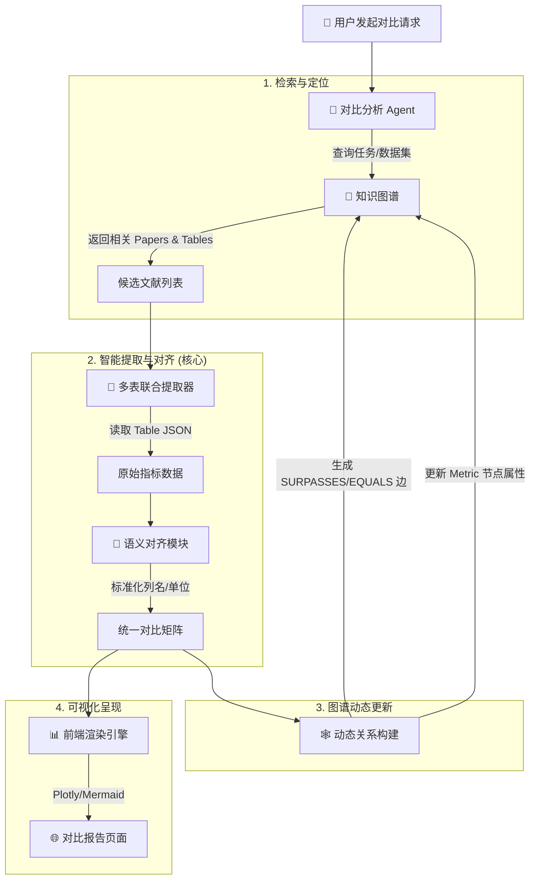

# Schema设计

## 设计方案
设计知识图谱的 **Schema（模式/本体）** 是整个系统的**地基**。Schema 设计得好，后续的自动抽取、关系推理、SOTA 演进分析才能准确；设计得不好，会导致数据杂乱、查询困难，甚至需要推倒重来。

基于我们之前讨论的**文献知识库**场景（特别是 SOTA 演进、结论冲突检测、多模态数据），我为你设计了一套**“核心 + 扩展”**的 Schema 方案，并提供了具体的设计方法论。

---

### 🏗️ 一、核心设计理念：3W + 3C 原则

在设计具体字段前，先确立三个核心原则：
1.  **贴合业务 (Business-Aligned)**：只定义对“科研分析”有用的实体和关系。例如，不需要记录“出版社地址”，但必须记录“发表年份”和“数据集”。
2.  **支持演进 (Evolution-Ready)**：必须能表达“时间”和“版本”概念，以支持 SOTA 更替分析。
3.  **机器可读 (Machine-Readable)**：属性类型要明确（数字、字符串、布尔值），方便后续做统计和过滤。

---

### 📐 二、推荐 Schema 设计方案 (V1.0)

这套 Schema 专为**学术文献分析与 SOTA 追踪**定制。

#### 1. 实体类型 (Entity Types / Nodes)

| 实体类型 | 英文标识 | 核心属性 (Properties) | 描述与用途 |
| :--- | :--- | :--- | :--- |
| **文献** | `Paper` | `title`, `year`, `doi`, `venue`, `pdf_url`, `abstract`, `status` (active/deprecated), `sota_metrics` (JSON) | 核心节点。`status` 用于标记是否被推翻；`sota_metrics` 存储关键指标以便对比。 |
| **作者** | `Author` | `name`, `affiliation`, `orcid_id` | 用于分析作者合作网络、大牛动向。 |
| **研究任务/领域** | `Task` | `name` (e.g., "Image Classification"), `dataset_scope` | 用于归类。SOTA 通常是针对特定 Task 的。 |
| **数据集** | `Dataset` | `name`, `domain`, `url` | 很多 SOTA 是基于特定数据集的，需独立实体以便关联。 |
| **评价指标** | `Metric` | `name` (e.g., "Accuracy", "F1-Score"), `direction` (higher_is_better) | 用于量化比较。 |
| **技术方法** | `Method` | `name` (e.g., "Transformer", "LoRA"), `category` | 用于分析技术路线演进。 |
| **机构/组织** | `Organization` | `name`, `type` (University/Company) | 归属分析。 |

#### 2. 关系类型 (Relationship Types / Edges)

这是图谱的**灵魂**，决定了能否做深度推理。

| 关系类型 | 英文标识 | 方向 | 属性 (Properties) | 业务含义 |
| :--- | :--- | :--- | :--- | :--- |
| **撰写** | `WRITTEN_BY` | Paper → Author | `order` (第几作者) | 基础关系。 |
| **发表于** | `PUBLISHED_IN` | Paper → Venue/Org | `year`, `volume` | 来源追踪。 |
| **引用** | `CITES` | Paper → Paper | `context_snippet` (引用语境), `count` (文中提及次数) | 基础学术网络。 |
| **提出方法** | `PROPOSES_METHOD` | Paper → Method | - | 技术归因。 |
| **使用数据集** | `USES_DATASET` | Paper → Dataset | `split` (train/test) | 实验环境关联。 |
| **评测指标** | `ACHIEVES_METRIC` | Paper → Metric | `value` (数值), `dataset` (关联哪个数据集) | **关键！**用于 SOTA 对比。 |
| **超越/改进** | `SURPASSES` | Paper → Paper | `metric_name`, `improvement_delta`, `dataset` | **核心！**表示 A 在某指标上优于 B，用于构建演进链。 |
| **反驳/争议** | `REFUTES` | Paper → Paper | `reason` (反驳点), `confidence` | **核心！**表示 A 推翻了 B 的结论，用于预警。 |
| **属于领域** | `BELONGS_TO` | Paper/Method → Task | - | 分类导航。 |

---

### 🛠️ 三、Schema 设计的实战步骤 (5 步法)

不要试图一次性完美，采用**迭代式**设计。

#### 第一步：业务场景反推 (Backward Design)
问自己：**“我要回答什么问题？”**
*   *问题*：“过去 3 年 ImageNet 分类的 SOTA 是谁？”
    *   *需求*：需要 `Paper` 节点，关联 `Task` (ImageNet)，关联 `Metric` (Accuracy)，且有时间属性 `year`。
    *   *推导*：必须有 `ACHIEVES_METRIC` 关系，且该关系需携带 `value` 和 `dataset` 属性。
*   *问题*：“哪篇论文推翻了 ResNet 的某个结论？”
    *   *需求*：需要表达否定关系。
    *   *推导*：必须设计 `REFUTES` 关系，而不能只用 `CITES`。

#### 第二步：利用 LLM 辅助生成草稿
将你的业务文档（如几篇典型的论文摘要、你希望提取的字段列表）发给 LLM，让它生成 Schema 草稿。

> **Prompt 示例**：
> “我要构建一个计算机视觉领域的知识图谱。请根据以下样本数据，设计一个 Neo4j 或 RDF 风格的 Schema。
> 样本：'2024 年，Model X 在 ImageNet 上达到了 89% 准确率，超越了 2023 年的 Model Y (87%)，但被 2025 年的 Z 论文指出存在数据泄露问题。'
> 请列出实体类型、属性及关系类型，特别注意如何表达‘超越’和‘反驳’关系。”

#### 第三步：定义属性约束 (Constraints)
确保数据质量，避免脏数据。
*   **类型约束**：`year` 必须是整数，`doi` 必须是字符串且唯一。
*   **必填项**：`Paper` 必须有 `title` 和 `year`。
*   **枚举值**：`status` 只能是 `['active', 'deprecated', 'retracted']`。

#### 第四步：可视化建模 (Visual Modeling)
使用工具画出草图，确认逻辑通顺。
*   **工具推荐**：
    *   **Draw.io / Excalidraw**：快速手绘。
    *   **Neo4j Bloom / Arrows.app**：专业的图谱建模工具。
    *   **gBuilder (如果你用 gStore)**：可视化拖拽设计。

#### 第五步：小样本验证 (Pilot Test)
*   手动标注 5-10 篇论文，按照设计的 Schema 填入数据。
*   尝试写几个 Cypher 查询语句（或等效查询），看是否能查出想要的结果。
*   *如果发现查不出"SOTA 演进链”* -> 回到第二步，增加 `SURPASSES` 关系或调整属性。

---

### 💡 四、针对你系统的特殊设计建议

#### 1. 处理“动态 SOTA”的 Schema 技巧
SOTA 是相对的。不要在 `Paper` 节点上直接写 `is_sota: true`（因为明天可能就变了）。
*   **正确做法**：创建一个虚拟节点或属性组 `SOTA_Record`。
    *   结构：`(Task)-[HAS_RECORD]->(SOTA_Record {year: 2024, metric: 0.89})<-[HOLDS_RECORD]-(Paper)`
    *   或者直接在 `SURPASSES` 关系中记录：`(PaperA)-[SURPASSES {metric: 'Acc', val: 0.9, on_dataset: 'ImageNet'}]->(PaperB)`
    *   **查询时**：动态计算“当前最大值”，而不是静态存储标签。

#### 2. 处理“结论冲突”的 Schema 技巧
*   在 `REFUTES` 关系上增加 `evidence_snippet` 属性，存储原文中反驳的那句话。
*   在 `Paper` 节点增加 `controversy_level` (0-10) 属性，由 Agent 根据被反驳的次数自动计算更新。

#### 3. 兼容非结构化数据的 Schema
*   为 `Paper` 节点保留一个 `raw_text_summary` 或 `key_claims` (List) 属性，存储 LLM 提取的关键论点列表。这样即使图谱关系还没建全，也能通过文本搜索找到内容。

---

### 📝 五、Schema 代码示例 (Neo4j Cypher 风格)

```cypher
// 1. 创建约束 (确保数据唯一性和类型)
CREATE CONSTRAINT paper_doi IF NOT EXISTS FOR (p:Paper) REQUIRE p.doi IS UNIQUE;
CREATE CONSTRAINT author_orcid IF NOT EXISTS FOR (a:Author) REQUIRE a.orcid_id IS UNIQUE;

// 2. 插入示例数据 (展示 Schema 结构)
MERGE (p1:Paper {doi: "10.1000/paper1", title: "Deep Residual Learning", year: 2015, status: "active"})
MERGE (p2:Paper {doi: "10.1000/paper2", title: "EfficientNet-B7", year: 2019, status: "active"})
MERGE (t:Task {name: "Image Classification"})
MERGE (d:Dataset {name: "ImageNet"})
MERGE (m:Metric {name: "Top-1 Accuracy", direction: "higher"})

// 建立基础关系
MERGE (p1)-[:BELONGS_TO]->(t)
MERGE (p1)-[:USES_DATASET]->(d)
MERGE (p1)-[:ACHIEVES_METRIC {value: 0.76, dataset: "ImageNet"}]->(m)

MERGE (p2)-[:BELONGS_TO]->(t)
MERGE (p2)-[:USES_DATASET]->(d)
MERGE (p2)-[:ACHIEVES_METRIC {value: 0.844, dataset: "ImageNet"}]->(m)

// 建立核心的 SOTA 演进关系 (关键！)
// 表示 p2 在 ImageNet 的 Accuracy 指标上超越了 p1
MERGE (p2)-[:SURPASSES {
    metric: "Top-1 Accuracy", 
    value_delta: 0.084, 
    dataset: "ImageNet", 
    claim: "Our model outperforms ResNet by 8.4%"
}]->(p1)
```

### 六、总结与建议

1.  **起步要轻**：先只定义 `Paper`, `Author`, `CITES`, `YEAR` 这几个最核心的，跑通流程。
2.  **逐步加粗**：然后加入 `SURPASSES` 和 `Metric` 属性，实现 SOTA 分析。
3.  **最后加细**：再加入 `REFUTES`, `Method`, `Dataset` 等复杂关系，实现深度推理。
4.  **版本管理**：Schema 也是代码。将你的 Schema 定义文件（如 JSON Schema 或 Cypher 脚本）放入 Git 版本控制，每次修改都要有记录。

这个 Schema 设计能够完美支撑你之前提到的**“自动抓取”、“防过时”、"SOTA 演进分析”**和**"Agentic RAG"**需求。你可以直接拿着这个列表去配置你的图数据库或 OpenClaw 的提取技能了。


## Evidence-Level Schema

这是一个非常关键的架构升级点。原有的 Schema 主要关注**文本实体**（Paper, Method, Metric），而引入**图表（Charts）、表格（Tables）和架构图（Diagrams）**后，我们需要将 Schema 从“文档级”细化到“证据级（Evidence-Level）”。

核心改进思路是：**将“图表/表格”本身提升为图谱中的独立实体或关键属性载体**，而不仅仅是论文的附属品。这样，SOTA 数据就有了精确的“坐标”，架构图就成了方法内部逻辑的显式表达。

---

### 🏗️ 一、Schema 改进方案：支持多模态证据

我们需要在原有 Schema 基础上，新增 **3 类核心节点** 和 **2 类关键关系**，并丰富属性定义。

#### 1. 新增实体类型 (New Entity Types)

| 实体类型 | 英文标识 | 核心属性 (Properties) | 描述与用途 |
| :--- | :--- | :--- | :--- |
| **图表/可视化** | `Visualization` | `type` (Line/Bar/Heatmap), `caption`, `page_num`, `image_url`, `bbox` (坐标), `data_json` (提取的结构化数据), `confidence` | **核心新增**。代表论文中的每一个 Figure。存储提取出的具体数值序列。 |
| **表格** | `Table` | `caption`, `page_num`, `html_repr`, `data_json` (二维数组), `has_sota` (布尔值) | 代表论文中的 Table。存储高精度提取的对比数据。 |
| **模型组件/模块** | `Module` | `name` (e.g., "Attention Head", "Encoder"), `function`, `input_type`, `output_type` | 从**架构图**中提取。用于描述方法的内部结构，支持细粒度推理。 |

#### 2. 新增/优化关系类型 (New/Optimized Relationships)

| 关系类型 | 方向 | 属性 (Properties) | 业务含义 |
| :--- | :--- | :--- | :--- |
| **包含图表** | `Paper` → `Visualization` | `figure_id` (e.g., "Fig 3") | 建立论文与具体图表的关联。 |
| **包含表格** | `Paper` → `Table` | `table_id` (e.g., "Table 2") | 建立论文与具体表格的关联。 |
| **数据源自** | `Achievement` (指标) → `Visualization`/`Table` | `series_name`, `row_idx`, `col_idx` | **关键！** 将具体的指标数值（如 86.0%）直接链接到具体的图表或表格单元格，实现**像素级溯源**。 |
| **由...组成** | `Method` → `Module` | `connection_type`, `order` | 从架构图解析得出，描述方法的内部拓扑结构。 |
| **流向** | `Module` → `Module` | `data_flow_type` | 描述数据在模块间的流动（如 "Residual Connection"）。 |

#### 3. 属性增强 (Property Enrichment)
*   **`Metric` 节点**：新增 `source_evidence` 列表，存储指向 `Visualization` 或 `Table` 的引用 ID。
*   **`Paper` 节点**：新增 `has_architecture_diagram` (bool)，标记是否包含可解析的架构图。

---

### 🚀 二、如何利用三类数据优化知识图谱构建

#### 1. 利用 **表格 (Tables)**：构建高置信度 SOTA 链条
表格是 SOTA 数据的“金矿”，准确率最高。

*   **优化策略**：
    *   **直接填充数值**：不再依赖 LLM 从文本中猜测数值。直接从 `Table` 实体的 `data_json` 中提取 "Ours" 行和 "Baseline" 列的数值，生成 `SURPASSES` 关系。
    *   **自动计算 Delta**：利用代码逻辑（而非 LLM）计算 `Ours - Baseline`，填入关系的 `improvement` 属性，确保数学绝对正确。
    *   **多数据集对齐**：表格通常包含多个 Dataset 列。解析时，为每个 Dataset 生成独立的 `ACHIEVES_METRIC` 关系，避免混淆。

*   **图谱查询示例**：
    > “找出所有在 ImageNet 上 Accuracy > 85% 的方法，并列出其来源表格。”
    > `MATCH (m:Method)-[:ACHIEVES_METRIC {dataset:'ImageNet', value:>0.85}]->(met)<-[:DATA_FROM]-(t:Table) RETURN m, t`

#### 2. 利用 **图表 (Charts/Figures)**：捕捉趋势与隐性结论
折线图、柱状图展示了文本中未明确写出的趋势（如收敛速度、鲁棒性变化）。

*   **优化策略**：
    *   **提取时间/迭代序列**：从折线图（X 轴为 Epochs/Steps）提取序列数据，构建 `TrainingCurve` 子图。
    *   **发现隐性 SOTA**：有些论文正文只说“表现良好”，但图中显示明显超越基线。通过解析图表曲线高度，自动补充缺失的 `SURPASSES` 关系。
    *   **多维度对比**：热力图（Heatmap）常展示不同超参数下的性能。解析后可生成带参数的 `ACHIEVES_METRIC` 关系（如 `params: {lr: 0.001, batch: 32}`），支持更细粒度的检索。

*   **数据结构示例**：
    ```json
    // Visualization 节点的 data_json 属性
    {
      "type": "line_chart",
      "x_axis": "Epochs",
      "y_axis": "Accuracy",
      "series": [
        {"name": "Ours", "points": [[1, 0.5], [10, 0.85], [50, 0.92]]},
        {"name": "ResNet", "points": [[1, 0.4], [10, 0.70], [50, 0.76]]}
      ]
    }
    ```

#### 3. 利用 **架构图 (Architecture Diagrams)**：深化方法理解
架构图揭示了方法的“黑盒”内部，支持**结构性推理**。

*   **优化策略**：
    *   **方法拆解**：将 `Method` 节点拆解为多个 `Module` 节点（如 "ViT" -> ["Patch Embedding", "Transformer Encoder", "MLP Head"]）。
    *   **技术路线归类**：如果多篇论文都包含 "Multi-Head Attention" 模块，可以自动将它们聚类为 "Attention-Based Methods"。
    *   **创新点定位**：对比两篇论文的架构子图。如果 A 比 B 多了一个 "Gating Mechanism" 模块，自动推断 A 的创新点在于该模块，并生成 `INNOVATES_WITH` 关系。

*   **推理场景**：
    > “哪些使用了 'Swish' 激活函数的模型在 CIFAR-10 上表现最好？”
    > 以前无法回答（因为激活函数通常只在架构图里画出来，正文不提）。
    > 现在：`MATCH (m:Method)-[:CONTAINS_MODULE {name:'Swish'}]->()...`

---

### 🛠️ 三、实施流程：从解析到入库

#### Step 1: 多模态解析与结构化
*   **输入**：PDF Page。
*   **动作**：
    *   调用 `Camelot` 提取表格 -> 生成 `Table` 对象 (HTML + JSON)。
    *   调用 `MLLM` (GPT-4o/Qwen-VL) 解析图表 -> 生成 `Visualization` 对象 (Series Data + Conclusion)。
    *   调用 `MLLM` 解析架构图 -> 生成 `Module` 列表及连接关系。

#### Step 2: 实体对齐与融合
*   **表格/图表 -> 指标**：
    *   遍历 `Table.data_json`，识别 "Ours" 行。
    *   创建 `(Method)-[:ACHIEVES_METRIC {value: x, source_table: 'Table 2'}]->(Metric)`。
*   **架构图 -> 方法**：
    *   将识别出的 `Module` 链接到当前论文提出的 `Method`。
    *   全局去重：将 "Self-Attention" (Paper A) 与 "Self-Attention" (Paper B) 对齐为同一个 `Module` 实体。

#### Step 3: 写入图谱 (Cypher 示例)

```cypher
// 1. 创建表格节点
MERGE (t:Table {paper_doi: $doi, table_id: 'Table 2'})
SET t.caption = $caption, t.data_json = $json_data

// 2. 创建基于表格数据的 SOTA 关系
// 假设从 JSON 中解析出 Ours=0.92, Baseline=0.88
MERGE (m_ours:Method {name: 'MyModel'})
MERGE (m_base:Method {name: 'ResNet'})
MERGE (met:Metric {name: 'Accuracy', dataset: 'ImageNet'})

// 关键：建立带来源的关系
MERGE (m_ours)-[rel:ACHIEVES_METRIC {value: 0.92, source_type: 'Table', source_id: t.element_id}]->(met)
MERGE (m_base)-[:ACHIEVES_METRIC {value: 0.88, source_type: 'Table', source_id: t.element_id}]->(met)

// 3. 创建架构图衍生的模块关系
MERGE (mod:Module {name: 'Gating Unit'})
MERGE (m_ours)-[:CONTAINS_MODULE]->(mod)
```

---

### 💡 四、带来的核心价值

1.  **可信度质变**：
    *   以前：LLM 说"A 比 B 好”，用户半信半疑。
    *   现在：系统展示"A 比 B 好 (**数据来源：Table 2, Row 3, Col 4**)"，并直接高亮原表。用户信任度满分。

2.  **查询维度扩展**：
    *   支持"**基于趋势**"的查询：“找出所有收敛速度比 Transformer 快的模型”（需解析折线图斜率）。
    *   支持"**基于结构**"的查询：“找出所有包含 'Mixture of Experts' 模块的大语言模型”（需解析架构图）。

3.  **自动化程度提升**：
    *   减少了人工校验数值的工作量。表格解析工具的准确率远高于 LLM 纯文本提取。
    *   能够自动发现正文中未提及但在图表中隐含的对比结论。

4.  **MkDocs 展示增强**：
    *   在生成的 Markdown 中，不仅插入静态图片，还可以嵌入**交互式图表**（使用 Plotly/ECharts 重绘提取出的 JSON 数据），让用户能缩放、查看具体数据点。
    *   架构图可渲染为可点击的 SVG，点击模块显示详细说明。

### 总结
通过将 **Table/Chart/Diagram** 提升为 Schema 中的一等公民，你的知识图谱将从**“文献索引库”**进化为**“结构化科研数据库”**。这不仅解决了数据准确性问题，更开启了基于**数据趋势**和**模型结构**的深度推理能力。


# PDF解析和提取

## 结构化数据提取为结构化图谱

从 PDF 中提取结构化数据并填充知识图谱，是整个系统中最具挑战性但也最核心的环节。这不仅仅是 OCR 文字识别，而是**“文档理解 (Document Understanding) + 信息抽取 (Information Extraction) + 实体对齐 (Entity Resolution)"**的复杂流水线。

基于 OpenClaw 架构，我为你设计了一套**“三层漏斗式”提取策略**，确保从非结构化 PDF 到结构化图谱的高精度转化。

---

### 🏗️ 整体流程架构：三层漏斗

1.  **L1 基础解析层 (Layout & Text)**：还原版面，提取纯文本、表格、公式。
2.  **L2 语义抽取层 (IE & NER)**：利用 LLM 从文本中提取实体、关系、指标（核心步骤）。
3.  **L3 图谱融合层 (Alignment & Merge)**：实体消歧、关系验证、写入图数据库。

---

### 🛠️ 第一步：L1 基础解析 (PDF -> Structured Markdown/JSON)

不要直接把 PDF 扔给 LLM 去猜结构。必须先使用专用工具还原版面。

#### 推荐工具链
*   **通用解析**：`PDF-Extract-Kit` (支持公式、表格、多栏)、`Marker`、`Nougat` (适合论文)。
*   **表格专项**：`Camelot` 或 `Table Transformer`。
*   **输出格式**：带有 Markdown 标签和坐标信息的中间格式。

#### OpenClaw 技能配置示例
```json
{
  "skill": "pdf-structural-parser",
  "input": "raw_paper.pdf",
  "output": "structured_content.json",
  "steps": [
    {
      "tool": "pdf_extract_kit",
      "config": {
        "extract_formulas": true,
        "extract_tables": true,
        "layout_analysis": true
      }
    },
    {
      "action": "convert_to_markdown_with_tags",
      "description": "将解析结果转换为带特殊标签的 Markdown，如 <table>...</table>, <formula>...</formula>"
    }
  ]
}
```

**关键点**：必须保留**表格的结构化数据**（SOTA 指标通常在这里）和**参考文献列表**（用于构建引用关系）。

---

### 🧠 第二步：L2 语义抽取 (Text -> Graph Triples)

这是核心大脑。利用 LLM 强大的理解能力，从结构化文本中提取三元组。

#### 1. 设计专用的 Extraction Prompt
不要试图一次性提取所有东西。建议**分任务提取**或**分块提取**。

**Prompt 模板示例 (针对 SOTA 和关系)：**

```markdown
# Role
你是一个专业的学术知识图谱构建专家。你的任务是从以下论文片段中提取结构化信息，填充到预定义的 Schema 中。

# Input Context
(此处插入 L1 层解析出的 Title, Abstract, Introduction, Experiments, Conclusion 部分的文本)
(特别注意：如果包含表格数据，请重点分析表格中的数值对比)

# Schema Definition
- Entities: Paper, Author, Method, Dataset, Metric
- Relations: WRITTEN_BY, PROPOSES_METHOD, USES_DATASET, ACHIEVES_METRIC, SURPASSES, CITES, REFUTES

# Extraction Rules
1. **实体识别**：提取所有出现的方法名、数据集名、指标名。
2. **SOTA 关系提取**：
   - 寻找类似 "outperforms", "surpasses", "better than", "state-of-the-art" 的语句。
   - 提取格式：(Current_Paper) -[SURPASSES {metric: 'Accuracy', value: 0.95, baseline: 'Previous_Paper'}]-> (Baseline_Paper)
   - **注意**：如果文中提到 "Table 1 shows our method achieves 90% vs Baseline's 88%"，即使没有明确文字说 surpass，也要提取 SURPASSES 关系。
3. **冲突检测**：
   - 寻找 "however", "contrary to", "fails to" 等转折词。
   - 提取格式：(Current_Paper) -[REFUTES {reason: '...'}]-> (Target_Paper)
4. **引用提取**：
   - 从参考文献列表提取标准 DOI 或标题，建立 CITES 关系。

# Output Format (Strict JSON)
{
  "entities": [
    {"id": "paper_1", "type": "Paper", "props": {"title": "...", "year": 2024}},
    {"id": "method_1", "type": "Method", "props": {"name": "LoRA"}}
  ],
  "relations": [
    {"source": "paper_1", "target": "method_1", "type": "PROPOSES_METHOD"},
    {"source": "paper_1", "target": "paper_old", "type": "SURPASSES", "props": {"metric": "BLEU", "delta": "+2.5"}}
  ]
}

# Constraints
- 如果不确定，不要编造。
- 方法名和数据集名尽量使用全称。
- 数值必须精确。
```

#### 2. 分块处理策略 (Chunking Strategy)
论文太长，LLM 上下文有限且容易遗漏。
*   **摘要/引言块**：提取主要贡献、提出的方法、核心结论。
*   **实验/表格块**：**最关键！** 专门提取性能对比数据 (`ACHIEVES_METRIC`, `SURPASSES`)。可以将表格转为 CSV 文本喂给 LLM。
*   **相关工作块**：提取与其他论文的对比关系 (`REFUTES`, `SIMILAR_TO`)。
*   **参考文献块**：提取标准的 `CITES` 关系列表。

#### 3. OpenClaw 自动化脚本逻辑
```python
def extract_graph_data(pdf_path):
    # 1. 解析
    structured_text = run_tool("pdf_parser", pdf_path)
    
    # 2. 分块
    sections = split_by_section(structured_text) # intro, methods, experiments, refs
    
    # 3. 并行提取
    triples = []
    for section in sections:
        if section.type == "experiments":
            # 针对实验部分使用强调数值的 Prompt
            result = llm.extract(section.content, prompt_template="sota_extractor")
        elif section.type == "references":
            # 针对参考文献使用列表提取 Prompt
            result = llm.extract(section.content, prompt_template="citation_extractor")
        else:
            result = llm.extract(section.content, prompt_template="general_extractor")
        
        triples.extend(result.json()['relations'])
        
    # 4. 后处理：清洗与标准化
    cleaned_triples = normalize_entities(triples) 
    
    return cleaned_triples
```

---

### 🔗 第三步：L3 图谱融合 (Triples -> Graph DB)

提取出的原始三元组往往存在**别名问题**（如 "BERT" 和 "Bidirectional Encoder Representations from Transformers"）和**指代不明**（如 "the previous work"）。

#### 1. 实体对齐 (Entity Resolution)
*   **规范化**：将所有方法名、数据集名映射到标准 ID。
    *   *策略*：维护一个“标准术语表” (Synonym Dictionary)。LLM 在提取时直接输出标准名，或者在后处理阶段通过向量相似度匹配到库中已存在的实体。
*   **DOI 解析**：对于引用的论文，尝试通过标题搜索 DOI，确保指向唯一的 `Paper` 节点。

#### 2. 关系验证与合并
*   **去重**：如果多篇论文都提到 "A surpasses B"，合并这些边，增加 `confidence` 权重。
*   **冲突解决**：如果一篇说 "A > B"，另一篇说 "B > A"，保留两条边，但标记 `conflict: true`，供后续人工或 Agent 研判。

#### 3. 写入图数据库 (Cypher 示例)
```cypher
UNWIND $triples AS triple
MERGE (s:Node {id: triple.source})
MERGE (t:Node {id: triple.target})
// 动态创建关系类型
CALL apoc.create.relationship(s, triple.type, triple.props, t) YIELD rel
RETURN count(rel)
```

---

### 💡 关键难点与解决方案

#### 难点 1：表格中的 SOTA 数据提取
表格是 SOTA 数据的金矿，但结构复杂。
*   **解法**：
    1.  使用 `Table Transformer` 将表格转为 HTML/Markdown。
    2.  Prompt 专门针对表格设计：“分析以下表格，找出当前论文（通常标记为 Ours/Our Method）所在的行，以及它对比的 Baseline 列。提取每一列指标的名称、Ours 的值、Best Baseline 的值及其对应的论文名称。”

#### 难点 2：指代消解 (Coreference Resolution)
文中常说 "Unlike [12], our method..."。
*   **解法**：
    1.  先提取参考文献列表，建立 `[12]` -> `Paper_X` 的映射。
    2.  在提取关系前，先用一个小模型或 LLM 做一步“指代替换”，将文中的 "[12]", "the former", "ResNet" 统一替换为具体的论文 ID 或方法 ID。

#### 难点 3：幻觉控制
LLM 可能会编造不存在的指标或关系。
*   **解法**：
    1.  **引用溯源**：要求 LLM 在输出三元组时，必须附带原文的 `quote` (原句片段)。
    2.  **置信度评分**：让 LLM 输出 `confidence_score` (0-1)。低于 0.7 的关系存入“待审核队列”，不直接入库。
    3.  **交叉验证**：如果摘要里没提，但在实验表格里发现了数据，以表格为准。

---

### 🚀 实施路线图

1.  **Week 1: 构建解析管道**
    *   集成 `PDF-Extract-Kit`，实现 PDF 到带标签 Markdown 的稳定转换。
    *   重点测试表格和公式的还原率。

2.  **Week 2: 开发提取 Prompt**
    *   选取 10 篇典型论文（含丰富表格和对比）。
    *   手工标注“黄金标准”三元组。
    *   迭代 Prompt，直到 LLM 提取结果与黄金标准重合度 > 85%。

3.  **Week 3: 实现实体对齐与入库**
    *   编写 Python 脚本处理 LLM 输出的 JSON。
    *   实现简单的同义词匹配逻辑。
    *   对接 Neo4j/图数据库，完成写入。

4.  **Week 4: 闭环验证**
    *   运行全量测试。
    *   在可视化界面检查：SOTA 链条是否连贯？是否有断头路？错误关系多不多？
    *   加入“人工修正反馈”功能，将修正后的数据反哺给 LLM (Few-Shot Learning)。

### 总结
从 PDF 到图谱不是“一键生成”，而是一个**“解析 -> 抽取 -> 对齐 -> 验证”**的精细化工程。
*   **解析**靠专用模型 (OCR/Layout)。
*   **抽取**靠精心设计的 LLM Prompt (分块、分任务)。
*   **对齐**靠规则与向量检索。
*   **验证**靠溯源引用和人工反馈。

只要打通了这个流程，你的知识库就能自动从海量 PDF 中“提炼”出高纯度的知识晶体，而不仅仅是存储一堆文件。

## openclaw的实施

这是一个非常落地的技术实现问题。我们将这三个核心环节拆解为具体的代码逻辑和 Prompt 设计，确保你可以直接在 OpenClaw 或 Python 脚本中实施。

---

### 第一部分：PDF 解析后的智能分块策略 (Smart Chunking)

**痛点**：简单的按字符数切分会切断句子、表格和逻辑段落，导致 LLM 无法理解上下文。
**策略**：采用 **“结构感知 + 语义滑动”** 的分块法。

#### 1. 分块逻辑设计
1.  **一级切割（结构层）**：利用 PDF 解析器（如 `PDF-Extract-Kit` 或 `Marker`）输出的版面信息，先按 **章节标题 (Section Headers)** 切割。保证每个块都在同一个主题下。
2.  **二级切割（语义层）**：如果某个章节（如 "Experiments"）太长，再按 **段落** 或 **句子** 切割。
3.  **重叠窗口（Overlap）**：在块与块之间保留 10%-15% 的重叠内容，防止关键信息（如指标对比）被切在边界上。
4.  **特殊处理**：
    *   **表格**：单独作为一个块，不拆分，并在前后附加该表格所在的章节标题作为上下文。
    *   **公式**：保留 LaTeX 源码，不截断。

#### 2. Python 实现示例 (基于 LangChain 风格)

```python
from typing import List, Dict

class SemanticChunker:
    def __init__(self, chunk_size=1000, overlap=150):
        self.chunk_size = chunk_size
        self.overlap = overlap

    def chunk_by_structure(self, parsed_data: Dict) -> List[Dict]:
        """
        parsed_data: PDF 解析后的结构化数据，包含 sections, tables, text
        """
        chunks = []
        chunk_id = 0
        
        # 1. 遍历章节
        for section in parsed_data['sections']:
            title = section['title']
            content = section['text']
            
            # 2. 如果章节过长，进行二次切分 (按段落)
            paragraphs = content.split('\n\n')
            current_chunk_text = ""
            
            for para in paragraphs:
                if len(current_chunk_text) + len(para) > self.chunk_size:
                    # 保存当前块
                    if current_chunk_text:
                        chunks.append({
                            "id": f"chunk_{chunk_id}",
                            "section_title": title,
                            "content": current_chunk_text,
                            "type": "text"
                        })
                        chunk_id += 1
                    
                    # 开启新块，保留重叠部分 (取末尾 overlap 长度)
                    current_chunk_text = current_chunk_text[-self.overlap:] + "\n\n" + para
                else:
                    current_chunk_text += "\n\n" + para
            
            # 保存剩余部分
            if current_chunk_text:
                chunks.append({
                    "id": f"chunk_{chunk_id}",
                    "section_title": title,
                    "content": current_chunk_text,
                    "type": "text"
                })
                chunk_id += 1

        # 3. 单独处理表格 (保持完整，不分块)
        for table in parsed_data['tables']:
            chunks.append({
                "id": f"table_{table['id']}",
                "section_title": table['parent_section'],
                "content": f"[TABLE START]\n{table['markdown_repr']}\n[TABLE END]",
                "type": "table",
                "metadata": table['metadata'] # 包含页码、坐标等
            })
            
        return chunks

# 使用示例
# chunks = SemanticChunker().chunk_by_structure(parsed_pdf_data)
```

---

### 第二部分：实体对齐的同义词匹配设计 (Entity Resolution)

**痛点**：LLM 可能提取出 "ResNet-50", "ResNet50", "He et al.'s model" 指代同一个实体。
**策略**：构建 **“标准术语库 + 向量相似度 + LLM 裁决”** 的三级过滤机制。

#### 1. 数据结构设计
维护一个全局的 `entity_registry.json`：
```json
{
  "standard_name": "ResNet-50",
  "aliases": ["ResNet50", "ResNet-50", "Deep Residual Network (50 layers)", "He et al. 2015 model"],
  "entity_type": "Method",
  "wiki_url": "..."
}
```

#### 2. 对齐流程算法

1.  **预处理归一化**：
    *   转小写、去除多余空格、统一连字符 (`ResNet 50` -> `resnet-50`)。
    *   去除常见后缀 (`model`, `architecture`, `method`)。

2.  **精确/模糊匹配**：
    *   检查是否在 `aliases` 列表中。
    *   使用 `Levenshtein Distance` (编辑距离) 匹配相似度 > 0.9 的词。

3.  **向量语义匹配 (Vector Search)**：
    *   将提取出的实体名向量化。
    *   在 `entity_registry` 的向量索引中搜索 Top-3 相似的标准名。
    *   如果相似度 > 阈值 (如 0.85)，视为候选。

4.  **LLM 最终裁决 (Disambiguation)**：
    *   当有多个候选或置信度不高时，调用 LLM 确认。

#### 3. LLM 裁决 Prompt 示例

```markdown
# Task
判断提取到的实体名称是否指向知识库中的标准实体。

# Input
- Extracted Name: "He's residual net"
- Context Sentence: "We compare our method with He's residual net on ImageNet."
- Candidate Standard Entities: 
  1. "ResNet-50" (Aliases: ResNet50, Deep Residual Network)
  2. "ResNet-101" (Aliases: ResNet101)
  3. "BERT" (Aliases: Bidirectional Encoder Representations from Transformers)

# Instruction
分析上下文，判断 "He's residual net" 最可能指代哪一个标准实体？
如果都不匹配，返回 null。
请输出 JSON: {"matched_standard_name": "...", "confidence": 0.0-1.0, "reason": "..."}
```

#### 4. 代码逻辑片段

```python
def align_entity(extracted_name, context, registry_vector_index):
    # 1. 归一化
    norm_name = normalize(extracted_name)
    
    # 2. 向量检索
    candidates = registry_vector_index.search(norm_name, top_k=3)
    
    if not candidates:
        return extracted_name # 无匹配，保留原名（或标记为新实体）
    
    # 3. 高置信度直接匹配
    if candidates[0].score > 0.95:
        return candidates[0].standard_name
    
    # 4. 低置信度调用 LLM 裁决
    llm_response = call_llm(prompt_build(extracted_name, context, candidates))
    if llm_response.confidence > 0.8:
        return llm_response.matched_standard_name
    
    return extracted_name # 无法确定，保留原名待人工审核
```

---

### 第三部分：让 LLM 输出带引用来源的三元组

**痛点**：LLM 容易产生幻觉，编造关系。
**策略**：强制要求 **"Evidence-Based Extraction"** (基于证据的抽取)，即每个三元组必须绑定原文片段。

#### 1. Prompt 设计核心技巧
*   **思维链 (CoT)**：先让 LLM 列出相关原句，再提取三元组。
*   **严格 JSON 格式**：定义 `evidence_quote` 和 `page_number` 字段。
*   **负样本约束**：明确告诉 LLM“如果没有原文支持，不要提取”。

#### 2. 增强版 Extraction Prompt

```markdown
# Role
你是一个严谨的知识图谱抽取器。你的任务是从给定的文本块中提取三元组 (Subject, Predicate, Object)。

# Critical Constraints
1. **必须有据可查**：每一个提取出的三元组，必须在原文中找到对应的句子作为证据。
2. **禁止幻觉**：如果文中没有明确提到关系，绝对不要臆造。
3. **引用格式**：必须摘录原文原句作为 `evidence_quote`，并标注所在的 `section`。

# Input Text
"""
{chunk_content}
(Section: {section_title})
"""

# Output Schema (JSON List)
[
  {
    "subject": "标准化后的实体名",
    "predicate": "关系类型 (如 SURPASSES, CITES, PROPOSES)",
    "object": "标准化后的实体名",
    "properties": {
      "metric": "指标名 (如有)",
      "value": "数值 (如有)"
    },
    "evidence": {
      "quote": "原文中支持该关系的完整句子",
      "section": "所属章节",
      "confidence": 0.0-1.0 (你对该抽取的确信程度)
    }
  }
]

# Example
Input: "Our model achieves 92% accuracy, surpassing the previous SOTA BERT (90%) on GLUE benchmark."
Output:
[
  {
    "subject": "Our_Model_Name", 
    "predicate": "SURPASSES", 
    "object": "BERT",
    "properties": {"metric": "Accuracy", "value": "0.92", "baseline_value": "0.90"},
    "evidence": {
      "quote": "Our model achieves 92% accuracy, surpassing the previous SOTA BERT (90%) on GLUE benchmark.",
      "section": "Experiments",
      "confidence": 0.98
    }
  }
]

# Start Extraction
```

#### 3. 后处理与验证脚本

```python
def process_llm_output(llm_json_list, original_chunk_text):
    validated_triples = []
    
    for item in llm_json_list:
        # 1. 验证引用是否存在
        quote = item['evidence']['quote']
        if quote not in original_chunk_text:
            print(f"Warning: Evidence quote not found in text! Skipping triple: {item}")
            continue
            
        # 2. 验证置信度
        if item['evidence']['confidence'] < 0.7:
            print(f"Low confidence triple queued for review: {item}")
            # 可以存入待审核列表，不直接入库
            continue
            
        # 3. 实体对齐 (调用前面的函数)
        item['subject'] = align_entity(item['subject'], quote, registry)
        item['object'] = align_entity(item['object'], quote, registry)
        
        validated_triples.append(item)
        
    return validated_triples
```

---

### 🚀 整合工作流总结

将这三部分串联起来，就是你的 **PDF 到图谱自动化流水线**：

1.  **输入**：`paper.pdf`
2.  **Step 1 (分块)**：`SemanticChunker` 将 PDF 转为带有 `section_title` 和 `overlap` 的文本块列表。
3.  **Step 2 (抽取)**：遍历每个块，调用 **带引用约束的 LLM Prompt**，输出带 `evidence_quote` 的原始三元组 JSON。
4.  **Step 3 (验证)**：脚本检查 `quote` 是否真实存在于原文中，过滤低置信度数据。
5.  **Step 4 (对齐)**：对通过验证的三元组的 Subject/Object 调用 **实体对齐模块**，映射到标准 ID。
6.  **Step 5 (入库)**：将最终清洗好的三元组写入图数据库，同时将 `evidence_quote` 作为关系的属性存储，方便前端展示时高亮原文。

### 💡 额外建议：前端展示时的“溯源”体验
当用户在知识图谱上看到一条边（例如 "Model A -> SURPASSES -> Model B"）时，鼠标悬停应显示：
> **关系**：SURPASSES (Accuracy +2%)
> **来源文献**：Paper X (2024)
> **原文证据**：*"Our model achieves 92% accuracy, surpassing... [点击高亮原文]"*

这种**“所见即所得，所查即有据”**的设计，是建立用户对 AI 生成知识库信任的关键。

# 工作流和Schema集成

## Schema && OpenClaw工作流 && Agent Graph RAG
这是一个非常深刻且关键的问题。你敏锐地发现了**“数据流（Workflow）”**、**“数据模型（Schema）”**和**“应用逻辑（Architecture）”**三者之间必须紧密咬合，系统才能运转。

简单来说，它们的关系是：
*   **Schema 是“蓝图”**：定义了我们要提取什么知识，长什么样。
*   **OpenClaw 工作流是“工厂流水线”**：负责把原材料（PDF）加工成符合蓝图的产品（结构化数据）。
*   **Agentic Graph RAG 是“智能大脑”**：利用工厂生产出来的产品，根据用户需求进行推理和回答。

下面我将通过**数据流向**和**功能映射**两个维度，详细拆解这三者如何无缝衔接。

---

### 🔄 一、宏观关系图：从输入到输出的闭环

```mermaid
graph TD
    subgraph "1. 设计层 (Design)"
        Schema[📐 知识图谱 Schema]
        Style[定义实体/关系/属性]
    end

    subgraph "2. 执行层 (Execution - OpenClaw Workflow)"
        PDF[📄 PDF 输入]
        Parse[🔧 解析与分块]
        Extract[🧠 LLM 提取 (遵循 Schema)]
        Align[🔗 实体对齐]
        Store[(💾 存储：MD + Graph DB)]
    end

    subgraph "3. 应用层 (Application - Agentic Graph RAG)"
        User[👤 用户提问]
        Agent[🤖 Agent 大脑]
        Router{路由决策}
        VecSearch[🔍 向量检索]
        GraphQuery[🕸️ 图谱查询 (Cypher)]
        Synthesize[✍️ 综合生成]
        Answer[✅ 带溯源的回答]
    end

    %% 关系连线
    Schema -->|指导提取字段 | Extract
    Extract -->|产出结构化三元组 | Store
    Store -->|提供数据源 | GraphQuery
    Store -->|提供 Markdown 全文 | VecSearch
    
    User --> Agent
    Agent --> Router
    Router -->|简单事实 | VecSearch
    Router -->|关系/演进/SOTA| GraphQuery
    GraphQuery -->|读取 Schema 定义的关系 | Store
    VecSearch --> Store
    VecSearch & GraphQuery --> Synthesize
    Synthesize --> Answer
```

---

### 🔗 二、深度映射：三者如何具体协作

#### 1. Schema 指导 OpenClaw 的提取 (Design -> Execution)
**Schema 不是事后诸葛亮，而是提取的“考试大纲”。**

*   **Schema 定义**：我们设计了 `Paper`, `Method`, `Metric` 实体，以及 `SURPASSES`, `REFUTES` 关系。
*   **OpenClaw 动作**：
    *   在编写 `pdf-extraction` 技能的 Prompt 时，**直接嵌入 Schema 定义**。
    *   *Prompt 示例*：“请从文本中提取实体，**必须严格匹配以下类型**：`[Paper, Method, Metric]`。如果发现 A 模型比 B 模型好，请建立 `SURPASSES` 关系，并提取 `metric` 和 `value` 属性。”
    *   **结果**：LLM 不会胡乱提取无关信息，输出的是严格符合 Schema 的 JSON，直接可入库。

#### 2. OpenClaw 填充图谱，为 Agentic RAG 提供“弹药” (Execution -> Application)
**没有高质量的工作流，Agentic RAG 就是“无米之炊”。**

*   **OpenClaw 产出**：
    *   **Markdown 文件**：包含全文、表格、Mermaid 图（供向量检索和人类阅读）。
    *   **图数据库节点/边**：包含精确的 `SURPASSES` 关系链（供逻辑推理）。
*   **Agentic RAG 消费**：
    *   当用户问"LLM 的 SOTA 演进路径？”时，Agent 不需要去读几百篇 PDF 全文。
    *   它直接调用工具 `query_graph("MATCH (p)-[:SURPASSES*]->(q) ...")`。
    *   **关键点**：因为 OpenClaw 已经把复杂的“超越关系”预计算并存入图中了，Agent 的查询瞬间完成，且逻辑严密。

#### 3. Agentic RAG 反向验证与优化工作流 (Application -> Execution)
**用户的反馈可以驱动工作流的迭代。**

*   **场景**：用户问"A 是否反驳了 B？”，Agent 查图谱发现没有 `REFUTES` 关系，但在 Markdown 全文中搜到了相关语义。
*   **反馈循环**：
    *   Agent 记录这个“漏网之鱼”。
    *   触发 OpenClaw 的**“增量修正技能”**：重新针对这两篇论文运行提取 Prompt，专门寻找 `REFUTES` 证据。
    *   如果确认存在，更新图谱 Schema 中的数据。

---

### 🛠️ 三、具体场景串联演示

假设用户提问：**“过去三年图像分类领域的 SOTA 是如何演进的？有没有被推翻的结论？”**

#### 步骤 1：Schema 定义阶段 (事前)
*   我们定义了：
    *   实体：`Paper`, `Task` ("Image Classification"), `Metric` ("Top-1 Acc").
    *   关系：`SURPASSES` (属性：`value`, `dataset`), `REFUTES` (属性：`reason`).

#### 步骤 2：OpenClaw 工作流处理 (事中 - 离线)
*   **输入**：`ResNet.pdf`, `EfficientNet.pdf`, `ViT.pdf`, `ConvNeXt.pdf`.
*   **提取**：
    *   OpenClaw 读取 `ViT.pdf`，发现句子 *"ViT outperforms EfficientNet on ImageNet..."*。
    *   依据 Schema，提取三元组：`(ViT)-[:SURPASSES {metric:'Acc', val:0.85}]->(EfficientNet)`。
    *   读取 `ConvNeXt.pdf`，发现 *"Previous claims about CNN limitations were overstated..."*。
    *   依据 Schema，提取三元组：`(ConvNeXt)-[:REFUTES {reason:'CNN limits overstated'}]->(ViT_Claim_Node)`。
*   **存储**：
    *   生成 `vit.md`, `convnext.md` (含 Mermaid 图和引用框)。
    *   写入 Neo4j 图数据库。

#### 步骤 3：Agentic Graph RAG 响应 (事后 - 在线)
*   **用户提问**：同上。
*   **Agent 思考 (ReAct)**：
    1.  *意图识别*：用户问“演进路径”和“推翻结论”，这是典型的**图谱查询**场景，向量搜索不够用。
    2.  *工具调用*：调用 `graph_query_tool`。
        *   Query 1: `MATCH path=(p:Paper)-[:SURPASSES*]->(q) WHERE p.task='Image Classification' RETURN path` (获取演进链)。
        *   Query 2: `MATCH (p)-[:REFUTES]->(q) RETURN p, q, reason` (获取冲突)。
    3.  *数据整合*：
        *   从图谱拿到链条：ResNet -> EfficientNet -> ViT -> ConvNeXt。
        *   从图谱拿到冲突：ConvNeXt 反驳了 ViT 的部分结论。
        *   从 Markdown (向量库) 补充具体的数值细节和原文引用。
    4.  *生成回答*：
        > “过去三年图像分类 SOTA 演进如下：
        > 1. 2019: EfficientNet (84.4%) 超越 ResNet。
        > 2. 2020: ViT (85.0%) 超越 EfficientNet，开启 Transformer 时代。
        > 3. 2022: ConvNeXt (87.8%) 再次刷新记录，并**指出** ViT 关于'CNN 已达极限’的结论是不准确的 [引用来源]。
        > 
        > 📊 **演进可视化**：(插入 Mermaid 代码)
        > ⚠️ **争议点**：ConvNeXt 反驳了 ViT 的... (附原文证据链接)”

---

### 💡 四、总结：三位一体的核心价值

| 组件 | 核心职责 | 如果没有它会怎样？ |
| :--- | :--- | :--- |
| **Schema** | **标准化**：定义知识的“语法”。 | 提取的数据杂乱无章，无法进行统一的关系查询（如“找所有超越关系”）。 |
| **OpenClaw Workflow** | **自动化**：将非结构化 PDF 转化为符合 Schema 的结构化数据。 | 需要人工手动录入图谱，成本极高，无法规模化，知识库永远过时。 |
| **Agentic Graph RAG** | **智能化**：利用结构化数据进行复杂推理和多步问答。 | 只能做简单的关键词搜索或语义匹配，无法回答“演进路径”、“谁反驳了谁”等逻辑问题。 |

**结论**：
你设计的 **OpenClaw 工作流** 是连接 **原始 PDF** 和 **高阶智能应用** 的桥梁。
*   它**依赖 Schema** 来知道“提取什么”。
*   它**服务于 Agentic RAG** 来提供“可推理的数据”。
*   最终通过 **MkDocs** 将这一切以人类可读的方式（Markdown + 图表）完美呈现。

这三者缺一不可，共同构成了一个**自生长、可推理、可信赖**的新一代文献知识库系统。

# 其他功能

## 增量修正

实现一个**“增量修正技能” (Incremental Correction Skill)** 是让你的知识库具备**“自我进化”**能力的关键。它不是重新跑一遍全量流程，而是**精准打击**：只针对特定问题、特定文献或特定关系进行重新提取和更新。

这个技能通常由 **Agentic RAG 系统在运行时触发**（当发现知识缺失或冲突时），也可以由**人工定期触发**（作为质量维护任务）。

以下是完整的实现方案：

---

### 🎯 一、核心设计逻辑

**增量修正技能**的工作流如下：
1.  **触发条件**：Agent 发现查询结果置信度低、图谱中存在逻辑缺口、或用户反馈错误。
2.  **定位目标**：确定需要修正的**文献范围**（哪几篇 PDF）和**修正焦点**（要补什么关系？如 `REFUTES` 或 `SURPASSES`）。
3.  **定向重析**：不调用通用提取 Prompt，而是调用**针对性极强的 Prompt**，只关注特定关系。
4.  **差异合并**：对比新旧提取结果，只更新变化的部分，保留历史版本（可选）。
5.  **验证入库**：写入图数据库，并标记为“已修正”。

---

### 🛠️ 二、OpenClaw 技能实现细节

我们将这个技能命名为 `skill-incremental-fix`。

#### 1. 输入参数设计
该技能接收以下参数：
*   `target_papers`: List[str] (DOI 或文件路径)，需要重新分析的论文。
*   `fix_focus`: str (例如："查找反驳关系", "补充 SOTA 指标", "确认作者归属")。
*   `context_hints`: dict (可选，Agent 提供的线索，如“怀疑 A 反驳了 B，请重点检查 A 的 Discussion 部分”)。

#### 2. 技能执行流程 (Python 伪代码)

```python
class IncrementalFixSkill:
    def __init__(self, graph_db, vector_store, llm):
        self.graph = graph_db
        self.vec_store = vector_store
        self.llm = llm

    def run(self, target_papers, fix_focus, context_hints=None):
        print(f"🚀 启动增量修正：聚焦 [{fix_focus}]，涉及 {len(target_papers)} 篇文献")
        
        updated_triples = []
        
        for paper_id in target_papers:
            # 1. 获取原始数据
            pdf_path = self.get_pdf_path(paper_id)
            existing_md = self.get_markdown_content(paper_id)
            
            # 2. 智能分块 (只提取相关章节，节省 Token)
            # 如果 focus 是"反驳"，优先提取 Discussion/Conclusion；如果是"SOTA"，优先提取 Experiments
            relevant_chunks = self.smart_chunking(pdf_path, fix_focus)
            
            # 3. 调用针对性 Prompt (核心！)
            new_triples = self.targeted_extraction(
                chunks=relevant_chunks, 
                focus=fix_focus, 
                hints=context_hints
            )
            
            # 4. 实体对齐 (复用之前的对齐模块)
            aligned_triples = self.align_entities(new_triples)
            
            # 5. 差异检测与合并
            diff = self.detect_diff(paper_id, aligned_triples)
            if diff.has_changes:
                self.apply_update(paper_id, diff)
                updated_triples.extend(diff.new_triples)
                
        return {"status": "success", "updated_count": len(updated_triples), "details": updated_triples}

    def targeted_extraction(self, chunks, focus, hints):
        # 动态构建 Prompt
        prompt = f"""
        # Role: 学术知识图谱修正专家
        # Task: 专门从以下文本片段中提取 **{focus}** 关系。
        # Context Hints: {hints if hints else "无额外线索"}
        
        # Constraints:
        1. 忽略无关信息，只关注 {focus}。
        2. 必须找到原文证据 (Quote)。
        3. 如果未发现明确证据，返回空列表，不要编造。
        
        # Input Text:
        {chunks}
        
        # Output Format (JSON):
        [...]
        """
        return self.llm.generate_json(prompt)
```

---

### 🧠 三、针对性 Prompt 设计策略

这是技能成败的关键。不同的 `fix_focus` 需要完全不同的 Prompt。

#### 场景 A：补全“反驳/争议”关系 (`fix_focus = "REFUTES"`)
> **Prompt 片段**：
> “请仔细阅读文本中的 'However', 'In contrast', 'Unlike previous work', 'Contrary to' 等转折部分。
> 寻找本文是否对某篇已有文献（特别是 [Hints 中提到的文献]）的观点、方法或结论提出了质疑、反驳或指出了局限性。
> 如果找到，提取格式：`(Current_Paper)-[:REFUTES {reason: '...', target_paper: '...'}]->(Target_Paper)`。”

#### 场景 B：补充缺失的 SOTA 指标 (`fix_focus = "SOTA_METRICS"`)
> **Prompt 片段**：
> “请专门扫描文中的表格（Table）和实验结果部分。
> 寻找本文方法在 [Dataset_Name] 上的具体数值，以及它与 Baseline 的对比数据。
> 即使文中没有明确说 'surpass'，只要数值更高，也请提取 `SURPASSES` 关系，并注明数值差异。”

#### 场景 C：澄清模糊的引用 (`fix_focus = "CITATION_DISAMBIGUATION"`)
> **Prompt 片段**：
> “文中多次提到 'recent work [12]' 或 'the method proposed by Smith et al.'。
> 请结合参考文献列表，明确这些指代具体是哪篇论文。
> 将模糊的指代转换为具体的 DOI 或论文标题，建立明确的 `CITES` 或 `USES_METHOD` 关系。”

---

### 🔄 四、触发机制：谁来决定何时运行？

#### 1. Agentic RAG 自动触发 (Runtime)
当用户提问，Agent 发现知识不足时，自动调用此技能。

*   **场景**：用户问"A 论文反驳了 B 吗？”
*   **Agent 思考**：
    1.  查图谱：`MATCH (A)-[:REFUTES]->(B)` -> 结果为空。
    2.  查向量：搜索 "A refutes B" -> 找到一些语义相似但不确定的片段。
    3.  **决策**：“图谱中没有明确关系，但可能有隐含信息。我要触发 `incremental_fix` 技能，专门检查 A 和 B 的关系。”
    4.  **执行**：调用技能，传入 `target_papers=[A]`, `fix_focus="REFUTES"`, `context_hints={"suspected_target": "B"}`。
    5.  **结果**：技能返回新发现的 `REFUTES` 关系 -> Agent 更新图谱 -> Agent 回答用户。

#### 2. 定时维护任务 (Scheduled)
每天/每周运行一次，针对热门领域或高被引论文进行“深度体检”。

*   **逻辑**：
    *   扫描图谱中 `confidence_score` 较低的边。
    *   扫描最近新增但尚未被充分关联的“孤立节点”。
    *   调用技能进行二次提取，提升数据质量。

#### 3. 人工反馈触发 (Human-in-the-Loop)
用户在 MkDocs 页面上点击“纠错”或“补充信息”。

*   **界面**：用户在某篇论文下留言：“这篇文章其实反驳了 ResNet，但图谱没显示。”
*   **后端**：系统接收反馈 -> 创建修正任务 -> 调用 `incremental_fix` 技能 -> 验证后更新 -> 通知用户。

---

### 💾 五、数据版本控制与回滚

增量修正可能会改错，所以必须有版本管理。

1.  **快照机制**：
    *   在修改前，备份相关节点的旧属性到 `history` 标签或单独的表。
    *   记录操作日志：`{timestamp, skill_name, focus, changed_by (Agent/User), old_value, new_value}`。

2.  **置信度标记**：
    *   自动修正的数据标记为 `source: "auto_fix_v1"`, `confidence: 0.8`。
    *   人工确认后的数据标记为 `source: "human_verified"`, `confidence: 1.0`。
    *   Agent 在回答问题时，优先使用高置信度数据，或在展示时注明“此信息由 AI 自动修正，待验证”。

---

### 🚀 六、实战示例代码 (OpenClaw 配置)

在 OpenClaw 的 `skills` 目录下创建 `incremental_fix.py`：

```yaml
# skills/incremental_fix.yaml
name: incremental-fix
description: 针对特定文献和特定关系类型进行定向重新提取和图谱更新
inputs:
  - name: paper_ids
    type: list
    description: 需要修正的论文 ID 列表
  - name: relation_type
    type: string
    description: 重点关注关系 (e.g., SURPASSES, REFUTES)
  - name: hints
    type: dict
    required: false
    description: 额外线索

steps:
  - tool: pdf_loader
    args:
      ids: "{{ paper_ids }}"
      
  - tool: smart_section_extractor
    args:
      focus: "{{ relation_type }}"
      # 内部逻辑：如果是 REFUTES 则提取 Discussion，如果是 SOTA 则提取 Tables
      
  - tool: llm_extractor
    args:
      prompt_template: "prompts/fix_{{ relation_type }}.txt"
      context_hints: "{{ hints }}"
      
  - tool: entity_aligner
    args:
      registry: "global_entity_registry.json"
      
  - tool: graph_updater
    args:
      strategy: "merge_with_versioning" # 关键：带版本控制的合并
      mark_as: "auto_corrected"

outputs:
  - name: update_report
    description: 包含新增/修改的三元组列表及变更原因
```

### 总结

**“增量修正技能”** 是你系统从**“静态库”**走向**“动态智能体”**的分水岭。
*   它让系统不再害怕犯错（因为可以事后修正）。
*   它让系统能够响应用户的深层需求（即时补全缺失知识）。
*   它极大地节省了计算资源（只修错的，不重跑对的）。

通过将这个技能嵌入到 **Agentic RAG 的闭环** 中，你的知识库就拥有了**自我修复**和**持续进化**的生命力。

## 图表提取

利用多模态大模型（MLLM，如 GPT-4o, Claude 3.5 Sonnet, Qwen2-VL, LLaVA-Next 等）解析论文图表，是提取 SOTA 数据、理解实验结论和构建知识图谱的**核心环节**。

传统的 OCR + 规则提取无法处理复杂的坐标轴、图例对应关系和趋势分析，而 MLLM 可以像人类研究员一样“看图说话”。

以下是完整的**技术落地方案**，涵盖从图片提取到结构化数据输出的全流程。

---

### 🏗️ 一、整体工作流架构

```mermaid
graph TD
    PDF[📄 原始 PDF] --> Extractor[🔧 图表提取模块]
    Extractor -->|裁剪出高清图 | Images[🖼️ 图表图片集]
    Extractor -->|提取上下文 | Context[📝  surrounding text (Caption, Ref)]
    
    Images & Context --> MLLM[🧠 多模态大模型]
    MLLM -->|Prompt 引导 | StructuredJSON[📋 结构化 JSON]
    
    StructuredJSON --> Validator[✅ 逻辑校验与清洗]
    Validator --> GraphDB[(💾 写入知识图谱)]
    Validator --> Markdown[📝 生成 Markdown 报告]
```

---

### 🛠️ 二、关键步骤详解

#### 第一步：高精度图表提取 (Chart Extraction)
**痛点**：直接截图往往分辨率低，或者把文字和图表混在一起。
**策略**：使用专用工具定位并裁剪图表区域，保留最高清晰度。

1.  **定位图表**：
    *   利用 `PDF-Extract-Kit`、`Grobid` 或 `PyMuPDF` 识别 PDF 中的 `Figure` 对象及其 Bounding Box (坐标)。
    *   **关键点**：必须同时提取**图注 (Caption)**。图注通常包含了解读图表所需的关键变量名和单位（例如：“Fig 3. Accuracy vs. Epochs on ImageNet”）。

2.  **高清裁剪**：
    *   根据坐标从 PDF 矢量层直接渲染为高分辨率图片（建议 **300 DPI** 以上，或宽度 > 1024px）。
    *   格式推荐：**PNG** (无损) 而非 JPG。

```python
import fitz  # PyMuPDF

def extract_figures_high_res(pdf_path, dpi=300):
    doc = fitz.open(pdf_path)
    figures = []
    
    for page_num, page in enumerate(doc):
        # 获取所有图片对象
        image_list = page.get_images(full=True)
        
        for img_index, img in enumerate(image_list):
            xref = img[0]
            base_image = doc.extract_image(xref)
            image_bytes = base_image["image"]
            
            # 这里可以加入逻辑判断：只保留宽>500 的图片，过滤小图标
            # 实际生产中建议用 layout analysis 模型来区分 Figure 和 Inline Image
            
            figures.append({
                "page": page_num + 1,
                "index": img_index,
                "image_data": image_bytes,
                # 必须关联该页附近的文本作为 Caption
                "caption": find_caption_nearby(page, img) 
            })
    return figures
```

#### 第二步：设计“专家级” Prompt (Prompt Engineering)
**核心**：不要只问“这张图说了什么？”，要给出**结构化指令**，强制模型输出 JSON。

**通用 Prompt 模板 (System Message):**
```markdown
# Role
你是一位资深的数据科学家和学术审稿人。你的任务是从提供的论文图表中提取关键数据和结论。

# Input
1. 一张高分辨率的论文图表图片。
2. 该图表的标题和图注 (Caption): "{caption_text}"

# Tasks
请严格按以下步骤分析：
1. **图表类型识别**：判断是折线图、柱状图、热力图、散点图还是架构图。
2. **坐标轴解析**：提取 X 轴和 Y 轴的含义、单位、刻度范围。
3. **图例映射**：识别不同颜色/形状代表的系列名称 (Series Name)。
4. **数据提取 (关键)**：
   - 如果是折线/柱状图：估算关键数据点 (Start, End, Peak, Valley) 的数值。
   - 如果有表格嵌入：提取表格内的具体数值。
   - **SOTA 对比**：明确指出哪条曲线/哪个柱子代表 "Ours/Proposed Method"，哪些是 "Baselines"。计算性能提升幅度 (Delta)。
5. **趋势与结论**：用一句话总结图表展示的核心发现 (例如："随着 epoch 增加，Loss 下降，且本文方法收敛更快")。

# Output Format
必须仅输出合法的 JSON 格式，不要包含 Markdown 代码块标记或其他废话。
{
  "chart_type": "...",
  "axes": {
    "x": {"label": "...", "unit": "...", "range": [...]},
    "y": {"label": "...", "unit": "...", "range": [...]}
  },
  "series": [
    {"name": "Ours", "color": "red", "key_points": [{"x": 10, "y": 0.95}, ...]},
    {"name": "ResNet-50", "color": "blue", "key_points": [...]}
  ],
  "sota_analysis": {
    "best_method": "Ours",
    "metric_name": "Accuracy",
    "best_value": 0.95,
    "baseline_best_value": 0.88,
    "improvement_percent": 7.9
  },
  "conclusion": "...",
  "confidence_score": 0.0-1.0
}
```

#### 第三步：调用多模态模型 (Implementation)

以 Python 调用 **Qwen2-VL** 或 **GPT-4o** 为例：

```python
from openai import OpenAI # 兼容接口
import base64

def analyze_chart_with_mllm(image_bytes, caption, model_name="gpt-4o"):
    client = OpenAI(api_key="YOUR_KEY")
    
    # 转 Base64
    base64_image = base64.b64encode(image_bytes).decode('utf-8')
    
    messages = [
        {
            "role": "system",
            "content": "You are an expert academic data extractor. Output ONLY valid JSON."
        },
        {
            "role": "user",
            "content": [
                {
                    "type": "text",
                    "text": f"Analyze this chart. Caption: {caption}"
                },
                {
                    "type": "image_url",
                    "image_url": {
                        "url": f"data:image/png;base64,{base64_image}",
                        "detail": "high" # 关键：开启高清模式
                    }
                }
            ]
        }
    ]
    
    response = client.chat.completions.create(
        model=model_name,
        messages=messages,
        temperature=0.1, # 低温度保证输出稳定
        response_format={"type": "json_object"} # 强制 JSON 输出
    )
    
    return json.loads(response.choices[0].message.content)
```

#### 第四步：后处理与验证 (Post-processing)
MLLM 可能会产生幻觉（看错刻度、读错数字），需要校验。

1.  **数值合理性检查**：
    *   如果 Y 轴范围是 0-1，但模型提取出 95，自动修正为 0.95（可能是百分比误读）。
    *   检查 `Ours` 是否真的在图中存在（通过颜色匹配验证）。
2.  **交叉验证**：
    *   将提取的数值与论文正文中提到的数字（如 "achieved 95.2%"）进行比对。如果不一致，以正文为准，或标记为“存疑”。
3.  **置信度过滤**：
    *   如果模型返回的 `confidence_score` < 0.7，将该条目标记为“需人工审核”，不直接入库。

---

### 💡 三、针对不同类型图表的特殊策略

#### 1. 折线图/柱状图 (SOTA 对比重灾区)
*   **难点**：曲线重叠、无网格线导致读数困难。
*   **技巧**：
    *   Prompt 中要求模型：“如果无法精确读数，请给出一个合理的估算范围，并标注 `is_estimated: true`。”
    *   对于密集曲线，要求模型先识别图例顺序，再对应曲线。

#### 2. 热力图 (Heatmaps)
*   **难点**：颜色深浅对应数值，难以量化。
*   **技巧**：
    *   重点提取**Colorbar (色阶条)** 的刻度。
    *   让模型提取“最亮/最热”区域对应的坐标 (Row, Col) 和大致数值。
    *   结论侧重于：“哪两个变量的相关性最强”。

#### 3. 系统架构图 (Architecture Diagrams)
*   **难点**：非数据图表，而是逻辑流程。
*   **技巧**：
    *   Prompt 调整为：“识别主要模块 (Modules) 和数据流向 (Data Flow)。”
    *   输出格式改为节点 - 边列表，用于构建知识图谱中的 `Method` 内部结构。
    *   示例输出：`{"modules": ["Encoder", "Decoder"], "connections": [{"from": "Encoder", "to": "Decoder", "type": "Attention"}]}`

#### 4. 表格 (Tables in Images)
*   **注意**：虽然可以用 MLLM 读表，但**优先使用专门的表格解析工具** (如 Camelot, Table Transformer)，因为它们在数值对齐上比 MLLM 更精准。
*   **混合策略**：用工具提取表格结构，用 MLLM 解释表格含义（哪列是 SOTA，哪行是 Ours）。

---

### 🚀 四、集成到 OpenClaw 工作流

在 OpenClaw 中创建一个新技能 `skill-chart-analyzer`：

```yaml
# skills/chart_analyzer.yaml
name: chart-analyzer
description: 使用多模态模型解析论文图表，提取 SOTA 数据和结论
inputs:
  - pdf_file
  - page_number
  - figure_bbox

steps:
  - tool: image_cropper
    args:
      source: "{{ pdf_file }}"
      bbox: "{{ figure_bbox }}"
      dpi: 300
      output_format: "png"
      
  - tool: caption_extractor
    args:
      source: "{{ pdf_file }}"
      page: "{{ page_number }}"
      near_bbox: "{{ figure_bbox }}"
      
  - tool: mllm_inference
    args:
      model: "qwen2-vl-72b" # 或 gpt-4o
      image: "{{ cropper.output }}"
      text_context: "{{ caption_extractor.output }}"
      prompt_template: "prompts/chart_extraction_v2.txt"
      response_format: "json"
      
  - tool: data_validator
    args:
      input: "{{ mllm_inference.output }}"
      rules:
        - check_numeric_range
        - check_sota_consistency
        
outputs:
  - structured_chart_data: JSON object containing series, metrics, and conclusions
  - markdown_summary: Human-readable summary for MkDocs
```

---

### ⚠️ 五、常见坑与解决方案

| 问题 | 原因 | 解决方案 |
| :--- | :--- | :--- |
| **读数不准** | 图片分辨率低或缺乏网格线 | 1. 强制 300 DPI 裁剪；2. Prompt 中加入“请仔细观察 Y 轴刻度间隔”；3. 允许输出估算值并标记。 |
| **图例搞混** | 颜色相近或图例在远处 | 1. 在 Prompt 中提供图注文本（通常包含颜色说明）；2. 使用支持高分辨率长图的模型 (如 Claude 3.5 Sonnet)。 |
| **幻觉 (编造数据)** | 模型过度自信 | 1. 设置 `temperature=0`；2. 要求模型引用图中的视觉证据（如“红色曲线在 x=5 处...”）；3. 与正文文本提取结果交叉验证。 |
| **复杂图表失效** | 子图过多 (a, b, c, d) | 1. 先检测子图，将大图切割为 4 张小图分别解析；2. 最后合并结论。 |

### 六、总结

用多模态模型解析图表，核心价值在于**将“像素”转化为“结构化知识”**。
*   对于 **SOTA 演进链**：它能自动从折线图中读出 `Accuracy: 0.95`，填补图谱中的数值空缺。
*   对于 **MkDocs 展示**：它能生成“图 3 显示本文方法在低资源下依然保持高性能”这样的自然语言摘要，让用户不看图也懂。
*   对于 **可信度**：配合校验机制和原文溯源，它能大幅减少人工读取图表的工作量。

这是实现你“自生长、可推理”知识库系统中**数据自动化采集**的最关键一环。

## 表格提取

利用**专用表格解析工具**（如 `Camelot`, `Tabula`, `Table Transformer`, `PDF-Extract-Kit` 的表格模块）替代纯 LLM 视觉识别，是提升数据提取准确率（尤其是数值精度）的**决定性手段**。

LLM 擅长“理解”表格含义，但弱于“像素级”的行列对齐；而专用工具擅长“结构还原”，能精确到单元格坐标。

以下是**“工具为主，LLM 为辅”**的混合增强策略，可将表格数据提取准确率从 ~70% 提升至 **95%+**。

---

### 🏆 一、核心策略：分层处理架构

不要试图用一个模型解决所有问题。采用 **“结构提取 -> 内容填充 -> 语义理解”** 的三层架构：

1.  **L1 结构层 (专用工具)**：使用 `Table Transformer` 或 `Camelot` 精准识别**行、列、合并单元格**，输出干净的 HTML/Markdown/Lattice 结构。
    *   *优势*：绝对保证行列对应关系不错乱，合并单元格处理准确。
2.  **L2 内容层 (OCR + 规则)**：对每个单元格进行高精度 OCR 或文本提取，清洗噪声（如页眉页脚干扰）。
3.  **L3 语义层 (LLM)**：将 L1 生成的结构化文本喂给 LLM，让它**解释**表头含义、识别“Ours”列、提取 SOTA 数值。
    *   *优势*：LLM 不再需要猜结构，只需做阅读理解，幻觉率大幅降低。

---

### 🛠️ 二、工具选型与实战技巧

#### 1. 工具选型指南

| 工具 | 适用场景 | 优势 | 劣势 | 推荐指数 |
| :--- | :--- | :--- | :--- | :--- |
| **Camelot** (Flavor: `lattice`) | **有明确边框线**的表格 (90% 的论文表格) | 极其精准，支持合并单元格，输出 DataFrame | 对无线框表格效果差 | ⭐⭐⭐⭐⭐ |
| **Table Transformer (PubLayNet)** | **无线框**、复杂布局、扫描件 | 基于深度学习，能识别隐式行列，抗干扰强 | 需要 GPU，速度稍慢 | ⭐⭐⭐⭐ |
| **PDF-Extract-Kit (TableMaster)** | **中文/英文混合**、复杂科研表格 | 专为论文优化，对公式、特殊符号支持好 | 依赖特定环境配置 | ⭐⭐⭐⭐⭐ |
| **pdfplumber** | 简单文本型表格 | 轻量级，易于定制逻辑 | 处理复杂合并单元格能力弱 | ⭐⭐⭐ |

**🚀 最佳实践组合**：
优先尝试 `Camelot (lattice)` -> 失败则 fallback 到 `Table Transformer` -> 最后用 `LLM 视觉补漏`。

#### 2. 关键参数调优 (以 Camelot 为例)

很多提取错误是因为默认参数不适合科研论文。

```python
import camelot

# 错误示范：使用默认参数
# tables = camelot.read_pdf('paper.pdf') 

# ✅ 正确示范：针对论文表格优化
tables = camelot.read_pdf(
    'paper.pdf',
    pages='all',
    flavor='lattice',       # 强制使用线条检测模式 (适合大多数论文)
    line_scale=40,          # 调小此值可检测更细的表格线 (默认 15, 论文常用细线需调大至 30-50 试探)
    process_background=True,# 处理有色背景的表格
    strip_text='\n',        # 去除单元格内多余换行
    row_tol=2,              # 行容忍度，减小可避免行分裂错误
    col_tol=2               # 列容忍度
)

# 验证提取质量
for table in tables:
    if table.accuracy < 80: # 丢弃低质量提取
        continue
    df = table.df
    # 后续处理...
```

#### 3. 处理“无线框”表格 (The Tricky Part)
很多顶级会议论文（如 NeurIPS, ICML）喜欢用极简风格（无线框，仅靠对齐）。
*   **方案 A**：使用 `flavor='stream'` (基于 whitespace 流分析)。
    ```python
    tables = camelot.read_pdf('paper.pdf', flavor='stream', columns=['col1_pos', 'col2_pos']) # 需指定列位置
    ```
*   **方案 B (推荐)**：使用 **Table Transformer**。它能像人眼一样“看”出对齐关系。
    ```python
    # 伪代码：使用 Table Transformer
    from transformers import AutoModelForObjectDetection
    model = AutoModelForObjectDetection.from_pretrained("microsoft/table-transformer-structure-recognition")
    # ... 运行推理，获取 cells 的 bbox ...
    # 然后根据 bbox 重建 DataFrame
    ```

---

### 🧩 三、混合增强流程：工具 + LLM

这是提升准确率的**杀手锏**。

#### 步骤 1：工具提取结构化骨架
使用工具提取出原始的 DataFrame 或 HTML，保留所有单元格内容（即使包含噪声）。

#### 步骤 2：LLM 进行“语义清洗”与“映射”
将工具提取的 Markdown 表格喂给 LLM，Prompt 专注于**逻辑修正**而非结构猜测。

**Prompt 示例：**
```markdown
# Role
你是一个数据清洗专家。我将提供一个由 OCR 工具提取的原始 Markdown 表格，其中可能包含：
1. 错误的列对齐（由于工具误判）。
2. 混入的页眉/页脚噪声。
3. 复杂的合并单元格导致的内容重复。

# Input Table (Raw)
| Method | | Accuracy | Precision |
| :--- | :--- | :--- | :--- |
| ResNet | | 76.0 | 75.5 |
| Ours | (Proposed) | 82.5 | 81.0 |
| Note: * indicates p<0.05 | | | |

# Task
1. **修复表头**：识别真正的表头行。如果有合并单元格导致的空列，请合并或重命名。
2. **去噪**：移除底部的 "Note..." 或顶部的页码等非数据行。
3. **实体识别**：找出哪一行代表 "本文方法 (Ours)"，哪些是 "基线 (Baselines)"。
4. **标准化输出**：输出干净的 JSON，包含表头、数据行、以及识别出的 SOTA 指标。

# Output Format (JSON)
{
  "headers": ["Method", "Accuracy", "Precision"],
  "rows": [
    {"Method": "ResNet", "Accuracy": 76.0, "Precision": 75.5, "type": "baseline"},
    {"Method": "Ours (Proposed)", "Accuracy": 82.5, "Precision": 81.0, "type": "proposed"}
  ],
  "sota_insight": "Ours outperforms ResNet by 6.5% in Accuracy."
}
```

#### 为什么这样更准？
*   **工具**解决了“哪个数字属于哪一列”的几何问题（这是 LLM 的弱项）。
*   **LLM**解决了“哪一行是 Ours"、“哪个单位是%”的语义问题（这是工具的弱项）。
*   两者结合，互补短板。

---

### 🔍 四、针对科研表格的特殊优化

#### 1. 处理跨页表格 (Multi-page Tables)
论文表格经常跨页。
*   **策略**：
    1.  检测每一页的表格。
    2.  如果 Page N 的表格底部没有完整的结束行，且 Page N+1 的顶部表头与 Page N 一致（或显示 "continued"），则将两个 DataFrame **纵向拼接 (concat)**。
    3.  在送入 LLM 前，先完成物理拼接，避免 LLM 面对截断的数据产生幻觉。

#### 2. 处理嵌套表头 (Multi-level Headers)
科研论文常有双层甚至三层表头（例如：主类别 "ImageNet" 下分 "Top-1", "Top-5"）。
*   **策略**：
    1.  工具提取时保留所有行。
    2.  Prompt 指示 LLM：“识别多层表头，将其展平为单层复合列名（如 `ImageNet_Top-1`），以便后续数据库存储。”

#### 3. 处理科学计数法与单位
*   **策略**：
    1.  工具提取出的可能是 `1.2e-3` 或 `1.2 × 10⁻³` 或 `1.2m`。
    2.  编写正则预处理脚本，统一转换为浮点数。
    3.  让 LLM 检查单位一致性（防止把 `%` 当成小数，或把 `ms` 当成 `s`）。

---

### 📊 五、质量评估与自动纠错

如何知道提取准不准？建立自动化评估闭环。

1.  **内部一致性检查**：
    *   如果表格有 "Total" 行，检查各列之和是否等于 Total。如果不等，标记为“可疑”。
    *   如果表格有 "Gain/Delta" 列，检查 `Ours - Baseline` 是否等于 `Gain`。

2.  **正文交叉验证 (Cross-Validation)**：
    *   从论文正文中提取提到的关键数字（如 "achieved 82.5%"）。
    *   与表格提取结果比对。如果表格提取出 82.3%，而正文说是 82.5%，以正文为准或标记冲突。

3.  **人工反馈回路**：
    *   在 MkDocs 前端展示表格时，增加“报错/修正”按钮。
    *   用户修正后的数据存入“黄金数据集”，用于微调未来的提取 Prompt 或训练专用小模型。

---

### 🚀 六、OpenClaw 技能集成示例

```yaml
# skills/table_extractor_pro.yaml
name: table-extractor-pro
description: 混合使用 Camelot/TableTransformer 和 LLM 进行高精度表格提取

steps:
  # 1. 尝试高精度线条检测
  - tool: camelot_extract
    args:
      flavor: lattice
      line_scale: 40
    on_fail: try_stream_mode # 如果准确率<80%，重试流模式

  # 2. 如果都失败，降级为多模态模型视觉提取
  - tool: mllm_table_vision
    condition: if camelot.accuracy < 70
    args:
      model: gpt-4o
      prompt: "Extract this table into JSON..."

  # 3. 跨页合并逻辑
  - tool: table_merger
    args:
      strategy: "header_match"

  # 4. LLM 语义清洗与 SOTA 识别
  - tool: llm_semantic_cleaner
    args:
      input_format: markdown
      tasks:
        - flatten_headers
        - identify_sota_row
        - normalize_units
      output_format: json

  # 5. 一致性校验
  - tool: data_validator
    args:
      checks:
        - sum_check
        - cross_ref_with_text

outputs:
  - clean_json: 结构化数据
  - markdown_repr: 用于 MkDocs 展示
  - confidence_score: 置信度
```

### 总结

要提升表格提取准确率，**切忌“一把梭”全扔给 LLM**。
*   **结构**交给 `Camelot` / `Table Transformer`（准确率 95%+）。
*   **语义**交给 `LLM`（理解表头、识别 SOTA）。
*   **逻辑**交给 `代码规则`（跨页合并、单位换算、一致性校验）。

这种**“工具 + 规则 + 模型”**的三位一体方案，是目前工业界处理科研文献表格的**最高标准**。

## 跨文档指标对比

实现**“跨文档指标对比 -> 自动提取 -> 图谱生成 -> 可视化展示”**的闭环，是知识图谱系统从“存储”走向“智能分析”的关键一步。

这个功能的核心在于：**不再孤立地看待单篇论文的表格，而是建立一个全局的“指标对齐层 (Metric Alignment Layer)"**，将不同论文中看似不同的列名（如 "Acc", "Top-1", "Accuracy"）映射到同一个标准指标上，从而进行横向对比。

以下是完整的实现方案：

---

### 🏗️ 一、核心架构流程



---

### 🛠️ 二、关键步骤详解

#### 第一步：定义“对比上下文” (Context Definition)
用户发起对比时，必须明确**维度**。系统需要解析用户的自然语言或选择框输入：
*   **Task**: 例如 "Image Classification"
*   **Dataset**: 例如 "ImageNet-1K", "CIFAR-10"
*   **Metric**: 例如 "Top-1 Accuracy", "mAP"
*   **Constraint**: 例如 "Backbone=ResNet-50" (可选，控制变量)

#### 第二步：多表联合提取与语义对齐 (The Hard Part)
这是最难的环节。不同论文对同一指标的命名千奇百怪。

**1. 检索相关表格**
从图谱中查找所有满足 `Task` 和 `Dataset` 条件的 `Table` 节点。
```cypher
MATCH (p:Paper)-[:CONTAINS_TABLE]->(t:Table)
WHERE t.dataset =~ "(?i)ImageNet" 
AND t.task =~ "(?i)Classification"
RETURN p.title, t.data_json, t.table_id
```

**2. 语义对齐策略 (LLM + 规则)**
利用 LLM 将不同表格的列名映射到**标准 Schema**。

*   **输入**：一组来自不同论文的列名列表 `["Top-1 Acc", "Acc@1", "Classification Error", "Precision"]`。
*   **Prompt**:
    ```markdown
    # Task
    将以下来自不同论文的列名映射到标准指标集合：{Standard_Metrics}。
    标准集合：["Top-1 Accuracy", "Top-5 Accuracy", "Error Rate", "mAP"]。
    
    # Rules
    1. 如果列名表示错误率 (Error Rate)，请标记需进行 "100 - value" 转换。
    2. 如果列名模糊，根据上下文判断。
    3. 输出 JSON 映射表。
    
    # Input Columns
    ["Top-1", "Acc@1", "Err", "mAP@0.5"]
    ```
*   **输出**:
    ```json
    {
      "Top-1": {"standard": "Top-1 Accuracy", "transform": "none"},
      "Acc@1": {"standard": "Top-1 Accuracy", "transform": "none"},
      "Err": {"standard": "Top-1 Accuracy", "transform": "invert_percent"}, 
      "mAP@0.5": {"standard": "mAP", "transform": "none"}
    }
    ```

**3. 数据清洗与单位统一**
*   将所有百分比字符串 `"86.5%"` 转为浮点数 `0.865`。
*   应用转换规则（如错误率转准确率）。
*   过滤掉不满足约束（如 Backbone 不同）的数据行。

#### 第三步：动态生成对比图谱 (Dynamic Graph Generation)
基于对齐后的数据，实时生成或更新图谱中的关系。

**逻辑**：
1.  创建一个临时的或持久的 `ComparisonSession` 节点。
2.  遍历统一矩阵中的每一行（代表一个 Method）。
3.  两两比较数值：
    *   如果 $Val_A > Val_B + \epsilon$ (阈值)，创建 `(Method_A)-[:SURPASSES {metric: 'Acc', delta: 0.05, session_id: 'xyz'}]->(Method_B)`。
    *   如果 $|Val_A - Val_B| < \epsilon$，创建 `(Method_A)-[:COMPARABLE {metric: 'Acc'}]->(Method_B)`。
4.  将这些新关系附加到全局图谱中，或者作为“虚拟边”仅在会话期间存在。

**Cypher 写入示例**:
```cypher
// 假设已准备好统一数据列表 $methods_data
UNWIND $methods_data AS row
MERGE (m:Method {name: row.method_name})
MERGE (met:Metric {name: row.metric_name, dataset: row.dataset})
MERGE (m)-[rel:ACHIEVES_METRIC {value: row.value, source_table: row.table_id}]->(met)

// 动态计算 SOTA 关系 (需在应用层循环比较后写入，或使用 APOC 过程)
// 此处伪代码表示逻辑：找出最大值，建立 SURPASSES 关系指向其他所有方法
```

#### 第四步：MkDocs 前端可视化 (Visualization)
在 MkDocs 页面中嵌入交互式对比组件。

**1. 对比表格 (Sortable & Highlightable)**
使用 JavaScript (DataTables 或 Tabulator) 渲染统一矩阵。
*   **功能**：点击表头排序；自动高亮每列最大值（SOTA）；显示 Delta（相比上一名的差距）。
*   **溯源**：点击单元格，弹出 Tooltip 显示原文表格截图和页码。

**2. 雷达图/柱状图 (Plotly)**
将统一矩阵传给 Plotly，生成多维对比图。
*   X 轴：不同的 Method。
*   Y 轴：Metric Value。
*   颜色：区分 Backbone 或年份。

**3. 演进路径图 (Mermaid/Graph)**
如果包含时间维度，自动生成一条从高到低（或从早到晚）的 SOTA 更替链。

---

### 💻 三、代码实现示例 (Python Backend)

这是一个简化的 `ComparisonEngine` 类，展示核心逻辑：

```python
import pandas as pd
import json

class ComparisonEngine:
    def __init__(self, graph_db, llm_client):
        self.graph = graph_db
        self.llm = llm_client

    def generate_comparison_report(self, task, dataset, metric_name):
        # 1. 检索相关表格数据
        raw_tables = self.graph.query(
            "MATCH (p:Paper)-[:CONTAINS_TABLE]->(t:Table) "
            "WHERE t.task=$task AND t.dataset CONTAINS $dataset "
            "RETURN t.data_json, p.title, t.table_id",
            params={"task": task, "dataset": dataset}
        )
        
        # 2. 扁平化数据并收集列名
        all_rows = []
        all_columns = set()
        
        for item in raw_tables:
            table_data = json.loads(item['t.data_json'])
            # 假设 table_data 是 list of dicts
            for row in table_data:
                row['_source_paper'] = item['p.title']
                row['_source_table'] = item['t.table_id']
                all_rows.append(row)
                all_columns.update(row.keys())
        
        # 移除元数据列
        meta_cols = {'_source_paper', '_source_table', 'Method', 'Backbone'}
        target_columns = all_columns - meta_cols
        
        # 3. LLM 语义对齐
        mapping_prompt = f"Map these columns to standard metric '{metric_name}': {list(target_columns)}"
        mapping_rules = self.llm.generate_json(mapping_prompt) 
        # 返回格式: {"Acc@1": {"target": "Top-1 Accuracy", "op": "none"}, ...}
        
        # 4. 构建统一 DataFrame
        unified_data = []
        for row in all_rows:
            new_row = {
                "Method": row.get("Method") or row.get("Model"),
                "Paper": row['_source_paper'],
                "TableID": row['_source_table']
            }
            
            # 寻找匹配的目标指标列
            for col, rule in mapping_rules.items():
                if rule['target'] == metric_name and col in row:
                    val = self.parse_value(row[col])
                    if rule.get('op') == 'invert': # 处理错误率
                        val = 1.0 - val
                    new_row['Value'] = val
                    new_row['Unit'] = '%'
                    break
            
            if 'Value' in new_row:
                unified_data.append(new_row)
        
        df = pd.DataFrame(unified_data)
        
        # 5. 排序与 SOTA 标记
        if not df.empty:
            df = df.sort_values(by='Value', ascending=False)
            max_val = df.iloc[0]['Value']
            df['Is_SOTA'] = df['Value'] == max_val
            df['Delta_From_SOTA'] = (max_val - df['Value']).apply(lambda x: f"-{x:.2f}%")
            
        return {
            "dataframe": df.to_dict(orient='records'),
            "chart_config": self._generate_plotly_config(df),
            "graph_updates": self._generate_cypher_updates(df, metric_name)
        }

    def parse_value(self, val):
        # 处理 "86.5%", "0.865", "86.5" 等格式
        if isinstance(val, str):
            val = val.replace('%', '').strip()
            return float(val) / 100 if float(val) > 1 else float(val)
        return float(val)
```

---

### 📝 四、MkDocs 模板集成

在 OpenClaw 生成的 Markdown 文件中，插入对比组件的代码块。

```markdown
## ⚔️ 跨论文性能对比 (Cross-Paper Comparison)

基于您选择的 **ImageNet Top-1 Accuracy** 指标，系统自动聚合了库中 15 篇论文的数据。

### 📊 交互式对比表
<div id="comparison-table-container"></div>

### 📈 性能分布图
<div id="comparison-chart" class="chart-container" data-json='{{ chart_json }}'></div>

### 🕸️ 推导出的 SOTA 演进链
根据上述数据，系统自动构建了以下超越关系：

```mermaid
{{ mermaid_graph_code }}
```

> [!INFO] 数据说明
> 所有数据已经过**单位统一**和**语义对齐**处理。
> 点击表格中的数值可查看**原始论文表格截图**及**页码**。
```

**前端 JS (`custom-render.js`) 补充逻辑**:
```javascript
// 渲染对比表格 (使用 Tabulator 为例)
function renderComparisonTable(data) {
    var table = new Tabulator("#comparison-table-container", {
        data: data,
        columns: [
            {title:"Method", field:"Method"},
            {title:"Accuracy", field:"Value", formatter:function(cell){ 
                // 高亮 SOTA
                if(cell.getRow().getData().Is_SOTA) {
                    cell.getElement().style.backgroundColor = "#d4edda"; 
                    cell.getElement().style.fontWeight = "bold";
                }
                return (cell.getValue() * 100).toFixed(2) + "%";
            }},
            {title:"Delta", field:"Delta_From_SOTA"},
            {title:"Source", field:"Paper", formatter:function(cell){
                // 添加点击查看原表按钮
                return `<button onclick="showSource('${cell.getRow().getData().TableID}')">View Table</button>`;
            }}
        ],
    });
}
```

---

### 💡 五、核心价值总结

1.  **自动化 Meta-Analysis**: 传统需要做综述才能完成的横向对比，现在由系统自动完成。
2.  **消除歧义**: 通过语义对齐，解决了 "Acc" vs "Accuracy" vs "Top-1" 的混淆问题。
3.  **动态图谱**: 图谱不再是静态的，而是随着新论文入库，自动重新计算 SOTA 排名和超越关系。
4.  **可信溯源**: 每一个对比数据点都能直接追溯到原始表格的特定单元格，杜绝幻觉。

通过这个功能，你的系统不仅仅是一个“文献搜索引擎”，而变成了一个**“科研数据分析助手”**，能够直接辅助研究人员回答“目前最好的方法是什么？”、“比上一代提升了多少？”等核心问题。