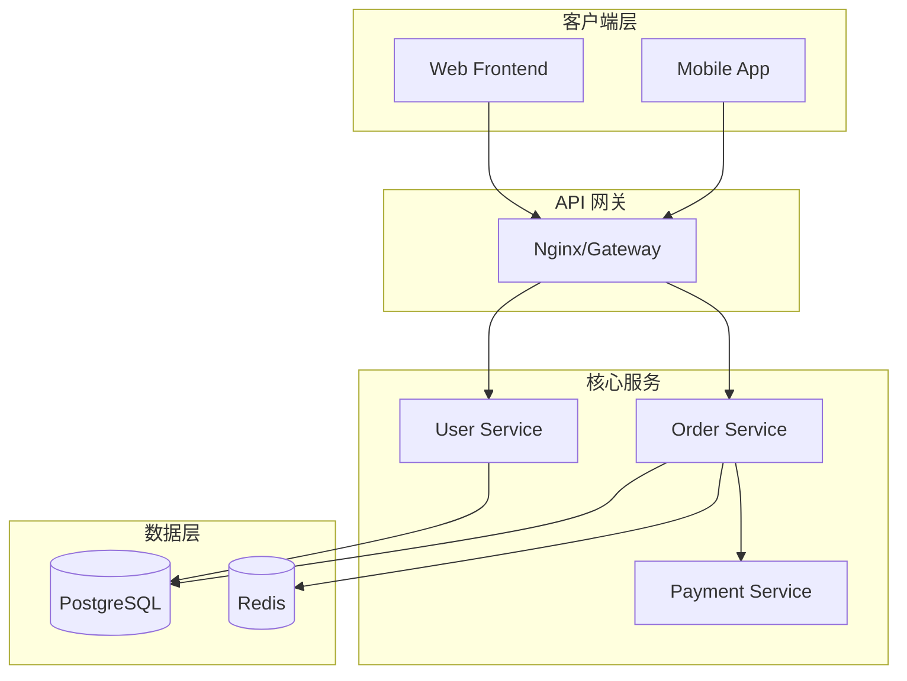
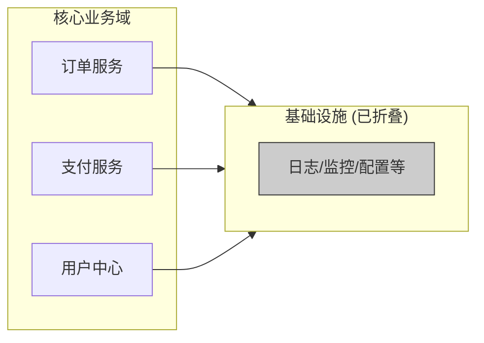
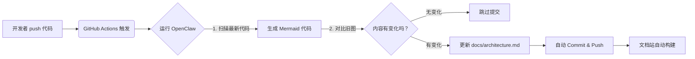

# 用 AI 快速生成项目架构图


，核心不在于让 AI“画”图（AI 画图工具如 DALL-E 无法生成可编辑的架构逻辑图），而在于让 AI **分析代码并生成图表代码（如 Mermaid、PlantUML）**，然后由渲染引擎展示为图形。

结合你之前的 **OpenClaw** 环境，这里有三种从“快”到“精”的方案：

---

### 方案一：最快上手 —— 让 OpenClaw 直接生成 Mermaid 代码
**适用场景**：快速了解现有项目结构、临时汇报、文档编写。
**原理**：利用 OpenClaw 读取文件列表和关键代码，直接输出 Mermaid 语法，你在支持 Mermaid 的编辑器（如 GitHub, Notion, VS Code）中即可渲染。

#### 操作步骤：

1.  **准备上下文**
    在项目根目录运行命令生成一个简单的文件树（包含文件名）：
    ```bash
    tree -L 3 --dirsfirst -I 'node_modules|dist|.git' > file_tree.txt
    ```

2.  **调用 OpenClaw 生成图表**
    使用 `code-expert` Agent，发送以下指令：

    ```bash
    openclaw chat --agent code-expert "
    请阅读当前目录下的 file_tree.txt 文件。
    基于文件结构和常见的架构模式，为我生成一个 **系统架构流程图 (Mermaid format)**。
    
    要求：
    1. 识别主要模块（如 Controller, Service, Model, External APIs）。
    2. 用 subgraph 对模块进行分组。
    3. 用箭头表示数据流向或调用关系。
    4. 只输出 Mermaid 代码块，不要多余解释。
    "
    ```

3.  **渲染查看**
    *   **VS Code**: 安装 `Markdown Preview Mermaid Support` 插件，将输出粘贴到 `.md` 文件即可预览。
    *   **在线查看**: 粘贴到 [Mermaid Live Editor](https://mermaid.live/)。
    *   **GitHub/Notion**: 直接粘贴到代码块中自动渲染。

**效果示例**：


---

### 方案二：最精准 —— 使用专用 CLI 工具 + AI 优化
**适用场景**：需要精确反映真实代码依赖关系（Import/Export），用于重构或技术评审。
**原理**：先用静态分析工具（如 `madge`, `pydeps`）生成原始依赖数据，再让 AI 清洗并美化成易读的架构图。

#### 步骤 1：生成原始依赖数据
根据你的语言选择工具：

*   **Node.js/TS**:
    ```bash
    npx madge --image graph.svg src/ 
    # 或者生成 JSON 供 AI 处理
    npx madge --json src/ > deps.json
    ```
*   **Python**:
    ```bash
    pip install pydeps
    pydeps src/ --show-deps --output-format=dot > deps.dot
    ```

#### 步骤 2：让 AI 优化并转换格式
原始生成的图往往太乱（网状结构），让 OpenClaw 帮你整理成分层架构图。

```bash
openclaw chat --agent code-expert "
我上传了 deps.json (项目依赖关系)。
目前的依赖图太乱了。请帮我重新设计一个 **分层架构图 (Mermaid)**：
1. 将节点归类为：Interface Layer, Business Logic Layer, Data Access Layer, Infrastructure。
2. 移除内部细节过多的连线，只保留模块间的主要调用。
3. 高亮显示循环依赖（如果有）。
4. 输出 Mermaid 代码。
"
```

**优势**：既保证了依赖关系的真实性（基于静态分析），又保证了图表的可读性（基于 AI 的逻辑归纳）。

---

### 方案三：自动化集成 —— 创建 `diagram-gen` 技能 (推荐长期使用)
如果你经常需要生成架构图，可以在 OpenClaw 中固化一个技能（参考知识库中的 `diagram-gen` 思路）。

#### 1. 定义 Skill (`skills/diagram-gen/skill.md`)
```markdown
# Skill: Diagram Generator
**功能**: 扫描指定目录，自动生成 Mermaid 架构图。
**命令**: `generate-arch-diagram [directory] [type]`
**类型支持**:
- `flow`: 数据流图
- `class`: 类图 (针对 OOP 语言)
- `component`: 组件依赖图

**工作流**:
1. 读取目录文件结构。
2. (可选) 解析 import/include 语句。
3. 构建节点和边。
4. 输出 Mermaid 代码。
```

#### 2. 在 OpenClaw 中配置工具
在 `openclaw.json` 中注册一个自定义 Tool，绑定一个执行脚本（如 Python 脚本调用 `tree-sitter` 或正则解析）。

#### 3. 一键调用
```bash
# 假设配置好了工具
openclaw run tool generate-arch-diagram ./src component
```
*直接输出可渲染的 Mermaid 代码。*

---

### 进阶技巧：让架构图更“智能”

1.  **动态更新文档**
    将生成的 Mermaid 代码直接提交到项目的 `README.md` 或 `docs/architecture.md`。
    *   **CI/CD 集成**: 在 GitHub Actions 中，每次 Push 代码后，自动运行脚本生成最新的 Mermaid 代码并更新文档。这样架构图永远不过时。

2.  **多视图生成**
    让 AI 生成不同视角的图：
    *   **部署视图**: 关注 Docker 容器、K8s Pod、负载均衡器（需人工提供部分 infra 信息）。
    *   **逻辑视图**: 关注包/模块依赖。
    *   **时序视图**: 针对特定功能（如“用户下单”），让 AI 分析代码生成 **Sequence Diagram**。
      ```bash
      openclaw chat --agent code-expert "分析 src/order/ 目录下的代码，生成用户下单流程的 Mermaid 序列图。"
      ```

3.  **反向工程遗留系统**
    对于没有文档的老项目：
    *   把核心文件扔给 OpenClaw。
    *   Prompt: “请分析这些文件，推断出系统的架构风格（是 MVC? 微服务? 六边形架构?），并画出对应的架构图。”

### 总结推荐

*   **想立刻看结果**：用 **方案一** (`tree` + OpenClaw 生成 Mermaid)。只需 1 分钟。
*   **要精确依赖关系**：用 **方案二** (`madge/pydeps` + OpenClaw 优化）。准确且清晰。
*   **长期维护文档**：用 **方案三** (集成到 CI/CD)，实现架构图的“代码即文档”。

**现在就可以试一下**：
在你的项目目录下运行 `tree -L 2 > structure.txt`，然后复制内容发给 OpenClaw，让它：“根据这个文件结构，画一个 Mermaid 架构图”。你会立刻看到效果！

## 分层生图

生成的架构图太复杂、像“蜘蛛网”一样看不懂，这是 AI 生成图表最常见的问题。原因通常是：**AI 试图把所有细节（所有文件、所有函数、所有连线）都塞进一张图里**，导致信息过载。

解决这个问题的核心策略是：**分层抽象（Layering）**、**聚焦核心（Focus）** 和 **简化连线（Simplification）**。

以下是具体的 5 种解决方案，按操作难易度排序：

---

### 方案一：强制 AI 进行“分层抽象” (最推荐)
不要让它画“文件级”的图，而是画“模块级”或“领域级”的图。通过 Prompt 强制 AI 忽略细节，只看宏观。

**❌ 错误的 Prompt：**
> “根据代码生成架构图。”
> *(结果：几百个节点，乱成一团)*

**✅ 正确的 Prompt (分层策略)：**
> “请生成一个**高层级架构概览图 (High-Level Overview)**。
> 要求：
> 1. **忽略具体文件名和函数名**，只保留**核心模块/领域**（如：用户中心、订单系统、支付网关）。
> 2. 使用 `subgraph` 将相关组件分组，代表不同的层级（如：接入层、业务层、数据层）。
> 3. **每个子图内的节点不超过 5-7 个**。如果模块内部太复杂，请不要展开，只用一个方块代表该模块。
> 4. 只展示模块间的**主要数据流向**，忽略内部琐碎的调用。
> 5. 风格参考 C4 模型的 'Container' 或 'Context' 层级。”

**效果对比：**
*   **之前**：`UserController` -> `UserService` -> `UserRepo` -> `DB` ... (几十个节点)
*   **现在**：`[客户端]` --> `[API 网关]` --> `[业务中台]` --> `[数据库集群]` (清晰简洁)

---

### 方案二：使用“焦点模式” (针对特定功能)
如果你是想理解某个具体功能（如“登录”），而不是整个系统，请限制范围。

**✅ Prompt 示例：**
> “请只关注 **‘用户登录’** 这一条业务流程。
> 1. 生成一个 **时序图 (Sequence Diagram)** 而不是架构图，因为时序图更适合展示流程。
> 2. 只包含参与该流程的核心组件（如：Frontend, Auth Service, DB, Redis）。
> 3. 忽略与该流程无关的模块（如：订单、日志、报表）。
> 4. 步骤控制在 10 步以内。”

**为什么有效？**
时序图是线性的，天然比网状架构图更易读。对于理解“事情是怎么发生的”，时序图往往比架构图更有效。

---

### 方案三：让 AI 充当“整理师” (后处理优化)
如果你已经有一张复杂的 Mermaid 代码，可以让 AI 帮你“修剪”它。

**✅ Prompt 示例：**
> “下面的 Mermaid 代码太复杂了，节点太多看不清。请你作为资深架构师帮我**重构这张图**：
> 1. **合并节点**：将属于同一个微服务的所有类/文件合并为一个节点。
> 2. **移除冗余连线**：如果 A->B 和 A->C->B 同时存在，只保留主要路径。
> 3. **隐藏辅助组件**：移除 Logger, Config, Utils 等基础设施节点，除非它们是流程的关键瓶颈。
> 4. **重新布局**：尝试将方向改为 `LR` (从左到右)，通常比 `TD` (从上到下) 更适合宽屏展示。
> 5. 输出简化后的 Mermaid 代码。”

---

### 方案四：采用 C4 模型思维 (专业做法)
在软件架构中，**C4 模型** 专门解决这个问题。它要求将架构分为四个层级，**绝不混在一起画**。

你可以要求 OpenClaw 按这四个层级分别生成四张图：

1.  **Level 1: System Context (系统上下文)**
    *   **内容**：你的系统 + 外部用户 + 外部系统（如微信、银行）。
    *   **节点数**：< 10 个。
    *   **Prompt**：“画出系统与外部世界的关系。”
2.  **Level 2: Container (容器)**
    *   **内容**：Web 应用、移动端 App、微服务、数据库、消息队列。
    *   **节点数**：10-20 个。
    *   **Prompt**：“画出系统内部的主要技术容器及其交互。”
3.  **Level 3: Component (组件)**
    *   **内容**：某个特定容器内部的模块（如 Controller, Service）。
    *   **注意**：**一次只画一个容器的内部结构**，不要画全系统。
    *   **Prompt**：“只画出 'Order-Service' 容器内部的组件结构。”
4.  **Level 4: Code (代码)**
    *   **内容**：类/接口。
    *   **建议**：**不要用架构图展示**，直接用 IDE 查看，或者用时序图展示关键流程。

**操作指令：**
> “请按照 C4 模型标准，为我生成三张独立的 Mermaid 图：
> 1. 系统上下文图 (System Context)
> 2. 容器图 (Container Diagram)
> 3. 仅针对 [核心服务名] 的组件图 (Component Diagram)
> 请分开输出，不要混在一张图里。”

---

### 方案五：视觉优化技巧 (Mermaid 语法层面)
如果逻辑无法再简化，可以通过样式让图看起来更清晰。

**✅ 让 AI 添加以下样式：**
1.  **颜色编码**：用不同颜色区分不同层级或不同技术栈。
    ```mermaid
    classDef frontend fill:#e1f5fe,stroke:#01579b;
    classDef backend fill:#fff3e0,stroke:#e65100;
    classDef db fill:#e8f5e9,stroke:#1b5e20;
    ```
2.  **隐藏连线标签**：如果连线上文字太多，让 AI 去掉标签，只留箭头。
3.  **使用虚线表示异步/可选**：区分主流程和分支流程。
4.  **调整方向**：尝试 `graph LR` (左到右) 或 `graph RL`，有时候换个方向就通了。

---

### 总结：一套标准的“防混乱”Prompt 模板

下次让 OpenClaw 生成架构图时，直接套用这个模板：

```markdown
# Role
资深系统架构师

# Task
基于项目代码生成一张**清晰易懂**的架构图 (Mermaid 格式)。

# Constraints (必须遵守)
1. **抽象层级**：只展示**模块/服务级**别，严禁展示具体的类、函数或文件名。
2. **数量限制**：主图中的节点总数控制在 **15 个以内**。如果超过，请使用 `subgraph` 进行折叠概括。
3. **连线简化**：只保留核心的数据流/调用流，移除内部实现细节的连线。
4. **布局策略**：使用 `graph LR` (从左到右) 布局，体现数据流向。
5. **样式美化**：
   - 使用 `classDef` 为不同层级（如 API, Core, Data）定义不同的背景色。
   - 关键路径使用粗线 (`stroke-width: 2px`)。
6. **分图策略**：如果系统太复杂，请拆分为“宏观架构”和“核心模块详情”两张图分别输出。

# Input
(此处粘贴 file_tree.txt 或依赖分析结果)
```

**核心心法**：
**架构图是用来沟通的，不是用来炫耀细节的。** 如果一张图需要解释 5 分钟才能看懂，它就是一张失败的图。宁可多画几张简单的，也不要画一张复杂的。


## 要让 AI **只画核心模块**


关键在于**剥夺它“自由发挥”的权力**，通过 **显式白名单（White-listing）**、**排除法（Black-listing）** 和 **阈值控制** 来强制它做减法。

AI 默认倾向于“全面”，你必须明确告诉它什么是“噪音”。以下是 4 种精准控制的方法：

---

### 方法一：显式指定“核心列表” (最精准)
不要让它猜什么是核心，直接告诉它。这是最有效的方法。

**操作步骤：**
1.  **列出核心模块名**（你可以凭经验列出 3-5 个关键服务/目录）。
2.  **在 Prompt 中强制限定范围**。

**✅ Prompt 模板：**
> “请生成架构图，但**严格限制**只包含以下核心模块：
> - `OrderService` (订单)
> - `PaymentGateway` (支付)
> - `InventoryManager` (库存)
> - `UserCenter` (用户)
>
> **强制规则：**
> 1. **忽略**所有不在上述列表中的模块（如 Logger, Config, Utils, AuthFilter, DTOs, Controllers 等）。
> 2. 如果核心模块依赖了外部非核心模块，**不要画出那个外部模块**，直接用文字标注在连线上（例如：'调用日志服务'），而不画节点。
> 3. 只展示这几个核心模块之间的交互关系。”

**效果**：图中只会剩下你指定的那几个大方块，干净利落。

---

### 方法二：使用“排除法”过滤噪音 (适合大型项目)
如果你不知道具体哪些是核心，但知道哪些肯定是“基础设施”或“样板代码”，可以让 AI 剔除它们。

**✅ Prompt 模板：**
> “生成架构图时，请**自动过滤**以下类型的组件，**绝对不要**将它们作为节点画出来：
> - **基础设施类**：Logger, Config, DatabaseConnection, RedisClient, HttpClient。
> - **传输对象类**：DTO, VO, Entity, Model, Request, Response。
> - **框架层**：Controller, Filter, Interceptor, Middleware, Router。
> - **工具类**：Utils, Helper, Common, Constants。
>
> **只保留**：
> - 具有复杂业务逻辑的 **Service/Manager** 层。
> - 独立的 **微服务/子系统** 名称。
> - 外部第三方系统（如 Stripe, AWS S3）。”

**原理**：这能去掉 80% 的琐碎节点，剩下的通常就是核心业务逻辑。

---

### 方法三：基于“调用频率/依赖度”的阈值过滤 (智能筛选)
让 AI 分析代码依赖关系，只画出被引用次数多（Hub 节点）或处于中心位置的模块。

**✅ Prompt 模板：**
> “请分析代码库的依赖关系，执行以下过滤逻辑：
> 1. **计算入度**：统计每个模块被其他模块调用的次数。
> 2. **设定阈值**：**只保留入度 > 3 的模块**（即被至少 3 个其他地方调用的核心枢纽）。
> 3. **孤立点移除**：如果一个模块只被调用 1 次且没有下游依赖，视为边缘模块，**不画入图中**。
> 4. **聚合叶子节点**：如果多个边缘模块都指向同一个核心模块，将它们合并为一个虚拟节点叫‘其他业务模块’。
>
> 最终生成的图应只包含系统的‘骨架’，去除所有‘毛发’。”

---

### 方法四：分层折叠策略 (C4 模型简化版)
强制 AI 将非核心细节“折叠”进一个大盒子里，不展开显示。

**✅ Prompt 模板：**
> “请使用 **Subgraph (子图)** 技术进行视觉折叠：
> 1. **核心层**：将 `Order`, `Payment`, `User` 作为独立的大节点详细展示。
> 2. **支撑层**：将 `Logging`, `Monitoring`, `Config`, `Auth` 全部打包进一个名为 **'Infrastructure Support'** 的子图中，**子图内部不要画任何细节**，只用一个大方块代表。
> 3. **数据层**：将所有数据库表/实体打包进一个名为 **'Data Storage'** 的子图，同样不展示内部细节。
> 4. **连线规则**：核心层到支撑层的连线，只需画一条总连线指向子图，不要画多条细线指向子图内部的具体组件。”

**Mermaid 代码示例 (AI 应生成的样子)：**


---

### 综合实战：一键“提纯”Prompt

把下面这段咒语发给 OpenClaw，它能瞬间把复杂的蜘蛛网变成清晰的骨干图：

```markdown
# 任务：生成极简核心架构骨架图

# 输入
(此处粘贴你的文件树或依赖分析结果)

# 核心指令 (必须严格执行)
1. **识别核心**：找出系统中承载主要业务逻辑的 3-5 个关键模块（通常是 Service 层或微服务名）。
2. **暴力过滤**：
   - ❌ **禁止出现**：Controller, DTO, Entity, Utils, Logger, Config, Filter, Middleware。
   - ❌ **禁止出现**：任何文件名以 `Base`, `Abstract`, `Impl` 结尾的类。
   - ❌ **禁止出现**：入度（被引用数）小于 2 的边缘模块。
3. **视觉折叠**：
   - 将所有被过滤掉的底层依赖（如 DB, Redis, MQ）合并为两个通用节点：`[Database Cluster]` 和 `[Message Queue]`。
   - 不要展示这些通用节点的内部结构。
4. **连线简化**：
   - 如果 A 和 B 之间有双向调用，只画一条双向箭头。
   - 如果 A 调用了 B, C, D，而 C, D 是非核心边缘模块，则忽略 C, D，只在 A 旁边标注 "(依赖 C, D...)"。
5. **输出要求**：
   - 节点总数控制在 **10 个以内**。
   - 使用不同颜色区分“核心业务”和“基础设施”。
   - 布局方向：LR (从左到右)。

# 目标
我要看到的是一张能给 CEO 汇报的图，而不是给开发人员看的代码依赖图。只要骨架，不要细节。
```

### 总结
要让 AI 只画核心：
1. **要么你给它名单**（方法一，最准）。
2. **要么让它扔掉垃圾**（方法二，最快）。
3. **要么让它把细节打包折叠**（方法四，最美观）。

**切记**：不要指望 AI 自动理解“什么是核心”，你必须通过 **排除关键词** 和 **限制节点数量** 来强行约束它。

## 将**架构图**与**代码文档**结合


核心目标是实现"**图码联动**"：点击图中的模块能看到代码/文档，阅读文档时能看到它在架构中的位置。

这不仅仅是把两张图拼在一起，而是要建立**双向链接**。以下是三种从“轻量级”到“企业级”的结合方案：

---

### 方案一：Mermaid + Markdown 超链接 (最轻量，推荐个人/小团队)
**原理**：利用 Mermaid 支持在节点中添加 `click` 事件或 HTML 超链接的特性，将架构图的节点直接链接到具体的代码文件或文档章节。
**优点**：无需额外工具，只需一个 `.md` 文件，GitHub/GitLab/Notion 原生支持。
**缺点**：链接通常是静态的（除非配合 CI 自动更新）。

#### 操作步骤：

1.  **编写带链接的 Mermaid 代码**
    在生成架构图时，让 AI 为每个节点添加 `click` 指令或 URL。

    ```mermaid
    graph TD
      %% 定义样式
      classDef service fill:#e1f5fe,stroke:#01579b;
      classDef db fill:#fff3e0,stroke:#e65100;

      %% 节点定义 (格式：ID["名称"]:::样式)
      UserSvc["用户服务<br/>(src/services/user)"]:::service
      OrderSvc["订单服务<br/>(src/services/order)"]:::service
      UserDB[("用户数据库<br/>(schema/users.sql)")]:::db

      %% 连接关系
      UserSvc --> OrderSvc
      UserSvc --> UserDB

      %% 🔑 关键：添加点击跳转链接
      %% 语法：click ID "URL" "提示文字"
      click UserSvc "https://github.com/your-repo/blob/main/src/services/user.ts" "查看源代码"
      click OrderSvc "https://github.com/your-repo/blob/main/src/services/order.ts" "查看源代码"
      click UserDB "https://github.com/your-repo/blob/main/db/schema/users.sql" "查看表结构"
      
      %% 或者使用纯 HTML 链接 (部分渲染器支持)
      %% UserSvc ::: "href='...'"
    ```

2.  **让 OpenClaw 自动生成这种代码**
    Prompt 示例：
    > “请生成 Mermaid 架构图。对于每个核心模块节点，请在其下方标注对应的**相对文件路径**。同时，生成 `click` 指令，将节点链接到 GitHub 仓库中该文件的对应 URL。如果不确定具体文件，链接到该模块的目录。”

3.  **效果**
    在支持的编辑器（如 VS Code, GitHub）中，**点击图中的方块，直接跳转到代码文件**。

---

### 方案二：Docs-as-Code + 自动化脚本 (适合中型项目)
**原理**：将架构图作为文档的一部分存入代码库，并通过 CI/CD 脚本**自动提取代码注释**生成文档，同时**自动更新架构图**，确保两者永远同步。
**优点**：文档即代码，版本可控，永不脱节。
**工具链**：OpenClaw (生成图) + MkDocs/Docusaurus (文档站) + GitHub Actions。

#### 工作流设计：

1.  **目录结构**
    ```text
    docs/
      architecture.md       # 包含 Mermaid 图
      api-reference.md      # 自动生成的 API 文档
    src/
      services/
        user.service.ts     # 代码含 JSDoc/TSDoc 注释
    ```

2.  **自动化脚本 (`update-arch-docs.sh`)**
    每次提交代码时运行：
    ```bash
    # 1. 让 OpenClaw 分析最新代码，生成最新的 Mermaid 图
    openclaw chat --agent code-expert "分析 src/ 目录，生成最新的组件架构图 (Mermaid)，保存到 docs/architecture.md 的代码块中。"

    # 2. 让 Typedoc/JSDoc 提取代码注释生成 API 文档
    npx typedoc --out docs/api src/

    # 3. (可选) 在 architecture.md 中自动插入指向 API 文档的链接
    # 脚本解析 Mermaid 节点名，匹配生成的 API 页面 URL，注入 click 链接
    ```

3.  **效果**
    *   开发者修改代码注释 -> CI 运行 -> API 文档更新。
    *   开发者重构代码结构 -> CI 运行 -> OpenClaw 重绘架构图 -> 文档中的图自动更新。
    *   **结果**：架构图和代码文档始终处于“最新状态”。

---

### 方案三：交互式知识库 (DeepWiki/OpenClaw Web UI) (最先进，体验最好)
**原理**：利用像 **DeepWiki-Open** 或配置了 Web UI 的 **OpenClaw**，构建一个可交互的 Wiki 网站。架构图不再是静态图片，而是**可点击的导航地图**。
**优点**：体验极佳，支持搜索、问答、动态展开。

#### 实施步骤 (基于 DeepWiki-Open 思路)：

1.  **部署 DeepWiki-Open** (参考之前知识库内容)
    它会自动扫描你的 GitHub 仓库。

2.  **生成“架构索引页”**
    配置 AI 生成一个特殊的 `ARCHITECTURE_INDEX.md`：
    *   包含一张大的 Mermaid 架构图。
    *   图中的每个节点链接到 DeepWiki 自动生成的**模块详情页**。

3.  **模块详情页内容**
    当用户点击图中的“用户服务”时，跳转到新页面，该页面自动包含：
    *   **模块简介** (AI 从代码注释生成)。
    *   **核心类/函数列表** (带链接)。
    *   **相关 API 文档**。
    *   **该模块的子架构图** (下钻视图)。
    *   **“Ask AI”按钮**：针对该模块提问（如“这个服务的鉴权逻辑是什么？”）。

4.  **效果**
    用户看到的不是死板的 PDF，而是一个**活的系统地图**。点击地图上的任何部分，都能深入到代码细节和文档说明。

---

### 进阶技巧：如何让结合更紧密？

#### 1. 在代码注释中引用架构图
反向操作：在代码文件头部，注明它属于架构图的哪个部分。
```typescript
/**
 * @module 用户中心
 * @see {@link ../docs/architecture.md#user-service} 查看架构图中的位置
 * @description 负责用户注册、登录及信息管理。
 */
export class UserService { ... }
```
*配合 IDE 插件，鼠标悬停即可看到架构上下文。*

#### 2. 使用“语义化”节点命名
让 AI 生成架构图时，节点名称直接使用**代码中的类名或服务名**，而不是抽象的业务名。
*   ❌ 坏名字：`处理用户数据的模块`
*   ✅ 好名字：`UserService (src/services/user.ts)`
*   **好处**：这样你可以写脚本正则匹配，自动建立 `节点名 <-> 文件路径` 的映射，无需人工维护链接。

#### 3. 动态嵌入“实时状态”
如果是运维架构图，可以结合监控数据。
*   在 Mermaid 中通过 CI 脚本动态改变节点颜色。
*   例如：如果 `PaymentService` 报错率高，脚本生成图表时将其标红。
    ```mermaid
    classDef error fill:#ffcccc,stroke:#ff0000;
    PaymentSvc["支付服务"]:::error
    ```

### 总结推荐

| 场景 | 推荐方案 | 核心动作 |
| :--- | :--- | :--- |
| **个人/快速分享** | **方案一 (Mermaid Links)** | 让 AI 生成带 `click` 链接的 Mermaid 代码，放入 README。 |
| **团队规范文档** | **方案二 (CI/CD 自动化)** | 编写脚本，每次提交自动重绘图表并提取注释，保证“图码同步”。 |
| **大型复杂系统** | **方案三 (交互式 Wiki)** | 部署 DeepWiki-Open 或类似工具，打造可点击、可问答的活体架构地图。 |

**立即行动建议**：
先尝试**方案一**。让你的 OpenClaw Agent 执行以下指令：
> “分析当前项目，生成一份 Mermaid 架构图。要求：1. 节点名称包含相对文件路径；2. 为每个节点生成 `click` 指令，链接到 GitHub 仓库对应的文件地址；3. 输出完整的 Markdown 代码块。”

把这串代码放进你的 `README.md`，你就拥有了第一份“可点击”的架构文档。

## 实现架构图的**自动更新**，


核心在于将“画图”这个动作从**人工操作**转变为**CI/CD 流水线中的一个自动化步骤**。

目标是：**代码提交 (Push) -> 触发 CI -> 自动分析代码 -> 生成新图 -> 更新文档 -> 提交回仓库**。

以下是基于 **OpenClaw + GitHub Actions** 的完整落地方案。

---

### 核心架构流程



---

### 第一步：准备项目结构

在你的项目根目录建立以下结构：

```text
your-project/
├── src/                  # 源代码
├── docs/
│   └── architecture.md   # 存放架构图的文档 (将被自动修改)
├── scripts/
│   └── generate-arch.sh  # 生成脚本
├── .github/
│   └── workflows/
│       └── auto-arch.yml # CI 配置文件
└── openclaw.json         # OpenClaw 配置
```

**初始化 `docs/architecture.md`** (手动创建一次)：
```markdown
# 系统架构

> ⚠️ 本图表由 CI 自动生成，请勿手动修改图表部分。

```mermaid
<!-- ARCH_START -->
graph TD
    A[初始占位符] --> B[等待 CI 更新]
<!-- ARCH_END -->
```
*注意：使用 `<!-- ARCH_START -->` 和 `<!-- ARCH_END -->` 标记，方便脚本只替换中间内容，保留其他文档描述。*

---

### 第二步：编写生成脚本 (`scripts/generate-arch.sh`)

这个脚本负责调用 OpenClaw 生成最新的 Mermaid 代码，并替换文档中的旧内容。

```bash
#!/bin/bash
set -e

DOC_FILE="docs/architecture.md"
START_MARKER="<!-- ARCH_START -->"
END_MARKER="<!-- ARCH_END -->"

echo "🤖 正在调用 OpenClaw 分析代码并生成架构图..."

# 1. 调用 OpenClaw 生成 Mermaid 代码
# 假设你有一个专门用于画图的 agent 叫 'architect-expert'
# 使用 --format text 确保只输出纯文本
NEW_MERMAID=$(openclaw chat --agent architect-expert \
  "请分析 src/ 目录下的最新代码，生成一个精简的核心架构 Mermaid 流程图。
   要求：
   1. 只包含核心模块，忽略 Utils/DTOs。
   2. 只输出 mermaid 代码块内容 (包含 \`\`\`mermaid 和 \`\`\`)。
   3. 不要输出任何解释性文字。" \
  --format text)

if [ -z "$NEW_MERMAID" ]; then
  echo "❌ 错误：OpenClaw 未生成任何内容"
  exit 1
fi

echo "✅ 生成成功，正在更新文档..."

# 2. 使用 sed 或 awk 替换 markers 之间的内容
# 这里使用一个简单的 Python 脚本来处理多行替换更稳妥
python3 - < ... <!-- ARCH_END --> 之间的内容
pattern = re.compile(r'(<!-- ARCH_START -->).+?(<!-- ARCH_END -->)', re.DOTALL)

# 替换为新内容，保留 markers
replacement = r'\1\n' + new_content + r'\n\2'
new_doc_content = pattern.sub(replacement, content)

with open(doc_path, 'w', encoding='utf-8') as f:
    f.write(new_doc_content)

print("📝 文档已更新")
EOF

# 3. 检查是否有变更
if git diff --quiet "$DOC_FILE"; then
  echo "ℹ️ 架构图无变化，跳过提交。"
  exit 0
else
  echo "🔄 检测到架构图变更，准备提交..."
  git config --local user.email "action@github.com"
  git config --local user.name "GitHub Action Bot"
  git add "$DOC_FILE"
  git commit -m "docs: 自动更新架构图 [skip ci]"
  git push
  echo "✅ 架构图已自动提交！"
fi
```

*记得给脚本执行权限：`chmod +x scripts/generate-arch.sh`*

---

### 第三步：配置 GitHub Actions (`.github/workflows/auto-arch.yml`)

这是自动化的引擎。每当代码推送到 `main` 分支时触发。

```yaml
name: Auto-Update Architecture Diagram

on:
  push:
    branches: [ "main", "master" ]
    paths:
      - 'src/**'       # 只有 src 目录变动才触发，节省资源
      - 'openclaw.json'

jobs:
  update-diagram:
    runs-on: ubuntu-latest
    steps:
      - name: Checkout Code
        uses: actions/checkout@v3
        with:
          fetch-depth: 0 # 获取完整历史，方便 diff

      - name: Setup Node.js (如果 OpenClaw 需要)
        uses: actions/setup-node@v3
        with:
          node-version: '18'

      - name: Install OpenClaw
        run: npm install -g openclaw-cli # 假设开放了 npm 包，或用 pip install

      - name: Configure OpenClaw
        run: |
          mkdir -p ~/.openclaw
          echo '${{ secrets.OPENCLAW_CONFIG_JSON }}' > ~/.openclaw/openclaw.json
          # 或者直接在命令行传入 API KEY
          export OPENCLAW_API_KEY=${{ secrets.GOOGLE_API_KEY }}

      - name: Generate & Update Diagram
        run: ./scripts/generate-arch.sh
        env:
          GOOGLE_API_KEY: ${{ secrets.GOOGLE_API_KEY }}
          # 如果需要访问私有 repo 进行 push，需配置 SSH 或 Token
          GH_TOKEN: ${{ secrets.GITHUB_TOKEN }} 
      
      # 如果脚本内部 git push 失败（因为 token 权限），可以用专门的 action
      - name: Push Changes (Fallback)
        if: failure() # 如果上面脚本里的 push 没执行成功
        uses: ad-m/github-push-action@master
        with:
          github_token: ${{ secrets.GITHUB_TOKEN }}
          branch: ${{ github.ref }}
```

**⚠️ 关键配置说明：**
1.  **Secrets**: 你需要在 GitHub Settings -> Secrets 中配置 `GOOGLE_API_KEY` (或其他 LLM Key)。
2.  **Paths Filter**: `paths: ['src/**']` 非常重要！防止改个 README 也触发重绘，浪费 Token 和时间。
3.  **Skip CI**: Commit 信息中加入 `[skip ci]`，防止提交文档后再次触发流水线，造成死循环。

---

### 第四步：优化与防坑指南

#### 1. 防止“抖动” (Flapping)
AI 生成的 Mermaid 代码可能每次微调布局（节点顺序变了，但逻辑没变），导致 Git 一直检测到变更。
*   **解决**：在 Prompt 中强制要求**确定性输出**。
    > “请严格按照字母顺序排列节点定义。布局方向固定为 LR。不要随机调整子图顺序。”
*   **进阶**：在脚本中加入 `diff` 检查，如果仅仅是空白字符或节点定义顺序不同，但逻辑边关系一致，则忽略。

#### 2. 处理大型项目超时
如果项目很大，OpenClaw 分析可能需要几分钟，导致 CI 超时。
*   **解决**：
    *   在 CI 中启用 OpenClaw 的**增量索引**模式（如果有）。
    *   限制分析范围：Prompt 中指定“只分析最近修改的文件及其直接依赖”（需要脚本先算出 modified files 列表传给 AI）。

#### 3. 审核机制 (Pull Request)
如果你不希望自动直接合并到 `main`，可以改为：
*   CI 运行在 `pull_request` 事件上。
*   脚本不直接 `git push`，而是生成一个新的 commit 推送到一个临时分支，或者作为 **PR Comment** 贴出新的 Mermaid 代码供人工 review。
*   **推荐做法**：让 Action 更新文档后，创建一个 **新的 PR** 或者推送到当前 PR 分支，让人工确认后再合并。

#### 4. 本地预览
在合并前，开发者可以在本地运行：
```bash
./scripts/generate-arch.sh
# 查看 git diff，确认架构图变化是否符合预期
```

---

### 最终效果

1.  开发者小王修改了 `src/order/service.ts`，增加了一个对 `PaymentService` 的调用。
2.  小王 `git push`。
3.  GitHub Actions 被触发。
4.  OpenClaw 读取新代码，发现依赖关系变了。
5.  脚本自动生成新的 Mermaid 代码，`docs/architecture.md` 中的图更新了，多了一条连线。
6.  机器人自动提交：“docs: 自动更新架构图”。
7.  部署系统（如 Vercel/GitHub Pages）检测到 `docs` 变化，重新构建网站。
8.  **结果**：几分钟后，团队访问文档网站，看到的已经是**最新**的架构图了。

### 总结
实现自动更新的关键不在于 AI 有多聪明，而在于**CI 流水线的闭环设计**：
**监听代码变动 -> 调用 AI 重绘 -> 智能替换文档 -> 自动提交**。
这套流程一旦跑通，你的架构图就再也永远不会过时了。