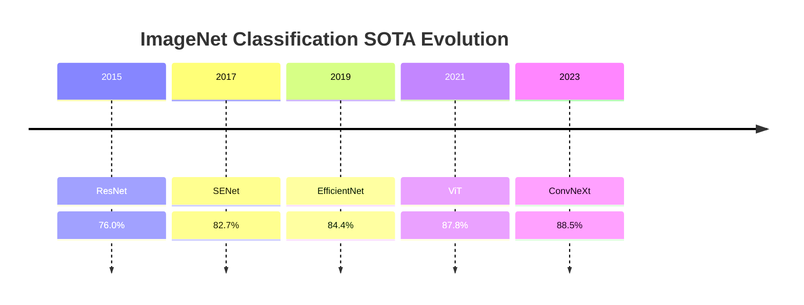
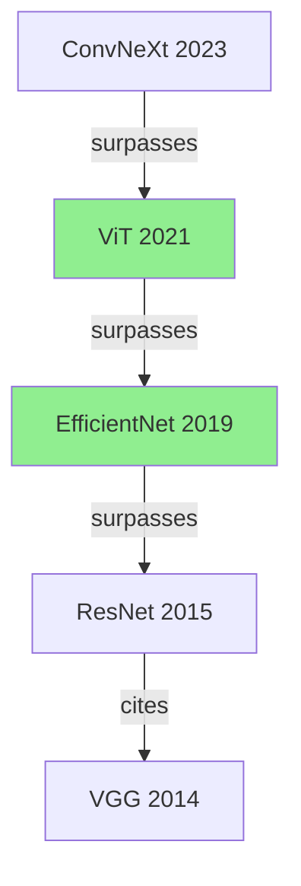

# MkDocs 展示

**来源**: 从 `../知识图谱展示.md` 和 `../知识图谱构建_工程.md` 提炼  
**最后更新**: 2026-03-23  
**状态**: 架构评审中

---

## 🎯 展示目标

基于 MkDocs + Material 主题，构建**学术文献知识库静态站点**，实现：
- 侧边栏导航、全文搜索、暗黑模式
- 文献分类导航（按领域/时间/作者）
- SOTA 演进可视化（Mermaid 图表）
- 过期文献警告注入
- 增量更新（新文献入库触发）

---

## 🏗️ 架构

```
图谱数据 → MkDocs 生成 → 静态站点 → (可选) GitHub Pages 部署
   ↓
增量更新（文件监听触发）
```

---

## 🔧 环境准备

```bash
# 安装 MkDocs + Material 主题
pip install mkdocs mkdocs-material mkdocs-minify-plugin
```

---

## 📋 配置 mkdocs.yml

```yaml
# mkdocs.yml
site_name: 📚 智能文献知识库
site_description: 基于 OpenClaw 自动构建的学术知识库
site_author: Your Name

theme:
  name: material
  language: zh
  palette:
    - scheme: default
      toggle:
        icon: material/brightness-7
        name: 切换到深色模式
    - scheme: slate
      toggle:
        icon: material/brightness-4
        name: 切换到浅色模式
  features:
    - navigation.tabs       # 顶部标签页
    - navigation.sections   # 侧边栏分组
    - navigation.indexes    # 索引页
    - search.suggest        # 搜索建议
    - search.highlight      # 搜索高亮
    - content.code.copy     # 代码复制

plugins:
  - search
  - minify

# 导航结构（由 OpenClaw 自动维护）
nav:
  - 首页: index.md
  - 文献分类:
      - 基础架构: categories/LLM_Architecture.md
      - 模型量化: categories/Quantization.md
      - RAG 系统: categories/RAG_Systems.md
  - 最新入库: recent.md
  - SOTA 演进: sota_timeline.md
  - 引用图谱: graph.md

markdown_extensions:
  - pymdownx.arithmatex:    # 支持 LaTeX 公式
      generic: true
  - pymdownx.superfences
  - tables
  - toc
```

---

## 📄 文献页面模板

```markdown
---
title: 论文标题
authors: [作者 1, 作者 2]
year: 2024
doi: 10.1000/paper1
venue: Conference Name
status: active  # 或 deprecated
tags: [LLM, Architecture, Transformer]
---

!!! info "元数据"
    - **年份**: 2024
    - **DOI**: [10.1000/paper1](https://doi.org/10.1000/paper1)
    - ** venue**: Conference Name
    - **状态**: ✅ 有效

## 摘要

...

## 核心方法

...

## 实验结果

### SOTA 对比

| Method | Accuracy |
|--------|----------|
| Ours   | 89.5     |
| Baseline | 87.2   |

## 图表

### Figure 1: Model Architecture


## 引用关系

- **引用**: [[Paper A]], [[Paper B]]
- **被引用**: [[Paper C]], [[Paper D]]
- **超越**: 在 ImageNet 上超越了 [[Paper E]]

---

!!! danger "⚠️ 结论已被修正/推翻"
    **重要提示**：本文献的核心观点已被后续研究 **[[2024_New_Theory]](./2024_New_Theory.md)** 推翻或大幅修正。
    - **过时点**：认为 A 导致 B
    - **最新共识**：最新研究表明 A 与 B 无因果关系
    - **建议**：请勿将本文献作为当前技术状态的依据，仅作历史参考
```

---

## 🔄 增量更新机制

### mkdocs-generate Tool

```typescript
// tools/mkdocs-generate.ts
interface MkdocsGenerateInput {
  papers: Paper[];        // 图谱中的文献数据
  incremental: boolean;   // 是否增量更新
  changedPapers?: string[]; // 变更的文献 DOI 列表（增量时用）
}

async function mkdocsGenerate(input: MkdocsGenerateInput): Promise<void> {
  if (input.incremental && input.changedPapers) {
    // 增量更新：只生成变更的文献页面
    for (const doi of input.changedPapers) {
      await generatePaperPage(doi);
    }
    await updateIndex();  // 更新索引页
  } else {
    // 全量更新：重建所有页面
    await regenerateAll();
  }
}
```

### 触发方式

| 触发场景 | 触发方式 | 执行的 Skill |
|---|---|---|
| 新文献入库 | 文件监听 (Watchdog) | site-update-skill (增量) |
| 手动触发 | 用户命令 | site-update-skill (全量/增量) |
| 冲突检测后 | 自动触发 | site-update-skill (增量，注入警告) |
| 定期重建 | Cron (每周) | site-update-skill (全量) |

---

## 📊 SOTA 演进可视化

### Mermaid 时间线图



### Mermaid 关系图



---

## 🌐 部署方案

### 方案 1: 本地预览

```bash
mkdocs serve
# 访问 http://localhost:8000
```

### 方案 2: GitHub Pages

```bash
mkdocs gh-deploy --force
```

### 方案 3: 静态文件部署

```bash
mkdocs build
# 将 site/ 目录部署到 Nginx/Apache
```

---

## ⚠️ 过期文献警告注入

### Frontmatter 标记

```yaml
---
title: Old Paper
year: 2015
status: deprecated
superseded_by: ["2024_New_Theory.md"]
warning_level: high
---
```

### 警告框注入

```markdown
!!! danger "⚠️ 结论已被修正/推翻"
    **重要提示**：本文献的核心观点已被后续研究 **[[2024_New_Theory]](./2024_New_Theory.md)** 推翻。
    - **过时点**：认为 A 导致 B
    - **最新共识**：最新研究表明 A 与 B 无因果关系
```

### 自动注入逻辑

```typescript
// 在 mkdocs-generate 中
async function injectWarning(paper: Paper, content: string): Promise<string> {
  if (paper.status === 'deprecated') {
    const warning = `
!!! danger "⚠️ 结论已被修正/推翻"
    **重要提示**：本文献已被 **${paper.supersededBy.join(', ')}** 推翻。
    - **过时点**：${paper.deprecationReason}
`;
    return warning + '\n' + content;
  }
  return content;
}
```

---

## 📊 导航索引自动生成

### 按分类索引

```markdown
# 文献分类导航

## LLM Architecture
- [[Paper A]] (2024)
- [[Paper B]] (2023)

## Quantization
- [[Paper C]] (2024)
- [[Paper D]] (2023)
```

### 按时间索引

```markdown
# 最新入库

## 2026-03
- [[Paper E]] (2026-03-20)
- [[Paper F]] (2026-03-18)

## 2026-02
- [[Paper G]] (2026-02-15)
```

### 按作者索引

```markdown
# 作者索引

## Hinton, Geoffrey
- [[Paper H]] (2015)
- [[Paper I]] (2017)
```

---

## 📝 文档变更记录

| 日期 | 变更 | 说明 |
|---|---|---|
| 2026-03-23 | 从原文档提炼 | 精简核心 MkDocs 展示方案 |

`// -- 🦊 DevMate | MkDocs 展示提炼完成 --`
