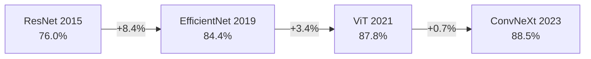

# 知识检索

**来源**: 从 `../知识检索.md` 提炼  
**最后更新**: 2026-03-23  
**状态**: 架构评审中

---

## 🎯 检索目标

支持以下检索场景：
1. **语义检索** — 基于向量相似度搜索相关文献
2. **结构化检索** — 基于图谱关系查询（如"查找所有超越 ResNet 的论文"）
3. **混合检索** — 语义 + 结构化组合
4. **SOTA 检索** — 查找特定任务/数据集上的 SOTA 论文

---

## 🏗️ 检索架构

```
用户查询 → 查询解析 → 语义检索 + 结构化检索 → 结果融合 → 排序 → 返回
              ↓              ↓                      ↓
         意图识别      向量搜索 + Cypher         去重 + 加权
```

---

## 🔧 检索类型

### 1. 语义检索 (Vector Search)

**适用场景**: 模糊查询、主题探索

**实现**:
```typescript
// 向量检索
async function semanticSearch(query: string, topK: number = 10): Promise<Paper[]> {
  // 1. 查询向量化
  const queryVector = await embed(query);
  
  // 2. 向量相似度搜索
  const results = await vectorIndex.search(queryVector, topK);
  
  return results.map(r => r.paper);
}
```

### 2. 结构化检索 (Graph Query)

**适用场景**: 精确关系查询

**实现** (Cypher 风格):
```cypher
// 查找所有超越 ResNet 的论文
MATCH (p:Paper)-[s:SURPASSES]->(target:Paper {title: "Deep Residual Learning"})
RETURN p, s.metric, s.value_delta
ORDER BY s.value_delta DESC

// 查找 ImageNet 上的 SOTA 演进链
MATCH path = (p:Paper)-[:SURPASSES*]->(target:Paper)
WHERE (target)-[:ACHIEVES_METRIC {dataset: "ImageNet"}]->(:Metric)
RETURN path
ORDER BY p.year DESC
```

### 3. 混合检索 (Hybrid Search)

**适用场景**: 综合查询

**实现**:
```typescript
async function hybridSearch(query: string, filters: FilterOptions): Promise<Paper[]> {
  // 1. 语义检索
  const semanticResults = await semanticSearch(query, 20);
  
  // 2. 结构化检索（应用过滤器）
  const graphResults = await graphSearch(filters, 20);
  
  // 3. 结果融合（去重 + 加权）
  const merged = fuseResults(semanticResults, graphResults);
  
  // 4. 重新排序
  return rerank(merged, query);
}
```

### 4. SOTA 检索

**适用场景**: 查找特定任务/数据集上的 SOTA

**实现**:
```typescript
async function sotaSearch(task: string, dataset: string): Promise<SOTAResult> {
  // 1. 查找该任务/数据集上的所有论文
  const papers = await graphQuery(`
    MATCH (p:Paper)-[:ACHIEVES_METRIC {dataset: "${dataset}"}]->(m:Metric)
    WHERE (p)-[:BELONGS_TO]->(:Task {name: "${task}"})
    RETURN p, m.value
    ORDER BY m.value DESC
  `);
  
  // 2. 返回 Top 1 作为当前 SOTA
  return {
    currentSOTA: papers[0],
    evolutionChain: await buildEvolutionChain(papers)
  };
}
```

---

## 📊 检索结果排序

### 排序因子

| 因子 | 权重 | 描述 |
|---|---|---|
| 语义相似度 | 0.4 | 查询与摘要/标题的向量相似度 |
| 引用次数 | 0.2 | 被引用次数（图谱中计算） |
| 时间衰减 | 0.2 | 新论文权重更高 |
| SOTA 状态 | 0.2 | 当前 SOTA 权重更高 |

### 排序公式

```
score = 0.4 * semantic_sim + 0.2 * citation_norm + 0.2 * time_decay + 0.2 * sota_bonus
```

---

## 🔍 查询解析

### 意图识别

| 查询模式 | 意图 | 检索策略 |
|---|---|---|
| "查找关于 X 的论文" | 主题探索 | 语义检索 |
| "谁超越了 ResNet" | 关系查询 | 结构化检索 (SURPASSES) |
| "ImageNet 上的 SOTA" | SOTA 检索 | SOTA 检索 |
| "X 论文引用了哪些" | 引用查询 | 结构化检索 (CITES) |
| "X 论文被哪些引用" | 被引用查询 | 结构化检索 (CITES 反向) |

### 实体链接

```typescript
// 识别查询中的实体并链接到图谱
async function linkEntities(query: string): Promise<Entity[]> {
  // 1. 命名实体识别
  const entities = await ner(query);
  
  // 2. 链接到图谱节点
  const linked = entities.map(e => ({
    ...e,
    node: await graphMatch(e.name)
  }));
  
  return linked;
}
```

---

## 📤 检索结果展示

### 结果卡片

```markdown
## [[论文标题]](链接)

**作者**: 作者 1, 作者 2  
**年份**: 2024 | **DOI**: [10.1000/paper1](https://doi.org/10.1000/paper1)  
**相关度**: ████████░░ 85%

**摘要**: ...

**关键指标**:
- ImageNet Accuracy: 89.5% (SOTA)
- 超越了 [[Baseline Paper]]

**标签**: #LLM #Architecture #Transformer
```

### SOTA 演进链展示



---

## ⚠️ 检索优化

### 缓存策略

```typescript
// 缓存热门查询结果
const cache = new LRUCache({ max: 1000, ttl: 3600000 });

async function cachedSearch(query: string): Promise<Paper[]> {
  const cached = cache.get(query);
  if (cached) return cached;
  
  const results = await hybridSearch(query, {});
  cache.set(query, results);
  return results;
}
```

### 查询建议

```typescript
// 基于历史查询和图谱结构生成建议
async function suggestQueries(partialQuery: string): Promise<string[]> {
  // 1. 补全实体名
  const entitySuggestions = await completeEntity(partialQuery);
  
  // 2. 基于图谱关系建议
  const relationSuggestions = await suggestRelations(partialQuery);
  
  return [...entitySuggestions, ...relationSuggestions].slice(0, 5);
}
```

---

## 📊 检索质量评估

| 指标 | 目标值 | 评估方法 |
|---|---|---|
| 检索准确率 (Precision) | > 80% | 人工标注 Top-10 相关性 |
| 检索召回率 (Recall) | > 75% | 人工标注全集相关性 |
| 平均响应时间 | < 500ms | 性能测试 |
| 用户满意度 | > 4.0/5.0 | 用户反馈 |

---

## 📝 文档变更记录

| 日期 | 变更 | 说明 |
|---|---|---|
| 2026-03-23 | 从原文档提炼 | 精简核心知识检索方案 |

`// -- 🦊 DevMate | 知识检索提炼完成 --`
