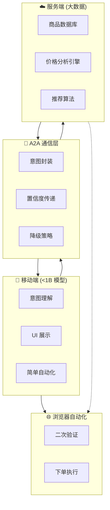

# 产品战略决策记录

> 创建时间：2026-04-01  
> 参与：Suhua + DevMate  
> 主题：个人助手架构方向

---

## 决策 1: 端侧模型选型

**决策内容**：端侧使用 **<1B 参数** 的轻量级模型

**理由**：
- 7B 模型在移动端推理速度慢、耗电高、发热严重
- 个人助手大部分任务是分类/路由/简单提取，不需要大模型
- <1B 模型可在骁龙 8 Gen3 上达到实时推理 (10+ tokens/s)

**技术选型**：
| 方案 | 参数 | 推理速度 | 适用场景 |
|------|------|---------|---------|
| **TinyLlama-1.1B** | 1.1B | ~15 tokens/s | 通用任务路由 |
| **Qwen-0.5B** | 0.5B | ~30 tokens/s | 简单分类/提取 |
| **Phi-2-2.7B** | 2.7B | ~8 tokens/s | 复杂推理 (备用) |
| **自研<1B** | <1B | 目标 50+ tokens/s | 定制化任务 |

**影响**：
- ✅ 端侧电量/发热可控
- ✅ 可离线运行基础功能
- ⚠️ 复杂任务需依赖服务端指导

---

## 决策 2: 服务端大数据分析

**决策内容**：服务端建立**全品类商品价格数据库**，作为移动端购物的"知识底座"

**架构**：
```
服务端 (Serverless/Cloud)
├── 商品数据采集 (爬虫 + API)
│   ├── 淘宝/天猫
│   ├── 京东
│   ├── 拼多多
│   └── 抖音电商
├── 价格分析引擎
│   ├── 历史价格趋势
│   ├── 跨平台比价
│   ├── 促销周期预测
│   └── 假货/差评识别
└── A2A 接口
    ├── 商品推荐 API
    ├── 价格预警 API
    └── 购买决策指导 API
```

**端侧 - 服务端协作流程**：
```
1. 用户说"我想买无线耳机"
   ↓
2. 端侧<1B 模型理解意图 → 发送请求到服务端
   ↓
3. 服务端返回：
   - 推荐商品列表 (带链接)
   - 历史价格分析
   - 最佳购买时机建议
   ↓
4. 端侧模型：
   - 方案 A: 直接展示服务端推荐链接
   - 方案 B: 用 browser tool 二次验证 (库存/最新评价)
   ↓
5. 用户确认购买 → 端侧自动化下单
```

**优势**：
- ✅ 端侧计算负载极低 (只做意图理解 + UI 展示)
- ✅ 服务端大数据提供决策质量保障
- ✅ 支持"直接给链接"和"二次搜索验证"两种模式

---

## 决策 3: A2A 通信协议

**决策内容**：端侧与服务端采用**结构化 A2A 协议**，不是简单 API 调用

**A2A vs 传统 API**：
| 特性 | 传统 API | A2A (Agent-to-Agent) |
|------|---------|---------------------|
| 通信内容 | 请求/响应 | 意图/上下文/置信度 |
| 决策权 | 服务端单向返回 | 端侧可质疑/追问/协商 |
| 上下文 | 无状态 | 多轮对话记忆 |
| 容错 | 错误码 | 降级策略 + 置信度阈值 |

**A2A 消息格式 (草案)**：
```json
{
  "intent": "product_search",
  "query": "无线耳机",
  "constraints": {
    "budget": 500,
    "brand_preference": ["Sony", "Bose"],
    "features": ["降噪", "长续航"]
  },
  "context": {
    "user_history": "上次购买的是 Sony WH-1000XM4",
    "current_need": "通勤用，需要降噪"
  },
  "confidence": 0.85,
  "fallback_strategy": "if confidence < 0.7, ask user for clarification"
}
```

**服务端响应**：
```json
{
  "recommendations": [
    {
      "product_id": "sony-wh1000xm5",
      "name": "Sony WH-1000XM5",
      "price": {"taobao": 2299, "jd": 2499, "pdd": 2199},
      "price_trend": "下降中，建议 7 天内购买",
      "confidence": 0.92,
      "direct_link": "https://...",
      "reasoning": "基于你的预算和降噪需求，XM5 性价比最高"
    }
  ],
  "action_suggestion": "direct_show_links",
  "alternative_actions": ["verify_stock", "check_reviews"]
}
```

---

## 更新后的架构



---

## 对 P0 任务的影响

### 新增任务 (优先级提升)
| 任务 | 交付物 | 依赖 |
|------|--------|------|
| **端侧<1B 模型选型** | `Mobile-Model-Benchmark.md` | 无 |
| **A2A 协议设计** | `A2A-Protocol-v1.0.md` | 无 |
| **服务端商品数据库** | `Product-DB-Schema.md` | 需爬虫开发 |

### 调整任务 (范围变更)
| 原任务 | 新范围 |
|--------|--------|
| 购物比价技能 | 改为"端侧意图理解 + 服务端推荐 + 二次验证" |
| 本地模型部署 | 从 7B 改为<1B 模型基准测试 |

---

## 待决策问题

**Q1. 服务端部署方案**
- A) 自建服务器 (成本高，可控性强)
- B) 云服务 (阿里云/腾讯云函数，按需付费)
- C) 混合 (核心数据自建，爬虫用 Serverless)

**Q2. 数据采集策略**
- A) 公开 API 优先 (京东联盟、淘宝联盟)
- B) 爬虫采集 (法律风险，需合规审查)
- C) 用户众包 (用户授权后采集浏览/购买记录)

**Q3. <1B 模型选型**
- A) 直接用量产模型 (TinyLlama/Qwen-0.5B)
- B) 基于开源模型微调 (用用户数据训练)
- C) 自研超小模型 (<100M 参数，极致性能)

---

## 下一步行动

1. **本周**：完成 A2A 协议 v1.0 设计
2. **下周**：启动<1B 模型基准测试 (推理速度/内存/精度)
3. **两周内**：设计服务端商品数据库 Schema

---

> 记录人：DevMate  
> 下次回顾：2026-04-08 (检查 A2A 协议进展)
