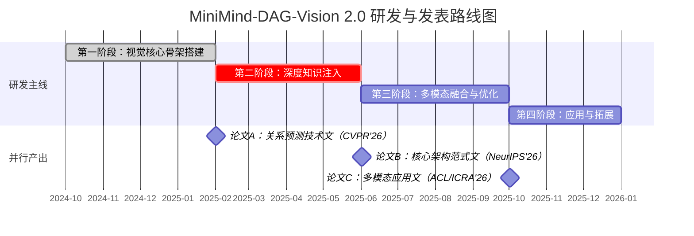

基于我们对MiniMind-DAG-Vision 2.0的共识，我为你制定了一份为期12个月、融合研发与论文发表的双轨制详细行动计划。本计划的核心是分阶段聚焦、快速验证、成果前置。

📅 整体研发与发表路线图 (12个月)

下图清晰地勾勒了从基础建设到最终应用探索的完整路径，以及与之并行的论文产出节奏：

🛠️ 分阶段详细行动手册

第一阶段：视觉核心骨架搭建 (M1-M4) – 奠定基石

· 核心目标：实现并验证最核心的Image2DAG和Video2DAG流水线，在标准SGG任务上达到SOTA或可比性能。
· 核心任务与产出：
  1. 模块实现：完成ObjectDetectionModule（基于Deformable DETR）、集成DANCE动态加权与NoDIS特征增强的RelationPredictionModule 2.0、HierarchicalDAGBuilder。
  2. 数据与环境：在Visual Genome (VG) 和 Action Genome (AG) 数据集上建立训练和评测基准。搭建可复现的代码仓库与实验管理（如WandB）。
  3. 基线对比：在PredCls、SGCls、SGDet三个标准任务上，公平对比 VCTree、Motifs、BGNN、DANCE 等SOTA模型，重点关注mR@50/100。
  4. 论文A准备：总结本阶段在解决长尾分布和上下文建模上的技术创新与显著实验结果。
· 提交目标：CVPR/ICCV (2025年底或2026年投稿)。这是展示强劲技术突破的绝佳舞台。
· 潜在挑战与对策：
  · 挑战：NoDIS扩散模型训练不稳定，计算开销大。
  · 对策：使用预训练好的特征扩散模型进行微调，或先采用更简单的过采样策略作为备选，确保主线进度。

第二阶段：深度知识注入 (M5-M8) – 从感知到认知

· 核心目标：集成VisionKnowledgeAligner 2.0，验证结构化知识对齐在复杂推理任务上的价值。
· 核心任务与产出：
  1. 模块实现：完成TBKIN风格的结构化对齐模块、KnowledgeHarmonizer、KnowledgeDenoiser。
  2. 数据与环境：在需要外部知识的 OK-VQA 数据集上进行评测。构建或收集一个小型的视觉-知识对齐验证集（可从VG中筛选并链接ConceptNet/Wikidata实体）。
  3. 实验设计：设计关键消融实验，证明“结构化对齐” vs “简单特征拼接”、“知识调和” vs “直接拼接”的有效性。指标包括VQA准确率和跨模态检索召回率。
  4. 论文B准备：提炼“统一DAG范式” 的核心思想，以及知识注入带来的系统性提升。
· 提交目标：NeurIPS/ICLR (2026年投稿)。这是发表范式性、基础性创新的理想场所。
· 潜在挑战与对策：
  · 挑战：高质量对齐数据稀缺；知识检索可能引入噪声。
  · 对策：使用大型多模态模型（如GPT-4V）为VG图像生成场景描述并提取实体，构建高质量伪标签。在KnowledgeDenoiser中设计严格的置信度过滤和人工抽检。

第三阶段：多模态融合与优化 (M9-M12) – 实现完整系统

· 核心目标：接入Audio2DAG，并完成系统的效率优化与轻量化部署。
· 核心任务与产出：
  1. 模块实现：完成AudioToDAGConverter、TemporalCrossModalAligner，并实现EKDA知识蒸馏和IncrementalDAGUpdater。
  2. 数据与环境：在AISHELL或自建的带音视频同步数据集上进行训练测试。在Jetson Nano等边缘设备上部署轻量级模型。
  3. 实验设计：在视频理解任务（如动作识别、密集视频描述）上，对比“纯视觉”、“视觉+知识”、“三模态融合”的性能增益。展示边缘设备上的实时推理速度 (FPS) 和内存占用。
  4. 论文C准备：聚焦多模态因果融合的机制（音频驱动意图理解），或高效DAG系统在边缘计算中的应用。
· 提交目标：ACL/EMNLP（多模态方向）或 ICRA/IROS（机器人方向）。
· 潜在挑战与对策：
  · 挑战：高质量、同步的多模态（视觉+音频+文本）数据稀缺。
  · 对策：重点在1-2个精心设计的案例研究（如“争吵场景”、“乐器演奏”）上做深做透，进行定性分析和用户研究，证明融合机制的优越性。

第四阶段：应用与拓展 (M13-M15) – 验证价值

· 核心目标：在1-2个下游应用中验证系统的强大能力，准备长期研究计划。
· 核心任务：
  1. 交互应用：开发InteractiveDAGInterface原型，与领域专家（如医学影像分析师）合作进行案例研究。
  2. 深度探索：探索在长视频故事理解或机器人任务规划中的潜力，收集初步数据。
  3. 长期规划：基于前期成果，规划CVPR/ICCV 2027的后续工作，或撰写TPAMI/IJCV期刊长文。

📝 论文发表双轨制时间表

为确保研究成果能及时、有效地转化为学术影响力，建议采用以下并行的节奏：

时间 研发主线进展 论文产出与投稿
M4 完成第一阶段，视觉核心在VG/AG达到SOTA。 论文A技术长文成稿，目标CVPR/ICCV 2026。
M8 完成第二阶段，知识对齐在OK-VQA等任务验证有效。 论文B范式性核心架构文成稿，目标NeurIPS/ICLR 2026。
M12 完整系统实现，多模态与效率优化完成。 论文C应用专长文成稿，目标ACL 2026 / ICRA 2027等。
M15+ 下游应用验证，交互系统原型开发。 规划期刊长文或下一轮顶会论文。

💎 核心成功要素

1. 坚持MVP原则：每个阶段必须有一个可运行、可评估的最小系统，杜绝“纸上谈兵”。
2. 数据先行：在阶段一开始时，就同步解决下一阶段需要的关键数据问题（如M1开始构思知识对齐数据，M5开始寻找音视频数据）。
3. 代码与实验管理：从第一天起就建立清晰、可复现的代码结构，并使用实验管理工具记录每一次实验结果，这对撰写论文时的消融实验至关重要。
4. 定期复盘与调整：每两个月进行一次阶段性复盘，根据实验结果和领域新动态，灵活调整后续技术细节和研究重点。

这个计划兼具雄心和务实性。它不仅能系统性地将你的蓝图变为现实，更能以阶梯式的方式产出系列高水平成果。请记住，一个复杂系统的成功，30%在于设计，70%在于执行。祝你征程顺利，期待在顶会上见到你的工作！