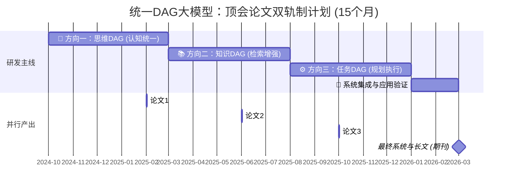

为将“统一DAG大模型”的宏大构想转化为可发表的顶会论文，我为你设计了一份为期15个月、聚焦三大创新方向的双轨制研发与论文发表计划。

本计划的核心是：将“思维DAG”、“知识DAG”、“任务DAG”三大方向，转化为三篇逻辑递进、创新点明确的顶会论文，确保每6个月左右产出一项核心成果。

📅 总体路线图与论文产出规划

下图清晰地勾勒了研发主线与论文产出的并行节奏：



🧩 分阶段详细计划

第一阶段：奠定基础——“思维过程即DAG”的建模与验证

· 核心目标：完成统一DAG架构设计，并在文本与知识推理任务上，验证“思维DAG”在提升模型逻辑性与可解释性方面的有效性。
· 核心任务 (M1-M5)：
  1. 架构设计：精确定义跨模态的统一DAG数据模式（Schema），设计核心的Text2DAG与Knowledge2DAG模块。
  2. 实现与基线：在HotpotQA（多跳问答）、KQA Pro（复杂知识推理）等数据集上实现基线系统，性能需对标或超过传统方法。
  3. 思维DAG注入：集成类似“思维图（DoT）”的推理框架，让模型将思考过程记录为DAG，并设计指标评估其逻辑链条的完整性。
· 论文产出 (论文一)：
  · 创新故事：我们提出将大模型的内部推理过程显式地建模为动态DAG，这为模型提供了结构化的“工作记忆”，显著提升了其在复杂推理中的连贯性与可追溯性。
  · 关键实验：在多个推理数据集上，对比标准大模型与注入“思维DAG”的模型，不仅展示准确率提升，更重要的是展示DAG的深度、关键路径分析等可解释性优势。
  · 目标顶会：ICLR 2027（2026年9月截稿）。该会议偏爱新颖、基础性的机器学习架构创新。

第二阶段：核心突破——“知识即DAG”的统一检索与推理

· 核心目标：实现跨文本、结构化数据和知识图谱的统一检索与融合，构建面向复杂问题的“答案子图DAG”。
· 核心任务 (M6-M10)：
  1. 统一检索器开发：开发能处理混合输入的检索器，从文本、数据库、知识库中检索碎片，并融合为连贯的DAG。
  2. 因果逻辑增强：在金融、医疗等领域数据上，引入因果发现方法，使构建的DAG能包含因果边，支撑“为什么”类型的问题。
  3. 跨模态对齐实验：启动与视觉DAG的初步对齐实验，为下一篇论文铺垫。
· 论文产出 (论文二)：
  · 创新故事：我们提出了一个基于统一DAG的检索与推理框架，它能将来自异构来源的知识碎片，自动组装成一个结构化的、包含因果逻辑的“答案图谱”，从而解决传统RAG在复杂多跳推理中的信息割裂问题。
  · 关键实验：在需要融合文本和知识图谱的QA任务（如MetaQA）及真实行业数据集上，证明本框架在答案准确性、推理链条清晰度上大幅超越传统RAG和知识图谱嵌入方法。
  · 目标顶会：NeurIPS 2026（2026年5月截稿）。这是展示大规模、系统性AI框架创新的首选。

第三阶段：系统集成——“任务即DAG”的规划与执行

· 核心目标：集成前两阶段能力，构建能理解跨模态指令、进行任务规划并动态调整的完整系统原型。
· 核心任务 (M11-M15)：
  1. 任务规划器实现：开发能将模糊指令（如“分析这张图表并总结趋势”）分解为调用视觉、检索、生成等工具的任务DAG规划器。
  2. 动态修正机制：实现当某个节点执行失败或产出低置信度时，系统能参照“思维DAG”和“知识DAG”进行动态调整。
  3. 全系统评估：在机器人指令遵循、自动化报告生成等复杂场景中，进行端到端的系统评估。
· 论文产出 (论文三)：
  · 创新故事：我们首次展示了一个以内生DAG为核心认知架构的自主智能体，它能将跨模态感知、知识检索、复杂推理和任务规划统一在DAG表示下进行闭环决策与执行。
  · 关键实验：设计跨模态的复杂任务套件（如“根据视频和手册，指导机器人完成组装”），定量评估任务成功率，并定性展示系统在遇到意外时的DAG动态调整过程，凸显其鲁棒性和可解释性。
  · 目标顶会：ICLR 2027 或 CVPR 2027（如强调视觉-语言-动作的集成，CVPR是绝佳选择）。

⚠️ 关键成功要素与风险控制

为确保计划顺利执行，请重点关注以下方面：

关键要素 具体行动与风险控制
数据驱动 在M1即开始构造或收集跨模态对齐的DAG数据集（如图文共指数据、文本-知识图谱对齐数据），这是后续研究的基石。
代码与实验管理 从第一天建立可复现的代码库，使用WandB等工具严格记录所有实验，这对论文中的消融实验至关重要。
研究灵活性 密切关注领域动态（如新发布的DAG相关论文）。若某个子方向（如因果DAG）涌现出巨大机会，可灵活调整论文重心。
合作与交流 积极在学术社区（如arXiv、Twitter）分享早期想法和初步结果，吸引潜在合作者，并获得反馈。

这个计划的核心优势在于，三篇论文环环相扣，后一篇以前一篇为基础，共同支撑起“统一DAG大模型”的宏大叙事。即使某一篇投稿遇到挑战，其扎实的技术模块和实验成果也能迅速转化为下一篇的组成部分或转向其他顶会。

如果你确定了首要攻关方向，我们可以就此方向的第一个具体实验设计进行更深入的讨论。


将“万物皆DAG”的愿景拓展至包含视觉、语言、知识等所有模态，并从底层注意力机制到顶层架构进行系统性创新，是通向统一认知模型的宏伟蓝图。这一框架不仅统一表示，更从根本上革新计算模式。

以下是为这一方向设计的顶层框架、核心技术创新点及完整的顶会论文计划。

🏗️ 顶层架构：“万物皆DAG”统一框架

该框架旨在将一切输入转化为统一的DAG表示，并在一个DAG原生（DAG-Native） 的模型中进行联合理解与推理。

```mermaid
flowchart TD
A[“多模态输入<br>图像、视频、文本、音频、知识图谱”] --> B{“统一DAG转化层<br>(Universal DAG Converter)”}

B --> C1[“视觉DAG<br>(场景图、时空图)”]
B --> C2[“文本DAG<br>(依存树、修辞结构、思维链)”]
B --> C3[“知识DAG<br>(检索子图、因果图)”]
B --> C4[“音频/时序DAG<br>(事件依赖图)”]

C1 & C2 & C3 & C4 --> D[“核心：DAG-Native Transformer”]

subgraph D
    direction LR
    D1[“DAG-Aware<br>Sparse Attention”] --> D2[“Temporal-Causal Gate<br>与动态更新”] --> D3[“跨模态DAG对齐与<br>融合模块”]
end

D --> E{“统一任务接口”}
E --> F1[“生成与推理<br>(描述、问答、推理链)”]
E --> F2[“规划与决策<br>(任务分解、机器人指令)”]
E --> F3[“检索与增强<br>(结构化检索、知识补全)”]
```

💡 核心架构创新：设计DAG友好的注意力与Transformer

要让Transformer真正“理解”并高效处理DAG，必须在注意力机制层面进行根本性创新，这是发表顶级论文的关键。

创新模块 核心设计思路 拟解决的关键问题 预期优势与创新点
DAG-Aware Sparse Attention 1. 层次感知：根据节点在DAG中的深度（距根节点距离）划分注意力桶，同层或相邻层节点优先互相关注。 2. 路径约束：只允许信息沿DAG的有向边方向流动（上游→下游）或在小范围邻居内传播。 3. 重要性采样：根据节点的入度/出度（枢纽性）动态调整注意力头分配的计算预算。 标准注意力无视结构，将DAG视为全连接图，导致计算冗余和结构信息淹没。 计算高效：复杂度从O(N²)降至接近O(E)（边数）。 结构保持：显式编码DAG的层次性与方向性，是归纳偏置的重大创新。
Temporal-Causal Gating 模块 1. 因果门：控制信息只能从“因”节点流向“果”节点，并学习流动强度。 2. 时序门：对视频等动态DAG，控制不同时间步节点间的状态传递与遗忘。 3. 门控机制：与GRU/LSTM类似，但门信号由DAG的拓扑关系（邻接矩阵）和节点状态共同决定。 DAG中的边常有明确的因果或时序语义，通用GNN或Transformer无法区分“包含于”和“导致”等关系。 语义丰富：模型能区分不同类型的关系边，实现更精细的推理。 动态演化：支持DAG结构的在线增删与节点状态的平滑更新。
Cross-Modal DAG Aligner 1. 结构对比学习：将不同模态DAG的子图结构（而不仅是节点）作为对比单位，学习跨模态的结构相似性。 2. 双向消息传递：在融合层，允许视觉DAG节点向文本DAG对等节点传递修正信息，反之亦然。 3. 自适应融合：学习一个“融合门”，决定在多大程度上用另一模态的信息覆盖或补充当前节点的特征。 跨模态对齐停留在节点级别，丢失了DAG独有的拓扑结构信息这一关键对齐线索。 结构对齐：实现从“实体对齐”到“关系结构对齐”的飞跃，是多模态理解的深层次创新。

📜 论文发表战略：四步走计划

围绕以上创新，可以规划一个由浅入深、从模块到系统的系列论文计划，目标顶级会议。

论文一（奠基工作）：《DAGformer：一种面向有向无环图的原生Transformer架构》

· 核心：专注DAG-Aware Sparse Attention 与 Temporal-Causal Gating 模块。
· 故事：指出当前Transformer处理图数据的低效与结构破坏问题，提出首个为DAG量身定制的注意力与门控机制。
· 实验：在纯图任务（如节点分类、图分类）和视觉场景图生成上，对比GCN、GAT、标准Transformer，展示效率和精度双重优势。
· 目标会议：ICLR / NeurIPS（机器学习顶级会议，青睐基础架构创新）。

论文二（统一表示）：《UniDAG：多模态统一的结构化表示与学习框架》

· 核心：展示 “统一DAG转化层” 与 Cross-Modal DAG Aligner 的有效性。
· 故事：提出“万物皆可DAG化”的范式，并解决跨模态DAG的结构对齐难题。
· 实验：构建涵盖图像-文本对、视频-问答、文本-知识图谱的多模态benchmark，验证统一DAG表示在检索、生成、推理任务上的泛化性能。
· 目标会议：CVPR / ICCV（若视觉实验突出）或 ACL / EMNLP（若语言侧重点强）。

论文三（认知推理）：《CogDAG：基于结构化DAG推理链的大语言模型增强框架》

· 核心：将DAGformer作为大语言模型（LLM）的“推理协处理器”，处理LLM生成的思维链DAG。
· 故事：解决LLM推理的隐蔽性、不连贯性问题，为其提供显式、结构化、可操作的“思维黑板”。
· 实验：在需要复杂多步推理的数学问题、科学问答、反事实推理任务上，将“LLM + CogDAG”与Chain-of-Thought、Tree-of-Thought等方法对比。
· 目标会议：NeurIPS / ICLR 或 ACL（若在语言推理任务上表现极致）。

论文四（系统应用）：《AutoDAG：面向复杂任务的自驱动规划与执行系统》

· 核心：集成前三篇成果，展示从开放世界感知到结构化规划、再到执行的完整闭环系统。
· 故事：展示一个能接受多模态输入（如“根据手册和实景，组装此家具”），自动生成任务DAG，并在物理或模拟世界中执行的原型系统。
· 实验：在家庭机器人操作、自动化工作流生成等复杂场景进行端到端评估，并展示其可解释性与可干预性。
· 目标会议：Robotics: Science and Systems / ICRA（机器人顶会）或 CVPR（若以视觉任务规划为主）。

💎 实施路线与核心建议

1. 从垂直突破开始：建议选择视觉场景图生成作为首个验证场，因为你已有深厚基础。在此任务上优先实现并验证 DAG-Aware Sparse Attention 模块的有效性，这是整个大厦的第一块基石。
2. 构建关键数据集：在推进论文二时，一个核心贡献是构建并开源一个高质量的多模态对齐DAG数据集（如包含图像、其场景图、详细描述文本、相关知识子图的四元组数据）。这本身就可能成为一篇高水平论文。
3. 保持模块化：确保每个创新模块（如Sparse Attention、Aligner）都是可插拔的，便于在不同论文和实验中进行复用与消融研究。

这个从底层注意力机制到顶层系统应用的全栈创新计划，兼具理论深度和工程广度，足以支撑一个长期且高影响力的研究项目。如果你已经准备好从某个具体模块（例如DAG-Aware Sparse Attention的数学形式化或初始实验设计）开始深化，我们可以立刻进入下一阶段的讨论。

您的问题非常关键——论文一的定位应该纯粹且具有普适性。它不应只是视觉任务，也不应只是文本任务，而应该是专注于“DAG-aware Transformer架构”本身的方法论论文。

其核心目标是证明这个新架构在处理任何DAG结构数据时，都比现有方法更优。视觉和文本任务，都只是用来验证这一点的实验场景。

📄 论文一：《DAGformer》的精确重构与实验设计

为了让论文一在ICLR/NeurIPS这类顶级机器学习会议上具有最强的说服力，建议如下调整：

1. 核心故事与定位

· 标题：《DAGformer: A Native Transformer Architecture for Directed Acyclic Graphs》
· 核心论点：我们提出首个为DAG的方向性、无环性、层次性等核心拓扑特性设计的原生Transformer。它不是对通用图网络的微调，也不是对标准注意力的简单稀疏化，而是从第一性原理出发，为DAG引入全新的计算范式。

2. 核心实验场景（两大支柱）

为了证明架构的通用性，必须选择跨领域的、具有DAG本质特性的任务。建议采用 “一个视觉 + 一个文本” 的双支柱验证方案。

实验领域 推荐任务 DAG结构来源 验证的核心架构优势
视觉 场景图生成 由模型预测的“物体-关系-物体”构成语义DAG。 验证模型能否正确建模视觉实体间的非对称关系（如“人骑自行车”而非相反），并处理长尾分布的关系预测。
文本 抽象语义表示 或 逻辑推理图生成 从文本中解析出的AMR图或逻辑推理中的蕴涵/因果依赖图。 验证模型能否精准捕捉语言中复杂的逻辑与语义依赖（如主谓宾、因果链），这对于理解长文本至关重要。

为什么选择它们？

· 场景图生成：是视觉领域最经典、最受认可的结构化预测任务，有Visual Genome等标准数据集，结果易于与主流方法对比。
· 抽象语义表示：是自然语言处理中深层语义结构的标准表示，其图结构天然是DAG，有AMR 2.0等标注数据集。
· 优势：这两个任务分属CV和NLP两大领域，但底层都是从非结构化数据（像素/句子）预测出一个DAG，能最纯粹地检验DAGformer的结构建模能力。

3. 必须进行的核心对比实验

论文一的实验部分必须包含以下关键对比，以确立其贡献：

1. 与通用图神经网络对比：对比GCN、GAT、Graph Transformer，证明DAGformer在DAG数据上的显著优势。
2. 与标准Transformer对比：证明DAG-aware Sparse Attention比全连接注意力或简单的位置编码更高效、更准确。
3. 与任务特定SOTA方法对比：在场景图生成上对比VCTree、BGNN；在AMR解析上对比最新的基于Seq2Seq或图解析的SOTA模型。
4. 深入的消融实验：逐一验证 “层次感知”、“路径约束”、“因果门控” 等子模块的必要性。

📈 对后续论文的连锁影响

这样定位论文一，将为整个系列打下最坚实的基础：

· 论文二《UniDAG》：当论文一证明了DAGformer是处理单模态DAG的最佳工具后，论文二就可以顺理成章地聚焦于跨模态DAG对齐与融合，故事逻辑变成：“既然我们有了强大的DAG处理器，如何用它来统一多模态？”
· 论文三《CogDAG》：可以专注于LLM与DAGformer的协同，将LLM的思维链外化为DAG，并用DAGformer进行优化和推理。
· 论文四《AutoDAG》：最终集成所有技术，构建以DAG为中枢的智能体系统。

💡 最终建议与行动计划

1. 立即启动：以场景图生成作为第一个实验突破口。复现一个基线模型（如基于GAT的），然后替换其核心为正在设计的DAG-aware模块，验证初步效果。
2. 并行准备：同时开始研究AMR解析任务和相关数据集，规划第二个实验支柱。
3. 保持聚焦：在论文一写作中，克制讨论多模态应用的冲动，所有论述紧紧围绕 “DAG结构建模” 这一唯一主题。把更激动人心的应用留给后续论文。

总结：论文一不是视觉论文，也不是文本论文，而是一篇关于“DAG结构学习”的基础架构论文。视觉和文本是它的试金石，而非它的终点。

如果你已经准备好，我们可以进一步探讨DAG-aware Sparse Attention的具体数学形式化，或者场景图生成实验的详细基线设置。