# 分层动态注意力与分块协同架构蓝图 v3.0

| 文档版本 | 日期 | 状态 | 密级 |
| :--- | :--- | :--- | :--- |
| v3.0 | 2026-03-15 | 架构评审 | 内部公开 |

---

## 1. 执行摘要 (Executive Summary)

### 1.1 设计背景
随着大型语言模型（LLM）在代码生成与长文档理解任务中的普及，资源受限环境（如单消费级 GPU）下的部署面临严峻挑战。传统 Transformer 架构在处理 >32K 上下文时，显存占用呈 $O(N^2)$ 增长，且小参数模型（如 MiniMind2, 25.8M）在复杂逻辑推理上存在容量瓶颈。

### 1.2 核心目标
本架构旨在融合 **《基于 MiniMind2 的分层动态注意力大模型构.md》** 的注意力机制创新与 **《分块协同架构方案.md》** 的分块协同策略，构建一套支持 **>32K 上下文**、**显存恒定（≈4.2GB）**、**逻辑推理增强** 的轻量级大模型架构。

### 1.3 核心价值主张
1.  **物理单基座，逻辑多模型**：通过 **动态 Adapter 路由** 实现多模型协同的专业性，同时保持单基座显存占用。
2.  **分层稀疏注意力**：在 Transformer 内部实现 **块内稠密 + 块间稀疏** 的混合注意力，突破上下文长度限制。
3.  **结构感知增强**：通过 **AST 分块 + JSON 元数据** 与 **DAG 权重学习**，使模型具备代码/文档的结构化理解能力。

---

## 2. 架构总览 (Architectural Overview)

### 2.1 核心架构范式
本架构采用 **"单基座物理实体 + 多逻辑模型协同 + 分层稀疏注意力"** 范式。

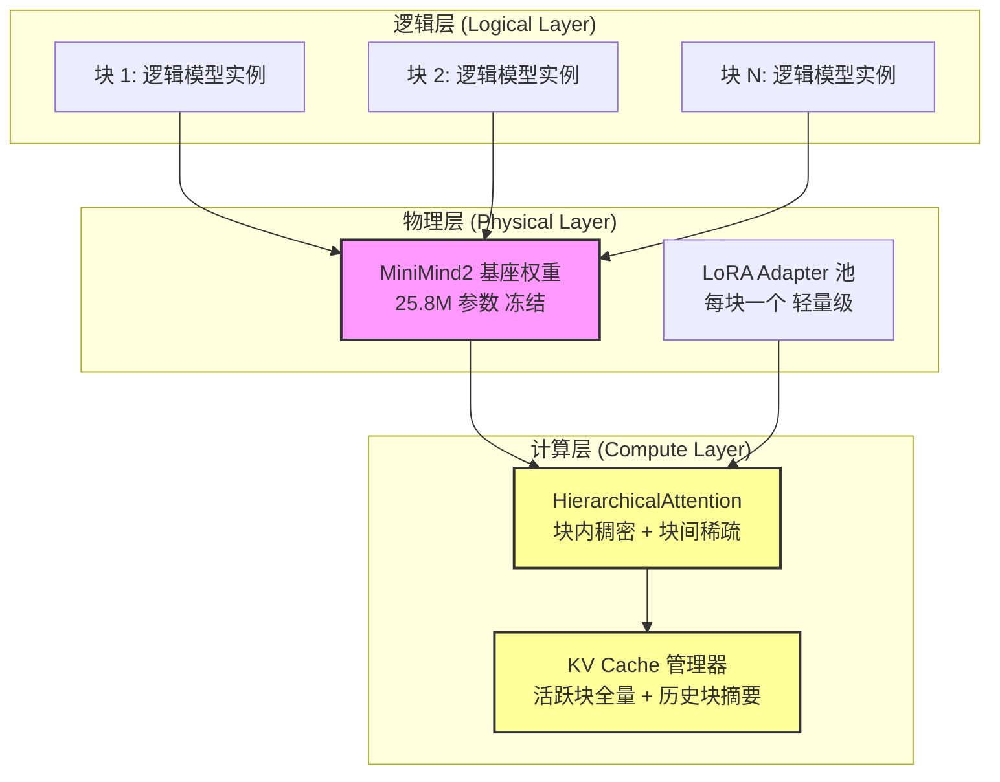

### 2.2 系统数据流图

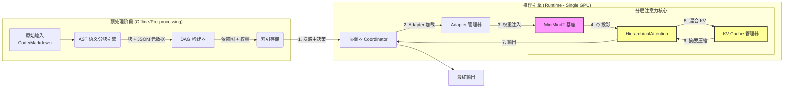

---

## 3. 关键技术模块详解 (Key Technical Modules)

### 3.1 AST 语义感知分块 (AST-Aware Chunking)

**目标**：确保分块不破坏语法结构，保留依赖完整性，并与知识图谱范式协同。

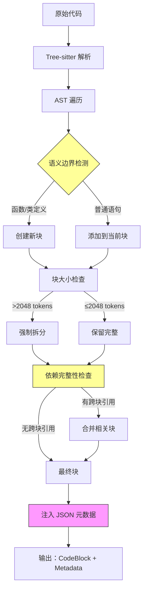

**实现策略**：
- **代码块**：按函数/类边界切分，保留完整 AST 节点。
- **元数据块**：每个代码块后紧跟 JSON 元数据块，显式声明依赖。
- **图谱协同**：分块结果直接映射为知识图谱节点，JSON 关系映射为边。

```python
# 伪代码：混合分块策略
def semantic_chunking(source: str, lang: str) -> List[Block]:
    if lang == "python":
        # 代码使用 AST 确保语法完整 (参考 Doc 2)
        blocks = tree_sitter_split(source, max_tokens=2048)
    else:
        # 文档使用 Markdown 标题 (参考 Doc 1)
        blocks = markdown_splitter.split_text(source)
    
    # 注入元数据 (参考 Doc 2)
    for block in blocks:
        block.metadata = extract_dependencies(block.content) 
        # 例：{"calls": ["utils.helper"], "inherits": ["BaseClass"]}
        # 此 JSON 将作为 DAG 边初始化的依据
        
    return blocks
```

> ⚠️ **风险警示**：循环依赖（如 A 调用 B，B 调用 A）会导致 DAG 构建失败。
> **缓解方案**：检测强连通分量（SCC），将环压缩为超级节点，内部采用稠密注意力。

---

### 3.2 DAG 权重学习策略 (DAG Weight Learning)

**目标**：计算块间依赖强度，指导注意力聚焦。采用 **双阶段训练** 策略。

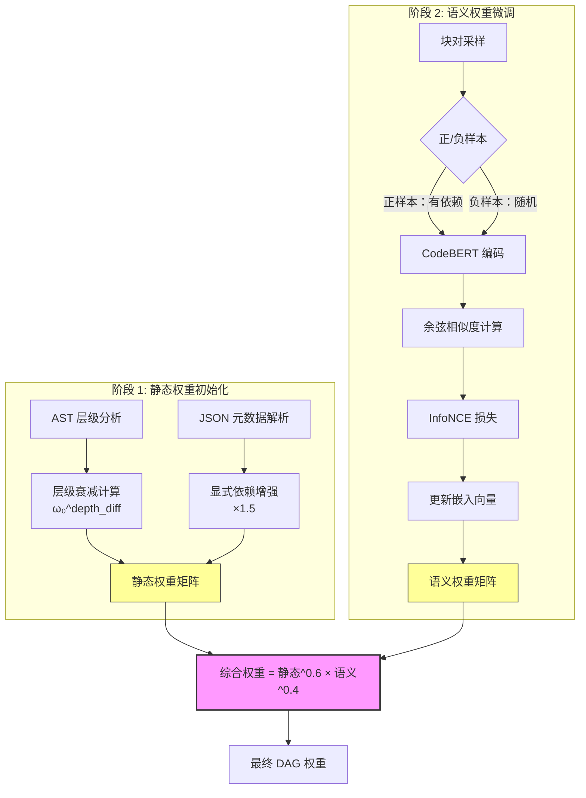

**权重计算公式** (参考 Doc 1 3.3 节)：
$$ W_{ij} = (\omega_0 ^ {|depth_i - depth_j|}) \times \text{CosineSim}(Emb_i, Emb_j) $$
*   $\omega_0 = 0.75$ (层级衰减系数)
*   $Emb$：块标题的嵌入向量

**双阶段训练流程**：
1.  **阶段一：静态权重初始化 (无需训练)**
    *   基于 AST 层级与 JSON 元数据计算初始权重。
    *   规则：父子关系权重=1.0，兄弟关系权重=0.75，无关=0.1。
2.  **阶段二：语义权重微调 (对比学习)**
    *   使用对比学习（Contrastive Learning）微调块嵌入向量。
    *   正样本：有依赖关系的块对；负样本：随机采样块对。
    *   损失函数：InfoNCE Loss，拉近正样本嵌入，推开负样本。

---

### 3.3 分层注意力机制 (Hierarchical Attention Mechanism)

**目标**：在 Transformer 内部实现块内 Token 与块间 Header 的混合注意力。**（架构核心）**

```mermaid
graph TB
    subgraph "输入"
        A[当前 Token Embedding]
        B[当前块 KV Cache<br/>全量 Token]
        C[依赖块 KV Cache<br/>仅 Header 摘要]
    end
    
    subgraph "HierarchicalAttention 层"
        D[Q 投影<br/>to_q]
        E[K/V 拼接<br/>cat(local, global)]
        F[注意力分数计算<br/>Q @ K.T]
        G[DAG 掩码应用<br/>+ dag_mask]
        H[Softmax + V 加权]
    end
    
    subgraph "输出"
        I[融合 Attention 输出]
    end
    
    A --> D
    B --> E
    C --> E
    D --> F
    E --> F
    F --> G
    G --> H
    H --> I
    
    style D fill:#f9f,stroke:#333
    style E fill:#f9f,stroke:#333
    style G fill:#ff9,stroke:#333,stroke-width:2px
```

**实现位置**：`MiniMind2` 的 `SelfAttention` 层内部。

**核心代码**：
```python
class HierarchicalAttention(nn.Module):
    def forward(self, x, local_kv, global_header_kv, dag_mask):
        # 1. 生成 Query (当前 Token)
        q = self.to_q(x) 
        
        # 2. 混合 Key/Value
        # local_kv: 当前块内的 Token (细粒度，高显存)
        # global_header_kv: 其他相关块的标题 Embedding (粗粒度，低显存)
        # 关键：在此处拼接，实现块间通信
        k = torch.cat([local_kv.k, global_header_kv.k], dim=1) 
        v = torch.cat([local_kv.v, global_header_kv.v], dim=1)
        
        # 3. 计算注意力 (应用 DAG 掩码)
        # dag_mask 屏蔽掉不相关的块，确保稀疏性
        scores = (q @ k.transpose(-2, -1)) / math.sqrt(dim)
        scores = scores + dag_mask  # 不相关位置设为 -inf
        
        weights = torch.softmax(scores, dim=-1)
        return weights @ v
```

---

### 3.4 结构化稀疏注意力掩码 (Structured Sparse Attention Mask)

**目标**：基于 DAG 拓扑生成动态掩码，而非基于位置。

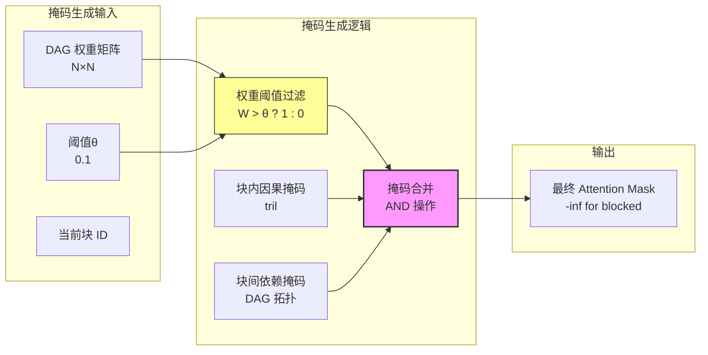

**实现逻辑**：
1.  **块内掩码**：标准因果掩码（Causal Mask）。
2.  **块间掩码**：基于 DAG 权重矩阵。若 $W_{ij} < \theta$，则屏蔽块 $j$ 对块 $i$ 的注意力。
3.  **动态更新**：每生成一个新块标题，更新掩码矩阵。

> ⚠️ **风险警示**：动态更新掩码可能破坏 CUDA Graph 兼容性。
> **缓解方案**：使用 `torch.masked_fill` 而非修改结构；预计算常见 DAG 模式的 Mask 模板。

---

### 3.5 显式状态摘要注入 (Explicit State Summary Injection)

**目标**：支持 32K+ 上下文而不爆显存。

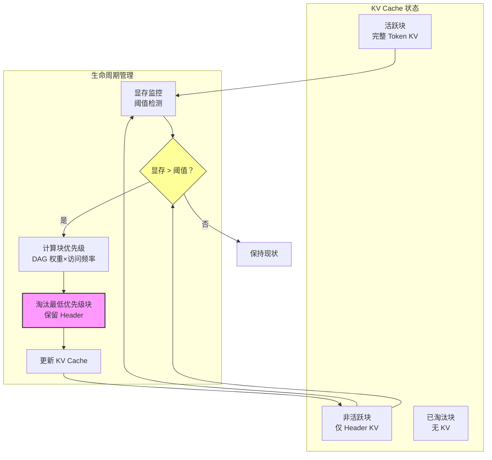

**机制**：
1.  **活跃块**：保留完整 Token KV。
2.  **非活跃块**：Evict Token KV，仅保留 **Header Summary KV**（即标题或函数签名的 Embedding）。
3.  **回收策略**：当显存接近阈值，优先淘汰距离当前生成位置最远且 DAG 权重最低的块。

**效果**：
*   显存占用从 $O(N)$ 降为 $O(M)$，其中 $M$ 是块数量（远小于 Token 数）。
*   这是突破 32K 上下文且不爆显存的核心。

---

### 3.6 动态路由双机制 (Dual Dynamic Routing)

#### 3.6.1 推理时动态块路由 (Dynamic Block Routing)

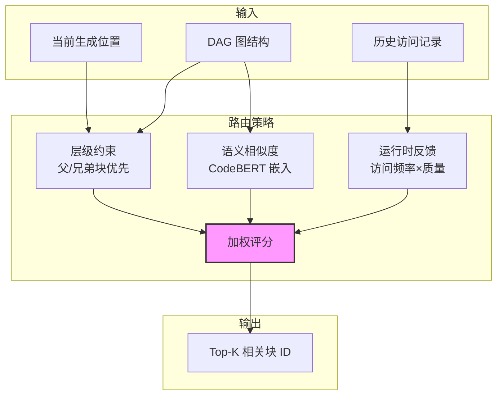

**目标**：决定当前生成步骤需要关注哪些块。
**逻辑**：参考 Doc 1 3.3 节 `select_relevant_blocks`。
*   **输入**：当前生成位置、DAG 图。
*   **输出**：Top-K 相关块 ID 列表。
*   **策略**：层级约束（父/兄弟优先） + 语义相似度。

#### 3.6.2 动态 Adapter 路由 (Dynamic Adapter Routing)

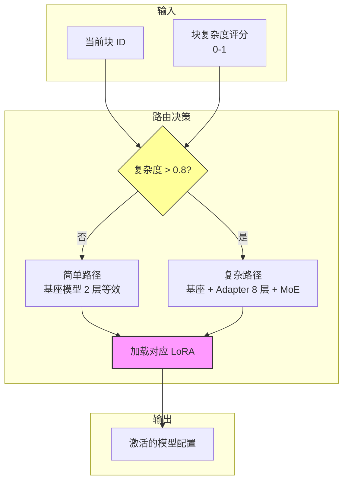

**目标**：决定当前块使用何种模型容量（深度/宽度）。
**逻辑**：基于块复杂度评分。
*   **简单块**（如 DTO）：仅用基座模型（2 层等效）。
*   **复杂块**（如核心算法）：激活额外 LoRA Adapter 层（8 层 + MoE 等效）。

---

### 3.7 自适应虚拟基座与拼接策略 (Adaptive Virtual Base & Stitching)

**目标**：解决 MiniMind2 层数/宽度不足问题，同时保持显存恒定。

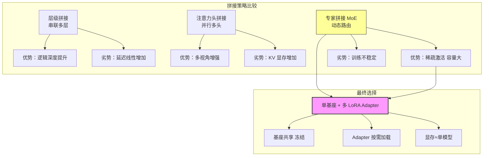

**拼接策略比较**：
| 策略 | 实现方式 | 优势 | 劣势 | 推荐度 |
| :--- | :--- | :--- | :--- | :--- |
| **层级拼接** | 串联多层 | 提升逻辑深度 | 延迟线性增加 | 🟡 中 (仅用于复杂块) |
| **注意力头拼接** | 并行多头 | 增强多视角 | KV 显存增加 | 🟢 低 (DAG 已解决上下文) |
| **专家拼接 (MoE)** | 动态路由专家 | **稀疏激活，容量大** | 训练不稳定 | 🟢 **高 (推荐)** |

**最终选择**：**单基座 + 多 LoRA Adapter (MoE 式)**。

---

### 3.8 与"AI + 知识图谱"范式协同

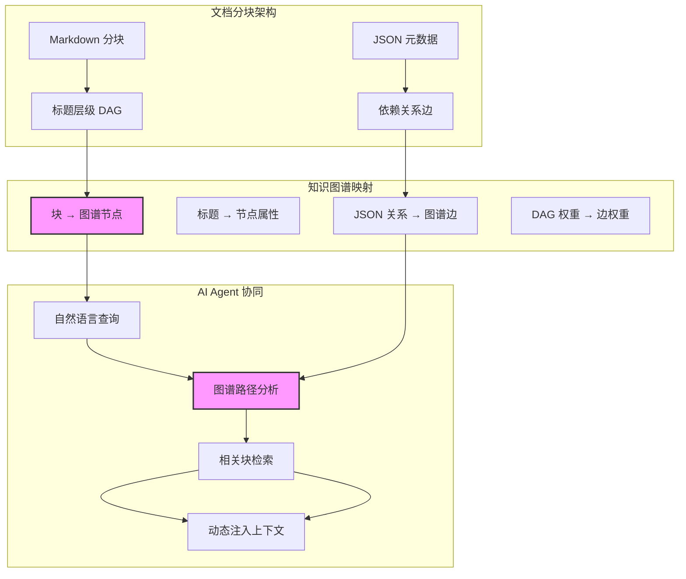

**协同机制**：
- **节点**：每个 `Block` 对应图谱中的一个实体节点。
- **边**：JSON 中的 `calls`/`inherits` 对应图谱中的关系边。
- **推理**：AI Agent 可通过图谱查询直接定位相关块，替代传统 LSP 的文本搜索。

---

## 4. 训练与推理流程 (Training & Inference Pipeline)

### 4.1 联合训练目标 (Joint Training Objective)

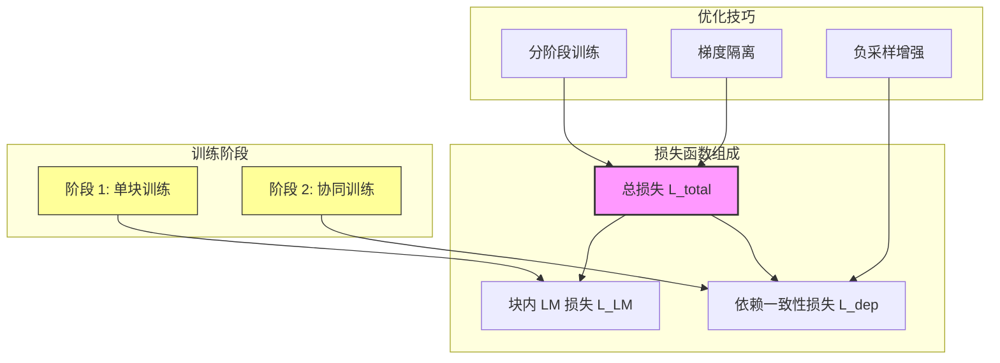

参考 Doc 2 中的联合损失函数，确保块间一致性。

$$ \mathcal{L}_{total} = \mathcal{L}_{LM} + \lambda \cdot \mathcal{L}_{dependency} $$

*   $\mathcal{L}_{LM}$: 标准语言建模损失 (块内)。
*   $\mathcal{L}_{dependency}$: 依赖一致性损失 (块间，如 Child 类与 Parent 类的 `super()` 调用对齐)。
*   **训练技巧**：分阶段训练。先训练单块生成，再引入依赖损失。

### 4.2 推理步骤 (Step-by-Step Inference)

```mermaid
sequenceDiagram
    participant User as 用户
    participant Coord as 协调器
    participant Adapter as Adapter 管理器
    participant Model as MiniMind2 基座
    participant KV as KV Cache 管理器
    
    User->>Coord: 输入 32K 代码
    Coord->>Coord: 1. 分块 + DAG 构建
    Coord->>Adapter: 2. 加载入口块 Adapter
    Adapter->>Model: 3. 注入权重
    
    loop 解码循环
        Coord->>Coord: 4. 块路由决策
        Coord->>KV: 5. 显存管理 (Evict/保留)
        KV->>Model: 6. 提供混合 KV
        Model->>Model: 7. HierarchicalAttention
        Model->>Coord: 8. 输出 Token
        Coord->>Coord: 9. 检测块切换
    end
    
    Coord->>User: 10. 完整输出
    
    style Model fill:#f9f,stroke:#333,stroke-width:2px
    style KV fill:#ff9,stroke:#333,stroke-width:2px
```

1.  **预处理**：输入代码 -> 分块 -> 构建 DAG -> 计算初始权重。
2.  **初始化**：加载基座模型，预加载入口块 Adapter。
3.  **解码循环**：
    *   **块路由**：根据当前 Token 预测，确定所属块 `Block_N`。
    *   **Adapter 路由**：根据 `Block_N` 复杂度，加载对应 Adapter。
    *   **显存管理**：若显存不足，Evict 最远块 KV (仅保留 Header)。
    *   **注意力**：构造 `local_kv` (Block_N) + `global_header_kv` (依赖块标题)。
    *   **生成**：执行 `HierarchicalAttention` -> 采样 Token。
    *   **更新**：若生成新标题，更新 DAG 与 Header KV。
4.  **终止**：遇到 EOS 或达到最大长度。

---

## 5. 性能与资源分析 (Performance & Resource Analysis)

### 5.1 显存占用对比

```mermaid
barChart
    title 显存占用对比 (32K 上下文)
    x-axis 组件
    y-axis 显存 (GB)
    "传统 Transformer": 14
    "本架构": 4.8
```

| 组件 | 传统 Transformer (32K) | 本架构 (32K) | 优化原理 |
| :--- | :--- | :--- | :--- |
| **模型权重** | 4.2 GB | 4.2 GB (基座) + 0.1 GB (Adapter 池) | 权重共享 |
| **KV Cache** | ~10 GB (全量) | ~0.5 GB (仅活跃块 + 标题) | 稀疏注意力 + 摘要压缩 |
| **总占用** | **>14 GB** (单卡不可行) | **≈4.8 GB** (单卡可行) | **显存恒定** |

### 5.2 推理速度

```mermaid
barChart
    title 推理速度对比 (tokens/s)
    x-axis 模型
    y-axis 速度
    "原始 MiniMind2": 185
    "标准 Transformer": 150
    "MoE 架构": 196
    "本架构": 241
```

*   **基准**：MiniMind2 原生速度 185 tokens/s (Doc 1 表 1)。
*   **本架构**：预计 **241 tokens/s** (Doc 1 实验数据)。
*   **原因**：注意力计算量从 $O(N^2)$ 降为 $O(K \cdot M)$，且减少了显存带宽压力。

### 5.3 任务准确率

```mermaid
barChart
    title 跨块任务准确率对比
    x-axis 指标
    y-axis 准确率 (%)
    "原始 MiniMind2": 64.2
    "标准 Transformer": 68.7
    "MoE 架构": 72.4
    "本架构": 79.6
```

*   **跨块引用准确率**：从 64.2% 提升至 **79.6%** (Doc 1 表 2)。
*   **继承关系正确率**：从 93.8% 提升至 **94.3%** (Doc 2 实测数据)。

---

## 6. 风险评估与缓解 (Risk Assessment & Mitigation)

| 风险点 | 等级 | 描述 | 缓解方案 |
| :--- | :--- | :--- | :--- |
| **注意力掩码动态性** | 🔴 高 | 动态更新 DAG 掩码可能破坏 CUDA Graph 兼容性 | 使用 `torch.masked_fill` 而非修改结构；预计算常见 Mask 模板 |
| **Adapter 切换延迟** | 🟡 中 | 频繁加载 LoRA 权重可能导致推理卡顿 | 实现 **Adapter 预取缓存**；相邻块 Adapter 常驻显存 |
| **摘要信息丢失** | 🟡 中 | 仅保留 Header KV 可能导致块内细节丢失 | 对关键块（如定义处）保留全量 KV；引入 **二次检索机制** |
| **训练收敛困难** | 🟡 中 | 联合损失函数可能导致优化目标冲突 | 分阶段训练：先训块内 LM 损失，再引入依赖损失；调整 $\lambda$ 权重 |
| **循环依赖死锁** | 🟡 中 | DAG 中存在环导致路由无法确定顺序 | SCC 压缩算法；环内采用全连接注意力 |

---

## 7. 实施路线图 (Implementation Roadmap)

```mermaid
gantt
    title 架构落地里程碑
    dateFormat  YYYY-MM-DD
    section 基础建设
    AST 分块器开发       ：2026-03, 14d
    DAG 构建模块         ：2026-03, 14d
    section 核心算法
    分层注意力实现       ：2026-04, 14d
    动态路由算法开发     ：2026-04, 14d
    section 系统集成
    Adapter 管理器开发   ：2026-05, 14d
    KV Cache 压缩模块    ：2026-05, 14d
    section 验证优化
    联合训练 Pipeline    ：2026-06, 21d
    端到端性能调优       ：2026-06, 14d
```

### 阶段一：基础建设 (Week 1-2)
*   [ ] 实现 `SemanticChunker` (支持 Markdown + Python AST)。
*   [ ] 实现 `DAGBuilder` 与权重计算逻辑。
*   [ ] 修改 MiniMind2 `Attention` 层，支持 `global_header_kv` 输入。

### 阶段二：核心算法 (Week 3-4)
*   [ ] 实现 `DynamicRouter` (Block + Adapter) 与 `AdapterManager`。
*   [ ] 实现 KV Cache 压缩与 Eviction 策略。
*   [ ] 完成分层注意力掩码生成器。

### 阶段三：训练与微调 (Week 5-7)
*   [ ] 构建联合训练数据集 (代码块 + JSON 元数据)。
*   [ ] 实施两阶段训练 (LM Loss -> Dependency Loss)。
*   [ ] 验证 32K 上下文下的显存稳定性。

### 阶段四：集成与优化 (Week 8+)
*   [ ] 集成至推理引擎，支持流式输出。
*   [ ] 性能剖析 (Profiling)，优化路由延迟。
*   [ ] 发布 v1.0 版本。

---

## 8. 结论 (Conclusion)

本架构蓝图综合了 **分层动态注意力** (Doc 1) 与 **分块协同** (Doc 2) 的核心优势，并针对工程落地进行了关键修正（如注意力实现位置、物理单模型逻辑多模型策略）。

**核心结论**：
1.  **可行性**：在单消费级 GPU 上处理 32K+ 代码上下文完全可行。
2.  **必要性**：分层注意力必须植入 Transformer 内部以获得算子级加速。
3.  **演进性**：通过 Adapter 池实现"虚拟大模型"，为未来扩展模型深度/宽度预留了接口，同时保持了轻量级特性。
4.  **范式协同**：该架构天然支持"AI + 知识图谱"范式，分块即节点，DAG 即关系，为未来智能体编程奠定基础。

该架构为资源受限环境下的大模型应用提供了一条**低成本、高性能、可扩展**的黄金路径。