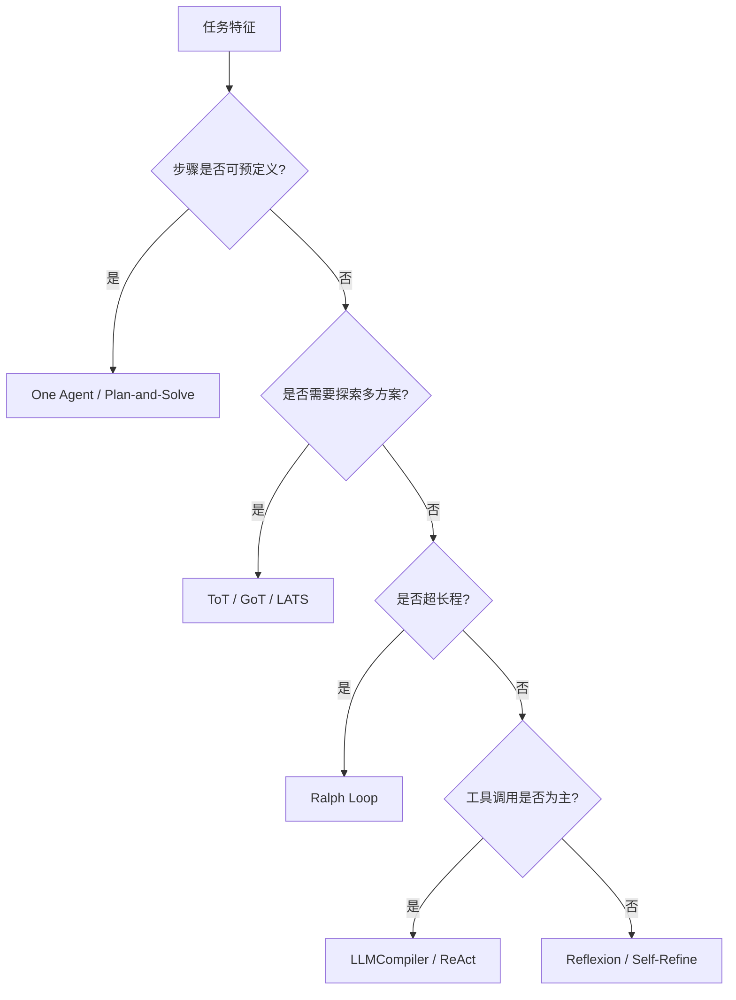

AI Agent的**规划-执行（Planning-Execution）**架构是一个活跃的研究领域，除了One Agent和Ralph Loop，还存在多种范式。以下是按**决策复杂度**和**执行拓扑**分类的系统性梳理：

---

## 一、链式线性模式（Linear Chain）

### 1. **ReAct（Reasoning + Acting）**
- **机制**：交替进行"思考（Thought）→行动（Action）→观察（Observation）"的循环
- **特点**：逐步推理，每步都依赖前一步结果，容错性强但延迟高
- **局限**：长程任务中上下文膨胀，容易"思路漂移"
- **代表**：AutoGPT、LangChain Agent基础模式

### 2. **Plan-and-Solve / Plan-and-Execute**
- **机制**：先全局规划（生成步骤列表），再按序执行
- **变体**：
  - **Zero-shot Planner**：直接生成计划后执行
  - **LLM+P**：结合经典规划器（如PDDL），LLM负责问题翻译，传统算法求解最优路径
- **与One Agent区别**：Plan-and-Solve通常只规划一次，缺乏动态重规划机制；One Agent引入了锚点触发重推理

### 3. **Least-to-Most Prompting**
- **机制**：将复杂问题分解为子问题链，按依赖顺序解决（先解决简单子问题，结果作为后续问题的上下文）
- **适用**：数学推理、多跳问答

---

## 二、树/图搜索模式（Search-Based）

### 4. **Tree of Thoughts (ToT)**
- **机制**：维护多个候选推理路径（思维节点），通过BFS或DFS搜索最优路径
- **评估函数**：LLM自我评估每个节点的可行性（"这个思路是否 promising？"）
- **成本**：高（需要多次LLM调用评估不同分支）
- **适用**：创意写作、谜题求解、需要探索多种方案的场景

### 5. **Graph of Thoughts (GoT)**
- **机制**：将推理过程建模为**有向图**（而非树），支持思维节点的聚合、精炼、循环
- **优势**：可以合并多个相似思路（Aggregation），或循环优化同一思路（Refinement）
- **与DAG关系**：GoT天然适合处理DAG结构化的推理（如知识图谱问答）

### 6. **LATS（Language Agent Tree Search）**
- **机制**：结合蒙特卡洛树搜索（MCTS）与LLM，通过模拟（Simulation）和价值评估选择最优行动
- **特点**：引入了环境反馈（Reward）来指导搜索，类似AlphaGo的决策机制

### 7. **RAP（Retrieval-Augmented Planning）**
- **机制**：在规划时检索相似历史任务的计划模板，作为当前规划的参考
- **特点**：利用外部记忆减少规划不确定性，与One Agent的Skill机制类似但更强调动态检索

---

## 三、编译优化模式（Compilation-Based）

### 8. **DSPy（Declarative Self-improving Python）**
- **机制**：将提示工程视为**编译问题**，通过训练集自动优化提示词和权重
- **流程**：签名（Signature）→模块（Module）→优化器（Teleprompter）→编译后的程序
- **与One Agent区别**：DSPy关注**提示层面的优化**，One Agent关注**执行架构层面的优化**

### 9. **LLMCompiler**
- **机制**：将自然语言任务编译为**并行执行图（DAG）**，识别可并行执行的工具调用
- **优势**：最大化吞吐量（如同时调用天气API和地图API），而非串行等待
- **关键**：依赖分析（Dependency Parsing）确定任务间的数据依赖

---

## 四、反思与自我改进模式（Reflexion-Based）

### 10. **Reflexion / Self-Refine**
- **机制**：执行后通过**自我批评（Self-Critic）**生成改进建议，循环优化输出
- **组件**：Actor（执行）+ Evaluator（评估）+ Self-Reflection（反思）
- **与Ralph Loop区别**：Reflexion是**内部循环**（Agent自己决定改进），Ralph Loop是**外部强制循环**

### 11. **AdaPlanner（Adaptive Planning）**
- **机制**：在规划中引入"心理模拟"，预测行动结果并与实际结果对比，不一致时触发重规划
- **特点**：类似人类的"内心演练"，在动作执行前验证合理性

### 12. **Voyager（Minecraft Agent）**
- **机制**：终身学习框架，通过执行反馈自动生成**可复用技能库（Skill Library）**
- **执行**：将复杂任务分解为原子技能组合，支持技能的自我改进和合成

---

## 五、分层/混合模式（Hierarchical）

### 13. **Hierarchical Planning（层次化规划）**
- **机制**：
  - **高层规划器**：制定抽象目标（如"预订差旅"）
  - **低层执行器**：将抽象目标实例化为具体操作（查航班→订酒店→打车）
- **代表**：HuggingGPT（任务路由）、ChatDev（多Agent角色扮演）

### 14. **SwiftSage（快-慢双系统）**
- **机制**：模仿人类认知的**双过程理论**：
  - **快系统（Swift）**：基于规则或小模型快速响应常见模式
  - **慢系统（Sage）**：LLM处理复杂推理和异常情况
- **与One Agent关系**：One Agent的"轻量级执行"类似快系统，"锚点重推理"类似慢系统

### 15. **RestGPT / ToolLLM**
- **机制**：专门针对**REST API工具**的规划模式，引入API文档解析、参数填充验证、错误重试机制
- **特点**：强调与外部工具的形式化接口对接

---

## 六、对比总表

| 模式 | 规划时机 | 执行拓扑 | 重规划触发 | 典型延迟 | 适用场景 |
|------|---------|---------|-----------|---------|---------|
| **ReAct** | 逐步 | 线性链 | 每步自动 | 高 | 通用，短程任务 |
| **Plan-and-Solve** | 前置一次性 | 线性链 | 无/失败重启 | 中 | 步骤明确的任务 |
| **ToT/GoT** | 搜索中动态 | 树/图 | 评估函数驱动 | 极高 | 创意、探索性任务 |
| **LLMCompiler** | 编译期 | DAG并行 | 静态依赖 | 低 | 多工具并发调用 |
| **Reflexion** | 后置反思 | 循环优化 | 自我评估 | 中高 | 质量敏感型任务 |
| **One Agent** | 前置+条件触发 | 预设轨迹+局部重规划 | 锚点/失败 | 低 | 工具密集型、时效敏感 |
| **Ralph Loop** | 渐进式 | 外部强制循环 | 外部验证失败 | 中 | 长程工程任务 |
| **Voyager** | 终身学习 | 技能组合 | 技能失效 | - | 开放世界、持续学习 |

---

## 七、架构选型决策树

**关键洞察**：
- **效率优先**（如生产环境API编排）→ One Agent或LLMCompiler
- **探索优先**（如科研假设生成）→ ToT或GoT
- **可靠性优先**（如关键系统迁移）→ Ralph Loop + 外部验证
- **持续进化**（如游戏Agent）→ Voyager技能学习框架

当前趋势是**混合架构**：例如使用ToT进行高层战略选择，在选定路径上使用One Agent执行具体工具链，最后通过Reflexion进行结果验证，形成"战略-战术-复盘"的三层闭环。