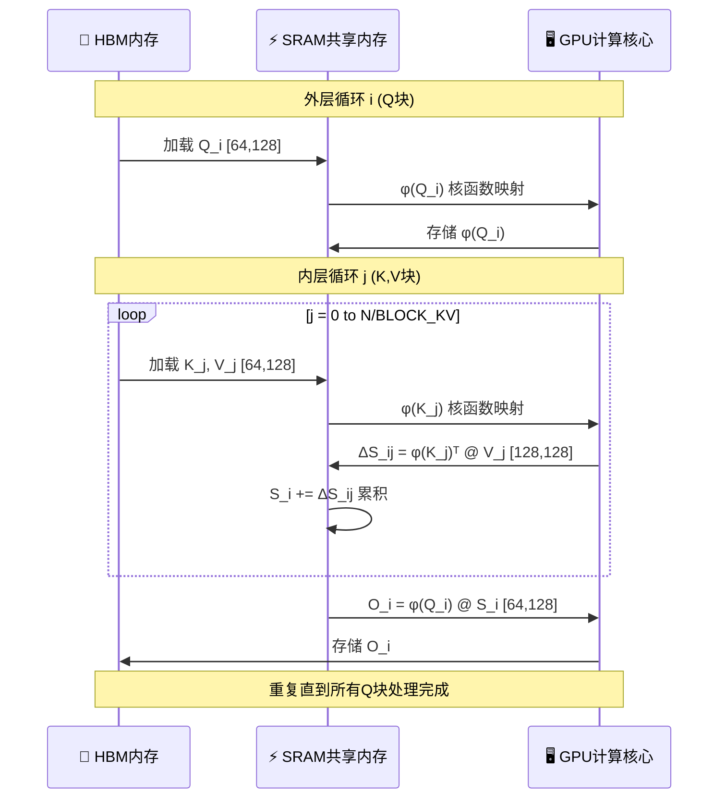
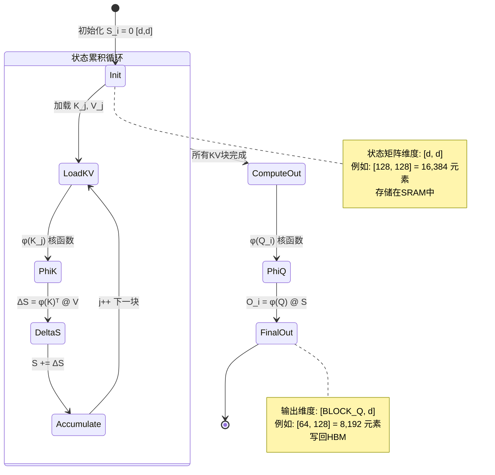
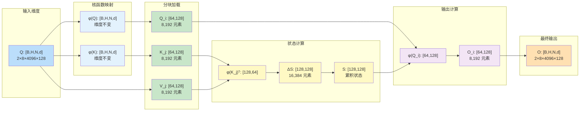
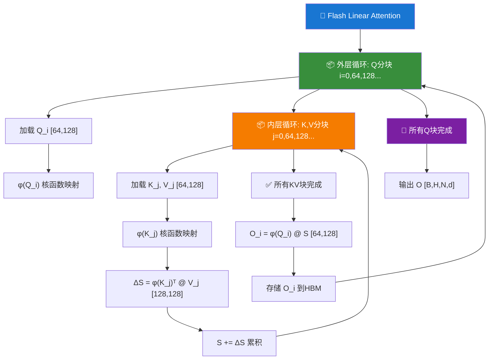
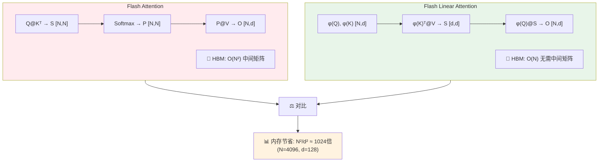
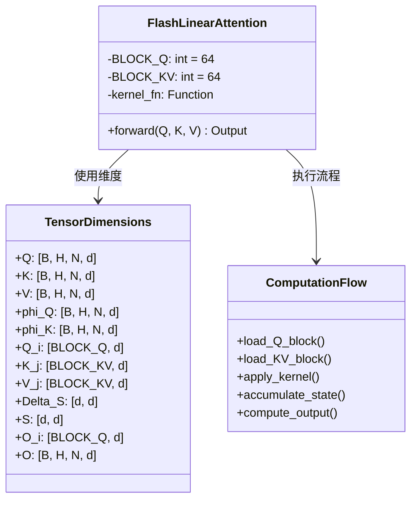

# Flash Linear Attention 多种可视化方案

以下是几种更专业的可视化方式，您可以根据使用场景选择：

---

## 方案一：Mermaid 流程图（算法整体流程）

```mermaid
flowchart TD
    subgraph Input["📥 输入张量 [B,H,N,d]"]
        Q[Q: Query]
        K[K: Key]
        V[V: Value]
    end
    
    subgraph Kernel["🔧 核函数映射 φ(·)"]
        phiQ[φ(Q): ELU+1 / ReLU+1]
        phiK[φ(K): 保证正值]
    end
    
    subgraph Block["🧱 分块处理"]
        QBlock["Q_i [BLOCK_Q, d]"]
        KBlock["K_j [BLOCK_KV, d]"]
        VBlock["V_j [BLOCK_KV, d]"]
    end
    
    subgraph State["📊 状态累积 [d,d]"]
        DeltaS["ΔS_ij = φ(K_j)ᵀ @ V_j"]
        Accum["S_i = Σ ΔS_ij"]
    end
    
    subgraph Output["📤 输出计算"]
        OutBlock["O_i = φ(Q_i) @ S_i"]
        Final["O: [B,H,N,d]"]
    end
    
    Input --> Kernel
    Kernel --> Block
    Block --> State
    State --> Output
    
    style Input fill:#e1f5ff
    style Kernel fill:#fff4e1
    style Block fill:#e8f5e9
    style State fill:#fce4ec
    style Output fill:#f3e5f5
```

---

## 方案二：Mermaid 序列图（计算时序）



---

## 方案三：Mermaid 状态图（状态累积过程）



---

## 方案四：维度变化矩阵图



---

## 方案五：循环嵌套结构图



---

## 方案六：内存层次对比图



---

## 方案七：完整伪代码 + 维度标注



---

## 各方案适用场景对比

| 方案 | 类型 | 最佳使用场景 | 优点 |
|------|------|-------------|------|
| **方案一** | 流程图 | 算法整体概览 | 清晰展示数据流向 |
| **方案二** | 序列图 | 计算时序理解 | 展示HBM/SRAM数据移动 |
| **方案三** | 状态图 | 状态累积过程 | 突出状态矩阵变化 |
| **方案四** | 维度图 | 维度变化追踪 | 每个步骤维度一目了然 |
| **方案五** | 循环图 | 嵌套结构理解 | 清晰展示循环层次 |
| **方案六** | 对比图 | 与Flash Attention对比 | 突出内存优势 |
| **方案七** | 类图 | 代码实现参考 | 接近实际代码结构 |

---

## 推荐使用方式

1. **技术文档/论文** → 方案一 + 方案四（流程+维度）
2. **教学演示** → 方案二 + 方案五（时序+循环）
3. **代码实现参考** → 方案七（类图结构）
4. **性能分析** → 方案六（内存对比）

您可以根据具体需求选择合适的可视化方案，或者组合使用多个方案来获得更全面的理解！