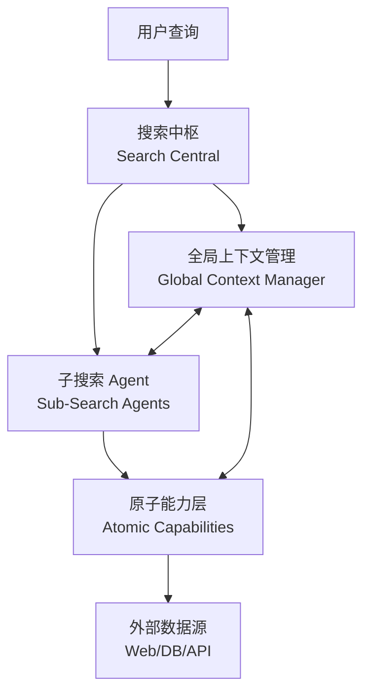

您提供的文档描述的是 **MOS（可能是某大模型 Agent 系统）的 OneSearch 架构**，这是一个面向专业场景的**统一信息获取 Agent**，与之前提到的快手 OneSearch（生成式电商搜索）是完全不同的系统。以下是基于文档内容的详细架构解析：

---

## 一、设计背景与核心挑战

### 1.1 现有通用 Agent 的局限
- **广度与深度不足**：通用 Agent 在信息收集的广度和深度、报告丰富性上远低于专业要求
- **Token 成本高昂**：复杂信息搜集和深度研究消耗巨大，注定只能面向专业人士（播客制作、行业调研、快速了解行业）
- **需求多样性**：实际工作中问题复杂多样，无法通过单一检索模式解决

### 1.2 需求分层模型
基于**搜索深度**与**搜索宽度**两个维度，将需求分为四类：

| 类型 | 特征 | 解决的问题 | 典型场景 |
|------|------|-----------|---------|
| **简单搜索** | 低宽度、低深度 | 事实性知识查询 | 常规检索任务 |
| **深度搜索** | 低宽度、高深度 | "我找不到" | 多步拆解和迭代（BrowseComp、GAIA 基准） |
| **广度搜索** | 高宽度、低深度 | "我能做但数据巨大" | 大规模信息收集（字节 WideSearch 基准） |
| **深度研究** | 高宽度、高深度 | "我写不好/不会写" | 复杂报告生成（Google DeepSearchQA） |

> **注**：业界过去集中在深度方面（DeepResearch 产品），但高宽度+高深度的结合（DeepWideSearch）才是真实工作场景的刚需。

---

## 二、OneSearch 整体架构：四层解耦设计

### 2.1 搜索中枢（Search Central）
**核心职能**：智能任务分发与策略规划
- **任务拆解**：基于语义与目标复杂度，将任务拆解为子任务
- **模式匹配**：为每个子任务匹配搜索模式（Simple/Wide/Deep）
- **工具推荐**：根据领域特征建议原子工具（如学术类需求推荐 Google Scholar）

### 2.2 子搜索 Agent（Sub-Search Agents）
三种核心搜索模式的实现体：

#### **SimpleSearch（简单搜索）**
- **定位**：处理常规搜索任务
- **特点**：区别于传统检索，包含 **Query CoT（思维链查询扩展）** 和有限并行检索
- **规模**：并行度可控，适合事实性知识快速获取

#### **WideSearch（广度搜索）**
- **定位**：大规模并行数据采集引擎
- **技术特征**：
  - **百级并发**：同时启动上百个节点并行处理子任务
  - **分层设计**：
    - **WideSearch**：标准广度探索
    - **SuperWideSearch**：超宽探索（并发节点数更多，探索深度更大）
- **适用**：行业全景扫描、竞品分析、大规模数据收集

#### **DeepSearch（深度搜索）**
- **定位**：解决相互依赖的迭代式搜索
- **技术特征**：
  - **动态策略调整**：根据中间结果调整检索策略
  - **原子能力编排**：灵活调用不同检索工具
  - **依赖管理**：处理任务间的先后依赖关系

### 2.3 全局上下文管理（Global Context Manager）
- **任务进度追踪**：记录各子任务执行状态
- **中间变量存储**：跨步骤信息一致性保障
- **结果聚合**：多源信息去重与融合

### 2.4 原子能力层（Atomic Capabilities）

| 类别 | 能力项 | 说明 |
|------|--------|------|
| **通用检索** | 夸克 H5 Chunk 检索 | 细粒度文本块检索 |
| | 夸克 H5 Doc 检索 | 完整文档检索 |
| **多模态** | 文本搜图 | 基于文本的图像检索 |
| | 生图 | 图像生成能力 |
| **垂直领域** | 学术搜索 | 集成 Google Scholar 等论文库 |
| | 财经数据 | 中国统计局等权威站点接口 |
| | 企业知识库 | 内部文档检索 |
| **浏览器能力** | Bing 搜索引擎模拟 | 模拟搜索行为 |
| | 动态网页获取 | 特定站点爬取，包装为 Workflow 简化工具 |
| **语义增强** | 意图识别 | 区分强/弱图搜需求 |
| | 跨模态融合 | 文本-图像联合检索 |
| | 可信度评估 | 检索结果质量评分 |

---

## 三、浏览器 Agent 的关键设计

### 3.1 类人交互模型（Eyes-Brain-Hands）
将浏览器 Agent 拟人化为三个模块：

| 模块 | 功能 | 技术实现 |
|------|------|----------|
| **Eyes（眼睛）** | 感知页面信息 | 网页截图、DOM 解析、可见文本提取 |
| **Brain（大脑）** | 决策下一步 Action | 大模型基于当前页面 + 历史操作记录推理 |
| **Hands（双手）** | 执行交互操作 | 点击元素、输入内容、滚动页面、跳转链接 |

### 3.2 工作流程
1. **观察**：获取当前页面截图/HTML 内容
2. **记忆**：结合历史操作记录（避免重复或死循环）
3. **规划**：大模型生成下一步操作指令（如"点击搜索框"、"输入关键词"）
4. **执行**：通过浏览器自动化工具（如 Playwright/Selenium）执行操作
5. **反馈**：获取新页面状态，循环直至任务完成

---

## 四、架构演进逻辑与最佳实践

### 4.1 演进路径
**多形态 Agent → 统一 OneSearch**
- **早期**：针对不同需求设计独立搜索模式（简单/深度/广度分开）
- **问题**：Plan 难度、迭代难度随业务扩展急剧提升
- **演进**：整合为多模态统一 Agent，通过中枢动态调度

### 4.2 设计最佳实践
1. **Agent as Tool**：构建强大的工具层，Agent 本身也可被其他 Agent 调用
2. **防基模替代**：确保功能无法被基础模型能力提升所简单替代（如特定领域搜索、浏览器操作）
3. **动态策略**：基于中间结果实时调整搜索策略，而非固定 Pipeline

---

## 五、与快手 OneSearch 的关键区别

| 维度 | MOS OneSearch（本文档） | 快手 OneSearch（前文） |
|------|------------------------|----------------------|
| **本质** | 多策略搜索 Agent 框架 | 端到端生成式检索模型 |
| **核心技术** | 分层规划 + 浏览器 Agent + 多模态检索 | 语义量化编码（KHQE）+ 生成式 SID |
| **应用场景** | 专业信息获取（研报、播客、调研） | 电商商品搜索 |
| **输出形式** | 结构化报告/数据收集 | 商品 SID 列表 |
| **架构范式** | Agentic Workflow（多组件协作） | Generative Retrieval（单模型端到端） |

MOS OneSearch 更侧重于**复杂任务的分解与执行**，通过分层解耦和多种搜索模式的动态组合，解决真实世界中广度与深度并重的信息获取需求。