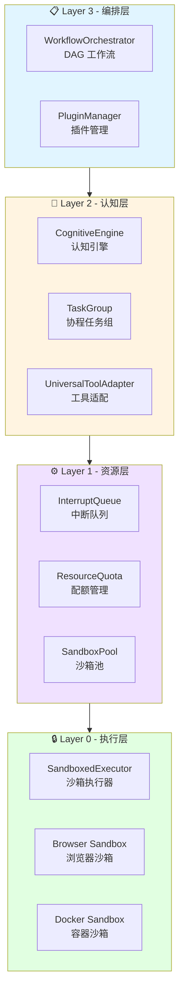
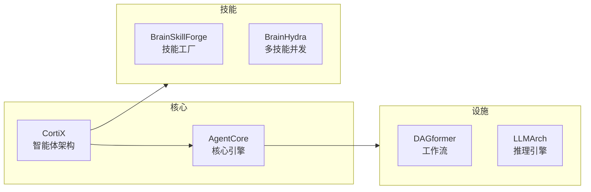

# My Notes

> 📚 个人架构设计文档 · 技术知识沉淀

---

## 🎯 关于

本仓库记录我的技术项目架构设计、工程实践与知识沉淀。

- **定位**：个人笔记 + 开源参考
- **许可**：[Apache-2.0](LICENSE)
- **状态**：持续更新中

---

## 📁 项目导航

```
mynotes/
├── CortiX/                    # 🧠 通用操作型智能体架构（核心项目）
│   ├── AgentCore/             # Agent 核心引擎 (AOS-Universal v3.0)
│   ├── AgentLoop/             # Agent 循环模块
│   ├── KnowledgeGraph/        # 知识图谱与记忆系统
│   ├── CppCortiX/             # C++ 实现方案
│   ├── Rust 方案/              # Rust 实现方案
│   ├── Security/              # 安全设计与沙箱
│   └── archive/               # 归档文档 (AgenticOS)
├── BrainSkillForge/           # 🔨 技能工厂 - 技能生成框架
├── BrainHydraSkill/           # 🐉 Hydra 多技能并发系统
├── DAGformer/                 # 📊 DAG 工作流编排器
└── LLMArch/                   # 🤖 LLM 推理与优化架构
```

---

## 🏗️ 核心架构：AOS-Universal v3.0



### 架构分层

| 层级 | 职责 | 核心模块 |
|------|------|---------|
| **Layer 3** | 工作流编排与插件管理 | WorkflowOrchestrator, PluginManager |
| **Layer 2** | 认知与任务调度 | CognitiveEngine, TaskGroup, UniversalToolAdapter |
| **Layer 1** | 资源管理与中断处理 | InterruptQueue, ResourceQuota, SandboxPool |
| **Layer 0** | 沙箱执行 | SandboxedExecutor, Browser/Docker Sandbox |

---

## 🚀 快速开始

### 新读者建议

1. **了解整体** → [`CortiX/AgentCore/README.md`](CortiX/AgentCore/README.md)
2. **架构设计** → [`CortiX/AgentCore/AOS-Browser 顶层设计 v3.0.md`](CortiX/AgentCore/AOS-Browser 顶层设计 v3.0.md)
3. **详细设计** → [`CortiX/AgentCore/AOS-Universal 详细设计.md`](CortiX/AgentCore/AOS-Universal 详细设计.md)

### 按主题

| 主题 | 文档 |
|------|------|
| 架构演进 | `浏览器智能体架构.md` → `AOS-Browser v1.0` → `v2.0` → `v3.0` |
| 沙箱设计 | `CDP 浏览器内核.md` + `AOS-Browser 工具接口 v1.1.md` |
| 工作流 | `DAGformer/` + `WorkflowOrchestrator` |
| 知识图谱 | `CortiX/KnowledgeGraph/` |
| 技能系统 | `BrainSkillForge/` + `BrainHydraSkill/` |

---

## 🔑 核心概念

| 概念 | 说明 |
|------|------|
| **KV Cache 摘要** | 轻量级注意力摘要 (<100MB)，加速崩溃恢复 30%+ |
| **Critical DOM Hash** | 关键 DOM 路径哈希，页面状态恢复校验 |
| **Tool Manifest** | 工具元数据契约，声明式定义能力/资源/安全 |
| **TaskGroup** | 协程任务组，支持 Fork/Join 语义 |

---

## 📊 项目关系



---

## 📝 说明

- 本仓库为**个人技术笔记**，同时作为**开源参考**
- 文档可能存在不完整或过时的内容，请以最新提交为准
- 欢迎参考借鉴，引用请注明来源
- Issue 和 PR 仅供参考讨论

---

## 🔗 链接

- **GitHub**: [@chisuhua](https://github.com/chisuhua)
- **外部依赖**: [llama.cpp](https://github.com/ggerganov/llama.cpp) · [Playwright](https://playwright.dev/) · [nlohmann/json](https://github.com/nlohmann/json)

---

> Last updated: 2026-03-23 | Maintained by @chisuhua
