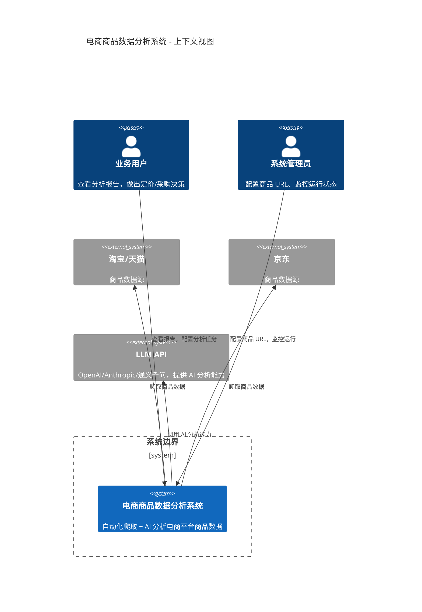
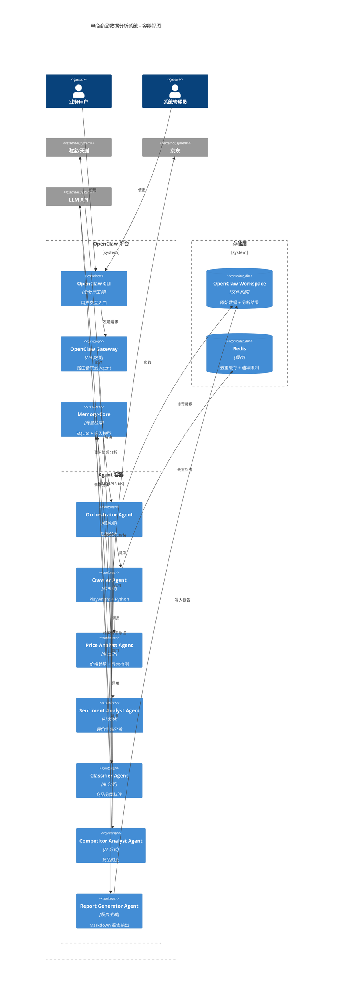
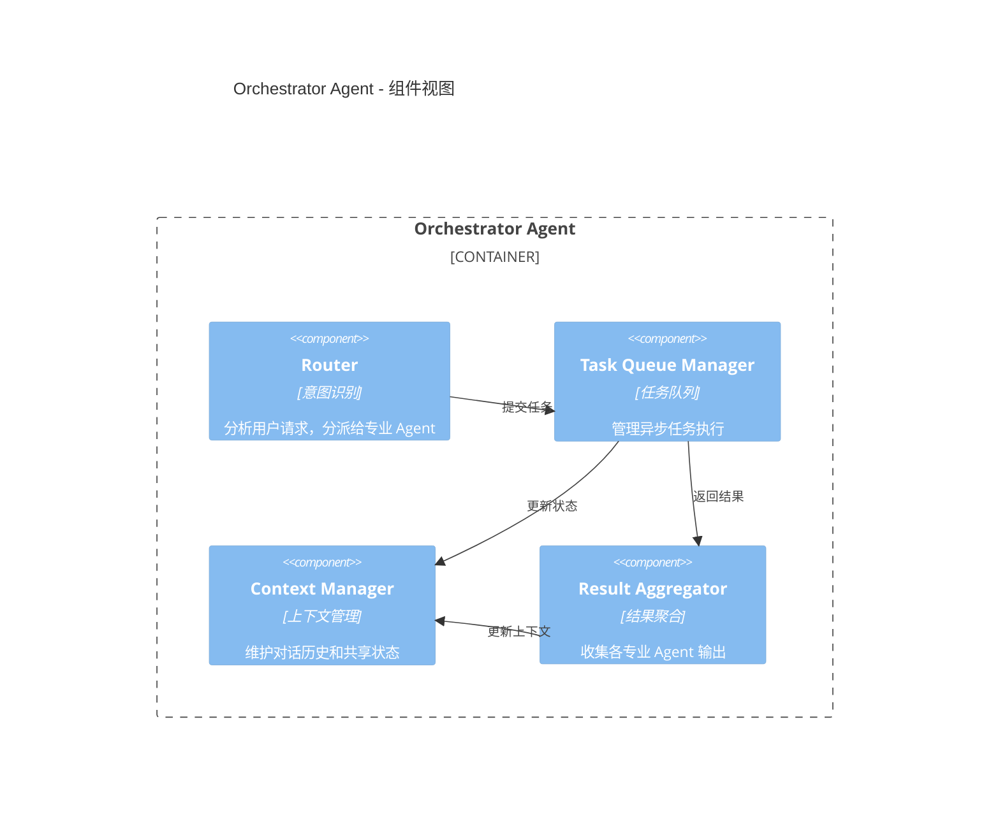
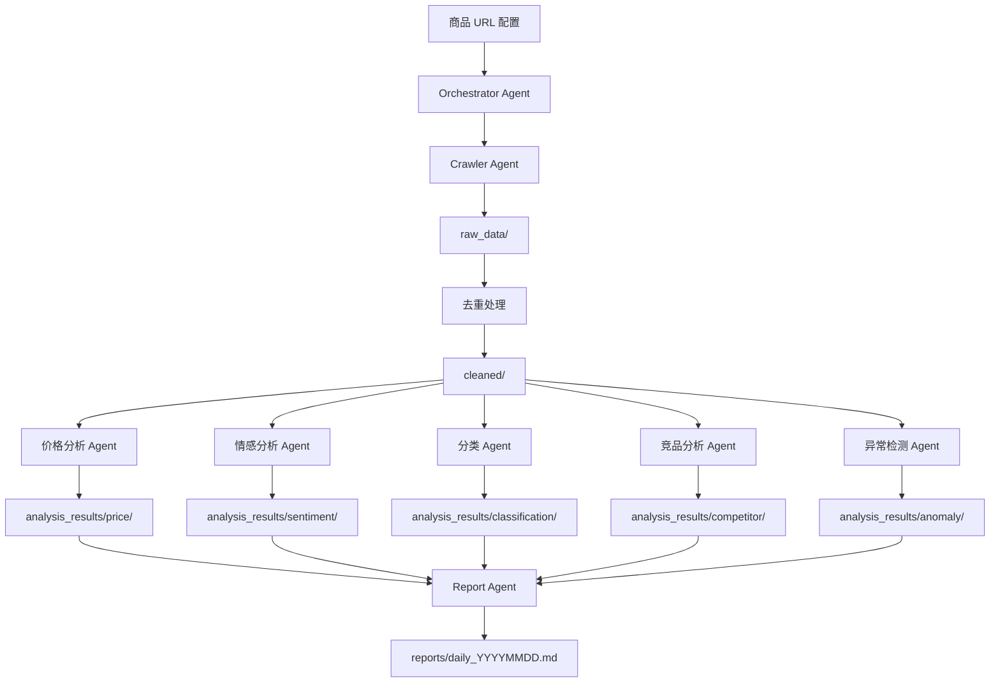

# 电商商品数据分析系统架构文档

| 属性 | 值 |
|------|-----|
| **版本** | 1.3.0 |
| **创建日期** | 2026-03-26 |
| **最后更新** | 2026-03-26 |
| **状态** | 已发布 |
| **作者** | OpenClaw Architecture Team |

---

## 变更记录

| 版本 | 日期 | 作者 | 变更描述 |
|------|------|------|---------|
| 1.3.0 | 2026-03-26 | OpenClaw Architecture Team | 错误处理策略分离为独立文档 |
| 1.2.0 | 2026-03-26 | OpenClaw Architecture Team | 主文档精简：移除部署/测试章节，移至专项文档 |
| 1.1.0 | 2026-03-26 | OpenClaw Architecture Team | 添加错误处理策略、测试策略 |
| 1.0.0 | 2026-03-26 | OpenClaw Architecture Team | 初始版本 |

---

## 1. 系统概述

### 1.1 愿景与目标

**愿景**：构建一个基于 OpenClaw 平台的自动化电商商品数据分析系统，实现淘宝/天猫、京东平台商品信息的智能爬取、存储和 AI 驱动的深度分析。

**核心目标**：
1. **自动化数据采集** — 每日自动爬取目标平台商品数据（价格、描述、评价）
2. **智能分析** — 通过多 Agent 协作完成价格趋势、情感分析、分类标注、竞品对比、异常检测
3. **可操作洞察** — 生成结构化报告，支持业务决策

**成功指标**：
- 日爬取能力：1-10 万商品
- 分析准确率：>85%（分类、情感）
- 报告生成时间：<30 分钟（万级商品）

### 1.2 设计原则

| 原则 | 说明 |
|------|------|
| **OpenClaw 原生** | 仅使用 OpenClaw 平台原生能力，不依赖外部项目 |
| **多 Agent 协作** | 通过 Router + Handoff 模式实现专业 Agent 分工 |
| **渐进式演进** | 前期本地运行，后期 Docker 容器化 |
| **数据驱动** | 所有分析结果可追溯、可验证 |
| **配置即代码** | Agent、Pipeline 全部通过配置文件定义 |

### 1.3 术语表

| 术语 | 定义 |
|------|------|
| **OpenClaw** | AI Agent 编排框架，提供多 Agent 协作、Tool 调用、Skill Pipeline 能力 |
| **Agent** | 具有特定职责的 AI 助手（如价格分析专家、情感分析专家） |
| **Skill** | OpenClaw 中的可执行任务单元，由 Agent 或脚本实现 |
| **Handoff** | Agent 间切换机制，继承对话上下文 |
| **Router Pattern** | 编排 Agent 分析意图并分派给专业 Agent 的模式 |
| **Workspace** | OpenClaw 工作区目录，存储 Agent 共享文件和数据 |
| **Memory-Core** | OpenClaw 内置向量检索模块，支持 RAG 能力 |

---

## 2. 架构决策记录 (ADR)

### ADR-001: 选择纯 OpenClaw 驱动架构

**日期**：2026-03-26

**背景**：
需要为电商商品数据分析系统选择技术架构。初始方案考虑了 AOS-Browser（浏览器自动化）和 BrainSkillForge（Agent DSL）等外部项目。

**决策**：
采用**纯 OpenClaw 驱动架构**，不依赖 AOS-Browser/BrainSkillForge 外部项目。

**理由**：
1. **降低复杂度** — 单一平台运维，无需跨项目集成
2. **快速启动** — OpenClaw 原生能力足够支撑中型规模（日爬取 1-10 万）
3. **配置驱动** — Agent、Pipeline 通过 JSON/YAML 配置，无需编写复杂 DSL
4. **生态一致** — 符合 OpenClaw 技能生态系统设计理念

**后果**：
- ✅ **正面**：开发周期从 3 周缩短至 2 周
- ✅ **正面**：维护成本降低，单一配置文件管理
- ⚠️ **负面**：受 OpenClaw 平台能力限制，超大规模需扩展

**状态**：✅ 已采纳

---

### ADR-002: 多 Agent 协作模式（Router + Handoff）

**日期**：2026-03-26

**背景**：
系统需要 5 种 AI 分析能力（价格趋势、情感分析、分类标注、竞品对比、异常检测）。需要决定如何组织这些能力。

**决策**：
采用**编排 Agent + 专业 Agent**的多层协作模式：
- 1 个编排 Agent（ecommerce-orchestrator）负责任务分派
- 5 个专业 Agent（price-analyst, sentiment-analyst, classifier-agent, competitor-analyst, anomaly-detector）
- 1 个报告 Agent（report-generator）负责输出

**协作机制**：
- **Router Pattern** — 编排 Agent 使用 `agent:invoke` 工具调用专业 Agent
- **Handoff** — 使用 `transfer_to_<agent>` 实现上下文继承切换

**理由**：
1. **职责分离** — 每个 Agent 专注单一领域，Prompt 更精准
2. **可复用** — 专业 Agent 可被多个 Pipeline 复用
3. **可观测** — 每个 Agent 的输出独立记录，便于调试

**后果**：
- ✅ **正面**：Agent 可独立优化和测试
- ✅ **正面**：支持并行执行（多个专业 Agent 同时分析）
- ⚠️ **负面**：需要维护多个 Agent 配置

**状态**：✅ 已采纳

---

### ADR-003: 数据存储策略（OpenClaw Workspace + SQLite）

**日期**：2026-03-26

**背景**：
需要存储爬取的商品数据、分析结果、向量索引。需要决定存储方案。

**决策**：
采用**分层存储策略**：
1. **原始数据** — Markdown + JSON 文件存储于 Workspace 目录
2. **分析结果** — Markdown 文件存储于 Workspace 目录
3. **向量索引** — 使用 OpenClaw Memory-Core（SQLite 后端）
4. **缓存** — Redis（可选，用于去重和速率限制）

**目录结构**：
```
~/.openclaw/ecommerce/
├── raw_data/              # 原始爬取数据
│   ├── taobao/
│   │   └── YYYY-MM-DD/
│   └── jd/
│       └── YYYY-MM-DD/
├── analysis_results/      # 分析结果
│   ├── price_trends/
│   ├── sentiment/
│   ├── classifications/
│   └── competitor/
├── reports/               # 生成的报告
│   ├── daily/
│   └── weekly/
├── memory/                # 向量索引（Memory-Core 自动管理）
└── config/                # 配置文件
    ├── product_urls.json  # 商品 URL 列表
    └── categories.yaml    # 分类体系
```

**理由**：
1. **OpenClaw 原生** — Workspace 是 OpenClaw 一等公民，Agent 天然支持
2. **可追溯** — 所有数据以文件形式存在，便于审计
3. **简单** — 无需额外数据库部署（前期）

**后果**：
- ✅ **正面**：零部署成本，开箱即用
- ✅ **正面**：文件即数据库，支持 Git 版本控制
- ⚠️ **负面**：大规模（>100 万商品）需迁移至 PostgreSQL

**状态**：✅ 已采纳

---

## 3. 系统视图 (C4 模型)

### 3.1 上下文视图 (C4 Level 1)



### 3.2 容器视图 (C4 Level 2)



### 3.3 组件视图 (C4 Level 3) — Orchestrator Agent



---

## 4. OpenClaw 配置详解

### 4.1 Agent 配置（`openclaw.json`）

```json
{
  "version": "1.0.0",
  "workspace": "~/.openclaw/ecommerce",
  
  "agents": {
    "ecommerce-orchestrator": {
      "description": "电商数据分析编排 Agent",
      "model": "qwen3.5-plus",
      "system_prompt": "你是电商数据分析编排器。你的职责是：\n1. 接收用户分析请求\n2. 调用 Crawler Agent 爬取最新数据\n3. 协调各专业 Agent 进行分析\n4. 调用 Report Agent 生成报告\n\n工作区：~/.openclaw/ecommerce",
      "tools": [
        "fs-read",
        "fs-write",
        "shell",
        "agent:invoke"
      ],
      "bindings": {
        "allowedPaths": ["~/.openclaw/ecommerce"]
      }
    },
    
    "crawler-agent": {
      "description": "电商爬虫 Agent",
      "model": "qwen3-max",
      "system_prompt": "你是电商爬虫专家。使用 Playwright 爬取淘宝/京东商品数据。\n\n输入：商品 URL 列表\n输出：JSON 格式商品数据（标题、价格、描述、评价）\n\n注意事项：\n1. 遵守 robots.txt\n2. 设置合理速率限制（1 请求/秒）\n3. 使用代理池避免封禁",
      "tools": [
        "fs-read",
        "fs-write",
        "shell",
        "python-interpreter"
      ]
    },
    
    "price-analyst": {
      "description": "价格趋势分析专家",
      "model": "qwen3.5-plus",
      "system_prompt": "你是价格分析专家。分析商品价格趋势，检测异常波动。\n\n分析维度：\n1. 历史价格走势（7 天/30 天/90 天）\n2. 异常价格检测（低于/高于均价 20%）\n3. 促销周期识别\n\n输出：Markdown 格式分析报告 + JSON 数据",
      "tools": [
        "fs-read",
        "fs-write",
        "python-interpreter",
        "memory-core"
      ]
    },
    
    "sentiment-analyst": {
      "description": "评价情感分析专家",
      "model": "qwen3.5-plus",
      "system_prompt": "你是情感分析专家。分析商品用户评价，输出情感评分。\n\n分析维度：\n1. 整体情感倾向（正面/中性/负面）\n2. 关键词提取（质量、物流、服务）\n3. 问题聚类（常见问题分类）\n\n输出：情感评分（0-1）+ 关键词列表 + 问题聚类报告",
      "tools": [
        "fs-read",
        "fs-write",
        "python-interpreter"
      ]
    },
    
    "classifier-agent": {
      "description": "商品分类标注专家",
      "model": "qwen3-max",
      "system_prompt": "你是商品分类专家。根据商品描述和图像，自动归类到预定义类目。\n\n分类体系参考：~/.openclaw/ecommerce/config/categories.yaml\n\n输出：一级类目 + 二级类目 + 标签列表",
      "tools": [
        "fs-read",
        "memory-core"
      ]
    },
    
    "competitor-analyst": {
      "description": "竞品对比分析专家",
      "model": "qwen3.5-plus",
      "system_prompt": "你是竞品分析专家。对比多个平台同类商品。\n\n分析维度：\n1. 价格对比（淘宝 vs 京东）\n2. 功能对比\n3. 评价对比\n\n输出：对比表格 + 竞争优势分析",
      "tools": [
        "fs-read",
        "fs-write",
        "python-interpreter",
        "memory-core"
      ]
    },
    
    "anomaly-detector": {
      "description": "异常检测专家",
      "model": "qwen3.5-plus",
      "system_prompt": "你是异常检测专家。识别商品价格、评价中的异常模式。\n\n检测类型：\n1. 价格异常（低于成本价、异常波动）\n2. 评价异常（刷评、水军）\n3. 库存异常（长期缺货）\n\n输出：异常列表 + 风险等级 + 建议行动",
      "tools": [
        "fs-read",
        "python-interpreter",
        "memory-core"
      ]
    },
    
    "report-generator": {
      "description": "报告生成专家",
      "model": "qwen3-max",
      "system_prompt": "你是报告生成专家。将分析结果整理为结构化 Markdown 报告。\n\n报告结构：\n1. 执行摘要\n2. 价格趋势\n3. 情感分析\n4. 分类统计\n5. 竞品对比\n6. 异常警报\n7. 建议行动\n\n输出：~/.openclaw/ecommerce/reports/daily_YYYYMMDD.md",
      "tools": [
        "fs-read",
        "fs-write",
        "markdown-formatter"
      ]
    }
  },
  
  "memory-core": {
    "enabled": true,
    "indexPath": "~/.openclaw/ecommerce/memory",
    "embeddingModel": "text-embedding-3-small",
    "chunkSize": 512,
    "overlap": 50
  }
}
```

### 4.2 Tool 配置

OpenClaw 提供以下原生工具：

| 工具名 | 用途 | 配置 |
|-------|------|------|
| `fs-read` | 读取文件 | 通过 `bindings.allowedPaths` 限制访问范围 |
| `fs-write` | 写入文件 | 同上 |
| `shell` | 执行 Shell 命令 | 可限制白名单命令 |
| `python-interpreter` | 执行 Python 代码 | 需安装 Python 环境 |
| `agent:invoke` | 调用其他 Agent | 无需配置 |
| `memory-core` | 向量检索 | 需配置 embedding 模型 |

### 4.3 执行方式

**方式一：通过编排 Agent 执行（⭐ 推荐）**

直接使用 OpenClaw 的 `chat` 命令调用编排 Agent：

```bash
# 执行完整流程
openclaw chat --agent ecommerce-orchestrator "执行每日商品分析流程"

# 或指定详细指令
openclaw chat --agent ecommerce-orchestrator "
  从配置文件读取商品 URL 列表，执行完整分析流程：
  1. 爬取淘宝/京东最新数据
  2. 数据去重
  3. 协调各专业 Agent 进行分析
  4. 生成每日分析报告
"
```

**方式二：通过 Shell 脚本执行（调试/测试用）**

如需更细粒度控制或调试，可使用提供的 Shell 脚本：

```bash
# 干运行（验证流程）
bash run-pipeline.sh --dry-run

# 实际运行
bash run-pipeline.sh
```

**方式三：Skill Pipeline 配置（可选，如 OpenClaw 版本支持）**

```yaml
# ~/.openclaw/skills/ecommerce-daily-analysis.yaml
name: ecommerce-daily-analysis
version: 1.0.0
description: 每日电商商品分析流水线

stages:
  - name: crawl
    description: 爬取淘宝/京东最新数据
    agent: ecommerce-orchestrator
    command: |
      openclaw chat --agent ecommerce-orchestrator "
        从配置文件读取商品 URL 列表，爬取最新数据
      "
    
  - name: analyze
    description: AI 分析
    agent: ecommerce-orchestrator
    command: |
      openclaw chat --agent ecommerce-orchestrator "
        协调各专业 Agent 进行分析：价格趋势、情感分析、分类标注、竞品对比、异常检测
      "
    
  - name: report
    description: 生成报告
    agent: report-generator
    command: |
      openclaw chat --agent report-generator "
        读取分析结果，生成每日分析报告
      "

schedule: "0 6 * * *"  # 每天早上 6 点执行
```

**执行命令**（如 OpenClaw 支持）：
```bash
# 查看可用 Skills
openclaw skills list

# 执行流水线
openclaw skills run ecommerce-daily-analysis
```

### 4.4 Memory-Core 配置

```json
{
  "memory-core": {
    "enabled": true,
    "indexPath": "~/.openclaw/ecommerce/memory",
    "embeddingModel": "text-embedding-3-small",
    "chunkSize": 512,
    "overlap": 50,
    "maxChunks": 10000,
    "similarityThreshold": 0.7
  }
}
```

---

## 5. 关键模块设计

### 5.1 爬虫模块

**职责**：爬取淘宝/京东商品数据

**技术实现**：
```python
# ~/.openclaw/ecommerce/scripts/crawler.py
import json
from playwright.sync_api import sync_playwright
from datetime import datetime

def crawl_taobao(url: str) -> dict:
    """爬取淘宝商品数据"""
    with sync_playwright() as p:
        browser = p.chromium.launch(headless=True)
        page = browser.new_page()
        
        # 设置 UA 和代理（避免封禁）
        page.set_extra_http_headers({
            "User-Agent": "Mozilla/5.0 (Windows NT 10.0; Win64; x64) ..."
        })
        
        page.goto(url, wait_until="networkidle")
        
        # 提取商品数据
        data = {
            "platform": "taobao",
            "url": url,
            "title": page.query_selector("#MainInfo h1").inner_text(),
            "price": page.query_selector(".price").inner_text(),
            "description": page.query_selector("#desc").inner_text(),
            "reviews": [],
            "crawl_time": datetime.now().isoformat()
        }
        
        # 提取评价
        review_elements = page.query_selector_all(".review-item")
        for el in review_elements[:50]:  # 最多 50 条评价
            data["reviews"].append({
                "content": el.query_selector(".text").inner_text(),
                "rating": int(el.query_selector(".rating").get_attribute("data-value")),
                "date": el.query_selector(".date").inner_text()
            })
        
        browser.close()
        return data

if __name__ == "__main__":
    import sys
    url = sys.argv[1]
    data = crawl_taobao(url)
    print(json.dumps(data, ensure_ascii=False, indent=2))
```

### 5.2 AI 多 Agent 协作

**协作流程**：

```
用户请求
    │
    ▼
┌─────────────────────────────┐
│  ecommerce-orchestrator     │
│  （编排 Agent）              │
│  1. 解析用户意图            │
│  2. 分派任务给专业 Agent    │
│  3. 聚合结果                │
└─────────────────────────────┘
    │
    ├─────────┬─────────┬─────────┬─────────┐
    ▼         ▼         ▼         ▼         ▼
┌───────┐ ┌───────┐ ┌───────┐ ┌───────┐ ┌───────┐
│价格分析│ │情感分析│ │分类标注│ │竞品对比│ │异常检测│
│Agent  │ │Agent  │ │Agent  │ │Agent  │ │Agent  │
└───────┘ └───────┘ └───────┘ └───────┘ └───────┘
    │         │         │         │         │
    └─────────┴─────────┴─────────┴─────────┘
                          │
                          ▼
                  ┌───────────────┐
                  │  Report Agent │
                  │  （报告生成）  │
                  └───────────────┘
```

### 5.3 数据流设计



---

### 5.4 错误处理策略

**详细文档**：[[ERROR-HANDLING-STRATEGY]](./ERROR-HANDLING-STRATEGY.md)

系统采用统一的错误处理框架，确保可靠性：

**错误分类**：
| 类型 | 定义 | 处理策略 |
|------|------|---------|
| **Transient** | 瞬时错误（网络抖动、临时限流） | 指数退避重试（最多 3 次） |
| **Permanent** | 永久错误（404、解析失败） | 记录日志，跳过继续 |
| **Systematic** | 系统性错误（API 配额耗尽） | 熔断器模式（15 分钟）+ 降级 |
| **Timeout** | 超时错误（>30s） | 重试（2 次）+ 回退 |

**核心机制**：
- **重试机制** — 指数退避（1s, 2s, 4s + 随机抖动）
- **熔断器模式** — CLOSED → OPEN → HALF_OPEN 状态机
- **降级策略** — LLM→缓存→简化分析 三级降级

**完整实现代码、配置参数、使用示例**详见：

👉 **[错误处理策略文档](./ERROR-HANDLING-STRATEGY.md)**

包括：
- 重试机制完整实现（Python 装饰器）
- 熔断器状态机 + 完整 Python 实现
- 降级策略代码示例
- 错误日志与告警配置
- 各模块错误处理应用指南

---

## 6. 部署指南

**详细文档**：[[DEPLOYMENT-GUIDE]](./DEPLOYMENT-GUIDE.md)（计划中）

部署与运维相关内容（Docker 容器化、定时任务配置等）将在独立的部署指南文档中提供。

---

## 7. 测试策略

**详细文档**：[[TESTING-STRATEGY]](./TESTING-STRATEGY.md)

测试相关内容（单元测试、集成测试、E2E 测试等）已在独立的测试策略文档中提供。

---

## 附录 A：商品 URL 配置示例

```json
// ~/.openclaw/ecommerce/config/product_urls.json
{
  "taobao": [
    "https://item.taobao.com/item.htm?id=123456789",
    "https://item.taobao.com/item.htm?id=987654321"
  ],
  "jd": [
    "https://item.jd.com/123456789.html",
    "https://item.jd.com/987654321.html"
  ]
}
```

---

## 附录 B：分类体系示例

```yaml
# ~/.openclaw/ecommerce/config/categories.yaml
categories:
  - name: "电子产品"
    code: "electronics"
    subcategories:
      - name: "手机"
        code: "mobile"
      - name: "电脑"
        code: "computer"
      - name: "平板"
        code: "tablet"
  
  - name: "服装"
    code: "clothing"
    subcategories:
      - name: "男装"
        code: "mens"
      - name: "女装"
        code: "womens"
  
  - name: "家居"
    code: "home"
    subcategories:
      - name: "家具"
        code: "furniture"
      - name: "家纺"
        code: "textile"
```

---

**文档结束**
